# خواننده تلگرام

<!-- TOP_NAV START -->

<a href="https://github.com/hosseinbaghi/aio-downloader/blob/main/telegram/content/archive_1.md" style="display:inline-block; padding:6px 12px; margin:0 4px; background-color:#2ea44f; color:white; text-decoration:none; border-radius:4px; font-weight:bold;">صفحه بعد</a>

<!-- TOP_NAV END -->

<!-- MSG START -->

---
📅 بروزرسانی: 1405/02/31 15:48
---

## VahidOOnLine — post 241323

  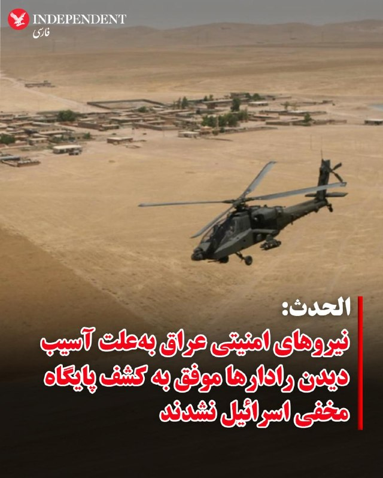

♦️شبکه خبری الحدث عربستان سعودی روز پنجشنبه به نقل از منابع عراقی گزارش کرد که نیروهای امنیتی این کشور به‌دلیل آسیب دیدن سامانه‌های راداری موفق نشدند که پایگاه مخفی «منتسب» به اسرائیل را در صحرای النخیب این کشور شناسایی کنند.

نیویورک‌تایمز هفته گذشته برای نخستین بار از جود یک پایگاه مخفی ارتش اسرائیل در خاک عراق خبر داد. پایگاهی که قرار بوده در جنگ آمریکا و اسرائیل به‌عنوان مرکز پشتیبانی و ورود در عملیات احتمالی نجات از آن استفاده شود.

براساس گزارش الحدث، چوپانی که برای نخستین بار مشاهده تحرکات «مشکوک» را به مقام‌ها گزارش کرده بود گفته است که با پنج نیروی مسلح روبه‌رو و به مرگ تهدید شده بوده است.

الحدث همچنین گزارش کرده که هواپیماهای شناسایی عراق از ترس حمله، مجبور شده بودند در زمان عملیات شناسایی، رادارهای خود را خاموش کنند.
‌🇸🇦 Indypersian

🤖 @VahidOOnLine

## VahidOOnLine — post 241322

  <a href="telegram/content/VahidOOnLine_241322_1779365923.mp4" target="_blank">🎬 Download video</a>

♦️رسانه‌های محلی روسیه روز پنجشنبه ۳۱ اردیبهشت ماه گزارش دادند که پهپادهای اوکراینی پالایشگاه نفت «سیزران» متعلق به شرکت روس‌نفت را در منطقه سامارای روسیه هدف قرار دادند.
تصاویر منتشرشده در شبکه‌های اجتماعی، شعله‌های گسترده و آتش‌سوزی در این تاسیسات نفتی را نشان می‌دهد.

این حمله در ادامه تشدید حملات پهپادی اوکراین به زیرساخت‌های انرژی و پالایشگاهی روسیه و در حالی انجام شده است که چشم‌انداز پایان جنگ پس از چهار سال همچنان مبهم به نظر می‌رسد.

 کی‌یف این حملات را بخشی از راهبرد تضعیف توان لجستیکی و اقتصادی مسکو در جنگ و وادار کردن روسیه به پذیرش آتش‌بس توصیف می‌کند.
‌🇸🇦 Indypersian

🤖 @VahidOOnLine

## VahidOOnLine — post 241321

  <a href="telegram/content/VahidOOnLine_241321_1779365925.mp4" target="_blank">🎬 Download video</a>

ویدیوی ارسالی به ایران اینترنشنال نشان می‌دهد که ۳۱ اردیبهشت‌ماه گروهی از دانش‌آموزان با بر زمین نشستن و تحصن جلوی ساختمان استانداری در شهرکرد، شعارهایی چون «امتحان حضوری نمی‌خواهیم» و «حمایت، حمایت» سردادند.
‌🏁 🇬🇧 IranintlTV

🤖 @VahidOOnLine

## VahidOOnLine — post 241320

♦️کوین اسپیسی، بازیگر آمریکایی، در هفتادونهمین جشنواره فیلم کن روی فرش قرمز حاضر شد. این بازیگر مطرح هالیوودی پس از اتهام‌های گسترده آزار جنسی تا حد زیادی از صحنه سینما و انظار عمومی دور مانده بود.
اسپیسی ۶۶ ساله در مراسم نمایش فیلم «دوگل» در کن دیده شد و بار دیگر توجه رسانه‌ها و عکاسان را به خود جلب کرد.
این بازیگر برنده اسکار به دلیل اتهام‌های سورفتار و آزار جنسی با کاهش چشمگیر حضور حرفه‌ای در پروژه‌های سینمایی و تلویزیونی مواجه شده بود.
‌🇸🇦 Indypersian

🤖 @VahidOOnLine

## VahidOOnLine — post 241319

  

♦️دقایقی پس از آنکه خبرگزاری رویترز به نقل از مقام‌های جمهوری اسلامی گزارش کرد که مجتبی خامنه‌ای دستور داده است تا اورانیوم به‌شدت غنی‌شده از ایران خارج نشود، بهای نفت در بازارهای جهانی نزدیک به دو دلار افزایش یافت.

قیمت هر بشکه نفت خام برنت دریای شمال بعدازظهر پنجشنبه ۳۱ اردیبهشت‌ماه در بازارهای اروپایی از ۱۰۵ دلار به بیش از ۱۰۷ دلار افزایش یافت.
‌🇸🇦 Indypersian

🤖 @VahidOOnLine

## VahidOOnLine — post 241318

  <a href="telegram/content/VahidOOnLine_241318_1779365927.mp4" target="_blank">🎬 Download video</a>

ویدیوی رسیده به ایران اینترنشنال نشان می‌دهد که شامگاه ۳۱ اردیبهشت در شهر دهلران استان ایلام، گروهی با در دست داشتن پرچم جمهوری اسلامی و بیرق‌های مذهبی، موسیقیِ باکلام عربی را با صدای بلند در خیابان پخش می‌کنند. فرستنده ویدیو گفت: «مزاحمت‌های شبانه طرفداران حکومت، تمامی ندارد.»
‌🏁 🇬🇧 IranintlTV

🤖 @VahidOOnLine

## VahidOOnLine — post 241317

  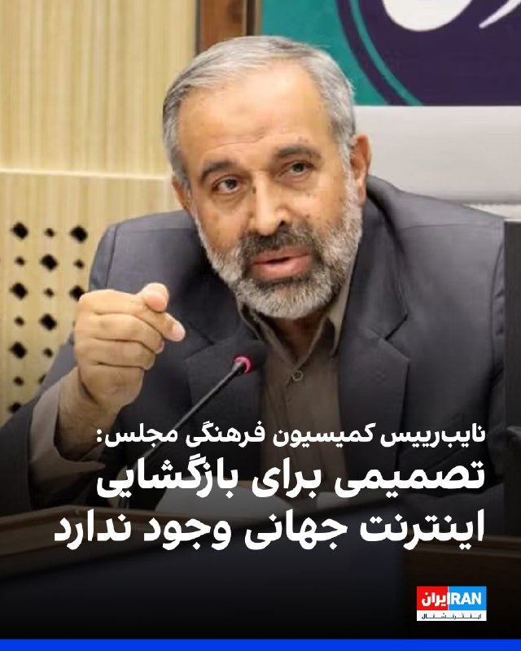

علی یزدی‌خواه، نایب‌رییس کمیسیون فرهنگی مجلس، گفت در شرایط فعلی تصمیمی برای بازگشایی اینترنت جهانی وجود ندارد و محدودیت‌ها با «ملاحظات امنیتی» ادامه خواهد داشت.

یزدی‌خواه قطع اینترنت جهانی را به مصوبات شورای عالی امنیت ملی نسبت داد و گفت این تصمیم به‌دلیل «مسائل امنیتی، امنیت کشور و حفظ جان افراد» گرفته شده است.

با وجود اینکه نت‌بلاکس اعلام کرده خاموشی اینترنت در ایران وارد هشتادوسومین روز خود شده، یزدی‌خواه گفت بیش از ۹۰ درصد نیازهای مردم در وضعیت فعلی برآورده می‌شود و مراجعات گسترده‌ای در اعتراض به قطع اینترنت وجود ندارد.

او همچنین گفت در قالب طرح موسوم به «اینترنت پرو»، تاکنون بیش از یک میلیون نفر دسترسی دریافت کرده‌اند؛ طرحی که منتقدان آن را مصداق اینترنت طبقاتی و تبعیض‌آمیز می‌دانند، زیرا دسترسی به اینترنت جهانی را به گروه‌های خاص محدود می‌کند و شهروندان عادی را از حق برابر دسترسی آزاد به اینترنت محروم نگه می‌دارد.

نایب‌رییس کمیسیون فرهنگی مجلس همچنین گفت شرکت‌های صادرات و واردات، مراکز علمی و پژوهشی، آزمایشگاه‌ها و برخی اصناف در صورت نیاز می‌توانند برای دسترسی به اینترنت بین‌الملل اقدام کنند.
https
‌🏁 🇬🇧 IranintlTV

🤖 @VahidOOnLine

## VahidOOnLine — post 241316

  <a href="telegram/content/VahidOOnLine_241316_1779365930.mp4" target="_blank">🎬 Download video</a>

ویدیوهای رسیده به ایران اینترنشنال نشان می‌دهد که ۳۱ اردیبهشت در شهرکرد، گروهی از دانش‌آموزان معترض به برگزاری حضوری امتحان‌ها ضمن تلاش برای پاسخگو کردن مسئولان مربوط، شعار «دانش‌آموز داد بزن، حقتو فریاد بزن» سردادند.
‌🏁 🇬🇧 IranintlTV

🤖 @VahidOOnLine

## VahidOOnLine — post 241315

  

نت‌بلاکس، نهاد ناظر بر اینترنت، نوشت که داده‌های این نهاد نشان می‌دهد قطعی اینترنت در ایران وارد هشتادوسومین روز خود شده و شبکه‌های بین‌المللی بیش از هزار و ۹۶۸ ساعت است که به‌طور گسترده مسدود مانده‌اند.

این نهاد ناظر بر اینترنت با تاکید بر اهمیت دسترسی آزاد به اینترنت نوشت: «اینترنت آزاد و باز، برای حفاظت از جان، آزادی و پاسخگویی عمومی نقشی اساسی دارد.»
‌🏁 🇬🇧 IranintlTV

🤖 @VahidOOnLine

## VahidOOnLine — post 241314

  

♦️خبرگزاری رویترز روز پنجشنبه ۳۱ اردیبهشت ماه به نقل از دو مقام ارشد جمهوری اسلامی گزارش کرد که مجتبی خامنه‌ای، رهبر حکومت ایران دستور داده است که ذخایر اورانیوم با غنای بالا (نزدیک به اورانیوم مورد نیاز برای ساخت سلاح هسته‌ای) در خاک ایران باقی بماند.

این خبر در حالی منتشر می‌شود که مساله ذخایر بیش از ۴۰۰ کیلوگرم اورانیوم ۶۰ درصد غنی شده، چالش اساسی در مذاکرات میان جمهوری اسلامی و آمریکا برای پایان جنگ به شمار می‌رود.
‌🇸🇦 Indypersian

🤖 @VahidOOnLine

## VahidOOnLine — post 241313

  

♦️بر اساس گزارشی از رویترز دولت آمریکا قصد دارد به تشکیلات فلسطینی هشدار دهد که در صورت نامزدی ریاض منصور، نماینده فلسطین در سازمان ملل، برای سمت نایب‌رئیسی مجمع عمومی، ممکن است ویزای اعضای هیئت فلسطینی لغو شود.
این موضوع در یک تلگرام داخلی وزارت خارجه آمریکا مطرح شده که به رسانه‌ها درز کرده است. بر اساس این سند که روز چهارشنبه تنظیم شده به دیپلمات‌های آمریکایی در سفارت این کشور در اورشلیم دستور داده شده پیام واشنگتن را به مقام‌های فلسطینی منتقل کنند. در این پیام آمده است که نامزدی منصور برای این سمت «تنش‌ها را افزایش می‌دهد» و می‌تواند طرح صلح غزه دولت دونالد ترامپ را تضعیف کند.
در بخشی از این تلگرام آمده است: «برای روشن شدن موضوع، اگر هیئت فلسطینی نامزدی خود برای نایب‌رئیسی مجمع عمومی را پس نگیرد، ما تشکیلات خودگردان فلسطین را مسئول خواهیم دانست.»
دولت ترامپ سال گذشته نیز از صدور ویزا برای محمود عباس، رئیس تشکیلات خودگردان فلسطین، و هیئت همراه او برای شرکت در نشست مجمع عمومی سازمان ملل خودداری کرده بود. این تصمیم در اعتراض به برنامه فلسطینی‌ها برای شرکت در نشستی با محوریت راه‌حل دو کشوری و به رسمیت شناختن یک‌جانبه کشور فلسطین اتخاذ شد؛ اقدامی که معمولا در سیاست خارجی آمریکا برای دشمنان سرسخت واشنگتن به کار گرفته می‌شود.
در سند جدید وزارت خارجه آمریکا همچنین آمده است: «مایه تاسف خواهد بود اگر ناچار شویم بار دیگر گزینه‌های موجود را بررسی کنیم.»
بر اساس این تلگرام، ریاض منصور پیش‌تر در ماه فوریه و در پی فشارهای آمریکا، از نامزدی برای ریاست مجمع عمومی سازمان ملل انصراف داده بود. با این حال، مقام‌های آمریکایی نگران‌اند که در صورت انتخاب او به‌عنوان نایب‌رئیس مجمع عمومی، امکان ریاست بر برخی جلسات این نهاد برای او فراهم شود.

در سند وزارت خارجه آمریکا آمده است: «همچنان این خطر وجود دارد که فلسطینی‌ها در جریان هشتاد و یکمین نشست مجمع عمومی سازمان ملل ریاست برخی جلسات را بر عهده بگیرند، مگر آنکه از رقابت کنار بکشند.»

انتخابات رئیس مجمع عمومی سازمان ملل و ۱۶ نایب‌رئیس آن قرار است روز دوم ژوئن برگزار شود.

تشکیلات خودگردان فلسطین که در سازمان ملل با عنوان رسمی «دولت فلسطین» نمایندگی دارد، عضو کامل سازمان ملل نیست و در مجمع عمومی ۱۹۳ عضوی این سازمان حق رای ندارد. فلسطین در سازمان ملل جایگاه «کشور ناظر» دارد؛ جایگاهی مشابه واتیکان.
‌🇸🇦 Indypersian

🤖 @VahidOOnLine

## VahidOOnLine — post 241312

  

♦️زمین‌لرزه‌ای به بزرگی ۴.۶ عصر پنجشنبه ۳۱ اردیبهشت بندرعباس و مناطقی از استان هرمزگان را لرزاند.

خبرگزاررکنا گزارش کرد این زلزله ساعت ۱۳:۲۶ در عمق ۲۰ کیلومتری زمین حوالی درگهان قشم را هم لرزانده است و تیم عملیاتی هلال‌احمر جهت ارزیابی خسارات احتمالی به منطقه اعزام شد.
‌🇸🇦 Indypersian

🤖 @VahidOOnLine

## VahidOOnLine — post 241311

  

فداحسین مالکی، عضو کمیسیون امنیت ملی مجلس، با تمجید از اقدامات نیروهای مسلح جمهوری اسلامی در جریان جنگ گفت سران واشینگتن تصور می‌کردند در ایران نیز پیروز خواهند شد، اما «در این میدان به معنای واقعی کلمه میخکوب شدند».

او گفت: «سران واشینگتن که پس از وقایع ونزوئلا دچار غرور و سرمستی سیاسی شده بودند، تصور می‌کردند در حمله به ایران نیز پیروز خواهند بود؛ اما در این میدان به معنای واقعی کلمه میخکوب شدند.»

مالکی همچنین درباره احتمال توافق با آمریکا با میانجی‌گری پاکستان گفت پاکستانی‌ها «حسن نیت» دارند و برای انجام این میانجی‌گری تلاش می‌کنند.

او افزود: «احتمال می‌دهم رفاقتی که عاصم منیر با ترامپ دارد، او را وادار کند شروط را بپذیرد؛ از جمله این‌که وارد تنگه هرمز نشود، وارد غنی‌سازی نشود، خسارت ما را بدهد و پول‌های بلوکه‌شده را آزاد کند.»
‌🏁 🇬🇧 IranintlTV

🤖 @VahidOOnLine

## VahidOOnLine — post 241310

  <a href="telegram/content/VahidOOnLine_241310_1779365935.mp4" target="_blank">🎬 Download video</a>

ویدیوی ارسالی به ایران اینترنشنال نشان‌ می‌دهد که ۳۱ اردیبهشت در حوالی روستای سَلَخ شهرستان قشم استان هرمزگان، صف بنزین در کنار جاده ادامه پیدا کرده است. به گفته ساکنان منطقه، مردم این روستا با کمبود سوخت روبرو شده‌اند.
‌🏁 🇬🇧 IranintlTV

🤖 @VahidOOnLine

## VahidOOnLine — post 241309

  <a href="telegram/content/VahidOOnLine_241309_1779365937.mp4" target="_blank">🎬 Download video</a>

بر اساس ویدیو و گزارش‌های رسیده به ایران اینترنشنال شماری از دانش‌آموزان و خانواده‌های آنان در شهرکرد، صبح پنجشنبه ٢١ اردیبهشت برای اعتراض به حضوری شدن امتحانات جلوی ساختمان استانداری چهارمحال و بختیاری تجمع کرده و شعار سردادند.
‌🏁 🇬🇧 IranintlTV

🤖 @VahidOOnLine

## VahidOOnLine — post 241308

  

♦️خبرگزاری ایسنا روز پنجشنبه ۳۱ اردیبهشت ماه با انتشار خبری در تلگرام نوشت جمهوری اسلامی ایران «در حال پاسخ به متن ارسالی آمریکا است.»

ایسنا منبع این خبر را ذکر نکرده است. با این حال خبرگزاری رویترز پس از دقایقی همین خبر را منتشر کرد و بسیاری از رسانه‌ها هم آن را گزارش کردند.

براساس خبر ایسنا، ایران در پاسخ به متن آمریکا در حال تدوین چارچوب کلان، برخی جزییات و اقدامات اعتمادساز به عنوان تضمین است.

ایسنا نوشته است «متن ارسالی به میزانی شکاف‌ها را کم کرده است اما کمتر شدن شکاف‌ها نیازمند پایان یافتن وسوسه جنگ در سمت واشنگتن است.»

 ایسنا درباره سفر رئیس ستاد کل ارتش پاکستان به ایران نوشته است: «ورود ژنرال عاصم منیر به تهران، به منظور کم کردن این شکاف‌ها و رسیدن به لحظه اعلام رسمی پذیرش یادداشت تفاهم است.»

الجزیره دقایقی پس از انتشار این خبر به نقل از یک منبع دولت پاکستان گزارش کرد که سفر ژنرال عاصم منیر به تهران مشروط به نتایج مذاکرات وزیر کشور پاکستان با مقام‌های جمهوری اسلامی است.
‌🇸🇦 Indypersian

🤖 @VahidOOnLine

## VahidOOnLine — post 241307

  <a href="telegram/content/VahidOOnLine_241307_1779365940.mp4" target="_blank">🎬 Download video</a>

بر پایه گزارش رسانه‌های حکومتی، ۲۰ ملوان ایرانی که کشتی‌شان در آب‌های سنگاپور توقیف شده بود و در «وضعیت نامناسبی» قرار داشتند، ساعتی پیش به ایران بازگشتند.
سفیر جمهوری‌اسلامی در پاکستان با قدردانی از دولت پاکستان اعلام کرد این ملوانان پس از پیگیری‌های دیپلماتیک و با همکاری مقام‌های پاکستانی، از سنگاپور به اسلام‌آباد منتقل شدند و سپس به کشور بازگشتند.
او از نقش نخست‌وزیر پاکستان، وزارت خارجه و دیگر نهادهای این کشور در آزادی و انتقال ملوانان ایرانی تشکر کرد.
‌🏁 🇬🇧 ManotoTV

🤖 @VahidOOnLine

## VahidOOnLine — post 241306

  <a href="telegram/content/VahidOOnLine_241306_1779365940.mp4" target="_blank">🎬 Download video</a>

بریتانیا از توافق تجاری ۵ میلیارد دلاری با کشورهای خلیج فارس رونمایی کرد؛ توافقی که در بحبوحه تنش‌های منطقه‌ای پس از جنگ ایران، به گفته لندن «پیامی از ثبات و اعتماد» به بازارها می‌دهد.
این توافق با شورای همکاری خلیج فارس شامل عربستان، امارات، قطر، کویت، عمان و بحرین است و قرار است سالانه حدود ۳.۷ میلیارد پوند به اقتصاد بریتانیا اضافه کند.
لندن می‌گوید ۹۳ درصد تعرفه‌های کشورهای خلیج فارس برای کالاهای بریتانیایی حذف می‌شود؛ از جمله محصولات غذایی، خودرو، صنایع هوافضا و الکترونیک.
در مقابل، بریتانیا نیز برخی تعرفه‌ها را کاهش می‌دهد، هرچند نفت و گاز کشورهای عربی پیش‌تر هم بدون تعرفه وارد بریتانیا می‌شد.
فعالان حقوق بشر از نبود بندهای الزام‌آور درباره حقوق بشر در این توافق انتقاد کرده‌اند و آن را «عقب‌گرد اخلاقی» توصیف کردند.
‌🏁 🇬🇧 ManotoTV

🤖 @VahidOOnLine

## VahidOOnLine — post 241305

  <a href="telegram/content/VahidOOnLine_241305_1779365941.mp4" target="_blank">🎬 Download video</a>

♦️خبرگزاری اسپوتنیک روسیه، روز پنجشنبه ۳۱ اردیبهشت ماه، تصویری از ورود اعضای تیم ملی فوتبال مردان ایران به سفارت آمریکا در آنکارا منتشر کرد.
تیم ملی فوتبال ایران که برای اردوای آمادگی پیش از جام‌جهانی فوتبال ۲۰۲۶ در ترکیه به سر می‌برد، سرانجام برای دریافت ویزا به سفارت آمریکا مراجعه کرد.
پیش‌تر مهدی تاج با اعلام آنکه تیم ملی فوتبال مردان ایران «قطعا» در جام‌جهانی شرکت می‌کند، گفته بود هنوز هیچ ویزایی برای حضور تیم ملی در رقابت‌های جام جهانی در ایالات متحده صادر نشده است.
مقام‌های ورزشی ایران در روزهای گذشته برای برگزاری مسابقات در کشور آمریکا، جلساتی را با مقام‌های فیفا برگزار کرده‌اند.
‌🇸🇦 Indypersian

🤖 @VahidOOnLine

## VahidOOnLine — post 241304

  <a href="telegram/content/VahidOOnLine_241304_1779365944.mp4" target="_blank">🎬 Download video</a>

♦️تصاویری که صفحه «اسرائیل به فارسی» روز پنجشنبه ۳۱ اردیبهشت در شبکه‌های اجتماعی منتشر کرده نشان می‌دهد، پرچم ملی شیروخورشید نشان ایران در کنار پرچم سایر کشورها در یکی از خیابان‌های شهر اشدود اسرائیل به اهتزاز درآمده است.
‌🇸🇦 Indypersian

🤖 @VahidOOnLine

## WithYashar — post 11835

منابع اسرائیلی به رویترز:
ترامپ به اسرائیل قول داد که اورانیوم غنی‌شده از ایران خارج شود و هر توافق احتمالی شامل این بند خواهد بود!
@withyashar

## WithYashar — post 11834

یزدی خواه: اینترنت جهانی فعلاً بازگشایی نمی‌شود/ دسترسی ویژه برای گروه‌های موردنیاز برقرار است
@withyashar

## WithYashar — post 11833

@withyashar

## WithYashar — post 11832

رویترز: رهبر ایران دستور داده است که اورانیوم با درجه نزدیک به تولید سلاح باید در ایران باقی بماند
@withyashar

## WithYashar — post 11831

ادعای اندیشکده آمریکایی: طبق ارزیابی کارشناسان، وحیدی و اعضای حلقه نزدیک او کنترل نه‌تنها پاسخ نظامی ایران در این درگیری، بلکه سیاست‌های مذاکراتی تهران را نیز در دست گرفته‌اند.
@withyashar
من دو هفته پیش در این ویدیو به این مسئله اشاره کردم
https://www.instagram.com/reel/DYIY6lnxd_R/?igsh=bjlqYWRvcDZ5NHIz

## WithYashar — post 11830

وزیر کشور پاکستان با احمد وحیدی، فرمانده سپاه پاسداران در تهران دیدار کرد. @withyashar یکی اینو آخرش از سولاخ کشید بیرون دیگه مابقی با موساده 😅

## WithYashar — post 11829

تایمز اسرائیل: ایران در جریان آتش‌بس از فرصت برای جابه‌جایی لانچرهای موشکی و آماده‌سازی برای دور جدید درگیری استفاده کرده
@withyashar

## WithYashar — post 11828

روسیه: ایران به تنهایی باید در مورد سرنوشت ذخایر اورانیوم خود تصمیم بگیرد.
@withyashar

## WithYashar — post 11827

گزارش های تایید نشده از ۳ انفجار در بندر عباس و قشم
@withyashar

## WithYashar — post 11826

همکنون زلزله در بندر عباس
@withyashar
مرحله بعدی زامبی و گودزیلا است

## WithYashar — post 11825

‏علی قلهکی : آمریکایی‌ها پس از دریافت نظراتِ ایران، پیشنهاد کرده‌اند که «پایانِ جنگ در تمامیِ جبهه‌ها»، «رفع محاصره تنگه هرمز توسط آمریکا»، «بازشدن تنگه هرمز توسط ایران با تعرفه و مسیر دریایی مدنظر ایران»، «آزادسازی ۲۵٪ از اموال بلوکه شده ایران _حدود ۲۵ میلیارد دلار»، «معافیتِ فروشِ نفت ایران به مدت ۳۰روز» و فازِ اصلیِ مذاکره یعنی «خروجِ ۴۰۰ کیلو اورانیوم از ایران _در بهترین حالت ارسال به کشور ثالث_» و «قبولِ حقِ غنی‌سازی ۳.۶۷ ٪ برای ایران (بعید است در فاز نهایی آمریکا آن را بپذیرد)» و «تعطیلی مراکز هسته‌ای _منهای راکتورِ تهران صرفا با کاربرد پزشکی) به طور یکجا توسط ایران امضا شود!
‏ایران می‌گوید تمام فازهای پیشنهادی آمریکا برای راستی‌آزمایی به مدت ۳۰ روز انجام شود تا هم ایران نفت خود را بفروشد و هم‌مُجاب شود در بحث هسته‌ای مذاکره را انجام دهد!
‏پی‌نوشت: ۱. اختلاف جدی بَر سَرِ مباحث هسته‌ای است؛ «۴۰۰ کیلو اورانیوم» خط قرمزِ دیکته‌ای اسرائیل برای آمریکاست! ایران ۴۰۰کیلو اورانیوم را نمی‌دهد، غنی‌سازی را هم حتما می‌خواهد و ۲۰ سال آن را تعلیق نمی‌کند. ایران با ارسال ۴۰۰ کیلو اورانیوم به کشور ثالث _چین و روسیه_ موافقت نکرده، آمریکا هم همینطور و خودش آن را می‌خواهد. نقطه‌ی جدی شکستِ توافق اینجاست. ایران مذاکره بر سر «پرونده‌ی هسته‌ای» را جُدای از «پرونده بازگشایی تنگه هرمز» و «اتمامِ جنگ» می‌داند!
‏۲. ایران و آمریکا سر فاز بندی توافق اختلاف دارند؛ ایران یکجا توافق نمی‌کند و آمریکا دنبالِ توافق یکجاست!
‏۳. آمریکا متعهد به متون و محورهای ارسالی نیست؛ محورهای ذکر شده با اینکه فاصله جدی با شروط ایران دارد ولی همین‌ها هم توسط آمریکا به مرحله اجرا در نمی‌آید!
‏۴. آمریکا تحریمی را لغو نمی‌کند؛ شاید تعلیقِ مدت‌دار در بهترین حالت، قسمتِ ایران در توافق شود.
‏۵. بر فرض توافق با آمریکا، هیچ تضمینی برای جلوگیری از ترور سطح بالا توسط اسرائیل نیست!
@withyashar

## WithYashar — post 11824

  <a href="telegram/content/WithYashar_11824_1779365946.mp4" target="_blank">🎬 Download video</a>

اعضای تیم ملی فوتبال ایران برای درخواست ویزا به سفارت آمریکا در آنکارا مراجعه کردند
@withyashar

## WithYashar — post 11823

الجزیره به نقل از یک منبع پاکستانی:

مقامات ایرانی از پاکستان خواسته‌اند تا مهلتی برای ارزیابی و بررسی معیارهای آمریکایی برای مذاکره دریافت کند.
اورانیوم غنی‌شده، گره اصلی در مذاکرات آمریکا و ایران است.
ژنرال منیر هنوز در پاکستان است و سفر او به ایران بستگی به نتایج سفر وزیر کشور دارد.
@withyashar

## WithYashar — post 11822

  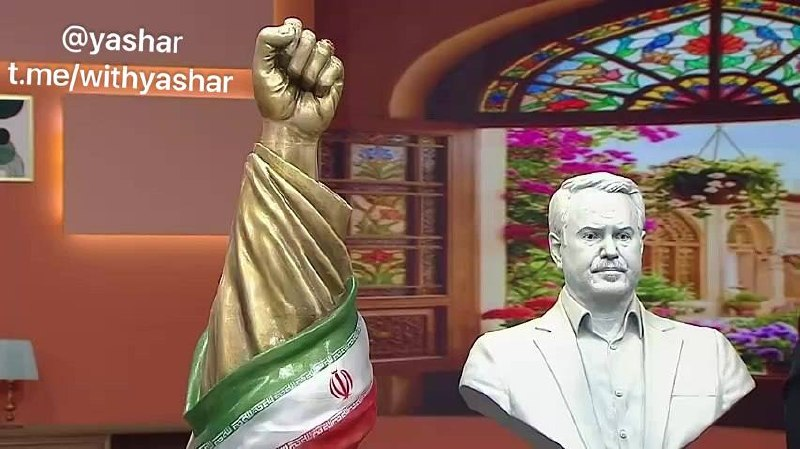

صدا و سیما : تا عید غدیر مجسمه‌ای ۱۵ متری از مشت علی خامنه‌ای در میدان انقلاب تهران نصب میشه‌.
@withyashar

## WithYashar — post 11821

فاکس نیوز در گزارشی به نقل از عمر محمد، کارشناس مبارزه با تروریسم، نوشت سبک زندگی مجتبی خامنه‌ای به سطحی از ناپدید شدن رسیده که اسامه بن لادن سال‌ها در ایبت‌آباد تجربه می‌کرد؛ زندگی بدون ارتباط مخابراتی و با اتکا به پیک‌های مورد اعتماد.
@withyashar

## mwarmonitor — post 9402

🛢اگر کسی با هیجان خبری منتشر کرد که «جزیره خارک امروز در حال بارگیری چند نفتکش با نفت خام است»، به او بگویید ترکر تانکر می‌گوید این دو نفتکش کوچک از نوع Handymax (تقریباً 300,000 تا 350,000 بشکه نفت خام برای هر کشتی ) در حال بارگیری هستند تا محموله را برای پالایش در سایر پالایشگاه‌های داخل ایران منتقل کنند، ممنون.

@mwarmonitor

## mwarmonitor — post 9401

📝 این شوء تهوع‌آور، نقطه‌ی پرگارِ بلاهت و پایانِ رسمی عقلانیت است. تماشای این سیرکِ سیار از بوزینه‌های دست‌آموزِ وارداتی که با دلارهای نفتی و بورسیه‌های گدایی، از سواحل قحطی‌زده و طاعون‌زده‌ی آفریقا به تهران گسیل شده‌اند تا برای ما نسخه‌ی «مقاومت» بپیچند، فراتر از یک کمدی سیاه، یک انحطاط مطلق است.

🔸اوج وقاحت و سورئالیسمِ ماجرا آنجاست که یکی از این جیرهخورانِ شکم‌سیر با بی‌شرمی جلوی دوربین ژست می‌گیرد و می‌گوید «من وطن‌فروش نیستم!»؛ انگار که در قاموس این موجوداتِ مواجب‌بگیر، مرزهای خیانت و وطن‌فروشی هم با نرخ ارز جابه‌جا می‌شود. البته از حق نباید گذشت؛ وقتی بین ابولا و فقر مطلق در زادگاهشان، و چریدن در سفره‌ی بی‌صاحبِ جمهوری اسلامی مخیر شدند، معلوم است که این جماعتِ بی‌هویت، گزینه‌ی دوم را ترجیح می‌دهند.

🔸قلم را باید شکست و دهان منطق را گل گرفت؛ وقتی صاحبان اصلی این خاک برای بقا دست‌وپا می‌زنند، این گداهای ایدئولوژیک از آفریقا، پرچم‌دار آرمان‌هایی شده‌اند که حتی خودِ نظام هم دیگر به آن‌ها باور ندارد.

@mwarmonitor

## mwarmonitor — post 9400

🚨«بر اساس گفته‌های دو منبع آگاه از ارزیابی‌های اطلاعاتی ایالات متحده، ایران در طول آتش‌بس شش هفته‌ای که از اوایل آوریل آغاز شد، تولید برخی از پهپادهای خود را از سر گرفته است؛ نشانه‌ای از اینکه این کشور به سرعت در حال بازسازی برخی از توانمندی‌های نظامی خود است که در جریان حملات مشترک آمریکا و اسرائیل آسیب دیده بودند. چهار منبع به سی‌ان‌ان (CNN) گفتند که داده‌های اطلاعاتی آمریکا نشان می‌دهد ارتش ایران بسیار سریع‌تر از آنچه در ابتدا برآورد می‌شد، در حال بازسازی و احیای قوا است.

🔴به گفته این چهار منبع آگاه از گزارش‌های اطلاعاتی، بازسازی توانمندی‌های نظامی—شامل جایگزینی پایگاه‌های موشکی، پرتابگرها و ظرفیت تولید سیستم‌های تسلیحاتی کلیدی که در طول درگیری‌های اخیر منهدم شده بودند—به این معنی است که در صورت از سرگیری کمپین بمباران توسط پرزیدنت دونالد ترامپ، ایران همچنان تهدیدی جدی برای متحدان منطقه‌ای خواهد بود.

@mwarmonitor

## mwarmonitor — post 9399

🔴به گفته دو منبع ارشد ایرانی که با Reuters گفت‌وگو کرده‌اند، رهبر جمهوری اسلامی ایران دستور داده است که ذخایر اورانیوم با غنای نزدیک به سطح تسلیحاتی ایران باید در داخل کشور باقی بماند.

🔸به گفته این منابع، این دستور بازتاب‌دهنده یک اجماع گسترده در میان ساختار حاکمیتی ایران است.

@mwarmonitor

## mwarmonitor — post 9398

🚨علی هاشم خبرنگار الجزیره: بر اساس منابع من در تهران، پاسخ ایران هنوز به میانجی پاکستانی تحویل داده نشده است. رایزنی‌ها همچنان ادامه دارد و تلاش‌های جدی برای رسیدن به پیش‌نویس نهایی در جریان است.

@mwarmonitor

## mwarmonitor — post 9397

🔴انور قرقاش: ما طی دهه‌های طولانی به زورگویی و قلدری ایران عادت کرده‌ایم، تا جایی که به بخشی از صحنه سیاسی خلیج فارس تبدیل شده است؛ و میان گفتمان تهاجمی و بیانیه‌های دوستیِ توخالی، اعتبار از میان رفته است.

🔸امروز نیز، پس از تجاوز خشن ایران، این نظام می‌کوشد واقعیتی جدید را که از یک شکست نظامی آشکار زاده شده، تثبیت کند؛ اما تلاش برای کنترل تنگه هرمز یا تعرض به حاکمیت دریایی امارات چیزی جز رؤیاهای پریشان نیست.

🔸هر کس بخواهد با محیط عربی پیرامون خود همزیستی داشته باشد، باید بداند که اعتماد از دست رفته است؛ و بازگرداندن آن نه با شعار، بلکه با زبانی مسئولانه، حفظ حاکمیت‌ها و پایبندی واقعی به اصول حسن همجواری ممکن است.

@mwarmonitor

## FoxNewsTwitter — post 342036

  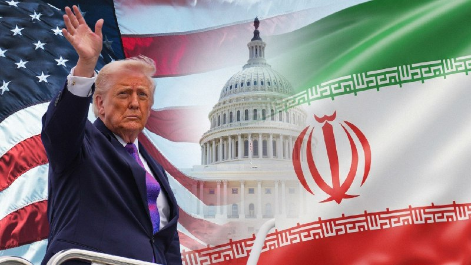

Fox News (Twitter/X)

NEW: 65% of voters say the U.S. is winning the war in Iran, according to the latest Fox News poll.

This comes as Iran’s foreign ministry is reviewing the most recent U.S. peace proposal while Pakistani mediators visit Tehran to push for a deal.

While the administration shows no signs of slowing down its focus on military action in the Middle East, Americans are growing increasingly worried about gas prices and the overall cost of living.

## FoxNewsTwitter — post 342035

  <a href="telegram/content/FoxNewsTwitter_342035_1779365949.mp4" target="_blank">🎬 Download video</a>

Fox News (Twitter/X)

NEW: Iran is drawing a hard line in nuclear talks, insisting its enriched uranium must stay inside the country.

That demand is now fueling new friction in negotiations with the U.S., as President Trump signals the ceasefire could end if Tehran refuses a deal.

@aishahhasnie has the latest as gas prices climb and voters grow more anxious about the cost of living.

## pm_afshaa — post 91158

  <a href="telegram/content/pm_afshaa_91158_1779365951.webm" target="_blank">🎬 Download video</a>

🔴رویترز به نقل از منابع اسرائیلی:
ترامپ به اسرائیل قول داد که اورانیوم غنی‌شده از ایران خارج بشه و هر توافق احتمالی شامل این بند خواهد بود!

💧 Rainbet.com the #1 Non-KYC Crypto Casino & Sportsbook @rainbetcom

😁 @Pm_Afshaa

## pm_afshaa — post 91157

🔴به بیمارستان‌های اسراییل دستور آماده‌باش برای ورود به وضعیت جنگی را اعلام شده

‌
💧 Rainbet.com the #1 Non-KYC Crypto Casino & Sportsbook @rainbetcom

😁 @Pm_Afshaa

## pm_afshaa — post 91156

♨️
♨️
♨️
♨️

## pm_afshaa — post 91155

🔴علی هاشم خبرنگار الجزیره: بر اساس منابع من در تهران، پاسخ ایران هنوز به میانجی پاکستانی تحویل داده نشده است. رایزنی‌ها همچنان ادامه دارد و تلاش‌های جدی برای رسیدن به پیش‌نویس نهایی در جریان است

💧 Rainbet.com the #1 Non-KYC Crypto Casino & Sportsbook @rainbetcom

😁 @Pm_Afshaa

## pm_afshaa — post 91154

  <a href="telegram/content/pm_afshaa_91154_1779365952.webm" target="_blank">🎬 Download video</a>

🔴رویترز به نقل از منابع ارشد ایرانی:
مجتبی خامنه‌ای دستور داده که اورانیوم غنی شده در ایران باقی بماند.

💧 Rainbet.com the #1 Non-KYC Crypto Casino & Sportsbook @rainbetcom

😁 @Pm_Afshaa

## pm_afshaa — post 91152

  <a href="telegram/content/pm_afshaa_91152_1779365953.webm" target="_blank">🎬 Download video</a>

🔴سی‌ان‌ان: ایران در طول آتش‌بس بخشی از تولید پهپادهای خودش رو از سر گرفته، که نشان میده سریعاً در حال بازسازی برخی توانایی‌های نظامیه که در حملات آسیب دیدن.

💧 Rainbet.com the #1 Non-KYC Crypto Casino & Sportsbook @rainbetcom

😁 @Pm_Afshaa

## pm_afshaa — post 91151

  <a href="telegram/content/pm_afshaa_91151_1779365953.webm" target="_blank">🎬 Download video</a>

🔴کانال 13 اسرائیل به نقل از یک مقام ارشد اسرائیلی:

در حلقه اطراف ترامپ، بر او فشار میارن تا با ایران به توافق برسه، اما گزینه حمله همچنان روی میز است.

💧 Rainbet.com the #1 Non-KYC Crypto Casino & Sportsbook @rainbetcom

😁 @Pm_Afshaa

## pm_afshaa — post 91150

  <a href="telegram/content/pm_afshaa_91150_1779365954.webm" target="_blank">🎬 Download video</a>

🔴ایسنا: ایران در حال پاسخ به متن ارسال شده از سوی آمریکاست.

متن ایران در حال گفت‌وگو‌ در تهران بر سر چارچوب کلان، برخی جزییات و اقدامات اعتمادساز به عنوان تضمین است.
متن ارسالی به میزانی شکاف‌ها رو کم کرده اما کمتر شدن شکاف‌ها نیازمند پایان یافتن وسوسه جنگ در سمت واشنگتن است.

💧Rainbet.com the #1 Non-KYC Crypto Casino & Sportsbook @rainbetcom

😁 @Pm_Afshaa

## pm_afshaa — post 91149

  <a href="telegram/content/pm_afshaa_91149_1779365954.mp4" target="_blank">🎬 Download video</a>

اکانت اسرائیل به فارسی:درخشش پرچم شیر‌ و خورشید در کنار پرچم کشورهای دیگر در شهر اشدود در اسرائیل.

💧 Rainbet.com the #1 Non-KYC Crypto Casino & Sportsbook @rainbetcom

😁 @Pm_Afshaa

## pm_afshaa — post 91148

🔴3 انفجار پیاپی در بندر عباس

💧 Rainbet.com the #1 Non-KYC Crypto Casino & Sportsbook @rainbetcom

😁 @Pm_Afshaa

## pm_afshaa — post 91147

  

🚨اشتراک استارز ⭐️ فیلترشکن ایران وی پی ان
تخفیف ها تا ساعت ۱۲ امشب هستن و هیچ وقت دیگر بر نمیگردن❌

تعرفه های باور نکردنی🔮

سرورا بدون ضریب هستن و ساب دارن😎🔋

1 gig= 230t🚀

3 gig= 670t 🚀

5 gig= 1050t🚀

7 gig = 1550t 🚀

10 gig= 2100t 🚀

قبل خرید میتونید تست بگیرید 🛜
بهترین و ارزون ترین سرور ایران دست ماست

🚨تمامی سرور ها کاربر نامحدود هستن و تاریخ انقضا ندارن✅

جهت خرید به ایدی زیر پیام بدین 👇

@IRAN_VPNADMIN

کانال. و رضایت مشتری ها👇

https://t.me/IRAN_VPNON

## pm_afshaa — post 91146

🔴تایمز اسرائیل: ایران در جریان آتش‌بس از فرصت برای جابه‌جایی لانچرهای موشکی و آماده‌سازی برای دور جدید درگیری استفاده کرده

💧 Rainbet.com the #1 Non-KYC Crypto Casino & Sportsbook @rainbetcom

😁 @Pm_Afshaa

## pm_afshaa — post 91145

🔴والا نیوز:منابع اسرائیلی می‌گویند آمریکایی‌ها در مذاکرات با ایران یک قدم به جلو برداشته‌اند، بنابراین برآوردها این است که حمله‌ای به ایران در 24 ساعت آینده تکرار نخواهد شد

💧 Rainbet.com the #1 Non-KYC Crypto Casino & Sportsbook @rainbetcom

😁 @Pm_Afshaa

## DEJradio — post 4819

⭕️ رویترز: مجتبی خامنه‌ای با انتقال ذخایر اورانیوم از ایران مخالفت کرد

خبرگزاری رویترز به نقل از «منابع آگاه در جمهوری اسلامی» ادعا کرد مجتبی خامنه‌ای دستور داد ذخایر اورانیوم غنی‌شده از ایران خارج نشود.
به گزارش رویترز، این تصمیم یکی از اصلی‌ترین خواسته‌های آمریکا و اسرائیل در مذاکرات را با مانع روبه‌رو کرده است.
منابع جمهوری اسلامی به رویترز گفتند تهران نگران است آتش‌بس کنونی فرصتی برای تجدید قوای آمریکا و اسرائیل و مقدمۀ حملات تازه باشد.
رویترز همچنین از بررسی گزینه‌هایی مانند رقیق‌سازی ذخایر اورانیوم زیر نظر آژانس بین‌المللی انرژی اتمی خبر داد.
منابع دژ می‌گویند مجتبی خامنه‌ای قدرت تصمیم‌گیری ندارد و دستوراتی که به نقل از او اعلام می‌شود، در یکی از هسته‌های سپاه تنظیم می‌شود.

#موشتبا #غنی‌سازی #اورانیوم
@DEJradio

## DEJradio — post 4818

⭕️ مجتبی خامنه‌ای برای زنده ماندن از الگوی بن‌لادن استفاده می‌کند

شبکۀ فاکس‌نیوز، به نقل از عمر محمد، کارشناس مبارزه با تروریسم، گزارش داد مجتبی خامنه‌ای نزدیک به سه ماه است در مخفیگاه زندگی می‌کند.
به گفتۀ این کارشناس، شیوۀ پنهان شدن رهبر تازۀ جمهوری اسلامی یادآور سال‌های پایانی زندگی اسامه بن‌لادن، رهبر القاعده است.
او گفت جمهوری اسلامی احتمالا از تجربۀ اختفای بن‌لادن در مجتمع‌های حفاظت‌شده و نزدیک مراکز نظامی الگو گرفته است.
فاکس‌نیوز در این گزارش از زندگی مجتبی خامنه‌ای بدون هیچ ارتباط مخابراتی خبر داده است. بنا بر گزارش‌ها، مجتبی خامنه‌ای، در سایت‌های زیرزمینی سپاه پنهان شده است.

#موشتبا
@DEJradio

## DEJradio — post 4817

⭕️ بمب‌افکن بی-۱بی آمریکا بر فراز خاورمیانه پرواز آموزشی انجام داد

سنتکام با انتشار تصویری اعلام کرد یک فروند بمب‌افکن بی-۱بی لنسر، نیروی هوایی آمریکا بر فراز آب‌های خاورمیانه پرواز آموزشی انجام داده است.
ستاد فرماندهی مرکزی ارتش آمریکا اعلام کرد این بمب‌افکن در جریان پرواز، از هواپیمای سوخت‌رسان کی‌سی-۱۳۵ سوخت‌گیری هوایی کرد.

#سنتکام #خاورمیانه
@DEJradio

## DEJradio — post 4816

  <a href="telegram/content/DEJradio_4816_1779365957.webm" target="_blank">🎬 Download video</a>

🔺📢 هرمز در مسیر سقوط

*عطا حسینیان، روزنامه‌نگار اقتصادی

#اقتصاد_ایران #تنگه_هرمز
@DEJradio

## DEJradio — post 4815

⭕️ رسانۀ اسرائیلی از افزایش شدید سطح آمادگی نظامی در این کشور خبر داد

کانال ۱۱ اسرائیل گزارش داد ارتش و نهادهای امنیتی این کشور در پی ارزیابی‌های تازۀ اطلاعاتی، سطح آمادگی را به بالاترین سطح افزایش داده‌اند.
بنا بر این گزارش، افزایش آمادگی به دلیل احتمال ازسرگیری جنگ با جمهوری اسلامی، صورت گرفته است.
براساس این گزارش، ارزیابی‌ها نشان می‌دهد حملات و فعالیت نظامی علیه ایران ممکن است «هر لحظه» از سر گرفته شود.
یک مقام اسرائیلی گفت دونالد ترامپ بیش از هر زمان دیگری به پشتیبانی آشکارا از اقدام نظامی علیه جمهوری اسلامی نزدیک شده است.
به گفتۀ این مقام، واشینگتن هنوز فرصتی محدود را برای مسیر دیپلماتیک و به نتیجه رسیدن مذاکرات، باز نگه داشته است.

#اسرائیل #جنگ #جمهوری_اسلامی
@DEJradio

## DEJradio — post 4814

⭕️ قطعی سراسری اینترنت در ایران از مرز ۱۹۸۶ ساعت گذشت

نت‌بلاکس، اعلام کرد خاموشی اینترنت در ایران وارد هشتادوسومین روز شد و از ۱۹۸۶ ساعت عبور کرد.
این نهاد جهانی پایش اینترنت هشدار داد محدودیت‌های گسترده، دسترسی شهروندان به اطلاعات و امکان مستندسازی نقض حکومتی حقوق بشر را به‌شدت محدود کرده است.
گزارش‌ها همچنین از خسارت میلیاردی به مشاغل اینترنتی و اختلال در خدمات درمانی و تأمین دارو خبر می‌دهد.
از سویی جمهوری اسلامی برخورد با کاربران استارلینک را تشدید کرده است.
رژیم حاکم بر ایران امتیاز استفاده از اینترنت را در اختیار برخی اقشار و همچنین هوادارانی قرار می‌دهد که مواضع جمهوری اسلامی را تبلیغ می‌کنند.

#اینترنت
@DEJradio

## DEJradio — post 4813

⭕️ بازیکنان تیم ملی فوتبال جمهوری اسلامی برای دریافت ویزای آمریکا به آنکارا رفتند

بازیکنان تیم فوتبال ایران صبح پنج‌شنبه برای انجام مراحل دریافت ویزای آمریکا به سفارت‌خانۀ این کشور در آنکارا مراجعه کردند.
فدراسیون فوتبال جمهوری اسلامی در آستانۀ جام جهانی با مشکل صدور ویزا برای اعضای کاروان روبه‌رو شده است.
بر پایۀ گزارش‌ها حاکی است ممکن است برای برخی بازیکنان یا اعضای کادر فنی به‌دلیل سوابق حضور یا ارتباط با سپاه پاسداران، ویزا صادر نشود.
شماری از بازیکنان و اعضای کادر تیم ملی فوتبال جمهوری اسلامی در سپاه خدمت کرده‌اند. مهدی تاج، رئیس فدراسیون فوتبال جمهوری اسلامی سابقۀ عضویت رسمی در سپاه را دارد.
سپاه پاسداران در سیاهۀ تروریستی آمریکا، کانادا و اتحادیۀ اروپا قرار دارد.

#فوتبال #جام_جهانی
@DEJradio

## DEJradio — post 4812

⭕️ اکسیوس از تماس «پرتنش» ترامپ و نتانیاهو دربارۀ جمهوری اسلامی خبر داد

وبسایت خبری اکسیوس، به نقل از منابع آگاه گزارش داد تماس تلفنی دونالد ترامپ و بنیامین نتانیاهو درمورد پروندۀ جمهوری اسلامی «پرتنش» بوده است.
بر پایۀ این گزارش، نتانیاهو نسبت به مذاکرات با جمهوری اسلامی به‌شدت بدبین است و خواهان ازسرگیری جنگ برای تضعیف بیشتر توان نظامی رژیم حاکم بر ایران است.
اکسیوس نوشت در سوی دیگر ترامپ باور دارد که هنوز امکان دستیابی به توافق از بین نرفته است. بنا بر این گزارش، ترامپ گفته که اگر مذاکرات شکست بخورد، آمادۀ ازسرگیری جنگ است.

#ترامپ #نتانیاهو #جنگ
@DEJradio

## DEJradio — post 4811

⭕️ دادگاه فدرال آمریکا رائول کاسترو را به قتل متهم کرد

یک دادگاه فدرال آمریکا رائول کاسترو، رئیس‌ جمهوری پیشین کوبا را به مشارکت در قتل شهروندان آمریکایی متهم کرد.
این پرونده به سرنگونی دو هواپیمای متعلق به کوبایی‌های تبعیدی در سال ۱۹۹۶ مرتبط است.
به گفتۀ مقام‌های آمریکایی، رائول کاسترو دستور این عملیات را صادر کرده بود.

#کوبا #سرنگونی
@DEJradio

## DEJradio — post 4810

⭕️ بهای نفت در پی احتمال آغاز جنگ دوباره بالا رفت

پس از دو روز کاهش، بهای نفت از روز پنج‌شنبه دوباره روندی صعودی در پیش گرفت. این در حالی است که اخباری از بهبود بازار سهام آسیا در روزهای اخیر منتشر شده است.
بهای نفت برنت روز پنج‌شنبه به بیش از ۱۰۵ دلار و نفت آمریکا نیز به حدودا ۹۹ دلار در هر بشکه افزایش یافت.
به گفتۀ تحلیلگران، اخبار تازه درمورد احتمال ازسرگیری جنگ علیه جمهوری اسلامی و کاهش ذخایر نفت آمریکا، عامل اصلی رشد قیمت‌ها است.

#نفت #جنگ
@DEJradio

## DEJradio — post 4809

⭕️ شاخص‌های بازار آسیا در پی احتمال توافق واشینگتن و تهران و آمریکا جهش کرد

بازارهای سهام آسیا در پی اخبار منتشر شده در مورد احتمال توافق میان جمهوری اسلامی و آمریکا و کاهش تنش در خاورمیانه، رشد کرد.
خبرگزاری رویترز گزارش داد شاخص سهام آسیا-اقیانوسیه ۲.۶ درصد افزایش یافت. همچنین بورس کرۀ جنوبی بیش از هفت درصد جهش کرد.
از سویی رشد سهام شرکت‌های فناوری، گزارش مالی انویدیا و تعلیق اعتصاب سامسونگ نیز از عوامل تقویت بازارها عنوان شد.
تحلیلگران با وجود رشد بازارها، نسبت به نتیجۀ مذاکرات تهران و واشینگتن همچنان محتاطانه اظهار نظر می‌کنند.

#توافق #بورس
@DEJradio

## DEJradio — post 4808

⭕️ سی‌ان‌ان گزارش داد سپاه سریع‌تر از انتظار در حال بازسازی توان نظامی است

شبکۀ خبری سی‌ان‌ان به نقل از مقام‌های اطلاعاتی آمریکا گزارش داد سپاه پاسداران سریع‌تر از برآوردهای قبلی در حال بازسازی قابلیت‌های نظامی آسیب‌دیدۀ خود است.
به گفتۀ این منابع، سپاه در شش هفتۀ پیشین بخشی از چرخۀ تولید پهپاد و زیرساخت‌های موشکی خود را دوباره فعال کرده است.
به گفتۀ مقام‌های آمریکایی، این روند نشان می‌دهد جمهوری اسلامی همچنان تهدیدی جدی برای متحدان منطقه‌ای آمریکا به شمار می‌رود.

#سپاه_تروریستی_پاسداران #پهپاد
@DEJradio

## DEJradio — post 4807

⭕️ فرماندۀ ارتش پاکستان دوباره به تهران می‌رود

رسانه‌های داخل ایران گزارش دادند فیلد مارشال عاصم منیر، فرماندۀ ارتش پاکستان، روز پنج‌شنبه ۳۱ اردیبهشت به تهران سفر می‌کند.
این دومین سفر او به ایران در جریان میانجی‌گری اسلام‌آباد میان تهران و واشینگتن، پس از جنگ چهل روزه به شمار می‌رود.
اسماعیل بقائی، سخنگوی وزارت امور خارجۀ جمهوری اسلامی گفت سفر مقام‌های پاکستانی برای «تسهیل تبادل پیام‌ها» میان تهران و واشینگتن، انجام می‌شود.

#مذاکرات #پاکستان
@DEJradio

## DEJradio — post 4806

⭕️ دو تبعۀ عراقی به اتهام «جاسوسی» پنهانی در کرج اعدام شدند

بنا بر گزارش سازمان‌های حقوق بشری، دو شهروند عراقی به نام‌های علی نادر العبیدی و فاضل شیخ کریم، به اتهام «جاسوسی» برای کشورهای عربی به صورت پنهانی در زندان مرکزی کرج اعدام شدند.
بر پایۀ این گزارش، حکم اعدام این دو نفر ۱۷ فروردین ۱۴۰۵ اجرا شده اما خبر آن اکنون درز کرده است.
نهادهای حقوق بشری می‌گویند این دو زندانی پیش از اعدام درحدود یازده ماه در بازداشت نهادهای امنیتی بوده و زیر شکنجه قرار داشتند.
دستگاه قضائی جمهوری اسلامی و مقام‌های عراقی تاکنون واکنشی به این گزارش نشان نداده‌اند.

#اعدام
@DEJradio

## DEJradio — post 4805

⭕️ اندیشکده آمریکایی: احمد وحیدی از نفرات اصلی موضع تندروانۀ رژیم در مذاکرات است

اندیشکدۀ مؤسسه مطالعات جنگ اعلام کرد احمد وحیدی به یکی از چهره‌های اصلی تدوین موضع سخت‌گیرانۀ جمهوری اسلامی در مذاکره با آمریکا تبدیل شده است.
بنا بر این گزارش وحیدی و حلقۀ نزدیک به او علاوه بر جهت‌دهی واکنش‌های نظامی، بر سیاست‌های مذاکراتی تهران نیز نفوذی گسترده دارند.
بر پایۀ این ارزیابی، وحیدی از نزدیک‌ترین افراد به مجتبی خامنه‌ای، رهبر تازه اعلام شدۀ جمهوری اسلامی به شمار می‌رود.

#مذاکرات #جمهوری_اسلامی
@DEJradio

## DEJradio — post 4804

⭕️ ترامپ گفت یا توافق و یا برمی‌گردیم و کار رژیم را به پایان می‌رسانیم

دونالد ترامپ گفت تنها پرسش باقی‌مانده این است که آیا آمریکا برای «به پایان بردن کار جمهوری اسلامی» بازمی‌گردد یا این که تهران توافقنامه را امضا می‌کند.
رئیس جمهوری آمریکا گفت نیروی دریایی و نیروی هوایی جمهوری اسلامی از بین رفته‌ و واشینگتن اجازه نمی‌دهد جمهوری اسلامی به سلاح هسته‌ای دست پیدا کند.
ترامپ گفت مذاکره با جمهوری اسلامی در مراحل پایانی قرار دارد، اما اگر توافق حاصل نشود، حملات بیشتری در پیش است.
او همچنین تأکید کرد باز شدن بی‌درنگ تنگۀ هرمز یکی از مسائل اصلی در توافق احتمالی است.

#ترامپ #مذاکرات #توافق #جنگ
@DEJradio

## DEJradio — post 4803

⭕️ قالیباف گفت آمریکا در پی دور تازۀ جنگ علیه رژیم است

محمدباقر قالیباف، رئیس مجلس شورای اسلامی گفت آمریکا همچنان در جست‌وجوی آغاز دور تازۀ جنگ علیه جمهوری اسلامی است.
او مدعی شد جمهوری اسلامی در دورۀ آتش‌بس توان نظامی خود را بازسازی کرده است.
قالیباف همچنین ادعا کرد در صورت آغاز دوبارۀ جنگ، نیروهای جمهوری اسلامی «دشمن» را «شگفت‌زده» می‌کنند.
رئیس مجلس شورای اسلامی همچنین خبر افزایش بهای کالاهای اساسی و کاهش قدرت خرید مردم را تأیید کرد.

#قالیباف #جنگ
@DEJradio

## DEJradio — post 4802

  <a href="telegram/content/DEJradio_4802_1779365957.mp4" target="_blank">🎬 Download video</a>

👑
🔺برافراشته شدن پرچم شیر و خورشید در بندر اشدود اسرائیل.

#اسرائیل #پرچم_شیروخورشید
@DEJradio

## DEJradio — post 4801

  <a href="telegram/content/DEJradio_4801_1779365959.mp4" target="_blank">🎬 Download video</a>

🤡
🔺 سیاهی‌لشکر آفریقایی‌‌ها در حمایت از حکومت.

#آفریقایی #تجمعات_حکومتی
@DEJradio

## DEJradio — post 4800

  <a href="telegram/content/DEJradio_4800_1779365961.mp4" target="_blank">🎬 Download video</a>

🔺🎥 بناب؛ قدردانی از سردار آزمون به دلیل حمایت از مردم

یک شهروند با ارسال ویدیویی که شعارنویسی در حمایت از سردار آزمون بازیکن مردم‌دوست تیم فوتبال نوشت: «مردم بناب و اصلا کل آذربایجان غربی و شرقی خیلی سردار آزمون رو دوست دارن، و خیلی عصبانی هستن از این که آزمون رو از تیم حذف کردن، خاک تو سرشون. آزمون ما دوست داریم و تو باعث افتخار مایی. لطفا صدای اعتراض و افتخار ما به آزمون رو اگر چه که حذفش کردن رو به همه، و بخصوص به اون تصمیم گیرنده‌های نالایق هر کی که هستند برسونید.»

#بناب #سردار_آزمون
@DEJradio

## mamlekate — post 103564

📝 ترامپ: مذاکرات با تهران در مراحل نهایی است، توافق نکنند حمله می‌کنیم

دونالد ترامپ، رییس‌جمهوری آمریکا، چهارشنبه ۳۰ اردیبهشت گفت مذاکرات با جمهوری اسلامی در مراحل نهایی قرار دارد اما هم‌زمان هشدار داد که در صورت شکست مذاکرات، حملات بیشتری علیه جمهوری اسلامی انجام خواهد شد. این اظهارات هم‌زمان با سفر وزیر کشور پاکستان به تهران مطرح شد.

@mamlekate

## mamlekate — post 103563

خلاصه رویداد مهم Google IO 2026 ، یکی از مهمترین رویدادهای تکنولوژی دنیا در سال ۲۰۲۶ ، با زیرنویس فارسی [۶۰ مگابابت برای ۳۵ دقیقه]

shah_riyar_
@mamlekate

## kianmeli1 — post 87529

  <a href="telegram/content/kianmeli1_87529_1779365964.mp4" target="_blank">🎬 Download video</a>

🔴تبلیغ وطن دوستی با شهروندان وارداتی از سنگال، غنا، کنیا، بورکینافاسو، ساحل عاج، نیجریه، تانزانیا، مالی
https://t.me/kianmeli1

## kianmeli1 — post 87528

  

🔴رویترز: مجتبی خامنه‌ای دستور داده است که اورانیوم با غنای بالای ایران باید در داخل کشور باقی بماند
https://t.me/kianmeli1

## kianmeli1 — post 87527

  <a href="telegram/content/kianmeli1_87527_1779365966.mp4" target="_blank">🎬 Download video</a>

🔴پالایشگاه سیزران، استان سامارا، در روسیه توسط پهپادهای اوکراینی مورد حمله قرار گرفته و اکنون در حال سوختن است.
https://t.me/kianmeli1

## IranIntlTV — post 338238

  <a href="https://t.me/IranintlTV/338238" target="_blank">📎 Download file</a>

🎧نسخه صوتی اخبار نیم‌روزی | پنجشنبه ۳۱ اردیبهشت
@iranintlTV

## IranIntlTV — post 338237

  <a href="telegram/content/IranIntlTV_338237_1779365968.mp4" target="_blank">🎬 Download video</a>

ویدیوی ارسالی به ایران اینترنشنال نشان می‌دهد که ۳۱ اردیبهشت‌ماه گروهی از دانش‌آموزان با بر زمین نشستن و تحصن جلوی ساختمان استانداری در شهرکرد، شعارهایی چون «امتحان حضوری نمی‌خواهیم» و «حمایت، حمایت» سردادند.

## IranIntlTV — post 338236

  <a href="telegram/content/IranIntlTV_338236_1779365970.mp4" target="_blank">🎬 Download video</a>

ویدیوی رسیده به ایران اینترنشنال نشان می‌دهد که شامگاه ۳۱ اردیبهشت در شهر دهلران استان ایلام، گروهی با در دست داشتن پرچم جمهوری اسلامی و بیرق‌های مذهبی، موسیقیِ باکلام عربی را با صدای بلند در خیابان پخش می‌کنند. فرستنده ویدیو گفت: «مزاحمت‌های شبانه طرفداران حکومت، تمامی ندارد.»

## IranIntlTV — post 338235

  <a href="telegram/content/IranIntlTV_338235_1779365972.mp4" target="_blank">🎬 Download video</a>

هم‌زمان با ادامه کارزار مردمی جاویدنامان الغدیر، جزییات تازه‌ای از هویت و چگونگی کشته‌ شدن شماری از جان‌باختگان اعتراضات ۱۸ و ۱۹ دی‌ماه به دست ایران‌اینترنشنال رسیده است. در میان این روایت‌ها، خانواده و نزدیکان ستاره رفیعی، حمیدرضا حق‌پرست و حسین ناصری از نحوه کشته‌ شدن و انتقال پیکر آن‌ها به بیمارستان الغدیر گفته‌اند.

جزییات بیشتر با فرنوش فرجی، عضو تحریریه ایران‌اینترنشنال
@iranintltv

## IranIntlTV — post 338234

  

علی یزدی‌خواه، نایب‌رییس کمیسیون فرهنگی مجلس، گفت در شرایط فعلی تصمیمی برای بازگشایی اینترنت جهانی وجود ندارد و محدودیت‌ها با «ملاحظات امنیتی» ادامه خواهد داشت.

یزدی‌خواه قطع اینترنت جهانی را به مصوبات شورای عالی امنیت ملی نسبت داد و گفت این تصمیم به‌دلیل «مسائل امنیتی، امنیت کشور و حفظ جان افراد» گرفته شده است.

با وجود اینکه نت‌بلاکس اعلام کرده خاموشی اینترنت در ایران وارد هشتادوسومین روز خود شده، یزدی‌خواه گفت بیش از ۹۰ درصد نیازهای مردم در وضعیت فعلی برآورده می‌شود و مراجعات گسترده‌ای در اعتراض به قطع اینترنت وجود ندارد.

او همچنین گفت در قالب طرح موسوم به «اینترنت پرو»، تاکنون بیش از یک میلیون نفر دسترسی دریافت کرده‌اند؛ طرحی که منتقدان آن را مصداق اینترنت طبقاتی و تبعیض‌آمیز می‌دانند، زیرا دسترسی به اینترنت جهانی را به گروه‌های خاص محدود می‌کند و شهروندان عادی را از حق برابر دسترسی آزاد به اینترنت محروم نگه می‌دارد.

نایب‌رییس کمیسیون فرهنگی مجلس همچنین گفت شرکت‌های صادرات و واردات، مراکز علمی و پژوهشی، آزمایشگاه‌ها و برخی اصناف در صورت نیاز می‌توانند برای دسترسی به اینترنت بین‌الملل اقدام کنند.
https

## IranIntlTV — post 338233

  <a href="telegram/content/IranIntlTV_338233_1779365975.mp4" target="_blank">🎬 Download video</a>

ویدیوهای رسیده به ایران اینترنشنال نشان می‌دهد که ۳۱ اردیبهشت در شهرکرد، گروهی از دانش‌آموزان معترض به برگزاری حضوری امتحان‌ها ضمن تلاش برای پاسخگو کردن مسئولان مربوط، شعار «دانش‌آموز داد بزن، حقتو فریاد بزن» سردادند.

## IranIntlTV — post 338232

  

نت‌بلاکس، نهاد ناظر بر اینترنت، نوشت که داده‌های این نهاد نشان می‌دهد قطعی اینترنت در ایران وارد هشتادوسومین روز خود شده و شبکه‌های بین‌المللی بیش از هزار و ۹۶۸ ساعت است که به‌طور گسترده مسدود مانده‌اند.

این نهاد ناظر بر اینترنت با تاکید بر اهمیت دسترسی آزاد به اینترنت نوشت: «اینترنت آزاد و باز، برای حفاظت از جان، آزادی و پاسخگویی عمومی نقشی اساسی دارد.»

## IranIntlTV — post 338231

  <a href="telegram/content/IranIntlTV_338231_1779365977.mp4" target="_blank">🎬 Download video</a>

پس از راه‌اندازی کارزار مردمی ایران‌اینترنشنال برای ثبت هویت جاویدنامان بیمارستان الغدیر، خانواده‌ها و نزدیکان جان‌باختگان در روزهای اخیر اطلاعات تازه‌ای درباره هویت شماری دیگر از کشته‌شدگان ارائه کرده‌اند. ایران‌اینترنشنال اعلام کرده این کارزار برای ثبت حقیقت و شناسایی جاویدنامان در هفته‌ها و ماه‌های آینده ادامه خواهد داشت.
این گزارش حاوی تصاویر تلخ و تکان‌دهنده است.
@iranintltv

## IranIntlTV — post 338230

  

🔻تیم ملی کنگو به دلیل شیوع بیماری ابولا در شرق این کشور، اردوی آماده‌سازی خود را برای جام جهانی، در کینشاسا، پایتخت این کشور لغو کرد. اردوی آماده‌سازی این تیم در پی تشدید این بحران که تاکنون جان بیش از ۱۳۰ نفر را گرفته، به بلژیک منتقل شده است.

🔹سازمان جهانی بهداشت این وضعیت را «وضعیت اضطراری بهداشت عمومی با اهمیت بین‌المللی» نامیده، اما آن را در سطح همه‌گیری جهانی ندانسته است.

🔹تیم ملی کنگو قرار است سوم ژوئن در بلژیک به مصاف دانمارک و نهم ژوئن در اسپانیا به مصاف شیلی برود.

🔹جری کاله‌مو، سخنگوی تیم ملی کنگو به خبرگزاری رویترز گفت دلیل اصلی لغو اردو، محدودیت‌های مسافرتی اعمال‌شده از سوی آمریکا است. آژانس بهداشت عمومی آمریکا ورود افراد غیرآمریکایی را که طی ۲۱ روز گذشته در کنگو، اوگاندا یا سودان جنوبی بوده‌اند، ممنوع کرده است.

@iranintltvsport

## IranIntlTV — post 338229

  <a href="telegram/content/IranIntlTV_338229_1779365980.mp4" target="_blank">🎬 Download video</a>

چهارمین روز دادگاه رسیدگی به پرونده متهمان حمله با چاقو به پوریا زراعتی، مجری تلویزیون ایران‌اینترنشنال، در حال برگزاری است. چهارشنبه دادستان اعلام کرده بود متهمان این پرونده به نیابت از جمهوری اسلامی به زراعتی حمله کرده‌اند.در جریان دادگاه، تصاویر دوربین‌های مداربسته از لحظه حمله به زراعتی نیز به‌عنوان بخشی از مدارک و شواهد به نمایش درآمد.

رضا محدث، خبرنگار ایران‌اینترنشنال، گزارش می‌دهد
@iranintltv

## IranIntlTV — post 338228

  <a href="telegram/content/IranIntlTV_338228_1779365982.mp4" target="_blank">🎬 Download video</a>

ایال زمیر، رییس ستاد کل ارتش اسرائیل، گفت نیروهای این کشور در بالاترین سطح آماده‌باش قرار دارند و برای هر تحول احتمالی آماده‌اند.

بابک اسحاقی، خبرنگار ایران‌اینترنشنال، گزارش می‌دهد
@iranintltv

## IranIntlTV — post 338227

  <a href="telegram/content/IranIntlTV_338227_1779365984.mp4" target="_blank">🎬 Download video</a>

افزایش شدید قیمت دارو، در کنار کمیاب و نایاب شدن بسیاری از اقلام دارویی، باعث شده بسیاری از مردم توان پرداخت هزینه‌های درمان را نداشته باشند. شماری از شهروندان در پیام‌های ارسالی به ایران‌اینترنشنال گفته‌اند به دلیل ناتوانی مالی، از ادامه درمان صرف‌نظر می‌کنند.

لیلا سعادتی، عضو تحریریه ایران‌اینترنشنال، گزارش می‌دهد
@iranintltv

## IranIntlTV — post 338226

  

فداحسین مالکی، عضو کمیسیون امنیت ملی مجلس، با تمجید از اقدامات نیروهای مسلح جمهوری اسلامی در جریان جنگ گفت سران واشینگتن تصور می‌کردند در ایران نیز پیروز خواهند شد، اما «در این میدان به معنای واقعی کلمه میخکوب شدند».

او گفت: «سران واشینگتن که پس از وقایع ونزوئلا دچار غرور و سرمستی سیاسی شده بودند، تصور می‌کردند در حمله به ایران نیز پیروز خواهند بود؛ اما در این میدان به معنای واقعی کلمه میخکوب شدند.»

مالکی همچنین درباره احتمال توافق با آمریکا با میانجی‌گری پاکستان گفت پاکستانی‌ها «حسن نیت» دارند و برای انجام این میانجی‌گری تلاش می‌کنند.

او افزود: «احتمال می‌دهم رفاقتی که عاصم منیر با ترامپ دارد، او را وادار کند شروط را بپذیرد؛ از جمله این‌که وارد تنگه هرمز نشود، وارد غنی‌سازی نشود، خسارت ما را بدهد و پول‌های بلوکه‌شده را آزاد کند.»
https://iranintl.com/202605216184

## IranIntlTV — post 338225

  <a href="telegram/content/IranIntlTV_338225_1779365986.mp4" target="_blank">🎬 Download video</a>

سرخط خبرهای پنجشنبه ۳۱ اردیبهشت
@iranintltv

## IranIntlTV — post 338224

  <a href="telegram/content/IranIntlTV_338224_1779365987.mp4" target="_blank">🎬 Download video</a>

ویدیوی ارسالی به ایران اینترنشنال نشان‌ می‌دهد که ۳۱ اردیبهشت در حوالی روستای سَلَخ شهرستان قشم استان هرمزگان، صف بنزین در کنار جاده ادامه پیدا کرده است. به گفته ساکنان منطقه، مردم این روستا با کمبود سوخت روبرو شده‌اند.

## IranIntlTV — post 338223

  <a href="telegram/content/IranIntlTV_338223_1779365990.mp4" target="_blank">🎬 Download video</a>

بر اساس ویدیو و گزارش‌های رسیده به ایران اینترنشنال شماری از دانش‌آموزان و خانواده‌های آنان در شهرکرد، صبح پنجشنبه ۳۱ اردیبهشت برای اعتراض به حضوری شدن امتحانات جلوی ساختمان استانداری چهارمحال و بختیاری تجمع کرده و شعار سردادند.

## IranIntlTV — post 338222

  

🔻زهرا زارعی، دونده استان کرمان، در مسابقات دوومیدانی جایزه بزرگ بندر ترکمن، رکورد ملی ماده ۴۰۰ متر زنان ایران را پس از ۱۴ سال شکست. او با ثبت زمان ۵۱.۹۷ ثانیه، رکورد این ماده را حدود یک ثانیه بهبود داد.

🔹رکورد ملی ۴۰۰ متر زنان ایران پیش از این با زمان ۵۲.۹۵ ثانیه در اختیار مریم طوسی بود که اردیبهشت ۱۳۹۱ در مسابقات جایزه بزرگ آسیا در تایلند ثبت شده بود.
@iranintltvsport

## IranIntlTV — post 338221

  <a href="telegram/content/IranIntlTV_338221_1779365993.mp4" target="_blank">🎬 Download video</a>

نگرانی‌ها درباره تداوم موج اعدام‌ها در ایران افزایش یافته است. هم‌زمان با اعلام قوه قضاییه درباره اعدام دو زندانی سیاسی، سازمان حقوق بشر ایران نیز از اعدام مخفیانه دو تبعه عراقی در زندان مرکزی کرج خبر داد و نسبت به روند رو به افزایش اجرای احکام اعدام هشدار داد.
گفت‌وگو با شراره عزیزی، عضو تحریریه ایران‌اینترنشنال
@iranintltv

## IranIntlTV — post 338220

  <a href="telegram/content/IranIntlTV_338220_1779365995.mp4" target="_blank">🎬 Download video</a>

روزنامه اسرائیل هیوم گزارش داد نشست کاخ سفید درباره پرونده جمهوری اسلامی با اختلاف‌نظر میان مقام‌های ارشد آمریکا همراه بوده است. به‌گفته این روزنامه، دونالد ترامپ بر ادامه مذاکرات تاکید کرده است. در مقابل، مارکو روبیو، وزیر امور خارجه، و پیت هگست، وزیر جنگ، معتقدند بدون تهدید به حمله و افزایش فشار اقتصادی، از تهران نمی‌شود امتیاز گرفت.
جزییات بیشتر با حسین آقایی، عضو تحریریه ایران‌اینترنشنال
@iranintltv

## IranIntlTV — post 338219

  

غلامرضا تاجگردون، رییس کمیسیون برنامه و بودجه مجلس، گفت دولت امروز به نقطه‌ای رسیده که باید «قرارگاه‌های مردمی تامین منابع مالی پایدار» را شکل دهد.

او اضافه کرد: «این یعنی بانک مرکزی باید یک پشتوانه مردمی دیگر برای تامین منابع داشته باشد؛ چه از جانب افرادی که در داخل کشور منابع دارند و چه ایرانیان خارج از کشور که امروز می‌توانند به اقتصاد کشورشان کمک کنند.»
https://iranintl.com/202605219231

## Shin_Persian — post 6121

Shin ✓ @hey_itsmyturn
Thu, 21 May 2026 11:59:19 UTC

As if anyone would expect anything else than IRGC (Yeah, not Mojtaba’s decision for sure) not allowing the handover of 400+ Kg of Uranium out of Iran, which is one of the most valuable bargaining chips fir then

فارسی

انگار کسی انتظار چیزی غیر از این را داشت که سپاه پاسداران (قطعا این تصمیم مجتبی نیست) اجازه خروج بیش از ۴۰۰ کیلوگرم اورانیوم را از ایران ندهد، که یکی از ارزشمندترین اهرم‌های چانه‌زنی برای آن‌هاست.

𝕏 · @shin_persian

## Shin_Persian — post 6120

Shin ✓ @hey_itsmyturn
Thu, 21 May 2026 10:02:55 UTC

3 blasts were just heard in Qeshm island.
(Highly likely EOD)
Hormozgan Province, #Iran

فارسی

۳ انفجار دقایقی پیش در جزیره قشم شنیده شد.
(احتمال زیاد خنثی‌سازی مهمات - EOD)
استان هرمزگان، #Iran_

𝕏 · @shin_persian

## ManotoTV — post 105716

  <a href="telegram/content/ManotoTV_105716_1779365999.mp4" target="_blank">🎬 Download video</a>

بر پایه گزارش رسانه‌های حکومتی، ۲۰ ملوان ایرانی که کشتی‌شان در آب‌های سنگاپور توقیف شده بود و در «وضعیت نامناسبی» قرار داشتند، ساعتی پیش به ایران بازگشتند.
سفیر جمهوری‌اسلامی در پاکستان با قدردانی از دولت پاکستان اعلام کرد این ملوانان پس از پیگیری‌های دیپلماتیک و با همکاری مقام‌های پاکستانی، از سنگاپور به اسلام‌آباد منتقل شدند و سپس به کشور بازگشتند.
او از نقش نخست‌وزیر پاکستان، وزارت خارجه و دیگر نهادهای این کشور در آزادی و انتقال ملوانان ایرانی تشکر کرد.

## ManotoTV — post 105715

  <a href="telegram/content/ManotoTV_105715_1779366000.mp4" target="_blank">🎬 Download video</a>

بریتانیا از توافق تجاری ۵ میلیارد دلاری با کشورهای خلیج فارس رونمایی کرد؛ توافقی که در بحبوحه تنش‌های منطقه‌ای پس از جنگ ایران، به گفته لندن «پیامی از ثبات و اعتماد» به بازارها می‌دهد.
این توافق با شورای همکاری خلیج فارس شامل عربستان، امارات، قطر، کویت، عمان و بحرین است و قرار است سالانه حدود ۳.۷ میلیارد پوند به اقتصاد بریتانیا اضافه کند.
لندن می‌گوید ۹۳ درصد تعرفه‌های کشورهای خلیج فارس برای کالاهای بریتانیایی حذف می‌شود؛ از جمله محصولات غذایی، خودرو، صنایع هوافضا و الکترونیک.
در مقابل، بریتانیا نیز برخی تعرفه‌ها را کاهش می‌دهد، هرچند نفت و گاز کشورهای عربی پیش‌تر هم بدون تعرفه وارد بریتانیا می‌شد.
فعالان حقوق بشر از نبود بندهای الزام‌آور درباره حقوق بشر در این توافق انتقاد کرده‌اند و آن را «عقب‌گرد اخلاقی» توصیف کردند.

## ManotoTV — post 105714

  <a href="telegram/content/ManotoTV_105714_1779366000.mp4" target="_blank">🎬 Download video</a>

انور قرقاش، مشاور سیاست خارجی رئیس امارات متحده عربی، در حساب ایکس خود نوشت جمهوری اسلامی پس از تجاوز و شکست نظامی آشکار، در تلاش است واقعیتی جدید را بر منطقه تحمیل کند، اما تلاش برای کنترل تنگه هرمز یا تعرض به حاکمیت دریایی امارات «چیزی جز رویاپردازی نیست.»
قرقاش افزود کشورهای عربی خلیج فارس دهه‌ها به «زورگویی‌های ایران» عادت کرده‌اند؛ تا جایی که این رفتار به بخشی از فضای سیاسی منطقه تبدیل شده و شکاف عمیقی میان شعارهای تهاجمی تهران و ادعاهای دوستی ایجاد کرده است.
او همچنین تأکید کرد هر کشوری که خواهان همزیستی با جهان عرب است باید بداند اعتماد از دست رفته و بازسازی آن نه با شعار، بلکه با احترام به حاکمیت کشورها، زبان مسئولانه و پایبندی واقعی به اصول حسن همجواری ممکن خواهد بود.

## ManotoTV — post 105713

  <a href="telegram/content/ManotoTV_105713_1779366001.mp4" target="_blank">🎬 Download video</a>

بر اساس داده‌های مرکز پایش اینترنت نت‌بلاکس، خاموشی اینترنت در ایران اکنون وارد هشتادوسومین روز خود شده است.
نت‌بلاکس اعلام کرد دسترسی به شبکه‌های بین‌المللی برای بیش از ۱۹۶۸ ساعت به‌طور گسترده مسدود بوده است. این نهاد تأکید کرد اینترنت آزاد و باز نقشی اساسی در حفاظت از جان، آزادی و پاسخگویی عمومی دارد.

## FarsiVOA — post 218290

  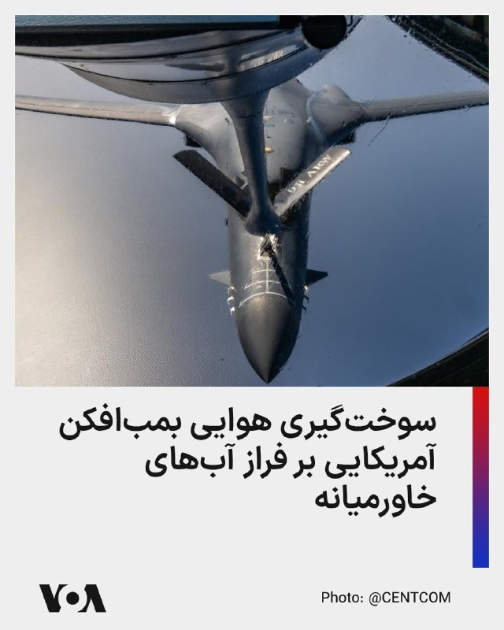

فرماندهی مرکزی ایالات متحده، سنتکام، تصویری از سوخت‌گیری هوایی یک بمب‌افکن بی-۱ بی «لنسر» توسط هواپیمای سوخت‌رسان کی‌سی-۱۳۵ استراتوتانکر کی‌سی-۱۳۵ را در جریان یک پرواز آموزشی بر فراز آب‌های خاورمیانه منتشر کرد.

@FarsiVOA

## FarsiVOA — post 218289

▪️مدیر شرکت ملی نفت ابوظبی اعلام کرد که حتی اگر اکنون درگیری‌ها در خاورمیانه پایان یابد، جریان صادرات نفت از تنگه هرمز تا سه‌ماهه اول یا دوم سال ۲۰۲۷ کاملاً به حالت قبل از این جنگ بازنخواهد گشت.

▪️او افزود که محاصره تنگه هرمز از سوی جمهوری اسلامی یک اقدام «خطرناک» است.

▪️منطقه خلیج فارس پیشتر بحران‌های مرتبط با انرژی را تجربه کرده اما این اولین بار است که یک بحران انرژی طولانی در این منطقه به دلیل انسداد تنگه هرمز ایجاد می‌شود.

▪️جمهوری اسلامی از آغاز درگیری نظامی با آمریکا و اسرائیل، عملاً این آبراه را که گلوگاهی برای عبور حدود یک‌پنجم صادرات جهانی نفت است، مسدود کرده است.

⬇️ بیشتر بخوانید:
https://ir.voanews.com/a/8152364.html

## FarsiVOA — post 218288

  <a href="telegram/content/FarsiVOA_218288_1779366002.mp4" target="_blank">🎬 Download video</a>

فرماندهی مرکزی ایالات متحده، سنتکام، اعلام کرد نیروهای تفنگدار دریایی آمریکا در دریای عمان روز چهارشنبه ۳۰ اردیبهشت وارد یک نفتکش تجاری با پرچم رژیم ایران به نام نفتکش ام‌تی «سلستیال سی» شدند.

به گفته سنتکام، این نفتکش مظنون به تلاش برای نقض محاصره دریایی آمریکا و حرکت به سوی یک بندر ایران بوده است. سنتکام می‌گوید پس از بازرسی، کشتی رفع توقیف شد و به خدمه دستور تغییر مسیر داده شد.

آمریکا همچنین اعلام کرد تاکنون مسیر ۹۱ کشتی تجاری را تغییر داده است.

@FarsiVOA

## FarsiVOA — post 218287

  

داده‌های جدید مرکز آمار اتحادیه اروپا، از سقوط چشمگیر تجارت این اتحادیه با ایران در ماه مارس، اولین ماه عملیات نظامی مشترک آمریکا و اسرائیل علیه جمهوری اسلامی، خبر می‌دهد.

آلمان بزرگترین شریک تجاری ایران در اتحادیه اروپا، در ماه مارس کمتر از ۲۵ میلیون یورو صادرات به ایران داشته که تقریباً یک سوم ماه‌های پیش از جنگ است.

صادرات ایتالیا، دومین شریک بزرگ تجاری، به ایران نیز تقریباً به همین میزان افت داشته و به زیر ۱۰ میلیون یورو رسیده است.

صادرات فرانسه و اتریش به ایران نیز به یک پنجم ماه‌های پیش از جنگ سقوط کرده است. صادرات ایران به اتحادیه اروپا در ماه مارس هم افت داشته، اما نه به اندازه افت وارداتش از این اتحادیه.

ایران پارسال ۷۵۰ میلیون یورو صادرات و ۲.۷ میلیارد یورو واردات از اتحادیه اروپا داشت.
@FarsiVOA

## FarsiVOA — post 218286

  <a href="telegram/content/FarsiVOA_218286_1779366003.mp4" target="_blank">🎬 Download video</a>

بازداشت ۸ فلسطینی در یک کامیون هنگام ورود غیرقانونی به اسرائیل؛

نیروهای امنیتی اسرائیل بیش از ۸ شهروند فلسطینی را که در یک محفظه مخفی در داخل یک کامیون پنهان شده بودند، بازداشت کردند.

این افراد تلاش می‌کردند به صورت غیرقانونی و از طریق پنهان شدن در دیواره کاذب کامیون وارد خاک اسرائیل شوند.

پس از کشف این محفظه مخفی، تمامی سرنشینان آن توسط نیروهای امنیتی بازداشت و برای بازجویی و بررسی انگیزه‌های ورودشان منتقل شدند.
@FarsiVOA

## FarsiVOA — post 218284

  <a href="telegram/content/FarsiVOA_218284_1779366007.mp4" target="_blank">🎬 Download video</a>

حمله پهپادی اوکراین به پالایشگاه «سیزران» روسیه از فاصله ۸۰۰ کیلومتری؛

ولودیمیر زلنسکی، رئیس‌جمهور اوکراین، رسماً تایید کرد که ارتش این کشور پالایشگاه نفت سیزران در خاک روسیه را هدف قرار داده است.

این هدف‌گیری از فاصله‌ بیش از ۸۰۰ کیلومتری از مرز اوکراین انجام شده است.

این عملیات به عنوان یکی از دوربردترین حملات اوکراین در عمق خاک روسیه تا به امروز ثبت شده است.

حمله به این پالایشگاه در راستای استراتژی جدید اوکراین برای ضربه زدن به زیرساخت‌های حیاتی و درآمدهای نفتی ارتش روسیه انجام شده است.

پیشتر فایننشال تایمز به نقل از منابع آگاه گزارش داده بود که رئیس‌جمهور چین در جریان گفت‌وگوهای خود با دونالد ترامپ در پکن، گفته که ولادیمیر پوتین ممکن است در نهایت از تهاجم خود به اوکراین «پشیمان» شود.
@FarsiVOA

## FarsiVOA — post 218283

  <a href="telegram/content/FarsiVOA_218283_1779366009.mp4" target="_blank">🎬 Download video</a>

رهگیری خطرناک هواپیمای گشت‌زنی بریتانیا توسط جنگنده‌های روسیه در دریای سیاه؛

وزارت دفاع بریتانیا با انتشار این ویدیو از رهگیری «شدیدا خطرناک» یک فروند هواپیمای راهبردی «ریوت جوینت» متعلق به نیروی هوایی سلطنتی، توسط جنگنده‌های ارتش روسیه در حریم هوایی بین‌المللی بر فراز دریای سیاه خبر داد.

جنگنده‌های روسی در اقدامی بی‌مهابا تا فاصله ۶ متری هواپیمای بریتانیایی نزدیک شدند که این مانور خطرناک باعث فعال شدن سیستم‌های هشدار اضطراری خودکار این هواپیما شد.

این هواپیمای پیشرفته جاسوسی و الکترونیکی بریتانیا، در حال انجام یک پرواز گشت‌زنی روتین برای پشتیبانی از عملیات ناتو و تقویت امنیت جناح شرقی این ائتلاف بود که علی‌رغم این مزاحمت، ماموریت خود را با موفقیت و به سلامت به پایان رساند.

مقامات بریتانیا این حادثه را نشانه‌ای از تداوم رفتارهای تهاجمی روسیه در شرق اروپا ارزیابی و تأکید کردند که لندن و متحدانش در ناتو در برابر این تهدیدات یکپارچه خواهند ماند.
@FarsiVOA

## FarsiVOA — post 218282

  

رسانه‌های حکومتی جمهوری اسلامی از بازگشت ۲۰ ملوان ایرانی در پی توقیف کشتی آنان توسط نیروهای آمریکایی در سواحل سنگاپور خبر دادند.

دقیقاً مشخص نیست نام کشتی توقیف شده چه بوده، اما دو هفته پیش نیز یک گروه از ملوانان کشتی توقیف شده «توسکا» با وساطت پاکستان آزاد و به ایران بازگشتند. اوایل اردیبهشت نیز وزارت جنگ آمریکا از ورود نیروهای نظامی ایالات متحده به عرشه نفتکش «تیفانی» مرتبط با جمهوری اسلامی در منطقه هند-آرام و توقیف کشتی و خدمه آن خبر داده بود.

دولت پاکستان اوایل هفته جاری خبر داده بود که طبق توافقاتی که با آمریکا انجام داده، ۲۰ ملوان ایرانی یک کشتی توقیف شده جمهوری در سنگاپور را به خاک پاکستان منتقل کرده است.

اکنون رسانه‌های ایران می‌گویند خدمه‌های یاد شده پنجشنبه با پرواز ماهان ایر به تهران بازگشتند.
@FarsiVOA

## FarsiVOA — post 218281

🔺پاکستان همزمان با احتمال سفر عاصم منیر به تهران تلاش‌های دیپلماتیک را افزایش داد

▪️پاکستان با طرح احتمال سفر از پیش برنامه‌ریزی‌نشده رئیس ستاد ارتش این کشور به تهران، تلاش‌ها برای تسریع روند مذاکرات آمریکا و جمهوری اسلامی را افزایش داد.

▪️رویترز پنجشنبه از قول سه منبع آگاه از مذاکرات نوشت که عاصم منیر در این روز تصمیم می‌گیرد در چارچوب تلاش‌های میانجی‌گری به تهران سفر کند یا نه.

▪️این سفر در ادامه سفرهای مکرر مقامات پاکستانی به تهران با هدف میانجیگری برای پایان جنگ علیه جمهوری اسلامی است.

▪️پرزیدنت ترامپ که روز دوشنبه از توقف موقت یک حمله برنامه‌ریزی‌شده به منظور به نتیجه رسیدن مذاکرات جاری خبر داد، بارها بر عزم خود برای جلوگیری از دستیابی ایران به سلاح هسته‌ای تأکید کرده است.

⬇️ بیشتر بخوانید:
https://ir.voanews.com/a/pakistan-steps-up-diplomatic-bid-to-get-iran-us-peace-talks-on-track/8152360.html

## DW_Farsi — post 124958

🔶 آمادگی ایلان ماسک برای بزرگ‌ترین عرضه اولیه سهام اسپیس‌ایکس

ایلان ماسک از برنامه عرضه اولیه سهام شرکت اسپیس‌ایکس خبر داد؛ اقدامی که می‌تواند او را به نخستین تریلیونر جهان تبدیل کند. این اقدام در حالی انجام می‌شود که این شرکت فضایی سال گذشته با زیان میلیاردی مواجه بوده است.

به گفته ایلان ماسک، میلیاردر دنیای فناوری، قرار است شرکت صنایع هوافضای اسپیس‌ایکس او بزرگ‌ترین عرضهٔ اولیه سهام (IPO) تاریخ را انجام دهد.

عرضه اولیه سهام وقتی اتفاق می‌افتد که یک شرکت خصوصی برای نخستین بار سهام خود را برای خرید در بازار بورس عرضه می‌کند و به یک شرکت سهامی عام تبدیل می‌شود. هدف از این کار، جذب سرمایه کلان برای توسعه کسب‌وکار و افزایش اعتبار مالی است.

ایلان ماسک این خبر را به صورت رسمی در روز چهارشنبه ۲۰ مه اعلام کرد.

ارزش این شرکت با این کار می‌تواند به ۱.۷۵ تریلیون دلار برسد و از این نظر شرکت نفتی آرامکوی عربستان را به‌عنوان بزرگ‌ترین ارائه‌دهنده عرضه اولیه سهام تاریخ پشت سر بگذارد.

@dw_farsi

## DW_Farsi — post 124957

🔶 بازگشت مانوئل نویر به دروازه تیم ملی فوتبال آلمان

🔻 گزارشی از شهرام احدی

روز پنحشنبه ۲۱ مه، کنفرانس خبری یولیان ناگلزمان، سرمربی تیم ملی فوتبال آلمان در فرانفکورت، مقر فدراسیون فوتبال این کشور برگزار شد. او در این نشست کادر خود برای حضور آلمان در مسابقات جام جهانی ۲۰۲۶ را اعلام کرد.

در حالیکه دعوت بسیاری از آنان انتظار می‌رفت، نام یک بازیکن در روز‌های گذشته بحث‌های فراوانی را به دنبال داشته است: مانوئل نویر.

نویر که مرز ۴۰ سالگی را پشت سر گذاشته، در جام جهانی ۲۰۱۴ با آلمان قهرمان جهان شده و ده سال بعد (۲۰۲۴) پس از ناکامی ملی‌پوشان این کشور در مسابقات جام ملت‌های اروپا از تیم ملی خداحافظی و اعلام کرده بود که قصد دارد نیروی خود را بر فعالیت‌های باشگاهی خود در بایرن مونیخ متمرکز کند.

نویر که تا تابستان ۲۰۲۷ با بایرن مونیخ قرار دارد، هنوز هم یکی از بهترین دروازه‌بانان جهان محسوب می‌شود، اما بازگشت او به دروازه آلمان تا اندازه‌ای دور از انتظار بوده است. آنچه که سبب طرح انتقادهای فراوان شده، عملکرد سرمربی کنونی تیم آلمان در شیوه اطلاع‌رسانی و مسایل روابط عمومی بوده است. ناگلزمان تا چندی پیش از اولیور باومان، دروازه‌بان هوفن‌هایم به عنوان دروازه‌بان شماره یک آلمان یاد کرده بود.

بسیاری از هواداران و همچنین کارشناسان افزون بر این، به سودمند بودن حضور نویر در جام ۲۰۲۶ تردید دارند.

@dw_farsi

## DW_Farsi — post 124956

  

🔶 هشدار مشاور رئیس امارات به ایران: تلاش برای کنترل تنگه هرمز خیال خامی بیش نیست

انور قرقاش، مشاور دیپلماتیک رئیس امارات متحده عربی، هشدار داد تلاش‌های جمهوری اسلامی برای اعمال حاکمیت بر تنگه هرمز یا تجاوز به حاکمیت دریایی امارات "خیال خامی بیش نیست".

قرقاش روز پنج‌شنبه با انتشار پیامی در ایکس نوشت: «ما طی دهه‌های طولانی به زورگویی‌های ایران عادت کرده‌ایم، تا جایی که این رفتار به بخشی از چشم‌انداز سیاسی خلیج فارس تبدیل شده و در میان لفاظی‌های تهاجمی و اعلام دوستی‌های توخالی، جایی برای اعتبار باقی نمانده است.»

او ادامه داد: «امروز، پس از تجاوز وحشیانه ایران، رژیم تلاش می‌کند واقعیتی جدید را که از یک شکست آشکار نظامی متولد شده تثبیت کند، اما تلاش برای کنترل تنگه هرمز یا تعرض به حاکمیت دریایی امارات متحده عربی چیزی جز خیال خام نیست.»

@dw_farsi

## DW_Farsi — post 124955

  

🔶 شریعتمداری: تنگه هرمز باید تا کشته شدن ترامپ به روی آمریکایی‌ها بسته بماند

حسین شریعتمداری، مدیرمسئول روزنامه کیهان، خواستار آن شد تا تمام کشتی‌ها و شناور‌هایی که متعلق به اسرائیل هستند یا برای این کشور نفت حمل می‌کنند، مصادره شوند. او در یادداشتی با انتقاد از مجلس شورای اسلامی به دلیل "به تعویق انداختن تعیین و تصویب نظام قانونی" برای اعمال حاکمیت ایران بر تنگه هرمز نوشت، جمهوری اسلامی باید از "تمامی شناورها بدون استثناء" عوارض دریافت کند و این تنگه را به روی شناورهای آمریکایی و متحدان این کشور ببندد.

شریعتمداری همچنین اضافه کرد تنگه هرمز باید تا زمان "دریافت خسارت‌‌های وارده از آمریکا و متحدان غربی و عربی آن" و نیز "برچیده‌ شدن پایگاه‌های آمریکایی از منطقه و در صدر آن کشتن ترامپ و دار و دسته‌" او بسته بماند.

ابراهیم عزیزی، رئیس کمیسیون امنیت ملی و سیاست خارجی مجلس، اخیرا گفته بود طرحی برای ارائه به صحن مجلس تدوین شده که در آن مقرر شده است دولت به هر فرد حقیقی یا حقوقی که دونالد ترامپ، رئیس جمهور آمریکا، را بکشد "۵۰ میلیون یورو" پاداش دهد.

@dw_farsi

## DW_Farsi — post 124954

  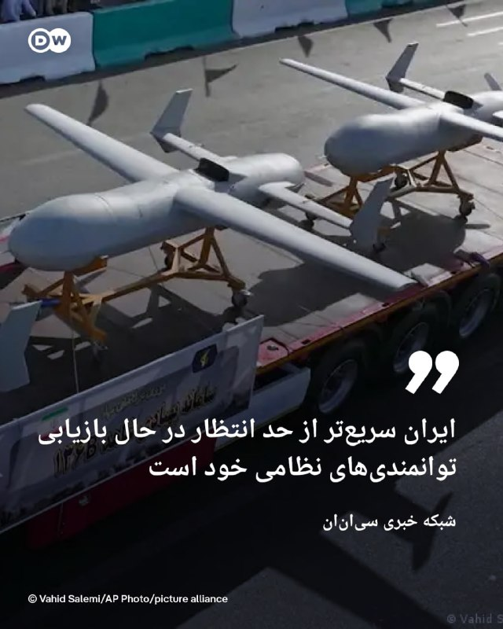

🔶 سی‌ان‌ان‌: ایران سریع‌تر از حد انتظار در حال بازیابی توانمندی‌های نظامی خود است

دو منبع آگاه به شبکه خبری "سی‌ان‌ان" گفته‌اند که ارزیابی‌های اطلاعاتی ایالات متحده نشان می‌دهد ایران در طول آتش‌بس که از حدود شش هفته پیش آغاز شده، بخشی از تولید پهپادی خود را از سر گرفته‌ است و این امر نشان می‌دهد که این کشور به سرعت در حال بازسازی برخی از قابلیت‌های نظامی تضعیف‌شده خود در پی جنگ با آمریکا و اسرائیل است.

سی‌ان‌ان روز پنج‌شنبه به نقل از چهار منبع مطلع دیگر گزارش داد که بر اساس ارزیابی اطلاعاتی آمریکا، ارتش ایران "بسیار سریع‌تر از برآوردهای اولیه" در حال بازسازی توان نظامی خود است.

این منابع گفته‌اند بازسازی‌ توانمندی‌های نظامی نظیر جایگزینی سایت‌های موشکی، پرتابگر‌ها و ظرفیت تولید سامانه‌های تسلیحاتی کلیدی که در جنگ نابود شده‌اند، به این معناست که در صورت از سرگیری حملات آمریکا و اسرائیل، ایران همچنان تهدیدی جدی برای متحدان منطقه‌ای آمریکا خواهد بود. به نوشته سی‌ان‌ان‌ این موضوع همچنین ادعاها در مورد میزان واقعی تأثیر حملات آمریکا و اسرائیل بر تضعیف بلندمدت توان نظامی ایران تردید ایجاد کرده است.

@dw_farsi

## DW_Farsi — post 124953

  

📸 کلاه‌ها به نشانه شادی در هوا

مراسم پایانی دوره افسری گارد ساحلی ایالات متحده در نیولندن با شادی فارغ‌التحصیلان برگزار شد. آکادمی گارد ساحلی آمریکا پیشینه‌ای طولانی دارد. در جشن امسال دونالد ترامپ، رئیس جمهور آمریکا حضور داشت و سخنانی خطاب به فارغ‌التحصیلان ایراد کرد. پرسنل گارد ساحلی آمریکا بیش از ۴۳ هزار نفر است.

## DW_Farsi — post 124952

  

🔶 عاصم منیر، فرمانده ارتش پاکستان، راهی تهران می‌شود

رسانه‌های داخلی ایران گزارش داده‌اند فیلد مارشال عاصم منیر، فرمانده ارتش پاکستان، روز پنج‌‌شنبه ۳۱ اردیبهشت به تهران سفر می‌کند. این سفر در حالی صورت می‌گیرد که روز چهارشنبه نیز وزیر کشور پاکستان برای دومین بار در هفته جاری به تهران رفته و با مسعود پزشکیان، رئیس جمهور و اسکندر مؤمنی وزیر کشور ایران دیدار و گفت‌وگو کرده بود.

در این گزارش‌ها بدون اشاره به جزئیات بیشتر گفته شده که عاصم منیر برای "ادامه گفت‌وگو‌ها و رایزنی با مقامات" ایرانی در چارچوب تلاش‌های میانجی‌گرانه پاکستان میان ایران و آمریکا راهی تهران می‌شود.

@dw_farsi

## DW_Farsi — post 124951

  

🔶 رئیس جمهور آلمان: جنگ ایران یک جنگ غیرضروری است

فرانک والتر اشتاین‌مایر، رئیس جمهور آلمان، در گفت‌وگویی با پادکست "Vorangedacht" حمله نظامی آمریکا و اسرائیل به ایران را "قابل اجتناب" خوانده و گفت: «این جنگ غیرضروری است.»

اشتاین مایر با اشاره به توافق هسته‌ای سال ۲۰۱۵ موسوم به "برجام" که میان ایران و غرب امضا شد و آمریکا در نخستین دوره ریاست‌جمهوری دونالد ترامپ در سال ۲۰۱۸ از آن خارج شد، گفت: «خوب می‌بود که ما این توافق را حفظ می‌کردیم. عواقبی که اکنون شاهد آن هستیم، نباید اتفاق می‌افتادند.»

رئیس جمهور آلمان اوایل فروردین نیز در یک سخنرانی شدیدالحن، جنگ ایران را "یک خطای سیاسی فاجعه‌بار" خوانده و گفته بود اگر هدف آن متوقف کردن ایران در مسیر دستیابی به سمت بمب اتمی بوده باشد، "یک جنگ واقعا قابل اجتناب و غیرضروری" است.

@dw_farsi

## Persian_Trend_Official — post 14585

  <a href="telegram/content/Persian_Trend_Official_14585_1779366016.webm" target="_blank">🎬 Download video</a>

⭕️رویترز:

💢ترامپ به اسرائیل قول داده است که اورانیوم غنی‌شده از ایران خارج شود و هر معامله‌ای باید شامل این بند باشد.

🫆:Tony

📌 @persian_trend_official
پرشین ترند | متفاوت‌ترین کانال نظامی

## Persian_Trend_Official — post 14584

  

⭕️دیدار پزشکیان با فرمانده کل ارتش

🔻پزشکیان:
ارتش با آمادگی عملیاتی بالا اقتدار دفاعی کشور را به نمایش گذاشت

انسجام ملی و اقتدار نیروهای مسلح مهم‌ترین پشتوانه امنیت کشور است.

🔻فرمانده کل ارتش:
ارتش جمهوری اسلامی ایران آمادگی کامل دارد تا در برابر هرگونه تهدید، تجاوز یا اقدام ماجراجویانه علیه کشور، پاسخی قاطع، پشیمان‌کننده و درخور اقتدار جمهوری اسلامی ایران ارائه کند

🫆:Tony

📌 @persian_trend_official
پرشین ترند | متفاوت‌ترین کانال نظامی

## Persian_Trend_Official — post 14582

💢وضعیت هوش مصنوعی داخلی در پیام رسان بله ...

🫆:Tony

📌 @persian_trend_official
پرشین ترند | متفاوت‌ترین کانال نظامی

## Persian_Trend_Official — post 14581

  <a href="telegram/content/Persian_Trend_Official_14581_1779366017.mp4" target="_blank">🎬 Download video</a>

💢جنگ طلبی از صفات بارز امام بود ...

🫆:Tony

📌 @persian_trend_official
پرشین ترند | متفاوت‌ترین کانال نظامی

## Persian_Trend_Official — post 14580

🔴 سفر احتمالی عاصم منیر به تهران؛ آخرین تلاش برای جلوگیری از بازگشت جنگ؟

💢گزارش‌ها حاکی است سفر احتمالی «عاصم منیر» فرمانده ارتش پاکستان به تهران، نشانه وجود پیام‌های مهم و مذاکرات حساس میان طرف‌هاست.

💢بر اساس ارزیابی‌ها:

▪️ بسیاری این تحرکات را آخرین فرصت برای جلوگیری از ازسرگیری جنگ می‌دانند

▪️ با این حال اختلافات اساسی میان ایران و آمریکا همچنان پابرجاست

💢خواسته‌های اصلی ایران:

▪️ دریافت تضمین برای جلوگیری از وقوع جنگی دیگر

▪️ به‌رسمیت شناختن کنترل ایران بر تنگه هرمز

▪️ آزادسازی دارایی‌های بلوکه‌شده

▪️ باقی ماندن بخشی از ذخایر اورانیوم غنی‌شده در داخل کشور

💢در مقابل، آمریکا خواستار:

▪️ تعطیلی تمامی تأسیسات هسته‌ای ایران به‌جز مرکز تهران شده است

▪️ واشینگتن تأکید دارد حتی تأسیسات باقی‌مانده نیز نباید فعالیت غنی‌سازی داشته باشند

💢اختلاف دیگر بر سر نحوه اجرای توافق است:

▪️ آمریکا خواهان اجرای کامل و یک‌باره توافق است

▪️ اما ایران می‌گوید اگر جنگ طی ۳۰ روز نخست پایان یابد، سایر مراحل می‌تواند به‌تدریج اجرا شود

💢همچنین گزارش شده آمریکا قادر نیست تضمین دهد اسرائیل ترورهای هدفمند در داخل ایران را متوقف خواهد کرد؛ مسئله‌ای که یکی از مهم‌ترین نگرانی‌های تهران محسوب می‌شود.

🫆:Tony

📌 @persian_trend_official
پرشین ترند | متفاوت‌ترین کانال نظامی

## Persian_Trend_Official — post 14579

  

💢نت‌بلاکس، نهاد ناظر بر اینترنت، نوشت که داده‌های این نهاد نشان می‌دهد قطعی اینترنت در ایران وارد هشتادوسومین روز خود شده و شبکه‌های بین‌المللی بیش از هزار و ۹۶۸ ساعت است که به‌طور گسترده مسدود مانده‌اند.

💢این نهاد ناظر بر اینترنت با تاکید بر اهمیت دسترسی آزاد به اینترنت نوشت: «اینترنت آزاد و باز، برای حفاظت از جان، آزادی و پاسخگویی عمومی نقشی اساسی دارد.»

🫆:Tony

📌 @persian_trend_official
پرشین ترند | متفاوت‌ترین کانال نظامی

## Persian_Trend_Official — post 14578

  

🔴 آمریکا و نیجریه فرمانده ارشد داعش در آفریقا را کشتند

💢ایالات متحده و نیجریه اعلام کردند در عملیات مشترکی «ابوبلال المینوکی» از فرماندهان ارشد داعش در غرب آفریقا کشته شده است.

▪️ المینوکی از رهبران اصلی شاخه «داعش ولایت غرب آفریقا» (ISWAP) بود
▪️ او پیش‌تر عضو بوکوحرام بوده و پس از انشعاب این گروه به داعش پیوسته بود
▪️ برخی منابع اطلاعاتی او را «نفر دوم داعش در سطح جهانی» توصیف کرده‌اند

💢شاخه غرب آفریقای داعش طی سال‌های اخیر به یکی از فعال‌ترین و خطرناک‌ترین شاخه‌های این گروه در جهان تبدیل شده است.

🫆:Tony

📌 @persian_trend_official
پرشین ترند | متفاوت‌ترین کانال نظامی

## Persian_Trend_Official — post 14577

🔴 رهبر جمهوری اسلامی دستور داده ذخایر اورانیوم از کشور خارج نشود

💢خبرگزاری رویترز به نقل از منابع ایرانی گزارش داد رهبر جمهوری اسلامی دستور داده ذخایر اورانیوم غنی‌شده نزدیک به سطح تسلیحاتی، از کشور خارج نشود.

🫆:Tony

📌 @persian_trend_official
پرشین ترند | متفاوت‌ترین کانال نظامی

## Persian_Trend_Official — post 14576

  <a href="telegram/content/Persian_Trend_Official_14576_1779366019.webm" target="_blank">🎬 Download video</a>

💢انور قرقاش، مشاور محمد بن زاید

💢ما طی دهه‌های طولانی به قلدری و زورگویی ایران عادت کرده‌ایم، تا جایی که بخشی از صحنه سیاسی خلیج فارس شده است. اعتبارشان بین گفتارهای تهاجمی و بیانیه‌های دوستی توخالی از بین رفته است.

💢امروز، پس از تجاوز وحشیانه ایران، رژیم تلاش می‌کند واقعیت جدیدی را تحکیم کند که از یک شکست نظامی آشکار متولد شده. اما تلاش برای کنترل تنگه هرمز یا تعدی به حاکمیت دریایی امارات، چیزی جز رویاهای پریشان و واهی نیست.

💢هر کس که بخواهد با محیط عربی خود همزیستی کند، باید بداند که اعتماد از بین رفته و بازگرداندن آن با شعارها ممکن نیست، بلکه با زبان مسئولانه، احترام به حاکمیت و تعهد واقعی به اصول همسایگی خوب انجام می‌شود.

🫆:Tony

📌 @persian_trend_official
پرشین ترند | متفاوت‌ترین کانال نظامی

## Persian_Trend_Official — post 14575

  <a href="telegram/content/Persian_Trend_Official_14575_1779366020.webm" target="_blank">🎬 Download video</a>

⭕️بندرعباس لرزید

💢دقایقی پیش زمین لرزه ای به قدرت ۴.۶ ریشتر بندرعباس را لرزاند

🫆:Tony

📌 @persian_trend_official
پرشین ترند | متفاوت‌ترین کانال نظامی

## Persian_Trend_Official — post 14574

🔴 سخنگوی وزارت خارجه ایران: در حال بررسی پاسخ جدید آمریکا هستیم

💢اسماعیل بقایی، سخنگوی وزارت خارجه ایران، اعلام کرد تهران در حال بررسی آخرین پاسخ واشینگتن به چارچوب پیشنهادی آتش‌بس است؛ چارچوبی که پس از چند دور تبادل پیام با میانجیگری پاکستان ارائه شده است.

بر اساس گزارش‌ها:

▪️ پیام‌ها میان تهران و واشینگتن از طریق پاکستان ادامه دارد
▪️ ایران هنوز تصمیم نهایی درباره پیشنهاد آمریکا نگرفته است
▪️ مذاکرات بر محور پایان جنگ، کاهش تنش و مسائل مربوط به تنگه هرمز متمرکز است

💢بقایی همچنین گفته تصمیم نهایی پس از تکمیل بررسی‌های داخلی ایران اتخاذ خواهد شد.

🫆:Tony

📌 @persian_trend_official
پرشین ترند | متفاوت‌ترین کانال نظامی

## Persian_Trend_Official — post 14573

  

⭕️ ژاپن به ساخت هواپیمای مافوق صوت خود نزدیک شده است. آژانس فضایی ژاپن (JAXA) به همراه دانشگاه‌های واسدا، توکیو و کیئو آزمایش‌های زمینی موتور رمجت (Ramjet) برای وسیله پروازی مافوق صوتی که قادر به پرواز با سرعتی پنج برابر سرعت صوت است را انجام دادند.

آزمایش‌ها در مرکز فضایی کاکودا انجام شد. در تونل باد، دانشمندان پرواز مافوق صوت را شبیه‌سازی کردند و عملکرد موتور رمجت، سیستم‌های کنترل و محافظ حرارتی هواپیما را بررسی کردند. در سرعت ۵ ماخ (تقریباً حدود ۶۱۰۰ کیلومتر بر ساعت) دمای هوای اطراف وسیله می‌تواند به حدود ۱۰۰۰ درجه سانتی‌گراد برسد، اما سیستم محافظ حرارتی توانست شرایط تقریباً نرمالی را برای عملکرد الکترونیک داخل سازه حفظ کند.

این پروژه به منظور ساخت یک سکوی آزمایشی مافوق صوت طراحی شده است. مرحله بعدی باید آزمایش‌های پروازی کامل با نصب وسیله آزمایشی روی یک راکت ژئوفیزیکی باشد. هدف اصلی برنامه ایجاد فناوری‌هایی برای هواپیماها و فضاپیماهای مافوق صوت آینده است.

در JAXA معتقدند که در آینده این فناوری‌ها امکان کاهش زمان پرواز بین ژاپن و آمریکا از طریق اقیانوس آرام را به حدود دو ساعت فراهم می‌کنند. علاوه بر این، تحقیقات می‌توانند پایه‌ای برای ساخت وسایلی باشند که قادر به صعود تا ارتفاع حدود ۱۰۰ کیلومتر هستند.

📝 Nick

📌 @persian_trend_official
پرشین ترند | متفاوت‌ترین کانال نظامی

## Persian_Trend_Official — post 14572

  

💢سخنگوی وزارت خارجه روسیه: مسکو آماده کمک به اجرای توافقات احتمالی میان ایران و آمریکا است

💢ماریا زاخارووا، سخنگوی وزارت امور خارجه روسیه گفت، روسیه کاملاً آماده است کمک‌های لازم را به تهران و واشنگتن برای اجرای تصمیماتی که ممکن است در جریان مذاکرات میان آن‌ها حاصل شود، ارائه دهد.

🫆:Tony

📌 @persian_trend_official
پرشین ترند | متفاوت‌ترین کانال نظامی

## Persian_Trend_Official — post 14571

  <a href="telegram/content/Persian_Trend_Official_14571_1779366022.mp4" target="_blank">🎬 Download video</a>

💢 لو رفتن موقعیت توسط نیروهای خودی و گیر افتادن ۴۸ ساعته و خفه شدن نیروهای سپاه پاسداران داخل تونل موشکی

🫆:Tony

📌 @persian_trend_official
پرشین ترند | متفاوت‌ترین کانال نظامی

## Persian_Trend_Official — post 14570

  

به بهانه امنیت اینترنت 80 میلیون ایرانی رو قطع میکنن !
اونوقت با پاکستانی ها دیدار میکنن !
بعد مه ترورش کردن میگن وحیدی رو از طریق اینترنت رد زنی کردن !!!

📌 @persian_trend_official
پرشین ترند | متفاوت‌ترین کانال نظامی

## Persian_Trend_Official — post 14569

بازارهای خلیج فارس با امید به توافق جمهوری اسلامی و آمریکا رشد کردند

خبرگزاری رویترز گزارش داد بازارهای سهام خلیج فارس در آغاز معاملات پنج‌شنبه ۳۱ اردیبهشت، تحت تاثیر امیدها به نزدیک شدن آمریکا و جمهوری اسلامی به توافقی برای پایان جنگ خاورمیانه و همچنین افزایش قیمت نفت، رشد کردند.

بر اساس این گزارش، سرمایه‌گذاران پس از سخنان دونالد ترامپ درباره قرار داشتن مذاکرات با جمهوری اسلامی در مراحل پایانی، نشانه‌های پیشرفت در گفت‌وگوها را دنبال می‌کنند.

ترامپ هم‌زمان هشدار داده اگر جمهوری اسلامی با توافق موافقت نکند، حملات بیشتری انجام خواهد شد.

شاخص بورس دبی یک درصد، شاخص ابوظبی ۰/۲ درصد و شاخص قطر ۰/۶ درصد افزایش یافتند. در مقابل، شاخص بورس عربستان سعودی اندکی کاهش یافت. قیمت نفت برنت نیز با رشد بیش از یک درصدی به ۱۰۶ دلار و ۲۹ سنت در هر بشکه رسید.

📌 @persian_trend_official
پرشین ترند | متفاوت‌ترین کانال نظامی

## RadioFarda — post 157420

هشدار نماینده کنگره آمریکا؛ ابهام و شکاف در ائتلاف غرب به سود روسیه، ایران و چین است

🔸دان بیکن، از جمهوری‌خواهان ارشد کمیته نیروهای مسلح مجلس نمایندگان آمریکا، در مصاحبه‌ای مفصل می‌گوید ابهام و عدم قطعیت واشینگتن می‌تواند دشمنان آمریکا، از جمله روسیه، ایران و چین را «گستاخ‌تر» کند؛ آن هم در شرایطی که تنش‌ها در داخل ائتلاف ناتو رو به افزایش است.

🔸این ژنرال سابق نیروی هوایی این اظهارات را در گفت‌وگو با رادیو اروپای آزاد/رادیو آزادی و هم‌زمان با اعلام پنتاگون درباره کاهش شمار تیپ‌های رزمی ارتش آمریکا در اروپا از چهار تیپ به سه تیپ و نیز تعویق استقرار برنامه‌ریزی‌شده نیروها در لهستان مطرح کرد.

🔸بیکن گفت بازنگری در استقرار نیروها، بخشی از موضوع گسترده‌ترِ نحوهٔ مواجههٔ آمریکا با چالش‌های هم‌زمان ناشی از روسیه، چین، ایران و گروه‌های افراط‌گرا است.

🔸او با بیان این‌که «ابهام در دنیای امروز خطرناک است»، گفت واشینگتن و متحدانش نمی‌توانند در شرایطی که این تهدیدها بیش از پیش با هم مرتبط می‌شوند، فاقد شفافیت راهبردی باشند.

🔸گفت‌وگوی کامل را در وب‌سایت رادیو فردا می‌توانید بخوانید.

@RadioFarda

## RadioFarda — post 157419

  <a href="https://t.me/radiofarda/157419" target="_blank">📎 Download file</a>

📻بشنوید: ساعت ۱۴ با رادیوفردا، ۳۱ اردیبهشت ۱۴۰۵‌

@Radiofarda

## RadioFarda — post 157418

  

🔸سازمان حقوق بشر ایران روز چهارشنبه، ۳۰ اردیبهشت، خبر داد که در فروردین‌ماه گذشته دو شهروند عراق هم در ایران «به جرم جاسوسی» اعدام شده‌اند.

🔸به نوشته این سازمان، علی نادر العبیدی، ۲۷ ساله، و فاضل شیخ کریم، ۲۹ ساله، در یک پرونده مشترک با اتهام «جاسوسی» به اعدام محکوم شده بودند و حکم‌شان سحرگاه روز دوشنبه ۱۷ فروردین در زندان مرکزی کرج به اجرا درآمد.

🔸سازمان حقوق بشر ایران می‌گوید که این دو نفر «به اتهام جاسوسی برای نهادهای اطلاعاتی و امنیتی یکی از کشورهای عربی» در کرج بازداشت شده بودند.

🔸طبق محاسبه این سازمان، از زمان آغاز جنگ آمریکا و اسرائیل با ایران، هشت نفر به جرم جاسوسی در ایران اعدام شده‌اند.

🔸گروه‌های حقوق بشری از جمله سازمان عفو بین‌الملل می‌گویند ایران دارای بیشترین تعداد اعدام به نسبت جمعیت خود در جهان است، و پس از چین که آمار قابل اعتمادی از آن در دست نیست، بیشترین تعداد اعدام را در میان کشورها به خود اختصاص داده است.

@RadioFarda

## RadioFarda — post 157417

  <a href="telegram/content/RadioFarda_157417_1779366025.mp4" target="_blank">🎬 Download video</a>

🔸اعضای تیم ملی فوتبال ایران روز ۳۱ اردیبهشت برای شرکت در جلسات صدور ویزا در سفارت کانادا در آنکارا، پایتخت ترکیه، حضور یافتند.

🔸بر اساس گزارش‌ها این بازیکنان به یک مرکز خصوصی درخواست ویزا مراجعه و درخواست‌های ویزا را برای سفارت کانادا مرتب کردند.

🔸به گفته یک مقام رسمی فدراسیون فوتبال ایران برخی بازیکنان ایرانی مقیم خارج از کشور، پیش از سفر به اردوی تمرینی تیم در آنتالیا در ساحل مدیترانه‌ای ترکیه، در آنکارا به تیم ملحق شدند.

🔸جام‌جهانی به میزبانی مشترک ایالات متحده، کانادا و مکزیک برگزار خواهد شد و ایران قرار است هر سه بازی مرحله گروهی خود را در ایالات متحده انجام دهد.

🔸بحران نظامی و سیاسی در خاورمیانه بر حضور تیم ملی فوتبال ایران در جام‌جهانی سایه انداخته است.

🔸پیش‌تر فدراسیون فوتبال جمهوری اسلامی درخواست کرده بود که مسابقاتش به مکزیک منتقل شود، اما جیانی اینفانتینو، رئیس فیفا، با این درخواست مخالفت کرد.

@RadioFarda

## RadioFarda — post 157416

  

🔸سفیر تهران در پاکستان از آزادی و بازگشت ۲۰ ملوان ایرانی یک کشتی توقیف‌شده توسط آمریکا در آب‌های سنگاپور به ایران خبر داد.

🔸سفیر ایران در پاکستان امروز پنجشنبه ۳۱ اردیبهشت اعلام کرد این ۲۰ ملوان ایرانی که به‌دلیل توقیف کشتی در وضعیت نامناسبی قرار داشتند، با وساطت و پیگیری پاکستان آزاد و امروز به کشور بازگشتند.

🔸بر اساس اعلام قبلی وزیر خارجه پاکستان، ۱۱ ملوان این کشتی که اکنون در آب‌های سنگاپور در حالت توقیف قرار دارد، تبعهٔ پاکستان هستند.

🔸ارتش ایالات متحده پس از توقف جنگ با ایران با آتش‌بسی که از ۱۹ فروردین اعلام شد، همزمان با مسدود نگه داشته شدن تنگه هرمز توسط سپاه پاسداران، اقدام به محاصره دریایی بنادر جنوبی ایران کرده است.

@RadioFarda

## RadioFarda — post 157415

  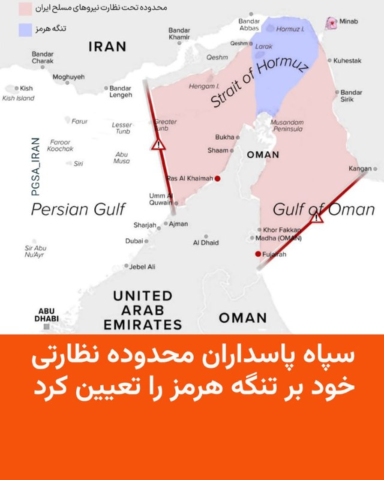

سپاه پاسداران محدوده نظارتی خود بر تنگه هرمز را تعیین کرد

🔸نهاد مدیریت آبراه خلیج فارس که اخیرا از طرف سپاه پاسداران تشکیل شده محدوده نظارتی خود بر تنگه هرمز را مشخص کرد.

🔸در اطلاعیه این نهاد گفته شده که این محدوده خط اتصال کوه مبارک در ایران و جنوب فجیره در امارات متحده عربی در شرق تنگه هرمز تا خط اتصال انتهای جزیره قشم در ایران و ام‌القُوین در غرب تنگه هرمز را شامل می‌شود.

🔸به گفته نیروی دریایی سپاه عبور و مرور از تنگه هرمز باید با هماهنگی با مدیریت آبراه خلیج فارس و مجوز این نهاد صورت بگیرد.

🔸هفته گذشته امارات اعلام کرد ظرفیت خط لوله‌ای که نفت آن کشور را از طریق بندر فجیره به بازارهای جهانی منتقل می‌کند، افزایش خواهد یافت.

🔸انتقال نفت از بندر فجیره بدون عبور از تنگه هرمز صورت می گیرد و ایران کنترلی بر آبهای ساحلی آن ندارد.

🔸روز گذشته ایران اعلام کرد ۲۶ کشتی در هماهنگی با نیروی دریایی سپاه از تنگه هرمز عبور کرده‌اند.

🔸هنوز معلوم نیست که صاحبان این کشتی‌ها پولی به ایران پرداخت کرده‌اند یا تنها با مجوز تهران از تنگه هرمز عبور کرده‌اند.

@RadioFarda

## RadioFarda — post 157414

  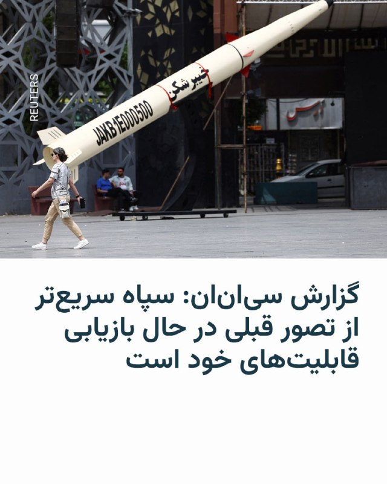

🔸شبکه تلویزیونی سی‌ان‌ان ۳۱ اردیبهشت به نقل از چند مقام اطلاعاتی آمریکا نوشت که سپاه پاسداران انقلاب اسلامی «بسیار سریع‌تر از آن چه تصور می‌شد» در حال بازسازی قابلیت‌ها و شاخه‌هایی از صنایع نظامی است که در اثر حملات آمریکا و اسرائیل آسیب شدید دیده بود.

🔸این شبکه به نقل از دو مقام آشنا به ارزیابی اطلاعاتی آمریکا نوشته است که در شش هفته‌ای که از آتش‌بس می‌گذرد، سپاه بازسازی صنایع خود را آغاز کرده و از جمله بخشی از چرخه تولید پهپاد را بار دیگر از سر گرفته است.

🔸چهار منبع به سی‌ان‌ان گفته‌اند که بازیابی قابلیت‌های نظامی در ایران بلافاصله پس از قطع حملات آمریکا و اسرائیل،‌ از جمله جایگزینی سایت‌های موشکی و پرتابگرها، به معنای آن است که ایران «هم‌چنان تهدیدی چشمگیر برای متحدان منطقه‌ای» آمریکا به شمار می‌رود.

🔸در دو تا سه هفته اول جنگی که با حملات مشترک آمریکا و اسرائیل در روز ۹ اسفند ۱۴۰۴ آغاز شد، دو کشور اعلام می‌کردند، سایت‌های موشکی و سایت‌های تولید پهپاد از جمله مهم‌ترین اهداف حملات بی‌امان آنها بود و گزارش‌های متعددی از خسارت‌های عمده این زمینه که به ایران وارد آمد، منتشر کردند.

@RadioFarda

## IranianMinds — post 20487

🔴 دو منبع ایرانی به رویترز:

مجتبی خامنه‌ای دستور داده است که اورانیوم غنی شده نباید از ایران خارج بشود.

@IranianMinds

## IranianMinds — post 20486

  

🔴 طبق قوانین جدید طالبان سن ازدواج برای دختر به ۹ سال کاهش یافت ، و اگر دختر در هنگام خواندن خطبه ی عقد سکوت کند هم به منزله ی رضایت به ازدواج تلقی میشود.

@IranianMinds

## IranianMinds — post 20485

  <a href="telegram/content/IranianMinds_20485_1779366031.mp4" target="_blank">🎬 Download video</a>

حدود نیم‌ قرن پیش، عده‌ای بی‌ تدبیر انقلاب کردند و از همان روز، خورشید این سرزمین غروب کرد.

دیگر نور و روشنایی و زیبایی را ندیدیم. نه کودکی ‌مان را زندگی کردیم، نه نوجوانی و نه جوانی. کل عمرمان گذشت بین مذاکرات و جنگ، گرانی و هزار سختی دیگر، و انگار همه چیز از دست رفت. مگه تا کی زنده‌ایم که فقط منتظر بمانیم…

@IranianMinds

## IranianMinds — post 20484

  <a href="telegram/content/IranianMinds_20484_1779366032.mp4" target="_blank">🎬 Download video</a>

اکانت اسرائیل به فارسی:

درخشش پرچم شیر‌ و خورشید در کنار پرچم کشورهای دیگر در شهر اشدود در اسرائیل.

@IranianMinds

## IranianMinds — post 20483

🔴 تایمز اسرائیل:

ایران در جریان آتش‌بس از فرصت برای جابه‌جایی لانچرهای موشکی و آماده‌سازی برای دور جدید درگیری استفاده کرده

@IranianMinds

## IranianMinds — post 20482

  <a href="telegram/content/IranianMinds_20482_1779366034.mp4" target="_blank">🎬 Download video</a>

ویدیویی از عروسی یک‌ زوج‌ جانفدا ، فقط اگه تونستید حدس بزنید عروس‌ کدومه جایزه دارید.

@IranianMinds

## IranianMinds — post 20481

🔴 والا نیوز

منابع اسرائیلی می‌گویند آمریکایی‌ها در مذاکرات با ایران یک قدم به جلو برداشته‌اند، بنابراین برآوردها این است که حمله‌ای به ایران در ۲۴ ساعت آینده تکرار نخواهد شد

@IranianMinds

## IranianMinds — post 20480

ثبت نام کن ۵۰۰ هزارتومان جایزه بگیر
نیازی هم به واریز نیست
تنها سایت مورد #تایید ما با بونوس های واقعی:

🌐
🌐 Winro.io

## IranianMinds — post 20479

  <a href="telegram/content/IranianMinds_20479_1779366035.webm" target="_blank">🎬 Download video</a>

🎯شانستو #رایگان امتحان کن 
⚠️

🤔 میدونستی توی #وینرو میتونی رایگان شرط ببندی؟

👍تنها کاری که باید بکنی اینه که عضو سایتش بشید و 
🤩
🤩
🤩 هزارتومان جایزه بگیرید بدون نیاز به واریز

💖تنها سایت مورد اعتماد ما با بونوس های کاملا واقعی و رویایی:

🌐 Winro.io

🌐 Winro.io
کانال بونوس های رایگان r31

📱 @winro_io

## BBCPersian — post 281698

رویترز: رهبر ایران دستور داده که اورانیوم غنی شده نباید به خارج از کشور ارسال شود

خبرگزاری رویترز به نقل از دو منبع ارشد ایرانی که نام‌شان را اعلام نکرده، گزارش داده که مجتبی خامنه‌ای، رهبر جمهوری اسلامی، دستوری صادر کرده است مبنی بر اینکه اورانیوم غنی شده با خلوص بالا نباید به خارج از کشور ارسال شود.

این امر موضع تهران را در مورد یکی از خواسته‌های اصلی آمریکا در مذاکرات صلح سخت‌تر می‌کند.

دستور مجتبی خامنه‌ای می‌تواند دونالد ترامپ را بیش از پیش مایوس کند و مذاکرات پیچیده در مورد پایان دادن به جنگ آمریکا و اسرائیل علیه ایران را پیچیده‌تر کند.

مقامات اسرائیلی به رویترز گفته‌اند که دونالد ترامپ به اسرائیل اطمینان داده است که ذخایر اورانیوم غنی‌شده با خلوص بالای ایران که نزدیک به درجه مورد نیاز برای ساخت سلاح اتمی است، از ایران خارج خواهد شد و هرگونه توافق صلح باید شامل بندی در این مورد باشد.

هنوز هیچکدام از رسانه های رسمی و حکومتی ایران در این باره خبری منتشر نکرده‌اند.

https://bbc.in/4fwMLUO
@BBCPersian

## BBCPersian — post 281697

بریتانیا با شش کشور حوزه خیلج فارس حدود پنج میلیارد دلار قرارداد تجاری امضا کرد

بریتانیا با شش کشور حوزه خلیج فارس یک توافق تجاری امضا کرده است که به گفته دولت، ارزش آن برای اقتصاد این کشور حدود پنج میلیارد دلار خواهد بود.

https://bbc.in/4tSdPBn
@BBCPersian

## BBCPersian — post 281696

🔻چین: آمریکا از استفاده و تهدید به ابزارهای قضایی علیه کوبا دست بردارد

چین روز پنج‌شنبه از آمریکا خواست که «از استفاده و تهدید به ابزارهای قضایی علیه کوبا دست بردارد.» این درخواست پس از آن‌ است که واشنگتن رائول کاسترو، رئیس‌جمهور سابق کوبا را به اتهام قتل تحت پیگرد قرار داد.

گوئو جیاکون، سخنگوی وزارت خارجه چین، در یک نشست خبری و در پاسخ به پرسشی درباره این اتهامات گفت: «طرف آمریکایی باید از به‌کار بردن ابزار تحریم و ابزار قضایی علیه کوبا دست بردارد و هر بار تهدید به زور را متوقف کند.»

ایالات متحده رائول کاسترو، رهبر پیشین کوبا، را به اتهام توطئه برای قتل شهروندان آمریکایی و چند اتهام دیگر در ارتباط با سرنگونی دو هواپیما در سال ۱۹۹۶ در مسیر کوبا و فلوریدا متهم کرد.

رائول کاسترو که اکنون ۹۴ ساله است، در آن زمان فرمانده نیروهای مسلح کوبا بود و پس از این حادثه با محکومیت بین‌المللی روبه‌رو شد.

https://bbc.in/4fwMLUO
@BBCPersian

## BBCPersian — post 281695

  <a href="telegram/content/BBCPersian_281695_1779366036.mp4" target="_blank">🎬 Download video</a>

🔻مردی در تگزاس به اتهام راندن عمدی وانت تسلا سایبرتراک خود به داخل دریاچه برای استفاده از ویژگی «حالت عبور از آب» این خودرو دستگیر شده است.

اداره پلیس گریپ‌واین اعلام کرد که مامورانش روز دوشنبه برای نجات وسیله نقلیه که پس از ورود به آب و گیر کردن آن توسط سرنشینانش رها شده بود، به دریاچه گریپ‌واین در شمال تگزاس فراخوانده شدند.

طبق دفترچه راهنمای آنلاین تسلا، حالت «عبور از آب» به سایبرتراک اجازه می‌دهد تا «وارد آب شود و از رودخانه‌ها یا نهرهایی» با حداکثر عمق ۸۱ سانتی‌متر عبور کند.

خودروی نیمه‌غرق‌شده از نزدیکی خط ساحلی ضلع جنوبی دریاچه بیرون کشیده شد و تیم نجات آبی اداره آتش‌نشانی گریپواین در این عملیات به پلیس کمک کرد.

طبق بیانیه پلیس، «راننده اظهار داشت که عمداً برای استفاده از ویژگی "عبور از آب" سایبرتراک به داخل دریاچه رانده است».

پلیس اعلام کرد که راننده به اتهام رانندگی در بخش ممنوع دریاچه و سایر تخلفات تجهیزات ایمنی آب بازداشت شده است.

سایبرتراک تسلا یک وانت برقی است که از بدنه فولادی ضد گلوله ساخته شده و با قیمت بیش از ۷۰ هزار دلار به فروش می‌رسد.

@BBCPersian

## BBCPersian — post 281694

🔻جنگ ایران باعث کاهش فعالیت بخش خصوصی در آلمان شده است

نتایج یک نظرسنجی که امروز (پنجشنبه) منتشر شد نشان می‌دهد که فعالیت بخش خصوصی آلمان برای دومین ماه پیاپی کاهش یافته است.

این نشان‌دهنده آن است که جنگ ایران روند رشد اقتصادی آلمان را کند کرده، تقاضا را تحت فشار قرار داده و باعث افزایش قیمت‌ها شده است.

هرچند شاخص اولیه ترکیبی مدیران خرید آلمان که توسط «اس‌ اند ‌پی گلوبال» تهیه می‌شود، در ماه مه نسبت به ماه آوریل اندکی افزایش داشت و به ۴۸‌‌/۶ رسید. با این حال، این شاخص همچنان پایین‌تر از سطح ۵۰ باقی ماند؛ سطحی که مرز میان رشد و انقباض اقتصادی به شمار می‌رود.

قرار گرفتن شاخص زیر ۵۰ به معنای ادامه کاهش فعالیت‌های اقتصادی است.

شاخص ترکیبی مدیران خرید، عملکرد بخش خدمات و صنعت را بررسی می‌کند. دو بخشی که در مجموع بیش از دوسوم اقتصاد آلمان، بزرگ‌ترین اقتصاد اتحادیه اروپا را تشکیل می‌دهند.

https://bbc.in/4fwMLUO
@BBCPersian

## BBCPersian — post 281693

🔻ایرلند رفتار اسرائیل با فعالان ناوگان غزه را «نفرت‌انگیز» خواند

سیمون هریس، معاون نخست‌وزیر جمهوری ایرلند، پس از بازداشت اعضای ناوگان کمک‌رسانی به غزه، از جمله چند شهروند ایرلندی توسط اسرائیل، خواستار «واکنش قوی و بدون ابهام اتحادیه اروپا» شد.

آقای هریس در شبکه اجتماعی ایکس نوشت: «اقدامات دولت اسرائیل و بازداشت غیرقانونی اعضای ناوگان سمود نفرت‌انگیز است و نمی‌تواند بدون عواقب باشد.»

او گفت که «محکومیت مهم است اما کافی نیست.»

معاون نخست‌وزیر جمهوری ایرلند این بازداشت‌ها را «نقض آشکار دیگری از قوانین بین‌المللی» توصیف کرد و درخواست کشورش را برای تعلیق عناصر تجاری توافقنامه همکاری اتحادیه اروپا و اسرائیل تکرار کرد.

او خواهان اقدام اتحادیه اروپا شد و تاکید کرد که «زمان زیادی گذشته است تا اروپا اقدامی انجام دهد.»

https://bbc.in/4fwMLUO
@BBCPersian

## BBCPersian — post 281691

🔻کانادا سفیر اسرائیل را احضار کرد

کانادا سفیر اسرائیل را به خاطر بازداشت فعالان ناوگان کمک به غزه احضار کرد.

مارک کارنی، نخست وزیر کانادا، در شبکه‌ اجتماعی ایکس نوشت: «وزیر امور خارجه کانادا به مقامات دستور داده است تا سفیر اسرائیل را احضار کنند و از او در مورد امنیت و سلامت کانادایی‌های درگیر در این ماجرا تضمین بگیرند.»

آقای کارنی همچنین ویدئویی را به اشتراک گذاشته که وزیر امنیت داخلی اسرائیل را نشان می‌دهد و نیروهای اسرائیلی با فعالان بازداشت شده بدرفتاری می‌کنند. او نوشته: «کانادا پیش از این تحریم‌های شدیدی را علیه آقای بن گویر، از جمله مسدود کردن دارایی‌ها و ممنوعیت سفر، در پاسخ به تحریک مکرر خشونت توسط او، اعمال کرده است.»

براساس گزارش‌ها ۱۱ شهروند کانادایی در ناوگان کمک‌رسانی به غزه حضور داشته‌اند.

https://bbc.in/4fwMLUO
@BBCPersian

## BBCPersian — post 281690

📽وقتی که رفت روزنامه‌ها نوشتند: عقاب از شهر کلاغ‌ها گریخت.

🔹او تنها به خاطر فوتبالیست خوب بودن شهرت نیافت. ناصر حجازی به خاطرنه گفتن به شرایط حاکم بود که محبوب شد.
🔹در پانزدهمین سال‌مرگش یادی می‌کنیم از او در برنامه این هفته آپارات.

📺برنامه این هفته آپارات
افسانه یک عقاب

🎬ساخته امیر رفیعی

🔹ساعات پخش
جمعه ۹:۰۰ شب
شنبه ۶:۳۰ صبح
شنبه ۱۱:۳۰ صبح
دو‌شنبه ۲:۰۰ بامداد
دوشنبه ۸:۳۰ شب
سه‌شنبه ۱۱:۳۰ صبح
تکرار جمعه ۱۱:۳۰ صبح

🔹از برنامه آپارات همیشه فیلم متفاوت ببینید.

@BBCPersian

## BBCPersian — post 281689

  <a href="telegram/content/BBCPersian_281689_1779366038.mp4" target="_blank">🎬 Download video</a>

⁨ دانشمندان موسسه «اوشن سنسس» (سرشماری اقیانوس) در سال گذشته بيش از یک هزار و ۱۰۰ گونه تازه دريايی كشف كرده‌اند؛ از يک اسفنج گوشتخوار گرفته تا يک «كوسه روح» و كرم پرزدار ساكن «قصر شيشه‌ای». اما شايد شگفت‌زده شويد اگر بدانيد اين يافته‌ها تنها قطره‌ای در اقيانوس‌اند؛ زيرا برآوردها نشان می‌دهد حدود ۹۰ درصد از گونه‌های دريايی هنوز كشف نشده‌اند.
این ویدیو را ببینید.⁩

@BBCPersian
https://bbc.in/4uoww0D

## BBCPersian — post 281688

  

شبکه خبری سی‌ان‌ان به نقل از دو منبع آگاه از ارزیابی‌های اطلاعاتی آمریکا گزارش داد که ایران در جریان آتش‌بس شش‌هفته‌ای که از اوایل آوریل آغاز شده، بخشی از تولید پهپادهای خود را از سر گرفته است.

این گزارش همچنین به نقل از چهار منبع و ارزیابی‌های اطلاعاتی آمریکا حاکیست که ایران با سرعتی بیش از برآوردهای اولیه در حال بازسازی توان نظامی خود است.

دیروز محمدباقر قالیباف، رئیس مجلس ایران در سومین پیام صوتی هفته‌های اخیر خود تایید کرد که در جریان آتش‌بس توان نظامی آن کشور با «قدرت بیشتری بازسازی شده است.»

در همین حال، دونالد ترامپ، رئیس‌جمهور آمریکا، روز چهارشنبه گفت که اگر ایران با طرح صلح موافقت نکند، ایالات متحده آماده انجام حملات بیشتر علیه آن کشور است.

با این حال او اشاره کرد که واشنگتن ممکن است چند روزی صبر کند تا «پاسخ‌های مناسب» را دریافت کند.

📸 Reuters

https://bbc.in/4fwMLUO
@BBCPersian

## BBCPersian — post 281687

🔻دیدار وزیر کشور پاکستان با عباس عراقچی

محسن نقوی، وزیر کشور پاکستان با عباس عراقچی، وزیر خارجه ایران در تهران دیدار و گفت‌وگو کرده است.

هنوز جزییاتی از این گفت‌وگوها رسانه‌ای نشده است.

آقای نقوی که روز گذشته به تهران آمد با مقامات ارشد جمهوری اسلامی دیدار کرد.

ایران اعلام کرده که در حال بررسی تازه‌ترین پیشنهادهای آمریکا برای پایان دادن به جنگ است.

رسانه‌های مختلف هم گفته‌اند که قرار است فیلد مارشال عاصم منیر،‌ فرمانده ارتش پاکستان، برای کمک به میانجی‌گری میان ایران و آمریکا به تهران سفر کند.

دونالد ترامپ گفته است که چند روز دیگر به ایران برای توافق فرصت خواهد داد.

https://bbc.in/4fwMLUO
@BBCPersian

## BBCPersian — post 281686

🔻جنجال ناوگان کمک به غزه؛ لهستان کاردار اسرائیل را احضار کرد

وزیر امور خارجه لهستان روز پنج‌شنبه اعلام کرد که کاردار اسرائیل را به‌دلیل بازداشت فعالان، از جمله شهروندان لهستانی، احضار کرده و خواستار آزادی فوری آن‌ها و عذرخواهی شده است.

رادوسلاو سیکورسکی در شبکه‌های اجتماعی نوشت: «لهستان رفتار نمایندگان مقامات اسرائیلی با فعالان ناوگان صمود را که توسط ارتش اسرائیل بازداشت شده‌اند، از جمله شهروندان لهستانی را به‌شدت محکوم می‌کند.»

انتشار ویدیویی از رفتار ایتار بن‌گویر، وزیر امنیت ملی اسرائیل با بازداشت شدگان ناوگان کمک‌رسانی به غزه واکنش‌های بین‌المللی را به همراه داشته است.

https://bbc.in/4fwMLUO

@BBCPErsian

## BBCPersian — post 281685

  <a href="telegram/content/BBCPersian_281685_1779366041.mp4" target="_blank">🎬 Download video</a>

🎶 آرین کشیشی موزیسینی چندوجهی و بین‌المللی است؛ نوازنده برجسته گیتار بیس، آهنگساز و تهیه‌کننده‌ای که از دل تهران به صحنه‌های حرفه‌ای اروپا رسیده و امروز در آمستردام فعالیت می‌کند.

او در سبک‌های متنوعی از جمله جز، فیوژن، پاپ، راک، کلاسیک، فلامنکو و موسیقی فولکلور ایرانی و ارمنی تجربیات متنوعی دارد و با هنرمندانی چون همایون شجریان، علیرضا قربانی، سهراب پورناظری، ظافر یوسف (نوازنده عود اهل تونس) و آنتونیو ری (گیتاریست اسپانیایی) همکاری کرده است.

مجموعه این همکاری‌ها و تجربه‌ها به شکل‌گیری صدای منحصربه‌فرد او انجامیده است.

آرین در سال ۲۰۱۵ پروژه شخصی خود را راه‌اندازی کرد که بر تولید موسیقی جز و فیوژن با حضور موسیقیدانان بین‌المللی متمرکز است.

نخستین آلبوم شخصی او با نام Self-Reflection در سال ۲۰۲۳ منتشر شد؛ اثری که نوعی تأمل درونی و خودبازاندیشی موسیقایی است و از خلال آن تجربه‌ها و هویت چندفرهنگی‌اش را واکاوی می‌کند.

اجرای چند قطعه از این آلبوم در جشنواره جز لندن را در «رنگ‌آهنگ» این هفته ببینید.

@BBCPersian

## BBCPersian — post 281684

🔻وزیر امور خارجه لهستان روز پنج‌شنبه اعلام کرد که کاردار اسرائیل را به‌دلیل بازداشت فعالان، از جمله شهروندان لهستانی، احضار کرده و خواستار آزادی فوری آن‌ها و عذرخواهی شده است.

رادوسلاو سیکورسکی در شبکه‌های اجتماعی نوشت: «لهستان رفتار نمایندگان مقامات اسرائیلی با فعالان ناوگان صمود را که توسط ارتش اسرائیل بازداشت شده‌اند، از جمله شهروندان لهستانی را به‌شدت محکوم می‌کند.»

انتشار ویدیویی از رفتار ایتار بن‌گویر، وزیر امنیت ملی اسرائیل با بازداشت شدگان ناوگان کمک‌رسانی به غزه واکنش‌های بین‌المللی را به همراه داشته است.
https://bbc.in/4ur2Joh
@BBCPersian

## BBCPersian — post 281683

🔻 ارزش روپیه هند به دلیل جنگ ایران به پایین‌ترین سطح تاریخی خود رسید

وزیر بازرگانی هند اعلام کرد که این کشور در حال بررسی مجموعه‌ای از اقدامات برای مقابله با کاهش ارزش روپیه، پول ملی هند است و وضعیت بازار را به‌دقت زیر نظر دارد.

پیوش گویال روز پنج‌شنبه گفت: «ما شرایط را رصد می‌کنیم و چندین اقدام در دست بررسی است. وضعیت در سطح جهانی بسیار چالش‌برانگیز است.»

اظهارات او در حالی مطرح می‌شود که ارزش روپیه هند در روزهای اخیر بارها به پایین‌ترین سطح تاریخی خود رسیده و از زمان آغاز جنگ آمریکا و اسرائیل علیه ایران که باعث افزایش قیمت نفت خام شده، بیش از ۶ درصد تضعیف شده است.

https://bbc.in/4nOXA72
@BBCPersian

## BBCPersian — post 281673

سارا گرین و سایمون تولت
شغل,بخش پادکست سرویس جهانی بی‌بی‌سی
🔻وقتی در بالاترین سطح برخی از بزرگ‌ترین شرکت‌های دنیا جابه‌جایی قدرت اتفاق می‌افتد، بیشتر مردم اصلا متوجه نمی‌شوند.
اگر محصولات خوب عمل کنند، خدمات به‌درستی ارائه شود و قفسه‌های فروشگاه‌ها پر باشند، اینکه چه کسی در اتاق هیئت‌مدیره می‌نشیند خبرساز نمی‌شود. اما وقتی پای سامسونگ در میان باشد، دودمان خانوادگی پشت آن آنقدر پیچیده است و شرکت آنقدر برای اقتصاد کره جنوبی حیاتی است که خبرساز می‌شود.
در سال ۲۰۱۷، لی جه یونگ، وارث سامسونگ که با نام جی‌وای لی نیز شناخته می‌شود، به دلیل نقشش در یک رسوایی فساد که رئیس‌جمهور کشور را نیز ساقط کرد، زندانی شد.
ادامه مطلب را در لینک زیر بخوانید:
https://bbc.in/4fz83RN

📸GettyImages/ Bloomberg via
Getty Images/ AFP via Getty Images/ LightRocket via Getty Images

@BBCPersian

## Dirty_Kids — post 389874

  <a href="telegram/content/Dirty_Kids_389874_1779366043.mp4" target="_blank">🎬 Download video</a>

مراد تایم:

@Dirty_Kids 👻

## Dirty_Kids — post 389873

  

وایرال ترین عکس ۲۴ ساعت اخیر فضای مجازی با بیش از ۳۰ میلیون بازدید!

@Dirty_Kids 👻

## Dirty_Kids — post 389872

  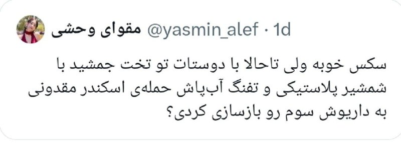

‏نه ممنون همون سکس

@Dirty_Kids 👻

## Dirty_Kids — post 389871

  <a href="telegram/content/Dirty_Kids_389871_1779366046.mp4" target="_blank">🎬 Download video</a>

چون بحث مموتی داغه
این موزیک‌ویدیو رو یادتونه ؟🤣🤦‍♂️

@Dirty_Kids 👻

## Dirty_Kids — post 389870

‏توی یک رابطه سالم دعوا و اختلاف نظر هست اگه فقط دنبال آرامشی دمنوش بابونه بخور

@Dirty_Kids 👻

## Dirty_Kids — post 389869

  <a href="https://t.me/Dirty_Kids/389869" target="_blank">📎 Download file</a>

📱 اپلیکیشن اندروید بدون فیلتر ریتزوبت

➖➖➖➖➖

🔹 ثبت نام آسان 
✅
🔹 رابط کاربری بسیار راحت و سریع 
✅
🔹 درگاه پرداخت کارت به کارت 
✅
🔹 درگاه پرداخت دلاری سریع 
✅
🔹 بونوس ۱۰۰ درصدی اولین واریز 
✅
🔹 بونوس ۱۰۰ درصدی واریز یکشنبه ها 
✅

➖➖➖➖➖
🌐 https://RitzoBet.com

⚡️ @RitzoBet_ir

## Dirty_Kids — post 389868

  

⚠️ برای #شرطبندی های فوتبال از سایت معتبر و بین المللی استفاده کنید ✅

سایت #ریتزوبت ، چهار سال هستش داخل ایران فعالیت میکنه 
✅

لایسنس بین المللی داره ، روش های شارژ و برداشت متنوع داره و بونوس 100% ورزشی و کش بک های جذاب
💎

⏪ اپلیکیشن بدون فیلتر ریتزوبت 
📱
⏩
R31

✅ لینک بدون‌ فیلتر ریتزوبت
🤣

🆔 @RitzoBet_ir 
🇮🇷

## Dirty_Kids — post 389867

  <a href="telegram/content/Dirty_Kids_389867_1779366048.mp4" target="_blank">🎬 Download video</a>

درخشش پرچم شیر و خورشید در کنار پرچم کشورهای دیگر در شهر اشدود در اسرائیل. 
🇮🇱
🇮🇷

@Dirty_Kids 👻

## Dirty_Kids — post 389866

‏در تایید مادرجنده بودنتون همین بس که حتی از خبر فیک گزینه اسراییل بودن احمدی‌نژاد ذوق‌زده میشید ولی اسم پهلوی که میاد کهیر میزنید. حقیقتا دشمنان باشکوهی هم نیستید :)))

@Dirty_Kids 👻

## Dirty_Kids — post 389865

‏این دوس‌دختر سابقم هردفعه به یه بهانه‌ای سعی میکنه با من ارتباط برقرار کنه؛ یه بار زنگ میزنه میگه وسایلمو بفرست، یه بار میگه انقد ریلزای کسشر نفرس، یه بار میگه اون صد میلیون که ازم قرض گرفتی رو کی پس میدی؟ نمیدونم کی میخواد ازم مووآن کنه.

@Dirty_Kids 👻

## Dirty_Kids — post 389864

  <a href="telegram/content/Dirty_Kids_389864_1779366050.mp4" target="_blank">🎬 Download video</a>

نه رشیدپور بی‌شرف، بازار اعتصاب كرد، پهلوى رو صدا زد، پهلوى براى اولين بار فراخوان داد، رژيم،ايرانی كش جمهوری اسلامی، مردم رو قتل عام كرد.
اصن بر فرض مردم گول خوردن، شما چرا ۵۰٫۰۰۰ نفر رو کشتید بیشرفا؟؟؟

@Dirty_Kids 👻

## Dirty_Kids — post 389863

  

🌪وقتی اینترنت طوفانیه فقط کافیه بادبان ها رو بکشی

⚫️100 هزار تومان تخفیف خرید اول 
🎁

⚫️پایین ترین قیمت گیگی 180 هزار تومان
🌐 

⚫️پورسانت %10 دائمی برای هر معرفی
💼

با بادبان، میتونی یه اتصال سریع، پایدار و امن
همراه با پشتیبانی ۲۴ ساعته داشته باشی
🚀

🛒کد تخفیف: badban4k

بادبان راهتو باز می‌کنه
⛵️
R31

🛡@BadBan_VPN | کانال 

🤖@BadBan_VPNBot | ربات 

📞@BadBan_VPNSupport | پشتیبانی

## Dirty_Kids — post 389862

  <a href="telegram/content/Dirty_Kids_389862_1779366052.mp4" target="_blank">🎬 Download video</a>

🔴 شما ببین محمدرضا شاه کی بود که بعد از ۵۰ سال حتی طرفدارای جمهوری اسلامی ازش تعریف و شاه خطابش میکنن.

@Dirty_Kids 👻

## Hranews — post 113075

  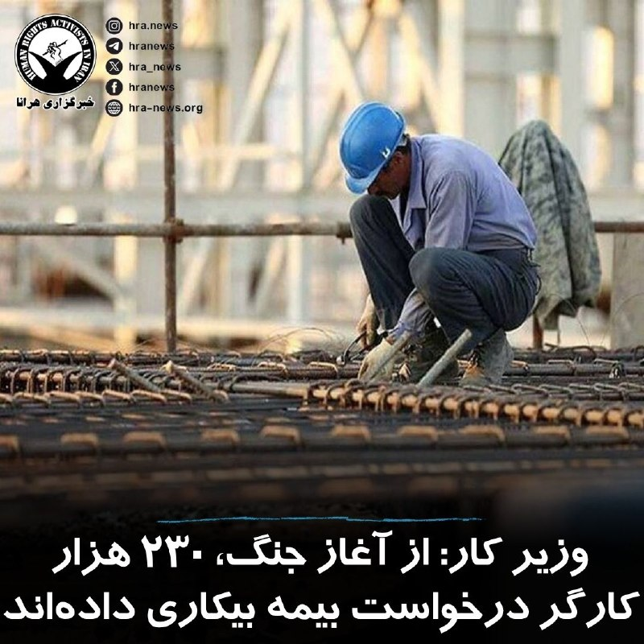

احمد میدری، وزیر تعاون، کار و رفاه اجتماعی ایران اعلام کرد که از آغاز جنگ اخیر تا امروز، حدود ۲۳۰ هزار نفر از کارگرانی که شغل خود را از دست داده‌اند برای دریافت بیمه بیکاری ثبت‌نام کرده‌اند.

این آمار در حالی منتشر می‌شود که بسیاری از #کارگران روزمزد و شاغلان غیررسمی اساساً تحت پوشش بیمه نیستند و در این آمار محاسبه نمی‌شوند.

↘️
@hranews_bot تماس ✉️ - @Hranews کانال هرانا 🆑

## Hranews — post 113074

  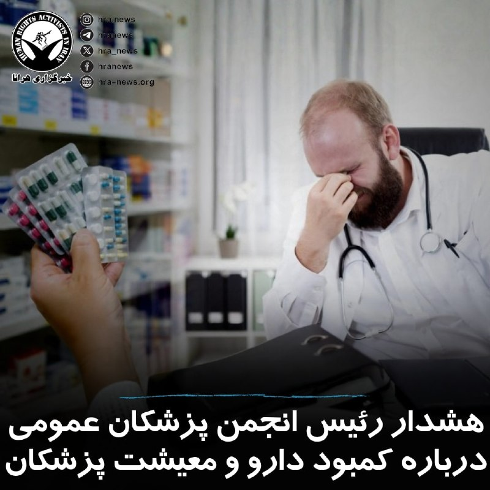

رئیس انجمن پزشکان عمومی ایران از دریافت گزارش‌هایی درباره کمبود یا دسترسی دشوار به برخی داروها در ماه‌های اخیر خبر داد. به گفته وی، این وضعیت پیش از شرایط جنگی نیز وجود داشته و با تشدید محدودیت‌های اقتصادی و لجستیکی ادامه یافته است. احمد ولی‌پور اعلام کرد این کمبودها عمدتا در حوزه برخی آنتی‌بیوتیک‌ها، داروهای بیماران مزمن، سرم‌ها و اقلام مصرفی درمانی مشاهده شده است. وی با اشاره به فشار بر زنجیره تامین دارو ناشی از مشکلات اقتصادی، محدودیت واردات مواد اولیه و نقدینگی صنعت دارو، بر ضرورت اقدام عملی تاکید کرد.

ولی‌پور همچنین به وضعیت #پزشکان_عمومی اشاره کرد و گفت برخلاف تصور عمومی، بسیاری از آنان به‌ویژه در بخش دولتی و مناطق محروم با وجود مسئولیت‌های سنگین، کشیک‌های مداوم و حجم بالای مراجعه بیماران، با چالش‌های معیشتی و نبود امنیت شغلی پایدار مواجه هستند. وی با تاکید بر نقش پزشکان عمومی به‌عنوان خط اول نظام سلامت، نسبت به تضعیف جایگاه این گروه و پیامدهای آن بر دسترسی مردم به خدمات درمانی هشدار داد.
#کمبود_دارو

↘️
@hranews_bot تماس ✉️ - @Hranews کانال هرانا 🆑

## Hranews — post 113073

یک زن در تهران توسط مرد مورد علاقه‌اش به قتل رسید

❗️
❗️
❗️
❗️
❗️– مردی در تهران، زن مورد علاقه‌اش را با خوراندن قرص برنج به #قتل رساند. متهم بازداشت و پس از حدود دو ماه به این اقدام اعتراف کرد.

ادامه مطلب

↘️
@hranews_bot تماس ✉️ - @Hranews کانال هرانا 🆑

## Hranews — post 113072

  

بر اساس آخرین داده‌های نت‌ بلاکس، معیارهای پایش نشان می‌دهد که #قطع_اینترنت در ایران اکنون وارد هشتادوسومین روز خود شده و دسترسی به شبکه‌های بین‌المللی برای بیش از ۱۹۶۸ ساعت به‌طور گسترده مسدود مانده است. این نهاد ناظر بر وضعیت دسترسی به اینترنت در جهان تاکید می‌کند که اینترنت آزاد و باز، عنصری بنیادین برای حفاظت از حق حیات، آزادی و پاسخگویی عمومی به‌شمار می‌رود.

↘️
@hranews_bot تماس ✉️ - @Hranews کانال هرانا 🆑

## manototv — post 105716

  <a href="telegram/content/manototv_105716_1779366054.mp4" target="_blank">🎬 Download video</a>

بر پایه گزارش رسانه‌های حکومتی، ۲۰ ملوان ایرانی که کشتی‌شان در آب‌های سنگاپور توقیف شده بود و در «وضعیت نامناسبی» قرار داشتند، ساعتی پیش به ایران بازگشتند.
سفیر جمهوری‌اسلامی در پاکستان با قدردانی از دولت پاکستان اعلام کرد این ملوانان پس از پیگیری‌های دیپلماتیک و با همکاری مقام‌های پاکستانی، از سنگاپور به اسلام‌آباد منتقل شدند و سپس به کشور بازگشتند.
او از نقش نخست‌وزیر پاکستان، وزارت خارجه و دیگر نهادهای این کشور در آزادی و انتقال ملوانان ایرانی تشکر کرد.

## manototv — post 105715

  <a href="telegram/content/manototv_105715_1779366054.mp4" target="_blank">🎬 Download video</a>

بریتانیا از توافق تجاری ۵ میلیارد دلاری با کشورهای خلیج فارس رونمایی کرد؛ توافقی که در بحبوحه تنش‌های منطقه‌ای پس از جنگ ایران، به گفته لندن «پیامی از ثبات و اعتماد» به بازارها می‌دهد.
این توافق با شورای همکاری خلیج فارس شامل عربستان، امارات، قطر، کویت، عمان و بحرین است و قرار است سالانه حدود ۳.۷ میلیارد پوند به اقتصاد بریتانیا اضافه کند.
لندن می‌گوید ۹۳ درصد تعرفه‌های کشورهای خلیج فارس برای کالاهای بریتانیایی حذف می‌شود؛ از جمله محصولات غذایی، خودرو، صنایع هوافضا و الکترونیک.
در مقابل، بریتانیا نیز برخی تعرفه‌ها را کاهش می‌دهد، هرچند نفت و گاز کشورهای عربی پیش‌تر هم بدون تعرفه وارد بریتانیا می‌شد.
فعالان حقوق بشر از نبود بندهای الزام‌آور درباره حقوق بشر در این توافق انتقاد کرده‌اند و آن را «عقب‌گرد اخلاقی» توصیف کردند.

## manototv — post 105714

  <a href="telegram/content/manototv_105714_1779366055.mp4" target="_blank">🎬 Download video</a>

انور قرقاش، مشاور سیاست خارجی رئیس امارات متحده عربی، در حساب ایکس خود نوشت جمهوری اسلامی پس از تجاوز و شکست نظامی آشکار، در تلاش است واقعیتی جدید را بر منطقه تحمیل کند، اما تلاش برای کنترل تنگه هرمز یا تعرض به حاکمیت دریایی امارات «چیزی جز رویاپردازی نیست.»
قرقاش افزود کشورهای عربی خلیج فارس دهه‌ها به «زورگویی‌های ایران» عادت کرده‌اند؛ تا جایی که این رفتار به بخشی از فضای سیاسی منطقه تبدیل شده و شکاف عمیقی میان شعارهای تهاجمی تهران و ادعاهای دوستی ایجاد کرده است.
او همچنین تأکید کرد هر کشوری که خواهان همزیستی با جهان عرب است باید بداند اعتماد از دست رفته و بازسازی آن نه با شعار، بلکه با احترام به حاکمیت کشورها، زبان مسئولانه و پایبندی واقعی به اصول حسن همجواری ممکن خواهد بود.

## manototv — post 105713

  <a href="telegram/content/manototv_105713_1779366056.mp4" target="_blank">🎬 Download video</a>

بر اساس داده‌های مرکز پایش اینترنت نت‌بلاکس، خاموشی اینترنت در ایران اکنون وارد هشتادوسومین روز خود شده است.
نت‌بلاکس اعلام کرد دسترسی به شبکه‌های بین‌المللی برای بیش از ۱۹۶۸ ساعت به‌طور گسترده مسدود بوده است. این نهاد تأکید کرد اینترنت آزاد و باز نقشی اساسی در حفاظت از جان، آزادی و پاسخگویی عمومی دارد.

## alonews — post 121541

  <a href="telegram/content/alonews_121541_1779366056.webm" target="_blank">🎬 Download video</a>

👈بحث عضو پایداری شهرداری کابل با یک مغازه دار به علت نام گذاری مغازه اش به نام فلامینگو

✅ @AloNews خبر جنگ

## alonews — post 121540

  <a href="telegram/content/alonews_121540_1779366056.webm" target="_blank">🎬 Download video</a>

👈طبق ارزیابی‌های اطلاعاتی ایالات متحده، ایران به سرعت بازسازی توانایی‌های نظامی خود را که در جنگ اخیر از دست رفته بود، آغاز کرده است.

🔴از میان این توانایی‌ها، طبق گفته دو منبع آگاه از ارزیابی‌های اطلاعاتی ایالات متحده، ایران در طول آتش‌بس شش‌هفته‌ای که اوایل آوریل آغاز شد، تولید برخی از پهپادهای خود را از سر گرفته است.

🔴چهار منبع به سی‌ان‌ان گفتند که اطلاعات ایالات متحده نشان می‌دهد ارتش ایران بسیار سریع‌تر از تخمین اولیه در حال بازسازی است. یک مقام آمریکایی گفت: «ایرانیان تمام زمان‌بندی‌هایی که جامعه اطلاعاتی برای بازسازی تعیین کرده بود را پشت سر گذاشته‌اند».

🔴اگرچه زمان لازم برای از سرگیری تولید قطعات مختلف سلاح متفاوت است، اما برخی تخمین‌ها نشان می‌دهد که ایران ممکن است ظرف شش ماه توانایی حمله پهپادی خود را به طور کامل بازسازی کند، همان‌طور که یکی از منابع، یک مقام آمریکایی، به سی‌ان‌ان گفت.

✅ @AloNews خبر جنگ

## alonews — post 121539

  <a href="telegram/content/alonews_121539_1779366057.webm" target="_blank">🎬 Download video</a>

👈یزدی خواه، نایب‌رئیس کمیسیون فرهنگی مجلس: اینترنت جهانی فعلاً بازگشایی نمی‌شود

✅ @AloNews خبر جنگ

## alonews — post 121537

  <a href="telegram/content/alonews_121537_1779366057.webm" target="_blank">🎬 Download video</a>

🔴مهران سماک متولد ۲۸ اردیبهشت ۷۴ در بندرانزلی بود. مهران لیسانس معماری داشت. او جوانی آرام و عاشق زندگی بود.

🔴پدر مهران در خیابان پاسداران انزلی صاحب متل کاسپین بود و مهران در مدیریت آنجا به پدرش کمک میکرد.

🔴در شامگاه ۸ آذر ۱۴۰۱ شبی که تیم فوتبال حکومتی باخت مردم برای خوشحالی به خیابانها رفتند. مهران آنشب استوری گذاشت و نوشت:
«امشب فارق از هراتفاق و نتیجه فقط باشیم کنار هم»
سپس با نامزدش سوار بر ماشین در خیابان به جمعیت پیوست و با بوق و شعار و علامت پیروزی جمعیت را همراهی میکرد.

🔴در همان زمان نیروهای سرکوبگر با موتور به میان جمعیت و در خیابان آمده و موتوری از کنار ماشین مهران رد شد و با گلوله به سر مهران شلیک کرد. و مهران غرق در خون شد. تصویری که از این صحنه بجا مانده خود یک سند جنایت است.

🔴قاتل او فرمانده انتظامی بندر انزلی جعفر جوانمردی بود.

🔴مردم کمک میکنند و مهران را به بیمارستان میرسانند ولی او آنجا جانباخت.

🔴خانواده مهران سماک خود را به بیمارستان می‌رسانند اما نیروهای سرکوبگر از تحویل پیکر شهید خودداری میکنند. پدر مهران با دیلم در سردخانه را شکسته و جسد را که هنوز داغ بود بغل کرده و با خود میبرد. آنها نمیخواستند توسط نیروهای سرکوبگر پیکر فرزندشان ربوده شود.

🔴برادر مهران آن شب تا نزدیک صبح پیکر او را در ماشین در خیابانها میگرداند تا دست قاتلین به او نرسد. نزدیک صبح مهران را به خانه میبرند و مادرش او را روی یک فرش میگذارد و تا صبح او را بغل کرده و میبوسد.

🔴فرماندار انزلی از ترس مردم نمیتواند از حضورشان در مراسم خاکسپاری جلوگیری کند. مردم در گلزار شهدا جمع شدند و شعارهای ضدحکومتی سردادند.

🔴پدر مهران پرونده قتل فرزندش را در بیدادگاههای حکومت به جریان می اندازد اما تا این لحظه هیچ حکمی درباره قاتل به اجرا درنیامده و او همچنان آزاد است.

#علیه_فراموشی

✅@AloNews

## alonews — post 121534

  <a href="telegram/content/alonews_121534_1779366057.webm" target="_blank">🎬 Download video</a>

👈طبق گزارش دو مقام ارشد ایرانی به رویترز؛
ایران اصلی ترین خواسته آمریکا برای توافق که انتقال اورانیوم 60 درصد است را به صورت کامل رد کرده است.

✅ @AloNews خبر جنگ

## alonews — post 121533

  <a href="telegram/content/alonews_121533_1779366057.webm" target="_blank">🎬 Download video</a>

👈آخرین قیمت نفت ۱۰۷.۱۵ دلار

✅ @AloNews خبر جنگ

## alonews — post 121532

  <a href="telegram/content/alonews_121532_1779366058.webm" target="_blank">🎬 Download video</a>

👈آژانس انرژی بین المللی: بازارهای نفت ممکن است در ماه های ژوئیه و آگوست به منطقه خطر برسند.

✅ @AloNews خبر جنگ

## alonews — post 121531

  <a href="telegram/content/alonews_121531_1779366058.webm" target="_blank">🎬 Download video</a>

👈سفارت پاکستان در ایران: وزیر کشور پاکستان با «اسکندر مومنی» همتای ایرانی خود در تهران گفتگو کرد.

✅ @AloNews خبر جنگ

## alonews — post 121529

  <a href="telegram/content/alonews_121529_1779366058.mp4" target="_blank">🎬 Download video</a>

👈پهپادهای اوکراینی در طول شب به پالایشگاه نفت سیزران متعلق به روسنفت در منطقه سامارا روسیه حمله کردند و آن را در آتش فرو بردند

✅ @AloNews خبر جنگ

## alonews — post 121528

  <a href="telegram/content/alonews_121528_1779366060.mp4" target="_blank">🎬 Download video</a>

👈تمرینات نظامی اخیر کوبا شامل مدرن‌ترین سامانه دفاع هوایی آن، S-125-2BM، نسخه ارتقا یافته سامانه SA-3 دوران شوروی بود.

🔴 اگرچه این سامانه نسبت به مدل اصلی متحرک‌تر و توانمندتر است، اما همچنان در برابر حمله گسترده ایالات متحده با استفاده از هواپیماهای پنهانکار و تسلیحات هدایت‌شونده دقیق محدودیت‌های قابل توجهی خواهد داشت، به‌ویژه که جغرافیا و توازن نیروها به شدت به نفع آمریکا است.

✅ @AloNews خبر جنگ

## alonews — post 121527

  <a href="telegram/content/alonews_121527_1779366062.webm" target="_blank">🎬 Download video</a>

👈امارات از پیشرفت ۵۰ درصدی در پروژه ساخت «خط لوله دورزننده تنگه هرمز» خبر داد

✅ @AloNews خبر جنگ

## alonews — post 121526

  <a href="telegram/content/alonews_121526_1779366062.webm" target="_blank">🎬 Download video</a>

👈 مشاور رئیس‌جمهور امارات، انور قرقاش:
ما طی دهه‌های طولانی به زورگویی‌های ایرانی عادت کرده‌ایم تا جایی که این موضوع بخشی از چشم‌انداز سیاسی خلیج فارس شده است و اعتبار میان لفاظی‌های تهاجمی و اعلامیه‌های توخالی دوستی از دست رفته است.

🔴و امروز، پس از تجاوز بی‌رحمانه ایران، رژیم در تلاش است واقعیتی جدید را که از یک شکست نظامی آشکار زاده شده است، تثبیت کند، اما تلاش‌ها برای کنترل تنگه هرمز یا تجاوز به حاکمیت دریایی امارات چیزی جز تکه‌هایی از رویاها نیست.

🔴و هر کسی که می‌خواهد با محیط عربی خود همزیستی کند باید درک کند که اعتماد از دست رفته است و بازگرداندن آن از طریق شعارها حاصل نمی‌شود، بلکه از طریق زبان مسئولانه، حفظ حاکمیت و تعهد واقعی به اصول همسایگی خوب به دست می‌آید

✅ @AloNews خبر جنگ

## alonews — post 121525

  <a href="telegram/content/alonews_121525_1779366062.webm" target="_blank">🎬 Download video</a>

👈نایب‌رئیس کمیسیون فرهنگی مجلس اعلام کرد اینترنت جهانی بازگشایی نمی‌شود و تنها گروه‌های دارای نیاز تخصصی به اینترنت بین‌الملل دسترسی خواهند داشت.

✅ @AloNews خبر جنگ

## alonews — post 121524

  <a href="telegram/content/alonews_121524_1779366062.webm" target="_blank">🎬 Download video</a>

👈احتمال شنیده شدن صدای انفجارهای کنترل‌شده در بندرعباس

✅ @AloNews خبر جنگ

## alonews — post 121523

  <a href="telegram/content/alonews_121523_1779366063.webm" target="_blank">🎬 Download video</a>

👈ادعای رویترز به نقل از سه منبع: فرمانده ارتش پاکستان، عاصم منیر، روز پنج‌شنبه تصمیم خواهد گرفت که آیا به عنوان بخشی از تلاش‌های میانجی‌گری به تهران سفر کند یا خیر

✅ @AloNews خبر جنگ

## alonews — post 121522

  <a href="telegram/content/alonews_121522_1779366063.webm" target="_blank">🎬 Download video</a>

👈نماینده دولت هند : ۱۴ کشتی هندی تو منطقه تنگه هرمز گیر کردن

✅ @AloNews خبر جنگ

## alonews — post 121521

  <a href="telegram/content/alonews_121521_1779366063.webm" target="_blank">🎬 Download video</a>

👈علی هاشم خبرنگار الجزیره: بر اساس منابع من در تهران، پاسخ ایران هنوز به میانجی پاکستانی تحویل داده نشده است. رایزنی‌ها همچنان ادامه دارد و تلاش‌های جدی برای رسیدن به پیش‌نویس نهایی در جریان است

✅ @AloNews خبر جنگ

## alonews — post 121520

  <a href="telegram/content/alonews_121520_1779366063.webm" target="_blank">🎬 Download video</a>

👈رویترز: رهبر ایران دستور داده است که اورانیوم با درجه نزدیک به تولید سلاح باید در ایران باقی بماند

✅ @AloNews خبر جنگ

<!-- MSG END -->

<!-- NAV START -->

<a href="https://github.com/hosseinbaghi/aio-downloader/blob/main/telegram/content/archive_1.md" style="display:inline-block; padding:6px 12px; margin:0 4px; background-color:#2ea44f; color:white; text-decoration:none; border-radius:4px; font-weight:bold;">صفحه بعد</a>

<!-- NAV END -->
