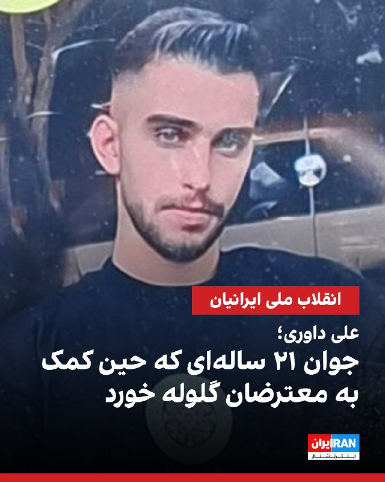
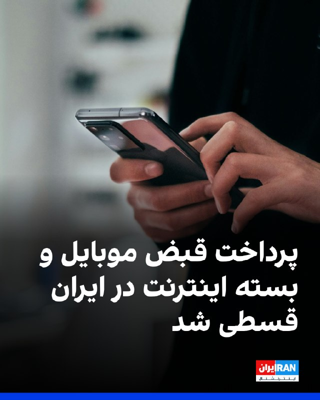
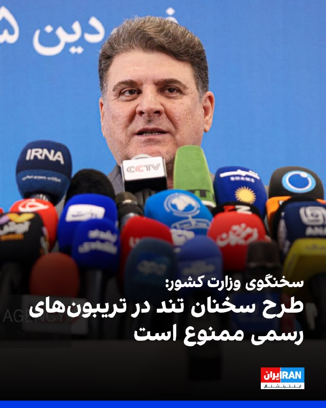
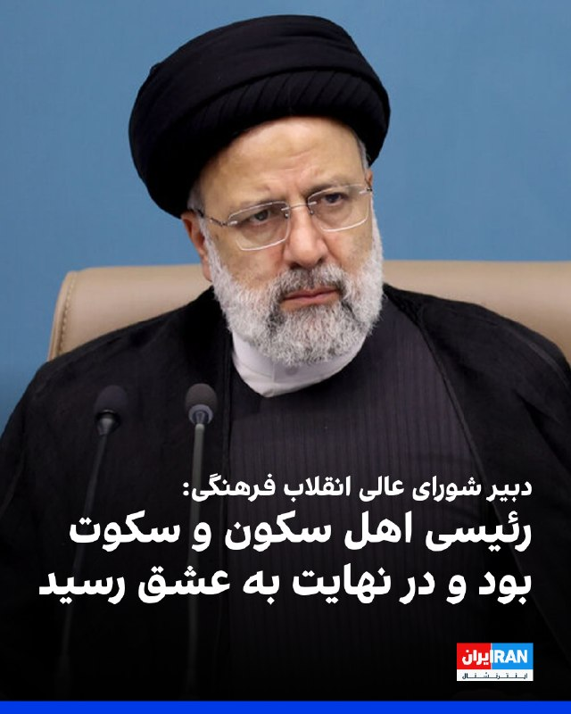
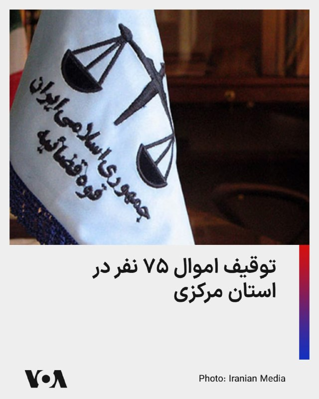
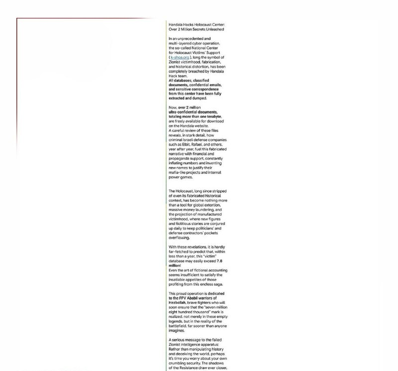
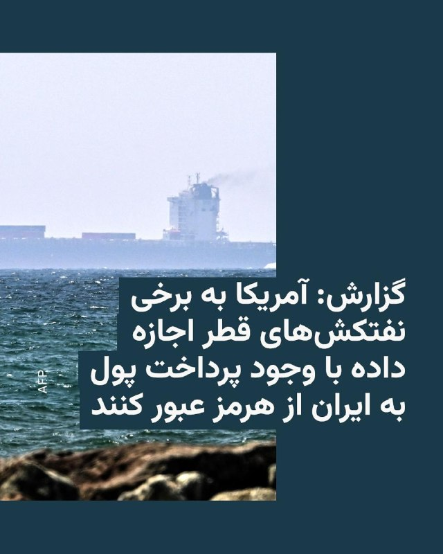
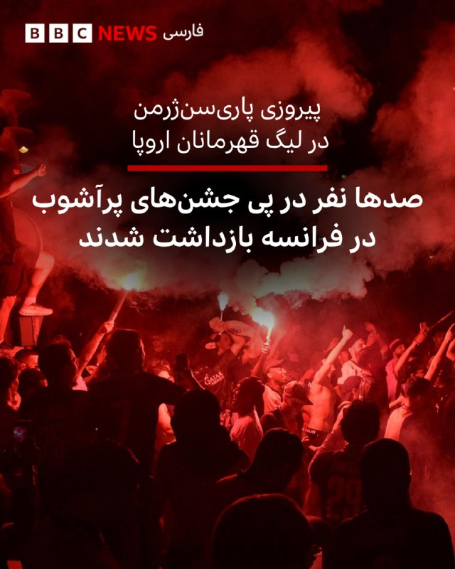
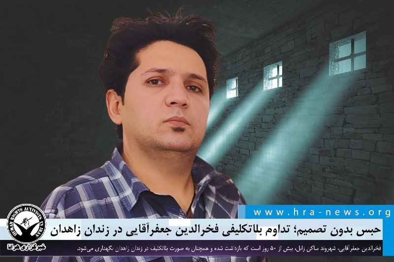

# خواننده تلگرام

<!-- TOP_NAV START -->

<a href="https://github.com/hosseinbaghi/aio-downloader/blob/main/telegram/content/archive_1.md" style="display:inline-block; padding:6px 12px; margin:0 4px; background-color:#2ea44f; color:white; text-decoration:none; border-radius:4px; font-weight:bold;">صفحه بعد</a>

<!-- TOP_NAV END -->

<!-- MSG START -->

---
📅 بروزرسانی: 1405/03/10 11:50
---

## VahidOOnLine — post 243016

  

نرگس فلاح، سرپرست پیشین اداره محیط زیست بندرانزلی به سایت رویداد ۲۴ گفت: «تالاب انزلی امروز از یک اکوسیستم آبی، در برخی نقاط به دشت و جنگل تبدیل شده است.»

او افزود: «آنچه امروز در انزلی رخ می‌دهد، حاصل دهه‌ها مدیریت ناهماهنگ و نگاه پروژه‌ای به محیط زیست است.»

او ادامه داد: ««تالاب انزلی مثل بیماری است که رگ‌های قلبش گرفته؛ ابتدا باید راه تنفسش باز شود و بعد سراغ برنامه‌های بلندمدت رفت.»
‌🏁 🇬🇧 IranintlTV

🤖 @VahidOOnLine

## VahidOOnLine — post 243015

  

♦️فداحسین مالکی عضو کمیسیون امنیت ملی و سیاست خارجی مجلس شورای اسلامی روز یکشنبه ۱۰ خرداد با اشاره به تحولات پس از برقراری آتش‌بس و روند مذاکرات میان ایران و آمریکا، گفت: «جمهوری اسلامی ایران از همان ابتدا نسبت به آتش‌بس و همچنین مذاکرات با آمریکا نگاه خوش‌بینانه‌ای نداشته است.»
او دلیل این مسئله را «‌بدعهدی‌های» آمریکا دانست و افزود: «سابقه بدعهدی‌های واشنگتن همچنان در ذهن مسئولان و مردم ایران باقی مانده و این بدبینی هرگز از بین نرفته است.»
فداحسین مالکی با تاکید بر اینکه «جمهوری اسلامی نه مذاکره را کنار گذاشته و نه به آن دل بسته است» درباره روند مذاکرات گفت: «آخرین گفتگوی جدی در این زمینه همزمان با سفر فرمانده ارتش پاکستان به ایران انجام شد. در جریان این مذاکرات، طرف پاکستانی بسته پیشنهادی آمریکا در خصوص مطالبات جمهوری اسلامی ایران را ارائه کرد و درباره جزئیات آن گفت‌و‌گو‌های مفصلی صورت گرفت.»
این نماینده مجلس اضافه کرد: «جمهوری اسلامی نسبت به ورود موضوعاتی همچون تنگه هرمز و غنی‌سازی به مذاکرات، ملاحظات جدی داشته است.»
‌🇸🇦 Indypersian

🤖 @VahidOOnLine

## VahidOOnLine — post 243014

  <a href="telegram/content/VahidOOnLine_243014_1780215629.mp4" target="_blank">🎬 Download video</a>

⭕️تنگه‌ای که قرن‌هاست قلب تپنده دریانوردی، تجارت و سیاست است؛ تنگه هرمز

📌پادکست

♦️در کرانه‌های جنوبی ایران، آنجا که خلیج همیشگی فارس به سوی آب‌های آزاد جهان آغوش می‌گشاید، تنگه‌ای قرار دارد که از قرن‌ها پیش تاکنون، قلب تپنده دریانوردی، تجارت و سیاست بوده و نبض اقتصاد جهان را در پهنای نیلگون خود به شماره انداخته است.

لینک پخش
‌🇸🇦 Indypersian

🤖 @VahidOOnLine

## VahidOOnLine — post 243013

  

بر اساس اطلاعات رسیده به ایران‌اینترنشنال، علی داوری، ۲۱ ساله، روز ۱۹ دی‌ماه در جریان اعتراضات در خیابان جی اصفهان، هنگامی که برای کمک به مجروحان رفته بود، با شلیک مستقیم گلوله به قلبش جان باخت.

به گفته یک منبع آگاه، پس از مجروح شدن علی، دو نفر او را به درمانگاهی در منطقه «خانه‌اصفهان» منتقل کردند، اما به پزشکان اجازه داده نشد او را درمان کنند.

این منبع گفت پس از آن، مردم، علی داوری را به بیمارستان منتقل کردند، اما شدت جراحات ناشی از اصابت گلوله به قلب او باعث شد جانش را از دست بدهد.

‌🏁 🇬🇧 IranintlTV

🤖 @VahidOOnLine

## VahidOOnLine — post 243012

  

اقتصادنیوز گزارش داد همزمان با افزایش پرداخت‌های اقساطی در ایران، خدمات ارتباطی نیز به جمع خریدهای قسطی پیوسته است. بر اساس این گزارش، همراه اول و ایرانسل امکان پرداخت مرحله‌ای قبض، بسته اینترنت و برخی خدمات اپراتوری را برای مشترکان فراهم کرده‌اند.
ایرانسل از سرویس اعتباری با بازپرداخت چهارماهه خبر داده و همراه اول نیز برای مشترکانی با بدهی بالاتر از سقف مشخص، امکان تقسیط فراهم کرده است.
‌🏁 🇬🇧 IranintlTV

🤖 @VahidOOnLine

## VahidOOnLine — post 243011

  

رسانه‌های ایران گزارش دادند نخستین جلسه سومین سال فعالیت مجلس دوازدهم به‌صورت مجازی برگزار شد و در آن ۱۸۷ نماینده به‌صورت مجازی و ۱۴ نماینده به‌صورت حضوری سوگند یاد کردند.
بنا بر این گزارش، این جلسه با حضور محمدباقر قالیباف و شماری از اعضای هیات رییسه مجلس برگزار شد.
‌🏁 🇬🇧 IranintlTV

🤖 @VahidOOnLine

## VahidOOnLine — post 243010

🗣روایت شما از زندگی پس از جنگ - یکشنبه ۱۰ خرداد

🔹دخترم مبتلا به بیماری سلیاک است. هزینه مواد غذایی بدون‌گلوتن، مکمل‌ها و آزمایش‌های ضروری بسیار بالا رفته و فشار زیادی به خانواده‌ها وارد می‌کند.

🔹گرونی بیداد می‌کنه، یه موتور معمولی شده ۴۰۰ تا ۵۰۰ میلیون تومان. ما جوان‌ها نباید موتور برامون آرزو شه.

🔹واقعا گرونی خسته‌مون کرده. چقدر باید کار کنیم و پول نداشته باشیم. نودل ۴۰ هزار تومانی شده ۱۰۸ هزار تومان.

🔹سه ماهه به پدرم حقوق ندادن و ما از پس‌اندازی که داشتیم استفاده می‌کنیم که چیز کمی ازش باقی مونده. سر کار هم بهش میگن همینه که هست و اگر نمی‌خواین، استعفا بدین.

🔹همین الان در خونه‌مون رو یک پسر خیلی جوان زد و گفت اومدم خونه‌تون رو تمیز کنم. رندوم در خونه‌ها رو می‌زد. دلم سوخت، کی این‌قدر کمبود شغل و فقر زیاد شد.

🔹این‌قدر اجناس گرون شده و حقوق‌ها کم هستن که من می‌ترسم یه کیک ساده بگیرم و از اون طرف یه جای دیگه کم بیارم. ما فقط یه زندگی عادی خواستیم.
‌🏁 🇬🇧 IranintlTV

🤖 @VahidOOnLine

## VahidOOnLine — post 243009

⭕️وزیر دفاع ژاپن انتقادهای چین را رد کرد؛ «ما تهدیدی برای جهان نیستیم»

♦️شینجیرو کویزومی، وزیر دفاع ژاپن، در نشست امنیتی «شانگری‌لا» در سنگاپور، انتقادهای چین از سیاست‌های دفاعی توکیو را رد کرد و گفت توصیف ژاپن به‌عنوان نمونه‌ای از «نظامی‌گری جدید» با واقعیت همخوانی ندارد.

زیر دفاع ژاپن بدون نام بردن از کشور چین افزود: «کشوری وجود دارد که زرادخانه عظیم هسته‌ای و بمب‌افکن‌های راهبردی در اختیار دارد، اما ژاپن هیچ‌کدام از این تسلیحات را ندارد. با این حال، ژاپن به نظامی‌گری جدید متهم می‌شود.»

کویزومی همچنین از افزایش توان نظامی چین و نبود شفافیت کافی در برنامه‌های دفاعی پکن ابراز نگرانی کرد و تأکید کرد ژاپن به تقویت توانمندی‌های دفاعی خود در حوزه‌هایی مانند هوش مصنوعی، سامانه‌های بدون سرنشین، دفاع سایبری و فضایی ادامه خواهد داد.
‌🇸🇦 Indypersian

🤖 @VahidOOnLine

## VahidOOnLine — post 243008

  <a href="telegram/content/VahidOOnLine_243008_1780215634.mp4" target="_blank">🎬 Download video</a>

در پی راه‌اندازی کارزار مردمی رشت از سوی ایران‌اینترنشنال، ویدیوهایی از آتش‌سوزی بازار این شهر در ۱۸ دی ۱۴۰۴ به دست ما رسیده است. در این شب ماموران اجازه مهار آتش به آتش‌نشان‌ها ندادند، معترضان در میان شعله‌های آتش گرفتار شدند و کسانی که راه فرار پیدا می‌کردند با گلوله ماموران کشته می‌شدند.
‌🏁 🇬🇧 IranintlTV

🤖 @VahidOOnLine

## VahidOOnLine — post 243007

  <a href="telegram/content/VahidOOnLine_243007_1780215637.mp4" target="_blank">🎬 Download video</a>

ویدیویی که به تازگی منتشرشده، لحظه حملات هوایی به بیت علی خامنه‌ای در محدود پاستور تهران را در نهم اسفند ۱۴۰۴ نشان می‌دهد.
‌🏁 🇬🇧 IranintlTV

🤖 @VahidOOnLine

## VahidOOnLine — post 243006

  

♦️سارا فلاحی، نماینده ایلام در مجلس شورای اسلامی با اشاره به جنگ ۴۰ روزه گفت: «حتی روسیه و چین قبل از شروع جنگ نسبت به توان ایستادگی ایران مردد بودند.»
 سارا فلاحی نماینده مجلس در گفتگویی با برنامه اینترنتی «پل حافظ» با اشاره به اینکه «روس‌ها و چینی‌ها قبل از جنگ فکر می‌کردند که رژیم ایران تغییر می‌کند» گفت: «توان نظامی بومی و داخلی ایران معادلات را تغییر داد.»
فلاحی مدعی شد که پوتین در جلسه‌ای که با حضور عباس عراقچی، وزیر خارجه جمهوری اسلامی برگزار شد، «صراحتاً گفته بود نیروهای مسلح شما ما را شگفت زده کردند».
به گفته این نماینده مجلس، روسیه و چین قبل از شروع جنگ و همزمان با حرکت ناوهای آمریکایی به سوی ایران، به توان ایستادگی ایران امید نداشتند و برای بستن قراردادهای نظامی مردد بودند.
‌🇸🇦 Indypersian

🤖 @VahidOOnLine

## VahidOOnLine — post 243005

  

عبدالحسین خسروپناه، دبیر شورای عالی انقلاب فرهنگی، در همایشی تحت عنوان «حکمت سیاسی ابراهیم رئیسی» گفت: «رئیسی اهل عقل، سکون و سکوت بود و در نهایت به عشق رسید.»

او افزود: «مقصود من از سکوت، سکوت عرفانی و سکون عرفانی است که کنایه از آرامش دارد و این نصیب هر کسی نمی‌شود.»

خسروپناه ادامه داد: «خیلی سلوک و آداب سلوک لازم است تا این سکون و سکوت حاصل گردد و رئیسی این ویژگی را داشت.»
‌🏁 🇬🇧 IranintlTV

🤖 @VahidOOnLine

## VahidOOnLine — post 243004

  

علی زینی‌وند، معاون سیاسی وزارت کشور گفت در حال حاضر سیاست رسمی نظام این است که در تریبون‌های رسمی و در جاهایی که نماینده سیاست رسمی نظام هستند، هیچ‌گونه صحبت «تندی» که انسجام را به هم بزند صورت نگیرد، ما هم به عنوان شورای امنیت کشور این را به کل ارکان ابلاغ کردیم.

او افزود: «صدا و سیما خودش باید محور انسجام باشد و در حال حاضر هم هست، در هر صورت قاعدتا هر حرکتی که انسجام را خدشه‌دار کند در این شرایط کار غیرمفیدی است و حتما باید پاسخگو باشد.»
‌🏁 🇬🇧 IranintlTV

🤖 @VahidOOnLine

## VahidOOnLine — post 243003

  <a href="telegram/content/VahidOOnLine_243003_1780215643.mp4" target="_blank">🎬 Download video</a>

⭕️مشاهده مین دریایی شناور در نزدیکی سواحل عمان در تنگه هرمز

♦️ویدیوی منتشرشده از آب‌های نزدیک سواحل عمان، یک مین دریایی شناور را در یکی از مسیرهای مورد استفاده کشتی‌های تجاری برای عبور از تنگه هرمز نشان می‌دهد.

مین‌گذاری در مسیر عبور کشتی‌های تجاری در تنگه هرمز، نگرانی‌ها درباره امنیت کشتیرانی در یکی از مهم‌ترین گذرگاه‌های انرژی جهان را افزایش داده است.

کارشناسان هشدار می‌دهند وجود مین‌های دریایی در مسیرهای تجاری می‌تواند خطر جدی برای کشتی‌ها و تجارت جهانی ایجاد کند.

تنگه هرمز محل عبور بخش قابل‌توجهی از صادرات نفت جهان است و هرگونه تهدید امنیتی در این منطقه می‌تواند بر بازارهای جهانی انرژی تاثیر بگذارد.
‌🇸🇦 Indypersian

🤖 @VahidOOnLine

## VahidOOnLine — post 243002

ویدیوهایی که تازه از شامگاه ۱۸ دی تهران به ایران‌اینترنشنال رسیده، جمعیت گسترده مردم معترض را در تجریش نشان می‌دهد. در برخی ویدیوها شلیک‌های پیاپی اسلحه و فریاد مردم به گوش می‌رسد.
‌🏁 🇬🇧 IranintlTV

🤖 @VahidOOnLine

## VahidOOnLine — post 243001

  

♦️حسین شریعتمداری، مدیرمسئول روزنامه کیهان روز یکشنبه در یادداشتی نوشت: «انگار اراده جدی برای تصویب قانون اِعمال حاکمیت قانونی بر عبور و مرور در تنگه هرمز در ایران وجود ندارد.»
شریعتمداری نوشت: «نزدیک به دو ماه است که نمایندگان مجلس شورای اسلامی از تصمیم جدی مجلس برای تهیه و تصویب رژیم حقوقی حاکم بر تنگه هرمز خبر می‌دهند ولی انجام این اقدام ضروری تاکنون به تاخیر افتاده است به‌گونه‌ای که انگار اراده‌ای جدی برای انجام آن وجود ندارد.‌»
او اضافه کرد: «تاخیر یادشده می‌تواند این تلقی را پدید آورد که ایران اسلامی در تصمیم خود برای اِعمال حاکمیت قانونی بر عبور و مرور در تنگه هرمز، با تردید روبه‌رو شده است.»
مدیرمسئول روزنامه کیهان در بخشی از این یادداشت تاکید کرده است که «ترامپ از همین تاخیر به نفع خواسته (بخوانید آرزوی‌) آمریکا برای گشایش تنگه هرمز استفاده می‌کند.»
‌🇸🇦 Indypersian

🤖 @VahidOOnLine

## VahidOOnLine — post 243000

  

مجید نصیرپور، نماینده سراب در مجلس گفت: «اگر احیانا بار دیگر خیانتی نسبت به میز مذاکره صورت گیرد، نیروهای مسلح ما با پشتیبانی دولت، با تمام قدرت پاسخ لازم را خواهند داد.»

او افزود: «مطمئنم که به‌زودی جشن پیروزی و اقتدار خود را برگزار خواهیم کرد.»

این نماینده مجلس ادامه داد: «مذاکراتی که در شورای عالی امنیت ملی انجام می‌شود، تا زمانی که به تصویب رهبری نظام نرسد، قابل اجرا نیست.»
‌🏁 🇬🇧 IranintlTV

🤖 @VahidOOnLine

## VahidOOnLine — post 242999

  <a href="telegram/content/VahidOOnLine_242999_1780215648.mp4" target="_blank">🎬 Download video</a>

ویدیوی ارسال شده به ایران‌اینترنشنال نشان می‌دهد گروهی از ایرانیان شنبه ۹ خرداد در سن‌خوزه کالیفرنیا در آمریکا، علیه جمهوری اسلامی در خیابان‌های شهر کاروان خودرویی به راه انداختند و پرچم‌های شیروخورشید به دست گرفتند.
‌🏁 🇬🇧 IranintlTV

🤖 @VahidOOnLine

## VahidOOnLine — post 242998

  <a href="telegram/content/VahidOOnLine_242998_1780215650.mp4" target="_blank">🎬 Download video</a>

ویدیوهای رسیده به ایران‌اینترنشنال نشان می‌دهند گروهی از ایرانیان مقیم آلمان روز شنبه ۹ خرداد، علیه اعدام‌های جمهوری اسلامی و در حمایت از شاهزاده رضا پهلوی، در شهر هانوفر تجمع کردند.
‌🏁 🇬🇧 IranintlTV

🤖 @VahidOOnLine

## VahidOOnLine — post 242997

  

روزنامه خراسان، نزدیک به محمدباقر قالیباف، رییس مجلس در مقاله‌ای نوشت بعید است مذاکرات جمهوری اسلامی و آمریکا به نتیجه برسد و پیش‌‎بینی کرد جنگ ادامه خواهد داشت.

خراسان اظهارات و واکنش‌های دونالد ترامپ، رییس‌جمهور آمریکا را با هدف کنترل بازرهای مالی ارزیابی کرد.
این روزنامه ضمن اشاره به اظهارات اخیر ترامپ درباره رفع محاصره دریایی جمهوری اسلامی نوشت: «پست ترامپ، قبل از تعطیلات آخر هفته، موجی از خوش‌بینی به بازارهای جهانی تزریق کرد و قیمت نفت برنت را به حدود ۸۴ دلار رساند.»

این روزنامه نوشت نزدیکان رییس‌جمهور آمریکا با اظهارات «امیدوارکننده» او در آستانه تعطیلات آخر هفته با نوسان‌گیری در بازارهای مالی سودهای کلانی به‌دست آوردند.

نویسنده خراسان افزود: «توافقی اولیه و موقت محتمل است که البته آن هم نه مولود رسیدن به باوری برای حل تنش، بلکه بیشتر محصول اولویت‌ها و مدیریت تنش از سوی دو طرف است و بعید است که به توافقی جامع ختم شود.»
‌🏁 🇬🇧 IranintlTV

🤖 @VahidOOnLine

## WithYashar — post 12990

داداش ما باید فحشت بدم جواب بدی

## WithYashar — post 12989

## WithYashar — post 12988

## WithYashar — post 12987

درود یاشار جان احتمال داره دوباره متحد بشیم برا خیابونا

## WithYashar — post 12986

## WithYashar — post 12985

درود یاشار جان خسته نباشی♥️
این حرف که میگن مردمو مسلح کنن باعث جنگ داخلی و سوریه و عراق شدن میشه رو نظرتو میگی راجبش🙏🏻♥️

## WithYashar — post 12984

@withyashar SCARY MOVIE

## WithYashar — post 12983

درود

موافق پوریا زراعتی نیستم
جولانی تروریست بود
مردم ما معترض عادی‌ن
دست به اسلحه نیستن

برای متن نوشتن برای شاهزاده مخالف نیستم

## WithYashar — post 12982

## WithYashar — post 12981

## WithYashar — post 12980

## WithYashar — post 12979

## WithYashar — post 12978

## WithYashar — post 12977

  <a href="telegram/content/WithYashar_12977_1780215654.mp4" target="_blank">🎬 Download video</a>

پوریا زراعتی مجری اینترنشنال: اپوزیسیون ما رویا فروشی میکنه و وعده هاش دروغ بود

ما به کسی مثل جولانی نیاز داریم نه رهبران فعلی اپوزیسیون
@withyashar

## WithYashar — post 12976

ارتش اسرائیل: کنترل قلعه الشقیف در جنوب لبنان را به دست گرفتیم.
@withyashar

## WithYashar — post 12975

  <a href="telegram/content/WithYashar_12975_1780215657.mp4" target="_blank">🎬 Download video</a>

ترامپ: اصلاً نباید وارد ماجرای ایران می‌شدیم، اما...ما تا حد زیادی کاری به ارتش ایران نداشتیم، چون فکر می‌کنیم ارتش‌شون تا حدی میانه‌رو هست.
اما افراد دیگه‌ای هم دارن که میانه‌رو نیستن؛ اون‌ها رو از بین بردیم.
ببینید، دو تا موضوع وجود داره: اول اینکه تنگه باید فوراً باز باشه و رفت‌وآمد در اون آزاد باشه؛ هیچ عوارض یا هزینه‌ای نباید گرفته بشه.دوم اینکه ایران نباید سلاح هسته‌ای داشته باشه
همین. قضیه به همین سادگیه. بعدش هم ما از اونجا خارج می‌شیم.
ایران الان تو موقعیت خیلی بدیه؛ ولی احتمالاً بزرگ‌ترین سرمایه‌شون همین رسانه‌های فیک‌نیوزه.
@withyashar

## WithYashar — post 12974

ادعای اکسیوس: دو مقام آمریکایی گفتند، ترامپ خواهان این توافق است و انتظار دارد آن را به زودی نهایی کند، اما مصمم است چند نکته را که برای او اهمیت دارند، به‌ویژه در مورد مواد هسته‌ای ایران، تقویت کند

درخواست ترامپ دور جدیدی از رفت‌وآمدها (یا مذاکرات رفت‌وبرگشتی) بین طرفین را آغاز کرده است که ممکن است چند روز به طول بینجامد.
@withyashar

## WithYashar — post 12973

اسرائیل هیوم: ایالات متحده به نفتکش‌ها و کشتی‌های حمل گاز مایع قطر اجازه داده است پس از پرداخت پول به ایران، تنگه هرمز را ترک کنند
@withyashar

## WithYashar — post 12972

آکسیوس‌: ترامپ در جلسه اتاق وضعیت روز جمعه درخواست چندین تغییر در پیش‌ نویس توافق آمریکا و ایران کرد که باعث آغاز دور دیگری از مذاکرات شد که ممکن است چند روز طول بکشد
ترامپ خواستار زبان قوی‌ تری در مسائل کلیدی ، به‌ ویژه در مورد مدیریت و انتقال ذخیره اورانیوم غنی‌ شده ایران و همچنین برخی مفاد مربوط به بازگشایی تنگه هرمز است
موافقت‌ نامه فعلی شامل تعهد ایران به عدم دنبال کردن سلاح هسته‌ ای و دوره 60 روزه برای مذاکره درباره محدودیت‌ های هسته‌ ای و رفع تحریم‌ ها است ، اما ترامپ به دنبال شرایط مشخص‌ تری است
ایران هنوز متن نهایی را تأیید نکرده و مقامات آمریکایی انتظار دارند پاسخ تهران ممکن است چند روز طول بکشدrیک مقام ارشد دولت گفت : یک توافق حاصل خواهد شد ، اما خاطرنشان کرد که جدول زمانی نامشخص است و ممکن است از چند روز تا بیش از یک هفته متغیر باشد
@withyashar

## mwarmonitor — post 9928

🔴ترامپ خواهان اعمال تغییراتی در توافق با ایران شد که فرستادگانش بر سر آن مذاکره کرده بودند

📝 نویسندگان: مارک کاپوتو، باراک راوید

🔰به گفته یک مقام ارشد دولت و یک منبع آگاه دیگر، پرزیدنت ترامپ در جریان نشست روز جمعه در «اتاق وضعیت» (Situation Room)، خواستار چندین اصلاحیه در توافقی شد که فرستادگانش با همتایان ایرانی خود به آن دست یافته بودند.

🔸چرا این موضوع اهمیت دارد؟
دو مقام آمریکایی گفتند ترامپ خواهان این توافق است و انتظار دارد به زودی آن را نهایی کند، اما اصرار دارد چند نکته را که برایش حائز اهمیت است – به ویژه در رابطه با مواد هسته‌ای ایران – تقویت کند. درخواست ترامپ دور جدیدی از رفت‌وبرگشت‌ها میان طرفین را آغاز کرده است که می‌تواند چندین روز به طول بینجامد.

نکات پشت پرده
ترامپ روز جمعه اعلام کرده بود که نشست اتاق وضعیت را برای بررسی این توافق برگزار می‌کند و به نظر می‌رسید سیگنال‌هایی مبنی بر تمایلش به پذیرش آن ارسال کرده است.
یک مقام کاخ سفید پس از این نشست به خبرنگاران گفت: «ترامپ تنها توافقی را امضا خواهد کرد که برای آمریکا خوب باشد، خطوط قرمز او را برآورده کند و تضمین کند که ایران هرگز نمی‌تواند به سلاح هسته‌ای دست یابد.»
مقامات ایرانی نیز به رسانه‌های دولتی خود گفتند که متن نهایی را هنوز تایید نکرده‌اند؛ این در حالی است که دو مقام آمریکایی اوایل هفته مدعی شده بودند تهران آماده امضاست و همه چیز به تصمیم ترامپ بستگی دارد.
در پشت صحنه چه گذشت؟
به گفته این دو منبع، ترامپ از تیم خود خواسته است تا تغییراتی در پیش‌نویس بندهای مربوط به برنامه هسته‌ای ایران ایجاد کنند.
در شکل فعلی، این یادداشت تفاهم (MOU) شامل تعهد ایران به عدم تلاش برای دستیابی به سلاح هسته‌ای است، اما فراتر از آن، امتیاز مشخص دیگری را در بر نمی‌گیرد.
این پیش‌نویس مقرر می‌کند که یک بازه زمانی ۶۰ روزه برای مذاکره درباره تعهدات هسته‌ای ایران و رفع تحریم‌ها از سوی آمریکا وجود خواهد داشت؛ به طوری که اولین موضوعات دستور کار، نحوه خلاص شدن از شر ذخایر اورانیوم غنی‌شده ایران و محدود کردن غنی‌سازی بیشتر خواهد بود.
جزئیات بیشتر
ترامپ می‌خواهد این بخش از توافق را اصلاح کند.
یک مقام ارشد دولت با اشاره به اورانیوم غنی‌شده گفت: «موضوع، جزئیات بیشتر در مورد نحوه دستیابی آمریکا به این مواد و زمان‌بندی آن است.»
منبع دوم نیز اعلام کرد که ترامپ خواستار اصلاح برخی عبارات پیرامون بازگشایی تنگه هرمز شده است.
این مقام آمریکایی گفت به ترامپ اطلاع داده شده که حدود سه روز طول می‌کشد تا ایرانی‌ها پاسخ دهند. این مقام ارشد دولت به کنایه گفت: «آن‌ها به معنای واقعی کلمه در غارها هستند و از ایمیل استفاده نمی‌کنند.»
اظهار نظرها
یک مقام ارشد دولت گفت: «توافق حاصل خواهد شد. اما اینکه چقدر فوری باشد، باید منتظر ماند و دید. ما حاضریم صبر کنیم تا رئیس‌جمهور آنچه را که می‌خواهد به دست آورد. ممکن است یک هفته طول بکشد، ممکن است کمتر یا بیشتر باشد. امیدواریم در اوایل هفته آینده به نتیجه‌ای برسیم.»
رسانه‌های دولتی ایران گزارش داده‌اند که توافق نزدیک است اما نهایی نشده و مدعی شده‌اند که ایران میلیاردها دلار از دارایی‌های بلوکه‌شده خود را دریافت خواهد کرد؛ ادعایی که کاخ سفید آن را تکذیب می‌کند.
کاخ سفید به درخواست برای اظهار نظر در این باره پاسخ نداد.

@mwarmonitor

## mwarmonitor — post 9927

🔴به گفته اسرائیل کاتس، وزیر دفاع اسرائیل، ارتش دفاعی اسرائیل دامنه عملیات خود را در لبنان گسترش داده، از رود لیتانی عبور کرده و یال بوفر را به تصرف درآورده است.

🔸اسرائیل کاتس گفت تصرف قلعه بوفر «پیام روشنی» برای دشمنان اسرائیل دارد و هشدار داد هر کسی که غیرنظامیان اسرائیلی را تهدید کند، «دارایی‌های راهبردی خود را یکی‌یکی از دست خواهد داد».

🔹کاتس افزود: «این کارزار هنوز به پایان نرسیده است» و تأکید کرد که اسرائیل همچنان مصمم است «قدرت حزب‌الله را در هم بشکند» و امنیت شمال اسرائیل را تضمین کند.

@mwarmonitor

## mwarmonitor — post 9926

🔸ارتش اسرائیل از کشته شدن یک سرباز خود در جنوب لبنان خبر داد.
🔹او دوازدهمین سرباز ارتش اسرائیل است که از زمان اجرای آنچه «آتش‌بس اسرائیل–لبنان» خوانده می‌شود در ۱۶ آوریل جان باخته است؛ که از این تعداد، ۹ نفر بر اثر حملات پهپادهای FPV حزب‌الله کشته شده‌اند.

📌همچنین این سرباز، ۹۵۰مین تلفات ارتش اسرائیل در تمامی جبهه‌ها از تاریخ ۷ اکتبر ۲۰۲۳ تاکنون به شمار می‌رود.

@mwarmonitor

## mwarmonitor — post 9925

🔴به گزارش نیویورک‌تایمز،‌ ترامپ شرایط یک چارچوب احتمالی برای توافقی به‌منظور پایان دادن به جنگ در ایران را سخت‌گیرانه‌تر کرده و این تغییرات پیشنهادی را برای بررسی دوباره به این کشور ارسال کرده است؛ پیشنهاد جدید و سخت‌گیرانه‌تر ممکن است با هدف تسریع روند مذاکرات ارائه شده باشد؛ به این معنا که با افزایش فشار بر ایران، این کشور را به پذیرش پیشنهاد قبلی وادار کند.
گزارش‌ها حاکی است که آن پیشنهاد قبلی برای تأیید نهایی به رهبر عالی ایران، مجتبی خامنه‌ای، ارسال شده است.به گفته سه مقام آگاه.

@mwarmonitor

## pm_afshaa — post 91924

  

بچه ها وقتی شما نبودین این جنده به مکرون میداد از اون ورم مکرون از جمهوری اسهالی حمایت میکرد

💧 Rainbet.com the #1 Non-KYC Crypto Casino & Sportsbook @rainbetcom

😁 @Pm_Afshaa

## IranIntlTV — post 339843

  

نرگس فلاح، سرپرست پیشین اداره محیط زیست بندرانزلی به سایت رویداد ۲۴ گفت: «تالاب انزلی امروز از یک اکوسیستم آبی، در برخی نقاط به دشت و جنگل تبدیل شده است.»

او افزود: «آنچه امروز در انزلی رخ می‌دهد، حاصل دهه‌ها مدیریت ناهماهنگ و نگاه پروژه‌ای به محیط زیست است.»

او ادامه داد: ««تالاب انزلی مثل بیماری است که رگ‌های قلبش گرفته؛ ابتدا باید راه تنفسش باز شود و بعد سراغ برنامه‌های بلندمدت رفت.»
https://iranintl.com/202605312955

## IranIntlTV — post 339842

  

بر اساس اطلاعات رسیده به ایران‌اینترنشنال، علی داوری، ۲۱ ساله، روز ۱۹ دی‌ماه در جریان اعتراضات در خیابان جی اصفهان، هنگامی که برای کمک به مجروحان رفته بود، با شلیک مستقیم گلوله به قلبش جان باخت.

به گفته یک منبع آگاه، پس از مجروح شدن علی، دو نفر او را به درمانگاهی در منطقه «خانه‌اصفهان» منتقل کردند، اما به پزشکان اجازه داده نشد او را درمان کنند.

این منبع گفت پس از آن، مردم، علی داوری را به بیمارستان منتقل کردند، اما شدت جراحات ناشی از اصابت گلوله به قلب او باعث شد جانش را از دست بدهد.

https://iranintl.com/202605313073

## IranIntlTV — post 339841

  <a href="telegram/content/IranIntlTV_339841_1780215663.mp4" target="_blank">🎬 Download video</a>

ایرانیان ساکن ملبورن با برگزاری تجمعی در مرکز این شهر، یاد جان‌باختگان اعتراضات را گرامی داشتند و بر حمایت از زندانیان سیاسی و مخالفت با اعدام و سرکوب تاکید کردند. شرکت‌کنندگان این تجمع را در راستای همبستگی با مردم ایران و ادامه مسیر دادخواهی عنوان کردند.

گزارش علیرضا محبی، خبرنگار ایران‌اینترنشنال
@iranintltv

## IranIntlTV — post 339840

  

اقتصادنیوز گزارش داد همزمان با افزایش پرداخت‌های اقساطی در ایران، خدمات ارتباطی نیز به جمع خریدهای قسطی پیوسته است. بر اساس این گزارش، همراه اول و ایرانسل امکان پرداخت مرحله‌ای قبض، بسته اینترنت و برخی خدمات اپراتوری را برای مشترکان فراهم کرده‌اند.
ایرانسل از سرویس اعتباری با بازپرداخت چهارماهه خبر داده و همراه اول نیز برای مشترکانی با بدهی بالاتر از سقف مشخص، امکان تقسیط فراهم کرده است.
https://iranintl.com/202605312783

## IranIntlTV — post 339839

  <a href="telegram/content/IranIntlTV_339839_1780215666.mp4" target="_blank">🎬 Download video</a>

ایرانیان ساکن ملبورن با برگزاری تجمعی در مرکز این شهر، یاد جان‌باختگان اعتراضات دی‌ماه را گرامی داشتند. یکی از شرکت‌کنندگان با در دست داشتن پلاکاردی به یاد جان‌باختگان «انقلاب ملی» به علیرضا محبی، خبرنگار ایران‌اینترنشنال، گفت صدای دادخواهی خانواده‌های جاویدنامان هستیم.
@iranintltv

## IranIntlTV — post 339838

  

رسانه‌های ایران گزارش دادند نخستین جلسه سومین سال فعالیت مجلس دوازدهم به‌صورت مجازی برگزار شد و در آن ۱۸۷ نماینده به‌صورت مجازی و ۱۴ نماینده به‌صورت حضوری سوگند یاد کردند.
بنا بر این گزارش، این جلسه با حضور محمدباقر قالیباف و شماری از اعضای هیات رییسه مجلس برگزار شد.
https://iranintl.com/202605317783

## IranIntlTV — post 339837

🗣روایت شما از زندگی پس از جنگ - یکشنبه ۱۰ خرداد

🔹دخترم مبتلا به بیماری سلیاک است. هزینه مواد غذایی بدون‌گلوتن، مکمل‌ها و آزمایش‌های ضروری بسیار بالا رفته و فشار زیادی به خانواده‌ها وارد می‌کند.

🔹گرونی بیداد می‌کنه، یه موتور معمولی شده ۴۰۰ تا ۵۰۰ میلیون تومان. ما جوان‌ها نباید موتور برامون آرزو شه.

🔹واقعا گرونی خسته‌مون کرده. چقدر باید کار کنیم و پول نداشته باشیم. نودل ۴۰ هزار تومانی شده ۱۰۸ هزار تومان.

🔹سه ماهه به پدرم حقوق ندادن و ما از پس‌اندازی که داشتیم استفاده می‌کنیم که چیز کمی ازش باقی مونده. سر کار هم بهش میگن همینه که هست و اگر نمی‌خواین، استعفا بدین.

🔹همین الان در خونه‌مون رو یک پسر خیلی جوان زد و گفت اومدم خونه‌تون رو تمیز کنم. رندوم در خونه‌ها رو می‌زد. دلم سوخت، کی این‌قدر کمبود شغل و فقر زیاد شد.

🔹این‌قدر اجناس گرون شده و حقوق‌ها کم هستن که من می‌ترسم یه کیک ساده بگیرم و از اون طرف یه جای دیگه کم بیارم. ما فقط یه زندگی عادی خواستیم.

## IranIntlTV — post 339836

  <a href="telegram/content/IranIntlTV_339836_1780215670.mp4" target="_blank">🎬 Download video</a>

در پی راه‌اندازی کارزار مردمی رشت از سوی ایران‌اینترنشنال، ویدیوهایی از آتش‌سوزی بازار این شهر در ۱۸ دی ۱۴۰۴ به دست ما رسیده است. در این شب ماموران اجازه مهار آتش به آتش‌نشان‌ها ندادند، معترضان در میان شعله‌های آتش گرفتار شدند و کسانی که راه فرار پیدا می‌کردند با گلوله ماموران کشته می‌شدند.

## IranIntlTV — post 339835

  <a href="telegram/content/IranIntlTV_339835_1780215672.mp4" target="_blank">🎬 Download video</a>

پاری‌سن‌ژرمن با پیروزی برابر آرسنال در ضربات پنالتی، برای دومین سال پیاپی قهرمان لیگ قهرمانان اروپا شد. اما جشن هواداران در برخی نقاط پاریس به ناآرامی و درگیری انجامید و پلیس فرانسه از بازداشت بیش از ۳۲۰ نفر و استفاده از گاز اشک‌آور خبر داد. درگیری‌ها عمدت اطراف شانزه‌لیزه و مناطق مرکزی شهر رخ داد.

گفت‌وگو با احسان اکبری، عضو تحریریه ایران‌اینترنشنال
@iranintltv

## IranIntlTV — post 339834

  <a href="telegram/content/IranIntlTV_339834_1780215675.mp4" target="_blank">🎬 Download video</a>

ویدیویی که به تازگی منتشرشده، لحظه حملات هوایی به بیت علی خامنه‌ای در محدود پاستور تهران را در نهم اسفند ۱۴۰۴ نشان می‌دهد.

## IranIntlTV — post 339833

  <a href="telegram/content/IranIntlTV_339833_1780215677.mp4" target="_blank">🎬 Download video</a>

ایرانیان مقیم ملبورن استرالیا در یکی دیگر از آخر هفته‌های اعتراضی ایرانیان خارج از کشور، با حضور در مرکز این شهر و در حمایت و همبستگی با مردم ایران، سرود «ای‌ایران» را هم‌خوانی کردند.
گزارش علیرضا محبی، خبرنگار ایران‌اینترنشنال
@iranintltv

## IranIntlTV — post 339832

  

عبدالحسین خسروپناه، دبیر شورای عالی انقلاب فرهنگی، در همایشی تحت عنوان «حکمت سیاسی ابراهیم رئیسی» گفت: «رئیسی اهل عقل، سکون و سکوت بود و در نهایت به عشق رسید.»

او افزود: «مقصود من از سکوت، سکوت عرفانی و سکون عرفانی است که کنایه از آرامش دارد و این نصیب هر کسی نمی‌شود.»

خسروپناه ادامه داد: «خیلی سلوک و آداب سلوک لازم است تا این سکون و سکوت حاصل گردد و رئیسی این ویژگی را داشت.»
https://iranintl.com/202605312204

## IranIntlTV — post 339831

  <a href="telegram/content/IranIntlTV_339831_1780215681.mp4" target="_blank">🎬 Download video</a>

ایرانیان ساکن ملبورن با برگزاری تجمعی در مرکز این شهر، یاد جان‌باختگان اعتراضات دی‌ماه را گرامی داشتند. یکی از شرکت‌کنندگان در گفت‌وگو با علیرضا محبی، خبرنگار ایران‌اینترنشنال، با اشاره به حمایت از مردم داخل ایران، تاکید کرد که هر هفته در تجمعات شرکت می‌کند تا صدای خانواده‌های جان‌باختگان باشد.
@iranintltv

## IranIntlTV — post 339830

  

علی زینی‌وند، معاون سیاسی وزارت کشور گفت در حال حاضر سیاست رسمی نظام این است که در تریبون‌های رسمی و در جاهایی که نماینده سیاست رسمی نظام هستند، هیچ‌گونه صحبت «تندی» که انسجام را به هم بزند صورت نگیرد، ما هم به عنوان شورای امنیت کشور این را به کل ارکان ابلاغ کردیم.

او افزود: «صدا و سیما خودش باید محور انسجام باشد و در حال حاضر هم هست، در هر صورت قاعدتا هر حرکتی که انسجام را خدشه‌دار کند در این شرایط کار غیرمفیدی است و حتما باید پاسخگو باشد.»
https://iranintl.com/202605317197

## IranIntlTV — post 339828

ویدیوهایی که تازه از شامگاه ۱۸ دی تهران به ایران‌اینترنشنال رسیده، جمعیت گسترده مردم معترض را در تجریش نشان می‌دهد. در برخی ویدیوها شلیک‌های پیاپی اسلحه و فریاد مردم به گوش می‌رسد.

## IranIntlTV — post 339826

  

مجید نصیرپور، نماینده سراب در مجلس گفت: «اگر احیانا بار دیگر خیانتی نسبت به میز مذاکره صورت گیرد، نیروهای مسلح ما با پشتیبانی دولت، با تمام قدرت پاسخ لازم را خواهند داد.»

او افزود: «مطمئنم که به‌زودی جشن پیروزی و اقتدار خود را برگزار خواهیم کرد.»

این نماینده مجلس ادامه داد: «مذاکراتی که در شورای عالی امنیت ملی انجام می‌شود، تا زمانی که به تصویب رهبری نظام نرسد، قابل اجرا نیست.»
https://iranintl.com/202605318925

## IranIntlTV — post 339825

  <a href="telegram/content/IranIntlTV_339825_1780215686.mp4" target="_blank">🎬 Download video</a>

ویدیوی ارسال شده به ایران‌اینترنشنال نشان می‌دهد گروهی از ایرانیان شنبه ۹ خرداد در سن‌خوزه کالیفرنیا در آمریکا، علیه جمهوری اسلامی در خیابان‌های شهر کاروان خودرویی به راه انداختند و پرچم‌های شیروخورشید به دست گرفتند.

## IranIntlTV — post 339824

  <a href="telegram/content/IranIntlTV_339824_1780215689.mp4" target="_blank">🎬 Download video</a>

ویدیوهای رسیده به ایران‌اینترنشنال نشان می‌دهند گروهی از ایرانیان مقیم آلمان روز شنبه ۹ خرداد، علیه اعدام‌های جمهوری اسلامی و در حمایت از شاهزاده رضا پهلوی، در شهر هانوفر تجمع کردند.

## IranIntlTV — post 339823

  

روزنامه خراسان، نزدیک به محمدباقر قالیباف، رییس مجلس در مقاله‌ای نوشت بعید است مذاکرات جمهوری اسلامی و آمریکا به نتیجه برسد و پیش‌‎بینی کرد جنگ ادامه خواهد داشت.

خراسان اظهارات و واکنش‌های دونالد ترامپ، رییس‌جمهور آمریکا را با هدف کنترل بازرهای مالی ارزیابی کرد.
این روزنامه ضمن اشاره به اظهارات اخیر ترامپ درباره رفع محاصره دریایی جمهوری اسلامی نوشت: «پست ترامپ، قبل از تعطیلات آخر هفته، موجی از خوش‌بینی به بازارهای جهانی تزریق کرد و قیمت نفت برنت را به حدود ۸۴ دلار رساند.»

این روزنامه نوشت نزدیکان رییس‌جمهور آمریکا با اظهارات «امیدوارکننده» او در آستانه تعطیلات آخر هفته با نوسان‌گیری در بازارهای مالی سودهای کلانی به‌دست آوردند.

نویسنده خراسان افزود: «توافقی اولیه و موقت محتمل است که البته آن هم نه مولود رسیدن به باوری برای حل تنش، بلکه بیشتر محصول اولویت‌ها و مدیریت تنش از سوی دو طرف است و بعید است که به توافقی جامع ختم شود.»
https://iranintl.com/202605314559

## IranIntlTV — post 339822

  <a href="https://t.me/IranintlTV/339822" target="_blank">📎 Download file</a>

🎧نسخه صوتی اخبار بامدادی | یکشنبه ۱۰ خرداد
@iranintlTV

## reutersworldchannel — post 151526

  

The great Indo-Pacific hedge - deeper defence ties as US doubts grow and China ascends

Caught between China's rapid military rise and growing doubts about the U.S. ​focus on a region it has long dominated, Indo-Pacific nations are racing to arm themselves, and each other.

At Asia's premier defence forum ‌on Saturday, U.S. Defense Secretary Pete Hegseth pressed regional partners to shoulder more of the security burden. Yet, he faced persistent concerns that U.S. priorities may be drifting, with conflict in Iran competing for attention. read more

## FarsiVOA — post 219148

🔺جمهوری چک احتمالاً به هدف هزینه دفاعی ناتو نمی‌رسد؛ افزایش فشار بر ناتو

▪️نخست‌وزیر جمهوری چک می‌گوید کشورش احتمالاً امسال به هدف ناتو برای رساندن هزینه‌های نظامی به دو درصد تولید ناخالص داخلی نخواهد رسید.

▪️آندری بابیش در گفت‌وگو با فایننشال‌تایمز گفت دولتش «تمام تلاش خود را» برای تحقق تعهدات ناتو انجام می‌دهد، اما با کسری بودجه ناشی از هزینه‌های دولت پیشین روبه‌رو است.

▪️ناتو در نشست لاهه در سال ۲۰۲۵ توافق کرد اعضا تا سال ۲۰۳۵ سالانه پنج درصد تولید ناخالص داخلی خود را برای دفاع و امنیت اختصاص دهند؛ سه‌ونیم درصد برای نیازهای اصلی دفاعی و یک‌ونیم درصد برای حوزه‌هایی مانند زیرساخت، امنیت سایبری، آمادگی غیرنظامی و تقویت صنایع دفاعی.

⬇️ بیشتر بخوانید:
https://ir.voanews.com/a/czech-republic-likely-to-miss-nato-defence-spending-target-pm-tells-ft/8155755.html

## FarsiVOA — post 219147

🔺آیا جنگ عامل اصلی دو برابر شدن کسری گاز ایران است؟

▪️معاون رئیس‌جمهوری ایران می‌گوید آسیب به زیرساخت‌های گاز ایران در جنگ ۳۹ روزه، کسری گاز کشور را بیش از دو برابر کرده است.

▪️به گفته اسماعیل سقاب اصفهانی، با احتساب کسری ۴۵ میلیارد متر مکعبی گاز در سال گذشته، در حال حاضر با ناترازی ۱۰۰ میلیارد متر مکعبی گاز مواجه هستیم.

▪️این رقم عظیم کسری گاز، معادل تقریباً دو برابر کل مصرف گاز ترکیه است. ایران دومین دارنده بزرگ ذخایر گازی جهان، به خاطر تاخیر در توسعه پروژه‌های گازی، هدررفت گسترده انرژی و عدم توسعه انرژی‌های جایگزین با بحران شدید کسری گاز مواجه است.

▪️وابستگی بسیار زیاد به سوخت گاز به همراه رشد اندک تولید باعث شده کسری گاز ایران هر سال افزایش یابد.

⬇️ بیشتر بخوانید:
https://ir.voanews.com/a/is-war-the-main-factor-in-iran-s-doubling-of-gas-deficit/8155754.html

## FarsiVOA — post 219146

  

نیروی انتظامی تهران کافه‌ای در خیابان ولیعصر را که در آن برنامه‌های موسیقی اجرا می‌شد، به بهانه آن چه «فعالیت‌های مروج فرقه‌های انحرافی» خواند، پلمب کرد.

مرکز اطلاع‌رسانی پلیس جمهوری اسلامی در اطلاعیه‌ای نوشت: «این کافه با برگزاری برنامه‌هایی با ظاهر موسیقی غربی، بستری برای حرکات نابهنجار، و آنچه که ماموران توصیف کرده‌اند "تحرکات شیطانی" فراهم آورده بود.»

نیروی انتظامی جمهوری اسلامی نام این کافه را ذکر نکرد اما ادعا کرد که «مشتریان این کافه، شامل دختران و پسران جوان، در وضعیتی غیرطبیعی و با حرکاتی عجیب و غریب، که از آن به عنوان “شیطانی” یاد شده، مشاهده گردیدند.»

پیشتر نیز بسیاری از کافه‌ها و اماکن کسب و کار به اتهام‌های مشابه پلمب شده‌ بودند اما جمهوری اسلامی سرکوب‌ شهروندان را از زمان اعتراضات دی‌ماه گذشته تاکنون شدت بیشتری داده است.

موج تازه اعدام‌ها، صدور احکام سنگین و بازداشت‌ها نگرانی فعالان و نهادهای حقوق بشری را برانگیخته است.
@FarsiVOA

## FarsiVOA — post 219145

  

معاون رئیس‌جمهوری ایران می‌گوید آسیب به زیرساخت‌های گاز ایران در جنگ ۳۹ روزه، کسری گاز کشور را بیش از دو برابر کرده است.

اسماعیل سقاب اصفهانی در ادامه گفت طی جنگ اخیر، زیرساخت‌های گاز کشور با کاهش ۵۵ میلیارد متر مکعبی مواجه شد و تولید سالانه از ۲۹۷ میلیارد به ۲۴۲ میلیارد متر مکعب رسید.

به گفته او، با احتساب کسری ۴۵ میلیارد متر مکعبی گاز در سال گذشته، در حال حاضر با ناترازی ۱۰۰ میلیارد متر مکعبی گاز مواجه هستیم.

این رقم عظیم کسری گاز، معادل تقریباً دو برابر کل مصرف گاز ترکیه است. ایران دومین دارنده بزرگ ذخایر گازی جهان است، اما به خاطر تاخیر در توسعه پروژه‌های گازی، هدررفت گسترده انرژی و عدم توسعه انرژی‌های جایگزین با بحران شدید کسری گاز مواجه است.

او همچنین از کسری روزانه ۳۰ میلیون لیتری بنزین خبر داد.
@FarsiVOA

## FarsiVOA — post 219144

  

دادستان عمومی و انقلاب مرکز استان مرکزی از تشکیل ۷۵ پرونده قضایی و صدور دستور توقیف اموال افرادی خبر داد که بنا بر ادعای او با شبکه‌های «معاند» خارج از کشور «ارتباط مستقیم داشته‌» و «تلاش داشتند تا فضای آرام جامعه را ملتهب کنند.»

بر اساس این اعلام، پرونده‌ها در دادسرای اراک و شعب تخصصی در حال رسیدگی است و دارایی‌های متهمان با هدف توقیف و ضبط «به نفع ملت» بررسی می‌شود. دادستان مرکز استان مرکزی مدعی شد این افراد با اقدامات «ضدامنیتی» و همکاری با «دشمنان»، در پی «التهاب‌آفرینی در جامعه» بوده‌اند.

این اعلام در ادامه موج تازه برخوردهای قضایی با افراد متهم به همکاری با رسانه‌ها و شبکه‌های خارج از کشور مطرح می‌شود.

روز گذشته نیز مقام‌های قضایی از توقیف اموال ۷۴ نفر در استان گلستان و ۳۴ نفر در خراسان جنوبی با اتهام‌های مشابه خبر داده بودند. در این گزارش‌ها، حساب‌های بانکی، خودروها و اموال ثبتی از جمله دارایی‌های مشمول توقیف اعلام شده‌اند. جزئیات مستقلی در این باره منتشر نشده است.
@FarsiVOA

## FarsiVOA — post 219143

  

بدر عبدالعاطی، وزیر خارجه مصر و رافائل گروسی، مدیرکل آژانس بین‌المللی انرژی اتمی، در یک تماس تلفنی تحولات منطقه‌ای و آخرین تحولات مذاکرات واشنگتن-تهران را مورد بحث قرار دادند.

بر اساس بیانیه وزارت خارجه مصر، این تماس شامل بررسی آخرین تحولات مسیر مذاکرات میان ایالات متحده و حکومت ایران و تلاش‌ها برای دستیابی به توافقی بود که «نگرانی‌های همه طرف‌ها را در نظر بگیرد».

وزیر خارجه مصر بر «ضرورت افزایش تلاش‌های دیپلماتیک و حمایت از روند رسیدن به توافقی میان دو طرف آمریکایی و ایرانی» تأکید کرد؛ تفاهمی که بتواند به «کاهش تنش و جلوگیری از تشدید بحران کمک کرده و امنیت و ثبات منطقه‌ای و بین‌المللی را تقویت کند».

همچنین دو طرف همچنین نتایج نشست یازدهم کنفرانس بازنگری معاهده عدم اشاعه سلاح‌های هسته‌ای را که در نیویورک برگزار شد، بررسی کردند.

در این تماس، وزیر خارجه مصر ابراز تأسف کرد که این کنفرانس نتوانست به توافقی درباره سند نهایی دست یابد و تأکید کرد که مصوبات کنفرانس‌های بازنگری قبلی همچنان معتبر هستند.
@FarsiVOA

## FarsiVOA — post 219142

  

ارتش اسرائیل اعلام کرد که یک سرباز این نیرو در حمله پهپادی حزب‌الله در جنوب لبنان در شامگاه شنبه کشته شده است.

در گزارش ارتش اسرائیل، این سرباز کشته‌شده، گروهبان یکم مایکل تیوکین، ۲۱ ساله، از واحد شناسایی تیپ گیواتی و اهل اشکلون، معرفی شده است.

ارتش اسرائیل اعلام کرد که این حمله حدود ساعت ۱۰:۳۰ شامگاه شنبه رخ داد و در جریان آن، یک پهپاد که توسط حزب‌الله هدایت می‌شد، به موضعی که نیروهای تیپ گیواتی در آن مشغول فعالیت بودند، اصابت کرد.

در نتیجه انفجار، چهار سرباز دیگر نیز به‌طور سطحی زخمی شدند که آنان برای درمان به بیمارستان منتقل شدند.
@FarsiVOA

## FarsiVOA — post 219141

🔺اکسیوس و نیویورک‌تایمز: ترامپ شروط توافق احتمالی با تهران را سخت‌گیرانه‌تر کرده است

▪️اکسیوس و نیویورک‌تایمز گزارش دادند دونالد ترامپ خواستار سخت‌گیرانه‌تر شدن شروط چارچوب توافق احتمالی با جمهوری اسلامی شده و نسخه اصلاح‌شده را برای بررسی به تهران فرستاده است.

▪️اکسیوس نوشت ترامپ از تیم خود خواسته چند بند از متنی را که فرستادگانش با طرف‌های ایرانی روی آن کار کرده بودند، اصلاح کنند؛ به‌ویژه بندهای مربوط به برنامه هسته‌ای و مواد هسته‌ای ایران.

▪️نیویورک‌تایمز نیز گزارش داد ترامپ از کندی پاسخ جمهوری اسلامی به پیشنهادهای آمریکا ناراضی بوده و نسبت به بخش‌هایی از توافق که می‌تواند به آزادسازی دارایی‌های ایران مربوط باشد، نگرانی داشته است.

⬇️ بیشتر بخوانید:
https://ir.voanews.com/a/trump-tightens-terms-of-potential-deal-with-iran/8155753.html

## FarsiVOA — post 219140

Farsi VOA pinned an audio file

## FarsiVOA — post 219139

  <a href="https://t.me/farsivoa/219139" target="_blank">📎 Download file</a>

🔴📢‌ پادکست خبری شنبه ۹ خرداد ۱۴۰۵

🛜در صورتی که با مشکل اینترنت مواجه هستید میتوانید اخبار صدای آمریکا را از نسخه‌های پادکست خبری ما روزانه دنبال کنید و یا اخبار را از نسخه سبک وب‌سایت ما پیگیر باشید:
https://ir.voanews.com/lite

📡بروزترین فرکانسهای ماهواره‌ای را نیز میتوانید از صفحه زیر پیگیری کنید:
https://ir.voanews.com/satellite

🔔دیگر شبکه‌های اجتماعی ما را هم را هم از لینک زیر دنبال کنید:
https://linktr.ee/voafarsi

ما را به اشتراک بگذارید
@farsivoa

## FarsiVOA — post 219138

  

آژانس بین‌المللی انرژی اتمی اعلام کرد که یک پهپاد به ساختمان توربین نیروگاه هسته‌ای زاپوریژیا در جنوب شرقی اوکراین اصابت کرده است.

این نهاد وابسته به سازمان ملل متحد یکشنبه اعلام کرد که از سوی این نیروگاه هسته‌ای مطلع شده که این حمله باعث ایجاد حفره‌ای در دیوار ساختمان نیروگاه شده است.

رافائل گروسی، مدیرکل آژانس بین‌المللی انرژی اتمی، نگرانی شدید خود را درباره این حادثه ابراز کرد و گفت: «حمله به تأسیسات هسته‌ای مانند بازی کردن با آتش است.»

آژانس در پیامی در شبکه ایکس اعلام کرد که تیم این نهاد در این نیروگاه تحت کنترل روسیه درخواست دسترسی کرده است تا ساختمان توربین آسیب‌دیده را از نزدیک بررسی کند.
@FarsiVOA

## DW_Farsi — post 125332

🔶 یک سرباز اسرائیلی در حمله پهپادی حزب‌الله کشته شد

گزارش‌ها حاکی است که سرباز ارتش اسرائیل که شب گذشته در حمله پهپادی حزب‌الله در جنوب لبنان کشته شد، تنها فرزند خانواده بود و در سال ۲۰۲۰ همراه با مادرش از اوکراین به اسرائیل مهاجرت کرده بود.

مایکل تیوکین، گروهبان یکم ۲۱ ساله از یگان شناسایی «تیپ گیواتی» و ساکن اشکلون، زمانی کشته شد که یک پهپاد دید اول شخص ((FPV که حزب‌الله آن را هدایت می‌کرد، به موضعی اصابت کرد که نیروهای اسرائیلی در آن مشغول عملیات بودند.

در لبنان در حال حاضر آتش‌بسی برقرار است، اما این آتش‌بس از سوی حزب‌الله مورد حمایت جمهوری اسلامی رد شده و دو طرف بار دیگر به‌طور روزانه به یکدیگر حمله می‌کنند.

در تازه‌ترین تحولات پنتاگون اعلام کرد که میزبان هیئت‌های اسرائیل و لبنان بوده و گفت‌وگوهای نظامی "سازنده‌ای" میان طرفین انجام شده است.

روز گذشته ارتش اسرائیل پس از چند حمله از سوی حزب‌الله لبنان، از ساکنان ۱۰ روستای این کشور خواست تا خانه‌های خود را تخلیه کنند. یک سخنگوی ارتش اسرائيل گفت، این اقدام در پاسخ به نقض مداوم آتش‌بس از سوی حزب‌الله صورت گرفت است.

@dw_farsi

## DW_Farsi — post 125331

  

📸 عکس روز: دفاع از عنوان قهرمانی

در مسابقه فینال لیگ قهرمانان باشگاه‌های اروپا تیم پاری‌سن‌ژرمن در یک بازی نفس‌گیر سرانجام موفق شد در ضربات پنالتی تیم آرسنال را با نتیجه ۴ بر ۳ شکست دهد. بازی در وقت قانونی و اضافی با نتیجه یک بر یک به پایان رسید و سرانجام ضربات پنالتی قهرمان این دوره را مشخص کرد.

@dw_farsi

## DW_Farsi — post 125330

🔶 اکسیوس: ترامپ خواستار چند اصلاحیه در متن توافق با ایران شده است

وبسایت خبری اکسیوس از قول یک مقام ارشد ایالات متحده و یک منبع آگاه گزارش داد که دونالد ترامپ، رئیس جمهور آمریکا در جریان نشست اتاق وضعیت در کاخ سفید، خواسته که چند اصلاحیه در توافق با جمهوری اسلامی انجام شود.

به گزارش اکسیوس با وجود آن که ترامپ خواستار توافق است و انتظار دارد توافق به‌زودی نهایی شود، اما خواهان آن است که چند بند مهم، به‌ خصوص درباره مواد اتمی در ایران، تقویت شود.

آکسیوس همچنین گزارش داده که در متن کنونی یک بازه ۶۰ روزه برای انجام مذاکره در خصوص تعهدات اتمی جمهوری اسلامی و کاهش تحریم‌ها پیش‌بینی شده است و نخستین موضوعات بر سر سرنوشت ذخایر اورانیوم غنی‌شده در ایران و نیز محدود کردن غنی‌سازی بیشتر خواهد بود.

در همین حال، نیویورک‌تایمز از سه مقام ایالات متحده نقل کرده که ترامپ، پیش‌شرط‌های چارچوب احتمالی توافق با ایران را سخت‌تر کرده و تغییرات پیشنهادی خود را به منظور بازبینی دوباره به تهران فرستاده است.

نیویورک‌تایمز در گزارش خود آورده که هنوز مشخص نیست که چه تغییراتی در متن توافق صورت گرفته اما ترامپ، در خصوص بخش‌هایی از توافق احتمالی، از جمله آزادسازی منابع مالی برای جمهوری اسلامی، نگرانی‌هایی دارد.

طبق گزارش نیویورک‌تایمز، ترامپ از طول کشیدن پاسخ جمهوری اسلامی به پیشنهادهای ایالات متحده ناراضی است و ارائه پیشنهاد سخت‌گیرانه‌تر او، احتمالا با هدف افزایش فشار بر حکومت ایران و تسریع روند مذاکرات انجام شده است.

@dw_farsi

## DW_Farsi — post 125329

🔶 سپاه پاسداران: یک پهپاد MQ-1 آمریکا را ساقط کردیم

روابط‌ عمومی سپاه پاسداران انقلاب اسلامی با صدور بیانیه‌ای مدعی شد که یک پهپاد MQ-1 آمریکا را بامداد یکشنبه ۱۰ خرداد بر فراز آب‌های سرزمینی ایران ساقط کرده است.

در بیانیه سپاه پاسداران آمده است که این پهپاد، "با ورود به آب‌های سرزمینی ایران" قصد داشت "عملیات خصمانه" انجام دهد اما "بلافاصله در رصد و هدف موشک‌های پدافند نوین سپاه قرار گرفت و سرنگون شد".

ارتش آمریکا تا لحظه تنظیم این خبر واکنشی به ادعای سپاه نشان نداده است.

درگیری‌های پراکنده به رغم آتش‌بس همچنان در تنگه هرمز ادامه دارد. ارتش ایران روز شنبه نهم خرداد (۳۰ مه) در اطلاعیه‌ای اعلام کرده بود که در بامداد همین روز یک فروند پهپاد اوربیتر اسرائيل را رهگیری و منهدم کرده است. به گفته ارتش، این پهپاد "تحت شبکه یکپارچه قرارگاه مشترک پدافند هوایی کشور در منطقه قشم" مورد اصابت قرار گرفت و منهدم شد.

در رویدادی دیگر کشتی فله‌بر "لیان استار" (Lian Star) که با پرچم گامبیا حرکت می‌کرد شب هشتم خرداد (۲۹ مه) هشدارهای متعدد نیروهای آمریکایی را هنگام تلاش برای ورود به یک بندر ایرانی نادیده گرفت.

فرماندهی مرکزی ایالات متحده آمریکا (سنتکام) در همین زمینه در پیام رسان ایکس نوشت: «پس از آنکه خدمه کشتی از تبعیت از دستورات خودداری کردند، یک هواپیمای آمریکایی با شلیک یک موشک AGM-114 Hellfire به اتاق موتور کشتی، آن را از کار انداخت. این کشتی دیگر به سمت ایران در حرکت نیست.»

@dw_farsi

## DW_Farsi — post 125328

🔶 ترامپ: توافق را ترجیح می‌دهم، اما آماده بازگشت به عملیات نظامی هستیم

دونالد ترامپ، رئیس‌ جمهور آمریکا در مصاحبه تلویزیونی با شبکه فاکس‌نیوز با بیان این که آمریکا "به یک توافق خیلی خوب" با جمهوری اسلامی نزدیک است گفت که توافق با حکومت ایران را ترجیح می‌دهد، "اما برای بازگشت به عملیات نظامی نیز آمادگی دارد."

او همزمان در بخش دیگری از گفت‌وگوی خود تاکید کرد: «در صورتی که به مطالبات خود نرسیم، در ایران به روشی دیگر به آن پایان خواهیم داد.»

ترامپ افزود ایالات متحده آمریکا یا به توافق خوبی دست خواهد یافت یا از طریق نظامی کار را در ایران تمام خواهد کرد. او با تاکید بر این که چنین چیزی "آهسته اما قطعا" رخ خواهد داد، بار دیگر گفت که ایالات متحده، نیروی دریایی و نیروی هوایی ایران را "به کلی" نابود کرده، اما تا حد زیادی "از هدف قرار دادن ارتش خودداری کرده است".

هنوز مشخص نیست که مقصود ترامپ از بیان این اظهارات به طور دقیق چیست. او در مصاحبه با فاکس نیوز به این نکته اشاره کرد که آمریکا، در جریان حملات، تا حدی کاری به ارتش ایران نداشته، چون ارتش ایران "تا اندازه‌ای میانه‌رو" است و آمریکا قصد نداشته تمامی ساختار نظامی ایران را نابود کند.

رئیس جمهور آمریکا در بخش دیگری از اظهارات خود افزود که آمریکا "شکل‌های مختلفی از رهبری" حکومت ایران را از بین برده اما از تجربه عراق، آموخته چرا که نابودی کامل ساختارها ممکن است به مدت دهه‌ها مانع بازسازی یک کشور شود.

ترامپ در ادامه با اشاره به برنامه اتمی جمهوری اسلامی مدعی شد که جمهوری اسلامی نه تنها با این موافقت کرده که سلاح اتمی نسازد، بلکه توافق کرده که از طرق دیگر از جمله خریداری نیز به آن دست پیدا نکند. رئیس جمهور آمریکا این امر را "تغییری مهم" در جریان مذاکرات خواند.

@dw_farsi

## Persian_Trend_Official — post 15375

  <a href="telegram/content/Persian_Trend_Official_15375_1780215701.mp4" target="_blank">🎬 Download video</a>

جنگ شهری در پاریس پس از قهرمانی پاری‌سن‌ژرمن!

براساس گزارش گاردین، در این درگیری‌ها که ۶ ساعت طول کشید، بیش از ۵۰ مغازه تخریب و غارت شد و حدود ۵۰ نفر زخمی و مجروح شدند. ۴۱۶نفر بازداشت شدند.
.
🔹لوران نونز، وزیر کشور، گزارش داد که غارت فروشگاه‌ها، غارت اموال و درگیری با نیروهای امنیتی در تقریباً ۱۵ شهر رخ داده است.

🔹️ خیابان شانزه لیزه به عنوان داغ‌ترین نقطه نامگذاری شد، جایی که گروهی از هواداران تلاش کردند به یک ایستگاه پلیس حمله کنند.

👺Phantom

📌 @persian_trend_official
پرشین ترند | متفاوت‌ترین کانال نظامی

## Persian_Trend_Official — post 15374

  <a href="telegram/content/Persian_Trend_Official_15374_1780215705.mp4" target="_blank">🎬 Download video</a>

یک کافه در تهران پلمب شد؛ استناد پلیس به ادعاهایی درباره «تحرکات شیطانی»

پلیس نظارت بر اماکن عمومی تهران از پلمب یک کافه در محدوده خیابان ولیعصر خبر داد. این اقدام بر اساس ادعاهایی درباره آنچه «تحرکات شیطانی» و «رفتارهای نابهنجار» مشتریان عنوان شده، صورت گرفته است.

👺Phantom

📌 @persian_trend_official
پرشین ترند | متفاوت‌ترین کانال نظامی

## Persian_Trend_Official — post 15373

  

🏦 اسامی 30 ابر بدهکار ارز صادراتی منتشر شد.........

👺Phantom

📌 @persian_trend_official
پرشین ترند | متفاوت‌ترین کانال نظامی

## Persian_Trend_Official — post 15372

  <a href="telegram/content/Persian_Trend_Official_15372_1780215707.webm" target="_blank">🎬 Download video</a>

🔻جایزه صلح ترامپ!

🇺🇸ترامپ تصویری از مدال جایزه صلح ترامپ را در صفحه مجازی خود رونمایی کرده است.

👺Phantom

📌 @persian_trend_official
پرشین ترند | متفاوت‌ترین کانال نظامی

## Persian_Trend_Official — post 15371

  <a href="telegram/content/Persian_Trend_Official_15371_1780215708.mp4" target="_blank">🎬 Download video</a>

🇺🇸 ترامپ: ما به ارتش ایران آسیب نزدیم

ادعای ترامپ در مصاحبه با فاکس نیوز: ما ارتش آنها را تا حد زیادی دست نخورده باقی گذاشتیم و به آنها آسیب نزدیم زیرا معتقدیم ارتش آنها نسبتاً میانه‌رو است.

آنها افراد دیگری دارند که میانه‌رو نیستند؛ ما آنها را حذف کردیم.

👺Phantom

📌 @persian_trend_official
پرشین ترند | متفاوت‌ترین کانال نظامی

## Persian_Trend_Official — post 15370

  

🔹حنظله این‌بار خبر از هک کردن مرکز هولوکاست را می دهد.

بیش از ۲ میلیون سند افشا شد.

🔹در یک عملیات سایبری بی‌سابقه و چندلایه، به‌ «مرکز ملی حمایت از قربانیان هولوکاست» (k-shoa.org)، که نماد قربانی‌ بودن یهودیان، در تاریخ بوده است، به‌طور کامل توسط تیم هکری حنظله مورد نفوذ قرار گرفت.

🔹تمام پایگاه‌های داده، اسناد طبقه‌بندی‌شده، ایمیل‌های محرمانه و مکاتبات حساس این مرکز به‌طور کامل استخراج و منتشر شده‌اند.

🔹اکنون بیش از ۲ میلیون سند فوق‌محرمانه با حجمی بیش از یک ترابایت به‌صورت آزاد برای دانلود در وب‌سایت حنظله در دسترس قرار گرفته است.

👺Phantom

📌 @persian_trend_official
پرشین ترند | متفاوت‌ترین کانال نظامی

## Persian_Trend_Official — post 15369

  

🤑اسپیس‌ایکس رسماً با قراردادی ۴ میلیارد دلاری به پروژه «گنبد طلایی» آمریکا پیوست

🔹نیروی فضایی آمریکا (USSF) قرارداد جدیدی به ارزش ۴.۱۶ میلیارد دلار را به اسپیس‌ایکس واگذار کرده تا شبکه‌ای از ماهواره‌های ردیاب اهداف هوایی را برای پنتاگون توسعه دهد. این سامانه بخشی از برنامه‌های دفاعی جدید آمریکا و همچنین پروژه «گنبد طلایی» (Golden Dome) محسوب می‌شود. ظاهراً قرار است نخستین ماهواره‌های عملیاتی این پروژه تا سال ۲۰۲۸ وارد مدار زمین شوند.
🔹این قرارداد در قالب برنامه SB-AMTI منعقد شده؛ پروژه‌ای که برای ردیابی مداوم اهداف متحرک از مدار زمین شکل گرفته است. مقامات نظامی آمریکا معتقدند با پیشرفت سامانه‌های ضد دسترسی و پدافندی کشورهای رقیب مانند چین و روسیه، اتکا به هواپیماهای شناسایی سنتی دیگر کافی نخواهد بود؛ بنابراین بخشی از مأموریت‌های رصد و رهگیری باید به فضا منتقل شود.

👺Phantom

📌 @persian_trend_official
پرشین ترند | متفاوت‌ترین کانال نظامی

## Persian_Trend_Official — post 15368

نمایش شناور تندرو هجومی ۲۷ رجب در تجمع هواداران جمهوری اسلامی در میدان انقلاب

👺Phantom

📌 @persian_trend_official
پرشین ترند | متفاوت‌ترین کانال نظامی

## Persian_Trend_Official — post 15367

  <a href="telegram/content/Persian_Trend_Official_15367_1780215712.webm" target="_blank">🎬 Download video</a>

ترامپ به مخاطب نامعلوم: شما دارید گیج و سردرگم میشوید!

👺Phantom

📌 @persian_trend_official
پرشین ترند | متفاوت‌ترین کانال نظامی

## Persian_Trend_Official — post 15366

  

پهپاد سرنگون‌شده MQ-1 احتمالاً اماراتی بوده است

پس از اعلام سرنگونی یک فروند پهپاد MQ-1 Predator توسط ایران، گمانه‌زنی‌ها درباره مالکیت این پهپاد بالا گرفته است. با توجه به اینکه نیروی هوایی آمریکا این پهپاد را از سال ۲۰۱۸ از خدمت عملیاتی خارج کرده و MQ-1 را با MQ-9 Reaper جایگزین کرده است، احتمال آمریکایی بودن مستقیم این پهپاد پایین‌تر ارزیابی می‌شود.
در میان کاربران شناخته‌شده باقی‌مانده این خانواده پهپادی، امارات متحده عربی یکی از گزینه‌های جدی است؛ به‌ویژه اینکه ابوظبی نسخه صادراتی Predator XP را در اختیار داشته و این پهپادها برای مأموریت‌های شناسایی، مراقبت مرزی و پایش دریایی طراحی شده‌اند. به همین دلیل، اگر پهپاد ساقط‌شده واقعاً از خانواده MQ-1 باشد، یکی از محتمل‌ترین سناریوها، تعلق آن به امارات یا استفاده از بسترهای مرتبط با امارات در منطقه است.
این موضوع از نظر سیاسی و نظامی اهمیت زیادی دارد؛ چون اگر منشأ پهپاد اماراتی تأیید شود، ماجرا فقط یک حادثه پدافندی ساده نخواهد بود، بلکه می‌تواند نشان‌دهنده ورود مستقیم برخی بازیگران خلیج فارس به چرخه شناسایی و جمع‌آوری اطلاعات علیه ایران باشد.

📌 @persian_trend_official
پرشین ترند | متفاوت‌ترین کانال نظامی

## Persian_Trend_Official — post 15365

کانال رسمی پرشین ترند pinned «دوستان خوبم اتفاق مهمی بود میتونید توی دایرکت مسیج بدید. البته دقت کنید سلام و احوال پرسی نباشه ! من احتمالا نمیتونم پاسخ بدم چون تعداد پیام ها زیاده اما میخونم . ویدیو جالبی دیدید با یک توضیح بفرستید یا اگر خبر مهمی اتفاق افتاد میتونید برام ارسال کنید …»

## Persian_Trend_Official — post 15364

دوستان خوبم اتفاق مهمی بود میتونید توی دایرکت مسیج بدید.
البته دقت کنید سلام و احوال پرسی نباشه !
من احتمالا نمیتونم پاسخ بدم چون تعداد پیام ها زیاده اما میخونم .
ویدیو جالبی دیدید با یک توضیح بفرستید
یا اگر خبر مهمی اتفاق افتاد میتونید برام ارسال کنید
یا عکسی از یک اتفاق مهم بود بفرستید

البته دقت کنید از کانال های دیگه فروارد نکنید اگر خودتون اورجینال عکسی داشتی و ارزش خبری داشت حتما استفاده میکنم

از توجه شما متشکرم
الیاس فرخ

## Persian_Trend_Official — post 15363

## Persian_Trend_Official — post 15362

  

شاخص کل بورس تهران در دومین روز هفته فعالیت خود را با رشد ۸۱ هزار واحدی آغاز کرد و به تراز ۴ میلیون و ۲۳۴ هزار واحد رسید.

📌 @persian_trend_official
پرشین ترند | متفاوت‌ترین کانال نظامی

## Persian_Trend_Official — post 15361

  

ترامپ در تروث‌سوشال: کتابخانه ریاست جمهوری اوباما

پ.ن : روزی یک لگد به بایدن یا اوباما نزنه خوابش نمیبره 😄

📌 @persian_trend_official
پرشین ترند | متفاوت‌ترین کانال نظامی

## Persian_Trend_Official — post 15360

  <a href="telegram/content/Persian_Trend_Official_15360_1780215715.mp4" target="_blank">🎬 Download video</a>

استونی به‌دلیل کاهش شدید نرخ تولد پسران، ناچار خواهد شد زنان را نیز به خدمت نظامی اجباری فرا بخواند. در سال‌های اخیر، شمار بیشتری از کشورهای اروپایی در حال حرکت به‌سوی سربازگیری از زنان در ارتش هستند. 📌 @persian_trend_official پرشین ترند | متفاوت‌ترین کانال…

## Persian_Trend_Official — post 15359

  

استونی به‌دلیل کاهش شدید نرخ تولد پسران، ناچار خواهد شد زنان را نیز به خدمت نظامی اجباری فرا بخواند.

در سال‌های اخیر، شمار بیشتری از کشورهای اروپایی در حال حرکت به‌سوی سربازگیری از زنان در ارتش هستند.

📌 @persian_trend_official
پرشین ترند | متفاوت‌ترین کانال نظامی

## Persian_Trend_Official — post 15358

  <a href="telegram/content/Persian_Trend_Official_15358_1780215718.webm" target="_blank">🎬 Download video</a>

📑بولتن خبری ۲۴ ساعت گذشته

۱۰خرداد۱۴۰۵

💬تهیه شده در تحریریه پرشین ترند

⚔️ ترامپ مدعی شد واشنگتن به توافقی «بسیار خوب» با ایران نزدیک شده و بازگشایی هرمز بخش مهمی از این توافق خواهد بود

⚔️ صداوسیما جزئیاتی از متن غیررسمی «تفاهم اسلام‌آباد» منتشر کرد؛ دسترسی ایران به ۱۲ میلیارد دلار دارایی بلوکه‌شده و نقش محوری تهران در مدیریت تردد هرمز از مفاد ادعایی آن است

⚔️ گروسی: پیشرفت قابل توجهی در پرونده هسته‌ای ایران حاصل شده و آژانس از روند مذاکرات حمایت می‌کند

⚔️ نماینده مجلس: عمان موافقت اولیه خود را با طرح مدیریت ایران بر تنگه هرمز اعلام کرده است

⚔️ قرارگاه خاتم‌الانبیا: مدیریت تنگه هرمز با اقتدار کامل توسط نیروهای مسلح ایران اعمال می‌شود

⚔️سپاه از عبور ۲۰ کشتی از تنگه هرمز در قالب «کریدور اقتدار» خبر داد

⚔️ ارتش از انهدام یک فروند پهپاد اوربیتر اسرائیلی در منطقه قشم خبر داد

⚔️ محسن رضایی: ترامپ برای سومین بار به دیپلماسی خیانت کرده و همچنان به دنبال اهداف دیگری است

⚔️کشتی فله‌بر ایرانی موفق به عبور از محاصره دریایی آمریکا و رسیدن به سواحل کشور شد

⚔️قانون ساماندهی پهپادهای غیرنظامی وارد مرحله اجرا شد؛ استفاده‌کنندگان ملزم به دریافت مجوز و گواهینامه خواهند بود

⚔️ دو عضو گروهک تروریستی پاک در عملیات نیروهای امنیتی در کرمانشاه کشته شدند

⚔️ ارتش اسرائیل چندین هشدار فوری تخلیه برای ساکنان روستاها و شهرک‌های جنوب لبنان صادر کرد

⚔️ یک منبع نظامی لبنانی مدعی شد نیروهای اسرائیلی از رودخانه لیتانی عبور کرده و به حومه نبطیه رسیده‌اند

⚔️ حزب‌الله ویدئویی از هدف قرار دادن یک تانک مرکاوا با پهپاد انتحاری منتشر کرد

⚔️کانال ۱۲ اسرائیل از برگزاری نشست امنیتی اضطراری نتانیاهو و مقامات ارشد درباره تشدید تنش در جبهه شمالی خبر داد

⚔️ نخست‌وزیر لبنان تأکید کرد مذاکرات جاری تضمینی برای موفقیت ندارد اما کم‌هزینه‌ترین گزینه پیش روی کشور است

⚔️ ترکیه اعلام کرد حل بحران تنگه هرمز حتی از پرونده هسته‌ای ایران نیز مهم‌تر است

⚔️ مقام قطری از بررسی دریافت عوارض موقت و محدود در تنگه هرمز برای کمک به بازگشت کشتیرانی عادی خبر داد

⚔️ عمان از مشاهده یک جسم شناور مشکوک به مین دریایی در آب‌های سرزمینی خود خبر داد

⚔️ ترامپ: تنها تضمین مورد نظر من جلوگیری از دستیابی ایران به سلاح هسته‌ای است و ایرانی‌ها عملاً این موضوع را پذیرفته‌اند

⚔️ وزیر دفاع آمریکا تأکید کرد محاصره دریایی ایران همچنان به قوت خود باقی است

⚔️ سنتکام از توقیف کشتی تجاری Lian Star در دریای عمان پس از بی‌توجهی به ۲۰ هشدار خبر داد

⚔️ آسوشیتدپرس: آمریکا یک کشتی تجاری دیگر را نیز هنگام تلاش برای عبور از محاصره دریایی متوقف کرده است

⚔️ بلومبرگ: حمله موشکی ایران به پایگاه علی‌السالم کویت موجب آسیب به دو پهپاد MQ-9 و زخمی شدن ۵ آمریکایی شد

⚔️ رئیس مجلس نمایندگان آمریکا تأیید کرد ترامپ در جریان حادثه کویت قرار گرفته است

⚔️ مدعی شد جنگنده F-15E آمریکا که ماه گذشته بر فراز ایران سقوط کرد احتمالاً با موشک دوش‌پرتاب ساخت چین هدف قرار گرفته است

⚔️ وال‌استریت ژورنال: عربستان از واشنگتن خواسته امارات را برای توقف حملات علیه ایران تحت فشار قرار دهد

⚔️ هگست: روابط واشنگتن و اسلام‌آباد در حال ورود به مرحله‌ای جدید از همکاری است

⚔️ فرودگاه مونیخ پس از مشاهده یک پهپاد ناشناس برای چند ساعت تعطیل شد و هزاران مسافر تحت تأثیر قرار گرفتند

⚔️ اوکراین ویدئوی انهدام دو فروند هواپیمای گشت دریایی توپولوف-۱۴۲ و یک سامانه اسکندر روسیه را منتشر کرد

⚔️ تصاویر منتشرشده از رژه نظامی ارمنستان نشان می‌دهد جنگنده‌های سوخو-۳۰ این کشور به بمب‌های هدایت‌شونده یاسین مجهز شده‌اند

⚔️ تصاویری از بقایای یک سامانه پدافندی سوم خرداد سپاه که در جنگ اخیر منهدم شده بود منتشر شد

⚔️ ارتش آمریکا یک قایق مظنون به قاچاق مواد مخدر را در شرق اقیانوس آرام هدف قرار داد؛ هر سه سرنشین کشته شدند

⚔️ پروازهای باری مشکوک امارات به اتیوپی در ماه مه به رکورد ۴۴ پرواز رسید

👺Phantom

📌 @persian_trend_official
پرشین ترند | متفاوت‌ترین کانال

## RadioFarda — post 157734

ترامپ خواستار «تغییراتی با شرایط سخت‌تر» در متن تفاهم‌نامه با ایران شده است

🔸دونالد ترامپ، رئیس‌جمهور آمریکا، می‌گوید از جمهوری اسلامی تضمین‌هایی گرفته است که ایران سلاح هسته‌ای تولید نخواهد کرد. همزمان گزارش‌هایی منتشر شده از این که او تفاهم‌نامه را با شرایطی «سخت‌تر» دوباره به تهران فرستاده است.

🔸هرگونه تغییر در متنن پیشنهادی تفاهم‌نامه می‌تواند توافق برای پایان رسمی جنگ در خاورمیانه و بازگشایی مسیر دریایی تنگه هرمز را، پس از هفته‌ها تلاش برای دستیابی به توافق در میانهٔ لحن‌های تند و درگیری‌های پراکنده، باز هم به تأخیر بیندازد.

🔸چند رسانه در آمریکا از جمله روزنامه نیویورک تایمز و وب‌سایت اکسیوس خبر داده‌اند که رئیس جمهور آمریکا در آخرین جلسه خود درباره مذاکرات با جمهوری اسلامی خواستار اعمال تغییراتی در متن تفاهم‌نامه با تهران شده است.

🔸اکسیوس بامداد یک‌شنبه، دهم خردادماه، نوشت که انتظار می‌رود که تفاهم‌نامه بین واشینگتن و تهران خیلی زود نهایی شود، اما دونالد ترامپ تمایل دارد که «چند نکته که از نظر او حائز اهمیت بیشتر است» تقویت شود، از جمله در مورد اورانیوم غنی‌شده ایران.

🔸جلسه دونالد ترامپ با مشاوران ارشدش در روز جمعه، هشتم خردادماه، که طبق وعده او قرار بود نتیجه چند هفته مذاکره را روشن کند پس از بیش از دو ساعت بدون اعلام نتیجه به پایان رسید.

🔸 گزارش کامل را در وب‌سایت رادیوفردا بخوانید.

@RadioFarda

## RadioFarda — post 157733

دونالد ترامپ، رئیس‌جمهور آمریکا، می‌گوید از جمهوری اسلامی تضمین‌هایی گرفته است که ایران سلاح هسته‌ای تولید نخواهد کرد. همزمان گزارش‌هایی منتشر شده از این که او تفاهم‌نامه را با شرایطی «سخت‌تر» دوباره به تهران فرستاده است.
https://www.radiofarda.com/a/33769377.html

## RadioFarda — post 157732

  

🔸سفارت ایران در کپنهاگ، پایتخت دانمارک، روز شنبه به گزارش بسیار منفی سازمان اطلاعات این کشور درباره فعالیت‌های جمهوری اسلامی در اروپا پاسخ داد.

🔸سفارت ایران در بیانیه‌ خود نوشته است: اتهامات مطرح‌شده علیه جمهوری اسلامی ایران در ارزیابی اخیر سازمان اطلاعات و امنیت دانمارک (PET) «عمدتاً بر ارزیابی‌ها و ادعاهای کلی استوار است، نه بر شواهد و مدارک مستند و غیرقابل‌انکار».

🔸این سفارتخانه در ادمه می‌گوید که جمهوری اسلامی «همواره و به‌طور رسمی هرگونه دخالت در فعالیت‌های ادعایی در خاک دانمارک را رد کرده است».

🔸سازمان اطلاعات دانمارک روز جمعه، هشتم خردادماه، در بیانیه‌ای اعلام کرد که ایران، در پی تحولات جهانی اخیر، در حال حاضر نقش پررنگ‌تری در تهدید تروریستی علیه این کشور اسکاندیناوی ایفا می‌کند.

🔸رئیس سازمان امنیت و اطلاعات ملی دانمارک گفت که سطح کلی تهدید از طرف ایران برای کشورش همچنان چهار از مقیاسی پنج درجه‌ای است، اما در عین حال تأکید کرد که در سال‌های اخیر ماهیت این تهدیدها «به‌طور قابل‌توجهی تغییر کرده است».

@RadioFarda

## RadioFarda — post 157731

  

🔸به گزارش رسانهٔ «اسرائیل هیوم»، ده‌ها نفتکش حامل نفت و گاز طبیعی مایع در هفتهٔ گذشته از تنگهٔ هرمز عبور کردند؛ برخی از آن‌ها با همراهی نیروی دریایی آمریکا، آن هم پس از آن‌که ایران و سپاه پاسداران عبور آن‌ها را تأیید کردند و در برخی موارد برای این عبور پول دریافت کردند.
🔸این روزنامه اسرائیلی این مطلب را روز یک‌شنبه دهم خرداد به نقل از سه منبع دیپلماتیک و اطلاعاتی که نخواسته‌اند نامشان فاش شود، منتشر کرد.

🔸این گزارش می‌گوید بسیاری از این شناورها حامل نفت و گاز قطر بودند و به سوی شرق آسیا، عمدتاً هند و چین، یا اروپا حرکت می‌کردند.

@RadioFarda

## RadioFarda — post 157730

  

🔸چند رسانه در آمریکا از جمله وب‌سایت اکسیوس خبر داده‌اند که رئیس جمهور آمریکا در آخرین جلسه خود درباره مذاکرات با جمهوری اسلامی خواستار اعمال تغییراتی در متن تفاهم‌نامه با تهران شده است.

🔸اکسیوس بامداد یک‌شنبه، دهم خردادماه، نوشت که انتظار می‌رود که تفاهم‌نامه بین واشینگتن و تهران خیلی زود نهایی شود، اما دونالد ترامپ تمایل دارد که «چند نکته که از نظر او حائز اهمیت بیشتر است» تقویت شود، از جمله در مورد اورانیوم غنی‌شده ایران.

🔸جلسه دونالد ترامپ با مشاوران ارشدش در روز جمعه گذشته که طبق وعده او قرار بود نتیجه چند هفته مذاکره را روشن کند پس از بیش از دو ساعت بدون اعلام نتیجه به پایان رسید.

🔸بامداد شنبه، ۹ خردادماه، روزنامه نیویورک تایمز به نقل از یک مقام ارشد دولت که به نامش اشاره نکرد نوشت که ترامپ در این جلسه به نتیجه‌ای درباره تفاهم‌نامه با تهران نرسیده است.
@RadioFarda

## IranianMinds — post 21113

  

هیئت رئیسه مجلس جمهوری اسلامی

تو قیافه های اینارو ببین خدایی
یکی از یکی وحشتناک تر

@IranianMinds

## IranianMinds — post 21112

حزب‌الله فروخته شد. جمهوری اسلامی در ظاهر هنوز از حزب‌الله دفاع می‌کند و مدام از لزوم در نظر گرفتن لبنان در مذاکرات حرف می‌زند؛ اما واقعیت پشت پرده چیز دیگری است. اگر قرار بود حمایتی در کار باشد، امروز حزب‌الله در این وضعیت قرار نداشت. آنچه می‌بینیم بیشتر…

## IranianMinds — post 21111

🔴 ارتش اسرائیل منطقه تاریخی کوه بو فور در جنوب لبنان را تصرف کرد @IranianMinds

## IranianMinds — post 21107

🔴 ارتش اسرائیل منطقه تاریخی کوه بو فور در جنوب لبنان را تصرف کرد

@IranianMinds

## IranianMinds — post 21106

  <a href="telegram/content/IranianMinds_21106_1780215722.mp4" target="_blank">🎬 Download video</a>

🔴 آزادی بیانِ بیش از اندازه این بلارو سر کشورا میاره چون تروریستِ مارکسیست/چپ معنی آزادی رو نمیفهمه

یارو معلوم نیس از کدوم خراب شده پاشده رفته آلمان و اون کشور پذیرفتتش بعد توی همون کشور داره شعار Fuck Germany میده

@IranianMinds

## IranianMinds — post 21105

🔴 یسرائیل کاتز، وزیر دفاع اسرائیل: ارتش دفاعی اسرائیل دامنه عملیات خودش رو تو لبنان گسترش داده، از رود لیتانی عبور کرده و یال بوفر رو به تصرف درآورده.

@IranianMinds

## IranianMinds — post 21104

  

وضعیت یه جوریه که ملت ایران ول کن هم بشن این ارزشیا دهن جمهوری اسلامیو میخان سرویس کنن

@IranianMinds

## BBCPersian — post 282483

🔻حتی اگر چشم‌اندازی برای برقراری صلح میان ایران و آمریکا وجود داشته باشد، تهران با گسترش جنگ به سطح منطقه، اکنون با فضایی خصمانه در خلیج فارس روبه‌رو است.

به طور خاص امارات متحده عربی بیشترین آسیب را از حملات موشکی و پهپادی ایران دیده است که در واکنش به حملات آمریکا و اسرائیل به ایران در ۲۸ فوریه انجام شد. امارات اکنون از دیگر شرکای خود در خلیج فارس فاصله گرفته و موضعی تقابلی‌تر در برابر جمهوری اسلامی در پیش گرفته است.

با وجود آتش‌بس شکننده‌ای که در ماه آوریل برقرار شد و تلاش دیگر کشورهای خلیج فارس برای جلوگیری از آغاز دوباره جنگ، خصومت میان ایران و امارات به مجامع دیپلماتیک بین‌المللی نیز کشیده شده و حتی ممکن است به اقدامات نظامی پنهانی نیز منجر شده باشد.

بیشتر بخوانید:
https://trib.al/BympRd5
📸Getty/BBC
@BBCPersian

## BBCPersian — post 282482

🔻توقیف اموال «۷۵ نفر» در استان مرکزی به دستور مقامات قضایی

دادستان اراک از صدور دستور قضایی برای توقیف اموال «۷۵ نفر» در استان مرکزی خبر داده است.

حجت‌اله درودگر از این افراد به عنوان « همکاران و مرتبطین مستقیم با شبکه‌های معاند خارج از کشور» نام برده است.

پس از جنگ اخیر، قوه قضائیه ایران شمار زیادی را با عنوان «همکاری» یا «همراهی» یا ارتباط با رسانه‌های «معاند» بازداشت و با روندهای دادرسی نامشخص، آنها را به زندان انداخته است یا از حقوق محروم و اموالشان را توقیف و مصادره کرده است.

از زمان اعتراضات دی‌ماه و کشتار معترضان، شمار زیادی از شهروندان ایرانی در خارج از کشور در تجمعات اعتراضی در شهرهای مختلف شرکت کردند که این اعتراضات در هفته‌های منتهی به جنگ و بعد از آن هم ادامه یافت.

قوه قضائیه پس از جنگ آمریکا و اسرائیل با ایران، با استناد به قانون «تشدید مجازات جاسوسی» معترضان و مخالفان را به «همراهی با دشمن» متهم کرد.

اما این توقیف‌ها به موضوع جنگ محدود نیست؛ در زمان اعتراضات دی‌ماه هم اموال بعضی از چهره‌های شناخته شده در داخل ایران ضبط شد.

فعالان مجازی حامی جمهوری اسلامی در جریان جنگ اخیر، اقدام به فراخوان‌هایی برای معرفی مخالفان جمهوری اسلامی که آنها را «حامی جنگ» نامیدند، کردند.

https://trib.al/XacbgQK
@BBCPersian

## BBCPersian — post 282481

🔻در پی حمله آمریکا به یک قایق مظنون به قاچاق مواد مخدر، سه نفر کشته شدند

ارتش آمریکا اعلام کرد در حمله به یک قایق مظنون به قاچاق مواد مخدر در شرق اقیانوس آرام، سه نفر کشته شدند. این حمله در چارچوب کارزار گسترده واشنگتن علیه گروه‌هایی انجام شده که آمریکا آن‌ها را به «قاچاق مواد مخدر و تروریسم» مرتبط می‌داند.

این حمله به دنبال مجموعه ای از حملات مشابه صورت گرفته که طی هفته‌های گذشته قایق‌ها و شناورها را در مسیرهای اصلی قاچاق بین آمریکای جنوبی و آمریکای شمالی هدف قرار داده است.

منتقدان می‌گویند این حملات ادامه رویکردی است که از سال گذشته تاکنون صدها کشته بر جای گذاشته و همچنان پرسش‌هایی را درباره شواهد،‌ پاسخگویی و قوانین بین‌المللی مطرح می‌کند.

در مقابل، مقام‌های آمریکایی استدلال می‌کنند که این حملات باعث اختلال در فعالیت کارتل‌های مواد مخدر شده و به حفظ امنیت منطقه‌ای کمک می‌کند.

https://trib.al/XacbgQK
@BBCPersian

## BBCPersian — post 282480

🔻اسرائیل:‌ با عبور از رود لیتانی در حال گسترش عملیات خود در جنوب لبنان هستیم

ارتش اسرائیل اعلام کرده است که پس از عبور نیروهای زمینی از رود لیتانی، در حال گسترش دامنه عملیات خود به مناطق بیشتری در جنوب لبنان است.

پیش از این پیشروی، نیروی هوایی اسرائیل حملات گسترده‌ای را علیه اهداف حزب‌الله در شمال این رودخانه انجام داد.

ارتش همچنین اعلام کرد یکی از سربازانش در حمله پهپادی حزب‌الله کشته شده است.

در همین حال، نواف سلام، نخست‌وزیر لبنان، اسرائیل را به دنبال کردن «سیاست زمین سوخته» متهم کرد و گفت که این کشور با تخریب نظام‌مند شهرها و روستاهای جنوب لبنان، غیرنظامیان را مجبور به فرار می‌کند.

آقای سلام گفت که افزایش حملات هوایی اسرائیل نه امنیت ایجاد می‌کند و نه ثبات به همراه دارد.

قرار است هفته آینده در واشنگتن، مذاکرات بیشتری با میانجی‌گری آمریکا میان اسرائیل و لبنان برگزار شود.

https://trib.al/XacbgQK
@BBCPersian

## BBCPersian — post 282479

🔻شهرداری تهران: پرونده بازسازی خانه‌های آسیب دیده از جنگ تا تیرماه بسته می‌شود

سخنگوی شهرداری تهران گفته است که پرونده بازسازی خانه‌های آسیب دیده در جنگ تا تیرماه بسته می‌شود.

عبدالمطهر محمدخانی گفته است که در بازسازی واحدهایی که نیازمند تخریب و نوسازی هستند، حدود «۴۰ درصد» پیشرفت حاصل شده است.

او همچنین با اشاره به این که در جریان جنگ به «۵۱ هزار واحد مسکونی» خسارات وارد شد، گفت که بازسازی واحدهایی که نیاز به تعمیرات جزیی داشتند تا «۹۷درصد» پیشرفت داشته است و احتمالا تا پایان هفته جاری پرونده آن‌ها بسته می شود.

به گفته آقای محمدخانی مسئولیت عمده بازسازی به شهرداری تهران داده شده است.

سخنگوی شهرداری تهران با اشاره به این که برای خروج خانواده‌ها از هتل‌ها، مهلت یا زمان مشخصی تعیین نشده است، گفت که در زمان اوج جنگ بیش از «۲۳۰۰ خانواده» در اسکان اضطراری بودند و در حال حاضر این رقم به «۱۶۲۹ خانواده» رسیده است.

https://trib.al/XacbgQK
@BBCPersian

## BBCPersian — post 282472

🖊علی رمضانیان، روزنامه‌نگار اقتصادی

🔻فقر در ایران دیگر تنها در حاشیه شهرها یا روستاهای دورافتاده دیده نمی‌شود، بلکه نشانه‌های آن را می‌توان در خیابان‌های اصلی تهران، واگن‌های مترو، صف‌های داروخانه، بازارهای محلی، مدارس، خانه‌های اجاره‌ای و در سبک زندگی طبقه متوسط مشاهده کرد.

آنچه در سال‌های گذشته از آن با عنوان «فشار اقتصادی» یاد می‌شد، اکنون برای میلیون‌ها شهروند ایرانی به وضعیتی دائمی و فرساینده بدل شده است. این بحران پس از جنگ آمریکا و اسرائیل با ایران، رکود عمیق اقتصادی، قطعی گسترده اینترنت و جهش تورمی، ابعاد تازه و نگران‌کننده‌تری پیدا کرده است.

زیر لایه ظاهری زندگی روزمره، شبکه‌ای از فقر، بدهکاری، بیکاری، ناامیدی و فرسایش معیشتی در حال گسترش است. بسیاری از خانواده‌ها دیگر نه برای «پیشرفت»، بلکه صرفا برای «زنده ماندن» تلاش می‌کنند.

بیشتر بخوانید:

📸 Getty/ EPA
@BBCPersian

## BBCPersian — post 282471

  

🔻 در پی درگیری میان هواداران فوتبال و پلیس در سراسر فرانسه پس از پیروزی پاری‌سن‌ژرمن در فینال لیگ قهرمانان اروپا مقابل آرسنال، بیش از ۴۰۰ نفر بازداشت شدند.

هزاران نیروی پلیس برای کنترل ناآرامی‌هایی که خدمات اتوبوس، قطار و شبکه ریلی را در پاریس، پایتخت، مختل کرده بود، به کار گرفته شدند.

هواداران با آتش‌بازی و نورافشانی این پیروزی را جشن گرفتند و در جریان درگیری‌ها چندین مأمور پلیس زخمی شدند. پلیس برای متفرق کردن جمعیت در مرکز شهر پاریس از گاز اشک‌آور استفاده کرد.

این پیروزی، دومین قهرمانی پیاپی پاری‌سن‌ژرمن بود، اما در عین حال برای دومین سال متوالی نیز جشن‌های مرتبط با فوتبال در فرانسه به خشونت کشیده شد.

بیشتر بخوانید:

https://trib.al/4fUVfpa
📸 Getty Images
@BBCPersian

## Dirty_Kids — post 390614

  <a href="telegram/content/Dirty_Kids_390614_1780215726.mp4" target="_blank">🎬 Download video</a>

ویدئو بسیار با کیفیت و ساخته شده توسط AI، لحظه هولناکی را بازسازی کرده است که در آن، حرارت چند میلیون درجه‌ای بمب اتمی آمریکا در کسری از ثانیه، 10 ها هزار انسان را تبخیر کرد و از آن‌ها تنها سایه‌ای سیاه بر دیوارهای شهر باقی گذاشت.

@Dirty_Kids 👻

## Dirty_Kids — post 390613

  <a href="telegram/content/Dirty_Kids_390613_1780215729.mp4" target="_blank">🎬 Download video</a>

اوضاع خراب بوده تو قطعی اینترنت، ملت مجبور بودن اینجوری افشاگری کنن:

@Dirty_Kids 👻

## Dirty_Kids — post 390612

  <a href="telegram/content/Dirty_Kids_390612_1780215732.mp4" target="_blank">🎬 Download video</a>

شوک شدم از دیدن این ویدیو ،این خانوم مورگان فتحی، تیک تاکر آمریکایی توی لس آنجلس هست که همسرش ایرانیه، سازنده کلاه گیسه، میگه توی چند ماه گذشته یه مقدار خیلی عظیمی موی ایرانی وارد بازار آمریکا شده، اتفاقات دی ماه رو توضیح میده که ج.ا ازجسد قربانیان پول درمیاره.
و این موها😔

@Dirty_Kids 👻

## Dirty_Kids — post 390611

  <a href="telegram/content/Dirty_Kids_390611_1780215734.mp4" target="_blank">🎬 Download video</a>

کامنت برتر امروز و جواب خیلی قانع‌کننده‌ی سندی

@Dirty_Kids 👻

## Dirty_Kids — post 390610

  

سیاسی نیستی؟، کیان پیر فلک هم نبود.

@Dirty_Kids 👻

## Hranews — post 113261

  

در پی کشته‌شدن میثم و مجتبی ویسی، دو برادر پیرو آئین یارسان، مراسم بزرگداشت آنان روز گذشته در محله دره‌دریژ کرمانشاه برگزار شد. این دو شهروند روز پنجشنبه ۷ خردادماه در پی تیراندازی نیروهای اطلاعات سپاه در شهرستان دالاهو جان خود را از دست دادند. بی‌بی‌سی فارسی به نقل از یک منبع نزدیک به خانواده ویسی نوشت که «پیکر آنان تاکنون به خانواده تحویل داده نشده است.» این دو برادر در ارتباط با اعتراضات سراسری ۱۴۰۴ تحت تعقیب نهادهای امنیتی قرار داشتند.

سجاد و شایان ویسی، دو عضو دیگر این خانواده که در جریان همان اعتراضات بازداشت شده‌اند، با اتهام محاربه مواجه شده و در خطر صدور احکام سنگین قرار دارند. عدم انتشار اطلاعات درباره وضعیت حقوقی و دسترسی این افراد به وکیل، بر نگرانی‌ها درباره روند رسیدگی قضایی و رعایت حقوق متهمان افزوده است.

↘️
@hranews_bot تماس ✉️ -  @Hranews  کانال هرانا 🆑

## Hranews — post 113260

  

حبس بدون تصمیم؛ تداوم بلاتکلیفی فخرالدین جعفرآقایی در زندان زاهدان

❗️
❗️
❗️
❗️
❗️– فخرالدین جعفرآقایی، شهروند ساکن زابل، ۵۴ روز است که بازداشت شده و همچنان به صورت بلاتکلیف در زندان زاهدان نگهداری می‌شود.

به گزارش خبرگزاری هرانا، ارگان خبری مجموعه فعالان حقوق بشر در ایران، فخرالدین جعفرآقایی کماکان در بازداشت به‌ سر می‌برد.

یک منبع مطلع نزدیک به خانواده این شهروند ضمن تایید این خبر به هرانا گفت: “با وجود گذشت ۵۴ روز از زمان بازداشت، فخرالدین جعفرآقایی کماکان به صورت بلاتکلیف در زندان زاهدان محبوس است. علت بازداشت این شهروند فعالیت او در فضای مجازی پیش از جنگ اخیر عنوان شده است. همچنین، علیرغم پیگیری‌های مکرر خانواده وی، تاکنون دادگاهی برای او تشکیل نشده و امکان آزادی موقت با وثیقه نیز برای این شهروند فراهم نشده است.”

ادامه مطلب

#فخرالدین_جعفرآقایی

↘️
@hranews_bot تماس ✉️ -  @Hranews  کانال هرانا 🆑

## Hranews — post 113259

دستور توقیف اموال ۷۵ شهروند در استان مرکزی صادر شد

❗️
❗️
❗️
❗️
❗️– دادستان عمومی و انقلاب مرکز استان مرکزی از صدور دستور #توقیف_اموال ۷۵ نفر در این استان به دلیل آنچه «همکاری با رسانه‌های معاند» عنوان کرده، خبر داد.

ادامه مطلب

↘️
@hranews_bot تماس ✉️ -  @Hranews  کانال هرانا 🆑

## Hranews — post 113258

یک کافه در تهران پلمب شد؛ استناد پلیس به ادعاهایی درباره «تحرکات شیطانی»

❗️
❗️
❗️
❗️
❗️ – پلیس نظارت بر اماکن عمومی تهران از #پلمب یک کافه در محدوده خیابان ولیعصر خبر داد. این اقدام بر اساس ادعاهایی درباره آنچه «تحرکات شیطانی» و «رفتارهای نابهنجار» مشتریان عنوان شده، صورت گرفته است.

ادامه مطلب

↘️
@hranews_bot تماس ✉️ -  @Hranews  کانال هرانا 🆑

## Hranews — post 113257

فروزان نوجوان از زندان ارومیه آزاد شد

❗️
❗️
❗️
❗️
❗️ – فروزان نوجوان (اسلامی)، مدرس زبان انگلیسی و اهل ارومیه، روز گذشته با تودیع وثیقه از زندان این شهرستان آزاد شد.

ادامه مطلب

#فروزان_نوجوان
#فروزان_اسلامی

↘️
@hranews_bot تماس ✉️ -  @Hranews  کانال هرانا 🆑

## alonews — post 123872

  <a href="telegram/content/alonews_123872_1780215738.webm" target="_blank">🎬 Download video</a>

👈تردد خودروهای پلاک مناطق آزاد در سراسر کشور مجاز شد

🔴 بر اساس ابلاغیه رئیس پلیس راهور، محدودیت تردد خودروهای پلاک مناطق آزاد در سطح کشور تا اطلاع ثانوی برداشته شد.

🔴مطابق این ابلاغیه، خودروهای دارای پلاک مناطق آزاد کیش، قشم، اروند، چابهار و ماکو می‌توانند تا اطلاع ثانوی در تمامی جاده‌ها و محورهای کشور تردد کنند.

🔴 طبق اعلام پلیس راهور، این مجوز تا زمان عادی شدن شرایط و صدور اطلاعیه‌های بعدی معتبر خواهد بود.

✅ @AloNews خبر جنگ

## alonews — post 123871

  <a href="telegram/content/alonews_123871_1780215738.webm" target="_blank">🎬 Download video</a>

👈منابع آمریکایی به خبرگزاری فرانسه:
ترامپ به دنبال توافق صلحی با ایران است که «خطوط قرمز او را برآورده کند»

 
🔴منابع آمریکایی که نام‌شان فاش نشده به خبرگزاری فرانسه گفتند که توافق صلح منتظر امضای دونالد ترامپ است، اما او پس از جلسه اتاق وضعیت کاخ سفید در روز جمعه هیچ تصمیمی نگرفت.

🔴یک مقام کاخ سفید که نامش فاش نشده است، گفت: رئیس جمهور فقط توافقی را امضا خواهد کرد که برای آمریکا خوب باشد و خطوط قرمز او را برآورده کند. ایران هرگز نمی‌تواند سلاح هسته‌ای داشته باشد.

🔴ترامپ گفت اولویت‌های او برای هرگونه توافقی شامل موافقت ایران با عدم توسعه سلاح‌های هسته‌ای و بازگشایی تنگه هرمز است.

✅ @AloNews خبر جنگ

## alonews — post 123870

  <a href="telegram/content/alonews_123870_1780215738.webm" target="_blank">🎬 Download video</a>

👈بی‌بی‌سی: صدها نفر پس از جشن‌های دیوانه‌وار لیگ قهرمانان در فرانسه دستگیر شدند

🔴درگیری بین هواداران فوتبال و پلیس در سراسر فرانسه منجر به بیش از ۴۰۰ دستگیری پس از پیروزی پاری سن ژرمن (PSG) در فینال لیگ قهرمانان مقابل آرسنال شده است.

🔴هزاران افسر برای مهار ناآرامی‌هایی که خدمات اتوبوس، قطار و راه‌آهن را در پایتخت پاریس مختل کرده بود، مستقر شدند.

✅ @AloNews خبر جنگ

## alonews — post 123869

  <a href="telegram/content/alonews_123869_1780215739.webm" target="_blank">🎬 Download video</a>

👈رسانه‌های اسرائیلی گزارش می‌دهند که آمریکا به اسرائیل اجازه داده است تا فراتر از جنوب لبنان عملیات و حمله انجام دهد.

✅ @AloNews خبر جنگ

## alonews — post 123868

  <a href="telegram/content/alonews_123868_1780215739.webm" target="_blank">🎬 Download video</a>

👈میدل ایست نیوز: سرمایه‌گذاری میلیارد دلاری چین در عمان

🔴دولت عمان با جذب یک پروژه استراتژیک یک میلیارد دلاری برای تولید مواد مورد استفاده در باتری‌های لیتیوم، گام بلندی برای ورود به زنجیره جهانی تأمین انرژی‌های پاک برداشت.

✅ @AloNews خبر جنگ

## alonews — post 123867

  <a href="telegram/content/alonews_123867_1780215739.mp4" target="_blank">🎬 Download video</a>

👈 تصویری از کافه‌ مروج شیطان‌پرستی در خیابان ولیعصر تهران که توسط پلیس پلمب شد

✅ @AloNews خبر جنگ

## alonews — post 123866

  <a href="telegram/content/alonews_123866_1780215741.webm" target="_blank">🎬 Download video</a>

👈فرمانده انتظامی خراسان شمالی: ۲۱۵ تن برنج احتکارشده، ۴۸ تن آهن‌آلات و میلگرد و یک‌ونیم تن آرد در استان کشف و ۴ نفر در این رابطه دستگیر شدند

✅ @AloNews خبر جنگ

## alonews — post 123865

  <a href="telegram/content/alonews_123865_1780215741.webm" target="_blank">🎬 Download video</a>

👈الجزیره: روابط روسیه و ایران آنطور که به نظر می‌رسد نیست / هدف مسکو تضمین عدم انزوا، فرسایش یا شکست استراتژیک ایران است

✅ @AloNews خبر جنگ

## alonews — post 123864

  <a href="telegram/content/alonews_123864_1780215741.webm" target="_blank">🎬 Download video</a>

👈سنتکام: «پس از آنکه خدمه کشتی از تبعیت از دستورات خودداری کردند، یک هواپیمای آمریکایی با شلیک یک موشک AGM-114 Hellfire به اتاق موتور کشتی، آن را از کار انداخت. این کشتی دیگر به سمت ایران در حرکت نیست.»

✅ @AloNews خبر جنگ

## alonews — post 123863

  <a href="telegram/content/alonews_123863_1780215742.webm" target="_blank">🎬 Download video</a>

👈پزشکیان: همچنان در برخی عرصه‌ها با فاصله‌هایی نسبت به کشور‌های پیش‌رو و حتی برخی همسایگان مواجه هستیم

🔴فشار‌ها و چالش‌هایی که امروز جامعه با آن مواجه است، ساده و تک بعدی نیستند و راهکار‌های آن‌ها نیز ساده نیست

🔴مدیریت نباید به حلقه‌ای محدود از مدیران و تصمیم‌گیران منحصر شود

🔴نباید در جایگاه تماشاگر و خارج از گود باقی ماند؛ حل مشکلات کشور با نظاره‌گری امکان‌پذیر نیست

✅ @AloNews خبر جنگ

## alonews — post 123862

  <a href="telegram/content/alonews_123862_1780215742.mp4" target="_blank">🎬 Download video</a>

👈ترامپ: اگر به ایران حمله نکرده بودیم، از سلاح هسته‌ای استفاده می‌کرد و دیگر نه اسرائیل و نه خاورمیانه وجود نداشت

✅ @AloNews خبر جنگ

## alonews — post 123861

  <a href="telegram/content/alonews_123861_1780215744.mp4" target="_blank">🎬 Download video</a>

👈دونالد ترامپ : اگر عجله کنید، توافق خوبی نخواهید بست. اما به آرامی و پیوسته، فکر می‌کنم داریم به آنچه می‌خواهیم می‌رسیم — و اگر به آنچه می‌خواهیم نرسیم، به روش دیگری به آن پایان خواهیم داد

✅ @AloNews خبر جنگ

## alonews — post 123860

  <a href="telegram/content/alonews_123860_1780215747.mp4" target="_blank">🎬 Download video</a>

👈 دونالد ترامپ درباره ایران: ببینید، دو چیز میخواهیم:

🔴1ـ تنگه باید فوراً باز و آزاد باشد، بدون عوارض.

🔴2ـ اینکه آنها نمی‌توانند سلاح هسته‌ای داشته باشند.

🔴همین است؛ خیلی ساده است. سپس ما از آنجا خارج خواهیم شد.

✅ @AloNews خبر جنگ

## alonews — post 123859

  <a href="telegram/content/alonews_123859_1780215749.webm" target="_blank">🎬 Download video</a>

👈ترامپ در تلاش است جنگ ایران را تقریباً تمام شده و کاملاً موفق نشان دهد، اما روایت او با واقعیت همخوانی ندارد و پس از سال‌ها تحمیل نسخه خود از وقایع، اکنون با بحرانی مواجه است که با داستانش در تضاد است، طبق گزارش نیویورک تایمز.

🔴 در بهترین حالت، تغییر رهبری رخ داده است، اما ارائه آن به عنوان یک تغییر مثبت توسط طرفداران جنگ نادرست است.

✅ @AloNews خبر جنگ

## alonews — post 123858

  <a href="telegram/content/alonews_123858_1780215749.webm" target="_blank">🎬 Download video</a>

👈آکسیوس به نقل از منابع: درخواست های اخیر ترامپ جرقه دور جدیدی از رفت و آمد بین واشنگتن و تهران را زده است

✅ @AloNews خبر جنگ

## alonews — post 123857

  <a href="telegram/content/alonews_123857_1780215750.webm" target="_blank">🎬 Download video</a>

👈 یکی از مقامات کاخ سفید، به آکسیوس: آماده ایم یک هفته یا بیشتر منتظر بمانیم تا اطمینان حاصل کنیم که رئیس جمهور به خواسته های خود از ایران می رسد. 
✅ @AloNews خبر جنگ

## alonews — post 123856

  <a href="telegram/content/alonews_123856_1780215750.webm" target="_blank">🎬 Download video</a>

👈 یکی از مقامات کاخ سفید، به آکسیوس:
آماده ایم یک هفته یا بیشتر منتظر بمانیم تا اطمینان حاصل کنیم که رئیس جمهور به خواسته های خود از ایران می رسد.

✅ @AloNews خبر جنگ

## alonews — post 123855

  <a href="telegram/content/alonews_123855_1780215750.webm" target="_blank">🎬 Download video</a>

👈بورس برای دومین روز متوالی سبزه

✅ @AloNews خبر جنگ

## alonews — post 123854

  <a href="telegram/content/alonews_123854_1780215750.webm" target="_blank">🎬 Download video</a>

👈ترامپ در Truth Social: «دارید گیج می‌شوید»

🔴دونالد ترامپ در پیامی کوتاه در شبکه اجتماعی Truth Social نوشت:
«You’re getting discombobulated»
که میتوان آن را به «دارید گیج و سردرگم میشوید» ترجمه کرد.

🔴ترامپ توضیح بیشتری درباره مخاطب یا منظور این پیام ارائه نکرده است.

✅ @AloNews خبر جنگ

## alonews — post 123853

  <a href="telegram/content/alonews_123853_1780215751.webm" target="_blank">🎬 Download video</a>

👈روزنامه جمهوری اسلامی: دستور پزشکیان برای بازگرداندن اینترنت بین‌الملل کاملاً مطابق با قانون اساسی است / فروش اینترنت پرو هیچ توجیه قابل قبولی ندارد

✅ @AloNews خبر جنگ

<!-- MSG END -->

<!-- NAV START -->

<a href="https://github.com/hosseinbaghi/aio-downloader/blob/main/telegram/content/archive_1.md" style="display:inline-block; padding:6px 12px; margin:0 4px; background-color:#2ea44f; color:white; text-decoration:none; border-radius:4px; font-weight:bold;">صفحه بعد</a>

<!-- NAV END -->
