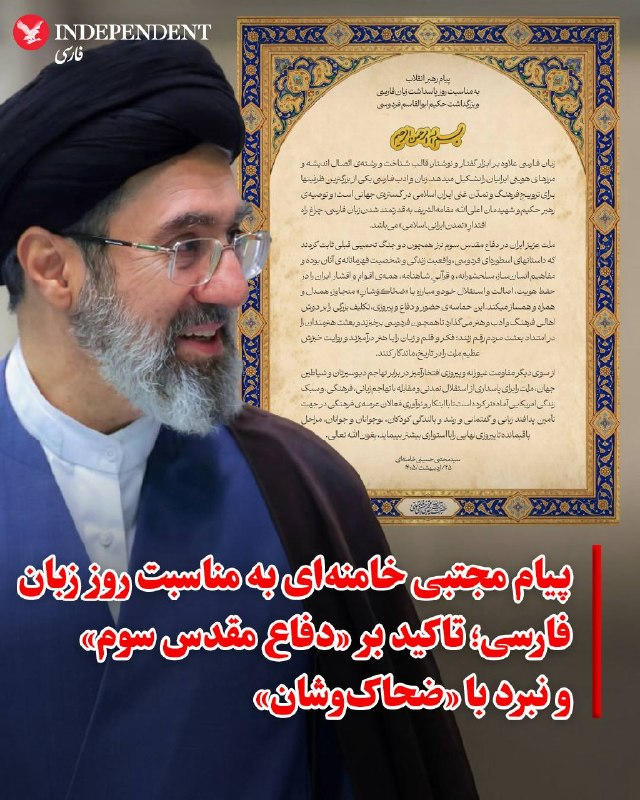
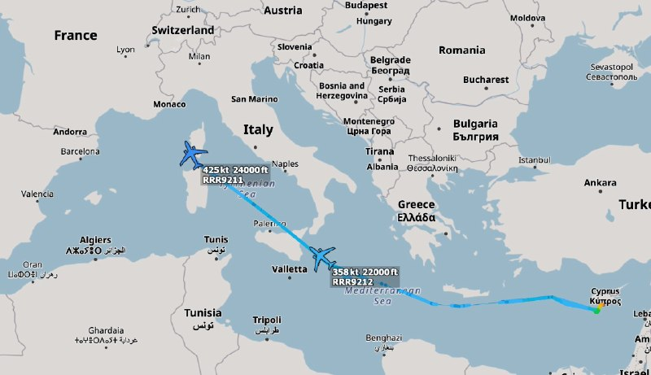
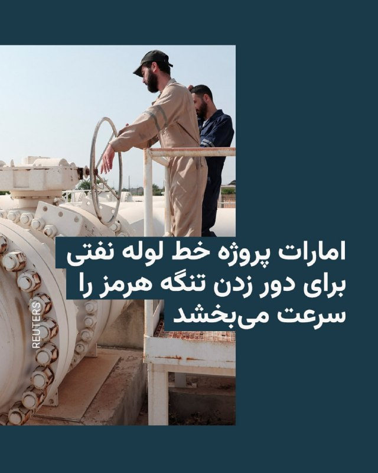
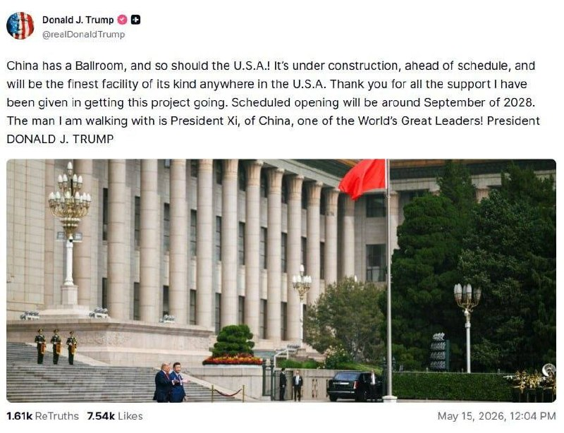
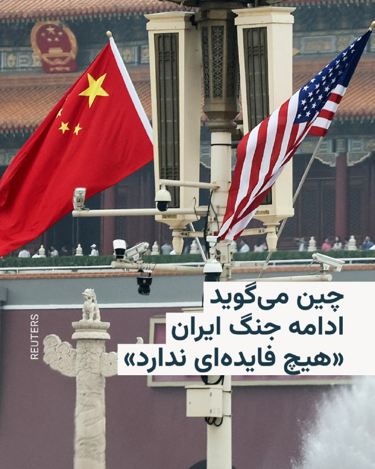

# خواننده تلگرام

<!-- TOP_NAV START -->

<a href="https://github.com/hosseinbaghi/aio-downloader/blob/main/telegram/content/archive_1.md" style="display:inline-block; padding:6px 12px; margin:0 4px; background-color:#2ea44f; color:white; text-decoration:none; border-radius:4px; font-weight:bold;">صفحه بعد</a>

<!-- TOP_NAV END -->

<!-- MSG START -->

---
📅 بروزرسانی: 1405/02/25 18:06
---

## VahidOOnLine — post 240326

  <a href="telegram/content/VahidOOnLine_240326_1778855781.mp4" target="_blank">🎬 Download video</a>

سازمان اطلاعات مرکزی آمریکا با انتشار تصاویری از هاوانا، حضور جان رتکلیف، رئیس این سازمان، در پایتخت کوبا را تایید کرد.

بر اساس گزارش فوربس مکزیک، رتکلیف در جریان این سفر با مقام‌های ارشد دولت کوبا دیدار کرد. این رسانه نوشت گفت‌وگوها درباره همکاری‌های اطلاعاتی، امنیت منطقه‌ای و وضعیت اقتصادی کوبا انجام شده است.

به نوشته فوربس مکزیک، رئیس سیا برای گفت‌وگوهای مستقیم با مقام‌های وزارت کشور کوبا و مسئولان نهادهای اطلاعاتی این کشور به هاوانا رفت. این گزارش، دیدار رتکلیف با مقام‌های کوبایی را نشستی کم‌سابقه در سطح بالا میان دو کشور توصیف کرده است.

در این گزارش آمده است که در جریان این سفر، رتکلیف با رائول رودریگز کاسترو، نوه رائول کاسترو و مشاور امنیتی، و همچنین لازارو آلوارز کاساس، وزیر کشور کوبا، دیدار کرد.
‌🏁 🇬🇧 ManotoTV

🤖 @VahidOOnLine

## VahidOOnLine — post 240325

  <a href="telegram/content/VahidOOnLine_240325_1778855782.mp4" target="_blank">🎬 Download video</a>

«جمهوری اسلامی قصد کشتن فاطمه سپهری را دارد»
‌🏁 🇬🇧 ManotoTV

🤖 @VahidOOnLine

## VahidOOnLine — post 240324

  <a href="telegram/content/VahidOOnLine_240324_1778855783.mp4" target="_blank">🎬 Download video</a>

«صدای بانو سپهری باشیم»
‌🏁 🇬🇧 ManotoTV

🤖 @VahidOOnLine

## VahidOOnLine — post 240323

  <a href="telegram/content/VahidOOnLine_240323_1778855784.mp4" target="_blank">🎬 Download video</a>

دونالد ترامپ در پاسخ به پرسشی درباره حمله به یک مدرسه دخترانه در روز نخست جنگ گفت این موضوع «در دست بررسی» است.

خبرنگاری از ترامپ پرسید که سنتکام روز گذشته درباره حمله به مدرسه دخترانه در روز اول جنگ مورد پرسش قرار گرفته بود. ترامپ در پاسخ گفت: «این در دست بررسی است.» او افزود چند موضوع دیگر نیز در دست بررسی قرار دارد، اما تاکید کرد که این مورد هم جزو پرونده‌های در حال بررسی است.

در ادامه، خبرنگار پرسید آیا امکان دریافت اطلاعات بیشتر درباره این موضوع وجود دارد و اشاره کرد که این حمله با یک واحد موشکی آمریکایی مرتبط بوده است.

ترامپ در پاسخ وارد موضوع بی‌بی‌سی شد و این رسانه را به جعل گفته‌هایش متهم کرد. او گفت بی‌بی‌سی «حرف‌های بدی» در دهان او گذاشته و بعد ناچار شده بپذیرد که آن گفته‌ها درست نبوده است.
‌🏁 🇬🇧 ManotoTV

🤖 @VahidOOnLine

## VahidOOnLine — post 240322

  

محمدنبی موسوی‌فرد، امام جمعه اهواز گفت: «در حال حاضر جمهوری اسلامی شرایطی برای آمریکا ایجاد کرده که نه راه پس دارد و نه راه پیش؛ دشمن باید بداند جمهوری اسلامی کاری کرده است که هیچ راه‌حل نظامی نمی‌تواند از عزت و اقتدار دفاعی و نظامی ما بکاهد.»

او ادامه داد: «نیروهای مسلح و بسیج نیز مانند گذشته، آمادگی کامل و کوبنده‌ای برای برخورد قاطع با هرگونه تجاوز دشمن را دارند.»
‌🏁 🇬🇧 IranintlTV

🤖 @VahidOOnLine

## VahidOOnLine — post 240321

  <a href="telegram/content/VahidOOnLine_240321_1778855786.mp4" target="_blank">🎬 Download video</a>

یک شهروند در پیام ارسالی خود به ایران اینترنشنال با اشاره به افزایش شدید قیمت داروها گفت که هزینه گچ گرفتن پای شکسته‌اش ۹ میلیون تومان شده است. پیام این مخاطب با هوش مصنوعی خوانده شده است.
‌🏁 🇬🇧 IranintlTV

🤖 @VahidOOnLine

## VahidOOnLine — post 240320

  

رییس‌کل دادگستری خراسان جنوبی اعلام کرد یک وکیل دادگستری در بیرجند در جریان اختلاف خانوادگی جان باخته است.

او گفت این وکیل زن پس از آن‌که همسرش با خودرو او را زیر گرفت، جان خود را از دست داد و پرونده این حادثه برای رسیدگی ویژه در دستگاه قضایی در حال بررسی است.

به گفته این مقام قضایی، متهم خود را به قوه قضاییه معرفی کرده است.
‌🏁 🇬🇧 IranintlTV

🤖 @VahidOOnLine

## VahidOOnLine — post 240319

  

♦️اسماعیل بقایی، سخنگوی وزارت خارجه جمهوری اسلامی با انتشار پیامی کوتاه به زبان عربی در شبکه اجتماعی ایکس، به گزارش‌ها درباره اقدامات امارات متحده عربی در دوران جنگ واکنش نشان داد و نوشت: «کسی که پنهانی خیانت کند، آشکارا رسوا می‌شود.» این پیام در حساب رسمی وزارت خارجه جمهوری اسلامی نیز با توضیح «خیانت به همسایه پنهان نمی‌ماند» بازتاب یافت.

در روزهای گذشته، گزارشی از سفر محرمانه بنیامین نتانیاهو، نخست‌وزیر اسرائیل به امارات متحده مطرح شد. دفتر نخست‌وزیر اسرائیل این گزارش را تایید کرد و این سفر را آغاز «یک پیشرفت تاریخی» دانست. امارات متحده عربی، این گزارش را تکذیب کرد. همچنین گزارش‌هایی از انجام حملات مستقیم به خاک ایران از سوی امارات مطرح شده است. عباس عراقچی، وزیر امور خارجه جمهوری اسلامی که برای شرکت در نشست وزیران خارجه کشورهای عضو بریکس در هند حضور دارد، این گزارش‌ها را تایید کرد.
‌🇸🇦 Indypersian

🤖 @VahidOOnLine

## VahidOOnLine — post 240318

  <a href="telegram/content/VahidOOnLine_240318_1778855789.mp4" target="_blank">🎬 Download video</a>

♦️ویدیوهای منتشر شده در شبکه‌های اجتماعی که گفته می‌شود مربوط به یکی از جزایر ایران است، آلودگی نفتی در سواحل این منطقه را در روز جمعه ۲۵ اردیبهشت نشان می‌دهد. در این تصاویر، لکه‌های نفتی در آب و آلودگی گسترده در نوار ساحلی قابل مشاهده است.

رویترز با انتشار تصاویر ماهواره‌ای که بین ۶ تا ۸ می (۱۶ تا ۱۸ اردیبهشت) ثبت شده‌اند، از وقوع یک نشت نفت گسترده در نزدیکی جزیره خارگ، اصلی‌ترین پایانه صادرات نفت ایران، خبر می‌دهند. این لکه نفتی که در تصاویر ماهواره‌های کوپرنیک به‌صورت توده‌ای خاکستری و سفید دیده می‌شود، منطقه‌ای به وسعت تقریبی ۴۵ تا ۹۵ کیلومتر مربع را در غرب این جزیره پوشانده است.

این درحالی است سازمان حفاظت محیط زیست ایران روز دوشنبه ۲۱ اردیبهشت ماه اعلام کرد لکه بزرگ مشاهده شده در آب‌های خلیج فارس در نزدیکی جزیره خارگ ناشی از تخلیه آب آلوده توازن یک نفت‌کش آسیب دیده بوده است.
‌🇸🇦 Indypersian

🤖 @VahidOOnLine

## VahidOOnLine — post 240317

  

سنتکام اعلام کرد از زمان آغاز محاصره دریایی بنادر و سواحل جنوب ایران، ۷۵ کشتی تجاری مجبور به تغییر مسیر شده‌اند و چهار کشتی نیز در پی حمله نیروهای آمریکا از کار افتاده‌اند.

پیش از این، سنتکام با انتشار تصویری از گشت‌زنی یک جنگنده پنهان‌کار اف-۳۵-ای نیروی هوایی بر فراز آب‌های منطقه‌ای نزدیک تنگه هرمز خبر داد.
‌🏁 🇬🇧 IranintlTV

🤖 @VahidOOnLine

## VahidOOnLine — post 240316

  

مجتبی خامنه‌ای در پیامی منتسب به او به مناسبت روز پاسداشت زبان فارسی و بزرگداشت فردوسی، زبان فارسی را یکی از پایه‌های هویت ایرانیان توصیف کرد و گفت تقویت این زبان می‌تواند به گسترش «تمدن ایرانی‌اسلامی» کمک کند.
او همچنین با اشاره به شاهنامه، از آن به‌عنوان اثری برای حفظ هویت، استقلال و ایستادگی ایرانیان یاد کرد.
در بخشی از این پیام نوشته شده: «داستانهای اسطوره‌ای فردوسی، واقعیت زندگی و شخصیت قهرمانانه‌ آنان بوده و مفاهیم انسان‌ساز، سلحشورانه، و قرآنی شاهنامه، همه‌ اقوام و اقشار ایران را در حفظ هویت، اصالت و استقلال خود و مبارزه با ضحاک‌وشان متجاوز، همدل و همراه و همساز می کند.»
‌🏁 🇬🇧 IranintlTV

🤖 @VahidOOnLine

## VahidOOnLine — post 240315

  

♦️ فریدریش مرتس، صدراعظم آلمان، روز جمعه ۲۵ اردیبهشت، از گفتگوی تلفنی «مثبت و سازنده» با دونالد ترامپ، رئیس‌جمهوری آمریکا، خبر داد. این تماس در حالی انجام شد که اخیرا اعلام خبر خروج ۵ هزار سرباز آمریکایی از خاک آلمان، روابط دو کشور را دچار تنش کرده بود؛ اما پیام اخیر مرتس نشان‌دهنده تلاش برای عبور از این اختلافات است.

مرتس در شبکه اجتماعی ایکس اعلام کرد که دو طرف بر سر اهداف کلیدی واشنگتن در قبال جمهوری اسلامی اتفاق نظر دارند. او تاکید کرد: «ما توافق داریم که ایران باید فورا به میز مذاکره بازگردد، تنگه هرمز را باز کند و تحت هیچ شرایطی نباید اجازه دستیابی به سلاح هسته‌ای به تهران داده شود.»

علاوه بر موضوع ایران، رهبران دو کشور درباره دستیابی به راهکاری صلح‌آمیز برای اوکراین و هماهنگی مواضع پیش از نشست آتی ناتو در آنکارا گفتگو کردند. آلمان که بزرگ‌ترین اقتصاد اروپا و حامی اصلی نظامی اوکراین محسوب می‌شود، در دوران مرتس تقویت توان دفاعی خود را برای کاهش وابستگی به ایالات متحده و مقابله با تهدیدات روسیه در اولویت قرار داده است.
‌🇸🇦 Indypersian

🤖 @VahidOOnLine

## VahidOOnLine — post 240314

🗣روایت شما از بحران اقتصادی و زندگی در آتش‌بس- جمعه ۲۵ اردیبهشت:

🔹برای پایان‌نامه مجبور شدم اینترنت پرو بخرم، با مالیاتش شد ۲ میلیون و ۱۷۰ هزار تومان. قبلش هم اشتراک چت‌جی‌پی‌تی و سامانه «شکن» را گرفته بودم ولی جوابگو نبود. چند میلیون باید برای چیزی هزینه کنی که حقته اما ازت گرفتنش.

🔹 از زمان شروع جنگ تا الان قطعی اینترنت کلی هزینه اضافی رو دستمون گذاشته. ۱۰ گیگ یک ماهه خریدم، ولی ظرف دو هفته تمام شد.

🔹 من اختلال دوقطبی دارم و باید دارو مصرف گنم اما داروهای اعصاب و روان به‌شدت گران و نایاب شده و این موضوع من را به‌شدت نگران کرده، چون تاثیر بدی در روند درمانم دارد.

🔹 مغازه‌ام در پاساژ ارغوان بود که ۱۵ اردیبهشت سوخت و هیچی ازش نموند. حکومت تلاشی برای خاموش کردن آتش نکرد. من و کسبه ارغوان از کجا می‌خواهیم الان کار کنیم، جنس بخریم و تو این وضعیت خرج خونه دربیاریم؟

🔹 من یک زن ۲۵ ساله هستم. سال‌ها امیدم این بود که یک روز مهاجرت می‌کنم و برای همان تلاش کردم. الان با این وضعیت که آیلتس دیگر در ایران برگزار نمی‌شود، اینترنت قطع شده و همه‌چیز ۱۰ برابر گران‌تر شده، حتی نمی‌دانم دیگر به چه آینده‌ای دل ببندم. تمام آرزوهایی که داشتم یکی‌یکی ازم گرفته شدند و الان فقط به این فکر می‌کنم که هفته بعد چطور پولم را نگه دارم که به آخر ماه برسد و چطور قسطی دستمال کاغذی و گوشت و روغن بخرم.

🔹 گناه ما چیست که نمی‌توانیم مثل بقیه آدم‌های این دنیا یک زندگی عادی داشته باشیم؟ برای خوشبختی‌های ساده باید فقط از تخیلاتمان استفاده کنیم. تمام دوستام کارشان با اینترنت بود و الان کارشان را از دست دادند و همه اطرافیانم فقط منتظرند ببینند «چی می‌شه». تا کی باید در این برزخ زندگی کنیم؟
‌🏁 🇬🇧 IranintlTV

🤖 @VahidOOnLine

## VahidOOnLine — post 240313

  

دونالد ترامپ گفت آمریکا ممکن است در مقطعی برای حذف آنچه «گرد و غبار هسته‌ای» نامید وارد ایران شود. ترامپ در مسیر بازگشت به آمریکا و در هواپیمای ریاست‌جمهوری، ایر فورس وان، به خبرنگاران گفت: «در زمان مناسب، یا وارد می‌شویم یا آن را به دست می‌آوریم. فکر می‌کنم احتمالا آن را به دست می‌آوریم، اما اگر به دست نیاوریم، وارد خواهیم شد.»

او افزود: «فکر می‌کنم آنها کاملا شکست خواهند خورد و ما هیچ خطری نخواهیم داشت. ما تجهیزات لازم برای خارج کردن آن را داریم، هیچ‌کس دیگر ندارد؛ شاید چین چنین تجهیزاتی داشته باشد.»

ترامپ پیش‌تر نیز در ماه مارس در کاخ سفید درباره ذخایر اورانیوم غنی‌شده جمهوری اسلامی هشدار مشابهی داده و گفته بود: «یا آن را از آنها پس می‌گیریم یا آن را برمی‌داریم.»
‌🏁 🇬🇧 IranintlTV

🤖 @VahidOOnLine

## VahidOOnLine — post 240312

  

احمد علم‌الهدی، امام جمعه مشهد گفت: «آمریکا اگر بخواهد جنگ را ادامه بدهد، قطعا شکست بیشتری عاید او می‌شود، چون امروز قدرت و توان ما با روز اول جنگ خیلی تفاوت دارد، اگرچه ما در روز اول جنگ کمی غافلگیر شدیم اما اکنون رزمندگان ما آماده‌تر شدند و مسلما شکست آمریکا از اول بیشتر خواهد بود و کمتر نیست.»

او افزود: «در این جنگ ثابت شد که پدافند آمریکایی اصلا کارآمد نیست و حتی نتوانست یکی از موشک‌های ما را رهگیری کند، موشک‌های ما نیز با موفقیت به محل مورد نظر اصابت می‌کرد.»

او ادامه داد: «رزمندگان ما توانستند یک ابرقدرت روی کره زمین را به زانو درآورند و از مقام ابرقدرتی ساقط کنند.»
‌🏁 🇬🇧 IranintlTV

🤖 @VahidOOnLine

## VahidOOnLine — post 240311

  <a href="telegram/content/VahidOOnLine_240311_1778855793.mp4" target="_blank">🎬 Download video</a>

♦️دونالد ترامپ، رئیس‌جمهوری ایالات متحده، روز جمعه ۲۵ اردیبهشت در مسیر بازگشت از چین در پاسخ به خبرنگاران، درباره آخرین پیشنهاد ایران در مذاکرات هسته‌ای گفت که آن را «از همان جمله اول» رد کرده است.
او با بیان اینکه محتوای ابتدایی این پیشنهاد «غیرقابل قبول» بوده، افزود: «حتی ادامه آن را هم نخواندم.» ترامپ تأکید کرد که صرف تعیین بازه زمانی مانند ۲۰ سال کافی نیست و آنچه اهمیت دارد، ارائه تضمین‌های واقعی و قابل اجرا از سوی ایران است.
رئیس‌جمهوری آمریکا همچنین تصریح کرد که، هرگونه توافق باید شامل انتقال کامل مواد و سوخت هسته‌ای از ایران باشد و افزود که توافقی مبتنی بر «حرف‌های توخالی» قابل پذیرش نخواهد بود.
‌🇸🇦 Indypersian

🤖 @VahidOOnLine

## VahidOOnLine — post 240310

  

♦️ مجتبی خامنه‌ای، سومین رهبر جمهوری اسلامی، در پیامی کتبی به مناسبت روز بزرگداشت فردوسی، با زبانی آمیخته به مفاهیم اسطوره‌ای و ایدئولوژیک، بر پیوند میان «هویت ایرانی» و «تمدن اسلامی» تاکید کرد. او در این پیام با اشاره به آنچه «دفاع مقدس سوم» نامید، مدعی شد که مردم ایران در جنگ اخیر نیز همچون درگیری‌های پیشین، واقعیتِ «داستان‌های قهرمانانه شاهنامه» را رقم زده‌اند.

مجتبی خامنه‌ای که از زمان هدف قرار گرفتن در حملات آمریکا و اسرائیل، دیده نشده و صدایی نیز از او شنیده نشده است، در بخشی از پیام خود، متجاوزان را «ضحاک‌وشان» نامید و حفظ استقلال کشور را در گرو مبارزه با آن‌ها دانست. او همچنین با حمله به «سبک زندگی آمریکایی»، خواستار مقابله با «تهاجم زبانی و فرهنگی» غرب شد و از اهالی هنر خواست تا با «بعثت فکری»، روایتِ به گفته او «خیزش ملت» را ماندگار کنند.

استفاده از نمادهای ملی‌گرایانه نظیر شاهنامه و فردوسی، بعد از اولین حمله مستقیم اسرائیل در سال ۱۴۰۴ در ادبیات رسمی رهبران جمهوری اسلامی رواج یافته است.
‌🇸🇦 Indypersian

🤖 @VahidOOnLine

## VahidOOnLine — post 240309

  

فریدریش مرز، صدراعظم آلمان، روز جمعه اعلام کرد پس از سفر دونالد ترامپ به چین با او تماس تلفنی داشته و دو طرف درباره ضرورت بازگشت جمهوری اسلامی به میز مذاکره توافق کرده‌اند.

مرز گفت در این گفت‌وگو تاکید شده است که جمهوری اسلامی باید تنگه هرمز را باز کند و نباید اجازه داده شود به سلاح هسته‌ای دست یابد.

صدراعظم آلمان در پیام‌هایی در شبکه ایکس افزود او و ترامپ همچنین درباره دستیابی به راه‌حل مسالمت‌آمیز برای اوکراین گفت‌وگو کرده و پیش از نشست ناتو در آنکارا مواضع خود را هماهنگ کرده‌اند.

او تاکید کرد ایالات متحده و آلمان شریکانی قدرتمند در چارچوب ناتوی قدرتمند هستند.
‌🏁 🇬🇧 IranintlTV

🤖 @VahidOOnLine

## VahidOOnLine — post 240308

🗣روایت شما از بحران اقتصادی و زندگی در آتش‌بس- جمعه ۲۵ اردیبهشت:

🔹در وضعیت بدی قرار داریم اما در حال حاضر کاری از دست ما برنمیاد جز صبور بودن و منتظر زمان درست بودن. با این سفره‌های خالی و جنایات انقلاب شیر و خورشید، مردم از قبل بیشتر عصبانی شده‌اند و این عصبانیت یک روزی از یک جایی بیرون خواهد زد.

🔹از اصفهان پیام می‌دم من یه جوان ۲۵ ساله‌ام با شغل فنی که دیگه امیدی به آینده‌م ندارم. هر چقدر بیشتر کار می‌کنم کمتر درآمد دارم. با وام و قرض گرفتن ابزار کار خریدم که کار کنم ولی الان ۳ ماهه که بیکارم. فکر کنم تا چند وقت دیگه یا باید برم زندان یا متواری بشم.

🔹مردم از بی اینترنتی خسته شدن، قیمت کانفیگ‌ها بسیار بالاست. گرونی بی‌داد می‌کنه. یک نوشابه ۱.۵ لیتری ۱۱۰ هزار تومانه، لیوان یک بار مصرف به‌شدت گران شده.

🔹ما کشاورزیم، اوضاع برامون خیلی سخت شده، قیمت یک کیسه کود شیمیایی فسفات به ۱۰ میلیون تومان رسیده.

🔹برای اکثر معلولان ماهیانه تنها دو میلیون و ۱۰۰ هزار تومان به عنوان مستمری یا کمک مالی واریز می‌شه که برای تهیه ارزان‌ترین غذا (تخم‌مرغ) هم کافی نیست.

🔹در ایلام اوضاع خیلی خیلی خرابه. اگه در همه شهرها گرونی و کمبود خیلی چیزا هست اما این‌جا وضعیت در حد سونامی و انفجاره. کرایه خونه تو ایلام ۱۲۰ برابر شده. صاحبخونه ۱۰ روز بهم فرصت داده خونه رو خالی کنم اما جایی رو پیدا نمی‌کنم.

🔹یک قوطی رنگ روغن اول اردیبهشت در مشهد ۴۰۰ هزار تومان بود امروز شده ۶۵۰ هزار تومان.
‌🏁 🇬🇧 IranintlTV

🤖 @VahidOOnLine

## VahidOOnLine — post 240307

  <a href="telegram/content/VahidOOnLine_240307_1778855794.mp4" target="_blank">🎬 Download video</a>

وزارت خارجه آمریکا اعلام کرد این کشور در عملیاتی محرمانه، حدود ۱۳ و نیم کیلوگرم اورانیوم غنی‌شده را از یک رآکتور تحقیقاتی تعطیل‌شده در ونزوئلا خارج کرده است.

بر اساس اعلام وزارت خارجه آمریکا، این عملیات به رهبری واشینگتن و با همکاری شرکای بین‌المللی انجام شد و هدف آن کاهش خطر سوءاستفاده از مواد هسته‌ای و تقویت امنیت هسته‌ای عنوان شده است.

اداره ملی امنیت هسته‌ای آمریکا، وابسته به وزارت انرژی، نیز اعلام کرده است همه اورانیوم غنی‌شده باقی‌مانده از یک رآکتور تحقیقاتی قدیمی در ونزوئلا خارج شده است. این نهاد گفت این عملیات در چند ماه انجام شد، در حالی که در شرایط عادی ممکن بود سال‌ها طول بکشد.
‌🏁 🇬🇧 ManotoTV

🤖 @VahidOOnLine

## WithYashar — post 11292

وزیر نیروهای مسلح فرانسه: ناو هواپیمابر «شارل دوگل» در دریای عرب مستقر شده و ماموریت آن «دفاعی» است.
@withyashar

## WithYashar — post 11291

  <a href="telegram/content/WithYashar_11291_1778855795.mp4" target="_blank">🎬 Download video</a>

خبرنگار: دیروز از دریادار کوپر درباره حمله به مدرسه دخترانه(میناب)در روز اول جنگ سؤال شد.
ترامپ: منظورتون همون حمله اولیه‌ست؟ اون موضوع هنوز تحت تحقیق قرار داره.
خبرنگار: می‌تونید تأیید کنید که موشک آمریکایی بوده؟
ترامپ: شما از کدوم رسانه‌ای هستید؟
خبرنگار: بی‌بی‌سی.
ترامپ: بی‌بی‌سی فیکه با من حرف نزن.
@withyashar

## mwarmonitor — post 9131

  

✈️🇬🇧نیروی هوایی سلطنتی بریتانیا (RAF) استقرار جنگنده‌های لایتنینگ

دو فروند تانکر Airbus KC.2 Voyager
43C6F4 ZZ331 – ASCOT 9211
43C6FB ZZ338 – ASCOT 9212

✈️دو تانکر KC.2 Voyager بعدازظهر امروز از RAF Akrotiri به سمت RAF Brize Norton در حال پرواز هستند. هم‌زمان، دو دسته پروازی از جنگنده‌های F-35B نیز در مسیر بازگشت به پایگاه RAF Marham قرار دارند.

✈️در مجموع شش فروند F-35B به آکروتیری اعزام شده بودند و با توجه به استفاده از دو تانکر در این مأموریت، به احتمال زیاد هر شش فروند در حال بازگشت به کشور هستند.

@mwarmonitor

## mwarmonitor — post 9129

  

🇺🇸یک بالگرد MH-60R Sea Hawk از عرشه ناو جنگی USS Rafael Peralta (DDG 115) در حالی که نیروهای آمریکایی در دریای عرب در حال اجرای محاصره دریایی علیه ایران هستند، برخاست. تا امروز، ۷۵ کشتی تجاری منحرف شده و ۴ کشتی برای تضمین رعایت مقررات از کار افتاده‌اند.

@mwarmonitor

## mwarmonitor — post 9128

🇺🇸فرمانده سنتکام: عملیات «خشم حماسی» ایران را فلج و مشارکت‌های نظامی در منطقه را تقویت کرد

وزارت جنگ ایالات متحده 🇺🇸

🔸به گفته رهبران وزارت جنگ، ایالات متحده در اواخر فوریه عملیات «خشم حماسی» (Epic Fury) را آغاز کرد و از آن زمان، نیروهای نظامی آمریکا در منطقه عملیاتی فرماندهی مرکزی (سنتکام)، توان نظامی ایران و قدرت نفوذ آن را فلج کرده‌اند. این عملیات همچنین نقش شرکای نظامی در منطقه را برجسته کرد.

دریاسالار برد کوپر، فرمانده سنتکام، امروز در واشینگتن در برابر کمیته نیروهای مسلح سنا شهادت داد. این جلسه بخشی از بررسی‌های مربوط به وضعیت نیروها در منطقه و بخش مربوط به این فرماندهی در درخواست بودجه ریاست‌جمهوری برای سال مالی ۲۰۲۷ بود. محور اصلی گفتگوها در کپیتال هیل بر موفقیت‌های عملیات «خشم حماسی» متمرکز بود.
کوپر خطاب به قانون‌گذاران گفت: «در کمتر از ۴۰ روز، نیروهای سنتکام به اهداف نظامی خود دست یافتند. قابل‌توجه‌ترین دستاورد این بود که ما توانایی ایران برای صدور قدرت به خارج از مرزهایش و تهدید منطقه و منافعمان را تضعیف کردیم.»
کوپر به یاد قانون‌گذاران آورد که در آوریل و اکتبر سال گذشته، ایران صدها موشک را بر سر اسرائیل فرود آورد؛ اما اکنون پس از آنکه نیروهای آمریکایی به‌طور مؤثری ظرفیت موشک‌های متعارف ایران را از بین بردند، این کشور دیگر چنین توانایی ندارد.
او گفت: «امروز ایران دیگر نمی‌تواند با آن حجم و مقیاس حمله کند. علاوه بر این، با نابودی ۹۰ درصد از پایگاه‌های صنایع دفاعی ایران، این کشور تا سال‌ها قادر به بازسازی آن سلاح‌ها نخواهد بود.»
اهداف راهبردی و نابودی توان نظامی
رئیس‌جمهور دونالد جی. ترامپ و دیگر مقامات دولت تصریح کرده‌اند که ایرانی‌ها هرگز به سلاح هسته‌ای دست نخواهند یافت. کوپر بیان کرد که اهداف نظامی در قالب عملیات «خشم حماسی» برای حمایت از این سیاست طراحی شده بود؛ از جمله تضعیف توانمندی موشک‌های بالستیک و نیروی دریایی ایران و همچنین نابودی توانایی صنایع این کشور برای بازسازی این تجهیزات.
صنایع دفاعی: ۹۰ درصد از زیرساخت‌های پهپادی، موشکی و دریایی تخریب شده و تنها ۱۰ درصد باقی مانده است.
نیروی دریایی: طبق ارزیابی نظامی، بازسازی نیروی دریایی ایران ۵ تا ۱۰ سال زمان خواهد برد.
گروه‌های نیابتی: حماس، حزب‌الله و حوثی‌ها به دلیل این عملیات، از تدارکات تسلیحاتی و پشتیبانی ایران قطع شده‌اند.
تقویت ائتلاف‌های منطقه‌ای
کوپر به قانون‌گذاران گفت که در حال حاضر هیچ منبع یا تجهیزاتی از ایران به سمت گروه‌های تروریستی نیابتی سرازیر نمی‌شود. او تأکید کرد که آغاز عملیات «خشم حماسی» نشان داد شرکای منطقه‌ای تا چه حد توانمند هستند و این عملیات باعث تقویت روابط نظامی شده است.
او افزود: «در حال حاضر، ما پنج کشور متحد خاص داریم که نه تنها در تئوری، بلکه در عمل شانه به شانه ایالات متحده در امور دفاعی ایستاده‌اند.»
شرکای کلیدی مورد تقدیر:
امارات متحده عربی، بحرین، کویت، قطر و عربستان سعودی (به عنوان شرکای استثنایی).
پادشاهی اردن (نقش حیاتی در موفقیت عملیات).

🔴دولت اسرائیل (همکاری بسیار نزدیک).
کوپر در پایان خاطرنشان کرد: «این نتیجه از پیش تعیین شده نبود و بر حسب تصادف به دست نیامد؛ بلکه حاصل ماه‌ها برنامه‌ریزی دقیق بر پایه دهه‌ها تجربه است.»

@mwarmonitor

## FoxNewsTwitter — post 341777

  

Fox News (Twitter/X)

“Senior’s Day at Gold’s in Venice.”

Health and Human Services Secretary Robert F. Kennedy Jr. and Hollywood icon Arnold Schwarzenegger showcase their longtime friendship during a workout session at Gold’s Gym Venice.

This isn’t the first time the pair have worked out together, the former governor gave a look inside their friendship during an interview last year, saying, "We've worked out together and go gym and stuff like that, and I always was a big supporter of his."

Schwarzenegger was previously married to Kennedy's cousin, journalist Maria Shriver, from 1986 until 2011.

## FoxNewsTwitter — post 341773

Fox News (Twitter/X)

DHS Secretary Markwayne Mullin joined ICE officers on the ground in Virginia during an early morning operation that resulted in the arrest of a repeat criminal illegal alien previously removed multiple times from the United States.

Mullin said the suspect’s record included drug possession and DUI charges while slamming Governor Spanberger’s sanctuary policies for making Virginia “a magnet for criminal illegal aliens.”

## FoxNewsTwitter — post 341772

  <a href="telegram/content/FoxNewsTwitter_341772_1778855798.mp4" target="_blank">🎬 Download video</a>

Fox News (Twitter/X)

WATCH: President Trump reacts to Secretary of State Marco Rubio’s viral Nike tracksuit:

"I thought he looked very good in the outfit. Listen, I don't know if I'd do it, but I thought he looked very good."

## FoxNewsTwitter — post 341771

  <a href="telegram/content/FoxNewsTwitter_341771_1778855799.mp4" target="_blank">🎬 Download video</a>

Fox News (Twitter/X)

WATCH: Country music star Eric Church describes the creative process behind his extremely personal UNC commencement speech, revealing he turned to his guitar after months of writer's block:

"Finally, one night, in a fit of frustration, I picked up my guitar just to kind of just to get away from the frustrating part of trying to write the speech. And as I was strumming the guitar, it just dawned on me. I hit all six strings and I thought, you know, hey, what what if I could make a speech out of these?" | @foxandfriends @ainsleyearhardt

## FoxNewsTwitter — post 341770

  <a href="telegram/content/FoxNewsTwitter_341770_1778855801.mp4" target="_blank">🎬 Download video</a>

Fox News (Twitter/X)

NEW: President Trump unleashes on Democratic Senate candidate James Talarico, labeling the Texas politician "pathetic" and "bad news" for the Lone Star State.

"I think the Democrats have a weird, a weird candidate. I mean, this guy is bad news.”

## FoxNewsTwitter — post 341769

  <a href="telegram/content/FoxNewsTwitter_341769_1778855803.mp4" target="_blank">🎬 Download video</a>

Fox News (Twitter/X)

NEW: President Trump clashes with a reporter on Air Force One during a feisty exchange about the U.S. military action in Iran as well as the regime's current capabilities:

"I had a total military victory. But the fake news guys like you write incorrectly. You're a fake guy. And guys like you write about it incorrectly. We had a total military victory. We knocked out their entire navy. We knocked out their entire Air force."

## pm_afshaa — post 90795

  <a href="telegram/content/pm_afshaa_90795_1778855805.webm" target="_blank">🎬 Download video</a>

🔴ترامپ: آمریکا ممکنه در مقطعی برای خارج کردن «گرد و غبار هسته‌ای» ایران، وارد عمل بشه؛ یا اونو به دست میاریم، یا اگر نشد، وارد میشیم؛ آمریکا تجهیزات لازم برای این کار رو در اختیار داره.

💧 Rainbet.com the #1 Non-KYC Crypto Casino & Sportsbook @rainbetcom

😁 @Pm_Afshaa

## pm_afshaa — post 90794

  <a href="telegram/content/pm_afshaa_90794_1778855805.webm" target="_blank">🎬 Download video</a>

🔴وزیر امور خارجه چین: ما خواستار بازگشایی هرچه سریع‌تر تنگه هرمز هستیم.

همچنین ما از آمریکا و ایران حمایت می‌کنیم تا به حل اختلافات و منازعات خود از طریق گفتگوها ادامه بدن.

💧 Rainbet.com the #1 Non-KYC Crypto Casino & Sportsbook @rainbetcom

😁 @Pm_Afshaa

## pm_afshaa — post 90793

  

جهت تبلیغات با بازدهی بالا میتونین دایرکت کانال پیام بدین

## pm_afshaa — post 90792

🔴ترامپ خطاب به خبرنگار نیویورک تایمز:من در ایران یک پیروزی کامل نظامی داشتم. اما فیک نیوزها، افرادی مثل تو، اخبار نادرست می‌نویسند. تو یک آدم جعلی هستی. ما یک پیروزی کامل نظامی داشتیم. من در واقع فکر می‌کنم آنچه می‌نویسی نوعی خیانت است. باید از خودت خجالت بکشی. من واقعاً فکر می‌کنم این خیانت است

💧 Rainbet.com the #1 Non-KYC Crypto Casino & Sportsbook @rainbetcom

😁 @Pm_Afshaa

## pm_afshaa — post 90791

  <a href="telegram/content/pm_afshaa_90791_1778855807.webm" target="_blank">🎬 Download video</a>

🔴سنتکام: تا امروز، 75 کشتی تجاری تغییر مسیر دادن و 4 کشتی غیرفعال شده تا اطمینان حاصل بشه که قوانین رعایت میشه.

💧 Rainbet.com the #1 Non-KYC Crypto Casino & Sportsbook @rainbetcom

😁 @Pm_Afshaa

## pm_afshaa — post 90790

  <a href="telegram/content/pm_afshaa_90790_1778855807.webm" target="_blank">🎬 Download video</a>

🔴تهران‌تایمز: آمریکا پیشنهاد 14 ماده‌ای جمهوری اسلامی برای پایان جنگ رو رد کرده و بار دیگر بر مواضع خود، به‌ویژه درباره پرونده هسته‌ای، تأکید کرده.

💧 Rainbet.com the #1 Non-KYC Crypto Casino & Sportsbook @rainbetcom

😁 @Pm_Afshaa

## pm_afshaa — post 90789

🔴دقایقی پیش ترامپ رسماً اعلام کرد که یه دور دیگر از عملیات نظامی آمریکا در ایران در راه است

+ترامپ:ما همه چیز را تمام نکردیم،
برمی‌گردیم و آن را تکمیل می‌کنیم،
حتی شاید بیشتر

💧 Rainbet.com the #1 Non-KYC Crypto Casino & Sportsbook @rainbetcom

😁 @Pm_Afshaa

## pm_afshaa — post 90788

♨️
♨️
♨️
♨️

## iaghapour — post 2612

کل ریپازیتوری گیت هاب علیرضا که شامل X-UI و S-UI میشد بسته شده و هنوز دلیلش مشخص نیست.

## DEJradio — post 4652

  <a href="telegram/content/DEJradio_4652_1778855807.webm" target="_blank">🎬 Download video</a>

🔺📢 آمریکا بر سر دو راهی؛
عملیات برای خارج کردن اورانیوم‌ها یا اقدام عملی برای سرنگونی جمهوری اسلامی

یکی از کارشناسان نظامی ایرانی‌الاصل که سابقه عضویت در ارتش ایالات متحده را دارد، به دژ گفت: در بین سیاستمداران و نظامیان آمریکا دیدگاهی وجود دارد که می‌گوید اگر قرار بر این باشد که برای خروج اورانیوم‌ها، اعزام نیرو و تجهیزات به داخل خاک ایران انجام شود، با توجه به حساسیت، زمان‌بر بودن این عملیات و پیش‌نیازهای آن از جمله:
•انهدام کامل سامانه‌های پدافند هوایی جمهوری اسلامی
•ایجاد فرودگاه موقت
•ایجاد کمربند امنیتی به شعاع چند کیلومتر
•استقرار سامانه‌های پدافند هوایی برد کوتاه برای مقابله با موشک‌های کوتاه‌برد و پهپادهای نظام
•انتقال تجهیزات و ماشین‌آلات لازم برای خاک‌برداری
•لزوم حضور کارشناسان اتمی غیرنظامی و لباس‌های مخصوص ضد تشعشعات
•چالش انتقال سیلندرهای سنگین حاوی اورانیوم غنی‌شده
•احتمال هدف قرار گرفتن پرنده حامل سیلندر اورانیوم و ایجاد یک فاجعه انسانی و محیط‌ زیستی
•زمان‌بر بودن این عملیات که ممکن است چند هفته طول بکشد
با توجه به موارد فوق که صرفاً بخشی از چالش‌های این عملیات است، دیدگاه دیگری نیز وجود دارد که به‌نظر می‌رسد حمایت بیشتری از سوی اسرائیل داشته باشد؛ اعزام نیروی زمینی و انتقال نیرو از طریق هوابرد و هلی‌برن جهت سرنگون کردن حکومت که البته این عملیات هم چالش های خود را خواهد داشت.

#جنگ #حمله_زمینی
@DEJradio

## DEJradio — post 4651

  <a href="telegram/content/DEJradio_4651_1778855808.webm" target="_blank">🎬 Download video</a>

🚨📢 دونالد ترامپ:
برای حذف گرد و غبار هسته‌ای ممکن است وارد ایران شویم

دونالد ترامپ گفت آمریکا ممکن است در مقطعی برای حذف آنچه «گرد و غبار هسته‌ای» نامید وارد ایران شود. ترامپ در مسیر بازگشت به آمریکا و در هواپیمای ریاست‌جمهوری، ایر فورس وان، به خبرنگاران گفت: «در زمان مناسب، یا وارد می‌شویم یا آن را به دست می‌آوریم. فکر می‌کنم احتمالا آن را به دست می‌آوریم، اما اگر به دست نیاوریم، وارد خواهیم شد.»

او افزود: «فکر می‌کنم آنها کاملا شکست خواهند خورد و ما هیچ خطری نخواهیم داشت. ما تجهیزات لازم برای خارج کردن آن را داریم، هیچ‌کس دیگر ندارد؛ شاید چین چنین تجهیزاتی داشته باشد.»

ترامپ پیش‌تر نیز در ماه مارس در کاخ سفید درباره ذخایر اورانیوم غنی‌شده جمهوری اسلامی هشدار مشابهی داده و گفته بود: «یا آن را از آنها پس می‌گیریم یا آن را برمی‌داریم.»

#ترامپ #حملات_هدفمند
@DEJradio

## DEJradio — post 4650

  <a href="telegram/content/DEJradio_4650_1778855808.webm" target="_blank">🎬 Download video</a>

🚨
⭕️ شش کشور عربی با شکایت از جمهوری اسلامی به شورای امنیت خواستار دریافت غرامت از تهران شدند

شش کشور عربی حوزه خلیج فارس در نامه‌ای به شورای امنیت سازمان ملل ادعای حکومت ایران درباره اداره یا وضع قواعد جدید برای تنگه هرمز را محکوم کردند. امارات متحده عربی نیز در نامه‌ای جداگانه به همین نهاد، جمهوری اسلامی را به حملات «عامدانه» به زیرساخت‌های حیاتی و غیرنظامی متهم کرد.
نسخه‌هایی از هر دو نامه در اختیار خبرنگار ایران‌اینترنشنال در سازمان ملل متحد قرار گرفته است.

خبرگزاری بنا، رسانه رسمی دولت بحرین، نیز پنج‌شنبه ۲۴ اردیبهشت اعلام کرد که این کشور همراه با امارات متحده عربی، عربستان سعودی، کویت، قطر و اردن در نامه‌ای فوری به دبیرکل سازمان ملل و شورای امنیت نسبت اظهارات مقام‌های جمهوری اسلامی درباره «مدیریت» تنگه هرمز و ایجاد «قوانین حقوقی» تازه برای این آبراه بین‌المللی را رد و محکوم کردند.

در این نامه، بر حق تمام این کشورها به «اتخاذ تصمیم‌های مشروع حاکمیتی در زمینه امنیت و مشارکت‌های بین‌المللی خود» تاکید شده است.
این کشورها نوشته‌اند که تنگه هرمز «یک آبراه بین‌المللی حیاتی برای کشتیرانی، تجارت و انرژی» است و هیچ کشوری، صرف‌نظر از موقعیت جغرافیایی‌اش، حق ندارد به‌تنهایی برای آن «اداره یک‌جانبه» یا «قواعد حقوقی منفرد» وضع کند.

#شورای_امنیت_سازمان_ملل #تنگه_هرمز
@DEJradio

## mamlekate — post 103528

  <a href="telegram/content/mamlekate_103528_1778855809.mp4" target="_blank">🎬 Download video</a>

دونالد ترامپ در پاسخ به پرسشی درباره پیشنهاد اخیر جمهوری اسلامی گفت این پیشنهاد را بررسی کرده، اما به گفته او، اگر از جمله نخست یک متن خوشش نیاید، بقیه آن را کنار می‌گذارد.

ترامپ در پاسخ به این پرسش که جمله نخست چه بوده است، آن را «غیرقابل قبول» توصیف کرد و گفت مسئله اصلی از نگاه او این است که ایران نباید «هیچ شکل» از برنامه هسته‌ای داشته باشد.

در ادامه، خبرنگار از ترامپ پرسید آیا دوره ۲۰ ساله برای او کافی نیست. ترامپ پاسخ داد که «۲۰ سال کافی است»، اما به گفته او، سطح تضمین‌هایی که جمهوری اسلامی ارائه می‌دهد اهمیت دارد.

ترامپ گفت که اگر قرار است توافقی ۲۰ ساله مطرح باشد، باید «۲۰ سال واقعی» باشد و نباید به گفته او، توافقی مبهم یا ظاهری باشد.

ManotoTV
@mamlekate

## mamlekate — post 103527

  

📞 سلام مملکته. درباره چندتا از دانشجویان دانشگاه پزشکی بلاروس پیام میدم. سفیر بیشرف جمهوری اسلامی در مینسک علیرضا صانعی مزدور دست نشانده جمهوری اسلامی به وزارت کشور بلاروس یادداشت فرستاده و دانشجویان مقیم و افراد مقیمی که در بلاروس زندگی میکنند و مخالف جمهوری اسلامی هستند را افراد خطرناک برای شهروندان بلاروس و حامی تروریسم معرفی کرده و با پیگیری پی در پی خود و دیپلماتهای سفارت و یادداشت های فراوان خواستار دیپورت این افراد از بلاروس به ایران و دستگیری آنها در ایران میباشد. لطفا صدای مارو به جهانیان برسونید. دولت بلاروس بخاطر یادداشتهای سفارت و ترس از ایجاد مشکلات دیپلماتی مجبور به این اقدام شده است حتی پس از پایان بازداشت بعضی افرادی که آزاد شدند سفیر مجدد پیگیری کرده و خواستار دیپورت آنها شده است. یکی از این افراد خاطره خدادادی و یکی دیگر دکتر سپهر فرشادی که نزدیک به دوهفته در بازداشت انفرادی بسر میبره و در آستانه ی دیپورت میباشد. دوستان دیگه ای هم در همین وضعیت هستند.

@mamlekate

## VahidOnline — post 75479

  <a href="telegram/content/VahidOnline_75479_1778855811.mp4" target="_blank">🎬 Download video</a>

دونالد ترامپ، رئیس‌جمهوری ایالات متحده، روز جمعه ۲۵ اردیبهشت در مسیر بازگشت از چین در پاسخ به خبرنگاران، درباره آخرین پیشنهاد ایران در مذاکرات هسته‌ای گفت که آن را «از همان جمله اول» رد کرده است.
او با بیان اینکه محتوای ابتدایی این پیشنهاد «غیرقابل قبول» بوده، افزود: «حتی ادامه آن را هم نخواندم.» ترامپ تأکید کرد که صرف تعیین بازه زمانی مانند ۲۰ سال کافی نیست و آنچه اهمیت دارد، ارائه تضمین‌های واقعی و قابل اجرا از سوی ایران است.
رئیس‌جمهوری آمریکا همچنین تصریح کرد که، هرگونه توافق باید شامل انتقال کامل مواد و سوخت هسته‌ای از ایران باشد و افزود که توافقی مبتنی بر «حرف‌های توخالی» قابل پذیرش نخواهد بود.
@VahidOOnLine
دونالد ترامپ در پاسخ به پرسشی درباره پیشنهاد اخیر جمهوری اسلامی گفت این پیشنهاد را بررسی کرده، اما به گفته او، اگر از جمله نخست یک متن خوشش نیاید، بقیه آن را کنار می‌گذارد.
ترامپ در پاسخ به این پرسش که جمله نخست چه بوده است، آن را «غیرقابل قبول» توصیف کرد و گفت مسئله اصلی از نگاه او این است که ایران نباید «هیچ شکل» از برنامه هسته‌ای داشته باشد.
در ادامه، خبرنگار از ترامپ پرسید آیا دوره ۲۰ ساله برای او کافی نیست. ترامپ پاسخ داد که «۲۰ سال کافی است»، اما به گفته او، سطح تضمین‌هایی که جمهوری اسلامی ارائه می‌دهد اهمیت دارد.
ترامپ گفت که اگر قرار است توافقی ۲۰ ساله مطرح باشد، باید «۲۰ سال واقعی» باشد و نباید به گفته او، توافقی مبهم یا ظاهری باشد.
@VahidOOnLine
دونالد ترامپ، رئیس جمهوری آمریکا روز جمعه ۲۵ اردیبهشت و در زمان بازگشت از چین به آمریکا در هواپیمای ایرفورس وان به خبرنگاران گفت با وجود آنکه نیروهای مسلح ایران در جنگ نابود شده‌اند، ممکن است نیاز به «یک پاکسازی کوچک» وجود داشته باشد.
ترامپ ساعاتی پیش در گفتگویی با فاکس‌نیوز هم گفته بود که نیروهای مسلح جمهوری اسلامی در چهار هفته گذشته، تلاش کرده‌اند تا تعدادی از پرتابگرهای موشکی را از زیر خاک بیرون بکشند و جای بعضی تجهیزات را عوض کنند، با این حال «آمریکا قادر است در دو روز همه این‌ها را نابود کند.»
@VahidOOnLine
دونالد ترامپ در پاسخ به پرسشی درباره اینکه آیا شی جین‌پینگ، رئیس‌جمهوری چین، تعهدی قاطع برای فشار بر جمهوری اسلامی به منظور بازگشایی تنگه هرمز داده است، گفت از کسی «درخواست لطف» نمی‌کند.
ترامپ گفت: «من درخواست هیچ لطفی نمی‌کنم، چون وقتی درخواست لطف می‌کنید، باید در مقابل لطفی انجام دهید.» او افزود که آمریکا به چنین کمکی نیاز ندارد.
رئیس‌جمهوری آمریکا در ادامه گفت نیروهای مسلح طرف مقابل «اساسا از بین رفته‌اند» و ممکن است به گفته او «کمی کار پاکسازی» لازم باشد. او همچنین به آتش‌بس اشاره کرد و گفت این آتش‌بس به درخواست کشورهای دیگر انجام شد.
ترامپ گفت شخصا چندان موافق آتش‌بس نبوده، اما آن را به عنوان لطفی به پاکستان پذیرفته است. او از مقام‌های پاکستانی، از جمله نخست‌وزیر و فیلدمارشال این کشور، با تعبیر «افرادی فوق‌العاده» یاد کرد.
@VahidOOnLine
دونالد ترامپ گفت آمریکا ممکن است در مقطعی برای حذف آنچه «گرد و غبار هسته‌ای» نامید وارد ایران شود. ترامپ در مسیر بازگشت به آمریکا و در هواپیمای ریاست‌جمهوری، ایر فورس وان، به خبرنگاران گفت: «در زمان مناسب، یا وارد می‌شویم یا آن را به دست می‌آوریم. فکر می‌کنم احتمالا آن را به دست می‌آوریم، اما اگر به دست نیاوریم، وارد خواهیم شد.»
او افزود: «فکر می‌کنم آنها کاملا شکست خواهند خورد و ما هیچ خطری نخواهیم داشت. ما تجهیزات لازم برای خارج کردن آن را داریم، هیچ‌کس دیگر ندارد؛ شاید چین چنین تجهیزاتی داشته باشد.»
ترامپ پیش‌تر نیز در ماه مارس در کاخ سفید درباره ذخایر اورانیوم غنی‌شده جمهوری اسلامی هشدار مشابهی داده و گفته بود: «یا آن را از آنها پس می‌گیریم یا آن را برمی‌داریم.»
@VahidOOnLine

📡 @VahidOnline

## VahidOnline — post 75478

  

نشست وزیران خارجهٔ کشورهای عضو بریکس در دهلی‌نو، پایتخت هند، به‌دلیل اختلاف‌نظر میان اعضا به‌خصوص بین ایران و امارات متحدهٔ عربی بر سر جنگ ایران، بدون صدور بیانیهٔ مشترک پایان یافت.

به‌گزارش رویترز، هند روز جمعه ۲۵ اردیبهشت اعلام کرد به‌جای بیانیهٔ مشترک، «بیانیهٔ رئیس» منتشر شده است، زیرا برخی اعضا دربارهٔ تحولات خاورمیانه دیدگاه‌های متفاوتی داشتند.

گروه بریکس شامل برزیل، روسیه، هند، چین، آفریقای جنوبی، اتیوپی، مصر، ایران، امارات متحدهٔ عربی و اندونزی است.

روز پنجشنبه رسانه‌های ایران از تنش لفظی در این نشست خبر دادند و نوشتند عباس عراقچی، وزیر خارجه ایران، امارات را به مشارکت مستقیم در جنگ آمریکا و اسرائیل علیه ایران متهم کرد و گفت میزبانی پایگاه‌های نظامی آمریکا از سوی ابوظبی و همکاری امنیتی این کشور با اسرائیل، آن را به بخشی از جنگ تبدیل کرده است.

روزنامهٔ لبنانی الاخبار نوشت که در مقابل، هیئت اماراتی خواهان آن بود که هر بیانیهٔ نهایی، حملات موشکی جمهوری اسلامی ایران به این کشور و توقیف کشتی‌ها را محکوم کند، در حالی که تهران بر درج محکومیت صریح حملات آمریکا و اسرائیل اصرار داشت.
@VahidHeadline

📡 @VahidOnline

## VahidOnline — post 75477

  

امارات متحده عربی اعلام کرد این کشور ساخت یک خط لوله جدید نفتی را برای دو برابر کردن ظرفیت صادرات نفت از طریق بندر فجیره تا سال ۲۰۲۷ تسریع خواهد کرد. این اقدام توانایی ابوظبی برای دور زدن تنگه هرمز را به‌طور چشمگیری افزایش خواهد داد.

دفتر رسانه‌ای دولت ابوظبی روز جمعه ۲۵ اردیبهشت اعلام کرد شیخ خالد بن محمد بن زاید، ولیعهد ابوظبی، به شرکت ملی نفت ابوظبی، ادنوک، دستور داده است اجرای پروژه خط لوله «غرب به شرق» را سرعت ببخشد. به‌گفتهٔ این نهاد، این خط لوله اکنون در حال ساخت است و انتظار می‌رود در سال ۲۰۲۷ به بهره‌برداری برسد.

در بیانیهٔ دولت امارات اشاره‌ای به زمان‌بندی اولیه این پروژه نشده است.

خط لولهٔ کنونی نفت خام ابوظبی، موسوم به «حبشان ـ فجیره»، ظرفیت انتقال روزانه تا یک میلیون و ۸۰۰ هزار بشکه نفت را دارد و نقش مهمی در افزایش صادرات مستقیم نفت امارات از سواحل دریای عمان ایفا کرده است.
@VahidHeadline

📡 @VahidOnline

## IranIntlTV — post 337333

  

امارات متحده عربی اعلام کرد که اظهارات جمهوری اسلامی و تلاش‌هایش برای توجیه حملات علیه امارات متحده عربی را نمی‌پذیرد و تاکید کرد فشارهای تهران تاثیری بر مواضع ابوظبی نخواهد داشت.

پیش‌تر عباس عراقچی، وزیر خارجه جمهوری اسلامی گفته بود: «اماراتی‌ها اجازه دادند از سرزمین‌شان برای شلیک توپخانه و تجهیزات علیه ما استفاده شود.»
https://iranintl.com/202605151790

## IranIntlTV — post 337332

  

محمدنبی موسوی‌فرد، امام جمعه اهواز گفت: «در حال حاضر جمهوری اسلامی شرایطی برای آمریکا ایجاد کرده که نه راه پس دارد و نه راه پیش؛ دشمن باید بداند جمهوری اسلامی کاری کرده است که هیچ راه‌حل نظامی نمی‌تواند از عزت و اقتدار دفاعی و نظامی ما بکاهد.»

او ادامه داد: «نیروهای مسلح و بسیج نیز مانند گذشته، آمادگی کامل و کوبنده‌ای برای برخورد قاطع با هرگونه تجاوز دشمن را دارند.»
https://iranintl.com/202605158432

## IranIntlTV — post 337331

  <a href="telegram/content/IranIntlTV_337331_1778855813.mp4" target="_blank">🎬 Download video</a>

یک شهروند در پیام ارسالی خود به ایران اینترنشنال با اشاره به افزایش شدید قیمت داروها گفت که هزینه گچ گرفتن پای شکسته‌اش ۹ میلیون تومان شده است. پیام این مخاطب با هوش مصنوعی خوانده شده است.

## IranIntlTV — post 337330

  

رییس‌کل دادگستری خراسان جنوبی اعلام کرد یک وکیل دادگستری در بیرجند در جریان اختلاف خانوادگی جان باخته است.

او گفت این وکیل زن پس از آن‌که همسرش با خودرو او را زیر گرفت، جان خود را از دست داد و پرونده این حادثه برای رسیدگی ویژه در دستگاه قضایی در حال بررسی است.

به گفته این مقام قضایی، متهم خود را به قوه قضاییه معرفی کرده است.
https://iranintl.com/202605153493

## IranIntlTV — post 337329

  <a href="telegram/content/IranIntlTV_337329_1778855815.mp4" target="_blank">🎬 Download video</a>

دونالد ترامپ پس از دیدار با رییس‌جمهوری چین گفت پکن و واشینگتن توافق دارند که ایران هرگز نباید به سلاح هسته‌ای دست پیدا کند و تنگه هرمز باید باز بماند. او همچنین تاکید کرد دو کشور مسائلی را حل‌وفصل کرده‌اند که دیگران قادر به حل آن نبودند.
جزییات بیشتر با مریم رحمتی، عضو تحریریه ایران‌اینترنشنال
@iranintltv

## IranIntlTV — post 337328

  

سنتکام اعلام کرد از زمان آغاز محاصره دریایی بنادر و سواحل جنوب ایران، ۷۵ کشتی تجاری مجبور به تغییر مسیر شده‌اند و چهار کشتی نیز در پی حمله نیروهای آمریکا از کار افتاده‌اند.

پیش از این، سنتکام با انتشار تصویری از گشت‌زنی یک جنگنده پنهان‌کار اف-۳۵-ای نیروی هوایی بر فراز آب‌های منطقه‌ای نزدیک تنگه هرمز خبر داد.
https://iranintl.com/202605150606

## IranIntlTV — post 337327

  

مجتبی خامنه‌ای در پیامی منتسب به او به مناسبت روز پاسداشت زبان فارسی و بزرگداشت فردوسی، زبان فارسی را یکی از پایه‌های هویت ایرانیان توصیف کرد و گفت تقویت این زبان می‌تواند به گسترش «تمدن ایرانی‌اسلامی» کمک کند.
او همچنین با اشاره به شاهنامه، از آن به‌عنوان اثری برای حفظ هویت، استقلال و ایستادگی ایرانیان یاد کرد.
در بخشی از این پیام نوشته شده: «داستانهای اسطوره‌ای فردوسی، واقعیت زندگی و شخصیت قهرمانانه‌ آنان بوده و مفاهیم انسان‌ساز، سلحشورانه، و قرآنی شاهنامه، همه‌ اقوام و اقشار ایران را در حفظ هویت، اصالت و استقلال خود و مبارزه با ضحاک‌وشان متجاوز، همدل و همراه و همساز می کند.»
https://iranintl.com/202605152075

## IranIntlTV — post 337326

🗣روایت شما از بحران اقتصادی و زندگی در آتش‌بس- جمعه ۲۵ اردیبهشت:

🔹برای پایان‌نامه مجبور شدم اینترنت پرو بخرم، با مالیاتش شد ۲ میلیون و ۱۷۰ هزار تومان. قبلش هم اشتراک چت‌جی‌پی‌تی و سامانه «شکن» را گرفته بودم ولی جوابگو نبود. چند میلیون باید برای چیزی هزینه کنی که حقته اما ازت گرفتنش.

🔹 از زمان شروع جنگ تا الان قطعی اینترنت کلی هزینه اضافی رو دستمون گذاشته. ۱۰ گیگ یک ماهه خریدم، ولی ظرف دو هفته تمام شد.

🔹 من اختلال دوقطبی دارم و باید دارو مصرف گنم اما داروهای اعصاب و روان به‌شدت گران و نایاب شده و این موضوع من را به‌شدت نگران کرده، چون تاثیر بدی در روند درمانم دارد.

🔹 مغازه‌ام در پاساژ ارغوان بود که ۱۵ اردیبهشت سوخت و هیچی ازش نموند. حکومت تلاشی برای خاموش کردن آتش نکرد. من و کسبه ارغوان از کجا می‌خواهیم الان کار کنیم، جنس بخریم و تو این وضعیت خرج خونه دربیاریم؟

🔹 من یک زن ۲۵ ساله هستم. سال‌ها امیدم این بود که یک روز مهاجرت می‌کنم و برای همان تلاش کردم. الان با این وضعیت که آیلتس دیگر در ایران برگزار نمی‌شود، اینترنت قطع شده و همه‌چیز ۱۰ برابر گران‌تر شده، حتی نمی‌دانم دیگر به چه آینده‌ای دل ببندم. تمام آرزوهایی که داشتم یکی‌یکی ازم گرفته شدند و الان فقط به این فکر می‌کنم که هفته بعد چطور پولم را نگه دارم که به آخر ماه برسد و چطور قسطی دستمال کاغذی و گوشت و روغن بخرم.

🔹 گناه ما چیست که نمی‌توانیم مثل بقیه آدم‌های این دنیا یک زندگی عادی داشته باشیم؟ برای خوشبختی‌های ساده باید فقط از تخیلاتمان استفاده کنیم. تمام دوستام کارشان با اینترنت بود و الان کارشان را از دست دادند و همه اطرافیانم فقط منتظرند ببینند «چی می‌شه». تا کی باید در این برزخ زندگی کنیم؟

## IranIntlTV — post 337325

  

دونالد ترامپ گفت آمریکا ممکن است در مقطعی برای حذف آنچه «گرد و غبار هسته‌ای» نامید وارد ایران شود. ترامپ در مسیر بازگشت به آمریکا و در هواپیمای ریاست‌جمهوری، ایر فورس وان، به خبرنگاران گفت: «در زمان مناسب، یا وارد می‌شویم یا آن را به دست می‌آوریم. فکر می‌کنم احتمالا آن را به دست می‌آوریم، اما اگر به دست نیاوریم، وارد خواهیم شد.»

او افزود: «فکر می‌کنم آنها کاملا شکست خواهند خورد و ما هیچ خطری نخواهیم داشت. ما تجهیزات لازم برای خارج کردن آن را داریم، هیچ‌کس دیگر ندارد؛ شاید چین چنین تجهیزاتی داشته باشد.»

ترامپ پیش‌تر نیز در ماه مارس در کاخ سفید درباره ذخایر اورانیوم غنی‌شده جمهوری اسلامی هشدار مشابهی داده و گفته بود: «یا آن را از آنها پس می‌گیریم یا آن را برمی‌داریم.»
https://iranintl.com/202605154083

## IranIntlTV — post 337324

  

احمد علم‌الهدی، امام جمعه مشهد گفت: «آمریکا اگر بخواهد جنگ را ادامه بدهد، قطعا شکست بیشتری عاید او می‌شود، چون امروز قدرت و توان ما با روز اول جنگ خیلی تفاوت دارد، اگرچه ما در روز اول جنگ کمی غافلگیر شدیم اما اکنون رزمندگان ما آماده‌تر شدند و مسلما شکست آمریکا از اول بیشتر خواهد بود و کمتر نیست.»

او افزود: «در این جنگ ثابت شد که پدافند آمریکایی اصلا کارآمد نیست و حتی نتوانست یکی از موشک‌های ما را رهگیری کند، موشک‌های ما نیز با موفقیت به محل مورد نظر اصابت می‌کرد.»

او ادامه داد: «رزمندگان ما توانستند یک ابرقدرت روی کره زمین را به زانو درآورند و از مقام ابرقدرتی ساقط کنند.»
https://iranintl.com/202605151888

## IranIntlTV — post 337323

  <a href="telegram/content/IranIntlTV_337323_1778855819.mp4" target="_blank">🎬 Download video</a>

یک شهروند از اراک با ارسال ویدیویی به ایران اینترنشنال می‌گوید یک بسته حاوی سه تکه مرغ که سال گذشته حدود ۳۰۰ تا ۴۰۰ هزار تومان خریداری می‌کرده را ۲۵ اردیبهشت به قیمت یک میلیون و ۲۰۰ هزار تومان خریده است.

## IranIntlTV — post 337322

  <a href="telegram/content/IranIntlTV_337322_1778855820.mp4" target="_blank">🎬 Download video</a>

دونالد ترامپ گفت تعلیق ۲۰ ساله غنی‌سازی اورانیوم در ایران مدنظر است و از هم‌نظری چین با آمریکا درباره برنامه هسته‌ای جمهوری اسلامی سخن گفت. همزمان عباس عراقچی تاکید کرد تهران درباره پرونده هسته‌ای مذاکره نخواهد کرد.
گفت‌وگو با امید شمس، حقوق‌دان و تحلیل‌گر امور بین‌الملل
@iranintltv

## IranIntlTV — post 337321

  <a href="telegram/content/IranIntlTV_337321_1778855822.mp4" target="_blank">🎬 Download video</a>

وزارت امور خارجه ایالات متحده اعلام کرد دومین روز از دور تازه گفت‌وگوها میان نمایندگان لبنان و اسرائیل در ساختمان این وزارتخانه در واشینگتن برگزار می‌شود و فضای مذاکرات «مثبت و سازنده» ارزیابی شده‌ است.
می فرحات، خبرنگار ایران‌اینترنشنال، گزارش می‌دهد
@iranintltv

## IranIntlTV — post 337320

  <a href="telegram/content/IranIntlTV_337320_1778855823.mp4" target="_blank">🎬 Download video</a>

فیلم «داستان‌های موازی» ساخته اصغر فرهادی که در بخش مسابقه جشنواره فیلم کن به نمایش درآمد، روایتگر داستان نویسنده‌ای است که برای الهام گرفتن، زندگی همسایه‌های خانه روبه‌رویی را زیر نظر می‌گیرد. او برای پیشبرد کارش دستیاری استخدام می‌کند، اما ورود این دستیار، مسیر روایت و زندگی شخصیت‌های فیلم را دستخوش تغییر می‌کند.

لی‌لی نیکفر، خبرنگار ایران‌اینترنشنال، گزارش می‌دهد
@iranintltv

## IranIntlTV — post 337319

  

فریدریش مرتس، صدراعظم آلمان، روز جمعه اعلام کرد پس از سفر دونالد ترامپ به چین با او تماس تلفنی داشته و دو طرف درباره ضرورت بازگشت جمهوری اسلامی به میز مذاکره توافق کرده‌اند.

مرتس گفت در این گفت‌وگو تاکید شده است که جمهوری اسلامی باید تنگه هرمز را باز کند و نباید اجازه داده شود به سلاح هسته‌ای دست یابد.

صدراعظم آلمان در پیام‌هایی در شبکه ایکس افزود او و ترامپ همچنین درباره دستیابی به راه‌حل مسالمت‌آمیز برای اوکراین گفت‌وگو کرده و پیش از نشست ناتو در آنکارا مواضع خود را هماهنگ کرده‌اند.

او تاکید کرد ایالات متحده و آلمان شریکانی قدرتمند در چارچوب ناتوی قدرتمند هستند.
https://iranintl.com/202605158703

## IranIntlTV — post 337318

🗣روایت شما از بحران اقتصادی و زندگی در آتش‌بس- جمعه ۲۵ اردیبهشت:

🔹در وضعیت بدی قرار داریم اما در حال حاضر کاری از دست ما برنمیاد جز صبور بودن و منتظر زمان درست بودن. با این سفره‌های خالی و جنایات انقلاب شیر و خورشید، مردم از قبل بیشتر عصبانی شده‌اند و این عصبانیت یک روزی از یک جایی بیرون خواهد زد.

🔹از اصفهان پیام می‌دم من یه جوان ۲۵ ساله‌ام با شغل فنی که دیگه امیدی به آینده‌م ندارم. هر چقدر بیشتر کار می‌کنم کمتر درآمد دارم. با وام و قرض گرفتن ابزار کار خریدم که کار کنم ولی الان ۳ ماهه که بیکارم. فکر کنم تا چند وقت دیگه یا باید برم زندان یا متواری بشم.

🔹مردم از بی اینترنتی خسته شدن، قیمت کانفیگ‌ها بسیار بالاست. گرونی بی‌داد می‌کنه. یک نوشابه ۱.۵ لیتری ۱۱۰ هزار تومانه، لیوان یک بار مصرف به‌شدت گران شده.

🔹ما کشاورزیم، اوضاع برامون خیلی سخت شده، قیمت یک کیسه کود شیمیایی فسفات به ۱۰ میلیون تومان رسیده.

🔹برای اکثر معلولان ماهیانه تنها دو میلیون و ۱۰۰ هزار تومان به عنوان مستمری یا کمک مالی واریز می‌شه که برای تهیه ارزان‌ترین غذا (تخم‌مرغ) هم کافی نیست.

🔹در ایلام اوضاع خیلی خیلی خرابه. اگه در همه شهرها گرونی و کمبود خیلی چیزا هست اما این‌جا وضعیت در حد سونامی و انفجاره. کرایه خونه تو ایلام ۱۲۰ برابر شده. صاحبخونه ۱۰ روز بهم فرصت داده خونه رو خالی کنم اما جایی رو پیدا نمی‌کنم.

🔹یک قوطی رنگ روغن اول اردیبهشت در مشهد ۴۰۰ هزار تومان بود امروز شده ۶۵۰ هزار تومان.

## IranIntlTV — post 337317

  <a href="telegram/content/IranIntlTV_337317_1778855825.mp4" target="_blank">🎬 Download video</a>

یک شهروند در پیامی به ایران اینترنشنال با اشاره به قطع روزانه برق در فردیس استان البرز خطاب به مخالفان حمله نظامی به جمهوری اسلامی می‌پرسد:‌ این بود زیرساخت‌ها؟» پیام این مخاطب با هوش مصنوعی خوانده شده است.

## IranIntlTV — post 337316

  <a href="https://t.me/IranintlTV/337316" target="_blank">📎 Download file</a>

🎧نسخه صوتی اخبار نیم‌روزی | جمعه ۲۵ اردیبهشت
@iranintlTV

## IranIntlTV — post 337315

  

رسیدگی به پرونده سه متهم حمله به پارکینگی در مجاورت دفتر ایران‌اینترنشنال در لندن آغاز شده است. بر اساس حکم دادگاه مقدماتی، متهمان قرار است بهمن‌ماه محاکمه شوند. جلسه محاکمه مقدماتی این سه نفر ساعت ۱۰ صبح (به وقت محلی) جمعه ۲۵ اردیبهشت در دادگاه کیفری مرکزی انگلستان، موسوم به اولد بیلی، به ریاست قاضی چیما گراب برگزار شد.

بر اساس حکم جلسه مقدماتی، متهمان ۲۵ ژانویه ۲۰۲۷ (پنجم بهمن ۱۴۰۵) در دادگاه کیفری مرکزی محاکمه خواهند شد.

این سه نفر که شهروند بریتانیا هستند، ماه گذشته در دادگاه مجیستریت وست‌مینستر حضور یافته بودند.

دو متهم بزرگسال این پرونده اویسین مک‌گینس ۲۱ ساله و ناتان دان ۱۹ ساله هستند. متهم سوم یک پسر ۱۵ ساله است که به‌دلیل ملاحظات قانونی نامش فاش نخواهد شد.

هر سه نفر با اتهام «آتش‌سوزی عمدی به قصد به خطر انداختن جان افراد» روبه‌رو هستند. مک‌گینس علاوه بر این، به «رانندگی خطرناک» حین تعقیب پلیس نیز متهم شده است.
https://iranintl.com/202605153243

## ManotoTV — post 105488

  <a href="telegram/content/ManotoTV_105488_1778855828.mp4" target="_blank">🎬 Download video</a>

سازمان اطلاعات مرکزی آمریکا با انتشار تصاویری از هاوانا، حضور جان رتکلیف، رئیس این سازمان، در پایتخت کوبا را تایید کرد.

بر اساس گزارش فوربس مکزیک، رتکلیف در جریان این سفر با مقام‌های ارشد دولت کوبا دیدار کرد. این رسانه نوشت گفت‌وگوها درباره همکاری‌های اطلاعاتی، امنیت منطقه‌ای و وضعیت اقتصادی کوبا انجام شده است.

به نوشته فوربس مکزیک، رئیس سیا برای گفت‌وگوهای مستقیم با مقام‌های وزارت کشور کوبا و مسئولان نهادهای اطلاعاتی این کشور به هاوانا رفت. این گزارش، دیدار رتکلیف با مقام‌های کوبایی را نشستی کم‌سابقه در سطح بالا میان دو کشور توصیف کرده است.

در این گزارش آمده است که در جریان این سفر، رتکلیف با رائول رودریگز کاسترو، نوه رائول کاسترو و مشاور امنیتی، و همچنین لازارو آلوارز کاساس، وزیر کشور کوبا، دیدار کرد.

## ManotoTV — post 105487

  <a href="telegram/content/ManotoTV_105487_1778855828.mp4" target="_blank">🎬 Download video</a>

«جمهوری اسلامی قصد کشتن فاطمه سپهری را دارد»

## ManotoTV — post 105486

  <a href="telegram/content/ManotoTV_105486_1778855829.mp4" target="_blank">🎬 Download video</a>

«صدای بانو سپهری باشیم»

## ManotoTV — post 105485

  <a href="telegram/content/ManotoTV_105485_1778855830.mp4" target="_blank">🎬 Download video</a>

دونالد ترامپ در پاسخ به پرسشی درباره حمله به یک مدرسه دخترانه در روز نخست جنگ گفت این موضوع «در دست بررسی» است.

خبرنگاری از ترامپ پرسید که سنتکام روز گذشته درباره حمله به مدرسه دخترانه در روز اول جنگ مورد پرسش قرار گرفته بود. ترامپ در پاسخ گفت: «این در دست بررسی است.» او افزود چند موضوع دیگر نیز در دست بررسی قرار دارد، اما تاکید کرد که این مورد هم جزو پرونده‌های در حال بررسی است.

در ادامه، خبرنگار پرسید آیا امکان دریافت اطلاعات بیشتر درباره این موضوع وجود دارد و اشاره کرد که این حمله با یک واحد موشکی آمریکایی مرتبط بوده است.

ترامپ در پاسخ وارد موضوع بی‌بی‌سی شد و این رسانه را به جعل گفته‌هایش متهم کرد. او گفت بی‌بی‌سی «حرف‌های بدی» در دهان او گذاشته و بعد ناچار شده بپذیرد که آن گفته‌ها درست نبوده است.

## ManotoTV — post 105484

  <a href="telegram/content/ManotoTV_105484_1778855832.mp4" target="_blank">🎬 Download video</a>

وزارت خارجه آمریکا اعلام کرد این کشور در عملیاتی محرمانه، حدود ۱۳ و نیم کیلوگرم اورانیوم غنی‌شده را از یک رآکتور تحقیقاتی تعطیل‌شده در ونزوئلا خارج کرده است.

بر اساس اعلام وزارت خارجه آمریکا، این عملیات به رهبری واشینگتن و با همکاری شرکای بین‌المللی انجام شد و هدف آن کاهش خطر سوءاستفاده از مواد هسته‌ای و تقویت امنیت هسته‌ای عنوان شده است.

اداره ملی امنیت هسته‌ای آمریکا، وابسته به وزارت انرژی، نیز اعلام کرده است همه اورانیوم غنی‌شده باقی‌مانده از یک رآکتور تحقیقاتی قدیمی در ونزوئلا خارج شده است. این نهاد گفت این عملیات در چند ماه انجام شد، در حالی که در شرایط عادی ممکن بود سال‌ها طول بکشد.

## ManotoTV — post 105483

  <a href="telegram/content/ManotoTV_105483_1778855832.mp4" target="_blank">🎬 Download video</a>

دونالد ترامپ در پاسخ به پرسشی درباره پیشنهاد اخیر جمهوری اسلامی گفت این پیشنهاد را بررسی کرده، اما به گفته او، اگر از جمله نخست یک متن خوشش نیاید، بقیه آن را کنار می‌گذارد.

ترامپ در پاسخ به این پرسش که جمله نخست چه بوده است، آن را «غیرقابل قبول» توصیف کرد و گفت مسئله اصلی از نگاه او این است که ایران نباید «هیچ شکل» از برنامه هسته‌ای داشته باشد.

در ادامه، خبرنگار از ترامپ پرسید آیا دوره ۲۰ ساله برای او کافی نیست. ترامپ پاسخ داد که «۲۰ سال کافی است»، اما به گفته او، سطح تضمین‌هایی که جمهوری اسلامی ارائه می‌دهد اهمیت دارد.

ترامپ گفت که اگر قرار است توافقی ۲۰ ساله مطرح باشد، باید «۲۰ سال واقعی» باشد و نباید به گفته او، توافقی مبهم یا ظاهری باشد.

## ManotoTV — post 105482

  <a href="telegram/content/ManotoTV_105482_1778855833.mp4" target="_blank">🎬 Download video</a>

دونالد ترامپ در پاسخ به پرسشی درباره اینکه آیا شی جین‌پینگ، رئیس‌جمهوری چین، تعهدی قاطع برای فشار بر جمهوری اسلامی به منظور بازگشایی تنگه هرمز داده است، گفت از کسی «درخواست لطف» نمی‌کند.

ترامپ گفت: «من درخواست هیچ لطفی نمی‌کنم، چون وقتی درخواست لطف می‌کنید، باید در مقابل لطفی انجام دهید.» او افزود که آمریکا به چنین کمکی نیاز ندارد.

رئیس‌جمهوری آمریکا در ادامه گفت نیروهای مسلح طرف مقابل «اساسا از بین رفته‌اند» و ممکن است به گفته او «کمی کار پاکسازی» لازم باشد. او همچنین به آتش‌بس اشاره کرد و گفت این آتش‌بس به درخواست کشورهای دیگر انجام شد.

ترامپ گفت شخصا چندان موافق آتش‌بس نبوده، اما آن را به عنوان لطفی به پاکستان پذیرفته است. او از مقام‌های پاکستانی، از جمله نخست‌وزیر و فیلدمارشال این کشور، با تعبیر «افرادی فوق‌العاده» یاد کرد.

## ManotoTV — post 105481

  <a href="telegram/content/ManotoTV_105481_1778855834.mp4" target="_blank">🎬 Download video</a>

«انتقام خون بچه‌ها رو می‌گیریم»

## ManotoTV — post 105480

  <a href="telegram/content/ManotoTV_105480_1778855835.mp4" target="_blank">🎬 Download video</a>

«صدای فاطمه سپهری باشیم»

## ManotoTV — post 105479

  <a href="telegram/content/ManotoTV_105479_1778855836.mp4" target="_blank">🎬 Download video</a>

عباس عراقچی، وزیر خارجه جمهوری اسلامی، در حاشیه نشست بریکس در هند گفت روند میانجیگری پاکستان هنوز شکست نخورده، اما «در مسیری بسیار دشوار» قرار دارد.

عراقچی در نشست خبری خود گفت دشواری این روند عمدتا به دلیل «رفتار آمریکایی‌ها» است. وزیر خارجه جمهوری اسلامی پیش‌تر نیز گفته بود «پیام‌های متناقض» آمریکا یکی از موانع اصلی در مسیر گفتگوهاست.

## FarsiVOA — post 217821

  

به گفته فرماندهی مرکزی ایالات متحده، سنتکام، نیروهای آمریکایی در چارچوب اجرای محاصره دریایی علیه جمهوری اسلامی ایران تاکنون مسیر ۷۵ کشتی تجاری را تغییر داده و چهار شناور را از کار انداخته‌اند.

سنتکام تصویر یک بالگرد سی‌هاوک که از عرشه ناوشکن «یو‌اس‌اس رافائل پرالتا» در دریای عرب به پرواز درآمده را منتشر کرده است.

@FarsiVOA

## FarsiVOA — post 217820

دونالد ترامپ، رئیس‌جمهوری آمریکا، که پس از یک سفر سه‌روزه پکن را به مقصد واشنگتن ترک کرد، از پیشرفت‌های تجاری میان دو کشور خبر داده است

## FarsiVOA — post 217819

🔺ترامپ: با تعلیق ۲۰ ساله برنامه هسته‌ای ایران موافقم، «اگر یک تعهد واقعی باشد»

▪️پرزیدنت ترامپ با غیرقابل قبول خواندن تازه‌ترین پیشنهاد رژیم ایران، اشاره کرد که تعلیق ۲۰ساله، به شرط این که واقعا ۲۰ سال تضمین شده باشد، کافی است.

⬇️ بیشتر بخوانید:

https://ir.voanews.com/a/8150374.html/?nocach=1

## FarsiVOA — post 217818

  <a href="telegram/content/FarsiVOA_217818_1778855838.mp4" target="_blank">🎬 Download video</a>

جنگنده‌های اف-۱۶ امارات متحده عربی، هواپیمای حامل نارندرا مودی، نخست‌وزیر هند، را هنگام عبور از حریم هوایی امارات اسکورت کردند.

@FarsiVOA

## FarsiVOA — post 217817

  <a href="telegram/content/FarsiVOA_217817_1778855838.mp4" target="_blank">🎬 Download video</a>

تصاویر منتشرشده در شبکه‌های اجتماعی، لحظه وقوع حمله هوایی اسرائیل به منطقه العباسیه در شهرستان صور در جنوب لبنان را نشان می‌دهد.

@FarsiVOA

## DW_Farsi — post 124728

🔶 روسیه از "رهگیری ۳۵۵ پهپاد اوکراینی" خبر داد

رسانه‌های روسی و مقام‌های رسمی این کشور اعلام کردند ارتش روسیه در طول شامگاه پنجشنبه ۱۴ مه (۲۴ اردیبهشت) ۳۵۵ پهپاد اوکراینی را "رهگیری و منهدم" کرده است.

به گفته مسکو، این حملات به مناطق بلگورود، بریانسک و کورسک در نزدیکی مرز اوکراین صورت گرفته بود.

بنا بر اظهارات پاول مالکوف، فرماندار منطقه،در شهر ریازان در مرکز روسیه، سه نفر کشته و ۱۲ نفر دیگر زخمی شدند. او همچنین گفت دو ساختمان مسکونی و یک واحد صنعتی آسیب دیده‌اند.

بر اساس گزارش‌های منتشرشده در کانال‌های تلگرامی، این واحد صنعتی پالایشگاه ریازان بوده است؛ پالایشگاهی که از آن به‌عنوان سومین پالایشگاه بزرگ روسیه یاد می‌شود. در این گزارش‌ها از مشاهده آتش‌سوزی گسترده در محل هم سخن گفته شده است.

این حمله پس از یکی از طولانی‌ترین و شدیدترین حملات هوایی روسیه به اوکراین انجام شد. در کی‌یف، نیروهای امدادی تا صبح جمعه ۱۵ مه (۲۵ اردیبهشت) پیکر ۲۴ کشته را از زیر آوار یک ساختمان مسکونی بیرون آوردند که سه کودک نیز در میان آنها بودند.

در پایتخت اوکراین یک روز عزای عمومی اعلام شد و ولودیمیر زلنسکی به ارتش کشورش دستور داد برای این تلافی این حمله، برنامه‌ریزی‌های لازم را انجام دهد.

اوکراین در هفته‌های اخیر حملات خود به پالایشگاه‌ها، انبارهای نفت و بنادر روسیه را افزایش داده و می‌گوید هدف از این حملات، "تضعیف مهم‌ترین منبع درآمد مسکو برای ادامه جنگ" است.

با این حال، شمار دقیق کشته‌ها، زخمی‌ها و همچنین تعداد واقعی پهپادهای به‌کاررفته و سرنگون‌شده به‌طور مستقل قابل راستی‌آزمایی نیست.

از مناطق اطراف کی‌یف و دیگر شهرهای اوکراین نیز گزارش‌هایی از خسارات و تلفات انسانی منتشر شده است. مناطق خارکیف، اودسا و سومی نیز هدف گلوله‌باران شدید قرار گرفتند.

به گفته اولکسی کولبا، معاون نخست‌وزیر اوکراین در اودسا بنادر و تأسیسات راه‌آهن از جمله اهداف حملات روسیه بودند.

به گفته زلنسکی، در شهر خرسون یک خودروی متعلق به دفتر هماهنگی امور بشردوستانه سازمان ملل با پهپاد هدف قرار گرفت. او تصویری از یک خودروی آسیب‌دیده با نشان سازمان ملل را منتشر کرد. با این حال، گزارشی از مجروح شدن کسی منتشر نشده است. روسیه تاکنون واکنشی به این مسئله نشان نداده است.

در طول روز پنج‌شنبه ۱۴ مه نیز ارتش روسیه حملات پهپادی علیه اوکراین انجام داد؛ حملاتی که در طول روز نسبتاً غیرمعمول محسوب می‌شوند. بنا بر اعلام اوکراین، دست‌کم شش نفر در این حملات کشته و ده‌ها نفر زخمی شدند.

حملات شدید روسیه پس از سه روز آتش‌بس شکننده از شنبه تا دوشنبه انجام شد. به نظر می‌رسد روسیه می‌خواهد پیش از مذاکرات احتمالی بعدی، فشار بر اوکراین را افزایش دهد.

گفت‌وگوهای طرفین با میانجی‌گری آمریکا برای پایان دادن به جنگ تاکنون به نتیجه‌ای نرسیده‌اند. همچنین جنگ آمریکا علیه ایران از اواخر فوریه، روند این مذاکرات را بیش از پیش دچار وقفه کرده است.
@dw_farsi

## DW_Farsi — post 124727

🔶 حکایت "گوسالە طلایی"؛ ترامپ از کردها چه می‌خواهد؟

🔻گزارشی از امید برین

دونالد ترامپ در هفته‌های گذشته بارها کردها را متهم کرد که سلاح‌های ارسالی آمریکا برای معترضان داخل ایران را نگه داشته و تحویل نداده‌اند.
دویچه وله فارسی در این‌باره با رهبران احزاب کرد و تحلیل‌گران کرد مصاحبه کرده است.
دونالد ترامپ، رئیس‌جمهور ایالات متحده در هفته‌های گذشته بار دیگر در اظهاراتی جنجالی "کردها" را متهم کرده که سلاح‌های ارسالی آمریکا برای معترضان داخل ایران را نگه داشته و تحویل نداده‌اند.

او در گفته‌هایش مشخص نمی‌کند که سلاح‌های مورد ادعای او تحویل چه حزب و نهادی داده شده است. همین مسئله به بحث‌های زیادی دامن زده است.

در همین حال گفته‌های او اعتراضات بسیاری را از سوی جامعه سیاسی کردها در کشورهای مختلف از جمله در ایران و حتی در منطقه به دنبال داشته است.

دویچه وله فارسی برای بررسی این ادعا و ارزیابی نقش کردها در تحولات ایران، مصاحبه‌هایی با چند تن از رهبران و تحلیل‌گران کرد انجام داده است.

بسیاری از احزاب و نهادهای کرد، ضمن رد گفته‌های ترامپ آماده به صحبت در این‌باره نیستند.

منابعی از حزب کارگران کردستان (پ.ک.ک)، شاخص‌ترین تشکل سیاسی - نظامی کردهای ترکیه، حزب اتحاد دموکراتیک، بزرگترین تشکل سیاسی کردهای سوریه و همچنین حزب دمکرات کردستان عراق و اتحادیه میهنی کردستان که حکومت اقلیم کردستان را در کنترل دارند، در گفت‌وگوهای جداگانه با دویچه ولە فارسی گفته‌های ترامپ را رد و نامسئولانه خواندند.

همه این احزاب و سازمان‌ها دریافت هرگونه اسلحه از آمریکا به منظور ارسال آن‌ها "به معترضان ایرانی" را رد می‌کنند.

احزاب و سازمان‌های کردستان ایران نیز از پیش در بیانیه‌های جداگانه این موضوع را رد کرده‌اند.

دویچه وله فارسی به منظور کنکاش بیشتر درباره این موضوع با فریبا محمدی، معاون دبیرکل حزب کومله زحمتکشان کردستان، ادیب وطندوست، عضو کمیته مرکزی کومله، سازمان کردستان حزب کمونیست ایران، مصطفی مولودی، معاون دبیرکل حزب دمکرات کردستان ایران، کمال چومانی، سردبیر نشریه آمارگی و دکتر کامران متین دانشیار روابط بین‌الملل دانشگاه ساسکس گفت‌وگو کرده است.

فریبا محمدی در گفت‌وگو با دویچه ولە فارسی با تأکید بر موضع رسمی احزاب کرد، ادعای ترامپ را رد کرد و گفت: «ما پیش‌تر نیز این ادعاها را به‌طور رسمی رد کرده‌ایم. در واقع تقریباً تمامی احزاب و جریان‌های سیاسی کردستان این موضوع را تکذیب کرده‌اند. هرگز چنین سلاح‌هایی به دست احزاب و نیروهای سیاسی کرد نرسیده است.»

متن کامل گزارش را در وب سایت دویچه وله فارسی بخوانید.
@dw_farsi

## DW_Farsi — post 124726

  <a href="telegram/content/DW_Farsi_124726_1778855839.mp4" target="_blank">🎬 Download video</a>

🎥 چرا جنگ ایران اتوبان‌های آلمان را تهدید می‌کند؟

با بالا گرفتن تنش‌ها و جهش قیمت جهانی نفت، پروژه‌های جاده‌سازی در آلمان با بحران تازه‌ای روبه‌رو شده‌اند؛ زیرا قیر، ماده اصلی آسفالت اتوبان‌ها، به‌دلیل افزایش بهای نفت به‌شدت گران شده است.
@dw_farsi

## Persian_Trend_Official — post 14195

  

بیا تا جهان را به بد نسپریم
به کوشش همه دست نیکی بریم
نباشد همی نیک و بد پایدار
همان به که نیکی بود یادگار

روز گرامیداشت فردوسی

🫆:Tony

📌 @persian_trend_official
پرشین ترند | متفاوت‌ترین کانال نظامی

## Persian_Trend_Official — post 14194

  

💢ترامپ:

💢چین یک سالن رقص دارد، و آمریکا هم باید داشته باشد!

💢این سالن در حال ساخت است، جلوتر از برنامه زمان‌بندی، و بهترین مرکز از نوع خود در سراسر آمریکا خواهد بود. از تمام حمایت‌هایی که برای پیشبرد این پروژه دریافت کرده‌ام، سپاسگزارم. افتتاح برنامه‌ریزی شده حدود سپتامبر ۲۰۲۸ خواهد بود.

💢مردی که با او قدم می‌زنم، رئیس‌جمهور شی، از چین، یکی از رهبران بزرگ جهان است!

🫆:Tony

📌 @persian_trend_official
پرشین ترند | متفاوت‌ترین کانال نظامی

## Persian_Trend_Official — post 14193

  <a href="telegram/content/Persian_Trend_Official_14193_1778855841.mp4" target="_blank">🎬 Download video</a>

#طنز_تلخ

روش تضمینی پولدار شدن. ✅️

پ.ن: صداش رو در نیارید که الان دلار 1,800,000 ریال هست. 🤫🗿

📝 Nick

📌 @persian_trend_official
پرشین ترند | متفاوت‌ترین کانال نظامی

## Persian_Trend_Official — post 14192

  <a href="telegram/content/Persian_Trend_Official_14192_1778855842.mp4" target="_blank">🎬 Download video</a>

🔴ترامپ در پاسخ به گفتگو در مورد حملات سایبری با شی جین پینگ پاسخ داد :

💢آره، بهش گفتم . اونم شروع کرد درباره کارایی که ما تو چین کردیم حرف زد

💢خب میدونی ، هرکاری اونا بکنن ماهم میکنیم . ماهم ازشون جاسوسی میکنیم .

💢بهش گفتم ما یه عالمه کارها علیه شما میکنیم که اصلا خبر ندارین

پ ن : نخود در دهن ترامپ خیس نمیخورد ...

🫆:Tony

📌 @persian_trend_official
پرشین ترند | متفاوت‌ترین کانال نظامی

## Persian_Trend_Official — post 14191

🔴 صدراعظم آلمان: ایران باید فوراً به میز مذاکره بازگردد

💢فریدریش مرتس، صدراعظم آلمان، اعلام کرد در مسیر بازگشت از چین با دونالد ترامپ گفت‌وگوی تلفنی داشته است.

💢مرتس گفت:

▪️ او و ترامپ توافق دارند ایران باید فوراً به مذاکرات بازگردد
▪️ ایران نباید به سلاح هسته‌ای دست پیدا کند
▪️ تهران باید تنگه هرمز را باز کند

💢این اظهارات در حالی مطرح می‌شود که عباس عراقچی، وزیر خارجه ایران، پیش‌تر گفته بود تنگه هرمز برای کشورهای «دوست» باز است؛ مشروط به هماهنگی با مقام‌های ایرانی، اما این موضوع شامل کشورهای «دشمن» نمی‌شود.

🫆:Tony

📌 @persian_trend_official
پرشین ترند | متفاوت‌ترین کانال نظامی

## Persian_Trend_Official — post 14190

🔴 حزب‌الله مدعی حمله به تجهیزات و نیروهای اسرائیلی در جنوب لبنان شد

💢حزب‌الله لبنان در چند بیانیه جداگانه اعلام کرد مواضع و تجهیزات ارتش اسرائیل را در جنوب لبنان هدف قرار داده است.

بر اساس ادعای حزب‌الله:

▪️ یک تانک اسرائیلی در نزدیکی منطقه «البیاضه» هدف قرار گرفته است
▪️ سه بولدوزر نظامی ارتش اسرائیل در شهر «الخيام» مورد حمله قرار گرفته‌اند
▪️ همچنین تجمعی از نیروهای اسرائیلی در منطقه «رشاف» با راکت و توپخانه هدف قرار گرفته است

🫆:Tony

📌 @persian_trend_official
پرشین ترند | متفاوت‌ترین کانال نظامی

## RadioFarda — post 157225

ایران روزانه دست‌کم «شش میلیون لیتر» سوخت به پاکستان قاچاق می‌کند

🔸بازرگانان و فعالان حمل‌ونقل در پاکستان به رادیو اروپای آزاد/رادیو آزادی خبر دادند که ایران روزانه دست‌کم «شش میلیون لیتر» سوخت را به‌صورت قاچاق به پاکستان منتقل می‌کند، اقدامی که نقض تحریم‌های آمریکا علیه جمهوری اسلامی محسوب می‌شود.

🔸قاچاق سوخت برای ایران که دچار کمبود نقدینگی است یک راه حیاتی برای تأمین درآمد به شمار می‌رود؛ کشوری که تحت محاصره دریایی آمریکا قرار دارد و صادرات سودآور نفت آن مختل شده است. هفته‌ها بمباران آمریکا و اسرائیل نیز به شدت به زیرساخت‌ها و صنایع کلیدی کشور آسیب زده است.

🔸ایران از حدود سال ۲۰۱۳، زمانی که آمریکا تحریم‌های اقتصادی علیه تهران را به‌طور قابل‌توجهی تشدید کرد، بنزین و گازوئیل را به پاکستان قاچاق می‌کند. اما نشانه‌هایی وجود دارد که حجم این قاچاق از زمان آغاز جنگ در ۹ اسفند ۱۴۰۴ افزایش یافته است.

🔸در واکنش به حملات آمریکا و اسرائیل، ایران تنگه هرمز را که یکی از شریان‌های اصلی تأمین نفت جهان است، بست؛ اقدامی که باعث جهش قیمت جهانی سوخت و بی‌ثباتی اقتصاد جهانی شد.

🔸کارشناسان می‌گویند پاکستان، که متحد آمریکا محسوب می‌شود، ممکن است تحت فشار قرار گیرد تا با قاچاق نفت سوخت از سوی ایران مقابله کند. اسلام‌آباد همچنین در مذاکرات میان واشینگتن و تهران برای پایان دادن به جنگ نقش میانجی داشته است.

🔸گزارش کامل را در وب‌سایت رادیوفردا بخوانید.

@RadioFarda

## RadioFarda — post 157224

  <a href="https://t.me/radiofarda/157224" target="_blank">📎 Download file</a>

کدام راه: دیپلماسی یا جنگ؟ گفت‌وگو با دامون گلریز

🔸حالا سفر دونالد ترامپ، رئیس‌جمهوری ایالات متحده، به چین هم انجام شده و صحبت از مسیر پیش‌رو برای تهران و واشینگتن بار دیگر داغ شده است و سوال این است که آیا دو طرف به سمت یک مسیر دیپلماتیک قدم برخواهند داشت یا تنها راه‌حل باقی‌مانده، بازگشت به میدان جنگ است؟ درباره این وضعیت، ارزیابی دامون گلریز، تحلیلگر امور بین‌الملل در هلند، را بشنوید.

@RadioFarda

## RadioFarda — post 157223

  <a href="https://t.me/radiofarda/157223" target="_blank">📎 Download file</a>

رضا معینی: روزنامه‌نگاران برای بهبود شرایط خود به سازمان ملی صنفی نیاز دارند

🔸در شرایطی که سرکوب فضای رسانه‌ای در ایران ادامه دارد، قطع دسترسی به اینترنت جهانی ۷۷ روزه شده و مشقت‌های اقتصادی به بیکاری بسیاری از روزنامه‌نگاران منجر شده، دو روزنامه‌نگار ایرانی، دو خواهر، الهه و الناز محمدی، برنده جایزه ««شجاعت در روزنامه‌نگاری ۲۰۲۶» بنیاد بین‌المللی رسانه‌های زنان معرفی شدند. الناز محمدی هفته گذشته نیز به عنوان یکی از نامزدهای دریافت جایزه آزادی مطبوعات سازمان گزارشگران بدون مرز معرفی شده بود. این دو از جمله روزنامه‌نگاران پرکارِ حوزه اجتماعی هستند که سابقه بازداشت دارند و روزنامه‌ای که در آن فعالیت می‌کردند، هم‌میهن، هم از دی‌ماه ۱۴۰۴ در توقیف است. رضا معینی فعال حوزه رسانه از فرانسه درباره گرامی داشتن تلاش این زنان روزنامه نگار و همچنین اهمیت روزنامه‌نگاری در این مقطع از تاریخ ایران به پرسش‌های رادیوفردا پاسخ‌ داده است.

@RadioFarda

## RadioFarda — post 157222

  

🔸سازمان پن آمریکا در مراسم سالانه ادبی خود در نیویورک، جایزه «آزادی نوشتن» را به گلرخ ابراهیمی ایرایی و علی اسداللهی، دو نویسنده ایرانی، اهدا کرد.

🔸این جایزه هر سال به نویسندگانی تعلق می‌گیرد که به دلیل فعالیت‌های ادبی و دفاع از آزادی بیان زندانی شده‌اند. پن آمریکا اعلام کرد گلرخ ایرایی از شهریور ۱۴۰۱ در زندان تهران به‌سر می‌برد و علی اسداللهی نیز پس از بازداشت در دی‌ماه، در پی فشارهای بین‌المللی با وثیقه آزاد شده است.

🔸در این مراسم، امیر احمدی آریان، نویسنده و روزنامه‌نگار ایرانی، و فریبا راد، فعال حقوق بشر، جایزه را به نمایندگی از این دو نویسنده دریافت کردند.

🔸پن آمریکا همچنین در گزارش تازه خود اعلام کرده شمار نویسندگان زندانی در جهان افزایش یافته و ایران یکی از کشورهایی است که در آن بازداشت نویسندگان رشد چشمگیری داشته است.

@RadioFarda

## RadioFarda — post 157221

  <a href="https://t.me/radiofarda/157221" target="_blank">📎 Download file</a>

🔸مقاومت در خیابان، موضوع مشترکی است که هم حکومت و هم بخشی از مخالفان جمهوری اسلامی که پس از خشونت‌های سیاسی مرگبار دی‌ماه ۱۴۰۴ حضور میدانی گسترده‌تری یافته‌اند، بر آن تأکید دارند. با این حال به نظر می‌رسد خیابان‌هایی که این‌بار شاهد حضور معترضان ایرانی خارج از کشور بوده‌اند، با شکل و محتوایی تازه روبه‌رو شده‌اند.

🔸این معترضان در اشکال نمادین متفاوتی ظاهر شده‌اند؛ در مواردی با پوشش «سیاه‌جامگان»، در مواردی با لباس نظامی و اجرای رژه، و در آخرین نمونه با پوشیدن لباس‌هایی منقش به نشان سازمان اطلاعات و امنیت حکومت پهلوی (ساواک).

🔸این حضورها این پرسش را برانگیخته است که پیام این کنش‌ها چیست؟ بازتولید نوعی نوستالژی سیاسی، یا نوعی فانتزی مبتنی بر ترس؟

🔸در برنامهٔ رادیویی «پاراگراف اول»، ایرج مصداقی عضو «کمیته تدوین مقررات عدالت انتقالی» که پس از خشونت‌های سیاسی دی‌ماه ۱۴۰۴ و با دستور شاهزاده رضا پهلوی تشکیل شده از سوئد و احمد پورمندی عضو مجمع تازه‌تأسیس «کنگره آزادی ایران» از آلمان به این موضوع پرداخته‌اند.

🔸متن این برنامه را در وب‌سایت رادیوفردا بخوانید یا به فایل صوتی آن گوش دهید.

@RadioFarda

## RadioFarda — post 157219

  

🔸رئیس‌جمهور ایالات متحده می‌گوید با تعلیق برنامه هسته‌ای ایران به مدت ۲۰ سال به شرطی که تهران «تعهد واقعی» در این زمینه بدهد، «موافق» است.

🔸دونالد ترامپ روز جمعه ۲۵ اردیبهشت این اظهارات را اندکی پس از ترک پکن، در هواپیمای ویژه ریاست‌جمهوری آمریکا در گفت‌و‌گو با خبرنگاران مطرح کرد.

🔸او گفت: «بیست سال کافی است، اما سطح تضمینی که از طرف آن‌ها ارائه می‌شود باید واقعاً یک تعهد واقعی برای این ۲۰ سال باشد».

🔸آقای ترامپ بارها بر جلوگیری از دستیابی ایران به سلاح هسته‌ای تأکید کرده و پیشنهادات ایران در جریان مذاکرات میان تهران و واشینگتن را «ناکافی» و حتی «غیرقابل قبول» دانسته است.

🔸پیش از این گزارش‌هایی مبنی بر شروط ایران برای پایان جنگ و رفع محاصره بنادر کشور و در مرحله بعد مذاکره بر سر برنامه هسته‌ای منتشر شده بود که واشینگتن همه این پیشنهادات را رد کرده است.

🔸جمهوری اسلامی ایران درخواست‌ها و شروط آمریکا در جریان مذاکرات را «زیاده‌خواهانه» معرفی می‌کند.

@RadioFarda

## RadioFarda — post 157218

🔸صدراعظم آلمان می‌گوید در جریان گفت‌و‌گوی تلفنی با دونالد ترامپ، رئیس‌جمهور آمریکا، هر دو بر سر ضرورت باز کردن تنگهٔ هرمز توسط ایران و ممانعت از دسترسی تهران به سلاح هسته‌ای، توافق داشته‌اند. 🔸فریدریش مرتس روز جمعه ۲۵ اردیبهشت در شبکهٔ ایکس نوشت که در مسیر…

## RadioFarda — post 157217

  

🔸صدراعظم آلمان می‌گوید در جریان گفت‌و‌گوی تلفنی با دونالد ترامپ، رئیس‌جمهور آمریکا، هر دو بر سر ضرورت باز کردن تنگهٔ هرمز توسط ایران و ممانعت از دسترسی تهران به سلاح هسته‌ای، توافق داشته‌اند.

🔸فریدریش مرتس روز جمعه ۲۵ اردیبهشت در شبکهٔ ایکس نوشت که در مسیر بازگشت رئیس‌جمهور آمریکا از چین، «تماس تلفنی خوبی» با او داشته است.

🔸او افزود که آن‌ها توافق دارند که «ایران باید همین حالا پای میز مذاکره بیاید. باید تنگهٔ هرمز را باز کند. نباید اجازه داده شود تهران به سلاح هسته‌ای دست پیدا کند».

@RadioFarda

## RadioFarda — post 157216

🔸عباس عراقچی، وزیر خارجه ایران، می‌گوید تهران پیام‌هایی از ایالات متحده دریافت کرده که نشان می‌دهد دولت دونالد ترامپ آمادهٔ ادامه مذاکرات با هدف پایان دادن به جنگ خاورمیانه است.

🔸عراقچی روز جمعه ۲۵ اردیبهشت در دهلی نو گفت: «این‌که گفته شد ایالات متحده پیشنهاد ایران یا پاسخ ایران به پیشنهاد آمریکا را رد کرده، مربوط به چند روز پیش بود؛ زمانی که آقای ترامپ در شبکه‌های اجتماعی نوشت که این پیشنهاد قابل قبول نیست.»

🔸او افزود: «اما پس از آن، دوباره از طرف آمریکایی‌ها پیام‌هایی دریافت کردیم مبنی بر این‌که آن‌ها مایل به ادامهٔ مذاکرات و ادامهٔ تعامل هستند.»

🔸آقای عراقچی همچنین گفت ایران هم برای بازگشت به درگیری نظامی و هم برای راه‌حل‌های دیپلماتیک آمادگی دارد. او در ادامه افزود روند میانجی‌گری پاکستان شکست نخورده، اما با دشواری‌هایی روبه‌رو است.

🔸وزیر خارجه ایران جزئیات بیشتری دربارهٔ این دشواری‌ها ارائه نکرد. او در عین حال گفت «موضوع غنی‌سازی ما پیچیده است و برای رسیدن به نتیجه با طرف آمریکایی پیشنهاد دادیم این بحث به تعویق بیفتد».

@RadioFarda

## RadioFarda — post 157215

  

📷 Photo

## RadioFarda — post 157214

🔸وزارت خارجه چین روز جمعه گفت ادامه جنگ ایران «هیچ فایده‌ای ندارد» و خواستار بازگشایی مسیرهای کشتیرانی «در اسراع وقت» و بازگشت به گفت‌وگو و دستیابی به آتش‌بسی پایدار در خاورمیانه شد. 🔸سخنگوی وزارت خارجه چین در پاسخ به پرسشی درباره گفت‌وگوهای احتمالی میان…

## RadioFarda — post 157213

  

🔸وزارت خارجه چین روز جمعه گفت ادامه جنگ ایران «هیچ فایده‌ای ندارد» و خواستار بازگشایی مسیرهای کشتیرانی «در اسراع وقت» و بازگشت به گفت‌وگو و دستیابی به آتش‌بسی پایدار در خاورمیانه شد.

🔸سخنگوی وزارت خارجه چین در پاسخ به پرسشی درباره گفت‌وگوهای احتمالی میان پکن و واشینگتن درباره ایران و موضع چین نسبت به جنگ گفت: «ادامهٔ این درگیری هیچ فایده‌ای ندارد؛ درگیری‌ای که اساساً نباید رخ می‌داد.»

🔸او افزود: «یافتن راهی سریع برای حل‌وفصل وضعیت نه تنها به نفع آمریکا و ایران، بلکه به سود کشورهای منطقه و دیگر نقاط جهان است.»

🔸این مقام چینی همچنین تأکید کرد اکنون که «درِ گفت‌وگو باز شده است، نباید دوباره بسته شود» و خواستار حفظ روند کاهش تنش و پیگیری راه‌حل سیاسی برای حل‌وفصل مسئله هسته‌ای ایران و دیگر اختلافات شد.

@RadioFarda

## RadioFarda — post 157212

ارزیابی امنیتی از احتمال افزایش حملات تروریستی در اتحادیه اروپا در پی جنگ ایران

🔸یک ارزیابی امنیتی رسمی در اتحادیه اروپا حاکی از «افزایش نگرانی» از احتمال وقوع حملات تروریستیِ تلافی‌جویانه در اروپا در پی جنگ آمریکا و اسرائیل با ایران است.

🔸این ارزیابی امنیتی که رادیو اروپای آزاد/رادیو آزادی آن را رؤیت کرده، با اشاره به افزایش خطر از جانب افغانستان و ایران هشدار می‌دهد که تروریسم و افراط‌گری خشونت‌آمیز «تهدیدی چشمگیر برای اتحادیه اروپا» است.

🔸این سند ۲۳ صفحه‌ای که شورای اتحادیه اروپا تهیه کرده، بیشتر به اخبار و گرایش‌ها در سال ۲۰۲۵ پرداخته است تا تهدیدهای مرتبط با جنگ در ایران.

🔸با این همه در آن هشدار داده شده است که افزایش تنش در ایران به بالا رفتن سطح نگرانی از «فعال شدن شبکه‌های نیابتی و هسته‌های خفته برای انجام حملات تلافی‌جویانه در اروپا» دامن زده است.

🔸بر اساس این سند، این هشدار بیشتر دربارهٔ کشورهایی صدق می‌کند که جمعیت مسلمان یا یهودی «بزرگ یا چشمگیری» دارند.

🔸ارزیابی امنیتی اتحادیه اروپا در نگاه به افغانستان نیز درباره تهدید «گروه داعش خراسان» هشدار داده است،؛ شاخه‌ای از گروه تروریستی داعش که هم‌چنان فعال است و «یکی از تهدیدهای خارجی عمده» برای قاره اروپا شمرده می‌شود.
در سال جاری میلادی، حملات تروریستی قابل توجهی گزارش نشده است، اما چند حمله منفرد و جداگانه، به‌ویژه به یهودیان در چند کشور اروپایی، رخ داده است.

🔸در هفته‌های اخیر افرادی با بمب‌های آتش‌زا به چند کنیسه، یک فروشگاه حلال یهودیان، و چهار آمبولانس یک خیریۀ یهودی در لندن و شهرهای دیگر در بریتانیا حمله کرده‌اند.

🔸 گزارش کامل را در وب‌سایت رادیوفردا بخوانید.

@RadioFarda

## IranianMinds — post 20192

🔴تهران‌تایمز:

آمریکا پیشنهاد ۱۴ ماده‌ای جمهوری اسلامی برای پایان جنگ را رد کرده و بار دیگر بر مواضع خود، به ویژه درباره پرونده هسته‌ای تأکید کرده است.

@IranianMinds

## IranianMinds — post 20191

🔴عراقچی:

اگر آنها بخواهند به جنگ بازگردند، این به خودشان بستگی دارد.

@IranianMinds

## BBCPersian — post 281141

🔻مرتس: در گفتگو با ترامپ بر بازگشت ایران به مذاکره و جلوگیری از دستیابی به سلاح هسته‌ای تأکید کردیم

فریدریش مرتس، صدراعظم آلمان روز جمعه گفت «پس از سفر دونالد ترامپ به چین، گفت‌وگوی تلفنی خوبی با او داشته است و دو طرف بر این موضوع توافق کرده‌اند که ایران باید به میز مذاکره بازگردد، تنگه هرمز را باز کند و اجازه نداشته باشد به سلاح هسته‌ای دست یابد.»

آقای مرتس در پستی در شبکه اجتماعی ایکس گفت که او و دونالد ترامپ همچنین درباره راه‌حل صلح‌آمیز برای اوکراین گفت‌وگو کرده و مواضع خود را پیش از نشست ناتو در آنکارا هماهنگ کرده‌اند.

او افزود که «ایالات متحده و آلمان شرکای قوی در یک ناتوی قدرتمند هستند.»

https://bbc.in/3RIul9G
@BBCPersian

## BBCPersian — post 281140

🔻ثبت ۲۵۰ هزار شکایت در ایران علیه «جنایات جنگی آمریکا و اسرائیل»

مقام‌های قضایی ایران گفته‌اند حدود ۲۵۰ هزار شکایت حقوقی و کیفری درباره «جنایات جنگی آمریکا و اسرائیل» در دادگاه‌های ایران ثبت شده و در دست بررسی است.

عبدالصمد میرحسینی، معاون قضایی دادستان کل به میزان، خبرگزاری قوه قضائیه ایران گفته است که این پرونده‌ها در«شعب ویزه دادسرا و دادگاه» بررسی می‌شوند و روند «مستندسازی» آنها با همکاری نهادهای مختلف ادامه دارد.

او همچنین از شکایت ایران علیه ایالات متحده آمریکا در «دیوان داوری لاهه» در هلند بر اساس مفاد بیانیه‌های الجزایر خبر داد و گفت که تهران امیدوار است احکام احتمالی بتواند به «توقیف اموال» و دریافت غرامت منجر شود.

در سال‌های گذشته مقامات جمهوری اسلامی ایران بارها ایالات متحده آمریکا و اسرائیل را به دست داشتن در حملات، تحریم‌ها و اقداماتی متهم کرده‌اند که به گفته آنها سبب خسارت جانی و مالی به شهروندان ایرانی شده است.

آقای میرحسینی در این گفت‌وگو به جزئیات دقیق این پرونده‌ها اشاره نکرده است.

ایران پیش از این هم در برخی پرونده‌ها از جمله اختلافات ناشی از تحریم‌های آمریکا، دعاوی حقوقی را در مراجع بین‌المللی دنبال کرده است.

https://bbc.in/3RIul9G
@BBCPersian

## BBCPersian — post 281139

  <a href="telegram/content/BBCPersian_281139_1778855848.mp4" target="_blank">🎬 Download video</a>

🔻سرخط خبرهای جمعه ۲۵ اردیبهشت
@BBCPersian

## BBCPersian — post 281138

  

🔻وزیر خارجه جمهوری اسلامی می‌گوید که ایران پیام‌هایی از واشنگتن دریافت کرده است که نشان‌ می‌دهد آمریکا مایل به ادامه مذاکرات با ایران است.

عباس عراقچی که در کنفرانس خبری در حاشیه اجلاس بریکس در دهلی نو صحبت می‌کرد، گفت گزارش‌ها مبنی بر اینکه آمریکا پاسخ ایران را رد کرده است «مربوط به چند روز پیش بوده که ترامپ توییت زد و نوشت که 'غیرقابل قبول' است، اما بعد از آن مجددا پیام‌هایی را از طرف آمریکایی‌ها گرفتیم که مایل به گفت‌وگو و تعامل هستند.»

با این حال آقای عراقچی در مورد جدی بودن آمریکا ابراز تردید کرد: «در مورد جدیت آمریکایی‌ها در مذاکرات تردید داریم؛ اما به محض اینکه احساس کنیم و اطمینان حاصل کنیم آنها جدی هستند و آماده یک توافق عادلانه هستند ما به مذاکرات برمی‌گردیم.»

📷 EPA
https://bbc.in/3PKqg4i
@BBCPersian

## BBCPersian — post 281136

🔻کره جنوبی بقایای یک کشتی آسیب‌دیده در تنگه هرمز را برای بررسی به کشور بازگرداند

وزارت خارجه کره جنوبی روز جمعه اعلام کرد بقایای یک کشتی باری آسیب‌دیده در اثر آتش‌سوزی را به این کشور منتقل کرده است. این کشتی در تنگه هرمز هدف حمله هواپیماهای ناشناس قرار گرفته بود.

از زمان آغاز جنگ آمریکا و اسرائیل با ایران، این کشور تا حد زیادی عبور کشتی‌ها از تنگه هرمز را محدود کرده است.

به گفته مقام‌های سئول، کشتی باری «اچ‌ام‌ام نامو» در چهارم مه (۱۴ اردیبهشت) هدف «دو هواپیمای ناشناس» قرار گرفت. این حمله باعث آسیب رسیدن به کشتی و آتش‌سوزی در موتورخانه شد.

این کشتی با پرچم پاناما و تحت مدیریت شرکت کشتیرانی کره‌ای «اچ‌ام‌ام» هفته گذشته برای بررسی به دوبی منتقل شده بود.

وزارت خارجه کره جنوبی اعلام کرد بقایای این کشتی پس از هماهنگی با دولت امارات متحده عربی، روز جمعه از طریق هوایی به کره جنوبی منتقل شده است.

به گفته این وزارتخانه، قرار است یک نهاد تخصصی، بقایای کشتی را تحلیل دقیق و بررسی کند.

سئول همچنین اعلام کرد هواپیماهای دخیل در این حمله در تصاویر دوربین‌های مداربسته ثبت شده‌اند، اما شناسایی دقیق نوع، محل پرتاب و ابعاد آن‌ها امکان‌پذیر نیست.

یک مقام ارشد دولت کره جنوبی این هفته به رسانه‌های محلی گفته بود که «احتمال این که عامل این حمله کشوری غیر از ایران باشد، پایین است.»

تهران مسئولیت این حمله را رد کرده و سفارت ایران در سئول هم در بیانیه‌ای اعلام کرده است که «هرگونه ادعا درباره دخالت نیروهای ایرانی را قاطعانه رد می‌کند.»

کره جنوبی این حمله را به‌شدت محکوم کرده و گفته است امیدوار است از طریق تحقیقات کامل، عاملان آن شناسایی شوند.

کره جنوبی، چهارمین اقتصاد بزرگ آسیا، وابستگی زیادی به واردات سوخت از خاورمیانه دارد؛ وارداتی که در شرایط عادی عمدتاً از طریق تنگه هرمز انجام می‌شود.

بسته شدن این آبراه، کره جنوبی را که یکی از تولیدکنندگان بزرگ پتروشیمی و پالایش‌کنندگان نفت است، وادار کرده که نخستین بار در نزدیک به ۳۰ سال گذشته برای قیمت سوخت، سقف تعیین کند.

@BBCPersian

## BBCPersian — post 281134

🔻نارندرا مودی، نخست‌وزیر هند در دیدار با محمد بن زاید آل نهیان،‌ رئیس امارات، ضمن قدرانی از او برای حمایت از جامعه هندی‌های مقیم امارات،‌ حملات به این کشور را «به‌شدت» محکوم کرد. آقای مودی روز جمعه ۲۵ اردیبهشت پیش از آغاز مجموعه سفرش به کشورهای اروپایی هلند،…

## BBCPersian — post 281133

  

🔻نارندرا مودی، نخست‌وزیر هند در دیدار با محمد بن زاید آل نهیان،‌ رئیس امارات، ضمن قدرانی از او برای حمایت از جامعه هندی‌های مقیم امارات،‌ حملات به این کشور را «به‌شدت» محکوم کرد.

آقای مودی روز جمعه ۲۵ اردیبهشت پیش از آغاز مجموعه سفرش به کشورهای اروپایی هلند، سوئد،‌ نروژ و ایتالیا وارد ابوظبی شد. سفر او در سایه نگرانی‌ها درباره تنش‌ در خلیج فارس و مساله تامین انرژی انجام می‌شود.

دفتر آقای مودی در شبکه ایکس اعلام کرد که در این سفر «توافق‌نامه‌های مهم در زمینه انرژی، دفاع، زیرساخت‌ها، کشتیرانی و فناوری پیشرفته امضا شده است.»

هند همچنین می‌گوید که ابوظبی متعهد شده است که ۵ میلیارد دلار در هند سرمایه‌گذاری کند، هرچند جزئیات بیشتری ارائه نشده است.

آقای مودی در ویدئویی که وزارت خارجه هند منتشر کرد، گفت: «حفظ آزادی، باز بودن و امنیت تنگه هرمز بالاترین اولویت ماست و در این زمینه، پایبندی به قوانین بین‌المللی ضروری است.»

رئیس امارات شخصا از نخست وزیر هند استقبال کرد. اقدامی که حاکی از روابط دوستانه و عمیق میان دو کشور ارزیابی شده است.

📷 UAE Presidential Court / Reuters
https://bbc.in/4uVxpxP
@BBCPersian

## BBCPersian — post 281132

  

شرکت صاحب آپارات، سکوی نمایش محتوای آنلاین در ایران می‌گوید که در پی شکایت صداوسیما به دادگاه، بابت «نشر، پخش و عرضه اثر فرهنگی بدون اجازه» به پرداخت سه هزار و ۶۰۰ میلیارد تومان جریمه محکوم شده است.

در بیانیه‌ای که همراه با تصویر رای دادگاه در وبسایت آپارات منتشر شده آمده است که «مدیرعامل و شرکت فناوران ایده‌پرداز صبا به پرداخت حدود ۳/۶ همت خسارت بابت انتشار محتوایی که توسط کاربران بر بستر این پلتفرم بارگذاری شده محکوم شده و دادگاه، مسئولیت این محتوا را متوجه پلتفرم دانسته است.»

آپارات که پلتفرمی بومی و شبیه یوتوب در ایران است، چند سال پس از فیلتر شدن یوتیوب و سکوهای مشابه بارگذاری و تماشای ویدیو، در سال ۱۳۸۹ در ایران راه‌اندازی و با رشد چشمگیر کاربران ایرانی مواجه شد.

آپارات می‌گوید که پیشتر در شکایتی مشابه از سوی این سازمان، از دیوان عالی کشور رای برائت گرفته بود.

در رای دادگاه کیفری کارکنان دولت آمده است که این پلتفرم در خصوص نمایش ۷۵۵ اثر تلویزیونی بدون اجازه و منتفع شدن از درآمدهای تبلیغات ترافیک وبسایت میزبان، حق انحصاری پخش این آثار را نقض کرده است.

این حکم قابل تجدیدنظرخواهی است.
@bbcpersian

## Dirty_Kids — post 389501

  <a href="telegram/content/Dirty_Kids_389501_1778855851.mp4" target="_blank">🎬 Download video</a>

نمیدونم کیه این پسره و چه برنامه‌ای هست ولی داره درست میگه، این اقلیت ۵درصدی رافضی ولایت‌به‌باسن برای اینکه بمونن راضین همرو بکشن

@Dirty_Kids 👻

## Dirty_Kids — post 389500

  

یعنی این فیلم The Odyssey که قراره بسازن مزخرف ترین فیلمی خواهد بود که تاحالا ساخته شده!
نقش آشیل رو قراره یه زن تغییر جنسیت داده بازی کنه و نقش هلن رو قراره یه سیاه پوست لاغر.🥴
حتی به دول آشیل و رنگ پوست هلن هم رحم نگردن این چپهای کسخل

@Dirty_Kids 👻

## Dirty_Kids — post 389498

یکی از پدرهای پویان مختاری هم پیدا شد

@Dirty_Kids 👻

## Dirty_Kids — post 389497

  <a href="telegram/content/Dirty_Kids_389497_1778855852.mp4" target="_blank">🎬 Download video</a>

کلا تو یه لیگ دیگه‌ست :)))

ترامپ در پاسخ به این سؤال که آیا درباره حملات سایبری علیه آمریکا با شی جین‌پینگ حرف زده یا نه:

'آره، بهش گفتم. اونم شروع کرد درباره کارایی که ما تو چین کردیم حرف زدن.
خب می‌دونی، هر کاری اونا بکنن ما هم می‌کنیم. ما هم حسابی ازشون جاسوسی می‌کنیم.
بهش گفتم ما یه عالمه کارها علیه شما می‌کنیم که اصلاً خبر ندارین.'

@Dirty_Kids 👻

## Dirty_Kids — post 389496

  

صفحه یوتیوب تتلو :
امیرخان درحالی که فقط یک ماه به شروع جام جهانی مونده، از تو زندان استارت تمرین‌هاش رو زده و میخواد عضو یه تیم ملی بشه تا تو این مسابقات شرکت کنه.

خودشم داخل قوطی رنگ و بطریِ وایتکس، گچ و سیمان ریخته و داره ازشون به عنوان دمبل استفاده می‌کنه.
ایشون تو یه فضای 1*1 داره تمرین میکنه و واسه صبحونه، ناهار و شام فقط عدسی و آب‌میوه میخوره!

@Dirty_Kids 👻

## Dirty_Kids — post 389495

  <a href="telegram/content/Dirty_Kids_389495_1778855853.mp4" target="_blank">🎬 Download video</a>

در ادامه‌ی مصاحبه‌ی جلو در توالتی ترامپ در راه بازگشت از چین:

خبرنگار: آیا تونستید تایید کنید که اون موشک [که به مدرسه‌ی میناب اصابت کرد] آمریکایی بوده؟

ترامپ: شما با کجا کار می‌کنید عزیزجان؟

خبرنگار: بی‌بی‌سی.

ترامپ: بی‌بی‌سی جعلی؟ تو گه بخور. منظورت همون جاکشاییه که با هوش مصنوعی دهن من حرف گذاشتند؟ همونا که از قول من بیانیه‌ای رو منتشر کردند که حالا خودشون اعتراف می‌کنن حقیقت نداشته؟ همون پوفیوزایی که کلمات وحشتناکی رو گذاشتن دهن من و بعد مجبور شدند اعتراف کنن که جعلی بوده؟
همون دیوثایی که الان به خاطر ۵ میلیار...


@Dirty_Kids 👻

## Dirty_Kids — post 389494

هر از چندگاهی مچ خودمو درحال ریلز دیدن میگیرم. بی پروای فقیر

@Dirty_Kids 👻

## Hranews — post 112951

گزارشی از بازداشت شهرام پس‌وپیش در پیرانشهر

❗️
❗️
❗️
❗️
❗️– شهرام پس‌وپیش، شهروند اهل پیرانشهر روز چهارشنبه ۲۳ اردیبهشت ماه توسط نیروهای امنیتی در این شهرستان بازداشت شده و کماکان از محل نگهداری وی اطلاعی حاصل نشده است.
#شهرام_پس‌وپیش

ادامه مطلب

↘️
@hranews_bot تماس ✉️ - @Hranews کانال هرانا 🆑

## manototv — post 105488

  <a href="telegram/content/manototv_105488_1778855854.mp4" target="_blank">🎬 Download video</a>

سازمان اطلاعات مرکزی آمریکا با انتشار تصاویری از هاوانا، حضور جان رتکلیف، رئیس این سازمان، در پایتخت کوبا را تایید کرد.

بر اساس گزارش فوربس مکزیک، رتکلیف در جریان این سفر با مقام‌های ارشد دولت کوبا دیدار کرد. این رسانه نوشت گفت‌وگوها درباره همکاری‌های اطلاعاتی، امنیت منطقه‌ای و وضعیت اقتصادی کوبا انجام شده است.

به نوشته فوربس مکزیک، رئیس سیا برای گفت‌وگوهای مستقیم با مقام‌های وزارت کشور کوبا و مسئولان نهادهای اطلاعاتی این کشور به هاوانا رفت. این گزارش، دیدار رتکلیف با مقام‌های کوبایی را نشستی کم‌سابقه در سطح بالا میان دو کشور توصیف کرده است.

در این گزارش آمده است که در جریان این سفر، رتکلیف با رائول رودریگز کاسترو، نوه رائول کاسترو و مشاور امنیتی، و همچنین لازارو آلوارز کاساس، وزیر کشور کوبا، دیدار کرد.

## manototv — post 105487

  <a href="telegram/content/manototv_105487_1778855854.mp4" target="_blank">🎬 Download video</a>

«جمهوری اسلامی قصد کشتن فاطمه سپهری را دارد»

## manototv — post 105486

  <a href="telegram/content/manototv_105486_1778855856.mp4" target="_blank">🎬 Download video</a>

«صدای بانو سپهری باشیم»

## manototv — post 105485

  <a href="telegram/content/manototv_105485_1778855857.mp4" target="_blank">🎬 Download video</a>

دونالد ترامپ در پاسخ به پرسشی درباره حمله به یک مدرسه دخترانه در روز نخست جنگ گفت این موضوع «در دست بررسی» است.

خبرنگاری از ترامپ پرسید که سنتکام روز گذشته درباره حمله به مدرسه دخترانه در روز اول جنگ مورد پرسش قرار گرفته بود. ترامپ در پاسخ گفت: «این در دست بررسی است.» او افزود چند موضوع دیگر نیز در دست بررسی قرار دارد، اما تاکید کرد که این مورد هم جزو پرونده‌های در حال بررسی است.

در ادامه، خبرنگار پرسید آیا امکان دریافت اطلاعات بیشتر درباره این موضوع وجود دارد و اشاره کرد که این حمله با یک واحد موشکی آمریکایی مرتبط بوده است.

ترامپ در پاسخ وارد موضوع بی‌بی‌سی شد و این رسانه را به جعل گفته‌هایش متهم کرد. او گفت بی‌بی‌سی «حرف‌های بدی» در دهان او گذاشته و بعد ناچار شده بپذیرد که آن گفته‌ها درست نبوده است.

## manototv — post 105484

  <a href="telegram/content/manototv_105484_1778855858.mp4" target="_blank">🎬 Download video</a>

وزارت خارجه آمریکا اعلام کرد این کشور در عملیاتی محرمانه، حدود ۱۳ و نیم کیلوگرم اورانیوم غنی‌شده را از یک رآکتور تحقیقاتی تعطیل‌شده در ونزوئلا خارج کرده است.

بر اساس اعلام وزارت خارجه آمریکا، این عملیات به رهبری واشینگتن و با همکاری شرکای بین‌المللی انجام شد و هدف آن کاهش خطر سوءاستفاده از مواد هسته‌ای و تقویت امنیت هسته‌ای عنوان شده است.

اداره ملی امنیت هسته‌ای آمریکا، وابسته به وزارت انرژی، نیز اعلام کرده است همه اورانیوم غنی‌شده باقی‌مانده از یک رآکتور تحقیقاتی قدیمی در ونزوئلا خارج شده است. این نهاد گفت این عملیات در چند ماه انجام شد، در حالی که در شرایط عادی ممکن بود سال‌ها طول بکشد.

## manototv — post 105483

  <a href="telegram/content/manototv_105483_1778855858.mp4" target="_blank">🎬 Download video</a>

دونالد ترامپ در پاسخ به پرسشی درباره پیشنهاد اخیر جمهوری اسلامی گفت این پیشنهاد را بررسی کرده، اما به گفته او، اگر از جمله نخست یک متن خوشش نیاید، بقیه آن را کنار می‌گذارد.

ترامپ در پاسخ به این پرسش که جمله نخست چه بوده است، آن را «غیرقابل قبول» توصیف کرد و گفت مسئله اصلی از نگاه او این است که ایران نباید «هیچ شکل» از برنامه هسته‌ای داشته باشد.

در ادامه، خبرنگار از ترامپ پرسید آیا دوره ۲۰ ساله برای او کافی نیست. ترامپ پاسخ داد که «۲۰ سال کافی است»، اما به گفته او، سطح تضمین‌هایی که جمهوری اسلامی ارائه می‌دهد اهمیت دارد.

ترامپ گفت که اگر قرار است توافقی ۲۰ ساله مطرح باشد، باید «۲۰ سال واقعی» باشد و نباید به گفته او، توافقی مبهم یا ظاهری باشد.

## manototv — post 105482

  <a href="telegram/content/manototv_105482_1778855859.mp4" target="_blank">🎬 Download video</a>

دونالد ترامپ در پاسخ به پرسشی درباره اینکه آیا شی جین‌پینگ، رئیس‌جمهوری چین، تعهدی قاطع برای فشار بر جمهوری اسلامی به منظور بازگشایی تنگه هرمز داده است، گفت از کسی «درخواست لطف» نمی‌کند.

ترامپ گفت: «من درخواست هیچ لطفی نمی‌کنم، چون وقتی درخواست لطف می‌کنید، باید در مقابل لطفی انجام دهید.» او افزود که آمریکا به چنین کمکی نیاز ندارد.

رئیس‌جمهوری آمریکا در ادامه گفت نیروهای مسلح طرف مقابل «اساسا از بین رفته‌اند» و ممکن است به گفته او «کمی کار پاکسازی» لازم باشد. او همچنین به آتش‌بس اشاره کرد و گفت این آتش‌بس به درخواست کشورهای دیگر انجام شد.

ترامپ گفت شخصا چندان موافق آتش‌بس نبوده، اما آن را به عنوان لطفی به پاکستان پذیرفته است. او از مقام‌های پاکستانی، از جمله نخست‌وزیر و فیلدمارشال این کشور، با تعبیر «افرادی فوق‌العاده» یاد کرد.

## manototv — post 105481

  <a href="telegram/content/manototv_105481_1778855860.mp4" target="_blank">🎬 Download video</a>

«انتقام خون بچه‌ها رو می‌گیریم»

## manototv — post 105480

  <a href="telegram/content/manototv_105480_1778855862.mp4" target="_blank">🎬 Download video</a>

«صدای فاطمه سپهری باشیم»

## manototv — post 105479

  <a href="telegram/content/manototv_105479_1778855863.mp4" target="_blank">🎬 Download video</a>

عباس عراقچی، وزیر خارجه جمهوری اسلامی، در حاشیه نشست بریکس در هند گفت روند میانجیگری پاکستان هنوز شکست نخورده، اما «در مسیری بسیار دشوار» قرار دارد.

عراقچی در نشست خبری خود گفت دشواری این روند عمدتا به دلیل «رفتار آمریکایی‌ها» است. وزیر خارجه جمهوری اسلامی پیش‌تر نیز گفته بود «پیام‌های متناقض» آمریکا یکی از موانع اصلی در مسیر گفتگوهاست.

## alonews — post 120216

  <a href="telegram/content/alonews_120216_1778855864.webm" target="_blank">🎬 Download video</a>

👈بلومبرگ: امارات به دنبال پاسخ هماهنگ به ایران بود، اما عربستان و قطر با آن همراهی نکردند

✅ @AloNews خبر جنگ

## alonews — post 120215

  <a href="telegram/content/alonews_120215_1778855864.webm" target="_blank">🎬 Download video</a>

👈وزیر امور خارجه پاکستان: یازده پاکستانی و ۲۰ ایرانی که در کشتی‌های توقیف شده توسط نیروهای آمریکایی بودند، آزاد شده‌اند

✅ @AloNews خبر جنگ

## alonews — post 120214

  <a href="telegram/content/alonews_120214_1778855864.webm" target="_blank">🎬 Download video</a>

👈وزیر امور خارجه چین: ما خواستار بازگشایی هرچه سریع‌تر تنگه هرمز هستیم

✅ @AloNews خبر جنگ

## alonews — post 120213

  <a href="telegram/content/alonews_120213_1778855864.webm" target="_blank">🎬 Download video</a>

👈وزیر خارجه چین : شی جین پینگ پاییز آینده به آمریکا سفر میکنه

✅ @AloNews خبر جنگ

## alonews — post 120212

  <a href="telegram/content/alonews_120212_1778855864.webm" target="_blank">🎬 Download video</a>

👈وزارت نیروهای مسلح فرانسه: ناو هواپیمابر شارل دوگل در دریای عرب در ماموریتی احتمالی برای بازگرداندن ناوبری در تنگه هرمز است

✅ @AloNews خبر جنگ

## alonews — post 120211

  <a href="telegram/content/alonews_120211_1778855864.webm" target="_blank">🎬 Download video</a>

👈وزیر امور خارجه چین: ما ایالات متحده و ایران را تشویق می‌کنیم که به حل اختلافات و مناقشات خود از طریق گفتگو ادامه دهند

✅ @AloNews خبر جنگ

## alonews — post 120210

  <a href="telegram/content/alonews_120210_1778855865.webm" target="_blank">🎬 Download video</a>

👈شرکت‌های نفت دولتی هند قیمت بنزین و گازوئیل را بیش از ۳ درصد افزایش دادند

✅ @AloNews خبر جنگ

## alonews — post 120209

  <a href="telegram/content/alonews_120209_1778855865.mp4" target="_blank">🎬 Download video</a>

👈وزیر انرژی آمریکا : قبل از اینکه تصمیم بگیریم برنامه هسته‌ای ایران رو خلع سلاح کنیم، قیمت نفت و گازوئیل تو کالیفرنیا رسماً ترکونده بود!

✅ @AloNews خبر جنگ

## alonews — post 120208

  <a href="telegram/content/alonews_120208_1778855866.mp4" target="_blank">🎬 Download video</a>

👈روسیه حمله هدفمند با پهپاد FPV به خودروی سازمان ملل تو اوکراین رو منتشر کرد

✅ @AloNews خبر جنگ

## alonews — post 120207

  <a href="telegram/content/alonews_120207_1778855868.webm" target="_blank">🎬 Download video</a>

👈میدل‌ایست‌ای: ایران دنبال دور زدن مسیر محاصره شده تنگه هرمز با کریدور زمینی پاکستان است

🔴 در پی محاصره دریایی ایران توسط آمریکا که وارد پنجمین هفته خود شده است، ایران و پاکستان اعلام کردند که به دنبال احیای پروژه‌ اتصال چندین کریدور هستند که بنادر کراچی، بندر قاسم و گوادر پاکستان را از طریق بلوچستان به گذرگاه‌های مرزی گبد و تفتان ایران متصل می‌کنند

✅ @AloNews خبر جنگ

## alonews — post 120206

  <a href="telegram/content/alonews_120206_1778855868.mp4" target="_blank">🎬 Download video</a>

👈نیروهای دفاعی اسرائیل یک تمرین نظامی غافلگیرکننده در امتداد مرز اردن انجام دادند که هدف آن آزمایش آمادگی برای تهدیدات ناگهانی امنیتی بود

✅ @AloNews خبر جنگ

## alonews — post 120205

  <a href="telegram/content/alonews_120205_1778855870.webm" target="_blank">🎬 Download video</a>

👈 صدر اعظم آلمان: تماس خوبی با ترامپ داشتم!

🔴ایران باید پای میز مذاکره بیاید و تنگه را باز کند، باید از دستیابی ایران به سلاح هسته‌ای جلوگیری شود

✅ @AloNews خبر جنگ

## alonews — post 120204

  <a href="telegram/content/alonews_120204_1778855870.webm" target="_blank">🎬 Download video</a>

👈رویترز: امارات هم مانند عربستان به دنبال احداث مسیر دور زدن تنگه هرمز است

🔴امارات ساخت یک خط لوله نفت جدید را برای دو برابر کردن ظرفیت صادرات خود از طریق فجیره تسریع خواهد کرد تا توانایی‌اش را برای دور زدن تنگه هرمز به طور قابل توجهی گسترش دهد.

🔴ولیعهد ابوظبی اعلام کرده که این خط لوله در حال ساخت است و انتظار می‌رود در سال ۲۰۲۷ عملیاتی شود

✅ @AloNews خبر جنگ

## alonews — post 120203

  <a href="telegram/content/alonews_120203_1778855870.webm" target="_blank">🎬 Download video</a>

👈نیویورک تایمز: سفر ترامپ به چین در ظاهر دوستانه بود، اما پشت پرده تنش‌های شدیدی بین واشنگتن و پکن جریان داشت

✅ @AloNews خبر جنگ

## alonews — post 120202

  <a href="telegram/content/alonews_120202_1778855870.webm" target="_blank">🎬 Download video</a>

👈فرماندهی مرکزی ایالات متحده: تا امروز، ۷۵ کشتی تجاری تغییر مسیر داده‌اند و ۴ کشتی غیرفعال شده‌اند تا اطمینان حاصل شود که قوانین رعایت می‌شوند.

✅ @AloNews خبر جنگ

## alonews — post 120200

  <a href="telegram/content/alonews_120200_1778855870.mp4" target="_blank">🎬 Download video</a>

👈حداقل سه پهپاد شاهد-۱۳۶ ایرانی امروز اوایل روز به سایت‌های متعلق به گروه مخالف حزب دموکرات کردستان ایران در شمال اربیل در کردستان عراق حمله کردند

✅ @AloNews خبر جنگ

## alonews — post 120199

  <a href="telegram/content/alonews_120199_1778855871.webm" target="_blank">🎬 Download video</a>

👈وزیر انرژی آمریکا: در صورت حصول توافق با ایران، آزادی دریانوردی می‌تواند با سرعت نسبی به تنگه هرمز بازگردد.

✅ @AloNews خبر جنگ

## alonews — post 120198

  <a href="telegram/content/alonews_120198_1778855871.mp4" target="_blank">🎬 Download video</a>

👈بازید رئیس ستاد کل ارتش اسرائیل ایال‌ ضمیر از مرز "اردن"

✅ @AloNews خبر جنگ

## alonews — post 120197

  <a href="telegram/content/alonews_120197_1778855873.webm" target="_blank">🎬 Download video</a>

👈العربی الجدید: ایالات متحده شرایط سختی را بر نخست‌وزیر منتخب عراق، علی الزیدی، تحمیل می‌کند و خواستار خلع سلاح گروه‌های مسلح، انحلال شبه‌نظامیان مرتبط با ایران و پیگرد قانونی افراد دخیل در حملات به سفارت آمریکا است.

🔴واشنگتن تهدید به تحریم کرده است اگر خواسته‌هایش برآورده نشود.

✅ @AloNews خبر جنگ

<!-- MSG END -->

<!-- NAV START -->

<a href="https://github.com/hosseinbaghi/aio-downloader/blob/main/telegram/content/archive_1.md" style="display:inline-block; padding:6px 12px; margin:0 4px; background-color:#2ea44f; color:white; text-decoration:none; border-radius:4px; font-weight:bold;">صفحه بعد</a>

<!-- NAV END -->
