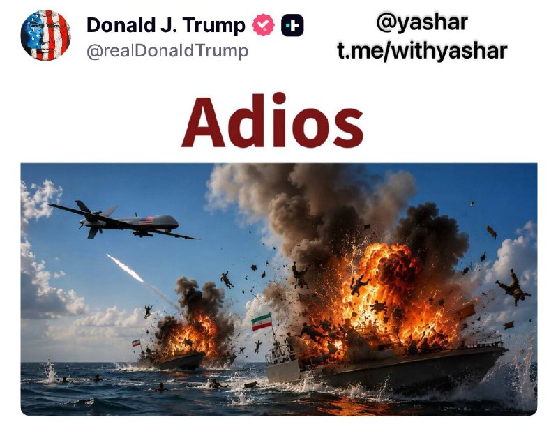
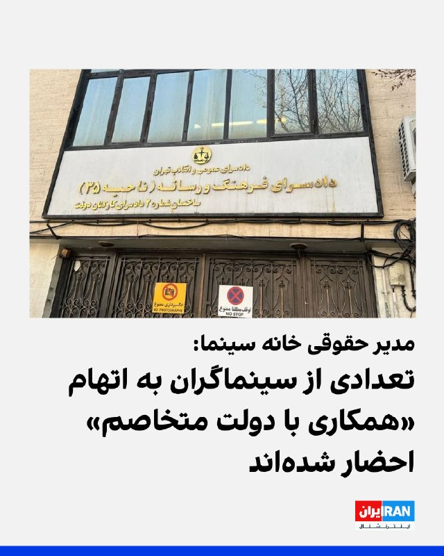
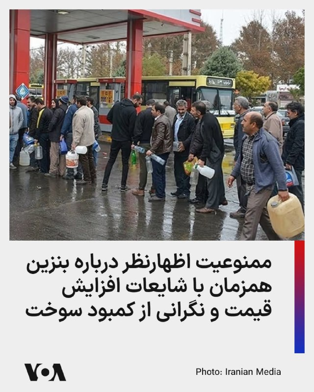
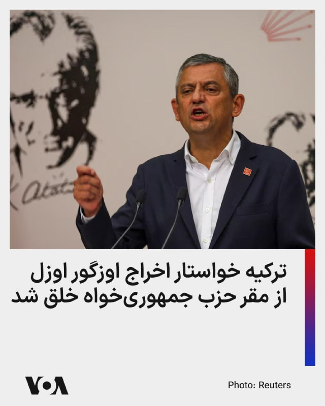
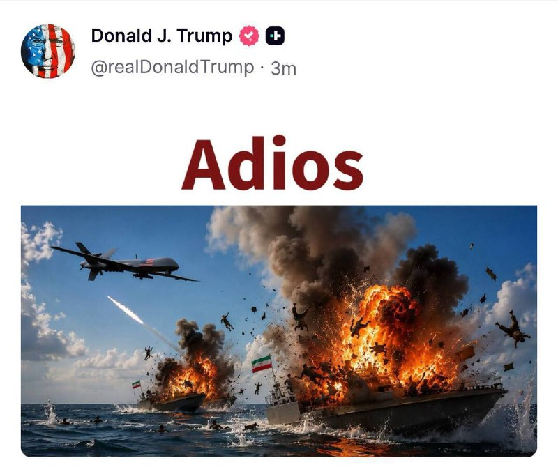
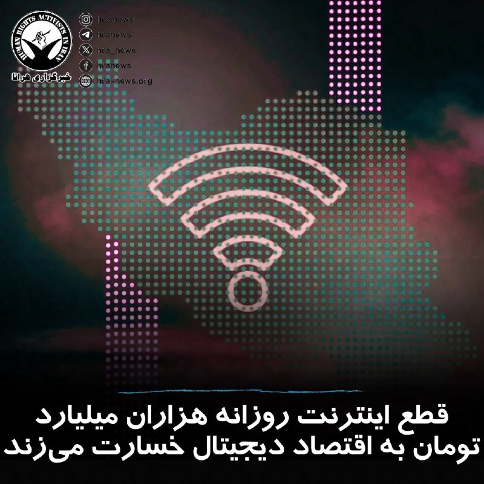
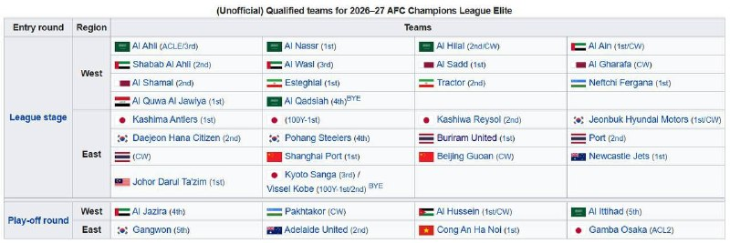

# خواننده تلگرام

<!-- TOP_NAV START -->

<a href="https://github.com/hosseinbaghi/aio-downloader/blob/main/telegram/content/archive_1.md" style="display:inline-block; padding:6px 12px; margin:0 4px; background-color:#2ea44f; color:white; text-decoration:none; border-radius:4px; font-weight:bold;">صفحه بعد</a>

<!-- TOP_NAV END -->

<!-- MSG START -->

---
📅 بروزرسانی: 1405/03/03 16:38
---

## VahidOOnLine — post 241935

  <a href="telegram/content/VahidOOnLine_241935_1779628126.mp4" target="_blank">🎬 Download video</a>

فایننشال تایمز در گزارشی نوشت سپاه از یک شبکه تدارکاتی مستقر در امارات برای خرید تجهیزات پیشرفته ماهواره‌ای چینی مرتبط با برنامه پهپادی و موشکی خود استفاده کرده است.

بر اساس این گزارش، شرکتی به نام «تله‌سان» در راس‌الخیمه، انتقال حدود یک و هشت دهم تن تجهیزات ارتباطی ماهواره‌ای ساخت چین را از شانگهای به ایران، از مسیر دبی، تسهیل کرده است.

فایننشال تایمز نوشت مقصد نهایی این تجهیزات شرکت «ارتباطات فراگستر کیش» بوده که بنا بر این گزارش، با «گروه صنعتی سامان» مرتبط با نیروی هوافضای سپاه و تحریم‌شده از سوی آمریکا همکاری داشته است.

این روزنامه همچنین گزارش داد بخش پایانی انتقال محموله با یک کشتی ایرانی انجام شده که برای پنهان کردن مسیر خود، داده‌های موقعیت‌یابی نادرست مخابره کرده است.
‌🏁 🇬🇧 ManotoTV

🤖 @VahidOOnLine

## VahidOOnLine — post 241934

  <a href="telegram/content/VahidOOnLine_241934_1779628127.mp4" target="_blank">🎬 Download video</a>

دانیال مقدم، خواننده و رپر اعتراضی ایرانی، تتوی جدید صورتش با الهام از «God of War» را فقط به‌عنوان یک طرح انتخاب نکرده؛ این تتو برای او یادآور زخم‌ها، ترس‌ها، امیدها و روزهایی‌ست که نسلش از میان جنگ، درد و ناامیدی عبور کرده است.
رنگ سبز این طرح، نماد عشق، صلح، امید و زندگی‌ست؛ پیامی برای فراموش نکردن روزهایی که مردم با تمام زخم‌هایشان هنوز ایستاده‌اند و ایران را دوست دارند
‌🏁 🇬🇧 ManotoTV

🤖 @VahidOOnLine

## VahidOOnLine — post 241933

  

♦️همزمان با بالاگرفتن گمانه‌زنی‌ها در خصوص توافق احتمالی میان تهران و واشنگتن، روابط عمومی نیروی دریایی سپاه روز یکشنبه سوم خرداد ماه در بیانیه‌ای اعلام کرد در شبانه‌روز گذشته ۳۳ کشتی اعم از نفتکش، باربر و کشتی‌های تجاری «پس از کسب مجوز با هماهنگی و تامین امنیت نیروی دریایی سپاه» از تنگه هرمز عبور کردند.
سپاه پاسداران روز شنبه نیز از عبور ۲۵ کشتی از تنگه هرمز خبر داده بود.
‌🇸🇦 Indypersian

🤖 @VahidOOnLine

## VahidOOnLine — post 241932

  

نیروی دریایی سپاه پاسداران اعلام کرد در شبانه‌روز گذشته، ۳۳ کشتی اعم از نفتکش، کانتینربر و سایر کشتی‌های تجاری «پس از کسب مجوز و با هماهنگی و تامین امنیت این نیرو« از تنگه هرمز عبور کردند.
روز شنبه نیز سپاه پاسداران از عبور ۲۵ کشتی از تنگه هرمز خبر داده بود.
‌🏁 🇬🇧 IranintlTV

🤖 @VahidOOnLine

## VahidOOnLine — post 241931

  <a href="telegram/content/VahidOOnLine_241931_1779628131.mp4" target="_blank">🎬 Download video</a>

♦️مسعود پزشکیان، رئیس‌جمهوری اسلامی، روز یکشنبه سوم خردادماه اعلام کرد ایران آماده است در چارچوب گفتگوها به جهان اطمینان دهد که به‌دنبال سلاح هسته‌ای و ایجاد ناآرامی در منطقه نیست.
او با اشاره به مواضع پیشین جمهوری اسلامی تأکید کرد که ایران همواره بر عدم دستیابی به سلاح هسته‌ای تاکید داشته و هدف آن حفظ ثبات منطقه است. پزشکیان در ادامه اسرائیل را عامل بی‌ثباتی در منطقه دانست و مدعی شد این کشور به‌دنبال ایجاد تنش و اختلاف است.
رئیس‌جمهوری ایران همچنین تأکید کرد تیم مذاکره‌کننده در هیچ شرایطی از «عزت و سربلندی» کشور عقب‌نشینی نخواهد کرد و این اصول در روند مذاکرات حفظ خواهد شد.
‌🇸🇦 Indypersian

🤖 @VahidOOnLine

## VahidOOnLine — post 241930

  

♦️اورسولا فون در لاین، رئیس کمیسیون اروپا، روز یکشنبه سوم خرداد ماه اعلام کرد اتحادیه اروپا از پیشرفت در مسیر دستیابی به توافق میان آمریکا و ایران استقبال می‌کند.
رئیس کمیسیون اروپا تاکید کرد که ایران نباید اجازه دستیابی به سلاح هسته‌ای را داشته باشد و اقدامات بی‌ثبات‌کننده تهران در منطقه باید متوقف شود.
فون در لاین همچنین گفت اتحادیه اروپا به تلاش برای دستیابی به یک راه‌حل دیپلماتیک دائمی درباره ایران ادامه خواهد داد.
رئیس کمیسیون اروپا بار دیگر بر اهمیت بازگشایی تنگه هرمز و تضمین آزادی کشتیرانی در این آبراه راهبردی تاکید کرد.
فون در لاین در پیامی نوشت: «ما به توافقی نیاز داریم که واقعا به کاهش تنش منجر شود، تنگه هرمز را بازگشایی کند و آزادی کامل کشتیرانی بدون عوارض را تضمین کند. ایران نباید اجازه پیدا کند سلاح هسته‌ای تولید کند.»
‌🇸🇦 Indypersian

🤖 @VahidOOnLine

## VahidOOnLine — post 241929

  

مهدی کوهیان، مدیر حقوقی خانه سینما، تایید کرد شماری از سینماگران به دادسرای فرهنگ و رسانه احضار شده‌اند و در برخی احضاریه‌ها، اتهام «همکاری با دولت متخاصم» مطرح شده است.

کوهیان در گفت‌وگو با ایسنا گفت این احضارها به هومن سیدی و سعید روستایی محدود نیست و تعدادی دیگر از هنرمندان نیز با چنین پرونده‌هایی مواجه شده‌اند.

او به سنگینی این اتهام اشاره کرد و گفت طرح عنوان «همکاری با دولت متخاصم» علیه هنرمندان می‌تواند به «تعمیق شکاف اجتماعی» و آسیب به «انسجام داخلی» منجر شود.

کوهیان همچنین گفت استفاده از چنین اتهام سنگینی برای «کوچک‌ترین فعالیت حرفه‌ای»، مصاحبه، نقدهای درون‌گفتمانی یا حتی «لغزشی نابخردانه»، ارزش و اعتبار آن را در سطح ملی و بین‌المللی کاهش می‌دهد و به ضرر «امنیت واقعی کشور» است.
‌🏁 🇬🇧 IranintlTV

🤖 @VahidOOnLine

## VahidOOnLine — post 241928

  <a href="telegram/content/VahidOOnLine_241928_1779628134.mp4" target="_blank">🎬 Download video</a>

بر اساس ویدیوهای رسیده به ایران‌اینترنشنال، گروهی از بازنشستگان در شوش یکشنبه سوم خرداد تجمع کرده و شعار دادند: «تا حق خود نگیریم، از پا نمی‌نشینیم»
‌🏁 🇬🇧 IranintlTV

🤖 @VahidOOnLine

## VahidOOnLine — post 241927

  

♦️خبرگزاری رویترز روز یکشنبه سوم خرداد به نقل از خبرگزاری دولتی بحرین گزارش داد که دادگاهی در این کشور ۹ متهم را به جرم «همکاری با سپاه پاسداران ایران» برای انجام آنچه «اقدامات خصمانه و تروریستی» علیه بحرین توصیف شده است، به حبس ابد و دو نفر دیگر را به سه سال زندان محکوم کرد.

در این بیانیه آمده است که متهمان در جمع‌آوری اطلاعات در مورد سایت‌های حساس و تسهیل نقل و انتقالات مالی مرتبط با آن دست داشته‌اند.

دادستانی بحرین اعلام کرده است برخی متهمان مامور رصد، تصویربرداری و جمع‌آوری اطلاعات از تاسیسات حیاتی بحرین بوده‌اند و اطلاعات را در اختیار سپاه پاسداران قرار می‌دادند.

در این بیانیه همچنین به استفاده از شبکه‌های مالی، صرافی و ارزهای دیجیتال برای تامین مالی این فعالیت‌ها اشاره شده است.

دادگاه دستور مصادره اقلام ضبط‌شده این افراد را صادر کرده است.
‌🇸🇦 Indypersian

🤖 @VahidOOnLine

## VahidOOnLine — post 241926

  

محمدرضا عارف، معاون اول پزشکیان گفت: «مدیران دولت تا زمانی که مباحث کارشناسی درباره مدیریت مصرف بنزین نهایی نشده است، حق اظهارنظر شخصی ندارند.»

او افزود: «اگر کسی از این دستور تخطی کند با او برخورد می‌شود، زیرا ابتدا باید نظرات کارشناسی بررسی و سپس جمع‌بندی نهایی حاصل شود.»

او ادامه داد: «مسئولان تا پیش از آن حق ندارند اظهارنظر شخصی کنند، چرا که نباید در جامعه التهاب یا نگرانی ایجاد شود.»
iranintl
‌🏁 🇬🇧 IranintlTV

🤖 @VahidOOnLine

## WithYashar — post 12332

رشیدی کوچی، نماینده مجلس: اینترنت بین‌المللی تا هفته آینده به روال عادی برمیگرده.
@withyashar

## WithYashar — post 12331

کانال 14 اسرائیل:
اسرائیل رهبر 86 ساله که از سرطان مرحله 4 در حال مرگ بود رو از بین نبرد تا آمریکا با پسر 56 ساله سالم‌تر و تندروتر او صلح کنه.
با آمریکا یا بدون آمریکا، اسرائیل این رژیم رو به پایان خواهد رسوند.
@withyashar

## WithYashar — post 12330

  <a href="telegram/content/WithYashar_12330_1779628138.mp4" target="_blank">🎬 Download video</a>

مارکو روبیو: ما توانستیم وارد ونزوئلا شویم و اورانیوم بسیار غنی‌شده را خارج کنیم.
نظام ایران حتی از بحث درباره آن خودداری کرده است. این باید تغییر کند.
@withyashar

## WithYashar — post 12329

روزنامه پاکستانی«داون»: فضای مذاکرات همچنان محتاطانه است؛ تهران حاضر به مصالحه بر حقوق خود نیست
@withyashar

## WithYashar — post 12328

  

پست جدید ترامپ که به اسپانیایی واژه خداحافظ را نوشته که بسیار طعنه آمیز است و معنیه «بری دیگه برنگردی» را میدهد.
@withyashar

## mwarmonitor — post 9636

🔴جیسون برودسکی مدیر سیاست‌گذاری در سازمان «اتحاد علیه ایران هسته‌ای »

من چند نظر اولیه درباره پیش‌نویس یادداشت تفاهم (MOU) میان ایران و آمریکا، آن‌گونه که در گزارش‌های رسانه‌ای آمده، دارم:

۱) تا زمانی که همه‌چیز نهایی نشود، هیچ‌چیز نهایی نیست. با توجه به رویدادهای پس از سال ۲۰۲۵، همیشه امکان غافلگیری وجود دارد. باید برای اتفاقات غیرمنتظره آماده بود. مطمئنم رئیس‌جمهور ترامپ با دقت واکنش‌ها تا این لحظه را زیر نظر دارد.

۲) درباره توصیف این پیش‌نویس MOU به‌عنوان «توافق صلح» هشدار می‌دهم. از نظر من، این صرفاً ترتیبی برای خریدن زمان جهت مذاکرات بیشتر است. کل سیاست خارجی رژیم ایران بر دشمنی با آمریکا و اسرائیل بنا شده و این موضوع—چه MOU باشد چه نباشد—تغییری نخواهد کرد. این یک اقدام فوق‌العاده شکننده است. توهم کاهش تنش نباید با صلح واقعی اشتباه گرفته شود، چرا که تهران ممکن است از طریق معافیت‌های تحریمی، فروش آزادانه نفت و رفع محاصره، منابع بیشتری برای تسلیح مجدد و بازسازی شبکه تروریستی و توانمندی‌های نظامی خود به‌دست آورد. صلح واقعی زمانی محقق می‌شود که این رژیم از میان برود.

۳) من نگران گزارش‌های رسانه‌ای درباره «تعهدات شفاهی» در موضوعات محوری مانند غنی‌سازی و ذخایر اورانیوم بسیار غنی‌شده (HEU) هستم. درک می‌کنم که آزادسازی بخش عمده دارایی‌های ایران و رفع کامل تحریم‌ها تا زمان دستیابی به توافق نهایی انجام نخواهد شد و مفهومی به نام «کاهش تحریم در برابر اقدام» وجود دارد؛ اما این خطر هست که حتی برخی معافیت‌های تحریمی و رفع محاصره—که اهرم‌های فشار قدرتمندی هستند—انگیزه تهران را برای دادن امتیازاتی که آمریکا بعداً می‌خواهد کاهش دهد و ایران ترجیح دهد با وقت‌کشی، منتظر پایان دولت ترامپ بماند.

۴) همچنین این پرسش مطرح است که آیا با چنین MOUای، تنگه هرمز واقعاً حتی «باز» خواهد بود یا نه؛ چرا که شرکت‌ها ممکن است با توجه به ریسک‌ها همچنان احساس امنیت نکنند. برداشت از ریسک اهمیت دارد. به همین دلیل است که این اقدام را فوق‌العاده شکننده می‌دانم. پرچالش و محل مناقشه خواهد بود.

۵) این یک واقعیت است که تنها دلیل وجود یک تعهد—حتی در حد شفاهی—برای مذاکره درباره تعلیق چندساله غنی‌سازی، این است که رئیس‌جمهور ترامپ با اقدام نظامی، واقعیت‌های میدانی را ایجاد کرد. تعلیق چندساله غنی‌سازی حتی در دولت بایدن هم روی میز نبود و تهران آن را در نظر نمی‌گرفت، مگر تحت فشار نظامی دولت ترامپ.

۶) همچنین این یک واقعیت است که عملیات «Epic Fury» دستاوردهای متعددی داشت—تضعیف برنامه موشکی و پهپادی ایران، فرسایش پایگاه صنعتی دفاعی، تضعیف شبکه تروریستی، حذف مقامات کلیدی جمهوری اسلامی که دستانشان به خون آمریکایی‌ها آلوده بود، و ضربه به صنایع کلیدی تأمین‌کننده منابع مالی سپاه پاسداران—دستاوردهایی که با دیپلماسی ممکن نبود. جمهوری اسلامی حتی حاضر نیست درباره آن‌ها مذاکره کند. و برخلاف اسلافش، رئیس‌جمهور ترامپ به‌درستی به صدور بیانیه‌های تند و نمادین و تحریم‌های سمبلیک بسنده نکرد، در حالی که رژیم به اقدامات مرگبار خود ادامه می‌دهد.

۷) در نهایت، همان‌طور که پیش‌تر تأکید کرده‌ام، با حضور این رژیم در قدرت، پایان خوشی وجود ندارد؛ تنها می‌توان مناقشه را مدیریت کرد و با ابزارهای اقتصادی، نظامی و گاهی دیپلماتیک با رژیم مقابله نمود. این مسیر اغلب آشفته، ناقص و همراه با ریسک است—و همه ابزارها، از جمله توافق‌های دیپلماتیک، در مواجهه با تهدیدهای این رژیم ریسک دارند.

@mwarmonitor

## mwarmonitor — post 9635

🔸محمد مرندی عضو تیم مذاکره کننده ایران:

🔹رژیم صهیونیستی «آزادی عمل» نخواهد داشت.

🔹مدیریت تنگه هرمز موضوعی است که میان ایران و عمان، به‌عنوان کشورهای ساحلی، هماهنگ می‌شود.

🔹ایران تحت این یادداشت تفاهم هیچ تعهد هسته‌ای جدیدی نمی‌پذیرد، جز در خصوص سلاح هسته‌ای که موضوع تازه‌ای نیست.

🔹ایران به دارایی‌های مسدودشده خود دسترسی خواهد داشت.

🔹تحریم‌های مرتبط با بخش انرژی لغو خواهند شد.

@mwarmonitor

## mwarmonitor — post 9634

  

ترامپ در سوشال تروث

@mwarmonitor

## mwarmonitor — post 9633

🔸به گفته تایوان، یک کشتی گارد ساحلی چین پس از یک رویارویی پرتنش و تبادل هشدارهای لفظی میان دو گارد ساحلی، آب‌های اطراف جزایر پراتاسِ تایوان را ترک کرده است — رویترز.

@mwarmonitor

## mwarmonitor — post 9632

🔴پلیس ضدشورش ترکیه با شلیک گاز اشک‌آور وارد مقر اصلی حزب اپوزیسیون جمهوری‌خواه خلق (CHP) در آنکارا شد و پس از آنکه دادگاه کنگره حزبی سال ۲۰۲۳ را که در آن اوزگور اوزل انتخاب شده بود باطل کرد و کمال قلیچداراوغلو، رئیس پیشین حزب، را به سمت خود بازگرداند، رهبری برکنار‌شده حزب را از ساختمان بیرون کرد — رویترز

@mwarmonitor

## FoxNewsTwitter — post 342183

  

Fox News (Twitter/X)

Anti-Israel agitators. Climate activists. Communist groups.

Experts warn a growing activist network united by anti-American sentiment — and in some cases China-linked funding networks — is now targeting America’s AI infrastructure and industrial power.

Fox News Digital found many of the same movements protesting side-by-side across the country, including groups opposing new AI data centers over energy and environmental concerns.

“What all of these protests have in common ... is that anti-American trend within them,” Hudson Institute fellow Zineb Riboua told Fox News Digital.

## pm_afshaa — post 91386

🔴رشیدی کوچی: اینترنت این هفته به حالت قبل بر می‌گردد، یا 48 ساعت آینده یا تا پایان هفته

💧 Rainbet.com the #1 Non-KYC Crypto Casino & Sportsbook @rainbetcom

😁 @Pm_Afshaa

## pm_afshaa — post 91385

  <a href="telegram/content/pm_afshaa_91385_1779628142.webm" target="_blank">🎬 Download video</a>

🔴یک منبع اسرائیلی به فاکس‌نیوز:
ترامپ صراحتا به نتانیاهو اعلام کرده بدون برچیده شدن کامل برنامه هسته‌ای جمهوری اسلامی و خروج تمام اورانیوم غنی‌شده از ایران، هیچ توافق نهایی‌ای امضا نخواهد شد.

💧 Rainbet.com the #1 Non-KYC Crypto Casino & Sportsbook @rainbetcom

😁 @Pm_Afshaa

## pm_afshaa — post 91384

  <a href="telegram/content/pm_afshaa_91384_1779628143.webm" target="_blank">🎬 Download video</a>

🔴پست جدید ترامپ که به اسپانیایی واژه خداحافظ رو نوشته که بسیار طعنه آمیز است و معنیه «بری دیگه برنگردی» رو میده.

💧 Rainbet.com the #1 Non-KYC Crypto Casino & Sportsbook @rainbetcom

😁 @Pm_Afshaa

## pm_afshaa — post 91382

  <a href="telegram/content/pm_afshaa_91382_1779628144.webm" target="_blank">🎬 Download video</a>

🔴کانال 14 اسرائیل:
اسرائیل رهبر 86 ساله که از سرطان مرحله 4 در حال مرگ بود رو از بین نبرد تا آمریکا با پسر 56 ساله سالم‌تر و تندروتر او صلح کنه.
با آمریکا یا بدون آمریکا، اسرائیل این رژیم رو به پایان خواهد رسوند.

💧 Rainbet.com the #1 Non-KYC Crypto Casino & Sportsbook @rainbetcom

😁 @Pm_Afshaa

## pm_afshaa — post 91381

  <a href="telegram/content/pm_afshaa_91381_1779628145.webm" target="_blank">🎬 Download video</a>

🔴تسنیم به نقل از منبع آگاه:
آمریکایی‌ها درحال کارشکنی هستن و مسئله پول‌های بلوکه شده باعث شده فعلا توافقی نهایی نشه.

💧 Rainbet.com the #1 Non-KYC Crypto Casino & Sportsbook @rainbetcom

😁 @Pm_Afshaa

## pm_afshaa — post 91380

#مهم عزیزای دلم همگی الان چنل زاپاس‌مون رو جوین بشید کانال تحت ریپورت شدیده اگه چیزی شد زاپاس رو داشته باشید فعالیت میاد اونور
👇 https://t.me/Pm_Zapas https://t.me/Pm_Zapas

## DEJradio — post 4918

👑🎥 ایرانیان مقیم استکهلم روز شنبه با برگزاری تجمعی در این شهر، حمایت خود را از «انقلاب شیر و خورشید» اعلام کردند و خواستار تعطیلی سفارتخانه‌های جمهوری اسلامی در سوئد شدند. بهنام روغنی گزارش می‌دهد.

#استکهلم #همبستگی
@DEJradio

## DEJradio — post 4917

  

🔸
🛩️ منابع غیررسمی یکشنبه سوم خرداد ۱۴۰۵ از پرواز چند پهپاد بر فراز ایران خبر دادند. شهروندان در استان‌های غربی و جنوبی پرواز این پهپادها را گزارش دادند. نوع این پهپادها هنوز مشخص نیست اما شنیده شد یکی از آنها «اوربیتر» است.
خبرگزاری مهر، وابسته به سازمان تبلیغات اسلامی، اعلام کرد یک پهپاد اسرائیلی که کاربری جاسوسی و شناسایی داشت، با شلیک پدافند ارتش جمهوری اسلامی سرنگون شد. این گزارش افزود: «لاشه پهپاد متلاشی شده اربیتر با همکاری ناوگروه دریابانی فراجای هرمزگان کشف شد.»

#پهپاد
@DEJradio

## DEJradio — post 4916

🎤
⭕️ برنامه چالش
گفتگو با ناصر کرمی اقلیم شناس و عضو جبهه هفت آبان؛
غیبت مجتبی خامنه‌ای؛ چه کسانی تصمیم‌گیر هستند؟

#چالش #موشتبا
@DEJradio

## DEJradio — post 4915

👑🎥 روز شنبه ۲۳ می در برلین، بار دیگر خیابان‌ها شاهد حضور ایرانیان آزادی‌خواه بود؛ تجمعی در مسیر کاخ صدراعظمی آلمان که با هدف رساندن صدای مردم ایران به گوش جهان برگزار شد. ایمان صفتی گزارش می‌دهد

#گزارش #همبستگی
@DEJradio

## DEJradio — post 4914

  

🔸
⭕️ خبرگزاری تسنیم، وابسته به سـ.ـپاه پاسداران گزارش داد اختلاف میان جمهوری اسلامی و آمریکا بر سر یکی دو بند از تفاهم‌نامه احتمالی همچنان ادامه دارد و به دلیل «مانع‌تراشی‌های آمریکا» هنوز موضوع نهایی نشده است.
همچنین رویترز به نقل از یک «منبع ارشد ایرانی» نوشت که تهران با تحویل ذخیره اورانیوم بسیار غنی شده خود موافقت نکرده و مسئله هسته‌ای بخشی از توافق اولیه نیست.

#مذاکرات #برنامه_اتمی
@DEJradio

## DEJradio — post 4913

  <a href="telegram/content/DEJradio_4913_1779628147.mp4" target="_blank">🎬 Download video</a>

🔸🎥 پاکستان؛ بیش از ۱۲۰ کشته و زخمی در حمله انتحاری به یک قطار

کشوری که در تامین امنیت داخلی خود سر تا پا مشکل دارد و با انواع بحران روبروست، میانجی مذاکره آمریکا و جمهوری اسلامی شده است.

#پاکستان
@DEJradio

## kianmeli1 — post 87629

  

🔴پست جدید ترامپ درحالی که خبرها از احتمال اعلام تفاهم پایان جنگ در آینده نزدیک است
https://t.me/kianmeli1

## IranIntlTV — post 338761

  <a href="telegram/content/IranIntlTV_338761_1779628149.mp4" target="_blank">🎬 Download video</a>

گزارش‌ها درباره توافق احتمالی میان جمهوری اسلامی و آمریکا به یکی از محورهای اصلی بحث در رسانه‌های اجتماعی تبدیل شده است. در حالی که کاربران مخالف جمهوری اسلامی خواهان توقف مذاکرات هستند، برخی حامیان حکومت نیز هرگونه مذاکره پیش از «انتقام» را خیانت توصیف می‌کنند.

عادله بورنگ، عضو تحریریه ایران‌اینترنشنال، به واکنش کاربران می‌پردازد
@iranintltv

## IranIntlTV — post 338760

  

نیروی دریایی سپاه پاسداران اعلام کرد در شبانه‌روز گذشته، ۳۳ کشتی اعم از نفتکش، کانتینربر و سایر کشتی‌های تجاری «پس از کسب مجوز و با هماهنگی و تامین امنیت این نیرو« از تنگه هرمز عبور کردند.
روز شنبه نیز سپاه پاسداران از عبور ۲۵ کشتی از تنگه هرمز خبر داده بود.
https://iranintl.com/202605246781

## IranIntlTV — post 338759

  <a href="telegram/content/IranIntlTV_338759_1779628152.mp4" target="_blank">🎬 Download video</a>

یکی از بستگان جاویدنام علی مشهدی در تجمع استکهلم، در گفت‌وگو با مهران عباسیان، خبرنگار ایران‌اینترنشنال، درباره نحوه کشته شدن او توضیح داد و پیام پدر این جاویدنام را به اشتراک گذاشت.
@iranintltv

## IranIntlTV — post 338758

فایننشال‌تایمز: جنگ ایران، شکاف میان مصر و امارات متحده عربی را آشکار کرد

فایننشال‌تایمز گزارش داد مصر در اقدامی کم‌سابقه جنگنده‌هایی را به امارات متحده عربی اعزام کرده؛ حرکتی که به نوشته این روزنامه، نشانه تلاش قاهره برای کاهش تنش با ابوظبی و پاسخ به نارضایتی امارات از حمایت ناکافی متحدان عرب در برابر حملات جمهوری اسلامی است.

بر اساس این گزارش، افشای این استقرار نظامی زمانی رخ داد که عبدالفتاح السیسی، رییس‌جمهوری مصر، در سفر اخیر خود به امارات در کنار محمد بن زاید آل نهیان از جنگنده‌های «رافال» مصری مستقر در این کشور بازدید کرد. سیسی در این دیدار گفت: «هر آنچه به امارات آسیب بزند، به مصر آسیب زده است.»

فایننشال‌تایمز نوشت قاهره جزئیاتی از این ماموریت نظامی منتشر نکرده، اما اعزام نیرو ظاهرا با هدف کاهش تنش‌ها با امارات متحده عربی صورت گرفته؛ کشوری که پیش‌تر از دولت‌های عربی به دلیل کمک نکردن کافی در دفاع مقابل حملات حکومت ایران انتقاد کرده بود.

امارات متحده عربی که هدف اصلی حملات تلافی‌جویانه جمهوری اسلامی در جریان جنگ بوده، طی سال‌های اخیر نقش حیاتی در حمایت اقتصادی از مصر ایفا کرده است. این کشور در سال ۲۰۲۳ با یک سرمایه‌گذاری ۳۵ میلیارد دلاری، به تثبیت اقتصاد بحران‌زده مصر کمک کرد و همچنین حواله‌های مالی صدها هزار مصری شاغل در امارات متحده عربی، منبع مهم ارز خارجی برای قاهره محسوب می‌شود.

به نوشته فایننشال‌تایمز، در ابوظبی این برداشت شکل گرفته که جنگ اخیر نشان داد کدام متحدان در شرایط بحرانی قابل اتکا هستند. انور قرقاش، مشاور دیپلماتیک رییس امارات متحده عربی، در ماه مارس از کشورهایی که در برابر «تجاوز ایران» واکنش کافی نشان ندادند انتقاد کرده بود.

این روزنامه همچنین نوشت جنگ اخیر، شکاف‌های تازه‌ای در میان کشورهای منطقه ایجاد کرده و ائتلاف‌های خاورمیانه را در حال بازتعریف قرار داده است. به باور برخی تحلیلگران، محور جدیدی میان عربستان سعودی، مصر، ترکیه و پاکستان در حال شکل‌گیری است؛ کشورهایی که نسبت به نقش اسرائیل در بی‌ثباتی منطقه نگرانی دارند و برای پایان دادن به جنگ آمریکا و اسرائیل علیه حکومت ایران تلاش‌های دیپلماتیک انجام داده‌اند.

اما امارات متحده عربی نسبت به این روند بدبین بوده و نگران است هرگونه توافق، جمهوری اسلامی را در موقعیتی قوی‌تر حفظ کند. مایکل وحید حنا، تحلیلگر گروه بین‌المللی بحران، به فایننشال‌تایمز گفت از نگاه ابوظبی، مشارکت مصر در میانجی‌گری ممکن است به معنای ایجاد نوعی هم‌ترازی سیاسی میان جمهوری اسلامی ایران و امارات متحده عربی تلقی شده باشد؛ موضوعی که برای امارات قابل پذیرش نیست. به گفته او، امارات احساس کرده میانجی‌ها حمایت کافی از مواضع این کشور نشان نداده‌اند.

فایننشال‌تایمز همچنین گزارش داد مصر به دقت رفتار امارات متحده عربی با پاکستان را دنبال کرده است. ابوظبی در ماه آوریل از اسلام‌آباد خواست بازپرداخت فوری وام ۳.۵ میلیارد دلاری را انجام دهد؛ اقدامی که برخی آن را ناشی از نارضایتی امارات از نقش پاکستان در میانجی‌گری میان حکومت ایران و آمریکا دانستند.

به نوشته این روزنامه، اعزام جنگنده‌های مصری تا حدی تنش‌ها میان قاهره و ابوظبی را کاهش داده است. عبدالخالق عبدالله، پژوهشگر اماراتی، این اقدام را «غافلگیری خوشایند» توصیف کرد و گفت: «ما تصور می‌کردیم مصر مردد است و کمک چندانی نمی‌کند. اکنون با ایرانی بسیار تهاجمی روبه‌رو هستیم و این اقدام می‌تواند پیام مهمی برای تهران داشته باشد.»

در عین حال، نزدیکی بیشتر امارات متحده عربی به اسرائیل پس از حملات جمهوری اسلامی ایران، واکنش منفی بخشی از افکار عمومی مصر را برانگیخته است. کاربران مصری شبکه‌های اجتماعی بارها از روابط امارات و اسرائیل انتقاد کرده‌اند؛ موضوعی که به نوشته فایننشال تایمز، در ابوظبی با نارضایتی دنبال شده است.

این گزارش همچنین به اختلاف‌های دیرینه دو کشور درباره مسائل منطقه‌ای اشاره می‌کند؛ از جمله جنگ داخلی سودان، که مصر از ارتش سودان و امارات متحده عربی متهم به حمایت از نیروهای رقیب است، و نیز روابط نزدیک ابوظبی با اتیوپی بر سر پروژه سد بزرگ نیل؛ موضوعی که قاهره آن را تهدیدی برای امنیت آبی خود می‌داند.

فایننشال‌تایمز نوشت اگرچه مصر و امارات همچنان متحد باقی مانده‌اند، اما جنگ ایران شکاف‌های پنهان میان دو کشور را آشکار کرده و نشان داده است که فشارهای امنیتی منطقه‌ای می‌تواند اتحادهای سنتی جهان عرب را بازتعریف کند.

🔗وب‌سایت ایران‌اینترنشنال
@iranintltv

## IranIntlTV — post 338757

  <a href="telegram/content/IranIntlTV_338757_1779628154.mp4" target="_blank">🎬 Download video</a>

یک شهروند با ارسال پیامی به ایران‌اینترنشنال می‌گوید: «ترامپ اشتباه کردی. اشتباه می‌کنی. اشتباه پشت اشتباه. با این‌ها به توافق نمی‌رسی. نه تنها به آنها وقت می‌دهی بلکه قویترشان می‌کنی، ظالم‌ترشان می‌کنی.»

## IranIntlTV — post 338756

  

مهدی کوهیان، مدیر حقوقی خانه سینما، تایید کرد شماری از سینماگران به دادسرای فرهنگ و رسانه احضار شده‌اند و در برخی احضاریه‌ها، اتهام «همکاری با دولت متخاصم» مطرح شده است.

کوهیان در گفت‌وگو با ایسنا گفت این احضارها به هومن سیدی و سعید روستایی محدود نیست و تعدادی دیگر از هنرمندان نیز با چنین پرونده‌هایی مواجه شده‌اند.

او به سنگینی این اتهام اشاره کرد و گفت طرح عنوان «همکاری با دولت متخاصم» علیه هنرمندان می‌تواند به «تعمیق شکاف اجتماعی» و آسیب به «انسجام داخلی» منجر شود.

کوهیان همچنین گفت استفاده از چنین اتهام سنگینی برای «کوچک‌ترین فعالیت حرفه‌ای»، مصاحبه، نقدهای درون‌گفتمانی یا حتی «لغزشی نابخردانه»، ارزش و اعتبار آن را در سطح ملی و بین‌المللی کاهش می‌دهد و به ضرر «امنیت واقعی کشور» است.
https://iranintl.com/202605244549

## IranIntlTV — post 338755

  <a href="telegram/content/IranIntlTV_338755_1779628157.mp4" target="_blank">🎬 Download video</a>

بر اساس ویدیوهای رسیده به ایران‌اینترنشنال، گروهی از بازنشستگان در شوش یکشنبه سوم خرداد تجمع کرده و شعار دادند: «تا حق خود نگیریم، از پا نمی‌نشینیم»

## IranIntlTV — post 338754

  

محمدرضا عارف، معاون اول پزشکیان گفت: «مدیران دولت تا زمانی که مباحث کارشناسی درباره مدیریت مصرف بنزین نهایی نشده است، حق اظهارنظر شخصی ندارند.»

او افزود: «اگر کسی از این دستور تخطی کند با او برخورد می‌شود، زیرا ابتدا باید نظرات کارشناسی بررسی و سپس جمع‌بندی نهایی حاصل شود.»

او ادامه داد: «مسئولان تا پیش از آن حق ندارند اظهارنظر شخصی کنند، چرا که نباید در جامعه التهاب یا نگرانی ایجاد شود.»
iranintl.com/202605243568

## Shin_Persian — post 6204

↩️ Quoted tweet: Faytuks Network ✓ @FaytuksNetwork Sun, 24 May 2026 12:17:06 UTC Fars News, an IRGC-linked Iranian outlet, reported that U.S. officials and mediators privately told Tehran during indirect exchanges to ignore Donald Trump’s Truth Social posts…

## Shin_Persian — post 6203

↩️ Quoted tweet:
Faytuks Network ✓ @FaytuksNetwork
Sun, 24 May 2026 12:17:06 UTC

Fars News, an IRGC-linked Iranian outlet, reported that U.S. officials and mediators privately told Tehran during indirect exchanges to ignore Donald Trump’s Truth Social posts, saying they were aimed mainly at U.S. domestic audiences and did not reflect Washington’s negotiating

↩️ توییت نقل‌قول شده — برای پاسخ، پست زیر را ببینید.

فارسی

خبرگزاری فارس، رسانه وابسته به سپاه پاسداران انقلاب اسلامی (IRGC)، گزارش داد که مقامات و میانجی‌گران آمریکایی در خلال تبادلات غیرمستقیم، به‌طور خصوصی به تهران گفته‌اند که پست‌های دونالد ترامپ در شبکه اجتماعی «تروث سوشال» را نادیده بگیرد؛ آن‌ها اعلام کردند که این پیام‌ها عمدتاً با هدف جذب مخاطبان داخلی ایالات متحده منتشر شده و بازتاب‌دهنده مواضع مذاکراتی واشینگتن نیست.

𝕏 · @shin_persian

## Shin_Persian — post 6202

  <a href="telegram/content/Shin_Persian_6202_1779628160.mp4" target="_blank">🎬 Download video</a>

↩️ Quoted tweet: Shin ✓ @hey_itsmyturn Sun, 24 May 2026 10:52:04 UTC Islamic Regime claims downing Israeli Orbiter drone over Hormozgan Province with air defense system. Drone reportedly conducting reconnaissance mission. #Iran ↩️ توییت نقل‌قول شده — برای…

## Shin_Persian — post 6201

↩️ Quoted tweet:
Shin ✓ @hey_itsmyturn
Sun, 24 May 2026 10:52:04 UTC

Islamic Regime claims downing Israeli Orbiter drone over Hormozgan Province with air defense system. Drone reportedly conducting reconnaissance mission.

#Iran

↩️ توییت نقل‌قول شده — برای پاسخ، پست زیر را ببینید.

فارسی

رژیم اسلامی مدعی سرنگونی یک پهپاد اوربیتر (Orbiter) اسرائیلی بر فراز استان هرمزگان توسط سامانه پدافند هوایی شد. گزارش شده است که این پهپاد در حال انجام ماموریت شناسایی بوده است.

#Iran

𝕏 · @shin_persian

## ManotoTV — post 105803

  <a href="telegram/content/ManotoTV_105803_1779628162.mp4" target="_blank">🎬 Download video</a>

فایننشال تایمز در گزارشی نوشت سپاه از یک شبکه تدارکاتی مستقر در امارات برای خرید تجهیزات پیشرفته ماهواره‌ای چینی مرتبط با برنامه پهپادی و موشکی خود استفاده کرده است.

بر اساس این گزارش، شرکتی به نام «تله‌سان» در راس‌الخیمه، انتقال حدود یک و هشت دهم تن تجهیزات ارتباطی ماهواره‌ای ساخت چین را از شانگهای به ایران، از مسیر دبی، تسهیل کرده است.

فایننشال تایمز نوشت مقصد نهایی این تجهیزات شرکت «ارتباطات فراگستر کیش» بوده که بنا بر این گزارش، با «گروه صنعتی سامان» مرتبط با نیروی هوافضای سپاه و تحریم‌شده از سوی آمریکا همکاری داشته است.

این روزنامه همچنین گزارش داد بخش پایانی انتقال محموله با یک کشتی ایرانی انجام شده که برای پنهان کردن مسیر خود، داده‌های موقعیت‌یابی نادرست مخابره کرده است.

## ManotoTV — post 105802

  <a href="telegram/content/ManotoTV_105802_1779628163.mp4" target="_blank">🎬 Download video</a>

دانیال مقدم، خواننده و رپر اعتراضی ایرانی، تتوی جدید صورتش با الهام از «God of War» را فقط به‌عنوان یک طرح انتخاب نکرده؛ این تتو برای او یادآور زخم‌ها، ترس‌ها، امیدها و روزهایی‌ست که نسلش از میان جنگ، درد و ناامیدی عبور کرده است.
رنگ سبز این طرح، نماد عشق، صلح، امید و زندگی‌ست؛ پیامی برای فراموش نکردن روزهایی که مردم با تمام زخم‌هایشان هنوز ایستاده‌اند و ایران را دوست دارند

## FarsiVOA — post 218520

فرماندهی مرکزی ایالات متحده، سنتکام، تصاویری از عملیات هوایی نیروهای نیروی دریایی و تفنگداران دریایی آمریکا در ناو «یواس‌اس تریپولی» منتشر کرد.

سنتکام می‌گوید این ناو تهاجمی آبی‌خاکی در حال عبور از دریای عرب است.

@FarsiVOA

## FarsiVOA — post 218519

مارکو روبیو، وزیر خارجه آمریکا، اعلام کرد که «احتمال خبرهای خوب در چند ساعت آینده درباره تنگه [هرمز] وجود دارد.»

آقای روبیو روز یکشنبه در جریان سفر به دهلی‌نو در یک کنفرانس مشترک با وزیر خارجه هند، درباره پرونده مذاکرات با تهران گفت: «در ۴۸ ساعت گذشته پیشرفت‌هایی در چارچوبی که می‌تواند وضعیت تنگه هرمز را حل‌وفصل کند حاصل شده است.»

در حالی که پیشتر کشتی‌هایی در منطقه خلیج فارس هدف حملات قرار گرفتند، وزیر خارجه آمریکا تاکید کرد که حملات به کشتی‌های تجاری «کاملا غیرقانونی» است و همچنین جمهوری اسلامی هرگز «نباید به سلاح هسته‌ای» دست پیدا کند.

او افزود که اخبار بیشتری درباره وضعیت ایران ممکن است در طول روز یکشنبه منتشر شود.

گزارش کامل را در وب‌سایت صدای آمریکا بخوانید.

@FarsiVOA

## FarsiVOA — post 218518

  

محمدرضا عارف، معاون اول رئیس‌جمهور به مدیران دولتی دستور داد تا پیش از نهایی شدن بررسی‌های کارشناسی درباره مدیریت مصرف بنزین، هیچ مسئولی حق اظهارنظر شخصی در این زمینه ندارد.

او هشدار داد در صورت تخطی از این دستور، با فرد خاطی برخورد خواهد شد؛ زیرا به گفته او، اظهارنظرهای زودهنگام می‌تواند در جامعه التهاب و نگرانی ایجاد کند.

این دستور در شرایطی صادر شده که شایعات درباره افزایش قیمت بنزین، تغییر سهمیه‌ها و تشدید سیاست‌های مدیریت مصرف بالا گرفته است.

همزمان، ناترازی بنزین و فاصله میان مصرف داخلی و توان تأمین سوخت، نگرانی‌ها درباره کمبود احتمالی یا فشار بیشتر بر شبکه توزیع را افزایش داده است.

عارف گفت دولت تلاش می‌کند تصمیم‌ها به‌گونه‌ای اتخاذ شود که معیشت مردم آسیب نبیند، اما واقعیات اقتصادی کشور و تحولات اخیر نیز باید در نظر گرفته شود.
@FarsiVOA

## FarsiVOA — post 218517

  

خبرگزاری رسمی بحرین گزارش داد که یک دادگاه این کشور، ۹ متهم را به حبس ابد و دو نفر دیگر را به سه سال زندان محکوم کرده است. بر اساس این گزارش، این افراد به همکاری با سپاه پاسداران برای انجام «اقدامات خصمانه و تروریستی» علیه بحرین متهم بودند.

در بیانیه‌ای که روز یکشنبه منتشر شد، آمده است که متهمان در جمع‌آوری اطلاعات درباره مکان‌های حساس و تسهیل انتقال‌های مالی مرتبط نقش داشته‌اند.

پیشتر وزارت کشور بحرین اعلام کرد که ۴۱ نفر را که با سپاه پاسداران مرتبط بوده‌اند، بازداشت کرده است.

این وزارتخانه ۱۹ اردیبهشت در بیانیه‌ای که در شبکه‌های اجتماعی منتشر شد، نوشت که این افراد اعضای هسته اصلی «یک سازمان مرتبط با سپاه پاسداران» و مدافع تئوری «ولایت فقیه» بوده‌اند.
@FarsiVOA

## FarsiVOA — post 218516

  

مقام‌های ترکیه به پلیس این کشور دستور دادند اوزگور اوزل، رهبر حزب جمهوری‌خواه خلق، حزب اصلی اپوزیسیون را از مقر این حزب اخراج کند.

به گزارش رویترز، فرمانداری آنکارا روز یکشنبه این دستور را برای برکناری اعضای حزب جمهوری‌خواه خلق که با اوزگور اوزل، رهبر برکنار‌شده، همسو هستند صادر کرد و پلیس ضد شورش و گروهی از افراد در برابر درهای مقر حزب جمهوری‌خواه خلق در پایتخت ترکیه تجمع کردند.

یک دادگاه تجدیدنظر ترکیه روز پنج‌شنبه نتایج کنگره حزب جمهوری‌خواه خلق در سال ۲۰۲۳ را که اوزل در آن به عنوان رهبر انتخاب شده بود، به دلیل «تخلفات نامشخص» باطل کرد.

این دادگاه به جای اوزل، کمال قلیچداراوغلو، رئیس پیشین حزب جمهوری‌خواه خلق را که در انتخابات همان سال از رئیس‌جمهور طیب اردوغان شکست خورد، دوباره به این سمت بازگرداند.

اوزل روز شنبه خواست هرچه سریع‌تر کنگره جدیدی برای حزب برگزار شود، اما قلیچداراوغلو گفت کنگره در «زمانی مناسب» برگزار خواهد شد.
@FarsiVOA

## FarsiVOA — post 218515

  

تایمز اسرائیل به نقل از یک مقام ارشد اسرائیلی گزارش داد دونالد ترامپ، رئیس‌جمهور ایالات متحده آمریکا، در تماس تلفنی با بنیامین نتانیاهو به او اطمینان داده که توافق نهایی با جمهوری اسلامی، برنامه هسته‌ای تهران را به‌طور کامل برمی‌چیند و همه اورانیوم غنی‌شده از قلمرو جمهوری اسلامی خارج خواهد شد.

بر اساس این گزارش، ترامپ تأکید کرده در مذاکرات بر خواسته دیرینه خود برای برچیدن برنامه هسته‌ای جمهوری اسلامی و خارج شدن تمام ذخایر اورانیوم غنی‌شده پافشاری خواهد کرد و بدون تحقق این شروط، توافق نهایی را امضا نمی‌کند.

این مقام اسرائیلی همچنین گفته واشنگتن، اسرائیل را در جریان مذاکرات بر سر تفاهم‌نامه‌ای برای بازگشایی تنگه هرمز و ورود به گفت‌وگوهای نهایی درباره موارد اختلافی قرار داده است.

نتانیاهو نیز در این تماس گفته اسرائیل آزادی عمل خود را در برابر تهدیدها در همه جبهه‌ها حفظ خواهد کرد؛ موضعی که به گفته این مقام، با حمایت دوباره ترامپ همراه شده است.
@FarsiVOA

## FarsiVOA — post 218514

  

اورزولا فون‌درلاین، رئیس کمیسیون اروپا، از بروز نشانه‌های پیشرفت در مذاکرات بر سر توافق احتمالی میان ایالات متحده و جمهوری اسلامی استقبال کرد.

فون‌درلاین یکشنبه در شبکه ایکس نوشت: «من از پیشرفت به سوی توافقی میان آمریکا و [حکومت] ایران استقبال می‌کنم. ما به توافقی نیاز داریم که واقعاً به کاهش تنش‌ها منجر شود، تنگه هرمز را دوباره باز کند و آزادی کامل کشتیرانی بدون پرداخت عوارض را تضمین کند.»

او همچنین تأکید کرد: «نباید به ایران اجازه داده شود که سلاح هسته‌ای توسعه دهد.»

دونالد ترامپ، رئیس‌جمهوری آمریکا، پیش‌تر گفته است که واشنگتن و جمهوری اسلامی «تا حد زیادی» بر سر یک یادداشت تفاهم مذاکره کرده‌اند.
@FarsiVOA

## DW_Farsi — post 125094

🔶 انفجار در قطار مسافربری پاکستان با ده‌ها کشته و زخمی

در جریان یک انفجار مهیب در یک قطار مسافربری در غرب پاکستان، دست‌کم ۳۰ نفر کشته شدند.

سخنگوی پلیس به خبرگزاری آلمان گفته است که طی این حادثه در شهر کویته، پایتخت ایالت ناآرام بلوچستان بیش از ۱۰۰ نفر نیز زخمی شده‌اند.

یک گروه جدایی‌طلب به نام بریگاد یا "تیپ مجید"، وابسته به ارتش آزادیبخش بلوچستان (BLA) مسئولیت این حمله را بر عهده گرفته است.

این گروه می‌گوید، هدفش از این حمله نظامیانی بوده‌اند که قصد داشته‌اند برای تعطیلات عید با این قطار به زادگاه‌های خود سفر کنند. مقام‌های دولتی تا کنون در این باره اظهار نظری نکرده‌اند.

این انفجار که در زمان عبور قطار رخ داد شدتش به حدی بود که قطار از ریل خارج و به مناطق مسکونی اطراف و خودروها خسارت وارد شد.

حمیدالله‌شاه، یک مقام پلیس محلی در گفت‌وگو با خبرگزاری آلمان شمار زخمی‌‌ها را ۱۰۳ تن نامید و ابراز نگرانی کرد که تعداد قربانیان افزایش یابد.
در پی این حادثه، در تمامی بیمارستان‌های دولتی و خصوصی شهر وضعیت فوق‌العاده اعلام شده است.

به گفته سخنگوی دولت محلی، بر اثر انفجار حداقل سه واگن به همراه لوکوموتیو از ریل خارج شدند.
در حال حاضر نیروهای امنیتی منطقه را محاصره کرده‌اند و عملیات امداد و نجات همچنان ادامه دارد.

تا به‌حال مشخص نشده که مواد منفجره دقیقا در کجا کار گذاشته شده بود. همچنین مقام‌های مسئول هنوز تأیید نکرده‌اند که آیا واقعا نیروهای نظامی (همان‌طور که گروه جدایی‌طلب یادشده ادعا کرده) در میان کشته‌شدگان بوده‌اند یا نه.

در ماه‌های اخیر، میزان خشونت در پاکستان به‌طور قابل توجهی افزایش یافته است. سال گذشته نیز یک قطار که صدها نیروی امنیتی و خانواده‌های آن‌ها را حمل می‌کرد، توسط گروه شبه‌نظامی ممنوعه ارتش آزادی‌بخش بلوچستان ربوده شد و مسافرانش به گروگان گرفته شدند.

در جریان درگیری چندروزه برای آزادسازی گروگان‌ها، حداقل ۲۴ نفر از مسافران و سربازان کشته شدند.

ارتش آزادی‌بخش بلوچستان بزرگ‌ترین گروه از چندین گروه مسلحی است که برای استقلال بلوچستان از پاکستان مبارزه می‌کنند. این گروه پشت بسیاری از حملات خشونت‌آمیز قرار دارد، به‌ویژه حملاتی که پروژه‌های میلیاردی زیرساختی چین را هدف قرار می‌دهند.
@dw_farsi

## DW_Farsi — post 125093

🔶 حمله گسترده روسیه به کی‌یف با چندین کشته و ده‌ها زخمی

طبق اعلام مقام‌های اوکراینی در روز یکشنبه ۲۴ مه (سوم خرداد)، در پی حملات گسترده جدید روسیه با پهپادهای رزمی و موشک‌های بالستیک و کروز به کی‌یف، پایتخت اوکراین، و مناطق اطراف آن، دست‌کم چهار نفر کشته شده‌اند.

همچنین بیم آن می‌رود که شمار قربانیان افزایش یابد. تصاویر ویدئویی منتشرشده از شهر، ویرانی‌های گسترده‌ای را نشان می‌دهند.
ویتالی کلیچکو، شهردار کی‌یف، در تلگرام اعلام کرد که در جریان حملات شامگاه گذشته، دست‌کم دو نفر در خود پایتخت کشته شده‌اند. دست‌کم ۵۶ نفر نیز زخمی شده‌اند.

به گفته کلیچکو، ۳۰ نفر، از جمله دو کودک، در بیمارستان بستری شده‌اند. نیروهای امدادی مشغول آواربرداری از ساختمان‌های مسکونی‌ای هستند که در جریان حمله هدف قرار گرفته‌اند.

میکولا کالاشنیک، رئیس اداره منطقه‌ای کی‌یف، نیز اعلام کرده است که در مناطق اطراف پایتخت دست‌کم دو نفر کشته و ۹ نفر زخمی شده‌اند.

بر اساس اعلام نیروی هوایی اوکراین، روسیه در این حمله از ۹۰ موشک بالستیک و کروز و نیز ۶۰۰ پهپاد از انواع مختلف استفاده کرده است.

سامانه پدافند هوایی اوکراین اعلام کرد که در مجموع ۶۰۴ هدف، از جمله ۵۵ موشک بالستیک و کروز و ۵۴۹ پهپاد، ردیابی و منهدم شده‌اند. با این حال، اصابت ده‌ها پرتابه روسی به اهدافی در این منطقه ثبت شده است.

ولودیمیر زلنسکی، رئیس جمهور اوکراین، اعلام کرد که مسکو بار دیگر از موشک میان‌بُرد اورشنیک استفاده کرده، اما این نخستین بار بوده که چنین موشکی در نزدیکی منطقه کی‌یف به کار گرفته شده است.

زلنسکی در پیام ویدئویی منتشرشده‌اش در بامداد امروز یکشنبه در کی‌یف گفت ولادیمیر پوتین، رئیس کرملین، این موشک را به سمت شهر "بیلا تسرکوا"، واقع در استان کی‌یف، شلیک کرده است. او درباره میزان خسارت‌ها در این منطقه توضیحی نداد.

خبرگزاری دولتی "اینترفکس" روسیه، با استناد به اطلاعات وزارت دفاع این کشور، استفاده از موشک اورشنیک را تأیید کرده است.

بر این اساس، اوکراین با چهار نوع موشک مختلف اورشنیک، اسکندر، کینژال و زیرکُن هدف قرار گرفته است. این موشک‌ها در دسته موشک‌های موسوم به فراصوت قرار می‌گیرند که سرعتی بسیار بالا دارند.

به گفته روسیه، این حمله پاسخی تلافی‌جویانه به حملات اوکراین به منطقه لوهانسک بوده است. طبق اعلام روسیه، در جریان حمله به منطقه تحت اشغال این کشور در لوهانسک، یک مرکز آموزش عالی فنی و خوابگاه دانشجویی‌اش در شهر استاروبیلسک هدف قرار گرفته و ۲۱ نفر کشته شده‌اند.

کی‌یف هدف قرار دادن عمدی غیرنظامیان را رد کرده و اعلام کرده است که هدف، یک واحد پهپادی ارتش روسیه در آن منطقه بوده است.
موشک اورشنیک (به معنی "درختچه فندق") با قدرت تخریبی شدیدش شناخته می‌شود. این موشک که مسکو آن را در بلاروس نیز مستقر کرده است، هم توان حمل کلاهک‌های متعارف و هم هسته‌ای را دارد.

سرعت بسیار بالای اورشنیک که تا ۱۲ هزار کیلومتر در ساعت با بردی تا پنج هزار کیلومتر تخمین زده می‌شود، آن را به تهدیدی بالقوه برای سراسر قاره اروپا تبدیل می‌کند.

زلنسکی گفت: «این واقعاً اقدامی غیرمسئولانه است. مهم است که این اقدام برای روسیه بی‌پیامد نماند.» طبق گزارش‌ها، این سومین بار است که این سلاح در جنگ روسیه علیه اوکراین به کار گرفته می‌شود.

مناطق اطراف کی‌یف و دیگر بخش‌های کشور نیز هدف این حملات قرار گرفته‌اند. با این حال، زلنسکی گفت: «بیشترین اصابت‌ها در کی‌یف رخ داد و دقیقاً کی‌یف هدف اصلی این حمله روسیه بود. سه موشک روسی به یک تأسیسات آب‌رسانی اصابت کرد، یک بازار در آتش سوخت و ده‌ها ساختمان مسکونی و چندین مدرسه عادی آسیب دیدند.»

سازمان دفاع غیرنظامی اوکراین تصاویر و ویدیوهایی از تخریب‌های گسترده زیرساخت‌های غیرنظامی و آتش‌سوزی‌های بزرگ منتشر کرده که نیروهای امدادی را در حال مهار آنها نشان می‌دهد.

در تمام طول شب گذشته و صبح امروز یکشنبه، در منطقه کی‌یف هشدارهای حمله هوایی داده شده و گزارش‌هایی از انفجار در نقاط مختلف پایتخت منتشر شده است.

دفتر مرکزی کانال اول تلویزیون آلمان (ARD) نیز که در مرکز کی‌یف قرار دارد به‌شدت آسیب دیده و بخشی از آن تخریب شده است.
این تخریب احتمالاً بر اثر موج انفجار رخ داده و باعث شکسته شدن پنجره‌ها، ویرانی اتاق‌ها و فروریختن دیوارها شده است. هنگام وقوع این حادثه هیچ‌یک از کارکنان این شبکه در دفتر حضور نداشته‌اند.

با وجود خسارت‌های سنگین، پوشش خبری این شبکه از اوکراین ادامه خواهد یافت و تولید برنامه‌ها و گزارش‌های زنده با استفاده از راهکارهای فنی سیار و امکانات جایگزین ادامه خواهد داشت.
@dw_farsi

## DW_Farsi — post 125092

📸 تحریم‌ها، محرومیت‌ها و غیاب‌ها در جام‌های جهانی فوتبال در گذر زمان

🔺 گزارشی از شهرام احدی

اگر چه تیم ملی فوتبال ایران بلیط حضور در جام جهانی ۲۰۲۶ را گرفته، اما گمانه‌زنی‌ها در مورد غیاب یا حضور ایران پایان نیافته است. در تاریخ جام جهانی فوتبال کشورهای مختلفی به علت تحریم، محرومیت یا علل دیگر غایب بوده‌اند.

@dw_farsi

## DW_Farsi — post 125091

  

🔶 "ترامپ به نتانیاهو گفته توافق نهایی با ایران شامل لغو برنامه هسته‌ای و خروج اورانیوم می‌شود"

برخی رسانه‌های اسرائیل به نقل از یک مقام ارشد این کشور گزارش داده‌اند که دونالد ترامپ، رئیس جمهور آمریکا در تماس تلفنی شامگاه شنبه با بنیامین نتانیاهو، به او اطمینان داده که توافق نهایی با ایران منجر به برچیده‌ شدن کامل برنامه هسته‌ای ایران خواهد شد.

روزنامه "تایمز اسرائیل" نوشت این مقام که نامش فاش نشده در بیانیه‌ای اظهار داشت، ترامپ در این گفت‌وگو "واضح ساخت که در مذاکرات [با تهران] بر خواسته دیرینه خود مبنی بر برچیده‌شدن برنامه هسته‌ای ایران و خروج تمام اورانیوم غنی‌شده از این خاک این کشور قاطعانه پافشاری خواهد کرد و بدون تحقق این شروط، هیچ توافق نهایی را امضا نخواهد کرد".

در این بیانیه آمده است که آمریکا، اسرائیل را در جریان مذاکرات "درباره یک یادداشت تفاهم برای بازگشایی تنگه هرمز و ورود به مذاکرات برای دستیابی به توافق نهایی درباره موارد باقی‌مانده مورد اختلاف" قرار داده است.

به گفته این مقام اسرائیلی نتانیاهو به ترامپ گفته است که اسرائیل "آزادی عمل خود در برابر همه تهدیدها در تمامی جبهه‌ها از جمله لبنان" را حفظ خواهد کرد و رئیس جمهور آمریکا نیز "حمایت خود را از این رویکرد اعلام کرده است".

وبسایت خبری "اکسیوس" پیش‌تر گزارش داده بود که توافق در حال شکل‌گیری میان تهران و واشنگتن تصریح می‌کند که درگیری میان اسرائیل و حزب‌الله لبنان پایان خواهد یافت اما اسرائیل اجازه خواهد داشت تا در صورتی که حزب‌الله آغازگر اقداماتی تحریک‌آمیز یا حملاتی علیه این کشور باشد، این گروه را هدف قرار دهد.

از سوی دیگر خبرگزاری رویترز به نقل از یک مقام ارشد ایرانی گزارش کرده است که تهران در توافق اولیه، با واگذاری اورانیوم غنی‌شده با درصد بالا، مخالفت کرده است.

@dw_farsi

## Persian_Trend_Official — post 14860

🔴 جزئیات تفاهم ۶۰ روزه ایران و آمریکا به روایت آکسیوس

▪️آکسیوس مدعی شده متن یادداشت تفاهم میان ایران و آمریکا شامل بندهای زیر است:

▪️ تمدید ۶۰ روزه آتش‌بس

▪️ عدم دریافت هرگونه عوارض یا هزینه از کشتی‌ها در تنگه هرمز توسط ایران

▪️ ایران ابتدا مین‌های دریایی را پاکسازی کرده و محاصره خود را رفع می‌کند؛ سپس آمریکا محاصره دریایی و محدودیت‌های خود را کاهش خواهد داد

▪️ آمریکا بخشی از معافیت‌های تحریمی مرتبط با صنعت نفت ایران را صادر می‌کند

▪️در بخش هسته‌ای:

▪️ ایران متعهد می‌شود هرگز به‌دنبال سلاح هسته‌ای نرود

▪️ تهران وارد مذاکرات درباره توقف کامل غنی‌سازی و انتقال ذخایر اورانیوم غنی‌شده خواهد شد

▪️آمریکا نیز متعهد می‌شود درباره کاهش تدریجی تحریم‌ها و آزادسازی دارایی‌های بلوکه‌شده ایران مذاکره کند

▪️اما بر خلاف برخی گزارش‌های قبلی:

▪️ آمریکا هیچ نیرویی را فعلاً از اطراف ایران خارج نخواهد کرد
▪️ خروج نیروهای آمریکایی تنها در صورت دستیابی به توافق نهایی پس از پایان دوره ۶۰ روزه بررسی می‌شود

▪️درباره لبنان نیز:

▪️ جنگ میان حزب‌الله و اسرائیل پایان خواهد یافت

▪️ اما اسرائیل اجازه خواهد داشت برای جلوگیری از مسلح‌شدن مجدد حزب‌الله، حملات پیش‌دستانه از جمله حملات هوایی و پهپادی در لبنان انجام دهد
▪️به گفته منابع: «اگر حزب‌الله رفتار کند، اسرائیل هم رفتار خواهد کرد»

💢اگر این جزئیات درست باشند، ایران در برخی از مهم‌ترین پرونده‌های منطقه‌ای و هسته‌ای عقب‌نشینی‌های قابل‌توجهی انجام داده؛ مخصوصاً در موضوع هرمز، غنی‌سازی و آزادی عمل اسرائیل در لبنان و این به معنای تسلیم جمهوری اسلامی است !

🫆:Tony

📌 @persian_trend_official
پرشین ترند | متفاوت‌ترین کانال نظامی

## Persian_Trend_Official — post 14859

  <a href="telegram/content/Persian_Trend_Official_14859_1779628169.mp4" target="_blank">🎬 Download video</a>

🔴تظاهرات گسترده ضد دولتی در صربستان

💢پایتخت صربستان شاهد برگزاری تجمعات و تظاهرات گسترده مردمی بود؛ اعتراضاتی که با حضور هزاران نفر در بلگراد برگزار شد.

💢معترضان نسبت به عملکرد دولت و وضعیت سیاسی و اقتصادی کشور ابراز نارضایتی کردند.

🫆:Tony

📌 @persian_trend_official
پرشین ترند | متفاوت‌ترین کانال نظامی

## Persian_Trend_Official — post 14858

  <a href="telegram/content/Persian_Trend_Official_14858_1779628171.webm" target="_blank">🎬 Download video</a>

▪️رئیس‌جمهور ترامپ جوان‌تر می‌شود

منظور ترامپ از این کنایه جوان تر به نظر رسیدن خودش نسبت شی جی پینگ است

🫆:Tony

📌 @persian_trend_official
پرشین ترند | متفاوت‌ترین کانال نظامی

## Persian_Trend_Official — post 14857

‍‌‌‌
🔴عبور ۳۳ کشتی در شبانه‌روز گذشته با مجوز سپاه

💢نیروی دریایی سپاه: طی شبانه روز گذشته ۳۳ فروند کشتی اعم از نفتکش، کانتینربر و سایر کشتی های تجاری پس از کسب مجوز با هماهنگی و تامین امنیت نیروی دریایی سپاه از تنگه هرمز عبور کردند.

🫆:Tony

📌 @persian_trend_official
پرشین ترند | متفاوت‌ترین کانال نظامی

## Persian_Trend_Official — post 14856

  <a href="telegram/content/Persian_Trend_Official_14856_1779628172.webm" target="_blank">🎬 Download video</a>

🔴ترامپ

▪️خدانگهدار

🫆:Tony

📌 @persian_trend_official
پرشین ترند | متفاوت‌ترین کانال نظامی

## Persian_Trend_Official — post 14855

♦️حسام‌الدین آشنا:

💢فیلترینگ سراسری امنیت نمی‌آورد، هزینه می‌آورد

💢برخی از مسئولان و غیرمسئولان گویا به هدف بلند‌مدت خود که بستن اینترنت در ایران بوده به واسطه جنگ رسیده اند و حاضر نیستند دست بردارند / انتخاب

🫆:Tony

📌 @persian_trend_official
پرشین ترند | متفاوت‌ترین کانال نظامی

## RadioFarda — post 157517

  

🔸 خبرگزاری رسمی بحرین روز یک‌شنبه گزارش داد که دادگاهی در این کشور ۹ متهم را به حبس ابد و دو متهم دیگر را به سه سال زندان محکوم کرده است.

🔸 بر اساس این گزارش، این افراد به همکاری با سپاه پاسداران برای انجام آنچه «اقدامات خصمانه و تروریستی» علیه بحرین توصیف شده، متهم شده‌اند.

🔸 در بیانیهٔ منتشرشده آمده است که متهمان در «گردآوری اطلاعات دربارهٔ مراکز حساس و تسهیل انتقال‌های مالی مرتبط با آن» دست داشته‌اند.

🔸 بحرین که از کشورهای دارای اکثریت شیعه‌مذهب است، روابط پرتنشی با جمهوری اسلامی ایران داشته و پایتخت آن در جریان جنگ آمریکا و اسرائیل با ایران هدف حملات موشکی و پهپادی سپاه پاسداران قرار گرفت.

🔸 مقامات دولت بحرین در سال‌های اخیر بارها اعلام کرده‌اند که نیروهای امنیتی آن کشور توانسته‌اند «نقشه‌های شبه‌نظامیان مورد حمایت ایران» را خنثی بکنند.

@RadioFarda

## IranianMinds — post 20665

🔴کانال ۱۴ اسرائیل:

اسرائیل رهبری ۸۶ ساله که از سرطان مرحله ۴ در حال مرگ بود را از بین نبرد تا ایالات متحده آمریکا با پسر ۵۶ ساله تندروتر او صلح کند.
با و یا بدون ایالات متحده، اسرائیل این رژیم تروریستی را به پایان خواهد رساند.

@IranianMinds

## IranianMinds — post 20664

🔴روزنامه اطلاعات:

غیبت مجتبی خامنه‌ای یک سلاح راهبردی است. دشمن خواهان حضور زودهنگام یک رهبر مجروح است.

@IranianMinds

## IranianMinds — post 20663

  

🔴پست جدید ترامپ.

@IranianMinds

## BBCPersian — post 281955

🔻 ارتش اسرائیل دستور تخلیه ۱۰ شهر و روستا را در لبنان صادر کرد

آویخای ادرعی، سخنگوی عرب زبان ارتش اسرائیل، از ساکنان ۱۰ شهر و روستا در جنوب و شرق لبنان خواست خانه‌هایشان را پیش از عملیات نظامی علیه «اهداف حزب‌الله» ترک کنند.

او در شبکه اجتماعی ایکس نوشت: «برای حفظ امنیت خود، باید فورا خانه‌های خود را ترک کنید و از روستاها و شهرها حداقل ۱۰۰۰ متر در مناطق باز فاصله بگیرید.»

او نوشت این حملات «با توجه به نقض توافق آتش‌بس» توسط حزب‌الله انجام می‌شود.

سخنگوی ارتش اسرائیل گفته «هر کسی که در نزدیکی عناصر حزب‌الله، تاسیسات و وسایل جنگی آنها حضور داشته باشد، جان خود را به خطر می‌اندازد.»

اسرائیل از دیشب به حمله به جنوب لبنان ادامه داده که براساس گزارش‌ها چندین کشته و زخمی داشته است.

در یکی از این حملات یک تیم دفاع مدنی لبنان را در روستای عربصالیم هدف قرار گرفتند و جنگنده‌های اسرائیل یک ساختمان مسکونی را در شهر دویر بمباران کردند.

خبرگزاری رسمی لبنان هم گزارش کرده که در حمله صبح امروز اسرائیل به منطقه بازوریه، در شهرستان صور در جنوبی، یک نفر کشته و دو نفر زخمی شده‌اند.

به گفته این رسانه در حمله هوایی شب گذشته نیز، خانه‌ایدر شهر تورا، در همان شهرستان هدف قرار گرفت که یک کشته و دو زخمی داشت.

https://bbc.in/4nOuCnR
@BBCPersian

## BBCPersian — post 281954

🔻 دادگاهی در بحرین برای ۱۱ فرد متهم به همکاری با سپاه پاسداران حکم زندان صادر کرد

به گزارش خبرگزاری دولتی بحرین، این افراد به همکاری با سپاه برای انجام «اقدامات خصمانه و تروریستی» علیه بحرین متهم بودند و ۹ نفرشان به حبس ابد و سه نفرشان به سه سال حبس محکوم شدند.

براساس بیانیه‌ای که این خبرگزاری منتشر کرده است، متهمان در جمع‌آوری اطلاعات درباره مکان‌های حساس و تسهیل انتقال‌های مالی مرتبط با این فعالیت‌ها نقش داشته‌اند.

وزارت کشور بحرین در ۹ مه (۱۹ اردیبهشت) از بازداشت ۴۱ فرد «مرتبط با سپاه پاسداران» خبر داده بود.

وزارت کشور بحرین در آن زمان گفت که نیروهای امنیتی یک گروه وابسته به سپاه پاسداران را شناسایی کرده‌اند؛ همچنین گفته شد که تحقیقات دادستانی شامل مواردی هم است که به «همدلی» با حملات ایران مربوط می‌شود.

ایران پس از حملات آمریکا و اسرائیل و آغاز جنگ در ۲۸ فوریه (۹ اسفند)، حملاتی را علیه اهدافی در بحرین و دیگر کشورهای عربی حوزه خلیج فارس که میزبان پایگاه‌های نظامی آمریکا هستند، انجام داد.

https://bbc.in/4nOuCnR
@BBCPersian

## BBCPersian — post 281953

🔻استقبال رئیس کمیسیون اروپا از «پیشرفت» ایران و آمریکا در رسیدن به توافق

رئيس کميسيون اروپا از «پیشرفت‌ در مذاکرات ایران و آمریکا برای رسیدن به توافق» استقبال کرد.

اورزولا فون درلاین گفت: «ما به توافقی نیاز داریم که واقعا از شدت درگیری بکاهد، تنگه هرمز را بازگشایی کند و آزادی کامل ناوبری را تضمین کند.»

خانم فون درلاین در حسابش در شبکه اجتماعی ایکس نوشت که ایران «همچنین باید به اقدامات بی‌ثبات‌کننده خود در منطقه، چه مستقیم و چه از طریق نیروهای نیابتی، و همچنین حملات ناموجه و مکرر خود به همسایگانش پایان دهد.»

او تاکید کرد که اروپا به همکاری با شرکای بین‌المللی خود ادامه می‌دهد تا «از این فرصت برای یک راه‌‌حل دیپلماتیک پایدار استفاده کند.»
https://bbc.in/4nOuCnR
@BBCPersian

## BBCPersian — post 281952

  

🔻 مارکو روبیو، وزیر خارجه آمریکا، می‌گوید که احتمال دارد در ساعات آینده بیانیه‌ای اعلام شود که رسما به جنگ در خاورمیانه پایان می‌دهد. دونالد ترامپ گفته بود که مذاکرات با ایران به مراحل پایانی رسیده است.

وزیر خارجه آمریکا در کنفرانس خبری در هند بدون اشاره به جزئیات گفت که توافق احتمالی نگرانی‌های ایالات متحده در مورد تنگه هرمز را «تا حد زیادی» برطرف خواهد کرد و اجازه نمی‌دهد که ایران به سلاح هسته‌ای دست پیدا کند.

مقام‌های ایران هنوز در مورد محتوای توافق احتمالی صحبتی نکرده‌اند؛ هرچند مسعود پزشکیان، رئیس‌جمهور ایران، امروز گفت: «هیچ تصمیمی خارج از چارچوب شورای‌عالی امنیت ملی و بدون هماهنگی و اذن مقام معظم رهبری اتخاذ نخواهد شد.»

در همین حال، گزارش‌های غیر‌رسمی‌ و تاییدنشده‌ای از جزئیات توافق احتمالی تهران و واشنگتن منتشر شده است.

بیشتر بخوانید:
https://bbc.in/3PA6wR2
📸Getty Images
@BBCPersian

## Dirty_Kids — post 390074

  <a href="telegram/content/Dirty_Kids_390074_1779628175.mp4" target="_blank">🎬 Download video</a>

این ویدیو از جواد ظریف که مربوط به انتخاباته جدیدا وایرال شده

@Dirty_Kids 👻

## Dirty_Kids — post 390073

  <a href="telegram/content/Dirty_Kids_390073_1779628176.mp4" target="_blank">🎬 Download video</a>

ویدیو وایرال شده از دعوای دوتا دختر ایرانه که اختلاف قدی زیادی دارن و قد کوتاهه میزنه دهن قد بلنده رو سرویس میکنه :))))

@Dirty_Kids 👻

## Hranews — post 113135

  

فعالان حوزه اقتصاد دیجیتال ایران اعلام کردند که خسارت ناشی از قطع اینترنت و نبود زیرساخت‌های جایگزین، روزانه بین ۳ تا ۸ هزار میلیارد تومان برآورد شده و مجموع این خسارت‌ها در طی دو ماه اخیر به ۳۰۰ تا ۷۰۰ هزار میلیارد تومان می‌رسد.

گزارش‌های صنفی حاکی از آن است که اختلال در ارتباطات موجب افت فروش بیش از ۷۰ درصدی برخی کسب‌وکارهای دیجیتال شده است. تداوم این وضعیت پیامدهای منفی گسترده‌ای همچون، تعطیلی کسب‌وکارها و تعدیل نیرو، از دست رفتن سرمایه انسانی و افزایش مهاجرت نیروهای متخصص، افت شفافیت اقتصادی و گسترش فعالیت‌های غیررسمی در اقتصاد کشور را به دنبال خواهد داشت./ دنیای اقتصاد

↘️
@hranews_bot تماس ✉️ -  @Hranews  کانال هرانا 🆑

## manototv — post 105803

  <a href="telegram/content/manototv_105803_1779628179.mp4" target="_blank">🎬 Download video</a>

فایننشال تایمز در گزارشی نوشت سپاه از یک شبکه تدارکاتی مستقر در امارات برای خرید تجهیزات پیشرفته ماهواره‌ای چینی مرتبط با برنامه پهپادی و موشکی خود استفاده کرده است.

بر اساس این گزارش، شرکتی به نام «تله‌سان» در راس‌الخیمه، انتقال حدود یک و هشت دهم تن تجهیزات ارتباطی ماهواره‌ای ساخت چین را از شانگهای به ایران، از مسیر دبی، تسهیل کرده است.

فایننشال تایمز نوشت مقصد نهایی این تجهیزات شرکت «ارتباطات فراگستر کیش» بوده که بنا بر این گزارش، با «گروه صنعتی سامان» مرتبط با نیروی هوافضای سپاه و تحریم‌شده از سوی آمریکا همکاری داشته است.

این روزنامه همچنین گزارش داد بخش پایانی انتقال محموله با یک کشتی ایرانی انجام شده که برای پنهان کردن مسیر خود، داده‌های موقعیت‌یابی نادرست مخابره کرده است.

## manototv — post 105802

  <a href="telegram/content/manototv_105802_1779628179.mp4" target="_blank">🎬 Download video</a>

دانیال مقدم، خواننده و رپر اعتراضی ایرانی، تتوی جدید صورتش با الهام از «God of War» را فقط به‌عنوان یک طرح انتخاب نکرده؛ این تتو برای او یادآور زخم‌ها، ترس‌ها، امیدها و روزهایی‌ست که نسلش از میان جنگ، درد و ناامیدی عبور کرده است.
رنگ سبز این طرح، نماد عشق، صلح، امید و زندگی‌ست؛ پیامی برای فراموش نکردن روزهایی که مردم با تمام زخم‌هایشان هنوز ایستاده‌اند و ایران را دوست دارند

## alonews — post 122340

  <a href="telegram/content/alonews_122340_1779628182.webm" target="_blank">🎬 Download video</a>

👈شبکه ۱۲ عبری به نقل از منابع: اسرائیل کاملاً از پیشرفت مذاکرات آمریکا و ایران غافلگیر شده درحالیکه همه نهادهای امنیتی بازگشت جنگ را پیش‌بینی می‌کردند.

✅ @AloNews خبر جنگ

## alonews — post 122339

  <a href="telegram/content/alonews_122339_1779628182.webm" target="_blank">🎬 Download video</a>

👈احتمال شنیده شدن صدای انفجارهای کنترل شده در شهر بندرعباس

✅ @AloNews خبر جنگ

## alonews — post 122338

  <a href="telegram/content/alonews_122338_1779628182.webm" target="_blank">🎬 Download video</a>

👈نیرو دریایی سپاه پاسداران در بیانیه‌ای اعلام کرد طی 24 ساعت گذشته 33 کشتی تجاری با کسب اجازه این سازمان از تنگه هرمز عبور کردند.

✅ @AloNews خبر جنگ

## alonews — post 122337

  <a href="telegram/content/alonews_122337_1779628183.webm" target="_blank">🎬 Download video</a>

👈نورالدین الدغیر خبرنگار الجزیره در تهران: اطلاعات حاکی از آن است که یادداشت تفاهم شامل توقف جنگ در لبنان می‌شود، اما اسرائیل از این توافق رضایت ندارد و واشنگتن را تحت فشار قرار داده تا بندی به متن یادداشت تفاهم اضافه شود که به اسرائیل اجازه دهد تحت عنوان «اقدام نظامی در صورت وجود هرگونه تهدید» در لبنان عملیات انجام دهد.

🔴ایران با این موضوع مخالفت کرده و خواهان توقفی پایدار و دائمی برای جنگ است.

✅ @AloNews خبر جنگ

## alonews — post 122335

  <a href="telegram/content/alonews_122335_1779628183.mp4" target="_blank">🎬 Download video</a>

👈 جنگنده های ارتش اسرائیل(IDF) طی یک ساعت گذشته چندین حمله هوایی به نبطیه در جنوب لبنان انجام دادند.

✅ @AloNews خبر جنگ

## alonews — post 122334

  <a href="telegram/content/alonews_122334_1779628184.mp4" target="_blank">🎬 Download video</a>

👈 ویرانی کامل در عرب‌صالح، جنوب لبنان، به دلیل حملات ارتش اسرائیل (IDF) که کمی پیش انجام شد.

✅ @AloNews خبر جنگ

## alonews — post 122333

  <a href="telegram/content/alonews_122333_1779628186.mp4" target="_blank">🎬 Download video</a>

👈 حملات سهمگین ارتش اسرائیل (IDF) را در تپه‌های علی طاهر در جنوب لبنان

✅ @AloNews خبر جنگ

## alonews — post 122332

  <a href="telegram/content/alonews_122332_1779628188.webm" target="_blank">🎬 Download video</a>

👈پاکستان تفاهم ایران و آمریکا را بدون نیاز به حضور طرفین اعلام رسمی می‌کند

🔴به گفته این منابع، توافق اولیه و احتمالی میان واشینگتن و تهران تحت عنوان رسمی «اعلامیه اسلام‌آباد» نام‌گذاری خواهد شد.

🔴این منابع تصریح کردند که توافق اولیه در واقع یک «یادداشت تفاهم» است و پس از امضای آن، روند گفت‌وگوها و مذاکرات بر سر پرونده‌ها و مسائل نهایی آغاز خواهد شد.

🔴همچنین مقرر شده است کشور پاکستان وظیفه اعلام رسمی این یادداشت تفاهم را بر عهده بگیرد و برای این اقدام، نیازی به حضور فیزیکی طرف‌های مذاکره‌کننده در مراسم اعلام نخواهد بود.

✅ @AloNews خبر جنگ

## alonews — post 122331

  <a href="telegram/content/alonews_122331_1779628188.webm" target="_blank">🎬 Download video</a>

👈رشیدی کوچی: اینترنت این هفته به حالت قبل بر می‌گردد، یا ۴۸ ساعت آینده یا تا پایان هفته!

✅ @AloNews خبر جنگ

## alonews — post 122330

  <a href="telegram/content/alonews_122330_1779628188.webm" target="_blank">🎬 Download video</a>

👈اوریت استروک، عضو کابینه امنیتی و سیاسی اسرائیل، به رادیو ارتش اسرائیل: توافق احتمالی با ایران به معنای عقب‌نشینی ترامپ از اهدافی است که خودش تعیین کرده بود.

✅ @AloNews خبر جنگ

## alonews — post 122329

  <a href="telegram/content/alonews_122329_1779628189.webm" target="_blank">🎬 Download video</a>

👈ترامپ از طریق Truth Social: این گروه بد (بیمار!) است. بسیار مخرب برای ملت بزرگ ما.

🔴از طریق تسلیحاتی کردن باعث خسارات عظیمی شده‌اند!

✅ @AloNews خبر جنگ

## alonews — post 122328

  <a href="telegram/content/alonews_122328_1779628189.webm" target="_blank">🎬 Download video</a>

🔴جمهوری اسلامی از مجتبی کیان اعتراف اجباری گرفت و در کمتر از ۵۰ روز اعدامش کرد.

🤔خیلی ها حتی اسم این مرد رو نشنیدن

✅@AloNews

## alonews — post 122327

  <a href="telegram/content/alonews_122327_1779628189.webm" target="_blank">🎬 Download video</a>

👈زنگ خطر شیوع تب کریمه کنگو در عراق/ 4 فوتی و 43 مبتلا از ابتدای سال

✅ @AloNews خبر جنگ

## alonews — post 122326

  <a href="telegram/content/alonews_122326_1779628190.webm" target="_blank">🎬 Download video</a>

👈تصاویری از لاشه پهپاد جاسوسی اسرائیل در هرمزگان‌

✅ @AloNews خبر جنگ

## alonews — post 122323

  <a href="telegram/content/alonews_122323_1779628190.webm" target="_blank">🎬 Download video</a>

👈ترامپ درباره چین در Truth Social پست می‌گذارد

✅ @AloNews خبر جنگ

## alonews — post 122322

  

🚨فوری و رسمی؛ با اعلام afc استقلال و تراکتور به عنوان نمایندگان ایران در لیگ نخبگان امسال مشخص شدند.

🔴تورنومنت 6 جانبه برگزار نمیشه
🟡سپاهان به لیگ دو آسیا رفت
🔴پرسپولیس سهمیه نگرفت
@AloSport

## alonews — post 122321

  <a href="telegram/content/alonews_122321_1779628191.webm" target="_blank">🎬 Download video</a>

👈رویترز: ایران با تحویل اورانیوم غنی‌شده با غنای بالا موافقت نکرده است

✅ @AloNews خبر جنگ

---
📅 بروزرسانی: 1405/03/03 15:24
---

## VahidOOnLine — post 241925

  

فایننشال تایمز گزارش داد سپاه پاسداران برای تامین تجهیزات پیشرفته ارتباطات ماهواره‌ای ساخت چین مورد استفاده در برنامه پهپادی خود، از شرکت «تل‌سان» مستقر در راس‌الخیمه امارات متحده عربی استفاده کرده است.

بر اساس این گزارش، تجهیزات یادشده برای «گروه صنعتی سامان» که تحت تحریم قرار دارد، تهیه شده‌اند.

فایننشال تایمز افزود شرکت تل‌سان در اواخر سال ۲۰۲۵ انتقال حدود دو تن تجهیزات آنتن ماهواره‌ای، از جمله یک آنتن موتوردار ۴.۵ متری ساخت شرکت چینی «استاروین»، را از شانگهای به ایران از طریق بندر جبل‌علی دبی هماهنگ کرده است.
iranintl
‌🏁 🇬🇧 IranintlTV

🤖 @VahidOOnLine

## VahidOOnLine — post 241924

🗣روایت شما از احتمال توافق میان آمریکا و جمهوری اسلامی- یکشنبه ۳ خرداد

🔹اگه بعد از توافق، ارزونی هم بشه یه آرامش گذراست. هرگز آرامش لحظه‌ای رو به نجات همیشگی ترجیح ندین.

🔹این چه وضعیه، همش منتظر ترامپ نشستین؟ مردم حتی حاضر نیستن اعتصاب کنن یا قبض پرداخت نکنن. خودمون باید یه کاری کنیم؛ مبارزه مدنی، اقتصادی و اعتصاب کنید.

🔹ترامپ با این جنگ و توافق، جمهوری اسلامی را «پررو» کرد و بدتر از آن ابهت آمریکا در دنیا رو از بین خواهد برد. ای کاش بدون توافق از جنگ خارج می‌شد.

🔹همه ناراحت و نگرانیم، ولی امیدتون رو از دست ندین. در آخر، این ما مردم هستیم که ایرانمون رو پس می‌گیریم.

🔹ترامپ، نتانیاهو به همه ما نوید آزادی دادن. گفتن کمکتون می‌کنیم. مردم و ۴۰ هزار کشته ابزاری شدن برای اینکه ترامپ و نتانیاهو به خواسته‌هاشون برسن. الان شرایط اقتصادی و اجتماعی مردم از آنچه که پیش از جنگ بود هم بدتر شده.

🔹نمی‌دانم چرا مردم ایران فکر می‌کنن کسی باید بیاد نجات‌شون بده. هرکسی دنبال منفعت خودشه. هیچ‌کس برای ما کاری نمی‌کند. خودمون باید خودمون رو نجات بدیم.

🔹واقعا ما مردم ساده هستیم که فکر می‌کنیم کشورهای دیگر دل‌شان برای ما می‌سوزه. این توافق ظلم به مردمه.

🔹انگار به حرف‌های ترامپ باید برعکس نگاه کرد. وقتی گفت توافق قطعی هست، جنگ شد. وقتی گفت زیرساخت می‌زنیم و ضرب‌الاجل داد، آتش‌بس شد. یا باید صبر کرد تا ببینیم چی میشه، یا باید دوباره متحد بشیم و بریم کف خیابون.

🔹چه توافقی؟ مگر ترامپ فراموش کرده که در همین آتش‌بس شرط این بود که جمهوری اسلامی ابتدا تنگه را باز کند، اما نکرد و در نهایت منجر به محاصره دریایی شد. حتی بار اول به قول‌شان عمل نکردند. پس چرا ترامپ دارد برای بار دوم گول‌شان را می‌خورد؟

🔹ما هنوز فراموش نکردیم. نمی‌توانیم در خیابون پا بگذاریم که پای‌مان بره رو خون عزیزان‌مان. ما انتقام همه این خون‌ها رو می‌گیریم. جمهوری اسلامی باید از این خشم ما مردم ایران بترسه.

🔹ما با جمهوری اسلامی اختلاف نداریم، پدرکشتگی داریم. چه توافق بشه و چه نشه ما ادامه داریم و تا سرنگونی ادامه می‌دهیم.
‌🏁 🇬🇧 IranintlTV

🤖 @VahidOOnLine

## VahidOOnLine — post 241923

  

♦️خبرگزاری مهر، وابسته به سازمان تبلیغات اسلامی روز یکشنبه اعلام کرد که «یک پهپاد اسرائیلی که کاربری جاسوسی و شناسایی داشت، با شلیک پدافند ارتش جمهوری اسلامی بر فراز استان هرمزگان سرنگون شد.»

به گزارش مهر، پهپاد هدف گرفته شده از نوع «اربیتر رادار گریز» بوده و «لاشه پهپاد متلاشی شده با همکاری ناوگروه دریابانی فراجای هرمزگان کشف شد.»

خبرگزاری مهر به تاریخ این اتفاق هیچ اشاره‌ای نکرده است.
‌🇸🇦 Indypersian

🤖 @VahidOOnLine

## VahidOOnLine — post 241922

  

مسعود پزشکیان در مصاحبه با خبرنگار صداوسیما گفت: «قطعا ما و تیم مذاکره‌کننده به هیچ‌وجه از عزت و سربلندی کشور کوتاه نخواهیم آمد اما آماده‌ایم به دنیا این اطمینان را بدهیم که ما به دنبال سلاح هسته‌ای نیستیم.»

او افزود: «ما به دنبال ناآرامی در منطقه نیستیم، ناآرام‌کننده منطقه اسرائیل است که به دنبال نقشه اسرائیل بزرگ است.»
iranintl
‌🏁 🇬🇧 IranintlTV

🤖 @VahidOOnLine

## VahidOOnLine — post 241921

  

دادستانی بحرین اعلام کرد دادگاه عالی کیفری این کشور در دو پرونده جداگانه، ۱۱ متهم را به اتهام «جاسوسی و همکاری اطلاعاتی» با سپاه پاسداران انقلاب اسلامی با هدف انجام «اقدامات تروریستی و خصمانه» علیه بحرین محاکمه کرده که ۹ متهم به حبس ابد محکوم شده‌اند.

همچنین دو متهم دیگر به سه سال زندان محکوم شدند و دادگاه دستور مصادره اقلام ضبط‌شده را صادر کرد. دادستانی بحرین اعلام کرد برخی متهمان مامور رصد، تصویربرداری و جمع‌آوری اطلاعات از تاسیسات حیاتی بحرین بوده‌اند و اطلاعات را در اختیار سپاه پاسداران قرار می‌دادند.

در این بیانیه همچنین به استفاده از شبکه‌های مالی، صرافی و ارزهای دیجیتال برای تامین مالی این فعالیت‌ها اشاره شده است.
iranintl
‌🏁 🇬🇧 IranintlTV

🤖 @VahidOOnLine

## VahidOOnLine — post 241920

  

♦️تسنیم، خبرگزاری وابسته به سپاه پاسداران، روز یکشنبه سوم خرداد در واکنش به «توافق احتمالی» ایران و آمریکا به نقل از یک منبع مطلع مدعی شد: «بدون آزادسازی اموال بلوکه شده ایران تفاهمی در کار نخواهد بود.»

تسنیم به نقل از یک منبع که نامی از او برده نشده است، نوشت: «اگرچه آمریکایی‌ها همواره در مسیر مذاکرات کارشکنی‌ کرده و تغییر موضع می‌دهند، اما ایران تاکید کرده است که بدون آزادسازی بخش مشخصی از اموال بلوکه شده ایران در همین گام اول و مشخص بودن سازوکار روشن برای ادامه‌ی تضمین‌شده آزادسازی همه اموال بلوکه شده، تفاهمی در کار نخواهد بود.»

به نوشته تسنیم اختلاف بر سر این مورد یکی از مسائلی است که موجب شده است فعلاً تفاهمی نهایی نشود.

این خبر درحالی منتشر شده است که مارکو روبیو، وزیر خارجه آمریکا روز یکشنبه اعلام کرد که طی ۴۸ ساعت گذشته «پیشرفت قابل‌توجهی» در مذاکرات و رایزنی‌های مرتبط با بحران تنگه هرمز و پرونده ایران حاصل شده و احتمال دارد تا ساعاتی دیگر اخبار مهم‌تری در این زمینه منتشر شود.
‌🇸🇦 Indypersian

🤖 @VahidOOnLine

## VahidOOnLine — post 241919

  <a href="telegram/content/VahidOOnLine_241919_1779623663.mp4" target="_blank">🎬 Download video</a>

اورزولا فون‌درلاین، رئیس کمیسیون اروپا، از پیشرفت در مسیر دستیابی به توافق میان آمریکا و جمهوری اسلامی استقبال کرد و گفت هر توافقی باید به کاهش واقعی تنش‌ها، بازگشایی تنگه هرمز و تضمین آزادی کامل کشتیرانی بدون پرداخت عوارض منجر شود.

او تاکید کرد جمهوری اسلامی نباید اجازه پیدا کند به سلاح هسته‌ای دست یابد.

فون‌درلاین همچنین گفت تهران باید به اقدامات بی‌ثبات‌کننده خود در منطقه، چه مستقیم و چه از طریق گروه‌های نیابتی، پایان دهد و حملات «بی‌دلیل و مکرر» به همسایگانش را متوقف کند.

رئیس کمیسیون اروپا افزود اروپا به همکاری با شرکای بین‌المللی برای استفاده از این فرصت در مسیر یک راه‌حل دیپلماتیک پایدار ادامه خواهد داد.

او همچنین گفت اروپا تلاش می‌کند پیامدهای این درگیری، به‌ویژه بر زنجیره‌های تامین و قیمت انرژی، مهار شود.
‌🏁 🇬🇧 ManotoTV

🤖 @VahidOOnLine

## VahidOOnLine — post 241918

  <a href="telegram/content/VahidOOnLine_241918_1779623664.mp4" target="_blank">🎬 Download video</a>

ایرانیان در لندن برای هجدهمین هفته پیاپی، از مقابل شماره ۱۰ خیابان داونینگ تا سفارت جمهوری اسلامی راهپیمایی کردند و حمایت خود را از آزادی مردم ایران اعلام کردند.
‌🏁 🇬🇧 ManotoTV

🤖 @VahidOOnLine

## VahidOOnLine — post 241917

  

علی عبداللهی، فرمانده قرارگاه مرکزی خاتم‌الانبیا در بیانیه‌ای اعلام کرد: «به دشمنان هشدار می‌دهیم برنامه‌ها و راهبردهای رهبری برای مدیریت خلیج فارس و تنگه هرمز اجرا خواهد شد و بیگانگان جایگاهی در نظم جدید منطقه ندارند و ما آماده پاسخگویی سخت و جهنمی به هرگونه حمله هستیم.»

او ادامه داد: «به مشت گره‌خورده رهبر شهیدمان قسم، نیروهای مسلح مقتدر کشورمان اجازه نخواهند داد تجربه‌های دردناک تاریخی تکرار شود.»
iranintl
‌🏁 🇬🇧 IranintlTV

🤖 @VahidOOnLine

## VahidOOnLine — post 241916

  

خبرگزاری مهر، وابسته به سازمان تبلیغات اسلامی، اعلام کرد یک پهپاد اسرائیلی که کاربری جاسوسی و شناسایی داشت، با شلیک پدافند ارتش جمهوری اسلامی سرنگون شد.
این گزارش افزود: «لاشه پهپاد متلاشی شده اربیتر با همکاری ناوگروه دریابانی فراجای هرمزگان کشف شد.»

خبرگزاری مهر به تاریخ این اتفاق اشاره‌ای نکرده است.
‌🏁 🇬🇧 IranintlTV

🤖 @VahidOOnLine

## VahidOOnLine — post 241915

  

♦️کی‌یر استارمر، نخست‌وزیر بریتانیا روز یکشنبه از پیشرفت‌ گفتگوهای آمریکا و ایران استقبال کرد و گفت که توافق باید به جنگ پایان دهد و تنگه هرمز را بی‌قید و شرط باز کند.

کی‌یر استارمر در پیامی در شبکه اجتماعی ایکس نوشت: «ما باید شاهد توافقی باشیم که به درگیری پایان دهد و تنگه هرمز را با آزادی بی‌قید و شرط و نامحدود برای دریانوردی بازگشایی کند.»

نخست‌وزیر بریتانیا در عین حال بر این نکته که هرگز نباید به ایران اجازه توسعه سلاح هسته‌ای داده شود، تاکید کرده است.

استارمر همچنین نوشت که بریتانیا آماده همکاری با شرکای بین‌المللی خود است تا از این فرصت برای دست‌یابی به یک «توافق دیپلماتیک بلندمدت» استفاده شود.
‌🇸🇦 Indypersian

🤖 @VahidOOnLine

## VahidOOnLine — post 241914

♦️در پی درگذشت پرویز قلیچ‌خانی، کاپیتان پیشین تیم ملی فوتبال ایران، نجمه موسوی-پیمبری، یار و همراه او، با انتشار یک پیام صوتی جزئیات مربوط به وصیت شخصی این چهره ماندگار فوتبال ایران را تشریح کرد.
در این پیام، او با قدردانی از ابراز همدردی و همراهی دوستان، هواداران و علاقه‌مندان قلیچ‌خانی، اعلام کرد که این اسطوره فوتبال ایران بر اساس باورهای شخصی خود تصمیم گرفته بود پیکرش به مراکز علمی و آموزشی اهدا شود، از همین رو مراسم خاک‌سپاری به شکل سنتی برگزار نخواهد شد.
به گفته موسوی-پیمبری، قلیچ‌خانی در سال‌های پایانی عمر، به دلیل فروتنی شخصی و نیز پرهیز از ایجاد زحمت برای دیگران، تمایلی به برگزاری آیین‌های رسمی و گسترده یادبود نداشت. با این حال او تاکید کرده است که دوستداران این چهره آزاداندیش، مبارز و اثرگذار در تاریخ ورزش و سیاست ایران، می‌توانند در هر نقطه از جهان، به‌صورت داوطلبانه برنامه‌هایی برای بزرگداشت جایگاه و یاد او برگزار کنند.
پرویز قلیچ‌خانی از بزرگ‌ترین چهره‌های تاریخ ورزش ایران، روز شنبه ۲ خرداد ۱۴۰۵ در ۸۱ سالگی در بیمارستانی در حومه پاریس درگذشت.
‌🇸🇦 Indypersian

🤖 @VahidOOnLine

## WithYashar — post 12327

تسنیم : بر اساس شنیده‌ها از متن تفاهم احتمالی، برخلاف گزارش یک رسانه آمریکایی که می‌گوید طبق تفاهم نامه «آتش بس میان ایران و آمریکا به مدت 60 روز تمدید می‌شود»، این عبارت در متن وجود ندارد و تعبیری که به کار گرفته شده است، اعلام پایان جنگ در همه جبهه‌ها از جمله لبنان است.
بر اساس متنی که هنوز نهایی نشده، در بازه 30 روزه موضوع تنگه هرمز و محاصره دریایی پیش برده می‌شود و زمان 60 روزه‌ای برای مذاکرات در مسئله هسته‌ای در نظر گرفته شده است.
@withyashar

## WithYashar — post 12326

روبیو: اهداف تعیین شده عملیات نظامی بدست آمده
@withyashar 😈

## WithYashar — post 12325

  <a href="telegram/content/WithYashar_12325_1779623670.mp4" target="_blank">🎬 Download video</a>

امیرحسین ثابتی نماینده تهران در تجمعات شبانه :

ممکنه جنگ یک ساعت دیگه باشه، ممکنه یک روز یا یک سال دیگه، اما قطعاً قطعی جنگ.
حتی اگه آمریکا تمام شرایط ما رو بپذیره و امضا کنه و تسلیم بشه، باز هم جنگ خواهیم داشت.
حتی اگر تیتر همه رسانه‌های غربی درباره نزدیک بودن مذاکره و توافق درست باشه ، من بازگشت جنگ رو تضمین می‌کنم.
@withyashar

## WithYashar — post 12324

بیانیه منتشر از دفتر نخست‌وزیر اسرائیل به نقل از یک منبع سیاسی (وای‌نت):

در مکالمه دیروز با ترامپ، نخست‌وزیر تأکید کرد که اسرائیل آزادی عملش رو در برابر تهدیدها در همه جبهه‌ها، از جمله لبنان، حفظ میکنه و ترامپ هم حمایتش از این اصل رو دوباره تأکید کرد.

ترامپ روشن کرد که خواسته‌اش برای خراب کردن برنامه هسته‌ای ایران و حذف تمام اورانیوم غنی‌شده از خاک این کشور ثابت میمونه و بدون این شرایط، توافق نهایی رو امضا نمیکنه.

نخست‌وزیر یه بار دیگه از تعهد طولانی‌مدت و خاص ترامپ به امنیت اسرائیل تشکر کرد.
@withyashar

## WithYashar — post 12323

تروریست سردار قربانی: اسرائیلی‌ها بدانند قاآنی تا زیر سنگرهایشان می‌رود
سردار «مرتضی قربانی» مشاور فرمانده سپاه تروریست پاسداران: هیچ‌وقت از قاآنی ترس و واهمه ندیدم، اسرائیلی‌ها بدانند قاآنی تا زیر سنگرهایشان می‌رود!
@withyashar 🥴

## WithYashar — post 12322

  <a href="telegram/content/WithYashar_12322_1779623673.mp4" target="_blank">🎬 Download video</a>

🚨🚨🚨🚨بالاخره توافق رسمی‌شد
@withyashar

## WithYashar — post 12321

مهر: یک پهپاد اسرائیلی بر فراز هرمزگان سرنگون شد
این پهپاد که کاربری جاسوسی و شناسایی داشت، با شلیک پدافند ارتش سرنگون شد.
لاشه پهپاد متلاشی شده اربیتر با همکاری ناوگروه دریابانی فراجای هرمزگان کشف شد.
@withyashar

## WithYashar — post 12320

## WithYashar — post 12319

## WithYashar — post 12318

احمد وحیدی فرمانده کل سپاه:

فتح خرمشهر یک الگوی خوب برای نابودی کامل اسرائیل است.
@withyashar
یاشار : همین فرمون برین 🤣

## WithYashar — post 12317

گزارش کانال 14 : ممکن است ظرف چند روز توافقی بین آمریکا و ایران حاصل شود که انتظار می‌رود لبنان را نیز شامل شود و احتمالاً به پایان درگیری‌های اسرائیل با حزب‌الله منجر شود.

بر اساس جزئیات منتشر شده، ایران تنگه هرمز را بدون دریافت هزینه باز خواهد کرد در حالی که آمریکا پولی به تهران منتقل نخواهد کرد و به هر دو طرف مهلت ۶۰ روزه داده می‌شود تا مذاکرات هسته‌ای را ادامه دهند.

تحریم‌ها علیه ایران باقی خواهد ماند به جز تسهیلات محدودی در محدودیت‌های مرتبط با نفت
@withyashar

## WithYashar — post 12316

## mwarmonitor — post 9631

🔴یک توافق احتمالی میان آمریکا و ایران شامل این خواهد بود که ایران تعهد دهد به دنبال ساخت سلاح هسته‌ای نرود، هرگونه غنی‌سازی جدید را متوقف کند و وارد مذاکراتی درباره کنار گذاشتن ذخایر اورانیوم بسیار غنی‌شده خود شود، به گزارش CNN به نقل از یک فرد مطلع از موضوع.

🔸جزئیات مربوط به نحوه خارج کردن این ذخایر و مدت زمان توقف موقت غنی‌سازی در مذاکرات آینده تعیین خواهد شد.

@mwarmonitor

## mwarmonitor — post 9630

🔸«بحرین ۹ نفر را به حبس ابد محکوم کرد به اتهام جاسوسی برای سپاه پاسداران انقلاب اسلامی ایران و طراحی اقدامات تروریستی»

@mwarmonitor

## mwarmonitor — post 9629

🔴 فاکس‌نیوز: توافق مورد انتظار شامل این است که نیروهای آمریکایی تا ۳۰ روز در نزدیکی ایران باقی بمانند.

@mwarmonitor

## mwarmonitor — post 9628

📌دو مقام منطقه‌ای به آسوشیتدپرس گفته‌اند که توافق احتمالی شامل تعهد ایران به عدم پیگیری سلاح هسته‌ای و کنار گذاشتن ذخایر اورانیوم بسیار غنی‌شده‌اش است، و در مقابل، رفع تحریم‌ها و آزادسازی دارایی‌های مسدودشده طی ۶۰ روز مورد مذاکره قرار خواهد گرفت.

@mwarmonitor

## mwarmonitor — post 9627

🔴ترامپ به نتانیاهو به‌طور روشن اعلام کرد که بدون برچیده شدن کامل برنامه هسته‌ای ایران و خارج شدن تمام اورانیوم غنی‌شده از خاک این کشور، هیچ توافق نهایی درباره ایران را امضا نخواهد کرد؛ این را یک منبع سیاسی اسرائیلی به فاکس‌نیوز گفته است.

@mwarmonitor

## FoxNewsTwitter — post 342182

  <a href="telegram/content/FoxNewsTwitter_342182_1779623674.mp4" target="_blank">🎬 Download video</a>

Fox News (Twitter/X)

FIRST ON FOX: Democratic Maine Senate candidate Graham Platner dodges an apology when confronted over a deleted Reddit post where he said a Purple Heart recipient "didn’t deserve to live."

Fox News Digital asked him what he would say to offended voters — and whether he owed Pfc. Ted Daniels an apology.

Platner instead pointed to his own service: "I did four tours in the infantry, any attempt to say that I disrespect veterans is slanderous and offensive."

## pm_afshaa — post 91379

  <a href="telegram/content/pm_afshaa_91379_1779623678.webm" target="_blank">🎬 Download video</a>

🔴خبرگزاری مهر: پدافند هوایی ارتش یک پهپاد اسرائیلی رو بر فراز هرمزگان سرنگون کرد.

💧 Rainbet.com the #1 Non-KYC Crypto Casino & Sportsbook @rainbetcom

😁 @Pm_Afshaa

## pm_afshaa — post 91378

🔴فاکس نیوز: توافق با ایران مقرر می‌کند که نیروهای آمریکایی به مدت 30 روز پس از اجرای توافق در نزدیکی ایران باقی بمانن

💧 Rainbet.com the #1 Non-KYC Crypto Casino & Sportsbook @rainbetcom

😁 @Pm_Afshaa

## pm_afshaa — post 91377

🔴بحرین: 9 نفر به جرم جاسوسی برای سپاه پاسداران ایران به حبس ابد محکوم شدن

💧 Rainbet.com the #1 Non-KYC Crypto Casino & Sportsbook @rainbetcom

😁 @Pm_Afshaa

## pm_afshaa — post 91376

  <a href="telegram/content/pm_afshaa_91376_1779623679.webm" target="_blank">🎬 Download video</a>

🔴بیانیه منتشر از دفتر نخست‌وزیر اسرائیل به نقل از یک منبع سیاسی (وای‌نت):

در مکالمه دیروز با ترامپ، نخست‌وزیر تأکید کرد که اسرائیل آزادی عملش رو در برابر تهدیدها در همه جبهه‌ها، از جمله لبنان، حفظ میکنه و ترامپ هم حمایتش از این اصل رو دوباره تأکید کرد.

ترامپ روشن کرد که خواسته‌اش برای خراب کردن برنامه هسته‌ای ایران و حذف تمام اورانیوم غنی‌شده از خاک این کشور ثابت میمونه و بدون این شرایط، توافق نهایی رو امضا نمیکنه.

نخست‌وزیر یه بار دیگه از تعهد طولانی‌مدت و خاص ترامپ به امنیت اسرائیل تشکر کرد.

💧 Rainbet.com the #1 Non-KYC Crypto Casino & Sportsbook @rainbetcom

😁 @Pm_Afshaa

## DEJradio — post 4912

⭕️ رئیس کمیسیون اروپا گفت جمهوری اسلامی باید اقدامات بی‌ثبات‌کننده را در منطقه متوقف کند

اورسولا فون‌ در لاین، رئیس کمیسیون اروپا تأکید کرد جمهوری اسلامی باید اقدامات بی‌ثبات‌کننده را در منطقه، چه مستقیما و چه از طریق نیروهای نیابتی متوقف کند.
اورسولا فون‌ در لاین همچنین از پیشرفت مذاکرات میان آمریکا و جمهوری اسلامی استقبال کرد. او گفت بازگشایی تنگۀ هرمز اهمیت دارد.
فون در لاین ادعا کرد اروپا با شرکای بین‌المللی برای دستیابی به راه‌حلی دیپلماتیک و پایدار در مورد جمهوری اسلامی همکاری می‌کند.
رئیس کمیسیون اروپا، گفت به توافقی نیاز است که واقعا به کاهش تنش‌ها منجر شود، تنگۀ هرمز را بازگشایی کند و آزادی کامل کشتیرانی را بدون دریافت عوارض و محدودیت تضمین کند.
او افزود حملات مکرر تهران به همسایگان باید پایان یابد.

#اتحادیه_اروپا #مذاکرات
@DEJradio

## DEJradio — post 4911

⭕️ قطعی سراسری اینترنت در ایران وارد هشتاد و ششمین روز شد

نت‌بلاکس اعلام کرد قطعی سراسری اینترنت در ایران وارد هشتاد و ششمین روز شده است.
بنا بر این گزارش، شهروندان پس از بیش از ۲۰۴۰ ساعت همچنان از دسترسی آزاد به اینترنت جهانی محروم‌اند.
این نهاد جهانی پایش اینترنت گفت در حالی که دسترسی عمومی به شبکۀ جهانی امکان ندارد، گروهی از کاربران وابسته به حکومت تصویری «مصنوعی» را از «وضعیت عادی» در ایران به بیرون منتقل می‌کنند.

#اینترنت
@DEJradio

## DEJradio — post 4910

⭕️ اردوی تیم ملی فوتبال در جام جهانی به‌جای آریزونا در مکزیک برگزار می‌شود

مهدی تاج، رئیس فدراسیون فوتبال جمهوری اسلامی اعلام کرد تیم ملی در جریان جام جهانی ۲۰۲۶ در شهر تیخوانا در مکزیک مستقر می‌شود.
او گفت فیفا با درخواست جمهوری اسلامی برای انتقال محل اردو از ایالت آریزونا آمریکا موافقت کرد.
بنا بر ادعای تاج، این جابه‌جایی می‌تواند مشکلات مربوط به دریافت ویزا را کاهش دهد. همچنین اعضای تیم می‌توانند با پرواز مستقیم ایران‌ایر به مکزیک سفر کنند.
تیم فوتبال جمهوری اسلامی ایران در حالی برای حضور در جام جهانی آماده می‌شود که هنوز ویزای آمریکا برای بخشی از بازیکنان و اعضای کادر فنی صادر نشده است.
از سویی بنا بر برخی گزارش‌ها، فیفا قصد دارد مانع ورود پرچم‌ شیر و خورشید به ورزشگاه‌ها در هنگام برگزاری جام جهانی بشود.

#فوتبال #جام_جهانی
@DEJradio

## DEJradio — post 4909

⭕️ قوۀ قضائیه از اعدام یک شهروند به اتهام همکاری با آمریکا و اسرائیل خبر داد

قوۀ قضائیۀ جمهوری اسلامی اعلام کرد شهروندی به نام مجتبا کیان را با اتهام «ارسال اطلاعات مراکز صنایع دفاعی» به آمریکا و اسرائیل اعدام کرده است.
به گزارش خبرگزاری میزان، وابسته به دستگاه قضائی مدعی شد مجتبا کیان در دوران جنگ اخیر اطلاعات مربوط به واحدهای صنایع دفاعی را به خارج ارسال کرده بود.
میزان مدعی شد که از دیگر موارد اتهامی مجتبا کیان، ارسال پیام‌ برای «شبکه‌های معاند» بوده است.
قوۀ قضائیه هیچ توضیحی درمورد شغل یا شیوۀ دسترسی او به اطلاعات صنایع دفاعی ارائه نکرد.
در ماه‌های اخیر جمهوری اسلامی بارها شهروندانی را به اتهام ارسال تصاویر و اطلاعات برای رسانه‌های خارج از کشور، بازداشت کرد.
رویۀ اتهام‌زنی، بازداشت، شکنجه و اعدام شهروندان، در همۀ سال‌های اخیر توسط حکومت ادامه داشته است.
حکومت از شکنجه و اعدام مخالفان به عنوان ابزاری برای ترساندن و عقب‌راندن مخالفان استفاده می‌کند.

#اعدام #زندانیان_سیاسی
@DEJradio

## kianmeli1 — post 87628

🔴خبرگزاری تسنیم سپاه: «بدون آزادسازی دارایی‌های مسدود شده ایران، توافقی حاصل نخواهد شد»، این موضوع به میانجیگران پاکستانی و منطقه‌ای ابلاغ شده است.
https://t.me/kianmeli1

## kianmeli1 — post 87627

‏🔴خبرگزاری مهر وابسته به سازمان تبلیغات اسلامی نوشت پدافند ارتش جمهوری اسلامی یک پهپاد اسرائیل را در هرمزگان سرنگون کرده است
https://t.me/kianmeli1

## IranIntlTV — post 338753

  

فایننشال تایمز گزارش داد سپاه پاسداران برای تامین تجهیزات پیشرفته ارتباطات ماهواره‌ای ساخت چین مورد استفاده در برنامه پهپادی خود، از شرکت «تل‌سان» مستقر در راس‌الخیمه امارات متحده عربی استفاده کرده است.

بر اساس این گزارش، تجهیزات یادشده برای «گروه صنعتی سامان» که تحت تحریم قرار دارد، تهیه شده‌اند.

فایننشال تایمز افزود شرکت تل‌سان در اواخر سال ۲۰۲۵ انتقال حدود دو تن تجهیزات آنتن ماهواره‌ای، از جمله یک آنتن موتوردار ۴.۵ متری ساخت شرکت چینی «استاروین»، را از شانگهای به ایران از طریق بندر جبل‌علی دبی هماهنگ کرده است.
iranintl.com/202605248444

## IranIntlTV — post 338752

  <a href="telegram/content/IranIntlTV_338752_1779623681.mp4" target="_blank">🎬 Download video</a>

🔻مهدی تاج، رییس فدراسیون فوتبال، خبر داد کمپ تیم ملی فوتبال از آریزونای آمریکا به کمپی در شهر تیخوانا مکزیک منتقل شده است.

🔹مهدی رستم‌پور، خبرنگار ورزشی معتقد است که این ترفندی از جمهوری اسلامی برای فرار از ایرانیان آمریکا بوده است.

@iranintltvsport

## IranIntlTV — post 338751

  <a href="telegram/content/IranIntlTV_338751_1779623683.mp4" target="_blank">🎬 Download video</a>

یک شهروند با ارسال پیامی به ایران‌اینترنشنال می‌گوید: «اگر ترامپ توافق کد بزرگ‌ترین خیانت را در حق مردم ایران کرده است. امیدواریم پایان این شب سیه، سپید باشد.»

## IranIntlTV — post 338750

  <a href="telegram/content/IranIntlTV_338750_1779623685.mp4" target="_blank">🎬 Download video</a>

مروری بر روزنامه‌های ایران، یکشنبه ۳ خرداد، با مجتبی هاشمی، روزنامه‌نگار
@iranintltv

## IranIntlTV — post 338749

🗣روایت شما از احتمال توافق میان آمریکا و جمهوری اسلامی- یکشنبه ۳ خرداد

🔹اگه بعد از توافق، ارزونی هم بشه یه آرامش گذراست. هرگز آرامش لحظه‌ای رو به نجات همیشگی ترجیح ندین.

🔹این چه وضعیه، همش منتظر ترامپ نشستین؟ مردم حتی حاضر نیستن اعتصاب کنن یا قبض پرداخت نکنن. خودمون باید یه کاری کنیم؛ مبارزه مدنی، اقتصادی و اعتصاب کنید.

🔹ترامپ با این جنگ و توافق، جمهوری اسلامی را «پررو» کرد و بدتر از آن ابهت آمریکا در دنیا رو از بین خواهد برد. ای کاش بدون توافق از جنگ خارج می‌شد.

🔹همه ناراحت و نگرانیم، ولی امیدتون رو از دست ندین. در آخر، این ما مردم هستیم که ایرانمون رو پس می‌گیریم.

🔹ترامپ، نتانیاهو به همه ما نوید آزادی دادن. گفتن کمکتون می‌کنیم. مردم و ۴۰ هزار کشته ابزاری شدن برای اینکه ترامپ و نتانیاهو به خواسته‌هاشون برسن. الان شرایط اقتصادی و اجتماعی مردم از آنچه که پیش از جنگ بود هم بدتر شده.

🔹نمی‌دانم چرا مردم ایران فکر می‌کنن کسی باید بیاد نجات‌شون بده. هرکسی دنبال منفعت خودشه. هیچ‌کس برای ما کاری نمی‌کند. خودمون باید خودمون رو نجات بدیم.

🔹واقعا ما مردم ساده هستیم که فکر می‌کنیم کشورهای دیگر دل‌شان برای ما می‌سوزه. این توافق ظلم به مردمه.

🔹انگار به حرف‌های ترامپ باید برعکس نگاه کرد. وقتی گفت توافق قطعی هست، جنگ شد. وقتی گفت زیرساخت می‌زنیم و ضرب‌الاجل داد، آتش‌بس شد. یا باید صبر کرد تا ببینیم چی میشه، یا باید دوباره متحد بشیم و بریم کف خیابون.

🔹چه توافقی؟ مگر ترامپ فراموش کرده که در همین آتش‌بس شرط این بود که جمهوری اسلامی ابتدا تنگه را باز کند، اما نکرد و در نهایت منجر به محاصره دریایی شد. حتی بار اول به قول‌شان عمل نکردند. پس چرا ترامپ دارد برای بار دوم گول‌شان را می‌خورد؟

🔹ما هنوز فراموش نکردیم. نمی‌توانیم در خیابون پا بگذاریم که پای‌مان بره رو خون عزیزان‌مان. ما انتقام همه این خون‌ها رو می‌گیریم. جمهوری اسلامی باید از این خشم ما مردم ایران بترسه.

🔹ما با جمهوری اسلامی اختلاف نداریم، پدرکشتگی داریم. چه توافق بشه و چه نشه ما ادامه داریم و تا سرنگونی ادامه می‌دهیم.

## IranIntlTV — post 338748

  

مسعود پزشکیان در مصاحبه با خبرنگار صداوسیما گفت: «قطعا ما و تیم مذاکره‌کننده به هیچ‌وجه از عزت و سربلندی کشور کوتاه نخواهیم آمد اما آماده‌ایم به دنیا این اطمینان را بدهیم که ما به دنبال سلاح هسته‌ای نیستیم.»

او افزود: «ما به دنبال ناآرامی در منطقه نیستیم، ناآرام‌کننده منطقه اسرائیل است که به دنبال نقشه اسرائیل بزرگ است.»
iranintl.com/202605248136

## IranIntlTV — post 338747

  <a href="telegram/content/IranIntlTV_338747_1779623688.mp4" target="_blank">🎬 Download video</a>

بر اساس گزارش رسانه‌ها، تفاهم احتمالی جمهوری اسلامی و آمریکا شامل بازگشایی تنگه هرمز در ازای لغو محاصره دریایی، امکان فروش نفت و آزادسازی بخشی از منابع ارزی مسدودشده ایران است.

ارزیابی آرش آزرمی، دبیر بخش اقتصادی ایران‌اینترنشنال

@iranintltv

## IranIntlTV — post 338746

  

دادستانی بحرین اعلام کرد دادگاه عالی کیفری این کشور در دو پرونده جداگانه، ۱۱ متهم را به اتهام «جاسوسی و همکاری اطلاعاتی» با سپاه پاسداران انقلاب اسلامی با هدف انجام «اقدامات تروریستی و خصمانه» علیه بحرین محاکمه کرده که ۹ متهم به حبس ابد محکوم شده‌اند.

همچنین دو متهم دیگر به سه سال زندان محکوم شدند و دادگاه دستور مصادره اقلام ضبط‌شده را صادر کرد. دادستانی بحرین اعلام کرد برخی متهمان مامور رصد، تصویربرداری و جمع‌آوری اطلاعات از تاسیسات حیاتی بحرین بوده‌اند و اطلاعات را در اختیار سپاه پاسداران قرار می‌دادند.

در این بیانیه همچنین به استفاده از شبکه‌های مالی، صرافی و ارزهای دیجیتال برای تامین مالی این فعالیت‌ها اشاره شده است.
iranintl.com/202605242725

## IranIntlTV — post 338745

  <a href="telegram/content/IranIntlTV_338745_1779623691.mp4" target="_blank">🎬 Download video</a>

بسته شدن مسیرهای اصلی تجاری در تنگه هرمز، پای قایق‌های تندرو و شناورهای باری ایرانی را به بندر خصب عمان باز کرده است. این بندر کوچک، در فاصله حدود ۳۵ کیلومتری ایران، حالا به یکی از راه‌های تهران برای دور زدن محاصره دریایی آمریکا تبدیل شده است.

انتقال کالا از امارات به بندر خصب و سپس به ایران، هزینه واردات را تا شش برابر افزایش داده است.
@iranintltv

## IranIntlTV — post 338744

  

علی عبداللهی، فرمانده قرارگاه مرکزی خاتم‌الانبیا در بیانیه‌ای اعلام کرد: «به دشمنان هشدار می‌دهیم برنامه‌ها و راهبردهای رهبری برای مدیریت خلیج فارس و تنگه هرمز اجرا خواهد شد و بیگانگان جایگاهی در نظم جدید منطقه ندارند و ما آماده پاسخگویی سخت و جهنمی به هرگونه حمله هستیم.»

او ادامه داد: «به مشت گره‌خورده رهبر شهیدمان قسم، نیروهای مسلح مقتدر کشورمان اجازه نخواهند داد تجربه‌های دردناک تاریخی تکرار شود.»
iranintl.com/202605240729

## IranIntlTV — post 338743

جاویدنامان انقلاب ملی ایرانیان
«علی و شیوا بردبار جاوید» از جان‌باختگان اعتراضات ۱۸ دی در مشهد هستند. نامشان در حافظه‌ی این سرزمین می‌ماند و یادشان چراغ راه آزادی‌خواهان است.

@iranintltv

## IranIntlTV — post 338742

  

خبرگزاری مهر، وابسته به سازمان تبلیغات اسلامی، اعلام کرد یک پهپاد اسرائیلی که کاربری جاسوسی و شناسایی داشت، با شلیک پدافند ارتش جمهوری اسلامی سرنگون شد.
این گزارش افزود: «لاشه پهپاد متلاشی شده اربیتر با همکاری ناوگروه دریابانی فراجای هرمزگان کشف شد.»

خبرگزاری مهر به تاریخ این اتفاق اشاره‌ای نکرده است.
https://iranintl.com/202605240342

## IranIntlTV — post 338741

استقبال اروپا از پیشرفت مذاکرات با تاکید بر بازگشایی تنگه هرمز و مهار برنامه هسته‌ای تهران

هم‌زمان با گزارش‌ها درباره نزدیک شدن آمریکا و جمهوری اسلامی به یک تفاهم اولیه، رهبران اتحادیه اروپا و بریتانیا از پیشرفت مذاکرات استقبال کرده و خواستار توافقی شدند که به کاهش تنش‌ها، بازگشایی تنگه هرمز و جلوگیری از دستیابی حکومت ایران به سلاح هسته‌ای منجر شود.

اورزولا فون‌در‌لاین، رییس کمیسیون اروپا، از نشانه‌های پیشرفت در مذاکرات میان آمریکا و جمهوری اسلامی استقبال کرده و گفته است اروپا از دستیابی به توافقی حمایت می‌کند که به کاهش واقعی تنش‌ها، بازگشایی تنگه هرمز و تضمین آزادی کامل کشتیرانی بدون دریافت عوارض منجر شود.

فون‌در‌لاین در پیامی در شبکه ایکس نوشت: «از پیشرفت در مسیر توافق میان آمریکا و ایران استقبال می‌کنم. ما به توافقی نیاز داریم که واقعا تنش‌ها را کاهش دهد، تنگه هرمز را بازگشایی کند و آزادی کامل ناوبری را تضمین کند. نباید به ایران اجازه داده شود به سلاح هسته‌ای دست پیدا کند.» او همچنین تاکید کرد تهران باید اقدامات بی‌ثبات‌کننده منطقه‌ای، از جمله حمایت از نیروهای نیابتی و حملات به کشورهای همسایه را متوقف کند.

رییس کمیسیون اروپا افزود اتحادیه اروپا برای بهره‌برداری از فرصت کنونی جهت دستیابی به یک راه‌حل دیپلماتیک پایدار، همکاری با شرکای بین‌المللی را ادامه خواهد داد و هم‌زمان برای کاهش اثرات بحران بر زنجیره‌های تامین جهانی و قیمت انرژی تلاش می‌کند.

اظهارات فون‌در‌لاین پس از آن مطرح شد که دونالد ترامپ اعلام کرد واشینگتن و تهران «تا حد زیادی» درباره یک یادداشت تفاهم برای توافق صلح مذاکره کرده‌اند؛ توافقی که می‌تواند به بازگشایی تنگه هرمز منجر شود.

در بریتانیا نیز کی‌یر استارمر، نخست‌وزیر این کشور، از «پیشرفت در مسیر توافق» برای پایان دادن به جنگ ایران استقبال کرد. استارمر در پیامی نوشت: «ما با شرکای بین‌المللی خود همکاری خواهیم کرد تا از این فرصت برای دستیابی به یک راه‌حل دیپلماتیک بلندمدت استفاده کنیم.»

این مواضع در حالی مطرح می‌شود که مقام‌های آمریکایی گفته‌اند احتمال دارد جزئیات توافق احتمالی میان [حکومت] ایران و آمریکا طی ساعات یا روزهای آینده اعلام شود؛ هرچند هنوز اختلاف‌هایی بر سر برنامه هسته‌ای ایران، وضعیت تنگه هرمز و دامنه کاهش تحریم‌ها باقی مانده است.

در همین حال، منابع سیاسی اسرائیل نیز نگرانی خود را نسبت به پیامدهای توافق احتمالی ابراز کرده‌اند. یک مقام ارشد سیاسی اسرائیل به یینون ماگال، خبرنگار کانال۱۴ این کشور گفته است تل‌آویو به واشینگتن اطلاع داده که «صرف‌نظر از دستیابی یا عدم دستیابی به توافق، آزادی عمل عملیاتی خود را در همه جبهه‌ها، از جمله لبنان، حفظ خواهد کرد.»

این اظهارات نشان می‌دهد با وجود افزایش امیدها به پیشرفت دیپلماتیک، اختلاف‌ها بر سر نحوه مهار برنامه هسته‌ای ایران، نقش منطقه‌ای تهران و آینده درگیری‌های نیابتی همچنان از چالش‌های اصلی مسیر توافق باقی مانده است.
 
🔗وب‌سایت ایران‌اینترنشنال
@iranintltv

## IranIntlTV — post 338740

  <a href="telegram/content/IranIntlTV_338740_1779623695.mp4" target="_blank">🎬 Download video</a>

یک شهروند با ارسال پیامی به ایران‌اینترنشنال می‌گوید: «امیدی به ترامپ نداریم. ما ۴۰ هزار کشته ندادیم که با این حکومت مماشات کنیم. خودمان کار را تمام می‌کنیم. مردم عزیز این آخرین نبرد است.»

## IranIntlTV — post 338739

  

🔻سایت اتلتیک در گزارشی درباره تغییر کمپ تیم ملی از آریزونای آمریکا به تیخوانا در مکزیک، که به گفته مهدی تاج، رییس فدراسیون فوتبال، برای حل مشکل ویزای اعضای تیم انجام شده است، نوشت با وجود این اقدام، تیم ملی برای هر بازی باید ویزا بگیرد: «تمامی بازیکنان و اعضای کادر همچنان برای ورود به ایالات متحده جهت برگزاری مسابقات نیاز به ویزا خواهند داشت.»

🔹اتلتیک اشاره می‌کند که با این تغییر، «اگر برخی اعضای غیرضروری در روز مسابقه برای دریافت ویزای آمریکا با مشکل مواجه باشند، انتقال کمپ به مکزیک می‌تواند به آن‌ها اجازه دهد در کنار تیم بمانند، اما برای مسابقات سفر نکنند.»

🔹یک ماه پیش، مارکو روبیو، وزیر خارجه آمریکا، درباره ورود همراهان تیم ملی به ایالات متحده گفت: «آن‌ها نمی‌توانند یک مشت تروریست عضو سپاه را به عنوان روزنامه‌نگار یا مربی ورزشی وارد کشور ما کنند.»

🔹اتلتیک نوشته است این تغییر کمپ تیم فوتبال ایران در حالی رخ داده که مقام‌های آریزونا برای استقبال از این تیم آماده می‌شدند.

جزییات بیشتر را در سایت بخوانید.

@iranintltvsport

## IranIntlTV — post 338738

  <a href="telegram/content/IranIntlTV_338738_1779623699.mp4" target="_blank">🎬 Download video</a>

وزیر دفاع پیشین اسرائیل از مطرح شدن لبنان به‌عنوان بخشی از توافق میان واشینگتن و تهران انتقاد کرد. اردوغان نیز در تماس با ترامپ، بر حل اختلافات از راه دیپلماسی تاکید کرد و از مذاکرات با جمهوری اسلامی حمایت کرد.

گزارش اشکان صفایی و نرگس هورخش، خبرنگاران ایران‌اینترنشنال

@iranintltv

## IranIntlTV — post 338737

  <a href="telegram/content/IranIntlTV_338737_1779623702.mp4" target="_blank">🎬 Download video</a>

رسانه‌های پاکستان گزارش دادند در حمله انتحاری به قطار مسافربری در شهر کویته، دست‌کم ۲۴ نفر کشته و حدود ۵۰ نفر زخمی شدند. به گفته این رسانه‌ها، بخشی از واگن‌ها حامل نظامیان پاکستانی بود. ارتش آزادی‌بخش بلوچستان مسئولیت این حمله را بر عهده گرفت.
گفت‌وگو با وحید پیمان، روزنامه‌نگار
@iranintltv

## Shin_Persian — post 6198

  

Shin ✓ @hey_itsmyturn Sun, 24 May 2026 11:33:47 UTC IRGC-owned Tasnim News: """ The term "ceasefire extension" is not included in the agreement. According to reports obtained by Tasnim regarding the potential agreement, and contrary to a claim by an American…

## Shin_Persian — post 6197

Shin ✓ @hey_itsmyturn
Sun, 24 May 2026 11:33:47 UTC

IRGC-owned Tasnim News:
"""
The term "ceasefire extension" is not included in the agreement.

According to reports obtained by Tasnim regarding the potential agreement, and contrary to a claim by an American media outlet suggesting a 60-day extension of the "ceasefire between Iran and the U.S." within the document, this phrase is absent. The language used instead signifies a declaration of the cessation of hostilities on all fronts, including Lebanon.

The draft text, which is not yet finalized, allocates a 30-day period for discussions concerning the Strait of Hormuz and naval blockade, and a 60-day period has been designated for nuclear negotiations.
"""

#Iran

فارسی

خبرگزاری تسنیم متعلق به سپاه پاسداران انقلاب اسلامی (IRGC):
"""
عبارت «تمدید آتش‌بس» در متن توافق گنجانده نشده است.

طبق گزارش‌های دریافتی تسنیم در خصوص توافق احتمالی، و برخلاف ادعای یک رسانه آمریکایی مبنی بر پیشنهاد تمدید ۶۰ روزه «آتش‌بس میان ایران و آمریکا» در این سند، چنین عبارتی وجود ندارد. در مقابل، ادبیات به‌کار رفته به معنای اعلام توقف تخاصمات در تمامی جبهه‌ها، از جمله لبنان، است.

در پیش‌نویس این متن که هنوز نهایی نشده است، یک بازه زمانی ۳۰ روزه برای گفتگوها پیرامون تنگه هرمز و محاصره دریایی در نظر گرفته شده و همچنین یک بازه ۶۰ روزه برای مذاکرات هسته‌ای تعیین شده است.
"""

#Iran

𝕏 · @shin_persian

## Shin_Persian — post 6196

Shin ✓ @hey_itsmyturn
Sun, 24 May 2026 10:52:04 UTC

Islamic Regime claims downing Israeli Orbiter drone over Hormozgan Province with air defense system. Drone reportedly conducting reconnaissance mission.

#Iran

فارسی

رژیم اسلامی ادعا می‌کند یک پهپاد اوربیتر (Orbiter) اسرائیلی را با سامانه پدافند هوایی بر فراز استان هرمزگان سرنگون کرده است. گزارش شده است که این پهپاد در حال انجام مأموریت شناسایی بوده است.

#Iran

𝕏 · @shin_persian

## ManotoTV — post 105801

  <a href="telegram/content/ManotoTV_105801_1779623705.mp4" target="_blank">🎬 Download video</a>

اورزولا فون‌درلاین، رئیس کمیسیون اروپا، از پیشرفت در مسیر دستیابی به توافق میان آمریکا و جمهوری اسلامی استقبال کرد و گفت هر توافقی باید به کاهش واقعی تنش‌ها، بازگشایی تنگه هرمز و تضمین آزادی کامل کشتیرانی بدون پرداخت عوارض منجر شود.

او تاکید کرد جمهوری اسلامی نباید اجازه پیدا کند به سلاح هسته‌ای دست یابد.

فون‌درلاین همچنین گفت تهران باید به اقدامات بی‌ثبات‌کننده خود در منطقه، چه مستقیم و چه از طریق گروه‌های نیابتی، پایان دهد و حملات «بی‌دلیل و مکرر» به همسایگانش را متوقف کند.

رئیس کمیسیون اروپا افزود اروپا به همکاری با شرکای بین‌المللی برای استفاده از این فرصت در مسیر یک راه‌حل دیپلماتیک پایدار ادامه خواهد داد.

او همچنین گفت اروپا تلاش می‌کند پیامدهای این درگیری، به‌ویژه بر زنجیره‌های تامین و قیمت انرژی، مهار شود.

## ManotoTV — post 105800

  <a href="telegram/content/ManotoTV_105800_1779623705.mp4" target="_blank">🎬 Download video</a>

ایرانیان در لندن برای هجدهمین هفته پیاپی، از مقابل شماره ۱۰ خیابان داونینگ تا سفارت جمهوری اسلامی راهپیمایی کردند و حمایت خود را از آزادی مردم ایران اعلام کردند.

## FarsiVOA — post 218513

  

خبرگزاری رویترز به نقل از یک مقام ارشد جمهوری اسلامی گزارش داد که اگر شورای عالی امنیت ملی این کشور یادداشت تفاهم با آمریکا را تأیید کند، این متن سپس برای تأیید نهایی به مجتبی خامنه‌ای، رهبر جمهوری اسلامی، ارسال خواهد شد.

مجتبی خامنه‌ای از زمان اعلام نامش به عنوان رهبر جدید جمهوری اسلامی در انظار عمومی ظاهر نشده و فیلم یا فایل صوتی از او نیز نیز پخش نشده است.

پیشتر رسانه‌های داخل ایران ادعا کرده بودند که مجتبی خامنه‌ای، رهبر جمهوری اسلامی، دستور داده که اورانیوم نزدیک به درجه تسلیحاتی نباید به خارج از کشور ارسال شود.

اما دو مقام آمریکایی به نیویورک تایمز گفته‌اند که جمهوری اسلامی به عنوان بخشی از توافقی با ایالات متحده برای پایان دادن به جنگ، پذیرفته است ذخیره اورانیوم با غنای بالای خود را واگذار کند.

پرزیدنت ترامپ که بارها بر اراده آمریکا برای جلوگیری از دستیابی جمهوری اسلامی به سلاح اتمی تأکید کرده، اعلام کرد که توافق احتمالی، چنین هدفی را در نظر گرفته، در غیر این صورت «حتی در مورد آن صحبت نمی‌کرد.»
@FarsiVOA

## FarsiVOA — post 218512

🔺سرافراز: تجهیزات قطع دائمی اینترنت از چین خریداری شده است

▪️رئیس پیشین سازمان صداوسیما و عضو شورای عالی فضای مجازی، گفته است که تجهیزات لازم برای قطع دائمی اینترنت جهانی و ارائه دسترسی محدود به گروهی خاص، از چین خریداری و وارد ایران شده است.

▪️به گفته او، همان تجهیزاتی که برای قطع اینترنت و ارائه دسترسی محدود خریداری شده، اکنون به فرصتی برای فروش اینترنت گران‌قیمت به گروه‌های خاص تبدیل شده است.

▪️سرافراز پیشتر در گفت‌وگویی مسئول نهایی قطع اینترنت، سیم‌کارت سفید و اینترنت طبقاتی را «کسانی در بالاترین رده‌های حکمرانی» دانسته بود که به گفته او تصمیم‌سازی و تصمیم‌گیری می‌کنند، اما پاسخگو نیستند.

⬇️ بیشتر بخوانید:
https://ir.voanews.com/a/8153274.html

## FarsiVOA — post 218511

🔺کاهش ۵۰ درصدی تقاضای گوشت قرمز؛ سفره ایرانی از پروتئین تا لبنیات و برنج کوچک‌تر شد

▪️یک مسئول صنعت گوشت ایران گفته است که امسال «نیاز به واردات گوشت قرمز نداریم» چون تولید داخل می‌تواند نیاز بازار را پوشش دهد؛ اما دلیل اصلی این وضعیت، نه افزایش تولید، بلکه کاهش شدید تقاضاست.

▪️او گفته است که بازار تقاضای گوشت قرمز نسبت به سال گذشته حدود ۵۰ درصد کاهش یافته و به همین دلیل جمعیت دام داخل برای تأمین نیاز فعلی بازار کافی است.

▪️این کاهش فقط در گوشت قرمز دیده نمی‌شود. به گفته این مقام مسئول آمار جوجه‌ریزی فروردین ۱۴۰۴ حدود ۱۶۰ میلیون قطعه بوده، اما در فروردین ۱۴۰۵ به حدود ۱۰۰ میلیون قطعه رسیده؛ یعنی تولید گوشت مرغ هم بین ۳۰ تا ۴۰ درصد کاهش یافته است.

⬇️ بیشتر بخوانید:
https://ir.voanews.com/a/8153272.html

## FarsiVOA — post 218510

🔺وزیر نیرو: ۳۰۰ دشت کشور درگیر فرونشست است

▪️وزیر نیرو در دولت جمهوری اسلامی می‌گوید ۳۰۰ دشت کشور با پدیده فرونشست زمین مواجه‌ است و بیش از ۴۰۰ دشت نیز در وضعیت ممنوعه یا ممنوعه بحرانی قرار دارد.

▪️کارشناسان محیط زیست برداشت بی‌رویه از ذخایر زیزمینی آب را عامل فرونشست دشت‌ها و شهرهای ایران اعلام کرده‌اند.

▪️آمارهای سازمان ملل متحد نشان می‌دهد ایران در خاورمیانه بیشترین میزان برداشت از منابع آب زیرزمینی را دارد و حتی در رتبه بندی جهانی، مقام پنجم را دارد.

▪️داده‌های شرکت مدیریت منابع آب ایران نشان می‌دهد استان‌های اصفهان، کرمان، فارس، خراسان رضوی و تهران که بیشترین آسیب را از فرونشست تجربه کرده‌اند، در صدر برداشت آب از منابع زیرزمینی قرار دارند.

⬇️ بیشتر بخوانید:
https://ir.voanews.com/a/8153271.html

## FarsiVOA — post 218509

  <a href="telegram/content/FarsiVOA_218509_1779623709.mp4" target="_blank">🎬 Download video</a>

لحظه اصابت موشک‌های کروز به مرکز شهر کی‌یف و انهدام چندین موشک در آسمان در پی حملات شبانه روسیه؛

تصاویر منتشر شده، لحظه اصابت موشک‌های کروز به مرکز شهر کی‌یف را در جریان حملات گسترده پهپادی و موشکی شبانه توسط ارتش روسیه نشان می‌دهند.

این تصاویر جدید، اصابت بارانی از موشک‌های کروز پیشرفته ارتش روسیه به اهداف غیرنظامی در کی‌یف و انهدام چندین موشک دیگر توسط پدافند هوایی اوکراین در آسمان پایتخت را ثبت کرده‌اند.
@FarsiVOA

## FarsiVOA — post 218508

  

مرکز آمار ترکیه از افت ۲۹ درصدی ورود گردشگران ایرانی به این کشور در چهار ماه ابتدایی شال ۲۰۲۶ خبر داد.

جزئیات آمارهای ماهانه این نهاد دولتی نشان از سقوط چشمگیر ورود گردشگران ایرانی به این کشور در دوران جنگ بوده است؛ به‌طوری که در ماه‌های مارس و آوریل در مجموع ۲۴۱ هزار گردشگر ایرانی وارد ترکیه شده که دقیقاً نصف دور مشابه پارسال است.

در دوران جنگ ۳۹ روزه، تردد شهروندان ایرانی به ترکیه تنها از مسیر زمینی بوده است.

در مجموع، طی چهار ماه ابتدایی ۲۰۲۶ حدود ۶۷۲ هزار شهروند ایران به ترکیه سفر کرده‌اند. در این دوره همچنین شهروندان ایرانی ۴۷۹ واحد مسکونی در ترکیه خریداری کرده‌اند که ۲۵ درصد کمتر از دور مشابه پارسال است.
@FarsiVOA

## FarsiVOA — post 218507

🔺واکنش‌ها به توافق احتمالی تهران و واشنگتن؛ نگرانی نتانیاهو از تعویق پرونده هسته‌ای و آتش‌بس لبنان

▪️در پی اعلام دونالد ترامپ مبنی بر اینکه چارچوب یک «یادداشت تفاهم صلح» با جمهوری اسلامی «تا حد زیادی مذاکره شده»، موجی از واکنش‌ها در آمریکا، اسرائیل، اروپا و کشورهای منطقه شکل گرفته است.

▪️توافق احتمالی هنوز نهایی نشده اما واکنش‌ها نشان‌دهنده مواجهه‌ای چندگانه با چنین توافقی است.
ایالات متحده و میانجی‌های منطقه‌ای چنین توافقی را راهی برای پایان جنگ و بازگشایی هرمز می‌دانند.

▪️اسرائیل و بخشی از جمهوری‌خواهان آمریکا نگران عقب افتادن پرونده هسته‌ای و تقویت موقعیت جمهوری اسلامی هستند.

▪️جمهوری اسلامی می‌کوشد هم پایان جنگ و رفع محاصره را پیگیری کند، هم کنترل خود بر تنگه هرمز و اهرم‌های منطقه‌ای‌اش را حفظ کند.

⬇️ بیشتر بخوانید:
https://ir.voanews.com/a/regional-and-international-reactions-to-possible-iran-deal/8153270.html

## FarsiVOA — post 218506

  <a href="telegram/content/FarsiVOA_218506_1779623713.mp4" target="_blank">🎬 Download video</a>

اسرائیل از انهدام چند انبار تسلیحات حماس خبر داد؛

ارتش اسرائیل اعلام کرد در روزهای اخیر چند انبار تسلیحات سازمان تروریستی حماس را هدف قرار داده و نابود کرده است.

نیروهای ارتش اسرائیل در طول ۲۴ ساعت گذشته، سه انبار تسلیحات حماس را در مرکز نوار غزه هدف قرار داده و نابود کردند. از جمله تسلیحات موجود در این انبارها که در نتیجه حملات نابود شدند، راکت‌های ضد تانک، سلاح‌های بلند، آرپی‌جی، جلیقه‌های ضدگلوله و تجهیزات جنگی دیگر بودند.

در رویدادی دیگر در روز چهارشنبه، نیروهای ارتش اسرائیل یک انبار تسلیحات دیگر شامل مواد منفجره، پرتاب‌کننده‌های آرپی‌جی، نارنجک‌های دستی و خشاب‌های سازمان تروریستی حماس را در مرکز نوار غزه هدف قرار داده و نابود کردند.

ارتش اسرائیل می‌گوید که این تسلیحات برای آسیب رساندن به نیروهایش که در منطقه خط زرد فعالیت می‌کنند و همچنین شهروندان اسرائیلی طراحی شده بودند و به منظور رفع تهدید نابود شدند.

پس از حملات، انفجارهای ثانویه‌ای مشاهده شد که نشان‌دهنده وجود تسلیحات در انبارها بود.
@FarsiVOA

## DW_Farsi — post 125090

  

🔶 روبیو: احتمال دارد در چند ساعت آینده خبرهای خوبی درباره توافق با ایران اعلام شود

مارکو روبیو، وزیر خارجه آمریکا، که برای دیدار با مقامات هند به این کشور سفر کرده، به خبرنگاران گفت که ممکن است اواخر روز یکشنبه ۲۴ مه (سوم خرداد) درباره توافقی با ایران که می‌تواند به طور رسمی به جنگ در خاورمیانه پایان دهد، اعلامیه‌ای منتشر شود. او گفت: «فکر می‌کنم این احتمال وجود دارد که در چند ساعت آینده، جهان خبرهای خوبی دریافت کند.»

به گفته وزیر خارجه آمریکا توافق در حال شکل‌گیری میان تهران و واشنگتن، نگرانی‌های واشنگتن در مورد تنگه هرمز را برطرف خواهد کرد. روبیو افزود این توافق "همچنین آغازگر فرآیندی خواهد بود که در نهایت ما را به جایی می‌رساند که رئیس جمهور می‌خواهد و این یعنی جهانی که دیگر مجبور نباشد از سلاح هسته‌ای ایران بترسد یا نگران آن باشد".

اظهارات روبیو پس از آن مطرح شد که دونالد ترامپ با انتشار پستی در شبکه تروث سوشال نوشت پیشنهادی که شامل بازگشایی تنگه هرمز است، "تا حد زیادی مذاکره شده است".

@dw_farsi

## DW_Farsi — post 125080

🔶 تغذیه ضد اضطراب؛ چطور با غذا به آرامش ذهنی برسیم؟

اضطراب یک وضعیت شایع است که میلیون‌ها نفر را در سراسر جهان تحت تأثیر قرار می‌دهد. علائم آن متفاوت است و برخی افراد تنها هر از گاهی آن را تجربه می‌کنند. با این حال، اگر فردی علائم را به مدت ۶ ماه یا بیشتر تجربه کند، ممکن است دچار اختلال اضطراب فراگیر (GAD) باشد.

پزشکان اغلب GAD را با ترکیبی از روش‌های درمانی، از جمله روان‌درمانی و تجویز دارو مدیریت می‌کنند. گاهی اوقات این درمان‌های متداول در درازمدت پاسخگو نیستند. 

با این حال تحقیقات نشان می‌دهد که تغییر به یک الگوی غذایی سالم‌تر و غنی از مواد مغذی می‌تواند ابزاری مفید در کنار درمان و دارو باشد:

@dw_farsi

## DW_Farsi — post 125079

  

🔶 استقبال اتحادیه اروپا و بریتانیا از پیشرفت گفت‌وگوها میان ایران و آمریکا

اورزولا فن در لاین، رئیس کمیسیون اروپا، از نشانه‌های پیشرفت در مذکرات میان تهران و واشنگتن بر سر یک توافق احتمالی برای آتش‌بس و پایان جنگ استقبال کرد. او روز یکشنبه با انتشار پستی در ایکس نوشت: «ما به توافقی نیاز داریم که واقعا تنش‌ را کاهش دهد، تنگه هرمز را بازگشایی کند و آزادی کامل و بدون عوارض تردد دریایی را تضمین کند. ایران نباید اجازه داشته باشد که سلاح هسته‌ای توسعه دهد.»

کی‌یر استارمر، نخست‌وزیر بریتانیا، نیز با استقبال از توافق در حال شکل‌گیری بین ایران و آمریکا، با انتشار پیامی در ایکس گفت که بریتانیا با شرکای بین‌المللی خود همکاری خواهد کرد تا "از این فرصت استفاده کرده و به یک راه‌حل دیپلماتیک بلندمدت دست یابیم".

او در این پیام تأکید: «ما باید شاهد توافقی باشیم که به درگیری پایان دهد و تنگه هرمز را با آزادی کامل و بدون قید و شرط تردد دریایی بازگشایی کند. بسیار مهم است که به ایران هرگز اجازه توسعه سلاح هسته‌ای داده نشود.»

@dw_farsi

## DW_Farsi — post 125078

🔶 خزر؛ دریایی که به‌آرامی محو می‌شود

🔺 گزارشی از فاطمه روشن

مریم، روزنامه‌نگار محیط زیست ایرانی، در کودکی بیشتر وقت خود را در کنار دریای خزر می‌گذراند. او از خانه ساحلی‌اش در شهر رودسر در شمال ایران، شاهد نوسان‌های سطح آب بود؛ نوسان‌هایی گاه چنان شدید که در دهه ۱۹۹۰ سیلاب در بخش‌هایی از سواحل شمالی ایران برخی از بستگانش را بی‌خانمان کرد.

تمام آن تغییر شکل‌های مداوم، طبیعی به نظر می‌رسید، اما در سفر اخیرش به آن منطقه پس از سال‌ها دوری از آنجا، این پهنه آبی ناگهان برایش کاملاً ناآشنا بود. مریم، که دویچه وله به دلایل امنیتی نام واقعی‌اش را فاش نمی‌کند، می‌گوید: «مدام از ساحل دورتر می‌رفتم، اما آب فقط تا زانویم می‌رسید. برای کسی که کنار این دریا بزرگ شده، واقعاً ترسناک بود.»

آنچه او در آن سفر تجربه کرد رخدادی استثنایی نبود. دریای خزر، بزرگ‌ترین پهنه آبی محصور در خشکی جهان که میان ایران، روسیه، جمهوری آذربایجان، ترکمنستان و قزاقستان قرار دارد، به‌سرعت در حال کوچک شدن است.

گرچه خزرِ نیمه‌شور در گذشته نیز دچار نوسان‌هایی بوده، اما دانشمندان می‌گویند کاهش کنونی سطح آب، که از دهه ۱۹۹۰ آغاز شده، احتمالاً بازگشت‌ناپذیر است. پیش‌بینی‌ها حاکی از پس‌روی حتی بیشتر خزر در این قرن است، به‌گونه‌ای که برخی مدل‌ها از افت احتمالی تا ۲۱ متر نیز خبر می‌دهند.

@dw_farsi

## DW_Farsi — post 125077

  

🔶 انتقاد و ابراز نگرانی شماری از جمهوری‌خواهان در مورد توافق احتمالی با ایران

تد کروز، سناتور جمهوری‌خواه، با انتشار پستی در شبکه ایکس نسبت به اظهارات دونالد ترامپ در مورد توافق در حال شکل‌گیری میان آمریکا و ایران "عمیقا" ابراز نگرانی کرده و گفت، چنین توافقی می‌تواند فشار واشنگتن بر تهران را تضعیف کرده و دستاوردهای نظامی اخیر را برعکس کند.

او تصمیم ترامپ برای حمله به ایران را "مهم‌ترین تصمیم" دومین دوره ریاست‌ جمهوری‌اش خوانده و نوشت ایالات متحده در این جنگ "از جمله با نابود کردن تمام موشک‌ها و پهپادهای جمهوری اسلامی و همچنین غرق کردن کل نیروی دریایی ایران، به دستاوردهای فوق‌العاده‌ای" رسید. کروز افزود: «اگر نتیجه همه این‌ها این باشد که یک رژیم ایرانی که همچنان توسط اسلام‌گرایانی اداره می‌شود که شعار ’مرگ بر آمریکا‘ سر می‌دهند، اکنون میلیاردها دلار دریافت کند، بتواند اورانیوم غنی‌سازی کند و سلاح هسته‌ای توسعه دهد و کنترل مؤثری بر تنگه هرمز داشته باشد، در این صورت چنین نتیجه‌ای یک اشتباه فاجعه‌بار خواهد بود.»

این سناتور سرشناس با اشاره به اظهارات ترامپ در مورد اینکه جزئیات این توافق هنوز در دست بررسی است، گفت: «دعا می‌کنم که گزارش‌های اولیه نادرست باشند، اما اینکه راب مالی [نماینده ویژه دولت آمریکا در امور ایران در دولت جو بایدن] از این توافق تعریف می‌کند، نشانه امیدبخشی نیست.»

کروز تأکید کرد ترامپ "باید خطوط قرمزی را که بارها ترسیم کرده است"، به اجرا بگذارد.

@dw_farsi

## Persian_Trend_Official — post 14854

⭕️ تسنیم: ایران تاکید کرده است که بدون آزادسازی بخش مشخصی از اموال بلوکه شده ایران در همین گام اول و مشخص بودن سازوکار روشن برای ادامه‌ی تضمین‌شده آزادسازی همه اموال بلوکه شده، تفاهمی در کار نخواهد بود. 📝 Nick 📌 @persian_trend_official پرشین ترند | متفاوت‌ترین…

## Persian_Trend_Official — post 14853

💢مارکو روبیو کافی است بگوییم که پیشرفت‌هایی حاصل شده است، پیشرفت‌های قابل توجه، اگرچه پیشرفت نهایی هنوز به دست نیامده است. اگر اجازه دهیم این موضوع به یک امر عادی تبدیل شود، ما یک سابقه خطرناک ایجاد خواهیم کرد که می‌تواند در نقاط مختلف جهان تکرار شود. آنها…

## Persian_Trend_Official — post 14852

💢مارکو روبیو

کافی است بگوییم که پیشرفت‌هایی حاصل شده است، پیشرفت‌های قابل توجه، اگرچه پیشرفت نهایی هنوز به دست نیامده است.
اگر اجازه دهیم این موضوع به یک امر عادی تبدیل شود، ما یک سابقه خطرناک ایجاد خواهیم کرد که می‌تواند در نقاط مختلف جهان تکرار شود.
آنها مالک تنگه هرمز نیستند. این یک مسیر آبی بین‌المللی است. کاری که آنها اکنون انجام می‌دهند تهدید به نابودی کشتی‌های تجاری است که از این مسیر آبی بین‌المللی استفاده می‌کنند.
ایده اینکه این رئیس‌جمهور به توافقی تن دهد که در نهایت ایران را در موقعیت قوی‌تری در زمینه جاه‌طلبی‌های هسته‌ای قرار دهد، مضحک است. این اتفاق نخواهد افتاد.

🫆:Tony

📌 @persian_trend_official
پرشین ترند | متفاوت‌ترین کانال نظامی

## Persian_Trend_Official — post 14851

  

♦️هدف قرار دادن پهپاد ‌اربیتر بر فراز هرمزگان

🔹 این پهپاد ، که کاربری جاسوسی و شناسایی داشت، با شلیک پدافند ارتش سرنگون شد.

🔹لاشه پهپاد متلاشی شده اربیتر هم با همکاری ناوگروه دریابانی فراجای هرمزگان کشف شد./مهر

پ ن : با توجه به برد کم این پهپاد احتمالا از درون خاک به پرواز در امده است

🫆:Tony

📌 @persian_trend_official
پرشین ترند | متفاوت‌ترین کانال نظامی

## Persian_Trend_Official — post 14848

  <a href="telegram/content/Persian_Trend_Official_14848_1779623719.webm" target="_blank">🎬 Download video</a>

⭕️ طبق گزارش تایمز آو اسرائیل، یک مقام ارشد اسرائیلی گفته ترامپ در تماس دیشب با نتانیاهو تأکید کرده که توافق نهایی با ایران باید به برچیده شدن کامل برنامه هسته‌ای تهران و خارج شدن تمام اورانیوم غنی‌شده از خاک ایران منجر شود و بدون این شروط، آن را امضا نخواهد کرد.

در همان گزارش آمده نتانیاهو هم گفته اسرائیل آزادی عملش را در برابر تهدیدها در همه جبهه‌ها، از جمله لبنان، حفظ می‌کند و ترامپ هم از این اصل حمایت کرده است.

📝 Nick

📌 @persian_trend_official
پرشین ترند | متفاوت‌ترین کانال نظامی

## Persian_Trend_Official — post 14847

  <a href="telegram/content/Persian_Trend_Official_14847_1779623720.mp4" target="_blank">🎬 Download video</a>

🔴سردار قربانی: اسرائیلی‌ها بدانند قاآنی تا زیر سنگرهایشان می‌رود‼️

💢سردار «مرتضی قربانی» مشاور فرمانده سپاه پاسداران: هیچ‌وقت از قاآنی ترس و واهمه ندیدم، اسرائیلی‌ها بدانند قاآنی تا زیر سنگرهایشان می‌رود!

🫆:Tony

📌 @persian_trend_official
پرشین ترند | متفاوت‌ترین کانال نظامی

## Persian_Trend_Official — post 14846

⭕️ رویترز به نقل از یک مقام ایرانی گفت تهران با انتقال ذخایر اورانیوم غنی‌شده با غنای بالا به خارج از کشور موافقت نکرده است و موضوع هسته‌ای بخشی از توافق اولیه فعلی با ایالات متحده نیست.

پ.ن: 20 امتیاز برای کسی که پرتقال فروش رو پیدا کنه 😑

📝 Nick

📌 @persian_trend_official
پرشین ترند | متفاوت‌ترین کانال نظامی

## Persian_Trend_Official — post 14845

  <a href="telegram/content/Persian_Trend_Official_14845_1779623723.webm" target="_blank">🎬 Download video</a>

⭕️ کیر استارمر نخست وزیر بریتانیا:

من پیشرفت‌ها را به سوی یک توافق بین ایالات متحده و ایران خوش‌آمد می‌گویم.
ما باید توافقی را ببینیم که درگیری را به پایان برساند و تنگه هرمز را با آزادی ناوبری بدون قید و شرط و بدون محدودیت دوباره باز کند. حیاتی است که هرگز به ایران اجازه داده نشود تا سلاح هسته‌ای توسعه دهد.
دولت من به انجام هر کاری که می‌توانیم برای محافظت از مردم بریتانیا از تأثیرات این درگیری ادامه خواهد داد.
ما با شرکای بین‌المللی خود برای بهره‌برداری از این لحظه و دستیابی به یک حل و فصل دیپلماتیک بلندمدت همکاری خواهیم کرد.

پ.ن: خدایی اظهار نظر به تو یکی دیگه نمیرسه.

📝 Nick

📌 @persian_trend_official
پرشین ترند | متفاوت‌ترین کانال نظامی

## Persian_Trend_Official — post 14844

  <a href="telegram/content/Persian_Trend_Official_14844_1779623723.webm" target="_blank">🎬 Download video</a>

💢 پزشکیان: گاهی برخی کارشناسان در رسانه ملی سخنانی مطرح می‌کنند که با واقعیت‌های جاری کشور و روندهای موجود فاصله جدی دارد، اما دولت به‌منظور جلوگیری از اختلاف و حفظ آرامش جامعه، از واکنش و موضع‌گیری پرهیز می‌کند.

🚫 در مواردی، کلیپ‌هایی از بیانات رهبر شهید انقلاب درباره مذاکره به‌گونه‌ای بازنشر می‌شود که گویا نظام به‌صورت مطلق مخالف هرگونه مذاکره بوده است، در حالی که رهبر شهید هیچ‌گاه با مذاکره عزتمندانه، مبتنی بر اقتدار و در چارچوب منافع ملی مخالفت نداشتند و در دیدارهایی که با معظم‌له داشتیم، نگاه ایشان همواره مبتنی بر حفظ عزت، حکمت و مصلحت نظام بود.

📝 Nick

📌 @persian_trend_official
پرشین ترند | متفاوت‌ترین کانال نظامی

## RadioFarda — post 157516

  <a href="https://t.me/radiofarda/157516" target="_blank">📎 Download file</a>

📻بشنوید: ساعت ۱۴ با رادیوفردا، سوم خرداد ۱۴۰۵‌

@Radiofarda

## RadioFarda — post 157515

  

🔸محمد سرافراز، رئیس پیشین سازمان صداوسیما و عضو کنونی شورای عالی فضای مجازی، می‌گوید بخشی از حاکمیت ایران با الهام از الگوی چین به‌دنبال محدود کردن اینترنت جهانی برای عموم مردم و ارائهٔ آن فقط به گروهی خاص و کنترل‌شده است.

🔸او روز یک‌شنبه سوم خرداد در گفت‌وگو با روزنامه اینترنتی فراز گفت جمهوری اسلامی تجهیزات لازم برای «قطع دائمی اینترنت» را از چین خریداری و وارد کرده است.

🔸محمد سرافراز توضیح داد که در چین اینترنت جهانی برای عموم مردم قطع است و فقط به‌صورت محدود در اختیار گروه‌هایی خاص قرار می‌گیرد. سرافراز با اشاره به الگویی که آن را «سامانه نیکان» در چین خواند، گفت هدف چنین سازوکاری این است که «روایت حکومت» بر کشور حاکم باشد.

🔸او همچنین اپراتورهای عضو شورای عالی فضای مجازی را از عوامل پشت پردهٔ تصویب طرح موسوم به «اینترنت پرو» دانست و گفت ذی‌نفعان قطع اینترنت «یک روز فیلترشکن می‌فروشند و یک روز اینترنت پرو».

🔸نت‌بلاکس، نهاد رصد دسترسی به اینترنت در جهان، روز یک‌شنبه نوشت که قطعی اینترنت در ایران وارد هشتادوششمین روز خود شده است.

@RadioFarda

## RadioFarda — post 157514

🔸در یکی از بزرگ‌ترین حمله‌های سال‌های اخیر به پایتخت اوکراین، روسیه جدیدترین موشک هایپرسونیک خود را به همراه صدها پهپاد و موشک دیگر به سمت شهری در منطقۀ کی‌یف پرتاب کرد.

🔸بر پایۀ گزارش‌ها، دست‌کم چهار نفر جان باخته‌اند و پیش‌بینی می‌شود آمار جان‌باختگان افزایش یابد.

🔸ولودیمیر زلنسکی، رئیس‌جمهور اوکراین، اظهار داشت که روسیه با استفاده از جدیدترین موشک فراصوت خود به نام اورِشنیک، شهر بیلا تسرکوا در ۸۰ کیلومتری جنوب کی‌یف را هدف قرار داده که در جریان آن «تأسیسات آب‌رسانی، بازار شهر، ده‌ها ساختمان مسکونی و چندین مدرسه» آسیب دیده‌اند. در مجموع، نزدیک به ۶۰۰ پهپاد و ۹۰ موشک در این تهاجم به کار گرفته شد.

🔸این سومین بار است که روسیه موشک اورشنیک را بر ضد اهداف اوکراینی به کار می‌گیرد و نخستین باری است که آن را به سوی منطقۀ کی‌یف پرتاب می‌کند.

🔸این حمله تنها دو روز پس از سخنرانی به شدت ستیزه‌جویانۀ ولادیمیر پوتین، رئیس‌جمهور روسیه، انجام گرفت؛ سخنرانیِ که یادآور لحن و ادبیات او در آستانۀ تهاجم فوریه ۲۰۲۲ بود.

@RadioFarda

## BBCPersian — post 281951

🔻 فرمانده قرارگاه خاتم‌الانبیا: آماده پاسخگویی سخت و جهنمی هستیم

علی عبداللهی، فرمانده قرارگاه مرکزی خاتم‌الانبیا، گفته است نیروهای مسلح ایران «اجازه نخواهند داد تجربه دردناک تاریخی تکرار شود» و «آماده پاسخگویی سخت و جهنمی به هرگونه تجاوز هستیم.»

آقای عبداللهی در پیامی به مناسبت مراسمی برای کشته‌شدگان جنگ اخیر آمریکا و اسرائیل با ایران که خبرگزاری ایرنا منتشر کرد این جنگ «یکی از شگفت‌انگیزترین رخدادهای تاریخی» توصیف کرد.

او همچنین گفته جمهوری اسلامی پس از جنگ براساس «راهبردهای رهبر» برای «مدیریت خلیج فارس و تنگه هرمز» برنامه خواهد داشت.

https://bbc.in/3RiH6rE
@BBCPersian

## BBCPersian — post 281950

  <a href="telegram/content/BBCPersian_281950_1779623725.mp4" target="_blank">🎬 Download video</a>

🔻انفجار شدید در نزدیکی یک قطار در پاکستان چندین کشته و ده‌ها زخمی برجای گذاشت
انفجاری بزرگ در نزدیکی یک قطار که از گذرگاه چمن در شهر کویته در ایالت بلوچستان پاکستان عبور می‌کرد، تعداد زیادی کشته و ده‌ها نفر زخمی برجا گذاشت.

یک مقام ارشد پلیس بلوچستان و یکی از مسئولان این ایالت به محمد کاظم، خبرنگار بی‌بی‌سی اردو، گفت تاکنون کشته شدن ۲۰ نفر در این انفجار تأیید شده و دست‌کم ۷۰ نفر زخمی شده‌اند.

در پی این حادثه، در بیمارستان‌های شهر کویته وضعیت اضطراری اعلام شده است.

تصاویر منتشرشده پس از حادثه نشان می‌دهد که چندین خودرو در نزدیکی خط آهن آتش‌ گرفته‌اند و واگن‌های قطار نیز روی ریل واژگون شده‌اند.

گروه جدایی‌طلب «ارتش آزادیبخش بلوچ» مسئولیت این حمله را به عهده گرفته‌ است.
https://bbc.in/3RHt56N
🎥 Reuters
@BBCPersian

## BBCPersian — post 281949

🔻فدراسیون فوتبال ایران اعلام کرد که با موافقت فیفا، کمپ و محل استقرار تیم ملی فوتبال در جریان جام جهانی ۲۰۲۶ به شهر مرزی تیخوانا در مکزیک منتقل شده است.

مهدی تاج، رئیس فدراسیون فوتبال ایران، گفته با انتقال کمپ تیم ملی از آریزونا در آمریکا به تیخوانا در مکزیک، «مشکل ویزا نداریم و تیم ملی با پرواز ایران‌ایر می تواند عازم مکزیک شود.»

تمرینات تیم فوتبال ایران در این شهر قرار است در مجموعه ورزشی «کلوب تیخوانا» برگزار شود.

آقای تاج گفته فاصله پروازی تیخوانا تا لس‌آنجلس که محل انجام دو بازی اول تیم ملی فوتبال ایران است، ۵۵ دقیقه است و از کمپ قبلی در آریزونا نزدیک‌تر است.

در پی وقوع جنگ آمریکا و اسرائیل با ایران، شرکت تیم ملی فوتبال ایران در جام جهانی که با میزبانی سه کشور آمریکا، کانادا و مکزیک برگزار می‌شود با دست‌اندازهایی مواجه شد.

رسانه‌های ایران می‌گویند تیم فوتبال این کشور با انتقال کمپ خود به مکزیک، کشور آمریکا و مشکلات ناشی از تاخیر در صدور ویزا و بلاتکلیفی تا لحظات آخر را «دور زده است.»

https://bbc.in/49lrycN
@BBCPersian

## BBCPersian — post 281948

🔻تسنیم: هنوز اختلاف بر سر یکی دو بند تفاهم‌نامه وجود دارد

خبرگزاری تسنیم در خبری به نقل از «منبع مطلع» بدون اشاره به نامی نوشت که «اختلاف میان ایران و آمریکا بر سر یکی دو بند از تفاهم‌نامه احتمالی همچنان ادامه دارد.»

به نوشته تسنیم، یکی از موارد اختلاف «آزادسازی اموال ایران» است.

این خبرگزاری که به نهادهای نظامی و امنیتی نزدیک است، نوشت به همین دلیل توافق «هنوز نهایی» نشده است و «در صورت ادامه مانع‌تراشی‌های آمریکا، امکان نهایی شدن تفاهم‌نامه وجود ندارد.»

بنابر این گزارش، در متن تفاهم‌نامه «هیچ اشاره‌ای به تعیین پروتکل آمریکایی برای کشتی‌های ایرانی» پس از رفع محاصره دریایی ایالات متحده نشده است.

https://bbc.in/4nOuCnR
@BBCPersian

## Dirty_Kids — post 390072

  <a href="telegram/content/Dirty_Kids_390072_1779623728.mp4" target="_blank">🎬 Download video</a>

عروس و داماد قبل از مراسم عروسیشون،
در تجمع امروز ونکوور 🥹

@Dirty_Kids 👻

## Dirty_Kids — post 390071

  <a href="telegram/content/Dirty_Kids_390071_1779623730.mp4" target="_blank">🎬 Download video</a>

او می‌خواست مانند #موسی دریا را بشکافد، اما موفق نشد زیرا دوربین اختراع شده بود.😅

@Dirty_Kids 👻

## Dirty_Kids — post 390070

  <a href="https://t.me/Dirty_Kids/390070" target="_blank">📎 Download file</a>

📱 اپلیکیشن اندروید بدون فیلتر ریتزوبت

➖➖➖➖➖

🔹 ثبت نام آسان 
✅
🔹 رابط کاربری بسیار راحت و سریع 
✅
🔹 درگاه پرداخت کارت به کارت 
✅
🔹 درگاه پرداخت دلاری سریع 
✅
🔹 بونوس ۱۰۰ درصدی اولین واریز 
✅
🔹 بونوس ۱۰۰ درصدی واریز یکشنبه ها 
✅

➖➖➖➖➖
🌐 https://RitzoBet.com

⚡️ @RitzoBet_ir

## Dirty_Kids — post 390069

  <a href="telegram/content/Dirty_Kids_390069_1779623733.webm" target="_blank">🎬 Download video</a>

⚠️ برای #شرطبندی های فوتبال از سایت معتبر و بین المللی استفاده کنید ✅

🏴󠁧󠁢󠁥󠁮󠁧󠁿 برایتون
🔢
🔢 
🏴󠁧󠁢󠁥󠁮󠁧󠁿 منچستریونایتد

سایت #ریتزوبت ، چهار سال هستش داخل ایران فعالیت میکنه 
✅

لایسنس بین المللی داره ، روش های شارژ و برداشت متنوع داره و بونوس 100% ورزشی و کش بک های جذاب
💎

⏪ اپلیکیشن بدون فیلتر ریتزوبت 
📱
⏩
R3

✅ لینک بدون‌ فیلتر ریتزوبت
🤣

🆔 @RitzoBet_ir 
🇮🇷

## Dirty_Kids — post 390068

  <a href="telegram/content/Dirty_Kids_390068_1779623734.mp4" target="_blank">🎬 Download video</a>

وقتی میگیم حتا اگه یه نفر از ما ایرانیا مونده باشه، روی گور نحس و کثیف شما حرومیا میرقصه منظورمون اینه

تورنتو

@Dirty_Kids 👻

## Dirty_Kids — post 390066

علی کریمی توی یه استوری عکس اصلی که یه نفر تصویر شاهزاده رضا پهلوی رو برده بالا استوری کرده، اما شاهزاده رضا پهلوی رو سانسور کرده و جای عکس شاهزاده رضا پهلوی نوشته «ایران»!

@Dirty_Kids 👻

## Dirty_Kids — post 390065

  <a href="telegram/content/Dirty_Kids_390065_1779623736.mp4" target="_blank">🎬 Download video</a>

دو تماس متفاوت از ایران😂😂
حتما تا اخر ببینید

@Dirty_Kids 👻

## Dirty_Kids — post 390064

  

🌪وقتی اینترنت طوفانیه فقط کافیه بادبان ها رو بکشی

⚫️100 هزار تومان تخفیف خرید اول 
🎁

⚫️پایین ترین قیمت گیگی 180 هزار تومان
🌐 

⚫️پورسانت %10 دائمی برای هر معرفی
💼

با بادبان، میتونی یه اتصال سریع، پایدار و امن
همراه با پشتیبانی ۲۴ ساعته داشته باشی
🚀

🛒کد تخفیف: badban4k

بادبان راهتو باز می‌کنه
⛵️
R3

🛡@BadBan_VPN | کانال 

🤖@BadBan_VPNBot | ربات 

📞@BadBan_VPNSupport | پشتیبانی

## Hranews — post 113134

شماری از هنرمندان از جمله هومن سیدی و سعید روستایی به دادسرای فرهنگ و رسانه احضار شدند

❗️
❗️
❗️
❗️
❗️ – مدیر حقوقی خانه سینما از #احضار شماری از هنرمندان از جمله هومن سیدی، بازیگر و فیلم‌ساز و سعید روستایی، کارگردان به دادسرای فرهنگ و رسانه خبر داد. به گفته وی برخی از احضار شدگان با اتهام «همکاری با دولت متخاصم» مواجه هستند.

ادامه مطلب

#هومن_سیدی
#سعید_روستایی

↘️
@hranews_bot تماس ✉️ -  @Hranews  کانال هرانا 🆑

## Hranews — post 113133

  

عباس علی‌آبادی، وزیر نیرو، با اشاره به شرایط منابع آبی کشور در ششمین سال متوالی خشکسالی گفت: از مجموع ۶۰۹ دشت ایران، بیش از ۴۰۰ دشت در وضعیت ممنوعه یا بحرانی قرار دارند و حدود ۳۰۰ دشت نیز با پدیده #فرونشست زمین مواجه هستند؛ موضوعی که به‌ویژه در استان‌هایی مانند اصفهان، کرمان، فارس، خراسان رضوی و تهران شدت بیشتری دارد.

وی در ادامه افزود: مهم‌ترین چالش بخش آب کشور اضافه‌برداشت از منابع زیرزمینی است و فشار بیش از حد بر آبخوان‌ها موجب بروز مشکلات متعددی از جمله تشدید بحران آب شده است.

↘️
@hranews_bot تماس ✉️ -  @Hranews  کانال هرانا 🆑

## Hranews — post 113132

  

اعتراضات ۱۴۰۴؛ ایلیا بن‌رشید به حبس و شلاق محکوم شد

❗️
❗️
❗️
❗️
❗️ – ایلیا بن‌رشید، از بازداشت‌شدگان اعتراضات دی‌ماه ۱۴۰۴ در شاهین‌شهر، توسط دادگاه کیفری به شش ماه #حبس و تحمل ۲۰ ضربه #شلاق محکوم شد. بخش دیگر پرونده وی با اتهام «#محاربه» در دادگاه انقلاب در حال رسیدگی است و تاکنون حکمی برای این بخش از پرونده صادر نشده است.

به گزارش خبرگزاری هرانا، ارگان خبری مجموعه فعالان حقوق بشر در ایران، ایلیا بن‌رشید یکی از بازداشت‌شدگان اعتراضات دی‌ماه ۱۴۰۴ که در زندان دستگرد اصفهان محبوس است، به حبس و شلاق محکوم شد.

براساس حکم صادره توسط شعبه ۱۰۲ دادگاه کیفری دو شاهین‌شهر و میمه، آقای بن‌رشید بابت اتهام «مباشرت در سرقت یک عدد کیس کامپیوتر متعلق به شبکه بهداشت و درمان شاهین‌شهر» به شش ماه حبس تعزیری و ۲۰ ضربه شلاق تعزیری محکوم شده است. این شعبه او را از اتهام اخلال در نظم و آسایش عمومی از طریق شرکت در اعتراضات تبرئه کرده است.
براساس اطلاعات دریافتی هرانا، بخش دیگر پرونده وی در دادگاه انقلاب اصفهان در حال رسیدگی است و تاکنون حکمی برای این بخش از پرونده صادر نشده است.

ادامه مطلب

#ایلیا_بن‌رشید

↘️
@hranews_bot تماس ✉️ -  @Hranews  کانال هرانا 🆑

## Hranews — post 113131

با اتمام مراحل بازجویی؛ فروزان نوجوان به زندان ارومیه منتقل شد

❗️
❗️
❗️
❗️
❗️– فروزان نوجوان (اسلامی)، مدرس زبان انگلیسی و اهل ارومیه، با اتمام مراحل بازجویی از یکی از بازداشتگاه‌های امنیتی ارومیه به بند زنان زندان این شهر منتقل شد.

ادامه مطلب

#فروزان_نوجوان
#فروزان_اسلامی

↘️
@hranews_bot تماس ✉️ -  @Hranews  کانال هرانا 🆑

## manototv — post 105801

  <a href="telegram/content/manototv_105801_1779623741.mp4" target="_blank">🎬 Download video</a>

اورزولا فون‌درلاین، رئیس کمیسیون اروپا، از پیشرفت در مسیر دستیابی به توافق میان آمریکا و جمهوری اسلامی استقبال کرد و گفت هر توافقی باید به کاهش واقعی تنش‌ها، بازگشایی تنگه هرمز و تضمین آزادی کامل کشتیرانی بدون پرداخت عوارض منجر شود.

او تاکید کرد جمهوری اسلامی نباید اجازه پیدا کند به سلاح هسته‌ای دست یابد.

فون‌درلاین همچنین گفت تهران باید به اقدامات بی‌ثبات‌کننده خود در منطقه، چه مستقیم و چه از طریق گروه‌های نیابتی، پایان دهد و حملات «بی‌دلیل و مکرر» به همسایگانش را متوقف کند.

رئیس کمیسیون اروپا افزود اروپا به همکاری با شرکای بین‌المللی برای استفاده از این فرصت در مسیر یک راه‌حل دیپلماتیک پایدار ادامه خواهد داد.

او همچنین گفت اروپا تلاش می‌کند پیامدهای این درگیری، به‌ویژه بر زنجیره‌های تامین و قیمت انرژی، مهار شود.

## manototv — post 105800

  <a href="telegram/content/manototv_105800_1779623742.mp4" target="_blank">🎬 Download video</a>

ایرانیان در لندن برای هجدهمین هفته پیاپی، از مقابل شماره ۱۰ خیابان داونینگ تا سفارت جمهوری اسلامی راهپیمایی کردند و حمایت خود را از آزادی مردم ایران اعلام کردند.

## alonews — post 122311

  <a href="telegram/content/alonews_122311_1779623745.webm" target="_blank">🎬 Download video</a>

👈تصویری جدید از حمله سنگین ارتش اسرائیل به جنوب لبنان

✅ @AloNews خبر جنگ

## alonews — post 122310

  <a href="telegram/content/alonews_122310_1779623745.mp4" target="_blank">🎬 Download video</a>

👈 فیلم خارج از پارلمان لبنان در بیروت چکمه‌های نظامی سربازان ارتش لبنان را نشان می‌دهد که در نبردهای سال 2015 علیه شبه‌نظامیان اسلام‌گرا کشته شده‌اند که در اعتراض به طرح پیشنهادی قانون عفو ​​عمومی به نمایش درآمده است.

✅ @AloNews خبر جنگ

## alonews — post 122309

  <a href="telegram/content/alonews_122309_1779623747.webm" target="_blank">🎬 Download video</a>

👈وزارت امور خارجه قطر: نخست وزیر بر اهمیت حمایت از تلاش‌های میانجیگری مداوم برای دستیابی به توافق صلح پایدار تأکید کرد.

✅ @AloNews خبر جنگ

## alonews — post 122308

  <a href="telegram/content/alonews_122308_1779623748.webm" target="_blank">🎬 Download video</a>

👈روزنامه بریتانیایی فایننشال تایمز ادعا کرد که سپاه ایران از یک شرکت ثبت شده در امارات برای خرید تجهیزات ماهواره‌ای نظامی از چین استفاده کرده است

✅ @AloNews خبر جنگ

## alonews — post 122307

  <a href="telegram/content/alonews_122307_1779623748.webm" target="_blank">🎬 Download video</a>

👈توافق احتمالی بین ایالات متحده و ایران شامل تعهدات ایران برای دنبال نکردن سلاح هسته‌ای و ورود به مذاکرات درباره تحویل ذخیره اورانیوم غنی‌شده بسیار خود و تعلیق هرگونه فعالیت جدید غنی‌سازی اورانیوم است، گزارش می‌دهد CNN.

🔴جزئیات مربوط به حذف ذخیره اورانیوم و مدت زمان تعلیق غنی‌سازی در مذاکرات بعدی مورد بحث قرار خواهد گرفت

✅ @AloNews خبر جنگ

## alonews — post 122306

  <a href="telegram/content/alonews_122306_1779623748.webm" target="_blank">🎬 Download video</a>

👈طبق گزارش صدا و سیمای ایران، تقریباً ۲۴۰ کشتی در انتظار دریافت مجوز از ایران برای عبور از تنگه هرمز هستند

✅ @AloNews خبر جنگ

## alonews — post 122305

👈پزشکیان: قطعاً ما و تیم مذاکره‌کننده هرگز کرامت و غرور کشور را به خطر نخواهیم انداخت.

🔴ما آماده‌ایم به جهان اطمینان دهیم که به دنبال سلاح هسته‌ای نیستیم

🔴ما به دنبال بی‌ثباتی در منطقه نیستیم؛ آشفته‌کننده در منطقه اسرائیل است که طرح اسرائیل بزرگ را دنبال می‌کند و به طرق مختلف توطئه می‌کند تا جنگ، بی‌ثباتی و اختلاف را در منطقه زنده نگه دارد

✅ @AloNews خبر جنگ

## alonews — post 122304

  <a href="telegram/content/alonews_122304_1779623749.webm" target="_blank">🎬 Download video</a>

👈نشریه اکونومیست گزارش داده که شرکت موشک‌سازی اسپیس‌ایکس بعد از فتح فضا، حالا پروژه بزرگ‌تری رو شروع کرده. طبق این آمار، اسپیس‌ایکس بزرگ‌ترین عرضه اولیه (IPO) تاریخ رو کلید زده تا ایلان ماسک، ثروتمندترین مرد جهان، بتونه روی یک بازار حتی بزرگ‌تر از فضا مسلط بشه.

✅ @AloNews خبر جنگ

## alonews — post 122303

  <a href="telegram/content/alonews_122303_1779623749.webm" target="_blank">🎬 Download video</a>

👈فاکس نیوز: توافق مورد انتظار تصریح می‌کند که نیروهای آمریکایی به مدت ۳۰ روز در نزدیکی ایران باقی خواهند ماند

✅ @AloNews خبر جنگ

## alonews — post 122302

  <a href="telegram/content/alonews_122302_1779623750.webm" target="_blank">🎬 Download video</a>

👈بحرین: نه نفر به جرم جاسوسی برای سپاه پاسداران ایران به حبس ابد محکوم شدند

✅ @AloNews خبر جنگ

## alonews — post 122301

  <a href="telegram/content/alonews_122301_1779623750.webm" target="_blank">🎬 Download video</a>

👈رویترز: توافق اولیه بین آمریکا و ایران، برنامه هسته‌ای را شامل نمی‌شود

✅ @AloNews خبر جنگ

## alonews — post 122300

  <a href="telegram/content/alonews_122300_1779623750.webm" target="_blank">🎬 Download video</a>

👈نشریه اکونومیست گزارش داده که جنگ، بازار بیمه رو شدیداً تکون داده؛ طوری که هزینه بیمه کردن دارایی‌ها در برابر خشونت‌های سیاسی، الان ۴۰ برابرِ زمان قبل از جنگ شده و این موضوع خریداران بیمه رو با چالش بزرگی روبرو کرده.

✅ @AloNews خبر جنگ

## alonews — post 122299

  <a href="telegram/content/alonews_122299_1779623751.webm" target="_blank">🎬 Download video</a>

👈فرماندهی جبهه داخلی اسرائیل یک سیستم هشدار زودهنگام جدید برای پرتاب راکت و موشک از لبنان توسعه داده است که طبق گزارش کانال ۱۲ اسرائیل، به ساکنان نزدیک مرز چند ثانیه هشدار قبلی و در سایر نقاط کشور تا دو دقیقه زمان می‌دهد.

✅ @AloNews خبر جنگ

## alonews — post 122298

  <a href="telegram/content/alonews_122298_1779623751.webm" target="_blank">🎬 Download video</a>

👈 مهر: سرنگون شدن پهپاد اسرائیلی بر فراز هرمزگان

✅ @AloNews خبر جنگ

## alonews — post 122297

  <a href="telegram/content/alonews_122297_1779623751.webm" target="_blank">🎬 Download video</a>

😱
🔺پلن JeT🏎 گيگى 126هزار تومان فروش محدود باز شد 
⏰

فقط 700 تا شارژ شد  
😱

🔥

🤖: @v2boxinoBot 
❤️

قیمت فقط گیگی 126 هزارتومان 
🏃‍♂️
🤔

این آخرین ظرفیت ويتوباكسينو برای امروز 
⚡️

🔤
📣: @v2boxino

## alonews — post 122296

  <a href="telegram/content/alonews_122296_1779623752.webm" target="_blank">🎬 Download video</a>

👈تسنیم: در هیچ‌یک از بندهای تفاهمنامه، عبارتی مبنی بر بازرسی یا کنترل کشتی‌های ایرانی توسط آمریکا پس از رفع محاصره دریایی وجود ندارد/ اساساً ایران هیچ اجازه‌ای به آمریکایی‌ها برای چنین اقدامی نداده و نخواهد داد

✅ @AloNews خبر جنگ

## alonews — post 122295

  <a href="telegram/content/alonews_122295_1779623752.webm" target="_blank">🎬 Download video</a>

👈 نخست‌وزیر اسرائیل، بنیامین نتانیاهو، به ترامپ هشدار داد که اسرائیل «آزادی عمل در برابر تهدیدها در همه عرصه‌ها، از جمله لبنان، را حفظ می‌کند»، به گزارش AP

✅ @AloNews خبر جنگ

## alonews — post 122294

  <a href="telegram/content/alonews_122294_1779623753.webm" target="_blank">🎬 Download video</a>

👈کاهش قیمت دلار: ۱۶۸ هزار تومان

✅ @AloNews خبر جنگ

## alonews — post 122293

  <a href="telegram/content/alonews_122293_1779623753.webm" target="_blank">🎬 Download video</a>

👈کانال ۱۴ اسرائیل:
بر اساس جزئیات منتشر شده، ایران تنگه هرمز را بدون دریافت هزینه باز خواهد کرد در حالی که آمریکا پولی به تهران منتقل نخواهد کرد و به هر دو طرف مهلت ۶۰ روزه داده می‌شود تا مذاکرات هسته‌ای را ادامه دهند.

🔴تحریم‌ها علیه ایران باقی خواهد ماند به جز تسهیلات محدودی در محدودیت‌های مرتبط با نفت.

✅ @AloNews خبر جنگ

<!-- MSG END -->

<!-- NAV START -->

<a href="https://github.com/hosseinbaghi/aio-downloader/blob/main/telegram/content/archive_1.md" style="display:inline-block; padding:6px 12px; margin:0 4px; background-color:#2ea44f; color:white; text-decoration:none; border-radius:4px; font-weight:bold;">صفحه بعد</a>

<!-- NAV END -->
