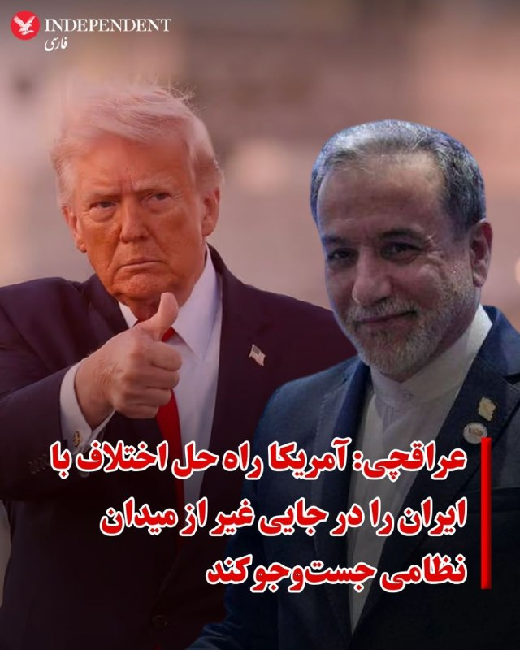
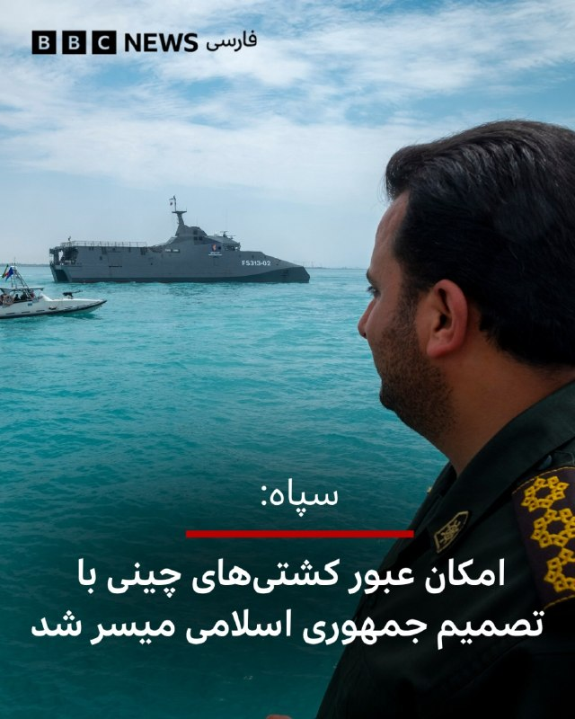
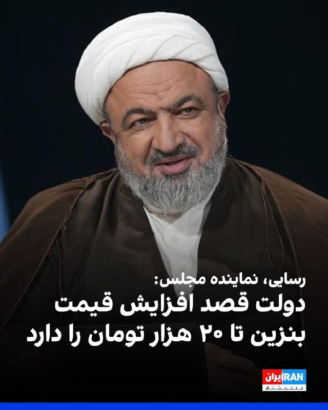

# خواننده تلگرام

<!-- TOP_NAV START -->

<a href="https://github.com/hosseinbaghi/aio-downloader/blob/main/telegram/content/archive_1.md" style="display:inline-block; padding:6px 12px; margin:0 4px; background-color:#2ea44f; color:white; text-decoration:none; border-radius:4px; font-weight:bold;">صفحه بعد</a>

<!-- TOP_NAV END -->

<!-- MSG START -->

---
📅 بروزرسانی: 1405/02/24 21:00
---

## VahidOOnLine — post 240161

  

♦️مارکو روبیو، وزیر امور خارجه ایالات متحده، در گفتگو با شبکه سی‌ان‌بی‌سی (CNBC) اعلام کرد که ترجیح چین احتمالا پیوستن داوطلبانه و آگاهانه تایوان به این کشور است. او اشاره کرد که در یک شرایط ایده‌آل، پکن به دنبال برگزاری نوعی رای‌گیری یا همه‌پرسی در تایوان است که به موجب آن، الحاق به خاک اصلی مورد توافق قرار گیرد.

روبیو با تاکید بر اینکه موضوع «اتحاد مجدد» بخش مهمی از حکم حکومتی شی جین‌پینگ در دوران تصدی او بوده است، خاطرنشان کرد که رهبر چین به‌وضوح اعلام کرده است که این اتفاق باید در برهه‌ای از زمان رخ دهد. با این حال، وزیر امور خارجه آمریکا هشدار داد که ایالات متحده معتقد است تلاش برای پیشبرد این هدف از طریق نیروی نظامی یا اقدامات قهری، یک «اشتباه وحشتناک» خواهد بود.
‌🇸🇦 Indypersian

🤖 @VahidOOnLine

## VahidOOnLine — post 240160

  <a href="telegram/content/VahidOOnLine_240160_1778779811.mp4" target="_blank">🎬 Download video</a>

فرمانده سنتکام اعلام کرد توان جمهوری‌اسلامی برای تهدید همسایگان و منافع آمریکا در منطقه به‌طور چشمگیری تضعیف شده است.
دریادار برد کوپر، فرمانده سنتکام، در جلسه‌ای در سنای آمریکا گفت: «تهدید ایران به‌طور قابل‌توجهی کاهش یافته و دیگر مانند گذشته قادر به تهدید شرکای منطقه‌ای یا آمریکا در همه حوزه‌ها نیست.»
او افزود نیروهای نیابتی جمهوری‌اسلامی در ۳۰ ماه پیش از جنگ اخیر بیش از ۳۵۰ حمله علیه نیروها و دیپلمات‌های آمریکایی انجام داده بودند؛ حملاتی که به گفته او به کشته شدن چهار سرباز آمریکایی منجر شد.
کوپر همچنین مدعی شد گروه‌هایی مانند حماس، حزب‌الله و حوثی‌ها اکنون از حمایت تسلیحاتی و لجستیکی جمهوری‌اسلامی جدا شده‌اند.
این فرمانده آمریکایی گفت ارتش آمریکا دیگر برای مقابله با پهپادهای جمهوری‌اسلامی از مهمات گران‌قیمت و پیشرفته استفاده نمی‌کند و به‌جای آن سراغ گزینه‌های ارزان‌تر رفته است.
به گفته او، جمهوری‌اسلامی تنها حدود ۱۰ درصد از پهپادهای خود را در اختیار دارد. با وجود آتش‌بس شکننده یک‌ماهه، درگیری‌های پراکنده میان نیروهای ایرانی و آمریکایی همچنان ادامه دارد.
‌🏁 🇬🇧 ManotoTV

🤖 @VahidOOnLine

## VahidOOnLine — post 240159

  

♦️معاون حقوقی وزیر خارجه جمهوری اسلامی در واکنش به اظهارات وزیر مشاور در امور خارجی امارات متحده عربی درباره حملات ایران به این کشور گفت: «امارات متحده عربی نقشی قابل توجه در حمایت و تسهیل تجاوز نظامی علیه جمهوری اسلامی ایران ایفا کرده است.»
کاظم غریب‌آبادی روز پنجشنبه ۲۴ اردیبهشت در حاشیه نشست بریکس افزود:‌ «طرفی که خود در شکل‌گیری و تشدید تنش‌ها سهیم بوده، فاقد جایگاه لازم برای طرح اتهامات و ادعاهای سیاسی علیه ایران است.»
غریب‌آبادی امارات را یک متجاوز خواند و گفت: «در رسانه‌های غربی و آمریکایی، گزارش‌ها و اخباری درباره حمله مستقیم امارات به ایران منتشر شده است. این موضوع مصداق مشارکت مستقیم در تجاوز است. شما نمی‌توانید ماهیت و نقش متجاوزانه خود را پشت این ادعاهای دروغین و روایت‌های ساختگی پنهان کنید.»
او در ادامه تاکید کرد که ایران نمی‌توانسته «نظاره‌گر هدف قرار گرفتن زیرساخت‌های خود توسط متجاوزین» باشد آن هم «با مشارکت و همراهی یکی از همسایگان، یعنی امارات متحده عربی.»
‌🇸🇦 Indypersian

🤖 @VahidOOnLine

## VahidOOnLine — post 240158

روایت شما از زندگی در آتش‌بس- پنجشنبه ۲۵ اردیبهشت ۱۴۰۵

🔹از گرگان: چند ماهه اعلام کردن حقوق ارتش و بازنشسته‌ها رو تا ۵۰ درصد بیشتر می‌کنن. زیاد نکردن که هیچ، چند روز هم دیرتر واریز کردن. امیدتون به نابودی اینا باشه. جاوید شاه.
🔹در کاشان به بچه‌های حدود ۱۰ ساله آموزش کار با کلاش می‌دن. واقعا این تو همه جای دنیا قفله.
🔹پرچم‌چرخانی و اشغال خیابون‌ها توسط جیره‌خوارهای جمهوری اسلامی مساوی با مصرف سوخت و پول ملت بیچاره‌ست.
🔹معاون اول پزشکیان گفته از بازگشت نخبه‌ها استقبال می‌کنیم. آخه مردک! می‌خواید برگردن که به جرم جاسوسی اعدام‌شون کنید؟
🔹از الوند قزوین: تو هیچ داروخانه‌ای قرص‌های اعصاب مثل سرترالین و غیره پیدا نمی‌شه. خیلی از این قرص‌ها عوارض ترک دارن. چه کسی جوابگوست؟
🔹از چهارمحال: گرونی بیداد کرده. یک کیلو بذر لوبیا سبز شده دو میلیون تومان.
🔹شعار فیفا جدایی فوتبال از سیاسته و به همین دلیل داره برای ویزای تیم رژیم تلاش می‌کنه. یکی بهش بگه به خاطر خوشحالی شکست تیم جمهوری اسلامی در جام ۲۰۲۲، جوان‌های زیادی کشته و مجروح شدن.
🔹ایدئولوژی و فلسفه جمهوری اسلامی ضدبشری و ضدانسانیته. انسان‌های داخل ایران برده‌شونن و خارج از ایران دشمن‌شون.
🔹اسنپ گرفتم، زانتیا بود. ایست بازرسی نگهش داشتن. وقتی راننده گفت اسنپم، با کمال تعجب گفتن کی آخه با زانتیا میره اسنپ! راننده هم گفت چیکار کنم، بی‌پولیه. ببینید چیکار کردن با مردم.
🔹۷۰ روزه نت‌ها قطعه. کسانی که آنلاین‌شاپ داشتن از کار بیکار شدن. خیلی‌ها مثل معلم زبان خودم می‌گفت قبل جنگ ۱۸ شاگرد داشتم و بعد جنگ ۳ شاگرد. قیمت دلار ۱۸۰٬۰۰۰ تومانه.
🔹اسکله شهید رجایی بندرعباس که معروف بود به دروازه طلایی، ترمینال‌های مادر سینا و بتا که جرثقیل‌های گانتری‌کرین مستقر هستن، واردات و صادرات اصلی کشور کلا تعطیل شده. اگر ادامه‌دار باشه به‌زودی قحطی کل کشور رو فرا می‌گیره.
🔹خوزستان شرکت‌های بهره‌برداری فلرهای نفتی رو با بیشترین حد فعال کردن و مشغول سوزاندن و هدر دادن سوخت هستن. چرا؟ چون توان و تجهیزات برای تسویه و استفاده بهینه از سوخت استخراج‌شده رو ندارن. دقت کنید شهرهای خوزستان در صدر پرخطر بودن آلودگی هوا هستن.
🔹اگه می‌گن قطعی اینترنت به‌خاطر مسائل امنیتیه، پس فروش انبوه اینترنت پرو چیه؟ اینترنت پرو امنیت رو به خطر نمی‌ندازه؟ و کسانی که رفتن پرو گرفتن، خائن هستن.
🔹محدودیت‌های زیادی روی برنامه شاد هست. برای ارسال تکالیف هم باید تایم زیادی بذاریم. احساس ناامنی افکار دانش‌آموزها رو به هم ریخته. آموزش‌وپرورش واقعا بی‌برنامه‌ست.
🔹من یک تولیدکننده محتوا تو اینستاگرام و یوتیوب بودم. بعد از قطعی اینترنت زندگیم نابود شده. همه‌چیز خیلی گرونه. کاری هم که خودمون با جون‌کندن راه انداختیم ازمون گرفتن.
‌🏁 🇬🇧 IranintlTV

🤖 @VahidOOnLine

## VahidOOnLine — post 240157

  

♦️پارلمان عراق روز پنجشنبه ۲۴ اردیبهشت، به دولت جدید این کشور به ریاست علی فالح الزیدی، بازرگان ۴۰ ساله، رای اعتماد داد. الزیدی که جوان‌ترین نخست‌وزیر تاریخ عراق محسوب می‌شود، پس از ماه‌ها بن‌بست سیاسی و فشارهای فزاینده ایالات متحده، این مسئولیت را بر عهده گرفته است. انتخاب او پس از آن صورت گرفت که واشنگتن نامزدی نوری المالکی را وتو کرده بود.

دفتر رسانه‌ای نخست‌وزیر اعلام کرد که مجلس نمایندگان به برنامه وزارتی و ۱۴ وزیر پیشنهادی الزیدی رای اعتماد داده است. اگرچه کابینه نهایی باید شامل ۲۳ وزیر باشد، اما به دلیل تداوم رایزنی‌های گروه‌های سیاسی، برخی کرسی‌ها هنوز خالی مانده است. الزیدی که از حمایت «چارچوب هماهنگی» (ائتلاف گروه‌های شیعه) برخوردار است، وظیفه دشواری برای برقراری توازن میان نفوذ جمهوری اسلامی و ایالات متحده در پیش دارد. انتظار می‌رود کابینه جدید به خواسته دیرینه واشنگتن مبنی بر خلع سلاح گروه‌های مورد حمایت تهران که آمریکا آن‌ها را تروریستی می‌داند، رسیدگی کند. این نشست پارلمان برخلاف روال معمول، به‌صورت زنده پخش نشد.
‌🇸🇦 Indypersian

🤖 @VahidOOnLine

## VahidOOnLine — post 240156

  

نخست‌وزیر جدید عراق، علی الزیدی، پنجشنبه تنها با بخشی از اعضای کابینه خود سوگند یاد کرد، زیرا قانون‌گذاران نتوانستند بر سر پست‌های کلیدی از جمله وزارت کشور و وزارت دفاع به توافق برسند.

خبرگزاری رویترز گزارش داد که باسم محمد به‌عنوان وزیر جدید نفت کشور منصوب شد و فؤاد حسین نیز در دولت جدید در سمت وزیر خارجه ابقا شد.

پارلمان عراق در مجموع به ۱۴ وزیر پیشنهادی رای اعتماد داد.
‌🏁 🇬🇧 IranintlTV

🤖 @VahidOOnLine

## VahidOOnLine — post 240155

  

منوچهر متکی، نماینده مجلس و وزیر خارجه پیشین جمهوری اسلامی، خطاب به بحرین گفت: «الان در آتش‌بس هستیم؛ دعا کنید جنگی در نگیرد، اما اگر جنگ شد و دوباره پایگاه‌های آمریکا را برای حمله به ما در اختیار بگذارید، آنچنان می‌زنیم که نامتان را فراموش کنید و خاک بحرین را توی توبره می‌کنیم.»

متکی گفت بحرین و برخی کشورهای منطقه با در اختیار گذاشتن امکانات و پایگاه‌ها به آمریکا، حملات علیه جمهوری اسلامی را تسهیل کردند و پس از حملات آمریکا و اسرائیل، به جای همدردی با ما به‌خاطر کشته شدن علی خامنه‌ای، با تحریک ایالات متحده در شورای امنیت علیه تهران قطعنامه تصویب کردند.

او همچنین گفت بحرین تلاش کرده بود در اجلاس بین‌المجالس در استانبول نیز مصوبه‌ای علیه جمهوری اسلامی به تصویب برساند، اما تهران با «تدبیر دیپلماتیک» و همراهی برخی کشورها مانع رای‌گیری درباره آن شد.

متکی این اظهارات را در روایت تازه خود از تنش لفظی با هیات بحرین در اجلاس بین‌المجالس استانبول بیان کرد و گفت آن زمان، پس از آن‌که نماینده بحرین جمهوری اسلامی را به «حمله ظالمانه» به بحرین و کشورهای عربی متهم کرد، این پاسخ را به او داده بود.
‌🏁 🇬🇧 IranintlTV

🤖 @VahidOOnLine

## VahidOOnLine — post 240154

  

♦️مهدی تاج، رئیس فدراسیون فوتبال اعلام کرد که هنوز هیچ ویزایی برای حضور تیم ملی در رقابت‌های جام جهانی در ایالات متحده صادر نشده است. خبرگزاری دولتی ایرنا به نقل از تاج نوشت: «فردا یا پس‌فردا نشست تعیین‌کننده‌ای با فیفا خواهیم داشت. آن‌ها باید به ما تضمین بدهند، چرا که موضوع ویزا هنوز حل نشده است».

او در ادامه افزود: «ما هنوز هیچ گزارشی از طرف مقابل درباره اینکه برای چه کسانی ویزا صادر شده، دریافت نکرده‌ایم و تا این لحظه هیچ ویزایی صادر نشده است». پیش از این انتظار می‌رفت بازیکنان برای انجام مراحل انگشت‌نگاری ویزا به آنکارا، پایتخت ترکیه، سفر کنند. تاج در این باره گفت: «بازیکنان باید برای انگشت‌نگاری به آنکارا بروند، اما ما در تلاش هستیم تا هماهنگی‌های لازم را انجام دهیم تا این کار در آنتالیا صورت گیرد و نیازی به سفر به آنکارا نباشد».
‌🇸🇦 Indypersian

🤖 @VahidOOnLine

## VahidOOnLine — post 240153

  <a href="telegram/content/VahidOOnLine_240153_1778779817.mp4" target="_blank">🎬 Download video</a>

دونالد ترامپ در گفت‌وگو با شان هنیتی گفت شی جین‌پینگ، رئیس‌جمهوری چین، متعهد شده به جمهوری اسلامی تجهیزات نظامی ارائه نکند.

ترامپ گفت: «او گفت قرار نیست تجهیزات نظامی بدهد؛ این حرف بزرگی است.»

رئیس‌جمهوری آمریکا در ادامه افزود چین همچنان بخش زیادی از نفت خود را از ایران خریداری می‌کند و مایل است این روند ادامه پیدا کند.

ترامپ همچنین گفت شی جین‌پینگ خواهان باز ماندن تنگه هرمز و جلوگیری از اختلال در عبور و مرور کشتی‌هاست.
‌🏁 🇬🇧 ManotoTV

🤖 @VahidOOnLine

## VahidOOnLine — post 240152

  

اکسیوس در گزارشی درباره ایران نوشت که مقام‌های آمریکایی انتظار ندارند دونالد ترامپ در جریان سفرش به چین اقدام چشمگیری در مورد جمهوری اسلامی انجام دهد، اما معتقدند او ممکن است بلافاصله پس از پایان این سفر تصمیم بعدی خود را اتخاذ کند.

براساس این گزارش یکی از گزینه‌های مورد بررسی ازسرگیری «پروژه آزادی» است؛ طرحی که در آن نیروی دریایی آمریکا تلاش می‌کند بن‌بست ایجاد شده در تنگه هرمز را بشکند.

به گزارش اکسیوس، گزینه دیگر آغاز کارزار جدید بمباران با تمرکز بر زیرساخت‌های ایران است.

مقام‌های اسرائیلی نیز گفته‌اند در صورت تصمیم ترامپ برای ازسرگیری جنگ، در آخر هفته جاری در وضعیت آماده‌باش کامل خواهند بود.
‌🏁 🇬🇧 IranintlTV

🤖 @VahidOOnLine

## VahidOOnLine — post 240151

♦️دونالد ترامپ، رئیس‌جمهوری آمریکا که به چین سفر کرده، روز پنجشنبه همراه با شی جین‌پینگ،‌ رئیس‌جمهوری چین برای بازدید از معبد بهشت ​​در پکن که بیش از ۵۰۰ سال قدمت دارد، وارد این معبد تاریخی شد.
او در توری اختصاصی همراه با شی در جریان جزئیاتی از این معبد قرار گرفت.
دونالد ترامپ، رئیس جمهوری ایالات متحده آمریکا شامگاه پنجشنبه ۲۴ اردیبهشت (به وقت محلی) و در جریان ضیافت شام شی جین‌پینگ، گفتگوها با رئیس‌جمهوری چین را «فوق‌العاده مثبت و سازنده» توصیف کرد.
‌🇸🇦 Indypersian

🤖 @VahidOOnLine

## VahidOOnLine — post 240150

  

دونالد ترامپ در گفت‌وگو با فاکس‌نیوز گفت رییس‌جمهور چین خواهان باز ماندن تنگه هرمز و دستیابی به توافق است و پیشنهاد داده برای تحقق آن به هر شکل ممکن کمک کند.
ترامپ افزود شی جین‌پینگ به او گفته چین هیچ‌گونه تجهیزات نظامی در اختیار جمهوری اسلامی قرار نخواهد داد.
‌🏁 🇬🇧 IranintlTV

🤖 @VahidOOnLine

## VahidOOnLine — post 240149

  <a href="telegram/content/VahidOOnLine_240149_1778779821.mp4" target="_blank">🎬 Download video</a>

♦️دونالد ترامپ، رئیس‌جمهوری آمریکا، در مصاحبه با شان هنیتی از فاکس نیوز گفت که شی جین‌پینگ، رئیس‌جمهور چین، برای همکاری در پرونده ایران و بازگشایی تنگه هرمز اعلام آمادگی کرده است. ترامپ تاکید کرد که شی تمایل دارد شاهد دستیابی به یک توافق باشد و به‌طور مشخص پیشنهاد داده است که در این زمینه هرگونه کمک لازم را ارائه دهد.

رئیس‌جمهور آمریکا با اشاره به حجم بالای خرید نفت چین از ایران، خاطرنشان کرد که پکن به‌دلیل این رابطه اقتصادی، نفوذ قابل‌توجهی دارد. به گفته ترامپ، رهبر چین بر تمایل خود برای بازگشایی تنگه هرمز تاکید کرده و گفته است: «اگر هر کمکی از دستم بربیاید، مشتاقم که انجام دهم».
‌🇸🇦 Indypersian

🤖 @VahidOOnLine

## VahidOOnLine — post 240148

  

♦️عباس عراقچی، وزیر خارجه جمهوری اسلامی روز پنجشنبه ۲۴ اردیبهشت با اشاره به تنش‌ها میان تهران و واشنگتن تاکید کرد که «آمریکا راه حل اختلاف با ایران را در جایی غیر از میدان نظامی جست‌وجو کند.»
عباس عراقچی در حاشیه دیدارهای خود با همتایانش در بریکس در واکنش به تهدیدهای مقامات آمریکایی و اسرائیلی مبنی بر از سرگیری حملات به ایران به‌محض بازگشت رئیس‌جمهوری آمریکا از چین گفت: «آن‌ها مدت‌هاست که به اشکال و شیوه‌های مختلف تهدیدهای خود را تکرار می‌کنند، اما خودشان نیز می‌دانند که از این تهدیدها و حتی از جنگی که به راه انداختند، هیچ نتیجه‌ای نگرفته‌اند و نخواهند گرفت.»
عراقچی با تاکید بر اینکه «ایران در برابر تهدیدها محکم ایستاده و سر خم نمی‌کند.» افزود: «راه‌حل در تهدید کردن نیست.»
وزیر خارجه جمهوری اسلامی در ادامه با ابراز امیدواری از تغییر نگاه مقام‌های آمریکایی به موضوعات مربوط به ایران تاکید کرد: «اگرچه امید نیست که به منطق روی آورند ولی بدانند که راه‌حل مسائل را باید در جایی غیر از میدان نظامی جست‌وجو کنند، زیرا از این مسیر به هیچ نتیجه‌ای نخواهند رسید.»
‌🇸🇦 Indypersian

🤖 @VahidOOnLine

## VahidOOnLine — post 240147

  

حمید رسایی، نماینده تهران در مجلس، نوشت جریانی «شناخته‌شده» در دولت چهاردهم که راه‌حل را «آزاد کردن و گران کردن» می‌داند، قصد دارد سهمیه بنزین هزار و ۵۰۰ تومانی و سه هزار تومانی را کاهش دهد و قیمت بنزین پنج هزار تومانی را به ۱۵ تا ۲۰ هزار تومان افزایش دهد.

او افزود همان جریان در دولت چهاردهم پیش‌تر با حذف ارز ترجیحی ۲۸ هزار و ۵۰۰ تومانی و گران کردن ارز، به گفته او، «بالاترین تورم پس از انقلاب ۵۷» را به مردم تحمیل کرده بود.

رسایی نوشت محمدباقر قالیباف با «پلمپ کردن بدون توجیه و دلیل مجلس»، راه نظارت نمایندگان بر تصمیمات دولت را بسته است. او افزود انجام تکلیف نمایندگی سخت شده، اما تلاش می‌کند مجلس را از این «مرگ تعمدی» بیرون بیاورد و جلوی این تصمیمات «عجیب» را در موقعیت «سخت و جنگی» فعلی بگیرد.
‌🏁 🇬🇧 IranintlTV

🤖 @VahidOOnLine

## WithYashar — post 11233

  <a href="telegram/content/WithYashar_11233_1778779826.mp4" target="_blank">🎬 Download video</a>

اتاق جنگ با یاشار ، شواهد نشان دهنده حمله غافلگیر کننده برای کتلت پزون است
@withyashar

## WithYashar — post 11232

  <a href="telegram/content/WithYashar_11232_1778779829.mp4" target="_blank">🎬 Download video</a>

در سال ۱۹۷۲، شهبانو فرح پهلوی به دعوت رسمی دولت چین به این کشور سفر کرد؛ سفری تاریخی و بی‌سابقه که در اوج جنگ سرد، نماد دیپلماسی بی‌طرفانه ایران بود
@withyashar

## WithYashar — post 11231

آیا درباره حمایت چین از ایران با رئیس جمهور چین صحبت کردید؟ ترامپ: ما در مورد این موضوع صحبت کردیم. منظورم اینه که وقتی میگید «حمایت»، آنها با ما جنگ نمی‌کنن یا چیزی شبیه این. او گفت که تجهیزات نظامی ارائه نخواهد کرد، این یک بیانیه بزرگه. اما در عین حال گفت…

## WithYashar — post 11230

Voice message

## WithYashar — post 11229

«دریادار برد کوپر»، فرمانده سنتکام: «فرماندهی مرکزی ایالات متحده (سنتکام) مستقیماً در پاسخ به تهدیدهایی که جمهوری اسلامی ایران ایجاد می‌کرد، تأسیس شد. رژیم ایران طی ۴۷ سال گذشته منطقه را دچار هراس و بی‌ثباتی کرده و دشمنی با آمریکا را به یکی از اصول اساسی…

## mwarmonitor — post 9097

  

✈️📡 هواپیمای RC-135V Rivet Joint (شماره 64-14848) در حال انجام مأموریت بر فراز خلیج فارس است و در حال جمع‌آوری اطلاعات اطلاعاتی درباره ایران می‌باشد. 📝این هواپیما به‌تنهایی می‌تواند هشدار ورود به مرحله پیش از درگیری باشد؛ وقتی پروازهای روزانه و مستمر آواکس…

## mwarmonitor — post 9096

  

🇺🇸رئیس‌جمهور دونالد ترامپ در روز اول کاری خود، ممنوعیت دولت بایدن برای صدور مجوز صادرات LNG (گاز طبیعی مایع) را لغو کرد.

🇺🇸امروز، ایالات متحده بزرگ‌ترین تولیدکننده و صادرکننده گاز طبیعی در جهان است و پیش‌بینی می‌شود صادرات LNG این کشور تا پایان دهه تقریباً دو برابر شود.

@mwarmonitor

## mwarmonitor — post 9095

🇦🇪بیانیه: امارات حمله تروریستی به کشتی با پرچم هند در سواحل عمان را به شدت محکوم می‌کند

🇦🇪دولت امارات متحده عربی حمله تروریستی که کشتی حامل پرچم هند را در نزدیکی سواحل سلطنت عمان هدف قرار داد، با شدیدترین تعابیر محکوم کرد.

🇦🇪وزارت امور خارجه در بیانیه‌ای تأکید کرد که این حمله تهدیدی بزرگ برای ایمنی دریانوردی جهانی و تنش‌زایی خطرناکی است که ثبات آبراه‌های حیاتی را هدف قرار می‌دهد.

🇦🇪امارات همبستگی خود را با جمهوری دوست، هند، و حمایت کامل خود را از تمامی اقداماتی که منجر به حفاظت از امنیت و سلامت کشتی‌ها و منافع این کشور می‌شود، ابراز داشت.

🇦🇪این وزارتخانه همچنین تأکید کرد که این حمله نقض آشکار قطعنامه شماره ۲۸۱۷ شورای امنیت است که بر آزادی دریانوردی و رد هدف قرار دادن کشتی‌های تجاری یا مختل کردن مسیرهای دریایی بین‌المللی تأکید دارد. وزارت خارجه خاطرنشان کرد که هدف قرار دادن دریانوردی تجاری و استفاده از تنگه هرمز به عنوان ابزاری برای فشار یا باج‌خواهی اقتصادی، اقدامی راهزنانه محسوب شده و تهدیدی مستقیم برای ثبات منطقه، ملت‌های آن و امنیت انرژی جهانی است.

@mwarmonitor

## mwarmonitor — post 9094

  

✈️📡 هواپیمای RC-135V Rivet Joint (شماره 64-14848) در حال انجام مأموریت بر فراز خلیج فارس است و در حال جمع‌آوری اطلاعات اطلاعاتی درباره ایران می‌باشد.

📝این هواپیما به‌تنهایی می‌تواند هشدار ورود به مرحله پیش از درگیری باشد؛
وقتی پروازهای روزانه و مستمر آواکس را هم به آن اضافه کنیم، نشانه‌ها دیگر قابل چشم‌پوشی نیستند.

@mwarmonitor

## FoxNewsTwitter — post 341749

  <a href="telegram/content/FoxNewsTwitter_341749_1778779835.mp4" target="_blank">🎬 Download video</a>

Fox News (Twitter/X)

JUST IN: Vice President JD Vance exposes a "shocking" lack of accountability at the Department of Justice, claiming million-dollar fraud cases were ignored by the Biden administration.

"Let's say a person defrauded all of you for a million bucks. To many of our Department of Justice leaders under the Biden administration, they said that was too low level to actually go after. So, I mean, how many of you would like the federal government to hand you $1 million?"

## FoxNewsTwitter — post 341748

  <a href="telegram/content/FoxNewsTwitter_341748_1778779838.mp4" target="_blank">🎬 Download video</a>

Fox News (Twitter/X)

NEW: Vice President JD Vance defends America’s social safety net while warning that unchecked fraud is destroying the "spirit of generosity" that sustains it.

"We don't want low income kids to not be able to afford a bite to eat. We want to make sure that if you're a poor child or a poor family, you get an opportunity to see a doctor, even if money is particularly tight."

"But you know what destroys those programs and not just destroys those programs, but destroys the spirit of generosity that makes those programs possible? It's when local officials and state officials and federal officials, it's when they let the fraudsters take advantage of you instead of fighting for you."

## FoxNewsTwitter — post 341747

  <a href="telegram/content/FoxNewsTwitter_341747_1778779840.mp4" target="_blank">🎬 Download video</a>

Fox News (Twitter/X)

HAPPENING NOW: Vice President JD Vance blasts Maine’s "festering" fraud crisis, blaming Governor Janet Mills and former President Joe Biden for the state's decline.

"Why did Maine go from a state that did not have a serious fraud problem, to one where I can honestly say it's one of the worst states in the union?"

"Number one is Janet Mills, and number two is Joe Biden. And thankfully, thankfully, one of them has already been kicked to the curb and one is on her way out the door exactly as it should be."

## FoxNewsTwitter — post 341746

  <a href="telegram/content/FoxNewsTwitter_341746_1778779843.mp4" target="_blank">🎬 Download video</a>

Fox News (Twitter/X)

BREAKING: Vice President JD Vance exposes massive fraud rings involving hospice care and services for autistic children, alleging billions are being stolen from vulnerable Americans.

"We have seen people go out there and say that they're providing services to autistic children, when in reality they maybe don't have any children at all, or they certainly don't have autistic children."

"What happened to the autistic children and their families who actually need those services and need a competent government to ensure that they're doing the right thing?"

## FoxNewsTwitter — post 341745

  <a href="telegram/content/FoxNewsTwitter_341745_1778779846.mp4" target="_blank">🎬 Download video</a>

Fox News (Twitter/X)

NEW: Vice President JD Vance gets a chuckle from the crowd after a person yells about dead people voting while the VP was talking about fraud in the United States:

"Unfortunately, they vote for Democrats. They don't vote for us my friends.”

## FoxNewsTwitter — post 341744

  <a href="telegram/content/FoxNewsTwitter_341744_1778779848.mp4" target="_blank">🎬 Download video</a>

Fox News (Twitter/X)

NOW: Vice President JD Vance reveals his reaction when President Trump asked him to oversee taking on America's fraud problem:

"When the president of the United States said, 'JD, we have got a fraud problem and I want you to tackle it.' I was so proud and so happy to be able to do it, because I realized that fraud isn't just about saving money. It's not just about protecting taxpayers. It's about protecting you."

## FoxNewsTwitter — post 341743

Fox News (Twitter/X)

"So when you make campaign statements, those aren't true? You're not being honest with your voters? ...What you said to the voters is not real. Doesn't count."

Rep. Jim Jordan hammers Fairfax County Commonwealth's Attorney Stephen Descano over the removal of campaign promises from his website about taking “immigration consequences” into account while handling cases.

Jordan blasts the prosecutor after an illegal immigrant with a lengthy criminal history was released by police and allegedly killed a man in his home a day later.

## FoxNewsTwitter — post 341742

  

Fox News (Twitter/X)

WATCH LIVE: VP Vance delivers remarks on Trump admin's fraud crackdown https://twitter.com/i/broadcasts/1kKzDMmkkYXJv

## FoxNewsTwitter — post 341741

  <a href="telegram/content/FoxNewsTwitter_341741_1778779852.mp4" target="_blank">🎬 Download video</a>

Fox News (Twitter/X)

“Tend to your faith not just when you’re broken, but when you’re whole.”

Eric Church returned to his alma mater, UNC Chapel Hill, and gave graduates a message bigger than music:

The country star told graduates that faith is the “low E” of life: the foundation every chord rests on, especially when the world gets overwhelming.

## FoxNewsTwitter — post 341740

  <a href="telegram/content/FoxNewsTwitter_341740_1778779854.mp4" target="_blank">🎬 Download video</a>

Fox News (Twitter/X)

FIRST ON FOX: Buster Murdaugh was spotted Thursday on the porch of his South Carolina home, one day after the South Carolina Supreme Court ruled that misconduct by a court official tainted his father, Alex Murdaugh’s, 2023 trial.

The ruling overturned Alex Murdaugh’s murder conviction, which had sent him to prison for life.

Despite the legal win Wednesday, Murdaugh will not be walking free - he remains behind bars serving lengthy sentences for a string of financial crimes that cemented his fall from power.

Murdaugh was sentenced to 27 years in state prison after pleading guilty to 22 financial crimes. He also got 40 years in federal prison for fraud-related charges, which he is serving at the same time. | @FoxTrueCrime @FoxUSNews

## FoxNewsTwitter — post 341739

‌Fox News (Twitter/X)

https://www.foxnews.com/politics/us-border-patrol-chief-mike-banks-abruptly-resigns-fox-news-learns

## FoxNewsTwitter — post 341738

  <a href="telegram/content/FoxNewsTwitter_341738_1778779857.mp4" target="_blank">🎬 Download video</a>

Fox News (Twitter/X)

FIRST ON FOX: Buster Murdaugh was spotted Thursday on the porch of his South Carolina home, one day after the South Carolina Supreme Court ruled that misconduct by a court official tainted his father, Alex Murdaugh’s, 2023 trial.

The ruling overturned Alex Murdaugh’s murder conviction, which had sent him to prison for life.

Despite the legal win Wednesday, Murdaugh will not be walking free - he remains behind bars serving lengthy sentences for a string of financial crimes that cemented his fall from power.

Murdaugh was sentenced to 27 years in state prison after pleading guilty to 22 financial crimes. He also got 40 years in federal prison for fraud-related charges, which he is serving at the same time.

## FoxNewsTwitter — post 341737

  <a href="telegram/content/FoxNewsTwitter_341737_1778779859.mp4" target="_blank">🎬 Download video</a>

Fox News (Twitter/X)

NEW: President Trump reveals to @seanhannity that Chinese President Xi Jinping has committed to withholding military equipment from Iran following their high-level discussions.

Trump noted that while China continues to purchase Iranian oil, Xi expressed a strong desire to see the Strait of Hormuz remain open and free of interference.

"He said he’s not going to give military equipment, that’s a big statement... But at the same time, he said you know they buy a lot of their oil there and they’d like to keep doing that. He’d like to see Hormuz straight opened."

The full interview airs tonight at 9pm ET.

## FoxNewsTwitter — post 341736

Fox News (Twitter/X)

BREAKING: US Border Patrol Chief Mike Banks abruptly resigns, Fox News has learned

## FoxNewsTwitter — post 341735

  <a href="telegram/content/FoxNewsTwitter_341735_1778779861.mp4" target="_blank">🎬 Download video</a>

Fox News (Twitter/X)

NEW: Iran has reportedly seized a ship off the coast of the UAE, ramping up tensions in the region as disputes grow over alleged attacks and a denied Netanyahu visit.

U.S. officials say talks with the Iranian regime have made some progress but remain uncertain, with Iran signaling it’s ready for either diplomacy or conflict, @TreyYingst reports.

## pm_afshaa — post 90753

  <a href="telegram/content/pm_afshaa_90753_1778779865.webm" target="_blank">🎬 Download video</a>

🔴اوباما درباره برنامه هسته‌ای ایران:
ما بدون شلیک یک گلوله آن را متوقف کردیم. 97 درصد اورانیوم آنها رو خارج کردیم. هیچ بحثی وجود نداره که آن توافق رو کار کرد و لازم نبود ما عده زیادی آدم بکشیم یا تنگه هرمز رو ببندیم.

💧 Rainbet.com the #1 Non-KYC Crypto Casino & Sportsbook @rainbetcom

😁 @Pm_Afshaa

## pm_afshaa — post 90752

  <a href="telegram/content/pm_afshaa_90752_1778779865.webm" target="_blank">🎬 Download video</a>

🔴پیت هگست:

علیرغم آنچه ممکن است در رسانه ها بشنوید، آمریکا در حال افول نیست. ما همچنان قوی‌ترین قدرت نظامی روی زمین هستیم، اما این قدرت مستلزم تجدید است.

با تهدیدهای جهانی که دائماً در حال تغییر هستند، زمان آن فرا رسیده است که یک سرمایه گذاری 1.5 تریلیون دلاری انجام دهید، یک پیش پرداخت نسلی.

این سرمایه‌گذاری تضمین می‌کند که ایالات متحده قدرت و قدرت بازدارندگی بی‌نظیری در برابر هر دشمنی را برای نسل‌های آینده حفظ کند.

💧 Rainbet.com the #1 Non-KYC Crypto Casino & Sportsbook @rainbetcom

😁 @Pm_Afshaa

## pm_afshaa — post 90751

  <a href="telegram/content/pm_afshaa_90751_1778779866.webm" target="_blank">🎬 Download video</a>

🔴کانال 12 به نقل از یک منبع:
اسرائیل وضعیت آماده باش خود را به منظور آمادگی برای احتمال تجدید جنگ ایران پس از بازگشت ترامپ از چین به اوج رسوند.

ارتش اسرائیل در تدارک تهاجمی و تدافعی برای احتمال از سرگیری فوری جنگ ایرانه.

💧 Rainbet.com the #1 Non-KYC Crypto Casino & Sportsbook @rainbetcom

😁 @Pm_Afshaa

## pm_afshaa — post 90750

  <a href="telegram/content/pm_afshaa_90750_1778779867.webm" target="_blank">🎬 Download video</a>

🔴ترامپ: رئیس‌جمهور شی مایله که شاهد یک توافق باشه. او گفت: اگه بتونم کمکی داشته باشم، دوست دارم کمک کنم.

هر کسی که این مقدار نفت میخره، مشخصاً نوعی رابطه داره و او دوست داره تنگه هرمز رو باز ببینه.

💧 Rainbet.com the #1 Non-KYC Crypto Casino & Sportsbook @rainbetcom

😁 @Pm_Afshaa

## pm_afshaa — post 90749

🎙️آیا رئیس جمهور شی از ترامپ درخواست کرده بود که به تایوان سلاح نفروشه؟

مارکو روبیو: خوب، این موضوع در گذشته مورد بحث قرار گرفته. اساساً در بحث امروز مطرح نشد. ما میدونیم که موضع آنها در این مورد چیست.

💧 Rainbet.com the #1 Non-KYC Crypto Casino & Sportsbook @rainbetcom

😁 @Pm_Afshaa

## pm_afshaa — post 90748

  <a href="telegram/content/pm_afshaa_90748_1778779868.webm" target="_blank">🎬 Download video</a>

🔴ترامپ: چین موافقت کرد 200 هواپیمای بوئینگ خریداری کنه.

💧 Rainbet.com the #1 Non-KYC Crypto Casino & Sportsbook @rainbetcom

😁 @Pm_Afshaa

## pm_afshaa — post 90747

  <a href="telegram/content/pm_afshaa_90747_1778779869.webm" target="_blank">🎬 Download video</a>

🔴حمید رسایی، نماینده تهران:
دولت قصد داره سهمیه بنزین هزار و ۵۰۰ تومنی و ۳ هزار تومنی رو کاهش بده و قیمت بنزین پنج هزار تومانی رو به ۱۵ تا ۲۰ هزار تومان افزایش بده.

💧 Rainbet.com the #1 Non-KYC Crypto Casino & Sportsbook @rainbetcom

😁 @Pm_Afshaa

## iaghapour — post 2611

  

💠 Mega Center 💠

🪩📈 ابزار مورد نیاز شما در دنیای کریپتو و تریدینگ / احراز هویت پلتفرم های خارجی

از افتتاح حساب های ارزی بین المللی
تا پکیج مدارک لازم جهت احراز هویت صرافی ها و سایت های خارجی
صدور مستر کارت و ویزا کارت و خدمات ارزی
سیم کارت های فیزیکی خارجی
خدمات وریفای تضمینی صرافی ها
ولت های فیزیکی معتبر و ...

👨‍💻لینک دسترسی ها و ارتباط :
www.megacenterx.com      
www.megacenterx.com
www.megacenterx.com

https://t.me/megacenter0
https://t.me/megacenter0

@Megav_admin22
@Megav_admin22

در صورت بالا نیامدن سایت ، بدون وی پی ان امتحان نمایید ✅

## iaghapour — post 2609

کل ریپازیتوری گیت هاب علیرضا که شامل X-UI و S-UI میشد بسته شده و هنوز دلیلش مشخص نیست.

## DEJradio — post 4636

  <a href="telegram/content/DEJradio_4636_1778779870.mp4" target="_blank">🎬 Download video</a>

🔺📢 "قیمت دارو سرسام‌آور شده، حکومت فقط دنبال جنگ‌افروزی است

یک شهروند از سمنان با ارسال یک ویدیو در پیامی نوشت: "ساکن سمنان هستم و براتون گزارشی می‌فرستم از افزایش قیمت دارو. این چند تا دارو رو دیروز از داروخانه به قیمت ۳ میلیون تومن خریدم درحالیکه پارسال قیمتش نصف این بود. درآمد ماهیانه من با این قیمت‌های سرسام آور تناسبی نداره و این به این معناست که برای خرید دارو باید از بقیه مایحتاج خودم و سه فرزندم صرف نظر کنم. این حکومت بی‌کفایت نه تنها که به فکر تامین نیازهای ما نیست بلکه با این جنگ افروزی‌هاش فقط اقتصاد کشور و درآمد مردم رو بیش از پیش نابود میکنه!"

#دارو #تورم
@DEJradio

## DEJradio — post 4635

  <a href="telegram/content/DEJradio_4635_1778779872.mp4" target="_blank">🎬 Download video</a>

🔺📢 "ما گرسنه‌ایم ولی از جنگ سیر

یک شهروند از تهران با ارسال ویدیویی از حرکت اعتراضی، نوشت گرانی زندگی مردم را مختل کرده است و بسیاری به نان شب محتاج‌اند اما حکومت انگار نه انگار که مردم چطور زندگی می‌کنند.

#تورم #جنگ
@DEJradio

## DEJradio — post 4631

  <a href="telegram/content/DEJradio_4631_1778779875.webm" target="_blank">🎬 Download video</a>

🚨📢 روزنامه «وال‌استریت ژورنال» گزارش داده بود که اسرائیل یک پایگاه نظامی مخفی در بیابان عراق [نزدیم کربلا] ایجاد کرده بود تا از کارزار هوایی خود علیه جمهوری اسلامی پشتیبانی کند و در روزهای ابتدایی جنگ نیز حملاتی هوایی علیه نیروهای عراقی انجام داده بود؛ نیروهایی که نزدیک بود این پایگاه و باند فرود آن را کشف کنند.

اکنون، نزدیک به دو ماه پس از ترک این پایگاه، نیروهای ارتش عراق و عناصر حشـ.ـدالشعبی وارد محل این تأسیسات اسرائیلی شده‌اند.
تصویر یک از رسانه رسمی «کتائب حـ.ـزب‌الله» منتشر شد، اعضای این گروه را در حال بررسی یک وانت تویوتا هایلوکس نشان می‌دهد که گفته می‌شود هدف حمله نیروهای اسرائیلی قرار گرفته است. این هایلوکس متعلق به یک چوپان عراقی بود که به‌طور اتفاقی این پایگاه را کشف کرده و موفق شده بود با ارتش عراق تماس بگیرد، اما پس از آن هدف قرار گرفت و کشته شد. نیروهای کمکی عراقی از لشکر۴۱ نیز توسط یک نیروی ناشناس هدف حمله قرار گرفتند که دست‌کم یک کشته و چند زخمی برجا گذاشت.

تصویر ۲ باند فرود را نشان می‌دهد؛ باندی که گفته می‌شود هم به‌عنوان ایستگاه سوخت‌گیری و هم نقطه استقرار پیشرو برای عملیات جست‌وجو و نجات رزمی استفاده می‌شد؛ عملیاتی که در صورت سرنگونی یک هواپیمای سرنشین‌دار اسرائیلی توسط پدافند هوایی ایران انجام می‌گرفت. گزارش شده که دست‌کم هفت بالگرد در این محل قابل مشاهده بوده‌اند.

منتقدان دولت عراق می‌گویند این کشور با وجود داشتن یک ساختار امنیتی نزدیک به دو میلیون نفر شامل مرزبانان، حـ.ـشدالشعبی، پلیس و ارتش، نتوانسته بود تشخیص دهد که یک نیروی نظامی خارجی عملاً در بیابان‌های عراق یک پایگاه هوایی ساخته است. همچنین جمهوری اسلامی نیز ماه‌ها از فعالیت چنین پایگاهی بی‌خبر بود.

#جنگ #عراق #حشد_الشعبی
@DEJradio

## VahidOnline — post 75468

  

برد کوپر، فرمانده ستاد فرماندهی مرکزی ایالات متحده (سنتکام)، اعلام کرد که صنایع موشکی، پهپادی و دریایی ایران «۹۰ درصد تضعیف شده‌اند.»

او در یک جلسه استماع در سنای آمریکا گفت: «تهدید ایران به‌طور قابل‌توجهی تضعیف شده و این کشور دیگر مانند گذشته، در هیچ حوزه‌ای، قادر به تهدید شرکای منطقه‌ای یا ایالات متحده نیست. آنها به‌شدت تضعیف شده‌اند.»

کوپر اشاره کرد که نیروهای نیابتی مسلح ایران در ۳۰ ماه پیش از جنگ اخیر، بیش از ۳۵۰ حمله علیه نیروها و دیپلمات‌های آمریکایی انجام داده بودند؛ به‌طور میانگین هر سه روز یک حمله، که در نتیجه آن چهار سرباز آمریکایی کشته شدند.

برد کوپر با دفاع از جنگ اخیر تأکید کرد: «امروز حماس، حزب‌الله و حوثی‌ها همگی از تأمین تسلیحات و حمایت ایران قطع شده‌اند. این نتیجه از پیش تضمین‌شده نبود.»

او همچنین گفت نیروهای آمریکایی دیگر برای سرنگون کردن پهپادهای ایرانی از مهمات پیشرفته و گران‌قیمت استفاده نمی‌کنند.
ذخایر سامانه‌های دفاعی پرهزینه برای مقابله با پهپادهای ایرانی در طول جنگ خبرساز شده بود، اما فرمانده سنتکام اعلام کرد ارتش آمریکا اکنون از مهمات ارزان‌تر استفاده می‌کند.
@VahidHeadline

📡 @VahidOnline

## VahidOnline — post 75467

  

حمید رسایی، نماینده تهران در مجلس، نوشت جریانی «شناخته‌شده» در دولت چهاردهم که راه‌حل را «آزاد کردن و گران کردن» می‌داند، قصد دارد سهمیه بنزین هزار و ۵۰۰ تومانی و سه هزار تومانی را کاهش دهد و قیمت بنزین پنج هزار تومانی را به ۱۵ تا ۲۰ هزار تومان افزایش دهد.

او افزود همان جریان در دولت چهاردهم پیش‌تر با حذف ارز ترجیحی ۲۸ هزار و ۵۰۰ تومانی و گران کردن ارز، به گفته او، «بالاترین تورم پس از انقلاب ۵۷» را به مردم تحمیل کرده بود.

رسایی نوشت محمدباقر قالیباف با «پلمپ کردن بدون توجیه و دلیل مجلس»، راه نظارت نمایندگان بر تصمیمات دولت را بسته است. او افزود انجام تکلیف نمایندگی سخت شده، اما تلاش می‌کند مجلس را از این «مرگ تعمدی» بیرون بیاورد و جلوی این تصمیمات «عجیب» را در موقعیت «سخت و جنگی» فعلی بگیرد.
@VahidOOnLine

📡 @VahidOnline

## VahidOnline — post 75466

  

مصطفی پوردهقان، دبیر دوم کمیسیون صنایع و معادن مجلس گفته است که مصوبه شورای عالی امنیت ملی در مورد اینترنت پرو در اجرا به «قلکی برای همراه اول، ایرانسل و رایتل» تبدیل شده است.

او در مورد انتخاب محمدرضا عارف، به عنوان رئیس ستاد ویژه ساماندهی فضای مجازی گفت که «مجلس در این مورد چیزی نمی‌داند» و این حکم مسعود پزشکیان، رئیس‌جمهور را «تزئینی» خوانده است.

به گفته این نماینده مجلس این قبیل اقدامات بیشتر جنبه «روانی » دارد و قرار نیست که «اتفاق خاصی» در این مورد بیفتد.

آقای پوردهقان همچنین گفته است که بدتر از قطعی اینترنت، تعطیلی مجلس است و اکنون مجلس با بسیاری از وزرای دولت به لحاظ نظارتی هیچ ارتباط خاصی درمورد عملکردشان ندارد که یکی از همین موارد موضوع اینترنت است و هنوز یک جلسه ویژه نداریم که فردی بیاید و شرایط را توضیح دهد.
@VahidHeadline

📡 @VahidOnline

## IranIntlTV — post 337200

روایت شما از زندگی در آتش‌بس- پنجشنبه ۲۵ اردیبهشت ۱۴۰۵

🔹از گرگان: چند ماهه اعلام کردن حقوق ارتش و بازنشسته‌ها رو تا ۵۰ درصد بیشتر می‌کنن. زیاد نکردن که هیچ، چند روز هم دیرتر واریز کردن. امیدتون به نابودی اینا باشه. جاوید شاه.
🔹در کاشان به بچه‌های حدود ۱۰ ساله آموزش کار با کلاش می‌دن. واقعا این تو همه جای دنیا قفله.
🔹پرچم‌چرخانی و اشغال خیابون‌ها توسط جیره‌خوارهای جمهوری اسلامی مساوی با مصرف سوخت و پول ملت بیچاره‌ست.
🔹معاون اول پزشکیان گفته از بازگشت نخبه‌ها استقبال می‌کنیم. آخه مردک! می‌خواید برگردن که به جرم جاسوسی اعدام‌شون کنید؟
🔹از الوند قزوین: تو هیچ داروخانه‌ای قرص‌های اعصاب مثل سرترالین و غیره پیدا نمی‌شه. خیلی از این قرص‌ها عوارض ترک دارن. چه کسی جوابگوست؟
🔹از چهارمحال: گرونی بیداد کرده. یک کیلو بذر لوبیا سبز شده دو میلیون تومان.
🔹شعار فیفا جدایی فوتبال از سیاسته و به همین دلیل داره برای ویزای تیم رژیم تلاش می‌کنه. یکی بهش بگه به خاطر خوشحالی شکست تیم جمهوری اسلامی در جام ۲۰۲۲، جوان‌های زیادی کشته و مجروح شدن.
🔹ایدئولوژی و فلسفه جمهوری اسلامی ضدبشری و ضدانسانیته. انسان‌های داخل ایران برده‌شونن و خارج از ایران دشمن‌شون.
🔹اسنپ گرفتم، زانتیا بود. ایست بازرسی نگهش داشتن. وقتی راننده گفت اسنپم، با کمال تعجب گفتن کی آخه با زانتیا میره اسنپ! راننده هم گفت چیکار کنم، بی‌پولیه. ببینید چیکار کردن با مردم.
🔹۷۰ روزه نت‌ها قطعه. کسانی که آنلاین‌شاپ داشتن از کار بیکار شدن. خیلی‌ها مثل معلم زبان خودم می‌گفت قبل جنگ ۱۸ شاگرد داشتم و بعد جنگ ۳ شاگرد. قیمت دلار ۱۸۰٬۰۰۰ تومانه.
🔹اسکله شهید رجایی بندرعباس که معروف بود به دروازه طلایی، ترمینال‌های مادر سینا و بتا که جرثقیل‌های گانتری‌کرین مستقر هستن، واردات و صادرات اصلی کشور کلا تعطیل شده. اگر ادامه‌دار باشه به‌زودی قحطی کل کشور رو فرا می‌گیره.
🔹خوزستان شرکت‌های بهره‌برداری فلرهای نفتی رو با بیشترین حد فعال کردن و مشغول سوزاندن و هدر دادن سوخت هستن. چرا؟ چون توان و تجهیزات برای تسویه و استفاده بهینه از سوخت استخراج‌شده رو ندارن. دقت کنید شهرهای خوزستان در صدر پرخطر بودن آلودگی هوا هستن.
🔹اگه می‌گن قطعی اینترنت به‌خاطر مسائل امنیتیه، پس فروش انبوه اینترنت پرو چیه؟ اینترنت پرو امنیت رو به خطر نمی‌ندازه؟ و کسانی که رفتن پرو گرفتن، خائن هستن.
🔹محدودیت‌های زیادی روی برنامه شاد هست. برای ارسال تکالیف هم باید تایم زیادی بذاریم. احساس ناامنی افکار دانش‌آموزها رو به هم ریخته. آموزش‌وپرورش واقعا بی‌برنامه‌ست.
🔹من یک تولیدکننده محتوا تو اینستاگرام و یوتیوب بودم. بعد از قطعی اینترنت زندگیم نابود شده. همه‌چیز خیلی گرونه. کاری هم که خودمون با جون‌کندن راه انداختیم ازمون گرفتن.

## IranIntlTV — post 337199

  

نخست‌وزیر جدید عراق، علی الزیدی، پنجشنبه تنها با بخشی از اعضای کابینه خود سوگند یاد کرد، زیرا قانون‌گذاران نتوانستند بر سر پست‌های کلیدی از جمله وزارت کشور و وزارت دفاع به توافق برسند.

خبرگزاری رویترز گزارش داد که باسم محمد به‌عنوان وزیر جدید نفت کشور منصوب شد و فؤاد حسین نیز در دولت جدید در سمت وزیر خارجه ابقا شد.

پارلمان عراق در مجموع به ۱۴ وزیر پیشنهادی رای اعتماد داد.
https://iranintl.com/202605145356

## IranIntlTV — post 337198

  

منوچهر متکی، نماینده مجلس و وزیر خارجه پیشین جمهوری اسلامی، خطاب به بحرین گفت: «الان در آتش‌بس هستیم؛ دعا کنید جنگی در نگیرد، اما اگر جنگ شد و دوباره پایگاه‌های آمریکا را برای حمله به ما در اختیار بگذارید، آنچنان می‌زنیم که نامتان را فراموش کنید و خاک بحرین را توی توبره می‌کنیم.»

متکی گفت بحرین و برخی کشورهای منطقه با در اختیار گذاشتن امکانات و پایگاه‌ها به آمریکا، حملات علیه جمهوری اسلامی را تسهیل کردند و پس از حملات آمریکا و اسرائیل، به جای همدردی با ما به‌خاطر کشته شدن علی خامنه‌ای، با تحریک ایالات متحده در شورای امنیت علیه تهران قطعنامه تصویب کردند.

او همچنین گفت بحرین تلاش کرده بود در اجلاس بین‌المجالس در استانبول نیز مصوبه‌ای علیه جمهوری اسلامی به تصویب برساند، اما تهران با «تدبیر دیپلماتیک» و همراهی برخی کشورها مانع رای‌گیری درباره آن شد.

متکی این اظهارات را در روایت تازه خود از تنش لفظی با هیات بحرین در اجلاس بین‌المجالس استانبول بیان کرد و گفت آن زمان، پس از آن‌که نماینده بحرین جمهوری اسلامی را به «حمله ظالمانه» به بحرین و کشورهای عربی متهم کرد، این پاسخ را به او داده بود.
https://iranintl.com/20

## IranIntlTV — post 337197

  

اکسیوس در گزارشی درباره ایران نوشت که مقام‌های آمریکایی انتظار ندارند دونالد ترامپ در جریان سفرش به چین اقدام چشمگیری در مورد جمهوری اسلامی انجام دهد، اما معتقدند او ممکن است بلافاصله پس از پایان این سفر تصمیم بعدی خود را اتخاذ کند.

براساس این گزارش یکی از گزینه‌های مورد بررسی ازسرگیری «پروژه آزادی» است؛ طرحی که در آن نیروی دریایی آمریکا تلاش می‌کند بن‌بست ایجاد شده در تنگه هرمز را بشکند.

به گزارش اکسیوس، گزینه دیگر آغاز کارزار جدید بمباران با تمرکز بر زیرساخت‌های ایران است.

مقام‌های اسرائیلی نیز گفته‌اند در صورت تصمیم ترامپ برای ازسرگیری جنگ، در آخر هفته جاری در وضعیت آماده‌باش کامل خواهند بود.
https://iranintl.com/202605149706

## IranIntlTV — post 337196

  

دونالد ترامپ در گفت‌وگو با فاکس‌نیوز گفت رییس‌جمهور چین خواهان باز ماندن تنگه هرمز و دستیابی به توافق است و پیشنهاد داده برای تحقق آن به هر شکل ممکن کمک کند.
ترامپ افزود شی جین‌پینگ به او گفته چین هیچ‌گونه تجهیزات نظامی در اختیار جمهوری اسلامی قرار نخواهد داد.
https://iranintl.com/202605142029

## IranIntlTV — post 337195

  <a href="telegram/content/IranIntlTV_337195_1778779882.mp4" target="_blank">🎬 Download video</a>

شش کشور عربی شامل بحرین، کویت، عربستان سعودی، امارات، قطر و اردن در نامه‌ای فوری به سازمان ملل، جمهوری اسلامی را مسئول خسارت‌های واردشده به کشورهای منطقه دانسته و خواستار پرداخت غرامت شدند.
جزییات بیشتر با مریم رحمتی، خبرنگار ایران‌اینترنشنال
@iranintltv

## IranIntlTV — post 337194

  <a href="telegram/content/IranIntlTV_337194_1778779884.mp4" target="_blank">🎬 Download video</a>

در ادامه سفر دونالد ترامپ به چین، روسای جمهور آمریکا و چین در ضیافت شام رسمی بر گسترش همکاری‌های اقتصادی و ادامه گفت‌وگوها تاکید کردند. شی جین‌پینگ این سفر را «تاریخی» توصیف کرد و ترامپ نیز گفت دیدارهای دو طرف مثبت و سازنده بوده است.
سمیرا قرایی، خبرنگار ایران‌اینترنشنال، گزارش می‌دهد
@iranintltv

## IranIntlTV — post 337193

  

«برنامه» امشب، «تریبون آزاد» شماست.
اگر فقط یک جمله فرصت داشتید با ایران حرف بزنید، چه می‌گفتید؟
چه چیزی هنوز دلتان را گرم نگه می‌دارد؟
نگرانی‌تان چیست؟
از چه چیزی عصبانی هستید؟
حرفی دارید که در دلتان مانده و جایی برای گفتنش نبوده؟
از خودتان بگویید؛ از امیدها و ترس‌هایتان،
از رؤیایی که هنوز زنده است یا از چیزی که از دست رفته است.
تاریخ با صدای شما نوشته می‌شود.
برای شرکت در برنامه، همین حالا در واتس‌اپ پیام بدهید:
۰۰۴۴۷۵۲۲۱۱۰۱۱۰
۰۰۴۴۷۵۴۴۱۱۰۱۱۰
۰۰۴۴۷۵۱۱۱۰۲۵۵۳
«برنامه با کامبیز حسینی»
«یک ایران، صدای شما را می‌شنود»
@iranintltv

## IranIntlTV — post 337192

یک شهروند با ارسال پیامی به ایران اینترنشنال از نایاب و گران شدن داروی اعصاب و روان روایت می‌کند. صدای او برای حفظ امنیتش با هوش مصنوعی تغییر یافته است.

## IranIntlTV — post 337191

  

حمید رسایی، نماینده تهران در مجلس، نوشت جریانی «شناخته‌شده» در دولت چهاردهم که راه‌حل را «آزاد کردن و گران کردن» می‌داند، قصد دارد سهمیه بنزین هزار و ۵۰۰ تومانی و سه هزار تومانی را کاهش دهد و قیمت بنزین پنج هزار تومانی را به ۱۵ تا ۲۰ هزار تومان افزایش دهد.

او افزود همان جریان در دولت چهاردهم پیش‌تر با حذف ارز ترجیحی ۲۸ هزار و ۵۰۰ تومانی و گران کردن ارز، به گفته او، «بالاترین تورم پس از انقلاب ۵۷» را به مردم تحمیل کرده بود.

رسایی نوشت محمدباقر قالیباف با «پلمپ کردن بدون توجیه و دلیل مجلس»، راه نظارت نمایندگان بر تصمیمات دولت را بسته است. او افزود انجام تکلیف نمایندگی سخت شده، اما تلاش می‌کند مجلس را از این «مرگ تعمدی» بیرون بیاورد و جلوی این تصمیمات «عجیب» را در موقعیت «سخت و جنگی» فعلی بگیرد.
https://iranintl.com/202605146615

## ManotoTV — post 105459

  <a href="telegram/content/ManotoTV_105459_1778779889.mp4" target="_blank">🎬 Download video</a>

فرمانده سنتکام اعلام کرد توان جمهوری‌اسلامی برای تهدید همسایگان و منافع آمریکا در منطقه به‌طور چشمگیری تضعیف شده است.
دریادار برد کوپر، فرمانده سنتکام، در جلسه‌ای در سنای آمریکا گفت: «تهدید ایران به‌طور قابل‌توجهی کاهش یافته و دیگر مانند گذشته قادر به تهدید شرکای منطقه‌ای یا آمریکا در همه حوزه‌ها نیست.»
او افزود نیروهای نیابتی جمهوری‌اسلامی در ۳۰ ماه پیش از جنگ اخیر بیش از ۳۵۰ حمله علیه نیروها و دیپلمات‌های آمریکایی انجام داده بودند؛ حملاتی که به گفته او به کشته شدن چهار سرباز آمریکایی منجر شد.
کوپر همچنین مدعی شد گروه‌هایی مانند حماس، حزب‌الله و حوثی‌ها اکنون از حمایت تسلیحاتی و لجستیکی جمهوری‌اسلامی جدا شده‌اند.
این فرمانده آمریکایی گفت ارتش آمریکا دیگر برای مقابله با پهپادهای جمهوری‌اسلامی از مهمات گران‌قیمت و پیشرفته استفاده نمی‌کند و به‌جای آن سراغ گزینه‌های ارزان‌تر رفته است.
به گفته او، جمهوری‌اسلامی تنها حدود ۱۰ درصد از پهپادهای خود را در اختیار دارد. با وجود آتش‌بس شکننده یک‌ماهه، درگیری‌های پراکنده میان نیروهای ایرانی و آمریکایی همچنان ادامه دارد.

## ManotoTV — post 105457

  <a href="telegram/content/ManotoTV_105457_1778779890.mp4" target="_blank">🎬 Download video</a>

دونالد ترامپ در گفت‌وگو با شان هنیتی گفت شی جین‌پینگ، رئیس‌جمهوری چین، متعهد شده به جمهوری اسلامی تجهیزات نظامی ارائه نکند.

ترامپ گفت: «او گفت قرار نیست تجهیزات نظامی بدهد؛ این حرف بزرگی است.»

رئیس‌جمهوری آمریکا در ادامه افزود چین همچنان بخش زیادی از نفت خود را از ایران خریداری می‌کند و مایل است این روند ادامه پیدا کند.

ترامپ همچنین گفت شی جین‌پینگ خواهان باز ماندن تنگه هرمز و جلوگیری از اختلال در عبور و مرور کشتی‌هاست.

## FarsiVOA — post 217744

کمیته نیروهای مسلح سنا روز پنجشنبه ۲۴ اردیبهشت یک جلسه استماع را با حضور دریابد برد کوپر، فرمانده سنتکام، و ژنرال داگوین اندرسون، فرمانده آفریکام، برگزار کرد. یکی از محورهای اصلی این جلسه اقدام نظامی آمریکا علیه رژیم ایران بود. صدای آمریکا این جلسه را با ترجمه همزمان پژواک کیومرثی پخش کرد.

## FarsiVOA — post 217743

کمیته نیروهای مسلح سنا روز پنجشنبه ۲۴ اردیبهشت یک جلسه استماع را با حضور دریابد برد کوپر، فرمانده سنتکام، و ژنرال داگوین اندرسون، فرمانده آفریکام، برگزار کرد. یکی از محورهای اصلی این جلسه اقدام نظامی آمریکا علیه رژیم ایران بود. صدای آمریکا این جلسه را با ترجمه همزمان پژواک کیومرثی پخش کرد.

## FarsiVOA — post 217742

کمیته نیروهای مسلح سنا روز پنجشنبه ۲۴ اردیبهشت یک جلسه استماع را با حضور دریابد برد کوپر، فرمانده سنتکام، و ژنرال داگوین اندرسون، فرمانده آفریکام، برگزار کرد. یکی از محورهای اصلی این جلسه اقدام نظامی آمریکا علیه رژیم ایران بود. صدای آمریکا این جلسه را با ترجمه همزمان پژواک کیومرثی پخش کرد.

## FarsiVOA — post 217741

کمیته نیروهای مسلح سنا روز پنجشنبه ۲۴ اردیبهشت یک جلسه استماع را با حضور دریابد برد کوپر، فرمانده سنتکام، و ژنرال داگوین اندرسون، فرمانده آفریکام، برگزار کرد. یکی از محورهای اصلی این جلسه اقدام نظامی آمریکا علیه رژیم ایران بود. صدای آمریکا این جلسه را با ترجمه همزمان پژواک کیومرثی پخش کرد.

## FarsiVOA — post 217740

اصغر فرهادی با فیلم جدیدش تحت عنوان «داستان‌های موازی» با حضور ایزابل اوپر، ونساند کسل، و کاترین دونوو به جشنواره کن می‌رود.

## FarsiVOA — post 217738

در گفت‌وگو با احمد وخشیته، پژوهشگر روابط بین‌الملل، به تصرف کشتی با پرچم هند در نزدیکی امارات، مواضع متناقض مقام‌های حکومت ایران در خصوص باز بودن تنگه هرمز پرداختیم و پرسیدیم آیا این اقدامات، ناشی از ضعف و انزواست یا بخشی از یک استراتژی حساب‌شده جمهوری اسلامی است؟

## FarsiVOA — post 217737

در گفت‌وگو با صالح کامرانی، کارشناس حقوق بین‌الملل، به هم‌زمانی فشار تحریم‌های آمریکا علیه چین، بحث تایوان و نقش منطقه‌ای پکن پرداختیم و پرسیدیم آیا معامله‌ای نانوشته میان واشنگتن و پکن بر سر ایران و تغییر موازنه قدرت در حال شکل‌گیری است؟

## FarsiVOA — post 217736

در گفت‌وگو با مهدی مصلحی، کارشناس بازار انرژی از لندن، به ابعاد اقتصادی سفر ترامپ به چین پرداختیم؛ از رقابت بر سر نیمه‌رساناها و انرژی تا نقش کشورهای خلیج فارس در معادله جدید گفتیم و پرسیدیم آیا این معادلات، ایران را از زنجیره‌های آینده اقتصاد جهانی کنار می‌گذارد؟

## FarsiVOA — post 217735

در گفت‌وگو با کامران متین و رضا تقی‌زاده، تحلیلگران سیاسی از بریتانیا، به همسویی تلویحی چین با راهبرد دریایی آمریکا پس از حمله به نفت‌کش چینی پرداختیم و پرسیدیم آیا جمهوری اسلامی در معادلات قدرت‌های بزرگ به «دارایی قابل حذف» تبدیل شده است؟

## FarsiVOA — post 217734

در گفت‌وگو با رضا تقی‌زاده، تحلیلگر سیاسی از بریتانیا، به همسویی تلویحی چین با راهبرد دریایی آمریکا پس از حمله به نفت‌کش چینی پرداختیم و پرسیدیم آیا جمهوری اسلامی در معادلات قدرت‌های بزرگ به «دارایی قابل حذف» تبدیل شده است؟

## FarsiVOA — post 217733

در میدان پرسیدیم: بالاخره کُردهای ایران از آمریکا سلاح گرفته‌اند یا نه؟ ماجرای سلاح‌هایی که رئیس‌جمهوری آمریکا می‌گوید کردها دریافت کرده و به مقصد نرسانده‌اند چیست؟

## DW_Farsi — post 124708

  

🔶 غریب‌آبادی در نشست بریکس: امارات یک متجاوز است
 
در اجلاس وزرای خارجه کشورهای عضو بریکس در دهلی‌نو، کاظم غریب‌آبادی، معاون وزیر خارجه ایران اعلام کرد امارات در "تسهیل اقدامات نظامی علیه ایران" نقش داشته و این کشور نمی‌تواند خود را در جایگاه قربانی معرفی کند.
 
او همچنین با استناد به قطعنامه ۱۹۷۴ مجمع عمومی سازمان ملل گفت: «کشورهایی که به متجاوز کمک کنند نیز در چارچوب حقوق بین‌الملل مسئول شناخته می‌شوند.»
 
به گفته غریب‌آبادی ایران پیش از آغاز درگیری‌ها دست‌کم "بیش از ۱۲۰ یادداشت رسمی دیپلماتیک" به شورای امنیت ارسال کرده و "بیش از ۵۰۰ صفحه سند و مدرک" در این زمینه ارائه داده است.
 
او همچنین مدعی شد "بیش از ۱۳۰ هزار هدف غیرنظامی" و "حدود ۴ هزار کشته غیرنظامی" در جریان حملات علیه ایران ثبت شده است.
 
معاون وزیر خارجه ایران یادآور شد تهران پیش از هرگونه درگیری، به کشورهای منطقه از جمله امارات هشدار داده و اعلام کرده بود در صورت همکاری با طرف‌های متخاصم، اقدامات دفاعی انجام خواهد داد.
 
@dw_farsi

## DW_Farsi — post 124707

  

🔶 کاتس: شاید مجبور شویم دوباره در ایران اقدام کنیم
 
یسرائیل کاتس، وزیر دفاع اسرائیل، روز پنج‌شنبه ۲۴ اردیبهشت (۱۴ مه) گفت کشورش برای احتمال انجام مجدد عملیات قریب‌الوقوع در ایران آمادگی دارد.
 
او تاکید کرد ایران در یک سال گذشته "ضربات بسیار سنگینی" متحمل شده است، اما ماموریت اسرائیل هنوز به پایان نرسیده و باید اهداف این کارزار محقق شود.
 
وزیر دفاع اسرائیل همچنین افزود: «ما باید اهداف این عملیات را تکمیل کنیم. همان‌طور که پیش‌تر گفته‌ام، برای این احتمال آماده‌ایم که به‌زودی مجبور شویم دوباره در ایران اقدام کنیم تا تحقق این اهداف تضمین شود.»
 
این مقام اسرائیلی پیش‌تر نیز گفته بود که کشورش از تلاش‌های دیپلماتیک واشنگتن حمایت می‌کند اما در عین حال ممکن است برای از بین بردن آنچه "تهدید وجودی" ایران می‌نامد، اقدام نظامی نیز ضروری باشد.
@dw_farsi

## DW_Farsi — post 124706

🔶 طولانی‌ترین حملات هوایی روسیه به اوکراین
 
چند روز پس از یک آتش‌بس کوتاه‌مدت ، روسیه یکی از طولانی‌ترین حملات هوایی خود در بیش از چهار سال جنگ علیه اوکراین را انجام داد. بنا بر اعلام ارتش اوکراین، روسیه دست‌کم ۶۷۵ پهپاد و ۵۶ موشک به خاک اوکراین شلیک کرده است.
 
بنا به گفته ولودیمیر زلنسکی ، رئیس‌جمهور اوکراین، در کی‌یف دست‌کم پنج نفر کشته و بیش از ۴۰ نفر زخمی شدند. در حملات جدید روسیه به پایتخت اوکراین، ساختمان‌های مسکونی، یک مدرسه، یک درمانگاه دامپزشکی و دیگر زیرساخت‌های غیرنظامی آسیب دیدند. به گفته ویتالی کلیچکو، شهردار کی‌یف جسد یک دختر ۱۲ ساله نیز از زیر آوار بیرون کشیده شد.
 
بر اساس اعلام مقامات نظامی اوکراین، در جریان این حملات شش منطقه در شهر کی‌یف و شش منطقه دیگر در اطراف آن هدف قرار گرفتند.
 
ولودیمیر زلنسکی در شبکه اجتماعی ایکس با اشاره به اظهارات اخیر ولادیمیرپوتین ، رئیس جمهور روسیه نوشت: «این‌ها قطعاً اقدامات کسانی نیست که باور دارند جنگ در حال پایان یافتن است.»
 
زلنسکی پیش‌تر نیز حملات گسترده اخیر با چندین کشته را "ترور" توصیف کرده بود.
 
او همچنین از متحدان غربی کشورش خواست واکنشی قاطع به این حمله شدید نشان دهند.
@dw_farsi

## Persian_Trend_Official — post 14155

https://youtube.com/live/SFBV2nP6Gs4?feature=share

## Persian_Trend_Official — post 14154

تا دقایقی دیگه لایو شروع میشه

## Persian_Trend_Official — post 14153

❤️ اگر از مخاطبان پرشین ترند هستید و تلگرام پرمیوم دارید،
با بوست کردن کانال کمک بزرگی به رشد و دیده‌شدن بیشتر پرشین ترند می‌کنید.
این بوست‌ها باعث می‌شود امکانات بیشتری برای انتشار محتوا، استوری و قابلیت‌های ویژه کانال فعال شود و در شرایط فعلی، به ادامه پوشش سریع و تحلیل‌های روزانه کمک زیادی می‌کند.
🙏 اگر مایل بودید، از طریق لینک زیر کانال را بوست کنید:
https://t.me/boost/persian_trend_official
📌 @persian_trend_official
پرشین ترند | متفاوت‌ترین کانال نظامی

## Persian_Trend_Official — post 14152

  

💎 تراست vpn رو چندین بار معرفی کردم
و بازخوردتون خیلی خوب بود

✅ همین الان بهشون پیام بدین و سرورتون رو دریافت کنین تا با سرعت بالا و بدون لگ ویدئوهای اینستاگرام و یوتیوب رو ببینین.

🔻 بهشون گفتم قیمتاشونم یه کاهش قیمت بدن

به ایدی زیر پیام بدین 👇

@trusstvpnn_admin
@trusstvpnn_admin
@trusstvpnn_admin

## Persian_Trend_Official — post 14151

  

💢شبکه CNN: ادعاهای ترامپ درباره توان نظامی ایران با گزارش‌های اطلاعاتی مغایر است

🔹دولت ترامپ در حالی بر طبل نابودی کامل توان نظامی ایران می‌کوبد که گزارش‌های نهادهای اطلاعاتی تصویری متفاوت از واقعیت‌های میدان نبرد ارائه می‌دهند.

🔹ارزیابی‌های اطلاعاتی سی‌ان‌ان و نیویورک تایمز نشان می‌دهد که ایران بخش قابل‌توجهی از توان پهپادی و موشک‌های ساحلی خود را حفظ کرده است.
🔹در جلسات استماع سنا، مقامات ارشد نظامی از جمله کین (رئیس ستاد مشترک) و هگست (وزیر جنگ) از تأیید یا تکذیب آمارهای ترامپ (مانند نابودی ۸۰ درصد توان موشکی ایران) خودداری کرده و این جزئیات را «محرمانه» خواندند.
🔹تحلیل‌گران معتقدند اظهارات ترامپ درباره جنگ ایران بخشی از یک الگوی بزرگتر از بزرگ‌نمایی و تحریف حقایق برای پیشبرد اهداف سیاسی ست.

🫆:Tony

📌 @persian_trend_official
پرشین ترند | متفاوت‌ترین کانال نظامی

## Persian_Trend_Official — post 14150

  <a href="telegram/content/Persian_Trend_Official_14150_1778779895.webm" target="_blank">🎬 Download video</a>

💢حمید رسایی، نماینده تهران در مجلس،

▪️جریانی «شناخته‌شده» در دولت چهاردهم که راه‌حل را «آزاد کردن و گران کردن» می‌داند، قصد دارد سهمیه بنزین هزار و ۵۰۰ تومانی و سه هزار تومانی را کاهش دهد و قیمت بنزین پنج هزار تومانی را به ۱۵ تا ۲۰ هزار تومان افزایش دهد.

💢او افزود همان جریان در دولت چهاردهم پیش‌تر با حذف ارز ترجیحی ۲۸ هزار و ۵۰۰ تومانی و گران کردن ارز، به گفته او، «بالاترین تورم پس از انقلاب ۵۷» را به مردم تحمیل کرده بود.

💢رسایی نوشت محمدباقر قالیباف با «پلمپ کردن بدون توجیه و دلیل مجلس»، راه نظارت نمایندگان بر تصمیمات دولت را بسته است. او افزود انجام تکلیف نمایندگی سخت شده، اما تلاش می‌کند مجلس را از این «مرگ تعمدی» بیرون بیاورد و جلوی این تصمیمات «عجیب» را در موقعیت «سخت و جنگی» فعلی بگیرد.

🫆:Tony

📌 @persian_trend_official
پرشین ترند | متفاوت‌ترین کانال نظامی

## RadioFarda — post 157189

  <a href="https://t.me/radiofarda/157189" target="_blank">📎 Download file</a>

چرا عمومی شدن سفر نتانیاهو به امارات، برای اسرائیل مهم است؟ گفت‌وگو با حبیب حسینی‌فرد

🔸آیا بنیامین نتانیاهو نخست‌وزیر اسرائیل در میانه جنگ با ایران به امارات متحده عربی سفر کرده است؟ پاسخ دفتر نخست‌وزیر اسرائیل به این پرسش مثبت است اما وزارت خارجه امارات متحده عربی در بیانیه‌ای ادعای دفتر بنیامین نتانیاهو، در این زمینه را تکذیب کرده است. دفتر نخست‌وزیر اسرائیل با اعلام خبر سفر گفته بود دیدار به یک «پیشرفت تاریخی» در روابط میان دو کشور منجر شده است. اما ابوظبی با تکذیب آن می‌گوید روابط امارات با اسرائیل «علنی» است و «بر پایه توافقات غیرشفاف یا غیررسمی بنا نشده است». خبر پیرامون این سفر و تکذیب آن در میانه گزارش‌هایی منتشر شده که از حمله تلافی‌جویانه امارات متحده عربی به ایران و همچنین استفاده این کشور از سامانه ضدموشکی گنبد آهنین اسرائیل مورد توجه قرار گرفته است. ارزیابی حبیب حسینی‌فرد تحلیلگر امور بین‌الملل را در آلمان درباره این تحولات بشنوید.

@RadioFarda

## RadioFarda — post 157188

  <a href="https://t.me/radiofarda/157188" target="_blank">📎 Download file</a>

«همزیستی» با محکومان به اعدام در گفت‌وگو با اسماعیل عبدی

🔸زندگی ایرانی گویی با نام زندان گره خورده‌ است. هر روز خبری از بازداشت، آزادی و اعدام در میان سرخط‌ها به چشم می‌خورد. اما زندانی که ما درباره آن می‌شنویم با زندانی که یک فرد محبوس پشت دیوارها و میله‌های آن تجربه می‌کند بسیار فاصله دارد و ما کمتر از تجربه روزمره زندانیان مطلع می‌شویم. در این روزها که هر روز خبر از اجرای یک یا چند حکم اعدام منتشر می‌شود با یک زندانی سیاسی پیشین درباره این تجربه گفت‌وگو کرده‌ایم که تجربه هم‌بندی و زندگی با محکومان به اعدام را از جمله در بند ۳۵۰ زندان اوین داشته است؛ اسماعیل عبدی دبیرپیشین کانون صنفی معلمان تهران بوده و حدود ده سال از زندگی خود را در زندان‌های ایران سپری کرده و هم اکنون ساکن شهر فرانکفورت در آلمان است.

@RadioFarda

## RadioFarda — post 157187

  <a href="https://t.me/radiofarda/157187" target="_blank">📎 Download file</a>

📻بشنوید: ایستگاه ۱۹ با رادیوفردا، ۲۴ اردیبهشت ۱۴۰۵

@RadioFarda

## RadioFarda — post 157186

  <a href="https://t.me/radiofarda/157186" target="_blank">📎 Download file</a>

🔸در این کافه فردا به بحران صنعت گردشگری در دوران آتش‌بس، ازدواج جان‌فداها در میدان امام حسین تهران، حواشی مسابقات یوروویژن در اروپا، صحبت‌های عجیب یک نماینده مجلس در مورد بمب‌های «لازمان» و فرافکنی سخنگوی دولت در رابطه با اینترنت پرو می‌پردازیم.

🔸 برای تماس با ما می‌توانید به شناسه کافه فردا در تلگرام صوت و متن بفرستید.

📻 کافه فردا

## RadioFarda — post 157185

🔸دونالد ترامپ، رئیس‌جمهور آمریکا، روز پنجشنبه و بعد از دیدار با همتای چینی خود در پکن گفت که شی جین‌پینگ پیشنهاد داده است برای توافق با ایران و تضمین عبور و مرور کشتی‌ها از تنگه هرمز کمک کند و وعده داد تجهیزات نظامی به ایران ارسال نکند. 🔸او در گفت‌وگویی اختصاصی…

## RadioFarda — post 157184

  

🔸دونالد ترامپ، رئیس‌جمهور آمریکا، روز پنجشنبه و بعد از دیدار با همتای چینی خود در پکن گفت که شی جین‌پینگ پیشنهاد داده است برای توافق با ایران و تضمین عبور و مرور کشتی‌ها از تنگه هرمز کمک کند و وعده داد تجهیزات نظامی به ایران ارسال نکند.

🔸او در گفت‌وگویی اختصاصی با شان هنیتی، مجری شبکه فاکس‌نیوز، گفت: «رئیس‌جمهور شی مایل است توافقی حاصل شود. او واقعاً دوست دارد توافقی انجام شود. و گفت: “اگر بتوانم به هر شکلی کمک کنم، خوشحال می‌شوم کمک کنم.”»

@RadioFarda

## RadioFarda — post 157183

🔸برد کوپر، فرمانده ستاد فرماندهی مرکزی ایالات متحده (سنتکام)، اعلام کرد که صنایع موشکی، پهپادی و دریایی ایران «۹۰ درصد تضعیف شده‌اند.» 🔸او در یک جلسه استماع در سنای آمریکا گفت: «تهدید ایران به‌طور قابل‌توجهی تضعیف شده و این کشور دیگر مانند گذشته، در هیچ حوزه‌ای،…

## RadioFarda — post 157182

  

🔸برد کوپر، فرمانده ستاد فرماندهی مرکزی ایالات متحده (سنتکام)، اعلام کرد که صنایع موشکی، پهپادی و دریایی ایران «۹۰ درصد تضعیف شده‌اند.»

🔸او در یک جلسه استماع در سنای آمریکا گفت: «تهدید ایران به‌طور قابل‌توجهی تضعیف شده و این کشور دیگر مانند گذشته، در هیچ حوزه‌ای، قادر به تهدید شرکای منطقه‌ای یا ایالات متحده نیست. آنها به‌شدت تضعیف شده‌اند.»

🔸کوپر اشاره کرد که نیروهای نیابتی مسلح ایران در ۳۰ ماه پیش از جنگ اخیر، بیش از ۳۵۰ حمله علیه نیروها و دیپلمات‌های آمریکایی انجام داده بودند؛ به‌طور میانگین هر سه روز یک حمله، که در نتیجه آن چهار سرباز آمریکایی کشته شدند.

🔸این جنگ روز نهم اسفند سال گذشته با حملات آمریکا و اسرائیل به ایران آغاز شد و طی آن علی خامنه‌ای و شماری از فرماندهان و مقام‌های ارشد جمهوری اسلامی کشته شدند. ایران نیز در مقابل حملات موشکی به اسرائیل و شماری از کشورهای خاورمیانه انجام داد و تنگه هرمز را مسدود کرد.

@RadioFarda

## IranianMinds — post 20142

🔴 روبیو، وزیرخارجه آمریکا: ترامپ از رئیس جمهور چین کمکی نخواست و آمریکا به کمک چین نیازی نداره.

@IranianMinds

## IranianMinds — post 20141

  

:( موضوع امیدوار بودن یا نبودن نیست. وقتی که قدرت تصمیم‌گیری در دست دیگران است، وقتی که ما نمی‌توانیم در تصمیم‌گیری آنها دخالت کنیم، تنها کاری که می‌توان انجام داد، تحمل کردن است.

@IranianMinds

## IranianMinds — post 20140

  

گیر چه عقب مونده‌هایی افتادیم

ننگ ۵۰۰ ساله روحانیت رو از تاریخ ایران پاک باید کنیم

@IranianMinds

## IranianMinds — post 20139

  <a href="telegram/content/IranianMinds_20139_1778779900.mp4" target="_blank">🎬 Download video</a>

این هنرمند و کمدین آمریکایی، با طنز استندآپ، ۴۷ سال حکومت ننگین جمهوری اسلامی در ایران را به سخره می‌گیرد و به‌خوبی چهره فاسد و سرکوبگر این حکومت را افشا می‌کند. او همچنین از انقلاب و مبارزه مردم ایران برای آزادی حمایت می‌کند.
درود بر آزادی‌خواهان سراسر جهان.

@IranianMinds

## IranianMinds — post 20138

  

🔴اکانت اسرائیل به فارسی:

۳۰۰۰ سال پیش، حضرت داوود اورشلیم را به پایتختی خود برگزید.
۵۹ سال پیش با آزادی بخش شرقی شهر، پایتخت یهودیان زیر پرچم اسرائیل دوباره یکپارچه گشت.
این شهر قلب تپنده یهودیان و بخشی جدانشدنی از اسرائیل است.

روز اورشلیم خجسته باد.

@IranianMinds

## IranianMinds — post 20137

  <a href="telegram/content/IranianMinds_20137_1778779903.mp4" target="_blank">🎬 Download video</a>

ترامپ:

شی مایل است شاهد انجام یک معامله باشد. او گفت: «اگر بتوانم کمکی داشته باشم، دوست دارم کمک کنم.»

هر کسی که این مقدار نفت می‌خرد، دوست دارد تنگه هرمز را باز ببیند.

@IranianMinds

## IranianMinds — post 20136

🔴سنتکام:

امارات، بحرین، عربستان، کویت، اردن و اسرائیل در عملیات آمریکا شرکت کردند.

@IranianMinds

## IranianMinds — post 20135

🔴حمید رسایی:

دولت می‌خواهد قیمت بنزین را تا ۲۰ هزار تومان افزایش بدهد.

@IranianMinds

## BBCPersian — post 281042

🔻دیدار عراقچی و لاوروف در حاشیه اجلاس وزرای خارجه بریکس

🔻وزارت خارجه روسیه اعلام کرد که سرگئی لاوروف، وزیر خارجه آن کشور، در حاشیه نشست وزرای خارجه کشورهای بریکس در دهلی نو، با همتای ایرانی خود عباس عراقچی دیدار و گفت‌وگو کرده است.

بنابر این گزارش، طرفین «به طور عمیق و محرمانه» درباره روند مذاکرات با هدف حل و فصل جنگ خاورمیانه تبادل نظر کردند.

وزارت خارجه روسیه می‌گوید که آقای لاوروف در این دیدار بر اهمیت حفظ آتش‌بس و صلح شکننده و همچنین جلوگیری از اختلال در تلاش‌های سیاسی و دیپلماتیک برای دستیابی به توافق جامع ایران و آمریکا تاکید کرد.

بر اساس این گزارش، سرگئی لاوروف در این دیدار بار دیگر آمادگی روسیه را برای ارائه تسهیلات به طرفین جهت یافتن و اجرای راه‌حل‌های قابل قبول دوجانبه اعلام کرد.

وزارت خارجه روسیه می‌گوید که دو طرف همچنین در مورد مسائل جاری همکاری‌های دوجانبه بحث و گفت‌وگو کرده و تعهد متقابل خود را برای تقویت مستمر مشارکت جامع راهبردی بین دو کشور، تایید کردند.

https://bbc.in/43cQEqw
@BBCPersian

## BBCPersian — post 281041

  

‌🔻‌روابط عمومی سپاه پاسداران اکنون با تایید گزارش‌های پیشین می‌گوید «با تصمیم جمهوری اسلامی، امکان عبور تعدادی از کشتی‌های چینی از تنگه هرمز با رعایت پروتکل مدیریت ایرانی تنگه میسر شد.»

بر اساس این بیانیه، پس از پیگیری‌های وزیر خارجه چین و سفیر این کشور در ایران، «در نهایت جمع‌بندی شد که تعدادی کشتی چینی مورد درخواست این کشور پس از تفاهم درباره پروتکل‌های مدیریت ایرانی تنگه از این منطقه عبور کنند که این عبور از شب گذشته آغاز شده است.»

بر اساس گزارش‌ها، ایران از شب گذشته به کشتی‌های چینی بیشتری اجازه عبور از تنگه هرمز را داده است.

خبرگزاری فارس به نقل از یک منبع آگاه گزارش داده است که این اقدام به دنبال درخواست‌های وزیر امور خارجه چین و سفیر پکن در ایران انجام شده است.

خبرگزاری فارس نوشته طی روزهای گذشته دست‌کم شش نفتکش و کشتی فله‌بر با مالکیت یا بهره‌برداری عملیاتی چین از تنگه هرمز عبور کرده‌اند.

بی‌بی‌سی وریفای هم تایید کرده که دستکم یک ابرنفتکش چین روز گذشته از تنگه هرمز عبور کرده است.

عکس استفاده شده آرشیوی است.

📷NurPhoto via Getty Images
https://bbc.in/4fl3qdR

@BBCPersian

## BBCPersian — post 281040

🔻ونگارد: کشتی توقیف شده از سوی ایران یک «انبار مهمات شناور» است

🔻پیشتر در مورد توقیف یک کشتی در نزدیکی امارات گزارش کرده بودیم که اکنون جزئیات بیشتری در مورد آن منتشر شده است.

به گزارش شرکت مدیریت ریسک دریایی «ونگارد»، یک کشتی که به عنوان «انبار مهمات شناور» در دریای عمان فعالیت می‌کرده، توسط نیروهای نظامی ایران توقیف شده است.

سازمان عملیات تجارت دریایی بریتانیا اعلام کرد که این کشتی اکنون «در مسیر آب‌های سرزمینی ایران» قرار دارد.

بی‌بی‌سی وریفای با بررسی داده‌های ردیابی کشتی‌ها از سامانه «مارین ترافیک» تایید کرده که این شناور که ونگارد آن را «هویی چوان» با پرچم هندوراس معرفی کرده، آخرین بار روز چهارشنبه در فاصله ۷۰ کیلومتری شمال شرق فجیره در امارات متحده عربی موقعیتش را مخابره کرده است.

اپراتورهای «هویی چوان» به ونگارد گفته‌اند که این کشتی به عنوان اسلحه‌خانه شناور فعالیت می‌کرده و در آن برای شرکت‌های امنیتی که از کشتی‌ها در برابر حملات دزدان دریایی محافظت می‌کنند، سلاح نگهداری می‌شده است.

بی‌بی‌سی وریفای نمی‌تواند تایید کند چه محموله‌ای در این کشتی بوده یا در اختیار چه کسانی بوده است.

بی‌بی‌سی پیشتر گزارش داده بود که این گونه شناورها در دریای سرخ، خلیج عدن و دریای عمان مستقر می‌شوند تا محافظان امنیتی بتوانند به راحتی سلاح و مهمات خود را تحویل گرفته یا تحویل دهند.

https://bbc.in/438NvYU
@BBCPersian

## BBCPersian — post 281039

  

🔻دونالد ترامپ می‌گوید که شی جین‌پینگ، رئیس‌جمهور چین، پیشنهاد داده تا پکن برای بازگشایی تنگه هرمز کمک کند.

آقای ترامپ،‌ پس از مذاکراتش در پکن به فاکس نیوز گفت که آقای شی به او گفته «به هر شکلی که بتواند مایل به این کار است.»

او افزود که رئیس‌جمهور چین همچنین به او اطمینان داده که پکن هیچ کمک نظامی به ایران در جنگ با اسرائیل و آمریکا ارسال نخواهد کرد.

پیش‌تر، شی جین‌پینگ در ضیافت رسمی به افتخار آقای ترامپ گفته بود که آمریکا و چین باید «شریک باشند، نه رقیب» و روابط دو کشور را «مهم‌ترین رابطه جهان» توصیف کرده بود.

آقای ترامپ نیز لحن مثبتی در قبال این دیدار داشت و از رهبر چین برای سفر به کاخ سفید در ماه سپتامبر دعوت کرد.

دو رئیس‌جمهور حدود دو ساعت گفت‌وگو کردند؛ مذاکراتی که کاخ سفید آن را «مثبت» توصیف کرده و گفته تمرکز آن بر تقویت روابط اقتصادی بوده است.

📷Getty Images
https://bbc.in/4uaHPJP

@BBCPersian

## BBCPersian — post 281038

  

‌🔻دریاسالار برد کوپر، فرمانده سنتکام، طی یک جلسه استماع در مورد جنگ با ایران در سنای آمریکا گفت که توانایی ایران برای تهدید همسایگان خود و منافع ایالات متحده در منطقه به طور چشمگیری کاهش یافته است.

او گفت عملیات نظامی ما زیرساخت صنعتی توانمندی‌های موشکی، دریایی و ساخت پهپاد ایران را تا ۹۰ درصد تضعیف کرده و بازسازی نیروی دریایی این کشور دستکم یک نسل به طول می‌انجامد.

آقای کوپر در جلسه کمیته سنا گفت: «تهدید ایران به طور قابل توجهی کاهش یافته است و آنها دیگر به روش‌هایی که پیش از این قادر بودند، در همه حوزه‌ها، شرکای منطقه‌ای یا ایالات متحده را تهدید نمی‌کنند. آنها به طور قابل ملاحظه‌ای تضعیف شده‌اند.»

او در عین حال گفت ایران به خاطر وسعت و قابلیت‌هایش همچنان یک تهدید باقی مانده است.

📷Reuters
https://bbc.in/4dGZanU

@BBCPersian

## BBCPersian — post 281037

  <a href="telegram/content/BBCPersian_281037_1778779908.mp4" target="_blank">🎬 Download video</a>

🔻کارشناسان می‌گویند در پی جنگ با ایران و درگیری و مشغول شدن نیروهای دریایی با آن، دزدی دریایی در آبهای سومالی دوباره در حال افزایش است.

دزدان دریایی سومالی دست‌کم سه کشتی بزرگ تجاری را برای اخاذی و باج‌گیری ربوده‌اند. از جمله نفتکش آنر۲۵ که کاپیتانش اشاری سامادیکون اهل اندونزی است.

همسر کاپیتان می‌گوید که او به دزدان دریایی گفته که مسلمان است و از آنها خواسته به خاطر هم‌کیشی به او و خدمه‌اش رحم کنند.

@BBCPersian

## Dirty_Kids — post 389464

  

خبرگزاری دانشجو : شما فقط نحوه دست دادن رئیس‌جمهور چین با پرفسور رئیسی و ترامپ رو مقایسه کنی، متوجه قدرت ایران میشید... +کسخلیت و کونده‌پرویی اینا حدی نداره :))))) چین فروختتشون توافق کرده با امریکا استقبال بی نظیر کردن از ترامپ بعد رئیسی گوزو ۶ کلاسه‌رو…

## Dirty_Kids — post 389463

  <a href="telegram/content/Dirty_Kids_389463_1778779911.mp4" target="_blank">🎬 Download video</a>

خبرگزاری دانشجو :
شما فقط نحوه دست دادن رئیس‌جمهور چین با پرفسور رئیسی و ترامپ رو مقایسه کنی، متوجه قدرت ایران میشید...

+کسخلیت و کونده‌پرویی اینا حدی نداره :)))))
چین فروختتشون توافق کرده با امریکا
استقبال بی نظیر کردن از ترامپ
بعد رئیسی گوزو ۶ کلاسه‌رو همه میریدن بهش از پوتین بگیر تا شی دارن مقایسه میکنن


@Dirty_Kids 👻

## Dirty_Kids — post 389462

  

رسایی؛ نماینده‌ی مجلس:

دولت قصد داره میزان سهمیه ماهانه بنزین ۱۵۰۰ تومنی و ۳۰۰۰ تومنی رو کاهش بده و قیمت بنزین ۵۰۰۰ تومنی رو هم به ۲۰۰۰۰ تومن برسونه.

@Dirty_Kids 👻

## Dirty_Kids — post 389458

ده‌هزار تا عکس داره یکی از یکی زیباتر

@Dirty_Kids 👻

## Dirty_Kids — post 389456

ریدم=)))))))))

@Dirty_Kids 👻

## Dirty_Kids — post 389455

✖️ سایت بین المللی bet120x 
✖️  
👍دارای مجوز رسمی Gambling Judge سوئد
👍       
💳شارژ حساب از طریق ارز و یووچر و پرمیوم ووچر 
💳تسویه حساب دلاری سریع 💊بیمه شرط میکس 
⚠️فروش شرط 
🔔ویرایش شرط                    
3️⃣
2️⃣ 
🎁20%هدیه واریز از طریق ارز و ووچر ┅━━━━━━━━━━━…

## Dirty_Kids — post 389454

  

✖️ سایت بین المللی bet120x 
✖️

 
👍دارای مجوز رسمی Gambling Judge سوئد
👍
     

💳شارژ حساب از طریق ارز و یووچر و پرمیوم ووچر

💳تسویه حساب دلاری سریع
💊بیمه شرط میکس

⚠️فروش شرط

🔔ویرایش شرط                    
3️⃣
2️⃣

🎁20%هدیه واریز از طریق ارز و ووچر
┅━━━━━━━━━━━

🎁 10%برگشت باخت به صورت روزانه

🎁 10%برگشت باخت به صورت هفتگی

🎁10%برگشت باخت به صورت ماهانه

💻ادرس ورود به سایت:
https://bet120x.com/fa/?btag=971470
➖➖➖➖➖
   
👈 آموزش واریز و برداشت دلاری
👉

🔪کانال اطلاع رسانی:
👇

✈️https://t.me/+1Wv5nGY_a54xNzlk

## Dirty_Kids — post 389453

  

گیر چه عقب مونده‌هایی افتادیم

ننگ ۵۰۰ ساله روحانیت رو از تاریخ ایران پاک باید کنیم

@Dirty_Kids 👻

## Dirty_Kids — post 389452

  <a href="telegram/content/Dirty_Kids_389452_1778779915.mp4" target="_blank">🎬 Download video</a>

هنوز رد خونت روشه ...
#پرهام_آقامحمدی

@Dirty_Kids 👻

## Dirty_Kids — post 389451

  

🌪وقتی اینترنت طوفانیه... کافیه بادبان ها رو بکشی تا

⚫️با بالاترین کیفیت ممکن
⚡️ 

⚫️100 هزار تومان شارژ هدیه 
🎁

⚫️پایین ترین قیمت گیگی 250
🌐 

⚫️و ارائه پورسانت %10 در ازای هر معرفی
💼

بتونی یه اتصال پایدار با پشتیبانی 24 ساعته داشته باشی
🚀

بادبان راهتو باز می‌کنه
⛵️

G24

🛡@BadBan_VPN | کانال 

🤖@BadBan_VPNBot | ربات 

📞@BadBan_VPNSupport | پشتیبانی

## Dirty_Kids — post 389450

  <a href="telegram/content/Dirty_Kids_389450_1778779918.mp4" target="_blank">🎬 Download video</a>

وضعیت دیشبِ خیابون فرشته تهران:
دعوا سر دختر

طهران الان قسمت بندی شده
یه گوشه حی‌در حی‌در میکنن عرزشیا هپی بشن، یه گوشه پروپاگاندا، یجا برای بچه پولدارا و...

@Dirty_Kids 👻

## Dirty_Kids — post 389449

  

‏از روزی که ‎#رضاشاه_کبیر سر از خاک بیرون آورد جمهوری اسهالی روی خوش ندید.

@Dirty_Kids 👻

## Dirty_Kids — post 389448

ShirOKhorshid-2026.05.14.apk

## Dirty_Kids — post 389447

  <a href="telegram/content/Dirty_Kids_389447_1778779920.mp4" target="_blank">🎬 Download video</a>

مراد؛ ویروس هانتا 😂🤌⁩⁩

@Dirty_Kids 👻

## Dirty_Kids — post 389446

  <a href="https://t.me/Dirty_Kids/389446" target="_blank">📎 Download file</a>

دقایقی قبل این اپلیکیشن بنام "شیر و خورشید" که نسخه تغییر یافته سایفون هستش تو تلگرام درحال وایرال شدنه و میگن خیلی خوب کار میکنه.

مهم: اگر این نسخه رو نصب کنید دیگه دردسر ستاپ کردن MITM و... ندارید!
این نسخه حدودا یک ساعت پیش توسط برنامه‌نویس شیر و خورشید آپدیت شد و به راحتی می‌تونید طبق این آموزش بهش وصل بشید:
1- وارد اپلیکیشن شیر و خورشید(آخرین نسخه که امروز منتشر شده) می‌شید
2- وارد بخش Options میشید از نوار بالا
3- روی More Options کلیک میکنید
4- گزینه‌ی Connection Protocol رو قرار میدید روی CDN Fronting
5- میرید و عادی کانکت میشید و به راحتی وصل میشه.

+ من تست نکردم ولی دیدم میگن جوابه

@Dirty_Kids 👻

## Hranews — post 112945

فقدان ایمنی کار؛ مصدومیت ۶ کارگر در آرادان و کاشان

❗️
❗️
❗️
❗️
❗️– در سایه فقدان ایمنی محیط و شرایط نامناسب کار، پنج #کارگر در آرادان بر اثر یک حادثه دچار مسمومیت شدند و یک کارگر در کاشان در پی وقوع حادثه‌ای، دچار مجروحیت و قطع عضو شد.

ادامه مطلب

↘️
@hranews_bot تماس ✉️ - @Hranews کانال هرانا 🆑

## Hranews — post 112944

مهدی شفاخواه، فعال حوزه آموزش و حمایت از کودکان کار بازداشت شد

❗️
❗️
❗️
❗️
❗️– مهدی شفاخواه، ، فعال حوزه آموزش و حمایت از کودکان کار و ساکنان مناطق محروم، روز سه‌شنبه ۲۲ اردیبهشت‌ماه، توسط نیروهای نیروهای امنیتی بازداشت و به مکان نامعلومی منتقل شد.

#مهدی_شفاخواه
ادامه مطلب

↘️
@hranews_bot تماس ✉️ - @Hranews کانال هرانا 🆑

## manototv — post 105460

  <a href="telegram/content/manototv_105460_1778779922.mp4" target="_blank">🎬 Download video</a>

عبدالحلیم خان، امام جماعت ۵۴ ساله ساکن شرق لندن، به‌دلیل تجاوز و آزار جنسی چندین زن و دختر، از جمله کودکان زیر ۱۳ سال، به حبس ابد محکوم شد.

پلیس متروپولیتن اعلام کرد او بین سال‌های ۲۰۰۴ تا ۲۰۱۵ از موقعیت مذهبی خود سوءاستفاده کرده و زنان و دخترانی حتی ۱۲ ساله را هدف قرار داده است.

خان در ماه فوریه در دادگاه «اسنرز‌بروک» به ۹ فقره تجاوز، چهار مورد آزار جنسی، دو مورد آزار جنسی کودک زیر ۱۳ سال، پنج مورد تجاوز به کودک زیر ۱۳ سال و یک مورد تعرض جنسی محکوم شد.

قاضی پرونده گفت او «پشت ظاهر تقدس و دینداری، به شکلی هیولاوار از زنانی که به او اعتماد داشتند سوءاستفاده کرده است.»

بر اساس اعلام دادستانی بریتانیا، خان به قربانیان می‌گفت توسط «جن» یا نیروهای ماورایی تسخیر شده و از این ادعا برای سوءاستفاده جنسی استفاده می‌کرد.

دادستان‌ها همچنین گفتند قربانیان از ترس «جادوی سیاه» و تهدیدهای او، سال‌ها موضوع را پنهان نگه داشته بودند.

یکی از قربانیان در بیانیه‌ای خطاب به دادگاه گفت: «برای من، خان انسان نیست؛ تجسم شر است.»

پلیس لندن اعلام کرد پرونده زمانی آغاز شد که کوچک‌ترین قربانی در سال ۲۰۱۸ موضوع را به معلم مدرسه‌اش گزارش داد.

## manototv — post 105459

  <a href="telegram/content/manototv_105459_1778779924.mp4" target="_blank">🎬 Download video</a>

فرمانده سنتکام اعلام کرد توان جمهوری‌اسلامی برای تهدید همسایگان و منافع آمریکا در منطقه به‌طور چشمگیری تضعیف شده است.
دریادار برد کوپر، فرمانده سنتکام، در جلسه‌ای در سنای آمریکا گفت: «تهدید ایران به‌طور قابل‌توجهی کاهش یافته و دیگر مانند گذشته قادر به تهدید شرکای منطقه‌ای یا آمریکا در همه حوزه‌ها نیست.»
او افزود نیروهای نیابتی جمهوری‌اسلامی در ۳۰ ماه پیش از جنگ اخیر بیش از ۳۵۰ حمله علیه نیروها و دیپلمات‌های آمریکایی انجام داده بودند؛ حملاتی که به گفته او به کشته شدن چهار سرباز آمریکایی منجر شد.
کوپر همچنین مدعی شد گروه‌هایی مانند حماس، حزب‌الله و حوثی‌ها اکنون از حمایت تسلیحاتی و لجستیکی جمهوری‌اسلامی جدا شده‌اند.
این فرمانده آمریکایی گفت ارتش آمریکا دیگر برای مقابله با پهپادهای جمهوری‌اسلامی از مهمات گران‌قیمت و پیشرفته استفاده نمی‌کند و به‌جای آن سراغ گزینه‌های ارزان‌تر رفته است.
به گفته او، جمهوری‌اسلامی تنها حدود ۱۰ درصد از پهپادهای خود را در اختیار دارد. با وجود آتش‌بس شکننده یک‌ماهه، درگیری‌های پراکنده میان نیروهای ایرانی و آمریکایی همچنان ادامه دارد.

## manototv — post 105457

  <a href="telegram/content/manototv_105457_1778779925.mp4" target="_blank">🎬 Download video</a>

دونالد ترامپ در گفت‌وگو با شان هنیتی گفت شی جین‌پینگ، رئیس‌جمهوری چین، متعهد شده به جمهوری اسلامی تجهیزات نظامی ارائه نکند.

ترامپ گفت: «او گفت قرار نیست تجهیزات نظامی بدهد؛ این حرف بزرگی است.»

رئیس‌جمهوری آمریکا در ادامه افزود چین همچنان بخش زیادی از نفت خود را از ایران خریداری می‌کند و مایل است این روند ادامه پیدا کند.

ترامپ همچنین گفت شی جین‌پینگ خواهان باز ماندن تنگه هرمز و جلوگیری از اختلال در عبور و مرور کشتی‌هاست.

## alonews — post 119992

  <a href="telegram/content/alonews_119992_1778779927.webm" target="_blank">🎬 Download video</a>

👈 دیدار عراقچی و وزیر خارجه مصر در حاشیه نشست وزرای امور خارجه بریکس در دهلی‌نو

✅ @AloNews خبر جنگ

## alonews — post 119988

  <a href="telegram/content/alonews_119988_1778779927.webm" target="_blank">🎬 Download video</a>

👈ارتش اسرائیل شروع به توزیع توری‌های ضد پهپاد به نیروها در لبنان کرده است، به طوری که تقریباً ۱۵۸٬۰۰۰ متر مربع تاکنون توزیع شده و ۱۸۸٬۰۰۰ متر مربع دیگر در حال خرید است، طبق گزارش کانال ۱۵

✅ @AloNews خبر جنگ

## alonews — post 119987

  <a href="telegram/content/alonews_119987_1778779927.webm" target="_blank">🎬 Download video</a>

👈کانال 12 عبری: اسرائیل سطح هشدار خود را به بالاترین حد ممکن افزایش می‌دهد تا برای احتمال جنگی تازه با ایران پس از بازگشت ترامپ از چین آماده شود.

✅ @AloNews خبر جنگ

## alonews — post 119986

  <a href="telegram/content/alonews_119986_1778779928.webm" target="_blank">🎬 Download video</a>

👈واشنگتن پست: چین از جنگ آمریکا علیه ایران برای تقویت روابط با کشورهایی مانند تایلند، استرالیا و فیلیپین، با ارائه سوخت و فناوری سبز، استفاده می‌کند، آن هم در زمانی که به نظر می‌رسد دولت ترامپ علاقه کمتری به رهبری تلاش‌های بین‌المللی برای مقابله با بحران جهانی انرژی دارد

✅ @AloNews خبر جنگ

## alonews — post 119985

  <a href="telegram/content/alonews_119985_1778779928.webm" target="_blank">🎬 Download video</a>

👈روبیو، وزیر امور خارجه آمریکا : ترامپ از رئیس جمهور چین کمکی نخواست، آمریکا به کمک چین نیازی نداره

✅ @AloNews خبر جنگ

## alonews — post 119984

  <a href="telegram/content/alonews_119984_1778779928.mp4" target="_blank">🎬 Download video</a>

👈حزب‌الله دو سرباز اسرائیلی رو که داشتن فرار میکردن هدف گرفت و با پهپاد کُشت

✅ @AloNews خبر جنگ

## alonews — post 119983

  <a href="telegram/content/alonews_119983_1778779931.webm" target="_blank">🎬 Download video</a>

👈گزارش واشنگتن پست از یک ارزیابی اطلاعاتی محرمانه ایالات متحده: چین در نتیجه جنگ جاری آمریکا با ایران، در زمینه های نظامی، اقتصادی، دیپلماتیک و رسانه ای، دستاوردهای استراتژیک گسترده‌ای را به هزینه ایالات متحده به دست می آورد ، در حالی که نگرانی فزاینده‌ای در وزارت دفاع ایالات متحده در مورد پیامدهای ژئوپلیتیکی این درگیری وجود دارد

🔴پکن از جنگ با ایران برای تقویت جایگاه بین‌المللی خود استفاده کرد، در حالی که واشنگتن بخش قابل توجهی از قابلیت‌های نظامی و اقتصادی خود را از بین برد

✅ @AloNews خبر جنگ

## alonews — post 119982

  <a href="telegram/content/alonews_119982_1778779932.webm" target="_blank">🎬 Download video</a>

👈رسایی؛ نماینده‌ی مجلس:
دولت قصد داره میزان سهمیه ماهانه بنزین ۱۵۰۰ تومنی و ۳۰۰۰ تومنی رو کاهش بده و قیمت بنزین ۵۰۰۰ تومنی رو هم به ۲۰۰۰۰ تومن برسونه.

✅ @AloNews خبر جنگ

## alonews — post 119981

  

🌟 اشتراک v2ray استارلینک

🗯گیگی 150,000 تومان

🔗لینک ساب برا چک کردن مصرف و حجمتون

🔥سرعت و کیفیت بالا

✅ پشتیبانی دائم

📱جهت خرید پیام بدین : @v2safeBot

## alonews — post 119980

  <a href="telegram/content/alonews_119980_1778779933.webm" target="_blank">🎬 Download video</a>

👈سخنگوی وزارت خارجه پاکستان: اسلام‌آباد از نقش چین در میانجی‌گری برای حل‌وفصل تنش‌ها میان ایران و آمریکا حمایت می‌کند.

✅ @AloNews خبر جنگ

## alonews — post 119979

  <a href="telegram/content/alonews_119979_1778779933.webm" target="_blank">🎬 Download video</a>

👈واردات نفت خام آمریکا از ونزوئلا در هفته گذشته به بالاترین حد خود در هفت سال گذشته رسید.

✅ @AloNews خبر جنگ

## alonews — post 119978

  <a href="telegram/content/alonews_119978_1778779933.webm" target="_blank">🎬 Download video</a>

👈وزیر دفاع بریتانیا : بعد از این‌که روسیه حملات سنگینی به اوکراین کرده

🔴قراره ارسال سامانه‌های پدافند هوایی به کی‌یف رو سریع‌تر انجام بدیم

✅ @AloNews خبر جنگ

## alonews — post 119977

  <a href="telegram/content/alonews_119977_1778779933.webm" target="_blank">🎬 Download video</a>

👈ایالات متحده موفق شد اورانیوم بسیار غنی شده را از رآکتور هسته ای برای اهداف تحقیقاتی در ونزوئلا خارج کند

✅ @AloNews خبر جنگ

## alonews — post 119976

  <a href="telegram/content/alonews_119976_1778779934.webm" target="_blank">🎬 Download video</a>

👈شبکه MS NOW: شرکت‌های خصوصی چینی در حال بررسی فروش موشک‌های ضدهوایی به ایران هستند

✅ @AloNews خبر جنگ

## alonews — post 119975

  <a href="telegram/content/alonews_119975_1778779934.webm" target="_blank">🎬 Download video</a>

👈رونگ هوان»، فعال رسانه‌ای و تحلیلگر سیاسی چینی، تأکید کرد که پکن مناسب‌ترین و توانمندترین طرف برای ایفای نقش میانجیگری فعال بین واشنگتن و تهران است

🔴 او اشاره کرد که بهبود روابط چین و آمریکا در ماه‌های اخیر، افق‌های جدیدی را برای ترغیب دو طرف به بازگشت به میز مذاکرات مستقیم گشوده است.

🔴 این تحلیلگر سیاسی توضیح داد که منطقه در وضعیت تنش‌آفرینی متقابلی به سر می‌برد که نیازمند ابتکاری از سوی چین است تا نردبان کاهش تنش را فراهم آورد که آبروی هر دو طرف حفظ شود و به وضعیت بی‌ثباتی که به ضرر منافع همگان است، پایان دهد.

✅ @AloNews خبر جنگ

## alonews — post 119974

  <a href="telegram/content/alonews_119974_1778779934.webm" target="_blank">🎬 Download video</a>

👈برد کوپر: ما درگیر اقدامات خصمانه علیه ایران نیستیم، بلکه آتش بس داریم

✅ @AloNews خبر جنگ

## alonews — post 119973

  <a href="telegram/content/alonews_119973_1778779935.webm" target="_blank">🎬 Download video</a>

👈وزیر جنگ پیت هگستث: با وجود آنچه ممکن است در رسانه‌ها بشنوید، آمریکا در حال افول نیست. ما همچنان قوی‌ترین قدرت نظامی روی زمین هستیم، اما این قدرت نیاز به تجدید دارد.

🔴با تهدیدات جهانی که به طور مداوم در حال تحول هستند، زمان آن رسیده است که سرمایه‌گذاری ۱.۵ تریلیون دلاری، یک پیش‌پرداخت نسلی، انجام شود.

🔴این سرمایه‌گذاری تضمین می‌کند که ایالات متحده برای نسل‌های آینده قدرت غالب و بازدارندگی بی‌نظیر در برابر هر دشمنی را حفظ کند

✅ @AloNews خبر جنگ

<!-- MSG END -->

<!-- NAV START -->

<a href="https://github.com/hosseinbaghi/aio-downloader/blob/main/telegram/content/archive_1.md" style="display:inline-block; padding:6px 12px; margin:0 4px; background-color:#2ea44f; color:white; text-decoration:none; border-radius:4px; font-weight:bold;">صفحه بعد</a>

<!-- NAV END -->
