# خواننده تلگرام

<!-- TOP_NAV START -->

<a href="https://github.com/hosseinbaghi/aio-downloader/blob/main/telegram/content/archive_1.md" style="display:inline-block; padding:6px 12px; margin:0 4px; background-color:#2ea44f; color:white; text-decoration:none; border-radius:4px; font-weight:bold;">صفحه بعد</a>

<!-- TOP_NAV END -->

<!-- MSG START -->

---
📅 بروزرسانی: 1405/03/11 19:21
---

## VahidOOnLine — post 243246

  

♦️عباس عراقچی، وزیر امور خارجه جمهوری اسلامی ایران، روز دوشنبه ۱۱ خرداد ماه، در تماس‌های تلفنی جداگانه با وزیران امور خارجه فرانسه، بلژیک و ترکیه درباره آخرین تحولات منطقه‌ای و پیامدهای جنگ در لبنان رایزنی کرد.

به گزارش کانال تلگرامی وزارت امور خارجه، عراقچی در گفتگو با هاکان فیدان، همتای ترکیه‌ای، درباره آخرین روند تحولات منطقه ناشی از حملات اسرائیل به لبنان تبادل نظر کرد.

عراقچی همچنین در تماس تلفنی با ژان نوئل بارو، وزیر خارجه فرانسه، درباره حملات اسرائیل به لبنان و پیامدهای آن رایزنی کرد.
وزیر امور خارجه ایران همچنین در گفتگو با وزیر امورخارجه بلژیک درباره روابط دوجانبه، تحولات غرب آسیا و روندهای دیپلماتیک با هدف جلوگیری از تشدید تنش‌ها و پایان دادن به جنگ تبادل نظر کرد.
‌🇸🇦 Indypersian

🤖 @VahidOOnLine

## VahidOOnLine — post 243245

  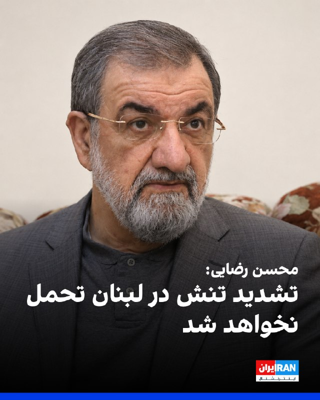

محسن رضایی، مشاور مجتبی خامنه‌ای، در شبکه ایکس نوشت: «تنگه هرمز تحت مدیریت ایران است. اجازه تداوم محاصره دریایی را نخواهیم داد و تشدید تنش در لبنان هم تحمل نخواهد شد.»

او افزود: «صبر نیروهای مسلح جمهوری اسلامی حدی دارد.»
‌🏁 🇬🇧 IranintlTV

🤖 @VahidOOnLine

## VahidOOnLine — post 243244

  

دفتر رسانه‌ای شاهزاده رضا پهلوی در واکنش به اعدام مهرداد محمدی‌نیا و اشکان ملکی، از معترضان دی‌ماه، از سوی جمهوری اسلامی، نوشت: مانند دیگر پرونده‌های سیاسی، جمهوری اسلامی بار دیگر «اعتراف» اجباری را به‌عنوان مدرک ارائه می‌کند؛ اعترافاتی که تحت فشار، ارعاب، شکنجه و بدون رعایت دادرسی عادلانه گرفته می‌شوند.

دفتر رسانه‌ای شاهزاده رضا پهلوی نوشت: نام آن‌ها نباید فراموش شود. جمهوری اسلامی را بابت جنایت‌های روزانه‌اش علیه مردم ایران پاسخگو خواهیم کرد.
‌🏁 🇬🇧 IranintlTV

🤖 @VahidOOnLine

## VahidOOnLine — post 243243

  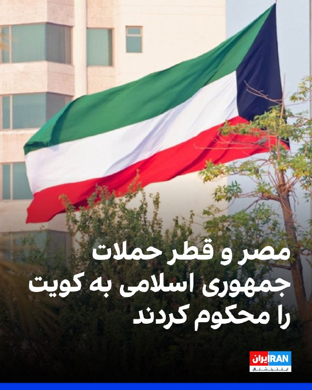

وزارت خارجه مصر با انتشار بیانیه‌ای که از سوی رسانه‌های عربی منتشر شد، اعلام کرد که حملات جمهوری اسلامی به کویت تنش‌ها را به سطحی خطرناک رسانده و امنیت و ثبات منطقه خلیج فارس را تهدید می‌کند.

وزارت خارجه قطر نیز در شبکه ایکس اعلام کرد: «حملات مکرر جمهوری اسلامی به کویت را به‌شدت محکوم می‌کنیم. این اقدامات نقض آشکار حاکمیت کویت و تخطی فاحش از قوانین بین‌المللی به شمار می‌رود.»
‌🏁 🇬🇧 IranintlTV

🤖 @VahidOOnLine

## VahidOOnLine — post 243242

  

سخنگوی وزارت دفاع اسرائیل محدودیت‌های دولت فرانسه علیه مقام‌ها و شرکت‌های اسرائیلی در نمایشگاه تسلیحاتی یوروساتوری را «شرم‌آور» توصیف کرد.

او افزود: «شرکت‌های دفاعی اسرائیلی شرکت‌کننده در یوروساتوری از سوی دولت فرانسه تنها مجاز به نمایش محصولات پدافند هوایی خواهند بود.»

سخنگوی وزارت دفاع اسرائیل ادامه داد که دولت فرانسه تصمیم گرفته مقام‌های اسرائیلی را از مشارکت رسمی در نمایشگاه دفاعی یوروساتوری در ماه جاری میلادی منع کند.
‌🏁 🇬🇧 IranintlTV

🤖 @VahidOOnLine

## VahidOOnLine — post 243241

  <a href="telegram/content/VahidOOnLine_243241_1780329119.mp4" target="_blank">🎬 Download video</a>

♦️انتشار ویدیوی جدیدی از فرو رفتن تهران در دود ناشی از حملات هوایی در جریان جنگ، توجه رسانه‌های بین‌المللی را جلب کرده است.
در این ویدیو که توسط شهروندان در یکی از بزرگراه‌های تهران ثبت شده است، ستون عظیمی از دود از ساختمانی در حال سوختن به آسمان برخاسته است.
پس از برقراری دوباره دسترسی به اینترنت در ایران، ایرانیان تصاویری از خسارات و لحظات پرتنش در جریان جنگ جمهوری اسلامی ایران و آمریکا و اسرائیل را در شبکه‌های اجتماعی منتشر می‌کنند.
‌🇸🇦 Indypersian

🤖 @VahidOOnLine

## VahidOOnLine — post 243240

  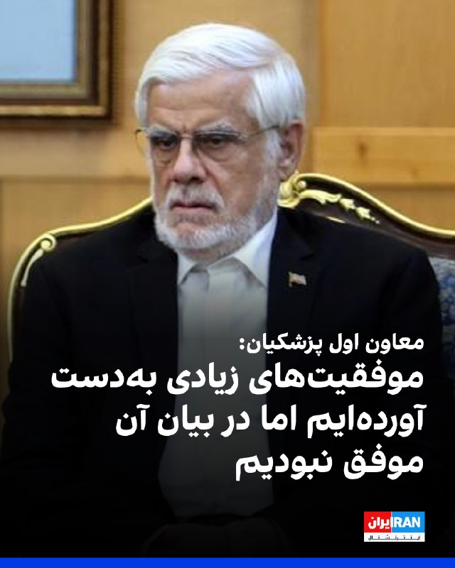

محمدرضا عارف، معاون اول پزشکیان، گفت که دیپلماسی کار سخت و پیچیده‌ای در احقاق حق جمهوری اسلامی در برابر زیاده‌خواهی دشمن دارد اما با وجود همه پیچیدگی‌ها و مشکلات، تیم مذاکره‌کننده تاکنون عملکرد خوبی داشته است.

او افزود موفقیت‌های متعددی در حوزه‌های مختلف در کشور حاصل شده اما در بیان روایت مناسب از این دستاوردها موفق نبوده‌ایم و همچنین نتوانسته‌ایم روایت خوب و درستی از جنگ نیز ارائه دهیم.

عارف اضافه کرد لازم است که رویکرد رسانه‌ای را در روایت از دو جنگ اخیر و اعتراضات دی ماه ۱۴۰۴ اصلاح کنیم.
‌🏁 🇬🇧 IranintlTV

🤖 @VahidOOnLine

## VahidOOnLine — post 243239

  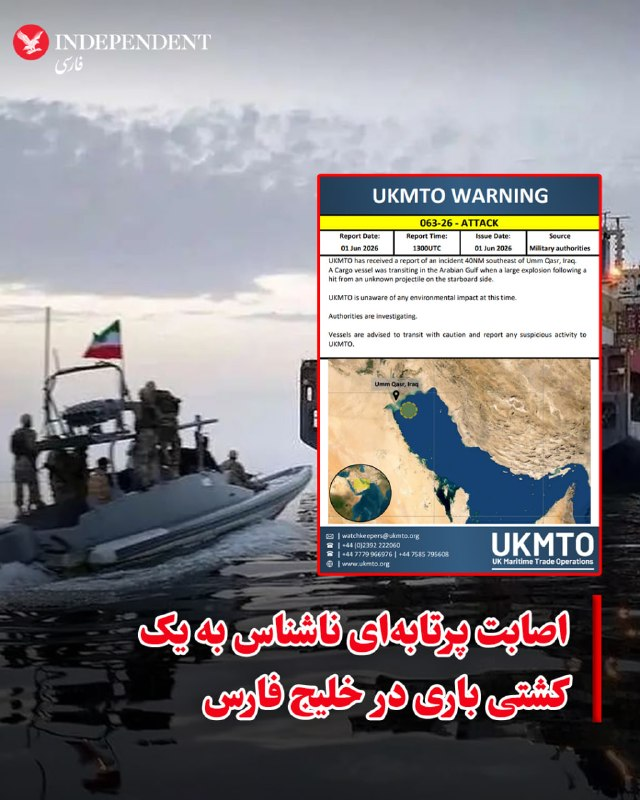

♦️همزمان با زبانه‌ کشیدن آتش تنش‌ها در منطقه خاورمیانه، سازمان عملیات تجارت دریایی بریتانیا (UKMTO) روز دوشنبه ۱۱ خرداد ماه اعلام کرد یک کشتی باری هنگام عبور از خلیج فارس، در فاصله حدود ۷۴ کیلومتری جنوب‌شرق بندر ام‌القصر عراق، هدف یک پرتابه ناشناس قرار گرفته است.
بر اساس هشدار منتشرشده از سوی این نهاد، پرتابه به سمت راست کشتی برخورد کرده و در پی آن انفجار بزرگی رخ داده است.
سازمان عملیات تجارت دریایی بریتانیا اعلام کرد در حال حاضر از هیچ‌گونه پیامد زیست‌محیطی ناشی از این حادثه آگاه نیست و تحقیقات درباره جزئیات آن ادامه دارد. این سازمان همچنین به کشتی‌های عبوری توصیه کرده است با احتیاط در منطقه تردد کرده و هرگونه فعالیت مشکوک را گزارش دهند.
هویت عامل این حمله، نوع پرتابه، میزان خسارت وارده به کشتی و وضعیت خدمه آن تاکنون اعلام نشده است.
‌🇸🇦 Indypersian

🤖 @VahidOOnLine

## VahidOOnLine — post 243238

  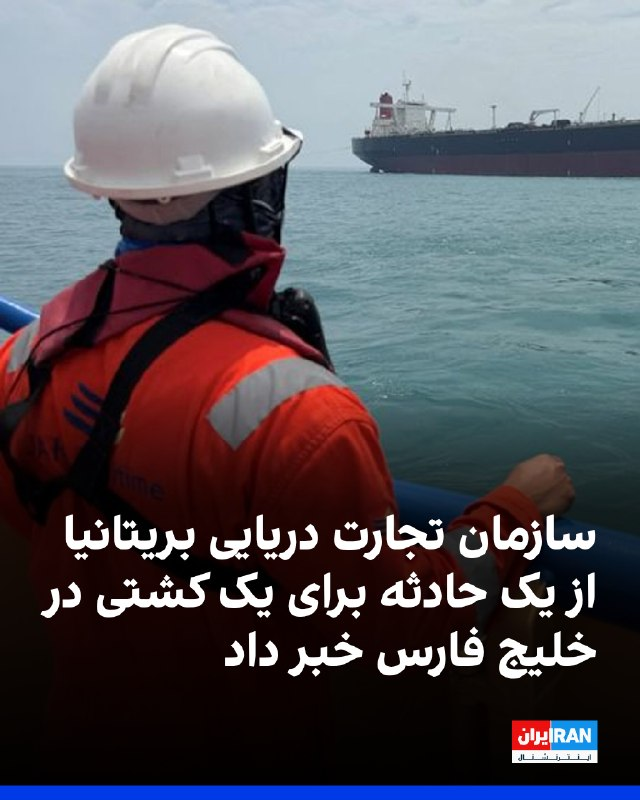

سازمان عملیات تجارت دریایی بریتانیا اعلام کرد دوشنبه ۱۱ خرداد، یک حادثه در ۷۴ کیلومتری جنوب‌شرق بندر ام‌القصر عراق رخ داده
بر اساس این گزارش، یک کشتی باری هنگام عبور از خلیج فارس پس از برخورد با پرتابه ناشناس، در سمت راست بدنه دچار انفجار شده است
‌🏁 🇬🇧 IranintlTV

🤖 @VahidOOnLine

## VahidOOnLine — post 243237

  <a href="telegram/content/VahidOOnLine_243237_1780329121.mp4" target="_blank">🎬 Download video</a>

♦️در پی وقوع انفجاری شدید در یک کارخانه تولید مواد آتش‌بازی در مالت، دو نفر زخمی شدند.
به گزارش خبرگزاری فرانسه، این حادثه صبح روز دوشنبه ۱۱ خرداد ماه در کارخانه آتش‌بازی «تا لوردس» در شمال جزیره کوچک مالت رخ داد. به گفته شاهدان، نخستین انفجار حدود ساعت ۶:۳۵ صبح روی داد و اندکی بعد انفجار قدرتمند دیگری به وقوع پیوست.
پلیس مالت اعلام کرد دو مرد که هنگام وقوع انفجار در زمین‌های کشاورزی مجاور مشغول کار بودند، دچار جراحات جزئی شدند. مقام‌ها همچنین گفتند در زمان حادثه هیچ کارگری در داخل کارخانه حضور نداشت.
رابرت آبلا، نخست‌وزیر مالت، با انتشار پیامی در شبکه‌های اجتماعی با آسیب‌دیدگان این حادثه ابراز همدردی کرد و گفت نیروهای امدادی بلافاصله پس از وقوع انفجار به محل اعزام شده‌اند.
‌🇸🇦 Indypersian

🤖 @VahidOOnLine

## VahidOOnLine — post 243236

  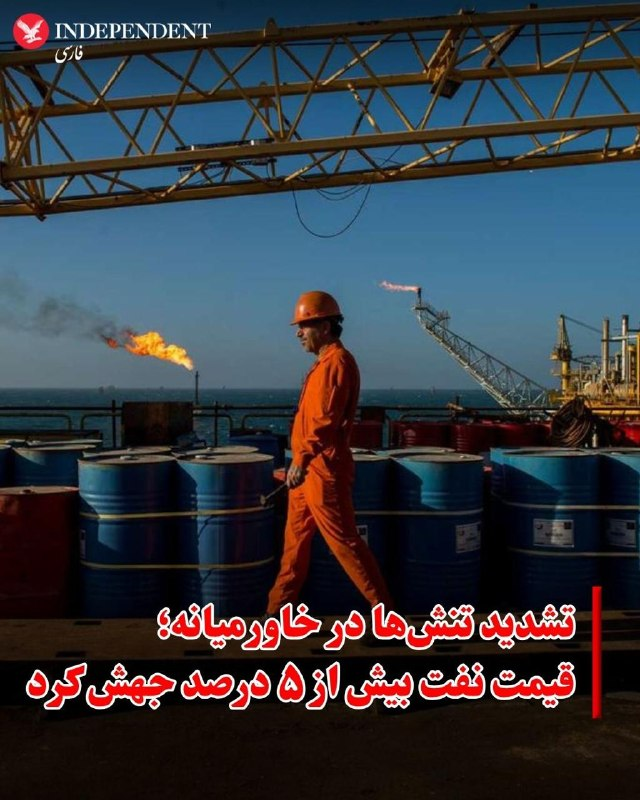

♦️در پی اعلام خبرگزاری تسنیم مبنی بر توقف «گفتگوها و تبادل متون از طریق میانجی» میان تهران و واشنگتن، بهای جهانی نفت بیش از ۵ درصد افزایش یافت و به بالاترین سطح خود در هفته‌های اخیر رسید.

به گزارش خبرگزاری فرانسه، در معاملات بعدازظهر دوشنبه، قیمت نفت برنت دریای شمال برای تحویل در ماه اوت با ۴.۹ درصد افزایش به ۹۵ دلار و ۶۰ سنت در هر بشکه رسید. بهای این شاخص نفتی در مقطعی از معاملات بیش از ۵ درصد رشد کرده بود.

همچنین نفت خام وست تگزاس اینترمدیت (WTI) آمریکا برای تحویل در ماه ژوئیه با ۵.۹ درصد افزایش به ۹۲ دلار و ۵۵ سنت در هر بشکه رسید.

خبرگزاری تسنیم،‌ وابسته به سپاه پاسداران، پیش‌تر به نقل از منابع آگاه گزارش داده بود ایران در اعتراض به ادامه حملات اسرائیل در لبنان، روند تبادل پیام‌ها با آمریکا را متوقف می‌کند و تا زمان تحقق خواسته‌های تهران و گروه‌های هم‌پیمانش، گفتگویی در کار نخواهد بود.
‌🇸🇦 Indypersian

🤖 @VahidOOnLine

## VahidOOnLine — post 243235

  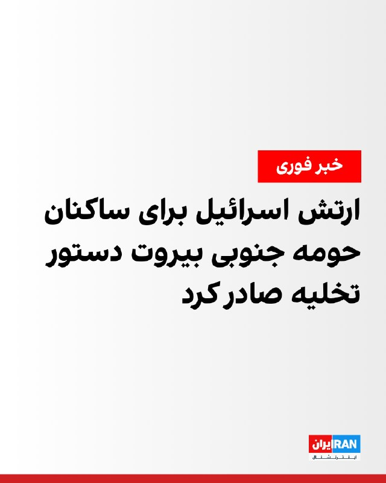

ارتش اسرائیل در بیانیه‌ای به ساکنان منطقه ضاحیه در جنوب بیروت هشدار داد و از آن‌ها خواست برای حفظ جان خود این منطقه را تخلیه کنند.
در این بیانیه آمده است اگر حزب‌الله به شلیک راکت به سوی شهرها و شهرک‌های اسرائیل ادامه دهد، ارتش اسرائیل اهدافی را در ضاحیه جنوبی هدف قرار خواهد داد.
در ادامه تاکید شده است دولت اسرائیل با مردم لبنان در حال جنگ نیست، بلکه با سازمان تروریستی حزب‌الله می‌جنگد.
‌🏁 🇬🇧 IranintlTV

🤖 @VahidOOnLine

## VahidOOnLine — post 243234

  <a href="telegram/content/VahidOOnLine_243234_1780329124.mp4" target="_blank">🎬 Download video</a>

♦️سیمین غانم، خواننده نام‌ آشنای موسیقی ایران، شامگاه یکشنبه دهم خرداد ماه در پاریس، مهمان افتخاری تور کنسرت «هزاردستان» بود. برنامه‌ای فرهنگی که به مناسبت هشتصدمین سالگرد سعدی شیرازی برگزار می‌شود.
تور گروه «هزار دستان»، با آهنگسازی و رهبری آرش فولادوند و همراهی گروه کر بهار و ارکستر فیلارمونیک پاریس شرقی، یکشنبه شب آغاز شد. برگزارکنندگان این رویداد فرهنگی می‌گویند «هزاردستان» تلاشی برای پیوند موسیقی ایرانی با میراث ادبی سعدی و معرفی آن به مخاطبان ایرانی و بین‌المللی است.
آرش فولادوند، رهبر ارکستر و آهنگساز این رویداد موسیقیایی، از چهره‌های فعال موسیقی ایرانی در فرانسه است که در سال‌های اخیر چند برنامه فرهنگی و ارکسترال را با محوریت موسیقی و ادبیات فارسی در اروپا اجرا کرده است.
‌🇸🇦 Indypersian

🤖 @VahidOOnLine

## VahidOOnLine — post 243233

  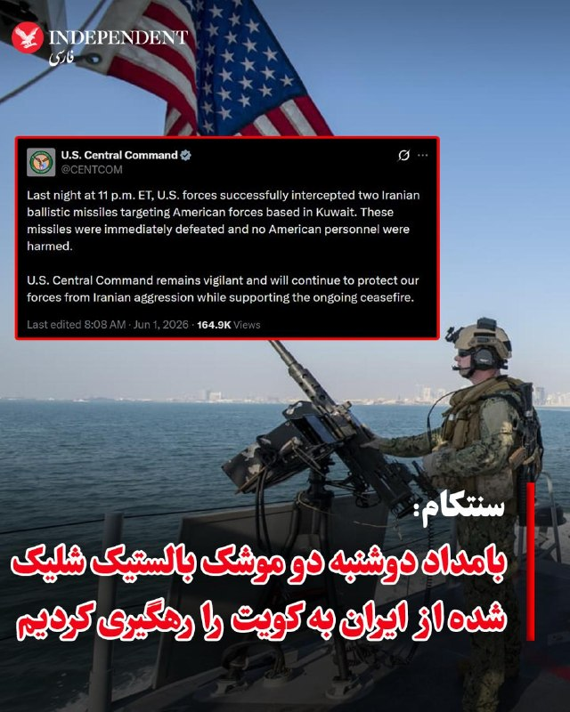

♦️ستاد فرماندهی مرکزی ایالات متحده (سنتکام) روز دوشنبه ۱۱ خرداد ماه اعلام کرد نیروهای آمریکایی بامداد دوشنبه دو موشک بالستیک شلیک‌شده از سوی ایران را که نیروهای آمریکایی مستقر در کویت را هدف قرار داده بودند، رهگیری و منهدم کردند.
سنتکام در پیامی در شبکه اجتماعی ایکس نوشت این دو موشک ساعت ۱۱ شب به وقت شرق آمریکا به سوی نیروهای آمریکایی در کویت شلیک شدند، اما بلافاصله رهگیری و خنثی شدند و هیچ‌یک از نیروهای آمریکایی آسیبی ندیدند.
فرماندهی مرکزی آمریکا در ادامه با تاکید بر آنکه همچنان از آتش‌بس جاری حمایت می‌کند نوشت: نیروهای آمریکایی در آماده‌باش قرار دارند و به حفاظت در برابر «تجاوزگری ایران» ادامه خواهند داد.
این تحولات در حالی رخ می‌دهد که بامداد روز دوشنبه به وقت محلی، سنتکام از انجام حملات «دفاعی» به پایگاه‌های راداری و مراکز فرماندهی و کنترل پهپادهای ایران در منطقه گروگ شهرستان سیریک و جزیره قشم خبر داده بود.
خبرگزاری دولتی کویت نیز بامداد دوشنبه از فعال شدن پدافند هوایی این کشور برای مقابله با حملات موشکی و پهپادی و به صدا درآمدن آژیرهای خطر در سراسر کشور خبر داد. سپاه پاسداران پس از این اطلاعیه اعلام کرد در واکنش به «حمله آمریکا به یک دکل مخابراتی در منطقه سیریک»، مبدا این حمله را هدف قرار داده است. هفته گذشته نیز پس از حمله‌ای در شرق بندرعباس، کویت از رهگیری موشک‌ها و پهپادها خبر داده بود و سپاه پاسداران اعلام کرد مبدا آن حمله را هدف قرار داده است.
‌🇸🇦 Indypersian

🤖 @VahidOOnLine

## VahidOOnLine — post 243232

  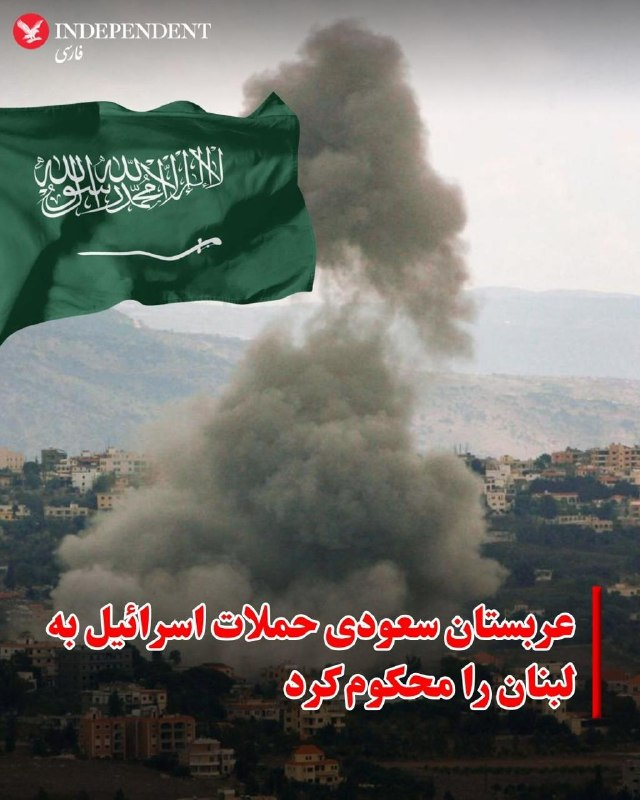

♦️وزارت خارجه عربستان سعودی، روز دوشنبه ۱۱ خرداد ماه، با انتشار بیانیه‌ای حملات اسرائیل به لبنان را محکوم و با ورود نیروهای اسرائیلی به خاک لبنان و نقض حاکمیت این کشور مخالفت کرد.

در بیانیه وزارت خارجه عربستان سعودی آمده است، ریاض از جامعه جهانی می‌خواهد «مسئولیت خود را برای توقف این تجاوز و پایان دادن به اقدامات نظامی اسرائیل با هدف گسترش حضور در خاک لبنان» ایفا کند.
عربستان سعودی همچنین بر «لزوم حفاظت از حاکمیت لبنان و مردم این کشور مطابق توافق‌ها و قطعنامه‌های بین‌المللی مرتبط» تاکید کرد.

وزارت خارجه سعودی در ادامه با اشاره به توافق طائف، بر اهمیت پایبندی به این توافق برای تضمین اعمال حاکمیت دولت لبنان بر تمام خاک این کشور تاکید کرد و خواستار اجرای تصمیمات دولت لبنان برای محدود کردن سلاح به دولت و نهادهای قانونی آن شد.

توافق طائف (Taif Agreement) توافقی است که در سال ۱۹۸۹ در شهر طائف عربستان سعودی میان گروه‌های سیاسی لبنان امضا شد و به جنگ داخلی ۱۵ ساله لبنان (۱۹۷۵ تا ۱۹۹۰) پایان داد.

ریاض اعلام کرد که اجرای این اقدامات می‌تواند به بازگشت امنیت و ثبات به لبنان و مردم این کشور کمک کند.
‌🇸🇦 Indypersian

🤖 @VahidOOnLine

## VahidOOnLine — post 243231

🗣روایت شما از بحران اقتصادی و زندگی در آتش‌بس- دوشنبه ۱۱ خرداد:

🔹من فقط ۱۵ سالمه اما مثل باقی مردم مضطربم و ناراحتم. وضعیت روان جامعه خیلی نگران کننده‌ست. تو ایران بچه ۶ ساله کلاس اولی درک کاملی از تورم و گرونی داره. با همه این فشارها، باور دارم آزادی نزدیکه.

🔹از اندیمشک: انقدر همه چی گرونه و دخل و خرج باهم نمی‌خونه که دیگه حتی نمی‌صرفه سر کار بری. نه راه پس داریم، نه راه پیش.

🔹قیمت پیش خرید قبر در باغ رضوان اصفهان حداقل ۱۷ میلیون و حداکثر ۹۰ میلیون تومان است.

🔹یک کیسه برنج ۳ میلیون و نیم شده، مرغ و گوشت که به آرزوها پیوسته. همه‌چی صد برابر گران‌تر شده.

🔹از پردیس: اینجا حاشیه شهر است، برهوت واقعی. اما خانه به قدری گران شده که جمعیت مهاجر که اکثرا از تهران آمده‌اند توان پرداخت اجاره خانه ندارند.

🔹می‌خوام به مردم بگم کم نیارین، مقاومت کنین، به کار و بارتون برسین، اعتراض خودتون رو به نحوه‌ درستش انجام بدین، درست می‌شه همه‌چی. حتی توی این وضعیت دست از آرزو‌هاتون بر ندارین.

🔹از زاهدان: هر روز چند ساعت برق رو قطع می‌کنن. روزها که کلا آب نداریم. اطراف بلوچستان هم فقر سنگینه. ما با این گرونی با این فشار جمهوری اسلامی اصلا نمی‌تونیم زندگی کنیم. آدم‌های تصادفی رو می‌بینی که دارن گریه می‌کنن.

🔹من در کارخانه کنسانتره آهن فولاد نطنز مشغول بودم و به علت ناتوانی مالی مالک کارخانه اخراج شدم. ۴ ماهه مطالباتم رو پرداخت نکردن. از طرفی در این اوضاع نه جنگ نه صلح، کار هم پیدا نمی‌شه و برای تامین مخارج خانه به مشکل خوردم.

🔹روغن موتور ماشین عوض کردم شد ۳ میلیون و ۵۵۰ هزار تومان. یک خرید سوپرمارکتی شامل ۳ تا دوغ، یک مرغ و یک بستنی شد یک میلیون تومان.

🔹یک کیلو زردآلو، یک کیلو گوجه سبز و یک کیلو هلو شد یک میلیون و ۳۰۰ هزار تومان. واقعا خجالت کشیدم. همه‌شان با هم ۴۰ ‌دانه هم نشده بودند.

🔹دیگه باشگاه رفتن و سالم زندگی کردن هم آرزو شده، شهریه روزانه عادی‌ترین باشگاه به ۱۲۰ هزار تومان رسیده و ماهانه به ۲ میلیون تومان.

🔹به خاطر خبرهای کمبود دارو رفتم داروخانه تا برای ۳ ماه آینده دارو تهیه کنم، ۴ قلم دارو برای ۳ ماه قیمتش شد حدودا ۶ میلیون تومان.

🔹۲ ورق کپسول اوسلتامیویر و ۲ ورق ژلوفن شده ۷۰۰ هزار تومان. مهندس عمران هستم، بعد از جنگ بیکار شدم و الان به‌عنوان پیک موتوری کار می‌کنم. در این گرما روزی نهایت ۹۰۰ هزار تومان درآمد دارم.
‌🏁 🇬🇧 IranintlTV

🤖 @VahidOOnLine

## VahidOOnLine — post 243230

  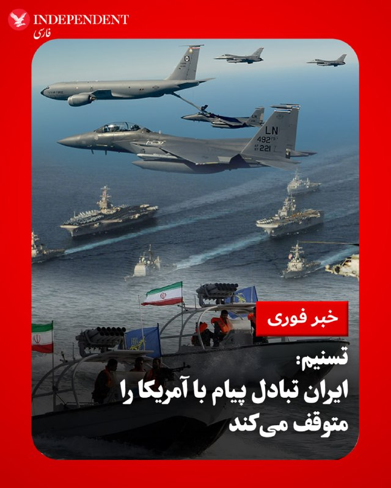

♦️خبرگزاری تسنیم، وابسته به سپاه پاسداران، روز دوشنبه ۱۱ خرداد ماه، به نقل از «منابع آگاه» گزارش داد جمهوری اسلامی ایران در اعتراض به ادامه عملیات نظامی اسرائیل در لبنان، روند «گفتگوها و تبادل متون از طریق میانجی» با آمریکا را متوقف خواهد کرد.
بر اساس این گزارش، مقام‌های جمهوری اسلامی ایران معتقدند آتش‌بسی که پیش‌تر درباره آن توافق شده بود، از جمله در جبهه لبنان، نقض شده است. به گفته این منبع، توقف عملیات نظامی اسرائیل در غزه و لبنان و همچنین خروج کامل نیروهای اسرائیلی از مناطق اشغالی لبنان از جمله شروط مورد تاکید تهران برای آتش‌بس بوده است.
خبرگزاری تسنیم که به عنوان منبعی برای بازتاب دیدگاه‌ هسته‌های نزدیک به قدرت در ایران شناخته می‌شود، در ادامه نوشت: تا زمانی که خواسته‌های ایران و «محور مقاومت» تامین نشود، روند گفتگوها از سر گرفته نخواهد شد.
این خبرگزاری در ادامه به نقل از منابع خود مدعی شد ایران و گروه‌های هم‌پیمانش در حال بررسی اقداماتی از جمله «انسداد کامل تنگه هرمز» و فعال کردن سایر جبهه‌ها از جمله تنگه باب‌المندب در واکنش به اقدامات اسرائیل و حامیان آن هستند.
‌🇸🇦 Indypersian

🤖 @VahidOOnLine

## VahidOOnLine — post 243228

  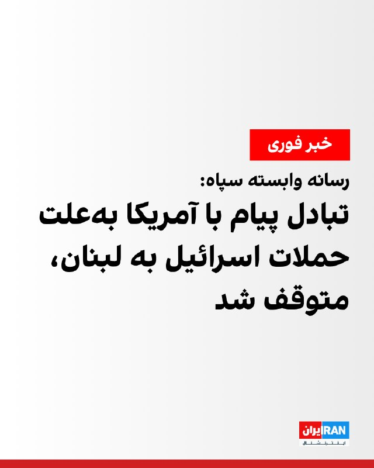

خبرگزاری تسنیم، وابسته به سپاه پاسداران، گزارش داد که با توجه به ادامه حملات اسرائیل به لبنان و اینکه لبنان جزو پیش شرط‌های آتش‌بس بوده است، تیم مذاکره‌کننده جمهوری اسلامی «گفت‌وگوها و تبادل متون از طریق میانجی» را متوقف می‌کند.

تسنیم افزود «جبهه مقاومت» و جمهوری اسلامی عزم خود را برای انسداد کامل تنگه هرمز، و فعال کردن سایر جبهه‌ها از جمله تنگه باب‌المندب، در دستور کار قرار داده‌اند.
‌🏁 🇬🇧 IranintlTV

🤖 @VahidOOnLine

## VahidOOnLine — post 243227

  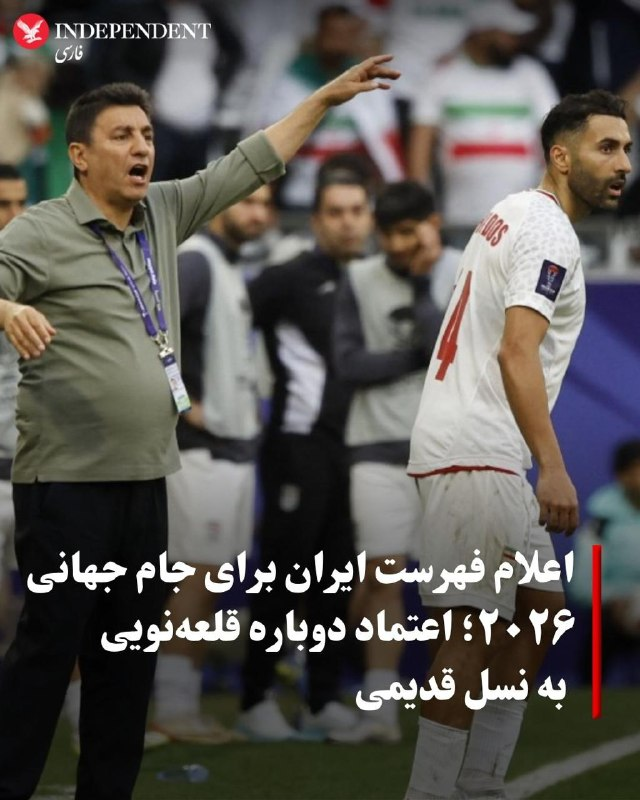

♦️امیر قلعه‌نویی، سرمربی تیم فوتبال ایران، روز دوشنبه ۱۱ خرداد، در فاصله ۱۰ روز مانده تا آغاز جام جهانی ۲۰۲۶، فهرست نهایی ۲۶ نفره تیمش برای حضور در این رقابت‌ها را اعلام کرد. در حالی که هنوز ویزای آمریکا و مکزیک برای اعضای کاروان ایران صادر نشده است، با تصمیم قلعه‌نویی، کسری طاهری، امیرحسین محمودی و هادی حبیبی‌نژاد، سه بازیکن جوان حاضر در اردوهای اخیر تیم ملی، از سفر به قاره آمریکا بازماندند تا میانگین سنی این تیم بار دیگر افزایش یابد.

بر اساس فهرست اعلام‌شده، علیرضا بیرانوند، حسین حسینی و پیام نیازمند در درون دروازه، احسان حاج‌صفی، میلاد محمدی، علی نعمتی، دانیال ایری، شجاع خلیل‌زاده، محمدحسین کنعانی‌زادگان، صالح حردانی و رامین رضاییان در خط دفاع، علیرضا جهانبخش، سعید عزت‌اللهی، روزبه چشمی، امیرمحمد رزاق‌نیا، آریا یوسفی، محمد محبی، مهدی قایدی، سامان قدوس، محمد قربانی و مهدی ترابی در خط میانی و علی علیپور، شهریار مغانلو، دنیس درگاهی، امیرحسین حسین‌زاده و مهدی طارمی در خط حمله حضور خواهند داشت.
‌🇸🇦 Indypersian

🤖 @VahidOOnLine

## VahidOOnLine — post 243226

  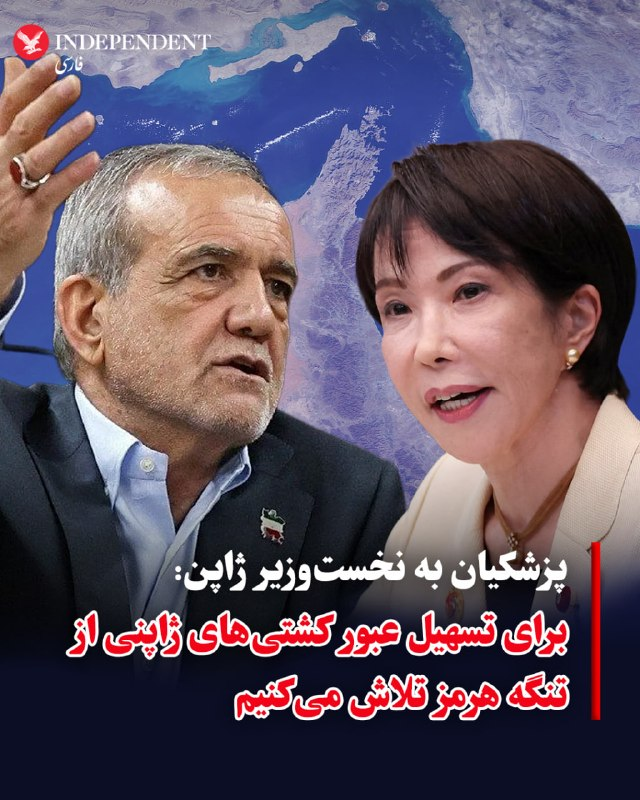

♦️مسعود پزشکیان، رئیس‌جمهوری ایران، روز دوشنبه دهم خرداد ماه در گفتگوی تلفنی با سانائه تاکایچی، نخست‌وزیر ژاپن، ضمن تاکید بر آمادگی تهران برای تسهیل تردد دریایی، گفت جمهوری اسلامی تلاش خواهد کرد مسیر عبور کشتی‌های ژاپنی «بدون مشکل و با سهولت بیشتری» فراهم شود.
به گزارش رسانه‌های رسمی ایران، پزشکیان در این تماس تلفنی با اشاره به تحولات منطقه به تاکایچی گفت ایران همواره دیپلماسی را موثرترین راهکار برای حل مسائل دانسته است، اما به گفته او، آمریکا با عدول از تعهدات خود و همچنین اقدامات «بی‌ثبات‌کننده» اسرائیل، روندهای دیپلماتیک را با چالش مواجه کرده‌اند.
رئیس‌جمهوری ایران همچنین نقض مکرر آتش‌بس در لبنان، ادامه آوارگی شهروندان لبنانی و حمایت‌های سیاسی و نظامی آمریکا از اسرائیل را «نگران‌کننده» توصیف کرد.
پزشکیان با تاکید بر آمادگی کامل ایران برای تسهیل عبور و مرور دریایی، گفت مشکل اصلی در این زمینه ناشی از محدودیت‌ها و موانعی است که آمریکا علیه کشتیرانی و تجارت ایران اعمال کرده است.
‌🇸🇦 Indypersian

🤖 @VahidOOnLine

## WithYashar — post 13151

ارتش اسرائیل: به سراسر لبنان از ضاحیه گرفته تا صور حمله می‌کنیم
@withyashar

## WithYashar — post 13150

وزارت کشور کویت به ساکنان خود هشدار داد که در انتظار حمله قریب‌الوقوع ایران در مکان‌های امن بمانند
@withyashar

## WithYashar — post 13149

🚨🚨🚨🚨🚨🚨
تسنیم: مذاکرات با آمریکا کاملا متوقف شد!

ایران خواستار توقف کامل تمام عملیات‌ها در غزه و لبنان برای از سرگیری مذاکرات با آمریکا است.

همچنین ایران به میانجی ها اعلام کرده است که بستن کامل تنگه هرمز و همچنین تنگه باب المندب را در دستور کار قرار داده است
@withyashar

## WithYashar — post 13148

تسنیم: ایران تبادل پیام با آمریکا را در اعتراض به جنایات اسرائیل در لبنان متوقف می‌کند.
@withyashar

## WithYashar — post 13147

بعضی رسانه ها مدعی شد تا ساعتی دیگر، پاسخ نقض آتش بس توسط جمهوری اسلامی ایران با حمله گسترده به رژیم صهیونیستی، داده خواهد شد.
@withyashar

## WithYashar — post 13146

  

صداسیما طی خبری فوری:

نیروهای مسلح : حمله متوقف نکنن علیه لبنان ماهم حمله میکنیم
@withyashar

## WithYashar — post 13145

فرماندهی مرکزی ایالات متحده (سنتکام) اعلام کرده است که دو موشک بالستیک رژیم جمهوری اسلامی دیشب ساعت ۱۱ شب به وقت شرقی(۶:۳۰ صبح تهران)به سمت نیروهای آمریکایی در کویت شلیک شده است. موشک‌های ورودی سرنگون شدند و هیچ آسیبی به پرسنل آمریکایی وارد نشد.
@withyashar

## WithYashar — post 13144

## WithYashar — post 13143

  <a href="telegram/content/WithYashar_13143_1780329130.mp4" target="_blank">🎬 Download video</a>

گزارش فاکس نیوز از چند حمله آمریکا به قشم !
@withyashar

## WithYashar — post 13142

تانکرترکرز: چهار نفتکش ایرانی با محموله هفت میلیون بشکه‌ای به ایران بازگردانده شدند و نتوانستند محاصره آمریکا را بشکنن
@withyashar

## WithYashar — post 13141

عراقچی: آتش‌بس میان ایران و ایالات متحده، بدون هیچ ابهامی، آتش‌بسی در تمامی جبهه‌ها، از جمله لبنان، محسوب می‌شود.
نقض این آتش‌بس در هر یک از جبهه‌ها، به منزله نقض آن در تمامی جبهه‌ها است.
ایالات متحده و اسرائیل مسئول پیامدهای هرگونه نقض این آتش‌بس خواهند بود.
@withyashar

## WithYashar — post 13140

  <a href="telegram/content/WithYashar_13140_1780329132.mp4" target="_blank">🎬 Download video</a>

کوچ جمعی مردم بیروت پس از هشدار اسرائیل به بمباران
@withyashar

## WithYashar — post 13139

علیرضا فغانی به اولین داور تاریخ تبدیل شد که در ۴ جام جهانی قضاوت میکند
@withyashar

## WithYashar — post 13138

اتاق جنگ با یاشار : اولین پرواز بازگشت زائران حج تمتع امروز ۱۱ خرداد ساعت ۱۶:۳۰ در مشهد به زمین می‌نشیند این عملیات ۱۱ روز دیگر ادامه دارد و در ۲۲ خرداد «جمعه» آخرین پرواز بازگشت انجام میشود , ۲۲ خرداد جمعه هفته دیگر ۲ روز قبل از‌ تولد دونالد ترامپ است و شب…

## WithYashar — post 13137

اتاق جنگ با یاشار : اولین پرواز بازگشت زائران حج تمتع امروز ۱۱ خرداد ساعت ۱۶:۳۰ در مشهد به زمین می‌نشیند این عملیات ۱۱ روز دیگر ادامه دارد و در ۲۲ خرداد «جمعه» آخرین پرواز بازگشت انجام میشود , ۲۲ خرداد جمعه هفته دیگر ۲ روز قبل از‌ تولد دونالد ترامپ است و شب آن مارکت هم برای آخر هفته بسته میشود
@withyashar
همچنین یک هفته بعد از آن یک آخر هفته طولانی داریم چون جمعه هم تعطیلی رسمی فدرال است جونتینث «روز پایان برده داری در آمریکا»۱۹ جوئن ۲۹ خرداد

## mwarmonitor — post 9984

توقف مذاکرات: اندکی پس از بیانیه عراقچی، خبرگزاری تسنیم به نقل از مقامات ایرانی تاکید کرد که تا زمانی که اسرائیل حملات خود را در لبنان متوقف نکند، هیچ مذاکره‌ای با آمریکا انجام نخواهد شد.
تهدید به تلافی: گزارش تسنیم همچنین حاکی از آن بود که ایران و «محور مقاومت» آماده تلافی در تنگه هرمز و «فعال کردن جبهه‌های دیگر» از جمله تنگه باب‌المندب در دریای سرخ هستند

@mwarmonitor

## mwarmonitor — post 9983

🔴مقامات لبنانی به آمریکا: حزب‌الله آماده آتش‌بس کامل با اسرائیل است

📝نویسنده: باراک راوید AXIOS

🔰علی حمدان، مشاور ارشد نبیه بری (رئیس پارلمان لبنان)، به آکسیوس گفت که نبیه بری روز یکشنبه به دولت ترامپ اعلام کرده است که حزب‌الله برای یک آتش‌بس کامل و فوری با اسرائیل آمادگی دارد و متعهد شده که اجرای آن را تضمین کند.

🔸چرا این موضوع اهمیت دارد؟
درگیری‌ها در لبنان رو به افزایش است و احتمال آسیب دیدن فرصت‌های دستیابی به توافقی برای پایان دادن به جنگ با ایران را بالا برده است؛ به‌ویژه اکنون که بنیامین نتانیاهو، نخست‌وزیر اسرائیل، تهدید به حمله به بیروت کرده است.

خبرگزاری نیمه‌رسمی تسنیم ایران روز دوشنبه گزارش داد که تیم مذاکره‌کننده ایران در اعتراض به اقدامات اسرائیل در لبنان، تبادل پیام با آمریکا از طریق واسطه‌ها را متوقف کرده است.
جزئیات بیشتر (نمای نزدیک)
نبیه بری یکی از قدرتمندترین سیاستمداران شیعه در لبنان است و روابط نزدیکی با حزب‌الله دارد؛ اگرچه مقامات آمریکایی و اسرائیلی تردید دارند که او واقعاً بتواند پایبندی حزب‌الله را تضمین کند.
وضعیت میدانی: اگر حزب‌الله واقعاً آماده آتش‌بس کامل باشد، چنین آتش‌بسی اشغال جنوب لبنان توسط اسرائیل را فعلاً به همان شکل باقی می‌گذارد، اما در عین حال می‌تواند میدان جنگ لبنان را از جنگ با ایران تفکیک و جدا کند.
موضع آمریکا: با این حال، به گفته یک منبع آگاه، مقامات آمریکایی به بری گفته‌اند که فکر نمی‌کنند نتانیاهو با این پیشنهاد موافقت کند.
موضع اسرائیل: یک مقام اسرائیلی تأیید کرد که حزب‌الله بدون درخواست خروج فوری اسرائیل، آمادگی خود را برای آتش‌بس کامل ابراز کرده است. وزارت امور خارجه آمریکا هنوز به درخواست‌ها برای اظهار نظر پاسخ نداده است.
اظهارات علی حمدان (مشاور نبیه بری)
«من روز یکشنبه با مایکل عیسی، سفیر آمریکا در بیروت تماس گرفتم و به نیابت از رئیس پارلمان، آقای بری، به او گفتم که حزب‌الله آماده تعهد کامل به یک آتش‌بس جامع است و ما حاضر به تضمین آن هستیم.»
حمدان تأیید کرد که دولت ترامپ در آخر هفته پیشنهاد یک آتش‌بس ناامیدکننده و جزئی را داده بود؛ پیشنهادی که بر اساس گزارش آکسیوس، از حزب‌الله می‌خواست حملات به شمال اسرائیل را متوقف کند و در مقابل، اسرائیل نیز متعهد می‌شد به بیروت حمله نکند. با این حال، او توصیف یک مقام آمریکایی را که پاسخ بری را «طفره‌آمیز و ناامیدکننده» خوانده بود، رد کرد.
نقطه اختلاف:
حمدان گفت:
«پیشنهادی که دریافت کردیم این بود که حزب‌الله به شمال اسرائیل حمله نکند و در مقابل اسرائیل بیروت را بمباران نکند و سپس آتش‌بس به تدریج به مناطق دیگر گسترش یابد. پاسخ رئیس بری این بود: "چرا آتش‌بس جزئی؟ بیایید یک آتش‌بس کامل داشته باشیم."»
بری پیشنهاد یک آتش‌بس همه‌جانبه در زمین، هوا و دریا را داد که بر اساس آن اسرائیل نیز باید تخریب خانه‌ها در جنوب لبنان را متوقف کند. حمدان ادعا کرد که بری کانال ارتباطی با حزب‌الله دارد که به او اجازه می‌دهد با نعیم قاسم، رهبر این گروه که در مخفیگاه به سر می‌برد، پیام مبادله کند.
او افزود: «ما مطمئن هستیم که حزب‌الله به آتش‌بس کامل پایبند خواهد بود. فکر می‌کنیم این اقدام سازنده‌تر است. می‌دانیم که زمان رو به اتمام است.»
وضعیت کنونی
آمریکا چندین هفته است که به عنوان بخشی از یک تلاش گسترده‌تر برای کاهش تنش، اسرائیل را از حمله به بیروت برحذر داشته است، اما یک مقام آمریکایی روز یکشنبه اشاره کرد که ممکن است این موضع تعدیل شود. این مقام به آکسیوس گفت: «آمریکا انتظار ندارد که اسرائیل حملات مداوم یک سازمان تروریستی به غیرنظامیانش را تحمل کند.»
روز دوشنبه، نتانیاهو بیانیه مشترکی با وزیر دفاع، یسرائيل کاتس، صادر کرد و در آن تهدید کرد که «در پی نقض مکرر آتش‌بس» توسط این شبه‌نظامیان شیعه، اهداف حزب‌الله را در منطقه ضاحیه بیروت بمباران خواهد کرد. آنها اعلام کردند که این منطقه محل استقرار «مقر تروریستی» حزب‌الله است و دیگر نمی‌تواند «مصون از حمله» باقی بماند.
ارتش دفاعی اسرائیل (IDF) نیز بعداً بیانیه‌ای به زبان عربی صادر کرد و از «تمامی ساکنان منطقه ضاحیه در بیروت خواست تا برای حفظ امنیت خود، آنجا را تخلیه کنند.» در این بیانیه آمده است: «اگر حزب‌الله به شلیک به سمت شهرها و شهرک‌های ما ادامه دهد، ارتش اسرائیل با حمله به اهداف تروریستی در ضاحیه پاسخ خواهد داد.»
مواردی که باید زیر نظر داشت
عباس عراقچی، وزیر امور خارجه ایران، در شبکه اجتماعی X هشدار داد که اقدامات اسرائیل در لبنان نقض آتش‌بس میان آمریکا و ایران است و آمریکا و اسرائیل «عواقب هرگونه نقض توافق» را متحمل خواهند شد.

## mwarmonitor — post 9982

🚨 آژیر خطر قرمز و هشدار نفوذ پهپاد در نوار ساحلی، شمال نهاریا، برای دومین بار در ۳۰ دقیقه گذشته فعال شد.‌i24 NEWS

@mwarmonitor

## mwarmonitor — post 9981

  <a href="telegram/content/mwarmonitor_9981_1780329134.mp4" target="_blank">🎬 Download video</a>

🔴 گزارش‌هایی از انفجار نامشخص در کشتی عظیم MSC SARISKY V در خور عبدالله پس از تکمیل تخلیه محموله در بندر ام‌القصر در جنوب عراق منتشر شده است. @mwarmonitor

## mwarmonitor — post 9980

🔴فاکس‌نیوز: به گزارش رسانه‌های دولتی ایران، تهران تمام ارتباطات و پیام‌های دیپلماتیک با ایالات متحده را به حالت تعلیق درآورده است. گفته می‌شود این تصمیم در پی مخالفت ایران با حملات اسرائیل علیه حزب‌الله اتخاذ شده است. @mwarmonitor

## mwarmonitor — post 9979

🔴فاکس‌نیوز: به گزارش رسانه‌های دولتی ایران، تهران تمام ارتباطات و پیام‌های دیپلماتیک با ایالات متحده را به حالت تعلیق درآورده است. گفته می‌شود این تصمیم در پی مخالفت ایران با حملات اسرائیل علیه حزب‌الله اتخاذ شده است.

@mwarmonitor

## mwarmonitor — post 9978

  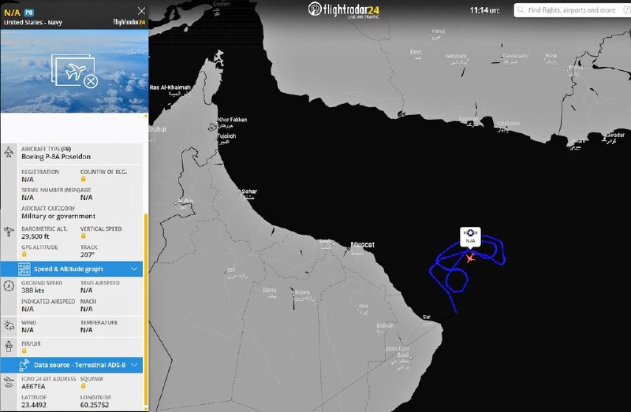

✈️یک هواپیمای گشت دریایی P-8A پوسایدون نیروی دریایی ایالات متحده در حال حاضر بر فراز دریای عرب و خلیج عمان در حال عملیات است و به‌احتمال زیاد شناورهای مشکوک مرتبط با ایران را تحت نظر دارد.

@mwarmonitor

## mwarmonitor — post 9977

🔴شب گذشته ساعت ۱۱ شب به وقت شرق آمریکا (ET)، نیروهای ایالات متحده با موفقیت دو موشک بالستیک ایرانی را که نیروهای آمریکایی مستقر در کویت را هدف قرار داده بودند، رهگیری و منهدم کردند. این موشک‌ها بلافاصله خنثی شدند و هیچ‌یک از نیروهای آمریکایی آسیبی ندیدند.

🔸فرماندهی مرکزی ایالات متحده همچنان در حالت آماده‌باش باقی می‌ماند و به حفاظت از نیروهای خود در برابر اقدامات تهاجمی ایران ادامه خواهد داد، در عین حال که از آتش‌بس جاری حمایت می‌کند.

@mwarmonitor

## mwarmonitor — post 9976

  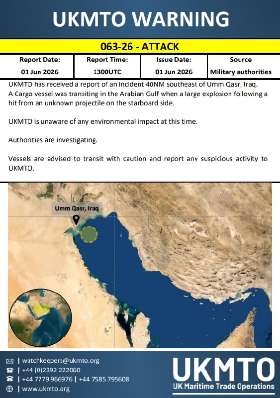

🔴 گزارش‌هایی از انفجار نامشخص در کشتی عظیم MSC SARISKY V در خور عبدالله پس از تکمیل تخلیه محموله در بندر ام‌القصر در جنوب عراق منتشر شده است.

@mwarmonitor

## mwarmonitor — post 9975

  <a href="telegram/content/mwarmonitor_9975_1780329138.mp4" target="_blank">🎬 Download video</a>

✈️تجمع قابل‌توجه هواپیماهای سوخت رسان آمریکا در فرودگاه بن‌گوریون، تل‌آویو، اسرائیل

@mwarmonitor

## mwarmonitor — post 9974

🔴خبرنگار فاکس نیوز- تِرِی یینگست از تل‌آویو

🔸بله بچه‌ها، صبح بخیر. سنتکام (فرماندهی مرکزی آمریکا) می‌گوید نیروهای آمریکایی در طول آخر هفته حملاتی را علیه چندین هدف ایرانی انجام داده‌اند. این حملات به سیستم‌های راداری ایران و مراکز فرماندهی و کنترل پهپادها در کُورَکِ ایران، در امتداد ساحل و در جزیره قشم اصابت کرده است.
سنتکام این اقدام را با ماهیت دفاعی توصیف کرد تا از حمله ایران به مسیرهای کشتیرانی بین‌المللی جلوگیری کند؛ آن هم پس از اینکه ایران یک پهپاد ۴ میلیون دلاری آمریکایی را سرنگون کرد. ایرانی‌ها نیز در واکنش به این اقدام، بامداد امروز با پهپاد و موشک، کویت را هدف قرار دادند.
شب گذشته، پرزدنت ترامپ در شبکه اجتماعی «تروث سوشال» پست جدیدی منتشر کرد که بخشی از آن می‌گوید: «ایران واقعاً می‌خواهد به یک توافق دست یابد و این توافق برای ایالات متحده و کسانی که با ما هستند، خوب خواهد بود.» محمدباقر قالیباف، رئیس مجلس و مذاکره‌کننده ارشد ایران نیز روز یکشنبه درباره گفتگوهای جاری این‌چنین گفت:
«آنچه برای ما اهمیت دارد، دستاوردهای ملموسی است که باید به دست آوریم تا در مقابل، تعهدات خود را بپذیریم. تا زمانی که مطمئن نشویم حقوق ملت ایران را تامین کرده‌ایم، هیچ توافقی را تصویب نخواهیم کرد.»
🔴خبرنگار - تِرِی یینگست:
ما همچنین در حال رصد تحولات درگیری میان اسرائیل و بزرگترین گروه نیابتی ایران، یعنی حزب‌الله هستیم. در طول آخر هفته، حزب‌الله بیش از ۵۰ راکت به سمت شمال اسرائیل شلیک کرد، در حالی که نیروهای زمینی اسرائیل به پیشروی خود در عمق جنوب لبنان ادامه دادند.
بامداد امروز، بنیامین نتانیاهو، نخست‌وزیر اسرائیل به ارتش (IDF) دستور داد تا به بیروت، پایتخت لبنان، و به طور مشخص به محله ضاحیه که از پایگاه‌های اصلی حزب‌الله است، حمله کنند. نتانیاهو روز یکشنبه در اورشلیم در این باره گفت:
«من به ارتش دستور دادم تا عملیات را در لبنان گسترش دهد. نیروهای ما از رودخانه لیتانی عبور کرده و بر مناطق کلیدی مسلط شده‌اند. آن‌ها بلندی‌های بوفور را تصرف کردند و اکنون دستور من، تعمیق و گسترش نفوذ در مناطقی است که تحت کنترل حزب‌الله بوده‌اند.»
🔴خبرنگار - تِرِی یینگست:
مقامات ایرانی اغلب تلاش کرده‌اند تا آتش‌بس میان اسرائیل و حزب‌الله را به توافق گسترده‌تر میان ایران و ایالات متحده گره بزنند. حتی همین حالا که با هم صحبت می‌کنیم بچه‌ها، آژیرهای خطر در سراسر شمال اسرائیل به صدا درآمده‌اند. حزب‌الله به صورت ساعتی به ده‌ها حمله خود علیه این کشور ادامه می‌دهد.

@mwarmonitor

## mwarmonitor — post 9973

  <a href="telegram/content/mwarmonitor_9973_1780329140.mp4" target="_blank">🎬 Download video</a>

🎬 Video

## mwarmonitor — post 9972

🔸وزیر دفاع اسرائیل: اگر در شمال اسرائیل آرامشی برقرار نشود، در بیروت نیز آرامشی نخواهد بود.

@mwarmonitor

## mwarmonitor — post 9971

🔴جمهوری اسلامی: «انتقال» اورانیوم و «دفع/از بین بردن آن» در پیش‌نویس توافق‌نامهٔ آمریکایی وجود ندارد.

@mwarmonitor

## FoxNewsTwitter — post 342470

  <a href="telegram/content/FoxNewsTwitter_342470_1780329142.mp4" target="_blank">🎬 Download video</a>

Fox News (Twitter/X)

NEW: Agitator wrestled to the ground by New Jersey State Police as officers move in to enforce a curfew outside Newark's Delaney Hall detention center.

More than a dozen arrests have been made following days of escalating tensions around the ICE facility.

Authorities say weekend clashes between rioters and law enforcement included burning tires, thrown projectiles, and confrontations that prompted an increased police presence.

DHS sent a blunt warning to the agitators: "If you riot, you will face the consequences. Law and order prevails."

## FoxNewsTwitter — post 342469

  

Fox News (Twitter/X)

NEW: DHS says more than a dozen arrests were made over the weekend as agitators continued clashing with law enforcement outside a New Jersey ICE detention center.

Anti-ICE rioters set fires in the streets outside of Delaney Hall, prompting officials to impose a 9 pm curfew around parts of Newark.

Dem NJ Gov. Mikie Sherrill is sparring with DHS over the facility — but some protesters are now turning on her too, accusing her of lacking transparency and bending to federal pressure.

@AlexisMcAdamsTV breaks down the latest on the administration's "zero tolerance" response to protest-related violence.

## FoxNewsTwitter — post 342468

  

Fox News (Twitter/X)

A new Doocy is on the way.

@pdoocy announced that he and his wife @hillary__vaughn are expecting their third child, adding another member to their growing family.

Here's the twist: the baby is due on @SteveDoocy birthday.

## pm_afshaa — post 92026

🔴سازمان اطلاعات سپاه:ایران عبور از خط قرمزها در لبنان و غزه را به معنای جنگ مستقیم و تحمیل هزینه بر امنیت ملی خود ومقاومت اسلامی فرض کرده و متقابلا عزم خود را برای عملیات دفاعی با انجام اقدامات معناشکن و گشودن جبهه های جدید به علاوه حفظ معادله تنگه هرمز قرار می‌دهد

💧 Rainbet.com the #1 Non-KYC Crypto Casino & Sportsbook @rainbetcom

😁 @Pm_Afshaa

## pm_afshaa — post 92025

  <a href="telegram/content/pm_afshaa_92025_1780329146.webm" target="_blank">🎬 Download video</a>

🔴علی عبداللهی فرمانده قرارگاه مرکزی خاتم‌الانبیا: اگه اسرائیل ضاحیه و بیروت رو بمبارون کنه، ما هم به اسرائیل حمله می‌کنیم!

به ساکنان بخش‌های شمالی و شهرک‌های نظامیِ اسرائیل هشدار میدیم که اگه نمی‌خوان آسیب ببینن، منطقه رو ترک کنن.

💧 Rainbet.com the #1 Non-KYC Crypto Casino & Sportsbook @rainbetcom

😁 @Pm_Afshaa

## pm_afshaa — post 92024

  <a href="telegram/content/pm_afshaa_92024_1780329147.webm" target="_blank">🎬 Download video</a>

🔴محسن رضایی:
تنگه هرمز تحت مدیریت ایران است. ما اجازه ادامه محاصره دریایی و تشدید تنش‌ها در لبنان رو نخواهیم داد. صبر نیروهای مسلح جمهوری اسلامی ایران محدودیت‌هایی داره.

💧 Rainbet.com the #1 Non-KYC Crypto Casino & Sportsbook @rainbetcom

😁 @Pm_Afshaa

## pm_afshaa — post 92023

شبکه‌ خبر: اگه حملات به لبنان متوقف نشه، جنگ رو از سر میگیریم

💧 Rainbet.com the #1 Non-KYC Crypto Casino & Sportsbook @rainbetcom

😁 @Pm_Afshaa

## pm_afshaa — post 92022

  <a href="telegram/content/pm_afshaa_92022_1780329147.mp4" target="_blank">🎬 Download video</a>

حملات شدید اسراییل به صور لبنان

💧 Rainbet.com the #1 Non-KYC Crypto Casino & Sportsbook @rainbetcom

😁 @Pm_Afshaa

## pm_afshaa — post 92021

وزارت کشور کویت: به ساکنان خود هشدار می‌دهیم که در انتظار حمله قریب‌الوقوع ایران در مکان‌های امن بمانن

💧 Rainbet.com the #1 Non-KYC Crypto Casino & Sportsbook @rainbetcom

😁 @Pm_Afshaa

## pm_afshaa — post 92020

🔴بعضی رسانه ها مدعی شدن تا ساعتی دیگر، پاسخ نقض آتش بس توسط جمهوری اسلامی با حمله گسترده به اسراییل، داده خواهد شد

💧 Rainbet.com the #1 Non-KYC Crypto Casino & Sportsbook @rainbetcom

😁 @Pm_Afshaa

## pm_afshaa — post 92019

تتر 180

## pm_afshaa — post 92018

کانال 15 اسرائیل: جمهوری‌اسلامی مسئله غزه رو هم وارد مذاکرات صلحش با آمریکا کرده

💧 Rainbet.com the #1 Non-KYC Crypto Casino & Sportsbook @rainbetcom

😁 @Pm_Afshaa

## pm_afshaa — post 92017

  <a href="telegram/content/pm_afshaa_92017_1780329149.webm" target="_blank">🎬 Download video</a>

🔴عارف، معاون اول پزشکیان:
موفقیت‌های زیادی به دست آوردیم اما در بیان اون موفق نبودیم.

💧 Rainbet.com the #1 Non-KYC Crypto Casino & Sportsbook @rainbetcom

😁 @Pm_Afshaa

## pm_afshaa — post 92016

  <a href="telegram/content/pm_afshaa_92016_1780329150.webm" target="_blank">🎬 Download video</a>

🔴ارتش اسرائیل برای ساکنان حومه جنوبی بیروت دستور تخلیه صادر کرد.

💧 Rainbet.com the #1 Non-KYC Crypto Casino & Sportsbook @rainbetcom

😁 @Pm_Afshaa

## pm_afshaa — post 92015

  <a href="telegram/content/pm_afshaa_92015_1780329150.webm" target="_blank">🎬 Download video</a>

🔴قیمت دلار امروز با جهش 6 هزار تومنی به 176,000 تومن رسید.

💧 Rainbet.com the #1 Non-KYC Crypto Casino & Sportsbook @rainbetcom

😁 @Pm_Afshaa

## pm_afshaa — post 92014

🟠جمهوری اسلامی مذاکرات با آمریکا را متوقف کرد

💧 Rainbet.com the #1 Non-KYC Crypto Casino & Sportsbook @rainbetcom

😁 @Pm_Afshaa

## pm_afshaa — post 92013

  <a href="telegram/content/pm_afshaa_92013_1780329151.webm" target="_blank">🎬 Download video</a>

🔴رسانه امنیتی ایران اینتل واچ:
تا ساعتی دیگر، پاسخ نقض آتش بس توسط جمهوری اسلامی با حمله گسترده به اسرائیل، داده خواهد شد.

💧 Rainbet.com the #1 Non-KYC Crypto Casino & Sportsbook @rainbetcom

😁 @Pm_Afshaa

## pm_afshaa — post 92012

  <a href="telegram/content/pm_afshaa_92012_1780329152.webm" target="_blank">🎬 Download video</a>

🔴تسنیم: ایران تبادل پیام با آمریکا رو در اعتراض به جنایات صهیونیست‌ها در لبنان متوقف میکنه.

جبهه مقاومت و ایران عزم خود را برای انسداد کامل تنگه هرمز، و فعال کردن سایر جبهه‌ها از جمله تنگه باب‌المندب، به منظور تنبیه صهیونیست‌ها و حامیانش در دستور کار قرار دادن.

💧 Rainbet.com the #1 Non-KYC Crypto Casino & Sportsbook @rainbetcom

😁 @Pm_Afshaa

## pm_afshaa — post 92011

  <a href="telegram/content/pm_afshaa_92011_1780329152.webm" target="_blank">🎬 Download video</a>

🔴محمد مرندی، عضو تیم مذاکره‌کننده جمهوری اسلامی: صبر ایران در قبال حمله اسرائیل به لبنان داره تموم میشه.

💧 Rainbet.com the #1 Non-KYC Crypto Casino & Sportsbook @rainbetcom

😁 @Pm_Afshaa

## pm_afshaa — post 92010

  <a href="telegram/content/pm_afshaa_92010_1780329153.webm" target="_blank">🎬 Download video</a>

🔴سخنگوی ارشد نیروهای مسلح جمهوری اسلامی: ادامه حملات به لبنان برای ما قابل تحمل نیست.

💧 Rainbet.com the #1 Non-KYC Crypto Casino & Sportsbook @rainbetcom

😁 @Pm_Afshaa

## pm_afshaa — post 92009

  <a href="telegram/content/pm_afshaa_92009_1780329154.webm" target="_blank">🎬 Download video</a>

🔴نتانیاهو: ارتش اسرائیل فعالیت‌های خودش در جنوب لبنان رو گسترش خواهد داد؛ حزب‌الله در حال فراره و ما مصممیم امنیت رو به ساکنان شمال بازگردانیم.

💧 Rainbet.com the #1 Non-KYC Crypto Casino & Sportsbook @rainbetcom

😁 @Pm_Afshaa

## pm_afshaa — post 92008

  <a href="telegram/content/pm_afshaa_92008_1780329154.webm" target="_blank">🎬 Download video</a>

🔴کاتز، وزیر دفاع اسرائیل:
اگه در شمال اسرائیل آرامش برقرار نشه، بیروت هم آرام نخواهد ماند.

💧 Rainbet.com the #1 Non-KYC Crypto Casino & Sportsbook @rainbetcom

😁 @Pm_Afshaa

## pm_afshaa — post 92007

  <a href="telegram/content/pm_afshaa_92007_1780329155.webm" target="_blank">🎬 Download video</a>

🔴توییت عباس عراقچی:

برای توجه فوری:

آتش‌بس بین ایران و ایالات متحده آمریکا به طور قاطع آتش‌بس در تمام جبهه‌ها است، از جمله در لبنان.

نقض در یک جبهه به معنای نقض آتش‌بس در تمام جبهه‌ها است.

ایالات متحده و اسرائیل مسئول پیامدهای هرگونه نقض هستند.

💧 Rainbet.com the #1 Non-KYC Crypto Casino & Sportsbook @rainbetcom

😁 @Pm_Afshaa

## DEJradio — post 5225

  <a href="telegram/content/DEJradio_5225_1780329156.mp4" target="_blank">🎬 Download video</a>

🚨
🔸 #تمام_رخ
در شطرنج، اگه به‌موقع حمله نکنی، خب حریف حمله می‌کنه!
و ممکنه تا آخر بازی فقط مجبور به دفاع بشی 🛡♟

حمله‌ی پیش‌دستانه یعنی قبل از این‌که حریف نقشه‌اش رو کامل کنه، تو ضربه‌ی اول رو بزنی و ابتکار عمل رو به دست بگیری.

اما برای یک حمله‌ی پیش‌دستانه‌ی خوب، زمان‌بندی همه‌چیزه! ⏰
@DEJradio

## DEJradio — post 5224

  <a href="telegram/content/DEJradio_5224_1780329159.webm" target="_blank">🎬 Download video</a>

🔥
🔺 یک کشتی باری غول‌پیکر با پرچم پاناما دوشنبه ۱۱ خرداد ۱۴۰۵ در آب‌های سرزمینی عراق در معرض انفجار قرار گرفته است.

منابع عربی گزارش دادند کشتی MSC SARISKA V پس از تخلیه محموله خود در بندر ام‌القصر عراق، در آب‌های عراق بر اثر یک انفجار دچار آسیب شد.
مشخص نیست این کشتی هدف پرتابه قرار گرفته است یا به مین‌های دریایی برخورد کرده است.

#انفجار #عراق
@DEJradio

## DEJradio — post 5223

  <a href="telegram/content/DEJradio_5223_1780329159.webm" target="_blank">🎬 Download video</a>

🚨
🔸 «زیرصدا»
قسمت اول
پخش یکشنبه‌ها، بازپخش پنجشنبه‌ها

@DEJradio

## DEJradio — post 5222

  <a href="telegram/content/DEJradio_5222_1780329160.mp4" target="_blank">🎬 Download video</a>

🚨
⭕️ نتانیاهو دستور داد به اهداف حزب‌الله در حومۀ جنوبی بیروت حمله شود

بنیامین نتانیاهو، نخست‌وزیر اسرائیل روز دوشنبه اعلام کرد به ارتش این کشور دستور داده تا مواضع حزب‌الله را در حومۀ جنوبی بیروت هدف بگیرد.
نتانیاهو و یسرائیل کاتس، وزیر دفاع اسرائیل خبر دادند این تصمیم در پی نقض‌ مکرر آتش‌بس توسط حزب‌الله گرفته شد.
بنا بر گزارش‌ها مقامات اسرائیل دور تازۀ حملات به جنوب بیروت، را در پی هماهنگی با مقامات آمریکا سرگرفتند.
حومۀ جنوبی بیروت از مهم‌ترین پایگاه‌های حزب‌الله در پایتخت لبنان به شمار می‌رود.
این منطقه در ماه‌های پیشین بارها توسط اسرائیل مورد حمله قرار گرفته بود.
در پی پادرمیانی آمریکا برای مذاکره میان لبنان و اسرائیل، آتش‌بسی موقت در این منطقه برقرار شده و حملات قطع شده بود.

#خبر #دژ #بنیامین_نتانیاهو #بیروت
@DEJradio

## DEJradio — post 5220

💀
🚨 حسن قایی مشهور به «حاج رائف» از تروریست‌های ارشد گروه حـ.ـزب‌الله لبنان روز دوشنبه ۱۱ خرداد ۱۴۰۵ در حمله هوایی اسرائیل کشته شد.

او در پوشش ورزشکار ملی‌پوش لبنان به مسابقات بین‌المللی پاورلیفتینگ اعزام می‌شد.

#حسن_قایی #حزب_الله_لبنان #حذف_هدفمند
@DEJradio

## DEJradio — post 5219

  <a href="telegram/content/DEJradio_5219_1780329162.webm" target="_blank">🎬 Download video</a>

🔺🎤 مأموریت ویژه عراقچی و قالیباف در دوحه

گفت‌وگو با شهرام خلدی، پژوهشگر مطالعات خاورمیانه

#مذاکرات #دوحه
@DEJradio

## DEJradio — post 5218

  <a href="telegram/content/DEJradio_5218_1780329162.webm" target="_blank">🎬 Download video</a>

🔺📢 یکی از اماکنی که در جریان خیزش ملی از آن برای استقرار سرکوبگران و تیراندازی به مردم استفاده شد مجتمع تجاری «کسا» در خیابان پیروزی (شرق تهران) بود.

یک شاهدان عینی به «دژ» می‌گوید که ۱۸ دی‌ماه ۱۴۰۴، شاهد بوده که از روی پشت‌بام این مجتمع تجاری به سمت مردم تیراندازی شد. او شمار تک‌تیراندازان را سه تا چهار نفر عنوان می‌کند.

او می‌گوید که جمعیت به‌قدری زیاد بود که امکان کنترل آن وجود نداشت. به گفته همین فرد، برق منطقه را قطع کردند و سپس شروع به هدف قرار دادن مردم کردند.
او همچنین می‌گوید که به دلیل قطع آنتن موبایل‌ها امکان اطلاع‌رسانی وجود نداشت.

#دی۱۴۰۴ #سرکوب
@DEJradio

## DEJradio — post 5217

  <a href="telegram/content/DEJradio_5217_1780329163.webm" target="_blank">🎬 Download video</a>

🔺📷 منابع میدانی از استان لرستان گزارش دادند یکی از عوامل اصلی سرکوب مردم در خیزش ملی دی‌ماه ۱۴۰۴ در خرم‌آباد سرهنگ پاسدار بازنشسته قباد اصل‌مرز است.

او همچنین مخبر سـ.ـپاه است و سردسته اراذل و اوباش ۶۰۰ تا ۷۰۰ نفری که هدایت آنها در تجمعات شبانه را هم بر عهده دارد.

او در سال ۱۴۰۱ نیز در سرکوب مردم ازنا و الیگودرز میدان‌دار بود.
قباد اصل‌مرز با نام مستعار «ابوحسام» سابقه حضور در جنگ سوریه در حمایت از رژیم بشار اسد را دارد.

#کارزار_شناسایی_سرکوبگران #جنگ
@DEJradio

## DEJradio — post 5216

⭕️ مراسم سالانۀ مرگ خمینی بدون مهمان خارجی، بی سخنرانی حسن خمینی و با پیام رهبر نامرئی برگزار می‌شود

مسئولان برگزاری مراسم سالانۀ مرگ روح‌الله خمینی، نخستین رهبر نظام اعلام کردند امسال مهمان خارجی در این مراسم حضور ندارد و حسن خمینی، نوۀ او نیز سخنرانی نمی‌کند.
آخوند محمدعلی انصاری، از برگزارکنندگان مراسم گفت امسال «پیامی» از مجتبی خامنه‌ای خوانده می‌شود.
این چهرۀ نزدیک به خانوادۀ خمینی افزود امسال امکان حضور گستردۀ هواداران رژیم نیز نمی‌تواند مانند سال‌های گذشته فراهم شود.
در سال‌های پیشین رژیم این مراسم را با حضور مقام‌های ارشد، برخی سفرا و سخنرانی علی خامنه‌ای و حسن خمینی برگزار می‌کرد و تبلیغات بسیاری در مورد آن انجام می‌شد.
منابعی به دژ گفتند رژیم همچنان از تجمع مقامات و نیروهای نظامی و لو رفتن مکان و مسیرهای رفت‌وآمد آنها به‌شدت وحشت دارد.

#خبر #دژ #خمینی
@DEJradio

## DEJradio — post 5215

⭕️ مقام وزارت خارجۀ رژیم: تبادل پیام با آمریکا در فضای بدگمانی ادامه دارد

اسماعیل بقائی، سخنگوی وزارت امور خارجۀ جمهوری اسلامی، گفت تبادل پیام میان تهران و واشینگتن همچنان در فضای «بدگمانی شدید» ادامه دارد.
او مدعی شد آمریکا با پیام‌های متناقض و تغییر مواضع، روند گفت‌وگوها را طولانی‌تر کرده است.
بقائی همچنین ادعا کرد آتش‌بس در لبنان بخشی جدایی‌ناپذیر از هرگونه توافق و پایان جنگ است.
رسانه‌های غربی روز شنبه از سختگیرانه‌تر شدن مفاد تفاهم‌نامۀ پیشنهادی توسط ترامپ خبر داده بودند.

#خبر #دژ #مذاکرات
@DEJradio

## DEJradio — post 5214

⭕️ انتخابات ریاست جمهوری کلمبیا با برتری نامزد هوادار ترامپ به دور دوم رفت

در نخستین دور از انتخابات ریاست جمهوری کلمبیا، آبلاردو دلا اسپریا، نامزد راست‌گرا و پشتیبان دونالد ترامپ، با ۴۳.۷ درصد آرا در صدر قرار گرفت.
ایوان سپدا، سناتور چپ‌گرا و متحد گوستاوو پترو، رئیس جمهوری کنونی این کشور، با کسب ۴۱ درصد آرا دوم شد.
هیچ‌یک از نامزدهای انتخابات ریاست‌جمهوری کلمبیا در دور نخست موفق به کسب بیش از ۵۰ درصد آرا نشد و انتخابات با حضور دو فرد برشمرده به دور دوم کشیده شده است.

#خبر #دژ #کلمبیا
@DEJradio

## DEJradio — post 5213

⭕️ جمهوری اسلامی از هوش مصنوعی غربی به عنوان ابزار تازۀ عملیات سایبری و نظامی استفاده می‌کند

نشریۀ فایننشال تایمز گزارش داد مدل‌های هوش مصنوعی غربی از جمله جمینای و چت‌جی‌پی‌تی به جمهوری اسلامی در توسعۀ بدافزار، اجرای حملات فیشینگ و گسترش عملیات سایبری کمک کرده‌ است.
به نوشتۀ این روزنامۀ بریتانیایی، کارشناسان امنیت سایبری می‌گویند هکرهای منتسب به جمهوری اسلامی در همۀ مراحل عملیات سایبری از پرامپت‌های هوش مصنوعی استفاده می‌کنند و این موضوع توان عملیاتی آن‌ها را افزایش داده است.
بر پایۀ این گزارش، گروه هکری APT42 پیش از آغاز جنگ اخیر، از مدل جمینای برای ساخت هویت‌های دروغین و عملیات مهندسی اجتماعی استفاده می‌کرد.
فایننشال تایمز نوشت رژیم حاکم بر ایران علاوه بر حوزۀ سایبری، روی کاربردهای نظامی هوش مصنوعی از جمله جنگ الکترونیک، هدایت پهپادها، تصمیم‌گیری فرماندهی و سامانه‌های هدف‌گیری نیز پژوهش می‌کند.
به گفتۀ کارشناسان، ادعاهای جمهوری اسلامی درمورد استفادۀ عملیاتی از هوش مصنوعی در موشک‌ها و پهپادها هنوز قابل به تأیید نیست.

#خبر #دژ #هوش_مصنوعی
@DEJradio

## DEJradio — post 5212

⭕️ ارتش آمریکا به‌آرامی ۷۰ کشتی را از تنگۀ هرمز رد کرد

نشریۀ نیویورک‌تایمز به نقل از مقام‌های آمریکایی گزارش داد سنتکام در سه هفتۀ پیشین عبور درحدود ۷۰ کشتی تجاری از تنگۀ هرمز را هماهنگ کرده‌ است.
به گفتۀ یک مقام آمریکایی به این نشریه، اکثر این کشتی‌ها برای شناسایی نشدن سامانه‌های موقعیت‌یاب خود را خاموش کردند.
مقام‌های آمریکایی گفتند برخی مسیرهای عبور از نزدیکی سواحل عمان انتخاب شد تا خطر برخورد با نیروهای جمهوری اسلامی کاهش یابد.
با وجود عبور این شمار از شناورها، ترافیک دریایی هنوز با وضعیت پیش از جنگ فاصله‌ای بسیار دارد.
تا پیش از جنگ چهل روزه، روزانه بیش از یکصد کشتی از آبراه هرمز عبور می‌کرد.
سنتکام اعلام کرد کشتی‌ها را اسکورت نمی‌کند، اما با شناورهایی که خواهان عبور امن هستند، هماهنگی و ارتباط دارد.

#خبر #دژ #سنتکام #تنگه_هرمز
@DEJradio

## DEJradio — post 5211

⭕️ برای حمله نکردن اسرائیل به بیروت ابتدا باید حملات حزب‌الله پایان یابد

خبرگزاری فرانسه به نقل از یک مقام آمریکایی نوشت واشینگتن پیشنهاد کرد حزب‌الله ابتدا حملات خود علیه اسرائیل را متوقف کند.
بر اساس طرح واشینگتن، در ازای توقف حملات حزب‌الله، اسرائیل از تشدید حملات در بیروت خودداری می‌کند.
این مقام آمریکایی گفت پاسخ نبیه بری، رئیس پارلمان لبنان و متحد حزب‌الله، به پیشنهادات واشینگتن مبهم و ناامیدکننده بود.
این مقام آمریکایی یادآوری کرد که حزب‌الله از تهران دستور می‌گیرد و به رفاه مردم لبنان علاقه‌ای ندارد.
گروه حزب‌الله در فهرست تروریستی ایالات متحده قرار دارد.

#خبر #دژ #اسرائیل #لبنان
@DEJradio

## DEJradio — post 5210

⭕️ سناتوری آمریکایی گفت ترامپ با توافق بد با جمهوری اسلامی موافقت نمی‌کند

لیندزی گراهام، سناتور جمهوری‌خواه نزدیک به ترامپ، گفت با رئیس‌ جمهوری آمریکا درمورد مذاکره با جمهوری اسلامی گفت‌وگو کرده است.
گراهام نوشت تردید ندارد که ترامپ با یک «توافق بد» با جمهوری اسلامی موافقت نمی‌کند.
لیندزی گراهام از جملۀ سیاستمدارانی به شمار می‌رود که خواستار موضع سخت‌تر واشینگتن در برابر برنامۀ هسته‌ای جمهوری اسلامی و دیگر سیاست‌های رژیم‌اند.

#خبر #دژ #لیندسی_گراهام
@DEJradio

## DEJradio — post 5209

  <a href="telegram/content/DEJradio_5209_1780329164.mp4" target="_blank">🎬 Download video</a>

❤️
🔺 اعتراض حامیان حـ.ـزب‌الله به مذاکره جمهوری اسلامی با آمریکا

دختر ابراهیم خلیل فرحات از فرماندهان ارشد گروه تروریستی حـ.ـزب‌الله از جمهوری اسلامی طلبکار شده است. او اعتراض کرده که چرا حکومت با آمریکا مذاکره می‌کند و مردم لبنان را فراموش کرده است!

این در حالی است که ۴۷ سال پول و منابع مردم ایران خرج سفره و شکم فرماندهان و طرفداران حـ.ـزب‌الله شده است.

#حزب_الله_لبنان #مذاکرات
@DEJradio

## DEJradio — post 5208

⭕️ ترامپ گفت بخش عمدۀ تفاهم احتمالی با جمهوری اسلامی دربارۀ برنامه هسته‌ای است

دونالد ترامپ گزارش شبکۀ سی‌ان‌ان درمورد نپرداختن به پروندۀ هسته‌ای در توافق احتمالی با جمهوری اسلامی را نادرست خواند.
او نوشت توافق احتمالی به‌روشنی می‌گوید جمهوری اسلامی به سلاح هسته‌ای دست پیدا نمی‌کند.
ترامپ افزود بخشی عمده از این تفاهم‌نامه، با جزئیات بسیار دربارۀ موضوع هسته‌ای است.
رسانه‌های نزدیک به سپاه پاسداران در روزهای اخیر مدعی شده بودند مرحلۀ نخست توافق احتمالی، شامل موضوع هسته‌ای نمی‌شود.

#خبر #دژ #توافق #ترامپ
@DEJradio

## DEJradio — post 5207

⭕️ سنتکام از حمله به مواضع نظامی جمهوری اسلامی در سواحل ایران خبر داد

سنتکام، ستاد فرماندهی مرکزی ارتش آمریکا اعلام کرد در پاسخ به اقدامات تهاجمی جمهوری اسلامی، مواضعی را در سواحل ایران هدف قرار داده است.
سنتکام گفت این حملات پس از سرنگونی یک پهپاد ام‌کیو-۱ آمریکا بر فراز آب‌های بین‌المللی انجام شد.
به گزارش سنتکام، جنگنده‌های آمریکایی پدافند هوایی، یک ایستگاه کنترل زمینی نیروهای مسلح و دو پهپاد تهاجمی جمهوری اسلامی را هدف قرار دادند.
سنتکام محل این حملات را منطقه گروک در سیریک هرمزگان و جزیرۀ قشم اعلام کرد.

#خبر #دژ #سنتکام
@DEJradio

## DEJradio — post 5206

⭕️ دستگاه قضائی جمهوری اسلامی دو تن دیگر از معترضان دی‌ماه را با اتهام‌زنی اعدام کرد

رسانۀ قوۀ قضائیۀ جمهوری اسلامی از اعدام مهرداد محمدی‌نیا و اشکان مالکی، دو معترض بازداشت‌شده در اعتراضات سراسری دی‌ماه در تهران خبر داد.
دستگاه قضائی این دو مرد جوان را به آتش‌زدن مسجد، تخریب اموال عمومی، درگیری با مأموران و مسدود کردن خیابان‌ها متهم کرده است.
هیچ جزئیاتی دربارۀ زمان بازداشت، روند دادرسی یا دسترسی این دو معترض بازداشتی به وکیل اختیاری، منتشر نشده است.
نهادهای حقوق بشری تأکید دارند که جمهوری اسلامی در ماه‌های اخیر به روند اعدام با هدف ایجاد ترس و سرکوب، شدت داده است.

#خبر #دژ #اعدام
@DEJradio

## mamlekate — post 103605

  <a href="telegram/content/mamlekate_103605_1780329166.mp4" target="_blank">🎬 Download video</a>

باباش رو ثبت‌نام کرده پویش جانفدا حالا واکنشش

@mamlekate

## VahidOnline — post 75852

  <a href="telegram/content/VahidOnline_75852_1780329168.mp4" target="_blank">🎬 Download video</a>

«حمید سلیمیان» در حال نواختن تنبک
#حمید_سلیمیان، متأهل و پدر یک پسر چهارماهه شامگاه ۱۸ دی‌ماه ۱۴۰۴ در جریان اعتراضات در زرین‌شهر اصفهان با شلیک مستقیم گلوله جنگی جان خود را از دست داد.
حمید سلیمیان راننده یکی از شرکت‌های فولاد بود و به گفته نزدیکانش به موسیقی علاقه فراوانی داشت او تنبک و سنتور می‌نواخت.
@VahidHeadline

📡 @VahidOnline

## VahidOnline — post 75843

هم‌زمان با تشدید حملات نظامی اسراییل به لبنان، مقام‌های جمهوری اسلامی بار دیگر تاکید کردند که هرگونه آتش‌بس میان ایران و آمریکا باید شامل همه جبهه‌های درگیری، به‌ویژه لبنان، باشد و هشدار دادند ادامه حملات به این کشور می‌تواند پیامدهایی در پی داشته باشد.

بنیامین نتانیاهو، نخست‌وزیر اسراییل، روز دوشنبه ۱۱ خرداد ۱۴۰۵، اعلام کرد که به ارتش این کشور دستور داده است اهداف متعلق به حزب‌الله در ضاحیه، حومه جنوبی بیروت، را هدف قرار دهد. او در یک پیام ویدیویی گفت: «هیچ وضعیتی وجود نخواهد داشت که حزب‌الله شهرها و شهروندان ما را هدف قرار دهد اما مقرهای تروریستی آن در ضاحیه بیروت از حمله مصون بماند.»

دفتر نخست‌وزیر اسراییل در بیانیه‌ای اعلام کرد نتانیاهو و یسراییل کاتس، وزیر دفاع این کشور، در پی آنچه «نقض مکرر آتش‌بس از سوی حزب‌الله» و «حملات علیه شهرها و شهروندان اسراییل» خوانده شده، به ارتش دستور حمله به «اهداف تروریستی» در حومه جنوبی بیروت را داده‌اند.

نتانیاهو همچنین گفت عملیات زمینی ارتش اسراییل در لبنان در حال گسترش است. اسراییل در جنوب لبنان منطقه‌ای امنیتی ایجاد کرده و می‌گوید هدف از آن جلوگیری از حملات حزب‌الله به مناطق شمالی این کشور است.

در واکنش به این تحولات، عباس عراقچی، وزیر امور خارجه جمهوری اسلامی، در شبکه ایکس نوشت: «آتش‌بس میان ایران و آمریکا، بدون هیچ ابهامی، آتش‌بسی در تمام جبهه‌ها، از جمله لبنان، است.» او افزود نقض آتش‌بس در هر جبهه‌ای «به معنای نقض آتش‌بس در تمامی جبهه‌ها» خواهد بود.
عراقچی همچنین آمریکا و اسراییل را مسوول پیامدهای هرگونه نقض این آتش‌بس دانست. جمهوری اسلامی پیش از این نیز بارها اعلام کرده بود که آتش‌بس میان ایران و آمریکا باید سایر جبهه‌های درگیری، به‌ویژه لبنان، را نیز در بر بگیرد.

ابوالفضل شکارچی، سخنگوی نیروهای مسلح جمهوری اسلامی، نیز به اسراییل هشدار داد که «تداوم جنایات در لبنان برای نیروهای مسلح ایران قابل تحمل نخواهد بود.»

هم‌زمان، محمدباقر قالیباف، رییس مجلس شورای اسلامی و رییس هیات مذاکره‌کننده ایران با آمریکا، با اشاره به آنچه «محاصره دریایی و تشدید جنایات جنگی در لبنان» خواند، این اقدامات را «شواهد آشکار عدم پایبندی آمریکا به آتش‌بس» توصیف کرد.
قالیباف در پیامی به زبان انگلیسی در شبکه ایکس، بدون اشاره به جزییات بیشتر، نوشت: «هر انتخابی بهایی دارد و زمان پرداخت آن فرا می‌رسد. همه‌چیز در نهایت سر جای خود قرار خواهد گرفت.»

این اظهارات در حالی مطرح می‌شود که عملیات نظامی اسراییل علیه حزب‌الله، از گروه‌های مورد حمایت جمهوری اسلامی در منطقه، شدت گرفته است. با وجود تاکید مکرر تهران بر ضرورت گنجاندن لبنان در هر توافق آتش‌بس میان ایران و آمریکا، این مطالبه تاکنون محقق نشده است.
اسماعیل بقایی، سخنگوی وزارت امور خارجه جمهوری اسلامی، نیز روز دوشنبه در نشست خبری هفتگی خود گفت: «ما تاکید کردیم و کماکان تاکید داریم بر این نکته که آتش‌بس در لبنان بخش لاینفک هرگونه آتش‌بس و هرگونه توافق نهایی برای خاتمه جنگ است.»
او همچنین حملات اسراییل به لبنان را از عوامل ایجاد تاخیر در روند دیپلماتیک برای پایان دادن به جنگ میان ایران و آمریکا دانست و بار دیگر بر ضرورت برقراری آتش‌بس در لبنان به عنوان بخشی جدایی‌ناپذیر از هر توافق نهایی تاکید کرد.
@VahidHeadline
تازه‌تر:
خبرگزاری تسنیم، وابسته به سپاه پاسداران، گزارش داد که جمهوری اسلامی در واکنش به ادامه حملات اسراییل به لبنان و آنچه «نقض آتش‌بس در همه جبهه‌ها» خوانده شده، روند گفت‌وگوها و تبادل پیام با آمریکا از طریق میانجی‌ها را متوقف خواهد کرد.
تسنیم همچنین مدعی شده است که ایران و گروه‌های هم‌پیمان آن در «جبهه مقاومت» در حال بررسی اقداماتی از جمله انسداد تنگه هرمز و فعال‌سازی سایر جبهه‌ها از جمله تنگه باب‌المندب هستند. این گزارش می‌گوید این اقدامات با هدف واکنش به حملات اسراییل و حامیان آن در دستور کار قرار گرفته است.
@VahidHeadline
ارتش اسرائیل در بیانیه‌ای به ساکنان منطقه ضاحیه در جنوب بیروت هشدار داد و از آن‌ها خواست برای حفظ جان خود این منطقه را تخلیه کنند.
در این بیانیه آمده است اگر حزب‌الله به شلیک راکت به سوی شهرها و شهرک‌های اسرائیل ادامه دهد، ارتش اسرائیل اهدافی را در ضاحیه جنوبی هدف قرار خواهد داد.
در ادامه تاکید شده است دولت اسرائیل با مردم لبنان در حال جنگ نیست، بلکه با سازمان تروریستی حزب‌الله می‌جنگد.
@VahidOOnLine
در پی اعلام خبرگزاری تسنیم مبنی بر توقف «گفتگوها و تبادل متون از طریق میانجی» میان تهران و واشنگتن، بهای جهانی نفت بیش از ۵ درصد افزایش یافت و به بالاترین سطح خود در هفته‌های اخیر رسید.
@VahidOOnLine

📡 @VahidOnline

## VahidOnline — post 75842

  

رسانه‌های ایران از کشته شدن یک دانشجوی زن در دانشکده دندانپزشکی قزوین به ضرب گلوله خبر داده‌اند.

میزان، خبرگزاری قوه قضائیه، از قول دادستان قزوین نوشت: «بررسی‌های اولیه نشان می‌دهد این دو دانشجو که در آستانه فارغ‌التحصیلی قرار داشتند، در مرحله متارکه از یک رابطه عاطفی بوده و پیش از این نیز اختلافات خانوادگی شدیدی با یکدیگر داشتند. صبح امروز، مرد جوان با یک قبضه سلاح کلت جنگی وارد محوطه درمانگاه شده و چهار گلوله به ناحیه سینه دانشجوی دختر شلیک کرده است. شدت جراحات وارده به‌حدی بوده که متأسفانه وی در همان محل جان خود را از دست می‌دهد.

در اطلاعیه دانشگاه علوم پزشکی قزوین در این باره آمده است: «انگیزه این واقعه، مسایل شخصی و خانوادگی بوده و ارتباطی با فرآیندهای اداری یا محیط آموزشی دانشکده ندارد.»

به گفته حمیدرضا قافله باشی، رئیس دانشگاه علوم پزشکی قزوین، «این تیراندازی به دلیل خصومت‌ خانوادگی اتفاق افتاده و دو دانشجو که زن و شوهر بودند در اثر شلیک جان خود را از دست داده‌اند.»
@VahidHeadline

📡 @VahidOnline

## IranIntlTV — post 340072

  

محسن رضایی، مشاور مجتبی خامنه‌ای، در شبکه ایکس نوشت: «تنگه هرمز تحت مدیریت ایران است. اجازه تداوم محاصره دریایی را نخواهیم داد و تشدید تنش در لبنان هم تحمل نخواهد شد.»

او افزود: «صبر نیروهای مسلح جمهوری اسلامی حدی دارد.»
https://iranintl.com/202606013702

## IranIntlTV — post 340071

  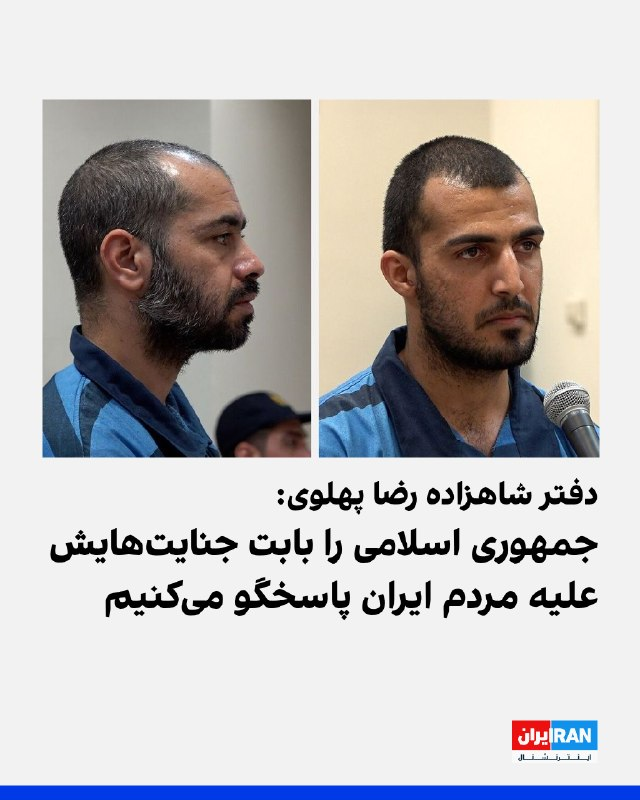

دفتر رسانه‌ای شاهزاده رضا پهلوی در واکنش به اعدام مهرداد محمدی‌نیا و اشکان ملکی، از معترضان دی‌ماه، از سوی جمهوری اسلامی، نوشت: مانند دیگر پرونده‌های سیاسی، جمهوری اسلامی بار دیگر «اعتراف» اجباری را به‌عنوان مدرک ارائه می‌کند؛ اعترافاتی که تحت فشار، ارعاب، شکنجه و بدون رعایت دادرسی عادلانه گرفته می‌شوند.

دفتر رسانه‌ای شاهزاده رضا پهلوی نوشت: نام آن‌ها نباید فراموش شود. جمهوری اسلامی را بابت جنایت‌های روزانه‌اش علیه مردم ایران پاسخگو خواهیم کرد.
https://iranintl.com/202606013680

## IranIntlTV — post 340070

  

وزارت خارجه مصر با انتشار بیانیه‌ای که از سوی رسانه‌های عربی منتشر شد، اعلام کرد که حملات جمهوری اسلامی به کویت تنش‌ها را به سطحی خطرناک رسانده و امنیت و ثبات منطقه خلیج فارس را تهدید می‌کند.

وزارت خارجه قطر نیز در شبکه ایکس اعلام کرد: «حملات مکرر جمهوری اسلامی به کویت را به‌شدت محکوم می‌کنیم. این اقدامات نقض آشکار حاکمیت کویت و تخطی فاحش از قوانین بین‌المللی به شمار می‌رود.»
https://iranintl.com/202606016493

## IranIntlTV — post 340069

  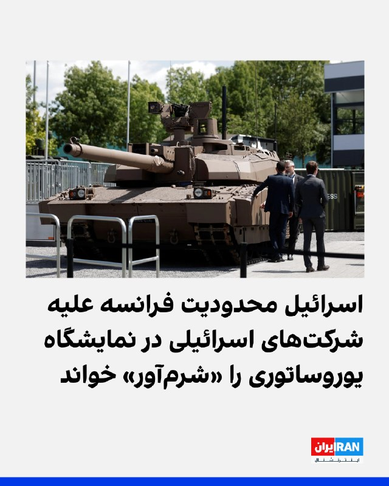

سخنگوی وزارت دفاع اسرائیل محدودیت‌های دولت فرانسه علیه مقام‌ها و شرکت‌های اسرائیلی در نمایشگاه تسلیحاتی یوروساتوری را «شرم‌آور» توصیف کرد.

او افزود: «شرکت‌های دفاعی اسرائیلی شرکت‌کننده در یوروساتوری از سوی دولت فرانسه تنها مجاز به نمایش محصولات پدافند هوایی خواهند بود.»

سخنگوی وزارت دفاع اسرائیل ادامه داد که دولت فرانسه تصمیم گرفته مقام‌های اسرائیلی را از مشارکت رسمی در نمایشگاه دفاعی یوروساتوری در ماه جاری میلادی منع کند.
https://iranintl.com/202606016466

## IranIntlTV — post 340068

  <a href="telegram/content/IranIntlTV_340068_1780329173.mp4" target="_blank">🎬 Download video</a>

اگر قرار باشد جمهوری اسلامی و آمریکا به یک توافق جامع و پایدار برسند، یکی از پرسش‌ها این خواهد بود: با صدها کیلوگرم اورانیوم غنی‌شده ایران چه باید کرد؟

مهدی بیگی، عضو تحریریه ایران‌اینترنشنال، در «پیوست»، مقصد احتمالی نگهداری اورانیوم ۶۰ درصدی ایران را بررسی می‌کند
@iranintltv

## IranIntlTV — post 340067

  <a href="telegram/content/IranIntlTV_340067_1780329175.mp4" target="_blank">🎬 Download video</a>

در پی دستور بنیامین نتانیاهو برای حمله به مواضع حزب‌الله در حومه جنوبی بیروت، موج فرار ساکنان و ترافیک سنگین در این منطقه گزارش شده است. هم‌زمان، اسرائیل از گسترش عملیات زمینی و تصرف قلعه بوفور در جنوب لبنان خبر داد.

بابک اسحاقی، خبرنگار ایران‌اینترنشنال، گزارش می‌دهد
@iranintltv

## IranIntlTV — post 340066

  

محمدرضا عارف، معاون اول پزشکیان، گفت که دیپلماسی کار سخت و پیچیده‌ای در احقاق حق جمهوری اسلامی در برابر زیاده‌خواهی دشمن دارد اما با وجود همه پیچیدگی‌ها و مشکلات، تیم مذاکره‌کننده تاکنون عملکرد خوبی داشته است.

او افزود موفقیت‌های متعددی در حوزه‌های مختلف در کشور حاصل شده اما در بیان روایت مناسب از این دستاوردها موفق نبوده‌ایم و همچنین نتوانسته‌ایم روایت خوب و درستی از جنگ نیز ارائه دهیم.

عارف اضافه کرد لازم است که رویکرد رسانه‌ای را در روایت از دو جنگ اخیر و اعتراضات دی ماه ۱۴۰۴ اصلاح کنیم.
https://iranintl.com/202606016571

## IranIntlTV — post 340065

  <a href="telegram/content/IranIntlTV_340065_1780329178.mp4" target="_blank">🎬 Download video</a>

در ویدیوهایی که ارتش اسرائیل منتشر کرده است به مناطقی در شمال رود لیتانی حملات گسترده ای انجام داده است که در این ویدیو نشان میدهد مناطقی در مرز اسرائیل مورد حملات موشکی و هوایی قرار گرفته اند. این ویدیوها مورد تایید رویترز قرار گرفته است. بنیامین نتانیاهو، نخست‌وزیر اسرائیل، اعلام کرد نیروهای اسرائیلی با وجود آتش‌بس اعلام‌شده بیش از شش هفته پیش، عملیات خود در لبنان علیه حزب‌الله مورد حمایت ایران را گسترش خواهند داد.
@iranintltv

## IranIntlTV — post 340064

  

سازمان عملیات تجارت دریایی بریتانیا اعلام کرد دوشنبه ۱۱ خرداد، یک حادثه در ۷۴ کیلومتری جنوب‌شرق بندر ام‌القصر عراق رخ داده است.
بر اساس این گزارش، یک کشتی باری هنگام عبور از خلیج فارس پس از برخورد با پرتابه ناشناس، در سمت راست بدنه دچار انفجار شده است.
https://iranintl.com/202606012946

## IranIntlTV — post 340063

  <a href="telegram/content/IranIntlTV_340063_1780329180.mp4" target="_blank">🎬 Download video</a>

سرخط خبرهای دوشنبه ۱۱ خرداد
@iranintltv

## IranIntlTV — post 340062

  <a href="telegram/content/IranIntlTV_340062_1780329182.mp4" target="_blank">🎬 Download video</a>

یونسکو در مقر خود در پاریس میزبان کنفرانسی درباره منشور کوروش و نقش آن در شکل‌گیری مفاهیم حقوق بشر است. در این کنفرانس، پژوهشگرانی از ایران، تاجیکستان و اروپا درباره آزادی دینی و برابری قومی در پیوند با میراث کوروش سخن می‌گویند.

گزارش ساجده شریفی، روزنامه‌نگار و گفت‌وگوی او با دلشاد رحیمی، سفیر تاجیکستان در سازمان یونسکو
@iranintltv

## IranIntlTV — post 340061

  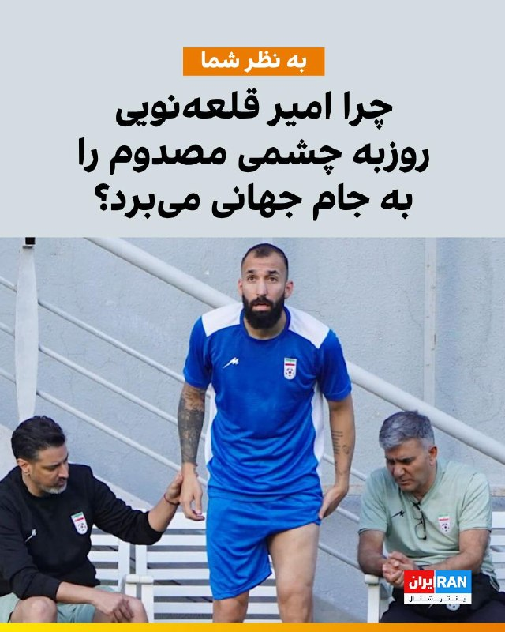

🔻فهرست اعلام‌شده امیر قلعه‌نویی، سرمربی تیم ملی برای جام جهانی ۲۰۲۶ با یک بازیکن مصدوم تکمیل شده است؛ روزبه چشمی.

🔹کاپیتان استقلال در شرایطی در جمع ۲۶ بازیکن نهایی قرار گرفته که امیرمهدی علوی، سخنگوی فدراسیون فوتبال، پیش‌تر در گفت‌وگو با صداوسیما اعلام کرده بود این بازیکن به دلیل مصدومیت جام جهانی را از دست داده است.

🔹با این حال، نام چشمی در فهرست نهایی تیم ملی قرار گرفت تا وضعیت آمادگی جسمانی او و دلیل تناقض میان اظهارات سخنگوی فدراسیون فوتبال و فهرست نهایی تیم ملی به یکی از پرسش‌های مطرح‌شده پس از اعلام اسامی بازیکنان تبدیل شود.

🔹چشمی در فصلی که گذشت به دلیل مصدومیت در ۶ بازی نتوانست استقلال را همراهی کند.

🔹به نظر شما چرا امیر قلعه‌نویی روزبه چشمی مصدوم را به جام جهانی می‌برد؟

🔹برای شرکت در این نظرخواهی به صفحه اینستاگرام ایران اینترنشنال ورزشی مراجعه کنید؛👇
https://www.instagram.com/p/DZC9wKBikwf/

@iranintltvsport

## IranIntlTV — post 340060

  

ارتش اسرائیل در بیانیه‌ای به ساکنان منطقه ضاحیه در جنوب بیروت هشدار داد و از آن‌ها خواست برای حفظ جان خود این منطقه را تخلیه کنند.
در این بیانیه آمده است اگر حزب‌الله به شلیک راکت به سوی شهرها و شهرک‌های اسرائیل ادامه دهد، ارتش اسرائیل اهدافی را در ضاحیه جنوبی هدف قرار خواهد داد.
در ادامه تاکید شده است دولت اسرائیل با مردم لبنان در حال جنگ نیست، بلکه با سازمان تروریستی حزب‌الله می‌جنگد.
https://iranintl.com/202606010611

## IranIntlTV — post 340059

  <a href="telegram/content/IranIntlTV_340059_1780329185.mp4" target="_blank">🎬 Download video</a>

رسانه‌های عراقی در گزارشی از ارسال پیام رهبر جمهوری اسلامی از طریق اسماعیل قاآنی، فرمانده نیروی قدس سپاه پاسداران، برای برخی گروه‌های مسلح عراقی خبر دادند.

تروسکه صادقی، خبرنگار ایران‌اینترنشنال، گزارش می‌دهد
@iranintltv

## IranIntlTV — post 340058

  <a href="https://t.me/IranintlTV/340058" target="_blank">📎 Download file</a>

🎧نسخه صوتی اخبار نیمروزی | دوشنبه ۱۱ خرداد
@iranintlTV

## IranIntlTV — post 340056

🗣روایت شما از بحران اقتصادی و زندگی در آتش‌بس- دوشنبه ۱۱ خرداد:

🔹من فقط ۱۵ سالمه اما مثل باقی مردم مضطربم و ناراحتم. وضعیت روان جامعه خیلی نگران کننده‌ست. تو ایران بچه ۶ ساله کلاس اولی درک کاملی از تورم و گرونی داره. با همه این فشارها، باور دارم آزادی نزدیکه.

🔹از اندیمشک: انقدر همه چی گرونه و دخل و خرج باهم نمی‌خونه که دیگه حتی نمی‌صرفه سر کار بری. نه راه پس داریم، نه راه پیش.

🔹قیمت پیش خرید قبر در باغ رضوان اصفهان حداقل ۱۷ میلیون و حداکثر ۹۰ میلیون تومان است.

🔹یک کیسه برنج ۳ میلیون و نیم شده، مرغ و گوشت که به آرزوها پیوسته. همه‌چی صد برابر گران‌تر شده.

🔹از پردیس: اینجا حاشیه شهر است، برهوت واقعی. اما خانه به قدری گران شده که جمعیت مهاجر که اکثرا از تهران آمده‌اند توان پرداخت اجاره خانه ندارند.

🔹می‌خوام به مردم بگم کم نیارین، مقاومت کنین، به کار و بارتون برسین، اعتراض خودتون رو به نحوه‌ درستش انجام بدین، درست می‌شه همه‌چی. حتی توی این وضعیت دست از آرزو‌هاتون بر ندارین.

🔹از زاهدان: هر روز چند ساعت برق رو قطع می‌کنن. روزها که کلا آب نداریم. اطراف بلوچستان هم فقر سنگینه. ما با این گرونی با این فشار جمهوری اسلامی اصلا نمی‌تونیم زندگی کنیم. آدم‌های تصادفی رو می‌بینی که دارن گریه می‌کنن.

🔹من در کارخانه کنسانتره آهن فولاد نطنز مشغول بودم و به علت ناتوانی مالی مالک کارخانه اخراج شدم. ۴ ماهه مطالباتم رو پرداخت نکردن. از طرفی در این اوضاع نه جنگ نه صلح، کار هم پیدا نمی‌شه و برای تامین مخارج خانه به مشکل خوردم.

🔹روغن موتور ماشین عوض کردم شد ۳ میلیون و ۵۵۰ هزار تومان. یک خرید سوپرمارکتی شامل ۳ تا دوغ، یک مرغ و یک بستنی شد یک میلیون تومان.

🔹یک کیلو زردآلو، یک کیلو گوجه سبز و یک کیلو هلو شد یک میلیون و ۳۰۰ هزار تومان. واقعا خجالت کشیدم. همه‌شان با هم ۴۰ ‌دانه هم نشده بودند.

🔹دیگه باشگاه رفتن و سالم زندگی کردن هم آرزو شده، شهریه روزانه عادی‌ترین باشگاه به ۱۲۰ هزار تومان رسیده و ماهانه به ۲ میلیون تومان.

🔹به خاطر خبرهای کمبود دارو رفتم داروخانه تا برای ۳ ماه آینده دارو تهیه کنم، ۴ قلم دارو برای ۳ ماه قیمتش شد حدودا ۶ میلیون تومان.

🔹۲ ورق کپسول اوسلتامیویر و ۲ ورق ژلوفن شده ۷۰۰ هزار تومان. مهندس عمران هستم، بعد از جنگ بیکار شدم و الان به‌عنوان پیک موتوری کار می‌کنم. در این گرما روزی نهایت ۹۰۰ هزار تومان درآمد دارم.

## IranIntlTV — post 340054

  <a href="telegram/content/IranIntlTV_340054_1780329188.mp4" target="_blank">🎬 Download video</a>

ایرانیان ساکن نروژ با برگزاری تجمعی مقابل پارلمان اسلو، حمایت خود را از انقلاب ملی و شاهزاده رضا پهلوی اعلام کردند.

گزارش مهران عباسیان، خبرنگار ایران‌اینترنشنال و گفت‌وگوی او با شرکت‌کنندگان در این تجمع
@iranintltv

## IranIntlTV — post 340053

  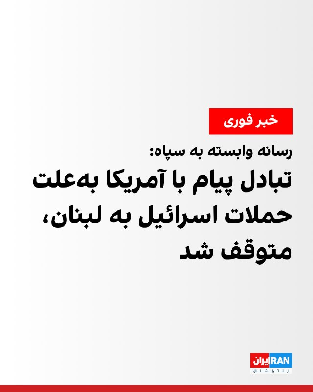

خبرگزاری تسنیم، وابسته به سپاه پاسداران، گزارش داد که با توجه به ادامه حملات اسرائیل به لبنان و اینکه لبنان جزو پیش شرط‌های آتش‌بس بوده است، تیم مذاکره‌کننده جمهوری اسلامی «گفت‌وگوها و تبادل متون از طریق میانجی» را متوقف می‌کند.

تسنیم افزود «جبهه مقاومت» و جمهوری اسلامی عزم خود را برای انسداد کامل تنگه هرمز، و فعال کردن سایر جبهه‌ها از جمله تنگه باب‌المندب، در دستور کار قرار داده‌اند.
https://iranintl.com/202606014646

## IranIntlTV — post 340051

  <a href="telegram/content/IranIntlTV_340051_1780329191.mp4" target="_blank">🎬 Download video</a>

انفجار در یک کارخانه تولید مواد آتش‌بازی در سالینا مالت، روز دوشنبه سه نفر را مجروح و چهار گاو را تلف کرد. انفجار در کارخانه «لوردز» باعث فعال شدن مواد آتش‌بازی برای چندین ساعت، وارد شدن خسارت به خانه‌ها، خودروها و یک هتل در اطراف محل حادثه شد و ساکنان منطقه را به دلیل ریزش آوار و آسیب به خطوط برق وادار به ترک خانه‌هایشان کرد. پلیس در حال بررسی این حادثه است و علت انفجار هنوز مشخص نشده است.
@iranintltv

## IranIntlTV — post 340050

  <a href="telegram/content/IranIntlTV_340050_1780329192.mp4" target="_blank">🎬 Download video</a>

تصاویر رسیده به ایران اینترنشنال، گروهی از کودکان مسلح را در یک ایست بازرسی در شیراز نشان می‌دهد. در این تصاویر همچنین مردی میانسال با ماسکی بر چهره دیده می‌شود که همراه این کودکان برای رهگذران ایجاد مزاحمت می‌کنند.

گفت‌وگو با مسعود کاظمی، روزنامه‌نگار
@iranintltv

## Shin_Persian — post 6357

  

UKMTO Operations Centre @UK_MTO
Mon, 01 Jun 2026 14:23:25 UTC

UKMTO WARNING 063-26

Click here to view the full warning⤵️
http://www.ukmto.org/-/media/ukmto/products/20260601-ukmto_warning_063.pdf?rev=f5e667a1b57c4711b38e8fcadfda022d

#MaritimeSecurity #MarSec

فارسی

هشدار UKMTO (عملیات تجارت دریایی بریتانیا) ۰۶۳-۲۶

برای مشاهده هشدار کامل اینجا کلیک کنید⤵️
http://www.ukmto.org/-/media/ukmto/products/20260601-ukmto_warning_063.pdf?rev=f5e667a1b57c4711b38e8fcadfda022d

#MaritimeSecurity #MarSec

𝕏 · @shin_persian

## Shin_Persian — post 6356

Shin ✓ @hey_itsmyturn
Mon, 01 Jun 2026 14:21:26 UTC

Correction: No new sirens in #Kuwait 🇰🇼

فارسی

اصلاحیه: آژیر خطر جدیدی در #Kuwait 🇰🇼 شنیده نمی‌شود.

𝕏 · @shin_persian

## Shin_Persian — post 6354

↩️ Quoted tweet: U.S. Central Command ✓ @CENTCOM Mon, 01 Jun 2026 12:08:07 UTC Last night at 11 p.m. ET, U.S. forces successfully intercepted two Iranian ballistic missiles targeting American forces based in Kuwait. These missiles were immediately defeated…

## Shin_Persian — post 6353

↩️ Quoted tweet:
U.S. Central Command ✓ @CENTCOM
Mon, 01 Jun 2026 12:08:07 UTC

Last night at 11 p.m. ET, U.S. forces successfully intercepted two Iranian ballistic missiles targeting American forces based in Kuwait. These missiles were immediately defeated and no American personnel were harmed.

U.S. Central Command remains vigilant and will continue to

↩️ توییت نقل‌قول شده — برای پاسخ، پست زیر را ببینید.

فارسی

دیشب در ساعت ۱۱ شب به وقت منطقه زمانی شرقی، نیروهای آمریکایی با موفقیت دو موشک بالستیک ایرانی را که نیروهای آمریکایی مستقر در کویت را هدف قرار داده بودند، رهگیری کردند. این موشک‌ها بلافاصله منهدم شدند و به هیچ‌یک از پرسنل آمریکایی آسیبی نرسید.

فرماندهی مرکزی ایالات متحده (سنتکام) هوشیار باقی مانده و به... ادامه خواهد داد.

𝕏 · @shin_persian

## Shin_Persian — post 6352

↩️ Quoted tweet: U.S. Central Command ✓ @CENTCOM Mon, 01 Jun 2026 12:07:08 UTC Last night at 11 p.m. ET, U.S. forces successfully intercepted two Iranian ballistic missile targeting American forces based in Kuwait. These missiles were immediately defeated…

## Shin_Persian — post 6351

↩️ Quoted tweet:
U.S. Central Command ✓ @CENTCOM
Mon, 01 Jun 2026 12:07:08 UTC

Last night at 11 p.m. ET, U.S. forces successfully intercepted two Iranian ballistic missile targeting American forces based in Kuwait. These missiles were immediately defeated and no American personnel were harmed.

U.S. Central Command remains vigilant and will continue to

↩️ توییت نقل‌قول شده — برای پاسخ، پست زیر را ببینید.

فارسی

دیشب در ساعت ۱۱ شب به وقت منطقه زمانی شرقی، نیروهای ایالات متحده با موفقیت دو موشک بالستیک ایرانی را که نیروهای آمریکایی مستقر در کویت را هدف قرار داده بودند، رهگیری کردند. این موشک‌ها بلافاصله منهدم شدند و به هیچ‌یک از پرسنل آمریکایی آسیبی وارد نشد.

فرماندهی مرکزی ایالات متحده (سنتکام) هوشیار باقی می‌ماند و به... ادامه خواهد داد.

𝕏 · @shin_persian

## Shin_Persian — post 6350

  

Shin ✓ @hey_itsmyturn
Mon, 01 Jun 2026 11:15:42 UTC

State-owned Mehr News

Islamic Regime FM Araghchi: ceasefire violation on one front means violation on all fronts.

Claims US-Iran ceasefire covers all fronts including Lebanon. Says US and Israel responsible for consequences of any violations.

#Iran

فارسی

خبرگزاری دولتی مهر

عراقچی، وزیر امور خارجه رژیم اسلامی: نقض آتش‌بس در یک جبهه به معنای نقض آن در تمامی جبهه‌هاست.

وی مدعی است که آتش‌بس میان ایران و آمریکا تمامی جبهه‌ها از جمله لبنان را در بر می‌گیرد و می‌گوید آمریکا و اسرائیل مسئول عواقب هرگونه نقض این آتش‌بس هستند.

#ایران

𝕏 · @shin_persian

## reutersworldchannel — post 151527

  

Iran halting indirect talks with US over Israel's Lebanon incursion, Tasnim says

ran is halting indirect negotiations with the U.S. ​after Israel ordered troops to push deeper into Lebanon to battle Tehran-backed Hezbollah, the Iranian news agency Tasnim said on Monday, complicating diplomatic efforts to end three months of war.

Tasnim said the Islamic Republic's ‌negotiating team was stopping exchanging messages with Washington through mediators over attacks on Lebanon, where the U.S.-Israeli war against Iran has reignited Israel's conflict with Hezbollah. read more

## ManotoTV — post 105890

  <a href="telegram/content/ManotoTV_105890_1780329197.mp4" target="_blank">🎬 Download video</a>

حمله گزارش‌شده آمریکا به اهدافی در جنوب ایران، از نظر دامنه محدود بود، اما از نظر پیام نظامی اهمیت داشت. بر اساس روایت آمریکا، این حمله پس از سرنگونی یک پهپاد آمریکایی بر فراز آب‌های بین‌المللی انجام شد و سایت‌های راداری و مراکز فرماندهی و کنترل پهپادی جمهوری اسلامی در سیریک و جزیره قشم را هدف قرار داد.

## FarsiVOA — post 219278

  <a href="telegram/content/FarsiVOA_219278_1780329199.mp4" target="_blank">🎬 Download video</a>

ویدیویی که به تازگی بعد از بازگشایی محدود اینترنت منتشر شده منتسب است به روزهای نخست اعتراضات دی ماه ۱۴۰۴ و اعتراضات بازاریان در تهران؛ در این ویدیو ماموران حکومتی به مردم معترض تیراندازی کرده و گاز اشک‌آور شلیک می‌کنند.

شوک ارزی، ابتدا بازار تهران و مناطق مرکزی پایتخت را در هفته دوم دی ماه به صحنه اعتصاب و اعتراضات گسترده تبدیل کرد و اعتراضات مردمی به شهرهای مختلف ایران کشیده شد.

جمهوری اسلامی ۱۸ و ۱۹ دی ماه هزاران معترض را در شهرهای مختلف ایران کشت، مجروح و بازداشت کرد.

## FarsiVOA — post 219277

  <a href="telegram/content/FarsiVOA_219277_1780329201.mp4" target="_blank">🎬 Download video</a>

بعد از بازگشایی محدود اینترنت در ایران، ویدیوی جدیدی از آسمان دودگرفته تهران در زمان جنگ در شبکه‌های اجتماعی منتشر و پربازدید شده است.

## FarsiVOA — post 219276

🔺دانشجویان میان دو تیغ سرکوب کمیته‌‌های انضباطی و دادگاه‌‌های انقلاب: موج تعلیق، اخراج و احکام سنگین زندان

▪️با وجود تعطیلی آموزش حضوری در دانشگاه‌های ایران، دانشجویان همچنان میان دو لبه دستگاه سرکوب جمهوری اسلامی یعنی «کمیته‌های انضباطی» و «دادگاه‌های انقلاب» تحت فشارهای فزاینده قرار دارند. در چند هفته گذشته فقط در چهار دانشگاه صنعتی شریف، علم و صنعت، بهشتی و تهران دست‌کم ۳۵۲ دانشجو با احضار یا احکام تعلیق و اخراج کمیته انضباطی مواجه شده‌اند و همزمان چند دانشجو نیز با حکم دادگاه‌ انقلاب به حبس‌های سه تا ده سال محکوم شده‌اند.

⬇️ بیشتر بخوانید:

https://ir.voanews.com/a/disciplinary-committees-revolutionary-court-prison-protesting-students/8156086.html/?nocach=1

## FarsiVOA — post 219274

  <a href="telegram/content/FarsiVOA_219274_1780329204.mp4" target="_blank">🎬 Download video</a>

در میدان پرسیدیم که آیا انباشت خشم اجتماعی آسیب بیشتری به زنان می‌زند؟ نینا هوشمند، کنشگر آنلاین می‌گوید زنان کمی هستند که با وجود حجم گسترده خشونت جنسیتی همچنان به حضور در فضای عمومی ادامه دهند. سارا شادابی، روانکاو سبب خشم جامعه را انباشتِ مطالباتِ برآورده نشده می‌داند.

## FarsiVOA — post 219273

  <a href="telegram/content/FarsiVOA_219273_1780329206.mp4" target="_blank">🎬 Download video</a>

دیدار تیم فوتبال شاهین بندرعامری تنگستان و شهرآرکا البرز به خشونت ختم شد. ویدیوهای منتشر شده از رختکن شهرآرکا البرز نشان می‌دهد درپی درگیری، ماموران به صورت اعضای تیم «گاز اشک‌آور» زده و درب رختکن را به روی آنها قفل می‌کنند. این بازی ۲ بر ۱ به سود شاهین بندرعامری میزبان به پایان رسید.

## FarsiVOA — post 219272

  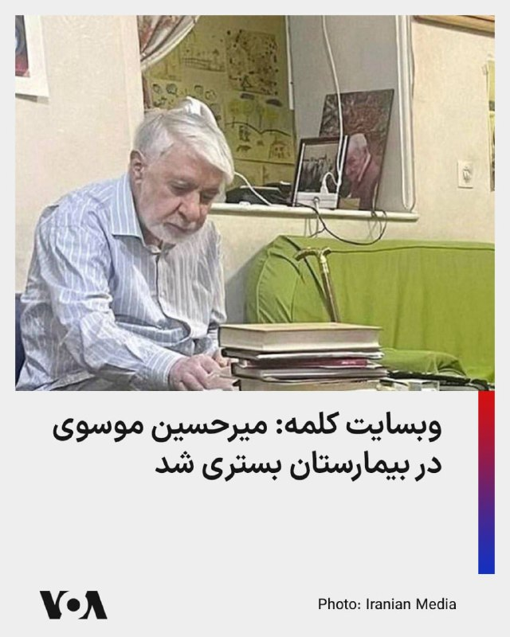

⚡️وبسایت خبری «کلمه» گزارش داده است که میرحسین موسوی، از رهبران از رهبران «جنبش سبز» که از سال ۱۳۸۹ در حصر خانگی به سر می‌برد، به دلیل بیماری و وضعیت جسمی در بیمارستان بستری شده است. کلمه می‌گوید، آقای موسوی و همسرش زهرا رهنورد پس از آغاز حملات اسرائیل و آمریکا علیه جمهوری اسلامی و بمباران منطقه پاستور(محل استقرار دفتر خامنه‌ای)، به مکانی خارج از آن محدوده منتقل شده‌اند. میرحسین موسوی سال گذشته، پس از جنگ ۱۲ روزه، خواستار تشکیل مجلس مؤسسان و تغییر قانون اساسی جمهوری اسلامی شده بود.

## FarsiVOA — post 219271

  <a href="telegram/content/FarsiVOA_219271_1780329208.mp4" target="_blank">🎬 Download video</a>

در جریان یک حمله گسترده هوایی، یک جنگنده اف-۱۶ اوکراینی یک موشک کروز روسی «خا-۱۰۱» را در میانه پرواز سرنگون کرد.

این موشک احتمالا با موشک «ای‌آی‌ام-۹ سایدوایندر» هدف قرار گرفته است.

@FarsiVOA

## FarsiVOA — post 219270

  <a href="telegram/content/FarsiVOA_219270_1780329209.mp4" target="_blank">🎬 Download video</a>

خواهر آرنیکا دباغ، از کشته‌شدگان دی ماه ۱۴۰۴، بعد از بازگشایی محدود اینترنت در ایران، ویدیویی از مراسم تولد آرنیکا بر آرامگاهش در ۲۵ فروردین منتشر کرده است. آرنیکا دباغ، ۱۵ ساله و قهرمان شنای کشوری، ۱۹ دی ۱۴۰۴ به دست نیروهای حکومتی در شهر گرگان کشته شد. ⁨

## FarsiVOA — post 219269

🔺نخست وزیر اسرائیل دستور حمله به جنوب پایتخت لبنان را برای مقابله با حزب‌الله صادر کرد

▪️بنیامین نتانیاهو، نخست‌ وزیر اسرائیل، روز دوشنبه ۱۱ خرداد دستور حمله به اهداف وابسته به حزب‌الله در ضاحیه، حومه جنوبی بیروت، را صادر کرد؛ اقدامی که نشانه‌ تشدید درگیری‌ها در لبنان ارزیابی می‌شود.

⬇️ بیشتر بخوانید:

https://ir.voanews.com/a/netanyahu-orders-attack-on-southern-beirut-targeting-hezbollah/8156082.html/?nocach=1

## FarsiVOA — post 219268

🔺محاکمه دو مقام امنیتی رژیم بشار اسد در اتریش به اتهام شکنجه مخالفان

▪️بنا به گزارش‌ رسانه‌های عربی در روز دوشنبه ۱۱ خرداد، یک سرتیپ سابق اطلاعات سوریه به همراه رئیس سابق دفتر تحقیقات جنایی محلی با درجه سرهنگ دومی، در دادگاهی در کشور اتریش حاضر شدند و اتهام شکنجه مخالفان در دوران حاکمیت بشار اسد در سوریه، به آنها تفهیم شد.

⬇️ بیشتر بخوانید:

https://ir.voanews.com/a/syria-bashar-assad-irgc-torture-prison/8156073.html/?nocach=1

## FarsiVOA — post 219267

انفجاری در یک کارخانه تولید وسایل آتش‌بازی در شهر سالینا در شمال مالت رخ داد. تصاویری که منتشر شده، دود ناشی از این انفجار را نشان می‌دهد.

بر اساس گزارش‌ها، موج انفجار به خانه‌ها، هتل‌ها و مزارع اطراف آسیب رسانده و باعث شکسته شدن شیشه‌ها و خسارت به برخی ساختمان‌ها شده است.

بنا بر گزارش‌ها دو نفر در این حادثه دچار جراحت زخمی شده‌اند.

این دومین بار است که این محل دچار انفجار می‌شود. گزارش‌ها همچنین از تخلیه برخی ساکنان منطقه و خسارت به محصولات کشاورزی خبر می‌دهد.

@FarsiVOA

## FarsiVOA — post 219265

  <a href="telegram/content/FarsiVOA_219265_1780329212.mp4" target="_blank">🎬 Download video</a>

در میدان پرسیدیم چرا جامعه تا این حد خشمگین است و گروه‌های مختلف خشم خود را بر سر یکدیگر خالی می‌کنند؟ حسین قاضیان، جامعه‌شناس می‌گوید خشم بازار پررونقی پیدا کرده است و جامعه به آن پاداش می‌دهد.

## FarsiVOA — post 219264

  <a href="telegram/content/FarsiVOA_219264_1780329213.mp4" target="_blank">🎬 Download video</a>

تصاویر انفجار و آتش‌سوزی در کارخانه تولید لوازم آتش‌بازی «لوردز» در مالت، که بامداد ۱۱ خرداد ۱۴۰۵ رخ داد در شبکه‌های اجتماعی پربازدید شده است. در این انفجار مهیب، دست‌کم سه نفر زخمی شدند، چهار گاو از بین رفتند و به ساختمان‌ها و خودروهای مجاور آسیب رسید. تا این لحظه تلفات جانی گزارش نشده و علت حادثه هنوز مشخص نیست.

## FarsiVOA — post 219263

تیم ملی فوتبال جمهوری اسلامی ایران، در فاصله ده روز مانده به آغاز رقابت‌ها ، همچنان بلاتکلیف است. ویزای ایالات متحده برای تیم صادر نشده و قول همکاری سفارت مکزیک در آنکارا، هنوز به صدور روادید ختم نشده است.

## FarsiVOA — post 219260

ژنرال فرانسیس ال. دونوان، فرمانده فرماندهی جنوبی آمریکا، در کاراکاس با تفنگداران دریایی آمریکا از واحد بیست‌ودوم اعزامی تفنگداران دریایی دیدار کرد.

نیروهای نظامی آمریکا برای حمایت از ماموریت فرماندهی جنوبی آمریکا در منطقه کارائیب مستقر شده‌اند.

@FarsiVOA

## FarsiVOA — post 219259

  <a href="telegram/content/FarsiVOA_219259_1780329215.mp4" target="_blank">🎬 Download video</a>

ارتش اسرائیل تصاویری از فعالیت لشکر ۱۴۶ در جنوب لبنان منتشر و اعلام کرد این لشکر سومین دور نبرد خود را به پایان رساند و ماموریت در جنوب لبنان را تکمیل کرد.

بنابر بیانیه ارتش اسرائیل لشکر ۱۴۶ در سه ماه گذشته در منطقه خط دفاعی پیشرو در جنوب لبنان برای حذف تروریست‌ها، انهدام زیرساخت‌های سازمان تروریستی حزب‌الله و رفع تهدیدات علیه اسرائیل فعالیت کرد.

در طول این عملیات، بیش از ۵۵۰ تروریست حذف و بیش از ۲۷۰۰ زیرساخت تروریستی منهدم شدند.

## FarsiVOA — post 219258

  <a href="telegram/content/FarsiVOA_219258_1780329218.mp4" target="_blank">🎬 Download video</a>

نیروی دریایی فرانسه یک نفتکش روسیِ تحت تحریم به نام «تاگور» را در اقیانوس اطلس توقیف کرد.

این عملیات در آب‌های بین‌المللی و با حمایت بریتانیا و دیگر شرکا انجام شد. فرانسه دور زدن تحریم‌ها برای تامین مالی جنگ روسیه در اوکراین را «غیرقابل قبول» توصیف کرد.

@FarsiVOA

## FarsiVOA — post 219255

فرماندهی مرکزی ایالات متحده، سنتکام، تصاویری از انجام عملیات تعمیر و نگهداری یک جنگنده اف-۱۶ توسط نیروهای نیروی هوایی آمریکا در یک پایگاه نظامی در خاورمیانه منتشر کرد.

@FarsiVOA

## DW_Farsi — post 125390

🔶 ژاپن از ایران خواست برای حصول توافق با آمریکا "حداکثر انعطاف‌پذیری" را نشان دهد

تاکایچی سانائه، نخست‌وزیر ژاپن، از مسعود پزشکیان، رئیس جمهور ایران خواسته است تا هرچه سریع‌تر با ایالات متحده به توافق برسد و شرایط را برای عبور و مرور آزادانه کشتی‌ها در تنگه هرمز فراهم کند.

به گزارش خبرگزاری ژاپنی کیودو، تاکایچی دوشنبه‌شب به مدت ۱۵ دقیقه به صورت تلفنی با پزشکیان گفت‌وگو کرد.

او ضمن تأکید بر این موضع که "تنش‌زدایی از طریق گفتگو از بالاترین اهمیت برخوردار است" ابراز امیدواری کرده است که "تهران به نشان دادن حداکثر انعطاف‌پذیری ادامه داده و با واشنگتن به یک توافق نهایی دست یابد".

وی بار دیگر خواستار عبور آزادانه و امن کشتی‌های همه کشورها، از جمله ژاپن و سایر کشورهای آسیایی، در سریع‌ترین زمان ممکن از تنگه هرمز شد.

دومقام توافق کردند که در تماس نزدیک با یکدیگر در گفت‌وگو باقی بمانند. این گفت‌وگوی تلفنی، اولین گفت‌وگوی آن‌ها در حدود یک ماه گذشته بود؛ آخرین آن‌ها در تاریخ ۳۰ آوریل انجام شده بود.

تاکایچی پس از این گفت‌وگوها اعلام کرد که بار دیگر موضع اصولی ژاپن را به دونالد ترامپ، رئیس‌جمهور آمریکا، منتقل کرده است. وی افزود که همچنین بر هماهنگی با رهبران سایر کشورها از جمله کره جنوبی و فیلیپین در جهت کاهش تنش‌ها در منطقه تأکید کرده است. او گفت که به تلاش‌های دیپلماتیک فعالانه خود ادامه خواهد داد.

روایت ایران از گفت‌وگوی پزشکیان و تاکایچی سانائه در رسانه‌ای ایران بازتاب یافته است.

بنا بر این روایت، پزشکیان از باور "جمهوری اسلامی ایران به دیپلماسی به عنوان "مؤثرترین راهکار برای حل مسائل" یاد کرده و آمریکا را به "عدول از تعهدات خود و همچنین اقدامات بی‌ثبات‌کننده" اسرائیل متهم کرده که به گفته او "روندهای دیپلماتیک را با چالش مواجه کرده‌اند".

پزشکیان همچنین با اشاره به تحولات منطقه، نقض مکرر آتش‌بس در لبنان، تداوم آوارگی شهروندان لبنانی و حمایت‌های سیاسی و نظامی آمریکا از اقدامات رژیم صهیونیستی را نگران‌کننده توصیف کرد و خواستار ایفای مسئولیت مؤثر جامعه جهانی در توقف این روند شد.

پزشکیان در ادامه "با تأکید بر اهمیت امنیت و آزادی کشتیرانی در آبراه‌های بین‌المللی" گفته است که "جمهوری اسلامی ایران آمادگی کامل برای تسهیل عبور و مرور دریایی را دارد... و تهران موضوع تردد کشتی‌های مرتبط با ژاپن را با جدیت پیگیری خواهد کرد و تلاش خواهد شد که مسیر عبور کشتی‌های ژاپنی بدون مشکل و با سهولت بیشتری فراهم شود.

پزشکیان در ادامه ابراز امیدوار کرده است که "با بازگشت شرایط عادی، زمینه بهره‌گیری از توانمندی‌های فنی و مهندسی ژاپن در پروژه‌های بازسازی و توسعه پالایشگاه‌ها، بنادر و زیرساخت‌های اقتصادی آسیب دیده ایران بیش از پیش فراهم شود".

او در ادامه خواستار مساعدت دولت ژاپن برای تسهیل بهره‌برداری از منابع مالی و دارایی‌های ایران در ژاپن به‌منظور تأمین کالاهای اساسی، تجهیزات پزشکی و دارو شد.

ژاپن حدود ۹۵ درصد از نفت خود را از خاورمیانه وارد می‌کند که بیشتر آن از تنگه هرمز عبور می کند؛ از آغاز جنگ آمریکا و اسرائیل علیه ایران، بیش از ۴۰ کشتی ژاپنی در این سوی تنگه منتظر اجازه نیروهای نظامی تهران برای عبور بوده‌اند.

مینورو کیهارا دبیر ارشد کابینه ژاپن پس از برقراری آتش‌بس میان ایران و آمریکا، اعلام کرده بود که کاهش تنش واقعی در خاورمیانه از اهمیت بالایی برخوردار است و توکیو انتظار دارد که به زودی از طریق تلاش‌های دیپلماتیک، "توافق نهایی" حاصل شود.

## DW_Farsi — post 125389

🔶 هرمز، سوئز، پاناما؛ چرا فقط اولی نمی‌تواند عوارض بگیرد؟

🔻گزارشی از Nik Martin

حکومت ایران، پس از انتشار گزارش‌هایی مبنی بر آغاز دریافت تا دو میلیون دلار از هر کشتی برای "عبور ایمن" از تنگه هرمز، به اخاذی و تهدید امنیت انرژی جهان متهم شد.

تنگه هرمز که میان ایران و عمان قرار دارد، حیاتی‌ترین گذرگاه انرژی جهان به شمار می‌رود. پیش از جنگ ایران، یک‌پنجم نفت و گاز مصرفی جهان از این مسیر عبور می‌کرد.

جمهوری اسلامی این هزینه‌ها را غرامت جنگی برای خسارت‌های ناشی از حملات آمریکا و اسرائیل به ایران دانسته و همچنین آن را با پرداخت "خدمات ناوبری"، حفاظت از محیط زیست و تقویت امنیت توجیه می‌کند.

ایران همچنین اعلام کرده است که در حال تدوین پیش‌نویس یک پروتکل مشترک با عمان است که کشتی‌ها را پیش از عبور از تنگه هرمز، ملزم به اخذ مجوز می‌کند.
@dw_farsi

## DW_Farsi — post 125388

🔶 خبرگزاری نزدیک به سپاه: به دلیل تشدید حملات اسرائیل در لبنان تبادل متن‌های توافق با آمریکا متوقف شده است

خبرگزاری تسنیم، نزدیک به سپاه پاسداران، که منبع "کسب اطلاع" این خبرگزاری است، نوشته که "با توجه به تداوم جنایات رژیم صهیونیستی در لبنان و با عنایت به اینکه لبنان جزو پیش شرط‌های آتش‌بس بوده است و هم اینک این آتش‌بس در همه جبهه‌ها از جمله لبنان نقض شده است، تیم مذاکره‌کننده ایرانی گفتگوها و تبادل متون از طریق میانجی را متوقف می‌کند".

در ادامه خبر تسنیم گفته می‌شود که "توقف فوری عملیات تجاوزکارانه و وحشیانه ارتش اسرائیل در غزه و لبنان و ضرورت عقب‌نشینی کامل از مناطق اشغال شده در لبنان توسط مسئولان و مذاکره‌کنندگان ایرانی مورد تاکید قرار گرفته و تا زمانی که نظر ایران و مقاومت در این زمینه تامین نشود، گفتگویی در کار نخواهد بود".

تسنیم همچنین تهدید کرده است که "جبهه مقاومت و ایران عزم خود را برای انسداد کامل تنگه هرمز، و فعال کردن سایر جبهه‌ها از جمله تنگه باب‌المندب، به منظور تنبیه صهیونیست‌ها و حامیانش در دستور کار قرار داده‌اند".

منابع دیگر این خبر تهدیدآمیز تسنیم را تأیید نکرده‌اند.

روز دوشنبه، مقام‌های مختلف جمهوری اسلامی، از جمله محمدباقر قالیباف، رئیس مجلس و عباس عراقچی، وزیر خارجه در پیام‌هایی جداگانه در شبکه ایکس، نسبت به"پیامدهای گسترش جنگ در لبنان" هشدار دادند و آن را "نقض آتش‌بس میان آمریکا و ایران" توصیف کردند. آنها در باره جزئیات این "پیامدها" توضیحی ندادند.

همزمان سعید آجرلو، عضو تیم رسانه‌ای هیأت مذاکره‌کننده ایران در گفت‌وگو با خبرگزاری فارس، با اشاره به آخرین تحولات مذاکرات، از "بررسی پیشنهاد مکتوب جدید آمریکا در نهادهای عالی تصمیم ساز کشور خبر داد" او گفت که هنوز پاسخی به این پیشنهاد داده نشده است.

آجرلو با اشاره به دریافت متن جدید از سوی آمریکا از طریق واسطه‌ها، گفت: «پیشنهاد ارسالی جدید آمریکا در کمیته ۶ نفره و شورای عالی امنیت ملی در حال بررسی است. از طریق میانجی‌ها متنی به ایران ارسال شده ولی هنوز پاسخی به پیشنهاد جدید آمریکا نداده ایم.»

او احتمال تغییرات بیشتر در متن مورد مبادله از سوی آمریکا را منتفی نشمرد و در ادامه افزود که "ما به دلیل اینکه نگرانی هایی داریم هنوز پاسخی به متن جدید آمریکا ارسال نکردیم و باید نگرانی های ما رفع شود تا بتواند عوایدی از مذاکرات نصیب ما شود".

آجرلو توضیحی در باره این نگرانی‌ها نداده است، ولی جمهوری اسلامی هم در باره مدیریت تنگه هرمز، هم در باره مدت توقف غنی‌سازی اورانیوم و نیز خروج اورانیوم ۶۰‌درصد غنی‌شد، تضمین‌هایی برای درنگرفتن مجدد جنگ اصرار و مصون ماندن نیروهای نیابتی‌اش از حمله، ملاحظاتی دارد که با دیدگاه‌های آمریکا همساز نیست.
@dw_farsi

## DW_Farsi — post 125387

🔶 دستور نتانیاهو برای حمله ارتش اسرائیل به حومه جنوبی بیروت

بنیامین نتانیاهو، نخست‌وزیر اسرائیل روز دوشنبه دستور حمله به حومه جنوبی بیروت، که تحت کنترل حزب‌الله است، را صادر کرد. این اقدام نشانه‌ای از تشدید بیشتر جنگی است که تلاش‌های میانجی‌گری برای حل‌وفصل مناقشه میان آمریکا و ایران را پیچیده‌تر کرده است.

پس از هشدار اسرائیل، مردم شروع به ترک حومه جنوبی بیروت، معروف به ضاحیه، کردند. این تازه‌ترین موج آوارگی در درگیری‌ای است که تاکنون بیش از یک میلیون نفر را در لبنان از خانه‌هایشان رانده است.

نتانیاهو در یک پیام ویدئویی گفت: «وضعیتی را نخواهیم پذیرفت که حزب‌الله به شهرها و شهروندان ما حمله کند، اما مقرهای تروریستی آن در بیروت، در ضاحیه، از حملات مصون بماند.»

او همچنین گفت که اسرائیل به گسترش عملیات زمینی خود در لبنان ادامه می‌دهد. نیروهای اسرائیلی در جنوب لبنان منطقه‌ای را که خود "منطقه امنیتی" می‌نامند ایجاد کرده‌اند و می‌گویند هدفشان محافظت از شمال اسرائیل در برابر حملات حزب‌الله است.

همزمان با پیام ویدئویی، دفتر بنیامین نتانیاهو اعلام کرد که او و یسرائیل کاتس، وزیر دفاع اسرائیل، به ارتش این کشور دستور داده‌اند که به "اهداف تروریستی" در حومه جنوبی بیروت حمله کند.

در بیانیه دفتر نتانیاهو آمده است که این دستور در پی "نقض‌های مکرر آتش‌بس" از سوی حزب‌الله و همچنین "حملات علیه شهرها و شهروندان ما" صادر شده است.

این دستور پس از تشدید درگیری‌ها در جنوب لبنان طی آخر هفته صادر شد؛ جایی که نیروهای اسرائیلی موفق به تصرف قلعه بوفور، دژی تاریخی با قدمتی حدود ۹۰۰ سال، شدند.

حزب‌الله که در سال ۱۹۸۲ با حمایت سپاه پاسداران انقلاب اسلامی ایران تأسیس شد، اعلام کرد که نیروهایش ساعت یک بامداد دوشنبه چند موشک به سوی زیرساخت‌های نظامی اسرائیل در شهر طبریه شلیک کرده‌اند. این گروه همچنین گفت که این حملات و سایر عملیات‌هایش پاسخی به نقض آتش‌بس از سوی اسرائیل بوده است.

یسرائیل کاتس نیز هشدار داد: «اگر در شمال اسرائیل آرامش وجود نداشته باشد، در بیروت نیز آرامشی وجود نخواهد داشت.»

مقام‌های لبنانی می‌گویند از دوم مارس، زمانی که حزب‌الله در حمایت از ایران و در واکنش به حملات آمریکا و اسرائیل به ایران، به سوی اسرائیل آتش گشود، بیش از ۳۴۰۰ نفر در لبنان در نتیجه حملات اسرائیل کشته شده‌اند.

در مقابل، اسرائیل اعلام کرده است که در همین بازه زمانی، ۲۴ سرباز و ۴ غیرنظامی اسرائیلی جان خود را از دست داده‌اند.

اسرائیل در هفته‌های نخست جنگ، حومه جنوبی بیروت را به شدت بمباران کرده بود. با این حال، از زمان اعلام آتش‌بس لبنان توسط دونالد ترامپ، رئیس‌جمهور آمریکا، در ۱۶ آوریل، تنها دو بار این منطقه را هدف حمله قرار داده است؛ هرچند درگیری‌ها در جنوب لبنان همچنان ادامه داشته‌اند.

این درگیری‌ها در ۲ مارس آغاز شد؛ زمانی که حزب‌الله در حمایت از ایران، که تحت حملات آمریکا و اسرائیل قرار گرفته بود، به سوی اسرائیل آتش گشود.

در همین حال، مقام‌های جمهوری اسلامی از وزیر خارجه گرفته تا رئیس مجلس به آمریکا و اسرائیل نسبت به پیامدهای گسترش جنگ هشدار داده‌اند و نقض آتش‌بس را مانع حصول توافق با آمریکا خوانده‌اند. اسماعیل بقایی، سخنگوی وزارت امور خارجه ایران، اعلام کرد که حملات اسرائیل در لبنان از جمله عواملی است که روند دیپلماتیک برای پایان دادن به جنگ میان آمریکا و ایران را به تأخیر انداخته است. او بار دیگر تأکید کرد که برقراری آتش‌بس در لبنان بخشی جدایی‌ناپذیر از هرگونه توافق احتمالی است.
@dw_farsi

## DW_Farsi — post 125386

🔶 ابراز نگرانی وزیر خارجه آلمان از تشدید درگیری‌ها در لبنان؛ لغو سفر وزیر آلمان به دلایل امنیتی

وزیر خارجه آلمان با صدور بیانیه‌ای پیشروی بیشتر ارتش اسرائیل در جنوب لبنان را "موجب نگرانی جدی" توصیف کرد. او با اشاره به این که عملیات اسرائیل واکنشی به حملات مداوم حزب‌الله به شمال اسرائیل است؛ خواهان آن شد که این حملات هرچه زودتر متوقف شوند.

یوهان واده‌فول از همه طرف‌های درگیر در این مناقشه به‌طور فوری خواسته است که تمامی اقدامات خصمانه را متوقف کرده و به آتش‌بس مورد توافق بازگردند.

رئیس دستگاه دیپلماسی آلمان ابراز نگرانی کرد که هرگونه تشدید بیشتر تنش‌ها می‌تواند وضعیت از پیش بحرانی را وخیم‌تر کند و موج‌های جدیدی از آوارگی در داخل لبنان به راه بیاندازد.

واده‌فول در ادامه بیانیه خود، ضمن تاکید بر "نگرانی‌ها و منافع امنیتی مشروع" اسرائیل، می‌گوید: «اما زمانی که غیرنظامیان بهای تشدید درگیری‌های نظامی را می‌پردازند و بخش‌هایی از لبنان به‌طور دائمی غیرقابل سکونت می‌شوند، این امر در بلندمدت امنیت بیشتری برای اسرائیل به همراه نخواهد داشت.»

او از اسرائیل خواسته است که در اقدامات خود علیه حزب‌الله باید از غیرنظامیان و همچنین زیرساخت‌های غیرنظامی محافظت کند.

از نظر وزیر خارجه آلمان "کلید ثبات لبنان، تقویت دولت لبنان است" امری که شامل "اقدام قاطع دولت لبنان علیه حزب‌الله و اعمال انحصاری حق استفاده از زور توسط این دولت در سراسر قلمرو کشور می‌شود".

واده‌فول مذاکرات مستقیم میان دولت‌های لبنان و اسرائیل در واشنگتن را "یک گام تاریخی" توصیف کرده و آن را "راه درست و موفقیت‌آمیز در راستای یک راه‌حل دیپلماتیک پایدار برای حفاظت از غیرنظامیان در هر دو سوی "خط آبی" (مرز تعیین‌شده میان لبنان و اسرائیل)و حصول صلحی پایدار می‌داند.

واده‌فول در انتهای بیانیه خود زنهار می‌دهد که "حزب‌الله نباید این روند صلح را بیش از این تضعیف کند".

در همین حال منابع خبری از لغو سفر وزیر توسعه آلمان به لبنان به دلیل وخامت اوضاع امنیتی خبرداده‌اند.

ریم آلابالی رادوان، وزیر توسعه امور اقتصادی و همکاری‌های بین‌المللی آلمان (از حزب SPD)، سفر خود به لبنان را که برای امروز برنامه‌ریزی شده بود، به دلایل امنیتی لغو کرد.

بر اساس اطلاعات رادیو سراسری آلمان (دویچلندفونک) هواپیمای رادوان پس از یک توقف کوتاه برای سوخت‌گیری در قبرس، به برلین بازخواهد گشت. علت این تصمیم، تشدید ناگهانی و حاد اوضاع امنیتی منطقه اعلام شده است. صبح امروز، بنیامین نتانیاهو، نخست‌وزیر اسرائیل، به ارتش این کشور دستور داد تا اهدافی را در ضاحیه جنوبی بیروت (پایتخت لبنان) نیز مورد حمله قرار دهند.

ارتش اسرائیل در روزهای گذشته پیشروی خود را در جنوب لبنان به سمت شمال ادامه داده است. بنا بر اعلام مقامات لبنانی، از ابتدای ماه مارس تاکنون بیش از ۲,۰۰۰ نفر در پی حملات اسرائیل کشته و بیش از یک میلیون نفر نیز آواره شده‌اند. شمار قربانیان نظامی و غیرنظامی اسرائیل نیز به ۲۴ نفر می‌رسد.
@dw_farsi

## DW_Farsi — post 125385

🔶 مهاجرت خالص به آلمان تقریباً به نصف کاهش یافته است

بر اساس تازه‌ترین آمارها، در سال گذشته میلادی (۲۰۲۵) شمار افرادی که به آلمان مهاجرت کرده‌اند، به شکل چشمگیری کمتر از سال ۲۰۲۴ بوده است.

اداره فدرال آمار آلمان اعلام کرد که "مهاجرت خالص" به این کشور با ۴۵ درصد کاهش، از ۴۳۰ هزار نفر در سال ۲۰۲۴، به ۲۳۵ هزار نفر در سال گذشته رسیده است.

"مهاجرت خالص" یعنی تفاوت تعداد افرادی که وارد یک کشور می‌شوند با تعداد افرادی که از آن کشور خارج می‌شوند. این عدد نشان می‌دهد جمعیت یک کشور بر اثر مهاجرت واقعاً چقدر افزایش یا کاهش یافته است.

طبق نتایج نهایی، در سال ۲۰۲۵ در مجموع حدود یک میلیون و ۴۸۰ هزار نفر وارد آلمان و یک میلیون و ۲۵۰ هزار نفر از این کشور خارج شده‌اند. در نتیجه، شمار مهاجران واردشده به آلمان ۱۳ درصد کاهش یافته، در حالی که تعداد کل مهاجران خارج‌شده نزدیک به دو درصد کمتر شده است.
@dw_farsi

## DW_Farsi — post 125384

🔶 تهدیدات ایران علیه آمریکا و اسرائیل در ارتباط با "نقض آتش‌بس"

محمدباقر قالیباف، رئیس مجلس شورای اسلامی و سرپرست هیات مذاکره‌کننده ایران با آمریکا در پست جدیدی در شبکه ایکس اسرائیل را تهدید کرد که "هزینه جنایات در لبنان را پرداخت خواهد کرد".

او "اعمال محاصرهٔ دریایی (علیه ایران) و تشدید جنایات جنگی در لبنان توسط اسرائیل" را "شواهد روشن عدم پایبندی آمریکا به آتش بس" توصیف کرد.

در آتش بسی که پس از جنگ ۴۰ روزه میان ایران و آمریکا برقرار شد، خاموش‌شدن سلاح‌ها در لبنان هم مورد بحث بود، اما اسرائیل و حزب‌الله به این تفاهم پایبند نمانده‌اند و حملات متقابل ادامه یافته است. ایران محاصره دریایی سواحل خود از سوی آمریکا را نیز که در واکنش به بستن تنگه هرمز صورت گرفته، نقض مفاد آتش‌بس می‌داند.

قالیباف با اشاره به اینکه "هر انتخابی، هزینه‌ای دارد و صورتحساب آن هم از راه میرسد"، نوشت: «همه چیز در نهایت سر جای خودش قرار خواهد گرفت.» او توضیح بیشتری در این باره نداد.

همزمان عباس عراقچی، وزیر خارجه جمهوری اسلامی ایران نیز در پستی در شبکه ایکس با عنوان "برای توجه فوری"، با بیان این که "آتش‌بس میان ایران و ایالات متحده، بدون هیچ ابهامی، آتش‌بسی در تمامی جبهه‌ها، از جمله لبنان، محسوب می‌شود"، نقض آن در هر یک از جبهه‌ها را "به منزله نقض آن در تمامی جبهه‌ها" اعلام کرد.

او ایالات متحده و اسرائیل را مسئول پیامدهای هرگونه نقض آتش بس دانست، ولی معلوم نکرد که این "پیامدها" چه خواهند بود.

علاوه بر تداوم تبادل آتش در لبنان میان اسرائیل و حزب‌‌الله، در منطقه خلیج فارس و دریای عمان نیز آتش‌بس میان ایران و آمریکا شکننده است و درگیری‌های پراکنده میان دو طرف گاه و بی‌گاه جریان دارد.
@dw_farsi

## DW_Farsi — post 125383

  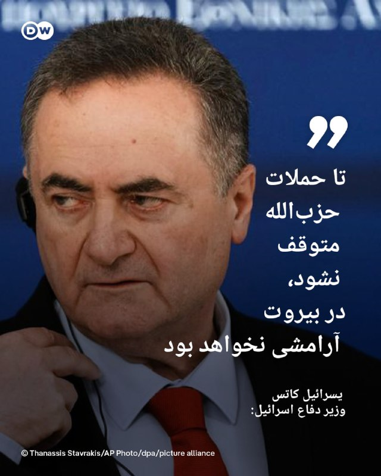

🔶 وزیر دفاع اسرائیل: تا حملات حزب‌الله متوقف نشود، در بیروت آرامشی نخواهد بود
 
وزیر دفاع اسرائیل روز دوشنبه گفت اگر حملات حزب‌الله ادامه یابد، "در بیروت نیز آرامشی وجود نخواهد داشت". او تأکید کرد که اسرائیل قصد دارد منطقه‌ای تحت کنترل نظامی خود در محدوده رود لیتانی در جنوب لبنان ایجاد کند.
 
 در بیانیه‌ای که از سوی یسرائیل کاتس منتشر شد، آمده است: «ضاحیه در بیروت هیچ تفاوتی با شهرک‌های شمال اسرائیل ندارد؛ اگر در شمال آرامش نباشد، در بیروت نیز آرامش نخواهد بود.»
 
"ضاحیه" در حومه جنوبی بیروت و یکی از پایگاه‌های اصلی حزب‌الله است؛ منطقه‌ای که وزیر دفاع اسرائیل پیش‌تر در همان روز دستور حمله به آن را صادر کرده بود.
 
بیانیه کاتس می‌افزاید: «در عین حال، ارتش اسرائیل به عملیات آتشباری و مانورهای نظامی علیه نیروها و زیرساخت‌های حزب‌الله در لبنان ادامه می‌دهد تا تهدیدها را از نیروهای ارتش اسرائیل و ساکنان اسرائیل دور کند و منطقه لیتانی را به منطقه‌ای تحت کنترل امنیتی ارتش اسرائیل، عاری از سلاح و نیروهای تروریستی، تبدیل کند.»
 
اسرائیل و حزب‌الله به‌طور مکرر یکدیگر را به نقض مفاد آتش‌بس متهم می‌کنند.
@dw_farsi

## DW_Farsi — post 125382

  

🔶 سپاه پاسداران از عبور ۱۵ کشتی از تنگه هرمز خبر داد
 
روابط عمومی نیروی دریایی سپاه روز دوشنبه با انتشار اطلاعیه‌ای اعلام کرد در ۲۴ ساعت گذشته ۱۵ فروند کشتی، از جمله ۴ نفتکش، از تنگه هرمزعبور کرده‌اند. طبق این اطلاعیه، عبور این کشتی‌ها "پس از کسب مجوز با هماهنگی و تأمین امنیت نیروی دریایی سپاه" صورت گرفته است.
 
خبرگزاری بلومبرگ اخیرا در گزارشی با استناد به داده‌های کشتیرانی نوشته بود از میان ۱۰۹ کشتی بزرگ با ظرفیت حمل ۷۰۰ هزار بشکه یا بیشتر که پس از آغاز جنگ آمریکا و اسرائیل با ایران و بسته شدن تنگه هرمز، گرفتار شده بودند تا کنون ۲۹ کشتی موفق به گذر از این آبراه شده‌اند.
 
مدیرعامل شرکت "شورون" روز جمعه به تلویزیون بلومبرگ گفته بود که برخی از کشتی‌هایی که از تنگه عبور می‌کنند، اخیراً هدف حمله قرار گرفته‌اند. طبق این گزارش چند تن از فعالان بازار کشتیرانی اظهار داشته‌اند که برخی از کشتی‌هایی که از این مسیر عبور کرده‌اند متعلق به شرکت‌هایی هستند که از زمان آغاز جنگ تاکنون از تنگه عبور نکرده بودند.
@dw_farsi

## DW_Farsi — post 125381

  

🔶 توقیف اموال ۱۸ تن در استان سمنان به اتهام "همکاری با دشمن"
 
رییس کل دادگستری استان سمنان از توقیف دارایی‌‌های ۱۸ شهروند به اتهام "همکاری با دشمن" خبر داد.
 
رسانه‌های داخلی روز دوشنبه ۱۱ خرداد به نقل از محمدصادق اکبری گزارش دادند تا کنون دارایی‌های منقول و غیرمنقول و همچنین حساب‌های بانکی ۴۰ نفر در این استان به اتهام "همکاری با سرویس‌های جاسوسی آمریکا و اسرائیل" توقیف شده است.
 
پس از آغاز جنگ آمریکا و اسرائیل با ایران در روز نهم اسفند سال گذشته، قوه قضائیه جمهوری اسلامی اموال صدها شهروند ایرانی را توقیف کرده است.
 
برخی از حقوقدانان مستقل بر این باورند که هرچند قوانین ایران در بعضی جرائم امنیتی یا موارد مربوط به اموال حاصل از ارتکاب جرم، امکان توقیف یا مصادره دارایی‌ها را پیش‌بینی کرده‌، اما ضبط تمامی اموال افراد صرفاً بر پایه اتهام "همکاری با دشمن" با چالش‌های حقوقی جدی مواجه است.
 
وکلای دادگستری تاکید دارند که این احکام غالباً بدون طی کردن روند قانونی دادرسی عادلانه، حق دفاع متهم، و اطلاع‌رسانی قبلی صادر و اجرا می‌شوند.
@dw_farsi

## DW_Farsi — post 125371

📸 صدمین زادروز مریلین مونرو؛ افسانه‌ای که هنوز زنده است

صد سال پیش مریلین مونرو، ستاره هالیوود و یکی از شناخته‌شده‌ترین نمادهای فرهنگ عامه در قرن بیستم، چشم به جهان گشود. او اول ژوئن ۱۹۲۶ در لس آنجلس به دنیا آمد و نورما جین مورتنسون نام گرفت.

بیش از شش دهه از مرگ مریلین مونرو می‌گذرد، اما او همچنان به‌عنوان "سمبل جذابیت جنسی" در فرهنگ عامه شناخته می‌شود و زندگی پر فراز و نشیبش همچنان توجه مخاطبان را به خود جلب می‌کند.

انستیتوی فیلم آمریکا، مریلین مونرو را در رتبه ششم فهرست بزرگ‌ترین بازیگران زن دوران طلایی هالیوود قرار داده است.

درخشش او از دهه‌های ۱۹۵۰ و ۱۹۶۰ آغاز شد. ایفای نقش شخصیت "بلوند اغواگر سربه‌هوا" در چندین فیلم معروف به شهرتش کمک کرد، اما استعداد بازیگری‌اش فراتر از این کلیشه بود. فیلم‌های او تا زمان مرگش بیش از ۲۰۰ میلیون دلار در گیشه فروش داشتند.
 
@dw_farsi

## Persian_Trend_Official — post 15441

  <a href="telegram/content/Persian_Trend_Official_15441_1780329221.webm" target="_blank">🎬 Download video</a>

قرارگاه مرکزی خاتم‌الانبیا اسرائیل را تهدید به حمله موشکی کرد!

سرلشکر خلبان علی عبداللهی، فرمانده قرارگاه‌ خاتم الانبیا: نتانیاهو در ادامه شرارت‌های خود در منطقه، ضاحیه و بیروت را تهدید به بمباران نموده و برای ساکنان آن هشدار تخلیه اعلام کرده است.

با توجه به نقض مکرر آتش بس توسط رژیم، در صورت عملی شدن این تهدید به ساکنان بخش‌های شمالی و شهرک‌های نظامی در سرزمین‌های اشغالی هشدار می‌دهیم اگر نمی‌خواهند آسیب ببینند منطقه را ترک نمایند.

📌 @persian_trend_official
پرشین ترند | متفاوت‌ترین کانال نظامی

## Persian_Trend_Official — post 15440

  

📷 Photo

## Persian_Trend_Official — post 15438

  <a href="telegram/content/Persian_Trend_Official_15438_1780329222.mp4" target="_blank">🎬 Download video</a>

یک نفتکش با پرچم پاناما که در آب‌های سرزمینی عراق فعالیت می‌کرد، در نزدیکی ام قصر مورد اصابت قرار گرفت.

به گفته UKMTO، یک پرتابه ناشناس به سمت راست کشتی برخورد کرد و باعث انفجار بزرگی شد.

📌 @persian_trend_official
پرشین ترند | متفاوت‌ترین کانال نظامی

## Persian_Trend_Official — post 15437

  <a href="telegram/content/Persian_Trend_Official_15437_1780329224.webm" target="_blank">🎬 Download video</a>

🚨 تراست VPN دوباره قیمت سرویس‌هاش رو کاهش داده و پلن‌های جدیدش واقعاً ارزش بررسی دارن. 👌

فرقی نمی‌کنه روی نت ملی باشین یا نت بین‌الملل، برای هر شرایطی سرویس مناسب دارن:

✅ سرور مناسب نت ملی
✅ سرور اقتصادی مناسب نت بین‌الملل

اگر قصد خرید یا تمدید VPN دارین، پیشنهاد می‌کنم حتماً یه پیام به پشتیبانی‌شون بدین و تعرفه‌های جدید رو استعلام بگیرین.
👇👇

@trusstvpnn_admin
@trusstvpnn_admin
@trusstvpnn_admin

## Persian_Trend_Official — post 15436

احتمالا نیاز به یک لایو اضطراری داریم
اوضاع در حال متشنج شدن هست ...

اگر موافق هستید ری اکشن بزارید

## Persian_Trend_Official — post 15435

  

برج مخابراتی‌ای که شب گذشته توسط نیروهای آمریکایی در نزدیکی سیریک در استان هرمزگان، جنوب ایران، هدف قرار گرفت.
📍 مختصات:
26°33'51.4"N 57°05'15.8"E

📌 @persian_trend_official
پرشین ترند | متفاوت‌ترین کانال نظامی

## Persian_Trend_Official — post 15434

  

به گزارش خبرگزاری تسنیم، ایران با استناد به نقض آتش‌بس از سوی اسرائیل در لبنان، تمام گفت‌وگوها و تبادل متن از طریق میانجی‌ها را متوقف کرده است.

مذاکره‌کنندگان ایرانی پیش‌تر موضوع لبنان را به‌عنوان یکی از پیش‌شرط‌های هرگونه توافق مطرح کرده بودند. اکنون با نقض آتش‌بس در همه جبهه‌ها، از جمله لبنان، ایران مذاکرات را به‌طور کامل تعلیق کرده است.

ایران خواستار توقف فوری عملیات اسرائیل در غزه و لبنان و همچنین عقب‌نشینی کامل اسرائیل از مناطق اشغالی لبنان شده است؛ شرطی که تهران می‌گوید پیش از ازسرگیری هرگونه گفت‌وگو باید اجرا شود.

همزمان، گزارش‌ها حاکی است که محور مقاومت و ایران تصمیم گرفته‌اند تنگه هرمز را به‌طور کامل مسدود کرده و جبهه‌های بیشتری را فعال کنند؛ از جمله تنگه باب‌المندب.

📌 @persian_trend_official
پرشین ترند | متفاوت‌ترین کانال نظامی

## Persian_Trend_Official — post 15433

  <a href="telegram/content/Persian_Trend_Official_15433_1780329226.mp4" target="_blank">🎬 Download video</a>

بخدا بازیگری قالیباف از گلزار بهتره !!!

📌 @persian_trend_official
پرشین ترند | متفاوت‌ترین کانال نظامی

## Persian_Trend_Official — post 15432

  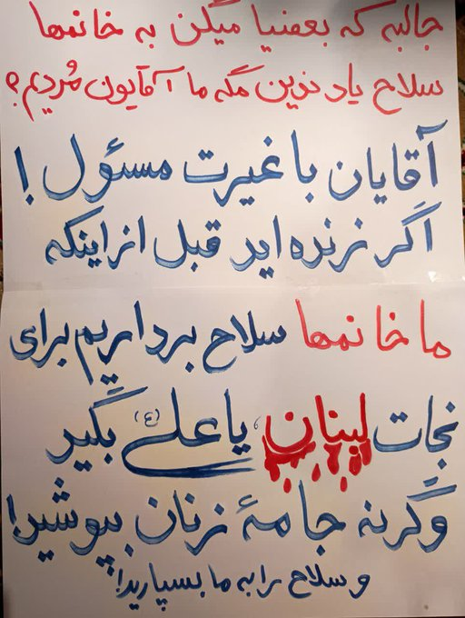

اوه اوه
اوضاع توی میدون انقلاب خرابه !

📌 @persian_trend_official
پرشین ترند | متفاوت‌ترین کانال نظامی

## Persian_Trend_Official — post 15431

  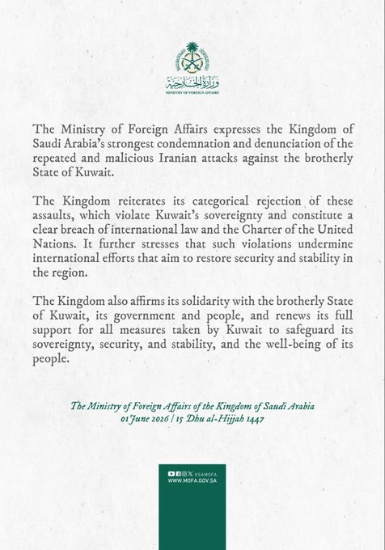

عربستان سعودی پس از آنکه سپاه پاسداران انقلاب اسلامی مسئولیت حمله به پایگاه آمریکایی در کویت را امروز صبح بر عهده گرفت، حملات «مکرر و بدخواهانه» ایران را به شدت محکوم کرد.

وزارت امور خارجه عربستان سعودی در بیانیه‌ای «رد قاطع» این حمله را تکرار کرد و گفت که این حمله حاکمیت کویت را نقض می‌کند و ناقض قوانین بین‌المللی و منشور سازمان ملل است.

در ادامه آمده است: «همچنین تأکید می‌شود که چنین تخلفاتی تلاش‌های بین‌المللی را که با هدف بازگرداندن امنیت و ثبات در منطقه انجام می‌شود، تضعیف می‌کند.»

در ادامه این بیانیه آمده است: «پادشاهی سعودی همچنین همبستگی خود را با کشور برادر کویت، دولت و مردم آن اعلام می‌کند و حمایت کامل خود را از تمام اقدامات کویت برای حفظ حاکمیت، امنیت، ثبات و رفاه مردمش تجدید می‌کند.»

📌 @persian_trend_official
پرشین ترند | متفاوت‌ترین کانال نظامی

## Persian_Trend_Official — post 15430

  <a href="telegram/content/Persian_Trend_Official_15430_1780329229.webm" target="_blank">🎬 Download video</a>

ژاپن از ایران خواست برای رسیدن به توافق با آمریکا «حداکثر انعطاف‌پذیری» را نشان دهد

📌 @persian_trend_official
پرشین ترند | متفاوت‌ترین کانال نظامی

## Persian_Trend_Official — post 15429

  <a href="telegram/content/Persian_Trend_Official_15429_1780329229.mp4" target="_blank">🎬 Download video</a>

برداشت میثم نیلی : طرح ۱۴ بندی از برجام هم بدتر است

📌 @persian_trend_official
پرشین ترند | متفاوت‌ترین کانال نظامی

## RadioFarda — post 157778

🔸رسانه‌های ایران ۱۱ خردادماه، از «نقض آتش‌بس» در همه جبهه‌ها از جمله لبنان خبر دادند
و نوشتند که تیم مذاکره‌کننده ایرانی گفتگوها و تبادل متون از طریق میانجی را متوقف می‌کند.

🔸مقامات رسمی ایران هنوز واکنشی به این خبر نشان ندادند.

🔸پیشتر سخنگوی وزارت خارجه بر «حفظ آتش‌بس» در لبنان تاکید کرده بود.

🔸همزمان نخست‌وزیر اسرائیل روز دوشنبه دستور حمله به جنوب بیروت را صادر کرد.

🔸وب‌سایت آکسیوس به نقل از منابع خود گزارش داده که تلاش جدید آمریکا برای آتش‌بس میان اسرائیل و لبنان «شکست» خورده است.

@RadioFarda

## RadioFarda — post 157777

  

🔸در پی انتشار اخباری از مریض‌احوالی میرحسین موسوی، از رهبران جنبش سبز ایران، اردشیر امیرارجمند، مشاور او، تأیید کرد که آقای موسوی «چند روزی است» به بیمارستان منتقل شده است.

🔸میرحسین موسوی به همراه همسرش زهرا رهنورد، دیگر رهبر جنبش سبز، هم‌چنان در حصر به سر می‌برد.

🔸امیرارجمند که در فرانسه اقامت دارد روز دوشنبه به رادیوفردا گفت که خانه این دو فعال سیاسی دیگر «قابل سکونت نیست»، محل نگهداری آن‌ها پس از انتقال‌شان «نامعلوم» است، و شرایط حصر «دشوارتر» شده است.

🔸محل سکونت این دو در حملات بی‌امان اسرائیل به تهران به‌شدت آسیب دیده است.

@RadioFarda

## RadioFarda — post 157776

تیراندازی در دانشگاه پزشکی قزوین دو کشته برجا گذاشت

🔸رسانه‌ها در ایران از وقوع حادثه‌ای مرگبار در قزوین خبر می‌دهند که صبح روز دوشنبه اتفاق افتاده و جان دو نفر را گرفته است.

🔸به گفته حمیدرضا قافله‌باشی، رئیس دانشگاه علوم پزشکی قزوین، در جریان تیراندازی که «به دلیل خصومت خانوادگی اتفاق افتاده» دو دانشجوی این دانشگاه «که زن و شوهر بودند» جان خود را از دست داده‌اند.

🔸بر اساس شرح حادثه از زبان برخی از کاربران شبکه‌های اجتماعی، صبح روز دوشنبه دانشجوی مرد وارد دانشکده دندانپزشکی قزوین می‌شود و «همسر خودش را با سلاح کمری به قتل می‌رساند و پس از ارتکاب جرم به زندگی خود پایان می‌دهد».

🔸در سال‌های اخیر به نظر می‌رسد دسترسی مردم در ایران به سلاح گرم بسیار آسان‌تر شده، و در شبکه اجتماعی تلگرام حتی آگهی فروش اسلحه هم می‌توان دید.

@RadioFarda

## RadioFarda — post 157775

  

🔸عباس عراقچی، وزیر خارجه ایران، در شبکه ایکس نوشت: «آتش‌بس میان ایران و آمریکا، بدون هیچ ابهامی، آتش‌بسی در تمام جبهه‌ها، از جمله لبنان، است.»

🔸او در این پیام، نقض آتش‌بس در هر جبهه‌ای را «به معنای نقض آتش‌بس در تمامی جبهه‌ها» عنوان کرده است.

🔸عراقچی آمریکا و اسرائیل را «مسئول پیامدهای هرگونه نقض این آتش‌بس» معرفی کرده است.

🔸ایران بارها این موضوع را اعلام کرده که آتش‌بس میان طرفین منازعه در جنگ ایران، باید سایر جبهه‌ها به‌ویژه جبهه لبنان را هم در بر بگیرد.

🔸ابوالفضل شکارچی، سخنگوی نیروهای مسلح جمهوری اسلامی نیز به اسرائیل هشدار داده که «تداوم جنایات در لبنان برای نیروهای مسلح ایران قابل تحمل نخواهد بود.»

🔸در تازه‌ترین بی‌توجهی به این درخواست جمهوری اسلامی، بنیامین نتانیاهو، نخست‌وزیر اسرائیل، به ارتش دستور داده اهدافی را در حومه جنوبی بیروت هدف قرار دهد.

@RadioFarda

## RadioFarda — post 157774

🔸مسعود پیاهو، شهروندی که به اتهام ثبت ویدئو از اعتراضات ۱۴۰۴ به ۱۰ سال زندان محکوم شده است، روز دوشنبه ۱۱ خرداد با انتشار پیامی ویدئویی جدید گفت: «با وجود آنکه در بازنشر آن هیچ نقشی نداشته است، روز سه‌شنبه برای اجرای حکم خود را به زندان معرفی می‌کند.»

🔸حسن آقاخانی، وکیل دادگستری، روز یکشنبه از محکومیت موکلش به اتهام ثبت ویدئو از معترضی که در جریان اعتراضات دی‌ماه سال گذشته مقابل مأموران پلیس ایران در خیابان روی زمین نشسته بود، خبر داد.

🔸آقاخانی تاکید کرد که مسعود پیاهو قصد انتشار «عمومی» ویدئو را نداشته و آن را در «استوری پرایوت» صفحه اینستاگرام خود منتشر کرده اما سپس شخص دیگری آن را به شکل عمومی منتشر کرد.

🔸انتشار این ویدئو از فردی که روز هشتم دی‌ماه و در دومین روز اعتراضات به تنهایی مقابل مأموران انتظامی روی زمین نشسته بود، به شکل گسترده منتشر شد، بازتاب‌های فراوانی ایجاد کرد.

🔸تصویر این معترض به یکی از نمادهای اعتراضات دی ماه ۱۴۰۴ تبدیل شد.

🔸آقاخانی روز یکشنبه گفت که دادگاه با استناد به «قانون تشدید مجازات جاسوسی و همکاری با رژیم صهیونیستی» آقای پیاهو را به «۱۰ سال حبس» محکوم کرد.

@Radiofarda

## RadioFarda — post 157773

رئیس فدراسیون فوتبال ایران: تنگناهای مالی به‌شدت تیم را آزار می‌دهد

🔸مهدی تاج، رئیس فدراسیون فوتبال ایران، روز یک‌شنبه دهم خرداد به گلایه از مشکلات مالی در بر سر راه آماده‌سازی تیم ملی فوتبال ایران در راه جام جهانی پرداخت.

🔸به گزارش خبرگزاری ایرنا، او در این باره توضیح داده که «تیم ملی در شرایط خوبی قرار دارد، اما تنگناهای مالی به‌شدت تیم را آزار می‌دهد. هزینه‌های تیم‌های مختلف ملی دلاری است. وزارت ورزش زیر ۲۰۰ میلیارد به ما کمک کرده است.»

🔸رئیس فدراسیون فوتبال ایران دربارهٔ آخرین خبر پیرامون صدور روادید تیم ملی فوتبال برای حضور در جام جهانی ۲۰۲۶ هم گفت: «مسئول برگزاری جام جهانی فیفا است و از نظر ما مسئول دادن ویزا هم فیفا است. وقتی کشوری متعهد به میزبانی می‌شود، یکی از تعهداتی که می‌دهند، صدور ویزا است. در جلساتی که رو در رو با فیفا داشتیم، آنها در این رابطه با ما هم‌نظر هستند.»

🔸در فاصله ۱۴ روز تا جام جهانی ۲۰۲۶، بلاتکلیفی ویزای تیم ملی فوتبال ایران ادامه دارد. خبرگزاری مهر گزارش داده که فدراسیون فوتبال با ارسال نامه‌ای تازه به فیفا خواستار تعیین تکلیف فوری این پرونده شده، اما به گفته این خبرگزاری، فیفا تاکنون پاسخی به نامه‌های فدراسیون نداده است.

🔸مهدی محمدنبی، سرپرست تیم ملی، دو روز پیشتر از این گفته بود هنوز نه ویزای مکزیک و نه ویزای آمریکا برای اعضای تیم صادر نشده و تیم ملی به روادید چندبار ورود هر دو کشور نیاز دارد. پیشتر نیز مهدی تاج اعلام کرده بود که به‌دلیل مشکل ویزا، محل اردوی تیم ملی از آریزونای آمریکا به تیخوانای مکزیک منتقل شده است.

🔸این ابهام در حالی ادامه دارد که به گفته سفیر جمهوری اسلامی در مکزیک، هنوز روشن نیست آمریکا به تیم ملی روادید خواهد داد یا نه؛ موضوعی که می‌تواند برنامه‌های ایران را در روزهای پایانی پیش از جام جهانی با مشکل جدی روبه‌رو کند.

🔸نسخه کامل این گزارش را در وب‌سایت رادیوفردا بخوانید.

@Radiofarda

## RadioFarda — post 157772

🔸ارتش اسرائیل روز دوشنبه ۱۱ خرداد تصاویری از ورود نیروهای یگان گشتی گولانی به قلعه تاریخی شقیف (بوفور) در جنوب لبنان را منتشر کرد.

🔸ییسرائیل کاتز، وزیر دفاع اسرائیل، روز یکشنبه از تصرف این دژ راهبردی قرون وسطایی در جنوب لبنان، که پرچم اسرائیل بر فراز آن برافراشته شده است، خبر داده بود.

🔸قلعه بوفور یا شقیف بر بخش‌های گسترده‌ای از جنوب لبنان اشراف دارد و به همین دلیل از اهمیت نظامی بالایی برخوردار است.

🔸قلعه تاریخی شقیف متعلق به دوران جنگ‌های صلیبی در استان نبطیه در جنوب لبنان است که در فاصله حدود ۱ کیلومتری در جنوب،جنوب شرقی روستای أرنون قرار دارد.

🔸صلاح‌الدین ایوبی،‌ نخستین سلطان مصر و شام در سال ۱۱۹۰ قلعه شقیف را فتح کرد، اما ۶۰ سال بعد صلیبی‌ها دوباره آن را بازپس گرفتند.

🔸در سال ۱۲۶۸ سلطان ظاهر رکن‌الدین بیبرس بندقداری در نهایت قلعه را برای نیروهای اسلامی تصرف کرد.

🔸قلعه شقیف یکی از نمونه‌های معدودی است که در آن یک قلعه قرون وسطایی در جنگ‌های مدرن نیز دارای ارزش و کاربرد نظامی بوده است، همان‌طور که تاریخ اواخر سده بیستم آن، به‌ویژه در طول جنگ ۱۹۸۲ لبنان این موضوع را نشان داد.

@Radiofarda

## RadioFarda — post 157771

  <a href="https://t.me/radiofarda/157771" target="_blank">📎 Download file</a>

📻بشنوید: ساعت ۱۴ با رادیوفردا، یازدهم خرداد ۱۴۰۵‌

@Radiofarda

## RadioFarda — post 157770

وقتی تفلیس از واشینگتن دور شد؛ گرجستان در میانهٔ پرونده نفوذ ایران

🔸یک گزارش تازه می‌گوید که نفوذ سیاسی، مذهبی و اقتصادی جمهوری اسلامی ایران در گرجستان به‌طرزی سیستماتیک گسترش یافته و تفلیس عملاً راه را برای آن باز کرده است؛ از جمله با افزایش شرکت‌های ایرانی، رشد واردات نفت و فراورده‌های پتروشیمی، و امکان دور زدن تحریم‌ها از مسیر تغییر برچسب کالاها.

🔸گزارشی از رادیو اروپای آزاد/رادیو آزادی حاکی است که واکنش حزب حاکم «رؤیای گرجی» به جای پاسخ‌گویی به یافته‌های این گزارش، فشار بر منتقدان و تهدید به پیگرد قانونی بوده است. در نتیجه، گرجستان که زمانی شریک نزدیک واشینگتن در قفقاز جنوبی بود، اکنون بیش از پیش در نگاه آمریکا به عنوان مسئله‌ای امنیتی و سیاسی دیده می‌شود و در دیپلماسی منطقه‌ای واشینگتن نیز به حاشیه رانده شده است.

🔸هنگامی که ایراکلی کوباخیدزه، نخست‌وزیر گرجستان، در هفتۀ جاری اشاره کرد که گیورگی کاندلاکی، قانون‌گذار پیشین و از نویسندگان گزارشی دربارۀ نفوذ ایران در کشورش، ممکن است با پیامدهای قانونی روبه‌رو شود، او این موضوع را مسئله‌ای مربوط به «نهاد دولتی ذی‌ربط» توصیف کرد.

🔸جان والترز، رئیس مؤسسۀ هادسون مستقر در ایالات متحده که این گزارش را منتشر کرده است، دیدگاه متفاوتی داشت: «واقعیت‌ها با هیاهو و تهدید تغییرپذیر نیستند. شما «رؤیای گرجی» نیستید، بلکه نابودکنندۀ رؤیاهای گرجی هستید.»

🔸این گفت‌وگو دریچۀ کوچک اما گویایی است که نشان می‌دهد روابط گرجستان با واشینگتن تا چه حد رو به تیرگی نهاده است و چگونه حزب حاکم رؤیای گرجی برای توقف این روند قهقرایی، یا ناتوان است یا بی‌میل.

🔸نسخه کامل این گزارش را در وب‌سایت رادیوفردا بخوانید.

@RadioFarda

## RadioFarda — post 157769

قانون طالبان «کودک‌عروس‌ها» را در ازدواج‌هایی که انتخاب نکرده‌اند گرفتار می‌کند

🔸ندا فقط ۱۲ ساله بود و دانش‌آموزی در کابل، وقتی والدینش او را به عقد یک خویشاوند دور درآوردند؛ مردی که هرگز او را ندیده بود.

🔸خانواده‌ ندا فقیر بودند، اما خانواده شوهرش وضع مالی بهتری داشتند. ندا باور دارد که «پول و بی‌سوادی مادرش» سرنوشت او را رقم زد. او به خانه شوهر جدیدش، مرد ۲۰ ساله‌ای در منطقه دورافتادۀ دَرواز در شمال شرق افغانستان برده شد؛ جایی که کودکی‌اش ناگهان پایان یافت.

🔸او به رادیو اروپای آزاد/رادیو آزادی گفت: «حتی پریود هم نشده بودم. هیچ تصوری از زندگی زناشویی یا رابطه جنسی نداشتم» و «والدینم حتی از من نپرسیدند که آیا می‌خواهم ازدواج کنم یا نه.»

🔸ندا که به‌دلیل حفط حریم خصوصی، نامش تغییر کرده، گفت که خانواده شوهرش انتظار داشتند تمام کارهای خانه را انجام دهد و اگر نمی‌توانست خانه را به سلیقه خانواده شوهر تمیز کند یا غذا بپزد، شوهرش او را کتک می‌زد؛ «به هر شکلی که قابل تصور بود، مورد آزار قرار گرفتم».

🔸سه سال بعد، پدرش در ماجرا دخالت کرد. با کمک او، ندا درخواست طلاق داد که این فرآیند از طریق دادگاه شرعی دو سال طول کشید.

🔸اگرچه ازدواج کودکان همیشه در افغانستان رایج بوده، اما گروه‌های حقوق بشری می‌گویند این پدیده از زمان بازگشت طالبان به قدرت در سال ۲۰۲۱ شدت گرفته است.

🔸در ۱۴ مه، طالبان قانون جدیدی در مورد طلاق صادر کردند که برای نخستین‌بار به طور ضمنی ازدواج کودکان در این کشور را مجاز دانست.

🔸این حکم با عنوان «جدایی قضایی زوجین» شرایط طلاق در دادگاه‌ها را مشخص می‌کند.

🔸طبق نظر کارشناسان پزشکی، محدوده سنی معمول برای شروع بلوغ در دختران بین هشت تا ۱۳ سالگی است. علمای اسلامی تفسیرهای متفاوتی از بلوغ دارند؛ برخی مکاتب فکری آن را ۱۵ یا ۱۸ سالگی می‌دانند، در حالی که چندین متن کلاسیک پیشنهاد می‌کنند که ۹ سالگی کمترین سنی است که دختری می‌تواند بالغ محسوب شود.

🔸نسخه کامل این گزارش را در وب‌سایت رادیوفردا بخوانید.

@RadioFarda

## RadioFarda — post 157768

  

🔸روابط عمومی نیروی دریایی سپاه پاسداران انقلاب اسلامی اعلام کرد طی شبانه‌روز گذشته ۱۵ فروند کشتی، از جمله ۴ نفتکش، پس از دریافت مجوز و با هماهنگی از تنگه هرمز عبور کرده‌اند.

🔸در اطلاعیه سپاه آمده است که «تردد این شناورها با نظارت و هماهنگی نیروهای دریایی سپاه انجام شده است.»

🔸پیشتر یک مقام رسمیِ ایالات متحده به روزنامهٔ نیویورک‌تایمز گفته بود ارتش آمریکا «بی‌سروصدا» کشتی‌های تجاری را برای عبور از تنگه هرمز هدایت می‌کند.

🔸به گفته مقامی دیگر، فرماندهی مرکزی آمریکا (سنتکام) طی سه هفته گذشته، حدود ۷۰ کشتی را در ورود و خروج از خلیج فارس همراهی کرده است.

🔸مقامات آمریکایی اشاره کردند که بیشترِ این کشتی‌ها برای جلوگیری از شناسایی توسط جمهوری اسلامی، فرستنده‌های خود را خاموش کرده بودند.

@RadioFarda

## RadioFarda — post 157767

  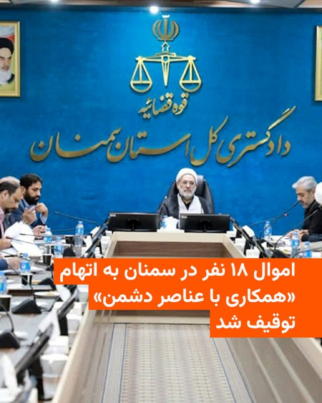

🔸رئیس کل دادگستری استان سمنان از توقیف اموال ۱۸ نفر به اتهام «همکاری با عناصر دشمن» در این استان خبر داد.

🔸روابط عمومی دادگستری استان سمنان به نقل از محمد صادق اکبری نوشته «تاکنون ۴۰ نفر به جرم همین همکاری با توقیف اموال و دارایی‌ها مواجه شدند.»

🔸او افزوده که «با صدور احکام قضایی لازم، دستور توقیف فوری تمامی دارایی‌های منقول، غیرمنقول و حساب‌های بانکی متهمان انجام شده است؛ همچنین دامنه شناسایی و توقیف اموال این افراد به سایر استان‌های کشور نیز گسترش یافته است.»

🔸آن‌طور که اکبری گفته با تأکید رئیس قوه قضائیه، رسیدگی به این پرونده‌ها در شعب ویژه، «با سرعت لازم پیگیری می‌شود و در برخورد با عناصر داخلی همسو با دشمنان، هیچ‌گونه مسامحه‌ای صورت نخواهد گرفت و قاطعانه رفتار خواهد شد».

🔸در نزدیک به سه ماهی که از آغاز جنگ می‌گذرد، به‌ویژه پس از آغاز آتش‌بس، تقریباً به‌طور روزانه خبر توقیف یا مصادره اموال افراد در رسانه‌های حکومتی منتشر شده، اما هرگز شواهد و مدارک مورد استفاده در دادگاه برای رسیدن به این حکم رسانه‌ای نشده است.

@RadioFarda

## RadioFarda — post 157766

  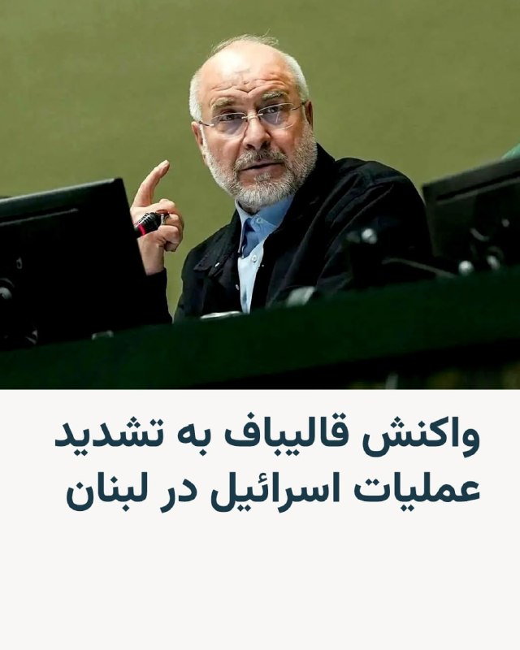

🔸محمدباقر قالیباف، رئیس مجلس شورای اسلامی و رئیس هیئت مذاکره‌کننده ایران با آمریکا، می‌گوید «محاصره دریایی و تشدید جنایات جنگی در لبنان» توسط اسرائیل، «شواهد آشکاری از عدم پایبندی آمریکا به آتش‌بس است».

🔸او بدون اشاره به جزئیات، در پیامی به زبان انگلیسی در شبکه ایکس، تهدید کرده که «هر انتخابی بهایی دارد، و زمان پرداخت آن فرا می‌رسد. همه‌چیز در نهایت سر جای خود قرار خواهد گرفت.»

🔸این پیام همزمان با تشدید عملیات نظامی اسرائیل در لبنان و علیه گروه حزب‌الله صورت می‌گیرد که از گروه‌های نیابتی جمهوری اسلامی در منطقه است.

🔸جمهوری اسلامی بارها گفته که آتش‌بس میان ایران و آمریکا باید شامل آتش‌بس در همه جبهه‌ها به ویژ‌ه جبهه لبنان شود؛ مطالبه‌ای که محقق نشده است.

@RadioFarda

## RadioFarda — post 157765

🔸وزیر کشور فرانسه اعلام کرد که در جریان ناآرامی‌هایی که پس از قهرمانی باشگاه پاری‌سن‌ژرمن در لیگ قهرمانان اروپا برای دومین سال پیاپی رخ داد، نزدیک به ۹۰۰ نفر بازداشت شدند.

🔸لوران نونز دوشنبه یازدهم خرداد، به رادیو «فرانس اینتر» گفت: «بیش از ۸۹۰ بازداشت داشته‌ایم. در مجموع، این رقم ۴۵ درصد بیشتر از سال گذشته است.»

🔸او همچنین افزود که نزدیک به ۱۸۰ نیروی پلیس و مأمور امنیتی در جریان این ناآرامی‌ها زخمی شده‌اند.

🔸پس از پیروزی تیم پاری‌سن‌ژرمن مقابل آرسنال در لیگ قهرمانان اروپا که بعدازظهر شنبه، نهم خرداد، برگزار شد، جشن‌های پیروزی در برخی مناطق این کشور به ناآرامی و خشونت کشیده شد.

🔸مقام‌ها اعلام کردند که میزان ناآرامی‌ها نسبت به سال گذشته، که پاری‌سن‌ژرمن برای نخستین بار قهرمان لیگ قهرمانان شد، حدود ۳۰ درصد افزایش داشته است. در جریان آشوب‌های سال ۲۰۲۵، دو نفر کشته، نزدیک به ۲۰۰ نفر زخمی و ۵۵۹ نفر بازداشت شده بودند.

🔸نسخه کامل این گزارش را در وب‌سایت رادیوفردا بخوانید.

@RadioFarda

## IranianMinds — post 21190

  

🔴سازمان حمل‌ونقل دریایی بریتانیا(UKMTO) گزارش داد که یک کشتی باری در خلیج‌فارس در حال عبور بوده، در ۴۰ مایلی دریای جنوب شرقی ام قصر عراق مورد حمله قرار گرفته است.
همینطور یک انفجار عظیمی پس از اصابت یک پرتابه ناشناس به سمت راست کشتی رخ داده است.

@IranianMinds

## IranianMinds — post 21189

  <a href="telegram/content/IranianMinds_21189_1780329237.mp4" target="_blank">🎬 Download video</a>

🔴فرودگاه بن گوریون در اسرائیل، تل‌آویو، انبوه هوایپماهای نظامی آمریکا.

@IranianMinds

## IranianMinds — post 21188

🔴فوری

جمهوری اسلامی مذاکرات با آمریکا را متوقف کرد به دلیل حمله های گسترده ی آمریکا به بیروت

و گفته که به زودی به اسرائیل پاسخ میدیم

+ هرکی نده

@IranianMinds

## IranianMinds — post 21187

🔴بی‌ناموس حروم‌زاده کثیف، ما می‌دونیم شماها دشمن ایران هستین.

@IranianMinds

## IranianMinds — post 21186

  

🔴عباس عراقچی

برای توجه فوری:

آتش‌بس میان ایران و ایالات متحده به طور قاطع، آتش‌بسی در تمام جبهه‌ها از جمله لبنان می‌باشد.
نقض کردن آن در یک جبهه، نقض آتش‌بس در همه جبهه‌ها به حساب می‌‌آید.
ایالات متحده و اسرائیل مسؤول پیامدهای هرگونه نقض هستند.

@IranianMinds

## IranianMinds — post 21185

  

🔴پست ترامپ در تروث‌سوشال:

آیا کسی تا به الان یک دموکرات خوشحال دیده است؟؟؟

@IranianMinds

## IranianMinds — post 21184

  

محمدباقر قالیباف:
محاصره دریایی و تشدید جنایات جنگی در لبنان، گواه عدم پایبندی واشنگتن به آتش بس است و هر گزینه ای بهایی دارد که پرداخت خواهد شد.

@IranianMinds

## IranianMinds — post 21183

  

امروز صبح تو دانشکده‌ دندونپزشکی قزوین، یه مرده با کلت کمری وارد دانشگاه شد و همونجا زنش رو کشت و بعدشم به خودش شلیک و خودکشی کرد...

@IranianMinds

## IranianMinds — post 21182

  

‏🔴کاش یه خارجی بودم که با دیدن این شمع یاد موج می‌افتاد، نه عمامه.

@IranianMinds

## BBCPersian — post 282585

یاسمین شاه‌کرمی، خواهر امیرمحمد، معترض ۱۴ ساله چند روز پیش بعد از وصل شدن نسبی اینترنت در ایران ویدیویی از لحظه شناسایی جسد برادرش ۶۰ روز بعد از اعتراضات دی ماه منتشر کرد.

امیرمحمد شاه‌کرمی در جریان اعتراضات دی ماه ۱۴۰۴ و کشتار بی‌سابقه معترضان به خانه بازنگشت. خواهر امیرمحمد می‌گوید پیگیری‌های خانواده بی‌نتیجه بود تا اینکه روز ۲۰ دی گوشی امیرمحمد روشن می‌شود و ماموران اطلاعات به خانواده اطلاع می‌دهند که او زنده و در بازداشت است.

براساس گفته‌های یاسمین شاه‌کرمی، در پیگیری‌های خانواده از طریق آموزش و پروزش، وضعیت امیرمحمد محرمانه اعلام شده بود. در حالی که خانواده امکان برقراری هیچ تماسی با امیرمحمد را نداشتند، جستجوی آنها در بیمارستان‌ها و سردخانه‌ها هم بی‌نتیجه بوده است.

تا اینکه ۶۰ روز بعد، از پزشکی قانونی کهریزک با آنها تماس گرفته می‌شود که برای شناسایی یک جسد مراجعه کنند.

یاسمین شاه‌کرمی می‌گوید شواهد نشان می‌دهد برادرش در بازداشت کشته شده است. او می‌گوید «سینه و پهلوی او کبود بود و اثر تیر خلاص بر شقیقه او دیده می‌شد.»
@BBCPersian

## BBCPersian — post 282584

🔻امیرحسین سعادت، فعال دانشجویی سابق، در تبریز بازداشت شد

امیرحسین سعادت، فارغ‌التحصیل مقطع کارشناسی ارشد دانشگاه علامه طباطبایی و دبیر سابق شورای صنفی این دانشگاه، صبح روز دوشنبه ۱۱ خرداد در شهر تبریز بازداشت شد.

بر اساس گزارش‌ها، نیروهای وزارت اطلاعات با ضرب و شتم او را در محل کار بازداشت کردند. مأموران سپس به منزلش رفته و ضمن تفتیش خانه، بخشی از وسایل شخصی او را ضبط کردند.

اطلاعاتی درباره دلیل بازداشت یا محل نگهداری او منتشر نشده است.

امیرحسین سعادت از فعالان دانشجویی سابق و دبیر پیشین شورای صنفی دانشگاه علامه طباطبایی بوده است.

@BBCPersian

## BBCPersian — post 282580

🔻خبرگزاری ایسنا تصاویری را از ساختمان قدیم مجلس ایران منتشر کرده است که شدت خسارت‌های واردشده به این بنا در حملات آمریکا و اسرائیل را نشان می‌دهد.

این ساختمان در ۱۲ اسفند و در چهارمین روز جنگ هدف حمله نظامی قرار گرفت. در تصاویر منتشرشده به نظر می رسد عملیات بازسازی این ساختمان شروع شده است.

این بنا که پیش از انقلاب بهمن ۵۷ محل تشکیل مجلس سنا بود، پس از انقلاب میزبان مجلس خبرگان قانون اساسی شد و سپس در اختیار مجلس شورای اسلامی قرار گرفت.
پس از انتقال مجلس شورای اسلامی به ساختمان جدیدی که در همان نزدیکی ساخته شده بود، ساختمان پیشین مجلس کاربری‌های متفاوتی پیدا کرد.

از جمله، این ساختمان در یک دهه اخیر در اختیار مجمع تشخیص مصلحت نظام قرار گرفت و سالی دو بار هم نشست مجلس خبرگان رهبری در آن برگزار می‌شد.

📷ISNA
https://bbc.in/4xgsxFw
@BBCPersian

## BBCPersian — post 282579

🔻یاشار دارالشفا، زندانی سیاسی پیشین، بازداشت شد

یاشار دارالشفا، زندانی سیاسی پیشین، صبح امروز در تهران بازداشت شد.

به گزارش خبرگزاری حقوق‌بشری هرانا، یاشار دارالشفا صبح دوشنبه با مراجعه نیروهای امنیتی و پس از تفتیش خانه، بازداشت شد.

از علت بازداشت و نهاد بازداشت‌کننده او اطلاعاتی منتشر نشده است.

یاشار دارالشفا چندین بار بازداشت و زندانی شده است. او آخرین بار در بهمن ۱۴۰۱ از زندان آزاد شد.

https://bbc.in/4xgsxFw
@BBCPersian

## BBCPersian — post 282577

🖊بهرنگ تاج‌دین، خبرنگار اقتصادی بی‌بی‌سی فارسی

بررسی‌های بانک مرکزی ایران نشان می‌دهد که روند افزایش قیمت‌ها در کشور دارد سریع‌تر می‌شود.

طبق گزارش ماهانه این نهاد، قیمت کالاها و خدمات مصرفی در مناطق شهری در اردیبهشت‌ماه ۱۴۰۵ به طور متوسط بیش از ۷۷ درصد بالاتر از اردیبهشت پارسال بوده است. به این رقم «تورم نقطه به نقطه» گفته می‌شود و در دست کم دهه‌های اخیر بی‌سابقه است.

به گفته بانک مرکزی، قیمت اقلام مصرفی از فروردین تا اردیبهشت امسال به طور میانگین هشت‌ونیم درصد افزایش یافته است که این هم بالاترین رقم تورم ماهانه در آمارهای این نهاد از خرداد ۱۴۰۱ است.

این گزارش نشان می‌دهد قیمت مواد غذایی ظرف ۱۲ ماه به طور متوسط ۱۱۹ درصد افزایش یافته؛ یعنی بیشتر از دو برابر شده است.

به گفته بانک مرکزی، تنها ظرف دو ماه اول امسال، قیمت لوازم خانگی حدود ۳۵ درصد، هزینه‌های ارتباطات و بهداشت و درمان بیش از ۴۰ درصد، و قیمت دخانیات بیش از ۵۰ درصد بالا رفته است.

📷 Getty Images
@BBCPersian

## BBCPersian — post 282576

🔻تسنیم: ایران تصمیم گرفته تبادل پیام با آمریکا را متوقف کند

خبرگزاری تسنیم می‌گوید اطلاع یافته است که «با عنایت به اینکه لبنان جزء پیش‌شرط‌های آتش‌بس بوده است و هم اینک این آتش‌بس در همه جبهه‌ها از جمله لبنان نقض شده است» تیم مذاکره‌کننده ایران «گفتگوها و تبادل متون از طریق میانجی را متوقف می‌کند.»

بنابر این گزارش، تا «توقف فوری» حملات اسرائیل به لبنان و غزه و «عقب‌نشینی کامل» از مناطق اشغال‌شده لبنان محقق نشود «گفت‌وگویی در کار نخواهد بود.»

این خبرگزاری که به نهادهای نظامی و امنیتی نزدیک است نوشت: «جبهه مقاومت و ایران عزم خود را بر انسداد کامل تنگه هرمز و فعال کردن سایر جبهه‌ها از جمله تنگه باب‌المندب» و «گشودن جبهه‌های جدید» قرار داده‌اند.

در ساعت‌های گذشته مقام‌های ارشد ایران بر توقف حملات اسرائیل در لبنان تاکید کرده‌اند از جمله عباس عراقچی، وزیر خارجه‌، در شبکه ایکس نوشت:

«آتش‌بس میان ایران و ایالات متحده، بدون هیچ ابهامی، آتش‌بس در تمامی جبهه‌ها، از جمله لبنان، محسوب می‌شود.»

https://bbc.in/4xgsxFw
@BBCPersian

## BBCPersian — post 282575

🔻تصاویری که از تجمع‌های شبانه حکومتی در ایران منتشر شده، نشان می‌دهد کشمکش در مورد مذاکره با آمریکا همچنان در بین حامیان حکومت ادامه دارد.

در ویدیویی که از یکی از این تجمعات طی روزهای اخیر منتشر شده، حسین طاهری، مداح، می‌گوید: «اگر مذاکره می‌کنید، نتیجه‌اش را بگویید، اگر توافق می‌کنید، نتیجه‌اش را بگویید.... تا لااقل ما در خیابان تکلیف خودمان را بدانیم.»

این در حالی است که محمد طاهری، مداح و پدر حسین طاهری، پیش از این در یکی از این تجمع‌ها به نقل از مجتبی خامنه‌ای گفت: «رهبر انقلاب در دیدار حضوری فرمودند: به مردم بگویید در میادین، حرفی که برای تضعیف دولت و تضعیف تیم مذاکره‌کننده باشد، اصلا به زبان نیاورید.»

در ویدیوی دیگری هم که از این تجمعات منتشر شده، گروهی از حاضران شعار می‌دهند: «با قاتلین رهبر، مذاکره نداریم» و «جان امام در خطره، مذاکره بی‌ثمره». سپس فردی تلاش می‌کند این گروه شعاردهنده را ساکت کند.

تاریخ دقیق ضبط این ویدیوها مشخص نیست.

تحلیلگران سیاسی در ایران هم پیش از این به نقش این تجمعات در ایجاد فشار برای ادامه جنگ و جلوگیری از توافق با آمریکا اشاره کرده‌اند.

@BBCPersian

## BBCPersian — post 282574

🔻ارتش آمریکا: دو موشک بالستیک ایران را در آسمان کویت رهگیری کردیم

ارتش آمریکا می‌گوید دو موشک بالستیک ایران را که به سمت نیروهایش در کویت شلیک شده بود، «با موفقیت» رهگیری کرده است.

بر اساس بیانیه فرماندهی مرکزی آمریکا در منطقه، سنتکام، در شبکه ایکس، این حمله بامداد امروز ساعت ۶:۳۰ به وقت تهران انجام گرفته است.

به گفته سنتکام هیچ یک از پرسنل آمریکا در این حمله آسیبی ندیدند.

در این بیانیه آمده است: «فرماندهی مرکزی آمریکا هوشیارانه به حفاظت از نیروهایمان در برابر اقدامات خصمانه ایرانی‌ها ادامه می‌دهد و همزمان از ادامه آتش‌بس حملیت می‌کند.»

ساعاتی پیش سپاه پاسداران گفته بود که در پاسخ به حمله آمریکا به «یک دکل مخابراتی در جزیره سیریک» نیروهایش «پایگاه هوایی مبدا» را هدف قرار داده‌اند.

ارتش آمریکا هم قبل از آن اعلام کرده بود که در پاسخ به «اقدامات خصمانه» ایران از جمله سرنگون کردن یک پهپاد آمریکایی، «مراکز راداری و مراکز فرماندهی و کنترل پهپادهای ایران در شهر گروگ و جزیره قشم» را هدف حمله قرار داده است.

سپاه پاسداران پنج‌شنبه گذشته گفته بود که پس از حمله آمریکا به «نقطه‌ای در حاشیه فرودگاه بندرعباس با پرتابه‌های هوایی، پایگاه هوایی آمریکایی مبدا» هدف حمله قرار گرفته است.

خبرگزاری بلومبرگ گزارش داد که پنج نفر پرسنل نظامی و پیمانکار آمریکایی در برخورد بقایای موشک بالستیک فاتح-۱۱۰ ایران به پایگاه هوایی علی السالم در کویت زخمی شدند و به دو پهپاد هم آسیب وارد شده است.

https://bbc.in/4xgsxFw
@BBCPersian

## BBCPersian — post 282573

🔻عربستان سعودی: حملات مکرر و شنیع ایران به کویت را با شدیدترین لحن محکوم می‌کنیم

وزارت خارجه عربستان سعودی در بیانیه‌ای «حملات مکرر و شنیع ایران به کویت» را به «شدیدترین لحن محکوم و تقبیح» کرد.

در این بیانیه عربستان «بار دیگر مخالفت قاطع خود را با این حملات که حاکمیت دولت کویت را تضعیف می‌کند» اعلام کرد و آن را «نقض آشکار قوانین بین‌المللی و منشور سازمان ملل متحد» دانست.

سپاه پاسداران امروز اعلام کرده بود که در واکنش به حمله آمریکا به یک دکل مخابراتی در جزیره سیریک در جنوب ایران، پایگاهی را که آمریکا از مبدا آن این حمله را انجام داد، هدف قرار داده است.

در بیانیه سپاه به محل این حمله اشاره نشده بود اما وزارت خارجه کویت در بیانیه‌ای حملات موشکی و پهپادی ایران را «به‌شدت» محکوم کرد و آن را «نقض فاحش حاکمیت ملی کویت و تهدیدی برای امنیت ثبات منطقه» دانست.

https://bbc.in/4xgsxFw
@BBCPersian

## BBCPersian — post 282572

  <a href="https://t.me/bbcpersian/282572" target="_blank">📎 Download file</a>

تازه‌ترین خبرهای جهان دوشنبه ۱۱ خرداد ۱۴۰۵ از رادیو بی‌بی‌سی

## BBCPersian — post 282571

  <a href="telegram/content/BBCPersian_282571_1780329243.mp4" target="_blank">🎬 Download video</a>

⭕️ سرخط خبرهای دوشنبه ۱۱ خرداد ۱۴۰۵

## BBCPersian — post 282570

🔻کلمه: میرحسین موسوی در بیمارستان بستری است

وبسایت خبری کلمه می‌گوید میرحسین موسوی در بیمارستان بستری شده است. این سیاستمدار مخالف از سال ۱۳۸۹ در حبس خانگی به سر می‌برد.

بر اساس گزارش کلمه که اخبار مربوط به میرحسین موسوی را منتشر می‌کند، آقای موسوی همراه همسرش زهرا رهنورد، پس از آغاز حملات اسرائیل و آمریکا و بمباران خیابان محل حصر خانگی‌شان، به مکانی خارج از آن محدوده منتقل شده‌اند.

کلمه می‌گوید: «در این مدت، میرحسین موسوی به دلیل بیماری و وضعیت جسمی در بیمارستان بستری شده است.»

در این گزارش همچنین آمده است که آقای موسوی و خانم رهنورد «بر این باورند که مانند تمام جنگ‌زدگان لازم است در محل ثابتی اسکان داده شوند.»

آقای موسوی سال گذشته و پس از جنگ ۱۲ روزه، خواستار تشکیل مجلس مؤسسان و تغییر قانون اساسی ایران شده بود.

https://bbc.in/4xgsxFw
@BBCPersian

## BBCPersian — post 282569

🔻نایب رئیس مجلس: برگزاری جلسات علنی منوط به اذن رهبر است

اعضای هیئت رئیسه مجلس امروز به موضوع ازسرگیری جلسات علنی پرداخته‌اند و علی نیکزاد آن را منوط به «اذن رهبری» دانست.

به گزارش ایسنا، علی نیکزاد، نایب رئیس مجلس، اظهار امیدواری کرد که جلسه علنی مجلس «هفته آینده» برگزار شود: «البته برگزاری جلسات علنی منوط به دریافت اذن است. رهبری اگر مصلحت بدانند و دستور دهند، ما می‌توانیم جلسه علنی را با تعدادی از نمایندگان در صحن و سایرین به صورت مجازی برگزار کنیم.»

بنا بر این گزارش، «طبق مصوبه شورای عالی امنیت ملی تجمع یکجای مجلس پذیرفتنی نیست.»

اعضای دیگر هیئت رئیسه به مجوز شورای عالی امنیت ملی اشاره کرده بودند.

علیرضا سلیمی،عضو هیئت رئیسه مجلس، امروز گفت: «فرآیند هماهنگی‌ها و مقدمات لازم طبق نظر شورای عالی امنیت ملی برای برگزاری جلسات علنی مجلس آغاز شده است تا جلسات به‌زودی برگزار شود.»

عباس گودرزی، سخنگوی هیئت رئیسه مجلس، هم امروز گفته بود که «هیئت رئیسه مجلس مخالفتی با برگزاری جلسات ندارد اما این امر مستلزم تایید مراجع امنیتی است.»

آخرین جلسه علنی مجلس شورای اسلامی در محل دائمی، بهمن سال گذشته بود. پس از حمله آمریکا و اسرائیل به ایران در ۹ اسفند (۲۸ فوریه)، جلسات مجلس دیگر در محلش تشکیل نشده است.

https://bbc.in/4xgsxFw
@BBCPersian

## BBCPersian — post 282568

  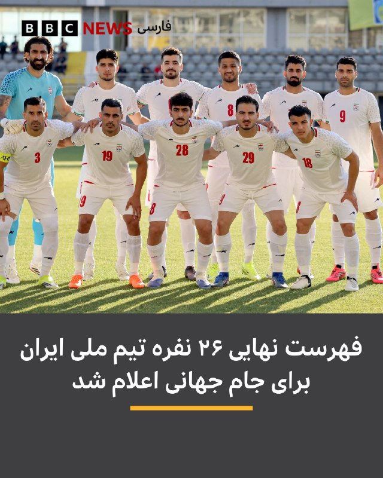

🔸امیر قلعه‌نویی سرمربی تیم ملی فوتبال ایران فهرست نهایی نام ۲۶ بازیکن را برای حضور در جام جهانی اعلام کرد.

بازیکنان دعوت شده برای حضور در جام جهانی عبارتند از:
دروازه‌بان‌ها: علیرضا بیرانوند، حسین حسینی، پیام نیازمند
مدافعان: احسان حاج صفی، میلاد محمدی، علی نعمتی، دانیال ایری، شجاع خلیل‌زاده، محمدحسین کنعانی، آریا یوسفی، صالح حردانی، رامین رضاییان
بازیکنان میانی: علیرضا جهانبخش، سعید عزت‌اللهی، روزبه چشمی، امیرمحمد رزاق‌نیا، محمد محبی، مهدی قائدی، سامان قدوس، محمد قربانی، مهدی ترابی
مهاجمان: علی علیپور، شهریار مغانلو، دنیس درگاهی، امیرحسین حسین‌زاده و مهدی طارمی
به گفته کادرفنی، محمد خلیفه و امید نورافکن با قرار گرفتن در لیست انتظار، تیم ملی را در سفر به جام جهانی همراهی خواهند کرد و در صورت مصدومیت بازیکنی ۲۴ ساعت مانده به مسابقات جایگزین خواهند شد. کسری طاهری، هادی حبیبی نژاد و امیرحسین محمودی نیز به طور کامل از فهرست تیم ملی خط خوردند.
بزرگ‌ترین غایب این فهرست، سردار آزمون، مهاجمی با ۵۷ گل در ۹۱ بازی ملی است، که پس از انتشار یک عکس با حاکم دوبی دیگر به تیم ملی دعوت نشد.

📷 Getty Images
@BBCPersian

## BBCPersian — post 282566

  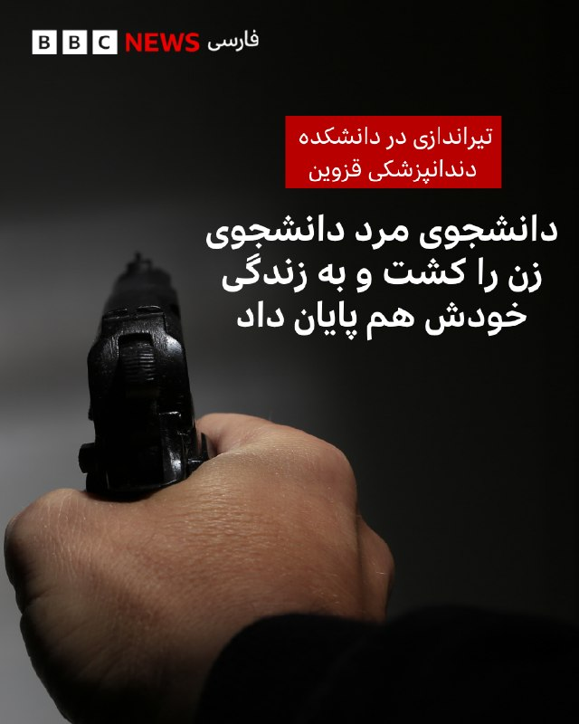

🔻رسانه‌های ایران از کشته شدن یک دانشجوی زن در دانشکده دندانپزشکی قزوین به ضرب گلوله خبر داده‌اند.

⚠️هشدار: این خبر ممکن است برای برخی ناراحت‌کننده باشد

میزان، خبرگزاری قوه قضائیه، از قول دادستان قزوین نوشت: «بررسی‌های اولیه نشان می‌دهد این دو دانشجو که در آستانه فارغ‌التحصیلی قرار داشتند، در مرحله متارکه از یک رابطه عاطفی بوده و پیش از این نیز اختلافات خانوادگی شدیدی با یکدیگر داشتند. صبح امروز، مرد جوان با یک قبضه سلاح کلت جنگی وارد محوطه درمانگاه شده و چهار گلوله به ناحیه سینه دانشجوی دختر شلیک کرده است. شدت جراحات وارده به‌حدی بوده که متأسفانه وی در همان محل جان خود را از دست می‌دهد.

در اطلاعیه دانشگاه علوم پزشکی قزوین در این باره آمده است: «انگیزه این واقعه، مسایل شخصی و خانوادگی بوده و ارتباطی با فرآیندهای اداری یا محیط آموزشی دانشکده ندارد.»

به گفته حمیدرضا قافله باشی، رئیس دانشگاه علوم پزشکی قزوین، «این تیراندازی به دلیل خصومت‌ خانوادگی اتفاق افتاده و دو دانشجو که زن و شوهر بودند در اثر شلیک جان خود را از دست داده‌اند.»
📷 Getty Images
@BBCPersian

## BBCPersian — post 282556

🖊بخش پادکست, بی‌بی‌سی روسی

روسیه ارمنستان را تهدید کرده است که اگر ایروان به روند نزدیکی خود به اتحادیه اروپا ادامه دهد، صادرات گاز و فرآورده‌های نفتی به این کشور را متوقف خواهد کرد. پیش از این نیز مقامات روسیه واردات آب معدنی، نوشیدنی‌های الکلی و گل از ارمنستان را ممنوع کرده بودند.
در حالی که روابط میان مسکو و ایروان طی سال‌های اخیر به‌طور محسوسی تیره شده است، روابط ارمنستان با اتحادیه اروپا و ایالات متحده در حال گسترش است. مارکو روبیو، وزیر امور خارجه آمریکا، چند روز پیش در سفری کوتاه به ارمنستان، اسنادی را امضا کرد که همکاری‌های نظامی و اقتصادی میان واشنگتن و ایروان را تقویت می‌کند.

اولگ آنتوننکو، مجری پادکست «چه اتفاقی افتاد؟» در بخش روسی بی‌بی‌سی، در گفت‌وگویی با کریل کریوشیف، روزنامه‌نگار و تحلیلگر مسائل منطقه، بررسی کرده است که سیاست خارجی چگونه بر رقابت انتخاباتی ارمنستان تأثیر می‌گذارد.
ادامه مطلب:
https://bbc.in/4egfpsg
📷Getty/ Reuters/ ALEXANDER PATRIN/TASS/ SOFYA SANDURSKAYA/TASS
@BBCPersian

## idfinfarsi — post 11703

  

‏‼️«کنترل بر رشته‌کوه بوفور دارای اهمیت‌های عملیاتی مهمی است. این منطقه یک دارایی جغرافیایی مرکزی برای حزب‌الله محسوب می‌شود و به‌عنوان مرکز عصبی این سازمان عمل می‌کند. از اینجا، این سازمان بر مناطق الجلیل و متولا از نظر آتش و دیده‌بانی تسلط دارد. تنها از آغاز عملیات “غرش شیران”، بیش از ۴۰۰ پرتابه از این منطقه شلیک شده است»

‏⭕️«ارتش اسرائیل در سراسر لبنان، از ضاحیه تا صور، حمله کرده و به حملات خود ادامه خواهد داد. در هر جایی که تهدیدی علیه شهروندان اسرائیل و نیروهای ارتش اسرائیل وجود داشته باشد — ما برای رفع آن اقدام خواهیم کرد»

‏⭕️متن کامل سخنان سخنگوی ارتش اسرائیل، سرتیپ افی دفرین در مرز شمال:

‏«ظهر بخیر. دیروز، نه چندان دور از اینجا، نیروهای ارتش اسرائیل به رهبری لشکر ۳۶ تحت فرماندهی شمال، یک عملیات گسترده را به پایان رساندند. در جریان این عملیات، ما به کنترل عملیاتی بر رشته‌کوه بوفور و منطقه دره سلوقی در جنوب لبنان دست یافتیم. اکنون نیروهای لشکر ۳۶ بر رشته‌کوه بوفور مسلط هستند.

‏⭕️این یک عملیات مهم بود که برای مدت طولانی برنامه‌ریزی شده و پس از روند منظم آماده‌سازی رزمی، با تأیید رئیس ستاد کل ارتش انجام شد. کنترل بر رشته‌کوه بوفور دارای اهمیت‌های عملیاتی مهمی است. این منطقه یک دارایی جغرافیایی مرکزی برای حزب‌الله محسوب می‌شود و به‌عنوان مرکز عصبی این سازمان عمل می‌کند. از اینجا، این سازمان بر مناطق الجلیل و متولا از نظر آتش و دیده‌بانی تسلط دارد. تنها از آغاز عملیات “غرش شیران”، بیش از ۴۰۰ پرتابه از این منطقه شلیک شده است.

‏⭕️زیرساختی که حزب‌الله ایجاد کرده، یک زیرساخت ایرانی است که به‌عنوان یک مرکز مهم فرماندهی و کنترل هم در سطح و هم در زیرزمین عمل می‌کند. ما در حال تضعیف توانایی‌های حزب‌الله هستیم و به تعمیق ضربه به آن ادامه می‌دهیم. در کنار دستاوردهای عملیاتی، این نبرد هزینه‌های سنگینی از ما گرفته است. در نبردهای دیروز و امروز، گروهبان ارشد آدم تسرفتی و گروهبان ارشد میخائیل تیوکین جان‌باختند، یادشان گرامی. میخائیل، ۲۱ ساله از اشکلون، رزمنده یگان گشتی گیوعاتی، و آدم، ۲۰ ساله از روش هاعین، رزمنده یگان ماگلان. آن‌ها در نبرد بر سر این رشته‌کوه و در حالی که از شهرک‌های شمال دفاع می‌کردند، جان باختند. من به خانواده‌های آن‌ها تسلیت می‌گویم، ما آن‌ها را در آغوش می‌گیریم و به همراهی با آن‌ها ادامه خواهیم داد.

‏⭕️ارتش اسرائیل در سراسر لبنان، از ضاحیه تا صور، حمله کرده و به حملات خود ادامه خواهد داد. در هر جایی که تهدیدی علیه شهروندان اسرائیل و نیروهای ارتش اسرائیل وجود داشته باشد — ما برای رفع آن اقدام خواهیم کرد.»

## idfinfarsi — post 11693

  <a href="telegram/content/idfinfarsi_11693_1780329248.mp4" target="_blank">🎬 Download video</a>

‼️پس از سه ماه نبرد: لشکر ۱۴۶ سومین دور نبرد خود را به پایان رساند و مأموریت خود در جنوب لبنان را تکمیل کرد

🔸لشکر ۱۴۶ در طول سه ماه گذشته در منطقه خط دفاعی پیشرو در جنوب لبنان برای به هلاکت رساندن تروریست‌ها، انهدام زیرساخت‌های تروریستی سازمان تروریستی حزب‌الله و رفع تهدیدات علیه شهروندان کشور اسرائیل فعالیت کرد.

🔸در طول این عملیات، نیروها بیش از ۵۵۰ تروریست را به هلاکت رساندند و بیش از ۲۷۰۰ زیرساخت تروریستی را منهدم کردند، از جمله: بیش از ۲۰۰ انبار تسلیحاتی که با همکاری نیروی هوایی منهدم شد و ده‌ها مسیر زیرزمینی که با همکاری یگان مهندسی ویژه منهدم شدند.

## idfinfarsi — post 11691

## idfinfarsi — post 11690

‼️پس از پیشبرد طرح‌های تروریستی علیه نیروهای ارتش اسرائیل: یک تروریست از شاخه نظامی سازمان تروریستی حماس که به‌عنوان پزشک در بیمارستان فعالیت می‌کرد، به هلاکت رسید

⭕️نیروهای ارتش اسرائیل دو روز گذشته (شنبه) به‌صورت هدفمند در مرکز نوار غزه حمله کرده و تروریست جمال ابو عون، فرمانده یک واحد در شاخه نظامی سازمان تروریستی حماس را که به‌طور همزمان به‌عنوان پزشک در بیمارستان یافا در دیرالبلح فعالیت می‌کرد، به هلاکت رساندند.

⭕️وی در چارچوب نقش خود در این سازمان تروریستی، فرماندهی تروریست‌های حماس را بر عهده داشت و به پیشبرد و طراحی طرح‌های تروریستی علیه نیروهای ارتش اسرائیل و کشور اسرائیل می‌پرداخت. در دوره اخیر نیز در پیشبرد تلاش‌های ایجاد توان رزمی، بازسازی و تقویت سازمان تروریستی حماس، برخلاف توافق آتش‌بس، نقش داشته است.

⭕️فعالیت‌های تروریستی این تروریست نمونه‌ای دیگر از استفاده ابزاری و فرصت‌طلبانه سازمان تروریستی حماس از نقش‌های غیرنظامی برای پیشبرد فعالیت‌های تروریستی است.

⭕️پیش از حمله، اقداماتی برای کاهش آسیب به غیرنظامیان انجام شد، از جمله استفاده از مهمات دقیق و رصد ‌های هوایی.

⭕️نیروهای ارتش اسرائیل تحت فرماندهی جنوب مطابق با توافق در منطقه مستقر هستند و به فعالیت برای رفع هرگونه تهدید فوری ادامه خواهند داد.

## Dirty_Kids — post 390757

  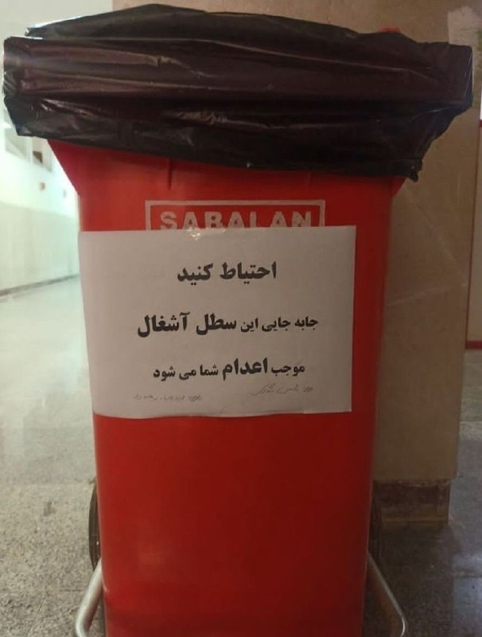

به همین راحتی ایرانی ها را میکشند..

@Dirty_Kids 👻

## Dirty_Kids — post 390756

  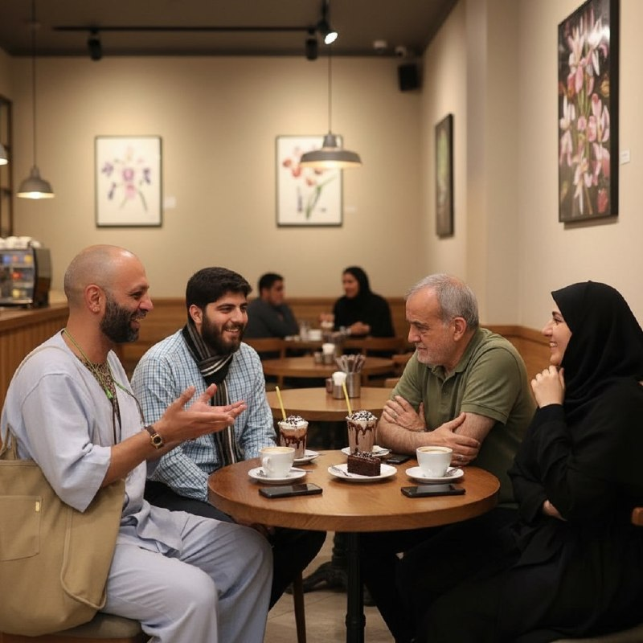

خلاصه اخبار ۲۴ ساعت اخیر:

@Dirty_Kids 👻

## Dirty_Kids — post 390755

  <a href="telegram/content/Dirty_Kids_390755_1780329251.mp4" target="_blank">🎬 Download video</a>

دقایقی قبل، حمله هوایی در جبل عامل در جنوب لبنان

@Dirty_Kids 👻

## Dirty_Kids — post 390754

  <a href="telegram/content/Dirty_Kids_390754_1780329252.mp4" target="_blank">🎬 Download video</a>

یه آخوند رفته با یه پسر جوون مصاحبه کنه، پسرم هیچ مراعاتی نکرد و خیلی تمیز رید به آخونده

@Dirty_Kids 👻

## Dirty_Kids — post 390753

  

تنها کسی که وقتی بهش عکس نشون میدی ،جنازه بهت تحویل میده😉

@Dirty_Kids 👻

## Dirty_Kids — post 390752

⚠️فقط در توتوی بزرگ بت فیدو میتونی با ۱۶۰ هزار تومن ۷۸ میلیون و یا حتی خیلی بیشتر برنده بشی
😮 دلت میخاد اولین توتوی خودت رو ثبت کنی و شانست رو امتحان کنی؟!
⚡️ کافیه روی لینک زیر کلیک کنی
✏️ https://bet-fido.com https://bet-fido.com (ورود بدون وی پی ان آمریکا…

## Dirty_Kids — post 390751

  

⚠️فقط در توتوی بزرگ بت فیدو میتونی با ۱۶۰ هزار تومن ۷۸ میلیون و یا حتی خیلی بیشتر برنده بشی
😮

دلت میخاد اولین توتوی خودت رو ثبت کنی و شانست رو امتحان کنی؟!
⚡️
کافیه روی لینک زیر کلیک کنی
✏️
https://bet-fido.com
https://bet-fido.com
(ورود بدون وی پی ان آمریکا و اروپا)

بت فیدو تنها سایت بین المللی که بدون احراز هویت و مشکلات پرداخت از ایران، به کاربران ایرانی سرویس میده
🥇
G11

📱کانال تلگرام
https://t.me/+dySI_QFj0T0xZGVk

## Dirty_Kids — post 390750

‏مشکلتون با عبدل‌آباد هم فقط به خاطر اسمشه، اگه عبدل‌سنتر بود قربون صدقه‌ش میرفتید.

@Dirty_Kids 👻

## Dirty_Kids — post 390749

  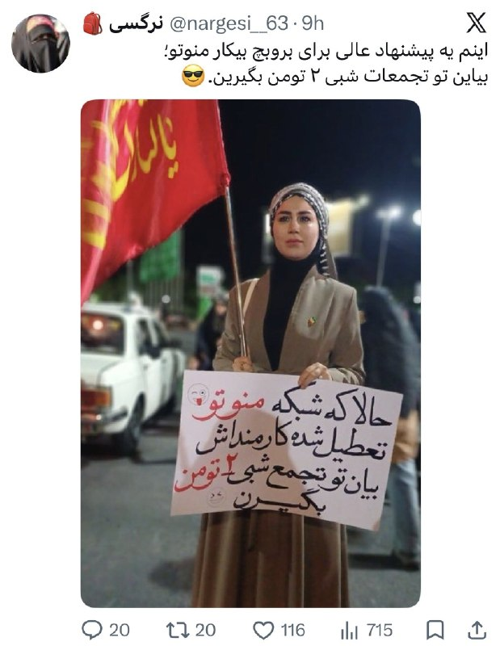

‏اینا خیلی کسخلنننننن
داره اعتراف میکنه میرن تجمعات پول میگیرن

@Dirty_Kids 👻

## Dirty_Kids — post 390748

  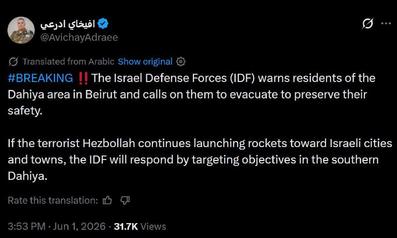

ارتش اسرائیل هشدارهای تخلیه برای ضاحیه بیروت را صادر کرده است.

@Dirty_Kids 👻

## Dirty_Kids — post 390747

🔴 تسنیم:
ایران خواستار توقف کامل تمام عملیات‌ها در غزه و لبنان برای از سرگیری مذاکرات با آمریکا است.

همچنین ایران به میانجی ها اعلام کرده است که آماده است تنگه هرمز و همچنین تنگه باب المندب را به طور کامل ببندد.

@Dirty_Kids 👻

## Dirty_Kids — post 390741

  <a href="telegram/content/Dirty_Kids_390741_1780329257.mp4" target="_blank">🎬 Download video</a>

اینها به خودشون هم رحم نمیکنند
عرزشیایی که گوه مذکراتو میخورن میگیرن کتک میزنن میندازن بیرون از تجمع 😂

@Dirty_Kids 👻

## Dirty_Kids — post 390740

  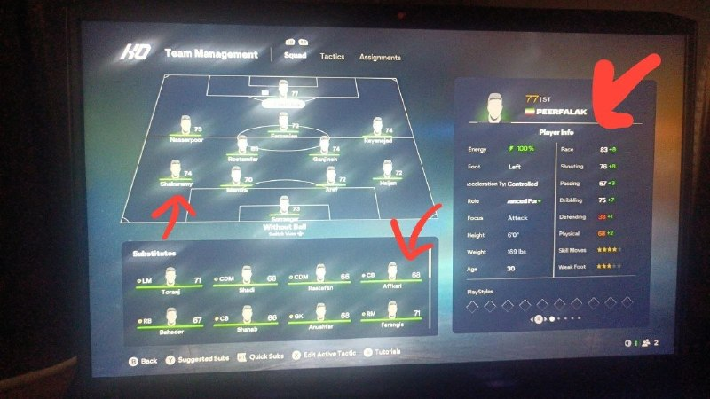

🔴 فوری: فیفا در یه حرکت خفن و پشم ریزون، توی آپدیت جدیدش تیم ملی ایران رو اضافه کرده و اسامی بازیکنان تیم ملی، جاویدنام ها هستن
🇮🇷 نیکا شاکرمی، کیان پیرفلک، نوید افکاری و... @Dirty_Kids 👻

## Dirty_Kids — post 390739

  <a href="telegram/content/Dirty_Kids_390739_1780329258.mp4" target="_blank">🎬 Download video</a>

🔴 فوری: فیفا در یه حرکت خفن و پشم ریزون، توی آپدیت جدیدش تیم ملی ایران رو اضافه کرده و اسامی بازیکنان تیم ملی، جاویدنام ها هستن
🇮🇷

نیکا شاکرمی، کیان پیرفلک، نوید افکاری و...

@Dirty_Kids 👻

## Dirty_Kids — post 390736

  

سلامتی، اومدم کافه با چادر، خیلی دلهره دارم موقع برگشت گشت ارشاد نگیره منو بیکینی تنم کنه

@Dirty_Kids 👻

## Hranews — post 113307

  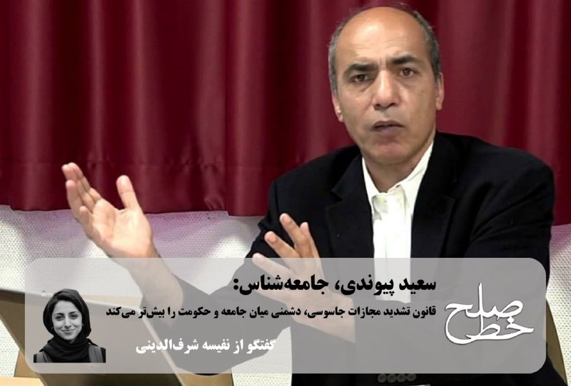

سعید پیوندی: قانون تشدید مجازات جاسوسی، دشمنی میان جامعه و حکومت را بیش‌تر می‌کند/ نفیسه شرف‌الدینی

📡
📡
📡
📡
📡– پس از تصویب و ابلاغ «قانون تشدید مجازات جاسوسی و همکاری با رژیم صهیونیستی و کشورهای متخاصم علیه امنیت و منافع ملی»، بحث‌های گسترده‌ای درباره‌ی پیامدهای حقوقی، سیاسی و اجتماعی این قانون شکل گرفته است. بسیاری از منتقدان معتقدند که گسترش مفاهیمی چون «همکاری با دولت متخاصم»، «فعالیت امنیتی» و «اقدام علیه امنیت ملی» می‌تواند مرز میان فعالیت‌های مدنی، علمی، رسانه‌ای و امنیتی را بیش از پیش مبهم کرده و زمینه‌ی گسترش نظارت، کنترل و سرکوب اجتماعی را فراهم کند. ماهنامه‌ی خط صلح برای بررسی ابعاد جامعه‌شناختی این قانون، تاثیر آن بر آزادی‌های مدنی، اعتماد اجتماعی، خودسانسوری و امنیتی‌سازی جامعه، با «سعید پیوندی»، جامعه‌شناس ایرانی و مدیر مرکز تحقیقاتی LISEC-Lorraine در دانشگاه لورن، به گفتگو نشسته است.

متن گفتگو با سعید پیوندی را در ادامه می‌خوانید:

قانون «تشدید مجازات جاسوسی و همکاری با رژیم صهیونیستی و کشورهای متخاصم علیه امنیت و منافع ملی» چگونه مفهوم «امنیت» را از یک مقوله‌ی صرفاً حقوقی ـ امنیتی به ابزاری برای تنظیم و کنترل روابط اجتماعی، رسانه‌ای و حتی علمی گسترش می‌دهد؟ آیا می‌توان آن را نمونه‌ای از «امنیتی‌سازی» جامعه، در معنای جامعه‌شناختی، دانست؟

از نظر من، این قانون و اقدامات کنونی دستگاه قضایی ایران، سازمان‌های اطلاعاتی و نیروهای انتظامی، همه در همین چارچوب قرار می‌گیرند. یعنی ما با یک فرآیند فراگیر امنیتی‌سازی در جامعه‌ی ایران سروکار داریم و هرکسی هم می‌تواند با این تعریف، در حوزه‌هایی چون همکاری با کشورهای خارجی یا کشورهای متخاصم، فعالیت‌های امنیتی و مانند آن، متهم شود. می‌توان گفت که حکومت، از نظر خودش، تلاش می‌کند نوعی بازدارندگی برای همکاری‌های احتمالیِ برخی افراد جامعه با نیروهای خارجی ایجاد کند. اما در عمل، معنای این امر این است که حکومت به همه‌ی غیرخودی‌ها، به نوعی، مشکوک خواهد بود.

ادامه مطلب

ادامه و لینک به مطلب در وبسایت خط صلح

#سعید_پیوندی
#نفیسه_شرف‌الدینی

↘️
@hranews_bot تماس ✉️ - @Hranews کانال هرانا 🆑

## Hranews — post 113306

گزارشی از بازداشت یک شهروند در شهرستان مهرستان

❗️
❗️
❗️
❗️
❗️– روز شنبه، عبدالمالک دهانی، شهروند اهل شهرستان مهرستان واقع در استان سیستان و بلوچستان، توسط ماموران امنیتی در این شهرستان #بازداشت و به مکانی نامعلوم منتقل شده است.

ادامه مطلب

#عبدالمالک_دهانی

↘️
@hranews_bot تماس ✉️ -  @Hranews  کانال هرانا 🆑

## Hranews — post 113305

روز یکشنبه ۱۰ خردادماه، شماری از شهروندان ساکن روستای دهنو واقع در شهرستان دورود، در اعتراض به تداوم قطع آب در این روستا دست به #تجمع_اعتراضی زدند.

به گفته این شهروندان معترض، در طول ۱۰ تا ۱۵ روز گذشته آب شرب این روستا به طور کامل قطع بوده است. این موضوع موجب مختل شدن زندگی روزمره مردم شده و بسیاری از خانواده‌ ها از ابتدایی‌ترین نیازهای بهداشتی مانند استحمام محروم مانده‌اند. همچنین، علیرغم پیگیری‌ های مکرر شهروندان از فرمانداری، بخشداری و اداره آب و فاضلاب، تاکنون اقدام مؤثری برای رفع این مشکل صورت نگرفته است.

↘️
@hranews_bot تماس ✉️ - @Hranews کانال هرانا 🆑

## Hranews — post 113304

  

دادستان عمومی و انقلاب شهرستان اهر، با اشاره به #توقیف_اموال ایرانیان مقیم خارج از کشور، اظهار داشت که حتی انتشار یک عکس یا ویدیو نیز می‌تواند مشمول مجازات توقیف اموال شود.

این مقام قضایی افزود: «مجازات توقیف اموال به‌صورت مستقل و کاملاً جدا از مجازات حبس یا اعدام اعمال می‌شود.»

↘️
@hranews_bot تماس ✉️ - @Hranews کانال هرانا 🆑

## Hranews — post 113303

رشت؛ حکم اعدام متهم به قتل یک کودک اجرا شد

❗️
❗️
❗️
❗️
❗️– امروز دوشنبه ۱۱ خردادماه، حکم یک زندانی که پیشتر از بابت اتهام تعرض و قتل یک کودک به نام ایلیا زادحسین به #اعدام محکوم شده بود، در رشت به اجرا درآمد.

ادامه مطلب

#ایلیا_زادحسین

↘️
@hranews_bot تماس ✉️ -  @Hranews  کانال هرانا 🆑

## Hranews — post 113302

  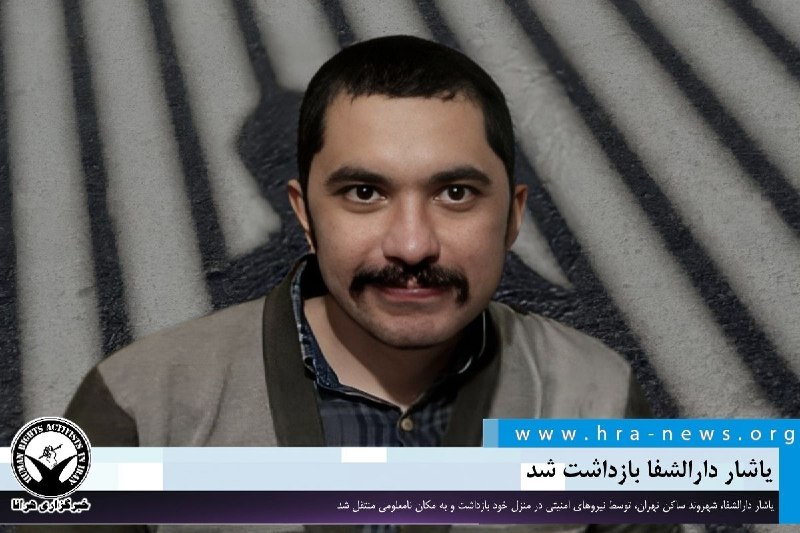

یاشار دارالشفا بازداشت شد

❗️
❗️
❗️
❗️
❗️– یاشار دارالشفا، زندانی سیاسی پیشین که ساکن تهران است، امروز توسط نیروهای امنیتی در منزل خود #بازداشت و به مکان نامعلومی منتقل شد.

به گزارش خبرگزاری هرانا، ارگان خبری مجموعه فعالان حقوق بشر در ایران، یاشار دارالشفا بازداشت شد.

براساس اطلاعات دریافتی هرانا، صبح امروز دوشنبه ۱۱ خرداد ۱۴۰۵، نیروهای امنیتی با مراجعه به منزل خانوادگی این شهروند، بدون ارائه حکم قضایی او را بازداشت کردند. ماموران همچنین منزل وی را نیز تفتیش کردند.

ادامه مطلب

#یاشار_دارالشفا

↘️
@hranews_bot تماس ✉️ -  @Hranews  کانال هرانا 🆑

## Hranews — post 113301

اعتراضات در دانشگاه‌ها؛ دستکم ۱۰ دانشجوی دانشگاه تهران به کمیته انضباطی احضار شدند

❗️
❗️
❗️
❗️
❗️– طی روزهای اخیر، دستکم ۱۰ دانشجوی #دانشگاه_تهران در ارتباط با تجمعات دانشجویی پس از اعتراضات سراسری دی‌ماه، به کمیته انضباطی این دانشگاه احضار شدند.

ادامه مطلب

↘️
@hranews_bot تماس ✉️ -  @Hranews  کانال هرانا 🆑

## Hranews — post 113300

قروه؛ ۲ متهم در پرونده تعرض گروهی به یک نوجوان اعدام شدند

❗️
❗️
❗️
❗️
❗️– صبح امروز، حکم اعدام دو تن از متهمان پرونده تجاوز گروهی به یک پسر ۱۴ ساله اهل قروه که منجر به خودکشی او شد، در این شهرستان به اجرا در آمد.

ادامه مطلب

↘️
@hranews_bot تماس ✉️ -  @Hranews  کانال هرانا 🆑

## Hranews — post 113299

گزارشی از اجرای حکم اعدام یک زندانی در زندان جیرفت

❗️
❗️
❗️
❗️
❗️– سحرگاه روز سه‌شنبه ۵ خردادماه، حکم یک زندانی که پیشتر از بابت اتهام قتل به #اعدام محکوم شده بود، در زندان جیرفت اجرا شد.

ادامه مطلب

#سبحان_عباسی
↘️
@hranews_bot تماس ✉️ -  @Hranews  کانال هرانا 🆑

## manototv — post 105890

  <a href="telegram/content/manototv_105890_1780329263.mp4" target="_blank">🎬 Download video</a>

حمله گزارش‌شده آمریکا به اهدافی در جنوب ایران، از نظر دامنه محدود بود، اما از نظر پیام نظامی اهمیت داشت. بر اساس روایت آمریکا، این حمله پس از سرنگونی یک پهپاد آمریکایی بر فراز آب‌های بین‌المللی انجام شد و سایت‌های راداری و مراکز فرماندهی و کنترل پهپادی جمهوری اسلامی در سیریک و جزیره قشم را هدف قرار داد.

## alonews — post 124242

  <a href="telegram/content/alonews_124242_1780329264.webm" target="_blank">🎬 Download video</a>

🔴فوری / هشدار قرارگاه مرکزی خاتم‌الانبیا به ساکنان اسرائیل 
🔴سرلشکر خلبان علی عبداللهی: نتانیاهو در ادامه شرارت های خود در منطقه، ضاحیه و بیروت را تهدید به بمباران نموده و برای ساکنان آن هشدار تخلیه اعلام کرده است. 
🔴با توجه به نقض مکرر آتش بس توسط رژیم، در…

## alonews — post 124241

  <a href="telegram/content/alonews_124241_1780329265.webm" target="_blank">🎬 Download video</a>

👈 حساب سازمان اطلاعات سپاه: هرکه باد بکارد،طوفان درو می‌کند

🔴ایران عبور از خط قرمزها در لبنان و غزه را به معنای جنگ مستقیم و تحمیل هزینه بر امنیت ملی خود ومقاومت اسلامی فرض کرده و متقابلا عزم خود را برای عملیات دفاعی با انجام اقدامات معناشکن و گشودن جبهه های جدید به علاوه حفظ معادله تنگه هرمز قرار می‌دهد.

✅ @AloNews خبر جنگ

## alonews — post 124238

  <a href="telegram/content/alonews_124238_1780329265.webm" target="_blank">🎬 Download video</a>

👈صحنه‌های ای دیگر از حمله‌ی سهمگین اسرائیل به صور، جنوب لبنان.

✅ @AloNews خبر جنگ

## alonews — post 124237

  <a href="telegram/content/alonews_124237_1780329265.webm" target="_blank">🎬 Download video</a>

🔴فوری / هشدار قرارگاه مرکزی خاتم‌الانبیا به ساکنان اسرائیل

🔴سرلشکر خلبان علی عبداللهی: نتانیاهو در ادامه شرارت های خود در منطقه، ضاحیه و بیروت را تهدید به بمباران نموده و برای ساکنان آن هشدار تخلیه اعلام کرده است.

🔴با توجه به نقض مکرر آتش بس توسط رژیم، در صورت عملی شدن این تهدید به ساکنان بخش های شمالی و شهرک های نظامی در سرزمین های اشغالی هشدار می‌دهیم اگر نمی‌خواهند آسیب ببینند منطقه را ترک نمایند.

✅ @AloNews خبر جنگ

## alonews — post 124236

  <a href="telegram/content/alonews_124236_1780329265.webm" target="_blank">🎬 Download video</a>

قیمت استثنایی و کیفیت بالا
❤️

تحویل زیر یک دقیقه
✅
دارای لینک سابسکریشن جهت دیدن حجم و کنترل مصرف
✅
بدون قطعی 
✅
بدون محدودیت کاربر و زمان
✅
جمینایو چت جی بی تی و... کامل اوکیه با سرورامون
✅

🏪پشتیبانی کامل
✅
شروع فعالیت از سال 2022 
✅
پرداخت ریالی
✅

از رباتمونم میتونید تهیه کنید 
💞
👇

✅
➡️ @Napsternetiran_bot 
☑️

ضریب و این چیزا ندارن و تا آخرین مگابایت برای پشتیبانیش درختمتیم
🥂

چنل کانالمون
👇

📣
➡️ @Napsternetvirani 
☑️

## alonews — post 124235

  <a href="telegram/content/alonews_124235_1780329266.mp4" target="_blank">🎬 Download video</a>

👈یک حمله هوایی سهمگین اسرائیلی چند لحظه پیش در صور، جنوب لبنان، انجام شد.

✅ @AloNews خبر جنگ

## alonews — post 124234

  <a href="telegram/content/alonews_124234_1780329268.webm" target="_blank">🎬 Download video</a>

👈تصویری از حملات در روز های میانی جنگ به پایگاه چهارم شکاری

✅ @AloNews خبر جنگ

## alonews — post 124233

  <a href="telegram/content/alonews_124233_1780329268.webm" target="_blank">🎬 Download video</a>

👈گفتگوی تلفنی وزرای امور خارجه ایران و فرانسه

✅ @AloNews خبر جنگ

## alonews — post 124232

  <a href="telegram/content/alonews_124232_1780329268.webm" target="_blank">🎬 Download video</a>

👈آژانس بین‌المللی انرژی اتمی در بیانیه‌ای اعلام کرد که شورای حکام این آژانس به درخواست مصر، اردن، مراکش و عربستان سعودی در پی حمله به نیروگاه هسته‌ای براکه در امارات متحده عربی، در تاریخ ۵ ژوئن جلسه فوری و اضطراری برگزار خواهد کرد.

✅ @AloNews خبر جنگ

## alonews — post 124231

  <a href="telegram/content/alonews_124231_1780329268.webm" target="_blank">🎬 Download video</a>

👈 ایزدخواه، نماینده مجلس: راه قدس از ابوظبی می‌گذرد به امارات حمله زمینی کنیم !

✅ @AloNews خبر جنگ

## alonews — post 124230

  <a href="telegram/content/alonews_124230_1780329269.webm" target="_blank">🎬 Download video</a>

👈در بنگاه شرط‌بندی مشهور آمریکا (Kalshi)، شانس بازگشت ترافیک دریایی تنگه هرمز به وضعیت نرمال تا 1 آگوست (11 مرداد)، به کمتر از 40% رسیده است!

✅ @AloNews خبر جنگ

## alonews — post 124229

  <a href="telegram/content/alonews_124229_1780329269.webm" target="_blank">🎬 Download video</a>

👈نفت برنت 97 دلار ، نفت آمریکا 94 دلار

✅ @AloNews خبر جنگ

## alonews — post 124228

  <a href="telegram/content/alonews_124228_1780329269.mp4" target="_blank">🎬 Download video</a>

👈وزیر دارایی اسرائیل، بزالل سموتریچ در نیویورک: دولت اسرائیل خانه تمام مردم یهود است.

🔴امنیت یهودیان در اینجا نیز به قدرت و امنیت دولت اسرائیل بستگی دارد. اما بدون شک، هیچ جای بهتری برای زندگی وجود ندارد.

🔴یادآوری می‌کنم که ما اکنون به مهاجران جدیدی که امسال به اسرائیل می‌آیند، پنج سال معافیت کامل مالیاتی می‌دهیم

✅ @AloNews خبر جنگ

## alonews — post 124227

  <a href="telegram/content/alonews_124227_1780329271.mp4" target="_blank">🎬 Download video</a>

👈وزیر دارایی اسرائیل بزالل سموتریچ در نیویورک: مردم ما پیش از این بسیاری از مامدانی‌ها را پشت سر گذاشته‌اند و اکنون نیز از پس آن‌ها برخواهند آمد.

🔴در نهایت، انتخاب مامدانی، مانند هر کس دیگری، این است که در کدام سوی تاریخ می‌خواهد باشد.

🔴اما تاریخ یک سوی درست و یک سوی نادرست دارد و این موضوع در طول سال‌ها آشکار بوده است

✅ @AloNews خبر جنگ

## alonews — post 124226

  <a href="telegram/content/alonews_124226_1780329273.mp4" target="_blank">🎬 Download video</a>

👈ملخ‌ها به مشهد حمله کردن

✅ @AloNews خبر جنگ

## alonews — post 124225

  <a href="telegram/content/alonews_124225_1780329276.webm" target="_blank">🎬 Download video</a>

👈وزارت دفاع بریتانیا می‌گوید یک پرسنل ارتش بریتانیا دیروز در یک حادثه آموزشی در شمال عراق کشته شد.

✅ @AloNews خبر جنگ

## alonews — post 124224

  <a href="telegram/content/alonews_124224_1780329276.webm" target="_blank">🎬 Download video</a>

👈وزارت کشور کویت: به ساکنان خود هشدار می‌دهیم که در انتظار حمله قریب‌الوقوع ایران در مکان‌های امن بمانند

✅ @AloNews خبر جنگ

## alonews — post 124223

  <a href="telegram/content/alonews_124223_1780329276.webm" target="_blank">🎬 Download video</a>

👈سازمان حمل و نقل دریایی بریتانیا (UKMTO) گزارش می‌دهد که یک کشتی باری که در خلیج فارس در حال عبور بوده، در ۴۰ مایل دریایی جنوب شرقی ام قصر عراق مورد حمله قرار گرفته است.

🔴 «یک انفجار بزرگ» پس از اصابت یک پرتابه ناشناخته به سمت راست کشتی رخ داده است.

✅ @AloNews خبر جنگ

---
📅 بروزرسانی: 1405/03/11 13:13
---

## VahidOOnLine — post 243188

  

اسماعیل بقائی، سخنگوی وزارت خارجه جمهوری اسلامی، درباره موضوع موشکی و مذاکره درباره آن، گفت که بارها اعلام کرده‌ایم حتی در سطح رسانه هم حاضر نیستیم درباره موضوعاتی که به دفاع از «کیان ایران» مربوط می‌شود، صحبت کنیم.

بقائی همچنین افزود: «هرگونه اقدام ناتو در خلیج فارس، منجر به پیچیده‌تر شدن اوضاع خواهد شد.»
iranintl
‌🏁 🇬🇧 IranintlTV

🤖 @VahidOOnLine

## VahidOOnLine — post 243187

  

♦️محمدباقر قالیباف، رئیس مجلس شورای اسلامی و مذاکره‌کننده ارشد جمهوری اسلامی با آمریکا، روز دوشنبه ۱۱ خردادماه با انتشار پیامی در اکس، ایالات متحده را به‌دلیل ادامه محاصره تنگه هرمز و تداوم حملات اسرائیل به لبنان به «پایبند نبودن به آتش‌بس» متهم کرد و نوشت: «هر انتخاب، بهایی دارد. همه‌چیز سر جای خودش قرار خواهد گرفت.»

دونالد ترامپ ساعاتی پیش با انتشار پیامی در تروث سوشال نوشته بود: «همه‌چیز به خوبی پیش‌ خواهد رفت.»

قالیباف در این پیام نوشت: «محاصره دریایی و تشدید جنایات جنگی در لبنان توسط رژیم صهیونیستی نسل‌کش، گواه روشنی بر عدم پایبندی ایالات متحده به آتش‌بس است.
هر انتخابی بهایی دارد و صورتحساب آن از را می‌رسد. همه چیز سر جای خودش قرار خواهد گرفت.»
‌🇸🇦 Indypersian

🤖 @VahidOOnLine

## VahidOOnLine — post 243186

  

حساب محمدباقر قالیباف، رییس مجلس در شبکه ایکس، حملات اسرائیل به لبنان و ادامه محاصره دریایی ایران را نشانه‌ عدم پایبندی آمریکا به آتش‌بس خواند و افزود: «هر انتخابی بهایی دارد و زمان پرداخت آن فرا می‌رسد، در نهایت همه چیز در جای خود قرار خواهد گرفت.»

پیش از این نیز، اسماعیل بقائی، سخنگوی وزارت خارجه جمهوری اسلامی نیز گفته بود تغییر مواضع طرف آمریکایی و ادامه حملات اسرائیل به لبنان، از بزرگترین موانع رسیدن به توافق میان دو طرف است.
‌🏁 🇬🇧 IranintlTV

🤖 @VahidOOnLine

## VahidOOnLine — post 243185

  <a href="telegram/content/VahidOOnLine_243185_1780307031.mp4" target="_blank">🎬 Download video</a>

جاویدنام امین پیرو کَسبَخی، ۱۸ دی ۱۴۰۴ در بیستون رشت ناپدید شد و خبر کشته شدنش را ۱۹ دی به خانواده اعلام کردند. او با اصابت گلوله‌ای جنگی به سینه و قلبش کشته است.
ویدیوهای ارسال‌شده به ایران‌اینترنشنال در پی راه‌اندازی کارزار مردمی رشت، مراسم چهلم این جاویدنام را نشان می‌دهد.
‌🏁 🇬🇧 IranintlTV

🤖 @VahidOOnLine

## VahidOOnLine — post 243184

  <a href="telegram/content/VahidOOnLine_243184_1780307034.mp4" target="_blank">🎬 Download video</a>

♦️امانوئل مکرون، رئیس‌جمهوری فرانسه، صبح دوشنبه ۱۱ خردادماه با انتشار ویدیویی از توقیف نفتکش «تاگور» از مبداء روسیه در آب‌های اقیانوس اطلس خبر داد.

مکرون در این پیام نوشت که این عملیات با مشارکت همپیمانان بین‌المللی و از جمله بریتانیا انجام شده است.

رئیس جمهوری فرانسه تردد این نفتکش در آب‌های بین‌المللی را نقض تحریم‌های بین‌المللی در چهارمین سال جنگ اوکراین توصیف کرد و نوشت: «این کشتی حداقل موازین ناوبری را هم رعایت نمی‌کرد و تهدید برای محیط زیست و امنیت همه ما بود.»

توقیف این نفتکش در حالی انجام می‌شود که آمریکا برای بار دیگر معافیت نفت روی آب روسیه را تمدید کرده است. کشورهای اروپایی با این رویه واشنگتن به‌شدت مخالفند و می‌گویند فروش نفت روسیه در دوره گرانی این کالا به مسکو اجازه می‌دهد تا هزینه‌های جنگ اوکراین را تامین کند.
‌🇸🇦 Indypersian

🤖 @VahidOOnLine

## VahidOOnLine — post 243183

  

امانوئل مکرون، رییس‌جمهوری فرانسه، اعلام کرد نیروی دریایی این کشور یک نفتکش تحریمی مرتبط با روسیه را در آب‌های بین‌المللی متوقف و بازرسی کرده است.

مکرون دوشنبه در شبکه اجتماعی ایکس نوشت نیروهای فرانسوی صبح یک‌شنبه ۱۰ خرداد با ورود به نفتکش «تاگو» که از روسیه به حرکت درآمده بود، عملیات بازرسی این شناور را در اقیانوس اطلس انجام دادند.
به گفته رییس‌جمهوری فرانسه، این عملیات با حمایت چند کشور شریک از جمله بریتانیا و با رعایت کامل قوانین بین‌المللی دریانوردی صورت گرفته است.

مکرون تاکید کرد فعالیت کشتی‌هایی که با دور زدن تحریم‌های بین‌المللی به تامین مالی جنگ روسیه علیه اوکراین کمک می‌کنند، غیرقابل قبول است.

او هشدار داد این شناورها با نادیده گرفتن مقررات پایه‌ای ناوبری دریایی، علاوه بر نقض قوانین، «تهدیدی برای محیط زیست و امنیت همگان» به شمار می‌روند.
iranintl
‌🏁 🇬🇧 IranintlTV

🤖 @VahidOOnLine

## VahidOOnLine — post 243182

  <a href="telegram/content/VahidOOnLine_243182_1780307038.mp4" target="_blank">🎬 Download video</a>

⭕️آب در زاینده‌رود جاری شد

♦️کاربران شبکه‌های اجتماعی روز دوشنبه یازدهم خرداد با انتشار ویدیوهایی از جاری شدن آب در زاینده‌رود پس از ماه‌ها خشکی این رودخانه خبر دادند.

امسال و به‌لطف بارندگی‌های بیشتر در بسیاری از حوزه‌های آبگیر و بارش برف در مناطق کوهستانی، بسیاری از مناطق ایران پس از یک دوره طولانی تنش آبی، با خشکسالی دست و پنچه نرم نمی‌کنند. در روزهای گذشته، ویدیوهایی از جاری شدن آب از سد کوهرنگ به سوی دشت‌های مرکزی ایران در رسانه‌های داخلی منتشر شده بود.

با وجود بارندگی‌های گسترده در غرب، مرکز و حتی شرق ایران، مقام‌های سازمان آب می‌گویند استان‌های جنوبی رشته‌کوه البرزو همچنین هرمزگان، همچنان با مساله کمبود آب مواجهند.
‌🇸🇦 Indypersian

🤖 @VahidOOnLine

## VahidOOnLine — post 243181

  

سامان جعفرپورمقدم، ۳۸ ساله و اهل فولادشهر اصفهان در جریان اعتراضات ۱۸ دی‌ماه کشته شد. او طی نخستین ساعات تجمعات اعتراضی در مقابل دادگستری فولادشهر، از پشت سر هدف گلوله جنگی قرار گرفت و پیکرش ۱۰ روز بعد به خانواده تحویل داده شد.

بنا بر روایت نزدیکانش، یکی از دوستان سامان با خانواده تماس گرفت و خبر مجروح شدن او را به پدرش داد.

پدر سامان بلافاصله خود را به بیمارستان رساند و با صحنه انتقال مجروحی غرق در خون به اورژانس مواجه شد که بعدتر مشخص شد فرزندش است.

شدت خونریزی سامان به حدی بود که تلاش‌ کادر درمان برای نجاتش نتیجه نداد و او در بیمارستان جان باخت.

به گفته شاهدان عینی، پس از جان‌باختن سامان، خانواده او را از بیمارستان بیرون کردند.

صبح روز بعد، زمانی که پدر سامان برای پیگیری وضعیت فرزندش به بیمارستان مراجعه کرد، به او گفته شد که حدود ساعت چهار صبح تمامی پیکرها از بیمارستان منتقل شده‌اند.

براساس این گزارش‌ها، خانواده پس از آن نزدیک به ۱۰ روز جست‌وجو، سرانجام در ۲۶ دی‌ماه پیکر سامان جعفرپورمقدم را از باغ رضوان اصفهان تحویل گرفتند و ۲۷ دی‌ماه، او را در آرامستان فولادشهر به خاک سپردند.
‌🏁 🇬🇧 IranintlTV

🤖 @VahidOOnLine

## VahidOOnLine — post 243180

  

تصاویر و اطلاعاتی درباره یکی از مجروحان اعتراض‌های دی‌ماه رشت به ایران اینترنشنال ارسال شده که نشان می‌دهد یک جوان ۱۹ ساله با گلوله‌های ساچمه‌ا‌ی در بدن به مدت چند ماه در بیمارستان بستری بوده و جراحت جدی به ریه‌اش وارد شده است.
‌🏁 🇬🇧 IranintlTV

🤖 @VahidOOnLine

## VahidOOnLine — post 243179

  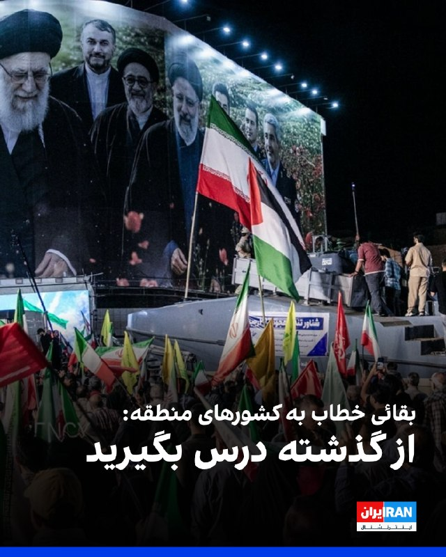

اسماعیل بقائی، سخنگوی وزارت خارجه جمهوری اسلامی، خطاب به کشورهای حاشیه خلیج فارس گفت: «از گذشته درس بگیرید و اجازه ندهید که آمریکا و اسرائیل از امکانات شما علیه جمهوری اسلامی استفاده کنند.»

او ادامه داد: «در اینکه برخی کشورهای منطقه با وجود هشدارهای ما، به تعهدات خود عمل نکردند، تردیدی نداریم.»

بقائی اضافه کرد: «ما با مردم کویت و سایر مردمان منطقه که خاک، حاکمیت، قلمرو و امکاناتشان از سوی اسرائیل و آمریکا برای حمله به یک کشور مسلمان مورد سوءاستفاده قرار می‌گیرد، ابراز همبستگی می‌کنیم.»
‌🏁 🇬🇧 IranintlTV

🤖 @VahidOOnLine

## VahidOOnLine — post 243178

  <a href="telegram/content/VahidOOnLine_243178_1780307043.mp4" target="_blank">🎬 Download video</a>

ویدیویی که به تازگی از اعتراضات دی‌ماه ۱۴۰۴ به دست ایران‌اینترنشنال رسیده، پیکر رهاشده یک جاویدنام را در یکی از خیابان‌های شهرک ولیعصر تهران نشان می‌دهد.
‌🏁 🇬🇧 IranintlTV

🤖 @VahidOOnLine

## VahidOOnLine — post 243177

  <a href="telegram/content/VahidOOnLine_243177_1780307045.mp4" target="_blank">🎬 Download video</a>

♦️اسماعیل بقایی، سخنگوی وزارت امور خارجه جمهوری اسلامی روز دوشنبه ۱۱ خردادماه و در پاسخ به پرسش خبرنگاران درباره گفته‌های دونالد ترامپ ناظر به خروج اورانیوم غنی‌شده از خاک ایران گفت درباره جزئیات موضوع هسته‌ای هیچ مذاکر‌ه‌ای نکرده‌ایم.

این سخنان در حالی مطرح می‌شود که دونالد ترامپ در آخرین پیام‌های خود علاوه بر خروج ذخایر اورانیوم از ایران، گفته بود شاید اورنیوم در خاک ایران و با هماهنگی جمهوری اسلامی و آمریکا نابود شود. ترامپ همچنین مخالفت خود را با انتقال ذخایر اورانیوم به‌شدت غنی‌شده به چین و روسیه اعلام کرده بود.
‌🇸🇦 Indypersian

🤖 @VahidOOnLine

## VahidOOnLine — post 243176

  

اسماعیل بقائی، سخنگوی وزارت خارجه جمهوری اسلامی در واکنش به سخنان ترامپ درباره خارج‌کردن ذخایر اورانیوم غنی‌شده از ایران، گفت که ما درباره جزییات موضوع هسته‌ای هیچ مذاکره‌ای نکرده‌ایم و اگر روزی لازم باشد در خصوص موضوعات هسته‌ای کاری انجام دهیم، می‌دانیم چکار کنیم.

او ادامه داد: مذاکره در دل «سوءظن شدید و بدگمانی» شروع شد و تبادل پیام در این فضا ادامه دارد.

بقائی افزود: «مقامات آمریکایی مکرر مواضع‌شان را تغییر می‌دهند، آنها باید هرچه زودتر به تصمیم مشخصی برسند.»
iranintl
‌🏁 🇬🇧 IranintlTV

🤖 @VahidOOnLine

## VahidOOnLine — post 243175

  

احمد میدری، وزیر کار و رفاه اجتماعی، گفت که «کالابرگ خرداد به روال ماه‌های قبل پرداخت می‌شود»، افزود: «بخش‌های مختلف دولت مانند سازمان برنامه به‌دنبال منابع جدید برای کالابرگ هستند، اما هنوز منابع جدیدی نداریم.»

او اضافه کرد: «فعلا برنامه‌ای برای تغییر حداقل مزد کارگران نداریم.»
‌🏁 🇬🇧 IranintlTV

🤖 @VahidOOnLine

## VahidOOnLine — post 243174

  

♦️بنیامین نتانیاهو، نخست وزیر اسرائیل روز دوشنبه ۱۱ خردادماه اعلام کرد دستور حمله دوباره به منطقه ضاحیه در جنوب بیروت، پایتخت لبنان را صادر کرده است.

این خبر درحالی منتشر می‌شود که براساس گزارش‌ها، مذاکرات میان لبنان و اسرائیل با میانجیگری آمریکا شکست خورده است.

با وجود برقراری «رسمی» آتش‌بس میان لبنان و اسرائیل و تمدید آن، درگیری‌ها میان دو طرف حتی یک روز هم متوقف نشده است. حزب‌الله مواضع ارتش اسرائیل در جنوب لبنان را روزانه و به‌ویژه با استفاده از پهپادهای هدایت شونده با فیبر نوری هدف قرار می‌دهد و اسرائیل «زیرساخت‌های حزب‌الله» در جنوب و شرق لبنان را عملا هر روز بمباران می‌کند.

ارتش اسرائیل صبح دوشنبه اعلام کرد یک سرباز دیگر این کشور در جریان درگیری‌ها در جنوب لبنان کشته شده است و به این ترتیب شمار کشته‌های نظامی این کشور از اسفندماه گذشته در جنگ با حزب‌الله، به ۲۶ نفر رسید.
وزارت بهداشت لبنان هفته گذشته اعلام کرد شمار قربانیان این کشور از اسفندماه گذشته، بیش از سه هزار نفر کشته شدند.
‌🇸🇦 Indypersian

🤖 @VahidOOnLine

## VahidOOnLine — post 243173

  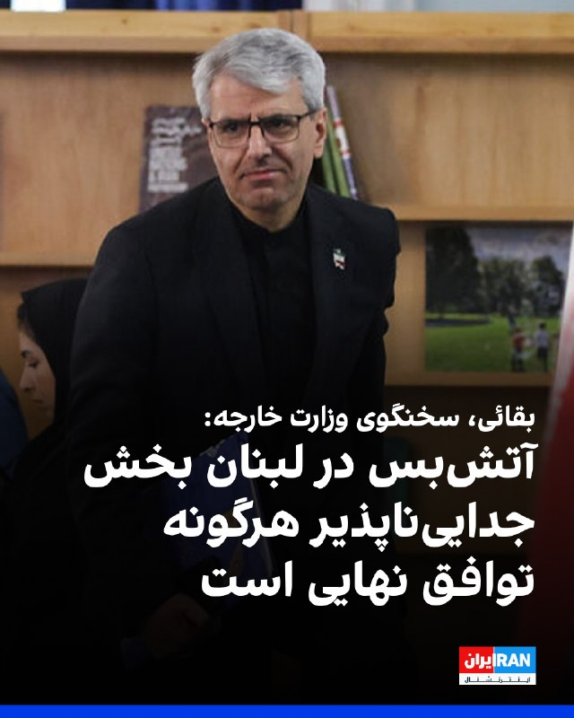

اسماعیل بقائی، سخنگوی وزارت خارجه جمهوری اسلامی، در نشست خبری خود گفت: «اسرائیل طی ۸۰ سال گذشته جنگ دائمی علیه کشورهای منطقه و با حمایت آمریکا به راه انداخته است.»

بقائی اضافه کرد: «آتش‌بس در لبنان بخش جدایی‌ناپذیر هرگونه توافق نهایی برای خاتمه جنگ است.»
‌🏁 🇬🇧 IranintlTV

🤖 @VahidOOnLine

## VahidOOnLine — post 243172

  

کاظم غریب‌آبادی، معاون حقوقی وزارت خارجه گفت که جمهوری اسلامی در شرایط جنگ، ترتیبات جدیدی برای کنترل عبور و مرور تعریف کرده و به هیچ کشوری اجازه دخالت نمی‌دهد.

غریب‌آبادی افزود: «آمریکا و رییس‌جمهورش با نقض حقوق بین‌الملل عمان را تهدید کرده‌اند، اما ما از عمان خواسته‌ایم تسلیم تهدیدها نشود و حاکمیت خود را در زمان صلح اعمال کند.»

او با بیان اینکه «تنگه هرمز دو دولت ساحلی بیشتر ندارد، جمهوری اسلامی و سلطنت عمان»، گفت: «هر ترتیبات حقوقی در زمان صلح باید با همکاری و مشورت با عمان باشد.»
‌🏁 🇬🇧 IranintlTV

🤖 @VahidOOnLine

## VahidOOnLine — post 243171

  

⭕️بقایی: موضع اروپا ریاکارانه است؛ حق داریم به کشورهایی که از خاکشان به ما حمله می‌شود، پاسخ دهیم

♦️اسماعیل بقایی، سخنگوی وزارت امور خارجه جمهوری اسلامی روز دوشنبه ۱۱ خردادماه با انتشار پیامی، از موضع اتحادیه اروپا در محکومیت حملات ایران به کشورهای حاشیه خلیج فارس به‌شدت انتقاد کرد.

روز گذشته اتحادیه اروپا حملات جمهوری اسلامی به کشورهای حوزه خلیج فارس را محکوم کرده بود. سپاه پاسداران هفته گذشته و امروز دوشنبه و پس از حمله به مواضع نظامی در بندرعباس و سیریک، به پایگاه‌های نظامی آمریکا در کویت حمله کرد.

بقایی در پیامی که در اکس منتشر شد، نوشت: «بیانیه اتحادیه اروپا در محکومیت ایران به خاطر اعمال حق مشروع دفاع از خود در برابر حملات غیرقانونی آمریکا با مبدا یک کشور همسایه جنوبی خلیج فارس، مثال آشکار نفاق و رویکرد دوگانه است؛ این بیانیه، ریاکارانه و غیرمسئولانه است.»

سخنگوی وزارت امور خارجه جمهوری اسلامی حملات ایران به اهداف نظامی آمریکا را«اقدام قانونی در چارچوب حق دفاع مشروع» توصیف کرد و نوشت: «دولت‌ها تعهد قانونی دارند که مانع از استفاده طرف‌های متجاوز از قلمرو و امکانات آنها برای تعرض به یک کشور دیگر شوند.»
‌🇸🇦 Indypersian

🤖 @VahidOOnLine

## VahidOOnLine — post 243170

  

بنیامین نتانیاهو، نخست‌وزیر اسرائیل خبر داد که به ارتش این کشور دستور داده، به اهدافی در حومه جنوبی بیروت حمله کنند.

همزمان یسرائیل کاتز، وزیر دفاع اسرائیل تاکید کرد که نتانیاهو و او، به ارتش دستور دادند، اهدافی را در منطقه ضاحیه بیروت هدف قرار دهد.

پیش‌تر یک مقام آمریکایی گفته بود که مارکو روبیو، وزیر خارجه ایالات متحده، با جوزف عون، رییس‌جمهوری لبنان، و بنیامین نتانیاهو، نخست‌وزیر اسرائیل، در مورد مذاکرات دیپلماتیک بین این دو کشور کفت‌وگو کرده و طرحی را برای «کاهش تدریجی تنش» پیشنهاد داده است.
‌🏁 🇬🇧 IranintlTV

🤖 @VahidOOnLine

## VahidOOnLine — post 243169

  <a href="telegram/content/VahidOOnLine_243169_1780307054.mp4" target="_blank">🎬 Download video</a>

ویدیوی ارسال‌شده به ایران‌اینترنشنال، استفاده ابزاری از کودکان را در ایست و بازرسی خیابان بنی‌هاشمی شیراز در شامگاه یکشنبه ۱۰ خرداد نشان می‌دهد.
‌🏁 🇬🇧 IranintlTV

🤖 @VahidOOnLine

## WithYashar — post 13136

گالانت : نتانیاهو اعلام کرده خاورمیانه دیگر جای حزب الله نیست و تا نابودی کامل جلو خواهیم رفت
@withyashar

## WithYashar — post 13135

قالیباف در توییتر(X):
«اعمال محاصرۀ دریایی و تشدید جنایات جنگی در لبنان توسط اسرائیل عدم پایبندی آمریکا به آتش‌بس است.

هر انتخابی، هزینه‌ای دارد و صورت‌حساب آن هم از راه می‌رسد؛ همه چیز سر جای خودش قرار خواهد گرفت.»
@withyashar

## WithYashar — post 13134

بنیامین نتانیاهو به همراه وزیر دفاع دستور حمله به ضاحیه بیروت را اعلام کردند
@withyashar

## WithYashar — post 13133

سخنگوی وزارت خارجه: ما حق دفاع مشروع در برابر نقض آتش‌بس توسط آمریکا را داریم و امروز هم مبدأ تجاوز به خاک کشور را هدف قرار دادیم.
@withyashar

## WithYashar — post 13132

ترامپ به نیوزویک : مردم ایران از من تشکر میکنند چون بجای یکبار، دوبار رژیم رو عوض کردم
@withyashar

## WithYashar — post 13131

داش جان جدت ری اکشن 🤣 رو باز کن

## WithYashar — post 13130

## WithYashar — post 13129

  

🥴🤣 @withyashar

## WithYashar — post 13128

اطلاعات تایید نشده بهم رسیده که اندیشه ترور هدفمند بوده شخص‌ مورد نظر مسئول قراردادهای بین صدا و سیما و قرارگاه خاتم‌الانبیا بود @withyashar

## WithYashar — post 13127

گزارش های از مشاهده خط شلیک موشک از همدان
@withyashar

## WithYashar — post 13126

صدای انفجار مهمات عمل نکرده اصفهان پادگان پانزده خرداد
@withyashar

## WithYashar — post 13125

البته توجه کنید که گفته بودند از قبل که خنثی سازی مهمات عمل نکرده دارن @withyashar ولی با توجه به اینکه سنتکام ساعتی پیش گفته حمله کرده و رادار زده هشیار باشید

## WithYashar — post 13124

گروه تروریستس ۳پا امروز در بیانیه‌ای اعلام کرد در واکنش به حمله ارتش آمریکا به یک دکل مخابراتی در جزیره سیریک، «مبدأ حمله» رو هدف قرار داده و هشدار داد در صورت تکرار این اقدامات، پاسخ متفاوتی خواهد داد.

کویت حوالی ۶ صبح از فعال شدن سامانه‌های پدافندی خود برای مقابله با حملات موشکی و پهپادی خبر داد ولی مبدأ حمله را اعلام نکرد
@withyashar

## WithYashar — post 13123

اتاق جنگ با شما : یاشار تتر داره کندل سبز میخوره همینجوری
این صداهای امروز مثل اینکه جدی تره
@withyashar
اتاق جنگ با شما :نهم اسفند هم همین ساعت ها بود داشتن حمله میکردند خدا به خیر کنه😂😂💔

## WithYashar — post 13122

## WithYashar — post 13121

صدای انفجار در اصفهان
@withyashar

## WithYashar — post 13120

دوباره صدای انفجار‌ در بندر
@withyashar

## WithYashar — post 13119

## WithYashar — post 13118

## WithYashar — post 13117

یعنی جنگ رو پنهان میکنن ؟؟

## mwarmonitor — post 9970

  

🔴پس از یک توقف ۱۲روزه در بندر سنگاپور، ناو USS Boxer در تاریخ ۳۰ مه دوباره وارد دریای چین جنوبی شد.

@mwarmonitor

## mwarmonitor — post 9969

🔴بر اساس بیانیه‌ای مشترک، بنیامین نتانیاهو نخست‌وزیر و یسرائیل کاتس وزیر دفاع اعلام کردند که به ارتش اسرائیل دستور داده‌اند مواضع حزب‌الله را در منطقه الضاحیه در بیروت هدف قرار دهد.

🔸به گفته آن‌ها، این تصمیم در واکنش به «نقض‌های مکرر آتش‌بس در لبنان و حملات به شهرها و غیرنظامیان اسرائیل» اتخاذ شده است.

@mwarmonitor

## mwarmonitor — post 9968

🔴«ایران واقعاً می‌خواهد توافق کند، و این توافق خوبی برای ایالات متحده و کسانی که با ما هستند خواهد بود. اما آیا دموکرات‌های نادان (دموکرات‌نماها)* و برخی جمهوری‌خواهانِ به‌ظاهر غیروطن‌پرست درک نمی‌کنند که وقتی شبه‌سیاسیونِ جیره‌خوار (بوقچی‌های سیاسی) مدام در سطوحی بی‌سابقه و بارها و بارها با لحنی منفی "جیک‌جیک" می‌کنند [نق می‌زنند] که من باید سریع‌تر حرکت کنم، یا کندتر حرکت کنم، یا به جنگ بروم، یا به جنگ نروم، یا هر چیز دیگری، انجام درست وظیفه‌ام و مذاکره کردن برای من بسیار سخت‌تر می‌شود؟ فقط بنشینید و آرام باشید، در نهایت همه چیز به خوبی پیش خواهد رفت؛ همیشه همین‌طور می‌شود!

رئیس‌جمهور دونالد جی ترامپ»

@mwarmonitor

## pm_afshaa — post 92000

#مهم عزیزای دلم همگی الان چنل زاپاس‌مون رو جوین بشید کانال تحت ریپورت شدیده اگه چیزی شد زاپاس رو داشته باشید فعالیت میاد اونور
👇 https://t.me/pmtvzapas https://t.me/pmtvzapas

## pm_afshaa — post 91999

🔴گالانت : نتانیاهو اعلام کرده خاورمیانه دیگر جای حزب الله نیست و تا نابودی کامل جلو خواهیم رفت

💧 Rainbet.com the #1 Non-KYC Crypto Casino & Sportsbook @rainbetcom

😁 @Pm_Afshaa

## pm_afshaa — post 91998

سپاه:اگر حمله‌ای در بیروت انجام شود، قصد دخالت خواهیم کرد

💧 Rainbet.com the #1 Non-KYC Crypto Casino & Sportsbook @rainbetcom

😁 @Pm_Afshaa

## pm_afshaa — post 91997

#مهم
عزیزای دلم همگی الان چنل زاپاس‌مون رو جوین بشید کانال تحت ریپورت شدیده اگه چیزی شد زاپاس رو داشته باشید فعالیت میاد اونور
👇

https://t.me/pmtvzapas
https://t.me/pmtvzapas

## pm_afshaa — post 91996

🔴پدافند هوایی کویت برای مقابله با پرتابه های جمهوری اسلامی فعال شد

💧 Rainbet.com the #1 Non-KYC Crypto Casino & Sportsbook @rainbetcom

😁 @Pm_Afshaa

## pm_afshaa — post 91995

  

کرمانشاه هم اکنون

💧 Rainbet.com the #1 Non-KYC Crypto Casino & Sportsbook @rainbetcom

😁 @Pm_Afshaa

## pm_afshaa — post 91994

ترامپ به نیوزویک: مردم ایران از من تشکر میکنند چون بجای یکبار، دوبار رژیم رو عوض کردم

💧 Rainbet.com the #1 Non-KYC Crypto Casino & Sportsbook @rainbetcom

😁 @Pm_Afshaa

## pm_afshaa — post 91993

🔴حملات سنگین اسراییل به جنوب لبنان

💧 Rainbet.com the #1 Non-KYC Crypto Casino & Sportsbook @rainbetcom

😁 @Pm_Afshaa

## pm_afshaa — post 91992

  

پرتاب موشک از ایلام

💧 Rainbet.com the #1 Non-KYC Crypto Casino & Sportsbook @rainbetcom

😁 @Pm_Afshaa

## pm_afshaa — post 91991

  

شلیک موشک از کرمانشاه

💧 Rainbet.com the #1 Non-KYC Crypto Casino & Sportsbook @rainbetcom

😁 @Pm_Afshaa

## pm_afshaa — post 91990

🔴ارتش اسرائیل طبق دستور ‌نتانیاهو و وزیر دفاع، در بیروت حمله شدیدی انجام خواهند داد

💧 Rainbet.com the #1 Non-KYC Crypto Casino & Sportsbook @rainbetcom

😁 @Pm_Afshaa

## pm_afshaa — post 91989

  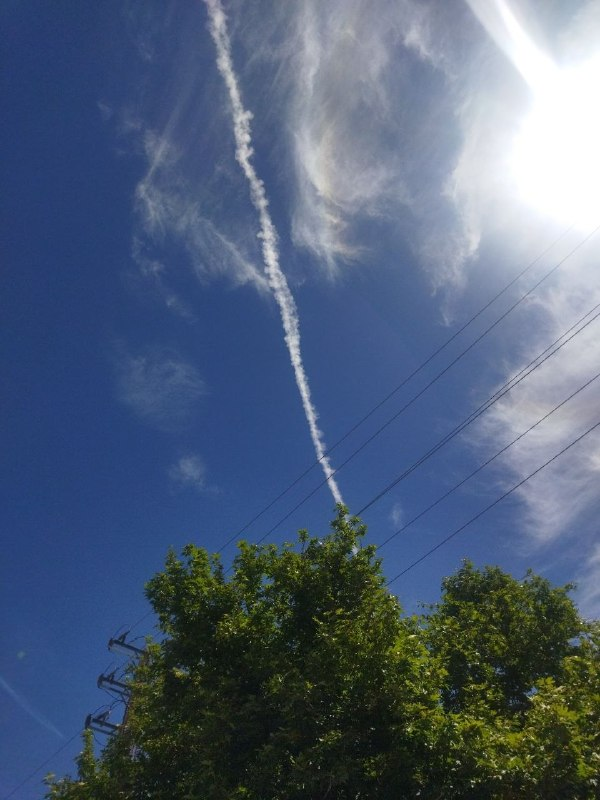

از همدان موشک شلیک شد

💧 Rainbet.com the #1 Non-KYC Crypto Casino & Sportsbook @rainbetcom

😁 @Pm_Afshaa

## pm_afshaa — post 91988

🔴منابع عبری:دستورات نتانیاهو برای هدف قرار دادن حومه جنوبی با هماهنگی آمریکا انجام شده

💧 Rainbet.com the #1 Non-KYC Crypto Casino & Sportsbook @rainbetcom

😁 @Pm_Afshaa

## pm_afshaa — post 91987

  <a href="telegram/content/pm_afshaa_91987_1780307060.webm" target="_blank">🎬 Download video</a>

📢 بازم می‌رسیم به حرف‌های ⁧نوید افکاری⁩؛
‏ملت شریف ایران!
سکوت شما یعنی حمایت از ظلم و ظالم...

🔺 @Pm_Afshaa

## pm_afshaa — post 91986

پرتاب موشک از خوزستان به سمت کویت 
💧 Rainbet.com the #1 Non-KYC Crypto Casino & Sportsbook @rainbetcom 
😁 @Pm_Afshaa

## pm_afshaa — post 91985

🔴سنتکام:حملات هوایی دقیق به سایت‌های راداری و فرماندهی و کنترل پهپادی ایران طی روزهای شنبه و یکشنبه در جزیره قشم و دیگر مناطق ایران انجام شد

💧 Rainbet.com the #1 Non-KYC Crypto Casino & Sportsbook @rainbetcom

😁 @Pm_Afshaa

## pm_afshaa — post 91984

  

قوه قضائیه جمهوری جنایتکار اسلامی، صبح امروز و همزمان با اذان صبح، مهرداد محمدی‌نیا و اشکان مالکی را به اتهام «آتش زدن مسجد جعفری در محله گیشا تهران» و «انسداد خیابان‌ها» اعدام کرد...

💧 Rainbet.com the #1 Non-KYC Crypto Casino & Sportsbook @rainbetcom

😁 @Pm_Afshaa

## pm_afshaa — post 91983

پرتاب موشک از خوزستان به سمت کویت

💧 Rainbet.com the #1 Non-KYC Crypto Casino & Sportsbook @rainbetcom

😁 @Pm_Afshaa

## pm_afshaa — post 91982

🔴انفجار های شنیده شده در بندر عباس ناشی از مهمات باقی مانده زمان جنگه

💧 Rainbet.com the #1 Non-KYC Crypto Casino & Sportsbook @rainbetcom

😁 @Pm_Afshaa

## pm_afshaa — post 91981

توییت اکانت جمهوری اسلامی:مردم جرعت دارن بیان خیابون، یه جوری قتل عام میکنیم که مراد ویسی تا چند سال طول بکشه اسم همه جاوید نام هارو بخونه 
💧 Rainbet.com the #1 Non-KYC Crypto Casino & Sportsbook @rainbetcom 
😁 @Pm_Afshaa

## DEJradio — post 5202

  <a href="telegram/content/DEJradio_5202_1780307062.webm" target="_blank">🎬 Download video</a>

🔺📢 کالبدشکافی سیاست قطع اینترنت

*آیسان قاسم‌پور، روانشناس بالینی

#قطع_اینترنت
@DEJradio

## DEJradio — post 5201

  <a href="telegram/content/DEJradio_5201_1780307063.webm" target="_blank">🎬 Download video</a>

🔺🎤 «بدون هنر، هیچ جنبش اجتماعی ماندگار نمی‌شود»

شاهین نجفی، خواننده، ترانه‌سرا و آهنگساز ایرانی در گفت‌وگو با دژ بر جایگاه هنر در جنبش‌های اجتماعی تأکید کرد.

#جنبش #هنر
@DEJradio

## DEJradio — post 5198

  <a href="telegram/content/DEJradio_5198_1780307063.webm" target="_blank">🎬 Download video</a>

🚨📷 سـ.ـپاه پاسداران هفتم خرداد ۱۴۰۵ یک نفتکش را حوالی تنگه هرمز هدف قرار داد. اکنون تصاویر ماهواره‌ای تأیید می‌کند چهار قایف تندرو به این کشتی نزدیک شدند. این نفتکش حدود ۲۵۲ متر طول توسط قایق‌های سـ.ـپاه محاصره شده بود. منابع حکومتی مدعی شدند نفتکش متعلق به آمریکاست.

#تنگه_هرمز #IRGCterrorists
@DEJradio

## DEJradio — post 5197

  <a href="telegram/content/DEJradio_5197_1780307064.mp4" target="_blank">🎬 Download video</a>

🔺🎥 پیامدهای جنگ ۴۰ روزه؛
ویرانه‌های کلانتری ۱۶۹ مشیریه تهران

یکی از مخاطبان دژ با ارسال ویدیویی از تخریب این کلانتری نوشت، ادعای پیروزی هم می‌کنند اما حتی توان ندارند ویرانه‌ها را جمع کنند.

#جنگ۴۰روزه #تهران #جنگ
@DEJradio

## DEJradio — post 5196

  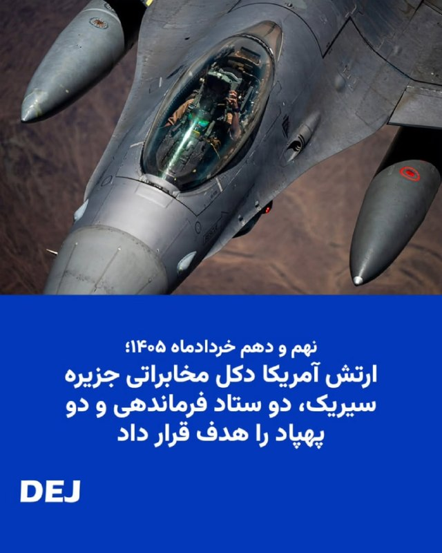

🛩️
🔥 فرماندهی مرکزی ایالات متحده (سنتکام) اعلام کرد روزهای شنبه و یکشنبه نهم و دهم خردادماه اهدافی در جنوب ایران را هدف قرار داده است.

در بیانیه سنتکام تأکید شد این حملات علیه سایت‌های راداری و فرماندهی و کنترل پهپادهای حکومت ایران در منطقه روستایی گورک و جزیره قشم انجام شد.

فرماندهی مرکزی ایالات متحده افزود: «این حملات سنجیده و حساب‌شده در پاسخ به اقدامات تهاجمی ایران از جمله سرنگونی یک پهپاد ام‌کیو یک آمریکایی که بر فراز آب‌های بین‌المللی در حال پرواز بود.»

سنتکام نوشت: «جنگنده‌های آمریکایی به سرعت با از بین بردن پدافند هوایی ایران، یک ایستگاه کنترل زمینی و دو پهپاد انتحاری که تهدید آشکاری برای کشتی‌های عبوری از آب‌های منطقه‌ای ایجاد می‌کردند، واکنش نشان دادند» و «هیچ یک از نیروهای نظامی آمریکایی آسیب ندیدند.»
سـ.ـپاه پاسداران در اطلاعیه‌ای از «هدف قرار گرفتن مبدا» ‌حمله ارتش آمریکا به «یک دکل مخابراتی در جزیره سیریک در استان هرمزگان» خبر داد.

#قشم #هرمزگان #جنگ
@DEJradio

## DEJradio — post 5195

  <a href="telegram/content/DEJradio_5195_1780307066.webm" target="_blank">🎬 Download video</a>

🔺📢 در پی حملات گسترده ارتش اسرائیل به مواضع گروه تروریستی حـ.ـزب‌الله لبنان در منطقه دسرالزهرانی، دست‌کم ۱۰ نفر کشته و ۱۸ نفر مجروح شدند. حال برخی مجروحان وخیم است.

بنیامین نتانیاهو، نخست‌وزیر اسرائیل گفته بود که ارتش این کشور با قدرت به حملات علیه حزب‌الله ادامه خواهد داد.

#لبنان #جنگ
@DEJradio

## VahidOnline — post 75841

پیام‌های دریافتی از تهران درباره صدای پرواز یک جنگنده یا هواپیمایی دیگر مربوط به جمهوری اسلامی:

سلام تهران صدای جنگنده اومد همین الان

غرب تهران وحشتناک صدا جنگنده میاد ۹:۱۵

صدای جنگنده داره میاد غرب تهرانم ساعت ۹.۱۴

سلام وحید همین الان تهران صدای جنگنده میومد نزدیک ۲ دقیقه

شمال شرق تهران صدای جنگنده

سلام تهران صدا جنگنده شدید

الان از بالا سر ما صدای جنگنده اومد
رد شد رفت

همین الان منطقه گیشا صدای جنگنده میاد

همین الان ساعت ۹:۱۵ دقیقه صدای جنگنده سمت غرب تهران اومد(فکر میکنم جنگنده ارتش بوده باشه)

سلام وحید از سمت لویزان تهران موشک بلند شد

وحید الان ساعت ۹:۱۵ صدا جت منطقه ۲ تهران

تهران-فرمانيه
ساعت 9;16 صداي جنگنده مياد

وحید تهران ساعت ۹:۱۷ صدا جت میاد زیاد
هروی

الو سلام تهران سمت شهرک غرب صدای نمیدونم هواپیما بود جنگنده بود چی بود خیلی نزدیک بود

الان ساعت ۹:۱۷ دقیقه در قیطریه صدای جنگنده اومد

شرق تهران صدای جنگنده شنیده شد الان

سلام تهران صدا جنگنده شدید
احتمالا جنگنده های خودشونه
ساعت۹:۱۷

سلام دوشنبه تهران ساعت ۹:۱۵ صدا جنگنده من شنیدم سمت هروی

صدای جنگنده تهران ۹:۱۷

صدای جنگنده منطقه ۳
خیلی پایین بود

تهران صدای جنگنده اومد

سلام ساعت ۹:۱۵ سمت دروس تهران صدای جنگنده اومد

صدای جنگنده شمال تهران ساعت ۹:۱۵ رقیقه

سلام ساعت ۰۹۱۵ دوشنبه صدای پرواز چند جنگنده شمال تهران

منطقه ۳ صدای جنگنده انقدر زیاد و وحشتناک بود که از خواب بیدار شدم

سلام پاسدارانیم صدای جنگنده اومد چند دقیقه پیش

صدای جنگده نارمک

سلام وحید. صدایی که ۹:۱۵ اومد شبیه جنگنده بود ولی از پنجره نگاه کردم شبیه هواپیمای مسافربری بود فقط نمیدونم چرا از ارتفاع کم حرکت میکرد

سلام آقا وحید من خونم گیشاسصدای جنگنده نبود هواپیما بود من بالای خونه رفتم دیدم ولی هواپیما بزرگ بود ی مقدار دیگه باری بود یا سواری نمیدونم ولی از بالای گیشا رد شد

من از روستای اطراف شهریارهستم یه هواپیمای مسافربری بزرگ تو ارتفاع پایین از بالا سرمون رد شد به وضوح دیدمش صداش زیاد بود

سلام وقت بخیر نیاورانم صدای جنگنده اومد وحشتناک بود

وحید من شهرک محلاتیم
بین ۹:۱۵ تا ۹:۲۰ صدای جنگنده میومد
(با ارتفاع پایین)

سلام وحید جان صدای وحشتناک جنگنده ۳ ۴ دقیقه پیش خونرو لرزوند

-هواپیمای کارگو سپاه از تهران بلند شد.
-صدای جنگنده برای این بود؟
-ممکنه برای اسکورتش بوده باشه
J74wabx

📡 @VahidOnline

## VahidOnline — post 75840

پیام‌های دریافتی از #بندرعباس درباره شنیده شدن صدای سه انفجار:

بندرعباس ساعت ۹:۰۷ سه تا انفجار

الان بندرعباس ساعت 9:7 دقیقه 3انفجار قوی

یک صداهایی شبیه برخورد جسم سنگین (بمب یا هرچی) به زمین داره میاد از دوردست.
بندرعباس ساعت ۹:۰۹ صبح دوشنبه

سه تا صدای انفجار اومد بندرعباس
ساعت ۹ و هشت دقیقه

دوشنبه، ۱۱ خرداد ۹:۰۷ صبح. بندرعباس.
صدای ۳ تا انفجار از نزدیکی پایگاه هوایی شنیده شد.

آپدیت:
خبرگزاری تسنیم وابسته به سپاه مدعی شده که مربوط به مهمات خنثی نشده بوده. البته دو روز پیش‌تر از این هم اعلام کرده بودند که طی ۷۲ ساعت آینده قراره از این صداها شنیده بشه در بندرعباس.

پیام‌های دریافتی از #اصفهان درباره شنیده شدن دو صدای انفجار از دور:

پیام ساعت ۹:۱۷: اصفهان صدای انفجار میاد، دو بار پشت سر هم

اصفهان همین الان صدای انفجار اومد سمت ناحیه ۶

الان اصفهان یه صدایی مثل صدای انفجار اومد

سلام وحید، اصفهان ساعت ۹:۱۸ ۲تا صدا مثل انفجار و کمی لرزش حس کردم فاصلش خیلی دور بود، بین ساعت ۸ تا ۹ هم یک صدای مشابه اومد فکر کردم توهم زدم

اصفهان صدا انفجار نزدیکای جی شیر(مطمئن نیستم)

سلام. اصفهان حدود ساعت ۹:۱۵ صدای ۲ تا انفجار به فاصله چند ثانیه.
نمی دونم چیزی زدن یا دارند مهمات خنثی می کنند. البته تقریبا هر روز صبح یه صدا میاد که به خنثی سازی میخوره.
امروز ۲ تا پشت سر هم بود.

📡 @VahidOnline

## VahidOnline — post 75839

  

پست ترامپ، ترجمه ماشین:
ایران واقعاً می‌خواهد به توافق برسد، و این توافق برای ایالات متحده آمریکا و کسانی که با ما هستند، توافق خوبی خواهد بود.
اما آیا دموکرات‌های کودن و بعضی جمهوری‌خواهانِ ظاهراً غیرمیهن‌دوست نمی‌فهمند وقتی سیاسی‌کارها مدام و با شدتی بی‌سابقه غر می‌زنند که باید سریع‌تر حرکت کنم، یا کندتر، یا جنگ کنم، یا جنگ نکنم، یا هر چیز دیگری، کار درست و مذاکره برای من خیلی سخت‌تر می‌شود؟

فقط بنشینید و آرام باشید؛ در پایان همه‌چیز خوب پیش خواهد رفت — همیشه همین‌طور است!

رئیس‌جمهور، دی‌جی‌تی
realDonaldTrump

📡 @VahidOnline

## VahidOnline — post 75838

پیام‌های دریافتی:
امیدیه خوزستان صدای انفجار شنیده میشه

از امیدیه خوزستان پیام میدم
طرفای ساعت ۸:۱۳ دقیقه صدای ترکیدن اومد
ساعت ۸:۳۱ دوباره زدن

همین چند دقیقه پیش صدای انفجار واضح ای اومد

امیدیه هستم و صدای دوتا انفجار شدید ساعت 8:33 اومدش.

📡 @VahidOnline

## VahidOnline — post 75836

قوه قضائیه جمهوری اسلامی اعلام کرد که دو نفر دیگر از معترضان دی‌ماه ۱۴۰۴ را به اتهام «آتش‌زدن مسجد [گیشا]»، «لیدری کودتا»، «تخریب اموال عمومی» و «مسدودسازی خیابان‌ها» اعدام کرده است.

نام این دو معترض که بامداد دوشنبه یازدهم خرداد اعدام شدند، مهرداد محمدی‌نیا و اشکان مالکی اعلام شده است.

میزان نوشته این دو «از عوامل اصلی آتش‌زدن مسجد جعفری در محله کوی نصر تهران [بودند] که اقدام به تخریب و آتش‌زدن مسجد، تخریب اموال عمومی، درگیری با مأموران حافظان امنیت، انسداد خیابان‌ها و ممانعت از عبور و مرور مردم کرده بودند.»

دستگاه قضایی جمهوری اسلامی در ماه‌های اخیر به شکل تقریباً روزانه اقدام به اجرای احکام اعدام معترضان و یا افرادی می‌کند که آن‌ها را به همکاری با آمریکا و اسرائیل متهم می‌کند. برخی نهادهای حقوق‌بشری می‌گویند جمهوری اسلامی از اعدام برای ایجاد فضای ترس و به‌عنوان عامل سرکوب استفاده می‌کند.
@VahidHeadline

📡 @VahidOnline

## IranIntlTV — post 340008

  

اسماعیل بقائی، سخنگوی وزارت خارجه جمهوری اسلامی، درباره موضوع موشکی و مذاکره درباره آن، گفت که بارها اعلام کرده‌ایم حتی در سطح رسانه هم حاضر نیستیم درباره موضوعاتی که به دفاع از «کیان ایران» مربوط می‌شود، صحبت کنیم.

بقائی همچنین افزود: «هرگونه اقدام ناتو در خلیج فارس، منجر به پیچیده‌تر شدن اوضاع خواهد شد.»
iranintl.com/202606019227

## IranIntlTV — post 340007

  

حساب محمدباقر قالیباف، رییس مجلس در شبکه ایکس، حملات اسرائیل به لبنان و ادامه محاصره دریایی ایران را نشانه‌ عدم پایبندی آمریکا به آتش‌بس خواند و افزود: «هر انتخابی بهایی دارد و زمان پرداخت آن فرا می‌رسد، در نهایت همه چیز در جای خود قرار خواهد گرفت.»

پیش از این نیز، اسماعیل بقائی، سخنگوی وزارت خارجه جمهوری اسلامی نیز گفته بود تغییر مواضع طرف آمریکایی و ادامه حملات اسرائیل به لبنان، از بزرگترین موانع رسیدن به توافق میان دو طرف است.
https://iranintl.com/202606015506

## IranIntlTV — post 340006

  <a href="telegram/content/IranIntlTV_340006_1780307069.mp4" target="_blank">🎬 Download video</a>

جاویدنام امین پیرو کَسبَخی، ۱۸ دی ۱۴۰۴ در بیستون رشت ناپدید شد و خبر کشته شدنش را ۱۹ دی به خانواده اعلام کردند. او با اصابت گلوله‌ای جنگی به سینه و قلبش کشته است.
ویدیوهای ارسال‌شده به ایران‌اینترنشنال در پی راه‌اندازی کارزار مردمی رشت، مراسم چهلم این جاویدنام را نشان می‌دهد.

## IranIntlTV — post 340005

  

امانوئل مکرون، رییس‌جمهوری فرانسه، اعلام کرد نیروی دریایی این کشور یک نفتکش تحریمی مرتبط با روسیه را در آب‌های بین‌المللی متوقف و بازرسی کرده است.

مکرون دوشنبه در شبکه اجتماعی ایکس نوشت نیروهای فرانسوی صبح یک‌شنبه ۱۰ خرداد با ورود به نفتکش «تاگو» که از روسیه به حرکت درآمده بود، عملیات بازرسی این شناور را در اقیانوس اطلس انجام دادند.
به گفته رییس‌جمهوری فرانسه، این عملیات با حمایت چند کشور شریک از جمله بریتانیا و با رعایت کامل قوانین بین‌المللی دریانوردی صورت گرفته است.

مکرون تاکید کرد فعالیت کشتی‌هایی که با دور زدن تحریم‌های بین‌المللی به تامین مالی جنگ روسیه علیه اوکراین کمک می‌کنند، غیرقابل قبول است.

او هشدار داد این شناورها با نادیده گرفتن مقررات پایه‌ای ناوبری دریایی، علاوه بر نقض قوانین، «تهدیدی برای محیط زیست و امنیت همگان» به شمار می‌روند.
iranintl.com/202606016970

## IranIntlTV — post 340004

  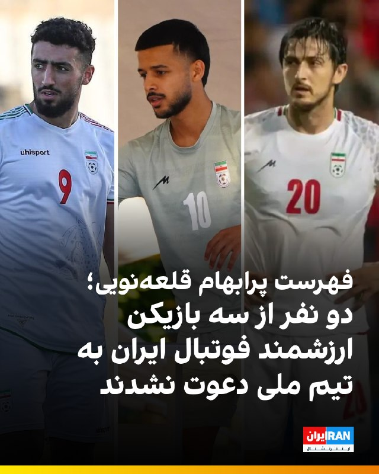

🔻از میان سه بازیکن گران‌قیمت فوتبال ایران در سایت ترانسفرمارکت، تنها مهدی قایدی در فهرست تیم ملی برای جام جهانی ۲۰۲۶ حضور دارد. سردار آزمون با ارزش ۶ میلیون یورو و اللهیار صیادمنش با ارزش ۳ میلیون یورو، با وجود فصل موفق در سطح باشگاهی، از سوی امیر قلعه‌نویی دعوت نشدند.

🔹سردار آزمون، مهاجم شباب الاهلی در حالی از تیم ملی کنار گذاشته شده که فصل موفقی را در امارات متحده عربی پشت سر گذاشت و ستاره‌ تیمش بود. حذف او در شرایطی رخ داده که طی ماه‌های اخیر به دلیل مواضعش علیه جمهوری اسلامی و همچنین انتشار تصویری در کنار حاکم دبی، با حواشی فراوانی روبه‌رو شد.

🔹اللهیار صیادمنش نیز دیگر غایب بزرگ فهرست تیم ملی است. مهاجم وسترلو بلژیک فصل خوبی را پشت سر گذاشت و از بازیکنان تاثیرگذار تیمش بود، اما جایی در فهرست نهایی پیدا نکرد.

🔹این در حالی است که علیرضا جهانبخش با وجود سقوط تیمش در لیگ بلژیک و ثبت تنها حدود ۹۰۰ دقیقه بازی در طول فصل، همچنان در فهرست تیم ملی حضور دارد؛ موضوعی که انتقادها نسبت به تصمیمات کادر فنی را افزایش داده و پرسش‌هایی درباره نقش عوامل غیرفنی در انتخاب نفرات تیم ملی به وجود آورده است.

@iranintltvsport

## IranIntlTV — post 340003

  

سامان جعفرپورمقدم، ۳۸ ساله و اهل فولادشهر اصفهان در جریان اعتراضات ۱۸ دی‌ماه کشته شد. او طی نخستین ساعات تجمعات اعتراضی در مقابل دادگستری فولادشهر، از پشت سر هدف گلوله جنگی قرار گرفت و پیکرش ۱۰ روز بعد به خانواده تحویل داده شد.

بنا بر روایت نزدیکانش، یکی از دوستان سامان با خانواده تماس گرفت و خبر مجروح شدن او را به پدرش داد.

پدر سامان بلافاصله خود را به بیمارستان رساند و با صحنه انتقال مجروحی غرق در خون به اورژانس مواجه شد که بعدتر مشخص شد فرزندش است.

شدت خونریزی سامان به حدی بود که تلاش‌ کادر درمان برای نجاتش نتیجه نداد و او در بیمارستان جان باخت.

به گفته شاهدان عینی، پس از جان‌باختن سامان، خانواده او را از بیمارستان بیرون کردند.

صبح روز بعد، زمانی که پدر سامان برای پیگیری وضعیت فرزندش به بیمارستان مراجعه کرد، به او گفته شد که حدود ساعت چهار صبح تمامی پیکرها از بیمارستان منتقل شده‌اند.

براساس این گزارش‌ها، خانواده پس از آن نزدیک به ۱۰ روز جست‌وجو، سرانجام در ۲۶ دی‌ماه پیکر سامان جعفرپورمقدم را از باغ رضوان اصفهان تحویل گرفتند و ۲۷ دی‌ماه، او را در آرامستان فولادشهر به خاک سپردند.
https://iranintl.com/

## IranIntlTV — post 340002

  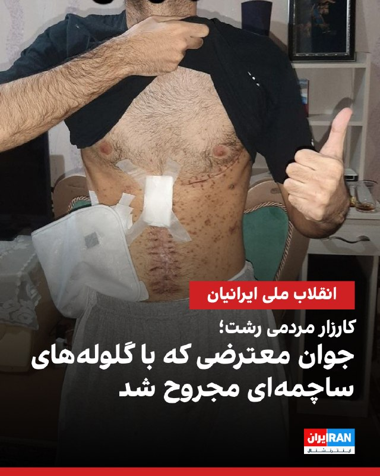

تصاویر و اطلاعاتی درباره یکی از مجروحان اعتراض‌های دی‌ماه رشت به ایران اینترنشنال ارسال شده که نشان می‌دهد یک جوان ۱۹ ساله با گلوله‌های ساچمه‌ا‌ی در بدن به مدت چند ماه در بیمارستان بستری بوده و جراحت جدی به ریه‌اش وارد شده است.
https://iranintl.com/202606014018

## IranIntlTV — post 340001

  

🔻در فاصله ۱۰ روز مانده به آغاز مسابقات جام جهانی ۲۰۲۶، تیم ملی فوتبال ایران در بحرانی بی‌سابقه گرفتار شده است؛ به‌طوری که به گفته امیر قلعه‌نویی، سرمربی تیم ملی، تمام برنامه‌های آماده‌سازی با بن‌بست روبه‌رو شده است.

🔹فدراسیون فوتبال که پیش از این برای پرهیز از مواجهه با ایرانیان مخالف جمهوری اسلامی، با انتقال کمپ خود از آریزونای آمریکا به تیخوانای مکزیک موافقت کرده بود، اکنون در وضعیتی عجیب نه‌تنها روادید آمریکا را دریافت نکرده، بلکه هنوز موفق به دریافت ویزای مکزیک نیز نشده است. با این حال، به نظر می‌رسد مشکل ویزای مکزیک در حال حل شدن باشد. عباس عراقچی، وزیر خارجه جمهوری اسلامی، گفت: «سفارت مکزیک در آنکارا از انجام انگشت‌نگاری صرف‌نظر کرده و روادید اعضای تیم ملی تا یک یا دو روز آینده صادر خواهد شد.»

🔹در این میان، مهدی تاج، رییس فدراسیون فوتبال، به‌جای حل این بحران، مسئولیت را متوجه فدراسیون جهانی فوتبال، فیفا، می‌داند و می‌گوید: «فیفا مسئول برگزاری مسابقات است و از نظر ما مسئول صدور ویزا نیز فیفا است، نه دولت آمریکا.»

🔹جزییات بیشتر را در سایت بخوانید

@iranintltvsport

## IranIntlTV — post 340000

  

اسماعیل بقائی، سخنگوی وزارت خارجه جمهوری اسلامی، خطاب به کشورهای حاشیه خلیج فارس گفت: «از گذشته درس بگیرید و اجازه ندهید که آمریکا و اسرائیل از امکانات شما علیه جمهوری اسلامی استفاده کنند.»

او ادامه داد: «در اینکه برخی کشورهای منطقه با وجود هشدارهای ما، به تعهدات خود عمل نکردند، تردیدی نداریم.»

بقائی اضافه کرد: «ما با مردم کویت و سایر مردمان منطقه که خاک، حاکمیت، قلمرو و امکاناتشان از سوی اسرائیل و آمریکا برای حمله به یک کشور مسلمان مورد سوءاستفاده قرار می‌گیرد، ابراز همبستگی می‌کنیم.»
https://iranintl.com/202606017291

## IranIntlTV — post 339999

  <a href="telegram/content/IranIntlTV_339999_1780307076.mp4" target="_blank">🎬 Download video</a>

ویدیویی که به تازگی از اعتراضات دی‌ماه ۱۴۰۴ به دست ایران‌اینترنشنال رسیده، پیکر رهاشده یک جاویدنام را در یکی از خیابان‌های شهرک ولیعصر تهران نشان می‌دهد.

## IranIntlTV — post 339998

  <a href="telegram/content/IranIntlTV_339998_1780307078.mp4" target="_blank">🎬 Download video</a>

بنا بر گزارش خبرگزاری میزان، وابسته به قوه قضاییه جمهوری اسلامی، حکم اعدام مهرداد محمدی‌نیا و اشکان مالکی پس از تایید در دیوان عالی کشور اجرا شد.

گفت‌وگو با رضا حاجی‌حسینی، روزنامه‌نگار

.
@iranintltv

## IranIntlTV — post 339997

  

اسماعیل بقائی، سخنگوی وزارت خارجه جمهوری اسلامی در واکنش به سخنان ترامپ درباره خارج‌کردن ذخایر اورانیوم غنی‌شده از ایران، گفت که ما درباره جزییات موضوع هسته‌ای هیچ مذاکره‌ای نکرده‌ایم و اگر روزی لازم باشد در خصوص موضوعات هسته‌ای کاری انجام دهیم، می‌دانیم چکار کنیم.

او ادامه داد: مذاکره در دل «سوءظن شدید و بدگمانی» شروع شد و تبادل پیام در این فضا ادامه دارد.

بقائی افزود: «مقامات آمریکایی مکرر مواضع‌شان را تغییر می‌دهند، آنها باید هرچه زودتر به تصمیم مشخصی برسند.»
iranintl.com/202606013663

## IranIntlTV — post 339996

  

احمد میدری، وزیر کار و رفاه اجتماعی، گفت که «کالابرگ خرداد به روال ماه‌های قبل پرداخت می‌شود»، افزود: «بخش‌های مختلف دولت مانند سازمان برنامه به‌دنبال منابع جدید برای کالابرگ هستند، اما هنوز منابع جدیدی نداریم.»

او اضافه کرد: «فعلا برنامه‌ای برای تغییر حداقل مزد کارگران نداریم.»
https://iranintl.com/202606015094

## IranIntlTV — post 339995

  <a href="telegram/content/IranIntlTV_339995_1780307082.mp4" target="_blank">🎬 Download video</a>

بر اساس گزارش اختصاصی ایران‌اینترنشنال و به نقل از یک منبع آگاه، مسعود پزشکیان در نامه‌ای رسمی خطاب به دفتر مجتبی خامنه‌ای، درخواست کناره‌گیری فوری از سمت خود را مطرح کرده است.

گفت‌وگو با مرتضی کاظمیان، عضو تحریریه ایران‌اینترنشنال

@iranintltv

## IranIntlTV — post 339994

  <a href="telegram/content/IranIntlTV_339994_1780307084.mp4" target="_blank">🎬 Download video</a>

دونالد ترامپ، رییس‌جمهوری آمریکا، در شبکه اجتماعی تروث‌سوشال نوشت: «جمهوری اسلامی واقعا می‌خواهد به یک توافق برسد و این معامله برای آمریکا و متحدانش مفید خواهد بود.»

گفت‌وگو با محمد جواد اکبرین، عضو تحریریه ایران‌اینترنشنال

@iranintltv

## IranIntlTV — post 339993

  

اسماعیل بقائی، سخنگوی وزارت خارجه جمهوری اسلامی، در نشست خبری خود گفت: «اسرائیل طی ۸۰ سال گذشته جنگ دائمی علیه کشورهای منطقه و با حمایت آمریکا به راه انداخته است.»

بقائی اضافه کرد: «آتش‌بس در لبنان بخش جدایی‌ناپذیر هرگونه توافق نهایی برای خاتمه جنگ است.»
https://iranintl.com/202606012979

## IranIntlTV — post 339992

  

کاظم غریب‌آبادی، معاون حقوقی وزارت خارجه گفت که جمهوری اسلامی در شرایط جنگ، ترتیبات جدیدی برای کنترل عبور و مرور تعریف کرده و به هیچ کشوری اجازه دخالت نمی‌دهد.

غریب‌آبادی افزود: «آمریکا و رییس‌جمهورش با نقض حقوق بین‌الملل عمان را تهدید کرده‌اند، اما ما از عمان خواسته‌ایم تسلیم تهدیدها نشود و حاکمیت خود را در زمان صلح اعمال کند.»

او با بیان اینکه «تنگه هرمز دو دولت ساحلی بیشتر ندارد، جمهوری اسلامی و سلطنت عمان»، گفت: «هر ترتیبات حقوقی در زمان صلح باید با همکاری و مشورت با عمان باشد.»
https://iranintl.com/202606016035

## IranIntlTV — post 339991

  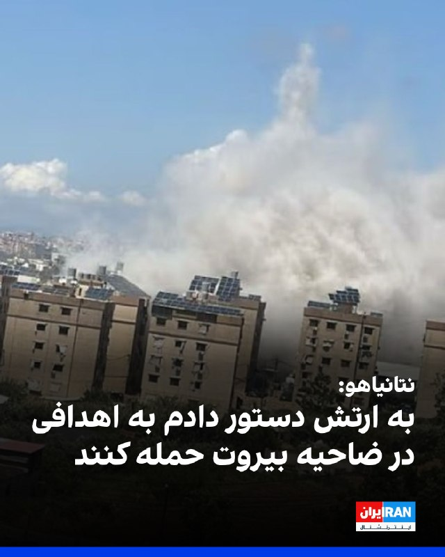

بنیامین نتانیاهو، نخست‌وزیر اسرائیل خبر داد که به ارتش این کشور دستور داده، به اهدافی در حومه جنوبی بیروت حمله کنند.

همزمان یسرائیل کاتز، وزیر دفاع اسرائیل تاکید کرد که نتانیاهو و او، به ارتش دستور دادند، اهدافی را در منطقه ضاحیه بیروت هدف قرار دهد.

پیش‌تر یک مقام آمریکایی گفته بود که مارکو روبیو، وزیر خارجه ایالات متحده، با جوزف عون، رییس‌جمهوری لبنان، و بنیامین نتانیاهو، نخست‌وزیر اسرائیل، در مورد مذاکرات دیپلماتیک بین این دو کشور کفت‌وگو کرده و طرحی را برای «کاهش تدریجی تنش» پیشنهاد داده است.
https://iranintl.com/202606017699

## IranIntlTV — post 339990

  <a href="telegram/content/IranIntlTV_339990_1780307089.mp4" target="_blank">🎬 Download video</a>

ویدیوی ارسال‌شده به ایران‌اینترنشنال، استفاده ابزاری از کودکان را در ایست و بازرسی خیابان بنی‌هاشمی شیراز در شامگاه یکشنبه ۱۰ خرداد نشان می‌دهد.

## IranIntlTV — post 339989

  <a href="telegram/content/IranIntlTV_339989_1780307091.mp4" target="_blank">🎬 Download video</a>

بر اساس گزارش تازه روزنامه گاردین، چین با صدور فناوری‌های سانسور و نظارت اینترنتی، به یکی از الگوهای اصلی حکومت‌های اقتدارگرا از جمله جمهوری اسلامی در کنترل فضای مجازی تبدیل شده است.

گفت‌وگو با مهدی صارمی‌فر، روزنامه‌نگار علم و تکنولوژی
@iranintltv

## Shin_Persian — post 6349

  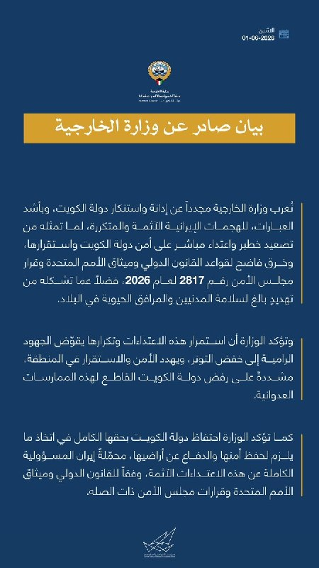

Shin ✓ @hey_itsmyturn
Mon, 01 Jun 2026 07:56:10 UTC

Kuwait Ministry of Foreign Affairs strongly condemns repeated Iranian attacks against Kuwait.

Official statement warns of serious escalation and direct threat to national security and civilian safety. Kuwait reserves …

Source: https://x.com/i/web/status/2061356049962058127

فارسی

وزارت امور خارجه کویت حملات مکرر ایران علیه کویت را به شدت محکوم می‌کند.

بیانیه رسمی نسبت به تشدید جدی تنش‌ها و تهدید مستقیم علیه امنیت ملی و ایمنی غیرنظامیان هشدار می‌دهد. کویت حق ... را برای خود محفوظ می‌دارد.

منبع: https://x.com/i/web/status/2061356049962058127

𝕏 · @shin_persian

## Shin_Persian — post 6348

  <a href="telegram/content/Shin_Persian_6348_1780307094.mp4" target="_blank">🎬 Download video</a>

Vahid Online ✓ @Vahid
Mon, 01 Jun 2026 03:14:16 UTC

'شلیک موشک از #امیدیه در خوزستان'
ویدیوی دریافتی، دوشنبه ۱۱ خرداد ساعت ۶:۳۰ به وقت #ایران
#Iran

English

'Missile launch from #Omidiyeh in Khuzestan'
Received video, Monday, June 1, at 6:30 AM #Iran time
#Iran

𝕏 · @shin_persian

## Shin_Persian — post 6347

  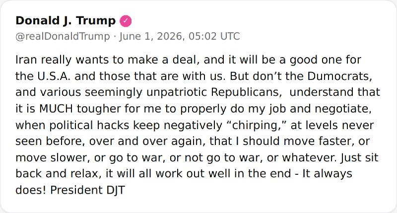

Shin ✓ @hey_itsmyturn Mon, 01 Jun 2026 05:05:45 UTC President Trump @POTUS: "Iran really wants to make a deal, and it will be a good one for the U.S.A. and those that are with us. But don’t the Dumocrats, and various seemingly unpatriotic Republicans, understand…

## Shin_Persian — post 6346

Shin ✓ @hey_itsmyturn
Mon, 01 Jun 2026 05:05:45 UTC

President Trump @POTUS:
"Iran really wants to make a deal, and it will be a good one for the U.S.A. and those that are with us. But don’t the Dumocrats, and various seemingly unpatriotic Republicans, understand that it is MUCH tougher for me to properly do my job and negotiate, when political hacks keep negatively “chirping,” at levels never seen before, over and over again, that I should move faster, or move slower, or go to war, or not go to war, or whatever. Just sit back and relax, it will all work out well in the end - It always does! President DJT"

فارسی

رئیس‌جمهور ترامپ @POTUS:
"ایران واقعاً خواهان توافق است و این توافقی خوب برای ایالات متحده و کسانی که با ما هستند خواهد بود. اما آیا دمکرات‌های احمق (Dumocrats) و جمهوری‌خواهان مختلف که ظاهراً غیروطن‌پرست هستند، درک نمی کنند که برای من بسیار سخت‌تر است که کارم را به درستی انجام دهم و مذاکره کنم، وقتی که مزدوران سیاسی مدام با سطحی بی‌سابقه به شکلی منفی «ووزووز» می‌کنند و بارها و بارها می‌گویند که باید سریع‌تر حرکت کنم، یا کندتر حرکت کنم، یا وارد جنگ شوم، یا وارد جنگ نشوم، یا هر چیز دیگر. فقط بنشینید و آرام باشید، در نهایت همه چیز به خوبی پیش خواهد رفت - همیشه همین‌طور می‌شود! رئیس‌جمهور دی‌جی‌تی"

𝕏 · @shin_persian

## FarsiVOA — post 219246

  

ریاست‌جمهوری مصر اعلام کرد عبدالفتاح السیسی، رئیس‌جمهور این کشور، در تماس تلفنی با امانوئل مکرون، رئیس‌جمهور فرانسه، از تلاش‌های فشرده قاهره برای کمک به دستیابی به توافقی جامع میان آمریکا و جمهوری اسلامی خبر داده است.

مصر اعلام کرده هدف از اقدامات و تلاش‌‌ها برای رسیدن به این توافق، جلوگیری از بازگشت تنش و بازگرداندن امنیت و ثبات به منطقه و کشورهای خلیج فارس است.

این موضع در شرایطی اعلام شده که جنگ آمریکا و جمهوری اسلامی، امنیت خلیج فارس، عبور و مرور در تنگه هرمز و ثبات انرژی جهانی را به یکی از محورهای اصلی رایزنی‌های منطقه‌ای و بین‌المللی تبدیل کرده است.

در همین تماس، مکرون نیز بر ضرورت باز بودن تنگه هرمز و رفع هرگونه محدودیت در عبور و مرور از این مسیر راهبردی تأکید کرد. دو طرف همچنین توافق کردند هماهنگی و رایزنی‌های فشرده میان مصر و فرانسه برای بازگرداندن ثبات منطقه‌ای ادامه یابد.
@FarsiVOA

## FarsiVOA — post 219245

🔺امیدواری نسبی مصرف‌کنندگان منطقه یورو به کنترل تورم بلندمدت

▪️نظرسنجی تازه بانک مرکزی اروپا نشان می‌دهد مصرف‌کنندگان منطقه یورو، با وجود جهش تورم و افزایش فشار قیمت انرژی، انتظارات تورمی بلندمدت خود را نزدیک به هدف نگه داشته‌اند.

▪️بر اساس گزارش رویترز، تورم منطقه یورو در آوریل تحت تأثیر افزایش قیمت نفت به ۳ درصد رسید؛ بالاتر از هدف ۲ درصدی بانک مرکزی اروپا.

▪️داده‌های روزهای اخیر در اقتصادهای بزرگ منطقه یورو از باقی ماندن تورم بالاتر از هدف بانک مرکزی حکایت دارد. در فرانسه، نرخ تورم ماه مه به ۲.۸ درصد افزایش یافت. در ایتالیا، تورم به ۳.۲ درصد رسید. در اسپانیا، نرخ تورم در سطح ۳.۲ درصد ثابت ماند، و در آلمان، تورم به ۲.۶ درصد کاهش یافت.

⬇️ بیشتر بخوانید:
https://ir.voanews.com/a/euro-zone-consumers-take-benign-view-on-inflation-surge/8156051.html

## FarsiVOA — post 219244

  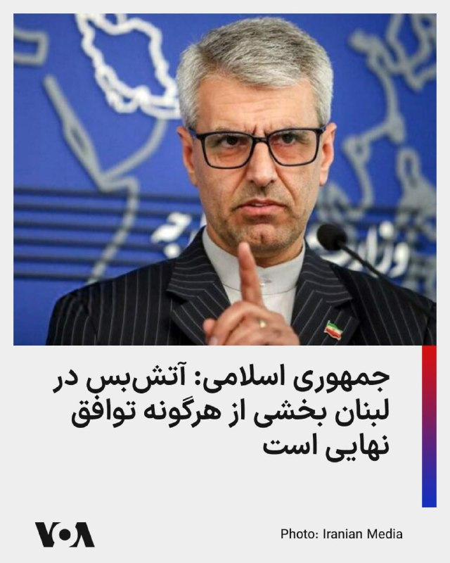

سخنگوی وزارت خارجه جمهوری اسلامی ادعا کرد که موضوع آتش‌بس در لبنان «بخش جدایی‌ناپذیر هرگونه آتش‌بس و توافق نهایی» با آمریکا برای خاتمه جنگ است.

اسماعیل بقایی دوشنبه در یک نشست خبری گفت: «تاکید داریم که آتش‌بس در لبنان بخش لاینفک هرگونه آتش‌بس و توافق نهایی برای جنگ است.»

این اظهارات همزمان با دستور نخست‌وزیر و وزیر دفاع اسرائیل برای آغاز حملات به مواضع حزب‌الله لبنان در حومه بیروت مطرح شده است. این دستور به دلیل نقض‌های مکرر آتش‌بس از سوی حزب‌الله صادر شد. همچنین اسرائیل به پیشروی نیروی زمینی خود در جنوب لبنان ادامه می‌دهد.

بقایی علاوه بر اسرائیل، ادعا کرده که آمریکا نیز به «نقض آتش‌بس» می‌پردازد؛ این در حالی است که سنتکام از «اقدامات تهاجمی» رژیم ایران خبر داده و اعلام کرده که این حملات «شامل سرنگونی یک پهپاد ام‌کیو-۱ آمریکا در حال انجام عملیات بر فراز آب‌های بین‌المللی بود.»
@FarsiVOA

## FarsiVOA — post 219243

  

دادگستری استان سمنان دارایی‌های ۱۸ نفر از شهروندان را به اتهام همکاری با آنچه «سرویس‌های جاسوسی آمریکا و اسرائیل» خوانده، توقیف کرد. رئیس کل دادگستری استان سمنان گفت: با اجرای این احکام، شمار افرادی که دارایی‌هایشان در این استان توقیف شده به ۴۰ نفر رسیده است.

به گفته محمدصادق اکبری، برای شماری از افراد در داخل و خارج از ایران پرونده قضایی تشکیل شده و آنها به همکاری با اسرائیل و نهادهای اطلاعاتی خارجی متهم شده‌اند. مقام‌های قضایی مدعی هستند که این افراد با اقدام‌ها یا حمایت‌های خود در جهت تقویت یا مشروعیت‌بخشی به اسرائیل علیه امنیت و منافع ملی ایران فعالیت کرده‌اند.

در این گزارش جزئیاتی درباره هویت افراد، ارزش دارایی‌های توقیف‌شده یا اسناد و مدارک مربوط به این اتهامات منتشر نشده است.

این اقدام در حالی صورت می‌گیرد که رسانه‌های حکومتی پیش‌تر از توقیف اموال ده‌ها ایرانی خارج از کشور در استان‌های گلستان و خراسان جنوبی خبر داده بودند. مقام‌های قضایی این افراد را به همکاری با نهادهای خارجی متهم کرده‌اند، اما جزئیات پرونده‌ها، مستندات اتهام‌ها و امکان دفاع متهمان به‌طور مستقل قابل راستی‌آزمایی نیست.
@FarsiVOA

## FarsiVOA — post 219242

  

اسرائیل تایمز در گزارشی به نقل از دو دیپلمات اعلام کرد که مذاکره‌‌کنندگان پرونده غزه قرار است روز پنج‌شنبه ۱۴ خرداد، به میزبانی کشور مصر، گفت‌وگوهای مربوط به خلع سلاح حماس را از سر بگیرند.

این دو دیپلمات عرب گفته‌اند که «هیئت صلح» تحت هدایت آمریکا، هنوز به طور کامل امید خود را به امکان پیشرفت مذاکرات از دست نداده و این در حالی است که حماس از پذیرش پیشنهاد «هیئت صلح» برای خلع سلاح خودداری می‌کند.

حماس ادعا می‌کند تا زمانی که رهبر جدید انتخاب نشود، نمی‌توان هیچ تصمیم نهایی درباره خلع سلاح اتخاذ کند. ایالات متحده، اتحادیه اروپا، اسرائیل و برخی از کشورها از جمله مصر، حماس و یا دست‌کم شاخه نظامی این گروه را در فهرست گروه‌های تروریستی قرار داده‌اند.

دیپلمات‌های عرب به اسرائيل تایمز گفته‌اند که اگر طرح رئیس‌جمهور آمریکا، جهت پایان دادن به جنگ غزه به نتیجه نرسد،‌ احتمال بررسی طرح‌های جایگزین وجود دارد.

یکی از گزینه‌های جایگزین، اجازه به دولت بنیامین نتانیاهو برای بازسازی برخی از مناطق غزه که تحت کنترل اسرائیل قرار دارد، است که پیش‌تر از سوی دونالد ترامپ به دلیل احتمال مخالفت منطقه کنار گذاشته شده بود.
@FarsiVOA

## FarsiVOA — post 219241

  

جمهوری اسلامی با اعتراض به انتقادهای اتحادیه اروپا از حملاتش در منطقه، این حملات را در چارچوب «حق دفاع مشروع» توصیف کرد.

اتحادیه‌ ارو‍پا طی روزهای اخیر با صدور بیانیه‌های جداگانه، تداوم حملات جمهوری اسلامی به کشورهای همسایه را محکوم کرده بود.

در یک بیانیه در محکومیت حملات جمهوری اسلامی به خاک کویت، اتحادیه اروپا چنین حملاتی «تهدیدی جدی برای امنیت و ثبات منطقه‌ای» خوانده است. این اتحادیه از جمهوری اسلامی خواسته است تا قطعنامه ۲۸۱۷ شورای امنیت سازمان ملل مبنی بر توقف حملات به کشورهای خلیج فارس را به طور کامل اجرا کند.

اتحادیه اروپا همچنین هفتم خرداد نیز در بیانیه پایانی بیست‌وپنجمین نشست سالانه خود به موضوع ایران اشاره و یادآور شد که به شدت «حملات غیرقابل توجیه و بی رویه موشک‌های بالستیک و پهپاد ایران» علیه کشورهای منطقه را محکوم می‌کند.

اسماعیل بقایی، سخنگوی وزارت خارجه جمهوری اسلامی اما به بیانیه‌‌ها اتحادیه اروپا واکنش نشان داده و مدعی شد که «هدف قرار دادن مبادی و امکاناتی که برای تجاوز نظامی» مورد استفاده قرار می‌گیرد، در چارچوب «حق دفاع مشروع» است.
@FarsiVOA

## FarsiVOA — post 219240

  

وزارت خارجه کویت با انتشار بیانیه‌ای، «حملات نادرست و مکرر» جمهوری اسلامی به خاک خود را شدیداً محکوم و نسبت به آن ابراز انزجار کرد.

در این بیانیه که دوشنبه منتشر شد، آمده است که این حملات «تشدید تنشی خطرناک، تعرضی مستقیم به امنیت دولت کویت و ثبات آن، نقض آشکار قواعد حقوق بین‌الملل، منشور سازمان ملل متحد و قطعنامه شماره ۲۸۱۷ شورای امنیت برای سال ۲۰۲۶، و تهدیدی جدی برای سلامت غیرنظامیان و تأسیسات حیاتی کشور» محسوب می‌شود.

این وزارتخانه تأکید کرد که ادامه و تکرار این حملات، تلاش‌های صورت‌گرفته برای کاهش تنش را تضعیف کرده و امنیت و ثبات منطقه را به خطر می‌اندازد.

همچنین کویت ضمن مسئول دانستن جمهوری اسلامی در این «حملات تجاوزکارانه»، افزود که «حق کامل خود را برای اتخاذ هر اقدام لازم جهت حفظ امنیت و دفاع از سرزمین خود محفوظ می‌دارد.»
@FarsiVOA

## FarsiVOA — post 219239

  

روسیه صادرات سوخت جت را تا ۳۰ نوامبر ممنوع کرد؛ تصمیمی که هم‌زمان با افزایش حملات اوکراین به پالایشگاه‌ها و فشار بر زیرساخت انرژی این کشور گرفته شده است.

دولت روسیه هدف از این محدودیت را حفظ ثبات بازار داخلی و تأمین نیاز مصرف‌کنندگان اعلام کرده است.

اهمیت این تصمیم بیش از آنکه به سهم روسیه در بازار جهانی سوخت جت مربوط باشد، به نشانه‌ای از فشار داخلی بر تولید سوخت در روسیه بازمی‌گردد.

طبق داده‌های جمع‌آوری‌شده بلومبرگ از شرکت تحلیلی ورتکسا، روسیه در سال گذشته به‌طور متوسط روزانه حدود ۳۰ هزار بشکه سوخت جت صادر کرده است. این رقم کمتر از دو درصد عرضه جهانی است.

میانگین صادرات روزانه این کشور در چهار ماه نخست سال ۲۰۲۶ نیز به ۲۸ هزار بشکه کاهش یافته و ترکیه خریدار اصلی آن بوده است.

پیش از این نیز وزارت انرژی روسیه از اول آوریل ممنوعیت صادرات بنزین را دوباره اعمال کرده بود تا سوخت بیشتری در بازار داخلی باقی بماند.
@FarsiVOA

## FarsiVOA — post 219238

🔺دولت مبلغ کالابرگ را افزایش نداد

▪️در حالی که طی هفته‌های گذشته بارها از بررسی افزایش اعتبار کالابرگ، پیشنهاد رشد ۳۰ تا ۱۰۰ درصدی آن و ضرورت جبران فشار گرانی بر سفره مردم سخن گفته شده بود، وزیر تعاون، کار و رفاه اجتماعی، اعلام کرد کالابرگ خردادماه «به روال ماه‌های قبل» پرداخت می‌شود.

▪️این اظهارنظر به معنای آن است که دولت، دست‌کم در خرداد، مبلغ کالابرگ را افزایش نداده است؛ آن هم در شرایطی که انتظار عمومی پس از چندین وعده و اظهارنظر رسمی، به سمت افزایش اعتبار این طرح رفته بود.

▪️کالابرگ قرار بود بخشی از فشار تورم بر معیشت خانوار را جبران کند، اما با ثابت ماندن مبلغ آن و رشد قیمت کالاهای اساسی، ارزش واقعی این حمایت کاهش یافته است.

⬇️ بیشتر بخوانید:
https://ir.voanews.com/a/8156050.html

## FarsiVOA — post 219237

🔺دانشگاه زیر فشار امنیتی؛ شرق از موج تازه اخراج، تعلیق و پرونده‌سازی برای صدها دانشجو خبر داد

▪️روزنامه شرق در گزارشی از موج تازه احضار، تشکیل پرونده، تعلیق و صدور احکام انضباطی برای دانشجویان چند دانشگاه بزرگ ایران خبر داده است.

▪️بر اساس این گزارش، چهار روز پس از بازگشایی دانشگاه‌ها در اسفند ۱۴۰۴، پس از دو ماه تعطیلی، دانشجویان با تماس‌ها و پیامک‌هایی درباره تشکیل پرونده انضباطی روبه‌رو شدند.

▪️اکنون در خرداد ۱۴۰۵ و در حالی که تعطیلی دانشگاه‌ها به دلیل جنگ به سه ماه نزدیک شده، دانشگاه‌ها پیگیری همان پرونده‌ها و تشکیل پرونده‌های تازه را آغاز کرده‌اند.

▪️در دانشگاه صنعتی شریف، حدود ۲۵ تا ۳۰ پرونده مشخص وجود دارد و با احتساب موارد علنی‌نشده، شمار پرونده‌ها می‌تواند به ۳۰ تا ۴۰ مورد برسد.

⬇️ بیشتر بخوانید:
https://ir.voanews.com/a/a-new-wave-of-expulsions-suspensions-and-filing-of-cases-against-hundreds-of-students/8156048.html

## FarsiVOA — post 219236

  

در پی نقض‌های مکرر آتش‌بس در لبنان از سوی حزب‌الله و حملات این گروه به شهرها و شهروندان اسرائیل، بنیامین نتانیاهو، نخست‌وزیر اسرائیل، و اسرائیل کاتز، وزیر دفاع، دستور دادند ارتش اسرائیل اهداف وابسته به حزب‌الله در منطقه ضاحیه بیروت را هدف قرار دهد.

در بیانیه مشترک نتانیاهو و کاتز آمده است که این تصمیم در پاسخ به حملات اخیر حزب‌الله و ادامه تهدید علیه شهروندان اسرائیل گرفته شده است.

ضاحیه بیروت از مهم‌ترین پایگاه‌های حزب‌الله در پایتخت لبنان به شمار می‌رود و در ماه‌های گذشته نیز بارها هدف حملات ارتش اسرائیل قرار گرفته است.

⬇️ بیشتر بخوانید:
https://ir.voanews.com/a/netanyahu-and-katz-order-attack-on-hezbollah-positions-in-beirut/8156049.html

## FarsiVOA — post 219235

  <a href="telegram/content/FarsiVOA_219235_1780307102.mp4" target="_blank">🎬 Download video</a>

تصاویر منتسب به شلیک موشک از امیدیه در خوزستان؛

تصاویر ارسالی به کانال تلگرامی «وحید آنلاین» شلیک موشک از امیدیه در خوزستان را حوالی ۶:۳۰ صبح دوشنبه ۱۱ خرداد نشان می‌دهد.

هم‌زمان سپاه پاسداران از حمله به یک پایگاه هوایی در منطقه خبر داد و ادعا کرد که این پایگاه مبدأ حمله به یک دکل مخابراتی در سیریک واقع در استان هرمزگان بوده است. روابط عمومی سپاه پاسداران دوشنبه از اعلام جزئیات بیشتر خودداری کرد و مشخص نکرد که این پایگاه در کدام کشور قرار داشت.

در این زمینه خبرگزاری رسمی کویت گزارش داد که پدافند هوایی این کشور، جایی که یک پایگاه آمریکا در آن قرار دارد، روز دوشنبه در حال رهگیری حملات موشکی و پهپادی بوده است. آژیرهای هشدار نیز در سراسر کویت به صدا درآمده‌اند، اما جزئیات بیشتری ارائه نشده است.
@FarsiVOA

## FarsiVOA — post 219234

🔺مکرون از توقیف یک نفتکش «ناوگان سایه» روسیه در اقیانوس اطلس خبر داد

▪️رئیس‌جمهوری فرانسه اعلام کرد که نیروی دریایی این کشور نفتکش «تاگور» را که مشمول تحریم‌های بین‌المللی بود و از مبدأ روسیه حرکت کرده بود، توقیف و بازرسی کرده است.

▪️او گفت: «این عملیات در اقیانوس اطلس، در آب‌های آزاد، با حمایت چندین شریک از جمله بریتانیا و با رعایت کامل حقوق دریاها انجام شد.»

▪️او افزود: «غیرقابل قبول است که کشتی‌ها تحریم‌های بین‌المللی را دور بزنند، حقوق دریاها را نقض کنند و جنگی را که روسیه بیش از چهار سال است علیه اوکراین به راه انداخته، تأمین مالی کنند.»

▪️فرانسه و بریتانیا متعهد شده‌اند مانع فعالیت کشتی‌های مرتبط با «ناوگان سایه» روسیه شوند که از آب‌های تحت نظارت آن‌ها عبور می‌کنند.

⬇️ بیشتر بخوانید:
https://ir.voanews.com/a/macron-says-french-navy-boarded-russia-linked-oil-tanker/8156047.html

## FarsiVOA — post 219233

🔺هزینه وصل‌ماندن اینترنت ۸ برابر شد؛ تبدیل فیلترشکن به خرج ثابت خانوار

▪️هزینه دسترسی به اینترنت آزاد در ایران، پس از سه ماه قطع مستمر و هم‌زمان با ادامه فیلترینگ و اختلال‌های گسترده، به یکی از هزینه‌های ثابت خانوارها تبدیل شده است.

▪️گزارش اقتصادنیوز نشان می‌دهد بازار فیلترشکن مانند بسیاری از کالاها و خدمات دیگر با جهش شدید قیمت روبه‌رو شده و هزینه «وصل ماندن» برای کاربران ایرانی چند برابر شده است.

▪️بر اساس این گزارش، پیش از قطعی‌های گسترده دی‌ماه ۱۴۰۴، بسته ۳۰ روزه ۳۰ گیگابایتی فیلترشکن با قیمت ۵۹ هزار و ۹۰۰ تومان فروخته می‌شد؛ یعنی هر گیگابایت حدود یک هزار و ۹۹۶ تومان. اما اکنون همین بسته به ۴۳۹ هزار تومان رسیده و قیمت هر گیگابایت آن حدود ۱۴ هزار و ۶۳۳ تومان شده است.

⬇️ بیشتر بخوانید:
https://ir.voanews.com/a/cost-of-staying-connected-to-internet-increased-8-times/8156045.html

## FarsiVOA — post 219232

  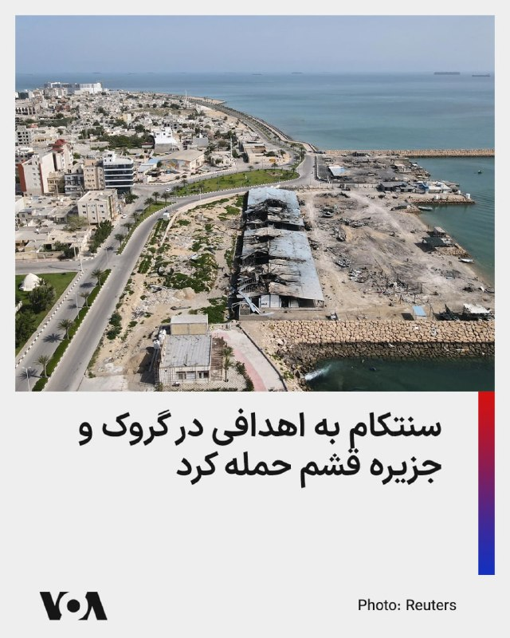

فرماندهی مرکزی ایالات متحده آمریکا (سنتکام) اعلام کرد که در دفاع از خود در مقابل تجاوزهای رژیم ایران، حملاتی به سایت‌های راداری و مراکز فرماندهی و کنترل پهپادهای جمهوری اسلامی در گروک و جزیره قشم در جنوب ایران انجام داد.

سنتکام با انتشار بیانیه‌ای نوشت که این حملات «سنجیده و هدفمند» در طول آخر هفته (شنبه و یکشنبه) صورت گرفت و «در پاسخ به اقدامات تهاجمی ایران انجام شد که شامل سرنگونی یک پهپاد ام‌کیو-۱ آمریکا بود که در حال انجام عملیات بر فراز آب‌های بین‌المللی بود.»

بر اساس گزارش ارتش آمریکا، جنگنده‌های آمریکایی به سرعت واکنش نشان دادند و سامانه‌های پدافند هوایی رژیم ایران، یک ایستگاه کنترل زمینی و دو پهپاد انتحاری یک‌طرفه را که «تهدیدی آشکار برای کشتی‌های در حال عبور از آب‌های منطقه بودند»، منهدم کردند.

سنتکام افزود که هیچ‌یک از نیروهای نظامی آمریکا آسیب ندیدند. این نهاد تأکید کرد که در طول آتش‌بس جاری، در واکنش به «تجاوز بی‌دلیل ایران» به حفاظت از دارایی‌ها و منافع ایالات متحده ادامه خواهد داد.
@FarsiVOA

## FarsiVOA — post 219231

🔺ترامپ توافق احتمالی با رژیم ایران را «توافقی خوب» برای آمریکا توصیف کرد

▪️دونالد ترامپ، رئیس‌جمهوری آمریکا، اعلام کرد که جمهوری اسلامی «واقعاً می‌خواهد به یک توافق برسد و این توافق برای آمریکا و کسانی که با ما هستند، توافق خوبی خواهد بود.»

▪️پیشتر اکسیوس و نیویورک‌تایمز گزارش دادند پرزیدنت ترامپ خواستار سخت‌گیرانه‌تر شدن شروط چارچوب توافق احتمالی با جمهوری اسلامی شده و نسخه اصلاح‌شده را برای بررسی به تهران فرستاده است.

▪️اکسیوس نوشت ترامپ از تیم خود خواسته چند بند، به‌ویژه بندهای مربوط به برنامه هسته‌ای و مواد هسته‌ای را اصلاح کنند.

▪️نیویورک‌تایمز نیز گزارش داد ترامپ از کندی پاسخ جمهوری اسلامی به پیشنهادهای آمریکا ناراضی است.

⬇️ بیشتر بخوانید:
https://ir.voanews.com/a/trump-described-possible-agreement-with-iran-as-a-good-deal-for-us/8156044.html

## FarsiVOA — post 219230

  

خبرگزاری میزان وابسته به دستگاه قضایی جمهوری اسلامی، از اجرای حکم اعدام مهرداد محمدی‌نیا و اشکان مالکی، دو نفر از معترضان دی ماه ۱۴۰۴ خبر داد.

این دو معترض صبح روز ۱۱ خرداد و کمتر از پنج ماه پس از دستگیری اعدام شدند و از روند برگزاری دادگاه و نحوه دفاعیات گزارشی منتشر نشده است.

مهرداد محمدی‌نیا و اشکان مالکی در پرونده موسوم به «مسجد جعفری»، متهم به مسدودسازی خیابان و آتش‌زدن مسجد شده بودند. این پرونده یک متهم دیگر به نام «آرمان معرفتی» نیز دارد و منابع حقوق بشری نگران اعدام این معترض نیز هستند.

«اقدام به تخریب و آتش‌زدن عمدی مسجد»، «تخریب اموال عمومی»، «درگیری با مأموران انتظامی»، و «انسداد خیابان‌ها و ممانعت از عبور و مرور مردم»، از جمله اتهام‌های منتسب به این دو معترض بوده است.

در خبر اولیه، جزئیاتی در مورد زمان و شرایط بازداشت، و روند دادرسی این دو اعلام نشده و تنها آمده است که حکم اعدام آنها پس از تأیید حکم در دیوان عالی کشور اجرا شده است.

⬇️ بیشتر بخوانید:
https://ir.voanews.com/a/iran-judiciary-executed-two-more-january-protesters/8156046.html

## FarsiVOA — post 219229

🔺قیمت نفت با پیشروی اسرائیل در لبنان بیش از دو درصد افزایش یافت

▪️قیمت نفت در معاملات اولیه روز دوشنبه، پس از پیشروی تازه ارتش اسرائیل در جنوب لبنان و افزایش نگرانی‌ها درباره امنیت تنگه هرمز، بیش از دو درصد بالا رفت. روندی که از نگاه بازار می‌تواند بر بازگشایی تنگه هرمز و بازگشت عرضه نفت اثر بگذارد.

▪️نفت خام آمریکا با دو دلار و ۳۷ سنت افزایش، به ۸۹ دلار و ۷۳ سنت در هر بشکه رسید. نفت برنت نیز با دو دلار و ۱۶ سنت افزایش، ۹۳ دلار و ۲۸ سنت معامله شد.

▪️این جهش پس از آن رخ داد که قیمت‌ها در معاملات جمعه، به امید توافق تهران و واشنگتن، کاهش یافته بود.

▪️افزایش بهای نفت نشان می‌دهد ریسک ژئوپلیتیک در خاورمیانه بار دیگر بر نگرانی‌های مربوط به تقاضای جهانی غلبه کرده است.

⬇️ بیشتر بخوانید:
https://ir.voanews.com/a/oil-prices-rise-more-than-2-percent-as-israel-advances-in-lebanon/8156043.html

## FarsiVOA — post 219228

Farsi VOA pinned an audio file

## FarsiVOA — post 219227

  <a href="https://t.me/farsivoa/219227" target="_blank">📎 Download file</a>

🔴📢‌ پادکست خبری یکشنبه ۱۰ خرداد ۱۴۰۵

🛜در صورتی که با مشکل اینترنت مواجه هستید میتوانید اخبار صدای آمریکا را از نسخه‌های پادکست خبری ما روزانه دنبال کنید و یا اخبار را از نسخه سبک وب‌سایت ما پیگیر باشید:
https://ir.voanews.com/lite

📡بروزترین فرکانسهای ماهواره‌ای را نیز میتوانید از صفحه زیر پیگیری کنید:
https://ir.voanews.com/satellite

🔔دیگر شبکه‌های اجتماعی ما هم دنبال کنید:
https://linktr.ee/voafarsi

ما را به اشتراک بگذارید
@farsivoa

## DW_Farsi — post 125367

  

🔶 نتانیاهو دستور حمله ارتش اسرائیل به ضاحیه بیروت را صادر کرد
 
نخست‌وزیر اسرائیل روز دوشنبه اول ژوئن به ارتش این کشور دستور داد تا مواضعی را در حومه جنوبی بیروت، منطقه‌ای معروف به ضاحیه که به عنوان پایگاه حزب‌الله به شمار می‌رود، هدف قرار دهد.
 
در بیانیه‌ای که دفتر بنیامین نتانیاهو منتشر کرده، آمده است در پی "نقض مکرر آتش‌بس" توسط حزب‌الله و ادامه حملات این گروه به شهرها و شهروندان اسرائیلی، نخست‌وزیر و وزیر دفاع اسرائیل به ارتش این کشور دستور دادند تا "اهداف تروریستی" را در منطقه ضاحیه بیروت هدف حمله قرار دهند.
 
اسرائیل در طول دوره آتش‌بس به درخواست دولت آمریکا عمدتا از حمله به بیروت خودداری کرده بود.
 
ارتش اسرائیل و نیروهای حزب‌الله از زمان برقراری آتش‌بس در لبنان که اواسط ماه آوریل رخ داد، همچنان به تبادل آتش ادامه‌ داده‌اند.
 
در همین حال ده‌ها هزار نفر از ساکنان شمال اسرائیل به دلیل حملات موشکی و پهپادی حزب‌الله مجبور به ترک خانه‌های خود شده‌اند.
 
مقامات لبنان می‌گویند حملات اخیر اسرائیل به این کشور موجب کشته‌شدن بیش از سه هزار شهروند لبنانی و آواره شدن چند صد هزار تن شده است.
@dw_farsi

## DW_Farsi — post 125366

  

🔶 پرتاب پنج موشک از لبنان به سمت اسرائیل
 
ارتش اسرائیل از رهگیری دو موشک پرتاب‌شده از لبنان به سمت کریات شمونا، شهری در شمال این کشور در دوشنبه ۱۱ خرداد (اول ژوئن) خبر داد و اعلام کرد نتیجه رهگیری موشک سوم در دست بررسی است. به گفته ارتش دو موشک دیگر نیز به سمت شهر طبریه شلیک شد که یکی از آنها در منطقه‌ای باز فرود آمد و موشک دوم داخل خاک لبنان و نزدیک محل استقرار نیروهای اسرائیلی سقوط کرده است.
 
ارتش اسرائیل همچنین اعلام کرد که حمله پهپادی حزب‌الله در جنوب لبنان منجر به کشته شدن یک سرباز اسرائیلی و زخمی شدن سه سرباز دیگر شد.
 
به گزارش تایمز اسرائیل پهپاد انتحاری دید اول شخص (FPV) حزب‌الله حدود ساعت یک بامداد دوشنبه به هدفی در منطقه مسکونی یحمر در شهرستان نبطیه، نزدیک قلعه بوفور جایی که نیروهای اسرائیل مشغول انجام عملیات بودند، اصابت کرد.
 
ارتش اسرائیل یکشنبه اعلام کرد قلعه تاریخی و راهبردی بوفور (شقیف) را که در جنوب لبنان واقع شده، تصرف کرده است. آویخای ادرعی، سخنگوی عرب‌زبان ارتش اسرائیل، نیز در شبکه ایکس عکس‌هایی را منتشر کرده که نیروهای اسرائیلی را در حال حرکت در مقابل این قلعه نشان می‌‌داد.
@dw_farsi

## DW_Farsi — post 125365

🔶 انتخابات ریاست جمهوری کلمبیا؛ مصاف چپ و راست به دور دوم کشید
 
انتخابات ریاست جمهوری کلمبیا به دور دوم، میان آبلاردو د لا اسپریا، حقوقدان راست‌گرا، و ایوان سپدا، سناتور چپ‌گرا، کشیده شد.
 
بر اساس اعلام کمیسیون انتخابات، پس از شمارش حدود ۹۹.۵ درصد آرا، د لا اسپریا ۴۳.۷ درصد و سپدا نزدیک به ۴۱ درصد آرا را به دست آورده‌اند.
 
از آنجا که هیچ‌یک از نامزدها موفق به کسب اکثریت مطلق نشده‌اند، سرنوشت ریاست جمهوری در دور دوم انتخابات در روز ۲۱ ژوئن تعیین خواهد شد.
 
حدود ۴۱ میلیون شهروند کلمبیا برای انتخاب جانشین گوستاوو پترو، رئیس جمهور چپ‌گرای این کشور، به پای صندوق‌های رأی فراخوانده شده بودند. پترو بر اساس قانون اساسی اجازه نامزدی مجدد نداشت.
 
این انتخابات همچنین به عنوان رأی‌گیری درباره ادامه یا توقف سیاست‌های پترو، از جمله افزایش هزینه‌های اجتماعی و مذاکره با گروه‌های مسلح، یا حرکت به سوی رویکردی محافظه‌کارانه‌تر تلقی می‌شد.
 
پالوما والنسیا، سناتور محافظه‌کار که پیش از انتخابات نیز از بخت‌های اصلی پیروزی به شمار می‌رفت، با نزدیک به هفت درصد آرا، فاصله زیادی با دو نامزد پیشتاز داشت.
@dw_farsi

## DW_Farsi — post 125364

  

🔶 انتقاد ترامپ از فشارهای داخلی درباره توافق با ایران
 
دونالد ترامپ، رئیس جمهور آمریکا، با انتشار پیامی در شبکه تروث سوشال از دموکرات‌ها و برخی جمهوری‌خواهان به دلیل اظهاراتشان درباره رویکرد دولت او با جمهوری اسلامی بر سر توافق انتقاد کرد.
 
او نوشت: «ایران واقعا می‌خواهد به یک توافق برسد و این توافق برای ایالات متحده آمریکا و متحدان‌مان توافق خوبی خواهد بود.»
 
ترامپ سپس با تغییر عمدی کلمه "دموکرات‌ها" (Democrat) به صورت "داموکرات‌ها" (Dumocrats) در لحنی طعنه‌آمیز آن‌ها را "نادان" خوانده و به آنها و برخی "جمهوری‌خواهان که ظاهرا میهن‌پرست نیستند" تاخته و نوشت: «آیا [آنها] درک نمی‌کنند که وقتی افراد سیاسی فرصت‌طلب به طور مداوم و با شدت بی‌سابقه‌ای مدام منفی‌بافی می‌کنند و می‌گویند باید سریع‌تر عمل کنم یا کندتر، یا وارد جنگ شوم یا نشوم، یا هر چیز دیگری، کار من و انجام مذاکره بسیار دشوارتر می‌شود؟»
 
همزمان با انتشار گزارش‌های مختلف در مورد مذاکرات واشنگتن و تهران در مورد توافق برای پایان جنگ، انتقادها از سوی برخی گروه‌ها از ترامپ و دولت او افزایش یافته است.
@dw_farsi

## DW_Farsi — post 125363

🔶 ۱۰ سال زندان به اتهام ضبط ویدئویی از "معترض نشسته" مقابل یگان ویژه در اعتراضات دی‌ماه

مسعود پیاهو، شخصی که در جریان اعتراضات دی‌ماه ۱۴۰۴ ویدئویی را از یک مرد معترض نشسته مقابل نیروی پلیس یگان ویژه در مقابل پاساژ علاءالدین در خیابان جمهوری تهران، ضبط کرده بود به ۱۰ سال حبس محکوم شد.

حسن‌ آقاخانی، وکیل او، روز یکشنبه ۱۰ خرداد در گفت‌وگو با سایت خبری امتداد اظهار داشت که بازداشت موکلش به پیش از روزهای ۱۸ و ۱۹ دی باز می‌گردد. آقاخانی گفت: «موکل من در حال کار در بازاری بودند که به خیابان جمهوری مشرف بوده است. شخصی در مقابل مامورین نیروی انتظامی، می‌نشیند و مسعود یک فیلم کوتاه به صورت ناخودآگاه از آن صحنه ضبط می‌کند.»

او افزود مسعود پیاهو "به هیچ عنوان قصد انتشار ویدئو در بیرون از کشور را نداشته و صرفا برای یک تعداد مختصری از دوستانش در استوری خصوصی اینستاگرامش منتشر کرده است" اما سپس شخص دیگری این ویدئو را به شکل عمومی منتشر کرد.

به گفته این وکیل دادگستری وزارت اطلاعات مسعود پیاهو را احضار و سپس بازداشت کرد و دادگاه با استناد به قانون "تشدید مجازات جاسوسی و همکاری" با اسرائیل او را به ۱۰ سال زندان محکوم کرد. آقاخانی افزود شعبه ۹ دیوان عالی کشور نیز این حکم را "بدون هیچ کم‌ و کاستی" مورد تأیید قرار داد.

به گفته این وکیل دادگستری، دادگاه بدون توجه به دفاعیات ارائه‌شده، مسعود پیاهو را به "انتشار عمدی" این ویدئو و داشتن "قصد مشترک با آن فردی که مقابل مأموران نشسته" متهم کرده است.

انتشار این ویدئو در جریان اعتراضات بازار در روز هشتم دی‌ماه به شکل گسترده‌ای بازتاب یافت و به یکی از نمادهای اعتراضات سراسری دی‌ماه تبدیل شد.

در همین‌حال مسعود پیاهو در ویدئویی که پیش از رفتن به زندان در شبکه‌های اجتماعی منتشر کرده است، از معرفی خود برای اجرای حکم ۱۰ سال زندان خبر داده و گفته این صحنه را فیلمبرداری کرده، اما هیچ نقش و دخل و تصرفی در بازپخش این ویدئو نداشته است.

اعتراضات دی‌ماه یکشنبه ۷ دی‌ سال گذشته در پی اعتصاب شماری از کسبه و بازاریان تهران در اعتراض به افزایش افسارگسیخته بهای دلار آغاز شد و به سرعت به سراسر کشور گسترش یافت. حکومت جمهوری اسلامی این اعتراضات را به شدت سرکوب کرد.

مجموعه فعالان حقوق بشر هرانا کشته شدن بیش از هفت هزار معترض در روزهای ۱۸ و ۱۹ دی‌ماه به ضرب گلوله نیروهای امنیتی را تایید کرده است. برخی گزارش‌ها شمار کشته‌شدگان را بیش از ۴۰ هزار نفر تخمین زده‌اند.
@dw_farsi

## DW_Farsi — post 125362

  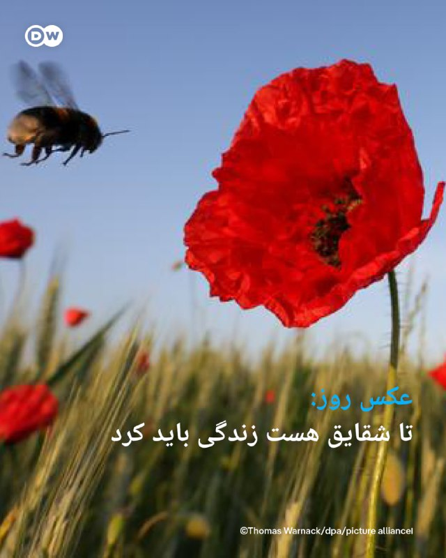

📸 عکس روز: تا شقایق هست زندگی باید کرد
 
طبیعت منتظر نمی‌ماند تا همه چیز درست شود. جهان ممکن است درگیر جنگ، آوارگی، فقر و گرسنگی باشد، اما طبیعت از حرکت بازنمی‌ایستد؛ شقایق‌ها در بهار می‌شکفند و زنبورها نیز از آنها کام می‌گیرند.
@dw_farsi

## DW_Farsi — post 125361

🔶 مهرداد محمدی‌نیا و اشکان مالی، دو معترض بازداشتی اعتراضات دی‌ماه، اعدام شدند

قوه قضائیه اعلام کرد مهرداد محمدی‌نیا و اشکان مالی، دو تن از بازداشت‌شدگان اعتراضات دی‌ماه ۱۴۰۴ به اتهام "آتش زدن مسجد جعفری و حوزه علمیه امام هادی، لیدری کودتا، تخریب اموال عمومی، درگیری با مأموران انتظامی و حافظان امنیت و انسداد خیابان‌ها" صبح دوشنبه ۱۱ خرداد اعدام شدند.

در این پرونده یک متهم دیگر به نام آرمان معرفتی نیز از سوی شعبه ۱۵ دادگاه انقلاب تهران به ریاست قاضی صلواتی به اعدام محکوم شده است که به گفته سازمان حقوق بشری هه‌نگاو اینک در زندان فشافویه بسر می‌برد.

در حال حاضر اطلاعات دقیقی درباره وضعیت نهایی پرونده و حکم صادرشده برای آرمان معرفتی در دست نیست.

به گزارش هه‌نگاو آرمان معرفتی ابتدا با اتهام "اجتماع و تبانی" مواجه بود، اما در جریان دادرسی، قاضی صلواتی اتهام او را به "مشارکت در اقدامات عملیاتی علیه امنیت کشور، ورود به اماکن مذهبی به قصد تخریب و مشارکت در آتش‌زدن مسجد و حوزه علمیه" تغییر داد و بر همین مبنا برای او حکم اعدام صادر کرد.

به گفته نهادهای حقوق بشری روند رسیدگی به این پرونده فاقد معیارهای دادرسی عادلانه بوده است و متهمان از داشتن وکیل انتخابی محروم بودند و پرونده و اتهامات نسبت داده شده به این سه زندانی مبتنی بر اعترافات اجباری بوده است.

فعالان حقوق بشر طی سال‌های گذشته بارها نسبت به پخش و استناد به اعترافات اجباری در پرونده‌های امنیتی در ایران ابراز نگرانی کرده و از احتمال اخذ اعتراف تحت فشار یا شکنجه سخن گفته‌اند.

با آغاز جنگ آمریکا و اسرائیل علیه ایران، اعدام‌های سیاسی به شدت افزایش یافته است. سازمان عفو بین‌الملل در آخرین گزارش خود اعلام کرده که از ۹ اسفند ۱۴۰۴ تا ۶ خرداد ۱۴۰۵ دست‌کم ۳۹ اعدام سیاسی اجرا شده است.
@dw_farsi

## DW_Farsi — post 125360

  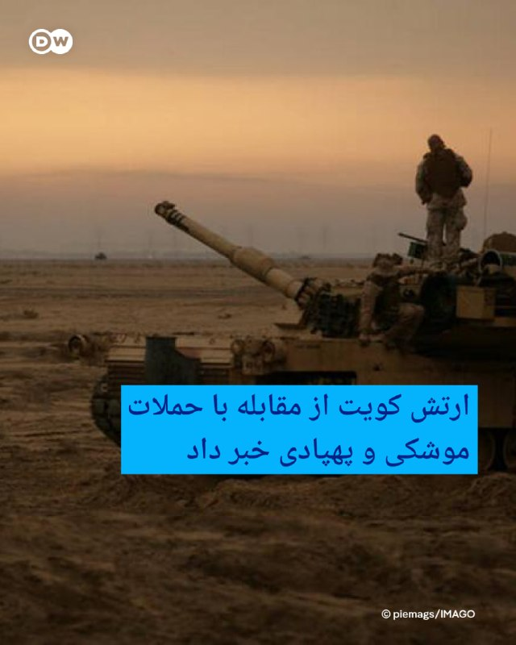

🔶 ارتش کویت از مقابله با حملات موشکی و پهپادی خبر داد
 
ارتش کویت صبح دوشنبه اول ژوئن (۱۱ خرداد) از وقوع "حملات موشکی و پهپادی خصمانه" به خاک این کشور خبر داد. ستاد کل ارتش کویت با انتشار پیامی در شبکه ایکس اعلام کرد که پدافند هوایی این کشور در حال حاضر در حال مقابله با این حملات است و "هرگونه صدای انفجار، ناشی از عملکرد سامانه‌های پدافند هوایی در رهگیری این حملات خصمانه است".
 
ارتش کویت از شهروندان خواسته است تا به دستور‌العمل‌های ایمنی و امنیتی صادرشده توسط مقامات توجه کنند.
 
در همین حال خبرگزاری دولتی کویت نیز گزارش داد آژیرهای هشدار حمله هوایی در سراسر این کشور به صدا درآمده‌‌اند.
 
برخی رسانه‌های داخلی ایران ویدئوهایی را با عنوان "شلیک موشک‌های سپاه از خوزستان به پایگاه نظامی آمریکا در کویت" منتشر کرده‌اند.
 
همزمان سپاه پاسداران با انتشار بیانیه‌ای اعلام کرده است که یک پایگاه هوایی را که آمریکا از آن برای حمله به یک "دکل مخابراتی در شهرستان سیریک استان هرمزگان" استفاده کرده بود، هدف قرار داده است.
 
@dw_farsi

## DW_Farsi — post 125359

🔶 جام ۲۰۰۶؛ فابیو کاناوارو، دیوار مستحکم لاجوردی‌پوشان ایتالیا

🔻 گزارشی از شهرام احدی
 
"فابیو کاناوارو" با ۱۷۶ سانتی‌متر قد، از آن قامت بلند و گاه تنومندی که بسیاری از مدافعان میانی برجسته جهان دارند، برخوردار نبود. او اما به یکی از بهترین مدافعان میانی عالم فوتبال بدل شد و افتخارات گوناگونی به همراه‌ باشگاه‌های خود و نیز تیم ملی فوتبال ایتالیا کسب کرد.
 
کاناوارو که زاده‌ شهر ناپل است، فعالیت حرفه‌ای خود را در باشگاه ناپولی آغاز کرد. او پنج سال در تیم جوانان این باشگاه بازی می‌کرد و در بین سال‌های ۱۹۹۲ تا ۱۹۹۵ نیز در خدمت تیم بزرگسالان این باشگاه در لیگ دسته اول ایتالیا، سری آ بود.
 
این مدافع پرتوان تا سال ۲۰۰۶ در سه باشگاه دیگر لیگ ایتالیا (پارما، اینترمیلان و یوونتوس تورین) توپ زد.
 
او سپس به باشگاه پرآوازه رئال مادرید پیوست و به همراه این تیم دو بار قهرمان لیگ اسپانیا شد.
 
کاناوارو سرانجام در سال ۲۰۱۱ در باشگاه "الاهلی" به فعالیت حرفه‌ای خود پایان داد.
 
اوج موفقیت‌های کاناوارو در سال ۲۰۰۶ بود. او در آن سال نه تنها به همراه لاجوردی‌پوشان ایتالیا به قهرمانی فوتبال جهان دست یافت، بلکه خود نیز به عنوان بهترین فوتبالیست اروپا و جهان برگزیده شد.
 
این نخستین بار بود که یک مدافع، عنوان بهترین بازیکن فوتبال جهان را از آن خود می‌کرد.
 
ایتالیایی‌ها در فینال جام جهانی ۲۰۰۶ آلمان در پیکار با تیم ملی فرانسه موفق شدند "زیدان" و یارانش را در ضربات پنالتی شکست دهند و برای چهارمین بار قهرمان جهان شوند.
@dw_farsi

## DW_Farsi — post 125358

  

🔶 سپاه پاسداران: یک پایگاه هوایی آمریکا هدف قرار گرفت
 
سپاه پاسداران دوشنبه ۱۱ خرداد (اول ژوئن) در اطلاعیه‌ای اعلام کرد که یک "پایگاه هوایی مبدأ تجاوز" را که به گفته سپاه، آمریکا از آن در حمله به یک "دکل مخابراتی در شهرستان سیریک استان هرمزگان" استفاده کرده بود، هدف قرار داده است.
 
به گزارش سپاه نیوز نیروهای هوافضای سپاه این پایگاه را "مورد هدف قرار دادند و اهداف پیش‌بینی شده منهدم گردید".
 
در اطلاعیه سپاه به کشوری که این پایگاه هوایی در آن مستقر بوده، اشاره‌ای نشده است، با این حال به گزارش خبرگزاری فرانسه همزمان کویت در همین روز از حملات موشکی و پهپادی به خاک خود خبر داد.
 
سپاه در بیانیه‌ خود هشدار داده است که "در صورت تکرار تجاوز، پاسخ کاملاً متفاوت خواهد بود" و مسئولیت بر عهده آمریکاست.
 
همزمان فرماندهی ایالات متحده آمریکا نیز اعلام کرد که "حملات دفاعی را در روزهای شنبه و یکشنبه علیه مراکز راداری و مراکز فرماندهی و کنترل پهپادهای ایران در شهر گروک و جزیره قشم" انجام داده است. در اطلاعیه سنتکام گفته شده که این حملات در واکنش به اقدامات تهاجمی ایران در زمان آتش‌بس صورت گرفت.
@dw_farsi

## DW_Farsi — post 125357

  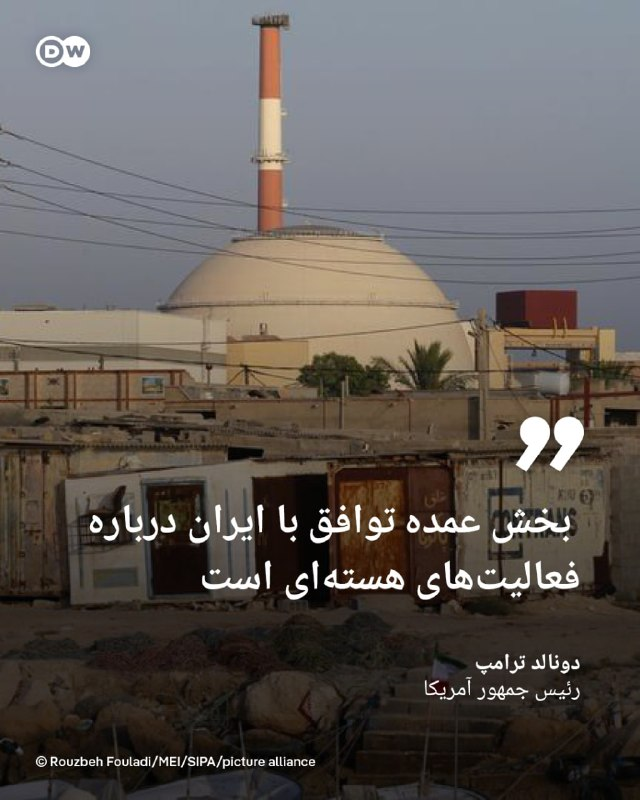

🔶 ترامپ: بخش عمده توافق با ایران درباره فعالیت‌های هسته‌ای است
 
دونالد ترامپ، رئیس جمهور آمریکا، تأکید کرد بخش عمده‌ای از توافق مدنظر این کشور با ایران، درباره فعالیت‌ هسته‌ای جمهوری اسلامی است.
 
او روز دوشنبه اول ژوئن با انتشار پستی در شبکه اجتماعی متعلق به خودش، تروث سوشال، با رد گزارش شبکه خبری "سی‌ان‌ان"‌ درباره جزئیات توافق احتمالی آمریکا با ایران نوشت: «در این توافق به‌روشنی و کاملاً صریح آمده است که ایران نباید به سلاح هسته‌ای دست پیدا کند. سپس در ادامه، با جزئیات فراوان و بسیار قاطع، به جنبه‌های مختلف دیگر موضوع هسته‌ای پرداخته می‌شود. در واقع بخش عمده این توافق دقیقا درباره همین موضوع است.»
 
این گفته ترامپ در حالی است که پیش‌تر شبکه خبری "سی‌بی‌اس" گزارش داده بود که رئیس جمهور آمریکا اصلاحاتی را در متن تفاهم‌نامه میان تهران و واشنگتن اعمال کرده و نسخه جدید از طریق میانجی‌ها برای تأیید به تهران ارسال شده است.
 
در این گزارش گفته شده بود که این سومین باری است که ترامپ در پیشنهاد آمریکا تغییر وارد کرده است.
@dw_farsi

## DW_Farsi — post 125356

  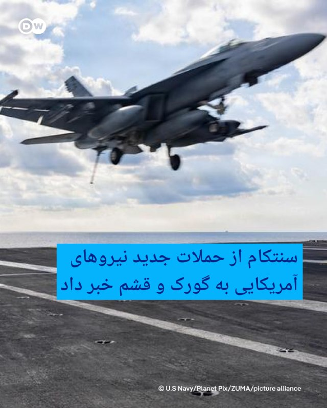

🔶 سنتکام از حملات جدید نیروهای آمریکایی به گورک و قشم خبر داد
 
فرماندهی مرکزی ایالات متحده آمریکا، سنتکام، دوشنبه اول ژوئن (۱۱ خرداد) با انتشار بیانیه‌ای در شبکه ایکس اعلام کرد، ارتش آمریکا در دو روز گذشته "حملاتی را در دفاع از خود" علیه سایت‌های راداری و مراکز فرماندهی و کنترل پهپاد ایران در منطقه روستایی گورک و جزیره قشم انجام داده است.
 
در بیانیه گفته شده این "حملات سنجیده و حساب‌شده در روزهای شنبه و یکشنبه (۳۰ و ۳۱ مه) در پاسخ به اقدامات تهاجمی ایران از جمله سرنگون کردن یک پهپاد MQ-1 صورت گرفت که بر فراز آب‌های بین‌المللی در حال مأموریت بود".
 
سنتکام افزود: «جنگنده‌های آمریکایی به سرعت واکنش نشان دادند و سامانه‌های پدافند هوایی ایران، یک ایستگاه کنترل زمینی و دو پهپاد تهاجمی انتحاری را که تهدیدی آشکار برای کشتی‌های در حال عبور از منطقه محسوب می‌شدند، منهدم کردند.»
 
در بیانیه سنتکام گفته شده است که هیچ‌یک از نیروهای نظامی آمریکا در این عملیات آسیب ندیدند.
 
سنتکام تأکید کرده است که "در برابر اقدامات خصمانه و غیرموجه ایران به حفاظت از تجهیزات، نیروها و منافع ایالات متحده ادامه خواهد داد".
@dw_farsi

## Persian_Trend_Official — post 15428

  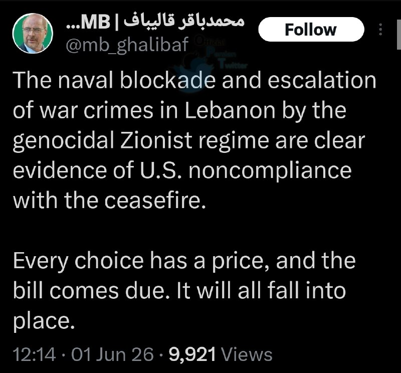

محمد باقر قالیباف، رئیس مجلس شورای اسلامی: محاصره دریایی و تشدید جنایات جنگی در لبنان، گواه عدم پایبندی واشنگتن به آتش بس است و هر گزینه ای بهایی دارد که پرداخت خواهد شد.

📝 Amir

📌 @persian_trend_official
پرشین ترند | متفاوت‌ترین کانال نظامی

## Persian_Trend_Official — post 15427

  <a href="telegram/content/Persian_Trend_Official_15427_1780307114.mp4" target="_blank">🎬 Download video</a>

گشت زنی پهپاد شناسایی رزمی کمان-12 نیروی هوایی ارتش برفراز کردستان عراق!

احتمال دارد که نیروی هوایی قصد داشته باشد حملاتی را علیه گروه های تروریستی و تجزیه طلب انجام دهند.

📝 Amir

📌 @persian_trend_official
پرشین ترند | متفاوت‌ترین کانال نظامی

## Persian_Trend_Official — post 15426

  <a href="telegram/content/Persian_Trend_Official_15426_1780307115.mp4" target="_blank">🎬 Download video</a>

ویدیویی از تخلیه ضاحیه بیروت توسط شهروندان لبنانی

📝 Amir

📌 @persian_trend_official
پرشین ترند | متفاوت‌ترین کانال نظامی

## Persian_Trend_Official — post 15425

  

نخست وزیر اسرائیل اعلام کرد که به ارتش اسرائیل دستور داده است تا به اهداف حزب الله در منطقه ضاحیه بیروت حمله کند!

📝 Amir

📌 @persian_trend_official
پرشین ترند | متفاوت‌ترین کانال نظامی

## Persian_Trend_Official — post 15424

  

سپاه پاسداران در حمله امروز صبح خود به پایگاه هوایی امریکا در کویت از یک فروند موشک بالستیک سوخت جامد ذوالفقار/دزفول استفاده کرده است.

موشک بالستیک سوخت جامد دزفول با برد 1000 کیلومتر بخاطر بهرگیری از یک کلاهک جداشونده، ماکسیسم سرعت 9 ماخ و مانور های که برای اصلاح مسیر انجام می‌دهد یکی از محلک ترین موشک های ساخت ایران برای هدف قرار دادن پایگاه های امریکا در سطح منطقه محسوب میشود، موشک سوخت جامد ذوالفقار نیز نمونه اولیه دزفول محسوب می‌شود که بردی 700 کیلومتری دارد.

ولی نکته جالبتر ماجرا این است که امریکا به طور رسمی سرنگونی MQ-1 خود را گردن گرفت! پهپاد MQ-1 سال هاست که از ارتش امریکا بازنشسته شده، شاید دلیل مجدد عملیاتی شدن این پهپاد در سازمان رزم نیروی هوایی امریکا جایگزینی سریع آن با ناوگان MQ-9 های منهدم شده در جنگ اخیر باشد.

📝 Amir

📌 @persian_trend_official
پرشین ترند | متفاوت‌ترین کانال نظامی

## Persian_Trend_Official — post 15423

  <a href="telegram/content/Persian_Trend_Official_15423_1780307119.mp4" target="_blank">🎬 Download video</a>

سپاه پاسداران نیز در پاسخ به حمله بامداد امریکا، باری دیگر به کویت حمله موشکی کرد.

اطلاعیه روابط عمومی سپاه: به‌دنبال تجاوز ساعتی پیش ارتش متجاوز امریکا به یک دکل مخابراتی در سیریک واقع در استان هرمزگان، رزمندگان نیروی هوافضای سپاه، پایگاه هوایی مبدأ تجاوز را مورد هدف قرار دادند و اهداف پیش‌بینی‌شده منهدم گردید.

نیروی هوافضای سپاه اخطار داد در صورت تکرار تجاوز، پاسخ کاملاً متفاوت خواهد بود و مسئولیت آن به‌عهده رژیم متجاوز و کودک‌کش امریکا است.

📝 Amir

📌 @persian_trend_official
پرشین ترند | متفاوت‌ترین کانال نظامی

## Persian_Trend_Official — post 15422

  <a href="telegram/content/Persian_Trend_Official_15422_1780307121.webm" target="_blank">🎬 Download video</a>

فرماندهی مرکزی ایالات متحده (CENTCOM) دیشب حملات دفاع از خود را علیه سایت‌های راداری ایران و مراکز فرماندهی و کنترل پهپادها در گورکِ ایران و جزیره قشم انجام داد.

این حملات سنجیده و برنامه‌ریزی‌شده در روزهای شنبه و یکشنبه، در پاسخ به اقدامات تهاجمی ایران صورت گرفت؛ اقداماتی که شامل سرنگونی یک پهپاد آمریکایی ام‌کیو-1 بود که بر فراز آب‌های بین‌المللی در حال فعالیت بود. هواپیماهای جنگنده آمریکا به سرعت واکنش نشان دادند و سامانه‌های پدافند هوایی ایران، یک ایستگاه کنترل زمینی و دو پهپاد انتحاری را که تهدیدی آشکار برای کشتی‌های عبوری در آب‌های منطقه محسوب می‌شدند، منهدم کردند.

هیچ‌یک از نیروهای نظامی آمریکایی آسیب ندیدند. سنتکام اعلام کرد که در طول آتش‌بس جاری، در پاسخ به آنچه تجاوزات غیرموجه ایران خوانده است، به حفاظت از دارایی‌ها و منافع ایالات متحده ادامه خواهد داد.

📝 Amir

📌 @persian_trend_official
پرشین ترند | متفاوت‌ترین کانال نظامی

## Persian_Trend_Official — post 15421

  

https://castbox.fm/vi/951612861

نسخه صوتی لایو در کست باکس

## Persian_Trend_Official — post 15420

  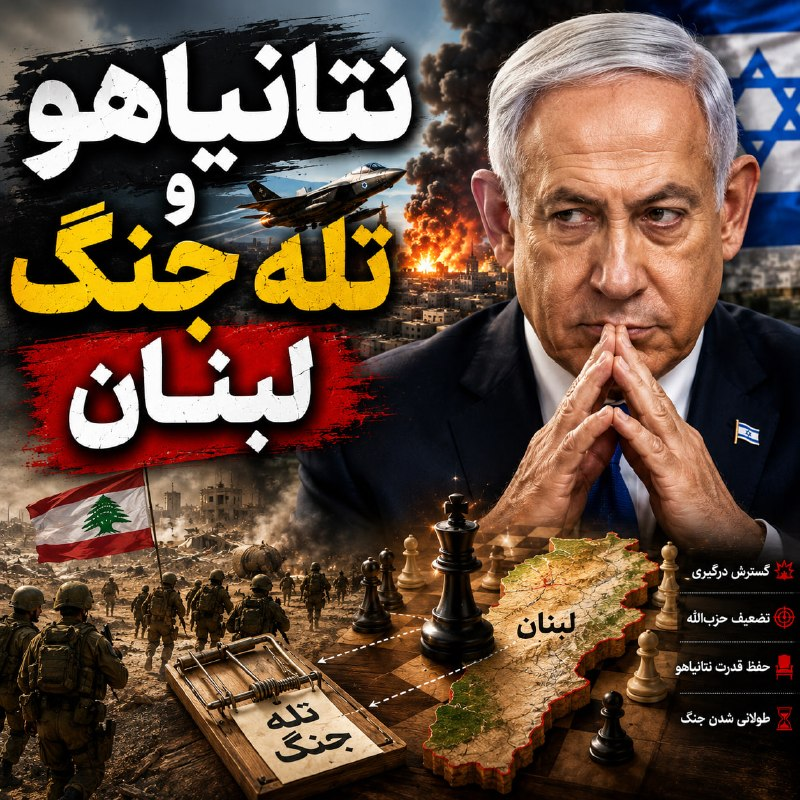

https://open.spotify.com/episode/0CF20BnA3gtwwgJR9EIr5S?si=3mfbbnZZT1GX37e_rQmdwA

نسخه صوتی لایو در اسپاتیفای

## RadioFarda — post 157764

  

🔸اسماعیل بقائی، سخنگوی وزارت خارجه ایران می‌گوید اقدام جمهوری اسلامی در هدف قرار دادن مبادی و امکاناتی که برای اقدامات نظامی علیه کشور مورد استفاده قرار می‌گیرد، «قانونی» و در چارچوب «حق دفاع مشروع» است.

🔸بقائی این اظهارات را پس از آنکه سپاه اعلام کرد یک پایگاه هوایی مورد استفاده آمریکا برای حمله به جنوب ایران را هدف قرار داده است، بیان کرد.

🔸با آنکه سپاه نام این پایگاه را مشخص نکرده، اما ارتش کویت روز دوشنبه اعلام کرد پدافند هوایی این کشور «حملات خصمانه موشکی و پهپادی» را رهگیری کرده است. آمریکا در کویت دارای پایگاه نظامی است.

🔸این حمله اندکی پس از آن انجام شد که سنتکام، فرماندهی مرکزی آمریکا، اعلام کرد طی دو روز اخیر در پاسخ به «اقدامات تهاجمی ایران، از جمله سرنگونی یک پهپاد ام‌کیو-۱ آمریکا که بر فراز آب‌های بین‌المللی فعالیت می‌کرد»، به مواضع نظامی ایران در سواحل خلیج فارس حمله کرده است.

🔸بقائی نیز بدون اشاره به پایگاهی که سپاه مدعی است به آنجا حمله کرده، افزود: «دولت‌ها تعهد قانونی دارند که مانع از استفاده طرف‌های متجاوز از قلمرو و امکانات آنها برای تعرض به یک کشور دیگر شوند.»

@RadioFarda

## RadioFarda — post 157763

«موج تازه» تشکیل پرونده‌های انضباطی و صدور احکام سنگین برای دانشجویان در ایران

🔸روزنامه شرق در گزارشی از «موج تازه» تشکیل پرونده‌های انضباطی و صدور احکام سنگین برای دانشجویان در چند دانشگاه ایران خبر داده است؛ موجی که به نوشته این روزنامه، از اسفند ۱۴۰۴ و تنها چند روز پس از بازگشایی دانشگاه‌ها آغاز شد و اکنون در خرداد ۱۴۰۵، همزمان با ادامه تعطیلی دانشگاه‌ها به‌دلیل جنگ، دوباره شدت گرفته است.

🔸همزمان، کانال تلگرامی «خبرنامه امیرکبیر» روز دوشنبه ۱۱ خرداد خبر داد که ۵۳ تشکل، نشریه و نهاد دانشجویی دانشگاه صنعتی شریف، در نامه‌ای مشترک به رئیس این دانشگاه، به احکام اخیر کمیته‌های انضباطی اعتراض کردند و خواستار لغو فوری احکام صادرشده و توقف روند جاری رسیدگی‌ها شدند.

🔸امضاکنندگان این نامه گفته‌اند در هفته‌های اخیر شماری از دانشجویان، از جمله به‌دلیل فعالیت در فضای مجازی، به کمیته‌های انضباطی احضار شده و برای برخی از آنان احکام بدوی و تجدیدنظر صادر شده است. آن‌ها روند رسیدگی را همراه با نقض ضوابط شکلی و اصول مندرج در شیوه‌نامه انضباطی دانسته‌اند.

🔸این نامه پس از آن منتشر می‌شود که شورای صنفی دانشجویان شریف پیشتر از احضار دست‌کم ۳۰ دانشجو و صدور حداقل شش حکم اخراج خبر داده بود؛ پرونده‌هایی که بنا بر گزارش‌ها، بخشی از آن‌ها به محتوای صفحات شخصی، پیام در گروه‌های خصوصی و بازنشر مطالب در شبکه‌های اجتماعی مربوط است.

🔸بر اساس گزارش روزنامه شرق، در دانشگاه صنعتی شریف پنج تا هفت دانشجو حکم اخراج گرفته‌اند و بیش از ۲۰ دانشجو نیز با احکام تعلیق یک تا سه ترم از تحصیل روبه‌رو شده‌اند. دانشجویان این دانشگاه گفته‌اند احضارها گاه بدون ارائه توضیح درباره اتهام انجام شده و در برخی موارد، جلسه تفهیم اتهام و صدور رأی در یک روز برگزار شده است.

🔸به نوشته شرق، بخشی از اتهامات در دانشگاه شریف به فعالیت دانشجویان در فضای مجازی مربوط است. یک دانشجو گفته است سه نفر تنها به‌دلیل فعالیت در تلگرام و شبکه ایکس حکم اخراج گرفته‌اند و در یک مورد، مصداق حکم، عکس پروفایل دانشجو بوده است. دانشجویان همچنین می‌گویند در جلسات کمیته انضباطی، به‌جای ارائه سند روشن، به گزارش افراد موسوم به «مطلع» استناد شده است.

🔸نسخه کامل این گزارش را در وب‌سایت رادیوفردا بخوانید.

@RadioFarda

## RadioFarda — post 157762

  

🔸دونالد ترامپ در پستی تازه در تروث‌سوشال از واکنش‌های چهره‌های سیاسی به نحوه برخورد دولت او با حکومت ایران برای دستیابی به توافق انتقاد کرد و نوشت که این فشارها کار را برای او «سخت‌تر» می‌کند.

🔸او در این پست در شبکه اجتماعی خود تأکید کرد که «ایران واقعاً می‌خواهد به توافق برسد، و این توافق برای آمریکا و کسانی که با ما هستند، توافق خوبی خواهد بود.»

🔸ترامپ با بازی با واژهای «دمو» و «دام» به معنی احمق، به طعنه دموکرات را «داموکرات‌ها» [نادان‌ها] نامید و به آنها و «برخی جمهوری‌خواهانِ ظاهراً غیرمیهن‌پرست» نوشت که آنها «نمی‌فهمند که وقتی آدم‌های سیاسیِ فرصت‌طلب مدام و به شکلی بی‌سابقه منفی‌بافی می‌کنند و پشت سر هم می‌گویند که باید سریع‌تر عمل کنم، یا کندتر پیش بروم، یا وارد جنگ شوم، یا نشوم، یا هر چیز دیگری، انجام درست وظیفه و مذاکره برای من خیلی سخت‌تر می‌شود؟»

🔸رئیس‌جمهور آمریکا خطاب به منتقدان خود در ارتباط با توافق با جمهوری اسلامی، نوشت: «فقط آرام باشید و استراحت کنید؛ در نهایت همه‌چیز خوب پیش خواهد رفت — همیشه همین‌طور بوده است!»

@RadioFarda

## RadioFarda — post 157761

  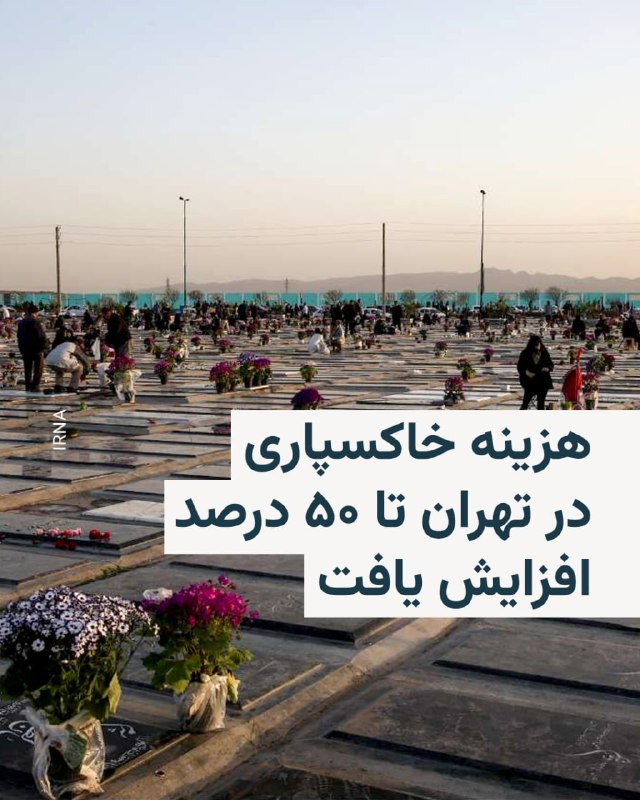

🔸روزنامه دنیای اقتصاد در گزارشی نوشته که نرخ بهای خدمات مرتبط با کفن و دفن در «بهشت ‌زهرا» در تهران، به‌طور میانگین حدود ۴۰ درصد و در برخی موارد حتی تا ۵۰ درصد افزایش یافته است.

🔸در این گزارش آمده که بر اساس مصوبه جدید شورای شهر تهران، تعرفه خدمات مختلف از جمله هزینه انتقال هر متوفی از سطح شهر تهران تا شعاع ۱۰ کیلومتری به ۹ میلیون و ۷۵۰ هزار ریال رسیده و افزایشی ۵۰ درصدی داشته است.

🔸این گزارش می‌افزاید که هزینه‌های مربوط به تغسیل، تکفین، نگهداری در سردخانه، نصب سنگ مزار، قاب بتنی و آماده‌سازی متوفی برای انتقال نیز با افزایش محسوسی همراه شده است.

🔸این افزایش تعرفه‌ها در شرایطی اعمال می‌شود که فشارهای اقتصادی بر شهروندان ایران بعد از حملات آمریکا و اسرائیل و نیز محاصره بنادر ایران، به شدت افزایش یافته است.

🔸گزارش‌های شهروندی و حتی اقتصاددانان حاکی از شرایط بحرانی اقتصاد ایران است و حتی نهادهای رسمی و امنیتی همچون وزارت اطلاعات جمهوری اسلامی نیز نسبت به احتمال وقوع اعتراضات خیابانی ناشی از فشارهای اقتصادی هشدار داده‌اند.

@RadioFarda

## RadioFarda — post 157760

🔸وب‌سایت آکسیوس به نقل از منابع خود گزارش داده که تلاش جدید آمریکا برای آتش‌بس میان اسرائیل و لبنان «شکست» خورده است.

🔸منابع اکسیوس به این رسانه گفته‌اند که اسرائیل به دنبال چراغ سبز آمریکا برای انجام حملات گسترده به اهداف حزب‌الله در بیروت است و همزمان عملیات زمینی خود در لبنان را گسترش داده است.

🔸به گفته یک مقام آمریکایی در گفتگو با آکسیوس، «ایالات متحده انتظار ندارد که اسرائیل حملات مداوم علیه غیرنظامیانش از سوی یک سازمان تروریستی [حزب‌الله لبنان] را تحمل کند.»

🔸حزب‌الله که هم یک گروه شبه‌نظامی و هم یک حزب سیاسی است، بخش بزرگی از جنوب لبنان را کنترل می‌کند. ایالات متحده آن را یک سازمان تروریستی می‌داند، اما اتحادیهٔ اروپا فقط شاخهٔ نظامی آن را در فهرست سیاه قرار داده است.

🔸خبرگزاری فرانسه نیز به نقل از یک مقام آمریکایی نوشته که حزب‌الله باید نخستین طرفی باشد که حملات خود را در جریان درگیری با اسرائیل متوقف می‌کند.

🔸این خبر پس از دیدار و مذاکره مارکو روبیو، وزیر خارجه آمریکا، در روز یکشنبه با جوزف عون، رئیس‌جمهور لبنان، و بنیامین نتانیاهو، نخست‌وزیر اسرائیل، منتشر می‌شود.

@RadioFarda

## RadioFarda — post 157759

  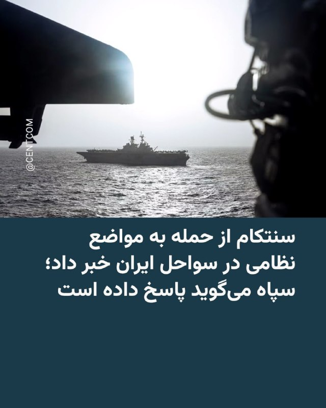

🔸ایالات متحده اعلام کرد طی دو روز اخیر به مواضع نظامی ایران حمله کرده و سپاه پاسداران نیز روز دوشنبه ۱۱ خرداد گفت «در پاسخ»، یکی از پایگاه‌های مورد استفاده آمریکا را هدف قرار داده است.

🔸سنتکام، فرماندهی مرکزی آمریکا، در پیامی در شبکه اجتماعی ایکس اعلام کرد حملات به سواحل ایران در خلیج فارس در پاسخ به «اقدامات تهاجمی ایران، از جمله سرنگونی یک پهپاد ام‌کیو-۱ آمریکا که بر فراز آب‌های بین‌المللی فعالیت می‌کرد» انجام شد.

🔸سنتکام افزود: «جنگنده‌های آمریکایی به‌سرعت واکنش نشان دادند و پدافند هوایی ایران، یک ایستگاه کنترل زمینی و دو پهپاد تهاجمی یک‌طرفه را که تهدیدی آشکار برای کشتی‌های عبوری از آب‌های منطقه بودند، از میان بردند.»

🔸این فرماندهی محل این حملات را منطقه گُروک در سیریک هرمزگان و جزیره قشم اعلام کرده و همچنین افزوده است که به حفاظت از دارایی‌ها و منافع آمریکا در جریان آتش‌بس جاری ادامه خواهد داد.

🔸سپاه پاسداران انقلاب اسلامی روز دوشنبه اعلام کرد یک پایگاه هوایی مورد استفاده آمریکا برای حمله به جنوب ایران را هدف قرار داده است، اما نام این پایگاه را مشخص نکرد.

@RadioFarda

## RadioFarda — post 157758

  

🔸دونالد ترامپ، رئیس‌جمهور آمریکا، می‌گوید بخش عمده توافق هسته‌ای مدنظر واشینگتن با تهران، درباره فعالیت‌های هسته‌ای جمهوری اسلامی است.

🔸او در پستی که در شبکه اجتماعی خود تروث‌سوشال منتشر کرده، گزارش شبکه خبری سی‌ان‌ان مبنی بر اینکه توافق احتمالی ترامپ با ایران، شامل پرونده هسته‌ای این کشور نمی‌شود را رد کرد.

🔸ترامپ نوشت که این توافق «خیلی روشن بیان می‌کند که ایران به سلاح هسته‌ای دست نخواهد یافت. سپس با جزئیات فراوان و بسیار قاطع، به جنبه‌های مختلف دیگر موضوع هسته‌ای می‌پردازد. در حقیقت، بیشتر این توافق دقیقاً درباره همین موضوع است.»

🔸به جز سی‌ان‌ان، شماری از خبرگزاری‌های نزدیک به سپاه پاسداران، از جمله تسنیم و فارس، به‌طور مکرر به نقل از منابع آگاه می‌نویسند که این توافق پیشنهادی آمریکا، دست‌کم در مرحله اول شامل فعالیت هسته‌ای جمهوری اسلامی نیست.

@RadioFarda

## RadioFarda — post 157757

  

🔸ارتش کویت روز دوشنبه ۱۱ خرداد اعلام کرد پدافند هوایی این کشور «حملات خصمانه موشکی و پهپادی» را رهگیری کرده است.

🔸ستاد کل ارتش کویت در پیامی در حساب رسمی خود در شبکه اجتماعی ایکس نوشت: «هرگونه صدای انفجار شنیده‌شده، ناشی از رهگیری این حملات خصمانه توسط سامانه‌های پدافند هوایی است.»

🔸خبرگزاری دولتی کویت، کونا، نیز گزارش داد که آژیرهای هشدار در سراسر این کشور به صدا درآمده است.

🔸کویت میزبان یکی از پایگاه‌های مهم نظامی آمریکا در منطقه است. جزئیات بیشتری درباره منشأ حملات، محل اصابت احتمالی یا خسارات ناشی از آن‌ها منتشر نشده است.

🔸این رخداد در حالی گزارش شده که آتش‌بس میان آمریکا و ایران برقرار است، اما دو طرف از زمان آغاز این آتش‌بس در اوایل آوریل، به‌طور پراکنده دست به تبادل حملات زده‌اند.

@RadioFarda

## RadioFarda — post 157756

  

🔸قوه قضائیه ایران اعلام کرد که دو نفر دیگر از معترضان دی‌ماه ۱۴۰۴ را به اتهام «آتش‌زدن مسجد»، «لیدری کودتا»، «تخریب اموال عمومی» و «مسدودسازی خیابان‌ها» اعدام کرده است.

🔸نام این دو معترض که بامداد دوشنبه یازدهم خرداد اعدام شدند، مهرداد محمدی‌نیا و اشکان مالکی اعلام شده است.

🔸ارگان رسمی دستگاه قضایی ایران، میزان، نوشته این دو «از عوامل اصلی آتش‌زدن مسجد جعفری در محله کوی نصر تهران [بودند] که اقدام به تخریب و آتش‌زدن مسجد، تخریب اموال عمومی، درگیری با مأموران حافظان امنیت، انسداد خیابان‌ها و ممانعت از عبور و مرور مردم کرده بودند.»

🔸دستگاه قضایی جمهوری اسلامی در ماه‌های اخیر به شکل تقریباً روزانه اقدام به اجرای احکام اعدام معترضان و یا افرادی می‌کند که آن‌ها را به همکاری با آمریکا و اسرائیل متهم می‌کند. برخی نهادهای حقوق‌بشری می‌گویند جمهوری اسلامی از اعدام برای ایجاد فضای ترس و به‌عنوان عامل سرکوب استفاده می‌کند.

@RadioFarda

## RadioFarda — post 157755

  <a href="telegram/content/RadioFarda_157755_1780307129.mp4" target="_blank">🎬 Download video</a>

🔸سپاه پاسداران روز دوشنبه ۱۱ خرداد از هدف قرار دادن یک پایگاه هوایی ارتش آمریکا به دلیل آنچه «تجاوز به یک دکل مخابراتی در جزیره سیریک» خوانده،‌ خبر داد.

🔸همزمان حساب کاربری وحید آنلاین ساعت ۶:۳۰ صبح دوشنبه به وقت ایران ویدئویی از 'شلیک یک موشک از امیدیه در خوزستان را منتشر کرد.

🔸در اطلاعیه سپاه آمده: «به دنبال تجاوز ساعتی پیش ارتش متجاوز آمریکا به یک دکل مخابراتی در جزیره سیریک واقع در استان هرمزگان، رزمندگان نیروی هوافضای سپاه پایگاه هوایی مبدأ تجاوز را مورد هدف قرار دادند و اهداف پیش‌بینی شده منهدم گردید.»

🔸نیروی هوافضای سپاه همچنین هشدار داده است که در صورت تکرار حملات، پاسخ «کاملا متفاوت» خواهد بود و مسئولیت آن به عهده «رژیم متجاوز و کودک‌کش آمریکا» است.

🔸از سوی دیگر ارتش کویت صبح دوشنبه اعلام کرد که پدافند هوایی این کشور در حال مقابله با حملات موشکی و پهپادی «خصمانه» است.

🔸ستاد کل ارتش کویت در بیانیه‌ای که در شبکه اجتماعی ایکس منتشر شده اعلام کرد که اگر صداهای انفجاری شنیده شود، «ناشی از رهگیری حملات خصمانه توسط سیستم‌های پدافند هوایی است.»

@RadioFarda

## IranianMinds — post 21181

  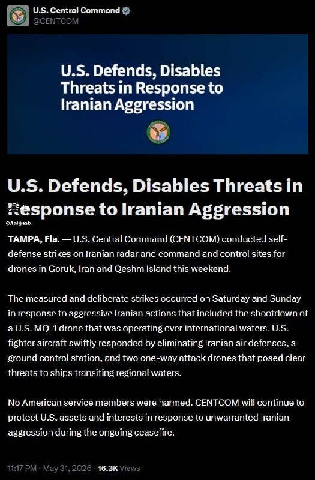

بیانیه سنتکام درباره حملات شنبه و یکشنبه
(از جمله حمله ساعاتی پیش به سیریک هرمزگان که گویا ساعت ۴ صبح دوشنبه به وقت ایران انجام شده. در آمریکا هنوز یکشنبه اس

ادعای سنتکام:
"آمریکا در واکنش به حمله ایران، از خود دفاع کرد و تهدیدها را از کار انداخت

تامپا، فلوریدا — فرماندهی مرکزی ایالات متحده آمریکا، سنتکام، این آخر هفته حملات دفاعی علیه سایت‌های راداری ایران و مراکز فرماندهی و کنترل پهپادها در گروک ایران و جزیره قشم انجام داد.

این حملات حساب‌شده و عامدانه، روزهای شنبه و یکشنبه و در پاسخ به اقدامات تهاجمی ایران انجام شد؛ اقداماتی که شامل سرنگونی یک پهپاد MQ-1 آمریکا بود که بر فراز آب‌های بین‌المللی فعالیت می‌کرد. جنگنده‌های آمریکایی به‌سرعت واکنش نشان دادند و پدافند هوایی ایران، یک ایستگاه کنترل زمینی، و دو پهپاد تهاجمی یک‌طرفه را که تهدیدی آشکار برای کشتی‌های در حال عبور از آب‌های منطقه‌ای محسوب می‌شدند، منهدم کردند.

هیچ‌یک از نیروهای نظامی آمریکا آسیب ندیدند. سنتکام در جریان آتش‌بس جاری، در واکنش به تجاوز بی‌دلیل ایران، به حفاظت از دارایی‌ها و منافع ایالات متحده ادامه خواهد داد."

@IranianMinds

## IranianMinds — post 21180

🔴 ترافیک شدید در ضاحیه بیروت مردم در حال تخلیه این منطقه هستند @IranianMinds

## IranianMinds — post 21179

  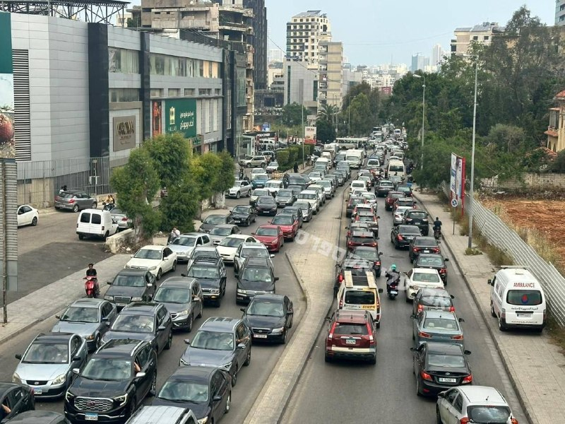

🔴 ترافیک شدید در ضاحیه بیروت
مردم در حال تخلیه این منطقه هستند

@IranianMinds

## IranianMinds — post 21178

🔴 گالانت : نتانیاهو اعلام کرده خاورمیانه دیگر جای حزب الله نیست و تا نابودی کامل جلو خواهیم رفت

@IranianMinds

## IranianMinds — post 21177

🔴 بقایی: ما هر وقت لازم باشد که در رابطه با موضوعات هسته‌ای کاری انجام دهیم، به خوبی می‌دانیم چگونه عمل کنیم

در مورد جزئیات مباحث مرتبط با موضوع هسته‌ای، هیچ مذاکره‌ای در این مرحله صورت نگرفته است. بار دیگر تأکید می‌کنم که تمرکز ما در این مرحله بر خاتمه جنگ است.

@IranianMinds

## IranianMinds — post 21176

چرا این روزها همه سایت جهانی MelBet رو انتخاب میکنن 
⁉️

🎁 شارژ هدیه 130 دلاری اولین واریز

🎁 شارژ هدیه 100 دلاری در روز های یکشنبه و چهارشنبه

🎁 و ده ها بانس ارزنده دیگر...

🥇 متنوع ترین آپشن های ورزشی

🖥 پخش زنده مسابقات

🎮 بیش از 80 نوع ورزش مجازی با پخش زنده

⭐ کاملترین کازینو آنلاین

🛡 امنیت فوق العاده بالا

💵 واریز آنی جوایز با بیش از 30 روش شارژ و برداشت، از جمله کارت بکارت

🌐 اسپانسر رسمی لالیگای اسپانیا

😀 مورد تایید سازمان Gambling Judge

✅ معرفی سایت و اپلیکیشن مل‌بت

💯 ورود به سایت مل‌بت (فیلترشکن خاموش)

## IranianMinds — post 21174

🔴 نتانیاهو: ما دستور بمباران ضاحیه بیروت را صادر کردیم

@IranianMinds

## IranianMinds — post 21173

گزارشاتی از انفجار در بندرعباس

## IranianMinds — post 21172

  <a href="telegram/content/IranianMinds_21172_1780307132.mp4" target="_blank">🎬 Download video</a>

🔴 این روزا خود عرزشیام ضد جمهوری اسلامی شدن!

میخوان عید غدیر جشن پیروزی بگیرن، آخه چه جشنی؟ ما حتی هنوز رهبرمون هم دفن نکردیم.

تا کی میخواین مارو گول بزنین، مگه رهبر شهیدمون نمی گفت با آمریکا مذاکره نکنین؟ دیگه حالم ازتون بهم میخوره.

@IranianMinds

## IranianMinds — post 21171

  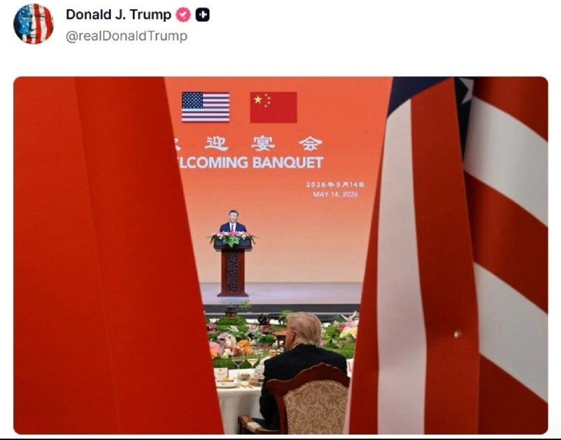

🔴 ترامپ کراش زده رو رئیس جمهور چین

ترامپ این عکس از خودش و رئیس‌جمهور چین رو منتشر کرده.

@IranianMinds

## IranianMinds — post 21170

🔴 سپاه:
به پایگاه مبدأ حملات، حمله کردیم.

+ نقض آتش بس چی هست اصن؟

@IranianMinds

## IranianMinds — post 21169

🔴 سنتکام:

در پایان این هفته، در عملیاتی کاملاً دفاعی، به چندین مواضع جمهوری‌اسلامی تو قشم حمله کردیم.

@IranianMinds

## IranianMinds — post 21168

  

🔴 صفحه یوتیوب امیر تتلو اعلام کرده تتلو بیش از 20 روزه داره تمرینای سخت و فشرده انجام تا به تیم ملی فوتبال دعوت بشه و روی عملکرد تیم ملی تاثیر مثبت داشته باشه هم چنین از مسولین خواسته تتلو رو آزاد کنن و به جام جهانی ببرنش.

@IranianMinds

## BBCPersian — post 282548

🔻مراسم سالگرد خمینی امسال بدون مهمان خارجی و بدون سخنرانی نوه او برگزار می‌شود

مسئولان برگزاری مراسم سالگرد درگذشت روح‌الله خمینی، می‌گویند در مراسم امسال مهمان خارجی حضور نخواهد داشت و حسن خمینی، نوه بنیان‌گذار جمهوری اسلامی، هم سخنرانی نخواهد کرد.

این مراسم هر سال در ۱۴ خرداد در آرامگاه آیت‌الله خمینی با حضور مقام‌های ارشد سیاسی و نظامی ایران و برخی از سفرای خارجی برگزار می‌شد و طی آن علی خامنه‌ای و حسن خمینی سخنرانی می‌کردند.

محمدعلی انصاری، از برگزارکنندگان این مراسم، گفت که در مراسم امسال پیامی از مجتبی خامنه‌ای قرائت خواهد شد.

او همچنین گفت که امسال «امکان حضور گسترده زائران مانند سال‌های گذشته فراهم نیست» ولی «کاروان‌های استانی... عمدتا از استان‌های همجوار و با برنامه‌ریزی مشخص اعزام خواهند شد.»

@BBCPersian

## BBCPersian — post 282547

🔻هیئت رئیسه: جلسات رسمی مجلس «به‌زودی» برگزار می‌شود

علیرضاسلیمی، عضو هیئت رئیسه مجلس گفت: «فرآیند هماهنگی‌ها و مقدمات لازم طبق نظر شورای عالی امنیت ملی برای برگزاری جلسات علنی مجلس آغاز شده تا جلسات به زودی برگزار شود.»

عباس گودرزی، سخنگوی هیئت رئیسه مجلس، هم امروز گفته بود که «هیئت رئیسه مجلس مخالفتی با برگزاری جلسات ندارد اما این امر مستلزم تایید مراجع امنیتی است.»

آخرین جلسه علنی مجلس شورای اسلامی در محل دائمی، بهمن سال گذشته بود. پس از حمله آمریکا و اسرائیل به ایران در نهم اسفند، جلسات مجلس دیگر در محلش تشکیل نشده است.

به گفته آقای گودرزی در این مدت «چهار جلسه مجازی صحن» و «نزدیک به ۱۵۰ جلسه کمیسیون‌ها» برگزار شده است.

مطابق قوانین ایران جلسات مجلس فقط باید در محل دائمی آن برگزار شود.

@BBCPersian

## BBCPersian — post 282546

  

🔻بقایی: تبادل پیام با آمریکا با سوءظن و بدگمانی ادامه دارد

سخنگوی وزارت خارجه جمهوری اسلامی می‌گوید که مذاکره ایران با آمریکا «در دل سوءظن و بدگمانی شدید» شروع شد و اکنون هم تبادل پیام در همین فضا ادامه دارد.

اسماعیل بقایی در کنفرانس خبری تاکید کرد که «مذاکره یا دیپلماسی خود نشانه یا محصول اعتماد بین طرف‌های مذاکره‌کننده نیست.»

آقای بقایی همچنین آمریکا را متهم کرد که با «تغییر مداوم دیدگاه‌های خود» و «پیام‌های رسانه‌ای متفاوت و ضد و نقیض» باعث طولانی شدن روند مذاکره شده است.

آقای بقایی در حالی از ادامه تبادل پیام با واشنگتن سخن گفته است که باوجود آتش‌بس، تبادل آتش پراکنده میان ایران و آمریکا ادامه داشته و در هفته اخیر افزایش هم یافته است.

در تازه‌ترین مورد، سپاه پاسداران اعلام کرد که در پاسخ به حمله آمریکا به «یک دکل مخابراتی در جزیره سیریک» نیروهایش «پایگاه هوایی مبدا» را هدف قرار داده‌اند.

آقای بقایی تاکید کرد که آمریکا و اسرائیل را نمی‌توان «به‌عنوان دو فاعل مجزا» در نظر گرفت.

او یک بار دگیر موضع ایران را تکرار کرد که آتش‌بس در لبنان «بخش لاینفک هرگونه توافق و خاتمه جنگ است.»

@BBCPersian

## BBCPersian — post 282545

🔻صدور دستور قضایی برای توقیف اموال ۷۵ نفر در اراک

خبرگزاری قوه قضاییه ایران، میزان، از صدور حکم قضایی برای توقیف اموال ۷۵ نفر در اراک به اتهام آنچه «عناصر حامی دشمن» خوانده شده، خبر داده است.

میزان، روز یکشنبه به نقل از حجت‌اله درودگر، دادستان عمومی و انقلاب مرکز استان مرکزی، نوشت: «تاکنون ۷۵ پرونده قضایی برای تعدادی از همکاران و مرتبطین مستقیم با شبکه‌های معاند خارج از کشور در دادسرای اراک تشکیل شده است؛ این افراد با اقدامات ضدامنیتی خود، تلاش داشتند تا ضمن همکاری با دشمنان قسم‌خورده ملت، فضای آرام جامعه را ملتهب کنند.»

از زمان آغاز جنگ آمریکا و اسرائیل با ایران، قوه قضاییه این کشور دهها پرونده علیه مخالفان حکومت در داخل و خارج از کشور تشکیل داده و از صدور حکم توقیف و مصادره اموال بسیاری از آنها از جمله چندین چهره سرشناس خبر داده است.

@BBCPersian

## BBCPersian — post 282544

🔻نتانیاهو دستور حمله به اهدافی در جنوب بیروت را صادر کرد

نخست‌وزیر اسرائیل در بیانیه‌ای دستور داد ارتش این کشور اهدافی را در حومه جنوبی پایتخت لبنان، هدف قرار دهد.

منطقه ای که بنیامین نتانیاهو دستور حمله به آن را داده به عنوان پایگاه اصلی حزب‌الله و با نام ضاحیه شناخته می‌شود.

پیشتر گزارش دادیم که رئیس جمهور لبنان حملات اسرائیل به کشورش را محکوم کرده و شورای امنیت سازمان ملل متحد هم امروز جلسه‌ای درباره وضعیت لبنان برگزار خواهد کرد.

@BBCPersian

## BBCPersian — post 282543

🔻ترامپ: ایران می‌خواهد به توافق برسد، همه چیز به خوبی پایان خواهد یافت

دونالد ترامپ، رئیس‌جمهور آمریکا در تازه‌ترین پیامی که در تروث سوشال، شبکه اجتماعی خود، منتشر کرده از تمایل ایران برای رسیدن به توافق خبر داده است.

او نوشته است: «ایران واقعا می‌خواهد به توافق برسد، و این توافق، برای ایالات متحده و کسانی که با ما هستند، خوب خواهد بود.»

او در ادامه این پیام آورده است: «اما آیا دموکرات‌ها، و جمهوری‌خواهان مختلف به ظاهر غیرمیهن‌پرست، نمی‌فهمند که وقتی مهره‌های سیاسی مدام و به شکلی بی‌سابقه در حال اظهار نظرهای منفی هستند و بارها و بارها می‌گویند که باید سریع‌تر عمل کنم، یا کندتر عمل کنم، یا به جنگ بروم، یا به جنگ نروم، یا هر چیز دیگری، انجام درست وظایفم و مذاکره کردن برای من بسیار دشوارتر می‌شود؟ »

او نوشته است: «فقط بشینید و استراحت کنید، آخرش همه چیز به خوبی پایان خواهد یافت.»

@BBCPersian

## BBCPersian — post 282542

🔻هواپیمای نیروی هوایی سلطنتی بریتانیا که هفته گذشته جان هیلی، وزیر دفاع بریتانیا، را حمل می‌کرد، در حال پرواز بر فراز استونی و در نزدیکی مرز روسیه بود که اتفاق عجیبی رخ داد.

بر اساس داده‌های پروازی که سرویس جهانی بی‌بی‌سی بررسی کرده، فرستنده خودکار هواپیما ناگهان موقعیت پرواز آن را در عمق خاک روسیه و حدود ۳۰۰ کیلومتر دورتر از جایی که تنها چند ثانیه پیش قرار داشت نشان داد.

بر اساس این داده‌ها، هواپیما با سرعتی حدود ۱۱ کیلومتر بر ساعت بر فراز دریاچه‌ای در نزدیکی سن‌پترزبورگ در حال حرکت بود.

اما هیچ‌یک از این اطلاعات واقعی نبود. سامانه ناوبری هواپیما بر اثر «جعل سیگنال جی‌پی‌اس» دچار اختلال شده بود.

این پدیده زمانی رخ می‌دهد که یک منطقه با سیگنال‌های کاذب اشباع می‌شود؛ سیگنال‌هایی که دقیقا مشابه فرکانس ماهواره‌های جی‌پی‌اس طراحی شده‌اند تا سیستم‌های پروازی را گمراه کنند.
https://bbc.in/4nZO00U

@BBCPersian

## BBCPersian — post 282541

🔻رئیس جمهور لبنان «تجاوزی وحشیانه و غیرقابل‌قبول از سوی اسرائیل» را محکوم کرد

رئیس‌جمهور لبنان گفت که کشورش با «تجاوزی وحشیانه و غیرقابل‌قبول از سوی اسرائیل» روبه‌روست.

جوزف عون در پیامی در ایکس این عملیات اسرائیل را محکوم کرد و متعهد شد که «برای پایان دادن به رنج مردم لبنان، به‌ویژه ساکنان جنوب، تلاش خواهد کرد.»

شورای امنیت سازمان ملل متحد قرار است امروز در نیویورک نشستی اضطراری درباره لبنان برگزار کند.

این نشست پس از آن برنامه‌ریزی شده که بنیامین نتانیاهو، نخست‌وزیر اسرائیل، اعلام کرد تصرف این قلعه نشان‌دهنده «تغییری مهم و اساسی» در روند درگیری‌هاست.

@BBCPersian

## BBCPersian — post 282540

🔻قوه قضائیه ایران از اعدام دو نفر از معترضان دی خبر داد

خبرگزاری میزان، وابسته به قوه قضائیه ایران گزارش داده است که دو نفر از معترضان دی ماه که به گفته این خبرگزاری به دلیل نقششان در ناآرامی‌های تهران در دادگاه محکوم شده بودند، اعدام شدند.

خبرگزاری میزان این دو نفر را مهرداد محمدی‌نیا و اشکان مالکی معرفی کرده است.

بر اساس این گزارش، این دو نفر در دادگاه به اتهام «آتش زدن یک مسجد، تخریب اموال عمومی و درگیری با نیروهای امنیتی» محاکمه و به اعدام محکوم شده بودند.

قوه قضائیه ایران گفته است که احکام اعدام این دو نفر پیش از اجرا، در دیوان عالی کشور تأیید شده بود.

نهادهای حقوق بشری از جمله گزارشگر ویژه شورای حقوق بشر سازمان ملل متحد در امور ایران از افزایش موارد اعدام در ایران ابراز نگرانی می کنند.

مای ساتو، گزارشگر ویژه سازمان ملل متحد گفته است که ایران از مجازات اعدام «به‌عنوان ابزاری برای سرکوب اعتراضات، ایجاد رعب و وحشت در جامعه و خاموش کردن صدای مخالفان» استفاده می‌کند.

@BBCPersian

## BBCPersian — post 282539

  

🔻سپاه پاسداران اعلام کرده است که نیروی هوافضای آن یک پایگاه هوایی را که به گفته آن در حمله آمریکا به یک دکل مخابراتی در جزیره سیریک مورد استفاده قرار گرفته بود، هدف قرار داده است.

همزمان فرماندهی مرکزی ایالات متحده (سنتکام) اعلام کرد که «حملات دفاعی علیه مراکز راداری و مراکز فرماندهی و کنترل پهپادهای ایران در شهر گروگ و جزیره قشم» انجام داده است.

آمریکا گفته است که این حملات «روزهای شنبه و یکشنبه و در واکنش به اقدامات تهاجمی ایران صورت گرفت که شامل سرنگونی یک پهپاد ام‌کیو۱ آمریکا بود که بر فراز آب‌های بین‌المللی در حال فعالیت بود.»

همزمان اطلاعیه سپاه پاسداران می‌گوید حمله امروز «به دنبال تجاوز ساعتی پیش ارتش متجاوز آمریکا» صورت گرفت اما محل پایگاهی را که هدف حمله سپاه قرار گرفته، مشخص نکرده است.

خبرگزاری فرانسه پیشتر به نقل از ارتش کویت گزارش داده بود که سامانه‌های پدافند هوایی این کشور در حال مقابله با حمله‌ای پهپادی و موشکی هستند.

@BBCPersian
📷REUTERS

## BBCPersian — post 282538

  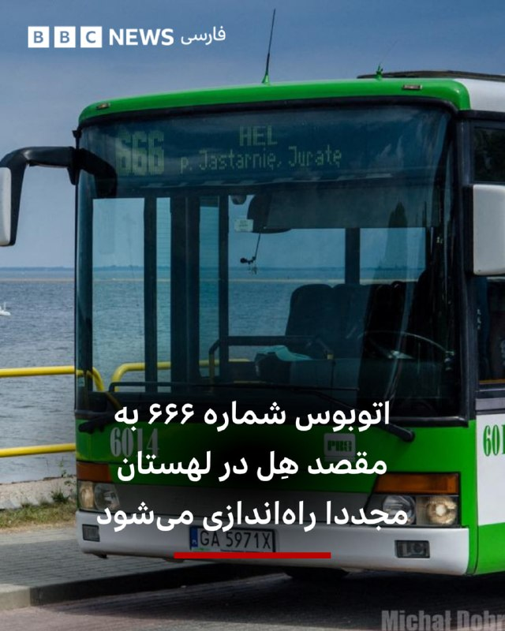

‌ ‌ ‌ ‌
خط اتوبوس‌ معروف لهستانی به شماره ۶۶۶ به مقصد شهر هِل - جهنم - که سه سال پیش و به دنبال اعتراضات گروه‌های مذهبی تعطیل شده بود، مجددا فعال خواهد شد.

مسیحیان محافظه‌کار ادعا کرده بودند که شماره این خط اتوبوس که پیوندهایی با شیطان در کتاب مقدس دارد، همراه با نام مقصد، شیطان‌پرستی را ترویج می‌دهد.

مسیر این تفریحگاه ساحلی دریای بالتیک به یک شوخی در بین گردشگران انگلیسی‌زبان تبدیل شده بود.

این سرویس توسط فلیکس‌باس، که مزایای بازاریابی ارائه سرویس شش-شش-شش به هل که فقط با یک حرف ال نوشته می‌شود، احیا می‌شود.

📷PKS GDYNIA/Reuters
@BBCPersian

## BBCPersian — post 282537

  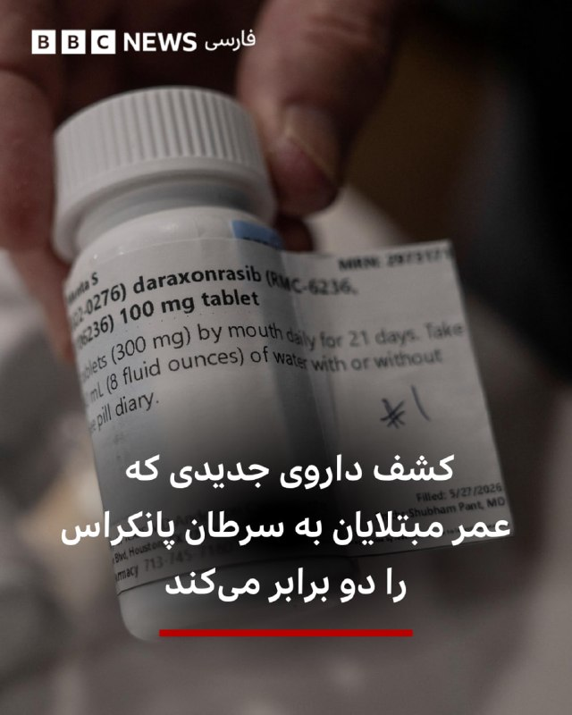

‌ ‌ ‌ ‌
مطالعه‌ای که توسط دانشمندان آمریکایی انجام شده است، نشان داده است که مصرف روزانه یک قرص می‌تواند طول عمر بیماران مبتلا به سرطان پیشرفته پانکراس را تقریبا دو برابر کند.

کارشناسان این دارو که داراکسونراسیب نام دارد، را به عنوان یک عامل تغییر دهنده در خصوص این سرطان توصیف کرده‌اند.

این آزمایش شامل ۵۰۰ نفر بود که سرطان آنها به سایر اندام‌هایشان گسترش یافته بود.

این مطالعه نشان داد که میانگین زمان بقا برای کسانی که قرص را مصرف کرده‌اند کمی بیش از یک سال بود، در حالی که این زمان برای کسانی که شیمی درمانی دریافت کرده بودند، حدود شش ماه و نیم بود.

این داروی جدید همچنین عوارض جانبی کمتری ایجاد می‌کند.

سرطان پانکراس به دلیل اینکه اغلب دیر تشخیص داده می‌شود و درمان آن دشوار است، میزان مرگ و میر بالایی دارد.

📷Reuters
@BBCPersian

## Dirty_Kids — post 390716

‏پدسگا قیمت رو تو کپشن بنویسید بابام مجبور نشه «کیوت» رو کامنت کنه.🤬

@Dirty_Kids 👻

## Dirty_Kids — post 390715

  <a href="telegram/content/Dirty_Kids_390715_1780307138.mp4" target="_blank">🎬 Download video</a>

عمو مانوک خدابخشیان:

ترامپ آرزو داشت تیم فوتبال داشته باشه ولی روش کارش بیسبالی هست

@Dirty_Kids 👻

## Dirty_Kids — post 390714

سپاه هر روز میگه اسراییل لبنان رو زد و آتش‌بس رو نقض کرده. خب اوکی میخوای چه گوهی بخوری الان مثلا؟

@Dirty_Kids 👻

## Dirty_Kids — post 390713

  <a href="telegram/content/Dirty_Kids_390713_1780307141.mp4" target="_blank">🎬 Download video</a>

این الان باید من و تو میبودیم:)))

وسط کنسرت دیشب کانیه وست از دوست دخترش خواستگاری میکنه

@Dirty_Kids 👻

## Dirty_Kids — post 390712

  <a href="telegram/content/Dirty_Kids_390712_1780307144.mp4" target="_blank">🎬 Download video</a>

نقش خايمالى بهتر بهت مياد شکیب جان✋🏼

@Dirty_Kids 👻

## Dirty_Kids — post 390711

کارگردان روش نشده اسم فیلمشو بذاره جنده خانوم گذاشته بدنام.

@Dirty_Kids 👻

## Dirty_Kids — post 390710

مملکت نه رهبر داره، نه رئیس جمهور نه مجلس، بعد سر کوچه دارن آمریکا رو تهدید میکنن به نابودی!!!

@Dirty_Kids 👻

## Dirty_Kids — post 390707

چی بگم والا اینم با چادر رفت کافه
هممونم بعدشو یادمونه

@Dirty_Kids 👻

## Dirty_Kids — post 390706

  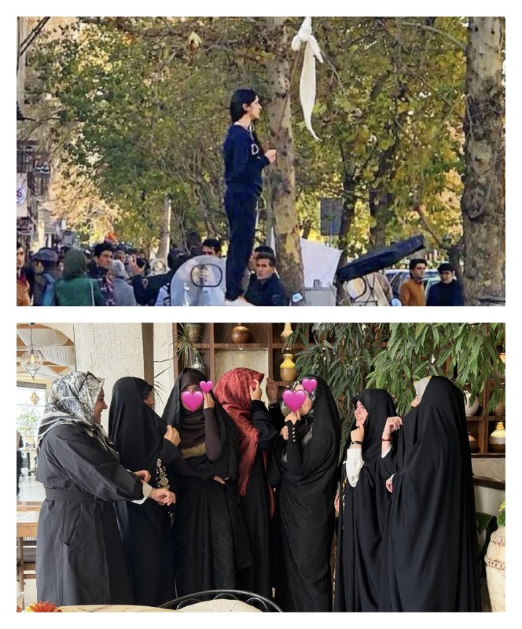

خایه رو‌ ویدا موحد داشت که تو روزایی که هیشکی جرات نداشت شال از سرش بیفته خیابون انقلاب رو به آتیش کشید نه شما حجاب استایلای کوله به کون

@Dirty_Kids 👻

## Hranews — post 113298

سمنان؛ اموال ۱۸ شهروند دیگر ساکن خارج از کشور توقیف شد

❗️
❗️
❗️
❗️
❗️– اموال و دارایی‌های ۱۸ شهروند ساکن خارج از کشور در استان سمنان توقیف شد. دستگاه قضایی این افراد را به «همکاری با دشمن» متهم کرده است.

ادامه مطلب

↘️
@hranews_bot تماس ✉️ -  @Hranews  کانال هرانا 🆑

## Hranews — post 113297

  

روز یکشنبه ۱۰ خرداد‌ماه، شماری از اساتید اخراجی دانشگاه فرهنگیان در مقابل ساختمان وزارت آموزش و پرورش در تهران، دست به #تجمع_اعتراضی زدند.

لغو احکام بازنشستگی اجباری اعضای هیئت علمی دانشگاه فرهنگیان براساس مصوبه سال ۱۳۹۶ هیات امنای دانشگاه از جمله دلایل اعتراض این اساتید است.

↘️
@hranews_bot تماس ✉️ - @Hranews کانال هرانا 🆑

## Hranews — post 113296

  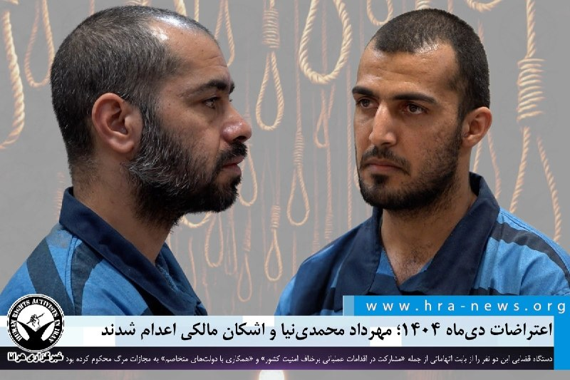

اعتراضات دی‌ماه ۱۴۰۴؛ مهرداد محمدی‌نیا و اشکان مالکی اعدام شدند

❗️
❗️
❗️
❗️
❗️– مرکز رسانه قوه قضاییه اعلام کرد مهرداد محمدی‌نیا و اشکان مالکی، از بازداشت‌شدگان اعتراضات دی‌ماه ۱۴۰۴ تهران، سحرگاه امروز #اعدام شدند. دستگاه قضایی این دو نفر را از بابت اتهاماتی از جمله «مشارکت در اقدامات عملیاتی برخلاف امنیت کشور» و «همکاری با دولت‌های متخاصم» به مجازات مرگ محکوم کرده بود.

ادامه مطلب

#مهرداد_محمدی‌نیا
#اشکان_مالکی

↘️
@hranews_bot تماس ✉️ -  @Hranews  کانال هرانا 🆑

## alonews — post 124120

  <a href="telegram/content/alonews_124120_1780307148.webm" target="_blank">🎬 Download video</a>

👈 نحوه برگزاری امتحانات پایان ترم دانشجویان تعیین تکلیف شد

🔴قائم مقام وزیر علوم در گفت‌و‌گو با ایسنا:
امتحانات پایان ترم دانشجویان دوره های کارشناسی ارشد و دکتری دانشگاه های کشور بجز چند دانشگاه فوق در نیمسال جاری به صورت کاملا حضوری برگزار می شود.

🔴دانشجویان کارشناسی برای سال جاری آموزش باقی مانده خود را به صورت مجازی ادامه خواهند داد و آموزش حضوری نخواهند داشت

✅ @AloNews خبر جنگ

## alonews — post 124118

  <a href="telegram/content/alonews_124118_1780307148.mp4" target="_blank">🎬 Download video</a>

👈الحدث: صحنه های آوارگی به سمت منطقه شرق بیروت پس از تهدید نخست وزیر نتانیاهو به حمله در ضاحیه جنوبی بیروت

✅ @AloNews خبر جنگ

## alonews — post 124117

  <a href="telegram/content/alonews_124117_1780307151.webm" target="_blank">🎬 Download video</a>

👈محمدباقر قالیباف:
محاصره دریایی و تشدید جنایات جنگی در لبنان، گواه عدم پایبندی واشنگتن به آتش بس است و هر گزینه ای بهایی دارد که پرداخت خواهد شد.

✅ @AloNews خبر جنگ

## alonews — post 124116

  <a href="telegram/content/alonews_124116_1780307151.webm" target="_blank">🎬 Download video</a>

👈رسانه‌های عربی از قبل دوربین‌های واید رو توی ضاحیه کار گذاشتن

🔴 منتظرن حملات شروع بشه تا همه‌چیز رو ضبط کنن

✅ @AloNews خبر جنگ

## alonews — post 124115

  <a href="telegram/content/alonews_124115_1780307151.webm" target="_blank">🎬 Download video</a>

👈 قیمت دلار آزاد امروز دوشنبه ۱۱ خرداد ۱۴۰۵ با افزایش به ۱۷۳,۰۳۰ تومان رسید؛ دلار حواله‌ای نیز ۱۴۷,۰۸۸ تومان شد.

✅ @AloNews خبر جنگ

## alonews — post 124114

  <a href="telegram/content/alonews_124114_1780307151.webm" target="_blank">🎬 Download video</a>

👈قیمت سکه امامی امروز دوشنبه ۱۱ خرداد ۱۴۰۵ با افزایش به ۱۸۳ میلیون و ۵۰۰ هزار تومان، نیم‌سکه ۹۳ میلیون تومان، ربع‌سکه ۵۳ میلیون تومان و سکه گرمی ۲۷ میلیون تومان رسید.

✅ @AloNews خبر جنگ

## alonews — post 124113

  <a href="telegram/content/alonews_124113_1780307152.webm" target="_blank">🎬 Download video</a>

👈سخنگوی وزارت خارجه: انتخاب آقای قالیباف به‌عنوان نماینده ویژه، در پیشبرد همه جانبه رابطه ایران و چین مهم و مثبت است

🔴هرگونه اقدام ناتو در خلیج فارس، منجر به پیچیده تر شدن اوضاع خواهد شد

🔴آخرین وضعیت تفاهم پایان جنگ این است که تبادل پیام ادامه دارد و به جمع‌بندی نرسیده‌ایم

✅ @AloNews خبر جنگ

## alonews — post 124112

  <a href="telegram/content/alonews_124112_1780307152.mp4" target="_blank">🎬 Download video</a>

👈سپاه صبح امروز با این موشک به یک پایگاه آمریکایی در کویت حمله کرد

✅ @AloNews خبر جنگ

## alonews — post 124111

  <a href="telegram/content/alonews_124111_1780307154.webm" target="_blank">🎬 Download video</a>

👈موجودی نفت خام ژاپن از مارس تاکنون حدود ۷۰ تا ۱۰۰ میلیون بشکه کاهش یافته است که بزرگ‌ترین کاهش در تاریخ این کشور محسوب می‌شود

✅ @AloNews خبر جنگ

## alonews — post 124110

  <a href="telegram/content/alonews_124110_1780307154.webm" target="_blank">🎬 Download video</a>

👈طبق گزارش کانال ۱۴ اسرائیل، انتظار می‌رود ارتش اسرائیل به زودی دستور تخلیه در حومه‌های جنوبی بیروت صادر کند.

✅ @AloNews خبر جنگ

## alonews — post 124109

  <a href="telegram/content/alonews_124109_1780307155.webm" target="_blank">🎬 Download video</a>

👈وزیر جنگ ایالات متحده، پیت هگزت: آنچه در بودجه سال ۲۰۲۷ رئیس‌جمهور ترامپ خواهید دید، سرمایه‌گذاری ۵۶ میلیارد دلاری در تسلط بر پهپادها است

🔴ما همچنان از آنچه اوکراین در میدان نبرد انجام داده است، می‌آموزیم. ما چیزهای زیادی از اوکراین و نحوه عملکرد آنها یاد گرفته‌ایم

✅ @AloNews خبر جنگ

## alonews — post 124108

  <a href="telegram/content/alonews_124108_1780307155.webm" target="_blank">🎬 Download video</a>

👈سخنگوی وزارت خارجه: مواضع متناقض آمریکایی‌ها دلیل طولانی‌شدن روند دستیابی به تفاهم است

🔴کویت هنوز امکان دسترسی کنسولی سفارت به ۴ شهروند دستگیرشدهٔ ایرانی را ایجاد نکرده است

🔴اجازه‌دادن به طرف‌های متجاوز برای اقدام علیه ایران از سوی دولت‌های منطقه، آن‌ها را کنار طرف‌های متجاوز خواهد نشاند

✅ @AloNews خبر جنگ

## alonews — post 124106

  <a href="telegram/content/alonews_124106_1780307155.webm" target="_blank">🎬 Download video</a>

👈ترامپ به نیوزویک: مردم ایران از من تشکر میکنند چون بجای یکبار، دوبار رژیم رو عوض کردم

✅ @AloNews خبر جنگ

## alonews — post 124105

  <a href="telegram/content/alonews_124105_1780307156.webm" target="_blank">🎬 Download video</a>

👈بی‌سی: تصاویر ماهواره‌ای نشان می‌دهد حملات ایران از آغاز جنگ به ۲۰ سایت نظامی آمریکا آسیب زده

✅ @AloNews خبر جنگ

## alonews — post 124104

  <a href="telegram/content/alonews_124104_1780307156.webm" target="_blank">🎬 Download video</a>

👈حسین طاهری مداح: اگه دارید مذاکره میکنید بیایید بگید تا تکلیفمون رو بدونیم که ۹۰روزه تو خیابونیم

✅ @AloNews خبر جنگ

## alonews — post 124103

  <a href="telegram/content/alonews_124103_1780307156.mp4" target="_blank">🎬 Download video</a>

👈مکرون:نیروی دریایی فرانسه صبح دیروز یک نفتکش جدید تحت تحریم‌های بین‌المللی را که از روسیه آمده بود، متوقف کرد

✅ @AloNews خبر جنگ

## alonews — post 124102

  <a href="telegram/content/alonews_124102_1780307158.webm" target="_blank">🎬 Download video</a>

👈بقایی: آتش بس در لبنان بخش لاینفک هرگونه توافق و خاتمه جنگ است

✅ @AloNews خبر جنگ

## alonews — post 124101

  <a href="telegram/content/alonews_124101_1780307158.webm" target="_blank">🎬 Download video</a>

👈سپاه استان اصفهان: ‌انفجارهای کنترل‌شده مرتبط با مهمات عمل‌نکرده در جنگ توسط تیم‌های فنی در محدوده جنوب شهر اصفهان در محدوده بهارستان تا ساعت ۱۳ روز جاری انجام می‌شود، لذا صداهای شنیده‌شده جای نگرانی ندارد.

✅ @AloNews خبر جنگ

## alonews — post 124100

  <a href="telegram/content/alonews_124100_1780307158.webm" target="_blank">🎬 Download video</a>

👈بی‌بی‌سی: در حالی که کاخ سفید بارها ادعا کرده که توان نظامی ایران تقریباً به‌طور کامل از بین رفته است، تحلیلگران می‌گویند خسارت‌های مشاهده‌شده در تأسیسات آمریکا نشان می‌دهد حملات متقابل تهران دقیق‌تر و گسترده‌تر از آن چیزی بوده که مقام‌های آمریکایی پیش‌تر اذعان کرده‌اند.

✅ @AloNews خبر جنگ

---
📅 بروزرسانی: 1405/03/11 07:44
---

## VahidOOnLine — post 243149

  

فرماندهی مرکزی ایالات متحده، سنتکام، در شبکه اجتماعی ایکس تاکید کرد: «در پاسخ به تجاوز بی‌اساس ایران در طول آتش‌بس جاری، به حفاظت از دارایی‌ها و منافع ایالات متحده ادامه خواهد داد.»

سنتکام نوشت که این فرماندهی در روزهای اخیر حملات دفاع از خود را علیه سایت‌های راداری و فرماندهی و کنترل پهپادهای حکومت ایران در منطقه روستایی گورک، و جزیره قشم انجام داد.

فرماندهی مرکزی ایالات متحده افزود: «این حملات سنجیده و حساب‌شده روزهای شنبه و یکشنبه در پاسخ به اقدامات تهاجمی ایران از جمله سرنگونی یک پهپاد ام‌کیو یک آمریکایی که بر فراز آب‌های بین‌المللی در حال پرواز بود، انجام شدند.»

سنتکام نوشت: «جنگنده‌های آمریکایی به سرعت با از بین بردن پدافند هوایی ایران، یک ایستگاه کنترل زمینی و دو پهپاد انتحاری که تهدید آشکاری برای کشتی‌های عبوری از آب‌های منطقه‌ای ایجاد می‌کردند، واکنش نشان دادند» و «هیچ یک از نیروهای نظامی آمریکایی آسیب ندیدند.»
‌🏁 🇬🇧 IranintlTV

🤖 @VahidOOnLine

## VahidOOnLine — post 243148

  

♦️فرماندهی مرکزی ایالات متحده (سنتکام) صبح دوشنبه اعلام کرد که در در دو روز گذشته حملات «دفاع از خود» علیه سایت‌های راداری و مراکز فرماندهی و کنترل پهپادهای ایران در گروگ (شهر گروگ در میانه غربی شهرستان سیریک واقع شده) و جزیره قشم انجام داده است.
به گفته این فرماندهی، این حملات «حساب‌شده و هدفمند» روزهای شنبه و یکشنبه در پاسخ به اقدامات تهاجمی رژیم ایران انجام شد؛ اقداماتی که شامل سرنگونی یک پهپاد آمریکایی ام‌کیو-۱ MQ-1 بود که در حال فعالیت بر فراز آب‌های بین‌المللی بود. جنگنده‌های آمریکایی به‌سرعت واکنش نشان داده و پدافند هوایی ایران، یک ایستگاه کنترل زمینی و دو پهپاد تهاجمی یک‌طرفه را که تهدیدی آشکار برای کشتی‌های عبوری در آب‌های منطقه‌ای بودند، از بین بردند.
در این بیانیه آمده است که هیچ‌یک از نظامیان آمریکایی آسیب ندیده‌اند. سنتکام تأکید کرده است که در واکنش به اقدامات «غیرموجه» ایران در جریان آتش‌بس جاری، به حفاظت از نیروها و منافع آمریکا ادامه خواهد داد.
‌🇸🇦 Indypersian

🤖 @VahidOOnLine

## VahidOOnLine — post 243147

  

روزنامه شرق گزارش داد پس از اعتراضات دی‌ماه و در ادامه روند تشکیل پرونده‌های انضباطی برای دانشجویان، دانشگاه‌های ایران بار دیگر پیگیری پرونده‌ها و صدور احکام جدید را آغاز کرده‌اند؛ احکامی که این روزنامه آن‌ها را «کم‌سابقه» توصیف کرده است.

شرق دوشنبه ۱۱ خرداد نوشت در دانشگاه شریف، پنج تا هفت دانشجو حکم اخراج گرفته‌اند و بیش از ۲۰ دانشجو نیز یک تا سه ترم از تحصیل تعلیق شده‌اند.

بر اساس این گزارش، سامانه‌های آموزشی ۲۰ تا ۲۵ دانشجوی دانشگاه شهید بهشتی از دسترس خارج شده، برای بیش از ۱۰۰ دانشجوی دانشگاه علم و صنعت پرونده انضباطی تشکیل شده و ۱۵۰ تا ۲۰۰ دانشجوی دانشگاه تهران در حال نوشتن دفاعیه‌های خود هستند.

شرق همچنین نوشت رسیدگی به این پرونده‌ها با «نقض گسترده» اصول شیوه‌نامه انضباطی همراه بوده است.

این برخوردها در حالی ادامه دارد که حسین سیمایی‌صراف، وزیر علوم دولت مسعود پزشکیان، پیش‌تر گفته بود مانعی برای تحصیل هیچ دانشجویی وجود ندارد و همه دانشجویان محروم‌شده به دانشگاه بازگشته‌اند.
متن کامل را اینجا بخوانید
‌🏁 🇬🇧 IranintlTV

🤖 @VahidOOnLine

## VahidOOnLine — post 243146

  

♦️خبرگزاری دولتی کویت بامداد دوشنبه اعلام کرد که دفاع هوایی این کشور در حال مقابله با حمله‌های موشکی و پهپادی است و آژیر خطر در سراسر کشور به صدا در آمده است. سپاه پاسداران نیز در بیانیه‌ای اعلام کرد که به دنبال «تجاوز ساعتی پیش آمریکا به یک دکل مخابراتی در جزیر سیریک در استان هرمزگان، مبدا تجاوز هدف گرفته شده است.» هفته گذشته نیز به دنبال حمله‌ای در شرق بندرعباس که رویترز اعلام کرد هدف آن یک سایت نظامی بوده، کویت از مقابله با پهپادها و موشک‌ها خبر داده بود. همزمان، سپاه پاسداران نیز اعلام کرد که مبدا حمله به بندرعباس را هدف حمله قرار داده است.
‌🇸🇦 Indypersian

🤖 @VahidOOnLine

## VahidOOnLine — post 243145

♦️حسین طاهری، مداح حکومتی، در جمع حامیان جمهوری اسلامی درباره مذاکرات و توافق احتمالی تهران و واشنگتن خطاب به مقامات گفت: «اگر دارید مذاکره یا توافق می‌کنید یا اگر جنگ است، نتیجه‌اش را بگویید تا ما تکلیف خودمان را در خیابان‌ها بدانیم».
‌🇸🇦 Indypersian

🤖 @VahidOOnLine

## VahidOOnLine — post 243144

  

ستاد کل ارتش کویت دقایقی پیش اعلام کرد سامانه‌های پدافند هوایی این کشور در حال مقابله با حملات موشکی و پهپادی دشمن هستند.

به گزارش خبرگزاری رویترز، جزییات بیشتری درباره این حمله پهپادی منتشر نشده است.

ارتش کویت در بیانیه خود تاکید کرد که صداهای احتمالی انفجار ناشی از رهگیری اهداف مهاجم از سوی سامانه‌های پدافندی است و از شهروندان خواست دستورالعمل‌های ایمنی را رعایت کنند.
‌🏁 🇬🇧 IranintlTV

🤖 @VahidOOnLine

## VahidOOnLine — post 243143

  

آکسیوس گزارش داد که ایالات متحده در قالب یک گام اولیه برای برقراری صلح، پیشنهاد کرده است که حزب‌الله تمام حملات خود به اسرائیل را متوقف کند.

به نوشته آکسیوس، این پیشنهاد در چارچوب تلاش‌های دیپلماتیک برای کاهش تنش در مرزهای لبنان و اسرائیل مطرح شده است.
‌🏁 🇬🇧 IranintlTV

🤖 @VahidOOnLine

## VahidOOnLine — post 243142

♦️براساس تصاویر منتشر شده در شبکه‌های اجتماعی، احمد الشرع، رئیس‌جمهوری سوریه و همسرش لطیفه الدروبی، در جدیدترین حضور غیررسمی خود در یکی از رستوران‌های شهر دمشق دیده شدند. این حضور علنی در حالی صورت گرفت که او پیش از این نیز در ۳۱ فروردین‌ماه، با حضور در مراسم افتتاحیه ورزشگاه «الفیحا» دمشق و انجام بازی بسکتبال، توجه رسانه‌ها را به خود جلب کرده بود.
‌🇸🇦 Indypersian

🤖 @VahidOOnLine

## VahidOOnLine — post 243141

  <a href="telegram/content/VahidOOnLine_243141_1780287279.mp4" target="_blank">🎬 Download video</a>

♦️به گزارش رسانه‌های ایران، روز یکشنبه، ۱۰ خرداد نخستین جلسه سومین سال فعالیت مجلس دوازدهم «به‌صورت مجازی» و به ریاست محمدباقر قالیباف در مکانی نامعلوم برگزار شد. باوجود اینکه ساختمان مجلس شورای اسلامی هدف حملات نبوده است، اما در چهار ماه اخیر، محمدباقر قالیباف و نمایندگان مجلس شورای اسلامی از حضور در مجلس و برگزاری جلسه در آن خودداری کرده‌اند. بنا بر گزارش‌ها، این جلسه با حضور ۱۸۷ نماینده به‌صورت مجازی و ۱۴ نماینده به‌صورت حضوری برگزار شد و اعضای جدید هیئت‌رئیسه مجلس سوگند یاد کردند. پیش از این، عباس گودرزی، سخنگوی هئیت رئیسه مجلس شورای اسلامی، اعلام کرده بود که به دلیل «تدابیر امنیتی و شرایط موجود» نخستین جلسه صحن علنی مجلس از آغاز جنگ جاری روز یکشنبه به صورت «ویدئو کنفرانس» برگزار خواهد شد. آخرین جلسه علنی مجلس شورای اسلامی روز ۲۸ بهمن‌ماه سال گذشته برگزار شد.
‌🇸🇦 Indypersian

🤖 @VahidOOnLine

## VahidOOnLine — post 243139

♦️به گزارش رویترز، امانوئل مکرون روز یکشنبه، در کاخ ریاست‌جمهوری الیزه میزبان بازیکنان پاریس سن‌ ژرمن بود که پس از شکست دادن آرسنال در مسابقه نهایی بوداپست و کسب جام، به پایتخت بازگشته بودند. مکرون در سخنرانی خود خطاب به شاگردان لوئیس انریکه گفت: «شما ما را تا آخرین ثانیه به هیجان آوردید؛ به لطف پاریس سن‌ ژرمن، فرانسه توانست در دو سال کاری را انجام دهد که در ۷۰ سال تاریخ فوتبال ما بی‌سابقه بوده، یعنی کسب دو عنوان قهرمانی.» رئیس‌جمهوری فرانسه که همراه با همسرش، بریژیت مکرون، میزبان بازیکنان این تیم بود، با اشاره به برخی ناآرامی‌ها و آشوب‌های خیابانی جریان جشن‌های مردمی، با تاکید بر برخورد قاطع با افراد بازداشت‌شده افزود: «این رفتارها ربطی به فوتبال و ورزش ندارد و آن چیزی نیست که ما به آن عشق می‌ورزیم.»
‌🇸🇦 Indypersian

🤖 @VahidOOnLine

## VahidOOnLine — post 243138

  

رافائل گروسی، مدیرکل آژانس بین‌المللی انرژی اتمی، گفت قزاقستان اعلام کرده است که در صورت دستیابی واشینگتن و تهران به توافق هسته‌ای، آماده دریافت ذخایر اورانیوم غنی‌شده ایران است.

گروسی به فایننشال تایمز گفت که قاسم جومارت توکایف، رییس‌جمهوری قزاقستان، در جریان مذاکراتی در آستانه، تمایل خود را برای دریافت این ذخایر نشان داده است.

او افزود از آنجا که آژانس بین‌المللی انرژی اتمی داراییک «بانک» برای ذخیره اورانیوم با غنای پایین در قزاقستان است، این کشور «مکانی» دارد که می‌توان این اورانیوم را به طور ایمن در آن ذخیره کرد.

اورانیوم غنی‌شده جمهوری اسلامی موضوعی کلیدی در مذاکرات بین ایالات متحده و جمهوری اسلامی است.
‌🏁 🇬🇧 IranintlTV

🤖 @VahidOOnLine

## VahidOOnLine — post 243137

♦️مهدی خراتیان، کارشناس حکومتی، با انتقاد از پافشاری بر دکترین هسته‌ای فعلی و در واکنش به تهدیدهای خارجی گفت: «ما بارها، از جمله از طرف ترامپ، به صورت تلویحی و تصریحا مورد تهدید اتمی قرار گرفته‌ایم. نمی‌توانیم صرفا بگوییم چون فتوایی داریم، پس تحت هر شرایطی بمب اتمی نمی‌سازیم.» خراتیان با توجه به دو سال باقیمانده از دوران ریاست‌جمهوری دونالد ترامپ گفت: «این وضعیت دیگر قابل تحمل نیست. نمی‌توانیم رهبرمان را برای دو سال زیر زمین نگه داریم.»
‌🇸🇦 Indypersian

🤖 @VahidOOnLine

## VahidOOnLine — post 243136

  

فاکس‌نیوز در گزارشی نوشت که مجتبی خامنه‌ای در واکنش به تلاش‌های دونالد ترامپ برای گسترش پیمان ابراهیم، درصدد ایجاد یک ائتلاف منطقه‌ای علیه نظم تحت رهبری آمریکا است و می‌کوشد کشورهای خاورمیانه را زیر پرچم «تمدن نوین اسلامی» گرد هم آورد.

در این گزارش آمده است که رهبر جمهوری اسلامی، کارزاری سیاسی و ایدئولوژیک را برای مقابله با نفوذ آمریکا در خاورمیانه آغاز کرده و تلاش دارد کشورهای منطقه را به سمت نوعی همگرایی اسلامی تحت رهبری تهران سوق دهد.

این گزارش می‌گوید تحرکات اخیر تهران تنها چند ساعت پس از آن آغاز شد که ترامپ با رهبران عربستان سعودی، امارات متحده عربی، قطر، ترکیه، پاکستان، مصر، اردن و بحرین درباره گسترش پیمان ابراهیم گفت‌وگو کرد. ترامپ همچنین در ۲۵ مه [۴ خرداد] در شبکه اجتماعی تروث سوشال از توسعه این پیمان حمایت کرده بود.

به نوشته فاکس‌نیوز، یک روز بعد، مجتبی خامنه‌ای در پیامی [منتسب به او] در شبکه اجتماعی ایکس خواستار شکل‌گیری «تمدن نوین اسلامی» شد و از دولت‌های اسلامی خواست برای پیشرفت «امت اسلامی» و حل مشکلات جهان اسلام با یکدیگر همکاری کنند.
متن کامل را اینجا بخوانید
‌🏁 🇬🇧 IranintlTV

🤖 @VahidOOnLine

## VahidOOnLine — post 243135

  

یک مقام رسمی ایالات متحده به روزنامه نیویورک‌تایمز گفت ارتش آمریکا بی‌سروصدا کشتی‌ها را برای عبور از تنگه هرمز هدایت می‌کند.

یک مقام دیگر که خواست نامش فاش نشود، ‌به این روزنامه گفت فرماندهی مرکزی ایالات متحده، سنتکام، طی سه هفته گذشته، حدود ۷۰ کشتی تجاری را که به خلیج فارس وارد و از آن خارج می‌شدند، از این تنگه عبور داده است.

به نوشته نیویورک‌تایمز، مقام‌های آمریکایی اشاره کردند که بیشتر کشتی‌ها برای جلوگیری از شناسایی شدن توسط جمهوری اسلامی، هنگام عبور از این آبراه، فرستنده‌های خود را خاموش کرده‌ بودند.

آن‌ها در مورد نوع کشتی‌هایی که از تگه هرمز عبور ‌کردند و همچنین مقصد آن‌ها توضیحی ندادند.

اما یکی از این مقام‌ها به نیویورک‌تایمز گفت که مسیر آن‌ها نزدیک خط ساحلی ایران نبود.

بر اساس این گزارش، تحلیلگران امور کشتیرانی می‌گویند به نظر می‌رسد که گذرگاه‌های هدایت‌شده توسط ایالات متحده به عمان نزدیک‌تر هستند.

نیویورک‌تایمز اشاره کرد مسیر هماهنگ شده با آمریکا جایگزینی برای مالکان کشتی‌هایی به شمار می‌رود که نمی‌خواهند برای عبور از تنگه هرمز مجبور به دریافت اجازه از تهران یا پرداخت عوارض باشند.
https://iran
‌🏁 🇬🇧 IranintlTV

🤖 @VahidOOnLine

## VahidOOnLine — post 243134

♦️محسن هاشمی رفسنجانی، رئیس شورای مرکزی حزب کارگزاران سازندگی، در گفتگو با «جماران» درباره نحوه مواجهه با دولت جدید آمریکا، ضمن «گاو خشمگین» خواندن دونالد ترامپ گفت: «یک عقل سلیمی الان می‌گوید که ما باید یک کاری بکنیم که این گاو خشمگین، این دوران دو سال مانده‌اش را یک‌جوری طی بکند و از قدرت آمریکا کنار برود». پسر بزرگ اکبر هاشمی رفسنجانی گفت: «مگر خود ترامپ زیر توافقنامه‌اش نزد و آن را پاره نکرد؟ خب ما هم پاره می‌کنیم، اتفاقی نمی‌افتد.»
‌🇸🇦 Indypersian

🤖 @VahidOOnLine

## VahidOOnLine — post 243133

♦️بر اساس گزارش رویترز، یکشنبه‌شب، پدیده نادر «ماه آبی» بر فراز معبد باستانی «پوزئیدون» در منطقه «دماغه‌ سونیون» یونان طلوع کرد. رویدادی نسبتا کم‌نظیر که به دومین ماه کامل در طول یک ماه تقویمی اطلاق می‌شود و این‌بار، نشانه پایانی برای فصل بهار است. با وجود نام این پدیده، رنگ ماه در واقعیت آبی نیست و طبق اعلام سازمان فضایی «ناسا»، این پدیده یکی از کوچک‌ترین ماه‌های کامل سال به شمار می‌رود که به «ماه مینیاتوری» (Micromoon) معروف است.
‌🇸🇦 Indypersian

🤖 @VahidOOnLine

## VahidOOnLine — post 243132

  

♦️دونالد ترامپ، رئیس جمهوری آمریکا در پیامی در تروث سوشال نوشت: «رسانه جعلی سی‌ان‌ان امروز طبق روال همیشگی خود ادعا کرد که توافق هسته‌ای من با ایران درباره موضوع هسته‌ای چیزی نمی‌گوید؛ در حالی که این توافق به‌روشنی تصریح می‌کند که ایران به سلاح هسته‌ای دست نخواهد یافت.
این توافق سپس با جزئیات فراوان و بسیار قاطع، به جنبه‌های مختلف دیگر موضوع هسته‌ای می‌پردازد. در واقع، بخش عمده این توافق دقیقا درباره همین موضوع است.
سی‌ان‌ان و بسیاری دیگر از رسانه‌های جعلی، به فاجعه‌ای از نظر میزان مخاطب تبدیل شده‌اند. حتی با وجود مالکان جدید نیز بعید است هرگز بهتر شوند!!»
‌🇸🇦 Indypersian

🤖 @VahidOOnLine

## VahidOOnLine — post 243131

  

مهدی انصاری، وکیل، عضو کانون وکلای دادگستری فارس و کهگیلویه و بویراحمد و از بازداشت‌شدگان اعتراضات دی‌ماه ۱۴۰۴، توسط دادگاه انقلاب اسلامی شیراز به «پنج سال حبس تعزیری و مجازات تکمیلی» محکوم شد.

به گزارش سازمان حقوق بشری هه‌نگاو، در این حکم که به انصاری ابلاغ شده است، او از بابت اتهام «اجتماع و تبانی به قصد برهم زدن امنیت کشور» به تحمل ۵ سال حبس تعزیری محکوم شده است.

انصاری همچنین به عنوان مجازات تکمیلی به دو سال منع خروج از کشور محکوم شده است.

هه‌نگاو اشاره کرد که این وکیل دادگستری هشتم بهمن سال گذشته و در جریان اعتراضات سراسری، به دست نیروهای حکومتی در منزل خود در شیراز، بازداشت شد.

او پساز پایان بازجویی، با تودیع قرار وثیقه ۵ میلیارد تومانی به صورت موقت و تا پایان مراحل دادرسی از زندان عادل‌آباد شیراز آزاد شده بود.
‌🏁 🇬🇧 IranintlTV

🤖 @VahidOOnLine

## VahidOOnLine — post 243130

  

♦️به گزارش دنیای اقتصاد، در حال حاضر هزینه خرید چهار قلم کالای اساسی خانگی تولید داخل، شامل یخچال، تلویزیون، جاروبرقی و ماشین لباسشویی، ۳۶ برابر پایه حقوق کارگران است و برای خرید فقط این چهار قلم باید سه سال همه حقوق خود را جمع کنند و هیچ هزینه‌ای انجام ندهند. براساس این گزارش، هزینه این چهار قلم کالای اساسی خانگی از نام‌های تجاری ایرانی دست‌کم ۳۷۵ میلیون تومان است . به نوشته دنیای اقتصاد، قیمت لوازن خانگی در یک دهه اخیر پنج هزار درصد افزایش یافته است.
‌🇸🇦 Indypersian

🤖 @VahidOOnLine

## mwarmonitor — post 9967

🔴دفاع آمریکا و خنثی‌سازی تهدیدات در پاسخ به تجاوزات ایران

🔸فرماندهی مرکزی ایالات متحده (سنتکام)

🔰تامپا، فلوریدا — فرماندهی مرکزی ایالات متحده (سنتکام) در پایان این هفته، حملات دفاع مشروعی را علیه رادارهای ایرانی و سایت‌های فرماندهی و کنترل پهپادها در گورک ایران و جزیره قشم انجام داد.

🔹این حملات سنجیده و حساب‌شده در روزهای شنبه و یکشنبه در پاسخ به اقدامات تهاجمی ایران، از جمله سرنگونی یک پهپاد MQ-1 آمریکایی که در حریم هوایی بین‌المللی در حال فعالیت بود، صورت گرفت.

🔹 جنگنده‌های آمریکایی با سرعت پاسخ دادند و پدافند هوایی ایران، یک ایستگاه کنترل زمینی و دو پهپاد تهاجمی انتحاری (یک‌طرفه) را که تهدیدی آشکار برای کشتی‌های در حال عبور از آب‌های منطقه بودند، منهدم کردند.

🔸به هیچ‌یک از اعضای خدمت‌گذار ارتش آمریکا آسیبی نرسید. سنتکام به محافظت از دارایی‌ها و منافع ایالات متحده در پاسخ به تجاوزات بی‌دلیل ایران در طول آتش‌بس جاری ادامه خواهد داد.

@mwarmonitor

## mwarmonitor — post 9966

  

🔸ستاد کل ارتش کویت دوشنبه، ۱ ژوئن ۲۰۲۶ پدافند هوایی کویت در حال حاضر در حال مقابله با تهدیدات موشکی و پهپادی متخاصم است. ستاد کل نیروهای مسلح کویت تایید می‌کند که هرگونه صدای انفجاری که ممکن است شنیده شود، ناشی از رهگیری اهداف متخاصم توسط سامانه‌های پدافند…

## mwarmonitor — post 9965

  

🚨فوری | خبرنگار الجزیره: آژیرهای هشدار در کویت به صدا درآمد. @mwarmonitor

## mwarmonitor — post 9964

🚨فوری | خبرنگار الجزیره: آژیرهای هشدار در کویت به صدا درآمد.

@mwarmonitor

## mwarmonitor — post 9963

🔴باراک راوید: یک مقام آمریکایی به من گفت که وزیر خارجه ایالات متحده، مارکو روبیو، طی ۴۸ ساعت گذشته با جوزف عون رئیس‌جمهور لبنان و بنیامین نتانیاهو نخست‌وزیر اسرائیل گفت‌وگو کرده تا ابتکار جدیدی برای آتش‌بس را پیش ببرد.

🔴 این مقام آمریکایی گفت ابتکار جدید در چارچوب مذاکرات جاری میان اسرائیل و لبنان پیشنهاد شده است.

🔴 به گفته این مقام، آمریکا برای پیشبرد این گفت‌وگوها پیشنهاد داده که در گام نخست، حزب‌الله تمامی حملات خود علیه اسرائیل را متوقف کند و در مقابل، اسرائیل از تشدید تنش در بیروت خودداری کند.

🔴 این مقام افزود که چنین اقدامی «فضایی برای کاهش تدریجی تنش و توقف مؤثر درگیری‌ها» ایجاد خواهد کرد.

🔴 به گفته مقام آمریکایی، رئیس‌جمهور عون تلاش کرد این پیشنهاد را پیش ببرد و به توافقی دست یابد، اما پاسخ نبیه بری، رئیس پارلمان لبنان، مبهم و ناامیدکننده بود.

🔴 این مقام ادعا کرد که بری مدعی شد می‌تواند پایبندی حزب‌الله به آتش‌بس را تضمین کند، اما مسئولیت آغاز توقف تیراندازی را بر عهده اسرائیل گذاشت؛ آن هم در حالی که به گفته او، حزب‌الله آغازگر این دور از درگیری‌ها بوده است.

🔴 این مقام آمریکایی تأکید کرد: «حزب‌الله از خط‌مشی تهران پیروی می‌کند و آشکارا هیچ علاقه‌ای به رفاه مردم لبنان ندارد.»

🔴به ادعای این مقام، ایران می‌خواهد درگیری در لبنان را طولانی کند تا بتواند بعداً مدعی شود که «اوضاع را نجات داده است».

🔴 این مقام گفت: «ایالات متحده انتظار ندارد اسرائیل حملات مداوم به غیرنظامیان خود از سوی یک سازمان تروریستی را تحمل کند. سریع‌ترین راه برای کاهش تنش و حفاظت از غیرنظامیان در همه طرف‌ها این است که حزب‌الله فوراً شلیک را متوقف کند.»

@mwarmonitor

## mwarmonitor — post 9962

🔴شبکه خبری جعلی سی‌ان‌ان (CNN) امروز طبق معمول ادعا کرد که توافق هسته‌ای ایرانِ من اصلاً درباره مسائل هسته‌ای صحبت نمی‌کند؛ در حالی که در واقع این توافق با وضوح کامل بیان می‌کند که ایران سلاح هسته‌ای نخواهد داشت. این توافق در ادامه، با جزئیاتی بسیار محکم و طولانی، به بحث درباره ابعاد مختلف دیگرِ موضوع هسته‌ای می‌پردازد. در حقیقت، بخش عمده‌ای از این توافق درباره همین موضوع است. سی‌ان‌ان و بسیاری دیگر از رسانه‌های خبری جعلی، یک فاجعه با میزان بیننده (رِیتینگ) پایین هستند. حتی با مدیریت و مالکیت جدید هم بعید است که وضعیت آن‌ها هرگز بهتر شود!!!

رئیس‌جمهور دونالد جی ترامپ

@mwarmonitor

## FoxNewsTwitter — post 342467

‌Fox News (Twitter/X)

👉 Full story here:

## FoxNewsTwitter — post 342466

  

Fox News (Twitter/X)

Hasan Piker gets denied entry to the UK over alleged antisemitism — then immediately blames 'Israel advocacy organizations' for wielding 'unbelievable amounts of power' over British policy.

The streamer's response to the ban landed on a classic antisemitic trope about Jewish influence, even as he insisted he harbors no antisemitism. British Jewish groups and a Labour MP had urged the government to block his visit, citing his comments about Hamas, Hezbollah, and his claim that the U.S. deserved 9/11.

The ban caps a brutal stretch for Piker: a Treasury Department subpoena over his Cuba trip, and hecklers confronting him at a Newark ICE protest calling him a 'f***ing fraud.'

## pm_afshaa — post 91979

  <a href="telegram/content/pm_afshaa_91979_1780287286.mp4" target="_blank">🎬 Download video</a>

موزیک جدید حامدفرد به اسم «بزن که خوب میزنی» منتشر شد و توی چند ساعت اول بازدید میلیونی گرفت

💧 Rainbet.com the #1 Non-KYC Crypto Casino & Sportsbook @rainbetcom

😁 @Pm_Afshaa

## pm_afshaa — post 91978

  <a href="telegram/content/pm_afshaa_91978_1780287287.mp4" target="_blank">🎬 Download video</a>

مداح حکومتی حسین طاهری:اگه دارین مذاکره می‌کنید به ماهم بگین که حداقل تکلیف خودمونو تو این دورهم جمع شدنایِ شبانه بدونیم.

💧 Rainbet.com the #1 Non-KYC Crypto Casino & Sportsbook @rainbetcom

😁 @Pm_Afshaa

## pm_afshaa — post 91977

  <a href="telegram/content/pm_afshaa_91977_1780287289.webm" target="_blank">🎬 Download video</a>

🔴محسن رضایی: با ادامه محاصره دریایی و مطرح کردن خواسته‌های بیش از حد در مذاکرات، ترامپ‌بار دیگر ثابت کرده که تمایلی به مذاکره و توافق نداره.

💧 Rainbet.com the #1 Non-KYC Crypto Casino & Sportsbook @rainbetcom

😁 @Pm_Afshaa

## VahidOnline — post 75834

بیانیه سپاه: ساعتی پیش آمریکا به دکل مخابراتی سیریک حمله کرده بود پاسخ دادیم

من اون موقع فقط از یک نفر دو پیام داشتم:
ساعت 4:00 چهار انفجار در شهرستان سیریک
پایگاه سپاه سرخور زدن

ساعت 4:26 دوباره یکی زد
هرمزگان شهرستان سیریک

و الان کسی تصویر دوم بالا رو فرستاد و نوشت:
"حدود ساعت چهار صبح، آمریکا با چند موشک به اینجا حمله کرد.
پایگاه نیروی دریایی سپاه شهرستان سیریک ، حوالی روستای گروک"

📡 @VahidOnline

## VahidOnline — post 75833

  <a href="telegram/content/VahidOnline_75833_1780287289.mp4" target="_blank">🎬 Download video</a>

'شلیک موشک از #امیدیه در خوزستان'
ویدیوی دریافتی دیگر از همان موشک،
دوشنبه ۱۱ خرداد ساعت ۶:۳۰
Vahid
ستاد کل ارتش کویت دقایقی پیش اعلام کرد سامانه‌های پدافند هوایی این کشور در حال مقابله با حملات موشکی و پهپادی دشمن هستند.

به گزارش خبرگزاری رویترز، جزییات بیشتری درباره این حمله پهپادی منتشر نشده است.

ارتش کویت در بیانیه خود تاکید کرد که صداهای احتمالی انفجار ناشی از رهگیری اهداف مهاجم از سوی سامانه‌های پدافندی است و از شهروندان خواست دستورالعمل‌های ایمنی را رعایت کنند.
@VahidOOnLine

📡 @VahidOnline

## VahidOnline — post 75832

  

بیانیه سنتکام درباره حملات شنبه و یکشنبه
(از جمله حمله به سیریک هرمزگان که با توجه به پستی پایین‌تر گویا ساعت ۴ صبح دوشنبه ایران انجام شده. در آمریکا هنوز یکشنبه است.)

ترجمه ماشین:
"آمریکا در واکنش به تجاوز ایران، از خود دفاع کرد و تهدیدها را از کار انداخت

تامپا، فلوریدا — فرماندهی مرکزی ایالات متحده آمریکا، سنتکام، این آخر هفته حملات دفاعی علیه سایت‌های راداری ایران و مراکز فرماندهی و کنترل پهپادها در گروک ایران و جزیره قشم انجام داد.

این حملات حساب‌شده و عامدانه، روزهای شنبه و یکشنبه و در پاسخ به اقدامات تهاجمی ایران انجام شد؛ اقداماتی که شامل سرنگونی یک پهپاد MQ-1 آمریکا بود که بر فراز آب‌های بین‌المللی فعالیت می‌کرد. جنگنده‌های آمریکایی به‌سرعت واکنش نشان دادند و پدافند هوایی ایران، یک ایستگاه کنترل زمینی، و دو پهپاد تهاجمی یک‌طرفه را که تهدیدی آشکار برای کشتی‌های در حال عبور از آب‌های منطقه‌ای محسوب می‌شدند، منهدم کردند.

هیچ‌یک از نیروهای نظامی آمریکا آسیب ندیدند. سنتکام در جریان آتش‌بس جاری، در واکنش به تجاوز بی‌دلیل ایران، به حفاظت از دارایی‌ها و منافع ایالات متحده ادامه خواهد داد."
CENTCOM

📡 @VahidOnline

## VahidOnline — post 75828

  <a href="telegram/content/VahidOnline_75828_1780287290.mp4" target="_blank">🎬 Download video</a>

'شلیک موشک از #امیدیه در خوزستان'
تصاویر دریافتی، دوشنبه ۱۱ خرداد ساعت ۶:۳۰ به وقت #ایران
Vahid

📡 @VahidOnline

## VahidOnline — post 75827

  

شلیک موشک به کویت

دوباره همز‌مان پیام‌هایی درباره شلیک موشک از امیدیه خوزستان و اعلام هشدار در کویت دریافت کردم.
دوشنبه ۱۱ خرداد
ساعت ۶ به وقت کویت که میشه ساعت ۶:۳۰ به وقت ایران
Vahid

📡 @VahidOnline

## IranIntlTV — post 339963

  

فرماندهی مرکزی ایالات متحده، سنتکام، در شبکه اجتماعی ایکس تاکید کرد: «در پاسخ به تجاوز بی‌اساس ایران در طول آتش‌بس جاری، به حفاظت از دارایی‌ها و منافع ایالات متحده ادامه خواهد داد.»

سنتکام نوشت که این فرماندهی در روزهای اخیر حملات دفاع از خود را علیه سایت‌های راداری و فرماندهی و کنترل پهپادهای حکومت ایران در منطقه روستایی گورک، و جزیره قشم انجام داد.

فرماندهی مرکزی ایالات متحده افزود: «این حملات سنجیده و حساب‌شده روزهای شنبه و یکشنبه در پاسخ به اقدامات تهاجمی ایران از جمله سرنگونی یک پهپاد ام‌کیو یک آمریکایی که بر فراز آب‌های بین‌المللی در حال پرواز بود، انجام شدند.»

سنتکام نوشت: «جنگنده‌های آمریکایی به سرعت با از بین بردن پدافند هوایی ایران، یک ایستگاه کنترل زمینی و دو پهپاد انتحاری که تهدید آشکاری برای کشتی‌های عبوری از آب‌های منطقه‌ای ایجاد می‌کردند، واکنش نشان دادند» و «هیچ یک از نیروهای نظامی آمریکایی آسیب ندیدند.»
https://iranintl.com/202606012118

## IranIntlTV — post 339962

  

روزنامه شرق گزارش داد پس از اعتراضات دی‌ماه و در ادامه روند تشکیل پرونده‌های انضباطی برای دانشجویان، دانشگاه‌های ایران بار دیگر پیگیری پرونده‌ها و صدور احکام جدید را آغاز کرده‌اند؛ احکامی که این روزنامه آن‌ها را «کم‌سابقه» توصیف کرده است.

شرق دوشنبه ۱۱ خرداد نوشت در دانشگاه شریف، پنج تا هفت دانشجو حکم اخراج گرفته‌اند و بیش از ۲۰ دانشجو نیز یک تا سه ترم از تحصیل تعلیق شده‌اند.

بر اساس این گزارش، سامانه‌های آموزشی ۲۰ تا ۲۵ دانشجوی دانشگاه شهید بهشتی از دسترس خارج شده، برای بیش از ۱۰۰ دانشجوی دانشگاه علم و صنعت پرونده انضباطی تشکیل شده و ۱۵۰ تا ۲۰۰ دانشجوی دانشگاه تهران در حال نوشتن دفاعیه‌های خود هستند.

شرق همچنین نوشت رسیدگی به این پرونده‌ها با «نقض گسترده» اصول شیوه‌نامه انضباطی همراه بوده است.

این برخوردها در حالی ادامه دارد که حسین سیمایی‌صراف، وزیر علوم دولت مسعود پزشکیان، پیش‌تر گفته بود مانعی برای تحصیل هیچ دانشجویی وجود ندارد و همه دانشجویان محروم‌شده به دانشگاه بازگشته‌اند.
متن کامل را اینجا بخوانید
https://iranintl.com/202606016808

## IranIntlTV — post 339961

  

ستاد کل ارتش کویت دقایقی پیش اعلام کرد سامانه‌های پدافند هوایی این کشور در حال مقابله با حملات موشکی و پهپادی دشمن هستند.

به گزارش خبرگزاری رویترز، جزییات بیشتری درباره این حمله پهپادی منتشر نشده است.

ارتش کویت در بیانیه خود تاکید کرد که صداهای احتمالی انفجار ناشی از رهگیری اهداف مهاجم از سوی سامانه‌های پدافندی است و از شهروندان خواست دستورالعمل‌های ایمنی را رعایت کنند.
https://iranintl.com/202606016607

## IranIntlTV — post 339960

  

آکسیوس گزارش داد که ایالات متحده در قالب یک گام اولیه برای برقراری صلح، پیشنهاد کرده است که حزب‌الله تمام حملات خود به اسرائیل را متوقف کند.

به نوشته آکسیوس، این پیشنهاد در چارچوب تلاش‌های دیپلماتیک برای کاهش تنش در مرزهای لبنان و اسرائیل مطرح شده است.
https://iranintl.com/202606018578

## IranIntlTV — post 339959

  

رافائل گروسی، مدیرکل آژانس بین‌المللی انرژی اتمی، گفت قزاقستان اعلام کرده است که در صورت دستیابی واشینگتن و تهران به توافق هسته‌ای، آماده دریافت ذخایر اورانیوم غنی‌شده ایران است.

گروسی به فایننشال تایمز گفت که قاسم جومارت توکایف، رییس‌جمهوری قزاقستان، در جریان مذاکراتی در آستانه، تمایل خود را برای دریافت این ذخایر نشان داده است.

او افزود از آنجا که آژانس بین‌المللی انرژی اتمی داراییک «بانک» برای ذخیره اورانیوم با غنای پایین در قزاقستان است، این کشور «مکانی» دارد که می‌توان این اورانیوم را به طور ایمن در آن ذخیره کرد.

اورانیوم غنی‌شده جمهوری اسلامی موضوعی کلیدی در مذاکرات بین ایالات متحده و جمهوری اسلامی است.
https://iranintl.com/202606010885

## IranIntlTV — post 339958

  

فاکس‌نیوز در گزارشی نوشت که مجتبی خامنه‌ای در واکنش به تلاش‌های دونالد ترامپ برای گسترش پیمان ابراهیم، درصدد ایجاد یک ائتلاف منطقه‌ای علیه نظم تحت رهبری آمریکا است و می‌کوشد کشورهای خاورمیانه را زیر پرچم «تمدن نوین اسلامی» گرد هم آورد.

در این گزارش آمده است که رهبر جمهوری اسلامی، کارزاری سیاسی و ایدئولوژیک را برای مقابله با نفوذ آمریکا در خاورمیانه آغاز کرده و تلاش دارد کشورهای منطقه را به سمت نوعی همگرایی اسلامی تحت رهبری تهران سوق دهد.

این گزارش می‌گوید تحرکات اخیر تهران تنها چند ساعت پس از آن آغاز شد که ترامپ با رهبران عربستان سعودی، امارات متحده عربی، قطر، ترکیه، پاکستان، مصر، اردن و بحرین درباره گسترش پیمان ابراهیم گفت‌وگو کرد. ترامپ همچنین در ۲۵ مه [۴ خرداد] در شبکه اجتماعی تروث سوشال از توسعه این پیمان حمایت کرده بود.

به نوشته فاکس‌نیوز، یک روز بعد، مجتبی خامنه‌ای در پیامی [منتسب به او] در شبکه اجتماعی ایکس خواستار شکل‌گیری «تمدن نوین اسلامی» شد و از دولت‌های اسلامی خواست برای پیشرفت «امت اسلامی» و حل مشکلات جهان اسلام با یکدیگر همکاری کنند.
متن کامل را اینجا بخوانید
https://iranintl.com/2026053140

## IranIntlTV — post 339957

  

یک مقام رسمی ایالات متحده به روزنامه نیویورک‌تایمز گفت ارتش آمریکا بی‌سروصدا کشتی‌ها را برای عبور از تنگه هرمز هدایت می‌کند.

یک مقام دیگر که خواست نامش فاش نشود، ‌به این روزنامه گفت فرماندهی مرکزی ایالات متحده، سنتکام، طی سه هفته گذشته، حدود ۷۰ کشتی تجاری را که به خلیج فارس وارد و از آن خارج می‌شدند، از این تنگه عبور داده است.

به نوشته نیویورک‌تایمز، مقام‌های آمریکایی اشاره کردند که بیشتر کشتی‌ها برای جلوگیری از شناسایی شدن توسط جمهوری اسلامی، هنگام عبور از این آبراه، فرستنده‌های خود را خاموش کرده‌ بودند.

آن‌ها در مورد نوع کشتی‌هایی که از تگه هرمز عبور ‌کردند و همچنین مقصد آن‌ها توضیحی ندادند.

اما یکی از این مقام‌ها به نیویورک‌تایمز گفت که مسیر آن‌ها نزدیک خط ساحلی ایران نبود.

بر اساس این گزارش، تحلیلگران امور کشتیرانی می‌گویند به نظر می‌رسد که گذرگاه‌های هدایت‌شده توسط ایالات متحده به عمان نزدیک‌تر هستند.

نیویورک‌تایمز اشاره کرد مسیر هماهنگ شده با آمریکا جایگزینی برای مالکان کشتی‌هایی به شمار می‌رود که نمی‌خواهند برای عبور از تنگه هرمز مجبور به دریافت اجازه از تهران یا پرداخت عوارض باشند.
https://iran

## IranIntlTV — post 339956

  

مهدی انصاری، وکیل، عضو کانون وکلای دادگستری فارس و کهگیلویه و بویراحمد و از بازداشت‌شدگان اعتراضات دی‌ماه ۱۴۰۴، توسط دادگاه انقلاب اسلامی شیراز به «پنج سال حبس تعزیری و مجازات تکمیلی» محکوم شد.

به گزارش سازمان حقوق بشری هه‌نگاو، در این حکم که به انصاری ابلاغ شده است، او از بابت اتهام «اجتماع و تبانی به قصد برهم زدن امنیت کشور» به تحمل ۵ سال حبس تعزیری محکوم شده است.

انصاری همچنین به عنوان مجازات تکمیلی به دو سال منع خروج از کشور محکوم شده است.

هه‌نگاو اشاره کرد که این وکیل دادگستری هشتم بهمن سال گذشته و در جریان اعتراضات سراسری، به دست نیروهای حکومتی در منزل خود در شیراز، بازداشت شد.

او پساز پایان بازجویی، با تودیع قرار وثیقه ۵ میلیارد تومانی به صورت موقت و تا پایان مراحل دادرسی از زندان عادل‌آباد شیراز آزاد شده بود.
https://iranintl.com/202606018525

## IranIntlTV — post 339955

  <a href="telegram/content/IranIntlTV_339955_1780287295.mp4" target="_blank">🎬 Download video</a>

ارتش اسرائیل روز یک‌شنبه ۱۰ خرداد با انتشار ویدیوهایی از تصرف قلعه ۹۰۰ ساله شقیف (بوفور) در ارتفاعات راهبردی جنوب لبنان خبر داد.

به گفته ارتش اسرائیل، هدف از این عملیات تضعیف شبه‌نظامیان حزب‌الله و زیرساخت‌های این گروه در ارتفاعاتی است که به گفته اسرائیل با هدایت جمهوری اسلامی در این منطقه ایجاد شده‌اند.

تصرف این قلعه و ارتفاعات اطراف آن، پیش‌روی اسرائیل در لبنان را گسترش می‌دهد.
@iranintltv

## Shin_Persian — post 6345

  

Shin ✓ @hey_itsmyturn
Mon, 01 Jun 2026 03:09:11 UTC

Kuwait Ministry of Defense:
Air defenses are currently engaging hostile missile and drone attacks.

General Staff notes that explosion sounds are the result of air defense interceptions.

Follow safety instructions …

Source: https://x.com/i/web/status/2061283849951166777

فارسی

وزارت دفاع کویت:
پدافند هوایی در حال حاضر در حال درگیری با حملات موشکی و پهپادی متخاصم است.

ستاد کل نیروهای مسلح خاطرنشان می‌کند که صدای انفجارها ناشی از رهگیری‌های پدافند هوایی است.

دستورالعمل‌های ایمنی را رعایت کنید ...

منبع: https://x.com/i/web/status/2061283849951166777

𝕏 · @shin_persian

## Shin_Persian — post 6344

  

Shin ✓ @hey_itsmyturn
Mon, 01 Jun 2026 03:07:57 UTC

Kuwaiti Air Defenses are currently responding to hostile missile and drone attacks.

General Staff of the Army: Explosions heard are the result of interceptions.

Follow all safety instructions from authorities.

#Kuwa…

Source: https://x.com/i/web/status/2061283538721206351

فارسی

پدافند هوایی کویت در حال حاضر در حال مقابله با حملات موشکی و پهپادی متخاصم است.

ستاد کل ارتش: انفجارهای شنیده شده نتیجه رهگیری‌ها است.

تمامی دستورالعمل‌های ایمنی مقامات را رعایت کنید.

#Kuwa…

منبع: https://x.com/i/web/status/2061283538721206351

𝕏 · @shin_persian

## FarsiVOA — post 219224

🔺داروی «انقلابی» سرطان پانکراس؛ بیماران دو برابر بیشتر زنده ماندند

▪️نتایج یک پژوهش مهم که روز یکشنبه در نشست سالانه انجمن سرطان‌شناسی بالینی آمریکا در شیکاگو ارائه و همزمان در مجله پزشکی نیوانگلند منتشر شد، نشان داد داروی جدید داراکسونراسیب، تولید شرکت «روولوشن مدیسینز» (داروهای انقلابی) می‌تواند تحول بزرگی در درمان (و نه رفع کامل) سرطان لوزالمعده (پانکراس) ایجاد کند.

⬇️ بیشتر بخوانید:
https://ir.voanews.com/a/8156040.html
@FarsiVOA

## Persian_Trend_Official — post 15419

  <a href="telegram/content/Persian_Trend_Official_15419_1780287298.mp4" target="_blank">🎬 Download video</a>

صبحتون بخیر ☕️🤍

📝 Nick

📌 @persian_trend_official
پرشین ترند | متفاوت‌ترین کانال نظامی

## RadioFarda — post 157754

  <a href="https://t.me/radiofarda/157754" target="_blank">📎 Download file</a>

📻بشنوید: سرخط خبرها با رادیوفردا، ۱۱ خرداد ۱۴۰۵‌

@RadioFarda

## IranianMinds — post 21167

🔴فرمانده کل ایران محسن رضایی : یا محاصره را تمام می‌کنید یا محاصره را تمام می‌کنیم @IranianMinds

## IranianMinds — post 21166

  

🔴فرمانده کل ایران محسن رضایی :

یا محاصره را تمام می‌کنید
یا محاصره را تمام می‌کنیم

@IranianMinds

## BBCPersian — post 282529

‌ ‌ ‌
دانشمندان در حال بررسی این هستند که اگر بدن انسان به‌طور مداوم در معرض چنین گرمایی قرار بگیرد، چه اتفاقی در درون آن رخ می‌دهد.

یک پژوهش در دانشگاه کالیفرنیای جنوبی بررسی کرده است که زمانی که دمای روزانه به بیش از ۳۲ درجه سانتی‌گراد رسید، چه اتفاقی برای چند هزار آمریکایی ساکن در ایالت‌ها و اقلیم‌های مختلف رخ داد.

با استفاده از آزمایش‌های خون، این تیم سن زیستی ۳۶۰۰ شرکت‌کننده را با سن واقعی آن‌ها اندازه‌گیری کرد و آن را با شاخص گرما مقایسه کرد. یون‌یانگ چوی، پژوهشگر فوق‌دکتری و نویسنده این مطالعه، می‌گوید تاثیر این وضعیت بر بدن افراد شگفت‌آور بود، افرادی که بیشتر در معرض دماهای بالاتر قرار داشتند، سریع‌تر پیر می‌شدند.

📷📸GettyImages/ AFP via Getty Images
@BBCPersian

## BBCPersian — post 282524

‌ ‌ ‌
دولت ایتالیا به‌دلیل ارائه مشوق‌ها و معافیت‌های مالیاتی مورد انتقاد قرار گرفته است. این کشور با این کار ثروتمندان فرانسوی و ساکنان خارجی فرانسه را به ترک این کشور ترغیب کرده و هدف انتقاد دولت فرانسه قرار گرفته است.

همچنین در پی آسیب‌هایی که جنگ در خاورمیانه به کشورهای حوزه خلیج فارس وارد کرده، ایتالیا بیش از پیش به مقصدی جذاب برای ثروتمندان تبدیل شده است.

https://trib.al/eoPjpM1
📷Getty/ John Laurenson
@BBCPersian

## BBCPersian — post 282523

  

‌ ‌ ‌ ‌
مقامات بهداشتی در جمهوری دموکراتیک کنگو، بهبودی چهار نفر از مبتلایان ابولا را جشن گرفته‌اند.
آنها جزو اولین کسانی هستند که در شیوع فعلی بهبود یافته و مرخص شده‌اند.

در مراسمی در بونیا، با حضور تدروس آدهانوم گبریسوس، مدیر کل سازمان بهداشت جهانی، از کارکنان بهداشتی بهبود یافته به خاطر شجاعت‌شان تقدیر شد.

آقای تدروس گفت که بازماندگان ثابت کردند که شیوع بیماری قابل توقف است.

مقامات کنگو نیز تاکید کردند که این بهبودیافتگان نشان دادند که چگونه تشخیص و درمان زودهنگام می‌تواند شانس زنده ماندن را بهبود بخشد.

در همین حال، در برزیل، مقامات می‌گویند که در حال بررسی دومین مورد مشکوک به ابولا هستند.
در صورت تایید، موارد در ریودوژانیرو و ایالت سائوپائولو اولین موارد خارج از آفریقا از زمان شیوع اخیر این بیماری خواهد بود.

📷 Reuters
@BBCPersian

## BBCPersian — post 282522

‌ ‌ انتخابات رياست جمهوری کلمبيا پس از آنکه در رأی‌گيری روز يکشنبه - ۱۰ خرداد - هيچ نامزدی موفق به کسب اکثريت مطلق آرا نشد، به دور دوم در ۲۱ ژوئن (سه هفته دیگر) کشيده شد. در اين مرحله، يک نامزد چپ‌گرا و يک نامزد راست‌گرا که در دو سوی طيف سياسی قرار دارند،…

## BBCPersian — post 282521

  

‌ ‌
انتخابات رياست جمهوری کلمبيا پس از آنکه در رأی‌گيری روز يکشنبه - ۱۰ خرداد - هيچ نامزدی موفق به کسب اکثريت مطلق آرا نشد، به دور دوم در ۲۱ ژوئن (سه هفته دیگر) کشيده شد. در اين مرحله، يک نامزد چپ‌گرا و يک نامزد راست‌گرا که در دو سوی طيف سياسی قرار دارند، با يکديگر رقابت خواهند کرد.

آبلاردو د لا اسپريا، نامزد راست‌گرا و از ستايش‌گران دونالد ترامپ، در دور نخست بيشترين رأی را به دست آورد و پس از او ايوان سپدا، سناتور چپ‌گرا و متحد گوستاوو پترو، رئيس‌جمهور کنونی کلمبيا، قرار گرفت.

کارزار انتخاباتی با موجی از خشونت همراه بود؛ از جمله حملات پهپادی، آدم ربايی، قتل و ترور يک نامزد رياست‌جمهوری در جريان يک گردهمايی انتخاباتی در سال گذشته.

هر دو نامزد ديدگاه‌های متفاوتی درباره نحوه حل درگيری مسلحانه داخلی کلمبيا دارند؛ بحرانی که دهه‌ها ادامه داشته و در سال‌های اخير بار ديگر شدت گرفته است.

در رأی گيری روز يکشنبه، هيچ يک از دو نامزد نتوانست بيش از ۵۰ درصد آرا را برای پيروزی مستقيم کسب کند.

https://bbc.in/4ee3V8C
📷Reuters
@BBCPersian

## BBCPersian — post 282520

‌‌‌ ‌ مايک پنس، معاون پيشين رئيس جمهوری آمريکا، به شدت از صندوق ۱/۸ ميليارد دلاری دولت دونالد ترامپ برای پرداخت غرامت به افرادی که مدعی‌اند در دولت‌های پيشين به ناعادلانه‌ترين شکل تحت پيگرد قرار گرفته‌اند، انتقاد کرد. دولت ترامپ اوايل ماه جاری از ايجاد صندوقی…

<!-- MSG END -->

<!-- NAV START -->

<a href="https://github.com/hosseinbaghi/aio-downloader/blob/main/telegram/content/archive_1.md" style="display:inline-block; padding:6px 12px; margin:0 4px; background-color:#2ea44f; color:white; text-decoration:none; border-radius:4px; font-weight:bold;">صفحه بعد</a>

<!-- NAV END -->
