# خواننده تلگرام

<!-- TOP_NAV START -->

<a href="https://github.com/hosseinbaghi/aio-downloader/blob/main/telegram/content/archive_1.md" style="display:inline-block; padding:6px 12px; margin:0 4px; background-color:#2ea44f; color:white; text-decoration:none; border-radius:4px; font-weight:bold;">صفحه بعد</a>

<!-- TOP_NAV END -->

<!-- MSG START -->

---
📅 بروزرسانی: 1405/03/09 11:03
---

## VahidOOnLine — post 242886

  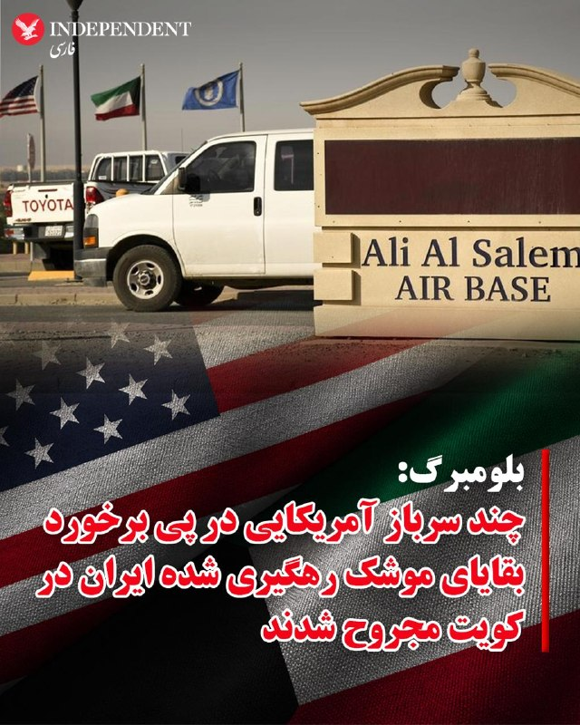

♦️رسانه بلومبرگ، روز شنبه نهم خرداد ماه، به نقل از یک منبع آگاه گزارش داد در جریان حمله موشکی جمهوری اسلامی ایران به یک پایگاه هوایی در کویت، چند «شهروند آمریکایی» دچار جراحات جزئی شده و دو فروند پهپاد تهاجمی «ام‌کیو-۹ ریپر» نیز به شدت آسیب دیده‌اند.
بر اساس این گزارش، سامانه‌های پدافند هوایی کویت موفق شدند یک فروند موشک بالستیک «فاتح-۱۱۰» را رهگیری کنند، اما بقایای موشک پس از رهگیری به پایگاه هوایی «علی السالم» اصابت کرد.
وزارت امور خارجه کویت، پنجشنبه گذشته و ساعاتی پس از تبادل آتش سنگین میان نیروهای مسلح ایران و نظامیان ارتش آمریکا در منطقه خلیج فارس، از حملات موشکی و پهپادی جمهوری اسلامی به خاک این کشور خبر داده بود.
سپاه پاسداران جمهوری اسلامی ایران نیز بامداد پنجشنبه در بیانیه‌ای اعلام کرد بود، در پاسخ به حمله موشکی آمریکا به نزدیکی فرودگاه بندرعباس، «مبداء این حمله» را هدف قرار داده است. سپاه در این بیانیه از کویت نامی نبرد.
مقام‌های کویت و آمریکا تاکنون به طور رسمی جزئیاتی درباره شمار مجروحان یا میزان خسارت‌های وارد شده منتشر نکرده‌اند.
‌🇸🇦 Indypersian

🤖 @VahidOOnLine

## VahidOOnLine — post 242885

  <a href="telegram/content/VahidOOnLine_242885_1780126394.mp4" target="_blank">🎬 Download video</a>

ویدیوی رسیده به ایران اینترنشنال نشان می‌دهد خودروهای حامیان حکومت در مسیر چالوس به رامسر در استان مازندران با حمل پرچم‌های حزب‌الله و جمهوری اسلامی برای تردد مردم در یکی از خطوط جاده آزار ترافیکی ایجاد کردند.
‌🏁 🇬🇧 IranintlTV

🤖 @VahidOOnLine

## VahidOOnLine — post 242884

  <a href="telegram/content/VahidOOnLine_242884_1780126396.mp4" target="_blank">🎬 Download video</a>

♦️مارک کارنی، نخست وزیر کانادا، روز شنبه نهم خرداد در اتاوا با وانگ یی، وزیر امور خارجه چین دیدار کرد.

این دیدار نخستین گام در تنش‌زدایی در روابط کانادا با چین، پس از یک دهه مناسبات سرد دیپلماتیک و در اوج تشدید رقابت‌ها میان پکن و واشنگتن به شمار می‌رود.
کانادا از زمان به‌قدرت رسیدن مارک کارنی در انتخابات سال گذشته و در واکنش به درخواست‌های ترامپ برای الحاق این کشور به آمریکا و افزایش تعرفه‌ها، سیاستی دوری از همسایه قدرتمند خود را در پیش گرفته است.
‌🇸🇦 Indypersian

🤖 @VahidOOnLine

## VahidOOnLine — post 242883

  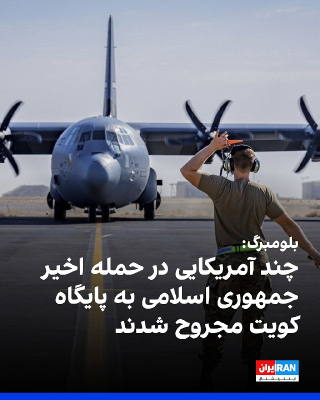

بر اساس گزارش بلومبرگ، حمله موشک بالستیک جمهوری اسلامی به یک پایگاه هوایی در کویت طی ۲۴ ساعت گذشته، باعث جراحات سطحی چند آمریکایی شد و به دو پهپاد تهاجمی «ام‌کیو-۹ ریپر» آسیب جدی وارد کرد؛ این در حالی است که دونالد ترامپ، رییس‌جمهور آمریکا، در حال بررسی توافقی برای تمدید یک آتش‌بس شکننده است.

به گفته یک منبع آگاه از جزئیات آسیب‌های این حمله، حدود ۵ نفر، شامل پیمانکاران و پرسنل نظامی در حال خدمت، دچار جراحات شدند. یکی از پهپادهای ریپر منهدم شده و دست‌کم یک پهپاد دیگر آسیب جدی دیده است. ارزش هر یک از این پهپادها حدود ۳۰ میلیون دلار برآورد می‌شود.

ستاد فرماندهی مرکزی ایالات متحده (سنتکام) تاکنون به درخواست‌ها برای اظهارنظر در این باره پاسخی نداده است.
‌🏁 🇬🇧 IranintlTV

🤖 @VahidOOnLine

## VahidOOnLine — post 242882

  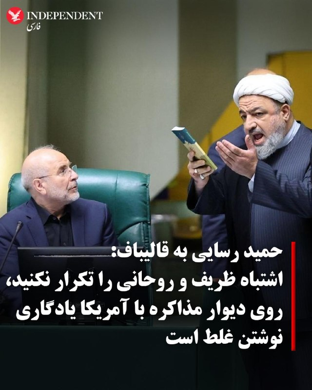

♦️حمید رسایی، نماینده مجلس شورای اسلامی و عضو جبهه پایداری، روز شنبه نهم خرداد به محمدباقر قالیباف، رئیس مجلس و مذاکره‌کننده ارشد جمهوری اسلامی هشدار داد اشتباه محمد جواد ظریف و حسن روحانی در مذاکره با آمریکا را تکرار نکند.

رسایی در واکنش به پیام روز گذشته قالیباف درباره «بی‌اعتمادی به آمریکا» و «گرفتن امتیاز با موشک‌ها و نه با مذاکره» نوشت: «موضع امروز شما درباره اینکه هیچ اعتمادی به تضمین‌ها و حرف‌های طرف آمریکایی نیست و امتیازات را نه با گفتگو که با موشک می‌گیرید، قابل تقدیر است اما مشکلش اینجاست که همچنان بر پایه انجام مذاکره و توافق با آمریکا سوار است و تاکید دارد.»

این عضو جبهه پایداری در همین پیام ادامه به پیشروی ارتش اسرائیل در جنوب لبنان و آزاد نشدن دارایی‌های بلوکه شده ایران را نقض پیش‌شرط‌های جمهوری اسلامی در مذاکرات با واشنگتن توصیف کرد و نوشت: «موضع یک ماه و نیم قبل خودتان را هم به یاد دارید؟ قبل از شروع مذاکرات پاکستان، وقتی هرگونه مذاکره با آمریکایی‌ها را مشروط به تحقق دو مسأله دانستید: آتش‌بس در لبنان و بازگشت دارایی‌های بلوکه شده. پولی که برنگشت، وضعیت لبنان را هم حتما شنیده‌اید.»

رسایی با یادآوری سرنوشت «برجام» و ابراز ناامیدی از دستیابی به توافق با آمریکا به مذاکره‌کننده ارشد جمهوری اسلامی هشدار داد: «آقای قالیباف، روی دیوار مذاکره با آمریکا، یادگیری نوشتن غلط است. امید بستن به آن هم غلط است. ظریف و روحانی که تازه خدای باج‌دادن و وادادگی در مذاکره بودند هم یک پر کاه از طریق مذاکرات نگرفتند. اشتباه را تکرار نکنید.»
‌🇸🇦 Indypersian

🤖 @VahidOOnLine

## VahidOOnLine — post 242881

  

سنتکام، ستاد فرماندهی مرکزی آمریکا، شنبه نهم خرداد تصویری از گشت‌زنی یک فروند جنگنده اف-۱۶ نیروی هوایی ایالات متحده بر فراز خاورمیانه در شبکه ایکس منتشر کرد.
سنتکام در توضیح این تصویر نوشت: «نیروهای آمریکایی در سراسر منطقه حضور دارند و هوشیار هستند.»
‌🏁 🇬🇧 IranintlTV

🤖 @VahidOOnLine

## VahidOOnLine — post 242880

  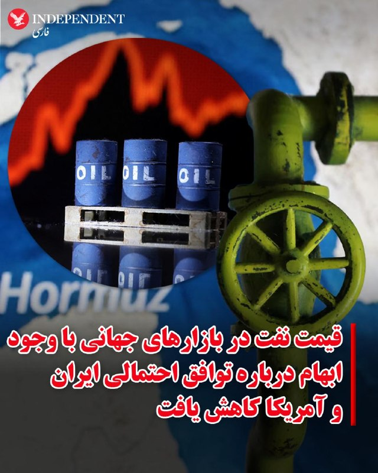

♦️قیمت نفت دربازارهای جهانی صبح شنبه نهم خردادماه با وجود روشن نبودن وضعیت توافق احتمالی میان جمهوری اسلامی ایران و ایالات متحده آمریکا، برای دومین روز پیاپی کاهش یافت.

بهای هر بشکه نفت خام برنت دریای شمال، قیمت معیار نفت، برای تحویل در ماه اوت، پس از بسته شدن بازارهای آمریکایی در آخرین روز کاری هفته، با ۱.۷ درصد کاهش نسبت به روز قبل به ۹۱.۱۲ دلار کاهش یافت.

روند کاهش قیمت نفت خام پس از پیام دونالد ترامپ درباره بازگشایی قریب‌الوقوع تنگه هرمز و خروج کشتی‌های گرفتار در خلیج فارس از سه ماه پیش، شدت گرفت. با وجود آنکه رئیس جمهوری آمریکا هنوز تصمیم قطعی خود درباره توافق پایان جنگ را اعلام نکرده است، بازارهای جهانی با خوشبینی منتظر بازگشایی تنگه هرمز هستند.
‌🇸🇦 Indypersian

🤖 @VahidOOnLine

## VahidOOnLine — post 242879

  <a href="telegram/content/VahidOOnLine_242879_1780126400.mp4" target="_blank">🎬 Download video</a>

♦️در آستانه جام جهانی ۲۰۲۶، تدابیر امنیتی در اطراف محل استقرار تیم ملی فوتبال ایران در شهر تیخوانای مکزیک افزایش یافته است.
به گزارش خبرگزاری فرانسه، کارلوس والدورده، مدیر اجرایی گروه کالینته، مالک باشگاه تیخوانا (شولوس)، اعلام کرد پس از آنکه فیفا با انتقال محل اردو و استقرار تیم ایران از توسانِ آریزونا به مکزیک موافقت کرد، مقامات تصمیم به تقویت تدابیر امنیتی گرفتند.
کلودیا شینباوم، رئیس جمهوری مکزیک دوشنبه گذشته از موافقت کشورش با درخواست آمریکا، برای اقامت کاروان تیم‌ملی فوتبال مردان ایران در مکزیک خبر داده بود.

پیشتر دکتر جمشید ایرانی، وکیل دیوان عالی آمریکا، از صدور «مجوز موقت و مشروط برای ورود» (Parole) به بازیکنان تیم ملی فوتبال ایران خبر داد.
 این وکیل در پیامی که در صفحه فیسبوک خود به اشتراک گذاشت، با اشاره به تحقیق و پی بردن به تصمیم واشنگتن در قبال کاروان ورزشی ایران توضیح داد که وزارت امور خارجه آمریکا برای اعضای تیم ملی «ویزای معمولی» صادر نخواهد کرد، بلکه ورود آن‌ها به خاک این کشور در قالب این طرح مشروط خواهد بود که امتیازات ویزای عادی را ندارد.
این تحولات درحالی رخ می‌دهد که تا روز جمعه هشتم خرداد ماه، وضعیت ویزای اعضای تیم ملی فوتبال مردان جمهوری اسلامی ایران، در کمتر از دو هفته به آغاز جام جهانی، با ابهاماتی روبه‌رو بود.
‌🇸🇦 Indypersian

🤖 @VahidOOnLine

## VahidOOnLine — post 242878

  

حمید رسایی، عضو مجلس جمهوری اسلامی، در کانال تلگرامی خود خطاب به قالیباف نوشت: «روی دیوار مذاکره با آمریکا، یادگاری نوشتن غلط است. امید بستن به آن هم غلط است. ظریف و روحانی که تازه خدای باج‌دادن و وادادگی در مذاکره بودند هم یک پر کاه از طریق مذاکرات نگرفتند. اشتباه را تکرار نکنید.»
او افزود: «موضع یک ماه و نیم قبل خودتان را هم به یاد دارید؟ قبل از شروع مذاکرات پاکستان، وقتی هرگونه مذاکره با آمریکایی‌ها را مشروط به تحقق دو مسئله دانستید، یعنی آتش‌بس در لبنان و بازگشت دارایی‌های بلوکه شده. پولی که برنگشت، وضعیت لبنان را هم حتما شنیده‌اید. قلعه شقیف و روستای ارنون لبنان سقوط کرد. استان نبطیه و منطقه اقلیم التفاح هم در معرض خطر سقوط هستند.»

‌🏁 🇬🇧 IranintlTV

🤖 @VahidOOnLine

## VahidOOnLine — post 242875

  

البریج کولبی، معاون وزیر جنگ آمریکا، با اشاره به نشست جمعه هیات‌های نظامی اسرائیل و لبنان در پنتاگون برای تعیین مسیر امنیتی حمایت از مذاکرات صلح جاری بین این دو کشور، این نشست را سازنده خواند.
او گفت: «ما مذاکرات نظامی سازنده‌ای داشتیم که مسیر سیاسی به رهبری وزارت خارجه [آمریکا] را در هفته آینده شکل خواهد داد.»
کولبی افزود وزارت جنگ آمریکا «از حاکمیت و تمامیت ارضی لبنان، بدون بازیگران مسلح غیردولتی» و همچنین «تلاش‌های تاریخی برای تحقق چشم‌انداز ترامپ برای صلح» استقبال می‌کند.

‌🏁 🇬🇧 IranintlTV

🤖 @VahidOOnLine

## VahidOOnLine — post 242874

  

آسوشیتدپرس گزارش داد که توافق در حال شکل‌گیری میان آمریکا و جمهوری اسلامی برای پایان دادن به جنگ، با انتقاد شدید بخشی از جمهوری‌خواهان مواجه شده است؛ منتقدانی که هشدار می‌دهند این توافق ممکن است بدون از بین بردن توان هسته‌ای ایران، دستاوردهای نظامی ماه‌های گذشته را از بین ببرد.
به گزارش آسوشیتدپرس، در حالی که دولت ترامپ از نزدیک شدن به چارچوب یک توافق با حکومت ایران خبر می‌دهد، شماری از چهره‌های حزب جمهوری‌خواه این توافق را مورد انتقاد قرار داده و آن را عقب‌نشینی از اهداف اعلام‌شده آمریکا در جنگ با جمهوری اسلامی توصیف کرده‌اند.
بر اساس گزارش ای‌پی، توافقی که هنوز نهایی نشده است، شامل تمدید آتش‌بس، بازگشایی تنگه هرمز و آغاز مذاکرات جدید درباره برنامه هسته‌ای ایران است. در مقابل، حکومت ایران باید مسیر عبور کشتی‌ها از تنگه هرمز را باز نگه دارد و درباره سرنوشت ذخایر اورانیوم غنی‌شده خود وارد مذاکرات تکمیلی شود.
با این حال، منتقدان جمهوری‌خواه ترامپ می‌گویند این چارچوب ممکن است به حکومت ایران فرصت دهد بدون برچیدن کامل برنامه هسته‌ای خود، از کاهش فشارهای اقتصادی و سیاسی بهره‌مند شود.
ادامه مطلب را اینجا بخوانید:
h
‌🏁 🇬🇧 IranintlTV

🤖 @VahidOOnLine

## VahidOOnLine — post 242873

  

نیکی هیلی، سفیر پیشین آمریکا در سازمان ملل، با هشدار درباره سیاست وقت‌کشی جمهوری اسلامی در مذاکرات، در ایکس نوشت: « تا زمانی که به مواد هسته‌ای آنها دسترسی کامل و کنترل داشته باشیم، ما نباید دارایی‌ها را آزاد کنیم یا تحریم‌ها را لغو کنیم.»
او گفت: «حکومت ایران هرگز بر اساس حسن نیت عمل نکرده است. همیشه همان بازی را ادامه می‌دهد: وقت‌کشی، خریدن زمان، تغییر موضع.»

‌🏁 🇬🇧 IranintlTV

🤖 @VahidOOnLine

## WithYashar — post 12925

نتانیاهو خطاب به لبنان : درخواست اتش بس دولت شمارو رد میکنیم
باید بگم که اسرائیل تا نابودی کامل حزب الله ادامه خواهد داد
@withyashar

## WithYashar — post 12924

کاخ سفید به الجزیره گفت:

ترامپ تا زمانی که خواسته‌های آمریکا برآورده نشود، توافقی نخواهد کرد و ایران هرگز به سلاح هسته‌ای دست نخواهد یافت
@withyashar

## WithYashar — post 12923

  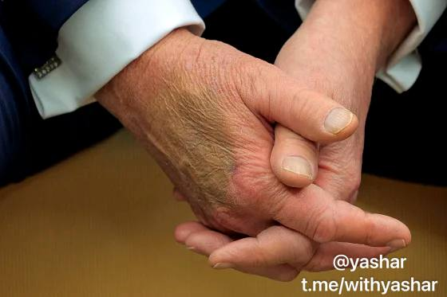

پزشک ترامپ: «دست دادن مکرر»، علت کبودی دست‌های رئیس‌جمهور آمریکا است

این یک اثر شایع و خوش‌خیم است
@withyashar

## mwarmonitor — post 9908

  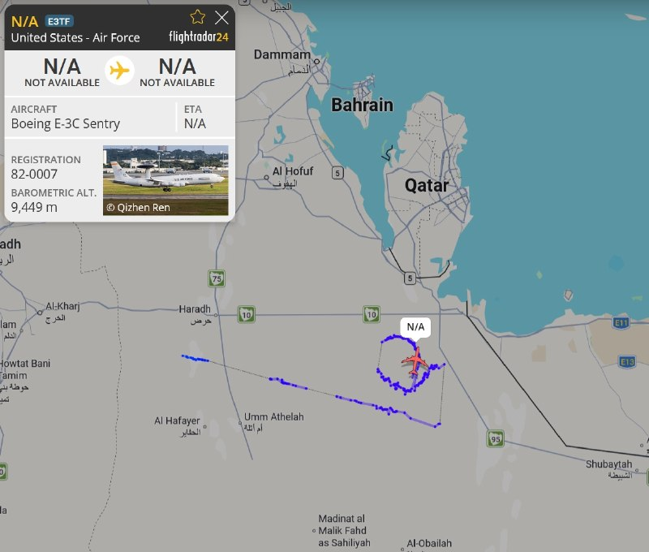

✈️یک فروند هواپیمای هشدار زودهنگام (آواکس) Boeing E-3C Sentry متعلق به نیروی هوایی آمریکا، در حال گشت‌زنی و پرواز دایره‌ای در حریم هوایی شرق عربستان سعودی (نزدیکی مرز قطر و امارات) در ارتفاع ۹,۴۴۹ متری رصد شد.

@mwarmonitor

## pm_afshaa — post 91882

🔴اسرائیل هیوم: مقام‌های موساد معتقدند عملیات‌های اخیر علیه ایران فقط یک مرحله در مسیر سقوط جمهوری اسلامی بوده است. رئیس پیشین شاخه نفوذ گفت این واحد اکنون با شدت بیشتری فعالیت می‌کند و هدف آن سریع‌تر کردن ساعت شنی پایان حکومت است

💧 Rainbet.com the #1 Non-KYC Crypto Casino & Sportsbook @rainbetcom

😁 @Pm_Afshaa

## pm_afshaa — post 91881

🔴سنت‌کام:تمام شناورهای نظامی ایرانی که در فعالیت‌های نظامی شرکت دارند هدف قرار خواهند گرفت

💧 Rainbet.com the #1 Non-KYC Crypto Casino & Sportsbook @rainbetcom

😁 @Pm_Afshaa

## pm_afshaa — post 91880

🔴سی‌ان‌ان: اسرائیلی‌ها می‌گویند ترامپ در جنگ با ایران، ما را زیر اتوبوس انداخته

+نتانیاهو، کوشنر و ویتکاف را به خاطر هدایت رئیس‌جمهور آمریکا به سمت پایان دادن به درگیری‌ها، سرزنش می‌کند

💧 Rainbet.com the #1 Non-KYC Crypto Casino & Sportsbook @rainbetcom

😁 @Pm_Afshaa

## pm_afshaa — post 91879

🔴نتانیاهو خطاب به لبنان : درخواست اتش بس دولت شمارو رد میکنیم
باید بگم که اسرائیل تا نابودی کامل حزب الله ادامه خواهد داد

💧 Rainbet.com the #1 Non-KYC Crypto Casino & Sportsbook @rainbetcom

😁 @Pm_Afshaa

## pm_afshaa — post 91878

🔴پیت هگست وزیر جنگ آمریکا:ایران بهتره زودتر انتخاب کنه یا مذاکره هسته ای یا جنگ با آمریکا , ایندفه نه بلکه از روی آسمان و دریا از روی زمین هم باید با ما روبرو بشن

💧 Rainbet.com the #1 Non-KYC Crypto Casino & Sportsbook @rainbetcom

😁 @Pm_Afshaa

## mamlekate — post 103604

📝 قطر اعلام کرده پول نقد نمیده به نظام، خط اعتباری باز میکنه براشون هر چی میخوان بخرن :))

- عراقی و لبنانی دلار میخواد، ارزشی نیست که با مرغ کپنی بشه نگهش داشت.

- قبلا کشورهای حاشیه خلیج‌فارس می‌گفتند، نظام موشکش را میسازد فرو میکند در کون آمریکا، مشکل ما نیست، مدارا میکنیم، نظام در وقایع اخیر ثابت کرد چون تفنگدار مست عمل میکند. کسی تفنگ چنین موجودی را پر نمیکند
خصوصا قطر و امارات که با نظام خیلی راه‌آمدند.

tired_phantom
@mamlekate

## mamlekate — post 103603

  <a href="telegram/content/mamlekate_103603_1780126406.mp4" target="_blank">🎬 Download video</a>

📝 کاخ سفید: ترامپ تنها توافقی را خواهد پذیرفت که خواسته‌های اصلی او را برآورده کند

کاخ سفید در پی جلسه دونالد ترامپ با مشاورانش برای تمدید آتش‌بس با ایران و اتخاذ تصمیم نهایی می‌گوید که او تنها توافقی را خواهد پذیرفت که خواسته‌های اصلی‌اش را برآورده کند. پیشتر آقای ترامپ گفت که توافق با ایران باید شامل تعهد به عدم دستیابی به سلاح هسته‌ای، باز کردن تنگه هرمز بدون دریافت عوارض، مین‌روبی کامل این آبراه و خارج‌سازی ذخایر اورانیوم ‌غنی‌شده با همکاری آمریکا و تحت نظارت آژانس و نابودی این مواد است. او تاکید کرد که «تا اطلاع ثانوی هیچ پولی رد و بدل نخواهد شد.» سخنگوی وزارت خارجه ایران هم اعلام کرد که هنوز هیچ توافقی با آمریکا نهایی نشده است.

📝 اسکات بسنت: املاک مقامات رژیم در اروپا توقیف می‌شود

اسکات بسنت، وزیر خزانه‌داری آمریکا روز جمعه ۸ خرداد گفت ایالات متحده با همکاری شرکای اروپایی در حال پیدا کردن و توقیف «ویلاها، خانه‌ها و املاک» مقامات جمهوری اسلامی در اروپا است. آقای بسنت این سخنان را در «مجمع ملی اقتصادی ریگان ۲۰۲۶» بیان کرد.

📝 پاداش تا سقف ۱۵ میلیون دلار برای اطلاعات دربارهٔ شبکه‌های مالی سپاه

برنامه «پاداش برای عدالت» وزارت امور خارجه آمریکا روز جمعه ۸ خرداد اعلام کرد «هر فردی که درباره شبکه‌های مالی سپاه پاسداران انقلاب اسلامی اطلاعاتی ارائه کند، می‌تواند تا سقف ۱۵ میلیون دلار پاداش دریافت کند.»

@mamlekate

## VahidOnline — post 75800

  

ان‌بی‌سی به نقل از سه منبع آگاه گزارش داد جنگنده اف-۱۵ای آمریکا که ماه گذشته در ایران سرنگون شد، احتمالا با یک موشک دوش‌پرتاب ساخت چین هدف قرار گرفته است.

به گفته یکی از این منابع و یک مقام آمریکایی آگاه، چین همچنین ممکن است در روزهای نخست درگیری، یک رادار هشداردهنده دوربرد را در اختیار ایران قرار داده باشد که این رادار توانایی شناسایی هواپیماهای رادارگریز را دارد.

ان‌بی‌سی نوشت مقام‌های آمریکایی همچنان در حال بررسی سرنگونی جنگنده اف-۱۵ای هستند و هنوز روشن نیست تجهیزات نظامی احتمالی چه زمانی به تهران تحویل داده شده است.

کاخ سفید به ان‌بی‌سی گفت شی جین‌پینگ به ترامپ اطمینان داده پکن تجهیزات نظامی به ایران نمی‌دهد. سخنگوی سفارت چین در واشینگتن نیز گفت پکن صادرات نظامی را «با احتیاط و مسئولیت‌پذیری» کنترل می‌کند و با «تهمت بی‌اساس» مخالف است.
@VahidOOnLine

📡 @VahidOnline

## IranIntlTV — post 339702

  <a href="telegram/content/IranIntlTV_339702_1780126407.mp4" target="_blank">🎬 Download video</a>

ویدیوهایی که به تازگی و پس از وصل‌شدن نسبی اینترنت به ایران اینترنشنال رسیده نشان می‌دهد یک شهروند در روزهای جنگ جمهوری اسلامی با آمریکا و اسرائیل در محله نارمک تهران شعار «جاوید شاه» را دیوارنویسی کرد.

## IranIntlTV — post 339701

  <a href="telegram/content/IranIntlTV_339701_1780126408.mp4" target="_blank">🎬 Download video</a>

یک منبع آگاه از روند مذاکرات تهران و واشینگتن به ایران‌اینترنشنال گفت سفر هیئت عالی‌رتبه ایرانی به ریاست محمدباقر قالیباف به دوحه با یک «ناکامی بزرگ دیپلماتیک برای جمهوری اسلامی» پایان یافت. به گفته این منبع، با وجود اصرار تهران بر آزادسازی فوری ۱۲ میلیارد دلار از دارایی‌های مسدودشده، مقام‌های قطری این درخواست را رد و تنها با آزادسازی ۶ میلیارد دلار در قالب یک خط اعتباری محدود برای خرید کالاهای اساسی از بازار قطر موافقت کردند.

گفت‌وگو با علی شیرازی، عضو تحریریه ایران‌اینترنشنال
@iranintltv

## IranIntlTV — post 339700

  <a href="telegram/content/IranIntlTV_339700_1780126410.mp4" target="_blank">🎬 Download video</a>

نهاد ناظر مالی کانادا نسبت به افزایش جرایمی مانند قاچاق انسان و بهره‌کشی از نیروی کار هم‌زمان با برگزاری جام جهانی ۲۰۲۶ هشدار داد. این نهاد اعلام کرد شبکه‌های مجرمانه ممکن است با سوءاستفاده از ورود صدها هزار مسافر و افزایش تقاضا برای خدمات مختلف، فعالیت خود را در زمینه بهره‌کشی جنسی و کار اجباری گسترش دهند.

گزارش مهسا مرتضوی، خبرنگار ایران‌اینترنشنال
@iranintltv

## IranIntlTV — post 339699

  <a href="telegram/content/IranIntlTV_339699_1780126411.mp4" target="_blank">🎬 Download video</a>

وزارت خزانه‌داری آمریکا اعلام کرد ارزش دارایی‌های رمزارزی مرتبط با جمهوری اسلامی که در چارچوب تحریم‌های واشینگتن مسدود شده‌اند، به یک میلیارد دلار رسیده است.

نیلوفر منصوری، خبرنگار ایران‌اینترنشنال، گزارش می‌دهد
@iranintltv

## IranIntlTV — post 339698

  <a href="telegram/content/IranIntlTV_339698_1780126412.mp4" target="_blank">🎬 Download video</a>

جاویدنامان انقلاب ملی ایرانیان
«سیما موسوی» در شامگاه ۱۹ دی‌ماه جان خود را فدای مردم معترض کرد. نامش در حافظه‌ این سرزمین می‌ماند و یادش چراغ راه آزادی‌خواهان است.
@iranintltv

## IranIntlTV — post 339697

  <a href="telegram/content/IranIntlTV_339697_1780126413.mp4" target="_blank">🎬 Download video</a>

ویدیوی رسیده به ایران اینترنشنال نشان می‌دهد خودروهای حامیان حکومت در مسیر چالوس به رامسر در استان مازندران با حمل پرچم‌های حزب‌الله و جمهوری اسلامی برای تردد مردم در یکی از خطوط جاده آزار ترافیکی ایجاد کردند.

## IranIntlTV — post 339696

  

بر اساس گزارش بلومبرگ، حمله موشک بالستیک جمهوری اسلامی به یک پایگاه هوایی در کویت طی ۲۴ ساعت گذشته، باعث جراحات سطحی چند آمریکایی شد و به دو پهپاد تهاجمی «ام‌کیو-۹ ریپر» آسیب جدی وارد کرد؛ این در حالی است که دونالد ترامپ، رییس‌جمهور آمریکا، در حال بررسی توافقی برای تمدید یک آتش‌بس شکننده است.

به گفته یک منبع آگاه از جزئیات آسیب‌های این حمله، حدود ۵ نفر، شامل پیمانکاران و پرسنل نظامی در حال خدمت، دچار جراحات شدند. یکی از پهپادهای ریپر منهدم شده و دست‌کم یک پهپاد دیگر آسیب جدی دیده است. ارزش هر یک از این پهپادها حدود ۳۰ میلیون دلار برآورد می‌شود.

ستاد فرماندهی مرکزی ایالات متحده (سنتکام) تاکنون به درخواست‌ها برای اظهارنظر در این باره پاسخی نداده است.
https://iranintl.com/202605309688

## IranIntlTV — post 339695

  <a href="https://t.me/IranintlTV/339695" target="_blank">📎 Download file</a>

🎧نسخه صوتی اخبار بامدادی | شنبه ۹ خرداد
@iranintlTV

## IranIntlTV — post 339694

  <a href="telegram/content/IranIntlTV_339694_1780126416.mp4" target="_blank">🎬 Download video</a>

آرام حسامی، استاد علوم سیاسی کالج مونتگومری، گفت اکنون جمهوری اسلامی و آمریکا بیش از هر زمان دیگری در ۹ سال گذشته به دستیابی به یک توافق نزدیک شده‌اند.
@iranintltv

## IranIntlTV — post 339692

  <a href="telegram/content/IranIntlTV_339692_1780126418.mp4" target="_blank">🎬 Download video</a>

رضا گوهرزاد، روزنامه‌نگار و تحلیل‌گر سیاسی، گفت اصرار جمهوری اسلامی بر دریافت مستقیم دارایی‌های بلوکه‌شده از آن روست که می‌خواهد این منابع را صرف پاسخ‌گویی حداقلی به مطالبات گسترده داخلی کند. گوهرزاد افزود، حکومت نگران است که در صورت ناتوانی در کاهش فشارهای اقتصادی و معیشتی، موج نارضایتی‌های عمومی دوباره اوج گیرد و خیابان بار دیگر به صحنه اعتراضات گسترده تبدیل شود.
@iranintltv

## IranIntlTV — post 339691

  <a href="telegram/content/IranIntlTV_339691_1780126419.mp4" target="_blank">🎬 Download video</a>

شورای امنیت سازمان ملل اعلام کرد مقام‌ها و نیروهای طالبان مرتکب خشونت جنسی علیه زنان شده‌اند. در گزارش هیئت معاونت سازمان ملل متحد در افغانستان، یوناما، ۲۱ مورد خشونت جنسی از جمله تجاوز گروهی علیه ۱۵ زن و ۶ دختر در سال گذشته میلادی مستند شده است.

مریم رحمتی، خبرنگار ایران‌اینترنشنال، گزارش می‌دهد
@iranintltv

## IranIntlTV — post 339690

  <a href="telegram/content/IranIntlTV_339690_1780126420.mp4" target="_blank">🎬 Download video</a>

ترکیه به دلیل همسایگی با ایران و بی‌نیازی شهروندان ایرانی از دریافت ویزا، یکی از آسان‌ترین مقاصد خارجی گردشگری برای ایرانیان است. با این حال، آمارهای تازه از افت قابل توجه سفر ایرانیان به این کشور خبر می‌دهد. همچنین سرمایه‌گذاری و خرید مسکن از سوی ایرانی‌ها در ترکیه در سال‌های اخیر روندی نزولی داشته است.

گزارش فرزیا ثابتی، خبرنگار ایران‌اینترنشنال
@iranintltv

## IranIntlTV — post 339689

  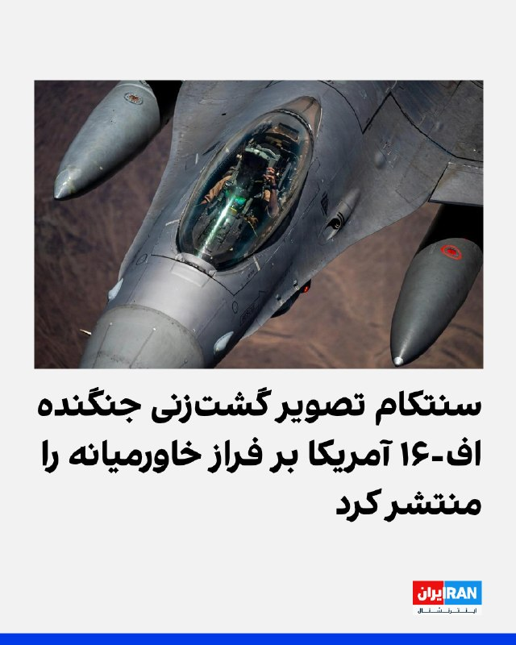

سنتکام، ستاد فرماندهی مرکزی آمریکا، شنبه نهم خرداد تصویری از گشت‌زنی یک فروند جنگنده اف-۱۶ نیروی هوایی ایالات متحده بر فراز خاورمیانه در شبکه ایکس منتشر کرد.
سنتکام در توضیح این تصویر نوشت: «نیروهای آمریکایی در سراسر منطقه حضور دارند و هوشیار هستند.»
https://iranintl.com/202605306939

## IranIntlTV — post 339688

  <a href="telegram/content/IranIntlTV_339688_1780126422.mp4" target="_blank">🎬 Download video</a>

سرخط خبرهای شنبه ۹ خرداد
@iranintltv

## IranIntlTV — post 339686

  

حمید رسایی، عضو مجلس جمهوری اسلامی، در کانال تلگرامی خود خطاب به قالیباف نوشت: «روی دیوار مذاکره با آمریکا، یادگاری نوشتن غلط است. امید بستن به آن هم غلط است. ظریف و روحانی که تازه خدای باج‌دادن و وادادگی در مذاکره بودند هم یک پر کاه از طریق مذاکرات نگرفتند. اشتباه را تکرار نکنید.»
او افزود: «موضع یک ماه و نیم قبل خودتان را هم به یاد دارید؟ قبل از شروع مذاکرات پاکستان، وقتی هرگونه مذاکره با آمریکایی‌ها را مشروط به تحقق دو مسئله دانستید، یعنی آتش‌بس در لبنان و بازگشت دارایی‌های بلوکه شده. پولی که برنگشت، وضعیت لبنان را هم حتما شنیده‌اید. قلعه شقیف و روستای ارنون لبنان سقوط کرد. استان نبطیه و منطقه اقلیم التفاح هم در معرض خطر سقوط هستند.»

https://iranintl.com/202605302857

## IranIntlTV — post 339684

  

البریج کولبی، معاون وزیر جنگ آمریکا، با اشاره به نشست جمعه هیات‌های نظامی اسرائیل و لبنان در پنتاگون برای تعیین مسیر امنیتی حمایت از مذاکرات صلح جاری بین این دو کشور، این نشست را سازنده خواند.
او گفت: «ما مذاکرات نظامی سازنده‌ای داشتیم که مسیر سیاسی به رهبری وزارت خارجه [آمریکا] را در هفته آینده شکل خواهد داد.»
کولبی افزود وزارت جنگ آمریکا «از حاکمیت و تمامیت ارضی لبنان، بدون بازیگران مسلح غیردولتی» و همچنین «تلاش‌های تاریخی برای تحقق چشم‌انداز ترامپ برای صلح» استقبال می‌کند.

https://iranintl.com/202605303267

## IranIntlTV — post 339683

  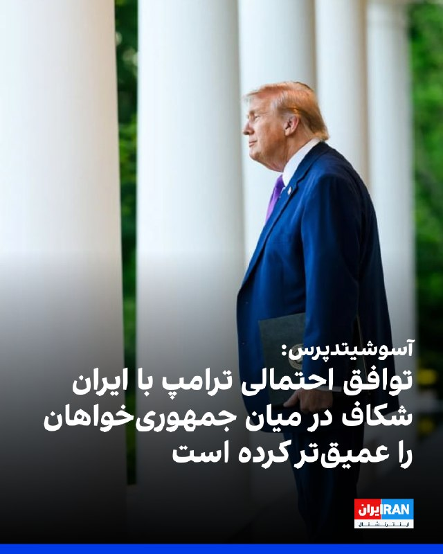

آسوشیتدپرس گزارش داد که توافق در حال شکل‌گیری میان آمریکا و جمهوری اسلامی برای پایان دادن به جنگ، با انتقاد شدید بخشی از جمهوری‌خواهان مواجه شده است؛ منتقدانی که هشدار می‌دهند این توافق ممکن است بدون از بین بردن توان هسته‌ای ایران، دستاوردهای نظامی ماه‌های گذشته را از بین ببرد.
به گزارش آسوشیتدپرس، در حالی که دولت ترامپ از نزدیک شدن به چارچوب یک توافق با حکومت ایران خبر می‌دهد، شماری از چهره‌های حزب جمهوری‌خواه این توافق را مورد انتقاد قرار داده و آن را عقب‌نشینی از اهداف اعلام‌شده آمریکا در جنگ با جمهوری اسلامی توصیف کرده‌اند.
بر اساس گزارش ای‌پی، توافقی که هنوز نهایی نشده است، شامل تمدید آتش‌بس، بازگشایی تنگه هرمز و آغاز مذاکرات جدید درباره برنامه هسته‌ای ایران است. در مقابل، حکومت ایران باید مسیر عبور کشتی‌ها از تنگه هرمز را باز نگه دارد و درباره سرنوشت ذخایر اورانیوم غنی‌شده خود وارد مذاکرات تکمیلی شود.
با این حال، منتقدان جمهوری‌خواه ترامپ می‌گویند این چارچوب ممکن است به حکومت ایران فرصت دهد بدون برچیدن کامل برنامه هسته‌ای خود، از کاهش فشارهای اقتصادی و سیاسی بهره‌مند شود.
ادامه مطلب را اینجا بخوانید:
h

## IranIntlTV — post 339682

  

نیکی هیلی، سفیر پیشین آمریکا در سازمان ملل، با هشدار درباره سیاست وقت‌کشی جمهوری اسلامی در مذاکرات، در ایکس نوشت: « تا زمانی که به مواد هسته‌ای آنها دسترسی کامل و کنترل داشته باشیم، ما نباید دارایی‌ها را آزاد کنیم یا تحریم‌ها را لغو کنیم.»
او گفت: «حکومت ایران هرگز بر اساس حسن نیت عمل نکرده است. همیشه همان بازی را ادامه می‌دهد: وقت‌کشی، خریدن زمان، تغییر موضع.»

https://iranintl.com/202605304244

## Shin_Persian — post 6318

  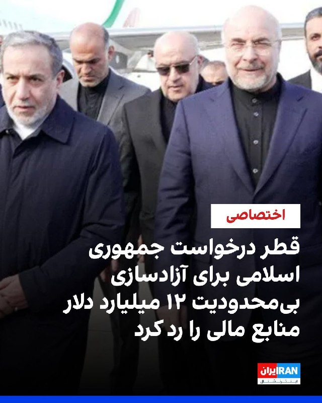

ايران اينترنشنال ✓ @IranIntl Sat, 30 May 2026 00:17:43 UTC یک منبع آگاه از روند مذاکرات به ایران‌اینترنشنال گفت سفر قالیباف به قطر به شکستی دیپلماتیک منجر شد و با وجود درخواست تهران برای آزادسازی فوری و بی‌قید و شرط ۱۲ میلیارد دلار به صورت نقدی همزمان با…

## Shin_Persian — post 6317

ايران اينترنشنال ✓ @IranIntl
Sat, 30 May 2026 00:17:43 UTC

یک منبع آگاه از روند مذاکرات به ایران‌اینترنشنال گفت سفر قالیباف به قطر به شکستی دیپلماتیک منجر شد و با وجود درخواست تهران برای آزادسازی فوری و بی‌قید و شرط ۱۲ میلیارد دلار به صورت نقدی همزمان با امضای یک یادداشت تفاهم اولیه با آمریکا، مقام‌های قطری این درخواست را رد کردند.
به گفته این منبع، مقام‌های قطری تنها با آزادسازی نیمی از این مبلغ تحت محدودیت‌های سخت‌گیرانه موافقت کردند.
بر اساس گفته‌های یک منبع نزدیک به یک مقام قطری حاضر در این گفت‌وگوها، دوحه از انتقال مستقیم یا نقدی این منابع به ایران خودداری کرده است. در عوض، این پول تنها به صورت اعتبار در اختیار تهران قرار می‌گیرد تا کالاها و محصولات اساسی را مستقیما از قطر خریداری کند.
این محدودیت در شرایطی اعمال شده که آمریکا به شدت با اعطای دسترسی مستقیم و بدون محدودیت جمهوری اسلامی به دارایی‌های نقدی مخالفت کرده است.
آمریکا ابراز نگرانی کرده است که تزریق مستقیم پول نقد می‌تواند برای تهران فضای تنفسی اقتصادی حیاتی ایجاد کند و به آن اجازه دهد حقوق‌های معوقه بخش عمومی را پرداخت کرده و در دوره‌ای از تنش شدید منطقه‌ای، تجهیزات نظامی را از کشورهای دیگر تامین کند.
https://iranintl.com/202605298848

English

An informed source on the negotiation process told Iran International that Ghalibaf’s trip to Qatar resulted in a diplomatic failure. Despite Tehran's request for the immediate and unconditional release of $12 billion in cash simultaneously with the signing of an initial memorandum of understanding with the United States, Qatari officials rejected the demand.

According to this source, Qatari officials agreed to the release of only half of this amount under strict restrictions.

Based on statements from a source close to a Qatari official present in these talks, Doha has refused the direct or cash transfer of these funds to Iran. Instead, this money will only be made available to Tehran as credit to purchase essential goods and products directly from Qatar.

This restriction has been imposed as the United States strongly opposes granting the Islamic Republic direct and unrestricted access to liquid assets.

The U.S. has expressed concern that a direct injection of cash could provide a vital economic lifeline for Tehran, allowing it to pay overdue public sector salaries and procure military equipment from other countries during a period of intense regional tension.

𝕏 · @shin_persian

## FarsiVOA — post 219042

  

دبیرکل صنف کارفرمایان صنعت سیمان ایران از ابلاغیه جدید وزارت نیرو مبنی بر اعمال «محدودیت‌های گسترده» در تأمین برق صنایع سیمان خبر داد.

علی اکبر الوندیان می‌گوید در ماه‌های خرداد و شهریور تنها ۴۰ درصد از برق مورد نیاز تأمین خواهد شد و در تیر و مرداد این میزان به ۱۵ درصد کاهش می‌یابد.

او گفت این میزان محدودیت، در عمل کارخانه‌ها را مجبور به توقف تولید خواهد کرد.

ایران به خاطر عدم تحقق برنامه‌های رشد تولید برق، هر سال با کسری فزاینده برق مواجه می‌شود. دولت در پیک مصرف تابستانی برق صنایع را محدود و برنامه خاموشی‌های بخش خانگی را اعمال می‌کند.
@FarsiVOA

## FarsiVOA — post 219041

🔺مقام قضایی با ادعای «بازدارندگی»، از گسترش توقیف اموال متهمان به «همکاری با دشمن» دفاع کرد

▪️یک مقام قضایی می‌گوید قوه قضائیه در شرایط به ادعای او «جنگ ترکیبی»، فقط به برخورد کیفری بسنده نمی‌کند و با توقیف اموال و اقدامات قضایی، به دنبال «افزایش هزینه همکاری با دشمن» است.

▪️او اضافه کرده توقیف اموال و دارایی‌ها یکی از ابزارهای بازدارنده دستگاه قضایی برای ایجاد بازدارندگی پایدار است.

▪️پس از هشدارها و تهدیدهای مقام‌های قضایی، گزارش‌های رسمی از توقیف اموال صدها نفر حکایت دارد و فقط در چند استان از جمله آذربایجان غربی از توقیف اموال بیش از صد نفر خبر داده شده است.

▪️سخنگوی قوه قضائیه جمهوری اسلامی نیز ۱۹ اردیبهشت اعلام کرد تاکنون ۲۶۲ فقره ملک در کشور توقیف شده است.

⬇️ بیشتر بخوانید:
https://ir.voanews.com/a/8155534.html

## FarsiVOA — post 219040

Farsi VOA pinned an audio file

## FarsiVOA — post 219039

  <a href="https://t.me/farsivoa/219039" target="_blank">📎 Download file</a>

🔴📢‌ پادکست خبری جمعه ۸ خرداد ۱۴۰۵

🛜در صورتی که با مشکل اینترنت مواجه هستید میتوانید اخبار صدای آمریکا را از نسخه‌های پادکست خبری ما به صورت صوتی دنبال کنید و یا اخبار را از نسخه سبک وب‌سایت ما پیگیر باشید:
https://ir.voanews.com/lite

📡بروزترین فرکانسهای ماهواره‌ای را نیز میتوانید از صفحه زیر پیگیری کنید:
https://ir.voanews.com/satellite

🔔دیگر شبکه‌های اجتماعی ما را هم دنبال کنید:
https://linktr.ee/voafarsi

با دوستانتان به اشتراک بگذارید
@farsivoa

## FarsiVOA — post 219038

🔺ارتش اسرائیل از رهگیری چند پرتابه از لبنان و انهدام پرتابگر حزب‌الله خبر داد

▪️ارتش اسرائیل اعلام کرد چند پرتابه شلیک‌شده از لبنان به سمت شمال اسرائیل را رهگیری کرده و یک پرتابه نیز در اطراف کریات شمونا فرود آمده است. بنا بر اعلام ارتش اسرائیل، در این حمله گزارشی از تلفات یا مجروحان منتشر نشده است.

▪️در همین راستا ارتش اسرائیل اعلام کرد یک پرتابگر راکتی را که حزب‌الله در حملات شبانه به شمال اسرائیل از آن استفاده کرده بود، منهدم کرده است.

▪️دور تازه حملات از لبنان به شمال اسرائیل نشان می‌دهد جبهه شمالی، همزمان با مذاکرات سیاسی و امنیتی، همچنان فعال و شکننده مانده است؛ وضعیتی که خطر فروپاشی عملی آتش‌بس و گسترش دوباره جنگ در لبنان را افزایش می‌دهد.

⬇️ بیشتر بخوانید:
https://ir.voanews.com/a/idf-destroyed-rocket-launcher-that-hezbollah-used-to-attack-israel-overnight/8155532.html

## DW_Farsi — post 125305

  

🔶 آمریکا: ارزش رمزارزهای توقیف‌شده ایران به یک میلیارد دلار رسید

اسکات بسنت، وزیر خزانه‌داری ایالات متحده اعلام کرد مجموع دارایی‌های رمزارزی مرتبط با جمهوری اسلامی که تا کنون توسط آمریکا توقیف شده به حدود یک میلیارد دلار رسیده است. او همچنین گفت این رقم مربوط به کل دارایی‌های توقیف‌شده تا امروز است و به یک اقدام واحد محدود نمی‌شود.

بسنت همچنین توضیح داد که این رقم نسبت به آوریل ۲۰۲۶ دو برابر شده است؛ زمانی که میزان دارایی‌های توقیف‌شده حدود ۵۰۰ میلیون دلار اعلام شده بود.

به گفته وزیر خزانه‌داری آمریکا بخشی از این دارایی‌ها شامل ۳۴۴ میلیون دلار تتر (USDT) در شبکه ترون است که در قالب عملیاتی موسوم به "خشم اقتصادی" توقیف شده است.

وزیر خزانه‌داری آمریکا همچنین تاکید کرد این اقدامات با هدف مقابله با شبکه‌های دور زدن تحریم‌ها و مسیرهای مالی مرتبط با جمهوری اسلامی انجام می‌شود.

مقام‌های آمریکایی می‌گویند جمهوری اسلامی از رمزارزها برای دور زدن تحریم‌ها و تامین منابع مالی استفاده کرده است.

جمهوری اسلامی درباره اظهارات وزیر خزانه‌داری آمریکا تا کنون واکنشی نشان نداده است.
@dw_farsi

## DW_Farsi — post 125298

🔶 جام‌های ۱۹۹۸ تا ۲۰۰۶؛ زین‌الدین زیدان؛ ققنوس شماره ۱۰ فرانسه

زین‌الدین زیدان نامی‌ست که در کنار میشل پلاتینی، هرگز از حافظه‌ تاریخی فوتبال فرانسه و جهان پاک نخواهد شد؛ کارگردانی همه‌فن‌حریف و خلاق که در پیراهن شماره‌ی ۱۰، پس از سال‌ها به فوتبال فرانسه روح و جان تازه‌ای بخشید.

📌برای دسترسی کامل به گزارش به وبسایت دویچه‌وله فارسی مراجعه کنید.
@dw_farsi

## DW_Farsi — post 125297

  

🔶 پنتاگون: مذاکرات نظامی میان اسرائیل و لبنان سازنده بود

البریج کولبی، معاون وزیر دفاع (جنگ) آمریکا صبح روز شنبه ۹ خرداد (۳۰ مه) در شبکه اجتماعی ایکس خبر داد مذاکرات نظامی میان اسرائیل و لبنان "سازنده" بوده است.

کولبی اعلام کرد که پنتاگون از هیئت‌های نظامی اسرائیل و لبنان میزبانی کرده و گفت‌وگوهای نظامی "سازنده‌ای" میان طرفین انجام شده که قرار است هفته آینده روند سیاسی تحت هدایت وزارت امور خارجه آمریکا را تکمیل و تقویت کند.

کولبی در ادامه پیام خود همچنین تاکید کرده است که وزارت دفاع آمریکا برای همکاری با نیروهای دفاعی اسرائیل و ارتش لبنان ارزش قائل است و از حاکمیت و تمامیت ارضی لبنان به‌ویژه در شرایطی که این کشور از حضور گروه‌های مسلح غیردولتی رها شده باشد حمایت می‌کند.

حزب‌الله لبنان در مذاکرات با اسرائیل حضور ندارد. این گروه که در فهرست تروریستی بسیاری از کشورها قرار دارد، با آتش‌بسی که میان اسرائیل و لبنان با میانجی‌گری آمریکا برقرار شده و از اواسط آوریل سال جاری اجرایی شده بود، مخالفت کرده است؛ توافقی که از نظر رسمی همچنان پابرجاست.
@dw_farsi

## DW_Farsi — post 125296

  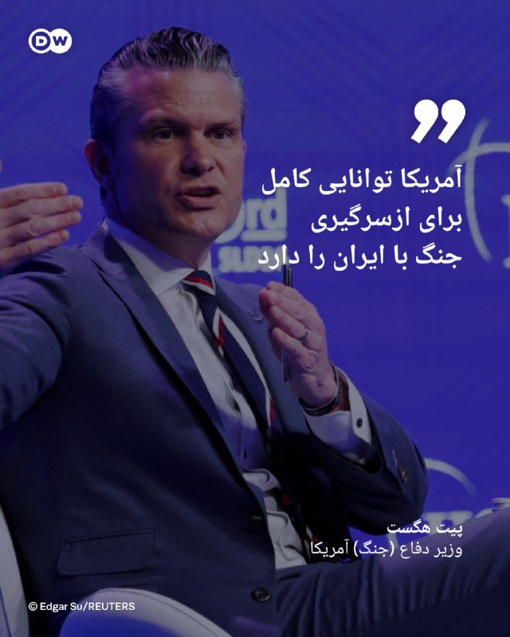

🔶 هگست: آمریکا توانایی کامل برای ازسرگیری جنگ با ایران را دارد

پیت هگست، وزیر دفاع (جنگ) آمریکا شامگاه جمعه ۸ خرداد (۲۹ مه) اعلام کرد ایالات متحده از نظر تسلیحاتی "بیش از نیاز خود ذخایر در اختیار دارد" و در صورت لزوم، توانایی کامل برای از سرگیری جنگ با جمهوری اسلامی را حفظ کرده است.

هگست که در نشست امنیتی سنگاپور صحبت می‌کرد با اشاره به ظرفیت تسلیحاتی ایالات متحده گفت این کشور چه در خاورمیانه و چه در سایر نقاط جهان، از آمادگی نظامی بالایی برخوردار است.

او همچنین افزود که هرگونه توافق با حکومت ایران را "توافقی خوب" می‌داند.
@dw_farsi

## DW_Farsi — post 125295

  

🔶 نشست ترامپ در اتاق وضعیت درباره ایران بدون اعلام نتیجه‌ای پایان یافت

جلسه دونالد ترامپ، رئیس‌ جمهور آمریکا در "اتاق وضعیت" کاخ سفید به منظور "تصمیم‌گیری" نهایی درباره توافق با ایران بدون اعلام نتیجه‌ای پایان یافت.

نشست ترامپ و مشاورانش درباره توافق احتمالی با ایران حدود دو ساعت به طول انجامید. با این حال، پس از پایان این جلسه، رئیس‌ جمهور آمریکا کاخ سفید را بدون اعلام هیچ تصمیم نهایی یا صدور بیانیه رسمی درباره نتیجه مذاکرات ترک کرده است.

منابع خبری می‌گویند گفت‌وگوها در "مرحله بررسی و تبادل مواضع" قرار دارد و اختلافات مهم میان طرفین همچنان پابرجاست.

یک مقام کاخ سفید بعد از جلسه اتاق وضعیت گفته است ترامپ تنها در صورتی یک توافق صلح با حکومت ایران را امضا خواهد کرد که تهران تمامی شروط او را برآورده کند.

این مقام که خواست نامش فاش نشود، در گفت‌وگو با خبرگزاری فرانسه تاکید کرده است که ترامپ فقط توافقی را امضا خواهد کرد که "به نفع آمریکا باشد و خطوط قرمز او را تامین کند". این مقام کاخ سفید همچنین گفته است ایران هرگز نمی‌تواند به سلاح هسته‌ای دست پیدا کند.
@dw_farsi

## Persian_Trend_Official — post 15314

  

🔺🔻هشدار فوری ارتش اسرائیل به ساکنان مناطق جنوب لبنان

ارتش اسرائیل با انتشار اطلاعیه‌ای فوری از ساکنان مناطق «جدیده انصار»، «الزراریه»، «مزرعه کفوریه‌الرز» و «مشغره» خواست خانه‌های خود را فوراً تخلیه کرده و به شمال رودخانه زهرانی منتقل شوند.

در این اطلاعیه آمده است که به‌دلیل فعالیت‌های حزب‌الله، از جمله حفر تونل‌ها و استفاده از این مناطق برای شلیک و اقدامات نظامی، ارتش اسرائیل قصد دارد با قدرت علیه مواضع حزب‌الله وارد عمل شود.

ارتش اسرائیل تأکید کرده هدفش آسیب رساندن به غیرنظامیان نیست، اما هر فردی که در نزدیکی نیروها، تأسیسات یا تجهیزات جنگی حزب‌الله حضور داشته باشد، جان خود را در معرض خطر قرار می‌دهد.

👺Phantom

📌 @persian_trend_official
پرشین ترند | متفاوت‌ترین کانال نظامی

## Persian_Trend_Official — post 15312

📍بولتن خبری ۲۴ ساعت اخیر
🗓 ۹ خرداد ۱۴۰۵

◾️ رویترز به نقل از مقام ایرانی: به تفاهم سیاسی با آمریکا رسیده‌ایم، اما کارهای نهایی باقی مانده است

◾️ فارس: متن توافق با قالب «تعهد در برابر تعهد» در مراحل نهایی تصویب در ایران است؛ تا آزادسازی ۱۲ میلیارد دلار دارایی بلوکه‌شده، وارد مرحله بعدی نمی‌شویم

◾️ تسنیم: متن توافق هنوز جمع‌بندی نهایی نشده؛ روایت‌ رسانه‌های غربی «فاقد دقت» است

◾️ نیویورک‌تایمز: پیش‌نویس یادداشت تفاهم شامل تأسیس صندوق سرمایه‌گذاری ۳۰۰ میلیارد دلاری برای ایران شده است؛ ترامپ هنوز آن را امضا نکرده

◾️ نیویورک‌تایمز: ترامپ پس از دو ساعت نشست در اتاق وضعیت، بدون اتخاذ هیچ تصمیمی جلسه را ترک کرد

◾️ ترامپ در تروث‌سوشال: کشتی‌های گیرافتاده در محاصره می‌توانند به خانه برگردند — بعداً خبرنگاران کاخ سفید توضیح دادند منظور شرط لغو محاصره بوده، نه لغو فوری

◾️ وزارت خزانه‌داری آمریکا: محاصره بنادر ایران به‌تدریج برداشته خواهد شد

◾️ الجزیره: پست ترامپ درباره لغو محاصره، اولین شرط پیش از برداشتن گام‌های بعدی در مسیر تفاهم بوده است

◾️ رویترز: ایران ممکن است با انتقال نیمی از ذخایر اورانیوم ۶۰ درصدی موافقت کند

◾️ گروسی رئیس آژانس: قزاقستان آماده است ذخایر اورانیوم غنی‌شده ایران را در صورت حصول توافق نگهداری کند

◾️ خبرنگار فیگارو: جرد کوشنر، داماد ترامپ، مانع از نهایی‌شدن توافق واشنگتن و تهران است

◾️ استیون میلر معاون کاخ سفید: ایران امتیازات قابل توجهی داده که تا چند وقت پیش غیرممکن بود

◾️ هگست وزیر دفاع آمریکا: ایران یا توافق می‌کند یا با نیروی نظامی مواجه می‌شود

◾️ عراقچی: تبادل پیام‌ها ادامه دارد؛ هیچ‌طرفی نمی‌تواند با زبان «باید» با جمهوری اسلامی صحبت کند

◾️ قالیباف: امتیازات را با موشک می‌گیریم؛ هیچ اقدامی پیش از اقدام طرف مقابل انجام نخواهد شد

◾️ پدافند هوایی ایران در قشم و بندرعباس فعال شد؛ دو انفجار گزارش شد

◾️ تسنیم: پهپاد آمریکایی در حوالی قشم توسط پدافند ارتش رهگیری و منهدم شد

◾️ سنتکام به دریانوردان هشدار داد: در تنگه هرمز عملیات نظامی انجام خواهیم داد؛ هر کشتی مشکوک به مین‌گذاری هدف قرار می‌گیرد

◾️ ان‌بی‌سی به نقل از مقامات آمریکایی: ارتش آمریکا تأیید نکرده که ایران در تنگه هرمز مین کار گذاشته باشد

◾️ وال‌استریت‌ژورنال: امارات از روزهای اول جنگ ده‌ها حمله هوایی به ایران انجام داده؛ اهداف شامل قشم، ابوموسی، بندرعباس، جزیره لاوان و عسلویه بوده‌اند

◾️ سی‌ان‌ان: تصاویر ماهواره‌ای نشان می‌دهد ایران در حال بازگشت به دسترسی به ذخایر موشکی زیرزمینی‌اش است؛ این با ادعاهای ترامپ مغایرت دارد

◾️ تصاویر ماهواره‌ای از پایگاه موشکی یزد: تمامی تأسیسات روی سطح منهدم شده، اما پایگاه عملیاتی مانده است

◾️ وزارت خزانه‌داری آمریکا: حدود یک میلیارد دلار از دارایی‌های رمزارزی سپاه مصادره شده است

◾️ نهاد مدیریت آب‌راه خلیج فارس: تسلط بر تنگه هرمز را که در میدان به دست نیاوردید، با تحریم هم به دست نخواهید آورد

◾️ ان‌بی‌سی به نقل از سه منبع آگاه: جنگنده اف-۱۵ای آمریکا احتمالاً با موشک دوش‌پرتاب ساخت چین در ایران سرنگون شده است

◾️ ان‌بی‌سی: چین ممکن است رادار هشداردهنده دوربردی با توانایی شناسایی هواپیماهای رادارگریز به ایران داده باشد

◾️ کاخ سفید: شی‌جین‌پینگ به ترامپ اطمینان داده که پکن تجهیزات نظامی به ایران نمی‌دهد

◾️ یک پهپاد به ساختمانی در شهر گالاتس رومانی اصابت کرد؛ دو نفر مجروح شدند

◾️ پوتین: تازه از ماجرا باخبر شدم؛ بدون کارشناسی نمی‌توان تعلق پهپاد را تأیید کرد

◾️ مدودوف در واکنش: خواب آرام شهروندان اروپایی به پایان رسیده است

◾️ نتانیاهو: نیروهای ما از رود لیتانی عبور کرده‌اند؛ نتایج بسیار چشمگیری در جبهه لبنان حاصل شده

◾️ ارتش اسرائیل: فرمانده گردان زیتون حماس، عماد اسلیم، در شمال غزه کشته شد

◾️ حزب‌الله: ویدیوی شلیک موشک کروز قدس (برد ۱۶۵۰ کیلومتر) به مواضع اسرائیل منتشر شد

◾️ ارتش اسرائیل: یک راکت حزب‌الله به کلیسای شهر مرجعیون اصابت کرده است

◾️ رسانه‌ عبری: ارتش اسرائیل به‌زودی فراخوان جذب نیروهای زمینی با ملیت‌های مختلف را گسترش خواهد داد

◾️ سوئد با حضور زلنسکی در پایگاه اوپسالا، ۱۶ فروند جنگنده گریپن C/D به اوکراین اهدا خواهد کرد

◾️ راکت نیو گلن شرکت Blue Origin در آزمایش زمینی کیپ کاناورال منفجر شد؛

◾️ رویترز: چین بیش از ۸۰ سکوی پرتاب در نزدیکی سیلوهای هسته‌ای خود در حال ساخت دارد

◾️ ارمنستان در رژه سالانه، رادار ایرانی کاوش را برای اولین بار به نمایش درآورد

◾️ حوثی‌های یمن یک پهپاد از نوع MQ-9 آمریکایی را در استان مارب منهدم کردند

◾️ پاکستان:هیچ انعطافی در موضعمان نداریم و به پیمان ابراهیم نخواهیم پیوست

👺Phantom

📌 @persian_trend_official
پرشین ترند | متفاوت‌ترین کانال نظامی

## Persian_Trend_Official — post 15311

  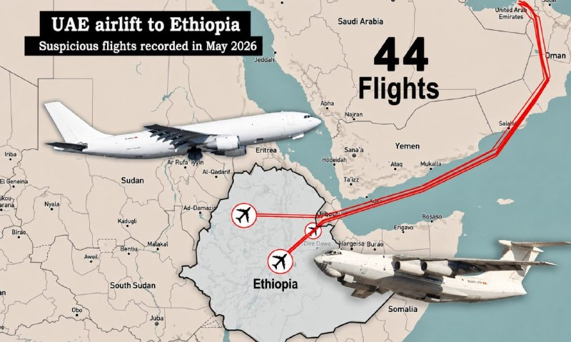

ماه مه هنوز تمام نشده است و ما شاهد افزایش بی‌سابقه‌ای در پروازهای مشکوک باری امارات متحده عربی به اتیوپی هستیم. تاکنون، ۴۴ پرواز در این ماه ثبت شده است، از جمله بیش از هشت پرواز تایید شده به فرودگاه بهیر دار در شمال اتیوپی.

📌 @persian_trend_official
پرشین ترند | متفاوت‌ترین کانال نظامی

## Persian_Trend_Official — post 15310

  <a href="telegram/content/Persian_Trend_Official_15310_1780126430.mp4" target="_blank">🎬 Download video</a>

🎥 لاشۀ پهپاد منهدم‌شده در قشم

👺Phantom

📌 @persian_trend_official
پرشین ترند | متفاوت‌ترین کانال نظامی

## Persian_Trend_Official — post 15308

👑فرزند ایران 💔 جان فدای میهن جاوید نام نیوشا حمیدی‏۱۵ساله. ۱۸دی در آستانه اشرفیه با شلیک مستقیم کشته شده.

👑فرزند ایران 💔 جان فدای میهن جاوید نام امیرمهدی مرادی گلدره ۱۵ساله. ۱۹دی در اسلامشهر تهران با شلیک مستقیم کشته شده.

👑
👑
👑 
👑
👑
👑
روحشان شاد يادشان وظیفه 💔❤️‍🔥

👺Phantom

📌 @persian_trend_official
پرشین ترند | متفاوت‌ترین کانال نظامی

## Persian_Trend_Official — post 15307

  <a href="telegram/content/Persian_Trend_Official_15307_1780126432.mp4" target="_blank">🎬 Download video</a>

صبحتون بخیر 🌄
Mig-31 Foxhound

📌 @persian_trend_official
پرشین ترند | متفاوت‌ترین کانال نظامی

## RadioFarda — post 157709

  

🔸ایالات متحده روز شنبه هشدار داد که برای ازسرگیری جنگ با ایران حتی «بیش از آنچه لازم است توانایی» دارد.

🔸این هشدار پس از آن صادر شد که دونالد ترامپ، رئیس‌جمهور آمریکا، اعلام کرد هرگونه توافق صلح باید بر اساس خط قرمزهای او باشد، از جمله اینکه تهران هرگز نتواند به سلاح‌های هسته‌ای دست یابد.

🔸کاخ سفید اشاره کرده بود که ترامپ پس از هفته‌ها پیام‌های متناقض در ارتباط با مذاکرات شکننده، به تصمیم‌گیری در مورد یک توافق اولیه نزدیک شده است، هرچند تهران وجود هرگونه توافق نهایی برای پایان دادن به درگیری در خاورمیانه را که اقتصاد جهانی را تکان داده است، تکذیب کرد.

🔸در همین حال، پیت هگست، رئیس پنتاگون، روز شنبه به وقت محلی در جریان شرکت در یک نشست بزرگ دفاعی آسیا در سنگاپور گفت که واشینگتن در صورت تمایل می‌تواند جنگ را از سر بگیرد.

🔸او گفت: «توانایی ما برای شروع مجدد در صورت نیاز به گونه‌ای است که بیش از حد توانایی داریم و انبار‌های مهمات ما برای این کار کاملاً مناسب هستند، هم در آنجا و هم در سراسر جهان؛ چرا که ما میان مهمات پیشرفته و مهمات فراوان‌تر تعادل برقرار کرده‌ایم.»

RadioFarda

## RadioFarda — post 157708

  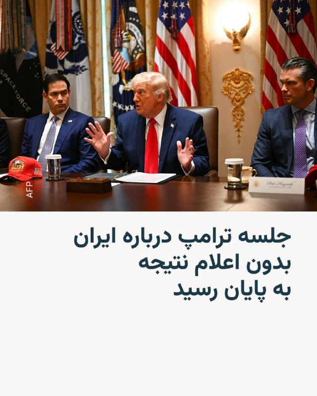

🔸جلسه دونالد ترامپ با مشاوران ارشدش که طبق وعده او قرار بود نتیجه چند هفته مذاکره را روشن کند پس از بیش از دو ساعت بدون اعلام نتیجه به پایان رسید.

🔸بامداد شنبه، نهم خردادماه، روزنامه نیویورک تایمز به نقل از یک مقام ارشد دولت که به نامش اشاره نکرد نوشت که ترامپ در این جلسه به نتیجه‌ای درباره تفاهم‌نامه با تهران نرسیده است.

🔸رئیس‌جمهور آمریکا پیشتر اعلام کرده بود که روز جمعه در اتاق وضعیت کاخ سفید جلسه‌ای با حضور مشاورانش برگزار خواهد کرد تا تصمیم نهایی درباره توافق با ایران را اتخاذ کند.

🔸ترامپ گفت که که توافق پایان دادن جنگ باید شامل مواردی مانند تعهد ایران به باز شدن تنگه هرمز و نابودی ذخایر اورانیوم باشد.

🔸با این حال ساعتی بعد سخنگوی وزارت خارجه جمهوری اسلامی در واکنش به این پیام دونالد ترامپ دربارهٔ محتوای توافق میان آمریکا و ایران اعلام کرد که تفاهم میان دو کشور هنوز نهایی نشده است.

@RadioFarda

## RadioFarda — post 157707

  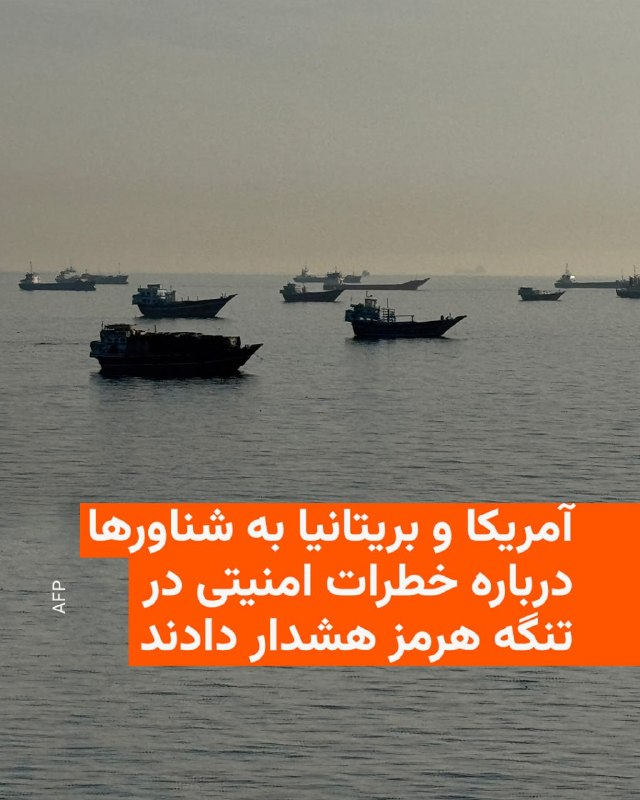

🔸مرکز عملیات تجارت دریایی بریتانیا و فرماندهی مرکزی نیروهای دریایی آمریکا روز جمعه هشتم خرداد در اطلاعیه‌ای مشترک به شناورها هشدار دادند که فعالیت‌ها در محدوده تنگه هرمز با خطرات حساس امنیتی همراه است.

🔸در این اطلاعیه با اشاره به ادامه محاصره دریایی بنادر ایران و عملیات‌ها در خلیج فارس، خلیج عمان، شمال دریای عرب و تنگه هرمز، به هواپیماها و کشتی‌هایی که قصد عبور از منطقه مشخص شده را دارند، توصیه شده تا با احتیاط حرکت کنند و در صورت امکان از پیمایش در این منطقه خودداری کنند.

🔸این اطلاعیه به کشتی‌هایی که با انجام یا شرکت در انتقال کشتی به کشتی، محاصره را نقض می‌کنند، هشدار داده است که در حال نقض محاصره هستند و اگر فوراً از نیروهای محاصره‌کننده پیروی نکنند شامل اقدامات اجرایی شده و هدف قرار خواهند گرفت.

🔸این اطلاعیه با تاکید بر اینکه وضعیت کنونی تا اطلاع ثانوی ادامه خواهد داشت، هشدار داد هر شناوری که از دستورهای نیروهای آمریکا پیروی نکند، ممکن است تهدیدی قریب‌الوقوع تلقی شود و مطابق حقوق بین‌الملل هدف اقدام متناسب نظامی قرار گیرد.

@RadioFarda

## IranianMinds — post 21057

  <a href="telegram/content/IranianMinds_21057_1780126435.mp4" target="_blank">🎬 Download video</a>

(((((((:

@IranianMinds

## IranianMinds — post 21056

سنتکام :

به دریانوردان و ملوانان و خلبانان هشدار میدیم که سنتکام عملیات نظامی تو تنگه هرمز، شمال شبه‌جزیره مسندم عمان که در وسط تنگه قرار داره، بزودی انجام خواهد داد
مراقب باشید و با ما هماهنگی های لازم انجام بدید

این عملیات به عهده ناو های جورج بوش و آبراهام لینکن خواهد بود

@IranianMinds

## BBCPersian — post 282409

🔻گفت‌وگو با شرق‌شناس روس؛ آیا هنوز امکان «توافق بزرگ» میان آمریکا و ایران وجود دارد؟
رسانه‌ها تاکنون چندین بار از احتمال دستیابی به توافقی میان آمریکا و ایران برای ازسرگیری کشتیرانی در تنگه هرمز خبر داده‌اند، اما مذاکرات با میانجی‌های مختلف همچنان ادامه دارد و مقام‌های جمهوری اسلامی با بدبینی به آن نگاه می‌کنند.
روسلان سلیمانوف، شرق‌شناس روس، می‌گوید پس از آتش‌بس هشتم آوریل تغییری جدی رخ نداده و مواضع تهران و واشنگتن در موضوع‌های اصلی همچنان سخت‌گیرانه، آشتی‌ناپذیر و بدون آمادگی برای مصالحه باقی مانده است.
به گفته او، تنها زمینه ممکن برای توافق، گسترش آتش‌بس و تعیین قواعدی برای جلوگیری از جنگ تازه است و توافقی مشابه برجام در سال ۲۰۱۵ فعلا غیرواقع‌بینانه به نظر می‌رسد.
در حالی که گزارش‌هایی درباره انتقال اورانیوم غنی‌شده ایران به چین یا روسیه منتشر شده، آقای سلیمانوف می‌گوید تصمیم نهایی در اختیار نیروهای امنیتی و نزدیکان مجتبی خامنه‌ای است که به نظر می‌آید مخالف امتیاز دادن هستند.
متن کامل خبر را در لینک زیر بخوانید:
https://bbc.in/436N0yF
📸 GettyImages/Reuters
@BBCPersian

## BBCPersian — post 282398

🔻فاطمه مهاجرانی، سخنگوی دولت ایران در یادداشتی تصمیم دولت «برای بازگشایی همگانی اینترنت بین‌الملل» را «نه صرفا رفع یک محدودیت فنی»، بلکه «گامی در جهت احقاق حقوق عمومی مردم» توصیف کرد.

او محدودیت‌های اعمال شده ماه‌های اخیر را ناشی از «تهدیدات امنیتی، تجاوز دشمن و اقتضائات ناشی از آن» خواند و گفت بنابر قانون اساسی «هیچ وضعیت استثنایی نمی‌تواند به رویه‌ای دائمی تبدیل شود.»

خانم مهاجرانی با انتقاد از «شکل‌گیری دسترسی‌های نابرابر و چندلایه به اینترنت» در ماه‌های اخیر نوشته است که این وضعیت «احساس تبعیض را در جامعه افزایش داد.»

بعد از چند ماه قطعی اینترنت در ایران در پی جنگ آمریکا و اسرائیل با ایران، دو روز پیش اینترنت در ایران به طور نسبی وصل شد. پیش از این، دولت مسعود پزشکیان چند بار خواستار برقراری مجدد اینترنت شده و تاکید کرده بود که قطعی اینترنت موجب ضربه به حوزه علمی و آموزشی و خسارات اقتصادی می‌شود و مستقیم و غیرمستقیم بر کسب و کارها تاثیر می‌گذارد.

@BBCPersian

## BBCPersian — post 282397

  

🔻پزشک دونالد ترامپ، در یادداشتی که روز جمعه از سوی کاخ سفید منتشر شد، اعلام کرد که رئیس‌جمهور آمریکا همچنان از سلامت بسیار خوبی برخوردار است. به گفته او، نتایج معاینات انجام‌شده در هفته جاری نشان می‌دهد که آقای ترامپ ۷۹ ساله همچنان دچار «تورم خفیف در ناحیه پایینی پاها و کبودی خوش‌خیم در دست‌ها» است.

دکتر شان باربابلا در یادداشتی که شامگاه جمعه منتشر شد، تأکید کرد که «دونالد ترامپ از سلامت جسمانی بسیار مطلوبی برخوردار است و عملکرد قلب، ریه‌، سیستم عصبی و وضعیت کلی بدنی او در شرایطی قوی و طبیعی قرار دارد.»

به گفته پزشک آقای ترامپ، او از آمادگی کامل برای انجام مسئولیت‌های رئیس‌جمهور و فرماندهی کل نیروهای مسلح آمریکا برخوردار است.

معاینات سالانه آقای ترامپ روز ۲۶ مه (۵ خرداد) انجام شده است.

دونالد ترامپ که در ماه ژوئن ۸۰ ساله می‌شود، مسن‌ترین فردی بود که مسئولیت ریاست‌جمهوری را بر عهده گرفته است.

او اغلب خود را پرانرژی‌تر و از نظر جسمانی آماده‌تر از جو بایدن، رئیس‌جمهور دموکرات پیشین، معرفی می‌کند.

📸رویترز
@BBCPersian

## BBCPersian — post 282388

🔻رضا ثابتی
روزنامه‌نگار

ذخایر اورانیوم غنی‌شده ایران یکی از موارد اختلاف جدی میان تهران و واشنگتن برای پایان دادن به جنگ است. اما سرنوشت و مکان نگهداری این مواد،‌ خود به معمایی پیچیده در پرونده هسته‌ای جمهوری اسلامی تبدیل شده است.

این اختلاف بر سر حدود چهارصد کیلوگرم اورانیومی است که ایران طی سال‌های اخیر تا سطح ۶۰ درصد غنی‌سازی کرده است؛ سطحی که هنوز برای مصارف تسلیحاتی کافی نیست، اما از نظر فنی تنها فاصله کوتاهی با غنای ۹۰ درصدی مورد نیاز برای ساخت بمب هسته‌ای دارد.

با گذشت حدود یک سال از حملات آمریکا و اسرائیل به تاسیسات هسته‌ای فردو، نطنز و اصفهان در جریان جنگ ۱۲ روزه، هنوز هیچ مرجع مستقلی نتوانسته با قطعیت بگوید چه مقدار از این ذخایر باقی مانده، در چه وضعیتی است و دقیقا کجا نگهداری می‌شود.

چرا ایران چنین ذخایری در اختیار دارد و چه سرنخ‌هایی درباره سرنوشت آن در دست است؟
متن کامل خبر در لینک زیر:
https://bbc.in/4acMu5V

📸BBC/ GettyImages/ Le Monde, Airbus DS (2026)/ Reuters/ AFP via Getty Images/ Satellite image (c) 2026 Vantor
@BBCPersian

## Dirty_Kids — post 390539

  <a href="telegram/content/Dirty_Kids_390539_1780126437.mp4" target="_blank">🎬 Download video</a>

بزرگترین سوال بی جواب از جمهوری اسلامی ملایان!

@Dirty_Kids 👻

## Dirty_Kids — post 390538

  <a href="telegram/content/Dirty_Kids_390538_1780126438.mp4" target="_blank">🎬 Download video</a>

مداحی سوزناک «من به یادت» برای عاغا موشعلی

@Dirty_Kids 👻

## Dirty_Kids — post 390537

پولدار بودن خیلی خوبه.
درستو میخونی، زبانتو فول میکنی، هر تخصص یا هنری رو دلت بخواد یاد میگیری، باشگاه میری به هیکلت میرسی،
به دوست دختر/پسرت میرسی،
سفرتو میری،
تفریحتو داری.
تهشم از اراده ات حرف میزنی.

@Dirty_Kids 👻

## alonews — post 123625

  <a href="telegram/content/alonews_123625_1780126440.webm" target="_blank">🎬 Download video</a>

👈کنکور سراسری به همراه آزمون پذیرش دانشجومعلم پنجشنبه و جمعه ۲۹ و ۳۰ مرداد ماه برگزار خواهد شد

✅ @AloNews خبر جنگ

## alonews — post 123624

  <a href="telegram/content/alonews_123624_1780126440.webm" target="_blank">🎬 Download video</a>

👈مقام ایرانی به الجزیره: هنوز هیچ چیز نهایی نشده است

🔴او مدعی شد تیم مذاکره‌کننده آمریکا چارچوب حرفه‌ای و اخلاقی مشخصی ندارد و مواضع و خواسته‌های خود را به‌طور مداوم تغییر می‌دهد.

🔴این اظهارات در حالی مطرح می‌شود که گزارش‌های مختلفی از ادامه مذاکرات، تبادل پیام‌ها و تلاش میانجی‌ها برای کاهش اختلاف‌های باقی‌مانده منتشر شده است.

✅ @AloNews خبر جنگ

## alonews — post 123623

  <a href="telegram/content/alonews_123623_1780126440.webm" target="_blank">🎬 Download video</a>

👈نیویورک پست : آزادسازی منابع ایران مشروط به بازگشایی تنگه هرمز و پاکسازی مین ها است

✅ @AloNews خبر جنگ

## alonews — post 123621

  <a href="telegram/content/alonews_123621_1780126440.webm" target="_blank">🎬 Download video</a>

👈نفت برنت بیش از ۹ درصد ریخت و طلا با رشد ۰.۸ درصدی به ۴۵۹۳ دلار رسید

✅ @AloNews خبر جنگ

## alonews — post 123620

  <a href="telegram/content/alonews_123620_1780126441.webm" target="_blank">🎬 Download video</a>

👈سپاه اصفهان: به‌دلیل انجام انفجارهای کنترل‌شده تا ساعت ۱۴ امروز در جنوب اصفهان، احتمال شنیدن صدای انفجار در این منطقه وجود دارد.

✅ @AloNews خبر جنگ

## alonews — post 123618

  <a href="telegram/content/alonews_123618_1780126441.mp4" target="_blank">🎬 Download video</a>

👈یک راکت حزب‌الله به مرکز کیریات شمونا در منطقه گالیل پان هندل، شمال اسرائیل، لحظاتی پیش اصابت کرد

✅ @AloNews خبر جنگ

## alonews — post 123617

  <a href="telegram/content/alonews_123617_1780126442.webm" target="_blank">🎬 Download video</a>

👈سی‌بی‌اس: انتظار نمی‌رود که ترامپ پیش از تصمیم‌گیری درباره فروش تسلیحات آمریکا به تایوان، با رئیس‌جمهور تایوان، لای چینگ-ته، تماس بگیرد.

🔴تماس برنامه‌ریزی شده توجه‌ها را جلب کرده بود زیرا هیچ رئیس‌جمهور فعلی آمریکا از سال ۱۹۷۹ به طور مستقیم با رهبر تایوان صحبت نکرده است.

🔴ترامپ قبلاً گفته بود که قصد دارد پیش از اتخاذ تصمیم درباره بسته تسلیحاتی با لای صحبت کند.

✅ @AloNews خبر جنگ

## alonews — post 123616

  <a href="telegram/content/alonews_123616_1780126443.webm" target="_blank">🎬 Download video</a>

👈 ارتش اسرائیل یک وانت را در بزرگراه حبوش - دیر الزهرانی، جنوب لبنان هدف قرار داد

✅ @AloNews خبر جنگ

## alonews — post 123615

  <a href="telegram/content/alonews_123615_1780126443.webm" target="_blank">🎬 Download video</a>

👈بلومبرگ: پنج پرسنل نظامی آمریکایی و پیمانکار پس از آنکه آوار ناشی از موشک بالستیک فاتح-۱۱۰ ایران که رهگیری شده بود، پایگاه هوایی علی الصالح کویت را هدف قرار داد، مجروح شدند. یک پهپاد MQ-9A ریپر نابود شد و دیگری آسیب دید. جراحات تهدیدکننده جان نیستند؛ این حادثه پیش‌تر فاش نشده بود.

✅ @AloNews خبر جنگ

## alonews — post 123614

👈جهت رزرو تبلیغات در کانال #الونیوز به کانال زیر مراجعه کنید👇

📃https://t.me/ads_alonews

📃https://t.me/ads_alonews

## alonews — post 123613

  <a href="telegram/content/alonews_123613_1780126443.webm" target="_blank">🎬 Download video</a>

👈ادعای وال استریت ژورنال: موج کوچکی از کشتی‌ها در تاریکی مطلق در حال عبور از تنگه هرمز هستند و بدون چراغ یا سیستم‌های ناوبری خودکار و با کمک ارتش ایالات متحده، از این آبراه خطرناک عبور می‌کنند.

✅ @AloNews خبر جنگ

## alonews — post 123612

  <a href="telegram/content/alonews_123612_1780126443.webm" target="_blank">🎬 Download video</a>

👈ابراهیم عزیزی رئیس کمیسیون امنیت ملی مجلس ایران در گفتگو با ریانووستی: ایران همواره برای شرکای خود احترام ویژه‌ای قائل بوده‎ و خواهد بود.

🔴 روسیه و چین به عنوان شرکای راهبردی ایران در موضوع تردد شناورهایشان در تنگه هرمز مورد اقدام مثبت بوده و خواهند بود

✅ @AloNews خبر جنگ

## alonews — post 123611

  <a href="telegram/content/alonews_123611_1780126443.webm" target="_blank">🎬 Download video</a>

👈پزشک ترامپ: «دست دادن مکرر»، علت کبودی دست‌های رئیس‌جمهور آمریکا است

🔴 این یک اثر شایع و خوش‌خیم است

✅ @AloNews خبر جنگ

## alonews — post 123610

  <a href="telegram/content/alonews_123610_1780126443.webm" target="_blank">🎬 Download video</a>

👈توجه‌ها به شبه‌جزیره مسندم؛ نزدیک محل عملیات نیروی دریایی آمریکا

🔴گزارش‌ها و تصاویر منتشرشده توجه‌ها را به منطقه شبه‌جزیره مسندم در عمان جلب کرده‌اند؛ منطقه‌ای که در نزدیکی محل برخی عملیات‌های اخیر نیروی دریایی آمریکا قرار دارد.
شبه‌جزیره مسندم به دلیل موقعیت راهبردی خود در نزدیکی تنگه هرمز، یکی از مهم‌ترین نقاط ژئوپلیتیکی منطقه محسوب میشود و تحرکات نظامی در اطراف آن همواره مورد توجه رسانه‌ها و تحلیلگران قرار میگیرد.

✅ @AloNews خبر جنگ

## alonews — post 123608

  <a href="telegram/content/alonews_123608_1780126443.webm" target="_blank">🎬 Download video</a>

👈نیروی دریایی آمریکا: کشتی‌های تجاری از تنگه هرمز دوری کنند

🔴فرماندهی مرکزی نیروی دریایی ایالات متحده (USNAVCENT) روز گذشته با انتشار یک بیانیه فوری دریایی، به مالکان کشتی، بهره‌برداران و دریانوردان نسبت به آنچه «عملیات نظامی خطرناک در جریان» در تنگه هرمز خوانده شده، هشدار داد.

🔴در این بیانیه ادعا شده که ایران در تلاش برای «کنترل غیرقانونی» این آبراه استراتژیک از طریق آنچه «مین‌ریزی خطرناک و غیرقانونی» خوانده شده، است؛ اقدامی که به گفته سنتکام، کشتی‌ها و خدمه آن‌ها را در معرض خطر قرار داده است.

🔴بر اساس این بیانیه، به تمامی دریانوردان توصیه شده است که از «طرح تفکیک تردد» در تنگه هرمز اجتناب کرده و در عوض، عبور خود را با «مرکز همکاری و راهنمایی نیروی دریایی ایالات متحده برای کشتیرانی» هماهنگ کنند.

🔴در بخش پایانی این بیانیه، هشداری قاطع مطرح شده است مبنی بر اینکه هر شناوری که در حال انجام فعالیت‌های مین‌ریزی یا پشتیبانی از آن مشاهده شود، در چارچوب آنچه «دفاع مشروع» خوانده شده، از سوی نیروهای آمریکایی هدف قرار خواهد گرفت.

✅ @AloNews خبر جنگ

## alonews — post 123607

  <a href="telegram/content/alonews_123607_1780126443.webm" target="_blank">🎬 Download video</a>

👈وزیر جنگ آمریکا: نگرانی به حقی در مورد تقویت تاریخی ارتش چین و گسترش فعالیت‌های نظامی آن در منطقه وجود دارد 
🔴 یک شبکه قوی‌تر و خوداتکاءتر از متحدان آسیایی برای حفظ تعادل قدرت، ضروری است 
✅ @AloNews خبر جنگ

## alonews — post 123606

  <a href="telegram/content/alonews_123606_1780126444.webm" target="_blank">🎬 Download video</a>

👈بلومبرگ: چین خبرنگار نیویورک تایمز را به دلیل مصاحبه با رئیس جمهور تایوان اخراج کرد

🔴چین در حالی که پکن کمپین خود را برای منزوی کردن تایوان در عرصه جهانی تشدید می‌کند، یک روزنامه‌نگار نیویورک تایمز را به دلیل مصاحبه‌ای که این روزنامه آمریکایی با رئیس جمهور تایوان انجام داده بود، از این کشور اخراج کرد.

✅ @AloNews خبر جنگ

## alonews — post 123605

  <a href="telegram/content/alonews_123605_1780126444.webm" target="_blank">🎬 Download video</a>

👈وزیر جنگ آمریکا: نگرانی به حقی در مورد تقویت تاریخی ارتش چین و گسترش فعالیت‌های نظامی آن در منطقه وجود دارد

🔴 یک شبکه قوی‌تر و خوداتکاءتر از متحدان آسیایی برای حفظ تعادل قدرت، ضروری است

✅ @AloNews خبر جنگ

<!-- MSG END -->

<!-- NAV START -->

<a href="https://github.com/hosseinbaghi/aio-downloader/blob/main/telegram/content/archive_1.md" style="display:inline-block; padding:6px 12px; margin:0 4px; background-color:#2ea44f; color:white; text-decoration:none; border-radius:4px; font-weight:bold;">صفحه بعد</a>

<!-- NAV END -->
