# خواننده تلگرام

<!-- TOP_NAV START -->

<a href="https://github.com/hosseinbaghi/aio-downloader/blob/main/telegram/content/archive_1.md" style="display:inline-block; padding:6px 12px; margin:0 4px; background-color:#2ea44f; color:white; text-decoration:none; border-radius:4px; font-weight:bold;">صفحه بعد</a>

<!-- TOP_NAV END -->

<!-- MSG START -->

---
📅 بروزرسانی: 1405/02/25 19:57
---

## VahidOOnLine — post 240345

  

یک مقام وزارت خارجه آمریکا به الجزیره گفت فضای دومین روز مذاکرات میان لبنان و اسرائیل بسیار مثبت بوده و روند گفت‌وگوها فراتر از انتظارها پیش رفته است.

این دومین روز از سومین دور مذاکرات میان اسرائیل و لبنان با میانجی‌گری ایالات متحده بود.
‌🏁 🇬🇧 IranintlTV

🤖 @VahidOOnLine

## VahidOOnLine — post 240344

بیمارستان الغدیر تهران شامگاه ۱۸ و ۱۹ دی‌ماه ۱۴۰۴، شاهد گوشه‌ای از جنایتی بود که جمهوری اسلامی علیه معترضان مرتکب شد. ده‌ها پیکر بی‌جان و شمار زیادی از مجروحان به این بیمارستان منتقل شدند و به دلیل کمبود فضای سردخانه، تعدادی از کشته‌شدگان، پتوپیچ در حیاط پشت بیمارستان رها شدند. ایران‌اینترنشنال تاکنون هویت ۹ نفر از آن‌ها را شناسایی کرده که در این ویدیو چهار تن از آنها معرفی شده‌اند.
فرنوش فرجی، خبرنگار ایران‌اینترنشنال گزارش می‌دهد.
‌🏁 🇬🇧 IranintlTV

🤖 @VahidOOnLine

## VahidOOnLine — post 240343

  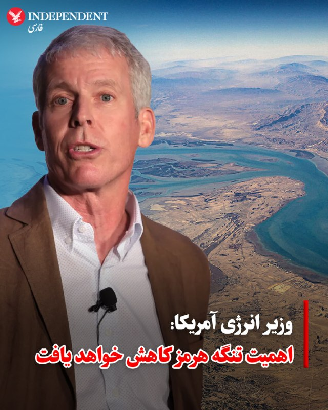

♦️ کریس رایت، وزیر انرژی ایالات متحده، اعلام کرد که با افزایش ظرفیت خطوط لوله انتقال انرژی از طریق عربستان سعودی، امارات متحده عربی و دیگر کشورهای خاورمیانه، پیش‌بینی می‌کند اهمیت استراتژیک تنگه هرمز برای حمل‌ونقل جهانی نفت و گاز کاهش یابد.

رایت در گفتگو با شبکه سی‌ان‌بی‌سی اظهار داشت: «مسیرهای جایگزین دیگری برای خروج انرژی از منطقه خلیج فارس ایجاد خواهد شد. من فکر می‌کنم شاهد کاهش اهمیت تنگه هرمز خواهیم بود، اما این به معنای کاهش اهمیت تولید و عرضه انرژی این کشورها نیست.»

او همچنین افزود: «این کشورها متحدان بزرگ ایالات متحده و تامین‌کنندگان کلیدی انرژی در جهان هستند؛ ما خواهان بازگشت شکوفایی، صلح و رشد اقتصادی به این منطقه هستیم.»
‌🇸🇦 Indypersian

🤖 @VahidOOnLine

## VahidOOnLine — post 240342

♦️سرگئی لاوروف، وزیر امور خارجه روسیه، در جریان نشستی در دهلی‌نو از یک خبرنگار هندی خواست به‌دلیل برهم زدن نظم جلسه، سالن را ترک کند.
بر اساس گزارش‌ها، این خبرنگار به‌دلیل تماس‌های مکرر تلفنی، دو بار سخنان لاوروف را قطع کرده بود. در پی این اتفاق، وزیر خارجه روسیه به زبان انگلیسی از او خواست هرچه سریع‌تر محل کنفرانس را ترک کند.
‌🇸🇦 Indypersian

🤖 @VahidOOnLine

## VahidOOnLine — post 240341

  

♦️امیلی گودین، خبرنگار نیویورک‌پست که در سفر به چین دونالد ترامپ را همراهی کرده بود، دقایقی پیش از ترک پکن در شبکه اجتماعی ایکس اعلام کرد که از همه سرنشینان هواپیمای ریاست‌جمهوری خواسته شد قبل از سوار شدن تمام هدایایی که در پکن دریافت کرده‌اند، لوازم الکترونیکی که استفاده کرده‌اند و حتی سنجاق‌های تزئینی مربوط به این سفر را تحویل دهند.

تصویری که در شبکه‌های اجتماعی منتشر شده، نشان می‌دهد که این لوازم همه در کیسه سیاه‌رنگ بزرگی جمع‌آوری شده و احتمالا با هواپیمای دیگری از چین خارج خواهند شد.
‌🇸🇦 Indypersian

🤖 @VahidOOnLine

## VahidOOnLine — post 240340

  

محمد اسحاق دار، وزیر خارجه پاکستان، اعلام کرد که ۱۱ شهروند پاکستانی و ۲۰ شهروند ایرانی که در کشتی‌های توقیف‌شده از سوی آمریکا حضور داشتند، به کشورهایشان بازگردانده شده‌اند.
به گفته او قرار است همه این افراد امشب به اسلام آباد برسند و سپس بازگشت شهروندان ایران تسهیل خواهد شد.
‌🏁 🇬🇧 IranintlTV

🤖 @VahidOOnLine

## VahidOOnLine — post 240339

  <a href="telegram/content/VahidOOnLine_240339_1778862437.mp4" target="_blank">🎬 Download video</a>

یکی از مخاطبان ایران‌اینترنشنال با اشاره به وضعیت اقتصادی می‌گوید مردم ایران برای چه «منفعت ملی» این حجم از فشار اقتصادی و نگرانی را تحمل می‌کنند. این پیام با هوش مصنوعی خوانده شده است.
‌🏁 🇬🇧 IranintlTV

🤖 @VahidOOnLine

## VahidOOnLine — post 240338

  

محمدمهدی حسینی‌همدانی، امام جمعه کرج، ۲۵ اردیبهشت در نماز جمعه این شهر گفت: بر اساس توصیه قرآن باید تا پایان «فتنه»، جنگ را ادامه داد و تاکید کرد مجازات اسرائیل، محو کامل آن است.

او همچنین اطاعت از مجتبی خامنه‌ای را عامل پیروزی خواند و گفت باید عوامل نافرمانی را از میان برداشت.
‌🏁 🇬🇧 IranintlTV

🤖 @VahidOOnLine

## VahidOOnLine — post 240337

  <a href="telegram/content/VahidOOnLine_240337_1778862440.mp4" target="_blank">🎬 Download video</a>

‌
اسحاق دار، وزیر خارجه پاکستان، اعلام کرد ۲۰ شهروند ایرانی که در کشتی‌های توقیف‌شده آمریکا در آب‌های بین‌المللی حضور داشتند، از طریق پاکستان به تهران بازگردانده خواهند شد.

دار گفت این افراد همراه با ۱۱ شهروند پاکستانی، از سنگاپور به بانکوک منتقل شدند و سپس با پرواز راهی اسلام‌آباد شدند. به گفته او، شهروندان ایرانی پس از ورود به پاکستان، برای انتقال به تهران همراهی خواهند شد.

وزیر خارجه پاکستان از وزیر خارجه آمریکا برای «هماهنگی نزدیک» در این عملیات، و از وزیر خارجه جمهوری اسلامی بابت «اعتماد به پاکستان» در روند بازگرداندن شهروندان ایرانی قدردانی کرد.
‌🏁 🇬🇧 ManotoTV

🤖 @VahidOOnLine

## VahidOOnLine — post 240336

  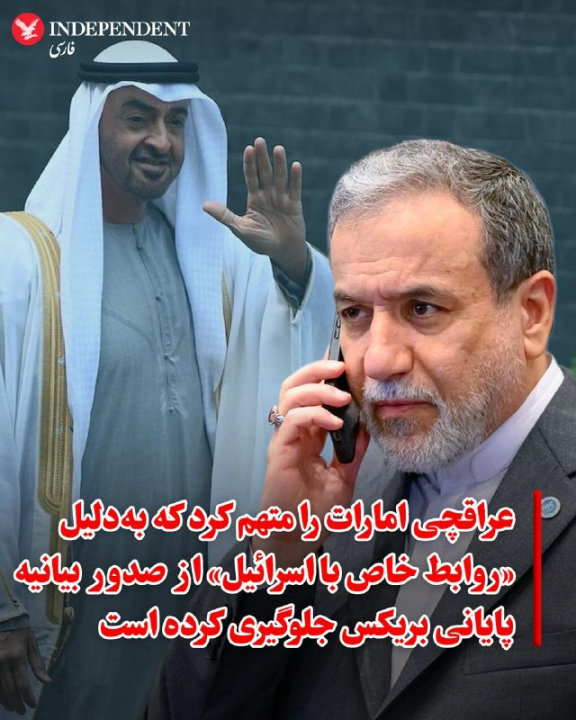

♦️عباس عراقچی، وزیر امور خارجه جمهوری اسلامی، در پایان نشست وزرای خارجه «بریکس» در دهلی‌نو اعلام کرد که صدور بیانیه پایانی این نشست به دلیل مخالفت یکی از اعضا که «روابط خاصی با اسرائیل دارد»، متوقف شده است. اگرچه عراقچی مستقیما نامی از امارات متحده عربی نبرد، اما تاکید کرد که این کشور به دلیل حمایت از اسرائیل و ایالات متحده در درگیری‌های اخیر، مانع تصویب بخش‌هایی از بیانیه شده است.

وزیر خارجه جمهوری اسلامی با «تاسف‌بار» خواندن این اقدام، ادعا کرد که ایران در طول جنگ جاری هیچ اختلافی با امارات نداشته و تنها پایگاه‌های نظامی آمریکا را هدف قرار داده است.

عراقچی در ادامه ابراز امیدواری کرد که مقامات ابوظبی تا نشست سران بریکس به این درک برسند که ایران همسایه‌ای دائمی است و دو کشور باید قرن‌ها در کنار هم زندگی کنند.

همزمان با این اظهارات، بلومبرگ در گزارشی جدید به نقل از منابع آگاه اعلام کرد که امارات در دوران جنگ تلاش کرده است که با جلب حمایت عربستان سعودی و قطر، حملات مشترکی علیه ایران انجام دهد؛ پیشنهادی که با مخالفت صریح ریاض و دوحه مواجه شده است.
‌🇸🇦 Indypersian

🤖 @VahidOOnLine

## VahidOOnLine — post 240335

  

رسانه‌های ایران اعلام کردند نمایشگاه کتاب تهران امسال به صورت «مجازی» برگزار خواهد شد.
بر اساس این خبر، نمایشگاه کتاب تهران از روز شنبه، ۲۶ اردیبهشت و به صورت آنلاین آغاز خواهد شد.
باوجود آتش‌بس میان جمهوری اسلامی و آمریکا، بسیاری از برنامه‌های عادی در ایران همچنان تعطیل بوده یا به‌صورت مجازی برگزار می‌شود.
‌🏁 🇬🇧 IranintlTV

🤖 @VahidOOnLine

## VahidOOnLine — post 240334

  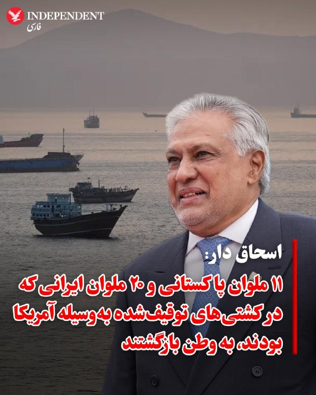

♦️اسحاق دار، وزیر امور خارجه پاکستان، در پیامی در شبکه اجتماعی ایکس از موفقیت این کشور در بازگرداندن ۱۱ دریانورد پاکستانی و ۲۰ دریانورد ایرانی خبر داد که پیش‌تر در جریان توقیف کشتی‌ها در آب‌های آزاد توسط ایالات متحده بازداشت شده بودند.

وزیر خارجه پاکستان با اعلام اینکه تمامی این افراد در سلامت کامل به سر می‌برند، تشریح کرد که این گروه از سنگاپور به بانکوک منتقل شده و از آنجا راهی اسلام‌آباد شده‌اند. به گفته او، اتباع ایرانی پس از توقفی کوتاه در پاکستان، برای بازگشت به کشورشان همراهی و تسهیلات لازم را دریافت خواهند کرد.

اسحاق دار در این پیام از دولت‌های سنگاپور و تایلند بابت همکاری در فرآیند انتقال و همچنین از مارکو روبیو، وزیر امور خارجه ایالات متحده، بابت هماهنگی‌های نزدیک جهت تسهیل بازگشت این افراد قدردانی کرد. او همچنین از عباس عراقچی، وزیر امور خارجه جمهوری اسلامی، بابت اعتماد به پاکستان در فرآیند بازگرداندن «برادران ایرانی» تشکر و تاکید کرد که رسیدگی به وضعیت اتباع در بند، اولویت نخست دولت پاکستان است.
‌🇸🇦 Indypersian

🤖 @VahidOOnLine

## VahidOOnLine — post 240333

  <a href="telegram/content/VahidOOnLine_240333_1778862444.mp4" target="_blank">🎬 Download video</a>

‌
وانگ یی، وزیر خارجه چین، گفت پکن معتقد است حل بحران تنگه هرمز در گرو دستیابی به «آتش‌بسی دائمی و جامع» میان آمریکا و جمهوری اسلامی است.

به گزارش خبرگزاری شینهوا، وانگ یی گفت رئیس‌جمهور چین در گفت‌وگو با دونالد ترامپ تأکید کرده که «زور نمی‌تواند مشکلات را حل کند و گفت‌وگو تنها مسیر درست است.»

وزیر خارجه چین افزود: «مذاکرات یک‌شبه به نتیجه نمی‌رسد، اما وقتی درِ گفت‌وگو باز شد، نباید دوباره بسته شود.»

او همچنین گفت چین برای پیشبرد مذاکرات صلح تلاش کرده و به ایفای نقش خود برای پایان سریع درگیری‌ها و بازگشت ثبات به خاورمیانه ادامه خواهد داد.
‌🏁 🇬🇧 ManotoTV

🤖 @VahidOOnLine

## VahidOOnLine — post 240332

  <a href="telegram/content/VahidOOnLine_240332_1778862444.mp4" target="_blank">🎬 Download video</a>

‌
کریس رایت، وزیر انرژی آمریکا، گفت به‌دلیل جنگ و تنش‌ها در خلیج فارس، چین احتمالاً خرید نفت از آمریکا را افزایش خواهد داد.

او در گفت‌وگو با سی‌ان‌بی‌سی گفت: «فکر می‌کنم چین به خرید مقادیر بیشتری از نفت آمریکا ادامه خواهد داد.»

رایت همچنین گفت جهان نیاز دارد تنگه هرمز دوباره به‌طور کامل باز شود و افزود: «تلاش ایران برای گروگان گرفتن جهان، موقتی است.»

وزیر انرژی آمریکا در پاسخ به این پرسش که بازگشت شرایط به وضعیت عادی چقدر زمان می‌برد، گفت: «بخش زیادی از آن به ایران بستگی دارد.»

او افزود: «به هر شکلی، برنامه هسته‌ای ایران پایان خواهد یافت و عبور آزادانه کشتی‌ها از تنگه هرمز برقرار خواهد شد. این می‌تواند در صورت توافق با ایران، نسبتاً سریع رخ دهد.»
‌🏁 🇬🇧 ManotoTV

🤖 @VahidOOnLine

## VahidOOnLine — post 240331

  <a href="telegram/content/VahidOOnLine_240331_1778862445.mp4" target="_blank">🎬 Download video</a>

عباس عراقچی، وزیر خارجه جمهوری اسلامی، با انتشار تصویری از دیدار با سابرامانیام جایشانکار، وزیر خارجه هند، در شبکه اِکس نوشت: «ایران همواره وظیفه تاریخی خود به‌عنوان حافظ امنیت در تنگه هرمز» را انجام خواهد داد.

عراقچی افزود در گفت‌وگویی «سازنده» با همتای هندی خود، درباره تحولات منطقه گفت‌وگو کرده و مدعی شد جمهوری اسلامی «شریکی قابل اعتماد برای همه کشورهای دوست» است و این کشورها می‌توانند به امنیت تجارت و کشتیرانی اعتماد کنند.
‌🏁 🇬🇧 ManotoTV

🤖 @VahidOOnLine

## VahidOOnLine — post 240330

  

الهه محمدی و الناز محمدی، دو روزنامه‌نگار ایرانی، از سوی بنیاد بین‌المللی زنان رسانه مستقر در آمریکا به عنوان دریافت‌کنندگان جایزه «شجاعت در روزنامه‌نگاری» در سال ۲۰۲۶ معرفی شدند.
این نهاد با اعلام اسامی برگزیدگان امسال تاکید کرد که این روزنامه‌نگاران با وجود فشارها، تهدیدها و محدودیت‌های گسترده، به فعالیت حرفه‌ای خود ادامه داده‌اند.

بنیاد بین‌المللی زنان رسانه هر سال این جایزه را به روزنامه‌نگارانی اهدا می‌کند که در شرایط پرخطر و محدودکننده، فعالیت رسانه‌ای خود را ادامه می‌دهند. امسال علاوه بر دو روزنامه‌نگار ایرانی، خبرنگارانی از آمریکا، میانمار و فیلیپین نیز در میان برگزیدگان قرار دارند.
‌🏁 🇬🇧 IranintlTV

🤖 @VahidOOnLine

## VahidOOnLine — post 240329

♦️اصغر فرهادی، کارگردان سرشناس ایرانی، روز جمعه ۲۵ اردیبهشت در نشست خبری جشنواره کن با اشاره به تحولات اخیر در ایران، از کشته شدن غیرنظامیان در جریان جنگ و همچنین جان‌باختن معترضان در اعتراضات دی‌ماه ابراز تاسف کرد.
او این دو رویداد را «به یک اندازه دردناک» توصیف کرد و گفت مخالفت با کشته شدن گروهی از انسان‌ها به معنای پذیرش کشته شدن گروهی دیگر نیست. فرهادی تأکید کرد از دست رفتن جان انسان‌ها در هر شرایطی، چه در جنگ، چه در اعدام و چه در سرکوب اعتراضات، غیرقابل قبول است.
این کارگردان ایرانی با انتقاد از تداوم خشونت در جهان افزود که با وجود پیشرفت‌های بشری، همچنان هر روز خبرهایی از کشته شدن انسان‌های بی‌گناه منتشر می‌شود؛ موضوعی که به گفته او «دردناک و تاسف‌بار» است.
‌🇸🇦 Indypersian

🤖 @VahidOOnLine

## VahidOOnLine — post 240328

  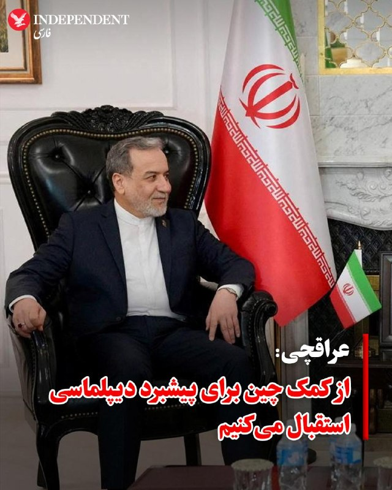

♦️عباس عراقچی، وزیر امور خارجه جمهوری اسلامی، روز جمعه ۲۵ اردیبهشت اعلام کرد که جمهوری اسلامی از هرگونه حمایتی، از جمله از سوی چین، برای کمک به حل درگیری‌ها در خاورمیانه استقبال می‌کند.

عراقچی در گفتگو با خبرنگاران در دهلی‌نو، پایتخت هند، جایی که برای شرکت در نشست کشورهای عضو گروه «بریکس» حضور داشت، گفت: «ما از هر کشوری که توانایی کمک داشته باشد، به‌ویژه چین، قدردانی می‌کنیم.»

او افزود: «ما روابط بسیار خوبی با چین داریم و شرکای استراتژیک یکدیگر هستیم. می‌دانیم که چینی‌ها حسن نیت دارند؛ بنابراین از هر اقدامی که آن‌ها بتوانند برای کمک به دیپلماسی انجام دهند، استقبال خواهیم کرد.»
‌🇸🇦 Indypersian

🤖 @VahidOOnLine

## VahidOOnLine — post 240327

  

امارات متحده عربی اعلام کرد که اظهارات جمهوری اسلامی و تلاش‌هایش برای توجیه حملات علیه امارات متحده عربی را نمی‌پذیرد و تاکید کرد فشارهای تهران تاثیری بر مواضع ابوظبی نخواهد داشت.

پیش‌تر عباس عراقچی، وزیر خارجه جمهوری اسلامی گفته بود: «اماراتی‌ها اجازه دادند از سرزمین‌شان برای شلیک توپخانه و تجهیزات علیه ما استفاده شود.»
‌🏁 🇬🇧 IranintlTV

🤖 @VahidOOnLine

## WithYashar — post 11294

وزیر خارجه چین:
رئیس‌جمهور شی جین‌پینگ طبق دعوت ترامپ در پاییز به آمریکا سفر خواهد کرد
@withyashar

## WithYashar — post 11293

طبق گزارش خبرنگار همراه هیئت آمریکایی، پیش از سوار شدن به «ایرفورس وان»، کارکنان آمریکایی تمام وسایل و ههدایایی را که طرف چینی داده بود از جمله کارت‌ها، نشان‌ها، تلفن‌های موقت و اقلام هدیه جمع کردند و داخل سطل زباله انداختند و اجازه ندادند چیزی از چین وارد هواپیما شود.
@withyashar

## mwarmonitor — post 9135

  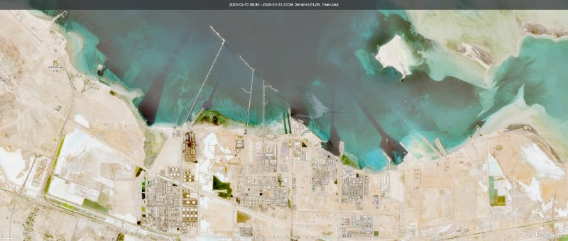

🇦🇪به همین دلیل است که امارات متحده عربی با شدت به‌دنبال توسعه خط لوله حبشان است.
🔹صادرات این کشور از ابوظبی و الرویس تقریباً به صفر نزدیک شده است.
❗️در بیش از ۳۰ روز گذشته تعداد بسیار کمی نفتکش در این بنادر پهلو گرفته‌اند.
🔸در نتیجه، برای جلوگیری از آسیب‌های ناشی از توقف تولید (shut-in)، امارات ناچار شده در چندین ایستگاه پمپاژ نفت و گاز به‌طور گسترده اقدام به سوزاندن گاز (فلرینگ) کند.

@mwarmonitor

## mwarmonitor — post 9134

🇦🇪معالی خلیفه بن شاهین المرر، وزیر مشاور، در نشست وزیران امور خارجه گروه بریکس که در دهلی نو در جمهوری هند برگزار شد، شرکت کرد.
🇦🇪وی در جریان این نشست، مخالفت قاطع دولت امارات متحده عربی را با ادعاهای طرف ایرانی و تلاش‌ها برای توجیه حملات تروریستی ایران که امارات و کشورهای برادر و دوست در منطقه را هدف قرار داده است، اعلام کرد؛ اقداماتی که نقض آشکار منشور سازمان ملل متحد، حقوق بین‌الملل و اصول حسن همجواری به‌شمار می‌آید.

معالیه همچنین تأکید کرد که دولت امارات به‌طور قاطع هرگونه ادعا یا تهدیدی را که حاکمیت، امنیت ملی یا استقلال تصمیم‌گیری این کشور را مخدوش کند، رد می‌کند و تصریح نمود که امارات تمامی حقوق حاکمیتی، قانونی، دیپلماتیک و نظامی خود را برای مقابله با هر تهدید، ادعا یا اقدام خصمانه محفوظ می‌دارد.

وی خاطرنشان ساخت که هیچ‌گونه تلاش برای اعمال فشار، طرح اتهام یا ترویج ادعاهای مغرضانه، خللی در مواضع ثابت دولت ایجاد نخواهد کرد و امارات را از حفاظت از منافع عالی ملی و صیانت از حاکمیت و استقلال تصمیم‌گیری بازنخواهد داشت.

معالیه افزود که از ۲۸ فوریه ۲۰۲۶، دولت امارات در معرض حملات تروریستی مکرر و غیرقابل توجیه ایران قرار گرفته است؛ به‌گونه‌ای که سامانه‌های پدافند هوایی امارات با حدود ۳۰۰۰ حمله شامل موشک‌های بالستیک و کروز و پهپادها مقابله کرده‌اند. این حملات به‌طور مستقیم و عامدانه تأسیسات غیرنظامی و زیرساخت‌های حیاتی، از جمله فرودگاه‌ها، بنادر، تأسیسات نفتی، ایستگاه‌های آب‌شیرین‌کن، شبکه‌های انرژی، مراکز خدماتی و مناطق مسکونی را هدف قرار داده است.

وی گفت: «با وجود صدور قطعنامه‌ها و محکومیت‌های متعدد بین‌المللی و منطقه‌ای، ایران به حملات تروریستی خود علیه امارات و کشورهای منطقه ادامه داده است و اجماع جهانی را نادیده گرفته؛ از جمله قطعنامه شماره ۲۸۱۷ (۲۰۲۶) شورای امنیت سازمان ملل متحد که با مشارکت ۱۳۶ کشور به تصویب رسید، و نیز قطعنامه صادره از شورای حقوق بشر که در ۲۵ مارس ۲۰۲۶ در مقر سازمان ملل در ژنو برگزار شد و به‌طور اجماعی حملات ایران را محکوم کرد.» وی تأکید کرد این حملات نقض حقوق بین‌الملل و تهدیدی برای صلح و امنیت بین‌المللی است و این قطعنامه با حمایت بیش از ۱۰۰ کشور تصویب شد.

وی افزود: «جامعه بین‌المللی همچنان به محکومیت حملات تروریستی ایران ادامه داده است؛ به‌طوری که کمیته حفاظت از محیط‌زیست دریایی سازمان بین‌المللی دریانوردی قطعنامه‌ای را تصویب کرد که خواستار توقف فوری حملات و تهدیدات علیه کشتی‌های تجاری و نفتکش‌ها و زیرساخت‌های حیاتی بنادر است. همچنین شورای اتحادیه بین‌المللی مخابرات در ژنو به‌طور اجماعی قطعنامه‌ای را در محکومیت حملات علیه زیرساخت‌های غیرنظامی ارتباطات و فناوری اطلاعات تصویب کرد. از سوی دیگر، شورای سازمان خواربار و کشاورزی ملل متحد نیز قطعنامه‌ای را به تصویب رساند که اقدامات ایران را به‌دلیل به خطر انداختن امنیت غذایی محکوم می‌کند.»

معالیه تأکید کرد که این قطعنامه‌ها بیانگر اجماع روشن بین‌المللی در رد این حملات تروریستی است و از حق امارات و کشورهای برادر و دوست برای دفاع از حاکمیت خود مطابق با حقوق بین‌الملل حمایت می‌کند؛ و پیامی واحد و صریح می‌فرستد مبنی بر اینکه جامعه جهانی حملات تروریستی ایران به حاکمیت کشورها یا هدف قرار دادن عمدی غیرنظامیان و زیرساخت‌های حیاتی را تحمل نخواهد کرد.

وی توضیح داد که ایران با ایجاد اخلال و تعطیلی مسیرهای کشتیرانی بین‌المللی، از جمله بسته شدن عملی تنگه هرمز ـ یکی از مهم‌ترین گذرگاه‌های آبی جهان ـ مرتکب نقض آشکار حقوق بین‌الملل شده است. وی تأکید کرد که هدف قرار دادن کشتیرانی تجاری و استفاده از تنگه هرمز به‌عنوان ابزار فشار یا باج‌گیری اقتصادی، مصداق دزدی دریایی بوده و تهدیدی مستقیم برای ثبات منطقه، ملت‌های آن و امنیت جهانی انرژی به‌شمار می‌آید.

معالیه تصریح کرد که دولت امارات منتظر حمایت هیچ طرفی نیست و توان بازدارندگی و پاسخ به تجاوز آشکار را دارد و حق کامل و مشروع خود را برای دفاع از حاکمیت و تمامیت ارضی خویش، مطابق با ماده ۵۱ منشور سازمان ملل متحد، محفوظ می‌داند؛ به‌گونه‌ای که امنیت شهروندان، مقیمان و بازدیدکنندگان تضمین شود.


🇦🇪در پایان، وی ایران را مسئول کامل این حملات تروریستی و پیامدهای آن دانست و تأکید کرد که احترام به حاکمیت کشورها، گفت‌وگو، توقف حملات تروریستی و پایبندی سخت‌گیرانه به حقوق بین‌الملل، پایه‌های ضروری هرگونه ثبات واقعی و پایدار به‌شمار می‌رود.

@mwarmonitor

## FoxNewsTwitter — post 341787

  

Fox News (Twitter/X)

WATCH LIVE: VP Vance speaks at National Peace Officers’ Memorial Service https://twitter.com/i/broadcasts/1OxwblyqbYWJB

## FoxNewsTwitter — post 341786

  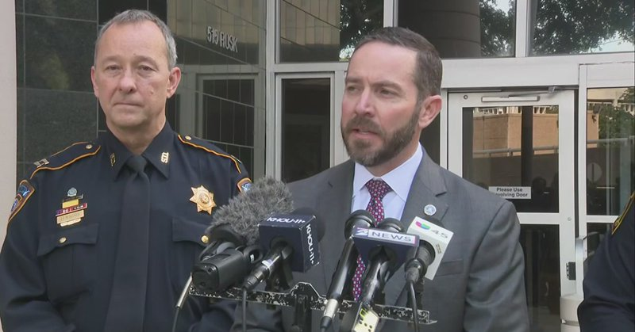

Fox News (Twitter/X)

WATCH LIVE: FBI provides update after alleged TdA leader made first courtroom appearance
https://twitter.com/i/broadcasts/1RKjpznvoldJw

## FoxNewsTwitter — post 341785

  <a href="telegram/content/FoxNewsTwitter_341785_1778862450.mp4" target="_blank">🎬 Download video</a>

Fox News (Twitter/X)

BREAKING: U.S. Marshals Director Gadyaces Serralta reveals the massive success of the D.C. Safe Task Force, reporting a dramatic drop in violent crime across the nation's capital.

The task force has made nearly 13,000 arrests and seized over 1,400 illegal firearms in just nine months, leading to a 35% decrease in murders.

"The D.C. Safe Task Force has seized over 1400 illegal firearms, preventing countless violent crimes in our nation's capital. Murders are down more than 35%, and overall crime is down 26%. The violent carjackings that once plagued this city are rare and will be over because we are not done."

## FoxNewsTwitter — post 341784

  <a href="telegram/content/FoxNewsTwitter_341784_1778862453.mp4" target="_blank">🎬 Download video</a>

Fox News (Twitter/X)

Cardinal Dolan delivers a heartfelt message to the New York faithful during a golden jubilee Mass, crediting his priesthood to God and the support of his community.

The Cardinal reflected on nearly two decades of service, calling the people of New York his "family" and offering a humble assessment of his many years in the church.

"After 17 happy years, you're my family, you're my friends, and I love you, and I thank you. I thank you so much... Without Jesus, I could've done nothing. Without you, none of the meager accomplishments you so graciously pointed out could've ever happened."

## FoxNewsTwitter — post 341783

‌Fox News (Twitter/X)

https://www.foxnews.com/politics/longtime-democratic-rep-steve-cohen-announces-end-re-election-bid

## FoxNewsTwitter — post 341782

  <a href="telegram/content/FoxNewsTwitter_341782_1778862455.mp4" target="_blank">🎬 Download video</a>

Fox News (Twitter/X)

WATCH: The FIFA World Cup is less than a month away, and the FBI says it’s training officers to use electronic defense capabilities that can intercept drones over stadiums.

Fox News got behind-the-scenes access to the FBI’s Redstone facility in Huntsville, where agents demonstrated how they jam and hijack suspicious drones to redirect them away from sensitive sites.

@foymeetsworld reports the latest on the ground in Alabama. | @GillianHTurner @AmericaNewsroom

## FoxNewsTwitter — post 341781

  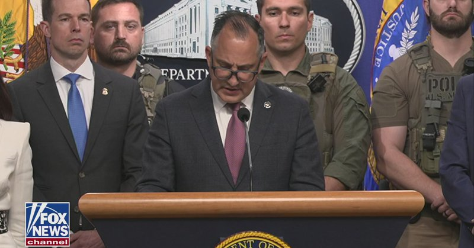

Fox News (Twitter/X)

WATCH LIVE: U.S. Attorney Jeanine Pirro unveils safety plans for America 250 events https://twitter.com/i/broadcasts/1PKqrEmdrknGb

## FoxNewsTwitter — post 341780

  <a href="telegram/content/FoxNewsTwitter_341780_1778862458.mp4" target="_blank">🎬 Download video</a>

Fox News (Twitter/X)

NEW: President Trump defends the timeline of America’s conflict with Iran and highlights the devastating impact of U.S. strikes during an exclusive interview with @BretBaier.

The President dismissed critics who claim he underestimated the situation, noting that the U.S. has maintained significant restraint by leaving critical infrastructure like electricity and Kharg Island oil valves intact despite having the capability to "knock that all out in two days."

"I didn't underestimate anything. We hit them unbelievably hard. Look, we left their bridges. We left their electricity capacity. We can knock that all out in two days. Two days. Everything. We left Kharg Island, other than I said, hit it except for the valves where the oil comes out."

Watch the full interview at 6 p.m. ET on ‘Special Report”’

## FoxNewsTwitter — post 341779

Fox News (Twitter/X)

BREAKING: Longtime Rep. Steve Cohen, D-Tenn., announces end to re-election bid

## FoxNewsTwitter — post 341778

‌Fox News (Twitter/X)

Who will win the Academy of Country Music Award for Female Artist of the Year?

Our sponsor Kalshi’s prediction market reveals the current frontrunners:

— Ella Langley: 85%
— Lainey Wilson: 12%
— Megan Moroney: 5%

https://www.foxnews.com/entertainment/lainey-wilson-marries-duck-hodges-dream-tennessee-waterfall-cave-wedding

## pm_afshaa — post 90798

  

🚀 آبان‌نت؛ سرعت بی‌مرز، بدون تاریخ انقضا!

⚡دنبال کیفیتی می‌گردی که حجمت رو بی‌دلیل تموم نکنه؟

💎 ویژگی‌های طلایی:
• 
✅ بدون محدودیت زمان و کاربر: تا آخرین کیلوبایت حجمت معتبره!
• 
✅ مصرف واقعی (۱ به ۱): بدون ضریب مصرف و دزدی حجم.
• 
✅ پینگ عالی: مخصوص گیمرهای حرفه‌ای و یوتیوب.
• 
☄️ تنوع سرویس: V2ray، OpenVPN،L2tp و Wireguard.

💳 پرداخت راحت بصورت ریالی و ارزی

💰 قیمت‌های ما را مقایسه کنید!
برای استعلام قیمت استثنایی و مشاوره به آیدی زیر پیام دهید:

🆔 @itsmammad10
🔗 کانال اصلی ما:

🆔 @AbanVpn10

## pm_afshaa — post 90797

  <a href="telegram/content/pm_afshaa_90797_1778862462.webm" target="_blank">🎬 Download video</a>

🔴وزیر خارجه چین:
رئیس‌جمهور شی جین‌پینگ طبق دعوت ترامپ در پاییز به آمریکا سفر خواهد کرد

💧 Rainbet.com the #1 Non-KYC Crypto Casino & Sportsbook @rainbetcom

😁 @Pm_Afshaa

## pm_afshaa — post 90796

  <a href="telegram/content/pm_afshaa_90796_1778862462.webm" target="_blank">🎬 Download video</a>

🔴صدر اعظم آلمان: با ترامپ صحبت کردم؛ ایران نباید سلاح هسته‌ای داشته باشه.

💧 Rainbet.com the #1 Non-KYC Crypto Casino & Sportsbook @rainbetcom

😁 @Pm_Afshaa

## VahidOnline — post 75485

  

وزیر خارجه پاکستان اعلام کرد که یازده شهروند پاکستانی و ۲۰ شهروند ایرانی که در کشتی‌های توقیف‌شده توسط آمریکا در آب‌های آزاد گرفتار شده بودند، به اسلام‌آباد منتقل می‌شوند.

اسحاق دار افزوده که «تمامی این افراد از سنگاپور به بانکوک رسیده‌اند و اکنون سوار پروازی شده‌اند که قرار است اواخر امشب به اسلام‌آباد برسد. سپس بازگشت برادران ایرانی به وطن خود تسهیل خواهد شد».
@VahidHeadline

📡 @VahidOnline

## VahidOnline — post 75484

  

صدراعظم آلمان می‌گوید در جریان گفت‌و‌گوی تلفنی با دونالد ترامپ، رئیس‌جمهور آمریکا، هر دو بر سر ضرورت باز کردن تنگهٔ هرمز توسط ایران و ممانعت از دسترسی تهران به سلاح هسته‌ای، توافق داشته‌اند.

فریدریش مرتس روز جمعه ۲۵ اردیبهشت در شبکهٔ ایکس نوشت که در مسیر بازگشت رئیس‌جمهور آمریکا از چین، «تماس تلفنی خوبی» با او داشته است.

او افزود که آن‌ها توافق دارند که «ایران باید همین حالا پای میز مذاکره بیاید. باید تنگهٔ هرمز را باز کند. نباید اجازه داده شود تهران به سلاح هسته‌ای دست پیدا کند».
@VahidHeadline

📡 @VahidOnline

## IranIntlTV — post 337349

  <a href="https://t.me/IranintlTV/337349" target="_blank">📎 Download file</a>

🎧نسخه صوتی دومینو: تاکید ترامپ بر برچیدن کامل برنامه هسته‌ای
@iranintlTV

## IranIntlTV — post 337348

  

یک مقام وزارت خارجه آمریکا به الجزیره گفت فضای دومین روز مذاکرات میان لبنان و اسرائیل بسیار مثبت بوده و روند گفت‌وگوها فراتر از انتظارها پیش رفته است.

این دومین روز از سومین دور مذاکرات میان اسرائیل و لبنان با میانجی‌گری ایالات متحده بود.
https://iranintl.com/202605151409

## IranIntlTV — post 337347

بیمارستان الغدیر تهران شامگاه ۱۸ و ۱۹ دی‌ماه ۱۴۰۴، شاهد گوشه‌ای از جنایتی بود که جمهوری اسلامی علیه معترضان مرتکب شد. ده‌ها پیکر بی‌جان و شمار زیادی از مجروحان به این بیمارستان منتقل شدند و به دلیل کمبود فضای سردخانه، تعدادی از کشته‌شدگان، پتوپیچ در حیاط پشت بیمارستان رها شدند. ایران‌اینترنشنال تاکنون هویت ۹ نفر از آن‌ها را شناسایی کرده که در این ویدیو چهار تن از آنها معرفی شده‌اند.
فرنوش فرجی، خبرنگار ایران‌اینترنشنال گزارش می‌دهد.

## IranIntlTV — post 337346

  <a href="telegram/content/IranIntlTV_337346_1778862466.mp4" target="_blank">🎬 Download video</a>

وزیر خارجه ایتالیا اعلام کرد به دنبال راه‌حلی سریع برای مشکلات تمدید اقامت و گذرنامه ایرانیان مقیم این کشور است و این موضوع را در سطح اروپا نیز پیگیری می‌کند. آنتونیو تایانی تاکید کرد ایتالیا در کنار مردم ایران و خواست آزادی و دموکراسی ایستاده است.
جزییات بیشتر با صدف باغبانی، روزنامه‌نگار
@iranintltv

## IranIntlTV — post 337345

  

محمد اسحاق دار، وزیر خارجه پاکستان، اعلام کرد که ۱۱ شهروند پاکستانی و ۲۰ شهروند ایرانی که در کشتی‌های توقیف‌شده از سوی آمریکا حضور داشتند، به کشورهایشان بازگردانده شده‌اند.
به گفته او قرار است همه این افراد امشب به اسلام آباد برسند و سپس بازگشت شهروندان ایران تسهیل خواهد شد.
https://iranintl.com/202605151087

## IranIntlTV — post 337344

  <a href="telegram/content/IranIntlTV_337344_1778862469.mp4" target="_blank">🎬 Download video</a>

یکی از مخاطبان ایران‌اینترنشنال با اشاره به وضعیت اقتصادی می‌گوید مردم ایران برای چه «منفعت ملی» این حجم از فشار اقتصادی و نگرانی را تحمل می‌کنند. این پیام با هوش مصنوعی خوانده شده است.

## IranIntlTV — post 337343

در این قسمت چرتکه، محمد ماشین‌چیان، قدرت خرید یک درآمد ماهانه ۴۰ میلیون تومانی را با در نظر گرفتن سناریوهای رشد نرخ دلار، تا پایان ۱۴۰۵ بررسی و پیش‌بینی می‌کند.

مساله فرسایش زندگی، محدود به کارگران ما نیست. حتی هموطنانی که در گذشته‌ای نه‌چندان دور، زندگی متوسط و قابل قبولی داشتند نیز از آسیب نوسانات دلار مصون نخواهند ماند.

تماشای نسخه کامل «چرتکه» در یوتیوب:
https://youtu.be/1W2RoMvSqPQ

@iranintltv

## IranIntlTV — post 337342

  

محمدمهدی حسینی‌همدانی، امام جمعه کرج، ۲۵ اردیبهشت در نماز جمعه این شهر گفت: بر اساس توصیه قرآن باید تا پایان «فتنه»، جنگ را ادامه داد و تاکید کرد مجازات اسرائیل، محو کامل آن است.

او همچنین اطاعت از مجتبی خامنه‌ای را عامل پیروزی خواند و گفت باید عوامل نافرمانی را از میان برداشت.
https://iranintl.com/202605155975

## IranIntlTV — post 337341

  <a href="telegram/content/IranIntlTV_337341_1778862471.mp4" target="_blank">🎬 Download video</a>

پیام‌های ارسالی مخاطبان به ایران‌اینترنشنال از کمبود و گرانی داروهای حوزه سلامت حکایت دارد. یک شهروند شاغل در صنعت دارو می‌گوید شربت «لیسکانتین» برای بیماران صرع و تشنج نایاب شده و قیمت آن از ۹۰۰ هزار تومان به ۴ میلیون و ۲۰۰ هزار تومان افزایش یافته است.
جزییات بیشتر با سبا حیدرخانی، عضو تحریریه ایران‌اینترنشنال
@iranintltv

## IranIntlTV — post 337340

  <a href="telegram/content/IranIntlTV_337340_1778862474.mp4" target="_blank">🎬 Download video</a>

در تازه‌ترین نظرسنجی جهانی، کانادا برای نخستین‌بار به‌عنوان جذاب‌ترین مقصد سرمایه‌گذاری زیرساختی معرفی شد. انجمن سرمایه‌گذاران زیرساخت جهانی، سیاست‌های جذب سرمایه خصوصی و ایجاد صندوق ثروت ۲۵ میلیارد دلاری را از عوامل اصلی این جایگاه دانست.
مهسا مرتضوی، خبرنگار ایران‌اینترنشنال، گزارش می‌دهد
@iranintltv

## IranIntlTV — post 337339

پیام‌های ارسالی مخاطبان به مدیا بات ایران‌اینترنشنال از گرانی، کمبود و نایاب شدن دارو و اقلام حوزه سلامت حکایت دارد. یک شهروند می‌گوید حتی داروهای ساده و مسکن‌هایی مانند قرص کدئین نیز نایاب شده‌اند.
@iranintltv

## IranIntlTV — post 337338

  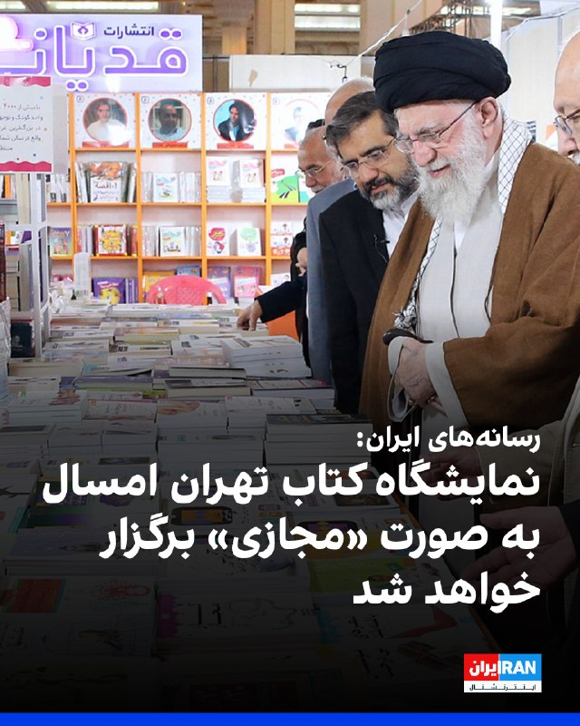

رسانه‌های ایران اعلام کردند نمایشگاه کتاب تهران امسال به صورت «مجازی» برگزار خواهد شد.
بر اساس این خبر، نمایشگاه کتاب تهران از روز شنبه، ۲۶ اردیبهشت و به صورت آنلاین آغاز خواهد شد.
باوجود آتش‌بس میان جمهوری اسلامی و آمریکا، بسیاری از برنامه‌های عادی در ایران همچنان تعطیل بوده یا به‌صورت مجازی برگزار می‌شود.
https://iranintl.com/202605157688

## IranIntlTV — post 337337

  <a href="telegram/content/IranIntlTV_337337_1778862477.mp4" target="_blank">🎬 Download video</a>

یک شهروند با ارسال پیامی به ایران اینترنشنال درباره گرانی‌ها از افزایش شدید نوشیدنی‌های الکلی در ایران خبر داده و می‌گوید هر لیتر «عرق سگی» یک میلیون و ۵۰۰ هزار تومان شده است. پیام این مخاطب با هوش مصنوعی خوانده شده است.

## IranIntlTV — post 337336

  <a href="telegram/content/IranIntlTV_337336_1778862479.mp4" target="_blank">🎬 Download video</a>

عباس عراقچی، وزیر خارجه جمهوری اسلامی، گفت موضوع اورانیوم غنی‌شده به دلیل پیچیدگی‌ها به بن‌بست رسیده و تصمیم گرفته شده در مراحل بعدی مذاکرات بررسی شود. او افزود تهران زمانی به مذاکرات بازمی‌گردد که مطمئن شود آمریکا برای یک توافق «عادلانه» آمادگی دارد.
گفت‌وگو با شایان سمیعی، کارشناس امنیت ملی
@iranintltv

## IranIntlTV — post 337335

  

الهه محمدی و الناز محمدی، دو روزنامه‌نگار ایرانی، از سوی بنیاد بین‌المللی زنان رسانه مستقر در آمریکا به عنوان دریافت‌کنندگان جایزه «شجاعت در روزنامه‌نگاری» در سال ۲۰۲۶ معرفی شدند.
این نهاد با اعلام اسامی برگزیدگان امسال تاکید کرد که این روزنامه‌نگاران با وجود فشارها، تهدیدها و محدودیت‌های گسترده، به فعالیت حرفه‌ای خود ادامه داده‌اند.

بنیاد بین‌المللی زنان رسانه هر سال این جایزه را به روزنامه‌نگارانی اهدا می‌کند که در شرایط پرخطر و محدودکننده، فعالیت رسانه‌ای خود را ادامه می‌دهند. امسال علاوه بر دو روزنامه‌نگار ایرانی، خبرنگارانی از آمریکا، میانمار و فیلیپین نیز در میان برگزیدگان قرار دارند.
https://iranintl.com/202605155076

## IranIntlTV — post 337334

  <a href="telegram/content/IranIntlTV_337334_1778862482.mp4" target="_blank">🎬 Download video</a>

سرخط خبرهای جمعه ۲۵ اردیبهشت
@iranintltv

## Shin_Persian — post 6014

  <a href="telegram/content/Shin_Persian_6014_1778862483.mp4" target="_blank">🎬 Download video</a>

Rapid Response 47 ✓ @RapidResponse47 Fri, 15 May 2026 14:28:16 UTC .@POTUS says he discussed Taiwan and Iran with President Xi: "He does not want to see a fight for independence... I didn’t make a comment on it... on Iran, it’s very interesting. He feels…

## Shin_Persian — post 6013

Rapid Response 47 ✓ @RapidResponse47
Fri, 15 May 2026 14:28:16 UTC

.@POTUS says he discussed Taiwan and Iran with President Xi: "He does not want to see a fight for independence... I didn’t make a comment on it... on Iran, it’s very interesting. He feels strongly they can’t have a nuclear weapon... and he wants them to open up the strait."

فارسی

.@POTUS می‌گوید که با رئیس‌جمهور شی در مورد تایوان و ایران گفتگو کرده است: «او نمی‌خواهد شاهد جنگی برای استقلال باشد... من در این مورد نظری ندادم... درباره ایران، موضوع بسیار جالب است. او با قدرت احساس می‌کند که آنها نباید سلاح هسته‌ای داشته باشند... و او می‌خواهد که آنها تنگه را باز کنند.»

𝕏 · @shin_persian

## Shin_Persian — post 6012

  <a href="telegram/content/Shin_Persian_6012_1778862486.mp4" target="_blank">🎬 Download video</a>

Rapid Response 47 ✓ @RapidResponse47
Fri, 15 May 2026 14:22:14 UTC

.@POTUS on Iran's latest proposal: "I looked at it, and if I don't like the first sentence, I just throw it away... if they have any nuclear of any form, I don't read the rest of their letter."

فارسی

.@POTUS درباره آخرین پیشنهاد ایران: «نگاهی به آن انداختم، و اگر از جمله اول خوشم نیاید، فقط آن را دور می‌اندازم... اگر آن‌ها هر شکلی از [توانمندی] هسته‌ای داشته باشند، بقیه نامه‌شان را نمی‌خوانم.»

𝕏 · @shin_persian

## Shin_Persian — post 6011

📦 mhrv-rs v1.9.26 released

• Optimize Full mode Apps Script by batching Edge-DNS cache lookups (PR #958)
• The safe fallback behavior is preserved

Files (Android APKs, Windows, macOS, Linux, OpenWRT) on the files channel:

👉 v1.9.26 — all files with SHA-256

Channel:
https://t.me/mhrv_rs
or: https://t.me/+R1OyoHX2boA1ZDgx

#v1926

## ManotoTV — post 105492

  <a href="telegram/content/ManotoTV_105492_1778862489.mp4" target="_blank">🎬 Download video</a>

‌
اسحاق دار، وزیر خارجه پاکستان، اعلام کرد ۲۰ شهروند ایرانی که در کشتی‌های توقیف‌شده آمریکا در آب‌های بین‌المللی حضور داشتند، از طریق پاکستان به تهران بازگردانده خواهند شد.

دار گفت این افراد همراه با ۱۱ شهروند پاکستانی، از سنگاپور به بانکوک منتقل شدند و سپس با پرواز راهی اسلام‌آباد شدند. به گفته او، شهروندان ایرانی پس از ورود به پاکستان، برای انتقال به تهران همراهی خواهند شد.

وزیر خارجه پاکستان از وزیر خارجه آمریکا برای «هماهنگی نزدیک» در این عملیات، و از وزیر خارجه جمهوری اسلامی بابت «اعتماد به پاکستان» در روند بازگرداندن شهروندان ایرانی قدردانی کرد.

## ManotoTV — post 105491

  <a href="telegram/content/ManotoTV_105491_1778862490.mp4" target="_blank">🎬 Download video</a>

‌
وانگ یی، وزیر خارجه چین، گفت پکن معتقد است حل بحران تنگه هرمز در گرو دستیابی به «آتش‌بسی دائمی و جامع» میان آمریکا و جمهوری اسلامی است.

به گزارش خبرگزاری شینهوا، وانگ یی گفت رئیس‌جمهور چین در گفت‌وگو با دونالد ترامپ تأکید کرده که «زور نمی‌تواند مشکلات را حل کند و گفت‌وگو تنها مسیر درست است.»

وزیر خارجه چین افزود: «مذاکرات یک‌شبه به نتیجه نمی‌رسد، اما وقتی درِ گفت‌وگو باز شد، نباید دوباره بسته شود.»

او همچنین گفت چین برای پیشبرد مذاکرات صلح تلاش کرده و به ایفای نقش خود برای پایان سریع درگیری‌ها و بازگشت ثبات به خاورمیانه ادامه خواهد داد.

## ManotoTV — post 105490

  <a href="telegram/content/ManotoTV_105490_1778862490.mp4" target="_blank">🎬 Download video</a>

‌
کریس رایت، وزیر انرژی آمریکا، گفت به‌دلیل جنگ و تنش‌ها در خلیج فارس، چین احتمالاً خرید نفت از آمریکا را افزایش خواهد داد.

او در گفت‌وگو با سی‌ان‌بی‌سی گفت: «فکر می‌کنم چین به خرید مقادیر بیشتری از نفت آمریکا ادامه خواهد داد.»

رایت همچنین گفت جهان نیاز دارد تنگه هرمز دوباره به‌طور کامل باز شود و افزود: «تلاش ایران برای گروگان گرفتن جهان، موقتی است.»

وزیر انرژی آمریکا در پاسخ به این پرسش که بازگشت شرایط به وضعیت عادی چقدر زمان می‌برد، گفت: «بخش زیادی از آن به ایران بستگی دارد.»

او افزود: «به هر شکلی، برنامه هسته‌ای ایران پایان خواهد یافت و عبور آزادانه کشتی‌ها از تنگه هرمز برقرار خواهد شد. این می‌تواند در صورت توافق با ایران، نسبتاً سریع رخ دهد.»

## ManotoTV — post 105489

  <a href="telegram/content/ManotoTV_105489_1778862491.mp4" target="_blank">🎬 Download video</a>

عباس عراقچی، وزیر خارجه جمهوری اسلامی، با انتشار تصویری از دیدار با سابرامانیام جایشانکار، وزیر خارجه هند، در شبکه اِکس نوشت: «ایران همواره وظیفه تاریخی خود به‌عنوان حافظ امنیت در تنگه هرمز» را انجام خواهد داد.

عراقچی افزود در گفت‌وگویی «سازنده» با همتای هندی خود، درباره تحولات منطقه گفت‌وگو کرده و مدعی شد جمهوری اسلامی «شریکی قابل اعتماد برای همه کشورهای دوست» است و این کشورها می‌توانند به امنیت تجارت و کشتیرانی اعتماد کنند.

## DW_Farsi — post 124736

🔶 آمادگی آمریکا برای گفت‌وگو با کوبا به شرط تغییرات اساسی

به گزارش رسانه‌های آمریکایی و اعلام دولت کوبا، جان رتکلیف، رئیس سازمان سیا در هاوانا با مقام‌های ارشد وزارت کشور کوبا دیدار کرده است. به‌گفته یک مقام سازمان سیا، او در این سفر پیام دونالد ترامپ را منتقل کرده مبنی بر اینکه آمریکا آماده گفت‌وگوی جدی درباره مسائل اقتصادی و امنیتی است، اما فقط در صورتی که کوبا تغییرات اساسی انجام دهد.

دولت کوبا اعلام کرد این دیدار به درخواست دولت آمریکا انجام شده و هدف آن، پیشبرد گفت‌وگوی سیاسی میان دو کشور در شرایطی بوده که روابط دو طرف همچنان "پیچیده" توصیف می‌شود.

بر اساس گزارش‌ها، رتکلیف در این سفر با لازارو آلوارز کاساس، وزیر کشور کوبا، و همچنین رائول گی‌یرمو رودریگز کاسترو، نوه رائول کاسترو، دیدار کرده است.

مقام‌های آمریکایی گفته‌اند رتکلیف برای انتقال این پیام به کوبا سفر کرده که واشنگتن آماده ورود به گفت‌وگو درباره مسائل اقتصادی و امنیتی است، اما این آمادگی "بدون شرط نیست و به انجام تغییرات بنیادی از سوی هاوانا بستگی دارد".

در مقابل، دولت کوبا گفت نمایندگان این کشور در این دیدار به‌روشنی تأکید کرده‌اند که کوبا هیچ تهدیدی برای امنیت ملی آمریکا نیست و دلیلی ندارد نام این کشور همچنان در فهرست دولت‌های حامی تروریسم باقی بماند.

هاوانا تصریح کرد که نه از سازمان‌های تروریستی حمایت می‌کند و نه هیچ‌گاه از فعالیت خصمانه‌ای علیه آمریکا پشتیبانی کرده است.

هم‌زمان با سفر هیأت آمریکایی، وزارت خارجه آمریکا اعلام کرد سیسی آباسکال سامورا، منتقد ۲۷ ساله دولت کوبا ، پس از آزادی از زندان همراه خانواده‌اش راهی تبعید در آمریکا شده است. او پس از اعتراضات گسترده ۱۱ ژوئیه ۲۰۲۱ به شش سال زندان محکوم شده بود.

روابط آمریکا و کوبا از زمان انقلاب ۱۹۵۹ همواره پرتنش بوده، اما با بازگشت ترامپ به کاخ سفید بار دیگر سخت‌تر شد.

او در ژانویه ۲۰۲۵ یکی از نخستین تصمیم‌های خود را به بازگرداندن نام کوبا به فهرست دولت‌های حامی تروریسم اختصاص داد. اکنون سفر رئیس سیا به هاوانا نشان می‌دهد دو طرف، با وجود فشار و بی‌اعتمادی، کانال گفت‌وگو را کاملا نبسته‌اند.
@dw_farsi

## DW_Farsi — post 124735

  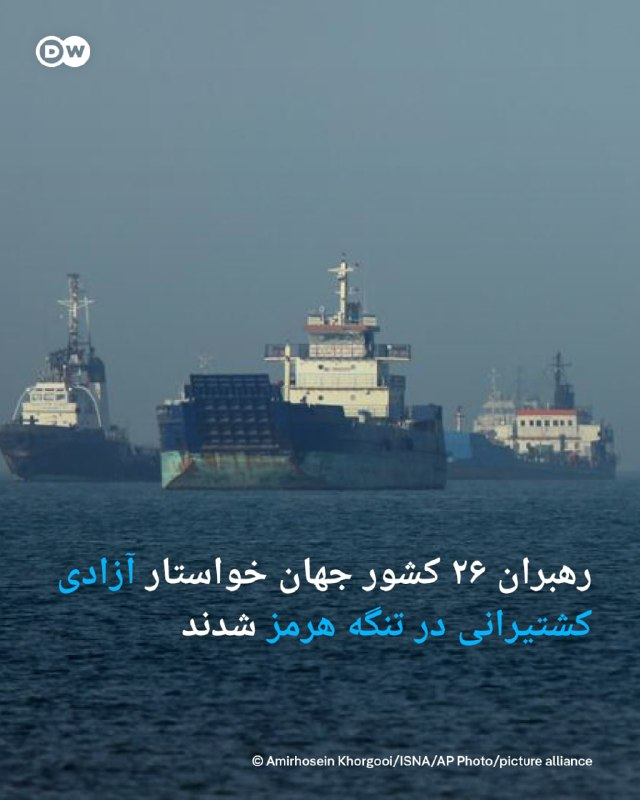

🔶 رهبران ۲۶ کشور جهان خواستار آزادی کشتیرانی در تنگه هرمز شدند

رهبران ۲۶ کشور جهان از جمله آلمان با صدور بیانیه‌ای مشترک، خواستار بازگشت وضعیت عادی دریانوردی در تنگه هرمز شده و حمایت خود را از یک ماموریت نظامی چندملیتی در این منطقه اعلام کردند.

به گزارش شبکه خبری سی‌ان‌ان، رهبران ۲۶ کشور جهان از جمله آلمان، فرانسه، بریتانیا، کانادا، بحرین، کره جنوبی و قطر در این بیانیه بر تعهد جمعی‌ برای به‌کارگیری منابع دیپلماتیک، اقتصادی و نظامی برای حمایت از آزادی کشتیرانی در تنگه هرمز تاکید کردند.

این کشورها خاطرنشان کردند، "کشتیرانی باید مطابق با کنوانسیون سازمان ملل متحد در مورد حقوق دریاها (UNCLOS) و قوانین بین‌المللی، آزاد باقی بماند".

همچنین در این بیانیه از یک ماموریت نظامی چندملیتی مستقل و دفاعی، شامل عملیات‌های مین‌روبی اعلام حمایت شده است.

در بخشی از این بیانیه تصریح شده است: «ماموریت نظامی چندملیتی به عنوان مکمل تلاش‌های دیپلماتیک و تنش‌زدایی جاری عمل خواهد کرد و اجرای چنین طرح‌هایی تنها در صورت ایجاد یک فضای مساعد میسر خواهد بود.»
@dw_farsi

## DW_Farsi — post 124734

  

🔶 گفت‌وگوی تلفنی مرتس و ترامپ پس از هفته‌ها تنش؛ تفاهم درباره نحوه ادامه اقدام علیه ایران

سکوت خبری میان دونالد ترامپ و فریدریش مرتس پس از هفته‌ها تنش‌ بر سر اظهارات صدراعظم آلمان درباره جنگ ایران پایان یافت.
مرتس اعلام کرد که در طی سفر بازگشت ترامپ از چین به‌صورت تلفنی با او گفت‌وگو کرده است. صدراعظم آلمان با انتشار پیامی در شبکه اجتماعی ایکس این گفت‌وگو را "خوب" توصیف و بر وجود تفاهم و اشتراک نظر درباره نحوه ادامه اقدام در مسئله ایران تاکید کرد.

مرتس درباره این گفت‌وگو نوشت: «ما با هم هم‌نظر هستیم. ایران اکنون باید به میز مذاکره بازگردد. تنگه هرمز باید بازگشایی شود و تهران نباید به سلاح هسته‌ای دست یابد.»

ترامپ روز جمعه ۱۵ مه (۲۵ اردیبهشت) سفر خود به چین را به پایان رساند. به گفته او، "شی جین‌پینگ تمایل خود را برای کمک به بازگشایی تنگه هرمز ابراز کرده و همچنین تعهد داده از ایران به‌صورت نظامی حمایت نکند".
@dw_farsi

## DW_Farsi — post 124733

  

🔶 ترامپ: آمریکا ممکن است در مقطعی برای خارج کردن مواد هسته‌ای وارد ایران شود

دونالد ترامپ، رئیس‌جمهور ایالات متحده در پایان سفر خود به چین در جمع خبرنگاران در هواپیمای ریاست جمهوری (ایر فورس وان) اعلام کرد، "ایالات متحده ممکن است در مقطعی برای خارج کردن مواد هسته‌ای وارد ایران شود".

او گفت: «یا وارد می‌شویم یا آن را می‌گیریم. فکر می‌کنم احتمالا آن را خواهیم گرفت اما اگر نه، وارد می‌شویم.»

ترامپ همچنین بار دیگر با تاکید بر اینکه "ایران به‌طور کامل شکست خورده است" افزود: «ما اصلا با خطری روبرو نیستیم و تمام تجهیزات لازم برای خارج کردن مواد هسته‌ای را داریم، هیچ‌کس دیگری چنین تجهیزاتی ندارد؛ شاید چین داشته باشد.»

ترامپ پیش‌تر در ماه مارس سال جاری میلادی نیز در کاخ سفید درباره ذخایر اورانیوم غنی‌شده جمهوری اسلامی هشدار مشابهی داده و گفته بود: «یا آن را پس می‌گیریم یا آن را برمی‌داریم.»
@dw_farsi

## DW_Farsi — post 124732

  

🔶 ترامپ: با شی درباره لغو تحریم شرکت‌های چینی خریدار نفت ایران گفت‌وگو کردم

دونالد ترامپ، رئیس‌جمهور آمریکا اعلام کرد، در جریان سفر خود به پکن درباره لغو تحریم‌ها علیه شرکت‌های چینی خریدار نفت ایران گفت‌وگو کرده و به‌زودی درباره این موضوع تصمیم‌گیری خواهد کرد.

ایالات متحده اخیرا تحریم‌هایی را علیه چند پالایشگاه نفت چین از جمله شرکت "هنگ‌لی" (Hengli) را که یکی از بزرگ‌ترین پالایشگاه‌های خصوصی این کشور و نمادی از تلاش پکن برای نوسازی و ارتقای این صنعت به شمار می‌رود، به دلیل خرید نفت ایران اعمال کرد.

ترامپ اندکی پس از ترک پکن در پایان نشست دوروزه خود با شی جین‌پینگ، همتای چینی خود در جمع خبرنگاران در هواپیما گفت: «ما در این باره صحبت کردیم و من طی چند روز آینده تصمیم خواهم گرفت.»

مقام‌های آمریکایی از جمله ترامپ، در حالی موضوع احتمال خرید بیشتر انرژی آمریکا توسط چین را مطرح کردند که هنوز در گزارش‌های رسمی چین از این دیدار هیچ اشاره‌ای به توافقی در این زمینه نشده است.
@dw_farsi

## DW_Farsi — post 124731

🔶 کاهش مهاجرت غیرقانونی به اروپا و انتقاد از عملکرد آلمان

بر اساس آمار آژانس حفاظت از مرزهای اتحادیه اروپا (فرانتکس) که به صورت اختصاصی در اختیار سرویس خبری شبکه اول تلویزیون آلمان (تاگس‌شاو) قرار گرفته است، "عبور غیرقانونی از مرزهای اتحادیه اروپا، به‌ویژه از طریق مسیر مدیترانه به‌طور قابل‌توجهی کاهش یافته است".

فرانتکس در ارتباط با بازه زمانی ژانویه تا پایان آوریل سال جاری میلادی (۲۰۲۶) از کاهش ۴۰ درصدی ورود غیرقانونی به اتحادیه اروپا در مقایسه با مدت مشابه سال گذشته خبر داده است.

گفته شده است، تاکنون در سال جاری میلادی نزدیک به ۲۹ هزار نفر به‌صورت غیرقانونی (یعنی بدون مدارک معتبر یا بدون مجوز ورود و اقامت) وارد اتحادیه اروپا شده‌اند و این پایین‌ترین میزان مهاجرت غیرقانونی در سال‌های اخیر محسوب می‌شود.

اصلی‌ترین مسیر ورود مهاجران غیرقانونی همچنان مدیترانه مرکزی است که اغلب با نقطه شروع لیبی و ورود به سواحلی نظیر ایتالیا انجام می‌شود. پس از آن، مسیر مدیترانه شرقی قرار دارد که مهاجران از طریق ترکیه به مقصد یونان و قبرس وارد می‌شوند.

بر اساس آماری که آژانس حفاظت از مرزهای اتحادیه اروپا ثبت کرده است، هر یک از این دو مسیر، حدود یک‌سوم از کل ورودهای غیرقانونی به اتحادیه اروپا را به خود اختصاص می‌دهند.

به گفته فرانتکس همکاری با کشورهای شریک، از جمله در سواحل شمال آفریقا از جمله دلایل کاهش ورودهای غیرقانونی به اتحادیه اروپا بوده است.

این کشورها در ازای دریافت بودجه از اتحادیه اروپا، مانع از عبور افراد شده و به‌طور فزاینده‌ای فعالیت قاچاقچیان را متوقف می‌کنند. علاوه‌بر این، احتمالا شرایط نامساعد جوی در آغاز سال میلادی جاری نیز برخی افراد را از مهاجرت خطرناک بازداشته است.

اما با وجود کاهش میزان ورود مهاجران غیرقانونی به اتحادیه اروپا، شمار قربانیان همچنان بالاست. بر اساس اعلام سازمان بین‌المللی مهاجرت، از ابتدای سال ۲۰۲۶ تاکنون بیش از هزار و ۲۰۰ نفر در دریای مدیترانه جان خود را در پی تلاش برای رسیدن به اتحادیه اروپا از دست داده‌اند.

در یکی از آخرین موارد، به دلیل از کار افتادن قایق قاچاقچیان، ۴۸ مهاجر چندین روز در دریای مدیترانه سرگردان بودند و دست‌کم ۲۲ تن از آنان به دلیل کمبود آب و غذا، جان باختند و اجسادشان "به دستور یکی از قاچاقچیان" به دریا انداخته شده بود.

از سوی دیگر در حالی که کمتر از یک ماه دیگر به اجرای کامل پیمان اتحادیه اروپا درباره مهاجرت و پناهندگی باقی مانده است، تازه‌ترین تحلیل کمیسیون اتحادیه اروپا، نشان می‌دهد که آلمان در آماده‌سازی برای اصلاحات پناهندگی به کندی عمل کرده است.

پیمان مهاجرت و پناهندگی جدید اتحادیه اروپا از ۱۲ ژوئن (۲۲ خرداد) امسال به طور کامل اجرایی خواهد شد. این پیمان اصلاحات گسترده‌ای نظیر تقویت حفاظت مرزی با هماهنگی فرونتکس، تسریع روند رسیدگی به درخواست‌های پناهندگی در مرزهای خارجی اتحادیه اروپا، اخراج سریع و ثبت دیجیتالی تمام ورود و خروج‌ها در سراسر اتحادیه اروپا را در بر می‌گیرد.

اما بر اساس گزارش‌ها، آلمان تاکنون ظرفیت‌های کافی برای اجرای روند سریع رسیدگی به درخواست پناهندگی در مرزها، به‌ویژه در فرودگاه‌ها ایجاد نکرده است.
این در حالی است که به گفته کمیسیون اتحادیه اروپا، ۱۵ کشور دیگر عضو اتحادیه اروپا بهتر از آلمان به تعهدات خود عمل کرده‌اند.

بررسی‌های مربوط به روند اجرایی شدن "پیمان مهاجرت و پناهندگی جدید اتحادیه اروپا" در آلمان نشان می‌دهد، هنوز منابع لازم در فرآیند موسوم به "غربالگری" متقاضیان پناهندگی وجود ندارد و سامانه‌ای که در آن افراد موظف‌ شوند، اثر انگشت و سایر داده‌های بیومتریک خود را ثبت کنند با مشکل روبرو است.

گفتنی است، تعداد درخواست‌های پناهندگی در آلمان در سه‌ماهه نخست سال جاری (از اول ژانویه تا ۳۱ مارس ۲۰۲۶) در مقایسه با دوره مشابه سال گذشته نزدیک به یک‌چهارم (۲۳ درصد) کاهش یافته و به سطحی بی‌سابقه تنزل کرده است.

بدین ترتیب، این کشور برای نخستین بار از سال ۲۰۱۵ تاکنون، در رتبه چهارم آمار پناهندگی اروپا قرار گرفته است.
@dw_farsi

## DW_Farsi — post 124730

  <a href="telegram/content/DW_Farsi_124730_1778862495.mp4" target="_blank">🎬 Download video</a>

🎥 مدیر انویدیا در خیابان‌های پکن نودل خورد

پس از حواشی حضور ایلان ماسک در پکن، حالا ویدیوهایی از "جن سن هوانگ"، مدیر انویدیا منتشر شده که او را در خیابان‌های پکن در حال نودل‌ خوردن نشان می‌دهد.
@dw_farsi

## DW_Farsi — post 124729

  <a href="telegram/content/DW_Farsi_124729_1778862496.mp4" target="_blank">🎬 Download video</a>

🎥 هانتاویروس تکرار تجربه کووید-۱۹ است؟

با افزایش نگرانی‌ها درباره هانتاویروس، این پرسش مطرح شده که آیا ممکن است این ویروس نیز مانند کووید-۱۹ به یک پاندمی جهانی تبدیل شود.
 متخصصان تاکید می‌کنند که نحوه انتقال این بیماری بسیار محدودتر از کروناست و برای ابتلا نیاز به تماس نزدیک و طولانی‌مدت وجود دارد.
به همین دلیل، احتمال گسترش جهانی آن در حد کووید-۱۹ بسیار پایین ارزیابی می‌شود.
@dw_farsi

## Persian_Trend_Official — post 14200

  <a href="telegram/content/Persian_Trend_Official_14200_1778862498.webm" target="_blank">🎬 Download video</a>

بجا مانده از رزمایش خامنه ای !!! به نظر شما چه چیزی در این تصویر جلب توجه میکند ؟ اضافه وزن نیروی سپاه پاسداران که اصلا شبیه یک نظامی ورزیده نیست . به مدل نشستن رو زاپاس هم اصلا نمیپردازیم ! وقتی میگم سپاه پاسداران از یک ارتش حرفه ای به یک گروه مسلح تبدیل…

## Persian_Trend_Official — post 14199

  <a href="telegram/content/Persian_Trend_Official_14199_1778862499.webm" target="_blank">🎬 Download video</a>

بجا مانده از رزمایش خامنه ای !!!

به نظر شما چه چیزی در این تصویر جلب توجه میکند ؟

اضافه وزن نیروی سپاه پاسداران که اصلا شبیه یک نظامی ورزیده نیست .
به مدل نشستن رو زاپاس هم اصلا نمیپردازیم !

وقتی میگم سپاه پاسداران از یک ارتش حرفه ای به یک گروه مسلح تبدیل شده دلیلش این هست.
تازه عرزشی ها اعتقاد دارن جنگ زمینی تخصص اون هاست !

📌 @persian_trend_official
پرشین ترند | متفاوت‌ترین کانال نظامی

## Persian_Trend_Official — post 14198

  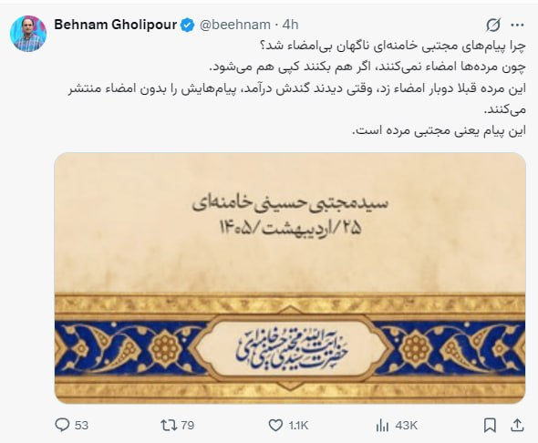

واقعا چرا ؟

📌 @persian_trend_official
پرشین ترند | متفاوت‌ترین کانال نظامی

## Persian_Trend_Official — post 14197

  <a href="telegram/content/Persian_Trend_Official_14197_1778862500.mp4" target="_blank">🎬 Download video</a>

محمد منان رئیسی، نماینده مجلس: خسارت مستقیم جنگ به ایران فقط ۳۰ میلیارد دلار برآورد می‌شود در حالی که درآمد هر سال عوارض تنگه هرمز ۵۰ میلیارد دلار خواهد بود !!!

📌 @persian_trend_official
پرشین ترند | متفاوت‌ترین کانال نظامی

## RadioFarda — post 157230

🔸امارات متحده عربی روز جمعه ۲۵ اردیبهشت «تلاش‌ها برای توجیه حملات تروریستی ایران» را رد کرد و گفت که حق پاسخگویی به هرگونه تهدید، ادعا یا اقدام خصمانه ایران را برای خود محفوظ می‌دارد. 🔸در بیانیه وزارت خارجه امارات آمده است که خلیفه بن شاهین المرر، وزیر مشاور…

## RadioFarda — post 157229

  

🔸امارات متحده عربی روز جمعه ۲۵ اردیبهشت «تلاش‌ها برای توجیه حملات تروریستی ایران» را رد کرد و گفت که حق پاسخگویی به هرگونه تهدید، ادعا یا اقدام خصمانه ایران را برای خود محفوظ می‌دارد.

🔸در بیانیه وزارت خارجه امارات آمده است که خلیفه بن شاهین المرر، وزیر مشاور در امور خارجه، «به‌طور قاطع ادعاهای ایران و تلاش‌ها برای توجیه حملات تروریستی ایران که امارات و دیگر کشورها را هدف قرار داده است، رد کرد».

🔸این بیانیه در پی نشست روز ۲۴ اردیبهشت بریکس در دهلی نو منتشر شد که در آن‌جا عباس عراقچی، وزیر خارجه ایران، با اشاره به حملات آمریکا و اسرائیل، گفت: «امارات شریک فعال این تجاوز است و هیچ تردیدی در این باره وجود ندارد».

@RadioFarda

## RadioFarda — post 157228

  <a href="https://t.me/radiofarda/157228" target="_blank">📎 Download file</a>

🔸 در این کافه‌ فردا به صحبت‌های معاون وزیر بهداشت در مورد هانتاویروس، سر دادن نوحه‌های کودکانه برای مجتبی‌ خامنه‌ای در تجمعات، گزارش‌های کذب رسانه‌های حکومتی در مورد اعطای نشان به سفیر جمهوری اسلامی در واتیکان، شروع پخش سریال فصل جدید سریال برلین می‌پردازیم و زندگی و آثار منوچهر سخایی و ادل را مرور می‌کنیم.

🔸 برای تماس با ما می‌توانید به شناسه کافه فردا در تلگرام صوت و متن بفرستید.

📻 کافه فردا

## RadioFarda — post 157227

  

🔸مولوی عبدالحمید اسماعیل‌زهی، امام جمعه اهل سنت زاهدان، روز جمعه ۲۵ اردیبهشت از افزایش اعدام‌ها در ایران انتقاد کرد و خواستار توقف «اعدام‌های سیاسی» شد.

🔸او در سخنرانی نماز جمعه زاهدان گفت این اعدام‌ها «به خیر کشور و به مصلحت حاکم و مردم نیستند» و افزود اعدام راه‌حل مشکلات کشور نیست.

🔸مولوی عبدالحمید همچنین با انتقاد از «اعتراف اجباری» در بازداشتگاه‌ها گفت چنین اعترافاتی با شریعت اسلام، قانون اساسی ایران و قوانین بین‌المللی «مطابقت ندارد» و نباید مبنای صدور حکم قرار گیرد.

🔸از زمان حملات آمریکا و اسرائیل به ایران، جمهوری اسلامی اجرای احکام اعدام را افزایش داده است و در برخی روزها چند نفر را اعدام کرده است.

🔸بر اساس گزارش مشترک سازمان «حقوق بشر ایران» مستقر در نروژ و سازمان «با هم علیه مجازات اعدام» مستقر در پاریس، که ۲۴ فروردین امسال منتشر شد، ایران در سال ۲۰۲۵ دست‌کم «یک هزار و ۶۳۹ نفر» را اعدام کرده‌ است. این «بالاترین» تعداد اعدام طی یک‌سال در ایران از سال ۱۳۶۸ تاکنون است.

@RadioFarda

## RadioFarda — post 157226

  

🔸وزیر خارجه پاکستان اعلام کرد که یازده شهروند پاکستانی و ۲۰ شهروند ایرانی که در کشتی‌های توقیف‌شده توسط آمریکا در آب‌های آزاد گرفتار شده بودند، به اسلام‌آباد منتقل می‌شوند.

🔸اسحاق دار روز جمعه ۲۵ اردیبهشت در شبکه ایکس نوشت: «خوشحالم که اعلام کنم ما در بازگرداندن یازده شهروند پاکستانی، همراه با ۲۰ شهروند کشور برادر ایران، از طریق سنگاپور موفق بوده‌ایم؛ افرادی که در کشتی‌های توقیف‌شده توسط ایالات متحده در آب‌های آزاد حضور داشتند».

🔸وزیر خارجه پاکستان افزوده که همه این افراد در «سلامت کامل» هستند و «روحیه خوبی» دارند.

🔸اسحاق دار افزوده که «تمامی این افراد از سنگاپور به بانکوک رسیده‌اند و اکنون سوار پروازی شده‌اند که قرار است اواخر امشب به اسلام‌آباد برسد. سپس بازگشت برادران ایرانی به وطن خود تسهیل خواهد شد».

🔸او از دولت آمریکا و مارکو روبیو، وزیر خارجه این کشور، و نیز وزیر خارجه سنگاپور و مقام‌های دولت این کشور و عباس عراقچی، وزیر خارجه ایران، بابت «اعتمادی که به پاکستان برای بازگرداندن برادران ایرانی‌مان داشت»، قدردانی کرده است.

@RadioFarda

## IranianMinds — post 20201

🔴 طبق گزارش خبرنگاران آمریکایی، پیش از سوار شدن به «ایرفورس وان»، سرویس مخفی آمریکا تمام وسایل و هدایایی را که طرف چینی داده بود از جمله کارت‌ها، نشان‌ها، تلفن‌های موقت و اقلام هدیه جمع کردند و داخل سطل زباله انداختند و اجازه ندادند چیزی از چین وارد هواپیما شود.

@IranianMinds

## IranianMinds — post 20200

🔴 یک مقام وزارت خارجه آمریکا به الجزیره گفت فضای دومین روز مذاکرات میان لبنان و اسرائیل بسیار مثبت بوده و روند گفت‌وگوها فراتر از انتظارها پیش رفته است.

این دومین روز از سومین دور مذاکرات میان اسرائیل و لبنان با میانجی‌گری ایالات متحده بود.

@IranianMinds

## IranianMinds — post 20199

  <a href="https://t.me/IranianMinds/20199" target="_blank">📎 Download file</a>

📲#اپلیکیشن اندروید سایت جهانی دربی بت
👍اسپانسر لیگ انگلیس👍
🔥امکان شارژ امن از طریق کارت بانکی
➖➖➖➖➖➖➖➖➖
🪙همین حالا عضو شوید 👇
https://t.me/+aCbq7yy8QY80NzQ0

## IranianMinds — post 20198

  

😤دنبال یه سایت شرط بندی بین المللی بودی که به ایرانیا خدمات بده؟!⛔

👍دربی بت همون انتخاب  100%

💎ویژگی های سایت جهانی Derby Bet:
⬅️امکان شارژ امن با کارت بانکی
⬅️واریز اول دوبل شارژ می شوید(بونوس۱۰۰٪)
⬅️پر اپشن ترین سایت فعال در ایران
⬅️تسویه حساب کمتر از 5 دقیقه
⬅️برگشت بخشی از باخت به صورت هفتگی

🚨کد هدیه ثبت نام:GG007

⚠️برای دانلود اپلکیشن کلیک کنید👉
ge25
🔔کانال دربی بت :
🪙https://t.me/+aCbq7yy8QY80NzQ0

## IranianMinds — post 20197

🔴کان‌نیوز:

علاوه بر نخست‌وزیر نتانیاهو، ایال زامیر رئیس کل ارتش اسرائیل هم سفری مخفیانه به امارات داشته است.

@IranianMinds

## IranianMinds — post 20196

🔴موسوی‌فرد، امام جمعه اهواز:

جمهوری اسلامی، آمریکا را در شرایطی قرار داده است که نه راه پس دارد و نه راه پیش.

@IranianMinds

## IranianMinds — post 20195

  

🔴خبرنگار نیویورک‌‌پست:

اعضای هیئت امریکایی همراه ترامپ، قبل از سوار شدن به ایر‌فورس‌وان و ترک چین، همه هدیه‌هایی که چینی‌ها بهشون داده بودند رو درون سطل زباله ریختند.

@IranianMinds

## IranianMinds — post 20194

  

🔴پست کاخ سفید در ایکس:
حمایت از آلبوم دریک.

@IranianMinds

## IranianMinds — post 20193

🔴وزیر امور‌خارجه چین:

ما خواستار بازگشایی هرچه سریعتر تنگه هرمز هستیم.

@IranianMinds

## BBCPersian — post 281143

  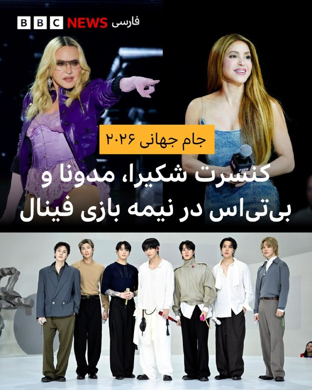

⚽️شکیرا،‌ مدونا و گروه پاپ کره‌ای بی‌تی‌اس قرار است بین دو نیمه فینال جام جهانی ۲۰۲۶ در ۱۹ جولای در نیوجرسی کنسرتی برگزار کنند.

این اجرا برای نخستین بار در تاریخ جام جهانی برگزار می‌شود و مشابه شوهای بین دو نیمه «سوپربال» فوتبال آمریکایی طراحی شده است. زمانش حدود ۱۱ دقیقه پیش‌بینی شده، هرچند برخی گزارش‌ها از طولانی‌تر بودن آن خبر داده‌اند.

شکیرا که پیش‌تر آهنگ «واکا واکا» را برای جام جهانی ۲۰۱۰ خوانده، قرار است دوباره ترانه رسمی جدیدی منتشر کند. مدونا در آستانه انتشار آلبوم جدید خود است و بی‌تی‌اس هم پس از وقفه‌ خدمت سربازی، در حال بازگشت و برگزاری تور جهانی هستند.

این برنامه را کریس مارتین، خواننده گروه راک کلدپلی سازماندهی می‌کند و هدف آن جمع‌آوری کمک مالی برای آموزش کودکان در جهان است. رئیس فیفا این رویداد را «لحظه‌ای تاریخی برای بزرگ‌ترین رویداد ورزشی جهان» توصیف کرده است.

طبق قوانین فوتبال، استراحت بین دو نیمه نباید بیش از ۱۵ دقیقه باشد
اما تجربه‌های مشابه، مانند فینال جام باشگاه‌های جهان ۲۰۲۵ در آمریکا، نشان داد که این اجراها زمان استراحت را به بیش از ۲۴ دقیقه هم می‌رسانند.
@bbcpersian

## BBCPersian — post 281142

  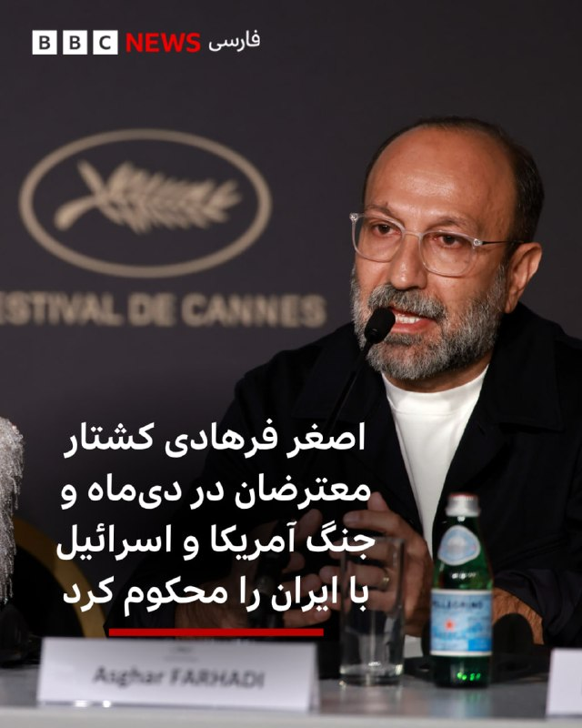

🔻اصغر فرهادی، کارگردان ایرانی برنده اسکار، در یک کنفرانس مطبوعاتی در جشنواره کن در پاسخ به سوال خبرنگار شبکه اینترنشنال هم حملات آمریکا و اسرائیل به ایران و هم سرکوب معترضان دی ۱۴۰۴ از سوی جمهوری اسلامی را محکوم کرد و گفت «کشته شدن هر انسانی، یک جنایت است چه در جنگ چه با اعدام و چه در اعتراضات.»

آقای فرهادی که برای اکران فیلم «داستان‌های موازی» در جشنواره کن حضور دارد، روز جمعه گفت: «من هفته گذشته تهران بودم و هنوز اثر این اتفاقات همراه من هست. یکی از این اتفاقات کشته شدن شمار زیادی از انسان‌های بی‌گناه، کودکان و غیرنظامیانی در جریان جنگ بود و مدتی قبل از آن، کشته شدن تعداد زیادی از معترضان در خیابان‌ها در دی ماه،انسان‌های بی‌گناه که معترض بودند. هردو بسیار دردناک است و هرگز فراموش نخواهد شد.»

او اضافه کرد که «مخالفت با کشته شدن بی‌گناهان و غیرنظامیان و انسان‎‌های عادی در جنگ به معنی موافقت با کشته شدن معترضان در خیابان‌ها نیست.»

اصغر فرهادی در ادامه گفت: «کشته شدن هر انسانی، یک جنایت است و با هر دیدگاهی، کشتن و قتل انسان‌ها برای من قابل پذیرش نیست، چه با جنگ، چه اعدام، چه کشتن معترضان.»
📷Getty
@BBCPersian

## Dirty_Kids — post 389504

  <a href="telegram/content/Dirty_Kids_389504_1778862508.mp4" target="_blank">🎬 Download video</a>

مبارزه بانو هایده در برابر معین به کمک مدل Seedance 2.0 در سرویس PolloAI!

@Dirty_Kids 👻

## Dirty_Kids — post 389503

  <a href="telegram/content/Dirty_Kids_389503_1778862510.mp4" target="_blank">🎬 Download video</a>

بحران زیست‌محیطی در خلیج فارس در پی نشت نفت از جزیره مارو

@Dirty_Kids 👻

## Dirty_Kids — post 389502

  

🌪وقتی اینترنت طوفانیه... کافیه بادبان ها رو بکشی تا

⚫️با بالاترین کیفیت ممکن
⚡️ 

⚫️100 هزار تومان شارژ هدیه 
🎁

⚫️پایین ترین قیمت گیگی 250
🌐 

⚫️و ارائه پورسانت %10 در ازای هر معرفی
💼

بتونی یه اتصال پایدار با پشتیبانی 24 ساعته داشته باشی
🚀

بادبان راهتو باز می‌کنه
⛵️

G25

🛡@BadBan_VPN | کانال 

🤖@BadBan_VPNBot | ربات 

📞@BadBan_VPNSupport | پشتیبانی

## Hranews — post 112952

  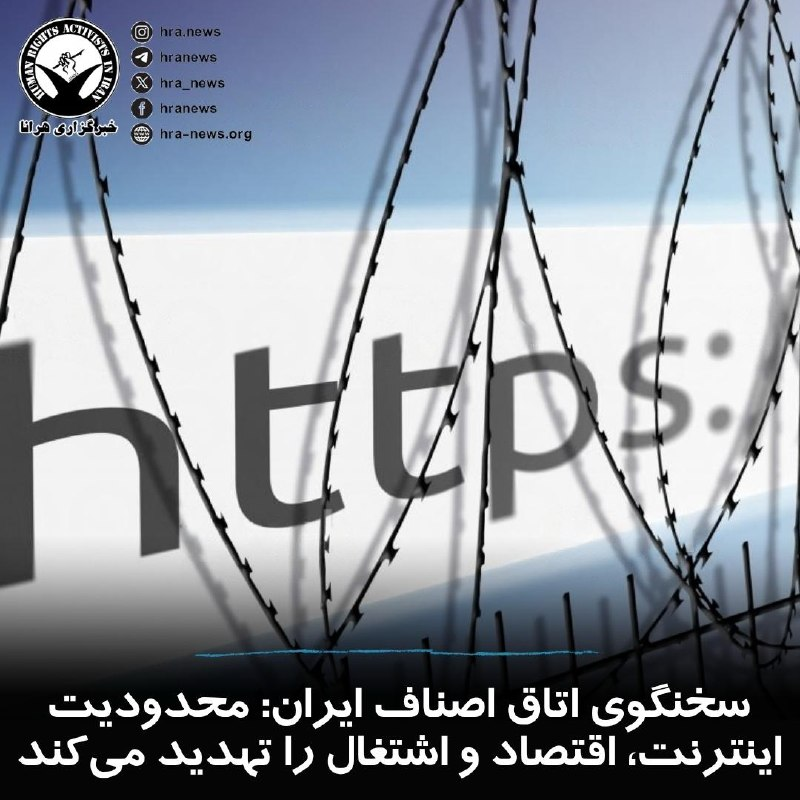

سخنگوی اتاق اصناف ایران با اشاره به گسترش نقش اقتصاد دیجیتال در بازار کشور اعلام کرد که تنها ۱۰ هزار کسب‌وکار مجازی دارای پروانه، طی سال گذشته حدود ۲۱۰۰ همت گردش مالی داشته‌اند. مهدی امیدوار در ادامه افزود: این آمار نشان می‌دهد اقتصاد دیجیتال به یکی از بخش‌های مهم و تأثیرگذار بازار تبدیل شده و عملکرد این گروه‌ها به «دسترسی پایدار و مؤثر» به #اینترنت وابسته است. به گفته وی، ناپایداری اخیر موجب کند شدن فرآیند خدمات‌رسانی و آسیب به بخشی از اقتصاد دیجیتال شده است. این در حالی است که فعالان این حوزه نیز تأکید دارند تداوم اختلال و ناپایداری اینترنت می‌تواند چرخه اقتصادی و روند فعالیت کسب‌وکارهای آنلاین را با مشکل مواجه کند.

↘️
@hranews_bot تماس ✉️ - @Hranews کانال هرانا 🆑

## manototv — post 105492

  <a href="telegram/content/manototv_105492_1778862514.mp4" target="_blank">🎬 Download video</a>

‌
اسحاق دار، وزیر خارجه پاکستان، اعلام کرد ۲۰ شهروند ایرانی که در کشتی‌های توقیف‌شده آمریکا در آب‌های بین‌المللی حضور داشتند، از طریق پاکستان به تهران بازگردانده خواهند شد.

دار گفت این افراد همراه با ۱۱ شهروند پاکستانی، از سنگاپور به بانکوک منتقل شدند و سپس با پرواز راهی اسلام‌آباد شدند. به گفته او، شهروندان ایرانی پس از ورود به پاکستان، برای انتقال به تهران همراهی خواهند شد.

وزیر خارجه پاکستان از وزیر خارجه آمریکا برای «هماهنگی نزدیک» در این عملیات، و از وزیر خارجه جمهوری اسلامی بابت «اعتماد به پاکستان» در روند بازگرداندن شهروندان ایرانی قدردانی کرد.

## manototv — post 105491

  <a href="telegram/content/manototv_105491_1778862515.mp4" target="_blank">🎬 Download video</a>

‌
وانگ یی، وزیر خارجه چین، گفت پکن معتقد است حل بحران تنگه هرمز در گرو دستیابی به «آتش‌بسی دائمی و جامع» میان آمریکا و جمهوری اسلامی است.

به گزارش خبرگزاری شینهوا، وانگ یی گفت رئیس‌جمهور چین در گفت‌وگو با دونالد ترامپ تأکید کرده که «زور نمی‌تواند مشکلات را حل کند و گفت‌وگو تنها مسیر درست است.»

وزیر خارجه چین افزود: «مذاکرات یک‌شبه به نتیجه نمی‌رسد، اما وقتی درِ گفت‌وگو باز شد، نباید دوباره بسته شود.»

او همچنین گفت چین برای پیشبرد مذاکرات صلح تلاش کرده و به ایفای نقش خود برای پایان سریع درگیری‌ها و بازگشت ثبات به خاورمیانه ادامه خواهد داد.

## manototv — post 105490

  <a href="telegram/content/manototv_105490_1778862516.mp4" target="_blank">🎬 Download video</a>

‌
کریس رایت، وزیر انرژی آمریکا، گفت به‌دلیل جنگ و تنش‌ها در خلیج فارس، چین احتمالاً خرید نفت از آمریکا را افزایش خواهد داد.

او در گفت‌وگو با سی‌ان‌بی‌سی گفت: «فکر می‌کنم چین به خرید مقادیر بیشتری از نفت آمریکا ادامه خواهد داد.»

رایت همچنین گفت جهان نیاز دارد تنگه هرمز دوباره به‌طور کامل باز شود و افزود: «تلاش ایران برای گروگان گرفتن جهان، موقتی است.»

وزیر انرژی آمریکا در پاسخ به این پرسش که بازگشت شرایط به وضعیت عادی چقدر زمان می‌برد، گفت: «بخش زیادی از آن به ایران بستگی دارد.»

او افزود: «به هر شکلی، برنامه هسته‌ای ایران پایان خواهد یافت و عبور آزادانه کشتی‌ها از تنگه هرمز برقرار خواهد شد. این می‌تواند در صورت توافق با ایران، نسبتاً سریع رخ دهد.»

## manototv — post 105489

  <a href="telegram/content/manototv_105489_1778862516.mp4" target="_blank">🎬 Download video</a>

عباس عراقچی، وزیر خارجه جمهوری اسلامی، با انتشار تصویری از دیدار با سابرامانیام جایشانکار، وزیر خارجه هند، در شبکه اِکس نوشت: «ایران همواره وظیفه تاریخی خود به‌عنوان حافظ امنیت در تنگه هرمز» را انجام خواهد داد.

عراقچی افزود در گفت‌وگویی «سازنده» با همتای هندی خود، درباره تحولات منطقه گفت‌وگو کرده و مدعی شد جمهوری اسلامی «شریکی قابل اعتماد برای همه کشورهای دوست» است و این کشورها می‌توانند به امنیت تجارت و کشتیرانی اعتماد کنند.

## alonews — post 120225

  <a href="telegram/content/alonews_120225_1778862517.webm" target="_blank">🎬 Download video</a>

👈فرانسه حضور ناو هواپیمابر شارل دوگل در تنگه هرمز را تکذیب کرد

وزارت نیروهای مسلح فرانسه:

🔴تحرکات این نا‌و بخشی از یک مأموریت دریایی گسترده‌تر در دریای سرخ و منطقه خلیج عدن است.

🔴گروه ضربت این ناو به انجام مأموریت‌های مربوط به تضمین آزادی ناوبری در آبراه‌های بین‌المللی، در چارچوب همکاری‌های چندملیتی در منطقه، بدون ورود مستقیم به تنگه هرمز ادامه می‌دهد.

✅ @AloNews خبر جنگ

## alonews — post 120224

  <a href="telegram/content/alonews_120224_1778862517.webm" target="_blank">🎬 Download video</a>

👈سواحل شمال‌غربی زیبای دریاچه ارومیه، امروز ۲۵ اردیبهشت

✅ @AloNews خبر جنگ

## alonews — post 120223

  <a href="telegram/content/alonews_120223_1778862518.webm" target="_blank">🎬 Download video</a>

👈فرمانده سنتکام گزارش‌ها درباره باقی ماندن توان موشکی جمهوری اسلامی را رد کرد

وال استریت ژورنال گزارش داد فرمانده سنتکام ادعاهای منتشرشده درباره باقی ماندن بخش بزرگی از موشک‌ها و پرتابگرهای جمهوری اسلامی را رد کرده است.

پیشتر واشنگتن پست نوشته بود ایران هنوز حدود ۷۵ درصد پرتابگرهای متحرک و حدود ۷۰ درصد ذخایر موشکی پیش از جنگ را در اختیار دارد، اما فرمانده سنتکام این روایت را زیر سوال برده است.

این تناقض مهم است، چون جنگ فقط با موشک و پهپاد ادامه ندارد، با عددسازی و تصویرسازی هم ادامه پیدا میکند. جمهوری اسلامی میخواهد نشان دهد هنوز دست بالا را دارد، اما واشنگتن تلاش میکند بگوید ستون تهدید موشکی تهران ضربه جدی خورده و دیگر مثل قبل قابل اتکا نیست.

✅ @AloNews خبر جنگ

## alonews — post 120221

👈حمله‌های امروزِ ارتش اسرائیل به جنوب لبنان

✅ @AloNews خبر جنگ

## alonews — post 120220

  <a href="telegram/content/alonews_120220_1778862518.webm" target="_blank">🎬 Download video</a>

👈رئیس ستاد کل ارتش اسرائیل هم به امارات سفر مخفیانه داشته

🔴به گزارش خبرگزاری کان اسرائیل، ایال زمیر، رئیس ستاد کل ارتش اسرائیل، در طول جنگ ایران سفری مخفیانه به امارات متحده عربی داشت و در آنجا با محمد بن زاید آل نهیان، رئیس امارات متحده عربی، گفتگو کرد.

✅ @AloNews خبر جنگ

## alonews — post 120219

  <a href="telegram/content/alonews_120219_1778862519.webm" target="_blank">🎬 Download video</a>

👈چین از پذیرش دعوت سفر شی به آمریکا خبر داد

🔴وانگ یی، وزیر خارجه چین اعلام کرد که شی جین‌پینگ رئیس جمهوری چین، دعوت ترامپ برای دیدار از آمریکا را پذیرفته است.

🔴این دیدار پاییز سال جاری انجام خواهد شد.

✅ @AloNews خبر جنگ

## alonews — post 120218

  <a href="telegram/content/alonews_120218_1778862519.webm" target="_blank">🎬 Download video</a>

👈رسایی:
هر صحبت یا مذاکره‌ای باید با اجازه مجلس باشه

✅ @AloNews خبر جنگ

## alonews — post 120217

👈فروش کانفیگ متصل پایدار با ساب و مورد تایید مجموعه الونیوز
⬇️

🔔@FastProxyMakerBot

🔔@FastProxyMakerBot

✔️با خیال راحت و بدون دغدغه خرید کنید

---
📅 بروزرسانی: 1405/02/25 18:06
---

## VahidOOnLine — post 240326

  <a href="telegram/content/VahidOOnLine_240326_1778855781.mp4" target="_blank">🎬 Download video</a>

سازمان اطلاعات مرکزی آمریکا با انتشار تصاویری از هاوانا، حضور جان رتکلیف، رئیس این سازمان، در پایتخت کوبا را تایید کرد.

بر اساس گزارش فوربس مکزیک، رتکلیف در جریان این سفر با مقام‌های ارشد دولت کوبا دیدار کرد. این رسانه نوشت گفت‌وگوها درباره همکاری‌های اطلاعاتی، امنیت منطقه‌ای و وضعیت اقتصادی کوبا انجام شده است.

به نوشته فوربس مکزیک، رئیس سیا برای گفت‌وگوهای مستقیم با مقام‌های وزارت کشور کوبا و مسئولان نهادهای اطلاعاتی این کشور به هاوانا رفت. این گزارش، دیدار رتکلیف با مقام‌های کوبایی را نشستی کم‌سابقه در سطح بالا میان دو کشور توصیف کرده است.

در این گزارش آمده است که در جریان این سفر، رتکلیف با رائول رودریگز کاسترو، نوه رائول کاسترو و مشاور امنیتی، و همچنین لازارو آلوارز کاساس، وزیر کشور کوبا، دیدار کرد.
‌🏁 🇬🇧 ManotoTV

🤖 @VahidOOnLine

## VahidOOnLine — post 240325

  <a href="telegram/content/VahidOOnLine_240325_1778855782.mp4" target="_blank">🎬 Download video</a>

«جمهوری اسلامی قصد کشتن فاطمه سپهری را دارد»
‌🏁 🇬🇧 ManotoTV

🤖 @VahidOOnLine

## VahidOOnLine — post 240324

  <a href="telegram/content/VahidOOnLine_240324_1778855783.mp4" target="_blank">🎬 Download video</a>

«صدای بانو سپهری باشیم»
‌🏁 🇬🇧 ManotoTV

🤖 @VahidOOnLine

## VahidOOnLine — post 240323

  <a href="telegram/content/VahidOOnLine_240323_1778855784.mp4" target="_blank">🎬 Download video</a>

دونالد ترامپ در پاسخ به پرسشی درباره حمله به یک مدرسه دخترانه در روز نخست جنگ گفت این موضوع «در دست بررسی» است.

خبرنگاری از ترامپ پرسید که سنتکام روز گذشته درباره حمله به مدرسه دخترانه در روز اول جنگ مورد پرسش قرار گرفته بود. ترامپ در پاسخ گفت: «این در دست بررسی است.» او افزود چند موضوع دیگر نیز در دست بررسی قرار دارد، اما تاکید کرد که این مورد هم جزو پرونده‌های در حال بررسی است.

در ادامه، خبرنگار پرسید آیا امکان دریافت اطلاعات بیشتر درباره این موضوع وجود دارد و اشاره کرد که این حمله با یک واحد موشکی آمریکایی مرتبط بوده است.

ترامپ در پاسخ وارد موضوع بی‌بی‌سی شد و این رسانه را به جعل گفته‌هایش متهم کرد. او گفت بی‌بی‌سی «حرف‌های بدی» در دهان او گذاشته و بعد ناچار شده بپذیرد که آن گفته‌ها درست نبوده است.
‌🏁 🇬🇧 ManotoTV

🤖 @VahidOOnLine

## VahidOOnLine — post 240322

  

محمدنبی موسوی‌فرد، امام جمعه اهواز گفت: «در حال حاضر جمهوری اسلامی شرایطی برای آمریکا ایجاد کرده که نه راه پس دارد و نه راه پیش؛ دشمن باید بداند جمهوری اسلامی کاری کرده است که هیچ راه‌حل نظامی نمی‌تواند از عزت و اقتدار دفاعی و نظامی ما بکاهد.»

او ادامه داد: «نیروهای مسلح و بسیج نیز مانند گذشته، آمادگی کامل و کوبنده‌ای برای برخورد قاطع با هرگونه تجاوز دشمن را دارند.»
‌🏁 🇬🇧 IranintlTV

🤖 @VahidOOnLine

## VahidOOnLine — post 240321

  <a href="telegram/content/VahidOOnLine_240321_1778855786.mp4" target="_blank">🎬 Download video</a>

یک شهروند در پیام ارسالی خود به ایران اینترنشنال با اشاره به افزایش شدید قیمت داروها گفت که هزینه گچ گرفتن پای شکسته‌اش ۹ میلیون تومان شده است. پیام این مخاطب با هوش مصنوعی خوانده شده است.
‌🏁 🇬🇧 IranintlTV

🤖 @VahidOOnLine

## VahidOOnLine — post 240320

  

رییس‌کل دادگستری خراسان جنوبی اعلام کرد یک وکیل دادگستری در بیرجند در جریان اختلاف خانوادگی جان باخته است.

او گفت این وکیل زن پس از آن‌که همسرش با خودرو او را زیر گرفت، جان خود را از دست داد و پرونده این حادثه برای رسیدگی ویژه در دستگاه قضایی در حال بررسی است.

به گفته این مقام قضایی، متهم خود را به قوه قضاییه معرفی کرده است.
‌🏁 🇬🇧 IranintlTV

🤖 @VahidOOnLine

## VahidOOnLine — post 240319

  

♦️اسماعیل بقایی، سخنگوی وزارت خارجه جمهوری اسلامی با انتشار پیامی کوتاه به زبان عربی در شبکه اجتماعی ایکس، به گزارش‌ها درباره اقدامات امارات متحده عربی در دوران جنگ واکنش نشان داد و نوشت: «کسی که پنهانی خیانت کند، آشکارا رسوا می‌شود.» این پیام در حساب رسمی وزارت خارجه جمهوری اسلامی نیز با توضیح «خیانت به همسایه پنهان نمی‌ماند» بازتاب یافت.

در روزهای گذشته، گزارشی از سفر محرمانه بنیامین نتانیاهو، نخست‌وزیر اسرائیل به امارات متحده مطرح شد. دفتر نخست‌وزیر اسرائیل این گزارش را تایید کرد و این سفر را آغاز «یک پیشرفت تاریخی» دانست. امارات متحده عربی، این گزارش را تکذیب کرد. همچنین گزارش‌هایی از انجام حملات مستقیم به خاک ایران از سوی امارات مطرح شده است. عباس عراقچی، وزیر امور خارجه جمهوری اسلامی که برای شرکت در نشست وزیران خارجه کشورهای عضو بریکس در هند حضور دارد، این گزارش‌ها را تایید کرد.
‌🇸🇦 Indypersian

🤖 @VahidOOnLine

## VahidOOnLine — post 240318

  <a href="telegram/content/VahidOOnLine_240318_1778855789.mp4" target="_blank">🎬 Download video</a>

♦️ویدیوهای منتشر شده در شبکه‌های اجتماعی که گفته می‌شود مربوط به یکی از جزایر ایران است، آلودگی نفتی در سواحل این منطقه را در روز جمعه ۲۵ اردیبهشت نشان می‌دهد. در این تصاویر، لکه‌های نفتی در آب و آلودگی گسترده در نوار ساحلی قابل مشاهده است.

رویترز با انتشار تصاویر ماهواره‌ای که بین ۶ تا ۸ می (۱۶ تا ۱۸ اردیبهشت) ثبت شده‌اند، از وقوع یک نشت نفت گسترده در نزدیکی جزیره خارگ، اصلی‌ترین پایانه صادرات نفت ایران، خبر می‌دهند. این لکه نفتی که در تصاویر ماهواره‌های کوپرنیک به‌صورت توده‌ای خاکستری و سفید دیده می‌شود، منطقه‌ای به وسعت تقریبی ۴۵ تا ۹۵ کیلومتر مربع را در غرب این جزیره پوشانده است.

این درحالی است سازمان حفاظت محیط زیست ایران روز دوشنبه ۲۱ اردیبهشت ماه اعلام کرد لکه بزرگ مشاهده شده در آب‌های خلیج فارس در نزدیکی جزیره خارگ ناشی از تخلیه آب آلوده توازن یک نفت‌کش آسیب دیده بوده است.
‌🇸🇦 Indypersian

🤖 @VahidOOnLine

## VahidOOnLine — post 240317

  

سنتکام اعلام کرد از زمان آغاز محاصره دریایی بنادر و سواحل جنوب ایران، ۷۵ کشتی تجاری مجبور به تغییر مسیر شده‌اند و چهار کشتی نیز در پی حمله نیروهای آمریکا از کار افتاده‌اند.

پیش از این، سنتکام با انتشار تصویری از گشت‌زنی یک جنگنده پنهان‌کار اف-۳۵-ای نیروی هوایی بر فراز آب‌های منطقه‌ای نزدیک تنگه هرمز خبر داد.
‌🏁 🇬🇧 IranintlTV

🤖 @VahidOOnLine

## VahidOOnLine — post 240316

  

مجتبی خامنه‌ای در پیامی منتسب به او به مناسبت روز پاسداشت زبان فارسی و بزرگداشت فردوسی، زبان فارسی را یکی از پایه‌های هویت ایرانیان توصیف کرد و گفت تقویت این زبان می‌تواند به گسترش «تمدن ایرانی‌اسلامی» کمک کند.
او همچنین با اشاره به شاهنامه، از آن به‌عنوان اثری برای حفظ هویت، استقلال و ایستادگی ایرانیان یاد کرد.
در بخشی از این پیام نوشته شده: «داستانهای اسطوره‌ای فردوسی، واقعیت زندگی و شخصیت قهرمانانه‌ آنان بوده و مفاهیم انسان‌ساز، سلحشورانه، و قرآنی شاهنامه، همه‌ اقوام و اقشار ایران را در حفظ هویت، اصالت و استقلال خود و مبارزه با ضحاک‌وشان متجاوز، همدل و همراه و همساز می کند.»
‌🏁 🇬🇧 IranintlTV

🤖 @VahidOOnLine

## VahidOOnLine — post 240315

  

♦️ فریدریش مرتس، صدراعظم آلمان، روز جمعه ۲۵ اردیبهشت، از گفتگوی تلفنی «مثبت و سازنده» با دونالد ترامپ، رئیس‌جمهوری آمریکا، خبر داد. این تماس در حالی انجام شد که اخیرا اعلام خبر خروج ۵ هزار سرباز آمریکایی از خاک آلمان، روابط دو کشور را دچار تنش کرده بود؛ اما پیام اخیر مرتس نشان‌دهنده تلاش برای عبور از این اختلافات است.

مرتس در شبکه اجتماعی ایکس اعلام کرد که دو طرف بر سر اهداف کلیدی واشنگتن در قبال جمهوری اسلامی اتفاق نظر دارند. او تاکید کرد: «ما توافق داریم که ایران باید فورا به میز مذاکره بازگردد، تنگه هرمز را باز کند و تحت هیچ شرایطی نباید اجازه دستیابی به سلاح هسته‌ای به تهران داده شود.»

علاوه بر موضوع ایران، رهبران دو کشور درباره دستیابی به راهکاری صلح‌آمیز برای اوکراین و هماهنگی مواضع پیش از نشست آتی ناتو در آنکارا گفتگو کردند. آلمان که بزرگ‌ترین اقتصاد اروپا و حامی اصلی نظامی اوکراین محسوب می‌شود، در دوران مرتس تقویت توان دفاعی خود را برای کاهش وابستگی به ایالات متحده و مقابله با تهدیدات روسیه در اولویت قرار داده است.
‌🇸🇦 Indypersian

🤖 @VahidOOnLine

## VahidOOnLine — post 240314

🗣روایت شما از بحران اقتصادی و زندگی در آتش‌بس- جمعه ۲۵ اردیبهشت:

🔹برای پایان‌نامه مجبور شدم اینترنت پرو بخرم، با مالیاتش شد ۲ میلیون و ۱۷۰ هزار تومان. قبلش هم اشتراک چت‌جی‌پی‌تی و سامانه «شکن» را گرفته بودم ولی جوابگو نبود. چند میلیون باید برای چیزی هزینه کنی که حقته اما ازت گرفتنش.

🔹 از زمان شروع جنگ تا الان قطعی اینترنت کلی هزینه اضافی رو دستمون گذاشته. ۱۰ گیگ یک ماهه خریدم، ولی ظرف دو هفته تمام شد.

🔹 من اختلال دوقطبی دارم و باید دارو مصرف گنم اما داروهای اعصاب و روان به‌شدت گران و نایاب شده و این موضوع من را به‌شدت نگران کرده، چون تاثیر بدی در روند درمانم دارد.

🔹 مغازه‌ام در پاساژ ارغوان بود که ۱۵ اردیبهشت سوخت و هیچی ازش نموند. حکومت تلاشی برای خاموش کردن آتش نکرد. من و کسبه ارغوان از کجا می‌خواهیم الان کار کنیم، جنس بخریم و تو این وضعیت خرج خونه دربیاریم؟

🔹 من یک زن ۲۵ ساله هستم. سال‌ها امیدم این بود که یک روز مهاجرت می‌کنم و برای همان تلاش کردم. الان با این وضعیت که آیلتس دیگر در ایران برگزار نمی‌شود، اینترنت قطع شده و همه‌چیز ۱۰ برابر گران‌تر شده، حتی نمی‌دانم دیگر به چه آینده‌ای دل ببندم. تمام آرزوهایی که داشتم یکی‌یکی ازم گرفته شدند و الان فقط به این فکر می‌کنم که هفته بعد چطور پولم را نگه دارم که به آخر ماه برسد و چطور قسطی دستمال کاغذی و گوشت و روغن بخرم.

🔹 گناه ما چیست که نمی‌توانیم مثل بقیه آدم‌های این دنیا یک زندگی عادی داشته باشیم؟ برای خوشبختی‌های ساده باید فقط از تخیلاتمان استفاده کنیم. تمام دوستام کارشان با اینترنت بود و الان کارشان را از دست دادند و همه اطرافیانم فقط منتظرند ببینند «چی می‌شه». تا کی باید در این برزخ زندگی کنیم؟
‌🏁 🇬🇧 IranintlTV

🤖 @VahidOOnLine

## VahidOOnLine — post 240313

  

دونالد ترامپ گفت آمریکا ممکن است در مقطعی برای حذف آنچه «گرد و غبار هسته‌ای» نامید وارد ایران شود. ترامپ در مسیر بازگشت به آمریکا و در هواپیمای ریاست‌جمهوری، ایر فورس وان، به خبرنگاران گفت: «در زمان مناسب، یا وارد می‌شویم یا آن را به دست می‌آوریم. فکر می‌کنم احتمالا آن را به دست می‌آوریم، اما اگر به دست نیاوریم، وارد خواهیم شد.»

او افزود: «فکر می‌کنم آنها کاملا شکست خواهند خورد و ما هیچ خطری نخواهیم داشت. ما تجهیزات لازم برای خارج کردن آن را داریم، هیچ‌کس دیگر ندارد؛ شاید چین چنین تجهیزاتی داشته باشد.»

ترامپ پیش‌تر نیز در ماه مارس در کاخ سفید درباره ذخایر اورانیوم غنی‌شده جمهوری اسلامی هشدار مشابهی داده و گفته بود: «یا آن را از آنها پس می‌گیریم یا آن را برمی‌داریم.»
‌🏁 🇬🇧 IranintlTV

🤖 @VahidOOnLine

## VahidOOnLine — post 240312

  

احمد علم‌الهدی، امام جمعه مشهد گفت: «آمریکا اگر بخواهد جنگ را ادامه بدهد، قطعا شکست بیشتری عاید او می‌شود، چون امروز قدرت و توان ما با روز اول جنگ خیلی تفاوت دارد، اگرچه ما در روز اول جنگ کمی غافلگیر شدیم اما اکنون رزمندگان ما آماده‌تر شدند و مسلما شکست آمریکا از اول بیشتر خواهد بود و کمتر نیست.»

او افزود: «در این جنگ ثابت شد که پدافند آمریکایی اصلا کارآمد نیست و حتی نتوانست یکی از موشک‌های ما را رهگیری کند، موشک‌های ما نیز با موفقیت به محل مورد نظر اصابت می‌کرد.»

او ادامه داد: «رزمندگان ما توانستند یک ابرقدرت روی کره زمین را به زانو درآورند و از مقام ابرقدرتی ساقط کنند.»
‌🏁 🇬🇧 IranintlTV

🤖 @VahidOOnLine

## VahidOOnLine — post 240311

  <a href="telegram/content/VahidOOnLine_240311_1778855793.mp4" target="_blank">🎬 Download video</a>

♦️دونالد ترامپ، رئیس‌جمهوری ایالات متحده، روز جمعه ۲۵ اردیبهشت در مسیر بازگشت از چین در پاسخ به خبرنگاران، درباره آخرین پیشنهاد ایران در مذاکرات هسته‌ای گفت که آن را «از همان جمله اول» رد کرده است.
او با بیان اینکه محتوای ابتدایی این پیشنهاد «غیرقابل قبول» بوده، افزود: «حتی ادامه آن را هم نخواندم.» ترامپ تأکید کرد که صرف تعیین بازه زمانی مانند ۲۰ سال کافی نیست و آنچه اهمیت دارد، ارائه تضمین‌های واقعی و قابل اجرا از سوی ایران است.
رئیس‌جمهوری آمریکا همچنین تصریح کرد که، هرگونه توافق باید شامل انتقال کامل مواد و سوخت هسته‌ای از ایران باشد و افزود که توافقی مبتنی بر «حرف‌های توخالی» قابل پذیرش نخواهد بود.
‌🇸🇦 Indypersian

🤖 @VahidOOnLine

## VahidOOnLine — post 240310

  

♦️ مجتبی خامنه‌ای، سومین رهبر جمهوری اسلامی، در پیامی کتبی به مناسبت روز بزرگداشت فردوسی، با زبانی آمیخته به مفاهیم اسطوره‌ای و ایدئولوژیک، بر پیوند میان «هویت ایرانی» و «تمدن اسلامی» تاکید کرد. او در این پیام با اشاره به آنچه «دفاع مقدس سوم» نامید، مدعی شد که مردم ایران در جنگ اخیر نیز همچون درگیری‌های پیشین، واقعیتِ «داستان‌های قهرمانانه شاهنامه» را رقم زده‌اند.

مجتبی خامنه‌ای که از زمان هدف قرار گرفتن در حملات آمریکا و اسرائیل، دیده نشده و صدایی نیز از او شنیده نشده است، در بخشی از پیام خود، متجاوزان را «ضحاک‌وشان» نامید و حفظ استقلال کشور را در گرو مبارزه با آن‌ها دانست. او همچنین با حمله به «سبک زندگی آمریکایی»، خواستار مقابله با «تهاجم زبانی و فرهنگی» غرب شد و از اهالی هنر خواست تا با «بعثت فکری»، روایتِ به گفته او «خیزش ملت» را ماندگار کنند.

استفاده از نمادهای ملی‌گرایانه نظیر شاهنامه و فردوسی، بعد از اولین حمله مستقیم اسرائیل در سال ۱۴۰۴ در ادبیات رسمی رهبران جمهوری اسلامی رواج یافته است.
‌🇸🇦 Indypersian

🤖 @VahidOOnLine

## VahidOOnLine — post 240309

  

فریدریش مرز، صدراعظم آلمان، روز جمعه اعلام کرد پس از سفر دونالد ترامپ به چین با او تماس تلفنی داشته و دو طرف درباره ضرورت بازگشت جمهوری اسلامی به میز مذاکره توافق کرده‌اند.

مرز گفت در این گفت‌وگو تاکید شده است که جمهوری اسلامی باید تنگه هرمز را باز کند و نباید اجازه داده شود به سلاح هسته‌ای دست یابد.

صدراعظم آلمان در پیام‌هایی در شبکه ایکس افزود او و ترامپ همچنین درباره دستیابی به راه‌حل مسالمت‌آمیز برای اوکراین گفت‌وگو کرده و پیش از نشست ناتو در آنکارا مواضع خود را هماهنگ کرده‌اند.

او تاکید کرد ایالات متحده و آلمان شریکانی قدرتمند در چارچوب ناتوی قدرتمند هستند.
‌🏁 🇬🇧 IranintlTV

🤖 @VahidOOnLine

## VahidOOnLine — post 240308

🗣روایت شما از بحران اقتصادی و زندگی در آتش‌بس- جمعه ۲۵ اردیبهشت:

🔹در وضعیت بدی قرار داریم اما در حال حاضر کاری از دست ما برنمیاد جز صبور بودن و منتظر زمان درست بودن. با این سفره‌های خالی و جنایات انقلاب شیر و خورشید، مردم از قبل بیشتر عصبانی شده‌اند و این عصبانیت یک روزی از یک جایی بیرون خواهد زد.

🔹از اصفهان پیام می‌دم من یه جوان ۲۵ ساله‌ام با شغل فنی که دیگه امیدی به آینده‌م ندارم. هر چقدر بیشتر کار می‌کنم کمتر درآمد دارم. با وام و قرض گرفتن ابزار کار خریدم که کار کنم ولی الان ۳ ماهه که بیکارم. فکر کنم تا چند وقت دیگه یا باید برم زندان یا متواری بشم.

🔹مردم از بی اینترنتی خسته شدن، قیمت کانفیگ‌ها بسیار بالاست. گرونی بی‌داد می‌کنه. یک نوشابه ۱.۵ لیتری ۱۱۰ هزار تومانه، لیوان یک بار مصرف به‌شدت گران شده.

🔹ما کشاورزیم، اوضاع برامون خیلی سخت شده، قیمت یک کیسه کود شیمیایی فسفات به ۱۰ میلیون تومان رسیده.

🔹برای اکثر معلولان ماهیانه تنها دو میلیون و ۱۰۰ هزار تومان به عنوان مستمری یا کمک مالی واریز می‌شه که برای تهیه ارزان‌ترین غذا (تخم‌مرغ) هم کافی نیست.

🔹در ایلام اوضاع خیلی خیلی خرابه. اگه در همه شهرها گرونی و کمبود خیلی چیزا هست اما این‌جا وضعیت در حد سونامی و انفجاره. کرایه خونه تو ایلام ۱۲۰ برابر شده. صاحبخونه ۱۰ روز بهم فرصت داده خونه رو خالی کنم اما جایی رو پیدا نمی‌کنم.

🔹یک قوطی رنگ روغن اول اردیبهشت در مشهد ۴۰۰ هزار تومان بود امروز شده ۶۵۰ هزار تومان.
‌🏁 🇬🇧 IranintlTV

🤖 @VahidOOnLine

## VahidOOnLine — post 240307

  <a href="telegram/content/VahidOOnLine_240307_1778855794.mp4" target="_blank">🎬 Download video</a>

وزارت خارجه آمریکا اعلام کرد این کشور در عملیاتی محرمانه، حدود ۱۳ و نیم کیلوگرم اورانیوم غنی‌شده را از یک رآکتور تحقیقاتی تعطیل‌شده در ونزوئلا خارج کرده است.

بر اساس اعلام وزارت خارجه آمریکا، این عملیات به رهبری واشینگتن و با همکاری شرکای بین‌المللی انجام شد و هدف آن کاهش خطر سوءاستفاده از مواد هسته‌ای و تقویت امنیت هسته‌ای عنوان شده است.

اداره ملی امنیت هسته‌ای آمریکا، وابسته به وزارت انرژی، نیز اعلام کرده است همه اورانیوم غنی‌شده باقی‌مانده از یک رآکتور تحقیقاتی قدیمی در ونزوئلا خارج شده است. این نهاد گفت این عملیات در چند ماه انجام شد، در حالی که در شرایط عادی ممکن بود سال‌ها طول بکشد.
‌🏁 🇬🇧 ManotoTV

🤖 @VahidOOnLine

## WithYashar — post 11292

وزیر نیروهای مسلح فرانسه: ناو هواپیمابر «شارل دوگل» در دریای عرب مستقر شده و ماموریت آن «دفاعی» است.
@withyashar

## WithYashar — post 11291

  <a href="telegram/content/WithYashar_11291_1778855795.mp4" target="_blank">🎬 Download video</a>

خبرنگار: دیروز از دریادار کوپر درباره حمله به مدرسه دخترانه(میناب)در روز اول جنگ سؤال شد.
ترامپ: منظورتون همون حمله اولیه‌ست؟ اون موضوع هنوز تحت تحقیق قرار داره.
خبرنگار: می‌تونید تأیید کنید که موشک آمریکایی بوده؟
ترامپ: شما از کدوم رسانه‌ای هستید؟
خبرنگار: بی‌بی‌سی.
ترامپ: بی‌بی‌سی فیکه با من حرف نزن.
@withyashar

## mwarmonitor — post 9131

  

✈️🇬🇧نیروی هوایی سلطنتی بریتانیا (RAF) استقرار جنگنده‌های لایتنینگ

دو فروند تانکر Airbus KC.2 Voyager
43C6F4 ZZ331 – ASCOT 9211
43C6FB ZZ338 – ASCOT 9212

✈️دو تانکر KC.2 Voyager بعدازظهر امروز از RAF Akrotiri به سمت RAF Brize Norton در حال پرواز هستند. هم‌زمان، دو دسته پروازی از جنگنده‌های F-35B نیز در مسیر بازگشت به پایگاه RAF Marham قرار دارند.

✈️در مجموع شش فروند F-35B به آکروتیری اعزام شده بودند و با توجه به استفاده از دو تانکر در این مأموریت، به احتمال زیاد هر شش فروند در حال بازگشت به کشور هستند.

@mwarmonitor

## mwarmonitor — post 9129

  

🇺🇸یک بالگرد MH-60R Sea Hawk از عرشه ناو جنگی USS Rafael Peralta (DDG 115) در حالی که نیروهای آمریکایی در دریای عرب در حال اجرای محاصره دریایی علیه ایران هستند، برخاست. تا امروز، ۷۵ کشتی تجاری منحرف شده و ۴ کشتی برای تضمین رعایت مقررات از کار افتاده‌اند.

@mwarmonitor

## mwarmonitor — post 9128

🇺🇸فرمانده سنتکام: عملیات «خشم حماسی» ایران را فلج و مشارکت‌های نظامی در منطقه را تقویت کرد

وزارت جنگ ایالات متحده 🇺🇸

🔸به گفته رهبران وزارت جنگ، ایالات متحده در اواخر فوریه عملیات «خشم حماسی» (Epic Fury) را آغاز کرد و از آن زمان، نیروهای نظامی آمریکا در منطقه عملیاتی فرماندهی مرکزی (سنتکام)، توان نظامی ایران و قدرت نفوذ آن را فلج کرده‌اند. این عملیات همچنین نقش شرکای نظامی در منطقه را برجسته کرد.

دریاسالار برد کوپر، فرمانده سنتکام، امروز در واشینگتن در برابر کمیته نیروهای مسلح سنا شهادت داد. این جلسه بخشی از بررسی‌های مربوط به وضعیت نیروها در منطقه و بخش مربوط به این فرماندهی در درخواست بودجه ریاست‌جمهوری برای سال مالی ۲۰۲۷ بود. محور اصلی گفتگوها در کپیتال هیل بر موفقیت‌های عملیات «خشم حماسی» متمرکز بود.
کوپر خطاب به قانون‌گذاران گفت: «در کمتر از ۴۰ روز، نیروهای سنتکام به اهداف نظامی خود دست یافتند. قابل‌توجه‌ترین دستاورد این بود که ما توانایی ایران برای صدور قدرت به خارج از مرزهایش و تهدید منطقه و منافعمان را تضعیف کردیم.»
کوپر به یاد قانون‌گذاران آورد که در آوریل و اکتبر سال گذشته، ایران صدها موشک را بر سر اسرائیل فرود آورد؛ اما اکنون پس از آنکه نیروهای آمریکایی به‌طور مؤثری ظرفیت موشک‌های متعارف ایران را از بین بردند، این کشور دیگر چنین توانایی ندارد.
او گفت: «امروز ایران دیگر نمی‌تواند با آن حجم و مقیاس حمله کند. علاوه بر این، با نابودی ۹۰ درصد از پایگاه‌های صنایع دفاعی ایران، این کشور تا سال‌ها قادر به بازسازی آن سلاح‌ها نخواهد بود.»
اهداف راهبردی و نابودی توان نظامی
رئیس‌جمهور دونالد جی. ترامپ و دیگر مقامات دولت تصریح کرده‌اند که ایرانی‌ها هرگز به سلاح هسته‌ای دست نخواهند یافت. کوپر بیان کرد که اهداف نظامی در قالب عملیات «خشم حماسی» برای حمایت از این سیاست طراحی شده بود؛ از جمله تضعیف توانمندی موشک‌های بالستیک و نیروی دریایی ایران و همچنین نابودی توانایی صنایع این کشور برای بازسازی این تجهیزات.
صنایع دفاعی: ۹۰ درصد از زیرساخت‌های پهپادی، موشکی و دریایی تخریب شده و تنها ۱۰ درصد باقی مانده است.
نیروی دریایی: طبق ارزیابی نظامی، بازسازی نیروی دریایی ایران ۵ تا ۱۰ سال زمان خواهد برد.
گروه‌های نیابتی: حماس، حزب‌الله و حوثی‌ها به دلیل این عملیات، از تدارکات تسلیحاتی و پشتیبانی ایران قطع شده‌اند.
تقویت ائتلاف‌های منطقه‌ای
کوپر به قانون‌گذاران گفت که در حال حاضر هیچ منبع یا تجهیزاتی از ایران به سمت گروه‌های تروریستی نیابتی سرازیر نمی‌شود. او تأکید کرد که آغاز عملیات «خشم حماسی» نشان داد شرکای منطقه‌ای تا چه حد توانمند هستند و این عملیات باعث تقویت روابط نظامی شده است.
او افزود: «در حال حاضر، ما پنج کشور متحد خاص داریم که نه تنها در تئوری، بلکه در عمل شانه به شانه ایالات متحده در امور دفاعی ایستاده‌اند.»
شرکای کلیدی مورد تقدیر:
امارات متحده عربی، بحرین، کویت، قطر و عربستان سعودی (به عنوان شرکای استثنایی).
پادشاهی اردن (نقش حیاتی در موفقیت عملیات).

🔴دولت اسرائیل (همکاری بسیار نزدیک).
کوپر در پایان خاطرنشان کرد: «این نتیجه از پیش تعیین شده نبود و بر حسب تصادف به دست نیامد؛ بلکه حاصل ماه‌ها برنامه‌ریزی دقیق بر پایه دهه‌ها تجربه است.»

@mwarmonitor

## FoxNewsTwitter — post 341777

  

Fox News (Twitter/X)

“Senior’s Day at Gold’s in Venice.”

Health and Human Services Secretary Robert F. Kennedy Jr. and Hollywood icon Arnold Schwarzenegger showcase their longtime friendship during a workout session at Gold’s Gym Venice.

This isn’t the first time the pair have worked out together, the former governor gave a look inside their friendship during an interview last year, saying, "We've worked out together and go gym and stuff like that, and I always was a big supporter of his."

Schwarzenegger was previously married to Kennedy's cousin, journalist Maria Shriver, from 1986 until 2011.

## FoxNewsTwitter — post 341773

Fox News (Twitter/X)

DHS Secretary Markwayne Mullin joined ICE officers on the ground in Virginia during an early morning operation that resulted in the arrest of a repeat criminal illegal alien previously removed multiple times from the United States.

Mullin said the suspect’s record included drug possession and DUI charges while slamming Governor Spanberger’s sanctuary policies for making Virginia “a magnet for criminal illegal aliens.”

## FoxNewsTwitter — post 341772

  <a href="telegram/content/FoxNewsTwitter_341772_1778855798.mp4" target="_blank">🎬 Download video</a>

Fox News (Twitter/X)

WATCH: President Trump reacts to Secretary of State Marco Rubio’s viral Nike tracksuit:

"I thought he looked very good in the outfit. Listen, I don't know if I'd do it, but I thought he looked very good."

## FoxNewsTwitter — post 341771

  <a href="telegram/content/FoxNewsTwitter_341771_1778855799.mp4" target="_blank">🎬 Download video</a>

Fox News (Twitter/X)

WATCH: Country music star Eric Church describes the creative process behind his extremely personal UNC commencement speech, revealing he turned to his guitar after months of writer's block:

"Finally, one night, in a fit of frustration, I picked up my guitar just to kind of just to get away from the frustrating part of trying to write the speech. And as I was strumming the guitar, it just dawned on me. I hit all six strings and I thought, you know, hey, what what if I could make a speech out of these?" | @foxandfriends @ainsleyearhardt

## FoxNewsTwitter — post 341770

  <a href="telegram/content/FoxNewsTwitter_341770_1778855801.mp4" target="_blank">🎬 Download video</a>

Fox News (Twitter/X)

NEW: President Trump unleashes on Democratic Senate candidate James Talarico, labeling the Texas politician "pathetic" and "bad news" for the Lone Star State.

"I think the Democrats have a weird, a weird candidate. I mean, this guy is bad news.”

## FoxNewsTwitter — post 341769

  <a href="telegram/content/FoxNewsTwitter_341769_1778855803.mp4" target="_blank">🎬 Download video</a>

Fox News (Twitter/X)

NEW: President Trump clashes with a reporter on Air Force One during a feisty exchange about the U.S. military action in Iran as well as the regime's current capabilities:

"I had a total military victory. But the fake news guys like you write incorrectly. You're a fake guy. And guys like you write about it incorrectly. We had a total military victory. We knocked out their entire navy. We knocked out their entire Air force."

## pm_afshaa — post 90795

  <a href="telegram/content/pm_afshaa_90795_1778855805.webm" target="_blank">🎬 Download video</a>

🔴ترامپ: آمریکا ممکنه در مقطعی برای خارج کردن «گرد و غبار هسته‌ای» ایران، وارد عمل بشه؛ یا اونو به دست میاریم، یا اگر نشد، وارد میشیم؛ آمریکا تجهیزات لازم برای این کار رو در اختیار داره.

💧 Rainbet.com the #1 Non-KYC Crypto Casino & Sportsbook @rainbetcom

😁 @Pm_Afshaa

## pm_afshaa — post 90794

  <a href="telegram/content/pm_afshaa_90794_1778855805.webm" target="_blank">🎬 Download video</a>

🔴وزیر امور خارجه چین: ما خواستار بازگشایی هرچه سریع‌تر تنگه هرمز هستیم.

همچنین ما از آمریکا و ایران حمایت می‌کنیم تا به حل اختلافات و منازعات خود از طریق گفتگوها ادامه بدن.

💧 Rainbet.com the #1 Non-KYC Crypto Casino & Sportsbook @rainbetcom

😁 @Pm_Afshaa

## pm_afshaa — post 90793

  

جهت تبلیغات با بازدهی بالا میتونین دایرکت کانال پیام بدین

## pm_afshaa — post 90792

🔴ترامپ خطاب به خبرنگار نیویورک تایمز:من در ایران یک پیروزی کامل نظامی داشتم. اما فیک نیوزها، افرادی مثل تو، اخبار نادرست می‌نویسند. تو یک آدم جعلی هستی. ما یک پیروزی کامل نظامی داشتیم. من در واقع فکر می‌کنم آنچه می‌نویسی نوعی خیانت است. باید از خودت خجالت بکشی. من واقعاً فکر می‌کنم این خیانت است

💧 Rainbet.com the #1 Non-KYC Crypto Casino & Sportsbook @rainbetcom

😁 @Pm_Afshaa

## pm_afshaa — post 90791

  <a href="telegram/content/pm_afshaa_90791_1778855807.webm" target="_blank">🎬 Download video</a>

🔴سنتکام: تا امروز، 75 کشتی تجاری تغییر مسیر دادن و 4 کشتی غیرفعال شده تا اطمینان حاصل بشه که قوانین رعایت میشه.

💧 Rainbet.com the #1 Non-KYC Crypto Casino & Sportsbook @rainbetcom

😁 @Pm_Afshaa

## pm_afshaa — post 90790

  <a href="telegram/content/pm_afshaa_90790_1778855807.webm" target="_blank">🎬 Download video</a>

🔴تهران‌تایمز: آمریکا پیشنهاد 14 ماده‌ای جمهوری اسلامی برای پایان جنگ رو رد کرده و بار دیگر بر مواضع خود، به‌ویژه درباره پرونده هسته‌ای، تأکید کرده.

💧 Rainbet.com the #1 Non-KYC Crypto Casino & Sportsbook @rainbetcom

😁 @Pm_Afshaa

## pm_afshaa — post 90789

🔴دقایقی پیش ترامپ رسماً اعلام کرد که یه دور دیگر از عملیات نظامی آمریکا در ایران در راه است

+ترامپ:ما همه چیز را تمام نکردیم،
برمی‌گردیم و آن را تکمیل می‌کنیم،
حتی شاید بیشتر

💧 Rainbet.com the #1 Non-KYC Crypto Casino & Sportsbook @rainbetcom

😁 @Pm_Afshaa

## pm_afshaa — post 90788

♨️
♨️
♨️
♨️

## iaghapour — post 2612

کل ریپازیتوری گیت هاب علیرضا که شامل X-UI و S-UI میشد بسته شده و هنوز دلیلش مشخص نیست.

## DEJradio — post 4652

  <a href="telegram/content/DEJradio_4652_1778855807.webm" target="_blank">🎬 Download video</a>

🔺📢 آمریکا بر سر دو راهی؛
عملیات برای خارج کردن اورانیوم‌ها یا اقدام عملی برای سرنگونی جمهوری اسلامی

یکی از کارشناسان نظامی ایرانی‌الاصل که سابقه عضویت در ارتش ایالات متحده را دارد، به دژ گفت: در بین سیاستمداران و نظامیان آمریکا دیدگاهی وجود دارد که می‌گوید اگر قرار بر این باشد که برای خروج اورانیوم‌ها، اعزام نیرو و تجهیزات به داخل خاک ایران انجام شود، با توجه به حساسیت، زمان‌بر بودن این عملیات و پیش‌نیازهای آن از جمله:
•انهدام کامل سامانه‌های پدافند هوایی جمهوری اسلامی
•ایجاد فرودگاه موقت
•ایجاد کمربند امنیتی به شعاع چند کیلومتر
•استقرار سامانه‌های پدافند هوایی برد کوتاه برای مقابله با موشک‌های کوتاه‌برد و پهپادهای نظام
•انتقال تجهیزات و ماشین‌آلات لازم برای خاک‌برداری
•لزوم حضور کارشناسان اتمی غیرنظامی و لباس‌های مخصوص ضد تشعشعات
•چالش انتقال سیلندرهای سنگین حاوی اورانیوم غنی‌شده
•احتمال هدف قرار گرفتن پرنده حامل سیلندر اورانیوم و ایجاد یک فاجعه انسانی و محیط‌ زیستی
•زمان‌بر بودن این عملیات که ممکن است چند هفته طول بکشد
با توجه به موارد فوق که صرفاً بخشی از چالش‌های این عملیات است، دیدگاه دیگری نیز وجود دارد که به‌نظر می‌رسد حمایت بیشتری از سوی اسرائیل داشته باشد؛ اعزام نیروی زمینی و انتقال نیرو از طریق هوابرد و هلی‌برن جهت سرنگون کردن حکومت که البته این عملیات هم چالش های خود را خواهد داشت.

#جنگ #حمله_زمینی
@DEJradio

## DEJradio — post 4651

  <a href="telegram/content/DEJradio_4651_1778855808.webm" target="_blank">🎬 Download video</a>

🚨📢 دونالد ترامپ:
برای حذف گرد و غبار هسته‌ای ممکن است وارد ایران شویم

دونالد ترامپ گفت آمریکا ممکن است در مقطعی برای حذف آنچه «گرد و غبار هسته‌ای» نامید وارد ایران شود. ترامپ در مسیر بازگشت به آمریکا و در هواپیمای ریاست‌جمهوری، ایر فورس وان، به خبرنگاران گفت: «در زمان مناسب، یا وارد می‌شویم یا آن را به دست می‌آوریم. فکر می‌کنم احتمالا آن را به دست می‌آوریم، اما اگر به دست نیاوریم، وارد خواهیم شد.»

او افزود: «فکر می‌کنم آنها کاملا شکست خواهند خورد و ما هیچ خطری نخواهیم داشت. ما تجهیزات لازم برای خارج کردن آن را داریم، هیچ‌کس دیگر ندارد؛ شاید چین چنین تجهیزاتی داشته باشد.»

ترامپ پیش‌تر نیز در ماه مارس در کاخ سفید درباره ذخایر اورانیوم غنی‌شده جمهوری اسلامی هشدار مشابهی داده و گفته بود: «یا آن را از آنها پس می‌گیریم یا آن را برمی‌داریم.»

#ترامپ #حملات_هدفمند
@DEJradio

## DEJradio — post 4650

  <a href="telegram/content/DEJradio_4650_1778855808.webm" target="_blank">🎬 Download video</a>

🚨
⭕️ شش کشور عربی با شکایت از جمهوری اسلامی به شورای امنیت خواستار دریافت غرامت از تهران شدند

شش کشور عربی حوزه خلیج فارس در نامه‌ای به شورای امنیت سازمان ملل ادعای حکومت ایران درباره اداره یا وضع قواعد جدید برای تنگه هرمز را محکوم کردند. امارات متحده عربی نیز در نامه‌ای جداگانه به همین نهاد، جمهوری اسلامی را به حملات «عامدانه» به زیرساخت‌های حیاتی و غیرنظامی متهم کرد.
نسخه‌هایی از هر دو نامه در اختیار خبرنگار ایران‌اینترنشنال در سازمان ملل متحد قرار گرفته است.

خبرگزاری بنا، رسانه رسمی دولت بحرین، نیز پنج‌شنبه ۲۴ اردیبهشت اعلام کرد که این کشور همراه با امارات متحده عربی، عربستان سعودی، کویت، قطر و اردن در نامه‌ای فوری به دبیرکل سازمان ملل و شورای امنیت نسبت اظهارات مقام‌های جمهوری اسلامی درباره «مدیریت» تنگه هرمز و ایجاد «قوانین حقوقی» تازه برای این آبراه بین‌المللی را رد و محکوم کردند.

در این نامه، بر حق تمام این کشورها به «اتخاذ تصمیم‌های مشروع حاکمیتی در زمینه امنیت و مشارکت‌های بین‌المللی خود» تاکید شده است.
این کشورها نوشته‌اند که تنگه هرمز «یک آبراه بین‌المللی حیاتی برای کشتیرانی، تجارت و انرژی» است و هیچ کشوری، صرف‌نظر از موقعیت جغرافیایی‌اش، حق ندارد به‌تنهایی برای آن «اداره یک‌جانبه» یا «قواعد حقوقی منفرد» وضع کند.

#شورای_امنیت_سازمان_ملل #تنگه_هرمز
@DEJradio

## mamlekate — post 103528

  <a href="telegram/content/mamlekate_103528_1778855809.mp4" target="_blank">🎬 Download video</a>

دونالد ترامپ در پاسخ به پرسشی درباره پیشنهاد اخیر جمهوری اسلامی گفت این پیشنهاد را بررسی کرده، اما به گفته او، اگر از جمله نخست یک متن خوشش نیاید، بقیه آن را کنار می‌گذارد.

ترامپ در پاسخ به این پرسش که جمله نخست چه بوده است، آن را «غیرقابل قبول» توصیف کرد و گفت مسئله اصلی از نگاه او این است که ایران نباید «هیچ شکل» از برنامه هسته‌ای داشته باشد.

در ادامه، خبرنگار از ترامپ پرسید آیا دوره ۲۰ ساله برای او کافی نیست. ترامپ پاسخ داد که «۲۰ سال کافی است»، اما به گفته او، سطح تضمین‌هایی که جمهوری اسلامی ارائه می‌دهد اهمیت دارد.

ترامپ گفت که اگر قرار است توافقی ۲۰ ساله مطرح باشد، باید «۲۰ سال واقعی» باشد و نباید به گفته او، توافقی مبهم یا ظاهری باشد.

ManotoTV
@mamlekate

## mamlekate — post 103527

  

📞 سلام مملکته. درباره چندتا از دانشجویان دانشگاه پزشکی بلاروس پیام میدم. سفیر بیشرف جمهوری اسلامی در مینسک علیرضا صانعی مزدور دست نشانده جمهوری اسلامی به وزارت کشور بلاروس یادداشت فرستاده و دانشجویان مقیم و افراد مقیمی که در بلاروس زندگی میکنند و مخالف جمهوری اسلامی هستند را افراد خطرناک برای شهروندان بلاروس و حامی تروریسم معرفی کرده و با پیگیری پی در پی خود و دیپلماتهای سفارت و یادداشت های فراوان خواستار دیپورت این افراد از بلاروس به ایران و دستگیری آنها در ایران میباشد. لطفا صدای مارو به جهانیان برسونید. دولت بلاروس بخاطر یادداشتهای سفارت و ترس از ایجاد مشکلات دیپلماتی مجبور به این اقدام شده است حتی پس از پایان بازداشت بعضی افرادی که آزاد شدند سفیر مجدد پیگیری کرده و خواستار دیپورت آنها شده است. یکی از این افراد خاطره خدادادی و یکی دیگر دکتر سپهر فرشادی که نزدیک به دوهفته در بازداشت انفرادی بسر میبره و در آستانه ی دیپورت میباشد. دوستان دیگه ای هم در همین وضعیت هستند.

@mamlekate

## VahidOnline — post 75479

  <a href="telegram/content/VahidOnline_75479_1778855811.mp4" target="_blank">🎬 Download video</a>

دونالد ترامپ، رئیس‌جمهوری ایالات متحده، روز جمعه ۲۵ اردیبهشت در مسیر بازگشت از چین در پاسخ به خبرنگاران، درباره آخرین پیشنهاد ایران در مذاکرات هسته‌ای گفت که آن را «از همان جمله اول» رد کرده است.
او با بیان اینکه محتوای ابتدایی این پیشنهاد «غیرقابل قبول» بوده، افزود: «حتی ادامه آن را هم نخواندم.» ترامپ تأکید کرد که صرف تعیین بازه زمانی مانند ۲۰ سال کافی نیست و آنچه اهمیت دارد، ارائه تضمین‌های واقعی و قابل اجرا از سوی ایران است.
رئیس‌جمهوری آمریکا همچنین تصریح کرد که، هرگونه توافق باید شامل انتقال کامل مواد و سوخت هسته‌ای از ایران باشد و افزود که توافقی مبتنی بر «حرف‌های توخالی» قابل پذیرش نخواهد بود.
@VahidOOnLine
دونالد ترامپ در پاسخ به پرسشی درباره پیشنهاد اخیر جمهوری اسلامی گفت این پیشنهاد را بررسی کرده، اما به گفته او، اگر از جمله نخست یک متن خوشش نیاید، بقیه آن را کنار می‌گذارد.
ترامپ در پاسخ به این پرسش که جمله نخست چه بوده است، آن را «غیرقابل قبول» توصیف کرد و گفت مسئله اصلی از نگاه او این است که ایران نباید «هیچ شکل» از برنامه هسته‌ای داشته باشد.
در ادامه، خبرنگار از ترامپ پرسید آیا دوره ۲۰ ساله برای او کافی نیست. ترامپ پاسخ داد که «۲۰ سال کافی است»، اما به گفته او، سطح تضمین‌هایی که جمهوری اسلامی ارائه می‌دهد اهمیت دارد.
ترامپ گفت که اگر قرار است توافقی ۲۰ ساله مطرح باشد، باید «۲۰ سال واقعی» باشد و نباید به گفته او، توافقی مبهم یا ظاهری باشد.
@VahidOOnLine
دونالد ترامپ، رئیس جمهوری آمریکا روز جمعه ۲۵ اردیبهشت و در زمان بازگشت از چین به آمریکا در هواپیمای ایرفورس وان به خبرنگاران گفت با وجود آنکه نیروهای مسلح ایران در جنگ نابود شده‌اند، ممکن است نیاز به «یک پاکسازی کوچک» وجود داشته باشد.
ترامپ ساعاتی پیش در گفتگویی با فاکس‌نیوز هم گفته بود که نیروهای مسلح جمهوری اسلامی در چهار هفته گذشته، تلاش کرده‌اند تا تعدادی از پرتابگرهای موشکی را از زیر خاک بیرون بکشند و جای بعضی تجهیزات را عوض کنند، با این حال «آمریکا قادر است در دو روز همه این‌ها را نابود کند.»
@VahidOOnLine
دونالد ترامپ در پاسخ به پرسشی درباره اینکه آیا شی جین‌پینگ، رئیس‌جمهوری چین، تعهدی قاطع برای فشار بر جمهوری اسلامی به منظور بازگشایی تنگه هرمز داده است، گفت از کسی «درخواست لطف» نمی‌کند.
ترامپ گفت: «من درخواست هیچ لطفی نمی‌کنم، چون وقتی درخواست لطف می‌کنید، باید در مقابل لطفی انجام دهید.» او افزود که آمریکا به چنین کمکی نیاز ندارد.
رئیس‌جمهوری آمریکا در ادامه گفت نیروهای مسلح طرف مقابل «اساسا از بین رفته‌اند» و ممکن است به گفته او «کمی کار پاکسازی» لازم باشد. او همچنین به آتش‌بس اشاره کرد و گفت این آتش‌بس به درخواست کشورهای دیگر انجام شد.
ترامپ گفت شخصا چندان موافق آتش‌بس نبوده، اما آن را به عنوان لطفی به پاکستان پذیرفته است. او از مقام‌های پاکستانی، از جمله نخست‌وزیر و فیلدمارشال این کشور، با تعبیر «افرادی فوق‌العاده» یاد کرد.
@VahidOOnLine
دونالد ترامپ گفت آمریکا ممکن است در مقطعی برای حذف آنچه «گرد و غبار هسته‌ای» نامید وارد ایران شود. ترامپ در مسیر بازگشت به آمریکا و در هواپیمای ریاست‌جمهوری، ایر فورس وان، به خبرنگاران گفت: «در زمان مناسب، یا وارد می‌شویم یا آن را به دست می‌آوریم. فکر می‌کنم احتمالا آن را به دست می‌آوریم، اما اگر به دست نیاوریم، وارد خواهیم شد.»
او افزود: «فکر می‌کنم آنها کاملا شکست خواهند خورد و ما هیچ خطری نخواهیم داشت. ما تجهیزات لازم برای خارج کردن آن را داریم، هیچ‌کس دیگر ندارد؛ شاید چین چنین تجهیزاتی داشته باشد.»
ترامپ پیش‌تر نیز در ماه مارس در کاخ سفید درباره ذخایر اورانیوم غنی‌شده جمهوری اسلامی هشدار مشابهی داده و گفته بود: «یا آن را از آنها پس می‌گیریم یا آن را برمی‌داریم.»
@VahidOOnLine

📡 @VahidOnline

## VahidOnline — post 75478

  

نشست وزیران خارجهٔ کشورهای عضو بریکس در دهلی‌نو، پایتخت هند، به‌دلیل اختلاف‌نظر میان اعضا به‌خصوص بین ایران و امارات متحدهٔ عربی بر سر جنگ ایران، بدون صدور بیانیهٔ مشترک پایان یافت.

به‌گزارش رویترز، هند روز جمعه ۲۵ اردیبهشت اعلام کرد به‌جای بیانیهٔ مشترک، «بیانیهٔ رئیس» منتشر شده است، زیرا برخی اعضا دربارهٔ تحولات خاورمیانه دیدگاه‌های متفاوتی داشتند.

گروه بریکس شامل برزیل، روسیه، هند، چین، آفریقای جنوبی، اتیوپی، مصر، ایران، امارات متحدهٔ عربی و اندونزی است.

روز پنجشنبه رسانه‌های ایران از تنش لفظی در این نشست خبر دادند و نوشتند عباس عراقچی، وزیر خارجه ایران، امارات را به مشارکت مستقیم در جنگ آمریکا و اسرائیل علیه ایران متهم کرد و گفت میزبانی پایگاه‌های نظامی آمریکا از سوی ابوظبی و همکاری امنیتی این کشور با اسرائیل، آن را به بخشی از جنگ تبدیل کرده است.

روزنامهٔ لبنانی الاخبار نوشت که در مقابل، هیئت اماراتی خواهان آن بود که هر بیانیهٔ نهایی، حملات موشکی جمهوری اسلامی ایران به این کشور و توقیف کشتی‌ها را محکوم کند، در حالی که تهران بر درج محکومیت صریح حملات آمریکا و اسرائیل اصرار داشت.
@VahidHeadline

📡 @VahidOnline

## VahidOnline — post 75477

  

امارات متحده عربی اعلام کرد این کشور ساخت یک خط لوله جدید نفتی را برای دو برابر کردن ظرفیت صادرات نفت از طریق بندر فجیره تا سال ۲۰۲۷ تسریع خواهد کرد. این اقدام توانایی ابوظبی برای دور زدن تنگه هرمز را به‌طور چشمگیری افزایش خواهد داد.

دفتر رسانه‌ای دولت ابوظبی روز جمعه ۲۵ اردیبهشت اعلام کرد شیخ خالد بن محمد بن زاید، ولیعهد ابوظبی، به شرکت ملی نفت ابوظبی، ادنوک، دستور داده است اجرای پروژه خط لوله «غرب به شرق» را سرعت ببخشد. به‌گفتهٔ این نهاد، این خط لوله اکنون در حال ساخت است و انتظار می‌رود در سال ۲۰۲۷ به بهره‌برداری برسد.

در بیانیهٔ دولت امارات اشاره‌ای به زمان‌بندی اولیه این پروژه نشده است.

خط لولهٔ کنونی نفت خام ابوظبی، موسوم به «حبشان ـ فجیره»، ظرفیت انتقال روزانه تا یک میلیون و ۸۰۰ هزار بشکه نفت را دارد و نقش مهمی در افزایش صادرات مستقیم نفت امارات از سواحل دریای عمان ایفا کرده است.
@VahidHeadline

📡 @VahidOnline

## IranIntlTV — post 337333

  

امارات متحده عربی اعلام کرد که اظهارات جمهوری اسلامی و تلاش‌هایش برای توجیه حملات علیه امارات متحده عربی را نمی‌پذیرد و تاکید کرد فشارهای تهران تاثیری بر مواضع ابوظبی نخواهد داشت.

پیش‌تر عباس عراقچی، وزیر خارجه جمهوری اسلامی گفته بود: «اماراتی‌ها اجازه دادند از سرزمین‌شان برای شلیک توپخانه و تجهیزات علیه ما استفاده شود.»
https://iranintl.com/202605151790

## IranIntlTV — post 337332

  

محمدنبی موسوی‌فرد، امام جمعه اهواز گفت: «در حال حاضر جمهوری اسلامی شرایطی برای آمریکا ایجاد کرده که نه راه پس دارد و نه راه پیش؛ دشمن باید بداند جمهوری اسلامی کاری کرده است که هیچ راه‌حل نظامی نمی‌تواند از عزت و اقتدار دفاعی و نظامی ما بکاهد.»

او ادامه داد: «نیروهای مسلح و بسیج نیز مانند گذشته، آمادگی کامل و کوبنده‌ای برای برخورد قاطع با هرگونه تجاوز دشمن را دارند.»
https://iranintl.com/202605158432

## IranIntlTV — post 337331

  <a href="telegram/content/IranIntlTV_337331_1778855813.mp4" target="_blank">🎬 Download video</a>

یک شهروند در پیام ارسالی خود به ایران اینترنشنال با اشاره به افزایش شدید قیمت داروها گفت که هزینه گچ گرفتن پای شکسته‌اش ۹ میلیون تومان شده است. پیام این مخاطب با هوش مصنوعی خوانده شده است.

## IranIntlTV — post 337330

  

رییس‌کل دادگستری خراسان جنوبی اعلام کرد یک وکیل دادگستری در بیرجند در جریان اختلاف خانوادگی جان باخته است.

او گفت این وکیل زن پس از آن‌که همسرش با خودرو او را زیر گرفت، جان خود را از دست داد و پرونده این حادثه برای رسیدگی ویژه در دستگاه قضایی در حال بررسی است.

به گفته این مقام قضایی، متهم خود را به قوه قضاییه معرفی کرده است.
https://iranintl.com/202605153493

## IranIntlTV — post 337329

  <a href="telegram/content/IranIntlTV_337329_1778855815.mp4" target="_blank">🎬 Download video</a>

دونالد ترامپ پس از دیدار با رییس‌جمهوری چین گفت پکن و واشینگتن توافق دارند که ایران هرگز نباید به سلاح هسته‌ای دست پیدا کند و تنگه هرمز باید باز بماند. او همچنین تاکید کرد دو کشور مسائلی را حل‌وفصل کرده‌اند که دیگران قادر به حل آن نبودند.
جزییات بیشتر با مریم رحمتی، عضو تحریریه ایران‌اینترنشنال
@iranintltv

## IranIntlTV — post 337328

  

سنتکام اعلام کرد از زمان آغاز محاصره دریایی بنادر و سواحل جنوب ایران، ۷۵ کشتی تجاری مجبور به تغییر مسیر شده‌اند و چهار کشتی نیز در پی حمله نیروهای آمریکا از کار افتاده‌اند.

پیش از این، سنتکام با انتشار تصویری از گشت‌زنی یک جنگنده پنهان‌کار اف-۳۵-ای نیروی هوایی بر فراز آب‌های منطقه‌ای نزدیک تنگه هرمز خبر داد.
https://iranintl.com/202605150606

## IranIntlTV — post 337327

  

مجتبی خامنه‌ای در پیامی منتسب به او به مناسبت روز پاسداشت زبان فارسی و بزرگداشت فردوسی، زبان فارسی را یکی از پایه‌های هویت ایرانیان توصیف کرد و گفت تقویت این زبان می‌تواند به گسترش «تمدن ایرانی‌اسلامی» کمک کند.
او همچنین با اشاره به شاهنامه، از آن به‌عنوان اثری برای حفظ هویت، استقلال و ایستادگی ایرانیان یاد کرد.
در بخشی از این پیام نوشته شده: «داستانهای اسطوره‌ای فردوسی، واقعیت زندگی و شخصیت قهرمانانه‌ آنان بوده و مفاهیم انسان‌ساز، سلحشورانه، و قرآنی شاهنامه، همه‌ اقوام و اقشار ایران را در حفظ هویت، اصالت و استقلال خود و مبارزه با ضحاک‌وشان متجاوز، همدل و همراه و همساز می کند.»
https://iranintl.com/202605152075

## IranIntlTV — post 337326

🗣روایت شما از بحران اقتصادی و زندگی در آتش‌بس- جمعه ۲۵ اردیبهشت:

🔹برای پایان‌نامه مجبور شدم اینترنت پرو بخرم، با مالیاتش شد ۲ میلیون و ۱۷۰ هزار تومان. قبلش هم اشتراک چت‌جی‌پی‌تی و سامانه «شکن» را گرفته بودم ولی جوابگو نبود. چند میلیون باید برای چیزی هزینه کنی که حقته اما ازت گرفتنش.

🔹 از زمان شروع جنگ تا الان قطعی اینترنت کلی هزینه اضافی رو دستمون گذاشته. ۱۰ گیگ یک ماهه خریدم، ولی ظرف دو هفته تمام شد.

🔹 من اختلال دوقطبی دارم و باید دارو مصرف گنم اما داروهای اعصاب و روان به‌شدت گران و نایاب شده و این موضوع من را به‌شدت نگران کرده، چون تاثیر بدی در روند درمانم دارد.

🔹 مغازه‌ام در پاساژ ارغوان بود که ۱۵ اردیبهشت سوخت و هیچی ازش نموند. حکومت تلاشی برای خاموش کردن آتش نکرد. من و کسبه ارغوان از کجا می‌خواهیم الان کار کنیم، جنس بخریم و تو این وضعیت خرج خونه دربیاریم؟

🔹 من یک زن ۲۵ ساله هستم. سال‌ها امیدم این بود که یک روز مهاجرت می‌کنم و برای همان تلاش کردم. الان با این وضعیت که آیلتس دیگر در ایران برگزار نمی‌شود، اینترنت قطع شده و همه‌چیز ۱۰ برابر گران‌تر شده، حتی نمی‌دانم دیگر به چه آینده‌ای دل ببندم. تمام آرزوهایی که داشتم یکی‌یکی ازم گرفته شدند و الان فقط به این فکر می‌کنم که هفته بعد چطور پولم را نگه دارم که به آخر ماه برسد و چطور قسطی دستمال کاغذی و گوشت و روغن بخرم.

🔹 گناه ما چیست که نمی‌توانیم مثل بقیه آدم‌های این دنیا یک زندگی عادی داشته باشیم؟ برای خوشبختی‌های ساده باید فقط از تخیلاتمان استفاده کنیم. تمام دوستام کارشان با اینترنت بود و الان کارشان را از دست دادند و همه اطرافیانم فقط منتظرند ببینند «چی می‌شه». تا کی باید در این برزخ زندگی کنیم؟

## IranIntlTV — post 337325

  

دونالد ترامپ گفت آمریکا ممکن است در مقطعی برای حذف آنچه «گرد و غبار هسته‌ای» نامید وارد ایران شود. ترامپ در مسیر بازگشت به آمریکا و در هواپیمای ریاست‌جمهوری، ایر فورس وان، به خبرنگاران گفت: «در زمان مناسب، یا وارد می‌شویم یا آن را به دست می‌آوریم. فکر می‌کنم احتمالا آن را به دست می‌آوریم، اما اگر به دست نیاوریم، وارد خواهیم شد.»

او افزود: «فکر می‌کنم آنها کاملا شکست خواهند خورد و ما هیچ خطری نخواهیم داشت. ما تجهیزات لازم برای خارج کردن آن را داریم، هیچ‌کس دیگر ندارد؛ شاید چین چنین تجهیزاتی داشته باشد.»

ترامپ پیش‌تر نیز در ماه مارس در کاخ سفید درباره ذخایر اورانیوم غنی‌شده جمهوری اسلامی هشدار مشابهی داده و گفته بود: «یا آن را از آنها پس می‌گیریم یا آن را برمی‌داریم.»
https://iranintl.com/202605154083

## IranIntlTV — post 337324

  

احمد علم‌الهدی، امام جمعه مشهد گفت: «آمریکا اگر بخواهد جنگ را ادامه بدهد، قطعا شکست بیشتری عاید او می‌شود، چون امروز قدرت و توان ما با روز اول جنگ خیلی تفاوت دارد، اگرچه ما در روز اول جنگ کمی غافلگیر شدیم اما اکنون رزمندگان ما آماده‌تر شدند و مسلما شکست آمریکا از اول بیشتر خواهد بود و کمتر نیست.»

او افزود: «در این جنگ ثابت شد که پدافند آمریکایی اصلا کارآمد نیست و حتی نتوانست یکی از موشک‌های ما را رهگیری کند، موشک‌های ما نیز با موفقیت به محل مورد نظر اصابت می‌کرد.»

او ادامه داد: «رزمندگان ما توانستند یک ابرقدرت روی کره زمین را به زانو درآورند و از مقام ابرقدرتی ساقط کنند.»
https://iranintl.com/202605151888

## IranIntlTV — post 337323

  <a href="telegram/content/IranIntlTV_337323_1778855819.mp4" target="_blank">🎬 Download video</a>

یک شهروند از اراک با ارسال ویدیویی به ایران اینترنشنال می‌گوید یک بسته حاوی سه تکه مرغ که سال گذشته حدود ۳۰۰ تا ۴۰۰ هزار تومان خریداری می‌کرده را ۲۵ اردیبهشت به قیمت یک میلیون و ۲۰۰ هزار تومان خریده است.

## IranIntlTV — post 337322

  <a href="telegram/content/IranIntlTV_337322_1778855820.mp4" target="_blank">🎬 Download video</a>

دونالد ترامپ گفت تعلیق ۲۰ ساله غنی‌سازی اورانیوم در ایران مدنظر است و از هم‌نظری چین با آمریکا درباره برنامه هسته‌ای جمهوری اسلامی سخن گفت. همزمان عباس عراقچی تاکید کرد تهران درباره پرونده هسته‌ای مذاکره نخواهد کرد.
گفت‌وگو با امید شمس، حقوق‌دان و تحلیل‌گر امور بین‌الملل
@iranintltv

## IranIntlTV — post 337321

  <a href="telegram/content/IranIntlTV_337321_1778855822.mp4" target="_blank">🎬 Download video</a>

وزارت امور خارجه ایالات متحده اعلام کرد دومین روز از دور تازه گفت‌وگوها میان نمایندگان لبنان و اسرائیل در ساختمان این وزارتخانه در واشینگتن برگزار می‌شود و فضای مذاکرات «مثبت و سازنده» ارزیابی شده‌ است.
می فرحات، خبرنگار ایران‌اینترنشنال، گزارش می‌دهد
@iranintltv

## IranIntlTV — post 337320

  <a href="telegram/content/IranIntlTV_337320_1778855823.mp4" target="_blank">🎬 Download video</a>

فیلم «داستان‌های موازی» ساخته اصغر فرهادی که در بخش مسابقه جشنواره فیلم کن به نمایش درآمد، روایتگر داستان نویسنده‌ای است که برای الهام گرفتن، زندگی همسایه‌های خانه روبه‌رویی را زیر نظر می‌گیرد. او برای پیشبرد کارش دستیاری استخدام می‌کند، اما ورود این دستیار، مسیر روایت و زندگی شخصیت‌های فیلم را دستخوش تغییر می‌کند.

لی‌لی نیکفر، خبرنگار ایران‌اینترنشنال، گزارش می‌دهد
@iranintltv

## IranIntlTV — post 337319

  

فریدریش مرتس، صدراعظم آلمان، روز جمعه اعلام کرد پس از سفر دونالد ترامپ به چین با او تماس تلفنی داشته و دو طرف درباره ضرورت بازگشت جمهوری اسلامی به میز مذاکره توافق کرده‌اند.

مرتس گفت در این گفت‌وگو تاکید شده است که جمهوری اسلامی باید تنگه هرمز را باز کند و نباید اجازه داده شود به سلاح هسته‌ای دست یابد.

صدراعظم آلمان در پیام‌هایی در شبکه ایکس افزود او و ترامپ همچنین درباره دستیابی به راه‌حل مسالمت‌آمیز برای اوکراین گفت‌وگو کرده و پیش از نشست ناتو در آنکارا مواضع خود را هماهنگ کرده‌اند.

او تاکید کرد ایالات متحده و آلمان شریکانی قدرتمند در چارچوب ناتوی قدرتمند هستند.
https://iranintl.com/202605158703

## IranIntlTV — post 337318

🗣روایت شما از بحران اقتصادی و زندگی در آتش‌بس- جمعه ۲۵ اردیبهشت:

🔹در وضعیت بدی قرار داریم اما در حال حاضر کاری از دست ما برنمیاد جز صبور بودن و منتظر زمان درست بودن. با این سفره‌های خالی و جنایات انقلاب شیر و خورشید، مردم از قبل بیشتر عصبانی شده‌اند و این عصبانیت یک روزی از یک جایی بیرون خواهد زد.

🔹از اصفهان پیام می‌دم من یه جوان ۲۵ ساله‌ام با شغل فنی که دیگه امیدی به آینده‌م ندارم. هر چقدر بیشتر کار می‌کنم کمتر درآمد دارم. با وام و قرض گرفتن ابزار کار خریدم که کار کنم ولی الان ۳ ماهه که بیکارم. فکر کنم تا چند وقت دیگه یا باید برم زندان یا متواری بشم.

🔹مردم از بی اینترنتی خسته شدن، قیمت کانفیگ‌ها بسیار بالاست. گرونی بی‌داد می‌کنه. یک نوشابه ۱.۵ لیتری ۱۱۰ هزار تومانه، لیوان یک بار مصرف به‌شدت گران شده.

🔹ما کشاورزیم، اوضاع برامون خیلی سخت شده، قیمت یک کیسه کود شیمیایی فسفات به ۱۰ میلیون تومان رسیده.

🔹برای اکثر معلولان ماهیانه تنها دو میلیون و ۱۰۰ هزار تومان به عنوان مستمری یا کمک مالی واریز می‌شه که برای تهیه ارزان‌ترین غذا (تخم‌مرغ) هم کافی نیست.

🔹در ایلام اوضاع خیلی خیلی خرابه. اگه در همه شهرها گرونی و کمبود خیلی چیزا هست اما این‌جا وضعیت در حد سونامی و انفجاره. کرایه خونه تو ایلام ۱۲۰ برابر شده. صاحبخونه ۱۰ روز بهم فرصت داده خونه رو خالی کنم اما جایی رو پیدا نمی‌کنم.

🔹یک قوطی رنگ روغن اول اردیبهشت در مشهد ۴۰۰ هزار تومان بود امروز شده ۶۵۰ هزار تومان.

## IranIntlTV — post 337317

  <a href="telegram/content/IranIntlTV_337317_1778855825.mp4" target="_blank">🎬 Download video</a>

یک شهروند در پیامی به ایران اینترنشنال با اشاره به قطع روزانه برق در فردیس استان البرز خطاب به مخالفان حمله نظامی به جمهوری اسلامی می‌پرسد:‌ این بود زیرساخت‌ها؟» پیام این مخاطب با هوش مصنوعی خوانده شده است.

## IranIntlTV — post 337316

  <a href="https://t.me/IranintlTV/337316" target="_blank">📎 Download file</a>

🎧نسخه صوتی اخبار نیم‌روزی | جمعه ۲۵ اردیبهشت
@iranintlTV

## IranIntlTV — post 337315

  

رسیدگی به پرونده سه متهم حمله به پارکینگی در مجاورت دفتر ایران‌اینترنشنال در لندن آغاز شده است. بر اساس حکم دادگاه مقدماتی، متهمان قرار است بهمن‌ماه محاکمه شوند. جلسه محاکمه مقدماتی این سه نفر ساعت ۱۰ صبح (به وقت محلی) جمعه ۲۵ اردیبهشت در دادگاه کیفری مرکزی انگلستان، موسوم به اولد بیلی، به ریاست قاضی چیما گراب برگزار شد.

بر اساس حکم جلسه مقدماتی، متهمان ۲۵ ژانویه ۲۰۲۷ (پنجم بهمن ۱۴۰۵) در دادگاه کیفری مرکزی محاکمه خواهند شد.

این سه نفر که شهروند بریتانیا هستند، ماه گذشته در دادگاه مجیستریت وست‌مینستر حضور یافته بودند.

دو متهم بزرگسال این پرونده اویسین مک‌گینس ۲۱ ساله و ناتان دان ۱۹ ساله هستند. متهم سوم یک پسر ۱۵ ساله است که به‌دلیل ملاحظات قانونی نامش فاش نخواهد شد.

هر سه نفر با اتهام «آتش‌سوزی عمدی به قصد به خطر انداختن جان افراد» روبه‌رو هستند. مک‌گینس علاوه بر این، به «رانندگی خطرناک» حین تعقیب پلیس نیز متهم شده است.
https://iranintl.com/202605153243

## ManotoTV — post 105488

  <a href="telegram/content/ManotoTV_105488_1778855828.mp4" target="_blank">🎬 Download video</a>

سازمان اطلاعات مرکزی آمریکا با انتشار تصاویری از هاوانا، حضور جان رتکلیف، رئیس این سازمان، در پایتخت کوبا را تایید کرد.

بر اساس گزارش فوربس مکزیک، رتکلیف در جریان این سفر با مقام‌های ارشد دولت کوبا دیدار کرد. این رسانه نوشت گفت‌وگوها درباره همکاری‌های اطلاعاتی، امنیت منطقه‌ای و وضعیت اقتصادی کوبا انجام شده است.

به نوشته فوربس مکزیک، رئیس سیا برای گفت‌وگوهای مستقیم با مقام‌های وزارت کشور کوبا و مسئولان نهادهای اطلاعاتی این کشور به هاوانا رفت. این گزارش، دیدار رتکلیف با مقام‌های کوبایی را نشستی کم‌سابقه در سطح بالا میان دو کشور توصیف کرده است.

در این گزارش آمده است که در جریان این سفر، رتکلیف با رائول رودریگز کاسترو، نوه رائول کاسترو و مشاور امنیتی، و همچنین لازارو آلوارز کاساس، وزیر کشور کوبا، دیدار کرد.

## ManotoTV — post 105487

  <a href="telegram/content/ManotoTV_105487_1778855828.mp4" target="_blank">🎬 Download video</a>

«جمهوری اسلامی قصد کشتن فاطمه سپهری را دارد»

## ManotoTV — post 105486

  <a href="telegram/content/ManotoTV_105486_1778855829.mp4" target="_blank">🎬 Download video</a>

«صدای بانو سپهری باشیم»

## ManotoTV — post 105485

  <a href="telegram/content/ManotoTV_105485_1778855830.mp4" target="_blank">🎬 Download video</a>

دونالد ترامپ در پاسخ به پرسشی درباره حمله به یک مدرسه دخترانه در روز نخست جنگ گفت این موضوع «در دست بررسی» است.

خبرنگاری از ترامپ پرسید که سنتکام روز گذشته درباره حمله به مدرسه دخترانه در روز اول جنگ مورد پرسش قرار گرفته بود. ترامپ در پاسخ گفت: «این در دست بررسی است.» او افزود چند موضوع دیگر نیز در دست بررسی قرار دارد، اما تاکید کرد که این مورد هم جزو پرونده‌های در حال بررسی است.

در ادامه، خبرنگار پرسید آیا امکان دریافت اطلاعات بیشتر درباره این موضوع وجود دارد و اشاره کرد که این حمله با یک واحد موشکی آمریکایی مرتبط بوده است.

ترامپ در پاسخ وارد موضوع بی‌بی‌سی شد و این رسانه را به جعل گفته‌هایش متهم کرد. او گفت بی‌بی‌سی «حرف‌های بدی» در دهان او گذاشته و بعد ناچار شده بپذیرد که آن گفته‌ها درست نبوده است.

## ManotoTV — post 105484

  <a href="telegram/content/ManotoTV_105484_1778855832.mp4" target="_blank">🎬 Download video</a>

وزارت خارجه آمریکا اعلام کرد این کشور در عملیاتی محرمانه، حدود ۱۳ و نیم کیلوگرم اورانیوم غنی‌شده را از یک رآکتور تحقیقاتی تعطیل‌شده در ونزوئلا خارج کرده است.

بر اساس اعلام وزارت خارجه آمریکا، این عملیات به رهبری واشینگتن و با همکاری شرکای بین‌المللی انجام شد و هدف آن کاهش خطر سوءاستفاده از مواد هسته‌ای و تقویت امنیت هسته‌ای عنوان شده است.

اداره ملی امنیت هسته‌ای آمریکا، وابسته به وزارت انرژی، نیز اعلام کرده است همه اورانیوم غنی‌شده باقی‌مانده از یک رآکتور تحقیقاتی قدیمی در ونزوئلا خارج شده است. این نهاد گفت این عملیات در چند ماه انجام شد، در حالی که در شرایط عادی ممکن بود سال‌ها طول بکشد.

## ManotoTV — post 105483

  <a href="telegram/content/ManotoTV_105483_1778855832.mp4" target="_blank">🎬 Download video</a>

دونالد ترامپ در پاسخ به پرسشی درباره پیشنهاد اخیر جمهوری اسلامی گفت این پیشنهاد را بررسی کرده، اما به گفته او، اگر از جمله نخست یک متن خوشش نیاید، بقیه آن را کنار می‌گذارد.

ترامپ در پاسخ به این پرسش که جمله نخست چه بوده است، آن را «غیرقابل قبول» توصیف کرد و گفت مسئله اصلی از نگاه او این است که ایران نباید «هیچ شکل» از برنامه هسته‌ای داشته باشد.

در ادامه، خبرنگار از ترامپ پرسید آیا دوره ۲۰ ساله برای او کافی نیست. ترامپ پاسخ داد که «۲۰ سال کافی است»، اما به گفته او، سطح تضمین‌هایی که جمهوری اسلامی ارائه می‌دهد اهمیت دارد.

ترامپ گفت که اگر قرار است توافقی ۲۰ ساله مطرح باشد، باید «۲۰ سال واقعی» باشد و نباید به گفته او، توافقی مبهم یا ظاهری باشد.

## ManotoTV — post 105482

  <a href="telegram/content/ManotoTV_105482_1778855833.mp4" target="_blank">🎬 Download video</a>

دونالد ترامپ در پاسخ به پرسشی درباره اینکه آیا شی جین‌پینگ، رئیس‌جمهوری چین، تعهدی قاطع برای فشار بر جمهوری اسلامی به منظور بازگشایی تنگه هرمز داده است، گفت از کسی «درخواست لطف» نمی‌کند.

ترامپ گفت: «من درخواست هیچ لطفی نمی‌کنم، چون وقتی درخواست لطف می‌کنید، باید در مقابل لطفی انجام دهید.» او افزود که آمریکا به چنین کمکی نیاز ندارد.

رئیس‌جمهوری آمریکا در ادامه گفت نیروهای مسلح طرف مقابل «اساسا از بین رفته‌اند» و ممکن است به گفته او «کمی کار پاکسازی» لازم باشد. او همچنین به آتش‌بس اشاره کرد و گفت این آتش‌بس به درخواست کشورهای دیگر انجام شد.

ترامپ گفت شخصا چندان موافق آتش‌بس نبوده، اما آن را به عنوان لطفی به پاکستان پذیرفته است. او از مقام‌های پاکستانی، از جمله نخست‌وزیر و فیلدمارشال این کشور، با تعبیر «افرادی فوق‌العاده» یاد کرد.

## ManotoTV — post 105481

  <a href="telegram/content/ManotoTV_105481_1778855834.mp4" target="_blank">🎬 Download video</a>

«انتقام خون بچه‌ها رو می‌گیریم»

## ManotoTV — post 105480

  <a href="telegram/content/ManotoTV_105480_1778855835.mp4" target="_blank">🎬 Download video</a>

«صدای فاطمه سپهری باشیم»

## ManotoTV — post 105479

  <a href="telegram/content/ManotoTV_105479_1778855836.mp4" target="_blank">🎬 Download video</a>

عباس عراقچی، وزیر خارجه جمهوری اسلامی، در حاشیه نشست بریکس در هند گفت روند میانجیگری پاکستان هنوز شکست نخورده، اما «در مسیری بسیار دشوار» قرار دارد.

عراقچی در نشست خبری خود گفت دشواری این روند عمدتا به دلیل «رفتار آمریکایی‌ها» است. وزیر خارجه جمهوری اسلامی پیش‌تر نیز گفته بود «پیام‌های متناقض» آمریکا یکی از موانع اصلی در مسیر گفتگوهاست.

## FarsiVOA — post 217821

  

به گفته فرماندهی مرکزی ایالات متحده، سنتکام، نیروهای آمریکایی در چارچوب اجرای محاصره دریایی علیه جمهوری اسلامی ایران تاکنون مسیر ۷۵ کشتی تجاری را تغییر داده و چهار شناور را از کار انداخته‌اند.

سنتکام تصویر یک بالگرد سی‌هاوک که از عرشه ناوشکن «یو‌اس‌اس رافائل پرالتا» در دریای عرب به پرواز درآمده را منتشر کرده است.

@FarsiVOA

## FarsiVOA — post 217820

دونالد ترامپ، رئیس‌جمهوری آمریکا، که پس از یک سفر سه‌روزه پکن را به مقصد واشنگتن ترک کرد، از پیشرفت‌های تجاری میان دو کشور خبر داده است

## FarsiVOA — post 217819

🔺ترامپ: با تعلیق ۲۰ ساله برنامه هسته‌ای ایران موافقم، «اگر یک تعهد واقعی باشد»

▪️پرزیدنت ترامپ با غیرقابل قبول خواندن تازه‌ترین پیشنهاد رژیم ایران، اشاره کرد که تعلیق ۲۰ساله، به شرط این که واقعا ۲۰ سال تضمین شده باشد، کافی است.

⬇️ بیشتر بخوانید:

https://ir.voanews.com/a/8150374.html/?nocach=1

## FarsiVOA — post 217818

  <a href="telegram/content/FarsiVOA_217818_1778855838.mp4" target="_blank">🎬 Download video</a>

جنگنده‌های اف-۱۶ امارات متحده عربی، هواپیمای حامل نارندرا مودی، نخست‌وزیر هند، را هنگام عبور از حریم هوایی امارات اسکورت کردند.

@FarsiVOA

## FarsiVOA — post 217817

  <a href="telegram/content/FarsiVOA_217817_1778855838.mp4" target="_blank">🎬 Download video</a>

تصاویر منتشرشده در شبکه‌های اجتماعی، لحظه وقوع حمله هوایی اسرائیل به منطقه العباسیه در شهرستان صور در جنوب لبنان را نشان می‌دهد.

@FarsiVOA

## DW_Farsi — post 124728

🔶 روسیه از "رهگیری ۳۵۵ پهپاد اوکراینی" خبر داد

رسانه‌های روسی و مقام‌های رسمی این کشور اعلام کردند ارتش روسیه در طول شامگاه پنجشنبه ۱۴ مه (۲۴ اردیبهشت) ۳۵۵ پهپاد اوکراینی را "رهگیری و منهدم" کرده است.

به گفته مسکو، این حملات به مناطق بلگورود، بریانسک و کورسک در نزدیکی مرز اوکراین صورت گرفته بود.

بنا بر اظهارات پاول مالکوف، فرماندار منطقه،در شهر ریازان در مرکز روسیه، سه نفر کشته و ۱۲ نفر دیگر زخمی شدند. او همچنین گفت دو ساختمان مسکونی و یک واحد صنعتی آسیب دیده‌اند.

بر اساس گزارش‌های منتشرشده در کانال‌های تلگرامی، این واحد صنعتی پالایشگاه ریازان بوده است؛ پالایشگاهی که از آن به‌عنوان سومین پالایشگاه بزرگ روسیه یاد می‌شود. در این گزارش‌ها از مشاهده آتش‌سوزی گسترده در محل هم سخن گفته شده است.

این حمله پس از یکی از طولانی‌ترین و شدیدترین حملات هوایی روسیه به اوکراین انجام شد. در کی‌یف، نیروهای امدادی تا صبح جمعه ۱۵ مه (۲۵ اردیبهشت) پیکر ۲۴ کشته را از زیر آوار یک ساختمان مسکونی بیرون آوردند که سه کودک نیز در میان آنها بودند.

در پایتخت اوکراین یک روز عزای عمومی اعلام شد و ولودیمیر زلنسکی به ارتش کشورش دستور داد برای این تلافی این حمله، برنامه‌ریزی‌های لازم را انجام دهد.

اوکراین در هفته‌های اخیر حملات خود به پالایشگاه‌ها، انبارهای نفت و بنادر روسیه را افزایش داده و می‌گوید هدف از این حملات، "تضعیف مهم‌ترین منبع درآمد مسکو برای ادامه جنگ" است.

با این حال، شمار دقیق کشته‌ها، زخمی‌ها و همچنین تعداد واقعی پهپادهای به‌کاررفته و سرنگون‌شده به‌طور مستقل قابل راستی‌آزمایی نیست.

از مناطق اطراف کی‌یف و دیگر شهرهای اوکراین نیز گزارش‌هایی از خسارات و تلفات انسانی منتشر شده است. مناطق خارکیف، اودسا و سومی نیز هدف گلوله‌باران شدید قرار گرفتند.

به گفته اولکسی کولبا، معاون نخست‌وزیر اوکراین در اودسا بنادر و تأسیسات راه‌آهن از جمله اهداف حملات روسیه بودند.

به گفته زلنسکی، در شهر خرسون یک خودروی متعلق به دفتر هماهنگی امور بشردوستانه سازمان ملل با پهپاد هدف قرار گرفت. او تصویری از یک خودروی آسیب‌دیده با نشان سازمان ملل را منتشر کرد. با این حال، گزارشی از مجروح شدن کسی منتشر نشده است. روسیه تاکنون واکنشی به این مسئله نشان نداده است.

در طول روز پنج‌شنبه ۱۴ مه نیز ارتش روسیه حملات پهپادی علیه اوکراین انجام داد؛ حملاتی که در طول روز نسبتاً غیرمعمول محسوب می‌شوند. بنا بر اعلام اوکراین، دست‌کم شش نفر در این حملات کشته و ده‌ها نفر زخمی شدند.

حملات شدید روسیه پس از سه روز آتش‌بس شکننده از شنبه تا دوشنبه انجام شد. به نظر می‌رسد روسیه می‌خواهد پیش از مذاکرات احتمالی بعدی، فشار بر اوکراین را افزایش دهد.

گفت‌وگوهای طرفین با میانجی‌گری آمریکا برای پایان دادن به جنگ تاکنون به نتیجه‌ای نرسیده‌اند. همچنین جنگ آمریکا علیه ایران از اواخر فوریه، روند این مذاکرات را بیش از پیش دچار وقفه کرده است.
@dw_farsi

## DW_Farsi — post 124727

🔶 حکایت "گوسالە طلایی"؛ ترامپ از کردها چه می‌خواهد؟

🔻گزارشی از امید برین

دونالد ترامپ در هفته‌های گذشته بارها کردها را متهم کرد که سلاح‌های ارسالی آمریکا برای معترضان داخل ایران را نگه داشته و تحویل نداده‌اند.
دویچه وله فارسی در این‌باره با رهبران احزاب کرد و تحلیل‌گران کرد مصاحبه کرده است.
دونالد ترامپ، رئیس‌جمهور ایالات متحده در هفته‌های گذشته بار دیگر در اظهاراتی جنجالی "کردها" را متهم کرده که سلاح‌های ارسالی آمریکا برای معترضان داخل ایران را نگه داشته و تحویل نداده‌اند.

او در گفته‌هایش مشخص نمی‌کند که سلاح‌های مورد ادعای او تحویل چه حزب و نهادی داده شده است. همین مسئله به بحث‌های زیادی دامن زده است.

در همین حال گفته‌های او اعتراضات بسیاری را از سوی جامعه سیاسی کردها در کشورهای مختلف از جمله در ایران و حتی در منطقه به دنبال داشته است.

دویچه وله فارسی برای بررسی این ادعا و ارزیابی نقش کردها در تحولات ایران، مصاحبه‌هایی با چند تن از رهبران و تحلیل‌گران کرد انجام داده است.

بسیاری از احزاب و نهادهای کرد، ضمن رد گفته‌های ترامپ آماده به صحبت در این‌باره نیستند.

منابعی از حزب کارگران کردستان (پ.ک.ک)، شاخص‌ترین تشکل سیاسی - نظامی کردهای ترکیه، حزب اتحاد دموکراتیک، بزرگترین تشکل سیاسی کردهای سوریه و همچنین حزب دمکرات کردستان عراق و اتحادیه میهنی کردستان که حکومت اقلیم کردستان را در کنترل دارند، در گفت‌وگوهای جداگانه با دویچه ولە فارسی گفته‌های ترامپ را رد و نامسئولانه خواندند.

همه این احزاب و سازمان‌ها دریافت هرگونه اسلحه از آمریکا به منظور ارسال آن‌ها "به معترضان ایرانی" را رد می‌کنند.

احزاب و سازمان‌های کردستان ایران نیز از پیش در بیانیه‌های جداگانه این موضوع را رد کرده‌اند.

دویچه وله فارسی به منظور کنکاش بیشتر درباره این موضوع با فریبا محمدی، معاون دبیرکل حزب کومله زحمتکشان کردستان، ادیب وطندوست، عضو کمیته مرکزی کومله، سازمان کردستان حزب کمونیست ایران، مصطفی مولودی، معاون دبیرکل حزب دمکرات کردستان ایران، کمال چومانی، سردبیر نشریه آمارگی و دکتر کامران متین دانشیار روابط بین‌الملل دانشگاه ساسکس گفت‌وگو کرده است.

فریبا محمدی در گفت‌وگو با دویچه ولە فارسی با تأکید بر موضع رسمی احزاب کرد، ادعای ترامپ را رد کرد و گفت: «ما پیش‌تر نیز این ادعاها را به‌طور رسمی رد کرده‌ایم. در واقع تقریباً تمامی احزاب و جریان‌های سیاسی کردستان این موضوع را تکذیب کرده‌اند. هرگز چنین سلاح‌هایی به دست احزاب و نیروهای سیاسی کرد نرسیده است.»

متن کامل گزارش را در وب سایت دویچه وله فارسی بخوانید.
@dw_farsi

## DW_Farsi — post 124726

  <a href="telegram/content/DW_Farsi_124726_1778855839.mp4" target="_blank">🎬 Download video</a>

🎥 چرا جنگ ایران اتوبان‌های آلمان را تهدید می‌کند؟

با بالا گرفتن تنش‌ها و جهش قیمت جهانی نفت، پروژه‌های جاده‌سازی در آلمان با بحران تازه‌ای روبه‌رو شده‌اند؛ زیرا قیر، ماده اصلی آسفالت اتوبان‌ها، به‌دلیل افزایش بهای نفت به‌شدت گران شده است.
@dw_farsi

## Persian_Trend_Official — post 14195

  

بیا تا جهان را به بد نسپریم
به کوشش همه دست نیکی بریم
نباشد همی نیک و بد پایدار
همان به که نیکی بود یادگار

روز گرامیداشت فردوسی

🫆:Tony

📌 @persian_trend_official
پرشین ترند | متفاوت‌ترین کانال نظامی

## Persian_Trend_Official — post 14194

  

💢ترامپ:

💢چین یک سالن رقص دارد، و آمریکا هم باید داشته باشد!

💢این سالن در حال ساخت است، جلوتر از برنامه زمان‌بندی، و بهترین مرکز از نوع خود در سراسر آمریکا خواهد بود. از تمام حمایت‌هایی که برای پیشبرد این پروژه دریافت کرده‌ام، سپاسگزارم. افتتاح برنامه‌ریزی شده حدود سپتامبر ۲۰۲۸ خواهد بود.

💢مردی که با او قدم می‌زنم، رئیس‌جمهور شی، از چین، یکی از رهبران بزرگ جهان است!

🫆:Tony

📌 @persian_trend_official
پرشین ترند | متفاوت‌ترین کانال نظامی

## Persian_Trend_Official — post 14193

  <a href="telegram/content/Persian_Trend_Official_14193_1778855841.mp4" target="_blank">🎬 Download video</a>

#طنز_تلخ

روش تضمینی پولدار شدن. ✅️

پ.ن: صداش رو در نیارید که الان دلار 1,800,000 ریال هست. 🤫🗿

📝 Nick

📌 @persian_trend_official
پرشین ترند | متفاوت‌ترین کانال نظامی

## Persian_Trend_Official — post 14192

  <a href="telegram/content/Persian_Trend_Official_14192_1778855842.mp4" target="_blank">🎬 Download video</a>

🔴ترامپ در پاسخ به گفتگو در مورد حملات سایبری با شی جین پینگ پاسخ داد :

💢آره، بهش گفتم . اونم شروع کرد درباره کارایی که ما تو چین کردیم حرف زد

💢خب میدونی ، هرکاری اونا بکنن ماهم میکنیم . ماهم ازشون جاسوسی میکنیم .

💢بهش گفتم ما یه عالمه کارها علیه شما میکنیم که اصلا خبر ندارین

پ ن : نخود در دهن ترامپ خیس نمیخورد ...

🫆:Tony

📌 @persian_trend_official
پرشین ترند | متفاوت‌ترین کانال نظامی

## Persian_Trend_Official — post 14191

🔴 صدراعظم آلمان: ایران باید فوراً به میز مذاکره بازگردد

💢فریدریش مرتس، صدراعظم آلمان، اعلام کرد در مسیر بازگشت از چین با دونالد ترامپ گفت‌وگوی تلفنی داشته است.

💢مرتس گفت:

▪️ او و ترامپ توافق دارند ایران باید فوراً به مذاکرات بازگردد
▪️ ایران نباید به سلاح هسته‌ای دست پیدا کند
▪️ تهران باید تنگه هرمز را باز کند

💢این اظهارات در حالی مطرح می‌شود که عباس عراقچی، وزیر خارجه ایران، پیش‌تر گفته بود تنگه هرمز برای کشورهای «دوست» باز است؛ مشروط به هماهنگی با مقام‌های ایرانی، اما این موضوع شامل کشورهای «دشمن» نمی‌شود.

🫆:Tony

📌 @persian_trend_official
پرشین ترند | متفاوت‌ترین کانال نظامی

## Persian_Trend_Official — post 14190

🔴 حزب‌الله مدعی حمله به تجهیزات و نیروهای اسرائیلی در جنوب لبنان شد

💢حزب‌الله لبنان در چند بیانیه جداگانه اعلام کرد مواضع و تجهیزات ارتش اسرائیل را در جنوب لبنان هدف قرار داده است.

بر اساس ادعای حزب‌الله:

▪️ یک تانک اسرائیلی در نزدیکی منطقه «البیاضه» هدف قرار گرفته است
▪️ سه بولدوزر نظامی ارتش اسرائیل در شهر «الخيام» مورد حمله قرار گرفته‌اند
▪️ همچنین تجمعی از نیروهای اسرائیلی در منطقه «رشاف» با راکت و توپخانه هدف قرار گرفته است

🫆:Tony

📌 @persian_trend_official
پرشین ترند | متفاوت‌ترین کانال نظامی

## RadioFarda — post 157225

ایران روزانه دست‌کم «شش میلیون لیتر» سوخت به پاکستان قاچاق می‌کند

🔸بازرگانان و فعالان حمل‌ونقل در پاکستان به رادیو اروپای آزاد/رادیو آزادی خبر دادند که ایران روزانه دست‌کم «شش میلیون لیتر» سوخت را به‌صورت قاچاق به پاکستان منتقل می‌کند، اقدامی که نقض تحریم‌های آمریکا علیه جمهوری اسلامی محسوب می‌شود.

🔸قاچاق سوخت برای ایران که دچار کمبود نقدینگی است یک راه حیاتی برای تأمین درآمد به شمار می‌رود؛ کشوری که تحت محاصره دریایی آمریکا قرار دارد و صادرات سودآور نفت آن مختل شده است. هفته‌ها بمباران آمریکا و اسرائیل نیز به شدت به زیرساخت‌ها و صنایع کلیدی کشور آسیب زده است.

🔸ایران از حدود سال ۲۰۱۳، زمانی که آمریکا تحریم‌های اقتصادی علیه تهران را به‌طور قابل‌توجهی تشدید کرد، بنزین و گازوئیل را به پاکستان قاچاق می‌کند. اما نشانه‌هایی وجود دارد که حجم این قاچاق از زمان آغاز جنگ در ۹ اسفند ۱۴۰۴ افزایش یافته است.

🔸در واکنش به حملات آمریکا و اسرائیل، ایران تنگه هرمز را که یکی از شریان‌های اصلی تأمین نفت جهان است، بست؛ اقدامی که باعث جهش قیمت جهانی سوخت و بی‌ثباتی اقتصاد جهانی شد.

🔸کارشناسان می‌گویند پاکستان، که متحد آمریکا محسوب می‌شود، ممکن است تحت فشار قرار گیرد تا با قاچاق نفت سوخت از سوی ایران مقابله کند. اسلام‌آباد همچنین در مذاکرات میان واشینگتن و تهران برای پایان دادن به جنگ نقش میانجی داشته است.

🔸گزارش کامل را در وب‌سایت رادیوفردا بخوانید.

@RadioFarda

## RadioFarda — post 157224

  <a href="https://t.me/radiofarda/157224" target="_blank">📎 Download file</a>

کدام راه: دیپلماسی یا جنگ؟ گفت‌وگو با دامون گلریز

🔸حالا سفر دونالد ترامپ، رئیس‌جمهوری ایالات متحده، به چین هم انجام شده و صحبت از مسیر پیش‌رو برای تهران و واشینگتن بار دیگر داغ شده است و سوال این است که آیا دو طرف به سمت یک مسیر دیپلماتیک قدم برخواهند داشت یا تنها راه‌حل باقی‌مانده، بازگشت به میدان جنگ است؟ درباره این وضعیت، ارزیابی دامون گلریز، تحلیلگر امور بین‌الملل در هلند، را بشنوید.

@RadioFarda

## RadioFarda — post 157223

  <a href="https://t.me/radiofarda/157223" target="_blank">📎 Download file</a>

رضا معینی: روزنامه‌نگاران برای بهبود شرایط خود به سازمان ملی صنفی نیاز دارند

🔸در شرایطی که سرکوب فضای رسانه‌ای در ایران ادامه دارد، قطع دسترسی به اینترنت جهانی ۷۷ روزه شده و مشقت‌های اقتصادی به بیکاری بسیاری از روزنامه‌نگاران منجر شده، دو روزنامه‌نگار ایرانی، دو خواهر، الهه و الناز محمدی، برنده جایزه ««شجاعت در روزنامه‌نگاری ۲۰۲۶» بنیاد بین‌المللی رسانه‌های زنان معرفی شدند. الناز محمدی هفته گذشته نیز به عنوان یکی از نامزدهای دریافت جایزه آزادی مطبوعات سازمان گزارشگران بدون مرز معرفی شده بود. این دو از جمله روزنامه‌نگاران پرکارِ حوزه اجتماعی هستند که سابقه بازداشت دارند و روزنامه‌ای که در آن فعالیت می‌کردند، هم‌میهن، هم از دی‌ماه ۱۴۰۴ در توقیف است. رضا معینی فعال حوزه رسانه از فرانسه درباره گرامی داشتن تلاش این زنان روزنامه نگار و همچنین اهمیت روزنامه‌نگاری در این مقطع از تاریخ ایران به پرسش‌های رادیوفردا پاسخ‌ داده است.

@RadioFarda

## RadioFarda — post 157222

  

🔸سازمان پن آمریکا در مراسم سالانه ادبی خود در نیویورک، جایزه «آزادی نوشتن» را به گلرخ ابراهیمی ایرایی و علی اسداللهی، دو نویسنده ایرانی، اهدا کرد.

🔸این جایزه هر سال به نویسندگانی تعلق می‌گیرد که به دلیل فعالیت‌های ادبی و دفاع از آزادی بیان زندانی شده‌اند. پن آمریکا اعلام کرد گلرخ ایرایی از شهریور ۱۴۰۱ در زندان تهران به‌سر می‌برد و علی اسداللهی نیز پس از بازداشت در دی‌ماه، در پی فشارهای بین‌المللی با وثیقه آزاد شده است.

🔸در این مراسم، امیر احمدی آریان، نویسنده و روزنامه‌نگار ایرانی، و فریبا راد، فعال حقوق بشر، جایزه را به نمایندگی از این دو نویسنده دریافت کردند.

🔸پن آمریکا همچنین در گزارش تازه خود اعلام کرده شمار نویسندگان زندانی در جهان افزایش یافته و ایران یکی از کشورهایی است که در آن بازداشت نویسندگان رشد چشمگیری داشته است.

@RadioFarda

## RadioFarda — post 157221

  <a href="https://t.me/radiofarda/157221" target="_blank">📎 Download file</a>

🔸مقاومت در خیابان، موضوع مشترکی است که هم حکومت و هم بخشی از مخالفان جمهوری اسلامی که پس از خشونت‌های سیاسی مرگبار دی‌ماه ۱۴۰۴ حضور میدانی گسترده‌تری یافته‌اند، بر آن تأکید دارند. با این حال به نظر می‌رسد خیابان‌هایی که این‌بار شاهد حضور معترضان ایرانی خارج از کشور بوده‌اند، با شکل و محتوایی تازه روبه‌رو شده‌اند.

🔸این معترضان در اشکال نمادین متفاوتی ظاهر شده‌اند؛ در مواردی با پوشش «سیاه‌جامگان»، در مواردی با لباس نظامی و اجرای رژه، و در آخرین نمونه با پوشیدن لباس‌هایی منقش به نشان سازمان اطلاعات و امنیت حکومت پهلوی (ساواک).

🔸این حضورها این پرسش را برانگیخته است که پیام این کنش‌ها چیست؟ بازتولید نوعی نوستالژی سیاسی، یا نوعی فانتزی مبتنی بر ترس؟

🔸در برنامهٔ رادیویی «پاراگراف اول»، ایرج مصداقی عضو «کمیته تدوین مقررات عدالت انتقالی» که پس از خشونت‌های سیاسی دی‌ماه ۱۴۰۴ و با دستور شاهزاده رضا پهلوی تشکیل شده از سوئد و احمد پورمندی عضو مجمع تازه‌تأسیس «کنگره آزادی ایران» از آلمان به این موضوع پرداخته‌اند.

🔸متن این برنامه را در وب‌سایت رادیوفردا بخوانید یا به فایل صوتی آن گوش دهید.

@RadioFarda

## RadioFarda — post 157219

  

🔸رئیس‌جمهور ایالات متحده می‌گوید با تعلیق برنامه هسته‌ای ایران به مدت ۲۰ سال به شرطی که تهران «تعهد واقعی» در این زمینه بدهد، «موافق» است.

🔸دونالد ترامپ روز جمعه ۲۵ اردیبهشت این اظهارات را اندکی پس از ترک پکن، در هواپیمای ویژه ریاست‌جمهوری آمریکا در گفت‌و‌گو با خبرنگاران مطرح کرد.

🔸او گفت: «بیست سال کافی است، اما سطح تضمینی که از طرف آن‌ها ارائه می‌شود باید واقعاً یک تعهد واقعی برای این ۲۰ سال باشد».

🔸آقای ترامپ بارها بر جلوگیری از دستیابی ایران به سلاح هسته‌ای تأکید کرده و پیشنهادات ایران در جریان مذاکرات میان تهران و واشینگتن را «ناکافی» و حتی «غیرقابل قبول» دانسته است.

🔸پیش از این گزارش‌هایی مبنی بر شروط ایران برای پایان جنگ و رفع محاصره بنادر کشور و در مرحله بعد مذاکره بر سر برنامه هسته‌ای منتشر شده بود که واشینگتن همه این پیشنهادات را رد کرده است.

🔸جمهوری اسلامی ایران درخواست‌ها و شروط آمریکا در جریان مذاکرات را «زیاده‌خواهانه» معرفی می‌کند.

@RadioFarda

## RadioFarda — post 157218

🔸صدراعظم آلمان می‌گوید در جریان گفت‌و‌گوی تلفنی با دونالد ترامپ، رئیس‌جمهور آمریکا، هر دو بر سر ضرورت باز کردن تنگهٔ هرمز توسط ایران و ممانعت از دسترسی تهران به سلاح هسته‌ای، توافق داشته‌اند. 🔸فریدریش مرتس روز جمعه ۲۵ اردیبهشت در شبکهٔ ایکس نوشت که در مسیر…

## RadioFarda — post 157217

  

🔸صدراعظم آلمان می‌گوید در جریان گفت‌و‌گوی تلفنی با دونالد ترامپ، رئیس‌جمهور آمریکا، هر دو بر سر ضرورت باز کردن تنگهٔ هرمز توسط ایران و ممانعت از دسترسی تهران به سلاح هسته‌ای، توافق داشته‌اند.

🔸فریدریش مرتس روز جمعه ۲۵ اردیبهشت در شبکهٔ ایکس نوشت که در مسیر بازگشت رئیس‌جمهور آمریکا از چین، «تماس تلفنی خوبی» با او داشته است.

🔸او افزود که آن‌ها توافق دارند که «ایران باید همین حالا پای میز مذاکره بیاید. باید تنگهٔ هرمز را باز کند. نباید اجازه داده شود تهران به سلاح هسته‌ای دست پیدا کند».

@RadioFarda

## RadioFarda — post 157216

🔸عباس عراقچی، وزیر خارجه ایران، می‌گوید تهران پیام‌هایی از ایالات متحده دریافت کرده که نشان می‌دهد دولت دونالد ترامپ آمادهٔ ادامه مذاکرات با هدف پایان دادن به جنگ خاورمیانه است.

🔸عراقچی روز جمعه ۲۵ اردیبهشت در دهلی نو گفت: «این‌که گفته شد ایالات متحده پیشنهاد ایران یا پاسخ ایران به پیشنهاد آمریکا را رد کرده، مربوط به چند روز پیش بود؛ زمانی که آقای ترامپ در شبکه‌های اجتماعی نوشت که این پیشنهاد قابل قبول نیست.»

🔸او افزود: «اما پس از آن، دوباره از طرف آمریکایی‌ها پیام‌هایی دریافت کردیم مبنی بر این‌که آن‌ها مایل به ادامهٔ مذاکرات و ادامهٔ تعامل هستند.»

🔸آقای عراقچی همچنین گفت ایران هم برای بازگشت به درگیری نظامی و هم برای راه‌حل‌های دیپلماتیک آمادگی دارد. او در ادامه افزود روند میانجی‌گری پاکستان شکست نخورده، اما با دشواری‌هایی روبه‌رو است.

🔸وزیر خارجه ایران جزئیات بیشتری دربارهٔ این دشواری‌ها ارائه نکرد. او در عین حال گفت «موضوع غنی‌سازی ما پیچیده است و برای رسیدن به نتیجه با طرف آمریکایی پیشنهاد دادیم این بحث به تعویق بیفتد».

@RadioFarda

## RadioFarda — post 157215

  

📷 Photo

## RadioFarda — post 157214

🔸وزارت خارجه چین روز جمعه گفت ادامه جنگ ایران «هیچ فایده‌ای ندارد» و خواستار بازگشایی مسیرهای کشتیرانی «در اسراع وقت» و بازگشت به گفت‌وگو و دستیابی به آتش‌بسی پایدار در خاورمیانه شد. 🔸سخنگوی وزارت خارجه چین در پاسخ به پرسشی درباره گفت‌وگوهای احتمالی میان…

## RadioFarda — post 157213

  

🔸وزارت خارجه چین روز جمعه گفت ادامه جنگ ایران «هیچ فایده‌ای ندارد» و خواستار بازگشایی مسیرهای کشتیرانی «در اسراع وقت» و بازگشت به گفت‌وگو و دستیابی به آتش‌بسی پایدار در خاورمیانه شد.

🔸سخنگوی وزارت خارجه چین در پاسخ به پرسشی درباره گفت‌وگوهای احتمالی میان پکن و واشینگتن درباره ایران و موضع چین نسبت به جنگ گفت: «ادامهٔ این درگیری هیچ فایده‌ای ندارد؛ درگیری‌ای که اساساً نباید رخ می‌داد.»

🔸او افزود: «یافتن راهی سریع برای حل‌وفصل وضعیت نه تنها به نفع آمریکا و ایران، بلکه به سود کشورهای منطقه و دیگر نقاط جهان است.»

🔸این مقام چینی همچنین تأکید کرد اکنون که «درِ گفت‌وگو باز شده است، نباید دوباره بسته شود» و خواستار حفظ روند کاهش تنش و پیگیری راه‌حل سیاسی برای حل‌وفصل مسئله هسته‌ای ایران و دیگر اختلافات شد.

@RadioFarda

## RadioFarda — post 157212

ارزیابی امنیتی از احتمال افزایش حملات تروریستی در اتحادیه اروپا در پی جنگ ایران

🔸یک ارزیابی امنیتی رسمی در اتحادیه اروپا حاکی از «افزایش نگرانی» از احتمال وقوع حملات تروریستیِ تلافی‌جویانه در اروپا در پی جنگ آمریکا و اسرائیل با ایران است.

🔸این ارزیابی امنیتی که رادیو اروپای آزاد/رادیو آزادی آن را رؤیت کرده، با اشاره به افزایش خطر از جانب افغانستان و ایران هشدار می‌دهد که تروریسم و افراط‌گری خشونت‌آمیز «تهدیدی چشمگیر برای اتحادیه اروپا» است.

🔸این سند ۲۳ صفحه‌ای که شورای اتحادیه اروپا تهیه کرده، بیشتر به اخبار و گرایش‌ها در سال ۲۰۲۵ پرداخته است تا تهدیدهای مرتبط با جنگ در ایران.

🔸با این همه در آن هشدار داده شده است که افزایش تنش در ایران به بالا رفتن سطح نگرانی از «فعال شدن شبکه‌های نیابتی و هسته‌های خفته برای انجام حملات تلافی‌جویانه در اروپا» دامن زده است.

🔸بر اساس این سند، این هشدار بیشتر دربارهٔ کشورهایی صدق می‌کند که جمعیت مسلمان یا یهودی «بزرگ یا چشمگیری» دارند.

🔸ارزیابی امنیتی اتحادیه اروپا در نگاه به افغانستان نیز درباره تهدید «گروه داعش خراسان» هشدار داده است،؛ شاخه‌ای از گروه تروریستی داعش که هم‌چنان فعال است و «یکی از تهدیدهای خارجی عمده» برای قاره اروپا شمرده می‌شود.
در سال جاری میلادی، حملات تروریستی قابل توجهی گزارش نشده است، اما چند حمله منفرد و جداگانه، به‌ویژه به یهودیان در چند کشور اروپایی، رخ داده است.

🔸در هفته‌های اخیر افرادی با بمب‌های آتش‌زا به چند کنیسه، یک فروشگاه حلال یهودیان، و چهار آمبولانس یک خیریۀ یهودی در لندن و شهرهای دیگر در بریتانیا حمله کرده‌اند.

🔸 گزارش کامل را در وب‌سایت رادیوفردا بخوانید.

@RadioFarda

## IranianMinds — post 20192

🔴تهران‌تایمز:

آمریکا پیشنهاد ۱۴ ماده‌ای جمهوری اسلامی برای پایان جنگ را رد کرده و بار دیگر بر مواضع خود، به ویژه درباره پرونده هسته‌ای تأکید کرده است.

@IranianMinds

## IranianMinds — post 20191

🔴عراقچی:

اگر آنها بخواهند به جنگ بازگردند، این به خودشان بستگی دارد.

@IranianMinds

## BBCPersian — post 281141

🔻مرتس: در گفتگو با ترامپ بر بازگشت ایران به مذاکره و جلوگیری از دستیابی به سلاح هسته‌ای تأکید کردیم

فریدریش مرتس، صدراعظم آلمان روز جمعه گفت «پس از سفر دونالد ترامپ به چین، گفت‌وگوی تلفنی خوبی با او داشته است و دو طرف بر این موضوع توافق کرده‌اند که ایران باید به میز مذاکره بازگردد، تنگه هرمز را باز کند و اجازه نداشته باشد به سلاح هسته‌ای دست یابد.»

آقای مرتس در پستی در شبکه اجتماعی ایکس گفت که او و دونالد ترامپ همچنین درباره راه‌حل صلح‌آمیز برای اوکراین گفت‌وگو کرده و مواضع خود را پیش از نشست ناتو در آنکارا هماهنگ کرده‌اند.

او افزود که «ایالات متحده و آلمان شرکای قوی در یک ناتوی قدرتمند هستند.»

https://bbc.in/3RIul9G
@BBCPersian

## BBCPersian — post 281140

🔻ثبت ۲۵۰ هزار شکایت در ایران علیه «جنایات جنگی آمریکا و اسرائیل»

مقام‌های قضایی ایران گفته‌اند حدود ۲۵۰ هزار شکایت حقوقی و کیفری درباره «جنایات جنگی آمریکا و اسرائیل» در دادگاه‌های ایران ثبت شده و در دست بررسی است.

عبدالصمد میرحسینی، معاون قضایی دادستان کل به میزان، خبرگزاری قوه قضائیه ایران گفته است که این پرونده‌ها در«شعب ویزه دادسرا و دادگاه» بررسی می‌شوند و روند «مستندسازی» آنها با همکاری نهادهای مختلف ادامه دارد.

او همچنین از شکایت ایران علیه ایالات متحده آمریکا در «دیوان داوری لاهه» در هلند بر اساس مفاد بیانیه‌های الجزایر خبر داد و گفت که تهران امیدوار است احکام احتمالی بتواند به «توقیف اموال» و دریافت غرامت منجر شود.

در سال‌های گذشته مقامات جمهوری اسلامی ایران بارها ایالات متحده آمریکا و اسرائیل را به دست داشتن در حملات، تحریم‌ها و اقداماتی متهم کرده‌اند که به گفته آنها سبب خسارت جانی و مالی به شهروندان ایرانی شده است.

آقای میرحسینی در این گفت‌وگو به جزئیات دقیق این پرونده‌ها اشاره نکرده است.

ایران پیش از این هم در برخی پرونده‌ها از جمله اختلافات ناشی از تحریم‌های آمریکا، دعاوی حقوقی را در مراجع بین‌المللی دنبال کرده است.

https://bbc.in/3RIul9G
@BBCPersian

## BBCPersian — post 281139

  <a href="telegram/content/BBCPersian_281139_1778855848.mp4" target="_blank">🎬 Download video</a>

🔻سرخط خبرهای جمعه ۲۵ اردیبهشت
@BBCPersian

## BBCPersian — post 281138

  

🔻وزیر خارجه جمهوری اسلامی می‌گوید که ایران پیام‌هایی از واشنگتن دریافت کرده است که نشان‌ می‌دهد آمریکا مایل به ادامه مذاکرات با ایران است.

عباس عراقچی که در کنفرانس خبری در حاشیه اجلاس بریکس در دهلی نو صحبت می‌کرد، گفت گزارش‌ها مبنی بر اینکه آمریکا پاسخ ایران را رد کرده است «مربوط به چند روز پیش بوده که ترامپ توییت زد و نوشت که 'غیرقابل قبول' است، اما بعد از آن مجددا پیام‌هایی را از طرف آمریکایی‌ها گرفتیم که مایل به گفت‌وگو و تعامل هستند.»

با این حال آقای عراقچی در مورد جدی بودن آمریکا ابراز تردید کرد: «در مورد جدیت آمریکایی‌ها در مذاکرات تردید داریم؛ اما به محض اینکه احساس کنیم و اطمینان حاصل کنیم آنها جدی هستند و آماده یک توافق عادلانه هستند ما به مذاکرات برمی‌گردیم.»

📷 EPA
https://bbc.in/3PKqg4i
@BBCPersian

## BBCPersian — post 281136

🔻کره جنوبی بقایای یک کشتی آسیب‌دیده در تنگه هرمز را برای بررسی به کشور بازگرداند

وزارت خارجه کره جنوبی روز جمعه اعلام کرد بقایای یک کشتی باری آسیب‌دیده در اثر آتش‌سوزی را به این کشور منتقل کرده است. این کشتی در تنگه هرمز هدف حمله هواپیماهای ناشناس قرار گرفته بود.

از زمان آغاز جنگ آمریکا و اسرائیل با ایران، این کشور تا حد زیادی عبور کشتی‌ها از تنگه هرمز را محدود کرده است.

به گفته مقام‌های سئول، کشتی باری «اچ‌ام‌ام نامو» در چهارم مه (۱۴ اردیبهشت) هدف «دو هواپیمای ناشناس» قرار گرفت. این حمله باعث آسیب رسیدن به کشتی و آتش‌سوزی در موتورخانه شد.

این کشتی با پرچم پاناما و تحت مدیریت شرکت کشتیرانی کره‌ای «اچ‌ام‌ام» هفته گذشته برای بررسی به دوبی منتقل شده بود.

وزارت خارجه کره جنوبی اعلام کرد بقایای این کشتی پس از هماهنگی با دولت امارات متحده عربی، روز جمعه از طریق هوایی به کره جنوبی منتقل شده است.

به گفته این وزارتخانه، قرار است یک نهاد تخصصی، بقایای کشتی را تحلیل دقیق و بررسی کند.

سئول همچنین اعلام کرد هواپیماهای دخیل در این حمله در تصاویر دوربین‌های مداربسته ثبت شده‌اند، اما شناسایی دقیق نوع، محل پرتاب و ابعاد آن‌ها امکان‌پذیر نیست.

یک مقام ارشد دولت کره جنوبی این هفته به رسانه‌های محلی گفته بود که «احتمال این که عامل این حمله کشوری غیر از ایران باشد، پایین است.»

تهران مسئولیت این حمله را رد کرده و سفارت ایران در سئول هم در بیانیه‌ای اعلام کرده است که «هرگونه ادعا درباره دخالت نیروهای ایرانی را قاطعانه رد می‌کند.»

کره جنوبی این حمله را به‌شدت محکوم کرده و گفته است امیدوار است از طریق تحقیقات کامل، عاملان آن شناسایی شوند.

کره جنوبی، چهارمین اقتصاد بزرگ آسیا، وابستگی زیادی به واردات سوخت از خاورمیانه دارد؛ وارداتی که در شرایط عادی عمدتاً از طریق تنگه هرمز انجام می‌شود.

بسته شدن این آبراه، کره جنوبی را که یکی از تولیدکنندگان بزرگ پتروشیمی و پالایش‌کنندگان نفت است، وادار کرده که نخستین بار در نزدیک به ۳۰ سال گذشته برای قیمت سوخت، سقف تعیین کند.

@BBCPersian

## BBCPersian — post 281134

🔻نارندرا مودی، نخست‌وزیر هند در دیدار با محمد بن زاید آل نهیان،‌ رئیس امارات، ضمن قدرانی از او برای حمایت از جامعه هندی‌های مقیم امارات،‌ حملات به این کشور را «به‌شدت» محکوم کرد. آقای مودی روز جمعه ۲۵ اردیبهشت پیش از آغاز مجموعه سفرش به کشورهای اروپایی هلند،…

## BBCPersian — post 281133

  

🔻نارندرا مودی، نخست‌وزیر هند در دیدار با محمد بن زاید آل نهیان،‌ رئیس امارات، ضمن قدرانی از او برای حمایت از جامعه هندی‌های مقیم امارات،‌ حملات به این کشور را «به‌شدت» محکوم کرد.

آقای مودی روز جمعه ۲۵ اردیبهشت پیش از آغاز مجموعه سفرش به کشورهای اروپایی هلند، سوئد،‌ نروژ و ایتالیا وارد ابوظبی شد. سفر او در سایه نگرانی‌ها درباره تنش‌ در خلیج فارس و مساله تامین انرژی انجام می‌شود.

دفتر آقای مودی در شبکه ایکس اعلام کرد که در این سفر «توافق‌نامه‌های مهم در زمینه انرژی، دفاع، زیرساخت‌ها، کشتیرانی و فناوری پیشرفته امضا شده است.»

هند همچنین می‌گوید که ابوظبی متعهد شده است که ۵ میلیارد دلار در هند سرمایه‌گذاری کند، هرچند جزئیات بیشتری ارائه نشده است.

آقای مودی در ویدئویی که وزارت خارجه هند منتشر کرد، گفت: «حفظ آزادی، باز بودن و امنیت تنگه هرمز بالاترین اولویت ماست و در این زمینه، پایبندی به قوانین بین‌المللی ضروری است.»

رئیس امارات شخصا از نخست وزیر هند استقبال کرد. اقدامی که حاکی از روابط دوستانه و عمیق میان دو کشور ارزیابی شده است.

📷 UAE Presidential Court / Reuters
https://bbc.in/4uVxpxP
@BBCPersian

## BBCPersian — post 281132

  

شرکت صاحب آپارات، سکوی نمایش محتوای آنلاین در ایران می‌گوید که در پی شکایت صداوسیما به دادگاه، بابت «نشر، پخش و عرضه اثر فرهنگی بدون اجازه» به پرداخت سه هزار و ۶۰۰ میلیارد تومان جریمه محکوم شده است.

در بیانیه‌ای که همراه با تصویر رای دادگاه در وبسایت آپارات منتشر شده آمده است که «مدیرعامل و شرکت فناوران ایده‌پرداز صبا به پرداخت حدود ۳/۶ همت خسارت بابت انتشار محتوایی که توسط کاربران بر بستر این پلتفرم بارگذاری شده محکوم شده و دادگاه، مسئولیت این محتوا را متوجه پلتفرم دانسته است.»

آپارات که پلتفرمی بومی و شبیه یوتوب در ایران است، چند سال پس از فیلتر شدن یوتیوب و سکوهای مشابه بارگذاری و تماشای ویدیو، در سال ۱۳۸۹ در ایران راه‌اندازی و با رشد چشمگیر کاربران ایرانی مواجه شد.

آپارات می‌گوید که پیشتر در شکایتی مشابه از سوی این سازمان، از دیوان عالی کشور رای برائت گرفته بود.

در رای دادگاه کیفری کارکنان دولت آمده است که این پلتفرم در خصوص نمایش ۷۵۵ اثر تلویزیونی بدون اجازه و منتفع شدن از درآمدهای تبلیغات ترافیک وبسایت میزبان، حق انحصاری پخش این آثار را نقض کرده است.

این حکم قابل تجدیدنظرخواهی است.
@bbcpersian

## Dirty_Kids — post 389501

  <a href="telegram/content/Dirty_Kids_389501_1778855851.mp4" target="_blank">🎬 Download video</a>

نمیدونم کیه این پسره و چه برنامه‌ای هست ولی داره درست میگه، این اقلیت ۵درصدی رافضی ولایت‌به‌باسن برای اینکه بمونن راضین همرو بکشن

@Dirty_Kids 👻

## Dirty_Kids — post 389500

  

یعنی این فیلم The Odyssey که قراره بسازن مزخرف ترین فیلمی خواهد بود که تاحالا ساخته شده!
نقش آشیل رو قراره یه زن تغییر جنسیت داده بازی کنه و نقش هلن رو قراره یه سیاه پوست لاغر.🥴
حتی به دول آشیل و رنگ پوست هلن هم رحم نگردن این چپهای کسخل

@Dirty_Kids 👻

## Dirty_Kids — post 389498

یکی از پدرهای پویان مختاری هم پیدا شد

@Dirty_Kids 👻

## Dirty_Kids — post 389497

  <a href="telegram/content/Dirty_Kids_389497_1778855852.mp4" target="_blank">🎬 Download video</a>

کلا تو یه لیگ دیگه‌ست :)))

ترامپ در پاسخ به این سؤال که آیا درباره حملات سایبری علیه آمریکا با شی جین‌پینگ حرف زده یا نه:

'آره، بهش گفتم. اونم شروع کرد درباره کارایی که ما تو چین کردیم حرف زدن.
خب می‌دونی، هر کاری اونا بکنن ما هم می‌کنیم. ما هم حسابی ازشون جاسوسی می‌کنیم.
بهش گفتم ما یه عالمه کارها علیه شما می‌کنیم که اصلاً خبر ندارین.'

@Dirty_Kids 👻

## Dirty_Kids — post 389496

  

صفحه یوتیوب تتلو :
امیرخان درحالی که فقط یک ماه به شروع جام جهانی مونده، از تو زندان استارت تمرین‌هاش رو زده و میخواد عضو یه تیم ملی بشه تا تو این مسابقات شرکت کنه.

خودشم داخل قوطی رنگ و بطریِ وایتکس، گچ و سیمان ریخته و داره ازشون به عنوان دمبل استفاده می‌کنه.
ایشون تو یه فضای 1*1 داره تمرین میکنه و واسه صبحونه، ناهار و شام فقط عدسی و آب‌میوه میخوره!

@Dirty_Kids 👻

## Dirty_Kids — post 389495

  <a href="telegram/content/Dirty_Kids_389495_1778855853.mp4" target="_blank">🎬 Download video</a>

در ادامه‌ی مصاحبه‌ی جلو در توالتی ترامپ در راه بازگشت از چین:

خبرنگار: آیا تونستید تایید کنید که اون موشک [که به مدرسه‌ی میناب اصابت کرد] آمریکایی بوده؟

ترامپ: شما با کجا کار می‌کنید عزیزجان؟

خبرنگار: بی‌بی‌سی.

ترامپ: بی‌بی‌سی جعلی؟ تو گه بخور. منظورت همون جاکشاییه که با هوش مصنوعی دهن من حرف گذاشتند؟ همونا که از قول من بیانیه‌ای رو منتشر کردند که حالا خودشون اعتراف می‌کنن حقیقت نداشته؟ همون پوفیوزایی که کلمات وحشتناکی رو گذاشتن دهن من و بعد مجبور شدند اعتراف کنن که جعلی بوده؟
همون دیوثایی که الان به خاطر ۵ میلیار...


@Dirty_Kids 👻

## Dirty_Kids — post 389494

هر از چندگاهی مچ خودمو درحال ریلز دیدن میگیرم. بی پروای فقیر

@Dirty_Kids 👻

## Hranews — post 112951

گزارشی از بازداشت شهرام پس‌وپیش در پیرانشهر

❗️
❗️
❗️
❗️
❗️– شهرام پس‌وپیش، شهروند اهل پیرانشهر روز چهارشنبه ۲۳ اردیبهشت ماه توسط نیروهای امنیتی در این شهرستان بازداشت شده و کماکان از محل نگهداری وی اطلاعی حاصل نشده است.
#شهرام_پس‌وپیش

ادامه مطلب

↘️
@hranews_bot تماس ✉️ - @Hranews کانال هرانا 🆑

## manototv — post 105488

  <a href="telegram/content/manototv_105488_1778855854.mp4" target="_blank">🎬 Download video</a>

سازمان اطلاعات مرکزی آمریکا با انتشار تصاویری از هاوانا، حضور جان رتکلیف، رئیس این سازمان، در پایتخت کوبا را تایید کرد.

بر اساس گزارش فوربس مکزیک، رتکلیف در جریان این سفر با مقام‌های ارشد دولت کوبا دیدار کرد. این رسانه نوشت گفت‌وگوها درباره همکاری‌های اطلاعاتی، امنیت منطقه‌ای و وضعیت اقتصادی کوبا انجام شده است.

به نوشته فوربس مکزیک، رئیس سیا برای گفت‌وگوهای مستقیم با مقام‌های وزارت کشور کوبا و مسئولان نهادهای اطلاعاتی این کشور به هاوانا رفت. این گزارش، دیدار رتکلیف با مقام‌های کوبایی را نشستی کم‌سابقه در سطح بالا میان دو کشور توصیف کرده است.

در این گزارش آمده است که در جریان این سفر، رتکلیف با رائول رودریگز کاسترو، نوه رائول کاسترو و مشاور امنیتی، و همچنین لازارو آلوارز کاساس، وزیر کشور کوبا، دیدار کرد.

## manototv — post 105487

  <a href="telegram/content/manototv_105487_1778855854.mp4" target="_blank">🎬 Download video</a>

«جمهوری اسلامی قصد کشتن فاطمه سپهری را دارد»

## manototv — post 105486

  <a href="telegram/content/manototv_105486_1778855856.mp4" target="_blank">🎬 Download video</a>

«صدای بانو سپهری باشیم»

## manototv — post 105485

  <a href="telegram/content/manototv_105485_1778855857.mp4" target="_blank">🎬 Download video</a>

دونالد ترامپ در پاسخ به پرسشی درباره حمله به یک مدرسه دخترانه در روز نخست جنگ گفت این موضوع «در دست بررسی» است.

خبرنگاری از ترامپ پرسید که سنتکام روز گذشته درباره حمله به مدرسه دخترانه در روز اول جنگ مورد پرسش قرار گرفته بود. ترامپ در پاسخ گفت: «این در دست بررسی است.» او افزود چند موضوع دیگر نیز در دست بررسی قرار دارد، اما تاکید کرد که این مورد هم جزو پرونده‌های در حال بررسی است.

در ادامه، خبرنگار پرسید آیا امکان دریافت اطلاعات بیشتر درباره این موضوع وجود دارد و اشاره کرد که این حمله با یک واحد موشکی آمریکایی مرتبط بوده است.

ترامپ در پاسخ وارد موضوع بی‌بی‌سی شد و این رسانه را به جعل گفته‌هایش متهم کرد. او گفت بی‌بی‌سی «حرف‌های بدی» در دهان او گذاشته و بعد ناچار شده بپذیرد که آن گفته‌ها درست نبوده است.

## manototv — post 105484

  <a href="telegram/content/manototv_105484_1778855858.mp4" target="_blank">🎬 Download video</a>

وزارت خارجه آمریکا اعلام کرد این کشور در عملیاتی محرمانه، حدود ۱۳ و نیم کیلوگرم اورانیوم غنی‌شده را از یک رآکتور تحقیقاتی تعطیل‌شده در ونزوئلا خارج کرده است.

بر اساس اعلام وزارت خارجه آمریکا، این عملیات به رهبری واشینگتن و با همکاری شرکای بین‌المللی انجام شد و هدف آن کاهش خطر سوءاستفاده از مواد هسته‌ای و تقویت امنیت هسته‌ای عنوان شده است.

اداره ملی امنیت هسته‌ای آمریکا، وابسته به وزارت انرژی، نیز اعلام کرده است همه اورانیوم غنی‌شده باقی‌مانده از یک رآکتور تحقیقاتی قدیمی در ونزوئلا خارج شده است. این نهاد گفت این عملیات در چند ماه انجام شد، در حالی که در شرایط عادی ممکن بود سال‌ها طول بکشد.

## manototv — post 105483

  <a href="telegram/content/manototv_105483_1778855858.mp4" target="_blank">🎬 Download video</a>

دونالد ترامپ در پاسخ به پرسشی درباره پیشنهاد اخیر جمهوری اسلامی گفت این پیشنهاد را بررسی کرده، اما به گفته او، اگر از جمله نخست یک متن خوشش نیاید، بقیه آن را کنار می‌گذارد.

ترامپ در پاسخ به این پرسش که جمله نخست چه بوده است، آن را «غیرقابل قبول» توصیف کرد و گفت مسئله اصلی از نگاه او این است که ایران نباید «هیچ شکل» از برنامه هسته‌ای داشته باشد.

در ادامه، خبرنگار از ترامپ پرسید آیا دوره ۲۰ ساله برای او کافی نیست. ترامپ پاسخ داد که «۲۰ سال کافی است»، اما به گفته او، سطح تضمین‌هایی که جمهوری اسلامی ارائه می‌دهد اهمیت دارد.

ترامپ گفت که اگر قرار است توافقی ۲۰ ساله مطرح باشد، باید «۲۰ سال واقعی» باشد و نباید به گفته او، توافقی مبهم یا ظاهری باشد.

## manototv — post 105482

  <a href="telegram/content/manototv_105482_1778855859.mp4" target="_blank">🎬 Download video</a>

دونالد ترامپ در پاسخ به پرسشی درباره اینکه آیا شی جین‌پینگ، رئیس‌جمهوری چین، تعهدی قاطع برای فشار بر جمهوری اسلامی به منظور بازگشایی تنگه هرمز داده است، گفت از کسی «درخواست لطف» نمی‌کند.

ترامپ گفت: «من درخواست هیچ لطفی نمی‌کنم، چون وقتی درخواست لطف می‌کنید، باید در مقابل لطفی انجام دهید.» او افزود که آمریکا به چنین کمکی نیاز ندارد.

رئیس‌جمهوری آمریکا در ادامه گفت نیروهای مسلح طرف مقابل «اساسا از بین رفته‌اند» و ممکن است به گفته او «کمی کار پاکسازی» لازم باشد. او همچنین به آتش‌بس اشاره کرد و گفت این آتش‌بس به درخواست کشورهای دیگر انجام شد.

ترامپ گفت شخصا چندان موافق آتش‌بس نبوده، اما آن را به عنوان لطفی به پاکستان پذیرفته است. او از مقام‌های پاکستانی، از جمله نخست‌وزیر و فیلدمارشال این کشور، با تعبیر «افرادی فوق‌العاده» یاد کرد.

## manototv — post 105481

  <a href="telegram/content/manototv_105481_1778855860.mp4" target="_blank">🎬 Download video</a>

«انتقام خون بچه‌ها رو می‌گیریم»

## manototv — post 105480

  <a href="telegram/content/manototv_105480_1778855862.mp4" target="_blank">🎬 Download video</a>

«صدای فاطمه سپهری باشیم»

## manototv — post 105479

  <a href="telegram/content/manototv_105479_1778855863.mp4" target="_blank">🎬 Download video</a>

عباس عراقچی، وزیر خارجه جمهوری اسلامی، در حاشیه نشست بریکس در هند گفت روند میانجیگری پاکستان هنوز شکست نخورده، اما «در مسیری بسیار دشوار» قرار دارد.

عراقچی در نشست خبری خود گفت دشواری این روند عمدتا به دلیل «رفتار آمریکایی‌ها» است. وزیر خارجه جمهوری اسلامی پیش‌تر نیز گفته بود «پیام‌های متناقض» آمریکا یکی از موانع اصلی در مسیر گفتگوهاست.

## alonews — post 120216

  <a href="telegram/content/alonews_120216_1778855864.webm" target="_blank">🎬 Download video</a>

👈بلومبرگ: امارات به دنبال پاسخ هماهنگ به ایران بود، اما عربستان و قطر با آن همراهی نکردند

✅ @AloNews خبر جنگ

## alonews — post 120215

  <a href="telegram/content/alonews_120215_1778855864.webm" target="_blank">🎬 Download video</a>

👈وزیر امور خارجه پاکستان: یازده پاکستانی و ۲۰ ایرانی که در کشتی‌های توقیف شده توسط نیروهای آمریکایی بودند، آزاد شده‌اند

✅ @AloNews خبر جنگ

## alonews — post 120214

  <a href="telegram/content/alonews_120214_1778855864.webm" target="_blank">🎬 Download video</a>

👈وزیر امور خارجه چین: ما خواستار بازگشایی هرچه سریع‌تر تنگه هرمز هستیم

✅ @AloNews خبر جنگ

## alonews — post 120213

  <a href="telegram/content/alonews_120213_1778855864.webm" target="_blank">🎬 Download video</a>

👈وزیر خارجه چین : شی جین پینگ پاییز آینده به آمریکا سفر میکنه

✅ @AloNews خبر جنگ

## alonews — post 120212

  <a href="telegram/content/alonews_120212_1778855864.webm" target="_blank">🎬 Download video</a>

👈وزارت نیروهای مسلح فرانسه: ناو هواپیمابر شارل دوگل در دریای عرب در ماموریتی احتمالی برای بازگرداندن ناوبری در تنگه هرمز است

✅ @AloNews خبر جنگ

## alonews — post 120211

  <a href="telegram/content/alonews_120211_1778855864.webm" target="_blank">🎬 Download video</a>

👈وزیر امور خارجه چین: ما ایالات متحده و ایران را تشویق می‌کنیم که به حل اختلافات و مناقشات خود از طریق گفتگو ادامه دهند

✅ @AloNews خبر جنگ

## alonews — post 120210

  <a href="telegram/content/alonews_120210_1778855865.webm" target="_blank">🎬 Download video</a>

👈شرکت‌های نفت دولتی هند قیمت بنزین و گازوئیل را بیش از ۳ درصد افزایش دادند

✅ @AloNews خبر جنگ

## alonews — post 120209

  <a href="telegram/content/alonews_120209_1778855865.mp4" target="_blank">🎬 Download video</a>

👈وزیر انرژی آمریکا : قبل از اینکه تصمیم بگیریم برنامه هسته‌ای ایران رو خلع سلاح کنیم، قیمت نفت و گازوئیل تو کالیفرنیا رسماً ترکونده بود!

✅ @AloNews خبر جنگ

## alonews — post 120208

  <a href="telegram/content/alonews_120208_1778855866.mp4" target="_blank">🎬 Download video</a>

👈روسیه حمله هدفمند با پهپاد FPV به خودروی سازمان ملل تو اوکراین رو منتشر کرد

✅ @AloNews خبر جنگ

## alonews — post 120207

  <a href="telegram/content/alonews_120207_1778855868.webm" target="_blank">🎬 Download video</a>

👈میدل‌ایست‌ای: ایران دنبال دور زدن مسیر محاصره شده تنگه هرمز با کریدور زمینی پاکستان است

🔴 در پی محاصره دریایی ایران توسط آمریکا که وارد پنجمین هفته خود شده است، ایران و پاکستان اعلام کردند که به دنبال احیای پروژه‌ اتصال چندین کریدور هستند که بنادر کراچی، بندر قاسم و گوادر پاکستان را از طریق بلوچستان به گذرگاه‌های مرزی گبد و تفتان ایران متصل می‌کنند

✅ @AloNews خبر جنگ

## alonews — post 120206

  <a href="telegram/content/alonews_120206_1778855868.mp4" target="_blank">🎬 Download video</a>

👈نیروهای دفاعی اسرائیل یک تمرین نظامی غافلگیرکننده در امتداد مرز اردن انجام دادند که هدف آن آزمایش آمادگی برای تهدیدات ناگهانی امنیتی بود

✅ @AloNews خبر جنگ

## alonews — post 120205

  <a href="telegram/content/alonews_120205_1778855870.webm" target="_blank">🎬 Download video</a>

👈 صدر اعظم آلمان: تماس خوبی با ترامپ داشتم!

🔴ایران باید پای میز مذاکره بیاید و تنگه را باز کند، باید از دستیابی ایران به سلاح هسته‌ای جلوگیری شود

✅ @AloNews خبر جنگ

## alonews — post 120204

  <a href="telegram/content/alonews_120204_1778855870.webm" target="_blank">🎬 Download video</a>

👈رویترز: امارات هم مانند عربستان به دنبال احداث مسیر دور زدن تنگه هرمز است

🔴امارات ساخت یک خط لوله نفت جدید را برای دو برابر کردن ظرفیت صادرات خود از طریق فجیره تسریع خواهد کرد تا توانایی‌اش را برای دور زدن تنگه هرمز به طور قابل توجهی گسترش دهد.

🔴ولیعهد ابوظبی اعلام کرده که این خط لوله در حال ساخت است و انتظار می‌رود در سال ۲۰۲۷ عملیاتی شود

✅ @AloNews خبر جنگ

## alonews — post 120203

  <a href="telegram/content/alonews_120203_1778855870.webm" target="_blank">🎬 Download video</a>

👈نیویورک تایمز: سفر ترامپ به چین در ظاهر دوستانه بود، اما پشت پرده تنش‌های شدیدی بین واشنگتن و پکن جریان داشت

✅ @AloNews خبر جنگ

## alonews — post 120202

  <a href="telegram/content/alonews_120202_1778855870.webm" target="_blank">🎬 Download video</a>

👈فرماندهی مرکزی ایالات متحده: تا امروز، ۷۵ کشتی تجاری تغییر مسیر داده‌اند و ۴ کشتی غیرفعال شده‌اند تا اطمینان حاصل شود که قوانین رعایت می‌شوند.

✅ @AloNews خبر جنگ

## alonews — post 120200

  <a href="telegram/content/alonews_120200_1778855870.mp4" target="_blank">🎬 Download video</a>

👈حداقل سه پهپاد شاهد-۱۳۶ ایرانی امروز اوایل روز به سایت‌های متعلق به گروه مخالف حزب دموکرات کردستان ایران در شمال اربیل در کردستان عراق حمله کردند

✅ @AloNews خبر جنگ

## alonews — post 120199

  <a href="telegram/content/alonews_120199_1778855871.webm" target="_blank">🎬 Download video</a>

👈وزیر انرژی آمریکا: در صورت حصول توافق با ایران، آزادی دریانوردی می‌تواند با سرعت نسبی به تنگه هرمز بازگردد.

✅ @AloNews خبر جنگ

## alonews — post 120198

  <a href="telegram/content/alonews_120198_1778855871.mp4" target="_blank">🎬 Download video</a>

👈بازید رئیس ستاد کل ارتش اسرائیل ایال‌ ضمیر از مرز "اردن"

✅ @AloNews خبر جنگ

## alonews — post 120197

  <a href="telegram/content/alonews_120197_1778855873.webm" target="_blank">🎬 Download video</a>

👈العربی الجدید: ایالات متحده شرایط سختی را بر نخست‌وزیر منتخب عراق، علی الزیدی، تحمیل می‌کند و خواستار خلع سلاح گروه‌های مسلح، انحلال شبه‌نظامیان مرتبط با ایران و پیگرد قانونی افراد دخیل در حملات به سفارت آمریکا است.

🔴واشنگتن تهدید به تحریم کرده است اگر خواسته‌هایش برآورده نشود.

✅ @AloNews خبر جنگ

<!-- MSG END -->

<!-- NAV START -->

<a href="https://github.com/hosseinbaghi/aio-downloader/blob/main/telegram/content/archive_1.md" style="display:inline-block; padding:6px 12px; margin:0 4px; background-color:#2ea44f; color:white; text-decoration:none; border-radius:4px; font-weight:bold;">صفحه بعد</a>

<!-- NAV END -->
