# خواننده تلگرام

<!-- TOP_NAV START -->

<a href="https://github.com/hosseinbaghi/aio-downloader/blob/main/telegram/content/archive_1.md" style="display:inline-block; padding:6px 12px; margin:0 4px; background-color:#2ea44f; color:white; text-decoration:none; border-radius:4px; font-weight:bold;">صفحه بعد</a>

<!-- TOP_NAV END -->

<!-- MSG START -->

---
📅 بروزرسانی: 1405/02/30 00:47
---

## VahidOOnLine — post 241053

  

♦️نیویورک‌پست روز سه‌شنبه در گزارشی نوشت فیفا تصمیم گرفته ورود پرچم‌ها و نمادهای پیش از انقلاب ملی ایران «شیر و خورشید»، به ورزشگاه‌های جام جهانی ۲۰۲۶ را ممنوع کند.
بر اساس این گزارش، فیفا این نمادها را مغایر با قوانین مربوط به اقلام «سیاسی، توهین‌آمیز یا تبعیض‌آمیز» دانسته است. در مقابل، پرچم فلسطین به‌دلیل آن‌که مربوط به یکی از اعضای رسمی فیفا عنوان شده، مجاز اعلام شده است.
پرچم شیر و خورشید که پیش از انقلاب ۱۳۵۷ پرچم رسمی ایران بود، در سال‌های اخیر به نمادی اعتراضی در میان بخشی از ایرانیان خارج از کشور تبدیل شده و در مسابقات بین‌المللی فوتبال نیز بارها دیده شده است.
نیویورک‌پست همچنین به واکنش برخی فعالان ایرانی-آمریکایی اشاره کرده که گفته‌اند اجرای چنین ممنوعیتی می‌تواند با اعتراض گسترده هواداران ایرانی در جریان مسابقات همراه شود. گزارش‌های مشابهی نیز پیش‌تر درباره محدودیت این نماد در جام جهانی ۲۰۲۲ قطر منتشر شده بود.
‌🇸🇦 Indypersian

🤖 @VahidOOnLine

## VahidOOnLine — post 241052

  

♦️نیویورک‌پست روز سه‌شنبه در گزارشی نوشت فیفا تصمیم گرفته ورود پرچم‌ها و نمادهای پیش از انقلاب ملی ایران «شیر و خورشید»، به ورزشگاه‌های جام جهانی ۲۰۲۶ را ممنوع کند.
بر اساس این گزارش، فیفا این نمادها را مغایر با قوانین مربوط به اقلام «سیاسی، توهین‌آمیز یا تبعیض‌آمیز» دانسته است. در مقابل، پرچم فلسطین به‌دلیل آن‌که مربوط به یکی از اعضای رسمی فیفا عنوان شده، مجاز اعلام شده است.
پرچم شیر و خورشید که پیش از انقلاب ۱۳۵۷ پرچم رسمی ایران بود، در سال‌های اخیر به نمادی اعتراضی در میان بخشی از ایرانیان خارج از کشور تبدیل شده و در مسابقات بین‌المللی فوتبال نیز بارها دیده شده است.
نیویورک‌پست همچنین به واکنش برخی فعالان ایرانی-آمریکایی اشاره کرده که گفته‌اند اجرای چنین ممنوعیتی می‌تواند با اعتراض گسترده هواداران ایرانی در جریان مسابقات همراه شود. گزارش‌های مشابهی نیز پیش‌تر درباره محدودیت این نماد در جام جهانی ۲۰۲۲ قطر منتشر شده بود.
‌🇸🇦 Indypersian

🤖 @VahidOOnLine

## VahidOOnLine — post 241051

  

حجت‌الله ناصحی‌پور، معاون گردشگری اداره میراث‌فرهنگی، گردشگری و صنایع‌دستی کاشان، گفت کافه مجموعه تاریخی عامری‌ها به دلیل گزارش وقوع دو مورد رعایت نکردن حجاب اجباری پلمب شد. او افزود مراجع ذی‌ربط پس از دریافت گزارش‌ها، دستور پلمب را صادر و اجرا کردند.
ناصحی‌پور گفت این کافه اقامتی و گردشگری که در یکی از بناهای شاخص تاریخی کاشان فعالیت می‌کرد، پس از طی روند قانونی و بررسی‌های انجام‌شده، مشمول برخورد و پلمب شد.
خانه عامری‌ها از شناخته‌شده‌ترین بناهای گردشگری دوره قاجار در کاشان است و همواره مورد توجه گردشگران داخلی و خارجی قرار دارد.
‌🏁 🇬🇧 IranintlTV

🤖 @VahidOOnLine

## VahidOOnLine — post 241050

  <a href="telegram/content/VahidOOnLine_241050_1779225427.mp4" target="_blank">🎬 Download video</a>

‌
مارک استون، خبرنگار اسکای‌نیوز، در مواجه با دریادار برد کوپر، فرمانده سنتکام، از او پرسید چرا ارتش آمریکا هنوز جزئیات حادثه مرگبار میناب را منتشر نکرده است.

استون با اشاره به ادعای فرمانده سنتکام گفت تیم اسکای‌نیوز در میناب حضور دارد و «هیچ نشانه‌ای از وجود پایگاه موشکی» در محل حادثه ندیده است.

او همچنین از کوپر پرسید تا چه زمانی ارتش آمریکا به ادامه تحقیقات استناد خواهد کرد و این تحقیقات چه زمانی به پایان می‌رسد.

دریادار کوپر در پاسخ تنها گفت: «تحقیقات ادامه دارد» و از پاسخ به دیگر سوال‌ها خودداری کرد.
‌🏁 🇬🇧 ManotoTV

🤖 @VahidOOnLine

## VahidOOnLine — post 241049

  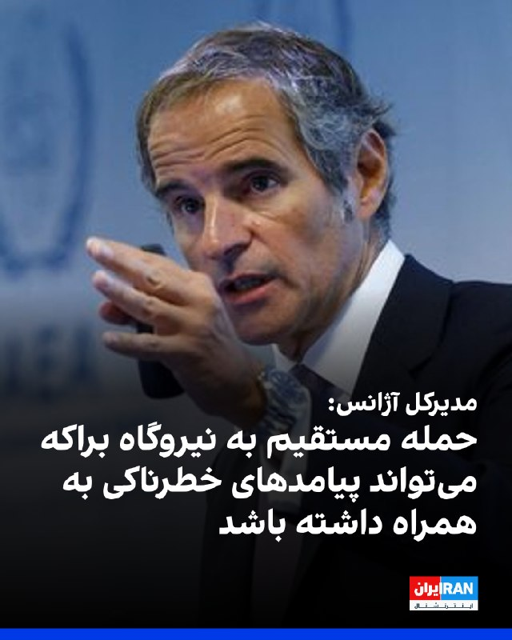

رافائل گروسی، مدیرکل آژانس بین‌المللی انرژی اتمی در نشست ویژه شورای امنیت سازمان ملل درباره حمله به نیروگاه هسته‌ای براکه در امارات متحده عربی هشدار داد که حمله مستقیم به این تاسیسات می‌تواند پیامدهای خطرناکی به همراه داشته باشد.

مدیرکل آژانس بین‌المللی انرژی اتمی افزود: «حمله به تاسیسات هسته‌ای که برای اهداف صلح‌آمیز استفاده می‌شوند، غیرقابل قبول است.»

نماینده بحرین در شورای امنیت سازمان ملل اعلام کرد که تهران مسیر تنش‌افزایی را در پیش گرفته و با هدف قرار دادن زیرساخت‌های منطقه، امنیت کشورهای منطقه را تهدید کرده است.

او گفت: «هدف قرار دادن نیروگاه هسته‌ای براکه در امارات متحده عربی تحول خطرناکی است که صلح و امنیت را تهدید می‌کند.»

همچنین نماینده یونان در شورای امنیت سازمان ملل حملات به نیروگاه هسته‌ای براکه در امارات متحده عربی را محکوم کرد و گفت نقض ایمنی هسته‌ای کاملا غیرقابل قبول است و منطقه توان تحمل موج گسترده‌تری از خشونت را ندارد.»
‌🏁 🇬🇧 IranintlTV

🤖 @VahidOOnLine

## VahidOOnLine — post 241048

  

♦️وکیل مدافع پژمان جمشیدی از صدور حکم پرونده موکلش در شعبه ۹ دادگاه کیفری یک استان تهران خبر داد و اعلام کرد این رای بدوی بوده و ظرف ۲۰ روز قابل اعتراض است.
او در گفتگو با ایسنا تاکید کرد تا زمان قطعی شدن حکم، جزئیات و محتوای رای اعلام نخواهد شد.
در همین حال، ساعاتی پیش سایت امتداد به نقل از شاکی پرونده گزارش داد که حکم به وی ابلاغ شده و به گفته او، پژمان جمشیدی به ۹۹ ضربه شلاق تعزیری محکوم شده است. شاکی همچنین تاکید کرد، مدارک موجود در پرونده به نفع او بوده است.
‌🇸🇦 Indypersian

🤖 @VahidOOnLine

## VahidOOnLine — post 241047

  <a href="telegram/content/VahidOOnLine_241047_1779225430.mp4" target="_blank">🎬 Download video</a>

تماسی بغض‌آلود از ایران:
«می‌گفت زیر فشار زندگی مونده…
با مادری بیمار، اجاره عقب‌افتاده و بیماری خودش
‌🏁 🇬🇧 ManotoTV

🤖 @VahidOOnLine

## VahidOOnLine — post 241046

  

♦️رافائل گروسی، مدیرکل آژانس بین‌المللی انرژی اتمی، روز سه‌شنبه ۲۹ اردیبهشت، در نشست ویژه شورای امنیت سازمان ملل متحد درباره حمله پهپادی اخیر به نیروگاه هسته‌ای «برکه» در امارات، نسبت به پیامدهای فاجعه‌بار اصابت مستقیم به این تاسیسات هشدار داد.

گروسی اگرچه بازگشت برق پشتیبان به این نیروگاه را گامی مهم برای امنیت هسته‌ای خواند، اما تاکید کرد: «می‌خواهم کاملا شفاف بگویم؛ در صورت حمله به نیروگاه برکه، هرگونه اصابت مستقیم می‌تواند به نشت شدید مواد رادیواکتیو در محیط زیست منجر شود.»

او افزود آسیب به خطوط تامین برق نیروگاه، احتمال ذوب شدن قلب راکتورها را به شدت افزایش می‌دهد که این امر در بدترین سناریوها، اتخاذ اقدامات حفاظتی فوری نظیر تخلیه گسترده مناطق اطراف را ناگزیر می‌کند. گروسی در پایان تصریح کرد که حملات نظامی به تاسیسات هسته‌ای با اهداف صلح‌آمیز، به هیچ عنوان قابل قبول نیست.
‌🇸🇦 Indypersian

🤖 @VahidOOnLine

## VahidOOnLine — post 241045

  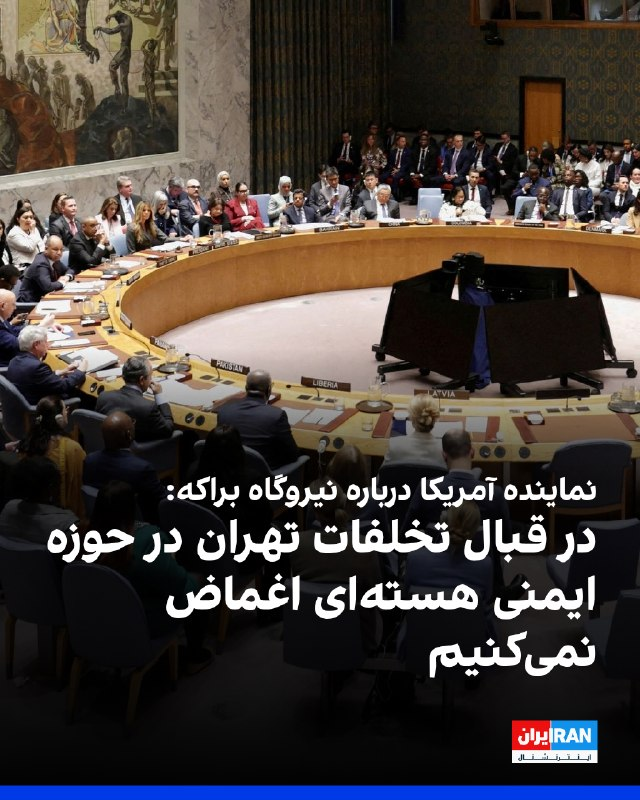

نماینده آمریکا در شورای امنیت سازمان ملل اعلام کرد نیروگاه براکه در امارات متحده عربی یک تاسیسات هسته‌ای صلح‌آمیز است و واشینگتن هیچ‌گونه اغماضی در قبال تخلفات تهران در حوزه ایمنی هسته‌ای نخواهد داشت.

نماینده آمریکا در شورای امنیت سازمان ملل گفت جمهوری اسلامی باید حملات نیروهای نیابتی خود به کشورهای همسایه را متوقف کند.
‌🏁 🇬🇧 IranintlTV

🤖 @VahidOOnLine

## VahidOOnLine — post 241044

  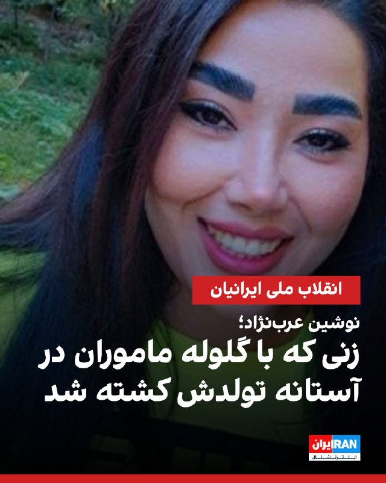

نوشین (طاهره) عرب‌نژاد، متولد ۲۱ دی ۱۳۶۶، دانش‌آموخته مدیریت و فعال در حوزه فیلم‌سازی بود.
او شامگاه ۱۹ دی‌ماه، در پشت‌بام خانه و در حالی‌ که خانواده‌اش برای جشن تولدش آماده می‌شدند، هدف گلوله قرار گرفت. بر اساس گزارش‌ها، نیروهای مسلح مستقر در میدان معراج مشهد به سوی معترضان و خانه‌های اطراف تیراندازی کردند و چندین نفر را هدف قرار دادند. نوشین نیز در جریان این تیراندازی، با اصابت گلوله به قفسه سینه‌اش زخمی شد.
خانواده او با اورژانس تماس گرفتند، اما آمبولانسی اعزام نشد و خانواده با کمک همسایگان او را به بیمارستان رضوی منتقل کردند. با این حال، تلاش‌ها برای نجات جان او بی‌نتیجه ماند.
بر اساس این گزارش، پیکر نوشین پس از اعمال فشار، تهدید و گرفتن تعهد به خانواده تحویل داده شد و مراسم خاکسپاری او نیز با محدودیت برگزار شد. همچنین به خانواده گفته شده بود باید اعلام کنند که نوشین به دست «اغتشاش‌گران» کشته شده است.
‌🏁 🇬🇧 IranintlTV

🤖 @VahidOOnLine

## VahidOOnLine — post 241043

  

سنتکام اعلام کرد از زمان آغاز محاصره دریایی جنوب ایران، ۸۹ کشتی تجاری ناچار به تغییر مسیر شده‌اند.این نهاد افزود نیروهای سنتکام به اجرای کامل محاصره بنادر ایران ادامه می‌دهند و مانع ورود و خروج جریان تجارت از این کشور می‌شوند.
‌🏁 🇬🇧 IranintlTV

🤖 @VahidOOnLine

## WithYashar — post 11702

سناتور لیندسی گراهام ؛«من امیدوارم و انتظار دارم که پس از ماه‌ها مذاکره با ایرانی‌ها، دولت ترامپ هرگونه تلاش ایران برای به‌تعویق انداختن دوباره مذاکرات را رد کند. این رژیم ماه‌ها فرصت داشته تا به یک توافق برسد، اما به نظر من روشن است که در حال بازی دادن طرف مقابل است.

ترجیح من دستیابی به یک راه‌حل دیپلماتیک است، اما قدیمی‌ترین ترفند ایران در این‌گونه مذاکرات، تعویق، تعویق و باز هم تعویق است.

در مورد هر توافق احتمالی نیز، منتظر هستم تا آن را در سنای آمریکا بررسی کنم.»
@withyashar

## WithYashar — post 11701

اتاق جنگ با شما : عزیزم، ممکنه اون انفجار قارچی چند روز پیش در اسرائیل، تست یه بمب برای زدن اهداف عمیق و مخفی ایران بوده باشه؟

## WithYashar — post 11700

اتاق جنگ با شما : عزیزم، ممکنه اون انفجار قارچی چند روز پیش در اسرائیل، تست یه بمب برای زدن اهداف عمیق و مخفی ایران بوده باشه؟

## WithYashar — post 11699

## WithYashar — post 11698

جای یه b2 خشکل روی میزت خالیه ❤️

## WithYashar — post 11697

## WithYashar — post 11696

اینم پست جدید کارای اداریش رو انجام بدید 😍🔥💥🙌🏾 بمبه

https://www.instagram.com/reel/DYiHl04xutP/?igsh=MWZhNHllczYzNGtvaA==

⁨ اتاق جنگ با یاشار : طوفان ، رهگیری هواپیمای E-2D Advanced Hawkey ناو هواپیمابر آبی خاکی USS BOXER LHD4
و آب و هوای منطقه برای حمله

## WithYashar — post 11695

  

پوستر
@withyashar

## mwarmonitor — post 9326

🔴سناتور لیندسی گراهام ؛«من امیدوارم و انتظار دارم که پس از ماه‌ها مذاکره با ایرانی‌ها، دولت ترامپ هرگونه تلاش ایران برای به‌تعویق انداختن دوباره مذاکرات را رد کند. این رژیم ماه‌ها فرصت داشته تا به یک توافق برسد، اما به نظر من روشن است که در حال بازی دادن طرف مقابل است.

🔸ترجیح من دستیابی به یک راه‌حل دیپلماتیک است، اما قدیمی‌ترین ترفند ایران در این‌گونه مذاکرات، تعویق، تعویق و باز هم تعویق است.

🔸در مورد هر توافق احتمالی نیز، منتظر هستم تا آن را در سنای آمریکا بررسی کنم.»

@mwarmonitor

## mwarmonitor — post 9325

🔴دولت ترامپ قصد دارد این هفته به متحدان ناتو اعلام کند که در صورت بروز یک بحران بزرگ، دامنه توانمندی‌های نظامی آمریکا که برای کمک به کشورهای اروپایی در دسترس خواهد بود را کاهش می‌دهد. قرار است این تصمیم به‌طور رسمی روز جمعه در بروکسل ابلاغ شود. پنتاگون می‌گوید ایالات متحده همچنان به ارائه چتر هسته‌ای خود ادامه خواهد داد. (رویترز)

@mwarmonitor

## mwarmonitor — post 9324

  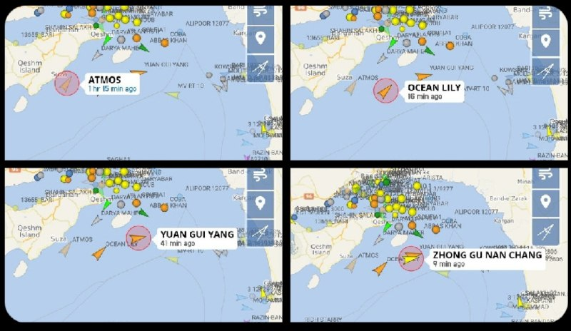

«عبور از تنگه هرمز امشب:

🚢 نفتکش ATMOS (متعلق به روسیه 🇷🇺)
🚢 نفتکش OCEAN LILY (متعلق به چین 🇨🇳)
🚢 نفتکش YUAN GUI YANG (متعلق به چین 🇨🇳)
🚢 کشتی باری ZHANG GU NAN CHANG (متعلق به چین 🇨🇳)»

@mwarmonitor

## mwarmonitor — post 9323

  <a href="telegram/content/mwarmonitor_9323_1779225436.mp4" target="_blank">🎬 Download video</a>

🇺🇸«نیروهای سنتکام به اجرای کامل محاصره آمریکا علیه ایران ادامه می‌دهند و جریان تجارت به داخل و خارج از بنادر ایران را متوقف کرده‌اند. تاکنون ۸۹ کشتی تجاری برای اطمینان از رعایت این محاصره، تغییر مسیر داده‌اند.»

@mwarmonitor

## FoxNewsTwitter — post 341964

  

Fox News (Twitter/X)

WATCH LIVE: California Muslim leaders hold a press conference on San Diego mosque shooting (Courtesy: KSWB) https://twitter.com/i/broadcasts/1XGygmqmBBdxM

## FoxNewsTwitter — post 341963

  <a href="telegram/content/FoxNewsTwitter_341963_1779225438.mp4" target="_blank">🎬 Download video</a>

Fox News (Twitter/X)

This veteran was expected to have almost no one at his funeral. Instead, an entire community showed up to honor him.

World War II veteran John Bernard Arnold III passed away with no known family and was expected to have only a small service in Massachusetts.

But after a local veterans official put out a call for support, dozens gathered outside Saint Joseph the Worker Church carrying flags, flowers, and wearing military uniforms to honor Arnold.

## FoxNewsTwitter — post 341962

  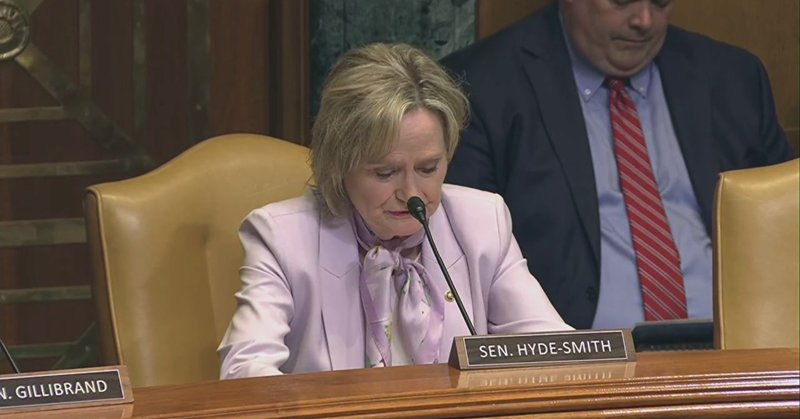

Fox News (Twitter/X)

WATCH LIVE: Senate Appropriations panel reviews FY 2027 Department of Transportation budget https://twitter.com/i/broadcasts/1dGYljEqVYoKX

## mamlekate — post 103559

📝 ترامپ: رهبران ایران برای توافق «التماس» می‌کنند؛ توافق نکنند به‌زودی دوباره حمله می‌کنیم

رئیس جمهوری ایالات متحده روز سه‌شنبه ۲۹ اردیبهشت در جمع خبرنگاران حاضر در محوطه کاخ سفید گفت رهبران ایران برای توافق «التماس» می‌کنند. او هشدار داد که اگر توافقی حاصل نشود آمریکا در روزهای آینده به جمهوری اسلامی حمله خواهد کرد.

@mamlekate

## mamlekate — post 103558

📝 اتلتیک: فیفا قصد دارد ورود پرچم شیر و خورشید را به استادیوم‌های جام‌جهانی ممنوع کند

@mamlekate

## mamlekate — post 103557

📝 بازگشایی بورس تهران پس از ۸۰ روز؛ سهام شرکت‌های بزرگ همچنان بسته ماند

بورس اوراق بهادار تهران پس از ۸۰ روز توقف، فعالیت خود را از سر گرفت. این بازگشایی در شرایطی انجام شد که بخش مهمی از نمادهای بزرگ همچنان بسته ماندند و مجموعه‌ای از محدودیت‌های معاملاتی برای کنترل فشار فروش اعمال شد.

@mamlekate

## IranIntlTV — post 338005

  <a href="telegram/content/IranIntlTV_338005_1779225441.mp4" target="_blank">🎬 Download video</a>

محمدمهدی جارچی، جوان ۳۸ ساله و متاهل، در فردیس استان البرز، عاشق ایران و شیفته موسیقی بود.

صبح ۱۹ دی، او با دیدن پیکر چند جان‌باخته انقلاب ملی در نزدیکی خانه‌اش عمیقاً تحت تأثیر قرار گرفت. همان شب در فردیس البرز به معترضان پیوست و با شلیک گلوله نیروهای حکومتی کشته شد.

او رویای آزادی ایران را در سر داشت؛ نامش حالا در میان جاویدنامان انقلاب ملی ماندگار شده است.

@iranintltv

## IranIntlTV — post 338003

  

🔻تیم فوتبال منچسترسیتی در هفته سی‌وهفتم لیگ برتر انگلستان با نتیجه یک بر یک برابر بورنموث متوقف شد. تیم پپ گواردیولا با این تساوی از رقابت برای قهرمانی جا ماند و آرسنال پس از ۲۲ سال قهرمان لیگ برتر شد. توپچی‌ها آخرین قهرمانی خود در لیگ برتر را در سال ۲۰۰۴ کسب کرده بودند.

🔹منچسترسیتی و آرسنال در هفته‌های گذشته رقابت نزدیکی برای صدرنشینی و قهرمانی داشتند، هرچند آرسنال در این رقابت دست بالاتر را داشت.

🔹با توجه به پیروزی شب گذشته آرسنال برابر برنلی، منچسترسیتی باید بازی امشب خود را با پیروزی پشت سر می‌گذاشت تا کورس قهرمانی به هفته پایانی کشیده شود، اما ناکامی سیتی برابر بورنموث به قهرمانی آرسنال و آرتتا، یک هفته پیش از پایان لیگ برتر، منجر شد.

@iranintltvsport

## IranIntlTV — post 338002

  

حجت‌الله ناصحی‌پور، معاون گردشگری اداره میراث‌فرهنگی، گردشگری و صنایع‌دستی کاشان، گفت کافه مجموعه تاریخی عامری‌ها به دلیل گزارش وقوع دو مورد رعایت نکردن حجاب اجباری پلمب شد. او افزود مراجع ذی‌ربط پس از دریافت گزارش‌ها، دستور پلمب را صادر و اجرا کردند.
ناصحی‌پور گفت این کافه اقامتی و گردشگری که در یکی از بناهای شاخص تاریخی کاشان فعالیت می‌کرد، پس از طی روند قانونی و بررسی‌های انجام‌شده، مشمول برخورد و پلمب شد.
خانه عامری‌ها از شناخته‌شده‌ترین بناهای گردشگری دوره قاجار در کاشان است و همواره مورد توجه گردشگران داخلی و خارجی قرار دارد.
https://iranintl.com/202605195284

## IranIntlTV — post 338001

  

رافائل گروسی، مدیرکل آژانس بین‌المللی انرژی اتمی در نشست ویژه شورای امنیت سازمان ملل درباره حمله به نیروگاه هسته‌ای براکه در امارات متحده عربی هشدار داد که حمله مستقیم به این تاسیسات می‌تواند پیامدهای خطرناکی به همراه داشته باشد.

مدیرکل آژانس بین‌المللی انرژی اتمی افزود: «حمله به تاسیسات هسته‌ای که برای اهداف صلح‌آمیز استفاده می‌شوند، غیرقابل قبول است.»

نماینده بحرین در شورای امنیت سازمان ملل اعلام کرد که تهران مسیر تنش‌افزایی را در پیش گرفته و با هدف قرار دادن زیرساخت‌های منطقه، امنیت کشورهای منطقه را تهدید کرده است.

او گفت: «هدف قرار دادن نیروگاه هسته‌ای براکه در امارات متحده عربی تحول خطرناکی است که صلح و امنیت را تهدید می‌کند.»

همچنین نماینده یونان در شورای امنیت سازمان ملل حملات به نیروگاه هسته‌ای براکه در امارات متحده عربی را محکوم کرد و گفت نقض ایمنی هسته‌ای کاملا غیرقابل قبول است و منطقه توان تحمل موج گسترده‌تری از خشونت را ندارد.»
https://iranintl.com/202605192527

## IranIntlTV — post 338000

  <a href="telegram/content/IranIntlTV_338000_1779225446.mp4" target="_blank">🎬 Download video</a>

نشست اضطراری شورای امنیت سازمان ملل به درخواست بحرین درباره بررسی حمله به نیروگاه هسته‌ای براکه در امارات متحده عربی برگزار شد.

گفت‌وگو با رضا گوهرزاد، روزنامه‌نگار و تحلیلگر سیاسی
@iranintltv

## IranIntlTV — post 337999

  <a href="telegram/content/IranIntlTV_337999_1779225448.mp4" target="_blank">🎬 Download video</a>

معاون رییس‌جمهور آمریکا، گفت واشینگتن در مذاکرات با جمهوری اسلامی به‌دنبال محدودیت‌های بلندمدت و پایدار بر برنامه هسته‌ای ایران است. جی‌دی ونس همچنین تاکید کرد آمریکا توافقی را که به ایران امکان دستیابی به سلاح هسته‌ای بدهد، نمی‌پذیرد.

گفت‌وگو با علیرضا نامورحقیقی، تحلیلگر سیاسی
@iranintltv

## IranIntlTV — post 337998

  <a href="telegram/content/IranIntlTV_337998_1779225450.mp4" target="_blank">🎬 Download video</a>

انور قرقاش، مشاور دیپلماتیک امارات، حملات ایران را تجاوز وحشیانه جمهوری اسلامی خواند و تاکید کرد سکوت و موضع خاکستری بعضی کشورها، خطرناک‌تر است و از آن‌ها به‌ خاطر حرکت به سمت میانجی‌گری انتقاد کرد.

ارزیابی علی صدرزاده، تحلیلگر مسائل خاورمیانه
@iranintltv

## IranIntlTV — post 337997

  <a href="telegram/content/IranIntlTV_337997_1779225453.mp4" target="_blank">🎬 Download video</a>

مستند «یک رفاقت؛ از زندان وکیل‌آباد مشهد تا سن‌دیگو» ساخته اردوان روزبه و تولید ایران‌اینترنشنال، برنده جایزه نقره‌ای تلی ۲۰۲۶ شد. این مستند روایت دوستی مایکل وایت، کهنه‌سرباز آمریکایی و مهدی وطن‌خواه، فعال سیاسی در زندان وکیل‌آباد مشهد است.

گفت‌وگو با اردوان روزبه، خبرنگار ایران‌اینترنشنال
@iranintltv

## IranIntlTV — post 337996

  <a href="telegram/content/IranIntlTV_337996_1779225454.mp4" target="_blank">🎬 Download video</a>

دونالد ترامپ گفت احتمال حمله دوباره آمریکا به ایران وجود دارد اما تصمیم نهایی هنوز گرفته نشده است. او افزود دستور حمله اخیر را در لحظات آخر متوقف کرده، چون مذاکرات با مشارکت چند کشور منطقه‌ای در حال پیشرفت است.

ارزیابی جمشید برزگر، روزنامه‌نگار و تحلیلگر سیاسی
@iranintltv

## IranIntlTV — post 337995

  <a href="telegram/content/IranIntlTV_337995_1779225456.mp4" target="_blank">🎬 Download video</a>

رییس‌جمهور آمریکا گفت شاید ایالات متحده دوباره مجبور شود به جمهوری اسلامی ضربه بزند، هرچند هنوز درباره انجام این اقدام تصمیم قطعی نگرفته است. او افزود فقط یک ساعت پیش از دستور حمله به ایران، آن را عقب انداخته است.

ارزیابی جمشید برزگر، روزنامه‌نگار و تحلیلگر سیاسی
@iranintltv

## IranIntlTV — post 337994

  

نماینده آمریکا در شورای امنیت سازمان ملل اعلام کرد نیروگاه براکه در امارات متحده عربی یک تاسیسات هسته‌ای صلح‌آمیز است و واشینگتن هیچ‌گونه اغماضی در قبال تخلفات تهران در حوزه ایمنی هسته‌ای نخواهد داشت.

نماینده آمریکا در شورای امنیت سازمان ملل گفت جمهوری اسلامی باید حملات نیروهای نیابتی خود به کشورهای همسایه را متوقف کند.
https://iranintl.com/202605191886

## IranIntlTV — post 337993

  

نوشین (طاهره) عرب‌نژاد، متولد ۲۱ دی ۱۳۶۶، دانش‌آموخته مدیریت و فعال در حوزه فیلم‌سازی بود.
او شامگاه ۱۹ دی‌ماه، در پشت‌بام خانه و در حالی‌ که خانواده‌اش برای جشن تولدش آماده می‌شدند، هدف گلوله قرار گرفت. بر اساس گزارش‌ها، نیروهای مسلح مستقر در میدان معراج مشهد به سوی معترضان و خانه‌های اطراف تیراندازی کردند و چندین نفر را هدف قرار دادند. نوشین نیز در جریان این تیراندازی، با اصابت گلوله به قفسه سینه‌اش زخمی شد.
خانواده او با اورژانس تماس گرفتند، اما آمبولانسی اعزام نشد و خانواده با کمک همسایگان او را به بیمارستان رضوی منتقل کردند. با این حال، تلاش‌ها برای نجات جان او بی‌نتیجه ماند.
بر اساس این گزارش، پیکر نوشین پس از اعمال فشار، تهدید و گرفتن تعهد به خانواده تحویل داده شد و مراسم خاکسپاری او نیز با محدودیت برگزار شد. همچنین به خانواده گفته شده بود باید اعلام کنند که نوشین به دست «اغتشاش‌گران» کشته شده است.
https://iranintl.com/202605191306

## IranIntlTV — post 337992

  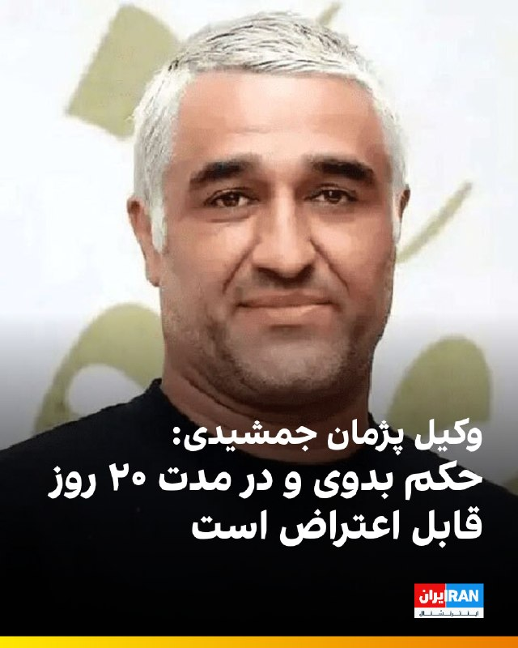

🔻وکیل مدافع پژمان جمشیدی با تایید صدور حکم پرونده موکلش از سوی شعبه ۹ دادگاه کیفری یک استان تهران به ایسنا گفت: «رای پرونده موکلم امروز صادر و ابلاغ شد. حکم بدوی است و ظرف ۲۰ روز قابل اعتراض است. تا زمانی که حکم قطعی نشده محتوای رای را اعلام نمی‌کنیم.»

🔹ساعتی پیش، سایت امتداد به نقل از شاکی پرونده پژمان جمشیدی خبر داد که حکم این پرونده صادر و به او ابلاغ شده است. به گفته او، پژمان جمشیدی به ۹۹ ضربه شلاق تعزیری محکوم شده است. شاکی پرونده گفته تمام مدارکی که به نفع او است در پرونده وجود دارد.

@iranintltvsport

## IranIntlTV — post 337991

  <a href="https://t.me/IranintlTV/337991" target="_blank">📎 Download file</a>

🎧نسخه صوتی ۲۴ با فرداد فرحزاد: ترامپ: شاید آمریکا دوباره به جمهوری اسلامی ضربه بزند
@iranintlTV

## IranIntlTV — post 337990

  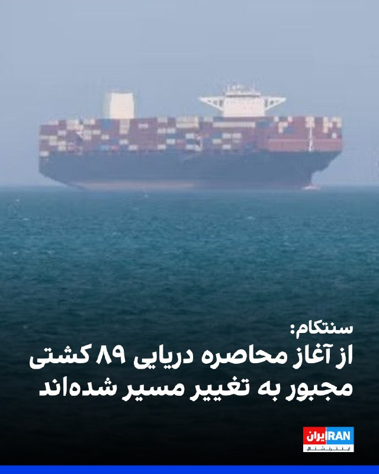

سنتکام اعلام کرد از زمان آغاز محاصره دریایی جنوب ایران، ۸۹ کشتی تجاری ناچار به تغییر مسیر شده‌اند.این نهاد افزود نیروهای سنتکام به اجرای کامل محاصره بنادر ایران ادامه می‌دهند و مانع ورود و خروج جریان تجارت از این کشور می‌شوند.
https://iranintl.com/202605198290

## IranIntlTV — post 337989

  <a href="telegram/content/IranIntlTV_337989_1779225461.mp4" target="_blank">🎬 Download video</a>

یک شهروند با ارسال پیامی به ایران اینترنشنال شرایط روانی و روحی جامعه را بد توصیف کرده و از بحران معیشتی روایت می‌کند. پیام او با هوش مصنوعی خوانده شده است.

## ManotoTV — post 105661

  <a href="telegram/content/ManotoTV_105661_1779225463.mp4" target="_blank">🎬 Download video</a>

‌
مارک استون، خبرنگار اسکای‌نیوز، در مواجه با دریادار برد کوپر، فرمانده سنتکام، از او پرسید چرا ارتش آمریکا هنوز جزئیات حادثه مرگبار میناب را منتشر نکرده است.

استون با اشاره به ادعای فرمانده سنتکام گفت تیم اسکای‌نیوز در میناب حضور دارد و «هیچ نشانه‌ای از وجود پایگاه موشکی» در محل حادثه ندیده است.

او همچنین از کوپر پرسید تا چه زمانی ارتش آمریکا به ادامه تحقیقات استناد خواهد کرد و این تحقیقات چه زمانی به پایان می‌رسد.

دریادار کوپر در پاسخ تنها گفت: «تحقیقات ادامه دارد» و از پاسخ به دیگر سوال‌ها خودداری کرد.

## ManotoTV — post 105660

  <a href="telegram/content/ManotoTV_105660_1779225464.mp4" target="_blank">🎬 Download video</a>

تماسی بغض‌آلود از ایران:
«می‌گفت زیر فشار زندگی مونده…
با مادری بیمار، اجاره عقب‌افتاده و بیماری خودش

## FarsiVOA — post 218183

⚡️تازه‌ترین مواضع دموکرات‌ها و جمهوری‌خواهان در مورد تحولات مربوط به ایران
@FarsiVOA

## FarsiVOA — post 218182

🔺اسکات بسنت از متحدان آمریکا خواست منابع مالی جمهوری اسلامی را هدف قرار دهند

▪️اسکات بسنت، وزیر خزانه‌داری ایالات متحده، روز سه‌شنبه ۲۹ اردیبهشت در یک نشست مبارزه با تأمین مالی تروریسم در پاریس، از متحدان اروپایی خواست که به منابع مالی جمهوری اسلامی حمله کنند.

⬇️ بیشتر بخوانید:
https://ir.voanews.com/a/8151743.html
@FarsiVOA

## FarsiVOA — post 218181

⚡️چه کسی اینترنت در ایران را کنترل می‌کند؟
@FarsiVOA

## FarsiVOA — post 218180

  <a href="telegram/content/FarsiVOA_218180_1779225466.mp4" target="_blank">🎬 Download video</a>

⚡️فرزین کرباسی در برنامه تفسیر خبر: برای بخش تندروی نظام کمترین عقب‌نشینی پشت پا به تمام ارزش‌هاست
@FarsiVOA

## FarsiVOA — post 218179

⚡️ترامپ: وقفه در اقدام نظامی علیه جمهوری اسلامی کوتاه است؛ رژیم ایران نباید سلاح هسته‌ای داشته باشد
@FarsiVOA

## FarsiVOA — post 218178

  <a href="telegram/content/FarsiVOA_218178_1779225467.mp4" target="_blank">🎬 Download video</a>

⚡️کامبیز غفوری در برنامه تفسیر خبر: جمهوری اسلامی قمارباز بدی است

@FarsiVOA

## FarsiVOA — post 218177

⚡️جی دی ونس، معاون رئیس جمهوری آمریکا، روز سه‌شنبه ۲۹ اردیبهشت با حضور در سالن کنفرانس‌های مطبوعاتی کاخ سفید به پرسش‌های خبرنگاران، که بخش عمده‌ای از آن درباره وضعیت ایران و منطقه بود، پاسخ داد. صدای آمریکا این جلسه را به صورت مستفیم و با ترجمه همزمان پژواک کیومرثی پخش کرد.
@FarsiVOA

## FarsiVOA — post 218176

🔺پرزیدنت ترامپ: رهبران ایران برای توافق «التماس» می‌کنند؛ توافق نکنند به‌زودی دوباره حمله می‌کنیم

▪️رئیس جمهوری ایالات متحده روز سه‌شنبه ۲۹ اردیبهشت در جمع خبرنگاران حاضر در محوطه کاخ سفید گفت رهبران ایران برای توافق «التماس» می‌کنند. او هشدار داد که اگر توافقی حاصل نشود آمریکا در روزهای آینده به جمهوری اسلامی حمله خواهد کرد.

⬇️ بیشتر بخوانید:
https://ir.voanews.com/a/iran-trump-us-strike-epic-fury/8151680.html
@FarsiVOA

## FarsiVOA — post 218175

⚡️جی دی ونس، معاون رئیس جمهوری آمریکا، روز سه‌شنبه ۲۹ اردیبهشت با حضور در سالن کنفرانس‌های مطبوعاتی کاخ سفید به پرسش‌های خبرنگاران، که بخش عمده‌ای از آن درباره وضعیت ایران و منطقه بود، پاسخ داد. صدای آمریکا این جلسه را به صورت مستفیم و با ترجمه همزمان پژواک کیومرثی پخش کرد.
@FarsiVOA

## FarsiVOA — post 218174

⚡️جی دی ونس، معاون رئیس جمهوری آمریکا، روز سه‌شنبه ۲۹ اردیبهشت با حضور در سالن کنفرانس‌های مطبوعاتی کاخ سفید به پرسش‌های خبرنگاران، که بخش عمده‌ای از آن درباره وضعیت ایران و منطقه بود، پاسخ داد. صدای آمریکا این جلسه را به صورت مستفیم و با ترجمه همزمان پژواک کیومرثی پخش کرد.
@FarsiVOA

## FarsiVOA — post 218173

⚡️جی دی ونس، معاون رئیس جمهوری آمریکا، روز سه‌شنبه ۲۹ اردیبهشت با حضور در سالن کنفرانس‌های مطبوعاتی کاخ سفید به پرسش‌های خبرنگاران، که بخش عمده‌ای از آن درباره وضعیت ایران و منطقه بود، پاسخ داد. صدای آمریکا این جلسه را به صورت مستفیم و با ترجمه همزمان پژواک کیومرثی پخش کرد.
@FarsiVOA

## FarsiVOA — post 218172

🔺شهاب دلیلی که پس از سفر به ایران توسط جمهوری اسلامی دستگیر و زندانی شده بود پس از ده سال به آمریکا بازگشت

▪️سازمان «کمک به گروگان‌ها در سراسر جهان» اعلام کرد شهاب دلیلی، ایرانی مقیم آمریکا که از سال ۱۳۹۵ جمهوری اسلامی او را زندانی کرده بود، آزاد شد و به آمریکا بازگشت.

⬇️ بیشتر بخوانید:
https://ir.voanews.com/a/iran-us-hostage-shahab-dalili-captain-prison/8151618.html
@FarsiVOA

## FarsiVOA — post 218171

⚡️پرزیدنت ترامپ روز سه‌شنبه ۲۹ اردیبهشت در محل احداث تالار رقص کاخ سفید حاضر شد و به پرسش‌های متعدد خبرنگاران پاسخ داد. صدای آمریکا بخش‌هایی از این پرسش و پاسخ را با ترجمه همزمان پژواک کیومرثی پخش کرد.
@FarsiVOA

## FarsiVOA — post 218170

🔺رشید مظاهری در سلول انفرادی؛ همسر این فوتبالیست از مردم خواست تا صدای او باشند

◾️رشید مظاهری، دروازه‌بان پیشین تیم ملی فوتبال ایران که پس از انتقاد علنی از علی خامنه‌ای و کشتار دی ۱۴۰۴ بازداشت شده بود، به سلول انفرادی زندان مرکزی ارومیه منتقل شده است.

⬇️ بیشتر بخوانید:
https://ir.voanews.com/a/solitary-cell-urumiyah-central-prison-rashid-mazaheri/8151695.html
@FarsiVOA

## FarsiVOA — post 218169

⚡️پرزیدنت ترامپ روز سه‌شنبه ۲۹ اردیبهشت در محل احداث تالار رقص کاخ سفید حاضر شد و به پرسش‌های متعدد خبرنگاران پاسخ داد. صدای آمریکا بخش‌هایی از این پرسش و پاسخ را با ترجمه همزمان پژواک کیومرثی پخش کرد.
@FarsiVOA

## FarsiVOA — post 218168

⚡️پرزیدنت ترامپ روز سه‌شنبه ۲۹ اردیبهشت در محل احداث تالار رقص کاخ سفید حاضر شد و به پرسش‌های متعدد خبرنگاران پاسخ داد. صدای آمریکا بخش‌هایی از این پرسش و پاسخ را با ترجمه همزمان پژواک کیومرثی پخش کرد.
@FarsiVOA

## FarsiVOA — post 218167

⚡️کمیته نیروهای مسلح مجلس نمایندگان آمریکا روز سه‌شنبه ۲۹ اردیبهشت یک جلسه استماع را با حضور دریابد برد کوپر، فرمانده سنتکام، ژنرال داگوین اندرسون، فرمانده آفریکام، و دانیل زیمرمن، معاون وزیر جنگ در امور امنیت بین‌الملل، برگزار کرد. صدای آمریکا این جلسه را با ترجمه همزمان پژواک کیومرثی پخش کرد.
@FarsiVOA

## FarsiVOA — post 218166

⚡️کمیته نیروهای مسلح مجلس نمایندگان آمریکا روز سه‌شنبه ۲۹ اردیبهشت یک جلسه استماع را با حضور دریابد برد کوپر، فرمانده سنتکام، ژنرال داگوین اندرسون، فرمانده آفریکام، و دانیل زیمرمن، معاون وزیر جنگ در امور امنیت بین‌الملل، برگزار کرد. صدای آمریکا این جلسه را با ترجمه همزمان پژواک کیومرثی پخش کرد.
@FarsiVOA

## Persian_Trend_Official — post 14497

https://youtube.com/live/iLtj3w_ZmNU?feature=share

## Persian_Trend_Official — post 14496

  <a href="telegram/content/Persian_Trend_Official_14496_1779225468.mp4" target="_blank">🎬 Download video</a>

🔴خضریان،عضو کمیسیون امنیت ملی مجلس:

💢امیدوارم خبر سفر عراقچی به نیویورک برای مذاکره در خصوص تنگه هرمز دروغ باشد!

💢چرا ما در خصوص موضوع تنگه هرمز باید در خاک دشمن مذاکره کنیم؟

🫆:Tony

📌 @persian_trend_official
پرشین ترند | متفاوت‌ترین کانال نظامی

## Persian_Trend_Official — post 14495

  

نسخه صوتی لایو امشب در کست باکس:

https://castbox.fm/vi/946964459

نیاز به دانلود هیچ اپلیکیشنی ندارید، فقط کافیه لینک رو در مرورگر خودتون کپی کنید و فایل رو بشنوید

## Persian_Trend_Official — post 14494

نسخه صوتی لایو امشب در اسپاتیفای : https://open.spotify.com/episode/1E7uxKoNvLatPFATA5y8Jc?si=j4CwM-EiQDaOyw4ByYHJZw

## Persian_Trend_Official — post 14493

  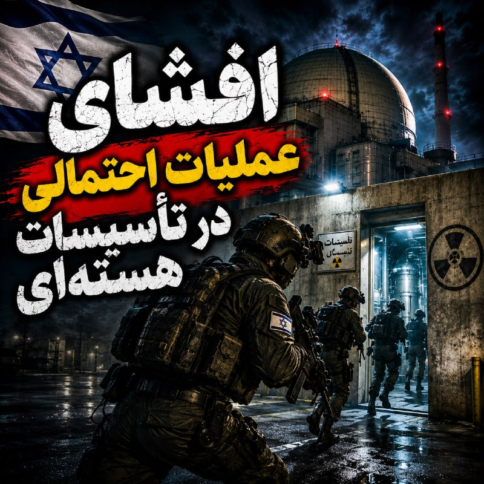

نسخه صوتی لایو امشب در اسپاتیفای :

https://open.spotify.com/episode/1E7uxKoNvLatPFATA5y8Jc?si=j4CwM-EiQDaOyw4ByYHJZw

## Persian_Trend_Official — post 14491

🔴 هواپیمای پیشرفته «E-2D» آمریکا بر روی آسمان خلیج فارس در حال گشت زنی است

💢گزارش‌ها حاکی از آن است که یک فروند هواپیمای هشدار زودهنگام و کنترل هوایی «E-2D Hawkeye» متعلق به نیروی دریایی آمریکا در حال گشت زنی در خلیج فارس است.

▪️ این هواپیما برای شناسایی اهداف هوایی و دریایی و مدیریت میدان نبرد استفاده می‌شود

🫆:Tony

📌 @persian_trend_official
پرشین ترند | متفاوت‌ترین کانال نظامی

## IranianMinds — post 20412

  

🔴 طبق گفته‌ی خواهر الهه حسین‌نژاد؛
بهمن فرزانه (قاتل) امشب اعدام میشه.

@IranianMinds

## IranianMinds — post 20411

  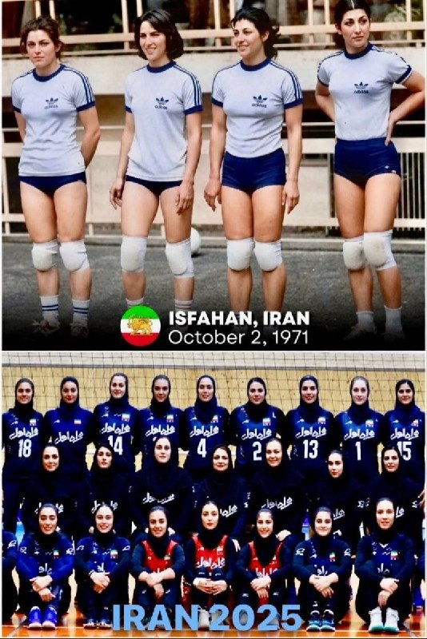

ایران تنها کشوریه که وقتی به گذشته اش نگاه میکنی، انگار آینده اش را می بینی.

@IranianMinds

## BBCPersian — post 281545

  <a href="https://t.me/bbcpersian/281545" target="_blank">📎 Download file</a>

پادکست برنامه شصت دقیقه سه‌شنبه ۲۹ اردیبهشت ۱۴۰۵
این نسخه رادیویی برنامه شصت دقیقه تلویزیون فارسی بی‌بی‌سی است که هرشب بعد از پخش، با حجم کم از اپلیکیشن‌های پادگیر و صفحه تلگرام بی‌بی‌سی فارسی در دسترس است.
با هشتگ BBCPersianRadio با ما در ارتباط باشید.
@BBCPersian

## BBCPersian — post 281544

  <a href="https://t.me/bbcpersian/281544" target="_blank">📎 Download file</a>

پادکست برنامه جام جهان‌نما سه‌شنبه ۲۹ اردیبهشت ۱۴۰۵
این برنامه رادیویی را می‌توانید هر شب ساعت ۲۰ به وقت ایران، روی موج متوسط ۷۰۲ کیلوهرتز و موج کوتاه ۹۴۶۵ کیلوهرتز بشنوید.

تکرار برنامه را هم می‌توانید ساعت ۲۱:۳۰ روی موج متوسط ۷۰۲ کیلوهرتز و موج کوتاه ۵۳۹۵ کیلوهرتز گوش کنید.
@BBCPersian

## BBCPersian — post 281543

🔻وزیر خارجه آمریکا و دبیرکل سازمان ملل متحد درباره تنگه هرمز گفت‌وگو کردند

مارکو روبیو، وزیر خارجه آمریکا، و آنتونیو گوترش، دبیرکل سازمان ملل متحد، امروز درباره تلاش‌های آمریکا برای جلوگیری از مین‌گذاری ایران و اعمال عوارض در تنگه هرمز گفت‌وگو کردند.

این دو درباره پیش نویس قطعنامه‌ای در شورای امنیت سازمان ملل درباره وضعیت تنگه هرمز هم صحبت کردند.

سخنگوی وزارت خارجه آمریکا در بیانیه‌ای اعلام کرد: «وزیر خارجه بر حمایت گسترده شمار زیادی از اعضای سازمان ملل از این تلاش‌ها تأکید کرد.»

https://bbc.in/4ul18QJ
@BBCPersian

## BBCPersian — post 281542

🔻وال‌استریت جورنال: آمریکا یک نفتکش ایرانی را در اقیانوس هند توقیف کرد

روزنامه وال‌استریت جورنال به نقل از سه مقام آمریکایی گزارش داد که ایالات متحده طی شب گذشته یک نفتکش مرتبط با ایران را در اقیانوس هند توقیف کرده است.

بر اساس این گزارش، این نفتکش که اسکای‌ویو (Skywave) نام دارد، در ماه مارس از سوی آمریکا به دلیل نقش آن در انتقال نفت ایران تحریم شده بود.

وال‌استریت جورنال می گوید این نفتکش احتمالا در ماه فوریه بیش از یک میلیون بشکه نفت خام را در جزیره خارگ ایران بارگیری کرده بود.

مقام‌های ایرانی و آمریکا هنوز به این گزارش واکنشی نشان ندادند.
https://bbc.in/4wBY9ou
@BBCPersian

## Dirty_Kids — post 389775

  <a href="telegram/content/Dirty_Kids_389775_1779225474.mp4" target="_blank">🎬 Download video</a>

فیفا ورود پرچم شیرو خورشید به داخل ورزشگاه هارو ممنوع کرده ولی نمیدونه گل های تو غربت جام جهانی رو برای مزدوران جمهوری اسلامی تبدیل به جام جهنمی میکنن

@Dirty_Kids 👻

## Dirty_Kids — post 389774

  

🔴 طبق گفته‌ی خواهر الهه حسین‌نژاد؛
بهمن فرزانه (قاتل) امشب اعدام میشه.

@Dirty_Kids 👻

## Dirty_Kids — post 389773

‏صدا و سیما میخواد امشب طرز کار کردن با بمب اتم را آموزش بده

@Dirty_Kids 👻

## manototv — post 105661

  <a href="telegram/content/manototv_105661_1779225477.mp4" target="_blank">🎬 Download video</a>

‌
مارک استون، خبرنگار اسکای‌نیوز، در مواجه با دریادار برد کوپر، فرمانده سنتکام، از او پرسید چرا ارتش آمریکا هنوز جزئیات حادثه مرگبار میناب را منتشر نکرده است.

استون با اشاره به ادعای فرمانده سنتکام گفت تیم اسکای‌نیوز در میناب حضور دارد و «هیچ نشانه‌ای از وجود پایگاه موشکی» در محل حادثه ندیده است.

او همچنین از کوپر پرسید تا چه زمانی ارتش آمریکا به ادامه تحقیقات استناد خواهد کرد و این تحقیقات چه زمانی به پایان می‌رسد.

دریادار کوپر در پاسخ تنها گفت: «تحقیقات ادامه دارد» و از پاسخ به دیگر سوال‌ها خودداری کرد.

## manototv — post 105660

  <a href="telegram/content/manototv_105660_1779225478.mp4" target="_blank">🎬 Download video</a>

تماسی بغض‌آلود از ایران:
«می‌گفت زیر فشار زندگی مونده…
با مادری بیمار، اجاره عقب‌افتاده و بیماری خودش

## alonews — post 121185

👈جهت رزرو تبلیغات vpn در کانال #الونیوز به کانال زیر مراجعه کنید👇

📃https://t.me/ads_alonews

📃https://t.me/ads_alonews

## alonews — post 121184

  <a href="telegram/content/alonews_121184_1779225480.webm" target="_blank">🎬 Download video</a>

👈حسین طاهری مداح:
اینکه دخترها بی حجاب میان تجمعات یعنی پیروزی انقلاب

✅ @AloNews خبر جنگ

## alonews — post 121183

  <a href="telegram/content/alonews_121183_1779225481.webm" target="_blank">🎬 Download video</a>

👈امروز سالگرد فرود سخت بالگرد ابراهیم رئیسی هست 
✅ @AloNews خبر جنگ

## alonews — post 121182

  <a href="telegram/content/alonews_121182_1779225481.webm" target="_blank">🎬 Download video</a>

👈امروز سالگرد فرود سخت بالگرد ابراهیم رئیسی هست

✅ @AloNews خبر جنگ

## alonews — post 121181

  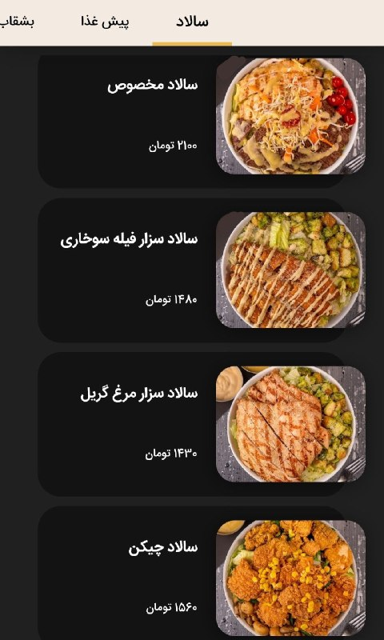

توی رستورانای تهران، یدونه سالاد شده 2 میلیون تومن!!

[@AloTweet]

## alonews — post 121180

  <a href="telegram/content/alonews_121180_1779225481.mp4" target="_blank">🎬 Download video</a>

👈تندروهای خیابونی این شبا تو تجمعات دارن یه‌ جوری قر میدن و میرقصن که انگاری ما رهبر آمریکا رو ترور کردیم

✅ @AloNews خبر جنگ

## alonews — post 121179

  

🏴󠁧󠁢󠁥󠁮󠁧󠁿
🤩رسمی : آرسنال قهرمان فصل 2025/2026 پریمیرلیگ شد

❤️پروژه آرتتا بلاخره جواب داد

@AloSport

## alonews — post 121178

  <a href="telegram/content/alonews_121178_1779225484.mp4" target="_blank">🎬 Download video</a>

👈حمله‌‌های شدید اسرائیل به کرانه باختری

✅ @AloNews خبر جنگ

## alonews — post 121177

  <a href="telegram/content/alonews_121177_1779225486.webm" target="_blank">🎬 Download video</a>

👈آای هیمتی:
مردم جلوی گرونیا مقاومت کنن

✅ @AloNews خبر جنگ

---
📅 بروزرسانی: 1405/02/29 23:26
---

## VahidOOnLine — post 241042

  <a href="telegram/content/VahidOOnLine_241042_1779220565.mp4" target="_blank">🎬 Download video</a>

♦️همزمان با ادامه محاصره بنادر جنوبی ایران، فرماندهی مرکزی ایالات متحده (سنتکام) سه‌شنبه ۲۹ اردیبهشت‌ماه با انتشار ویدیویی از ادامه عملیات دریایی و هوایی آمریکا در منطقه خبر داد.

در این تصاویر، بالگردهای نظامی آمریکا از جمله بالگردهای تهاجمی تفنگداران دریایی در حال پرواز بر فراز آب‌ها و شلیک شراره‌های دفاعی دیده می‌شوند. همچنین کشتی‌های تجاری و نفتکش در منطقه حضور دارند و نیروهای آمریکایی از روی شناورهای نظامی در حال رصد رفت‌وآمد دریایی هستند.

سنتکام اعلام کرد نیروهای آمریکایی همچنان «محاصره کامل» علیه ایران را اجرا می‌کنند و مانع ورود و خروج تجارت از بنادر ایران می‌شوند. بر اساس این بیانیه، تاکنون ۸۹ کشتی تجاری برای اجرای این محاصره تغییر مسیر داده‌اند.
‌🇸🇦 Indypersian

🤖 @VahidOOnLine

## VahidOOnLine — post 241041

  

♦️ پایگاه خبری آکسیوس به نقل از دو مقام آمریکایی گزارش داد که دونالد ترامپ دوشنبه‌شب، چند ساعت پس از اعلام تعلیق حملات برنامه‌ریزی‌شده، جلسه‌ای با تیم امنیت ملی خود برگزار کرد که در آن طرح‌های نظامی حمله به ایران بررسی شد.

در این جلسه مقامات ارشدی چون جی‌دی ونس، مارکو روبیو، پیت هگست، ژنرال دن کین و جان رتکلیف حضور داشتند و محور گفتگوها روند جنگ، وضعیت تلاش‌های دیپلماتیک و نقشه‌های نظامی واشنگتن بود. این رایزنی‌ها نشان می‌دهد ترامپ علی‌رغم تهدیدهای مکرر، به‌طور جدی در حال بررسی ازسرگیری جنگ است.

ترامپ همچنان تاکید دارد که جمهوری اسلامی تنها چند روز (تا جمعه، شنبه یا اوایل هفته آینده) برای دستیابی به یک پیشرفت دیپلماتیک فرصت دارد. او روز سه‌شنبه نیز گفت: «شاید مجبور شویم ضربه بزرگ دیگری به ایران وارد کنیم؛ هنوز مطمئن نیستم، اما به‌زودی متوجه خواهید شد.»

هم‌زمان، یک منبع منطقه‌ای اعلام کرد میانجی‌ها در تلاشند تا تهران را به اتخاذ موضعی انعطاف‌پذیرتر در قبال خواسته‌های هسته‌ای آمریکا ترغیب کنند. کاخ سفید هنوز به درخواست‌ها برای اظهارنظر در این باره پاسخ نداده است.
‌🇸🇦 Indypersian

🤖 @VahidOOnLine

## VahidOOnLine — post 241040

  <a href="telegram/content/VahidOOnLine_241040_1779220567.mp4" target="_blank">🎬 Download video</a>

تماسی تلخ از دل ایران:
«می‌گفت در پتروشیمی تعدیل شده…
و برای تأمین هزینه‌های زندگی حتی به رحم اجاره‌ای فکر می‌کنه
‌🏁 🇬🇧 ManotoTV

🤖 @VahidOOnLine

## VahidOOnLine — post 241039

  

رجب طیب اردوغان، رییس‌جمهور ترکیه، در تماس تلفنی با اورسولا فون در لاین، رییس کمیسیون اروپا، تاکید کرد که تنگه هرمز باید هرچه سریع‌تر بازگشایی شود و آنکارا برای حفظ آتش‌بس و دستیابی به صلح در درگیری‌های جاری منطقه تلاش می‌کند.
‌🏁 🇬🇧 IranintlTV

🤖 @VahidOOnLine

## VahidOOnLine — post 241038

♦️ولادیمیر پوتین، رئیس‌جمهوری روسیه، سه‌شنبه شب ۲۹ اردیبهشت‌ماه برای سفری رسمی وارد پکن شد و در فرودگاه بین‌المللی پایتخت چین مورد استقبال رسمی قرار گرفت.

ویدیوهای منتشرشده، گارد تشریفات ارتش آزادی‌بخش خلق چین را پیش از ورود پوتین در فرودگاه نشان می‌دهد. در بخش دیگری از تصاویر، نوجوانانی دیده می‌شوند که با تکان‌دادن پرچم‌های چین و روسیه از رئیس‌جمهوری روسیه استقبال می‌کنند. تصاویر همچنین کاروان خودرویی پوتین را هنگام خروج از فرودگاه و حرکت در خیابان‌های پکن نشان می‌دهد.

پوتین به دعوت شی جین‌پینگ برای سفری دو روزه به چین رفته است و قرار است دو رهبر درباره روابط دوجانبه، همکاری‌های اقتصادی، انرژی و مسائل منطقه‌ای و بین‌المللی گفتگو کنند.

این سفر کمتر از یک هفته پس از سفر دونالد ترامپ به پکن انجام می‌شود و همزمان با بیست‌وپنجمین سالگرد پیمان دوستی چین و روسیه است. چین پس از جنگ اوکراین به مهم‌ترین شریک تجاری روسیه تبدیل شده است.
‌🇸🇦 Indypersian

🤖 @VahidOOnLine

## VahidOOnLine — post 241037

  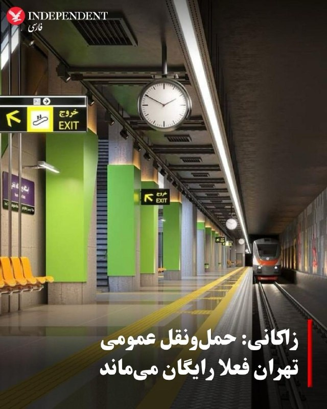

♦️علیرضا زاکانی، شهردار تهران، اعلام کرد خدمات حمل‌ونقل عمومی پایتخت فعلا همچنان رایگان خواهد ماند و تا زمان بررسی نهایی طرح در شورای شهر، تغییری در روند فعلی ایجاد نمی‌شود.
او گفت با وجود مطرح شدن بازگشت دریافت کرایه مترو و اتوبوس، «خدمات به منوال قبل ادامه دارد» و تصمیم نهایی پس از رای‌گیری شورای شهر در هفته آینده اعلام خواهد شد.
شورای شهر تهران امروز طرح یک‌فوریتی رایگان شدن وسایل حمل‌ونقل عمومی را با ۱۳ رأی تصویب کرد و قرار است اصل این طرح هفته آینده به رای گذاشته شود.
این در حالی است که صبح امروز شورای شهر تهران اعلام کرده بود از فردا دریافت بلیت مترو و اتوبوس به روال سابق بازمی‌گردد. با این حال، مقام‌های شهری بعدتر توضیح دادند که تا زمان بررسی نهایی، تلاش می‌شود خدمات رایگان همچنان حفظ شود.
‌🇸🇦 Indypersian

🤖 @VahidOOnLine

## VahidOOnLine — post 241036

  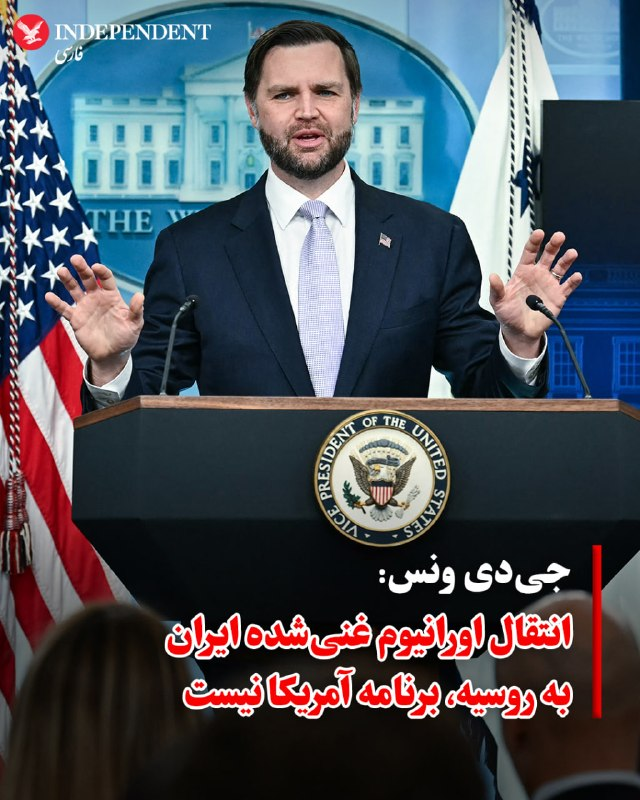

♦️ جی‌دی ونس، معاون رئیس‌جمهوری آمریکا، روز سه‌شنبه ۲۹ اردیبهشت اعلام کرد که تحویل اورانیوم غنی‌شده ایران به روسیه به عنوان بخشی از مذاکرات پایان جنگ، «در حال حاضر» جزو برنامه‌های ایالات متحده نیست.

ونس در جریان نشست خبری در کاخ سفید به خبرنگاران گفت: «این مسئله در حال حاضر برنامه ما نیست و هیچ‌گاه هم نبوده است. من گزارش‌هایی را در این باره دیده‌ام، اما نمی‌دانم منشا آن‌ها کجاست.»

معاون رئیس‌جمهوری آمریکا اشاره کرد که چنین طرحی احتمالا با مخالفت هر دو طرف، یعنی واشنگتن و تهران، روبه‌رو خواهد شد. او در ادامه افزود: «بنابراین، این موضوع در حال حاضر دستور کار دولت ایالات متحده نیست. ایرانی‌ها نیز آن را مطرح نکرده‌اند. برداشت من این است که ایرانی‌ها تمایل چندانی به این کار ندارند و می‌دانم که رئیس‌جمهور ترامپ نیز علاقه خاصی به این ایده ندارد.»

با این حال، معاون رئیس‌جمهوری آمریکا تاکید کرد که در یک فرآیند مذاکراتی، از پیش درباره «هیچ موضوع خاصی» تعهد قطعی نخواهد داد.
‌🇸🇦 Indypersian

🤖 @VahidOOnLine

## VahidOOnLine — post 241035

  <a href="telegram/content/VahidOOnLine_241035_1779220570.mp4" target="_blank">🎬 Download video</a>

جی‌دی ونس، معاون رئیس‌جمهوری آمریکا، در پاسخ به سوالی درباره مذاکرات واشینگتن و جمهوری اسلامی گفت ایران کشوری «پیچیده» است و گاهی مشخص نیست مقام‌های جمهوری اسلامی دقیقاً چه هدفی را از مذاکرات دنبال می‌کنند.

ونس گفت با وجود آن‌که کاخ سفید مذاکرات را «با حسن نیت» پیش می‌برد، در طرف جمهوری اسلامی همزمان هم نشانه‌هایی از آمادگی برای مذاکره دیده می‌شود و هم «مواضع بسیار تندروانه».

او افزود: «ایران یک تمدن بزرگ و پرافتخار با مردم شگفت‌انگیز است» و به جامعه ایرانی-آمریکایی در ایالات متحده اشاره کرد که به گفته او «باهوش و سخت‌کوش» هستند.

معاون رئیس‌جمهوری آمریکا گفت بخشی از این ویژگی‌ها را در تیم مذاکره‌کننده جمهوری اسلامی نیز می‌بیند، اما در عین حال تاکید کرد مواضع متفاوت و متناقضی هم در میان مذاکره‌کنندگان ایرانی وجود دارد.

ونس همچنین جمهوری اسلامی را «کشوری چندپاره» توصیف کرد و گفت علاوه بر رهبر جمهوری اسلامی، مقام‌های مختلف دیگری نیز بر روند مذاکرات تاثیر دارند و همین موضوع باعث می‌شود موضع واقعی تهران همیشه روشن نباشد.

او افزود: «گاهی مشخص نیست این وضعیت ناشی از ضعف در ارتباطات است یا ناشی از سوءنیت، اما واقعاً سخت است بفهمیم ایرانی‌ها دقیقاً می‌خواهند از این مذاکرات به چه چیزی برسند.»
‌🏁 🇬🇧 ManotoTV

🤖 @VahidOOnLine

## VahidOOnLine — post 241034

  

اکسیوس به نقل از دو مقام آمریکایی گزارش داد که دونالد ترامپ شامگاه دوشنبه نشستی با تیم ارشد امنیت ملی خود درباره جمهوری اسلامی برگزار کرد که شامل ارائه گزارشی درباره گزینه‌های نظامی بود.

مقام‌های آمریکایی گفته‌اند بررسی طرح‌های نظامی در نشست دوشنبه نشان می‌دهد او همچنان به‌طور جدی در حال بررسی ازسرگیری جنگ است.
‌🏁 🇬🇧 IranintlTV

🤖 @VahidOOnLine

## VahidOOnLine — post 241033

  <a href="telegram/content/VahidOOnLine_241033_1779220572.mp4" target="_blank">🎬 Download video</a>

بریتیش ایرویز از تعویق دوباره پروازهای خود به خاورمیانه خبر داد و اعلام کرد ازسرگیری پروازها به دبی، دوحه و تل‌آویو تا اول اوت به تعویق افتاده است.

رویترز گزارش داد جنگ آمریکا و اسرائیل با جمهوری اسلامی باعث شده ده‌ها شرکت هواپیمایی از زمان آغاز درگیری‌ها در اواخر فوریه، پروازهای خود به منطقه را لغو کنند.

بریتیش ایرویز در بیانیه‌ای اعلام کرد: «به دلیل ادامه وضعیت در خاورمیانه، تغییرات بیشتری در برنامه پروازی خود ایجاد کرده‌ایم تا شفافیت بیشتری برای مشتریان فراهم شود.»

این شرکت پیش‌تر نیز اعلام کرده بود پس از ازسرگیری پروازها، تعداد پروازهای خود به خاورمیانه را کاهش خواهد داد و مقصد جده را به‌طور کامل از برنامه‌هایش حذف می‌کند.

بر اساس برنامه جدید، پروازهای بریتیش ایرویز به دبی، دوحه، ریاض و تل‌آویو به یک پرواز در روز کاهش پیدا خواهد کرد.
‌🏁 🇬🇧 ManotoTV

🤖 @VahidOOnLine

## VahidOOnLine — post 241032

  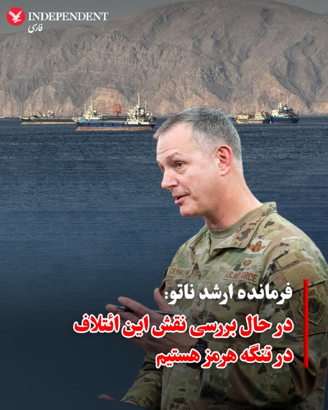

♦️ ژنرال الکسوس گرینکویچ، فرمانده ارشد ناتو در اروپا، روز سه‌شنبه ۲۹ اردیبهشت اعلام کرد که به طور جدی در حال بررسی نحوه کمک این ائتلاف در تنگه هرمز است؛ هرچند تاکید کرد که تا زمان اتخاذ تصمیم سیاسی، برنامه‌ریزی رسمی آغاز نشده است.

این اظهارات در حالی مطرح می‌شود که دونالد ترامپ پیش از این از واکنش ضعیف متحدان اروپایی ناتو به جنگ با جمهوری اسلامی و بسته شدن این آبراه حیاتی انتقاد کرده بود. در پاسخ، کشورهای اروپایی به رهبری بریتانیا و فرانسه در تلاشند تا طرحی را برای کمک به باز نگه داشتن این تنگه پس از پایان احتمالی جنگ تدوین کنند.

با وجود فشارهای واشنگتن، ناتو تاکنون از ورود مستقیم به این درگیری خودداری کرده است. با این حال، ژنـرال گرینکویچ تاکید کرد که کشورهایی مانند بریتانیا، فرانسه، آلمان، ایتالیا و بلژیک ناوهای خود را به منطقه اعزام کرده‌اند و همگی بر سر تضمین آزادی کشتیرانی توافق دارند. دیپلمات‌های اروپایی ناتو احتمال ایفای یک نقش بزرگ را به دلیل اختلافات داخلی کم‌رنگ می‌دانند، اما معتقدند ناتو می‌تواند در عملیات‌های آتی به رهبری فرانسه یا بریتانیا مشارکت داشته باشد.
‌🇸🇦 Indypersian

🤖 @VahidOOnLine

## VahidOOnLine — post 241031

  <a href="telegram/content/VahidOOnLine_241031_1779220573.mp4" target="_blank">🎬 Download video</a>

جی‌دی ونس، معاون ترامپ در نشست خبری کاخ سفید در خصوص جمهوری‌اسلامی گفت دو مسیر پیش روی آمریکا وجود دارد. مسیر اول، مذاکره است و تأکید کرد: «رئیس‌جمهور از ما خواسته به‌طور جدی با ایران مذاکره کنیم.»
ونس افزود: «در موضوع اصلی یعنی عدم دستیابی ایران به سلاح هسته‌ای، پیشرفت زیادی داشته‌ایم و فکر می‌کنیم ایران هم به دنبال توافق است.»
او گزینه دوم را از سرگیری عملیات نظامی عنوان کرد و گفت: «گزینه بی این است که عملیات نظامی دوباره آغاز شود تا اهداف آمریکا دنبال شود.»
وی در پایان تأکید کرد این گزینه مطلوب رئیس‌جمهور نیست و گفت: «فکر نمی‌کنم ایران هم چنین چیزی بخواهد. برای رقص تانگو دو نفر لازم است.»
‌🏁 🇬🇧 ManotoTV

🤖 @VahidOOnLine

## VahidOOnLine — post 241030

  

جی‌دی ونس، معاون رییس‌جمهور آمریکا، سه‌شنبه در نشست خبری خود در کاخ سفید همچنین گفت واشینگتن می‌خواهد جمهوری اسلامی فرایندی را بپذیرد که تضمین کند ایران حتی سال‌ها بعد از دوران ریاست‌جمهوری ترامپ هم نتواند توان هسته‌ای خود را بازسازی کند.

او گفت: «ما می‌خواهیم نه فقط تعهد به عدم دستیابی به سلاح هسته‌ای را ببینیم، بلکه می‌خواهیم تعهدی برای همکاری در یک فرایند ببینیم تا اطمینان حاصل شود که نه فقط اکنون، نه فقط وقتی دونالد ترامپ رئیس‌جمهور است، بلکه سال‌ها بعد هم ایرانی‌ها به دنبال بازسازی توان هسته‌ای خود نباشند.»

او افزود: «این چیزی است که ما در مذاکرات در تلاش برای رسیدن به آن هستیم.»
‌🏁 🇬🇧 IranintlTV

🤖 @VahidOOnLine

## VahidOOnLine — post 241029

  <a href="telegram/content/VahidOOnLine_241029_1779220574.mp4" target="_blank">🎬 Download video</a>

♦️جی‌دی ونس، معاون رئیس‌جمهوری آمریکا، روز سه‌شنبه ۲۹ اردیبهشت در گفتگو با خبرنگاران اعلام کرد: «فکر می‌کنم ما در حال حاضر فرصتی داریم تا رابطه‌ای را که طی ۴۷ سال گذشته بین ایران و ایالات متحده وجود داشته است، بازتنظیم کنیم.»

معاون رئیس‌جمهوری آمریکا که در نبود کارولین لویت، سخنگوی کاخ سفید، مسئولیت نشست خبری روزانه را بر عهده داشت، در ادامه افزود: «این همان چیزی است که رئیس‌جمهوری از ما خواسته و ما به تلاش در این مسیر ادامه خواهیم داد. اما برای این کار، همراهی هر دو طرف لازم است (یک دست صدا ندارد).»

ونس با تبیین خطوط قرمز واشنگتن تاکید کرد: «ما به توافقی که به ایرانی‌ها اجازه دسترسی به سلاح هسته‌ای را بدهد، تن نخواهیم داد. بنابراین، همان‌طور که رئیس‌جمهوری ترامپ به من گفت، ما در حالت آماده‌باش کامل نظامی هستیم. ما تمایلی به پیمودن این مسیر [از سرگیری جنگ] نداریم، اما اگر مجبور شویم، رئیس‌جمهوری آمادگی و توانایی پیشبرد آن را دارد.»
‌🇸🇦 Indypersian

🤖 @VahidOOnLine

## VahidOOnLine — post 241028

♦️جی‌دی ونس، معاون رئیس‌جمهوری آمریکا، روز سه‌شنبه ۲۹ اردیبهشت‌ماه گفت اعضای تیم مذاکره‌کننده جمهوری اسلامی برخی ویژگی‌های ایرانیان، از جمله «هوش و سختکوشی» را دارند، اما همزمان مواضع «بسیار تندروانه» نیز در میان آن‌ها دیده می‌شود.

ونس با توصیف ایران به‌عنوان «تمدنی بزرگ و پرافتخار» گفت مردم ایران «شگفت‌انگیز» هستند و جامعه ایرانی-آمریکایی در ایالات متحده نیز نمونه‌ای از این ویژگی‌ها را نشان می‌دهد.

او در عین حال افزود گاهی مشخص نیست تهران دقیقا چه هدفی را از مذاکرات دنبال می‌کند و ساختار تصمیم‌گیری در جمهوری اسلامی را «چندپاره» توصیف کرد.

معاون رئیس‌جمهوری آمریکا همچنین بار دیگر تاکید کرد واشنگتن اجازه نخواهد داد جمهوری اسلامی به سلاح هسته‌ای دست پیدا کند و هدف مذاکرات، جلوگیری بلندمدت از بازسازی توان هسته‌ای جمهوری اسلامی است.
‌🇸🇦 Indypersian

🤖 @VahidOOnLine

## VahidOOnLine — post 241027

  <a href="telegram/content/VahidOOnLine_241027_1779220575.mp4" target="_blank">🎬 Download video</a>

جی‌دی ونس در کنفرانس خبری خود در ارتباط با گزارش‌هایی که می‌گفتند احتمال دارد روسیه اورانیوم غنی‌شده ایران را دریافت کند؛ پاسخ داده «این در حال حاضر برنامه ما نیست. هیچ‌وقت هم برنامه ما نبوده است.»
او افزود نمی‌داند این گزارش‌ها از کجا منتشر شده‌اند و تأکید کرد که چنین موضوعی از سوی جمهوری اسلامی نیز مطرح نشده است.
ونس همچنین گفت: «برداشت من این است که این چیزی نیست که ایرانی‌ها خیلی از آن استقبال کنند و می‌دانم رئیس‌جمهور هم چندان از آن استقبال نمی‌کند.»
‌🏁 🇬🇧 ManotoTV

🤖 @VahidOOnLine

## VahidOOnLine — post 241026

  <a href="telegram/content/VahidOOnLine_241026_1779220575.mp4" target="_blank">🎬 Download video</a>

آتلانتیک گزارش داده فیفا قصد دارد در جریان جام جهانی ۲۰۲۶ باردیگر ورود پرچم شیروخورشید را به داخل ورزشگاه‌ها ممنوع کند. در جام جهانی ۲۰۲۲ قطر نیز برخی هواداران ایرانی این پرچم را به ورزشگاه‌ها بردند اما با محدودیت مواجه شدند و در برخی موارد اجازه ورود آن‌ها داده نشد. فیفا طبق قوانین خود هرگونه نماد سیاسی، تبعیض‌آمیز یا تحریک‌آمیز را در ورزشگاه‌ها ممنوع می‌داند. با این حال این موضوع همیشه محل بحث بوده، چون بسیاری از ایرانیان مهاجر استفاده از این پرچم را نه صرفا سیاسی، بلکه بخشی از هویت ملی خود می‌دانند.
در مقابل، پرچم فلسطین طبق قوانین فیفا مجاز است، چون به‌عنوان پرچم رسمی یک عضو فیفا شناخته می‌شود و تنها در صورت ایجاد خطر امنیتی ممکن است محدود شود. این تفاوت رویکرد باعث بحث و انتقاد در برخی محافل شده است.
قرار است مسابقات ایران در جام جهانی ۲۰۲۶ در شهرهایی مانند لس‌آنجلس و سیاتل برگزار شود؛ مناطقی که جمعیت زیادی از ایرانیان مهاجر در آن زندگی می‌کنند.در مقابل، پرچم فلسطین طبق قوانین فیفا مجاز است، چون به‌عنوان پرچم رسمی یک عضو فیفا شناخته می‌شود و تنها در صورت ایجاد خطر امنیتی ممکن است محدود شود. این تفاوت رویکرد باعث بحث و انتقاد در برخی محافل شده است.
قرار است مسابقات ایران در جام جهانی ۲۰۲۶ در شهرهایی مانند لس‌آنجلس و سیاتل برگزار شود؛ مناطقی که جمعیت زیادی از ایرانیان مهاجر در آن زندگی می‌کنند.
‌🏁 🇬🇧 ManotoTV

🤖 @VahidOOnLine

## VahidOOnLine — post 241025

  <a href="telegram/content/VahidOOnLine_241025_1779220576.mp4" target="_blank">🎬 Download video</a>

‌
وزارت دادگستری آمریکا الکس ساب، تاجر کلمبیایی-ونزوئلایی و متحد نزدیک نیکلاس مادورو، رئیس‌جمهوری پیشین ونزوئلا، را به پول‌شویی و فساد مالی متهم کرد.

دادستان‌های آمریکا اعلام کردند ساب، که به «صندوق‌دار مادورو» معروف است، از طریق برنامه کمک غذایی دولت ونزوئلا صدها میلیون دلار را با استفاده از شرکت‌های صوری، اسناد جعلی و حساب‌های بانکی آمریکایی جابه‌جا کرده است.

بر اساس اسناد دادگاه، ساب و همکارانش از سال ۲۰۱۵ با قراردادهای جعلی واردات مواد غذایی، صدها میلیون دلار را اختلاس کرده‌اند و از سال ۲۰۱۹ نیز با فروش نفت ونزوئلا تحت پوشش معاملات صوری، میلیاردها دلار پول جابه‌جا کرده‌اند.

الکس ساب که آخر هفته از ونزوئلا به آمریکا منتقل شد، روز دوشنبه برای نخستین بار در دادگاه فدرال میامی حاضر شد.

رویترز گزارش داد دولت دونالد ترامپ در حال آماده‌سازی پرونده قضایی علیه نیکلاس مادورو است و الکس ساب ممکن است اطلاعات مهمی برای تقویت این پرونده در اختیار مقام‌های آمریکایی قرار دهد.
‌🏁 🇬🇧 ManotoTV

🤖 @VahidOOnLine

## VahidOOnLine — post 241024

  <a href="telegram/content/VahidOOnLine_241024_1779220577.mp4" target="_blank">🎬 Download video</a>

ایرانیان بریتانیا با تشکیل تجمعی در مقابل پارلمان این کشور در لندن،‌ روز سه‌شنبه خواستار تروریستی اعلام شدن سپاه و مقابله با جمهوری اسلامی شدند. آن‌ها پرچم‌های شیروخورشید و اسرائیل را در تجمع خود حمل کردند.
‌🏁 🇬🇧 IranintlTV

🤖 @VahidOOnLine

## VahidOOnLine — post 241023

  

♦️ جی‌دی ونس، معاون رئیس‌جمهوری آمریکا، اعلام کرد که دولت ترامپ برای دستیابی به توافقی جهت پایان دادن به جنگ تلاش می‌کند، اما او همچنان شاهد وجود شکاف و گسست در میان سران ایران است و موضع مذاکراتی تهران شفاف نیست.

ونس در نشست خبری روز سه‌شنبه ۲۹ اردیبهشت، خبرنگاران در کاخ سفید گفت: «خودِ ایرانی‌ها هم دقیقا مطمئن نیستند که می‌خواهند در چه مسیری حرکت کنند؛ آن‌ها در حال حاضر کشوری چندپارچه و دارای شکاف هستند.»

او در ادامه افزود: «در ساختار حاکمیتی این کشور، رهبر وجود دارد و در رده‌های پایین‌تر از او نیز مقامات زیادی هستند که بر روند مذاکرات نفوذ دارند. به همین دلیل، گاهی اوقات اصلا مشخص نیست که موضع واقعی تیم مذاکره‌کننده چیست.»

معاون رئیس‌جمهوری آمریکا با اشاره به اینکه هنوز روشن نیست این تشتت آرا ناشی از ضعف در هماهنگی است یا سوءنیت، تاکید کرد که نتیجه این وضعیت، ایجاد فرآیندی مبهم و سردرگم‌کننده بوده است. ونس در پایان گفت: «با اطمینان می‌گویم که گاهی درک این نکته که ایرانی‌ها دقیقا می‌خواهند از این مذاکرات به چه هدفی دست یابند، بسیار دشوار است.»
‌🇸🇦 Indypersian

🤖 @VahidOOnLine

## WithYashar — post 11694

برد کوپر: مردم ایران مخصوصا کودکان به هیچ عنوان دشمن و هدف ما نیستند، طبق هیچ پروتکلی هدف قرار دادن غیرنظامیان قابل توجیه نیست، سپاه پاسداران دشمن ماست
@withyashar

## WithYashar — post 11693

## WithYashar — post 11692

آی 24 نیوز: مقامات اسرائیلی به این باورن که ترامپ با وجود سیگنال‌های متناقض و حرفای عمومی 24 ساعت اخیر، باز هم به حمله به ایران ادامه میده.
@withyashar

## WithYashar — post 11691

فرماندهی مرکزی ایالات متحده: 88 کشتی را در جریان محاصره دریایی ایران مجبور به تغییر مسیر کردیم. @withyashar

## WithYashar — post 11690

معاون ترامپ ، جی دی ونس :

من 41 سال سن دارم و تو این سال ها همش دیدم رسانه های اروپایی مثل جیرجیرک دارن ایراد میگیرن از امریکا
اگه میخوایید از ترامپ ایراد بگیرید اول یک نگاه به خودتون و اینده داغون و خرابتون بندازید بعد راجب ما نظر بدید
@withyashar

## WithYashar — post 11689

ادعای جی‌دی ونس درباره ایران:
تحویل ذخایر اورانیوم غنی‌شده ایران به روسیه، در حال حاضر برنامه ما نیست. هیچ‌وقت برنامه ما نبوده است.

نمی‌دانم این گزارش‌ها از کجا می‌آید.
@withyashar

## mwarmonitor — post 9322

🔴«به گزارش وال‌استریت ژورنال: به گفته سه مقام آمریکایی، ایالات متحده طی شب گذشته یک نفتکش مرتبط با ایران را در اقیانوس هند توقیف کرده است؛ این در حالی است که رئیس‌جمهور ترامپ تهدید می‌کند حملات نظامی علیه ایران را از سر بگیرد.

🔸این اقدام دست‌کم سومین باری است که آمریکا در چارچوب سرکوب ناوگان موسوم به «ناوگان سایه» مرتبط با ایران، یک نفتکش را توقیف می‌کند.»

@mwarmonitor

## mwarmonitor — post 9321

🔹خبرنگار: آیا در نهایت به توافقی خواهیم رسید؟ چون ما مدام این روند را می‌بینیم که بارها و بارها تکرار می‌شود و آن‌ها مدام در حال رفت‌وبرگشت هستند.
🔸جی. دی. ونس: خب، آیا من شخصاً به این موضوع باور دارم؟ پاسخ صادقانه این است که چطور ممکن است بدانم، درست است؟ شما با مردم مذاکره می‌کنید و گاهی اوقات احساس می‌کنید که در حال پیشرفت هستید و گاهی اوقات احساس می‌کنید که پیشرفتی ندارید.
چیزی که من فکر می‌کنم—چیزی که من فکر می‌کنم این است که ایرانی‌ها می‌خواهند توافق کنند. چیزی که من فکر می‌کنم این است که ایرانی‌ها تشخیص می‌دهند که سلاح هسته‌ای خط قرمز ایالات متحده آمریکاست؛ آن‌ها این موضوع را درک کرده‌اند. اما ما تا زمانی که واقعاً قلم روی کاغذ نگذاریم و توافقی را امضا نکنیم، این را نخواهیم دانست.
ما پیش‌نویس‌های زیادی داشته‌ایم، کاغذبازی‌های زیادی برای رفت‌وبرگشت انجام شده است. اما من با اطمینان نخواهم گفت که به توافقی می‌رسیم تا زمانی که واقعاً یک مصالحه مذاکره‌شده را در اینجا امضا کنیم. و فکر می‌کنم این در نهایت به ایرانی‌ها بستگی دارد که آیا مایلند با ما همسو شوند یا خیر، چون فکر می‌کنم ما مطمئناً کارمان را به خوبی انجام می‌دهیم و قطعاً با حسن نیت مذاکره می‌کنیم.
باید ببینیم در نهایت چه اتفاقی با آن‌ها می‌افتد. من نمی‌توانم با اطمینان بگویم، چون نمی‌دانم در ذهن طرف مقابل—در ذهن ایرانی‌ها چه می‌گذرد.

@mwarmonitor

## mwarmonitor — post 9320

  <a href="telegram/content/mwarmonitor_9320_1779220579.mp4" target="_blank">🎬 Download video</a>

🎬 Video

## FoxNewsTwitter — post 341961

  

Fox News (Twitter/X)

An Amazon driver saved a woman’s life after spotting a brutal attack unfolding in her house and calling police.

Authorities say 72-year-old James Alan Johnson is being charged with attempted murder and assault with a deadly weapon after allegedly attacking his wife with a hammer inside their home.

According to investigators, the victim told police Johnson struck her in the head twice before she managed to fight him off by kicking him in the crotch while he was on top of her.

Police say the assault was witnessed by an Amazon driver outside the home, who immediately called 911 for help.

## FoxNewsTwitter — post 341960

  

Fox News (Twitter/X)

A California woman is set to plead guilty for paying homeless people to register to vote and sign political petitions.

Federal prosecutors charged Brenda Lee Brown Armstrong with allegedly paying people — including homeless individuals — to register to vote while she collected ballot-petition signatures in Los Angeles.

Prosecutors said Armstrong sometimes provided homeless individuals with her former Los Angeles address to list on voter registration forms, which registered them to vote in both California and federal elections.

Armstrong was charged with a felony count of paying another person to register to vote, in which she could face a maximum sentence of five years in federal prison.

## FoxNewsTwitter — post 341959

  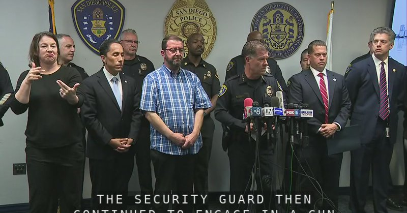

Fox News (Twitter/X)

WATCH LIVE: San Diego Police Department holds a press conference on mosque shooting https://twitter.com/i/broadcasts/1pKdRbppwdjJW

## FoxNewsTwitter — post 341958

  

Fox News (Twitter/X)

An Amazon driver saved a woman’s life after spotting a brutal attack unfolding in her house and calling police.

Authorities say 72-year-old James Alan Johnson is has been charged with attempted murder and assault with a deadly weapon after allegedly attacking his wife with a hammer inside their home.

According to investigators, the victim told police Johnson struck her in the head twice before she managed to fight him off by kicking him in the crotch while he was on top of her.

Police say the assault was witnessed by an Amazon driver outside the home, who immediately called 911 for help.

## FoxNewsTwitter — post 341957

  <a href="telegram/content/FoxNewsTwitter_341957_1779220583.mp4" target="_blank">🎬 Download video</a>

Fox News (Twitter/X)

NEW: U.S. Africa Command and the Government of Nigeria announce they carried out a new round of kinetic strikes against ISIS fighters in Northeastern Nigeria.

AFRICOM says the strikes diminish ISIS’s capabilities to plan attacks that threaten the safety and security of the United States and our partners.

## FoxNewsTwitter — post 341956

Fox News (Twitter/X)

WATCH LIVE: Senate Judiciary Subcommittee on the Constitution hearing on racial gerrymandering https://twitter.com/i/broadcasts/1qKDzPkkaWVJV

## FoxNewsTwitter — post 341955

  

Fox News (Twitter/X)

NEW: VP Vance slams Democrats for their 'No Kings' hypocrisy:

"One of the great ironies of this job is that for the past couple of years, you see these protests break out all over the country... Everybody holds these signs saying 'No Kings,' right?"

"And how many Democratic lawmakers have I seen holding up signs that say 'No Kings?'"

"And then King Charles comes to the, the Congressional chamber and these guys break out in rapturous applause. So maybe they don't care so much about kings as they pretend that they do."

## FoxNewsTwitter — post 341954

  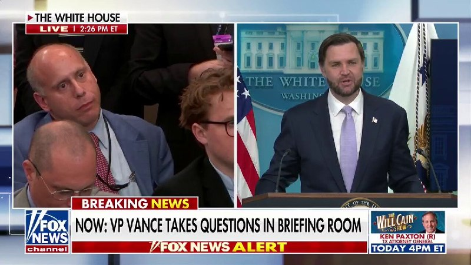

Fox News (Twitter/X)

"Come on, man! Have a little bit of objectivity in the way that you ask these questions."

VP Vance slams a reporter over a long-winded question accusing President Trump of insider trading and talking up stocks he owns to turn a profit:

"There are different ways to ask a question. You can just ask a question and try to get your answer. Or you could do like a speech where you say, you know, 'Mr. Vice President, every you know, you're a you're a terrible human being and so is the president. So is the entire cabinet.'"

"Number one, the president doesn't sit at the Oval Office on his computer, on his, like, Robinhood account buying and selling stocks. That's absurd."

"I think the way to lead by example is banning that process, banning that approach and making it illegal, which is exactly what the president has proposed doing."

## FoxNewsTwitter — post 341953

  <a href="telegram/content/FoxNewsTwitter_341953_1779220586.mp4" target="_blank">🎬 Download video</a>

Fox News (Twitter/X)

NEW: Vice President Vance condemns religious violence, calling it "one of the most anti-Christian things and anti-American things that you could do."

"A fundamental principle of all the great faiths is we are all children of God. And because of that, we are endowed by certain rights that are unique to our status as human beings."

"You violate those rights, most importantly, when you commit violence against another person, you can violate them in other ways as well, but the most profound way to violate the fundamental right of human dignity is to commit violence."

## FoxNewsTwitter — post 341952

  <a href="telegram/content/FoxNewsTwitter_341952_1779220587.mp4" target="_blank">🎬 Download video</a>

Fox News (Twitter/X)

BREAKING: VP Vance asks for Americans to pray for the victims of the deadly mosque shooting in San Diego and condemns political violence in the United States:

"I don't know a single person who would say anything other than what I'm about to say, which is that that type of violence in the United States of America is reprehensible."

"I encourage every single American to pray for everybody who was involved and affected by it. We don't want that to happen in our country, and may God rest the souls of the people who lost their lives."

## FoxNewsTwitter — post 341951

  <a href="telegram/content/FoxNewsTwitter_341951_1779220589.mp4" target="_blank">🎬 Download video</a>

Fox News (Twitter/X)

JUST IN: Vice President Vance speaks on the tragic loss of his personal friend Charlie Kirk, calling his assassination an "unacceptable" tragedy that should outrage every American.

"Charlie was a very, very dear friend. But more importantly than that, Charlie was a father of two beautiful kids, and he did not deserve to have all of those moments with his kids, all of those moments with his beautiful wife taken from them in the way that that happened."

"I would expect everybody, everybody with a heart or a conscience would say whatever we agreed or disagreed with about his particular viewpoints. This is a tragedy, and it's totally unacceptable that it happens in the United States of America."

## FoxNewsTwitter — post 341950

  <a href="telegram/content/FoxNewsTwitter_341950_1779220590.mp4" target="_blank">🎬 Download video</a>

Fox News (Twitter/X)

NEW: VP Vance says "it certainly seems like something fishy is there" when asked about the DOJ's immigration fraud investigation into Squad member Ilhan Omar.

"I mean, you read the things about Ilhan Omar and about, you know, who she married and whether she didn't marry this person or that person..."

"We're going to take a look at it. If we think that there's a crime, we're going to prosecute that crime."

## FoxNewsTwitter — post 341949

  

Fox News (Twitter/X)

NEW: VP Vance reveals that dealing with Iran is highly unstable and that the administration faces a fractured regime where it's "hard to figure out exactly what it is that the Iranians want."

"It's not sometimes totally clear what the negotiating position of the team is. And I don't know if that's sometimes bad communication. If that's bad faith, I don't- I wouldn't pretend to venture a guess there.”

“But I will say with confidence, it's sometimes hard to figure out exactly what it is that the Iranians want to accomplish out of the negotiation. So what we've done is try to be as clear as possible.”

@aishahhasnie

## FoxNewsTwitter — post 341948

  <a href="telegram/content/FoxNewsTwitter_341948_1779220592.mp4" target="_blank">🎬 Download video</a>

Fox News (Twitter/X)

NEW: VP JD Vance pushes back on media criticism surrounding the new fund created for Americans who say they were unfairly targeted by federal agencies:

REPORTER: "I understand that everybody is eligible to apply for this, but I mean, you're eligible, but I assume you're not going to apply... Isn't it just as easy to say that people that attacked police officers should not get taxpayer money from this fund?"

VP VANCE: "We're not trying to give money to anybody who attacked a police officer... We're trying to compensate people where the book was thrown at them, they were mistreated by the legal system."

"I'd encourage everybody Democrat, Republican, independent, let's turn the page on this thing that we did under the last administration where we tried to throw people in prison because they had the wrong politics."

## FoxNewsTwitter — post 341947

  <a href="telegram/content/FoxNewsTwitter_341947_1779220594.mp4" target="_blank">🎬 Download video</a>

Fox News (Twitter/X)

Vice President Leavitt?

JD Vance jokes about the deal he made with Karoline Leavitt for filling in behind the podium in the the White House briefing room:

"I told Karoline I would stand in for her today for the White House press briefing on the condition that when Usha has our baby in July, that she would be vice president for a couple of weeks."

## FoxNewsTwitter — post 341946

  <a href="telegram/content/FoxNewsTwitter_341946_1779220595.mp4" target="_blank">🎬 Download video</a>

Fox News (Twitter/X)

JUST IN: VP Vance calls out fraudsters who are stealing money from innocent people relying on America's spirit of generosity:

"I think it's a great thing about our country is that we have this generosity of spirit where we take care of one another, but fraud takes that away from us because it steals money from the taxpayer when they pay their taxes.”

“And it also steals money from innocent people who are meant to benefit from these programs, but can't when the money runs dry."

## FoxNewsTwitter — post 341945

  

Fox News (Twitter/X)

NEW: VP Vance warns that allowing Iran to have a nuclear weapon opens the door for more anti-American regimes to put the world in danger for future generations:

"As the father of three young kids, I don't want them to inherit a world where 20 additional regimes, half of them very dangerous and very sympathetic to terrorists, have nuclear weapons."

"We want to keep the number of countries that have nuclear weapons small, and that's why Iran cannot have a nuclear weapon on top of all the other things that we might be worried about."

## pm_afshaa — post 91069

  <a href="telegram/content/pm_afshaa_91069_1779220597.webm" target="_blank">🎬 Download video</a>

🔴اردوغان: تنگه هرمز باید هرچه سریع‌تر بازگشایی بشه.

💧 Rainbet.com the #1 Non-KYC Crypto Casino & Sportsbook @rainbetcom

😁 @Pm_Afshaa

## pm_afshaa — post 91068

  <a href="telegram/content/pm_afshaa_91068_1779220597.webm" target="_blank">🎬 Download video</a>

🔴استوری خواهر الهه حسینی نژاد:
امشب، قصاص مرهم داغ خواهرم نمی شود... اما شاید کمی از بی عدالتی این دنیا کم کند. الهه جانم...

+ طبق این استوری، بهمن فرزانه (قاتل الهه) امشب اعدام میشه.

💧 Rainbet.com the #1 Non-KYC Crypto Casino & Sportsbook @rainbetcom

😁 @Pm_Afshaa

## pm_afshaa — post 91067

  <a href="telegram/content/pm_afshaa_91067_1779220598.webm" target="_blank">🎬 Download video</a>

🔴مقام ارشد آمریکایی به فاکس نیوز:
نهاد نظامی اسرائیل و کاخ سفید امروز درباره حمله به ایران گفتگو کردن.

💧 Rainbet.com the #1 Non-KYC Crypto Casino & Sportsbook @rainbetcom

😁 @Pm_Afshaa

## pm_afshaa — post 91066

  <a href="telegram/content/pm_afshaa_91066_1779220598.webm" target="_blank">🎬 Download video</a>

🔴حکم پژمان جمشیدی که متهم به تجاوز بود صادر شد و به 99 ضربه شلاق محکوم شد‌.

شاکی پرونده: همه چیز تو این پرونده به نفع من بوده و تنها بدون هیچ وکیلی اومدم جلو؛ پژمان رو هرگز نمی‌بخشم.

💧Rainbet.com the #1 Non-KYC Crypto Casino & Sportsbook @rainbetcom

😁 @Pm_Afshaa

## pm_afshaa — post 91065

  <a href="telegram/content/pm_afshaa_91065_1779220599.mp4" target="_blank">🎬 Download video</a>

کارشناس صداوسیما: هرکسی جنگ نمیخواد جمع کنه از ایران بره؛ ما تسلیم‌ نمیشیم.

💧 Rainbet.com the #1 Non-KYC Crypto Casino & Sportsbook @rainbetcom

😁 @Pm_Afshaa

## pm_afshaa — post 91064

  <a href="telegram/content/pm_afshaa_91064_1779220600.webm" target="_blank">🎬 Download video</a>

🔴غریب‌آبادی، معاون وزیر خارجه:
جمهوری اسلامی یکپارچه و قاطعانه آماده مقابله با هرگونه تجاوز نظامی است و برای ما تسلیم شدن معنایی نداره؛ یا پیروز میشیم یا شهید میشیم.

💧 Rainbet.com the #1 Non-KYC Crypto Casino & Sportsbook @rainbetcom

😁 @Pm_Afshaa

## pm_afshaa — post 91063

  <a href="telegram/content/pm_afshaa_91063_1779220600.webm" target="_blank">🎬 Download video</a>

🔴آی 24 نیوز: مقامات اسرائیلی به این باورن که ترامپ با وجود سیگنال‌های متناقض و حرفای عمومی 24 ساعت اخیر، باز هم به حمله به ایران ادامه میده.

💧 Rainbet.com the #1 Non-KYC Crypto Casino & Sportsbook @rainbetcom

😁 @Pm_Afshaa

## pm_afshaa — post 91062

  <a href="telegram/content/pm_afshaa_91062_1779220601.webm" target="_blank">🎬 Download video</a>

🔴بلومبرگ: ناتو در حال مذاکره درباره ماموریت احتمالی برای کمک به حفاظت از کشتی‌های عبوری از تنگه هرمز در صورتی که این آبراه تا ماه ژوئیه مسدود بمونه.

💧 Rainbet.com the #1 Non-KYC Crypto Casino & Sportsbook @rainbetcom

😁 @Pm_Afshaa

## pm_afshaa — post 91061

  <a href="telegram/content/pm_afshaa_91061_1779220601.webm" target="_blank">🎬 Download video</a>

🔴وال استریت ژورنال:
نیرو دریایی آمریکا یه نفتکش مربوط به ایران رو توی اقیانوس هند توقیف کردن.

اسم نفتکش هم اسکای‌ویو هست که قبلاً آمریکا بخاطر اینکه نفت ایران حمل میکرد تحریمش کرده بود.

💧 Rainbet.com the #1 Non-KYC Crypto Casino & Sportsbook @rainbetcom

😁 @Pm_Afshaa

## pm_afshaa — post 91060

  <a href="telegram/content/pm_afshaa_91060_1779220602.webm" target="_blank">🎬 Download video</a>

🔴کانال 12 اسرائیل: پس از اظهارات ترامپ درباره توقف حمله برنامه‌ریزی‌شده علیه جمهوری اسلامی، سطح تنش‌ها افزایش یافته و ارتش اسرائیل آماده‌باش کامل اعلام کرده.

طبق این گزارش، مقام‌های اسرائیلی تنها دقایقی پیش از اعلام عمومی ترامپ در جریان تصمیم اون قرار گرفتن و نیروی هوایی اسرائیل خودش برای احتمال حمله در روزهای آینده آماده میکنه.

💧 Rainbet.com the #1 Non-KYC Crypto Casino & Sportsbook @rainbetcom

😁 @Pm_Afshaa

## pm_afshaa — post 91059

  <a href="telegram/content/pm_afshaa_91059_1779220602.webm" target="_blank">🎬 Download video</a>

🔴اکسیوس: ترامپ پس از اعلام به‌تعویق انداختن حمله به ایران، با مشاوران امنیت ملی خود جلسه‌ای برگزار کرد.

💧 Rainbet.com the #1 Non-KYC Crypto Casino & Sportsbook @rainbetcom

😁 @Pm_Afshaa

## pm_afshaa — post 91058

  <a href="telegram/content/pm_afshaa_91058_1779220603.webm" target="_blank">🎬 Download video</a>

🔴ونس: تحویل اورانیوم ایران به روسیه هیچوقت جزو برنامه‌های ما نبوده و نمیدونم این گزارشات از کجا میان.

💧 Rainbet.com the #1 Non-KYC Crypto Casino & Sportsbook @rainbetcom

😁 @Pm_Afshaa

## pm_afshaa — post 91057

  <a href="telegram/content/pm_afshaa_91057_1779220603.webm" target="_blank">🎬 Download video</a>

🔴جی‌دی ونس، معاون ترامپ:
اگر ایران به سلاح هسته‌ای دست پیدا کنه، کشورهای بیشتری به‌دنبال دستیابی به سلاح هسته‌ای خواهند رفت و ایران میتونه آغازگر یک مسابقه تسلیحات هسته‌ای جدید باشه.

💧 Rainbet.com the #1 Non-KYC Crypto Casino & Sportsbook @rainbetcom

😁 @Pm_Afshaa

## pm_afshaa — post 91056

  <a href="telegram/content/pm_afshaa_91056_1779220604.webm" target="_blank">🎬 Download video</a>

🔴جی‌دی ونس: من فکر میکنم ایرانی‌ها میخوان توافق کنن، اما با اطمینان نمیگم که ما به توافق میرسیم تا زمانی که واقعاً یک توافق از طریق مذاکره امضا کنیم.

من فکر میکنم که در نهایت به ایرانی‌ها بستگی داره که آیا مایل به دیدار با ما هستن، زیرا فکر میکنم ما مطمئناً کار خوبی انجام میدیم و مطمئناً با حسن نیت در حال مذاکره هستیم.

💧 Rainbet.com the #1 Non-KYC Crypto Casino & Sportsbook @rainbetcom

😁 @Pm_Afshaa

## DEJradio — post 4752

  <a href="telegram/content/DEJradio_4752_1779220604.webm" target="_blank">🎬 Download video</a>

🚨
🔸 خبر ۲۱
سه‌شنبه ۲۹ اردیبهشت ۱۴۰۵

#خبر۲۱
@DEJradio

## VahidOnline — post 75556

  <a href="telegram/content/VahidOnline_75556_1779220605.mp4" target="_blank">🎬 Download video</a>

جی‌دی ونس، معاون رییس‌جمهور آمریکا، گفت واشینگتن و تهران پیشرفت زیادی در گفت‌وگوهای خود داشته‌اند و هیچ‌یک از دو طرف خواهان ازسرگیری کارزار نظامی نیستند.
ونس افزود: «ما فکر می‌کنیم پیشرفت زیادی داشته‌ایم. تصور می‌کنیم مقام‌های تهران نیز می‌خواهند به توافق برسند.»
او گفت آمریکا می‌تواند کارزار نظامی را از سر بگیرد، اما «این چیزی نیست که ترامپ یا ایران می‌خواهند.»
ونس همچنین گفت: «فکر می‌کنم جمهوری اسلامی می‌خواهد توافق کند، اما تا زمانی که توافق امضا نشود، نخواهیم دانست.»
@VahidOOnLine
جی‌دی ونس اعلام کرد که دولت ترامپ برای دستیابی به توافقی جهت پایان دادن به جنگ تلاش می‌کند، اما او همچنان شاهد وجود شکاف و گسست در میان سران ایران است و موضع مذاکراتی تهران شفاف نیست.
معاون رییس‌جمهور آمریکا گفت: «خودِ ایرانی‌ها هم دقیقا مطمئن نیستند که می‌خواهند در چه مسیری حرکت کنند؛ آن‌ها در حال حاضر کشوری چندپارچه و دارای شکاف هستند.»
او در ادامه افزود: «در ساختار حاکمیتی این کشور، رهبر وجود دارد و در رده‌های پایین‌تر از او نیز مقامات زیادی هستند که بر روند مذاکرات نفوذ دارند. به همین دلیل، گاهی اوقات اصلا مشخص نیست که موضع واقعی تیم مذاکره‌کننده چیست.»
ونس با اشاره به اینکه هنوز روشن نیست این تشتت آرا ناشی از ضعف در هماهنگی است یا سوءنیت، تاکید کرد که نتیجه این وضعیت، ایجاد فرآیندی مبهم و سردرگم‌کننده بوده است. ونس در پایان گفت: «با اطمینان می‌گویم که گاهی درک این نکته که ایرانی‌ها دقیقا می‌خواهند از این مذاکرات به چه هدفی دست یابند، بسیار دشوار است.»
@VahidOOnLine
جی‌دی ونس گفت اعضای تیم مذاکره‌کننده جمهوری اسلامی برخی ویژگی‌های ایرانیان، از جمله «هوش و سختکوشی» را دارند، اما همزمان مواضع «بسیار تندروانه» نیز در میان آن‌ها دیده می‌شود.
معاون رئیس‌جمهوری آمریکا با توصیف ایران به‌عنوان «تمدنی بزرگ و پرافتخار» گفت مردم ایران «شگفت‌انگیز» هستند و جامعه ایرانی-آمریکایی در ایالات متحده نیز نمونه‌ای از این ویژگی‌ها را نشان می‌دهد.
او در عین حال افزود گاهی مشخص نیست تهران دقیقا چه هدفی را از مذاکرات دنبال می‌کند و ساختار تصمیم‌گیری در جمهوری اسلامی را «چندپاره» توصیف کرد.
ونس همچنین بار دیگر تاکید کرد واشنگتن اجازه نخواهد داد جمهوری اسلامی به سلاح هسته‌ای دست پیدا کند و هدف مذاکرات، جلوگیری بلندمدت از بازسازی توان هسته‌ای جمهوری اسلامی است.
@VahidOOnLine
جی‌دی ونس اعلام کرد: «فکر می‌کنم ما در حال حاضر فرصتی داریم تا رابطه‌ای را که طی ۴۷ سال گذشته بین ایران و ایالات متحده وجود داشته است، بازتنظیم کنیم.»
معاون رئیس‌جمهوری آمریکا که در نبود کارولین لویت، سخنگوی کاخ سفید، مسئولیت نشست خبری روزانه را بر عهده داشت، در ادامه افزود: «این همان چیزی است که رئیس‌جمهوری از ما خواسته و ما به تلاش در این مسیر ادامه خواهیم داد. اما برای این کار، همراهی هر دو طرف لازم است (یک دست صدا ندارد).»
ونس با تبیین خطوط قرمز واشنگتن تاکید کرد: «ما به توافقی که به ایرانی‌ها اجازه دسترسی به سلاح هسته‌ای را بدهد، تن نخواهیم داد. بنابراین، همان‌طور که رئیس‌جمهوری ترامپ به من گفت، ما در حالت آماده‌باش کامل نظامی هستیم. ما تمایلی به پیمودن این مسیر [از سرگیری جنگ] نداریم، اما اگر مجبور شویم، رئیس‌جمهوری آمادگی و توانایی پیشبرد آن را دارد.»
@VahidOOnLine
ونس افزود که به‌تازگی با آقای ترامپ صحبت کرده و رئیس‌جمهور آمریکا تأکید کرده است که مسئله اصلی برای آمریکا این است که ایران هرگز نباید به سلاح هسته‌ای دست پیدا کند.
ونس یادآوری کرد که اگر چنین اتفاقی بیفتد، کشورهای حاشیه خلیج فارس نیز به‌دنبال سلاح هسته‌ای خواهند رفت و سپس کشورهای دیگر جهان هم همین مسیر را دنبال خواهند کرد.
او گفت: «ما می‌خواهیم تعداد کشورهایی که سلاح هسته‌ای دارند محدود باقی بماند، و به همین دلیل ایران نمی‌تواند سلاح هسته‌ای داشته باشد.»
وقتی از ونس پرسیده شد که آیا ممکن است روسیه مالکیت اورانیوم غنی‌شده ایران را در اختیار بگیرد، او پاسخ داد: «این در حال حاضر برنامه دولت ایالات متحده نیست. ایرانی‌ها هم چنین موضوعی را مطرح نکرده‌اند.»
@VahidHeadline
جی‌دی ونس همچنین گفت واشینگتن می‌خواهد جمهوری اسلامی فرایندی را بپذیرد که تضمین کند ایران حتی سال‌ها بعد از دوران ریاست‌جمهوری ترامپ هم نتواند توان هسته‌ای خود را بازسازی کند.
او گفت: «ما می‌خواهیم نه فقط تعهد به عدم دستیابی به سلاح هسته‌ای را ببینیم، بلکه می‌خواهیم تعهدی برای همکاری در یک فرایند ببینیم تا اطمینان حاصل شود که نه فقط اکنون، نه فقط وقتی دونالد ترامپ رئیس‌جمهور است، بلکه سال‌ها بعد هم ایرانی‌ها به دنبال بازسازی توان هسته‌ای خود نباشند.»

او افزود: «این چیزی است که ما در مذاکرات در تلاش برای رسیدن به آن هستیم.»
@VahidOOnLine

📡 @VahidOnline

## kianmeli1 — post 87500

  <a href="telegram/content/kianmeli1_87500_1779220605.mp4" target="_blank">🎬 Download video</a>

🔴 ترامپ به ایران برای توافق دو یا سه روز مهلت داد

خبرنگار: ایران چند روز فرصت دارد تا پای میز مذاکره بیاید؟

ترامپ: دو یا سه روز. شاید جمعه، شنبه، یکشنبه. یک دوره زمانی محدود. چون ما نمی‌توانیم اجازه دهیم آنها سلاح هسته‌ای داشته باشند.
https://t.me/kianmeli1

## kianmeli1 — post 87499

  <a href="telegram/content/kianmeli1_87499_1779220606.mp4" target="_blank">🎬 Download video</a>

⚠️آموزش کار با اسلحه به کودکان در خیابان
https://t.me/kianmeli1

## kianmeli1 — post 87498

🔴 هویت اعضای شبکه پولشویی سپاه پاسداران در بریتانیا
 
شبکه‌ای که سالهاست میلیاردها دلار ثروت ایران را به خارج منتقل می‌کند در حالی که مردم داخل کشور زیر فشار فقر و سرکوب له شده‌اند. مزدوران همین باندهای مافیایی سپاه برای حفظ منافع و ادامه غارت حتی در 18 و 19 دی 50 هزار ایرانی را به گلوله بستند.
https://t.me/kianmeli1

## kianmeli1 — post 87497

‏🔴ترامپ: برآورد ما این است که ۸۲ درصد از موشک‌هایشان از بین رفته است. توانایی آن‌ها برای تولید دوباره هم الان بسیار کم شده است. در مورد پهپادها هم همین‌طور است؛ بخش عمده‌ای از توانشان از بین رفته، هرچند هنوز مقدار کمی ظرفیت دارند، اما خیلی ناچیز است. رییس‌جمهور چین هم به من قول داده که هیچ سلاحی به تهران ارسال نمی‌کند
https://t.me/kianmeli1

## kianmeli1 — post 87496

‏🔴وال‌استریت‌ژورنال گزارش داد ایالات متحده یک نفتکش مرتبط با ایران را در اقیانوس هند توقیف کرده است
https://t.me/kianmeli1

## IranIntlTV — post 337988

  

رجب طیب اردوغان، رییس‌جمهور ترکیه، در تماس تلفنی با اورسولا فون در لاین، رییس کمیسیون اروپا، تاکید کرد که تنگه هرمز باید هرچه سریع‌تر بازگشایی شود و آنکارا برای حفظ آتش‌بس و دستیابی به صلح در درگیری‌های جاری منطقه تلاش می‌کند.
https://iranintl.com/202605192411

## IranIntlTV — post 337987

  <a href="telegram/content/IranIntlTV_337987_1779220608.mp4" target="_blank">🎬 Download video</a>

چند مقام آمریکایی به نیویورک‌تایمز گفتند تصمیم ترامپ برای به تاخیر انداختن حمله به ایران، ممکن است عملیات فریب باشد و شاید او همچنان حمله‌های برنامه‌ریزی‌ شده را اجرا کند.
@iranintltv

## IranIntlTV — post 337986

  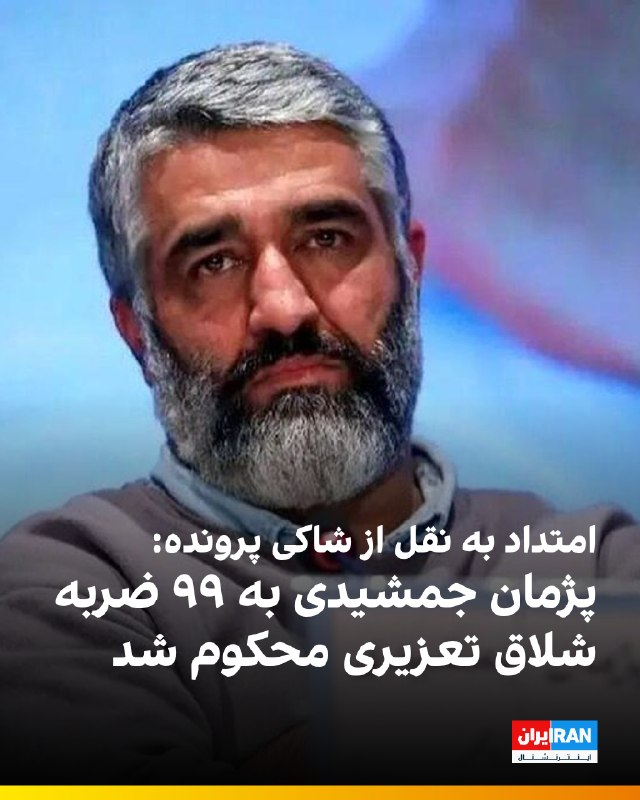

🔻امتداد به نقل از شاکی پرونده پژمان جمشیدی خبر داد که حکم این پرونده صادر و به او ابلاغ شده است. به گفته او، پژمان جمشیدی به ۹۹ ضربه شلاق تعزیری محکوم شده است. شاکی پرونده گفته تمام مدارکی که به نفع او است در پرونده وجود دارد.

🔹 پرونده پژمان جمشیدی از مهر ۱۴۰۴ با بازداشت او رسانه‌ای شد. بازیکن پیشین تیم ملی و پرسپولیس و بازیگر سینما و تلویزیون پس از چند روز با قرار وثیقه از زندان آزاد شد و مدتی در خارج از ایران بود. پس از این برای پرونده او، دو جلسه دیگر دادگاه برگزار شد.⁩

@iranintltvsport

## IranIntlTV — post 337985

  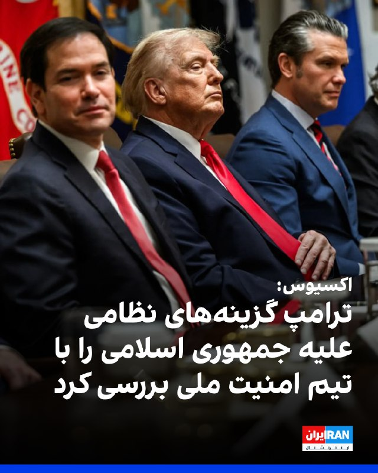

اکسیوس به نقل از دو مقام آمریکایی گزارش داد که دونالد ترامپ شامگاه دوشنبه نشستی با تیم ارشد امنیت ملی خود درباره جمهوری اسلامی برگزار کرد که شامل ارائه گزارشی درباره گزینه‌های نظامی بود.

مقام‌های آمریکایی گفته‌اند بررسی طرح‌های نظامی در نشست دوشنبه نشان می‌دهد او همچنان به‌طور جدی در حال بررسی ازسرگیری جنگ است.
https://iranintl.com/202605193303

## IranIntlTV — post 337984

  <a href="https://t.me/IranintlTV/337984" target="_blank">📎 Download file</a>

🎧نسخه صوتی چشم‌انداز: اولین نشانه‌ها از عقب‌نشینی حکومت ایران در مقابل آمریکا!؟
@iranintlTV

## IranIntlTV — post 337982

  <a href="telegram/content/IranIntlTV_337982_1779220611.mp4" target="_blank">🎬 Download video</a>

اولین نشانه‌ها از عقب‌نشینی حکومت ایران در مقابل آمریکا!؟

«چشم‌انداز با مهدی‌مهدوی‌آزاد»

تماشای نسخه کامل برنامه در یوتیوب:

https://youtu.be/_QiwmyU7V4s
@iranintltv

## IranIntlTV — post 337981

  

جی‌دی ونس، معاون رییس‌جمهور آمریکا، سه‌شنبه در نشست خبری خود در کاخ سفید همچنین گفت واشینگتن می‌خواهد جمهوری اسلامی فرایندی را بپذیرد که تضمین کند ایران حتی سال‌ها بعد از دوران ریاست‌جمهوری ترامپ هم نتواند توان هسته‌ای خود را بازسازی کند.

او گفت: «ما می‌خواهیم نه فقط تعهد به عدم دستیابی به سلاح هسته‌ای را ببینیم، بلکه می‌خواهیم تعهدی برای همکاری در یک فرایند ببینیم تا اطمینان حاصل شود که نه فقط اکنون، نه فقط وقتی دونالد ترامپ رئیس‌جمهور است، بلکه سال‌ها بعد هم ایرانی‌ها به دنبال بازسازی توان هسته‌ای خود نباشند.»

او افزود: «این چیزی است که ما در مذاکرات در تلاش برای رسیدن به آن هستیم.»
https://iranintl.com/202605193887

## IranIntlTV — post 337980

  <a href="telegram/content/IranIntlTV_337980_1779220613.mp4" target="_blank">🎬 Download video</a>

۲۴ با فرداد فرحزاد
@iranintltv

## IranIntlTV — post 337979

  <a href="telegram/content/IranIntlTV_337979_1779220614.mp4" target="_blank">🎬 Download video</a>

ایرانیان بریتانیا با تشکیل تجمعی در مقابل پارلمان این کشور در لندن،‌ روز سه‌شنبه خواستار تروریستی اعلام شدن سپاه و مقابله با جمهوری اسلامی شدند. آن‌ها پرچم‌های شیروخورشید و اسرائیل را در تجمع خود حمل کردند.

## IranIntlTV — post 337978

  <a href="https://t.me/IranintlTV/337978" target="_blank">📎 Download file</a>

🎧نسخه صوتی تیتراول با نیوشا صارمی: ترامپ: شاید همین آخر هفته به ایران حمله کنیم؛ عملیات فریب یا تعویق حمله؟
@iranintlTV

## IranIntlTV — post 337977

  

«برنامه با کامبیز حسینی» این هفته پخش نمی‌شود
«برنامه» بعدی، دوشنبه ۴ خرداد، ساعت ۱۱ شب به‌وقت تهران

@iranintltv

## IranIntlTV — post 337976

  <a href="telegram/content/IranIntlTV_337976_1779220616.mp4" target="_blank">🎬 Download video</a>

مهدی مهدوی‌آزاد در برنامه «چشم‌انداز» در واکنش به اظهارات پزشکیان درباره فروش نرفتن نفت و بحران اقتصادی گفت: «صریح‌تر شدن لحن پزشکیان نشان از عقب‌نشینی حکومت در برابر واقعیت‌های سخت یا هرج‌ومرج در قوه مجریه دارد؛ روندی که می‌تواند احتمال استعفا و فروپاشی نهاد اجرایی را افزایش دهد.»
@iranintltv

## IranIntlTV — post 337975

  <a href="telegram/content/IranIntlTV_337975_1779220618.mp4" target="_blank">🎬 Download video</a>

شهروندان در پیام‌هایی به ایران‌اینترنشنال نسبت به معلق بودن وضعیت جمهوری اسلامی، از ترامپ و سیاست دولتش انتقاد می‌کنند. یک شهروند خواسته که ترامپ مقابله با جمهوری اسلامی را به نتانیاهو بسپارد. پیام این شهروند با هوش مصنوعی خوانده شده است.

## IranIntlTV — post 337974

نامزد آیدا عقیلی، جاویدنام انقلاب ملی، در ویدیویی مبر سر مزار او توضیح داد که پس از جان باختن همسرش به خیابان رفت و به اعتراض به ماموران سرکوب پرداخت که یکی از آن‌ها گفت حقوق ماموران ۲۰ میلیون تومان است. نامزد این جاویدنام به وضعیت معیشتی بد شهروندان و اعتراض آن‌ها نیز اشاره کرد.

## Shin_Persian — post 6103

Shin ✓ @hey_itsmyturn
Tue, 19 May 2026 19:21:11 UTC

"I realized they are just looking for a neck for their noose"

- Navid Afkari, #Iran
(https://en.wikipedia.org/wiki/Execution_of_Navid_Afkari)

فارسی

«من متوجه شدم که آنها فقط به دنبال گردنی برای طناب دارشان می‌گردند»

- نوید افکاری، #Iran
(https://en.wikipedia.org/wiki/Execution_of_Navid_Afkari)

𝕏 · @shin_persian

## Shin_Persian — post 6102

📦 mhrv-rs v1.9.31 released

• Fix a Full mode pipeline regression introduced after v1.9.28 where idle sessions could generate too many empty polls and burn quota across multi-deployment setups
• Make Full mode data flow steadier
• Change the block_stun default to false, so STUN/TURN traffic is allowed by default; set `block_stun

Files (Android APKs, Windows, macOS, Linux, OpenWRT) on the files channel:

👉 v1.9.31 — all files with SHA-256

Channel:
https://t.me/mhrv_rs
or: https://t.me/+R1OyoHX2boA1ZDgx

#v1931

## ManotoTV — post 105659

  <a href="telegram/content/ManotoTV_105659_1779220619.mp4" target="_blank">🎬 Download video</a>

تماسی تلخ از دل ایران:
«می‌گفت در پتروشیمی تعدیل شده…
و برای تأمین هزینه‌های زندگی حتی به رحم اجاره‌ای فکر می‌کنه

## ManotoTV — post 105658

  <a href="telegram/content/ManotoTV_105658_1779220621.mp4" target="_blank">🎬 Download video</a>

جی‌دی ونس، معاون رئیس‌جمهوری آمریکا، در پاسخ به سوالی درباره مذاکرات واشینگتن و جمهوری اسلامی گفت ایران کشوری «پیچیده» است و گاهی مشخص نیست مقام‌های جمهوری اسلامی دقیقاً چه هدفی را از مذاکرات دنبال می‌کنند.

ونس گفت با وجود آن‌که کاخ سفید مذاکرات را «با حسن نیت» پیش می‌برد، در طرف جمهوری اسلامی همزمان هم نشانه‌هایی از آمادگی برای مذاکره دیده می‌شود و هم «مواضع بسیار تندروانه».

او افزود: «ایران یک تمدن بزرگ و پرافتخار با مردم شگفت‌انگیز است» و به جامعه ایرانی-آمریکایی در ایالات متحده اشاره کرد که به گفته او «باهوش و سخت‌کوش» هستند.

معاون رئیس‌جمهوری آمریکا گفت بخشی از این ویژگی‌ها را در تیم مذاکره‌کننده جمهوری اسلامی نیز می‌بیند، اما در عین حال تاکید کرد مواضع متفاوت و متناقضی هم در میان مذاکره‌کنندگان ایرانی وجود دارد.

ونس همچنین جمهوری اسلامی را «کشوری چندپاره» توصیف کرد و گفت علاوه بر رهبر جمهوری اسلامی، مقام‌های مختلف دیگری نیز بر روند مذاکرات تاثیر دارند و همین موضوع باعث می‌شود موضع واقعی تهران همیشه روشن نباشد.

او افزود: «گاهی مشخص نیست این وضعیت ناشی از ضعف در ارتباطات است یا ناشی از سوءنیت، اما واقعاً سخت است بفهمیم ایرانی‌ها دقیقاً می‌خواهند از این مذاکرات به چه چیزی برسند.»

## ManotoTV — post 105657

  <a href="telegram/content/ManotoTV_105657_1779220623.mp4" target="_blank">🎬 Download video</a>

بریتیش ایرویز از تعویق دوباره پروازهای خود به خاورمیانه خبر داد و اعلام کرد ازسرگیری پروازها به دبی، دوحه و تل‌آویو تا اول اوت به تعویق افتاده است.

رویترز گزارش داد جنگ آمریکا و اسرائیل با جمهوری اسلامی باعث شده ده‌ها شرکت هواپیمایی از زمان آغاز درگیری‌ها در اواخر فوریه، پروازهای خود به منطقه را لغو کنند.

بریتیش ایرویز در بیانیه‌ای اعلام کرد: «به دلیل ادامه وضعیت در خاورمیانه، تغییرات بیشتری در برنامه پروازی خود ایجاد کرده‌ایم تا شفافیت بیشتری برای مشتریان فراهم شود.»

این شرکت پیش‌تر نیز اعلام کرده بود پس از ازسرگیری پروازها، تعداد پروازهای خود به خاورمیانه را کاهش خواهد داد و مقصد جده را به‌طور کامل از برنامه‌هایش حذف می‌کند.

بر اساس برنامه جدید، پروازهای بریتیش ایرویز به دبی، دوحه، ریاض و تل‌آویو به یک پرواز در روز کاهش پیدا خواهد کرد.

## ManotoTV — post 105656

  <a href="telegram/content/ManotoTV_105656_1779220623.mp4" target="_blank">🎬 Download video</a>

جی‌دی ونس، معاون ترامپ در نشست خبری کاخ سفید در خصوص جمهوری‌اسلامی گفت دو مسیر پیش روی آمریکا وجود دارد. مسیر اول، مذاکره است و تأکید کرد: «رئیس‌جمهور از ما خواسته به‌طور جدی با ایران مذاکره کنیم.»
ونس افزود: «در موضوع اصلی یعنی عدم دستیابی ایران به سلاح هسته‌ای، پیشرفت زیادی داشته‌ایم و فکر می‌کنیم ایران هم به دنبال توافق است.»
او گزینه دوم را از سرگیری عملیات نظامی عنوان کرد و گفت: «گزینه بی این است که عملیات نظامی دوباره آغاز شود تا اهداف آمریکا دنبال شود.»
وی در پایان تأکید کرد این گزینه مطلوب رئیس‌جمهور نیست و گفت: «فکر نمی‌کنم ایران هم چنین چیزی بخواهد. برای رقص تانگو دو نفر لازم است.»

## ManotoTV — post 105655

  <a href="telegram/content/ManotoTV_105655_1779220624.mp4" target="_blank">🎬 Download video</a>

جی‌دی ونس در کنفرانس خبری خود در ارتباط با گزارش‌هایی که می‌گفتند احتمال دارد روسیه اورانیوم غنی‌شده ایران را دریافت کند؛ پاسخ داده «این در حال حاضر برنامه ما نیست. هیچ‌وقت هم برنامه ما نبوده است.»
او افزود نمی‌داند این گزارش‌ها از کجا منتشر شده‌اند و تأکید کرد که چنین موضوعی از سوی جمهوری اسلامی نیز مطرح نشده است.
ونس همچنین گفت: «برداشت من این است که این چیزی نیست که ایرانی‌ها خیلی از آن استقبال کنند و می‌دانم رئیس‌جمهور هم چندان از آن استقبال نمی‌کند.»

## ManotoTV — post 105654

  <a href="telegram/content/ManotoTV_105654_1779220624.mp4" target="_blank">🎬 Download video</a>

آتلانتیک گزارش داده فیفا قصد دارد در جریان جام جهانی ۲۰۲۶ باردیگر ورود پرچم شیروخورشید را به داخل ورزشگاه‌ها ممنوع کند. در جام جهانی ۲۰۲۲ قطر نیز برخی هواداران ایرانی این پرچم را به ورزشگاه‌ها بردند اما با محدودیت مواجه شدند و در برخی موارد اجازه ورود آن‌ها داده نشد. فیفا طبق قوانین خود هرگونه نماد سیاسی، تبعیض‌آمیز یا تحریک‌آمیز را در ورزشگاه‌ها ممنوع می‌داند. با این حال این موضوع همیشه محل بحث بوده، چون بسیاری از ایرانیان مهاجر استفاده از این پرچم را نه صرفا سیاسی، بلکه بخشی از هویت ملی خود می‌دانند.
در مقابل، پرچم فلسطین طبق قوانین فیفا مجاز است، چون به‌عنوان پرچم رسمی یک عضو فیفا شناخته می‌شود و تنها در صورت ایجاد خطر امنیتی ممکن است محدود شود. این تفاوت رویکرد باعث بحث و انتقاد در برخی محافل شده است.
قرار است مسابقات ایران در جام جهانی ۲۰۲۶ در شهرهایی مانند لس‌آنجلس و سیاتل برگزار شود؛ مناطقی که جمعیت زیادی از ایرانیان مهاجر در آن زندگی می‌کنند.در مقابل، پرچم فلسطین طبق قوانین فیفا مجاز است، چون به‌عنوان پرچم رسمی یک عضو فیفا شناخته می‌شود و تنها در صورت ایجاد خطر امنیتی ممکن است محدود شود. این تفاوت رویکرد باعث بحث و انتقاد در برخی محافل شده است.
قرار است مسابقات ایران در جام جهانی ۲۰۲۶ در شهرهایی مانند لس‌آنجلس و سیاتل برگزار شود؛ مناطقی که جمعیت زیادی از ایرانیان مهاجر در آن زندگی می‌کنند.

## ManotoTV — post 105653

  <a href="telegram/content/ManotoTV_105653_1779220625.mp4" target="_blank">🎬 Download video</a>

‌
وزارت دادگستری آمریکا الکس ساب، تاجر کلمبیایی-ونزوئلایی و متحد نزدیک نیکلاس مادورو، رئیس‌جمهوری پیشین ونزوئلا، را به پول‌شویی و فساد مالی متهم کرد.

دادستان‌های آمریکا اعلام کردند ساب، که به «صندوق‌دار مادورو» معروف است، از طریق برنامه کمک غذایی دولت ونزوئلا صدها میلیون دلار را با استفاده از شرکت‌های صوری، اسناد جعلی و حساب‌های بانکی آمریکایی جابه‌جا کرده است.

بر اساس اسناد دادگاه، ساب و همکارانش از سال ۲۰۱۵ با قراردادهای جعلی واردات مواد غذایی، صدها میلیون دلار را اختلاس کرده‌اند و از سال ۲۰۱۹ نیز با فروش نفت ونزوئلا تحت پوشش معاملات صوری، میلیاردها دلار پول جابه‌جا کرده‌اند.

الکس ساب که آخر هفته از ونزوئلا به آمریکا منتقل شد، روز دوشنبه برای نخستین بار در دادگاه فدرال میامی حاضر شد.

رویترز گزارش داد دولت دونالد ترامپ در حال آماده‌سازی پرونده قضایی علیه نیکلاس مادورو است و الکس ساب ممکن است اطلاعات مهمی برای تقویت این پرونده در اختیار مقام‌های آمریکایی قرار دهد.

## ManotoTV — post 105652

  <a href="telegram/content/ManotoTV_105652_1779220626.mp4" target="_blank">🎬 Download video</a>

ولادیمیر پوتین، رئیس‌جمهوری روسیه، برای دیدار با شی جین‌پینگ وارد چین شد؛ سفری که کمتر از یک هفته پس از سفر دونالد ترامپ به پکن انجام می‌شود و توجه زیادی را به خود جلب کرده است.
کرملین اعلام کرده پوتین و شی در این سفر درباره همکاری‌های اقتصادی، مسائل منطقه‌ای و روابط بین‌المللی گفت‌وگو خواهند کرد. این سفر همزمان با بیست‌وپنجمین سالگرد پیمان دوستی چین و روسیه برگزار می‌شود.
چین که پس از جنگ اوکراین به مهم‌ترین شریک تجاری روسیه تبدیل شده، تلاش می‌کند هم روابط نزدیک خود با مسکو را حفظ کند و هم روابط باثباتی با آمریکا داشته باشد.
مقام‌های روسی گفته‌اند صادرات نفت روسیه به چین در سه‌ماهه نخست ۲۰۲۶ افزایش یافته و دو کشور در حوزه انرژی به توافق‌های مهمی نزدیک شده‌اند. پوتین نیز روابط مسکو و پکن را عاملی برای «ثبات و بازدارندگی» در جهان توصیف کرده است.

## FarsiVOA — post 218165

🔺وال‌استریت ژورنال: آمریکا یک کشتی تحریم‌شده مرتبط با جمهوری اسلامی را توقیف کرد

◾️روزنامه آمریکایی وال‌استریت ژورنال روز سه‌شنبه ۲۹ اردیبهشت به نقل از سه مقام آمریکایی گزارش داد که ایالات متحده در طول شب یک نفتکش مرتبط با جمهوری اسلامی را در اقیانوس هند توقیف کرد.

⬇️ بیشتر بخوانید:
https://ir.voanews.com/a/8151734.html
@FarsiVOA

## FarsiVOA — post 218164

⚡️در برنامه تفسیر خبر امروز، مهدی آقازمانی با کارشناسان مهمان، درباره فرصت مجدد پرزیدنت ترامپ به جمهوری اسلامی برای دستابی یک توافق خوب بنا به درخواست کشورهای عربی منطقه گفتگو می‌کند
@FarsiVOA

## FarsiVOA — post 218163

⚡️کمیته نیروهای مسلح مجلس نمایندگان آمریکا روز سه‌شنبه ۲۹ اردیبهشت یک جلسه استماع را با حضور دریابد برد کوپر، فرمانده سنتکام، ژنرال داگوین اندرسون، فرمانده آفریکام، و دانیل زیمرمن، معاون وزیر جنگ در امور امنیت بین‌الملل، برگزار کرد. صدای آمریکا این جلسه را با ترجمه همزمان پژواک کیومرثی پخش کرد.

@FarsiVOA

## FarsiVOA — post 218162

⚡️روایت اقلیم کردستان عراق از اتهامات جدید جمهوری اسلامی؛ قاچاق سلاح یا توجیه بمباران؟
@FarsiVOA

## FarsiVOA — post 218161

⚡️کمیته نیروهای مسلح مجلس نمایندگان آمریکا روز سه‌شنبه ۲۹ اردیبهشت یک جلسه استماع را با حضور دریابد برد کوپر، فرمانده سنتکام، ژنرال داگوین اندرسون، فرمانده آفریکام، و دانیل زیمرمن، معاون وزیر جنگ در امور امنیت بین‌الملل، برگزار کرد. صدای آمریکا این جلسه را با ترجمه همزمان پژواک کیومرثی پخش کرد.
@FarsiVOA

## FarsiVOA — post 218160

⚡️کمیته نیروهای مسلح مجلس نمایندگان آمریکا روز سه‌شنبه ۲۹ اردیبهشت یک جلسه استماع را با حضور دریابد برد کوپر، فرمانده سنتکام، ژنرال داگوین اندرسون، فرمانده آفریکام، و دانیل زیمرمن، معاون وزیر جنگ در امور امنیت بین‌الملل، برگزار کرد. صدای آمریکا این جلسه را با ترجمه همزمان پژواک کیومرثی پخش کرد.
@FarsiVOA

## FarsiVOA — post 218159

⚡️کمیته نیروهای مسلح مجلس نمایندگان آمریکا روز سه‌شنبه ۲۹ اردیبهشت یک جلسه استماع را با حضور دریابد برد کوپر، فرمانده سنتکام، ژنرال داگوین اندرسون، فرمانده آفریکام، و دنیل زیمرمن، معاون وزیر جنگ آمریکا در امور امنیت بین‌الملل، برگزار کرد. صدای آمریکا این جلسه را با ترجمه همزمان پژواک کیومرثی پخش کرد.
@FarsiVOA

## FarsiVOA — post 218158

گرانی و فشار اقتصادی؛ دیدگاه کاربران شبکه‌های اجتماعی درباره معضلات روزمره مردم ایران

## FarsiVOA — post 218157

🔺فرمانده سنتکام: راهبرد ۴۷ ساله رژیم ایران را در کمتر از ۴۰ روز در هم شکستیم

◾️دریابد برد کوپر، فرمانده ستاد فرماندهی مرکزی ایالات متحده «سنتکام»، روز سه‌شنبه ۲۹ اردیبهشت در جلسه کمیته نیروهای مسلح مجلس نمایندگان آمریکا اعلام کرد عملیات نظامی آمریکا علیه رژیم ایران، ساختار راهبردی و نظامی تهران را که طی چندین دهه‌ شکل گرفته بود، به‌طور گسترده نابود کرده و توانایی جمهوری اسلامی برای تهدید منطقه را به‌شدت کاهش داده است.

⬇️ بیشتر بخوانید:

https://ir.voanews.com/a/adm-brad-cooper-second-senate-hearing-on-iran/8151712.html

## FarsiVOA — post 218156

نشست وزیران دارایی گروه هفت؛ تلاش برای مهار بحران انرژی و تورم جهانی

## FarsiVOA — post 218155

تماس حساس پرزیدنت ترامپ و علی الزیدی؛ آغاز بزرگ‌ترین چالش دولت عراق با گروه‌های مسلح وابستە بە جمهوری اسلامی

## FarsiVOA — post 218154

علی جوانمردی: جنگ یا توافق، کدامیک بە نفع مردم ایران است؟

## FarsiVOA — post 218153

در گفت‌وگو با عرفان نوربخش به تحرکات تازه دیپلماتیک و امنیتی در منطقه - از نقش میانجی‌گرانه ترکیه و قطر و پاکستان تا ائتلاف‌سازی عربستان، امارات و بحرین - پرداختیم و پرسیدیم آیا خاورمیانه در ائتلاف نوشته یا نانوشته با اسرائیل در آستانه ورود به نظمی نوین بدون جمهوری اسلامی قرار دارد؟

## FarsiVOA — post 218152

در گفت‌وگو با رضا علیجانی به تعویق کوتاه‌مدت حمله آمریکا و تکرار شروط ردشده جمهوری اسلامی برای پایان جنگ با آمریکا پرداختیم و پرسیدیم چرا حکومت ایران درست در آستانه یک رویارویی تمام‌عیار، همچنان بر پذیرش شروطی که واشنگتن بارها آنها رد کرده و غیرقابل قبول دانسته است، پافشاری می‌کند.

## FarsiVOA — post 218151

  <a href="telegram/content/FarsiVOA_218151_1779220626.mp4" target="_blank">🎬 Download video</a>

آیا به قدر کافی به موج شتابناک قتل حکومتیِ شهروندان در ایران توجه داریم؟ پاسخ مبهم و چندلایه است. به‌رغم هر پاسخی اما در میدان، ضروری دانستیم که هشدار بدهیم: توجه، توجه: جمهوری اسلامی مشغول اعدام است

## DW_Farsi — post 124907

  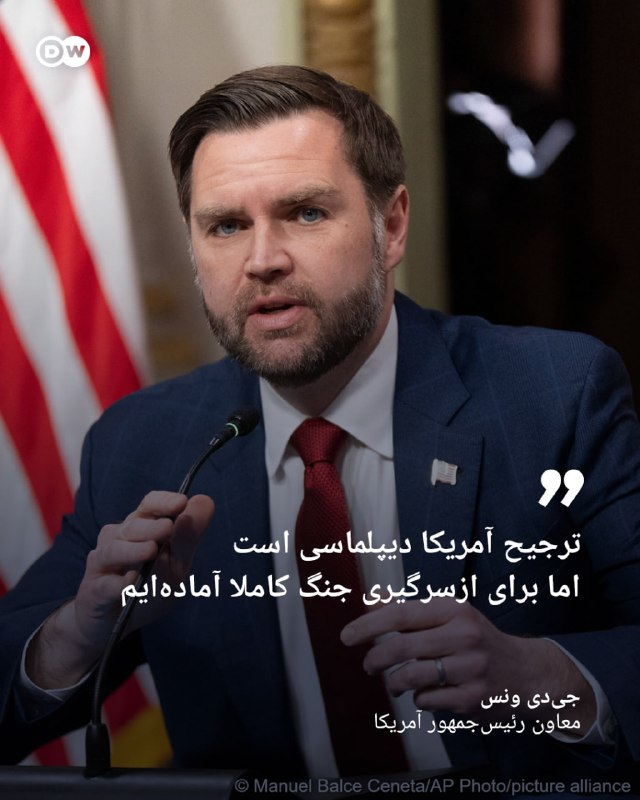

🔶 ونس: ترجیح آمریکا دیپلماسی است اما برای ازسرگیری جنگ کاملا آماده‌ایم

جی‌دی ونس، معاون رئیس‌جمهور آمریکا با اعلام این که دولت دونالد ترامپ همچنان راهکار دیپلماتیک را برای حل مناقشه با ایران ترجیح می‌دهد افزود، اما کشور ما کاملا آماده است تا برای اطمینان از عدم دستیابی تهران به سلاح هسته‌ای، جنگ را ازسر بگیرد.

ونس سه‌شنبه ۱۹ مه در جریان یک نشست خبری در کاخ سفید گفت که ایالات متحده متعهد است از دسترسی ایران به تسلیحات هسته‌ای جلوگیری کند، زیرا در صورت وقوع چنین اتفاقی، یک رقابت تسلیحاتی منطقه‌ای شکل خواهد گرفت که امنیت جهان را کاهش می‌دهد.

او با بیان این که ایالات متحده در شش هفته اول جنگ، توانایی نظامی متعارف ایران را تضعیف کرده افزود: «این کار با موفقیت انجام شده است. همیشه می‌توان کارهای بیش‌تری انجام داد، اما در حال حاضر رئیس‌جمهور به ما دستور داده که با ایرانی‌ها به صورت تهاجمی مذاکره کنیم.»

ونس با اشاره به "پیشرفت‌های زیادی" که در مذاکره با مقام‌های ایرانی به دست آمده خاطرنشان ساخت: «اما یک گزینه دیگر [گزینه بی] نیز وجود دارد؛ و آن گزینه این است که می‌توانیم کارزار نظامی را برای دستیابی به اهداف آمریکا ازسر بگیریم... اما این چیزی نیست که رئیس‌جمهور بخواهد و فکر نمی‌کنم ایرانی‌ها هم چنین چیزی بخواهند.»

ونس همچنین تأکید کرد: «ما توافقی را نخواهیم پذیرفت که به ایرانی‌ها اجازه داشتن سلاح هسته‌ای را بدهد. بنابراین، همان‌طور که رئیس‌جمهور همین الان به من گفت، ما در وضعیت آماده‌باش کامل به‌سر می‌بریم.»

@dw_farsi

## DW_Farsi — post 124906

  

🔶 آمریکا از گفت‌وگو با دبیر کل سازمان ملل درباره تنگه هرمز خبر داد

وزارت خارجه آمریکا از گفت‌وگوی مارکو روبیو، وزیر خارجه این کشور با آنتونیو گوترش، دبیرکل سازمان ملل متحد در مورد محدودیت‌هایی که ایران برای کشتی‌رانی در تنگه هرمز ایجاد کرده خبر داد.

به گزارش خبرگزاری رویترز، در این گفت‌وگو درباره تلاش‌های آمریکا جهت جلوگیری از مین‌گذاری‌ و گرفتن عوارض از سوی ایران در این تنگه حیاتی، از جمله صدور قطعنامه شورای امنیت سازمان ملل تبادل نظر صورت گرفته است.

تامی پیگات، سخنگوی این وزارت‌خانه در بیانیه‌ای اعلام کرد که روبیو بر "حمایت قاطع طیف گسترده‌ای از اعضای سازمان ملل از این تلاش‌ها" تأکید کرده است.

بستن تنگه هرمز توسط ایران که در خلال جنگ اسرائيل و آمریکا علیه جمهوری اسلامی صورت گرفت از مباحث اساسی در گفت‌وگوهای صلح این کشور به شمار می‌‌آید.

آمریکا نیز در مقابل، بنادر ایران را تحت محاصره گرفته و تا کنون هیچ کدام از دو طرف از مواضع خود در این جنگ عقب ننشسته‌اند.

@dw_farsi

## DW_Farsi — post 124905

  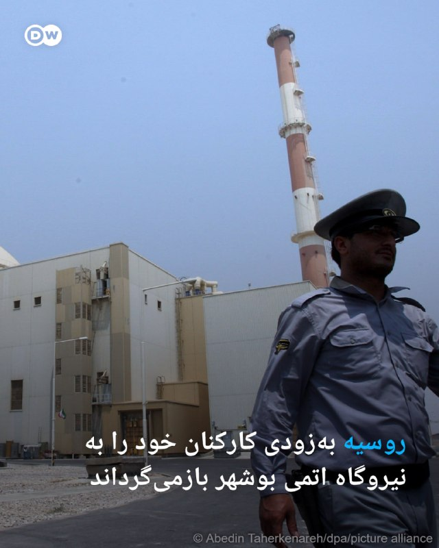

🔶 روسیه به‌زودی کارکنان خود را به نیروگاه اتمی بوشهر بازمی‌گرداند

الکسی لیخاچف، مدیرعامل شرکت دولتی انرژی اتمی روسیه (روس‌اتم)، در گفت‌وگو با خبرگزاری ریانووستی اعلام کرد، این شرکت انتظار دارد که طرح بازگرداندن کامل نیروهای خود به نیروگاه اتمی بوشهر ایران را ظرف هفته‌های آینده تکمیل کند.

لیخاچف گفت: «اطمینان دارم که در هفته‌های آتی قادر خواهیم بود طرح بازیابی سطوح کارکنان را اجرا کرده و سرعت کارهای ساخت‌وساز را به شاخص‌های برنامه‌ریزی‌شده بازگردانیم.»

به گفته او، عملیات بتن‌ریزی و آرماتوربندی در سازه‌های واحد دوم نیروگاه بوشهر که در حال ساخت است، از سر گرفته شده است.

مدیرعامل روس‌اتم همچنین تصریح کرد، تولید تجهیزات برای واحد جدید طبق برنامه ادامه دارد؛ با این حال، او افزود که هنوز برای بازگرداندن تمامی کارشناسان روسی به محل پروژه زود است.

خروج گسترده پرسنل روسی از نیروگاه بوشهر از اواخر ماه مارس سال جاری پس از آن انجام شد که در خلال جنگ اسرائيل و آمریکا علیه ایران حوالی این نیروگاه نیز آماج قرار گرفت.

در اواسط ماه آوریل شرکت روس‌اتم اعلام کرد که پرسنل خود را از ایران خارج کرده و تنها حدود ۲۰ متخصص را برای نظارت بر عملکردهای حیاتی نیروگاه بوشهر در آن‌جا نگه داشته است.

@dw_farsi

## DW_Farsi — post 124901

🔶 آیا در ایران شکاف بر سر مذاکره با آمریکا عمیق‌تر شده است؟

🔺 گزارشی از مراد رحمتی

مسعود پزشکیان، رئیس‌جمهوری ایران، در هفته‌های اخیر تلاش کرده مواضع خود را بیش از گذشته از طریق شبکه اجتماعی ایکس مطرح کند؛ اقدامی که به‌نظر می‌رسد بی‌ارتباط با سانسور یا حذف بخشی از سخنانش در رسانه‌های رسمی و نزدیک به نهادهای امنیتی و نظامی نیست.

برخی از اظهارات او در روزهای گذشته یا با تعدیل منتشر شد یا قسمت‌هایی از صحبت‌های او از خروجی رسانه‌های حکومتی حذف شد.

پزشکیان در تازه‌ترین مواضع خود بار دیگر بر ضرورت مذاکره تاکید کرده و گفته است "گفت‌وگو به معنای تسلیم نیست". او همچنین با طرح این پرسش که "اگر گفت‌وگو نکنیم، چه کنیم؟" تلاش کرده از مسیر دیپلماسی به‌عنوان راهی برای خروج از بحران دفاع کند.

رئیس‌جمهور ایران از کسری روزانه ۵۰ میلیون لیتری بنزین، توقف صادرات نفت و فشار شدید گرانی بر مردم هم سخن گفت و در عین حال روایت رسمی درباره بی‌اثر بودن حملات نظامی را نیز زیر سئوال برد.

با این حال، این نخستین بار نیست که پزشکیان مواضعی متفاوت با جریان‌های تندرو در حاکمیت اتخاذ می‌کند. در روزهای ابتدایی جنگ او پس از حملات جمهوری اسلامی به کشورهای حوزه خلیج فارس و جمهوری آذربایجان، تلاش کرد تنش‌ها را کنترل کند.

@dw_farsi

## DW_Farsi — post 124900

🔶 جنگ ایران؛ فراگیر شدن سلاح‌های لیزری ضدپهپاد در خلیج فارس

🔺یادداشتی از کاترین شائر

هفته گذشته، علاقه‌مندان و رصدکنندگان آنلاین تسلیحات، آنچه را که به نظر می‌رسید یک سامانه لیزری ساخت چین باشد، در فرودگاه دبی در امارات متحده عربی شناسایی کردند. این سامانه‌های لیزری بر روی خودروهایی نصب می‌شوند و قرار است توانایی سرنگونی پهپادها را داشته باشند.

هم‌اکنون نیز یک سامانه لیزری ساخت اسرائیل به نام "پرتو آهنین" در امارات وجود دارد؛ سامانه‌ای که ظاهراً اسرائیل آن را به اماراتی‌ها قرض داده است. گزارش‌های دیگری نیز حاکی از آن است که امارات در تلاش برای خرید یک سلاح لیزری ساخت آمریکاست. افزون بر این، امارات توافق‌هایی را با شرکت‌های اروپایی و آمریکایی برای توسعه مشترک سلاح‌های لیزری خود امضا کرده است.

در اواخر سال ۲۰۲۵ یک شرکت حمل‌ونقل، تصاویری از تجهیزات نظامی در حال انتقال منتشر کرد و ناخواسته فاش ساخت که عمان نیز یکی دیگر از خریداران سلاح‌های لیزری ساخت چین است.

همچنین قطر، پس از حمله اسرائیل به پایتختش در سپتامبر سال گذشته، ظاهراً در حال بررسی خرید عناصری از سامانه دفاع هوایی ترکیه موسوم به "گنبد فولادی" است که سلاح‌های لیزری نیز بخشی از آن را تشکیل می‌دهند.

@dw_farsi

## DW_Farsi — post 124899

  

🔶 وزیر دارایی اسرائيل: دیوان لاهه برای بازداشت من درخواست داده است

بتصلئل اسموتریچ، وزیر دارایی اسرائيل می‌گوید، مطلع شده که دیوان کیفری بین‌المللی مستقر در لاهه هلند برای صدور حکم بازداشت او درخواست ارائه کرده است.

این سیاستمدار راست‌گرای افراطی اسرائيل روز سه‌شنبه ۱۹ مه در یک کنفرانس مطبوعاتی اعلام کرد که شامگاه دوشنبه از این موضوع اطلاع یافته است. او روشن نساخت، از چه کسی این خبر را شنیده و دادگاه چه دلایلی برای این اقدام مطرح کرده است.

روند رسیدگی به چنین درخواست‌هایی محرمانه است. دادستانی می‌تواند درخواست خود را به قضات ارائه دهد و آن‌ها نیز در صورت وجود شواهد کافی مبنی بر وقوع جرایمی که رسیدگی به آن‌ها در صلاحیت دادگاه است، باید با این درخواست موافقت کنند.

اسموتریچ صدور حکم بازداشت برای مقامات دولتی اسرائیل را "اعلام جنگ" از سوی تشکیلات خودگردان فلسطینی توصیف کرده است.

خبرگزاری‌ها همچنین اعلام کرده‌اند که وزیر دارایی اسرائيل روز سه‌شنبه دستور تخلیه و تخریب روستای "خان الاحمر" در کرانه باختری رود اردن را صادر و اعلام کرده که این اقدام، پاسخی است به اطلاعاتی که در مورد درخواست حکم بازداشت‌اش از سوی دیوان لاهه دریافت کرده است.

دیوان لاهه تا کنون به صورت رسمی این خبر را تأیید نکرده است.

@dw_farsi

## Persian_Trend_Official — post 14490

  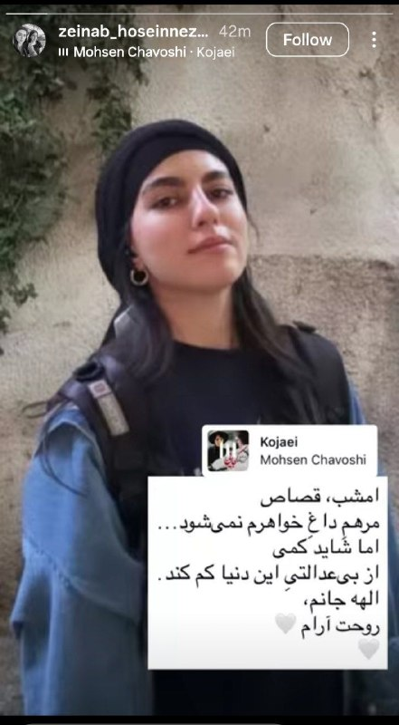

⭕️ قاتل الهه حسین زاده با اذان صبح فردا اعدام می‌شود.

استوری خواهر الهه: امشب، قصاص مرهم داغ خواهرم نمی شود... اما شاید کمی از بی عدالتی این دنیا کم کند. الهه جانم...

📝 Nick

📌 @persian_trend_official
پرشین ترند | متفاوت‌ترین کانال نظامی

## Persian_Trend_Official — post 14489

  <a href="telegram/content/Persian_Trend_Official_14489_1779220630.webm" target="_blank">🎬 Download video</a>

💢رئیس کمیسیون امنیت ملی مجلس:

💢تردید ترامپ برای اقدام ماجراجویانه جدید فقط به دلیل ترس از پاسخ قاطع نیروهای مسلح و اتحاد مردم ایران است

🫆:Tony

📌 @persian_trend_official
پرشین ترند | متفاوت‌ترین کانال نظامی

## Persian_Trend_Official — post 14488

💢ادعای کانال ۱۲ اسرائیل:

💢 ارزیابی‌های اسرائیل نشان
می‌دهد که ترامپ تصمیم حمله به ایران را گرفته است و اجرای آن فقط مربوط به مسئله زمان است

🫆:Tony

📌 @persian_trend_official
پرشین ترند | متفاوت‌ترین کانال نظامی

## Persian_Trend_Official — post 14487

تا دقایقی دیگه لایو امشب آغاز میشه

## Persian_Trend_Official — post 14486

تا دقایقی دیگه لایو امشب آغاز میشه

## RadioFarda — post 157366

  <a href="https://t.me/radiofarda/157366" target="_blank">📎 Download file</a>

📻بشنوید: خبرهای ساعت ۲۱ با رادیوفردا، ۲۹ اردیبهشت ۱۴۰۵‌

@RadioFarda

## RadioFarda — post 157365

🔸فرماندۀ ارشد ناتو در اروپا می‌گوید دربارۀ نقشی که نیروهای این پیمان می‌توانند در بهبود وضعیت تنگۀ هرمز ایفا کنند، «فکر کرده است». 🔸ژنرال الِکسوس گرینکِویچ در عین حال تأکید کرد که هیچ تصمیمی گرفته نشده و هیچ برنامه‌ریزی رسمی‌ای آغاز نشده است. 🔸این نظامی…

## RadioFarda — post 157364

  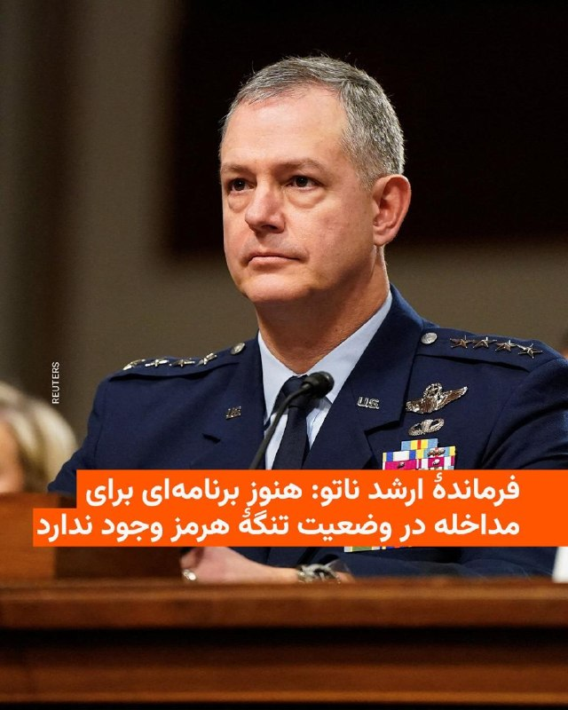

🔸فرماندۀ ارشد ناتو در اروپا می‌گوید دربارۀ نقشی که نیروهای این پیمان می‌توانند در بهبود وضعیت تنگۀ هرمز ایفا کنند، «فکر کرده است».

🔸ژنرال الِکسوس گرینکِویچ در عین حال تأکید کرد که هیچ تصمیمی گرفته نشده و هیچ برنامه‌ریزی رسمی‌ای آغاز نشده است.

🔸این نظامی ارشد آمریکایی در جمع خبرنگاران گفت: «آیا در این مورد فکر می‌کنم؟ قطعاً! اما تا زمانی که تصمیمی سیاسی اتخاذ نشود، هیچ برنامه و نقشه‌ای در کار نخواهد بود».

🔸دونالد ترامپ رئیس‌جمهور ایالات متحده، بارها به‌تندی از «بی‌عملی» متحدان اروپایی واشینگتن در پیمان آتلانتیک شمالی، ناتو، در قبال جنگ ایران و بسته‌شدن تنگۀ هرمز انتقاد کرده است.

🔸کشورهای اروپایی به ابتکار بریتانیا و فرانسه به‌دنبال یافتن راهی برای بازگشایی تنگۀ هرمز، البته پس از پایان جنگ آمریکا و اسرائیل با ایران بوده‌اند.

@RadioFarda

## RadioFarda — post 157363

🔸جی‌دی ونس، معاون رئیس‌جمهور آمریکا، روز سه‌شنبه گفت ایالات متحده و ایران در مذاکرات خود «پیشرفت زیادی» داشته‌اند و هیچ‌یک از دو طرف خواهان ازسرگیری حملات نظامی نیستند. 🔸او در یک نشست خبری در کاخ سفید به خبرنگاران گفت: «ما فکر می‌کنیم پیشرفت زیادی حاصل کرده‌ایم.…

## RadioFarda — post 157362

  

🔸جی‌دی ونس، معاون رئیس‌جمهور آمریکا، روز سه‌شنبه گفت ایالات متحده و ایران در مذاکرات خود «پیشرفت زیادی» داشته‌اند و هیچ‌یک از دو طرف خواهان ازسرگیری حملات نظامی نیستند.

🔸او در یک نشست خبری در کاخ سفید به خبرنگاران گفت: «ما فکر می‌کنیم پیشرفت زیادی حاصل کرده‌ایم. ما فکر می‌کنیم ایرانی‌ها می‌خواهند به توافق برسند.»

🔸دونالد ترامپ ساعتی پیش به خبرنگاران گفت به مقام‌های جمهوری اسلامی چند روز دیگر برای رسیدن به توافق مهلت می‌دهد و ممکن است آمریکا مجبور شود یک «ضربه بزرگ دیگر» به ایران بزند. او در عین حال افزود که تهران برای رسیدن به توافق «التماس» می‌کند.

🔸آقای ونس افزود که به‌تازگی با آقای ترامپ صحبت کرده و رئیس‌جمهور آمریکا تأکید کرده است که مسئله اصلی برای آمریکا این است که ایران هرگز نباید به سلاح هسته‌ای دست پیدا کند.

@RadioFarda

## IranianMinds — post 20410

🔴کارشناس صدا‌و‌سیما:

وقتی ترامپ میگه میخواهیم حمله کنیم، حمله نمی‌کنه.
ولی وقتی میگه داریم مذاکره می‌کنیم ، می‌خواد حمله کنه.

@IranianMinds

## IranianMinds — post 20409

🔴 رسانه I24 NEWS: تو اسرائیل معتقدن که آمریکا درنهایت به ایران حمله خواهد کرد.

@IranianMinds

## IranianMinds — post 20408

🔴 سازمان پخش اسرائیل

نهاد نظامی اسرائیل و کاخ سفید امروز درباره احتمال حمله به ایران گفتگو کردند.

@IranianMinds

## IranianMinds — post 20407

  <a href="telegram/content/IranianMinds_20407_1779220631.webm" target="_blank">🎬 Download video</a>

💥 با هر ثبت نام 
🅰️
🅰️
🅰️  هزار تومن جایزه بگیرید

✔️ میتونید شرط‌بندی کنید و بونوس را به موجودی واقعی تبدیل کنید

⚽️  پوشش کامل مسابقات ورزشی 

💯  پیش‌بینی با بهترین ضرایب 

⭐️ تجربه سریع و حرفه‌ای

💰پرداخت مستقیم و سریع بدون واسطه، بدون دردسر، واریز و برداشت در سریع‌ترین زمان ممکن

☑️ کانال تلگرام: 

➡️ @winro_io  

🎁 هدیه خود را با ثبت نام در سایت دریافت کنید: 

➡️ Winro.io
A29
سایت اصلی در روزهای آینده بازگشایی خواهد شد A
💎

## IranianMinds — post 20406

🔴جی‌دی‌ونس:

تحویل اورانیوم ایران به روسیه هیچوقت جزو برنامه‌های ما نبوده و من اصلا نمی‌دونم این گزارشات از کجا میان.

@IranianMinds

## IranianMinds — post 20405

🔴جی‌دی‌ونس:

در مذاکرات پیشرفت چشمگیری داشتیم، ولی هر وقت که لازم باشد می‌توانیم جنگ را شروع کنیم.

@IranianMinds

## BBCPersian — post 281541

🔻ایران از تشکیل ستادهای بازسازی صنایع فولادی و پتروشیمی‌اش خبر داد

وزیر صنعت، معدن، تجارت ایران از تشکیل دو ستاد تخصصی برای بازسازی صنایع فولاد و پتروشیمی که در جریان جنگ اخیر آسیب دیدند، خبر داده است.

محمد اتابک، وزیر صنعت ایران، گفته است که اصفهان از نظر میزان خسارات، دومین استان آسیب‌دیده کشور در جریان جنگ اخیر است و در این استان هم بخش عمده خسارات ها به گفته او مربوط به فولاد مبارکه است.

آقای اتابک گفته است که «اکنون کشور وارد مرحله بازسازی شده» و «بعضی زیرساخت‌ها و بخش‌های مهم صنعتی نیازمند بازسازی فوری هستند.»

با تشدید درگیری‌ها میان آمریکا و اسرائیل با جمهوری اسلامی ایران که نهم اسفند شروع شد و دامنه حملات به زیرساخت‌های کلیدی صنعتی کشیده شده است. مجتمع‌های فولادی، به‌ویژه فولاد مبارکه اصفهان و فولاد خوزستان، از جمله اینها بود.

جنگ اکنون در مرحله آتش‌بس قرار دارد و از سوی همه طرف‌ها شکننده توصیف می‌شود.
https://bbc.in/3PRbGrR
@BBCPersian

## BBCPersian — post 281540

  <a href="telegram/content/BBCPersian_281540_1779220632.mp4" target="_blank">🎬 Download video</a>

🔻آخرین خبرهای مهم روز سه‌شنبه ۲۹ اردیبهشت ۱۴۰۵

@BBCPersian

## BBCPersian — post 281539

🔻ونس: مذاکرات با ایران پیشرفت زیادی داشته است

جی‌دی ونس، معاون رئیس‌جمهور آمریکا، روز سه‌شنبه گفت ایالات متحده و ایران در مذاکرات خود «پیشرفت زیادی» داشته‌اند و هیچیک از دو طرف خواهان ازسرگیری عملیات نظامی نیستند.

آقای ونس در نشست خبری در کاخ سفید به خبرنگاران گفت: «ما فکر می‌کنیم پیشرفت زیادی حاصل شده است» و ادامه داد که «گمان می‌کنیم ایرانی‌ها می‌خواهند به توافق برسند.»

او افزود که به‌تازگی با دونالد ترامپ صحبت کرده و رئیس جمهور آمریکا تأکید کرده است که مسئله اصلی برای آمریکا این است که ایران هرگز نباید به سلاح هسته‌ای دست پیدا کند.

آقای ونس گفت: «ما می‌خواهیم تعداد کشورهایی که سلاح هسته‌ای دارند محدود باقی بماند و به همین دلیل ایران نمی‌تواند سلاح هسته‌ای داشته باشد.»

معاون رئیس‌جمهور آمریکا همچنین گفت کشورش می‌خواهد ایران در روندی با ایالات متحده همکاری کند که اطمینان حاصل شود تهران در سال‌های آینده توانایی تولید سلاح هسته‌ای را بازسازی نخواهد کرد.

او افزود: «این همان چیزی است که ما در مذاکرات به دنبال‌اش هستیم.»

همزمان کاظم غریب‌آبادی، معاون وزیر امور خارجه ایران از آمریکا انتقاد کرده که همزمان با مذاکرات به تهدید نظامی جمهوری اسلامی ایران ادامه می‌دهد.
https://bbc.in/4ftF0iq
@BBCPersian

## BBCPersian — post 281530

🔻توماس مسی، نماینده جمهوری‌خواه کنگره از کنتاکی، در رقابتی که عملا به تقابل مستقیم او با دونالد ترامپ، رئیس‌جمهور آمریکا، تبدیل شده، برای حفظ کرسی خود در انتخابات مقدماتی جمهوری‌خواهان تلاش می‌کند.

دونالد ترامپ از اد گالرین، کهنه‌سرباز بازنشسته نیروهای ویژه دریایی، حمایت کرده و مسی را به دلیل مخالفت با برخی سیاست‌هایش، از جمله طرح‌های مالی، تعرفه‌ها، جنگ ایران و پرونده‌های جفری اپستین، هدف حملات تند خود قرار داده است.

حامیان توماس مسی او را سیاستمداری ثابت‌قدم می‌دانند که حاضر است برای دفاع از باورهایش هزینه بدهد، اما مخالفانش می‌گویند او از مخالفت با دونالد ترامپ برای جلب توجه رسانه‌ای و ساختن چهره‌ای مستقل استفاده می‌کند.

نتیجه این انتخابات می‌تواند نشانه‌ای مهم درباره میزان نفوذ دونالد ترامپ در حزب جمهوری‌خواه باشد. در صورت شکست توماس مسی، منتقدان آقای ترامپ بار دیگر تضعیف می‌شوند اما پیروزی او می‌تواند دیگر جمهوری‌خواهان منتقد را به فاصله گرفتن از رئیس‌جمهور تشویق کند.
مطلب کامل:
https://bbc.in/4uY13SP
📷Getty Images
@BBCPersian

## BBCPersian — post 281529

🔻آمریکا یک صرافی ایرانی و شبکه مرتبط با آن و ۱۹ نفتکش را تحریم کرد

آمریکا اعلام کرد که یک صرافی ایرانی و شرکت‌های پوششی وابسته به آن را تحریم کرده است.

در بیانیه وزارت دارایی آمریکا آمده است که «این شبکه صدها میلیون دلار تراکنش را به نمایندگی از بانک‌های تحریم‌شده ایرانی مدیریت می‌کنند و به حکومت ایران و نیروهای مسلح آن امکان می‌دهند تحریم‌ها را دور بزنند.»

دفتر کنترل دارایی‌های خارجی وزارت دارایی آمریکا همچنین امروز ۱۹ نفتکش مرتبط با انتقال نفت و محصولات پتروشیمی ایران به مشتریان خارجی را هم تحریم کرد.

وزارت دارایی آمریکا اعلام کرد که این اقدامات «منابع مالی در دسترس حکومت ایران برای تولید سلاح، حمایت از نیروهای نیابتی و انتقال منابع مالی به خارج از ایران را محدودتر می‌کند.»

اسکات بسنت، وزیر دارایی آمریکا، گفت: «نظام بانکداری سایه ایران، انتقال غیرقانونی منابع مالی برای اهداف تروریستی را تسهیل می‌کند.»

او افزود: «مؤسسات مالی باید درباره به شیوه‌هایی که حکومت ایران از طریق آن‌ نظام مالی بین‌المللی را برای ایجاد بی‌ثباتی دستکاری می‌کند، هوشیاری به خرج دهند.»

https://bbc.in/4ftF0iq
@BBCPersian

## BBCPersian — post 281524

🔻مقداری از خاک مزار سه شخصیت تأثیرگذار تاریخ تاجیکستان در دهه‌های ۲۰و ۳۰ میلادی که در پایه‌گذاری این جمهوری و بقای آن نقش کلیدی داشتند از مسکو به دوشنبه پایتخت تاجیکستان منتقل شد و پس از مراسم یادبودی در آرامستان لوچاب خاکسپاری شد.

سراج‌الدین مهرالدین دیروز در جریان یک مراسم با حضور مقام‌های روس کپسول حاوی خاک این سه نفر را تحویل گرفت و به تاجیکستان منتقل کرد. رئیس‌جمهور تاجیکستان در فرودگاه شهر دوشنبه به این سه شخصیت ادای احترام کرد.

این سه نفر شیرین‌شاه شاه تیمور، نصرت‌الله مخسوم و نثار محمد هستند که در تاجیکستان «قهرمانان و جان‌نثاران و فرزندان نامدار ملت» ‌خوانده می‌شوند و در دوران حکومت استالین در سال ۱۹۳۷ به اتهام «دشمنی با خلق» محاکمه و اعدام شدند و در آرامگاه دونسکوی مسکو دفن شدند. پس از مرگ استالین، پرونده‌های بسیاری از اعدام‌شدگان از جمله این سه چهره سیاسی بازبینی و آنان تبرئه شدند.

به گفته وزارت خارجه تاجیکستان، این انتقال با دستور امامعلی رحمان انجام شد و آن را «رویدادی مهم در مسیر برقراری عدالت تاریخی و حفظ و ارج‌گذاری به خاطرهٔ ملی» خواند.
📷Tajik President Press Service
@BBCPersian

## BBCPersian — post 281518

🔻ترامپ: ایران توانایی اندکی برای انتقام دارد

دونالد ترامپ، رئیس جمهورآمریکا، در پاسخ به این سوال که تصمیمش برای حمله به ایران «کم‌طرفدار» است گفت:

«من تمام تمرکزم را روی این کار گذاشته‌ام اما معلوم نیست آنها کی این را بفهمند. فکر می‌کنم که [این اقدام من] خیلی پرطرفدار و مورد پسند بشود. راستش را بخواهید خیلی پرطرفدار و پسند می‌شود. اما چه پسند باشد یا نباشد، باید آن را انجام بدهم، چون اجازه نمی‌دهم دنیا جلوی چشمم منفجر بشود. این اتفاق نخواهد افتاد.»

رئیس‌جمهور آمریکا همچنین گفت درباره پاسخ متقابل نگرانی ندارد چون پس از حملات اخیر توانایی «اندکی» برای ایران باقی مانده است:

«ایران ۴۷ سال، واقعیتش خیلی بیشتر از این، از این تنگه [هرمز] به‌عنوان سلاح استفاده کرده است. این تنگه متعلق به آنها نیست، آبراهه بین‌المللی است. آنها در چنین جایگاهی نیستند و حق ندارند که بخواهند آن را کنترل کنند.»

او افزود: «ببینید، آنها درس گرفته‌اند. اگر ما امروز [از منطقه] برویم، ۲۵ سال طول می‌کشد تا دوباره همه چیز را بسازند. اما ما اینجا را ترک نمی‌کنیم. ما این کار را درست انجام می‌دهیم، طوری که اگر پنج سال یا ده سال دیگر، یک رئیس‌جمهور بد داشته باشیم که نخواهد کار درست را انجام دهد [دیگر مشکلی نباشد].

آقای ترامپ گفت: «این کار را باید اوباما انجام می‌داد؛ این کار را باید بایدن انجام می‌داد؛ این کار را باید روسای جمهور دیگر خیلی قبل‌تر انجام می‌دادند. آنها همه اما با این موضوع موافق هستند. آنها همه موافق هستند.»

https://bbc.in/4ftF0iq
@BBCPersian

## BBCPersian — post 281517

🔻سفیر ایران در چین: روابط ایران و چین با الگوهای سنتی اتحادهای نظامی متفاوت است

سفیر ایران در چین گفته است که این کشور «نه در قبال ایران و نه در قبال بسیاری از شرکای مهم خود، سیاست ورود مستقیم به منازعات را دنبال نمی‌کند.»

عبدالرضا رحمانی‌فضلی، به خبرگزاری ایسنا گفته است « باید واقع‌بین بود. روابط ایران و چین، هرچند راهبردی و رو به گسترش است، اما ماهیت آن با الگوهای سنتی اتحادهای نظامی متفاوت است.»

سفیر ایران در چین گفته است در صورت طولانی شدن جنگ در منطقه خلیج فارس «چین بیش از گذشته به سمت مدیریت ریسک‌های ژئوپلیتیکی حرکت خواهد کرد. این موضوع فقط درباره ایران یا منطقه نیست؛ بلکه بخشی از روند کلان در سیاست خارجی و اقتصادی چین در سال‌های اخیر است.»

آقای رحمانی فضلی گفته است: «پکن اکنون به این جمع‌بندی رسیده که جهان وارد دوره‌ای از بی‌ثباتی ساختاری شده است. در چنین فضایی، چین تلاش خواهد کرد، منابع انرژی خود را در مناطق مختلف متنوع‌ کند، وابستگی به مسیرهای پرریسک را کاهش دهد.»

https://bbc.in/4ftF0iq
@BBCPersian

## Dirty_Kids — post 389772

  

امروز سالگرد سقوط بالگرد آنگوزمان و درازعلی هست گویا. روز خرس مبارک. @Dirty_Kids 👻

## Dirty_Kids — post 389771

  

امروز سالگرد سقوط بالگرد آنگوزمان و درازعلی هست گویا. روز خرس مبارک. @Dirty_Kids 👻

## Dirty_Kids — post 389770

  <a href="telegram/content/Dirty_Kids_389770_1779220634.mp4" target="_blank">🎬 Download video</a>

امروز سالگرد سقوط بالگرد آنگوزمان و درازعلی هست گویا.
روز خرس مبارک.

@Dirty_Kids 👻

## Dirty_Kids — post 389769

حالا ما اعصابمون کیریه از دست ترامپ و فحش میدیم شما عرزشیای پشگل مغز چرا ذوق می‌کنین؟ حواستون هست که همه این دعوا سر کون شماست یا نه؟؟ :)))

@Dirty_Kids 👻

## Dirty_Kids — post 389768

  <a href="telegram/content/Dirty_Kids_389768_1779220635.mp4" target="_blank">🎬 Download video</a>

گیر چه کصخلایی افتادیم
نصف طرفداراشون افغانیا هستن

@Dirty_Kids 👻

## Dirty_Kids — post 389767

  <a href="telegram/content/Dirty_Kids_389767_1779220636.mp4" target="_blank">🎬 Download video</a>

ویدیویی که تو اینستاگرام بیش از چندمیلیارد بازدید خورده :

@Dirty_Kids 👻

## Hranews — post 113049

  

بر اساس گزارش «میان موشک و سرکوب»؛ روند زمانی حملات نظامی اخیر نشان می‌دهد که در ۲۴ ساعت نخست مخاصمات، نیروهای ایالات متحده بیش از ۱٬۰۰۰ هدف و اسرائیل نیز ۷۵۰ هدف را در ایران مورد حمله قرار داده‌اند.

بر اساس این گزارش، در نخستین روز حملات (۹ اسفند ۱۴۰۴)، ۷۰۱ رویداد ثبت شده و بالاترین میزان در ۱۵ اسفند با ثبت ۷۳۴ رویداد در یک روز رخ داده است. در مجموع، تا پایان ۳۸ روز درگیری، حدود ۱۳٬۰۰۰ هدف مورد حمله قرار گرفته است.

📎 گزارش را به زبان فارسی مطالعه کنید

📎 دانلود مستقیم فایل پی دی اف فارسی از تلگرام

📎 Complete report in English

📎Direct download of the English PDF

↘️
@hranews_bot تماس ✉️ - @Hranews کانال هرانا 🆑

## Hranews — post 113048

افزایش شمار اعدام‌شدگان در زندان عادل آباد شیراز به ۳ تن

❗️
❗️
❗️
❗️
❗️– با احتساب دو زندانی دیگر که سحرگاه روز یکشنبه ۲۷ اردیبهشت‌ماه در زندان عادل آباد شیراز اعدام شدند، شمار اعدام‌شدگان در این زندان به سه نفر افزایش یافت. این افراد پیشتر از بابت اتهام قتل در پرونده‌های جداگانه به مجازات مرگ محکوم شده بودند.

#اعدام

ادامه مطلب

↘️
@hranews_bot تماس ✉️ - @Hranews کانال هرانا 🆑

## Hranews — post 113047

مرگ و مصدومیت ۴ کارگر در سایه فقدان ایمنی کار

❗️
❗️
❗️
❗️
❗️– در سایه فقدان ایمنی محیط و شرایط نامناسب کار، چهار کارگر در شهرستان‌های ملایر و یزد دچار حادثه شدند. در این حوادث یک کارگر جان باخت و سه تن دیگر مصدوم شدند.

#کارگر

ادامه مطلب

↘️
@hranews_bot تماس ✉️ - @Hranews کانال هرانا 🆑

## Hranews — post 113046

به دلیل «کشف حجاب»؛ یک کافه در کاشان پلمب شد

❗️
❗️
❗️
❗️
❗️– معاون گردشگری اداره میراث فرهنگی، گردشگری و صنایع‌دستی کاشان اعلام کرد کافه «عامری‌ها» در این شهرستان به‌دلیل آنچه «کشف حجاب» عنوان شده، پلمب شده است.

#پلمب
#کاشان

ادامه مطلب

↘️
@hranews_bot تماس ✉️ - @Hranews کانال هرانا 🆑

## manototv — post 105659

  <a href="telegram/content/manototv_105659_1779220638.mp4" target="_blank">🎬 Download video</a>

تماسی تلخ از دل ایران:
«می‌گفت در پتروشیمی تعدیل شده…
و برای تأمین هزینه‌های زندگی حتی به رحم اجاره‌ای فکر می‌کنه

## manototv — post 105658

  <a href="telegram/content/manototv_105658_1779220640.mp4" target="_blank">🎬 Download video</a>

جی‌دی ونس، معاون رئیس‌جمهوری آمریکا، در پاسخ به سوالی درباره مذاکرات واشینگتن و جمهوری اسلامی گفت ایران کشوری «پیچیده» است و گاهی مشخص نیست مقام‌های جمهوری اسلامی دقیقاً چه هدفی را از مذاکرات دنبال می‌کنند.

ونس گفت با وجود آن‌که کاخ سفید مذاکرات را «با حسن نیت» پیش می‌برد، در طرف جمهوری اسلامی همزمان هم نشانه‌هایی از آمادگی برای مذاکره دیده می‌شود و هم «مواضع بسیار تندروانه».

او افزود: «ایران یک تمدن بزرگ و پرافتخار با مردم شگفت‌انگیز است» و به جامعه ایرانی-آمریکایی در ایالات متحده اشاره کرد که به گفته او «باهوش و سخت‌کوش» هستند.

معاون رئیس‌جمهوری آمریکا گفت بخشی از این ویژگی‌ها را در تیم مذاکره‌کننده جمهوری اسلامی نیز می‌بیند، اما در عین حال تاکید کرد مواضع متفاوت و متناقضی هم در میان مذاکره‌کنندگان ایرانی وجود دارد.

ونس همچنین جمهوری اسلامی را «کشوری چندپاره» توصیف کرد و گفت علاوه بر رهبر جمهوری اسلامی، مقام‌های مختلف دیگری نیز بر روند مذاکرات تاثیر دارند و همین موضوع باعث می‌شود موضع واقعی تهران همیشه روشن نباشد.

او افزود: «گاهی مشخص نیست این وضعیت ناشی از ضعف در ارتباطات است یا ناشی از سوءنیت، اما واقعاً سخت است بفهمیم ایرانی‌ها دقیقاً می‌خواهند از این مذاکرات به چه چیزی برسند.»

## manototv — post 105657

  <a href="telegram/content/manototv_105657_1779220642.mp4" target="_blank">🎬 Download video</a>

بریتیش ایرویز از تعویق دوباره پروازهای خود به خاورمیانه خبر داد و اعلام کرد ازسرگیری پروازها به دبی، دوحه و تل‌آویو تا اول اوت به تعویق افتاده است.

رویترز گزارش داد جنگ آمریکا و اسرائیل با جمهوری اسلامی باعث شده ده‌ها شرکت هواپیمایی از زمان آغاز درگیری‌ها در اواخر فوریه، پروازهای خود به منطقه را لغو کنند.

بریتیش ایرویز در بیانیه‌ای اعلام کرد: «به دلیل ادامه وضعیت در خاورمیانه، تغییرات بیشتری در برنامه پروازی خود ایجاد کرده‌ایم تا شفافیت بیشتری برای مشتریان فراهم شود.»

این شرکت پیش‌تر نیز اعلام کرده بود پس از ازسرگیری پروازها، تعداد پروازهای خود به خاورمیانه را کاهش خواهد داد و مقصد جده را به‌طور کامل از برنامه‌هایش حذف می‌کند.

بر اساس برنامه جدید، پروازهای بریتیش ایرویز به دبی، دوحه، ریاض و تل‌آویو به یک پرواز در روز کاهش پیدا خواهد کرد.

## manototv — post 105656

  <a href="telegram/content/manototv_105656_1779220642.mp4" target="_blank">🎬 Download video</a>

جی‌دی ونس، معاون ترامپ در نشست خبری کاخ سفید در خصوص جمهوری‌اسلامی گفت دو مسیر پیش روی آمریکا وجود دارد. مسیر اول، مذاکره است و تأکید کرد: «رئیس‌جمهور از ما خواسته به‌طور جدی با ایران مذاکره کنیم.»
ونس افزود: «در موضوع اصلی یعنی عدم دستیابی ایران به سلاح هسته‌ای، پیشرفت زیادی داشته‌ایم و فکر می‌کنیم ایران هم به دنبال توافق است.»
او گزینه دوم را از سرگیری عملیات نظامی عنوان کرد و گفت: «گزینه بی این است که عملیات نظامی دوباره آغاز شود تا اهداف آمریکا دنبال شود.»
وی در پایان تأکید کرد این گزینه مطلوب رئیس‌جمهور نیست و گفت: «فکر نمی‌کنم ایران هم چنین چیزی بخواهد. برای رقص تانگو دو نفر لازم است.»

## manototv — post 105655

  <a href="telegram/content/manototv_105655_1779220643.mp4" target="_blank">🎬 Download video</a>

جی‌دی ونس در کنفرانس خبری خود در ارتباط با گزارش‌هایی که می‌گفتند احتمال دارد روسیه اورانیوم غنی‌شده ایران را دریافت کند؛ پاسخ داده «این در حال حاضر برنامه ما نیست. هیچ‌وقت هم برنامه ما نبوده است.»
او افزود نمی‌داند این گزارش‌ها از کجا منتشر شده‌اند و تأکید کرد که چنین موضوعی از سوی جمهوری اسلامی نیز مطرح نشده است.
ونس همچنین گفت: «برداشت من این است که این چیزی نیست که ایرانی‌ها خیلی از آن استقبال کنند و می‌دانم رئیس‌جمهور هم چندان از آن استقبال نمی‌کند.»

## manototv — post 105654

  <a href="telegram/content/manototv_105654_1779220643.mp4" target="_blank">🎬 Download video</a>

آتلانتیک گزارش داده فیفا قصد دارد در جریان جام جهانی ۲۰۲۶ باردیگر ورود پرچم شیروخورشید را به داخل ورزشگاه‌ها ممنوع کند. در جام جهانی ۲۰۲۲ قطر نیز برخی هواداران ایرانی این پرچم را به ورزشگاه‌ها بردند اما با محدودیت مواجه شدند و در برخی موارد اجازه ورود آن‌ها داده نشد. فیفا طبق قوانین خود هرگونه نماد سیاسی، تبعیض‌آمیز یا تحریک‌آمیز را در ورزشگاه‌ها ممنوع می‌داند. با این حال این موضوع همیشه محل بحث بوده، چون بسیاری از ایرانیان مهاجر استفاده از این پرچم را نه صرفا سیاسی، بلکه بخشی از هویت ملی خود می‌دانند.
در مقابل، پرچم فلسطین طبق قوانین فیفا مجاز است، چون به‌عنوان پرچم رسمی یک عضو فیفا شناخته می‌شود و تنها در صورت ایجاد خطر امنیتی ممکن است محدود شود. این تفاوت رویکرد باعث بحث و انتقاد در برخی محافل شده است.
قرار است مسابقات ایران در جام جهانی ۲۰۲۶ در شهرهایی مانند لس‌آنجلس و سیاتل برگزار شود؛ مناطقی که جمعیت زیادی از ایرانیان مهاجر در آن زندگی می‌کنند.در مقابل، پرچم فلسطین طبق قوانین فیفا مجاز است، چون به‌عنوان پرچم رسمی یک عضو فیفا شناخته می‌شود و تنها در صورت ایجاد خطر امنیتی ممکن است محدود شود. این تفاوت رویکرد باعث بحث و انتقاد در برخی محافل شده است.
قرار است مسابقات ایران در جام جهانی ۲۰۲۶ در شهرهایی مانند لس‌آنجلس و سیاتل برگزار شود؛ مناطقی که جمعیت زیادی از ایرانیان مهاجر در آن زندگی می‌کنند.

## manototv — post 105653

  <a href="telegram/content/manototv_105653_1779220644.mp4" target="_blank">🎬 Download video</a>

‌
وزارت دادگستری آمریکا الکس ساب، تاجر کلمبیایی-ونزوئلایی و متحد نزدیک نیکلاس مادورو، رئیس‌جمهوری پیشین ونزوئلا، را به پول‌شویی و فساد مالی متهم کرد.

دادستان‌های آمریکا اعلام کردند ساب، که به «صندوق‌دار مادورو» معروف است، از طریق برنامه کمک غذایی دولت ونزوئلا صدها میلیون دلار را با استفاده از شرکت‌های صوری، اسناد جعلی و حساب‌های بانکی آمریکایی جابه‌جا کرده است.

بر اساس اسناد دادگاه، ساب و همکارانش از سال ۲۰۱۵ با قراردادهای جعلی واردات مواد غذایی، صدها میلیون دلار را اختلاس کرده‌اند و از سال ۲۰۱۹ نیز با فروش نفت ونزوئلا تحت پوشش معاملات صوری، میلیاردها دلار پول جابه‌جا کرده‌اند.

الکس ساب که آخر هفته از ونزوئلا به آمریکا منتقل شد، روز دوشنبه برای نخستین بار در دادگاه فدرال میامی حاضر شد.

رویترز گزارش داد دولت دونالد ترامپ در حال آماده‌سازی پرونده قضایی علیه نیکلاس مادورو است و الکس ساب ممکن است اطلاعات مهمی برای تقویت این پرونده در اختیار مقام‌های آمریکایی قرار دهد.

## manototv — post 105652

  <a href="telegram/content/manototv_105652_1779220645.mp4" target="_blank">🎬 Download video</a>

ولادیمیر پوتین، رئیس‌جمهوری روسیه، برای دیدار با شی جین‌پینگ وارد چین شد؛ سفری که کمتر از یک هفته پس از سفر دونالد ترامپ به پکن انجام می‌شود و توجه زیادی را به خود جلب کرده است.
کرملین اعلام کرده پوتین و شی در این سفر درباره همکاری‌های اقتصادی، مسائل منطقه‌ای و روابط بین‌المللی گفت‌وگو خواهند کرد. این سفر همزمان با بیست‌وپنجمین سالگرد پیمان دوستی چین و روسیه برگزار می‌شود.
چین که پس از جنگ اوکراین به مهم‌ترین شریک تجاری روسیه تبدیل شده، تلاش می‌کند هم روابط نزدیک خود با مسکو را حفظ کند و هم روابط باثباتی با آمریکا داشته باشد.
مقام‌های روسی گفته‌اند صادرات نفت روسیه به چین در سه‌ماهه نخست ۲۰۲۶ افزایش یافته و دو کشور در حوزه انرژی به توافق‌های مهمی نزدیک شده‌اند. پوتین نیز روابط مسکو و پکن را عاملی برای «ثبات و بازدارندگی» در جهان توصیف کرده است.

## alonews — post 121176

  <a href="telegram/content/alonews_121176_1779220645.webm" target="_blank">🎬 Download video</a>

👈با اعلام خواهر الهه حسین نژاد، بهمن فرزانه قاتل امشب اعدام خواهد شد

✅ @AloNews خبر جنگ

## alonews — post 121175

  <a href="telegram/content/alonews_121175_1779220645.webm" target="_blank">🎬 Download video</a>

👈تصویری وایرال شده و پربازدید از رشت

✅ @AloNews خبر جنگ

## alonews — post 121174

  <a href="telegram/content/alonews_121174_1779220645.webm" target="_blank">🎬 Download video</a>

👈برد کوپر، فرمانده سنتکام درباره مدرسه میناب : بررسی نظامی آمریکا درباره انفجار مدرسه‌ میناب پیچیده‌ست - چون این مدرسه داخل یک سایت فعال موشک‌های کروز جمهوری اسلامی قرار داشته - هر دو طرف باید اسناد مربوط به این مدرسه رو منتشر کنن و پرونده کشته‌شدن این تعداد…

## alonews — post 121173

  <a href="telegram/content/alonews_121173_1779220646.mp4" target="_blank">🎬 Download video</a>

👈برد کوپر، فرمانده سنتکام درباره مدرسه میناب : بررسی نظامی آمریکا درباره انفجار مدرسه‌ میناب پیچیده‌ست
- چون این مدرسه داخل یک سایت فعال موشک‌های کروز جمهوری اسلامی قرار داشته
- هر دو طرف باید اسناد مربوط به این مدرسه رو منتشر کنن و پرونده کشته‌شدن این تعداد دانش‌آموز نیاز به شفافیت کامل داره
- انتظار شفاف‌سازی از طرف جمهوری اسلامی رو نداریم

✅ @AloNews خبر جنگ

## alonews — post 121172

  <a href="telegram/content/alonews_121172_1779220647.webm" target="_blank">🎬 Download video</a>

👈کارشناس صداوسیما : وقتی ترامپ بگه می‌خواد حمله کنه؛ حمله نمیکنه

🔴ولی وقتی بگه داریم مذاکره میکنیم، یعنی می‌خواد حمله کنه

✅ @AloNews خبر جنگ

## alonews — post 121171

  <a href="telegram/content/alonews_121171_1779220647.webm" target="_blank">🎬 Download video</a>

👈حکم پژمان جمشیدی صادر شد

🔴شاکی پرونده پژمان جمشیدی در گفتگو با امتداد می‌گوید حکم این پرونده صادر و به او ابلاغ شده است. طبق گفته او، پژمان جمشیدی به ۹۹ ضربه شلاق تعزیری محکوم شده است.

شاکی پرونده در ادامه با بیان اینکه تمام مدارکی که به نفع او است در پرونده وجود دارد، می‌گوید او را هرگز نمی‌بخشد:

🔴یک سال است بدون وکیل تنهایی تمام جلسات دادگاه را شرکت کردم.

او می‌گوید:

🔴خودش و وکلایش بارها به ما پیشنهاد پول دادند و ما قبول نکردیم. حتی در جلسه آخر خودش به من گفت آخرین زورت را هم بزن، آخرش فقط همین، واقعا او را نمی‌بخشم.

🔴پرونده پژمان جمشیدی از مهرماه پارسال با بازداشت او خبری شد. او بعد از چند روز با وثیقه آزاد شد. در بهمن ۱۴۰۴ و اردیبهشت ۱۴۰۵ دو جلسه دادگاه در دادگاه کیفری شعبه یک برگزار و امروز حکم این پرونده صادر شد.

✅ @AloNews خبر جنگ

## alonews — post 121170

  

⚽️فیفا: ورود پرچم شیر و خورشید و هر پرچمی جز پرچم رسمی کشورها وارد ورزشگاه بشه باهاش برخورد میکنیم و ممنوعه.

@AloSport

## alonews — post 121169

  <a href="telegram/content/alonews_121169_1779220648.webm" target="_blank">🎬 Download video</a>

👈طبق گزارش wsj ، ایالات متحده یک نفتکش تحریم شده مرتبط با ایران را در اقیانوس هند در طول شب توقیف کرد.

🔴این کشتی احتمالا در ماه فوریه با بیش از یک میلیون بشکه نفت خام در جزیره خارگ ایران بارگیری شده است.‌‌

✅ @AloNews خبر جنگ

## alonews — post 121168

  <a href="telegram/content/alonews_121168_1779220648.mp4" target="_blank">🎬 Download video</a>

👈جی‌دی ونس : این جنگ ابدی نیست، ما کارها رو انجام می‌دیم و به خونه برمیگردیم
- این همون چیزیه که ترامپ وعده داده بود و همون چیزیه که او به اون عمل میکنه...

✅ @AloNews خبر جنگ

## alonews — post 121167

  <a href="telegram/content/alonews_121167_1779220650.webm" target="_blank">🎬 Download video</a>

👈اکسیوس: به گفته دو مقام آمریکایی، دونالد ترامپ، رئیس‌جمهور آمریکا، شامگاه دوشنبه جلسه‌ای با تیم شورای امنیت ملی خود درباره ایران برگزار کرد که شامل ارائه گزارشی درباره گزینه‌های نظامی بود. 
🔴این جلسه چندین ساعت پس از آن برگزار شد که ترامپ اعلام کرد حملاتی…

## alonews — post 121166

  <a href="telegram/content/alonews_121166_1779220650.webm" target="_blank">🎬 Download video</a>

👈اکسیوس:
به گفته دو مقام آمریکایی، دونالد ترامپ، رئیس‌جمهور آمریکا، شامگاه دوشنبه جلسه‌ای با تیم شورای امنیت ملی خود درباره ایران برگزار کرد که شامل ارائه گزارشی درباره گزینه‌های نظامی بود.

🔴این جلسه چندین ساعت پس از آن برگزار شد که ترامپ اعلام کرد حملاتی را که مدعی بود برای سه‌شنبه برنامه‌ریزی شده بود، به حالت تعلیق درآورده است.

🔴مقامات آمریکایی می‌گویند ترامپ پیش از اعلام توقف حمله، در واقع تصمیمی برای حمله به ایران نگرفته بود. روز سه‌شنبه، او گفت که «یک ساعت با دستور حمله فاصله داشته است».

🔴برخی از مقامات انتظار داشتند ترامپ در جلسه‌ای با تیم امنیت ملی خود که انتظار می‌رفت سه‌شنبه برگزار شود، درباره حملات تصمیم بگیرد، اما این جلسه در نهایت شامگاه دوشنبه برگزار شد.

🔴به گفته مقامات آمریکایی و منابع منطقه‌ای، تصمیم او برای خودداری از حمله، تا حدی به دلیل نگرانی‌هایی بود که چندین رهبر کشورهای عرب حاشیه خلیج فارس درباره تلافی‌جویی ایران علیه تأسیسات و زیرساخت‌های نفتی خود مطرح کردند.

🔴مقامات آمریکایی گفتند که رهبران خلیج فارس از ترامپ خواستند فرصت دیگری به دیپلماسی بدهد.

✅ @AloNews خبر جنگ

## alonews — post 121165

  <a href="telegram/content/alonews_121165_1779220650.mp4" target="_blank">🎬 Download video</a>

👈جی‌دی ونس : هر وقت حمله پهپادی یا موشکی به هر جایی بخوره، مخصوصاً به مناطق غیرنظامی
- اصلاً چیزی نیست که خوشمون بیاد ببینیم
- ولی خب تو آتش‌بس‌ها این چیزا بعضی وقتا پیش میاد و همیشه همه‌چی کامل و بی‌نقص نیست؛ تو غزه هم دیدیم.

✅ @AloNews خبر جنگ

## alonews — post 121163

  <a href="telegram/content/alonews_121163_1779220652.webm" target="_blank">🎬 Download video</a>

👈ونس: «چرا به اسلام‌آباد، پاکستان رفتم؟ چرا احتمالاً ۲۲ ساعت در هواپیما برای رفتن سپری کردم، ۲۴ ساعت برای برگشتن، و ۲۱ ساعت در آنجا با ایرانی‌ها مذاکره کردم؟ به این دلیل بود که ما می‌خواستیم نشانه‌ای از حسن‌نیت نشان دهیم. رئیس‌جمهور حاضر است توافق کند، تا زمانی که ایرانی‌ها حاضر باشند دوباره در آن مسئله اصلی یعنی هرگز نداشتن سلاح هسته‌ای، به سمت ما بیایند.

🔴بنابراین، ما در وضعیت بسیار خوبی هستیم، اما یک گزینه B هم وجود دارد، و آن گزینه B این است که بتوانیم کارزار نظامی را از سر بگیریم تا پرونده را ادامه دهیم.»

✅ @AloNews خبر جنگ

## alonews — post 121162

  <a href="telegram/content/alonews_121162_1779220652.webm" target="_blank">🎬 Download video</a>

👈فرمانده سنتکام:
بررسی بمباران مدرسه میناب پیچیده‌ست، چون این مدرسه در محل یک پایگاه فعال موشک‌های کروز در ایران قرار داشته.

✅ @AloNews خبر جنگ

<!-- MSG END -->

<!-- NAV START -->

<a href="https://github.com/hosseinbaghi/aio-downloader/blob/main/telegram/content/archive_1.md" style="display:inline-block; padding:6px 12px; margin:0 4px; background-color:#2ea44f; color:white; text-decoration:none; border-radius:4px; font-weight:bold;">صفحه بعد</a>

<!-- NAV END -->
