# خواننده تلگرام

<!-- TOP_NAV START -->

<a href="https://github.com/hosseinbaghi/aio-downloader/blob/main/telegram/content/archive_1.md" style="display:inline-block; padding:6px 12px; margin:0 4px; background-color:#2ea44f; color:white; text-decoration:none; border-radius:4px; font-weight:bold;">صفحه بعد</a>

<!-- TOP_NAV END -->

<!-- MSG START -->

---
📅 بروزرسانی: 1405/02/28 13:21
---

## VahidOOnLine — post 240771

  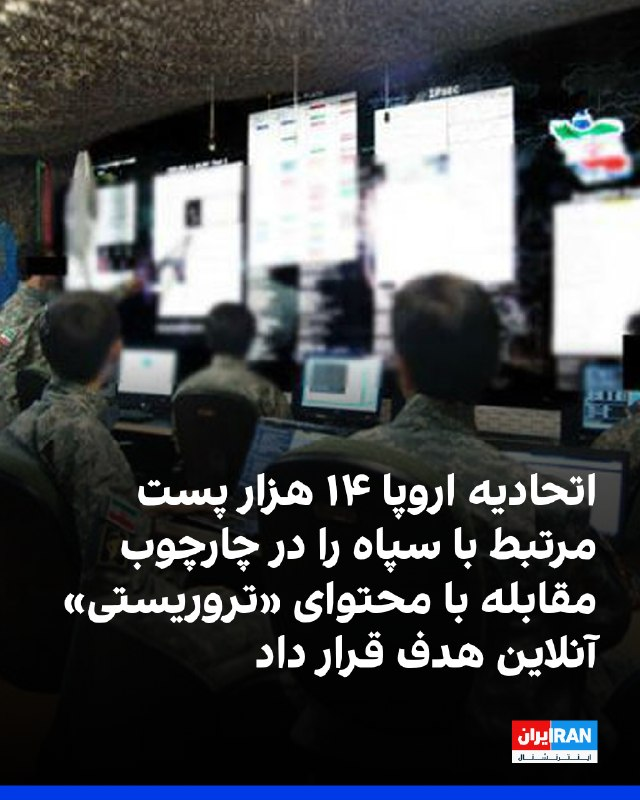

یوروپل، آژانس اتحادیه اروپا برای همکاری در اجرای قانون، اعلام کرد در اقدامی هماهنگ برای مقابله با محتوای «تروریستی» در فضای مجازی، در مجموع ۱۴ هزار و ۲۰۰ پست و پیوند مرتبط با سپاه پاسداران هدف قرار گرفته است.

به گفته یوروپل، این اقدام با هدایت واحد ارجاع اینترنتی اتحادیه اروپا انجام شد و بر شناسایی و اخلال در حضور آنلاین سپاه که برای انتشار تبلیغات، جذب حامیان و تامین مالی به کار می‌رفت، تمرکز داشت. این تصمیم به نهادهای اجرای قانون اجازه می‌دهد علیه فعالیت اعضا و نهادهای پشتیبان آن در اتحادیه اروپا اقدام کنند.

در این عملیات، ۱۹ کشور شامل اتریش، بلژیک، بوسنی و هرزگوین، بلغارستان، چک، دانمارک، استونی، فنلاند، فرانسه، آلمان، یونان، مجارستان، ایتالیا، هلند، پرتغال، اسپانیا، سوئد، اوکراین و آمریکا مشارکت داشتند. مقام‌ها بین ۲۲ اسفند تا هشتم اردیبهشت در مراحل هماهنگ زیر نظر یوروپل اقدام به جمع‌آوری اطلاعات، تطبیق اهداف و ارجاع مشترک محتوا به پلتفرم‌های آنلاین کردند.
‌🏁 🇬🇧 IranintlTV

🤖 @VahidOOnLine

## VahidOOnLine — post 240770

  <a href="telegram/content/VahidOOnLine_240770_1779097907.mp4" target="_blank">🎬 Download video</a>

♦️اسماعیل بقایی، سخنگوی وزارت امور خارجه جمهوری اسلامی روز دوشنبه ۲۸ اردیبهشت‌ماه و همزمان با ادامه «بن‌بست» در گفتگوهای تهران و واشنگتن  گفت: مذاکرات در این مرحله بر پایان جنگ متمرکز است و بنابراین ما از حقوق خودمان بر اساس معاهده منع گسترش تسلیحات هسته‌ای عدول نخواهیم کرد.

دونالد ترامپ، رئیس جمهوری آمریکا تاکید می‌کند که پایان دادن به برنامه هسته‌ای جمهوری اسلامی یکی از پیش‌شرط‌های دستیابی به هر توافقی برای پایان دادن به جنگ است.
‌🇸🇦 Indypersian

🤖 @VahidOOnLine

## VahidOOnLine — post 240769

  <a href="telegram/content/VahidOOnLine_240769_1779097909.mp4" target="_blank">🎬 Download video</a>

رویترز روز دوشنبه ۲۸ اردیبهشت به نقل از یک منبع پاکستانی گزارش داد پاکستان پیشنهاد بازنگری‌شده جمهوری اسلامی برای پایان دادن به درگیری در خاورمیانه را به آمریکا منتقل کرده است.

این منبع پاکستانی گفت مذاکرات صلح همچنان در بن‌بست به نظر می‌رسد و «زمان زیادی» برای کاهش اختلاف‌ها باقی نمانده است. او افزود هر دو طرف «مدام مواضع خود را تغییر می‌دهند.»
‌🏁 🇬🇧 ManotoTV

🤖 @VahidOOnLine

## VahidOOnLine — post 240768

  

اسماعیل بقائی، سخنگوی وزارت خارجه جمهوری اسلامی، درباره احتمال ازسرگیری جنگ گفت دیپلماسی جمهوری اسلامی «هوشمندانه» است، اما تهران با تمام توان برای هر سناریویی آماده است.

اسماعیل بقائی گفت: «دیپلماسی جمهوری اسلامی هوشمندانه است»، اما در عین حال تاکید کرد جمهوری اسلامی در برابر هر اقدام «دیوانه‌باری» با تمام توان دفاع می‌کند.

او همچنین افزود نیروهای نظامی «سورپرایزهایی» خواهند داشت.
‌🏁 🇬🇧 IranintlTV

🤖 @VahidOOnLine

## VahidOOnLine — post 240767

  <a href="telegram/content/VahidOOnLine_240767_1779097910.mp4" target="_blank">🎬 Download video</a>

بیمارستان الغدیر تهران در شب‌های ۱۸ و ۱۹ دی‌ماه یکی از قتل‌گاه‌های جمهوری اسلامی بود. در پی کارزار ایران‌اینترنشنال در خصوص ارسال اطلاعات بیشتر برای شناسایی پیکرهای جاویدنامان در این بیمارستان، اطلاعات و تصاویری به دست ما رسیده که بخشی از آن را در این ویدیو می‌بینید.
شاهدان و خانواده‌ها می‌توانند برای ثبت حقیقت این جنایت، اسناد، تصاویر و روایت‌های خود را از طریق بات اینتل‌مدیا ارسال کنند.
‌🏁 🇬🇧 IranintlTV

🤖 @VahidOOnLine

## VahidOOnLine — post 240766

  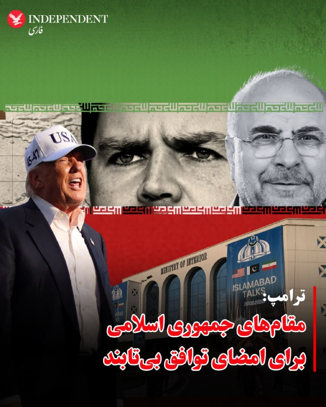

♦️دونالد ترامپ، رئیس جمهوری آمریکا می‌گوید مقام‌های جمهوری اسلامی برای امضای توافق با آمریکا بی‌تابی می‌کنند.

ترامپ در مصاحبه ای با مجله فورچون (Fortune) که روز دوشنبه ۲۸ اردیبهشت منتشر شد، گفت: «می‌توانم به شما یک چیز بگویم: آن‌ها برای امضای توافق می‌میرند».

این سخنان در حالی عنوان می‌شود که ترامپ شامگاه یکشنبه اعلام کرد زمان برای جمهوری اسلامی به سرعت‌ در حال گذر است و اگر توافقی امضا نشود، چیزی برایشان باقی نخواهد ماند.
‌🇸🇦 Indypersian

🤖 @VahidOOnLine

## VahidOOnLine — post 240765

  

اسماعیل بقایی، سخنگوی وزارت خارجه جمهوری اسلامی، در پاسخ به پرسشی درباره گزارش‌ها از قصد امارات متحده عربی برای حمله به جمهوری اسلامی و سفر مقام‌های اسرائیلی به این کشور گفت: «ما قرار نیست با گزارش‌ها این واقعیت را از یاد ببریم که تهدید اصلی کدام طرف است.»

بقایی با تهدید کشورهای منطقه از جمله امارات متحده عربی گفت: « اماراتی‌ها از اتفاقاتی که در دو سه ماه اخیر افتاد باید درس بگیرند.»

او اضافه کرد: «ما با هیچ کشور منطقه دشمنی نداریم و با همه همسایه هستیم. همه را به مراقبت به دسیسه‌های طرف‌های خارجی برای ایجاد تفرقه دعوت می‌کنیم.»

بقایی گفت رفت‌وآمد مقام‌های اسرائیلی به منطقه از دید جمهوری اسلامی «مخفی نبوده» و این رفت‌وآمدها، اسرائیل را برای ادامه «جنایات» در منطقه جری‌تر کرده است.
‌🏁 🇬🇧 IranintlTV

🤖 @VahidOOnLine

## VahidOOnLine — post 240764

  

♦️ خبرگزاری رویترز روز دوشنبه ۲۸ اردیبهشت‌ماه به نقل از یک منبع پاکستانی گزارش کرد که اسلام‌آباد شامگاه یکشنبه «طرح پیشنهادی اصلاح شده»  جمهوری اسلامی ایران برای پایان دادن به جنگ را با آمریکا «به اشتراک گذاشته است».

این مقام پاکستانی که خواست نامش فاش نشود در پاسخ به پرسش رویترز درباره چالش زمان در حل اختلاف تهران و واشنگتن گفت: «ما وقت زیادی نداریم» و هر دو کشور به تغییر اهداف خود ادامه می‌دهند».

این خبر در حالی منتشر می‌شود که دونالد ترامپ، شامگاه یکشنبه هشدار داده بود که اگر ایران توافق را امضا نکند،‌ چیزی برایش باقی نخواهد ماند.
‌🇸🇦 Indypersian

🤖 @VahidOOnLine

## VahidOOnLine — post 240763

  

دونالد ترامپ، رییس‌جمهوری آمریکا، در مصاحبه با مجله فورچون گفت مقام‌های جمهوری اسلامی برای امضای توافق «بی‌تاب» هستند، اما پس از رسیدن به توافق، متنی ارسال می‌کند که به گفته او «هیچ ربطی به توافق انجام‌شده ندارد».

ترامپ گفت: «ایرانی‌ها برای امضای توافق بی‌تاب هستند. اما وقتی توافق می‌کنند، بعد از آن برگه‌ای برایت می‌فرستند که هیچ ربطی به توافقی که انجام داده‌اند ندارد. من به آن‌ها می‌گویم شما دیوانه هستید؟»
‌🏁 🇬🇧 IranintlTV

🤖 @VahidOOnLine

## VahidOOnLine — post 240762

  <a href="telegram/content/VahidOOnLine_240762_1779097913.mp4" target="_blank">🎬 Download video</a>

اسماعیل بقایی، سخنگوی وزارت خارجه جمهوری اسلامی، روز دوشنبه ۲۸ اردیبهشت، در نشست خبری خود گفت تهدید و فشار اقتصادی آمریکا نتوانسته تهران را از پیگیری حقوق خود منصرف کند.

بقایی با اشاره به تهدیدهای مطرح‌شده علیه جمهوری اسلامی گفت: «در صورت کوچک‌ترین خطایی از سوی طرف‌های مقابل، می‌توانیم خوب جواب دهیم.» او اضافه کرد در روزهای اخیر مردم در میدان‌های تهران می‌گویند: «تو رستم تهمتنی و بزن که خوب می‌زنی.»
‌🏁 🇬🇧 ManotoTV

🤖 @VahidOOnLine

## VahidOOnLine — post 240761

  

خبرگزاری رویترز به نقل از یک منبع پاکستانی گزارش داد که اسلام‌آباد پیشنهاد اصلاح‌شده جمهوری اسلامی برای پایان دادن به درگیری در خاورمیانه را با آمریکا به اشتراک گذاشته است.

این منبع در پاسخ به پرسشی درباره زمان لازم برای رفع اختلاف‌ها گفت: «وقت زیادی نداریم.» او افزود دو کشور «مدام خط قرمزهای خود را تغییر می‌دهند.»
‌🏁 🇬🇧 IranintlTV

🤖 @VahidOOnLine

## VahidOOnLine — post 240760

  <a href="telegram/content/VahidOOnLine_240760_1779097915.mp4" target="_blank">🎬 Download video</a>

رالی خودرها در سن‌دیگو در حمایت از مردم ایران، یکشنبه ۲۷ اردیبهشت
‌🏁 🇬🇧 ManotoTV

🤖 @VahidOOnLine

## VahidOOnLine — post 240759

  <a href="telegram/content/VahidOOnLine_240759_1779097917.mp4" target="_blank">🎬 Download video</a>

اسماعیل بقایی، سخنگوی وزارت خارجه جمهوری اسلامی، روز دوشنبه ۲۸ اردیبهشت گفت مواردی مانند آزادسازی دارایی‌های مسدودشده ایران و رفع تحریم‌ها «شرط» تهران نیست، بلکه «مطالبات روشن و به‌حق» جمهوری اسلامی در مذاکرات است.

بقایی در پاسخ به پرسشی درباره شروط جمهوری اسلامی گفت ممکن است طرف مقابل موضوعات را به تشخیص خود نام‌گذاری کند، اما «مطالبات ما روشن است.»

سخنگوی وزارت خارجه جمهوری اسلامی همچنین رفع تحریم‌ها را یکی دیگر از مطالبات ایران دانست و گفت این موارد در هر مذاکره‌ای از سوی هیئت مذاکره‌کننده جمهوری اسلامی «با جدیت» پیگیری می‌شود.
‌🏁 🇬🇧 ManotoTV

🤖 @VahidOOnLine

## VahidOOnLine — post 240758

  <a href="telegram/content/VahidOOnLine_240758_1779097918.mp4" target="_blank">🎬 Download video</a>

⭕️بقایی: کشورهای منطقه به‌ویژه امارات باید از اتفاقات اخیر درس بگیرند

♦️اسماعیل بقایی، سخنگوی وزارت امور خارجه جمهوری اسلامی روز دوشنبه ۲۸ اردیبهشت‌ماه با انتقاد شدید از کشورهای همسایه به‌دلیل آنچه او «همکاری با متجاوزان به ایران» خواند، گفت: «کشورهای منطقه به‌ویژه امارات متحده عربی باید از اتفاقات اخیر درس بگیرند.»

این سخنان در حالی مطرح می‌شود که روز یکشنبه، امارات متحده عربی از حمله پهپادی به نیروگاه هسته‌ای براکه خبر داد و اعلام کرد که در حال بررسی منشاء این حمله است.
ساعاتی بعد، عربستان سعودی اعلام کرد با پهپادهایی که از خاک عراقی بلند شده و حریم هوایی این کشور را نقض کرده بودند، مقابله کرده است.
‌🇸🇦 Indypersian

🤖 @VahidOOnLine

## VahidOOnLine — post 240757

⭕️ از مومیایی رضا شاه تا معمای دفن خامنه‌ای

📌 آیا این احتمال وجود دارد که دومین رهبر جمهوری اسلامی مخفیانه و به دور از چشم اغیار به خاک سپرده شده باشد؟

♦️ نزدیک به سه ماه از تاریخ کشته شدن رهبر جمهوری اسلامی آیت‌الله علی خامنه‌ای گذشته است؛ دومین چهره سیاسی نظام اسلامی که پس از آیت‌الله خمینی به قدرت رسید و تا زمان مرگ در نهم اسفندماه ۱۴۰۴، بیش از ۳۶ سال بر اریکه قدرت تکیه زد.

حاکم بلامنازعی که در هر رویداد سیاسی و اجتماعی ایران حرف آخر را می‌زد؛ مردی که بامداد شنبه نهم اسفند در مجتمع مسکونی موسوم به بیت رهبری در جریان حملات هوایی اسرائیل و آمریکا کشته شد.

آن‌گونه که نهادهای اطلاعاتی و امنیتی اسرائیلی و آمریکایی اعلام کردند و مقام‌های ایرانی نیز تایید کردند، وی در این حملات کشته شد، با این حال، آخرین فصل این ماجرا همچنان ناتمام مانده است: مراسم تشییع و تدفین رهبر پیشین جمهوری اسلامی.

🖊 کاملیا انتخابی فرد

بیشتر بخوانید...
‌🇸🇦 Indypersian

🤖 @VahidOOnLine

## VahidOOnLine — post 240756

  

علی بابایی کارنامی، رییس کمیسیون اجتماعی مجلس، اعلام کرد پس از جنگ اخیر، آمار بیکاری در کشور به‌صورت فزاینده‌ای رشد یافته و پیش‌بینی می‌شود بین ۲۲۰ تا ۴۰۰ هزار کارگر شغل خود را از دست بدهند.

او با اشاره به شرایط بحرانی بازار کار پیشنهاد کرد دولت مشابه دوران کرونا، حمایت مالی مستقیمی برای کارگران در نظر بگیرد و مبالغی به حساب آنان واریز کند تا امکان حفظ همکاری میان کارگران و کارفرمایان فراهم شود.

بابایی کارنامی افزود برای اجرای این طرح، لازم است هرچه سریع‌تر بخشنامه‌های لازم به استان‌ها ابلاغ شود، زیرا کارگران و کارفرمایان در انتظار تصمیم فوری دولت هستند.
‌🏁 🇬🇧 IranintlTV

🤖 @VahidOOnLine

## VahidOOnLine — post 240755

  <a href="telegram/content/VahidOOnLine_240755_1779097921.mp4" target="_blank">🎬 Download video</a>

ویدیوهای تازه رسیده به ایران‌اینترنشنال، بی‌تابی مادر جاویدنام متین پرویزی را در مراسم تولد او بر مزارش در هشتم فروردین نشان می‌دهد.
متین پرویزی، ۲۶ ساله، ۱۹ دی ۱۴۰۴ در زنجان از ناحیه پا هدف گلوله قرار گرفت و بر زمین افتاد. سپس مأموران به او تیر خلاص زدند.
‌🏁 🇬🇧 IranintlTV

🤖 @VahidOOnLine

## VahidOOnLine — post 240754

  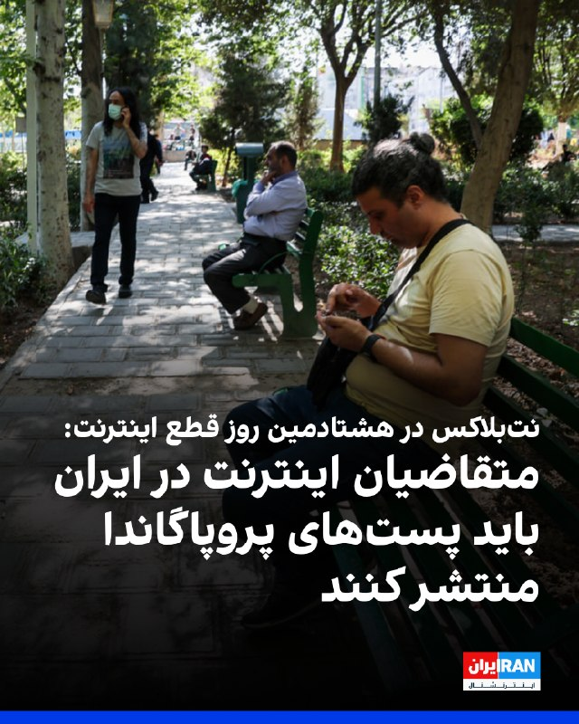

نت‌بلاکس دوشنبه ۲۸ اردیبهشت اعلام کرد هشتادمین روز از قطع اینترنت در ایران است و مدت این اختلال به ۱۸۹۶ ساعت رسیده است.

بر اساس گزارش این نهاد ناظر بر اینترنت جهانی، همزمان با تداوم این وضعیت، محتوای حامی حکومت شبکه‌های اجتماعی را پر کرده است.

این نهاد همچنین اعلام کرد برخی از ایرانیانی که برای دریافت اینترنت «پرو» یا دسترسی سیم‌کارت سفید اقدام کرده‌اند، می‌گویند از آن‌ها خواسته می‌شود سهمیه‌ای از پست‌های تبلیغاتی روزانه منتشر کنند.

نت‌بلاکس افزود این فعالیت‌ها با استفاده از هوش مصنوعی نظارت می‌شود.
‌🏁 🇬🇧 IranintlTV

🤖 @VahidOOnLine

## VahidOOnLine — post 240753

  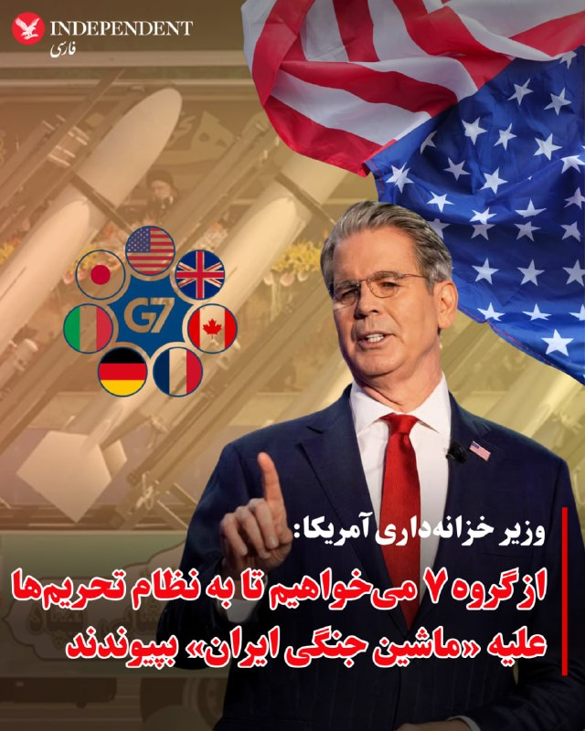

⭕️وزیر خزانه‌داری آمریکا: از گروه ۷ می‌خواهیم تا به نظام تحریم‌ها علیه «ماشین جنگی ایران» بپیوندند

♦️اسکات بسنت، وزیر خزانه‌داری ایالات متحده روز دوشنبه ۲۸ اردیبهشت‌ماه گفت از همتایان خود در گروه ۷ (هفت کشور صنعتی) خواهد خواست تا از نظام حقوقی تحریم‌های آمریکا علیه جمهوری اسلامی با هدف «اجازه ندادن به تامین مالی ماشین جنگی ایران» پیروی کنند.

به گزارش رویترز، بسنت به خبرنگاران گفت سفر هفته گذشته رئیس جمهوری آمریکا و همراهانش به چین بسیار موفقیت‌آمیز بوده است.
‌🇸🇦 Indypersian

🤖 @VahidOOnLine

## VahidOOnLine — post 240752

  

کانال ۱۳ اسرائیل گزارش داد در ۲۴ ساعت گذشته ده‌ها هواپیمای باری خالی از اسرائیل برخاستند، در پایگاه‌های آمریکایی در آلمان فرود آمدند، مهمات بارگیری کردند و سپس به اسرائیل بازگشتند.

بر اساس این گزارش، ارتش اسرائیل در روزهای اخیر در سطح بالایی از آماده‌باش قرار داشته و تاریخی را برای آمادگی تعیین کرده است.

کانال ۱۳ جزئیات بیشتری درباره نوع مهمات یا هدف از این جابه‌جایی منتشر نکرده است.
‌🏁 🇬🇧 IranintlTV

🤖 @VahidOOnLine

## WithYashar — post 11538

گسترش آلودگی نفتی ایران به سواحل کویت؛ زنگ خطر فاجعه در خلیج فارس؛بر اساس تصاویر منتشر شده در شبکه‌های اجتماعی، تداوم نشت نفت از زیرساخت‌های ایران، اکنون با عبور از مرزهای آبی، به سواحل کویت رسیده
@withyashar

## WithYashar — post 11537

ترامپ: اونا یه برگه می‌فرستن که هیچ ربطی به چیزی که توافق کرده بودیم نداره منم می‌گم، شماها دیوونه‌اید یا چی؟ @withyashar

## WithYashar — post 11536

ترامپ: اونا یه برگه می‌فرستن که هیچ ربطی به چیزی که توافق کرده بودیم نداره

منم می‌گم، شماها دیوونه‌اید یا چی؟
@withyashar

## WithYashar — post 11535

وای نت عبری از قول منبع پاکستانی: «ما پیشنهاد اصلاح‌شده ایران را به آمریکا ارسال کرده‌ایم، وقت زیادی نداریم»
@withyashar

## WithYashar — post 11534

انفجار سنگین در بیت شمش اسرائیل و دیده شدن ابر قارچی گزارش شده که در کارخانه شرکت تومر رخ داد. این شرکت موتورهای موشک سنگین و سبک، از جمله موتورهای پیشران موشک‌های ارو ۲ و ارو ۳، موتور موشک هدف سیلور انکر، موتورهای ماهواره هورایزن و موتورهای موشک باراک ۸ و…

## WithYashar — post 11533

سخنگوی وزارت خارجه:
هفته گذشته علی‌رغم اینکه طرف‌های آمریکایی به‌طور علنی اعلام کردند طرح ایران مردود است، ما از طرف میانجی پاکستانی مجموعه‌ای از نکات و ملاحظات اصلاحی را دریافت کردیم.

بنابراین از روز بعد از ارسال نقطه‌نظرات ما به طرف آمریکایی، از طرف پاکستان مجموعه‌ای از پیشنهادات را دریافت کردیم که در این چند روز بررسی شد و هم‌چنان که دیروز اعلام شد، متقابلا نقطه‌نظرات ما به طرف آمریکایی منعکس شده است.

روند مذاکرات از طریق میانجی پاکستانی ادامه دارد
@withyashar

## WithYashar — post 11532

سخنگوی سنتکام به شبکه العربیة:ما به اهداف نظامی که برای خود در ایران تعیین کرده بودیم، دست یافته‌ایم

ما تا حد زیادی توانایی‌های نظامی ایران را نابود کرده‌ایم.
ما ظرفیت تولید نظامی ایران را نابود کرده‌ایم.
با متحدان خود برای پشتیبانی از پدافند هوایی همکاری کردیم.
توانایی ایران برای تهدید دیگر مانند گذشته نیست.
عملیات علیه ایران بسیار مؤثر بود.
ما به دلیل استفاده از تنگه هرمز به عنوان سلاحی برای تهدید آزادی دریانوردی، ایران را محاصره می‌کنیم.

برای هرگونه طرح احتمالی که ممکن است از ما درخواست شود، آماده‌ایم.
در طول آتش‌بس با ایران، تجدید تسلیحات و استقرار مجدد نیرو داشته‌ایم.

تهدیدات ایران مانع عبور کشتی‌ها از تنگه هرمز می‌شود.
تحریم ایران بسیار مؤثر است و ما به اجرای آن ادامه می‌دهیم.
@withyashar

## WithYashar — post 11531

شب گذشته راننده یک خودروی شوتی با هدف فرار از دست نیروهای پلیس اقدام به ریختن میخ‌های چندپر در مسیر اتوبان تهران–کرج کرد که موجب آسیب‌دیدگی لاستیک‌های ۲۴ دستگاه خودرو و مسدود شدن آزادراه تا صبح امروز شد

پلیس اعلام کرده که با استفاده از دوربین های جاده ای خودروی شوتی شناسایی شده و راننده آن تحت تعقیب است
@withyashar

## WithYashar — post 11530

طبق روال هر روز اسرائیل جنوب لبنان را شخم میزند.
@withyashar

## WithYashar — post 11529

یک کارشناس صدا و سیما تهدید کرد:

با یک انفجار در فضا می‌توان خدمات اینترنت ماهواره‌ای استارلینک را از کار انداخت
@withyashar

## mwarmonitor — post 9235

🔴 خبرنگار الجزیره به نقل از منبعی در وزارت کشور پاکستان: وزیر کشور، سفر خود به تهران را برای روز سوم نیز تمدید کرده است. @mwarmonitor

## mwarmonitor — post 9234

📝تحلیل اختصاصی کانال 🇵🇰🇮🇷سفر از پیش‌اعلام‌نشده وزیر کشور پاکستان به تهران، بیش از آنکه یک رایزنی سنتی باشد، یک آفند دیپلماتیک پیشگیرانه است. در عرف بین‌الملل، حضور فیزیکی یک مقام ارشد از کشوری غیردرگیر در پایتختِ هدف، به عنوان یک ضربه‌گیر امنیتی عمل می‌کند؛…

## mwarmonitor — post 9233

🇺🇸🇵🇰🇮🇷پاکستان شامگاه یکشنبه یک پیشنهاد اصلاح‌شده از سوی ایران را با ایالات متحده به اشتراک گذاشت که هدف آن پایان دادن به جنگ است — رویترز @mwarmonitor

## mwarmonitor — post 9232

🇺🇸🇵🇰🇮🇷پاکستان شامگاه یکشنبه یک پیشنهاد اصلاح‌شده از سوی ایران را با ایالات متحده به اشتراک گذاشت که هدف آن پایان دادن به جنگ است — رویترز

@mwarmonitor

## mwarmonitor — post 9231

  <a href="telegram/content/mwarmonitor_9231_1779097924.mp4" target="_blank">🎬 Download video</a>

📝 شاید واستون سوال پیش بیاد کدوم حیونی پیراهن امضا شده اینا رو می‌خواد؟ جوابش راحته: همون جماعتی که شب‌ها پرچم می‌چرخوندن و تهِ افتخار زندگی‌شون، سواری دادن به این شوهای مسخره‌ است!

🔸اما اوج جنجال و وقاحت این کمدی، حرکت حماسیِ «آقای دکتر بیرانوند» هست. یارو با چنان سیسِ الیور کانی و قیافه‌ حق‌به‌جانبی می‌آد جلو که انگار داره بیانیه سازمان ملل رو تایید می‌کنه! خیلی جدی و طلبکارانه می‌گه: «کجا رو امضا کنم؟»

🔹آخه پوفیوز! تو با اون سطح از سواد و مغزِ آکبندت، بزرگترین توهین به مفهوم خودکاری! تو رو چه به امضا کردن؟ نهایتِ هنری که باید از خودت نشون بدی اینه که استامپ رو بذارن جلوت، انگشت بزنی و جفتک بندازی!

@mwarmonitor

## pm_afshaa — post 90942

🔴گسترش آلودگی نفتی ایران به سواحل کویت؛ زنگ خطر فاجعه در خلیج فارس؛بر اساس تصاویر منتشر شده در شبکه‌های اجتماعی، تداوم نشت نفت از زیرساخت‌های ایران، اکنون با عبور از مرزهای آبی، به سواحل کویت رسیده

💧 Rainbet.com the #1 Non-KYC Crypto Casino & Sportsbook @rainbetcom

😁 @Pm_Afshaa

## pm_afshaa — post 90941

🔴ترامپ : ایران داره التماس می‌کنه که یه توافق امضا بشه

💧 Rainbet.com the #1 Non-KYC Crypto Casino & Sportsbook @rainbetcom

😁 @Pm_Afshaa

## pm_afshaa — post 90940

🔴منابع پاکستانی:آخرین پیشنهاد ایران برای پایان جنگ، یکشنبه شب(دیشب) به طرف آمریکایی ارسال شد

💧 Rainbet.com the #1 Non-KYC Crypto Casino & Sportsbook @rainbetcom

😁 @Pm_Afshaa

## pm_afshaa — post 90939

🔴سی‌ان‌ان: پنتاگون فهرستی از اهداف برای حمله به ایران در صورت صدور دستور ترامپ آماده کرده

💧 Rainbet.com the #1 Non-KYC Crypto Casino & Sportsbook @rainbetcom

😁 @Pm_Afshaa

## pm_afshaa — post 90938

🔴سخنگوی وزارت امور خارجه بقایی:
تیم‌های فنی ما و عمان برای هماهنگی در پرونده تنگه هرمز دیدار کردند

ما با هیچ یک از کشورهای منطقه، از جمله امارات، دشمنی نداریم، ما همسایگانیم و تهران به دنبال صلح است

حضور آمریکا منطقه را در خطر دائمی قرار می‌دهد

ما از کشورهایی که سرزمین، منابع و آسمان خود را در اختیار متجاوزان قرار می‌دهند، گله‌مندیم

حق ما در غنی‌سازی اورانیوم را در مذاکرات مطرح نخواهیم کرد

💧 Rainbet.com the #1 Non-KYC Crypto Casino & Sportsbook @rainbetcom

😁 @Pm_Afshaa

## pm_afshaa — post 90937

انقدر که حرف گرونی بنزین تو آمریکا میزنین چرا حرفی از اینترنت گیگی 5 دلاری تو ایران نمیزنین!؟

## pm_afshaa — post 90936

  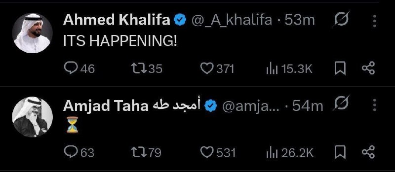

کارشناسان معتبر عرب :

احمد خلیفه : داره اتفاق میوفته

💧 Rainbet.com the #1 Non-KYC Crypto Casino & Sportsbook @rainbetcom

😁 @Pm_Afshaa

## pm_afshaa — post 90935

🔴روزنامه خراسان: احتمال بروز جنگ و ترور مقامات سیاسی وجود دارد اما غافلگیر نمی‌شویم
 

💧 Rainbet.com the #1 Non-KYC Crypto Casino & Sportsbook @rainbetcom

😁 @Pm_Afshaa

## DEJradio — post 4691

  <a href="telegram/content/DEJradio_4691_1779097927.webm" target="_blank">🎬 Download video</a>

🔺📢 جمهوری اسلامی در وقت‌های اضافه
یادداشت: فریبرز کرمی‌زند

در روزهای گذشته تصاویری از صداوسیمای حکومتی پخش شد که در استودیوهای آن، یکی از نیروهای سـ.ـپاه پاسداران در حال آموزش استفاده از سلاح‌های انفرادی مانند AK-47 و تیربار چندمنظوره PK بود. هرچند از نحوه گفتار و توضیحات ناقص او به‌ وضوح پیداست که خود نیز نیاز به آموزش دارد، اما مسئله اصلی هدف از پخش چنین برنامه‌هایی است.

زمانیکه حکومت‌های تروریستی و خشن به پایان مسیر خود نزدیک می‌شوند، رفتارهایی از آنان سر می‌زند که لزوماً نمی‌توان برایشان توجیه منطقی یافت اما آنچه مسلم است، ترس عمیق حکومت از مردم ایران است؛ زیرا به‌ خوبی می‌داند ضربه نهایی را مردم وارد خواهند کرد.

به نظر می‌رسد نمایش سلاح در رسانه حکومتی تلاشی برای ارسال این پیام باشد که هرگونه اعتراض مردمی با واکنش سخت مواجه خواهد شد؛ تکرار همان ادبیاتی که پیش‌تر نیز از برخی چهره‌های نزدیک به حکومت مانند حسین یکتا از صداوسیما پخش شده بود، این‌بار در قالب تصویر و نمایش رسانه‌ای.

اما چنین نمایش‌هایی نه ‌تنها مانع خواست مردم برای آزادی نخواهد شد، بلکه شکاف میان حکومت و جامعه را عمیق‌تر و اراده معترضان برای تغییر را تقویت خواهد کرد و آنها را به سمت و سویی سوق خواهد داد که برای ایستادن در برابر حکومت به دنبال ابزارهای لازم بروند زیرا دست خالی ایستادن در برابر این جنایتکاران اشتباه است. لازم به ذکر است از این سلاح‌ها در دی‌ماه ۱۴۰۴ بر علیه مردم استفاده شده بود.

#صداوسیما #وقت_اضافه
@DEJradio

## DEJradio — post 4690

  <a href="telegram/content/DEJradio_4690_1779097927.webm" target="_blank">🎬 Download video</a>

🚨
⭕️ انتقال گسترده مهمات به اسرائیل

شبکه ۱۳ اسرائیل از انتقال گسترده مهمات از پایگاه‌های آمریکایی در آلمان به اسرائیل خبر داد. بر اساس این گزارش، در شبانه‌روز گذشته ده‌ها هواپیمای باری اسرائیلی بدون بار به آلمان پرواز کرده، پس از دریافت محموله‌های تسلیحاتی به اسرائیل بازگشته‌اند.

این شبکه همچنین گزارش داد ارتش اسرائیل طی روزهای اخیر در وضعیت آماده‌باش گسترده قرار داشته و برای سناریوهای احتمالی، زمان‌بندی مشخصی تعیین کرده است.

#جنگ #حمله_نظامی
@DEJradio

## DEJradio — post 4689

  <a href="telegram/content/DEJradio_4689_1779097927.webm" target="_blank">🎬 Download video</a>

🕐
🔺 جمهوری اسلامی در محاصره

#ترامپ #جمهوری_اسلامی
@DEJradio

## DEJradio — post 4688

  <a href="telegram/content/DEJradio_4688_1779097928.mp4" target="_blank">🎬 Download video</a>

🚨
🔸 اختلاف میان نیروهای مسلح؛ چالش تازه حکومت

*رضا تمیزکار، پرسنل سابق نیروی انتظامی

#نیروهای_مسلح #نیروی_انتظامی
@DEJradio

## DEJradio — post 4687

  <a href="telegram/content/DEJradio_4687_1779097930.mp4" target="_blank">🎬 Download video</a>

🔺🎥 “قیمت برنج سه برابر شده، دیگه نمی‌تونیم بخریم

یک شهروند با ارسال دیدیویی نوشت، «این فیلم کوتاه رو از فروشگاهی در تجریش - تهران - براتون میفرستم. قیمت یک گونی برنج از سال گذشته تا اکنون سه برابر شده. یه زمانی برنج ساده ترین ماده غذایی در سفره ها بود ولی با این قیمت‌ها دیگه برنج هم نمی تونیم بخریم. این حکومت فاسد هر روز سفره های ما رو کوچکتر و کوچکتر میکنه!»

#تورم #برنج
@DEJradio

## DEJradio — post 4686

  <a href="telegram/content/DEJradio_4686_1779097931.webm" target="_blank">🎬 Download video</a>

🚨📢 جیمی دایمن رئیس و مدیرعامل بانک «جی‌پی‌مورگان چیس» [بزرگترین بانک آمریکا]، در گفت‌وگو با فرانسین لاکوا در برنامه «بلومبرگ اوپن اینترست» با اشاره به جنگ آمریکا و اسرائیل با جمهوری اسلامی گفت: «آن‌ها ۴۷ سال است که تجاوز، کشتار و قتل انجام می‌دهند.» او افزود جهان غرب نباید اجازه می‌داد جنگ‌های نیابتی ادامه پیدا کند و «باید سال‌ها پیش سر مار را می‌زد.»

رئیس جی‌پی‌مورگان با اشاره به ادامه بحران خاورمیانه گفت اکنون ریسک بیشتری وجود دارد، اما شاید فرصت بیشتری هم برای صلح ایجاد شده باشد، زیرا «مردم خواهان صلح هستند.»

دایمن ۷۰ ساله گفت: «ما نباید نسبت به نقشی که حکومت فعلی ایران طی سال‌های طولانی در گسترش تروریسم و کشتن هزاران نفر، از جمله آمریکایی‌ها و بسیاری از شهروندان خودش، داشته است چشم‌پوشی کنیم. این تهدید باید به شکلی مناسب مورد رسیدگی قرار گیرد.»

#دی۱۴۰۴ #جنگ
@DEJradio

## IranIntlTV — post 337753

  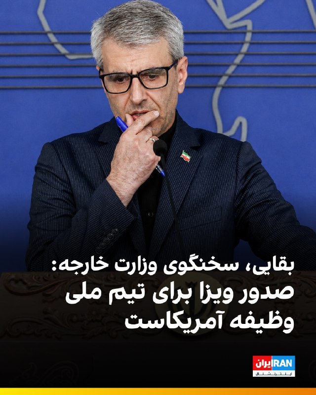

🔻اسماعیل بقایی، سخنگوی وزارت خارجه جمهوری اسلامی در نشست خبری درباره صدور روادید برای کادر فنی و تیم ملی فوتبال از سوی آمریکا گفت: «صدور روادید برای حضور تیم ملی فوتبال و کادر فنی، طبق مقررات فیفا، وظیفه دولت‌های میزبان است؛ بنابراین در اینجا فیفا طرف‌حسابِ ماست.»

🔹او گفت: «دو روز پیش در ترکیه، دیدار خوبی میان مسئولان فدراسیون فوتبال و مدیران ارشد فیفا برگزار شد و به ما اطمینان داده شد که فیفا تمام تلاش خود را به کار خواهد گرفت تا اطمینان حاصل شود که مقررات فیفا توسط میزبان‌ها رعایت می‌شود.»

🔹بقایی ادامه داد: «در عین حال، تردیدی نیست که آمریکا بارها تعهدات میزبانی خود را نقض کرده است. همچنین، اظهارنظرهایی که مطرح می‌شود مبنی بر اینکه ممکن است برای برخی از اعضای تیم ملی فوتبال به بهانه‌های خودساخته ویزا صادر نشود، اصلاً قابل قبول نیست و فدراسیون به صورت جدی این موضوع را پیگیری می‌کند.»

@iranintltvsport

## IranIntlTV — post 337752

  

یوروپل، آژانس اتحادیه اروپا برای همکاری در اجرای قانون، اعلام کرد در اقدامی هماهنگ برای مقابله با محتوای «تروریستی» در فضای مجازی، در مجموع ۱۴ هزار و ۲۰۰ پست و پیوند مرتبط با سپاه پاسداران هدف قرار گرفته است.

به گفته یوروپل، این اقدام با هدایت واحد ارجاع اینترنتی اتحادیه اروپا انجام شد و بر شناسایی و اخلال در حضور آنلاین سپاه که برای انتشار تبلیغات، جذب حامیان و تامین مالی به کار می‌رفت، تمرکز داشت. این تصمیم به نهادهای اجرای قانون اجازه می‌دهد علیه فعالیت اعضا و نهادهای پشتیبان آن در اتحادیه اروپا اقدام کنند.

در این عملیات، ۱۹ کشور شامل اتریش، بلژیک، بوسنی و هرزگوین، بلغارستان، چک، دانمارک، استونی، فنلاند، فرانسه، آلمان، یونان، مجارستان، ایتالیا، هلند، پرتغال، اسپانیا، سوئد، اوکراین و آمریکا مشارکت داشتند. مقام‌ها بین ۲۲ اسفند تا هشتم اردیبهشت در مراحل هماهنگ زیر نظر یوروپل اقدام به جمع‌آوری اطلاعات، تطبیق اهداف و ارجاع مشترک محتوا به پلتفرم‌های آنلاین کردند.
https://iranintl.com/202605183052

## IranIntlTV — post 337751

  

اسماعیل بقائی، سخنگوی وزارت خارجه جمهوری اسلامی، درباره احتمال ازسرگیری جنگ گفت دیپلماسی جمهوری اسلامی «هوشمندانه» است، اما تهران با تمام توان برای هر سناریویی آماده است.

اسماعیل بقائی گفت: «دیپلماسی جمهوری اسلامی هوشمندانه است»، اما در عین حال تاکید کرد جمهوری اسلامی در برابر هر اقدام «دیوانه‌باری» با تمام توان دفاع می‌کند.

او همچنین افزود نیروهای نظامی «سورپرایزهایی» خواهند داشت.
https://iranintl.com/202605183625

## IranIntlTV — post 337750

  <a href="telegram/content/IranIntlTV_337750_1779097934.mp4" target="_blank">🎬 Download video</a>

بیمارستان الغدیر تهران در شب‌های ۱۸ و ۱۹ دی‌ماه یکی از قتل‌گاه‌های جمهوری اسلامی بود. در پی کارزار ایران‌اینترنشنال در خصوص ارسال اطلاعات بیشتر برای شناسایی پیکرهای جاویدنامان در این بیمارستان، اطلاعات و تصاویری به دست ما رسیده که بخشی از آن را در این ویدیو می‌بینید.
شاهدان و خانواده‌ها می‌توانند برای ثبت حقیقت این جنایت، اسناد، تصاویر و روایت‌های خود را از طریق بات اینتل‌مدیا ارسال کنند.

## IranIntlTV — post 337749

  

اسماعیل بقایی، سخنگوی وزارت خارجه جمهوری اسلامی، در پاسخ به پرسشی درباره گزارش‌ها از قصد امارات متحده عربی برای حمله به جمهوری اسلامی و سفر مقام‌های اسرائیلی به این کشور گفت: «ما قرار نیست با گزارش‌ها این واقعیت را از یاد ببریم که تهدید اصلی کدام طرف است.»

بقایی با تهدید کشورهای منطقه از جمله امارات متحده عربی گفت: « اماراتی‌ها از اتفاقاتی که در دو سه ماه اخیر افتاد باید درس بگیرند.»

او اضافه کرد: «ما با هیچ کشور منطقه دشمنی نداریم و با همه همسایه هستیم. همه را به مراقبت به دسیسه‌های طرف‌های خارجی برای ایجاد تفرقه دعوت می‌کنیم.»

بقایی گفت رفت‌وآمد مقام‌های اسرائیلی به منطقه از دید جمهوری اسلامی «مخفی نبوده» و این رفت‌وآمدها، اسرائیل را برای ادامه «جنایات» در منطقه جری‌تر کرده است.
https://iranintl.com/202605189537

## IranIntlTV — post 337748

  <a href="telegram/content/IranIntlTV_337748_1779097936.mp4" target="_blank">🎬 Download video</a>

یک شهروند با ارسال پیامی به ایران‌اینترنشنال می‌گوید اینترنت پرو خریده و با وجود مصرف کم، بعد از دو روز به او پیام داده‌اند که نصف حجم را مصرف کرده‌اند: «اصلا نمی‌فهمم چطور این حجم استفاده شده. بنظر می‌رسد دولت از همین هم سوءاستفاده می‌کند.»

## IranIntlTV — post 337747

  

🔻فوتبال آلمان شاهد یکی از بزرگ‌ترین شگفتی‌های تاریخ خود است؛ باشگاه کوچک «الفرسبرگ» (SVE) با پیروزی ۳ بر صفر مقابل مونستر، برای نخستین بار در تاریخ ۱۰۹ ساله‌ی خود به بوندس‌لیگا صعود کرد. این تیم که در ایالت زارلاند واقع شده، نماینده‌ی شهری با جمعیت تنها ۱۳ هزار نفر است.

🔹به نوشته‌ روزنامه‌ بیلد، این منطقه حتی یک ایستگاه قطار هم ندارد، اما حالا آماده است تا در بالاترین سطح فوتبال آلمان حضور پیدا کند. الفرسبرگ پنجاه‌ونهمین تیم تاریخ بوندس‌لیگا و چهارمین نماینده‌ی ایالت زارلاند در این رقابت‌هاست.

🔹پشت پرده‌ این صعود معجزه‌آسا، فرانک هولتسر ۷۳ ساله، حامی مالی باشگاه و بازیکن سابق فوتبال قرار دارد. او پس از تحصیل در رشته داروسازی، شرکت داروسازی «اورسافارم» را تأسیس کرد؛ شرکتی که حامی مالی بایرن مونیخ نیز هست.

جزییات بیشتر را در سایت بخوانید

@iranintltvsport

## IranIntlTV — post 337746

  

دونالد ترامپ، رییس‌جمهوری آمریکا، در مصاحبه با مجله فورچون گفت مقام‌های جمهوری اسلامی برای امضای توافق «بی‌تاب» هستند، اما پس از رسیدن به توافق، متنی ارسال می‌کند که به گفته او «هیچ ربطی به توافق انجام‌شده ندارد».

ترامپ گفت: «ایرانی‌ها برای امضای توافق بی‌تاب هستند. اما وقتی توافق می‌کنند، بعد از آن برگه‌ای برایت می‌فرستند که هیچ ربطی به توافقی که انجام داده‌اند ندارد. من به آن‌ها می‌گویم شما دیوانه هستید؟»
https://iranintl.com/202605187853

## IranIntlTV — post 337745

  

خبرگزاری رویترز به نقل از یک منبع پاکستانی گزارش داد که اسلام‌آباد پیشنهاد اصلاح‌شده جمهوری اسلامی برای پایان دادن به درگیری در خاورمیانه را با آمریکا به اشتراک گذاشته است.

این منبع در پاسخ به پرسشی درباره زمان لازم برای رفع اختلاف‌ها گفت: «وقت زیادی نداریم.» او افزود دو کشور «مدام خط قرمزهای خود را تغییر می‌دهند.»
https://iranintl.com/202605185818

## IranIntlTV — post 337744

  <a href="telegram/content/IranIntlTV_337744_1779097939.mp4" target="_blank">🎬 Download video</a>

پلیس ترکیه از قتل هولناک یک زن میانسال ایرانی‌تبار در استانبول خبر داد. مقامات امنیتی این کشور ۳ نفر را در ارتباط با قتل فرخنده قائم‌مقامی، زن ۶۸ ساله ایرانی بازداشت کردند.

نرگس هورخش، خبرنگار ایران‌اینترنشنال، گزارش می‌دهد
@iranintltv

## IranIntlTV — post 337743

  <a href="telegram/content/IranIntlTV_337743_1779097940.mp4" target="_blank">🎬 Download video</a>

هم‌زمان با ادامه فشارهای اقتصادی و محدودیت‌های تجاری جمهوری اسلامی، صادرات افغانستان به ایران افزایش کم‌سابقه‌ای داشته است.

جواد همدانی، خبرنگار ایران‌اینترنشنال، گزارش می‌دهد
@iranintltv

## IranIntlTV — post 337742

  <a href="telegram/content/IranIntlTV_337742_1779097942.mp4" target="_blank">🎬 Download video</a>

همزمان با به بن‌بست خوردن مذاکرات میان واشینگتن و تهران و افزایش احتمال از سرگیری عملیات نظامی آمریکا و اسرائیل علیه جمهوری اسلامی، دونالد ترامپ هشدار داد: «زمان برای حکومت ایران به‌سرعت در حال پایان است.»

گفت‌وگو با محمد جواد اکبرین، عضو تحریریه ایران‌اینترنشنال
@iranintltv

## IranIntlTV — post 337741

  <a href="telegram/content/IranIntlTV_337741_1779097943.mp4" target="_blank">🎬 Download video</a>

همزمان با به بن‌بست خوردن مذاکرات میان واشینگتن و تهران، ترامپ گفت زمان برای رهبران جمهوری اسلامی رو به پایان است. رسانه‌های اسرائیل از آمادگی اورشلیم و واشینگتن برای ازسرگیری عملیات نظامی گزارش دادند.

اشکان صفایی، خبرنگار ایران‌اینترنشنال، گزارش می‌دهد
@iranintltv

## IranIntlTV — post 337740

  

علی بابایی کارنامی، رییس کمیسیون اجتماعی مجلس، اعلام کرد پس از جنگ اخیر، آمار بیکاری در کشور به‌صورت فزاینده‌ای رشد یافته و پیش‌بینی می‌شود بین ۲۲۰ تا ۴۰۰ هزار کارگر شغل خود را از دست بدهند.

او با اشاره به شرایط بحرانی بازار کار پیشنهاد کرد دولت مشابه دوران کرونا، حمایت مالی مستقیمی برای کارگران در نظر بگیرد و مبالغی به حساب آنان واریز کند تا امکان حفظ همکاری میان کارگران و کارفرمایان فراهم شود.

بابایی کارنامی افزود برای اجرای این طرح، لازم است هرچه سریع‌تر بخشنامه‌های لازم به استان‌ها ابلاغ شود، زیرا کارگران و کارفرمایان در انتظار تصمیم فوری دولت هستند.
https://iranintl.com/202605182561

## IranIntlTV — post 337739

  <a href="telegram/content/IranIntlTV_337739_1779097945.mp4" target="_blank">🎬 Download video</a>

ویدیوهای تازه رسیده به ایران‌اینترنشنال، بی‌تابی مادر جاویدنام متین پرویزی را در مراسم تولد او بر مزارش در هشتم فروردین نشان می‌دهد.
متین پرویزی، ۲۶ ساله، ۱۹ دی ۱۴۰۴ در زنجان از ناحیه پا هدف گلوله قرار گرفت و بر زمین افتاد. سپس مأموران به او تیر خلاص زدند.

## IranIntlTV — post 337738

  

نت‌بلاکس دوشنبه ۲۸ اردیبهشت اعلام کرد هشتادمین روز از قطع اینترنت در ایران است و مدت این اختلال به ۱۸۹۶ ساعت رسیده است.

بر اساس گزارش این نهاد ناظر بر اینترنت جهانی، همزمان با تداوم این وضعیت، محتوای حامی حکومت شبکه‌های اجتماعی را پر کرده است.

این نهاد همچنین اعلام کرد برخی از ایرانیانی که برای دریافت اینترنت «پرو» یا دسترسی سیم‌کارت سفید اقدام کرده‌اند، می‌گویند از آن‌ها خواسته می‌شود سهمیه‌ای از پست‌های تبلیغاتی روزانه منتشر کنند.

نت‌بلاکس افزود این فعالیت‌ها با استفاده از هوش مصنوعی نظارت می‌شود.
https://iranintl.com/202605188378

## IranIntlTV — post 337737

  

🔻تیم ملی فوتبال ایران در آستانه آغاز رقابت‌های جام جهانی با بحران ویزا مواجه است. تا این لحظه، هنوز روادید بازیکنان ایران صادر نشده و همین موضوع به دغدغه اصلی امیر قلعه‌نویی، سرمربی تیم ملی، تبدیل شده است.

🔹امیر قلعه‌نویی پیش از اعزام کاروان تیم ملی به ترکیه، درباره آخرین وضعیت آماده‌سازی تیم و صدور ویزا گفت: «بازیکنان شایسته‌ای داشتیم که مجبور بودیم تعدادی از آن‌ها را انتخاب کنیم. انتخاب بازیکنان بسیار سخت بود اما این تصمیم بر اساس برنامه‌های تاکتیکی گرفته شد. البته از همین فهرست فعلی هم چند نفر حذف می‌شوند. امیدواریم در نهایت به ۲۸ بازیکن این فهرست ویزا بدهند، چرا که اگر ویزا صادر نشود، کارمان بسیار مشکل‌تر می‌شود.»

🔹او با اشاره به وضعیت آمادگی جسمانی بازیکنان افزود: «به دلیل مشکلات بدنی، در سه بخش حدود ۴۰ درصد عقب هستیم. البته در اردوی اخیر توانستیم ۲۵ درصد از این عقب‌ماندگی را جبران کنیم و امیدواریم تا ۲۶ خرداد بتوانیم بازیکنان را به شرایط ایده‌آل برسانیم.»

@iranintltvsport

## IranIntlTV — post 337736

  

کانال ۱۳ اسرائیل گزارش داد در ۲۴ ساعت گذشته ده‌ها هواپیمای باری خالی از اسرائیل برخاستند، در پایگاه‌های آمریکایی در آلمان فرود آمدند، مهمات بارگیری کردند و سپس به اسرائیل بازگشتند.

بر اساس این گزارش، ارتش اسرائیل در روزهای اخیر در سطح بالایی از آماده‌باش قرار داشته و تاریخی را برای آمادگی تعیین کرده است.

کانال ۱۳ جزئیات بیشتری درباره نوع مهمات یا هدف از این جابه‌جایی منتشر نکرده است.
https://iranintl.com/202605184450

## IranIntlTV — post 337735

  

🔻تیم ملی فوتبال برای برگزاری اردوی آماده‌سازی پیش از جام جهانی و همچنین اخذ ویزای آمریکا راهی ترکیه شد. این در حالی است که هنوز مشخص نیست کدام بازیکنان بتوانند ویزای آمریکا را دریافت کنند و تیم ملی فوتبال با بحران ویزا مواجه است.

🔹مهدی محمدنبی، نایب‌رییس فدراسیون فوتبال و مدیر تیم ملی، پیش از سفر به ترکیه به سایت فدراسیون فوتبال گفت: «تیم ملی راهی ترکیه می‌شود تا طبق برنامه از پیش تعیین‌شده، دو بازی دوستانه قطعی برگزار کند. یکی از این تیم‌ها گامبیا است و تیم دوم را پس از نهایی شدن قرارداد، در دو سه روز آینده اعلام خواهیم کرد. یک بازی هم با یکی از باشگاه‌های ترکیه خواهیم داشت.»

🔹او ادامه داد: «تیم ملی سپس راهی شهر توسان در ایالت آریزونا خواهد شد و آنجا با پورتوریکو بازی خواهد کرد. با توجه به مینی‌کمپ‌هایی که کادر فنی در تهران برگزار کرد، امیدواریم اردوی ترکیه مکمل خوبی برای آماده‌سازی مدنظر امیر قلعه‌نویی باشد.»

🔹این در حالی است که به دلیل انزوای جمهوری اسلامی بازی‌های تدارکاتی تیم ملی پیش از جام جهانی لغو شدند و تیم‌های ملی اسپانیا، مقدونیه و آنگولا از بازی با تیم ملی انصراف دادند.

@iranintltvsport

## IranIntlTV — post 337734

  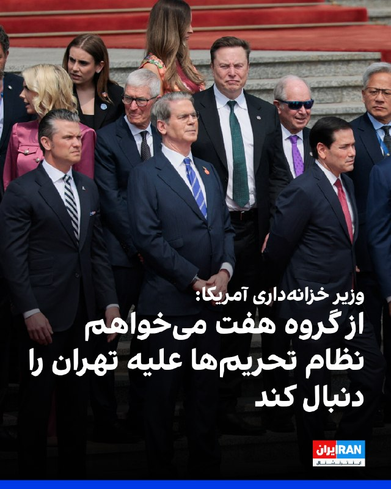

اسکات بسنت، وزیر خزانه‌داری آمریکا، روز دوشنبه اعلام کرد از وزیران دارایی گروه هفت خواهد خواست نظام تحریم‌ها علیه جمهوری اسلامی را دنبال کنند تا از تامین مالی آنچه او «ماشین جنگی» حکومت ایران توصیف کرد، جلوگیری شود.

بسنت همچنین افزود سفر هفته گذشته هیات آمریکا به چین به ریاست دونالد ترامپ، رییس‌جمهوری آمریکا، «بسیار موفق» بوده است.
https://iranintl.com/202605189837

## ManotoTV — post 105588

  <a href="telegram/content/ManotoTV_105588_1779097950.mp4" target="_blank">🎬 Download video</a>

رویترز روز دوشنبه ۲۸ اردیبهشت به نقل از یک منبع پاکستانی گزارش داد پاکستان پیشنهاد بازنگری‌شده جمهوری اسلامی برای پایان دادن به درگیری در خاورمیانه را به آمریکا منتقل کرده است.

این منبع پاکستانی گفت مذاکرات صلح همچنان در بن‌بست به نظر می‌رسد و «زمان زیادی» برای کاهش اختلاف‌ها باقی نمانده است. او افزود هر دو طرف «مدام مواضع خود را تغییر می‌دهند.»

## ManotoTV — post 105587

  <a href="telegram/content/ManotoTV_105587_1779097950.mp4" target="_blank">🎬 Download video</a>

اسماعیل بقایی، سخنگوی وزارت خارجه جمهوری اسلامی، روز دوشنبه ۲۸ اردیبهشت، در نشست خبری خود گفت تهدید و فشار اقتصادی آمریکا نتوانسته تهران را از پیگیری حقوق خود منصرف کند.

بقایی با اشاره به تهدیدهای مطرح‌شده علیه جمهوری اسلامی گفت: «در صورت کوچک‌ترین خطایی از سوی طرف‌های مقابل، می‌توانیم خوب جواب دهیم.» او اضافه کرد در روزهای اخیر مردم در میدان‌های تهران می‌گویند: «تو رستم تهمتنی و بزن که خوب می‌زنی.»

## ManotoTV — post 105586

  <a href="telegram/content/ManotoTV_105586_1779097952.mp4" target="_blank">🎬 Download video</a>

رالی خودرها در سن‌دیگو در حمایت از مردم ایران، یکشنبه ۲۷ اردیبهشت

## ManotoTV — post 105585

  <a href="telegram/content/ManotoTV_105585_1779097954.mp4" target="_blank">🎬 Download video</a>

اسماعیل بقایی، سخنگوی وزارت خارجه جمهوری اسلامی، روز دوشنبه ۲۸ اردیبهشت گفت مواردی مانند آزادسازی دارایی‌های مسدودشده ایران و رفع تحریم‌ها «شرط» تهران نیست، بلکه «مطالبات روشن و به‌حق» جمهوری اسلامی در مذاکرات است.

بقایی در پاسخ به پرسشی درباره شروط جمهوری اسلامی گفت ممکن است طرف مقابل موضوعات را به تشخیص خود نام‌گذاری کند، اما «مطالبات ما روشن است.»

سخنگوی وزارت خارجه جمهوری اسلامی همچنین رفع تحریم‌ها را یکی دیگر از مطالبات ایران دانست و گفت این موارد در هر مذاکره‌ای از سوی هیئت مذاکره‌کننده جمهوری اسلامی «با جدیت» پیگیری می‌شود.

## ManotoTV — post 105584

  <a href="telegram/content/ManotoTV_105584_1779097955.mp4" target="_blank">🎬 Download video</a>

همزمان با افزایش دوباره تنش‌ها در خاورمیانه، قیمت نفت بالا رفت و ریزش جهانی اوراق قرضه، تمایل سرمایه‌گذاران به دارایی‌های پرریسک را کاهش داد.

بر اساس این گزارش، شاخص دلار در برابر سبدی از ارزهای اصلی تقریبا ثابت ماند و به ۹۹.۳۲۵ رسید. همزمان، نفت برنت بیش از یک درصد افزایش یافت و به بالای ۱۱۰ دلار در هر بشکه رسید. رویترز نوشت حمله به یک نیروگاه هسته‌ای در امارات و توقف تلاش‌ها برای پایان دادن به جنگ آمریکا و اسرائیل علیه جمهوری اسلامی، از عوامل افزایش قیمت نفت بود.

## FarsiVOA — post 218039

  

وزارت دفاع چین پس از دیدار شی جین‌پینگ و دونالد ترامپ هفته گذشته، اعلام کرد آماده تقویت اعتماد با واشنگتن است.

به نوشته بلومبرگ، سرهنگ ارشد جیانگ بین، سخنگوی این وزارتخانه، در نشست خبری روز دوشنبه گفت روابط نظامی پایدار در راستای منافع مشترک هر دو کشور است. چین آمادگی دارد با آمریکا برای تقویت گفتگو، «مدیریت اختلافات، افزایش اعتماد و رفع سوءتفاهم‌ها» همکاری کند.

در جریان سفر ترامپ به پکن، شی جین‌پینگ اعلام کرد دوران تازه‌ای در روابط دو کشور آغاز شده؛ دوره‌ای که مقامات چینی آن را «ثبات راهبردی سازنده» نامیده‌اند.

هیئت همراه ترامپ در این سفر شامل پیت هگست، وزیر دفاع آمریکا بود. هگست در ضیافت شام رسمی به‌اختصار با دونگ جون، وزیر دفاع چین گفتگو کرد. دو وزیر دفاع پیش از این در اکتبر گذشته نیز دیدار داشتند و احتمال دارد در نشست دیالوگ شانگریلا سنگاپور در پایان همین ماه دوباره ملاقات کنند.
@FarsiVOA

## FarsiVOA — post 218038

  

معاون آموزشی وزارت علوم اعلام کرد که در برخی کشورها تا ۸۵ درصد دانش‌آموختگان در سال‌های نخست پس از فارغ‌التحصیلی جذب بازار کار می‌شوند، اما در ایران از هر ۱۰ فرد بیکار، چهار نفر دارای مدرک دانشگاهی هستند.

ابوالفضل واحدی در گفتگو با خبرگزاری ایسنا، یکی از دلایل این امر را «کارآموزی‌ صوری و کاغذی» به جای «آموزش‌ مهارتی واقعی» توصیف کرد.

خبرگزاری تسنیم وابسته به سپاه نیز با اشاره به تازه‌ترین داده‌های آماری مربوط به زمستان ۱۴۰۴، اعلام کرد که سهم فارغ‌التحصیلان آموزش عالی از کل جمعیت بیکار کشور به بیش از ۳۶ درصد رسیده است.

این خبرگزاری نوشت:‌ بیش از یک‌سوم بیکاران کشور، افرادی هستند که سال‌ها وقت خود را صرف کسب تخصص کرده‌اند.
@FarsiVOA

## FarsiVOA — post 218037

🔺آمریکا از اعضای گروه هفت می‌خواهد از رژیم تحریم‌ها علیه جمهوری اسلامی پیروی کنند

▪️وزیر خزانه‌داری ایالات متحده اعلام کرد که این کشور از وزیران دارایی کشورهای عضو گروه هفت خواهد خواست تا از رژیم تحریم‌های اقتصادی علیه جمهوری اسلامی پیروی کنند.

▪️اسکات بسنت در آستانه برگزاری نشست وزیران دارایی و روسای بانک‌های مرکزی کشورهای گروه ۷ در پاریس گفت که پیوستن این کشورها به کارزار تحریم‌ها علیه جمهوری اسلامی مانع از رسیدن منابع مالی به «ماشین جنگی» حکومت ایران خواهد شد.

▪️پیشتر دونالد ترامپ، رئیس‌جمهور آمریکا از کشورهای اروپایی به دلیل عملکردشان در قبال جنگ علیه جمهوری اسلامی انتقاد کرده است.

▪️اعضای گروه هفت کشور صنعتی جهان شامل آمریکا، کانادا، بریتانیا، فرانسه، آلمان، ایتالیا و ژاپن هستند.

⬇️ بیشتر بخوانید:
https://ir.voanews.com/a/8151178.html

## FarsiVOA — post 218036

🔺قطع اینترنت در ایران هشتادروزه شد؛ ممنوعیت تبلیغ «اینترنت پرو» پس از هشدارهای اژه‌ای

▪️نت‌بلاکس اعلام کرد خاموشی اینترنت در ایران وارد روز هشتادم شده و از مرز ۱۸۹۶ ساعت گذشته است.

▪️به گفته نت‌بلاکس، نهاد ناظر بر اختلالات اینترنت، هم‌زمان با قطع دسترسی گسترده کاربران ایرانی به اینترنت جهانی، محتوای حامی جمهوری اسلامی در شبکه‌های اجتماعی افزایش یافته است.

▪️نت‌بلاکس همچنین نوشت برخی ایرانیانی که برای دریافت دسترسی ویژه یا قرار گرفتن در «فهرست سفید» اقدام کرده‌اند، می‌گویند از آنها خواسته شده برای حفظ این دسترسی، سهمیه‌ای از پست‌های تبلیغاتی روزانه منتشر کنند؛ روندی که به گفته این نهاد، با هوش مصنوعی کنترل می‌شود.

▪️هم‌زمان رسانه‌های داخلی از ممنوعیت تبلیغ و فروش «اینترنت پرو» خبر دادند.

⬇️ بیشتر بخوانید:
https://ir.voanews.com/a/8151177.html

## FarsiVOA — post 218035

🔺ترامپ: جمهوری اسلامی به شدت به توافق نیاز دارد

▪️دونالد ترامپ، رئیس‌جمهور آمریکا، اعلام کرد که مقامات حکومت ایران علی‌رغم اظهارات تند علنی خود، به شدت به امضای یک توافق با واشنگتن نیاز دارند.

▪️ترامپ در گفت‌وگویی با نشریه فورچون که پیش از سفر او به چین انجام شده اما روز دوشنبه ۲۸ اردیبهشت منتشر شد، درباره جمهوری اسلامی گفت: «آن‌ها [مقامات جمهوری اسلامی] مدام داد و فریاد می‌زنند. یک چیز را به شما می‌گویم: آن‌ها واقعاً دارند از شدت نیاز برای امضای [یک توافق] بی‌تابی می‌کنند.»

▪️او افزود: «اما یک توافق می‌کنند و بعد یک کاغذ برایت می‌فرستند که هیچ ربطی به توافقی که کرده بودی ندارد. من می‌گویم: شما دیوانه‌اید؟»

⬇️ بیشتر بخوانید:
https://ir.voanews.com/a/8151179.html

## FarsiVOA — post 218034

🔺عمان حمله به نیروگاه هسته‌ای امارات را محکوم کرد؛ موج واکنش‌های منطقه‌ای به حملات پهپادی

▪️عمان روز دوشنبه حمله پهپادی به نیروگاه هسته‌ای براکه در منطقه الظفره امارات متحده عربی را محکوم کرد و همبستگی خود را با ابوظبی در اقداماتی که برای حفظ امنیت و تمامیت ارضی‌اش انجام می‌دهد، اعلام کرد.

▪️این واکنش پس از آن صورت گرفت که مقام‌های امارات اعلام کردند یک پهپاد به یک ژنراتور برق خارج از محدوده داخلی نیروگاه هسته‌ای براکه برخورد کرده و باعث آتش‌سوزی شده است.

▪️رویترز گزارش داد امارات منشأ حمله را بررسی می‌کند و دو پهپاد دیگر نیز از سوی پدافند این کشور رهگیری شده‌اند.

▪️عربستان سعودی و اتحادیه جهان اسلام نیز حمله به امارات را به‌شدت محکوم کرده‌اند.

⬇️ بیشتر بخوانید:
https://ir.voanews.com/a/8151176.html

## FarsiVOA — post 218033

  <a href="telegram/content/FarsiVOA_218033_1779097956.mp4" target="_blank">🎬 Download video</a>

گسترش آلودگی نفتی ایران به سواحل کویت؛ زنگ خطر فاجعه در خلیج فارس؛

بر اساس تصاویر منتشر شده در شبکه‌های اجتماعی، تداوم نشت نفت از زیرساخت‌های ایران، اکنون با عبور از مرزهای آبی، به سواحل کویت رسیده است.

یک تحلیلگر سعودی با انتقاد شدید از عملکرد تهران اعلام کرد: «هیچ‌چیز، نه در خشکی و نه در دریا، از آسیب‌های جمهوری اسلامی در امان نیست.»

پیشتر مایک والتز، نماینده آمریکا در سازمان ملل متحد نیز با انتشار ویدیویی از نشت مواد نفتی در آب‌های سواحل جنوبی ایران نوشته بود: «ایران اکنون علاوه بر اهداف غیرنظامی، به محیط زیست هم حمله می‌کند.»

منتقدان این وضعیت را نتیجه مستقیم «شرارت و بی‌توجهی» رژیم ایران به پروتکل‌های ایمنی می‌دانند و بر لزوم پاسخگو کردن بین‌المللی جمهوری اسلامی بابت نابودی آگاهانه محیط زیست منطقه تأکید دارند.

با گذشت دو هفته از مشاهده لکه نفتی بزرگ در غرب خارک، بزرگترین پایانه نفتی ایران، مقامات جمهوری اسلامی هنوز از شفاف‌سازی پیرامون آن طفره می‌روند.
@FarsiVOA

## FarsiVOA — post 218032

  

ارتش اسرائیل اعلام کرد که در شبانه‌روز گذشته بیش از ۳۰ زیرساخت «سازمان تروریستی حزب‌الله» را در جنوب لبنان هدف قرار داده است؛ این اهداف شامل انبارهای تسلیحات، مواضع دیده‌بانی و زیرساخت‌هایی است که به گفته ارتش اسرائیل «برای پیشبرد طرح‌های تروریستی علیه نیروهای ما استفاده می‌شدند».

ارتش اسرائیل اعلام کرده که به عملیات خود برای رفع تهدیدها علیه شهروندان اسرائیل و نیروهای ارتش در جنوب لبنان ادامه می‌دهد.

همچنین بر اساس این اعلام، «در حملات دقیق، تعدادی از تروریست‌های سازمان حزب‌الله که برای پیشبرد طرح‌های تروریستی علیه نیروهای ارتش اسرائیل در جنوب لبنان فعالیت می‌کردند، از بین رفتند.»
@FarsiVOA

## FarsiVOA — post 218031

  

یک مقام قضایی در آذربایجان غربی از توقیف اموال ۱۲۹ شهروند در این استان خبر داد و آنان را به همکاری با آمریکا و اسرائیل متهم کرد.

بر اساس گزارش روز دوشنبه خبرگزاری میزان، ناصر عتباتی، مدعی شد این افراد به اتهام همکاری با گروه‌های ضدانقلاب، تجزیه‌طلب و انجام اقدامات ضدامنیتی تحت پیگرد قرار گرفته‌اند.

به ادعای این مقام قضایی تعدادی از این افراد از اعضا و چهره‌های اصلی «گروه‌های ضدانقلاب» و «تجزیه‌طلب» بوده‌اند.
@FarsiVOA

## FarsiVOA — post 218030

🔺اخلال در تنگه هرمز دست‌کم ۲۵ میلیارد دلار به شرکت‌های جهانی زیان زده است

▪️اخلال جمهوری اسلامی در تنگه هرمز، تاکنون دست‌کم ۲۵ میلیارد دلار هزینه روی دست شرکت‌های جهانی گذاشته؛ رقمی که هنوز کامل در صورت‌های مالی شرکت‌ها دیده نشده و رو به افزایش است.

▪️به گزارش رویترز، دست‌کم ۲۷۹ شرکت بورسی در آمریکا، اروپا و آسیا به‌دلیل جهش قیمت انرژی، اختلال در زنجیره تأمین، قطع مسیرهای تجاری، افزایش هزینه مواد اولیه، کاهش تولید، افزایش قیمت‌ها، تعلیق سود سهام یا درخواست کمک دولتی، ناچار به واکنش شده‌اند.

▪️خطوط هوایی به‌تنهایی نزدیک به ۱۵ میلیارد دلار از هزینه‌های این بحران را متحمل شده‌اند که نشان می‌دهد اخلال در تنگه هرمز، وارد لایه‌های مختلف در اقتصاد جهانی شده است.

⬇️ بیشتر بخوانید:
https://ir.voanews.com/a/8151175.html

## FarsiVOA — post 218029

🔺قیمت نفت پس از حمله پهپادی به نیروگاه هسته‌ای امارات به بالاترین سطح دو هفته اخیر رسید

▪️بهای نفت روز دوشنبه، پس از حمله پهپادی به محدوده نیروگاه هسته‌ای براکه در امارات متحده عربی، به بالاترین سطح دو هفته اخیر رسید.

▪️نفت برنت با دو دلار و یک سنت افزایش، به ۱۱۱ دلار و ۲۷ سنت برای هر بشکه رسید و پیش‌تر تا ۱۱۲ دلار بالا رفته بود؛ بالاترین سطح از پنجم مه.

▪️نفت وست تگزاس اینترمدیت آمریکا نیز با دو دلار و ۳۳ سنت افزایش، به ۱۰۷ دلار و ۷۵ سنت رسید و در مقطعی به ۱۰۸ دلار و ۷۰ سنت صعود کرد.

▪️دو شاخص اصلی نفت هفته گذشته نیز بیش از هفت درصد رشد کرده بودند.

⬇️ بیشتر بخوانید:
https://ir.voanews.com/a/8151174.html

## DW_Farsi — post 124821

🔶 گزارش عفو بین‌الملل؛ ایران عامل اصلی جهش جهانی اعدام‌ها

شمار اعدام‌ها در جهان به بالاترین سطح ثبت‌شده در ۴۴ سال گذشته رسیده است. عفو بین‌الملل می‌گوید ایران موتور اصلی این افزایش بوده است. در این میان، همزمان نشانه‌هایی از حرکت جهانی به سوی لغو اعدام نیز دیده می‌شود.

سازمان عفو بین‌الملل در تازه‌ترین گزارش سالانه خود درباره مجازات اعدام از ثبت رکوردی بی‌سابقه در چهار دهه اخیر خبر داده است؛ رکوردی که بیش از هر چیز نام ایران را در مرکز خود دارد.

بر اساس گزارش "احکام اعدام و اعدام‌های ۲۰۲۵"، دست‌کم ۲۷۰۷ نفر در ۱۷ کشور جهان اعدام شده‌اند؛ رقمی که نسبت به سال پیش از آن نزدیک به ۸۰ درصد افزایش نشان می‌دهد و بالاترین سطح ثبت‌شده از سوی این سازمان حقوق بشری از سال ۱۹۸۱ بدین‌سو به شمار می‌رود. بخش مهمی از این جهش به ایران مربوط می‌شود.

عفو بین‌الملل می‌گوید مقام‌های جمهوری اسلامی در سال ۲۰۲۵ دست‌کم ۲۱۵۹ نفر را اعدام کرده‌اند؛ یعنی بیش از دو برابر سال قبل از آن. این رقم به‌تنهایی نزدیک به چهارپنجم کل اعدام‌های ثبت‌شده در جهان را شامل می‌شود و ایران را، پس از چین، در جایگاه دوم جهان قرار می‌دهد. چین همچنان بزرگترین اجراکننده اعدام در جهان محسوب می‌شود، اما به دلیل محرمانه بودن آمار رسمی، هزاران مورد اعدام احتمالی در این کشور در محاسبات عفو بین‌الملل لحاظ نشده‌اند.

@dw_farsi

## DW_Farsi — post 124820

  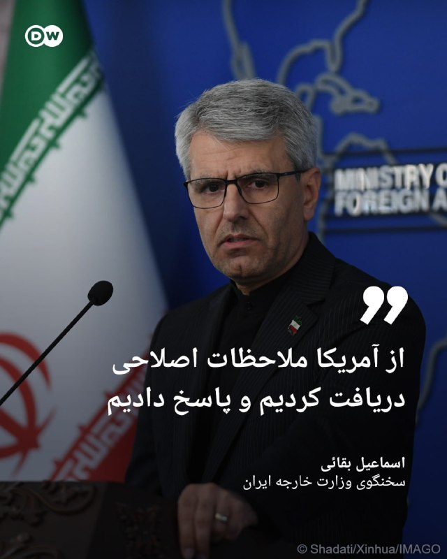

🔶بقائی: از آمریکا ملاحظات اصلاحی دریافت کردیم و پاسخ دادیم

اسماعیل بقائی، سخنگوی وزارت خارجه ایران، روز دوشنبه ۲۸ اردیبهشت در نشست خبری هفتگی خود اظهار داشت تهران در حال "مذاکره و تدوین سازوکاری" با عمان در رابطه با تردد کشتی‌ها از تنگه هرمز است.

او افزود: «هفته گذشته دیداری بین بخش‌های کارشناسی در مسقط برگزار شد، در این باره به صورت مفصل و مستمر صحبت شده است و تماس‌ها ادامه دارد.»

بقائی در پاسخ به پرسشی در مورد گزارش‌ها مبنی بر دریافت هزینه برای تردد از تنگه هرمز، طرح چنین امری را "انحراف از اصل موضوع" خواند اما با این حال دریافت هزینه را رد نکرده و گفت: «طبیعی است که هر کشور ساحلی بابت خدماتی که ارائه می‌دهد هزینه‌هایی را دریافت کند اما اصل موضوع اطمینان از تردد ایمن و اقدام برای حفظ امنیت ملی است. اینکه ایران و عمان به عنوان دو کشور ساحلی سازوکاری را بر اساس حقوق بین‌الملل برای تردد ایمن ایجاد کنند، حتما انجام این امر هزینه‌هایی را در پی دارد.»

@dw_farsi

## DW_Farsi — post 124819

  

📸 عکس روز: اهتزاز پرچم رنگین‌کمان در پارلمان آلمان

۱۷ مه روز جهانی "مقابله با نفرت‌پراکنی علیه همجنس‌گرایان، دوجنس‌گرایان، میان‌جنسی‌ها، ترنس‌ها و افراد بی‌جنس‌گرا" است. به همین مناسبت، در این روز پرچم رنگین‌کمان، به عنوان مشهورترین نماد این جامعه بزرگ، بر فراز ساختمان پارلمان آلمان (بوندستاگ) در برلین به اهتزاز درآمد؛ همتراز با پرچم آلمان و اتحادیه اروپا.

@dw_farsi

## DW_Farsi — post 124818

  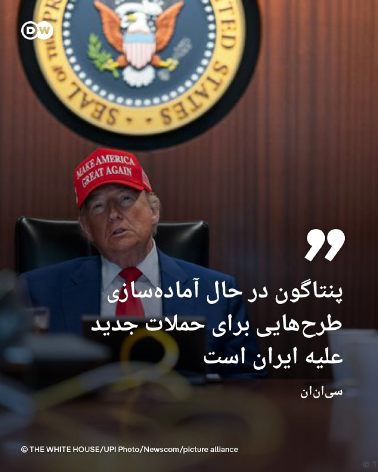

🔶 سی‌ان‌ان: پنتاگون در حال آماده‌سازی طرح‌هایی برای حملات جدید علیه ایران است

شبکه خبری "سی‌ان‌ان" به نقل از یک منبع آگاه گزارش داد دونالد ترامپ روز شنبه ساعاتی پس از بازگشت از سفر به چین، نشستی را با تیم امنیت ملی خود درباره گام‌های احتمالی بعدی واشنگتن در قبال ایران برگزار کرده است.

این جلسه در باشگاه گلف "ویرجینیا" رئیس جمهور آمریکا برگزار شد و جی‌دی‌ ونس معاون رئیس جمهور، مارکو روبیو وزیر خارجه، جان رتکلیف رئیس سیا و استیو ویتکاف فرستاده ویژه ترامپ در آن شرکت داشته‌اند.

به نوشته سی‌ان‌ان، ترامپ و تیم او در جریان سفر به پکن تصمیم‌گیری در مورد نحوه ادامه مسیر با ایران را به تعویق انداختند زیرا به گفته چند مقام دولتی، آنها به دنبال این بودند که ابتدا نتیجه گفت‌وگوهای ترامپ با شی جین‌پینگ، رئیس جمهور چین مشخص شود. چین روابط نزدیکی با جمهوری اسلامی دارد و با محکوم کردن جنگ آمریکا و اسرائیل خواستار دستیابی به راه‌حلی مسالمت‌آمیز شده است.

@dw_farsi

## DW_Farsi — post 124817

  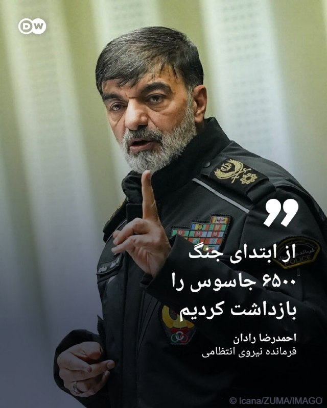

🔶 از ابتدای جنگ ۶۵۰۰ جاسوس را بازداشت کردیم

احمدرضا رادان، فرمانده نیروی انتظامی، گفته است که از آغاز جنگ آمریکا و اسرائیل با ایران، "بیش از ۶۵۰۰ نفر" به اتهام "وطن‌فروشی و جاسوسی" بازداشت شده‌اند. او مدعی شد از میان بازداشت‌شدگان ۵۶۷ نفر به طور خاص به "نفاق، اشرار و گروهک‌های ضدانقلاب" مرتبط بوده‌اند.

مقامات جمهوری اسلامی در هفته‌های گذشته از بازداشت شماری از شهروندان به اتهام "جاسوسی و همکاری با دشمن" از جمله به دلیل ارسال اطلاعات، فیلم یا حتی فعالیت در شبکه‌های اجتماعی خبر داده‌اند، در حالی‌که هیچ جزئیات دقیقی در مورد هویت بازداشت‌شدگان، نوع اتهام‌ها و روند قضایی رسیدگی به پرونده‌ آنان ارائه نکرده‌اند.

رادان همچنین اضافه کرده است که "دستگیری سربازان دشمن و وطن‌فروشان" در اعتراضات سراسری دی‌ماه ۱۴۰۴ که او با عنوان "اغتشاشات" از آن یاد کرده، همچنان ادامه دارد و پلیس اقدامات خود را متوقف نکرده است.

@dw_farsi

## DW_Farsi — post 124816

  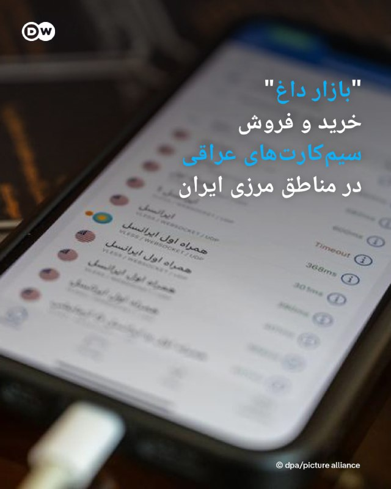

🔶 "بازار داغ" خرید و فروش سیم‌کارت‌های عراقی در مناطق مرزی ایران

همزمان با گذشت ۸۰ روز از قطعی سراسری اینترنت در ایران، گزارش‌ها حاکی از شکل‌گیری بازار خرید و فروش سیمکارت‌های عراقی در برخی مناطق مرزی کشور است.

روزنامه "ایران" روز دوشنبه ۲۸ اردیبهشت (۱۸ مه) در گزارشی نوشت بخش مهمی از متقاضیان این سیمکارت‌ها بازرگانانی هستند که به دلیل ارتباطات شغلی، ارسال اسناد تجاری، حواله‌های مالی و هماهنگی‌های لجستیکی با طرف‌های تجاری خود به اینترنت نیاز دارند.

طبق این گزارش، سیمکارت‌های عراقی در مقایسه با فیلترشکن‌هایی که در بازار سیاه اینترنت ایران عرضه می‌شوند، ارزانتر هستند و در برخی نقاط مرزی مانند شلمچه، چذابه و قصرشیرین سیگنال اپراتورهای عراقی تا حدود یک تا دو کیلومتر داخل خاک ایران قابل دریافت است.

نت‌بلاکس که در زمینه پایش، تحلیل و مستندسازی وضعیت اینترنت در جهان فعالیت می‌کند، پیش‌تر عدم دسترسی مردم به شبکه‌های بین‌المللی را موجب از دست رفتن گسترده مشاغل و بیکاری کارگران و کارفرمایان مستقل دانسته و هشدار داده بود این وضعیت عملا "موجب انتقال ثروت به گروه‌های همسو با حکومت می‌شود".

@dw_farsi

## DW_Farsi — post 124815

🔶 جام ۱۹۶۶؛ اوزه‌بیو؛ "پلنگ سیاه" عالم فوتبال

اوزه‌بیو، "پلنگ سیاه" پرتغال، تنها یک بار در جام جهانى فوتبال حضور یافت، اما همین یک بار کافى بود تا این مهاجم ۲۴ ساله با گل‌هایی سرنوشت‌ساز و درخششى کم‌نظیر نام خود را در دفتر تاریخ جام جهانی ابدی سازد.

اوزه‌بیو که به "پلنگ سیاه" مشهور بود، تبار موزامبیکی داشت و در ۲۵ ژانویه ۱۹۴۲ در این کشور به دنیا آمد. از او به‌عنوان بهترین فوتبالیست تاریخ پرتغال یاد می‌شود. اوزه‌بیو را یکی از خطرناک‌ترین مهاجمان تاریخ فوتبال می‌دانند.

او در فهرست بهترین فوتبالیست‌های قرن در جایگاه نهم قرار دارد. اوزه‌بیو با زدن ۹ گل برای پرتغال در مسابقات جام جهانی ۱۹۶۶ انگلیس، آقای گل شد و نام خود را در تاریخچه این رقابت‌ها برای همیشه ثبت کرد.

در دور گروهی جام جهانى، تیم پرتغال موفق شد، ۳ بر ۱ مجارستان را مغلوب کند، ۳ بر صفر از سد بلغارستان بگذرد و ۳ بر ۱ هم برزیل، یعنى مدافع عنوان قهرمانى را به زانو در آورد.

جالب توجه این که اوزه‌بیو در دیدار پرتغال در مقابل برزیل، دو بار دروازه پله و یارانش را باز کرد.

پرتغال با این پیروزی‌هاى قاطع به مرحله یک چهارم نهایى راه پیدا کرد و به مصاف تیمى رفت که همگى را شگفت‌زده کرده بود: کره شمالی.

بازیکنان کره شمالی در حضور ۵۰ هزار تماشاگر حاضر در استادیوم لیورپول در عرض ۲۵ دقیقه اول بازى ۳ گل به پرتغال زدند.

بعد از این دقایق، تیم پرتغال کم کم از خواب بیدار شد و ناممکن را ممکن کرد.

اوزه‌بیو در این دیدار ۴ گل به ثمر رساند و در نهایت نقشى سرنوشت‌ساز در پیروزى ۵ بر ۳ پرتغال بر کره شمالی داشت.

@dw_farsi

## DW_Farsi — post 124814

  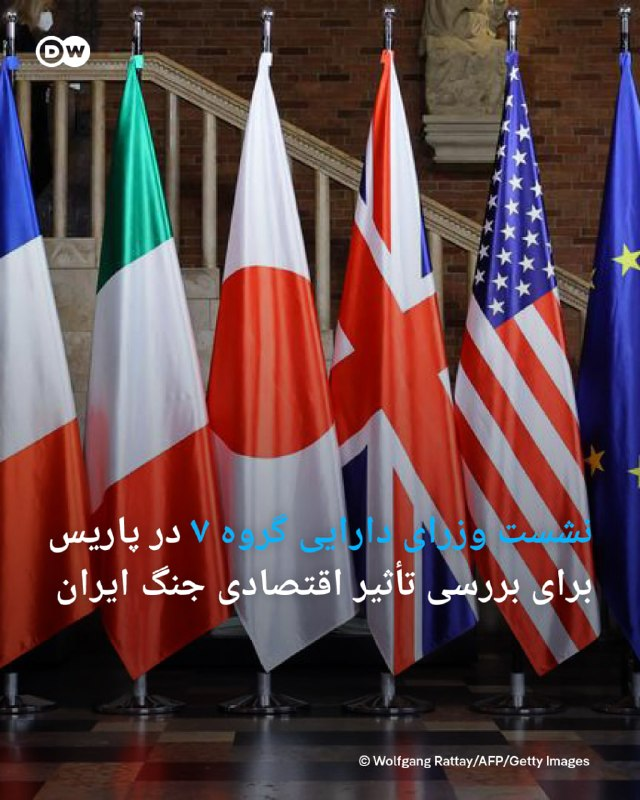

🔶 نشست وزرای دارایی گروه ۷ در پاریس برای بررسی تأثیر اقتصادی جنگ ایران

وزرای دارایی کشورهای گروه هفت (جی‌ ۷) روز دوشنبه در پاریس گردهم می‌آیند تا در مورد تأثیر اقتصادی جنگ ایران و مسدود ماندن تنگه هرمز گفت‌وگو و رایزنی کنند.

در این مذاکرات که تا روز سه‌شنبه ادامه خواهد یافت، همچنین حمایت از اوکراین، عدم تعادل در تجارت جهانی، تأمین مواد اولیه حیاتی، تأمین مالی کشورهای در حال توسعه و تلاش‌ها برای مبارزه با تأمین مالی تروریسم و ​​جرایم سازمان‌یافته موضوعاتی خواهند بود که در دستور کار قرار دارند.

لارس کلینگ‌بایل، وزیر دارایی آلمان، پیش از عزیمت به پاریس برای شرکت در این جلسه، نسبت به پیامدهای اقتصادی جنگ آمریکا و اسرائیل با ایران و احتمال بسته‌شدن طولانی مدت تنگه هرمز هشدار داده و آن را "تهدیدی جدی برای اقتصاد جهانی" خواند.

او تأکید کرد باید همه تلاش‌ها انجام شود تا این درگیری به طور دائمی به پایان برسد و مسیرهای آزاد دریایی تضمین شوند.

@dw_farsi

## Persian_Trend_Official — post 14403

⭕️ سخنگوی دولت: اینترنت پرو مصوبۀ شورای‌عالی امنیت ملی است که آقای رئیس‌جمهور ریاست آن را برعهده دارد 💢پاسخ مهاجرانی به اصرار یک خبرنگار دربارۀ وضعیت اینترنت: در شرایطی که ترامپ اعلام می‌کند آتش‌بس به دستگاه تنفس مصنوعی وصل است پاسخ شما چیست؟! 💢در خصوص اینترنت…

## Persian_Trend_Official — post 14402

  <a href="telegram/content/Persian_Trend_Official_14402_1779097962.mp4" target="_blank">🎬 Download video</a>

🔴 ورود نیروی دریایی اسرائیل به عملیات در میانه دریا برای مقابله با شکستن محاصره

💢منابع عبری از آغاز عملیات یگان ۱۳ نیروی دریایی اسرائیل علیه کاروانی خبر می‌دهند که در مسیر غزه در حرکت بوده است. این عملیات در فاصله صدها مایلی از سواحل فلسطین اشغالی انجام شده و طبق گزارش‌ها، هدف آن توقیف یا کنترل کامل کاروان بوده است.

💢بر اساس اطلاعات اولیه، این کاروان شامل ۵۸ شناور بوده که بخشی از آن‌ها به سازمان ترکیه‌ای «آی‌اچ‌اچ» نسبت داده شده‌اند؛ همان مجموعه‌ای که در ماجرای کشتی مرمره نیز نقش داشت.

گزارش‌ها حاکی است صدها نفر در این کاروان حضور دارند و ده‌ها تن از آن‌ها شهروند ترکیه هستند؛ موضوعی که می‌تواند ابعاد سیاسی و امنیتی ماجرا را پیچیده‌تر کند.

💢منابع اسرائیلی، این عملیات را یکی از پرریسک‌ترین مأموریت‌های دریایی سال‌های اخیر توصیف کرده‌اند.

🫆:Tony

📌 @persian_trend_official
پرشین ترند | متفاوت‌ترین کانال نظامی

## Persian_Trend_Official — post 14401

حضرتی: گشایش اینترنت بین الملل سیاست قطعی دولت است 🔹«فیلترینگ» امنیت سایبری کشور را به مخاطره انداخته است. رئیس شورای اطلاع رسانی دولت تأکید کرد: 🔹سیاست قطعی و بدون عقب نشینی دولت گشایش اینترنت بین‌الملل و رفع فیلترینگ است و تا کنون سه جلسه از سوی شورای…

## Persian_Trend_Official — post 14400

  <a href="telegram/content/Persian_Trend_Official_14400_1779097963.webm" target="_blank">🎬 Download video</a>

حضرتی: گشایش اینترنت بین الملل سیاست قطعی دولت است

🔹«فیلترینگ» امنیت سایبری کشور را به مخاطره انداخته است.

رئیس شورای اطلاع رسانی دولت تأکید کرد:
🔹سیاست قطعی و بدون عقب نشینی دولت گشایش اینترنت بین‌الملل و رفع فیلترینگ است و تا کنون سه جلسه از سوی شورای راهبردی و سیاست‌گذاری اینترنت کشور توسط معاون اول رئیس‌جمهور برگزار شده است.

🫆:Tony

📌 @persian_trend_official
پرشین ترند | متفاوت‌ترین کانال نظامی

## Persian_Trend_Official — post 14399

  

این اتفاق داره واسه مقاومت عراق داستان میشه !

## Persian_Trend_Official — post 14398

  

طرز تهیه چای کرک

چای کرک یکی از نوشیدنی‌های محبوب عمان و کشورهای خلیج فارس است؛ چایی غلیظ، معطر، شیرین و خامه‌ای که معمولاً با هل و شیر درست می‌شود و طعم خیلی خاصی دارد.

مواد لازم
آب: ۱ لیوان
شیر: ۱ لیوان
چای سیاه: ۱ تا ۲ قاشق چای‌خوری
شکر: ۱ تا ۲ قاشق غذاخوری، بسته به ذائقه
هل: ۳ تا ۴ عدد، کمی کوبیده‌شده
زعفران: مقدار خیلی کم، اختیاری
زنجبیل تازه یا پودر زنجبیل: مقدار کم، اختیاری
طرز تهیه

ابتدا آب را داخل قابلمه کوچک بریزید و روی حرارت قرار دهید تا به جوش بیاید. بعد چای سیاه، هل کوبیده‌شده و در صورت تمایل کمی زنجبیل یا زعفران را اضافه کنید.

اجازه دهید چای چند دقیقه بجوشد تا رنگ و عطر آن کاملاً آزاد شود. سپس شیر را اضافه کنید و حرارت را کمی پایین بیاورید. حالا شکر را هم اضافه کنید و خوب هم بزنید.

بگذارید مخلوط چای و شیر حدود ۵ تا ۷ دقیقه آرام بجوشد تا کمی غلیظ شود و طعم مواد کاملاً با هم ترکیب شود. در این مرحله اگر دوست دارید چای کرک غلیظ‌تر و مجلسی‌تر شود، می‌توانید مقدار کمی شیر تبخیرشده یا شیر غلیظ‌شده هم اضافه کنید.

در پایان چای را از صافی رد کنید و داغ سرو کنید.

نکته مهم

راز خوش‌طعم شدن چای کرک عمانی این است که چای و شیر چند دقیقه با هم بجوشند تا نوشیدنی حالت غلیظ، معطر و کرمی پیدا کند. هرچه هل تازه‌تر باشد، عطر چای بهتر می‌شود.

پ.ن: چون درخواست ها زیاد بود، طرز تهیش رو پست کردم. من که خیلی دوسش دارم، امیدوارم امتحان کنید و لذت ببرید.

## Persian_Trend_Official — post 14393

پست قابل تأمل ‌ترامپ که لحظاتی قبل در تروث سوشال منتشر کرده است. ☆Phantom☆ 📌 @persian_trend_official پرشین ترند | متفاوت‌ترین کانال نظامی

## Persian_Trend_Official — post 14392

  

⭕️جواد علیکردی؛ محکوم به ده سال زندان پس از پیگیری مرگ مشکوک برادرش

💢جواد علیکردی، شهروند اهل سبزوار و برادر خسرو علیکردی، وکیل دادگستری جان‌باخته، از سوی دستگاه قضایی جمهوری اسلامی به ۱۰ سال حبس تعزیری محکوم شد.

💢او اخیراً در یکی از شعب دادگاه انقلاب مشهد محاکمه شده و هم‌اکنون در زندان وکیل‌آباد مشهد در بازداشت به‌سر می‌برد. جزئیات دقیق اتهامات مطرح‌شده علیه او تاکنون منتشر نشده است.

خسرو علیکردی روز ۱۴ آذر ۱۴۰۴ در دفتر کار خود جان باخت. نهادهای حکومتی علت مرگ را «ایست قلبی» اعلام کردند، اما خانواده او با اشاره به شواهدی از جمله خونریزی غیرعادی، این روایت را نپذیرفتند و خواستار روشن‌شدن حقیقت شدند.

🫆:Tony

📌 @persian_trend_official
پرشین ترند | متفاوت‌ترین کانال نظامی

## Persian_Trend_Official — post 14391

⭕️ روزنامه ایران: در پی محدودیت دسترسی به اینترنت، بازار خرید سیم‌کارت‌های عراقی در برخی مناطق مرزی غرب شکل گرفته است.

در بعضی نقاط مرزی، سیگنال اپراتورهای عراقی تا دو کیلومتر داخل خاک ایران قابل دریافت است.

ارزان‌تر بودن این سیم‌کارت‌ها در مقایسه با هزینه فیلترشکن‌ها، به عنوان یکی از دلایل گرایش برخی به آن‌ها عنوان شده است.

استفاده از سیم‌کارت‌های خارجی می‌تواند چالش‌هایی را در حوزه نشت اطلاعات ایجاد کند.

📝 Nick

📌 @persian_trend_official
پرشین ترند | متفاوت‌ترین کانال نظامی

## Persian_Trend_Official — post 14390

  

پمپاژ ترس از سوی آقای ترامپ بیشتر شبیه یک بازی روانی و رسانه‌ای است. ۰ وقتی تنگه بسته باشد، ۰ وقتی قیمت بنزین در آمریکا تا ۵۰ درصد افزایش پیدا کند، ۰ وقتی از مذاکرات با چین دست خالی بازگشته باشند، طبیعی است که برای کنترل افکار عمومی، فضای ترس ایجاد کند. کسی که خودش تحت فشار است، تلاش می‌کند دیگران را بترساند تا اقتصادطرف مقابل دچار رکود و توقف شود، مردم از حرکت بایستند و نارضایتی اجتماعی شکل بگیرد؛ «ایران جای خوبی ایستاده ولی استفاده از این موقعیت مهم است و تدبیر لازم دارد در غیر این متضرر میشود» جنگ امروز جنگ هوش مصنوعی است و تفکر آموزش کلاشینکف در میادین و تلوزیون باید تبدیل به آموزش جوانان برای هوش مصنوعی شود٫ آن وقت خواهید دید جوانان کشور بدون تیر و موشک ٫ماهواره ها و اف ۳۵‌ها‌ را چگونه زمینگیر میکنند . مردم باید در آرامش باشند و زندگی کنند و جوانان راهبری و تفکر

بابک زنجانی

پ.ن : چی میشه کسی که با کیف کشی مسئولین، رانت و فساد تبدیل میشه به سرمایه دار، برای ما فاز استیو جابز برمیداره ؟

📌 @persian_trend_official
پرشین ترند | متفاوت‌ترین کانال نظامی

## Persian_Trend_Official — post 14389

  <a href="telegram/content/Persian_Trend_Official_14389_1779097965.webm" target="_blank">🎬 Download video</a>

💢خط نشان جدید دکتر مصطفی خوش چشم برای اسرائیل ▪️تهدید به استفاده از سلاحی ناشناخته ، مخرب و سری علیه این کشور 🫆:Tony 📌 @persian_trend_official پرشین ترند | متفاوت‌ترین کانال نظامی

## Persian_Trend_Official — post 14388

  <a href="telegram/content/Persian_Trend_Official_14388_1779097966.mp4" target="_blank">🎬 Download video</a>

💢خط نشان جدید دکتر مصطفی خوش چشم برای اسرائیل

▪️تهدید به استفاده از سلاحی ناشناخته ، مخرب و سری علیه این کشور

🫆:Tony

📌 @persian_trend_official
پرشین ترند | متفاوت‌ترین کانال نظامی

## Persian_Trend_Official — post 14387

💢کانال ۱۵ اسراییل

💢نتانیاهو به دلایل سیاسی و امنیتی خواستار لغو جلسه دادگاه امروز خود شد.

🫆:Tony

📌 @persian_trend_official
پرشین ترند | متفاوت‌ترین کانال نظامی

## Persian_Trend_Official — post 14386

🔴 حمله هوایی اسرائیل به جنوب لبنان

💢شبکه الحدث گزارش داد جنگنده‌های اسرائیلی منطقه «دیر الزهرانی» در جنوب لبنان را هدف حمله هوایی قرار داده‌اند.

همزمان ارتش اسرائیل اعلام کرد:

▪️ طی ۲۴ ساعت گذشته بیش از ۳۰ موضع متعلق به حزب‌الله را هدف قرار داده است
▪️ این حملات در مناطق مختلف جنوب لبنان انجام شده‌اند

🫆:Tony

📌 @persian_trend_official
پرشین ترند | متفاوت‌ترین کانال نظامی

## Persian_Trend_Official — post 14385

ترامپ! اگر تجربه اول را بتوان با تغافل، ناشی از جهالت دانست؛ حتی اگر تجربه دوم را بتوان با تساهل، ناشی از حقارت فرض کرد؛ تله سوم را حتی با احتیاط هم باید محصول سفاهت دانست. «یک بار جستی، ملخک! دوبار جستی، ملخک! آخر به دستی، ملخک!» حسام الدین آشنا 📌 @…

## Persian_Trend_Official — post 14384

  <a href="telegram/content/Persian_Trend_Official_14384_1779097967.mp4" target="_blank">🎬 Download video</a>

بیضه رو همه دارند آقای فرهانی
شماها عقل نداشتید
مشخصه که خودتون هم میدونید چه نجاستی تناول کردید اما مجبورید تا آخر مسیر سینه خیز برید !

📌 @persian_trend_official
پرشین ترند | متفاوت‌ترین کانال نظامی

## RadioFarda — post 157307

جنگ ایران «۲۵ میلیارد دلار» هزینه اضافی روی دوش شرکت‌های جهانی گذاشته است

🔸خبرگزاری رویترز در یک گزارش تحلیلی نوشته که جنگ آمریکا و اسرائیل با ایران تاکنون «دست‌کم ۲۵ میلیارد دلار» برای شرکت‌های سراسر جهان هزینه به بار آورده است.

🔸بر اساس این گزارش که روز دوشنبه ۲۸ اردیبهشت منتشر شد، آمده که این رقم همچنان در حال افزایش است.

🔸بررسی بیانیه‌های شرکت‌های ثبت‌شده در آمریکا، اروپا و آسیا از زمان آغاز حملات مشترک آمریکا و اسرائیل به ایران در ۹ اسفند پارسال، تصویری «نگران‌کننده» از پیامدهای آن ارائه می‌دهد؛ چرا که کسب‌وکارها به‌دلیل کنترل تنگه هرمز توسط ایران، با افزایش شدید قیمت انرژی، زنجیره‌های تأمین و مسیرهای تجاری دچار اختلال دست‌وپنجه نرم می‌کنند.

🔸تحلیل رویترز نشان می‌دهد دست‌کم ۲۷۹ شرکت اعلام کرده‌اند جنگ باعث شده که برای کاستن از اثرات مالی، اقدامات دفاعی از جمله افزایش قیمت‌ها و کاهش تولید انجام دهند. برخی دیگر نیز سود سهام یا برنامه‌های بازخرید سهام را متوقف کرده، کارکنان را به مرخصی اجباری فرستاده، هزینه اضافی سوخت اعمال کرده یا درخواست کمک اضطراری دولتی داده‌اند.

🔸نسخه کامل این گزارش را در وب‌سایت رادیوفردا بخوانید.

@RadioFarda

## RadioFarda — post 157306

  

🔸بنیاد نرگس محمدی اعلام کرد که این برنده جایزه صلح نوبل از بیمارستان مرخص شده است.

🔸خانم محمدی از یازدهم تا بیستم اردیبهشت در بخش مراقبت‌های ویژه بیمارستان موسوی زنجان و از بیستم تا ۲۷ اردیبهشت در همین بخش در بیمارستان پارس تهران بستری بود.

🔸او بیستم اردیبهشت، پس از ۱۵۰ روز بازداشت در مشهد و زنجان و پس از ۱۰ روز بستری در بیمارستانی در شهر زنجان، در پی تشدید فشارهای بین‌المللی از مرکز درمانی زنجان توسط آمبولانس به بیمارستان پارس تهران منتقل شد.

🔸بر اساس گزارش بنیاد نرگس محمدی، این فعال حقوق بشر، در بیمارستان، «تحت عمل آنژیوپلاستی و آزمایشات مربوط به اختلالاتِ شدید فشار خون از جمله Tilt Test قرار داشت».

🔸این بنیاد تأکید کرده که «طبق نظر پزشکان متخصص از جمله قلب و مغز، ضرورت بر تحت نظر و مراقبت‌های درمانی خاص برای او وجود دارد و تا یک ماه حداقل هر‌ روز در بیمارستان تحت فیزیوتراپی قرار خواهد داشت».

@RadioFarda

## RadioFarda — post 157305

  

🔸دونالد ترامپ، رئیس‌جمهور آمریکا می‌گوید مقامات حکومت ایران برای امضای توافق با آمریکا «می‌میرند».

🔸او در گفت‌و‌گو با نشریه تجاری «فورچون» افزوده با این حال آنها در جریان مذاکرات، «روی یک چیزی توافق می‌کنند»، اما «بعد یک کاغذی برایتان می‌فرستند که هیچ ارتباطی با توافقی که کرده‌اید ندارد. من می‌گویم: ‘شما دیوانه‌اید؟’»

🔸ترامپ در این گفت‌و‌گو همچنین بر این نکته تأکید کرده که مقامات جمهوری اسلامی «مدام فریاد می‌زنند» و سروصدا می‌کنند، اما در عمل «تشنه توافق» هستند.

🔸پیش از انتشار این گفت‌و‌گو، اسماعیل بقائی، سخنگوی وزارت خارجه ایران، گفته بود علی‌رغم این‌که طرف‌های آمریکایی به‌صورت علنی اعلام کردند طرح پیشنهادی ایران مردود است «اما ما از طرف میانجی پاکستانی مجموعه نکات و ملاحظات اصلاحی را از نظر آن‌ها دریافت کردیم».

🔸بقائی جزئیاتی در مورد اصلاحات مدنظر ایالات متحده ارائه نکرد.

@RadioFarda

## RadioFarda — post 157304

  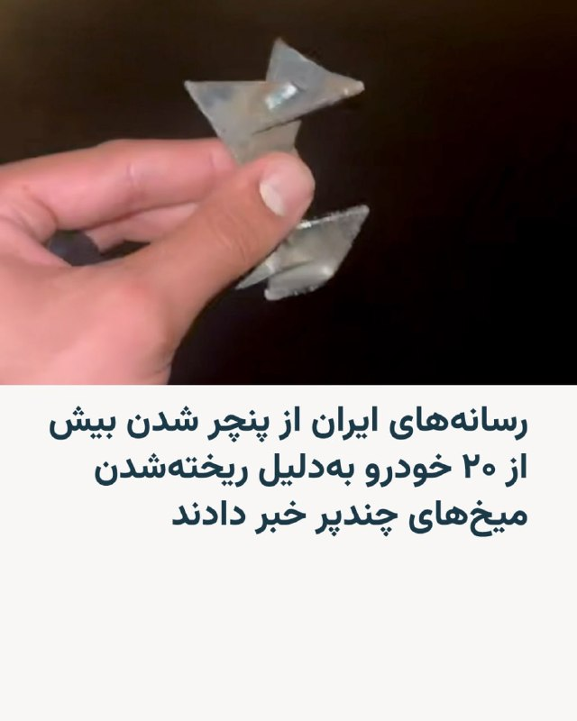

🔸رسانه‌های ایران روز دوشنبه ۲۸ اردیبهشت به نقل از یک «منبع آگاه» در نیروی انتظامی خبر دادند که «۲۴ دستگاه خودرو» به‌دلیل ریخته شدن میخ‌های چندپر در یک اتوبان پنچر شدند.

🔸بر اساس این گزارش، «راننده یک خودروی شوتی» یکشنبه‌شب «با هدف ایجاد اختلال در تردد و نارضایتی عمومی، اقدام به ریختن میخ‌های چندپر در مسیر اتوبان تهران-کرج کرد».

🔸این منبع افزوده که این اقدام موجب آسیب‌دیدگی لاستیک‌های ۲۴ دستگاه خودرو شد و خسارت‌هایی به اموال شهروندان وارد کرد.

🔸به گزارش رسانه‌های ایران، برای این راننده پرونده قضایی تشکیل شده «و پلیس راهور تهران بزرگ با استفاده از تصاویر دوربین‌های نظارتی، فرد خاطی را تحت تعقیب قرار داده است».

🔸پیشتر گزارش شده بود که ۴۰۰ خودرو در این حادثه پنچر شده‌اند ولی نیروی انتظامی می‌گوید که این رقم درست نیست.

🔸خبرگزاری فارس از آسیب دیدن ۲۰ خودرو خبر داده است.

@RadioFarda

## RadioFarda — post 157302

  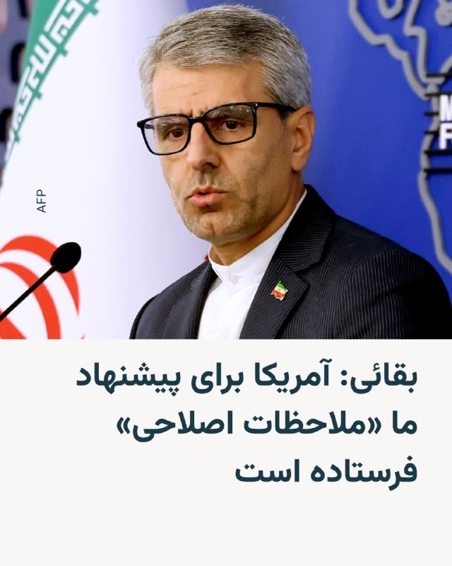

🔸سخنگوی وزارت خارجه ایران می‌گوید روند مذاکرات تهران و واشینگتن، «ادامه‌دار» است و حکومت ایران از ایالات متحده، «اصلاحاتی» در پاسخ به طرح پیشنهادی خود دریافت کرده است.

🔸اسماعیل بقائی در نشست خبری روز دوشنبه ۲۸ اردیبهشت گفت: هفته گذشته، علی‌رغم این‌که طرف‌های آمریکایی به‌صورت علنی اعلام کردند طرح پیشنهادی ایران مردود است «اما ما از طرف میانجی پاکستانی مجموعه نکات و ملاحظات اصلاحی را از نظر آن‌ها دریافت کردیم».

🔸او افزود ایران بعد از این‌که طرح ۱۴ بندی خود را ارائه کرد، «طرف آمریکایی ملاحظاتش را مطرح کرد. متقابلاً ما نیز ملاحظات خود را مطرح کردیم. از روز بعد از ارسال نقطه‌نظر آمریکایی از طرف پاکستان، ما با مجموعه‌ای از پیشنهادات طرف مقابل مواجه شدیم که در این چند روز بررسی شد».

🔸سخنگوی وزارت خارجه ایران به‌دلیل آنچه تبادل «نقطه‌نظرات متقابل» طرفین به یکدیگر نامیده، تأکید کرد که «بنابراین، روند [مذاکرات ]از طریق پاکستان ادامه دارد».

🔸بقائی جزئیاتی در مورد اصلاحات مدنظر ایالات متحده ارائه نکرد.

@RadioFarda

## RadioFarda — post 157301

🔸هم‌زمان با پخش برنامه‌های آموزشی نظامی در صداوسیما ویدئوهایی از آموزش کار با اسلحه برای کودکان و زنان در خیابان‌های تهران منتشر شده است.

🔸پیش از این گزارش‌هایی از استفاده از کودکان در ایست‌های بازرسی منتشر شده بود. این در حالی است که بر اساس قوانین بین‌الملل، به‌کارگیری افراد زیر ۱۵ سال در درگیری‌های نظامی ممنوع است و دیوان کیفری بین‌المللی جذب کودکان در جنگ را «جنایت جنگی» می‌داند.

🔸در روزهای گذشته تلویزیون حکومتی ایران با حضور کارشناسان نظامی اقدام به آموزش کار با انواع اسلحه از کلاشنیکف تا تیربار را آغاز کرده است.

🔸در همین حال اعلام شده است که ۵۰ مسجد در تهران آموزش‌های نظامی به زنان و مردان را در دستور کار قرار داده‌اند و مقرهایی در میادین پایتخت برای پاسخ‌گویی به پرسش‌های علاقه‌مندان برپا شده است.

@RadioFarda

## RadioFarda — post 157300

عفو بین‌الملل: ایران در سال ۲۰۲۵ شمار «‌بی‌سابقه‌ای» از افراد را اعدام کرد

🔸سازمان عفو بین‌الملل روز دوشنبه ۲۸ اردیبهشت گزارش داد که ایران در سال ۲۰۲۵ تعداد «بی‌سابقه» دو هزار و ۱۵۹ نفر را اعدام کرده است؛ رقمی که باعث افزایش آمار جهانی تا بالاترین سطح از سال ۱۹۸۱ به این سو شده است.

🔸این سازمان مستقر در لندن اعلام کرد که در سال ۲۰۲۵ دست‌کم دو هزار و ۷۰۷ نفر در سراسر جهان اعدام شده‌اند، هرچند اعدام‌های انجام‌شده در چین در این آمار لحاظ نشده است.

🔸عفو بین‌الملل گفت «هزاران اعدام» در چین، که بیشترین استفاده را از مجازات اعدام در جهان دارد، انجام شده، اما جزئیات به‌دلیل «محرمانه بودن داده‌های دولتی» در این کشور کمونیستی نامشخص است.

🔸این سازمان افزود که آمار جهانی سال ۲۰۲۵، شامل اعدام‌ها در عربستان سعودی، کویت، مصر، یمن، سنگاپور و ایالات متحده، نسبت به مجموع سال ۲۰۲۴ بیش از دو سوم افزایش داشته است.

🔸در این گزارش آمده است: «این روند بیشترین شدت را در کشورهایی داشته که مقامات در آن‌ها با محدود کردن فضای مدنی، خاموش کردن صداهای مخالف و بی‌اعتنایی به حمایت‌های مقرر در قوانین و استانداردهای بین‌المللی حقوق بشر، کنترل خود بر قدرت را تشدید کرده‌اند».

🔸به نوشته عفو بین‌الملل، «افزایش بی‌سابقه اعدام‌های ثبت‌شده در ایران» در حالی رخ داده که مقام‌های جمهوری اسلامی، به‌ویژه پس از جنگ ۱۲ روزه تابستان پارسال با اسرائیل، «استفاده از مجازات اعدام را به‌عنوان ابزاری برای سرکوب و کنترل سیاسی تشدید کرده‌اند».

🔸عفو بین‌الملل و دیگر گروه‌های حقوق بشری گفته‌اند که پس از اعتراضات گسترده ضدحکومتی در دی‌ماه پارسال و همچنین پس از آغاز جنگ با اسرائیل و ایالات متحده در اسفندماه، استفاده از مجازات اعدام در ایران افزایش یافته است.

🔸نسخه کامل این گزارش را در وب‌سایت رادیوفردا بخوانید.

@RadioFarda

## RadioFarda — post 157299

  

🔸فرمانده نیروی انتظامی جمهوری اسلامی می‌گوید از آغاز جنگ حدود «شش هزار و ۵۰۰» نفر با اتهاماتی که او آن را «وطن‌فروشی و جاسوسی» نامیده، بازداشت شده‌اند.

🔸احمدرضا رادان مدعی شده که ۵۶۷ نفر از این افراد «مرتبط با نفاق، اشرار و گروهک‌های ضدانقلاب بودند».

🔸این فرمانده پلیس توضیحی درباره علت حضور این تعداد به گفته او «جاسوس» در کشور علی‌رغم ادعاهای مقام‌های جمهوری اسلامی مبنی بر «اشراف اطلاعاتی نیروهای امنیتی» ارائه نکرده است.

🔸رادان افزوده که «دستگیری سربازان دشمن و وطن‌فروشان» در اعتراضات دی‌ماه پارسال که او آن را «اغتشاشات» نامیده، نیز «همچنان ادامه دارد».

🔸جمهوری اسلامی پس از سرکوب خونین اعتراضات دی‌ماه ۱۴۰۴، با آغاز جنگ، شماری از بازداشت‌شدگان آن زمان را به بهانه‌های مختلفی از جمله «جاسوسی» برای اسرائیل اعدام کرده است.

@RadioFarda

## IranianMinds — post 20325

🔴 بلومبرگ به نقل از تصاویر ماهواره‌ ای:

حدود ۲۳ نفتکش نزدیک جزیره خارک رصد شدند که این بزرگ‌ترین تجمع از زمان شروع محاصره آمریکا است.

@IranianMinds

## IranianMinds — post 20324

  

🔴 ترامپ :

ایرانی‌ها همیشه فریاد می‌زنند.

آن‌ها مشتاق امضای توافق هستند، اما بعد مدارکی می‌فرستند که هیچ ربطی به آنچه توافق کرده‌ایم ندارد.

من میگویم: شماها دیوانه‌اید؟

@IranianMinds

## IranianMinds — post 20323

  <a href="telegram/content/IranianMinds_20323_1779097971.webm" target="_blank">🎬 Download video</a>

💥 با هر ثبت نام 
🅰️
🅰️
🅰️ هزار تومن جایزه بگیرید

✔️ میتونید شرط‌بندی کنید و بونوس را به موجودی واقعی تبدیل کنید

⚽️  پوشش کامل مسابقات ورزشی 

💯  پیش‌بینی با بهترین ضرایب 

⭐️ تجربه سریع و حرفه‌ای

💰پرداخت مستقیم و سریع بدون واسطه، بدون دردسر، واریز و برداشت در سریع‌ترین زمان ممکن

☑️ کانال تلگرام: 

➡️ @winro_io  

🎁 هدیه خود را با ثبت نام در سایت دریافت کنید: 

➡️ Winro.io
R28
سایت اصلی در روزهای آینده بازگشایی خواهد شد
💎

## IranianMinds — post 20321

  

🔴 ارتش اسرائیل یک‌ بمب قوی جدید رو در‌ نزدیکی شهر بیت شمس اورشلیم آزمایش کرد

@IranianMinds

## IranianMinds — post 20320

🔴 ترامپ :

ایرانیا دارن برای توافق بهم التماس میکنن.

@IranianMinds

## IranianMinds — post 20319

  

🔴 ترامپ :

ایرانی ها به شدت خواهان توافق هستند و از جنگ میترسند !

@IranianMinds

## IranianMinds — post 20318

🔴 سازمان ملل :

نگرانیم …

@IranianMinds

## IranianMinds — post 20317

🔴 پاکستان:

ما یک پیشنهاد اصلاح‌ شده ایران را به آمریکا برای پایان دادن به جنگ ارائه دادیم

@IranianMinds

## IranianMinds — post 20316

  <a href="telegram/content/IranianMinds_20316_1779097972.mp4" target="_blank">🎬 Download video</a>

🔴 اومدن مساجد رو پادگان کردن و هرچی اورانگوتان بسیجی هست و میبرن و بهش آموزش نظامی میدن که چطوری مردمو بکشن و ازش یه گزارش درست کردن تو‌ صداوسیما هم پخشش کردن !

بعد کافیه یه مسجد بمبارون شه همینا بیان زار بزنن بگن وای مناطق غیرنظامی زدن مکان مقدسو‌ هدف قرار دادن 😭

@IranianMinds

## IranianMinds — post 20315

🔴 خبرگزاری فارس :

باید کابل های اینترنت فیبر نوری در تنگه هرمز رو نابود کنیم و با انفجار موشک‌ در‌ مدار لئو‌ اینترنت استارلینک رو هم قطع کنیم

@IranianMinds

## IranianMinds — post 20314

  

🔴 نبویان عضو کمیسیون امنیت ملی مجلس :

بزودی میخوایم‌ توی مجلس با رای نماینده ها یه جایزه ی بزرگ‌ بزاریم روی سر ترامپ و نتانیاهو که هرکسی اینارو‌ ترور کنه یه پول خیلی بزرگی بهش بدیم

و اگه دوباره به ما حمله کنن هم خودشونو کاخ هاشونو نابود میکنیم

@IranianMinds

## IranianMinds — post 20313

🔴 آکسیوس :

آتش‌بس در آستانه فروپاشی است، و‌ درگیری هر لحظه ممکن است دوباره شروع شود

@IranianMinds

## BBCPersian — post 281369

  

🔻تیم ملی فوتبال ایران صبح امروز با حضور ۲۲ بازیکن و اعضای کادر فنی برای برگزاری یک بازی دوستانه عازم آنتالیا در ترکیه شد.

این بازی دوستانه قرار است آخرین مسابقه تیم ملی با هدف آماده‌سازی برای حضور در جام جهانی و سفر به ایالات متحده باشد.

۲۲ بازیکن اعزام شده به ترکیه، بازکنان شاغل در باشگاه‌های داخلی ایران هستند.

امیر قلعه‌نویی، سرمربی تیم فوتبال ایران، گفته است که ۲۸ فوتبالیست برای حضور در تیم ملی انتخاب شده‌اند و ابراز امیدواری کرده که به همه آنها روادید ورود به آمریکا داده شود.

دو روز پیش مهدی تاج، رئیس فدراسیون فوتبال ایران، در استانبول با ماتیاس گرافستروم، دبیر کل فیفا، دیدار و گفت‌گو کرد.

آقای تاج گفت که در این دیدار مقامات فیفا به «۱۰ نکته‌ای که ایران مطرح کرد، گوش دادند و برای هر یک از آنها راه‌ حل ارائه کردند.»

او ابراز امیدواری کرد که تیم ملی فوتبال ایران بتواند بدون هیچ مشکلی به جام جهانی برود.

قرار است ایران هر سه بازی مرحله گروهی جام جهانی را در ایالات متحده برگزار کند.
@BBCPersian
📷IRAN MEDIA

## BBCPersian — post 281368

🔻نشست وزرای دارایی گروه هفت زیر سایه نگرانی‌ها از خطرات تورمی جنگ ایران

وزرای دارایی هفت کشور صنعتی جهان، موسوم به گروه هفت، در تلاش برای یافتن راه حلی برای پیامدهای تورمی جنگ ایران، امروز در پاریس دیدار می‌کنند.

این جلسه در حالی برگزار می‌شود که نگرانی از خطرات تورمی جنگ ایران، باعث فروش گسترده اوراق قرضه دولتی شده است.

اوراق قرضه، از توکیو گرفته تا نیویورک، روز دوشنبه به افت ارزش خود ادامه دادند؛ افت ارزش این اوراق قرضه به معنای افزایش نرخ بهره آنهاست که نشان می‌دهد

سرمایه‌گذاران به دلیل نگرانی از افزایش قیمت انرژی و تشدید تورم، پیشبینی می‌کنند که نرخ بهره بانکی افزایش خواهد یافت.

وزیر دارایی فرانسه، در پاسخ به این سوال که آیا بازارهای اوراق قرضه در حال فروپاشی هستند، گفت: «آنها در حال اصلاح قیمت هستند، من آن را فروپاشی توصیف نمی‌کنم.»

وزارت دارایی فرانسه گفت که در این نشست نمایندگانی از بانک‌های مرکزی گروه هفت نیز حضور خواهند داشت.

@BBCPersian

## BBCPersian — post 281367

🔻بقایی: بر سر حق غنی‌سازی گفت‌وگو یا مصالحه نمی‌کنیم

سخنگوی وزارت خارجه ایران درباره غنی‌سازی گفت: «آنچه با قطعیت می‌شود گفت بحث حق موضوعی نیست که ما بر سر آن گفتگو یا مصالحه کنیم. حق ایران برای غنی‌سازی بر اساس معاهده عدم اشاعه (ان‌پی‌تی) به رسمیت شناخته شده است.»

آقای بقایی در پاسخ به سوالی درباره پنج شرط آمریکا در برابر پنج شرط ایران گفت که ما مطالباتمان روشن است. مثلا درباره آزادشدن دارایی‌های ایران «شما می‌گویید این شرط ماست ما می‌گوییم این مطالبه ماست.»

او گفت که «آمریکا در سطح بین‌المللی دیگر معتبر تلقی نمی‌شود» و «کشورهای منطقه به شمول امارات باید درس بگیرند از اتفاقات ماه‌های اخیر که دیدند حضور آمریکا منجر به امنیت منطقه نشده است و آن را در مخاطره جدی قرار می‌دهد.»

@BBCPersian

## BBCPersian — post 281366

🔻بقایی: مذاکرات با میانجی پاکستانی ادامه دارد

اسماعیل بقایی، سخنگوی وزارت خارجه ایران، در نشست خبری هفتگی درباره مفاد پیشنهاد آمریکا گفت که ما وقتی طرح ۱۴ بندی را دادیم، طرف آمریکایی ملاحظاتش را مطرح کرد و ما هم متقابلا ملاحظاتمان را مطرح کردیم:

«هفته گذشته علیرغم اینکه طرف آمریکایی به‌صورت علنی اعلام کردند که این طرح [۱۴ بندی] مردود است ما از طریق میانجی پاکستانی مجموعه نکات و ملاحظات اصلاحی آنها را دریافت کردیم. روز بعد از ارسال طرح‌مان، با مجموعه‌ای از پیشنهادات طرف مقابل مواجه شدیم، در این چند روز بررسی شد و متقابلا پاسخ ما ارائه شده است و مذاکرات با میانجی پاکستانی ادامه دارد.»

@BBCPersian

## BBCPersian — post 281365

🔻کویت و قطر، حملات پهپادی به عربستان را محکوم کردند

کویت و قطر در بیانیه‌هایی جداگانه، حملات پهپادی به عربستان سعودی را که مقام‌ها گفته‌اند از حریم هوایی عراق انجام شده، به‌شدت محکوم کرده‌اند.

کویت اعلام کرده است که این اقدام نقض قطعنامه شورای امنیت سازمان ملل است که برای حفاظت از زیرساخت‌های خلیج فارس تصویب شد.

کویت ز اقدامات عربستان برای حفظ امنیتش حمایت کرد.

قطر نیز این حمله را «تجاوزی مردود» و نقض آشکار حاکمیت عربستان توصیف کرد.

هر دو کشور همبستگی کامل خود را با ریاض اعلام و از هرگونه اقدام برای حفاظت از خاک و شهروندان عربستان حمایت کردند.

این بیانیه‌ها پس از آن منتشر شده است که عربستان سعودی اعلام کرد سامانه‌های پدافند هوایی این کشور سه پهپاد مهاجم را رهگیری کرده‌اند.

@BBCPersian

## BBCPersian — post 281364

🔻قوه قضائیه اموال ۱۲۹ نفر را در آذربایجان غربی توقیف کرد

با ادامه توقیف اموال چهره‌های مخالف جمهوری اسلامی، قوه قضائیه در این کشور اعلام کرده که اموال ۱۲۹ نفر را در آذربایجان غربی توقیف کرده است.

این نهاد می‌گوید دارایی‌های توقیف شده متعلق به «سرکردگان گروهک‌های ضد انقلاب و تجزیه‌طلب» در استان آذربایجان غربی بوده و مالکان این اموال را به «همدستی با آمریکا و اسرائیل»متهم کرده است.

جزئیات روند دادرسی منجر به توقیف اموال این افراد هنوز مشخص نیست.

با شدت گرفتن ضبط اموال افرادی که در میان آنها طیف وسیعی از اقشار جامعه از خبرنگار تا بازیگران سابق و فعالان سیاسی و هنرمند، دیده می‌شوند.

فعالان مجازی حامی جمهوری اسلامی در جریان جنگ اخیر، اقدام به فراخوان‌هایی برای معرفی مخالفان جمهوری اسلامی که آنها را «حامی جنگ» نامیدند، کرده بودند.

پس از اعتراضات دی ماه و کشتار معترضان، شمار زیادی از شهروندان ایرانی در خارج از کشور در تجمعات اعتراضی در شهرهای مختلف شرکت کردند که این اعتراضات در هفته‌های منتهی به جنگ و بعد از آن هم ادامه یافت.

قوه قضائیه پس از جنگ آمریکا و اسرائیل با ایران، با استناد به قانون «تشدید مجازات جاسوسی» معترضان و مخالفان را به «همراهی با دشمن» متهم کرد.

اما این توقیف‌ها به موضوع جنگ محدود نیست؛ در زمان اعتراضات دی ماه هم اموال بعضی از چهره‌های شناخته شده در داخل ایران هم ضبط شد.

@BBCPersian

## idfinfarsi — post 11593

  <a href="telegram/content/idfinfarsi_11593_1779097979.mp4" target="_blank">🎬 Download video</a>

‼️ارتش اسرائیل یک تروریست از سازمان تروریستی حماس را که قصد اجرای طرح‌های تک‌تیراندازی علیه نیروهای ارتش اسرائیل در آینده نزدیک داشت، به هلاکت رساند

🔻یک هواگرد نیروی هوایی، با هدایت نیروهای لشکر غزه (۱۴۳)، دیروز (یکشنبه) یک تروریست از سازمان تروریستی حماس را که در حال پیشبرد طرح‌های تک‌تیراندازی در آینده نزدیک علیه نیروهای ارتش اسرائیل در جنوب نوار غزه بود، به هلاکت رساند.

🔻این تروریست تهدیدی فوری برای نیروهای ارتش اسرائیل محسوب می‌شد و به‌صورت هدفمند برای رفع این تهدید به هلاکت رسید.

🔻پیش از حمله، اقداماتی برای کاهش آسیب به غیرنظامیان انجام شد، از جمله استفاده از مهمات دقیق و دیدبانی هوایی.

🔻نیروهای ارتش اسرائیل تحت فرماندهی جبهه جنوب مطابق با توافق مستقر هستند و به فعالیت برای رفع هرگونه تهدید فوری ادامه خواهند داد.

## idfinfarsi — post 11592

‼️ارتش اسرائیل بیش از ۳۰ زیرساخت متعلق به سازمان تروریستی حزب‌الله را در جنوب لبنان هدف قرار داد: انبار تسلیحات، مواضع دیده‌بانی و زیرساخت‌هایی که برای پیشبرد طرح‌های تروریستی علیه نیروهای ما استفاده می‌شدند

⭕️ارتش اسرائیل به عملیات خود برای رفع تهدیدها علیه شهروندان اسرائیل و نیروهای ارتش در جنوب لبنان ادامه می‌دهد.

⭕️در طول شبانه‌روز گذشته، ارتش اسرائیل بیش از ۳۰ زیرساخت متعلق به سازمان تروریستی حزب‌الله را هدف قرار داد.
⭕️از جمله اهداف مورد حمله: انبار تسلیحات، مواضع دیده‌بانی و ساختمان‌هایی بودند که تروریست‌های سازمان تروریستی حزب‌الله از آن‌ها برای پیشبرد طرح‌های تروریستی علیه نیروهای ارتش اسرائیل و شهروندان کشور اسرائیل استفاده می‌کردند.

⭕️همچنین، در حملات دقیق، شماری از تروریست‌های سازمان تروریستی حزب‌الله که در حال پیشبرد طرح‌های تروریستی علیه نیروهای ارتش اسرائیل مستقر در جنوب لبنان بودند، به هلاکت رسیدند.

## Dirty_Kids — post 389662

  

ولی من دوست دارم فردای آزادی خودم رو به صورت فیزیکی به عمو مراد ویسی برسونم و ازش خواهش کنم تو یه برنامه بگه:
فرزند ایران و جان فدای میهن فریدون فرخزاد ۵۳ ساله از تهران عزیز
«یادمون باشه ما ها همه‌مون کم و زیاد به نوعی به فریدون فرخزاد بدهکاریم»
#پاينده_ایران_جاویدشاه

@Dirty_Kids 👻

## Dirty_Kids — post 389661

  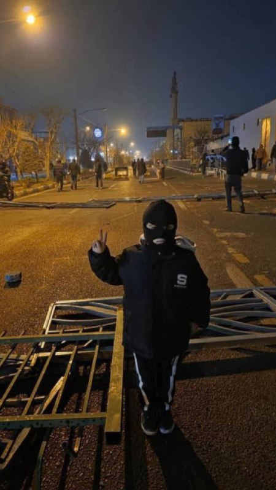

‌‌‏این بچه خایه داره اندازه کل هیکل بابات

@Dirty_Kids 👻

## Dirty_Kids — post 389660

  

پناه بر خدا این گربه جدی جدی ریش و سبیل داره.

@Dirty_Kids 👻

## Dirty_Kids — post 389659

‏۵۷ انقلاب کردن تخم نمیخواست چون اونجا سپاه محمدرسول الله و قرارگاه خاتم و سپاه امام حسن و سپاه موتوری امام علی مسلح مردم رو به رگبار نمیبستن

۵۷ شورش کردن درجه ی بالایی از تخمی بودن لازم داشت که شماها داشتین

@Dirty_Kids 👻

## Dirty_Kids — post 389658

  <a href="telegram/content/Dirty_Kids_389658_1779097981.mp4" target="_blank">🎬 Download video</a>

🔴 ویدیو وایرال شده از روزهای اول جنگ تو تهران؛

خونه‌ی طرف بخاطر موج انفجار آسیب دیده و پلیس‌ 10 دقیقه وقت داده که اگه چیز مهمی مثل طلا، سند و... دارید، بردارید و فوری ساختمون رو ترک کنید که احتمال حمله مجدد هست..

بعد خانومی از لا به لای اون همه شیشه خرده و آوار داره رد میشه که بره چیش رو پیدا کنه؟ موچین...

@Dirty_Kids 👻

## Hranews — post 113010

  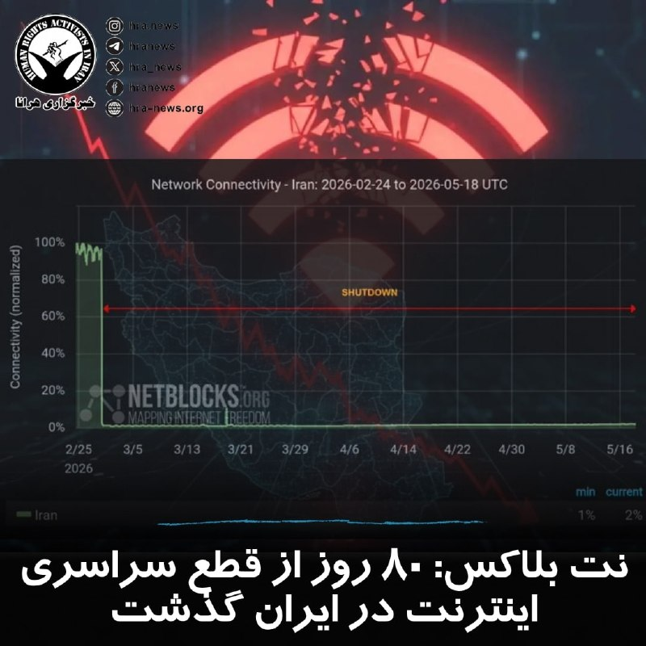

نت‌بلاکس، که محدودیت دسترسی به #اینترنت در جهان را رصد می‌کند، اعلام کرد که قطع سراسری اینترنت در ایران اکنون از ۱۸۹۶ ساعت گذشته و وارد هشتادمین روز خود شده است.

↘️
@hranews_bot تماس ✉️ -  @Hranews  کانال هرانا 🆑

## Hranews — post 113009

  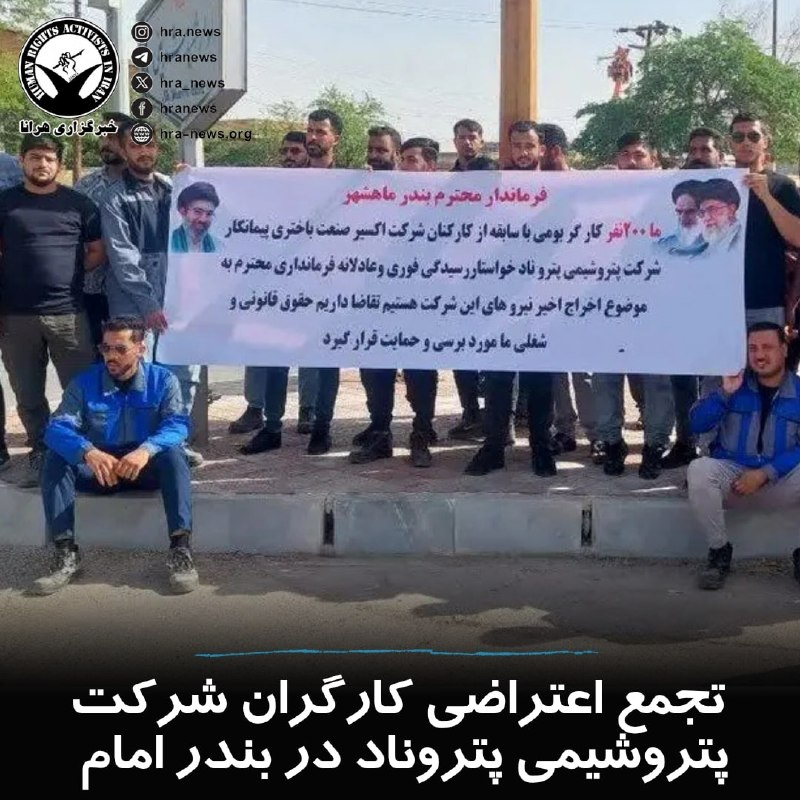

امروز دوشنبه ۲۸ اردیبهشت‌ماه، جمعی از کارگران شرکت پتروشیمی پتروناد برای چهارمین روز متوالی در مقابل ساختمان فرمانداری بندرامام دست به #تجمع_اعتراضی زدند.

#تجمع این کارگران در اعتراض به اخراج ۲۰۰ کارگر بومی این شرکت صورت گرفته است.

↘️
@hranews_bot تماس ✉️ -  @Hranews  کانال هرانا 🆑

## Hranews — post 113008

  

هشت روز پس از بازداشت؛ بی‌خبری از سرنوشت استی محمدی ادامه دارد

❗️
❗️
❗️
❗️
❗️– استی محمدی، شهروند ۶۷ ساله اهل بوکان، علیرغم گذشت هشت روز از زمان بازداشت، همچنان در بلاتکلیفی به‌سر میبرد. بی‌خبری از سرنوشت خانم محمدی، منجر به افزایش نگرانی‌های خانواده وی شده است.

به گزارش خبرگزاری هرانا، ارگان خبری مجموعه فعالان حقوق بشر در ایران، استی محمدی کماکان در بازداشت و بلاتکلیفی به‌سر میبرد.

با گذشت هشت روز از زمان بازداشت، خانواده این شهروند همچنان از محل نگهداری و وضعیت او بی‌اطلاع هستند. استی محمدی دارای بیماری زمینه‌ای است و نیاز به مصرف دارو دارد.

ادامه مطلب

#استی_محمدی

↘️
@hranews_bot تماس ✉️ -  @Hranews  کانال هرانا 🆑

## Hranews — post 113007

  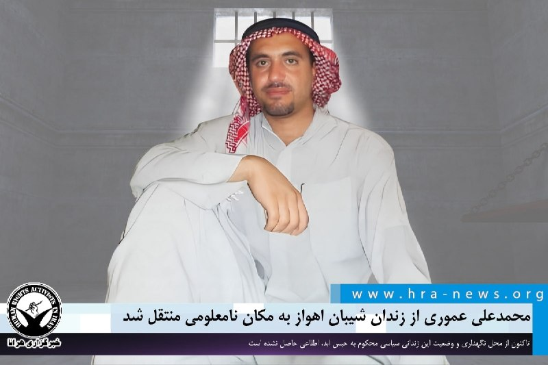

محمدعلی عموری از زندان شیبان اهواز به مکان نامعلومی منتقل شد

❗️
❗️
❗️
❗️
❗️– محمدعلی عموری، زندانی سیاسی محکوم به #حبس_ابد، حدود ده روز پیش توسط نیروهای اداره اطلاعات اهواز از زندان شیبان این شهر به مکان نامعلومی منتقل شد. تاکنون اطلاعی از محل نگهداری و وضعیت او حاصل نشده است.

به گزارش خبرگزاری هرانا، ارگان خبری مجموعه فعالان حقوق بشر در ایران، از سرنوشت و محل نگهداری محمدعلی عموری، زندانی سیاسی اطلاعی در دست نیست.

ماموران اداره اطلاعات اهواز روز شنبه ۱۹ اردیبهشت ماه، محمدعلی عموری را از زندان شیبان اهواز خارج کرده و به مکان نامعلومی منتقل کرده‌اند. با وجود پیگیری‌های خانواده، تا کنون هیچ نهاد مسئولی پاسخ روشنی درباره محل نگهداری یا وضعیت او ارائه نکرده است.

ادامه مطلب

#محمدعلی_عموری
↘️
@hranews_bot تماس ✉️ -  @Hranews  کانال هرانا 🆑

## Hranews — post 113006

  

کانون عالی انجمن‌های صنفی #کارگران ایران در نامه‌ای سرگشاده به رئیس مجلس شورای اسلامی، نسبت به آنچه «انحصار در روند انتخاب و اعزام نمایندگان کارگری» به اجلاس‌های سازمان بین‌المللی کار عنوان شده، انتقاد کرده است. در این نامه تأکید شده که در سال‌های اخیر، ترکیب هیئت‌های اعزامی به‌گونه‌ای بوده که به جای استفاده از ظرفیت نمایندگان تخصصی و منتخب حوزه کار، افراد محدود و نزدیک به بدنه وزارت تعاون، کار و رفاه اجتماعی در این فرآیند نقش پررنگ‌تری داشته‌اند.

در این نامه با اشاره به برگزاری پیش‌روی اجلاس سازمان بین‌المللی کار در ژنو، از مجلس شورای اسلامی خواسته شده درباره معیارهای انتخاب نمایندگان اعزامی و میزان شفافیت این روند توضیح داده شود. همچنین بر ضرورت استفاده از ظرفیت فراکسیون کارگری و جلوگیری از تکرار سازوکارهای غیرشفاف در اعزام‌ها، در شرایطی که به گفته این تشکل #مشکلات_معیشتی و اشتغال کارگران تشدید شده، تأکید شده است.

↘️
@hranews_bot تماس ✉️ -  @Hranews  کانال هرانا 🆑

## Hranews — post 113005

گزارشی از بازداشت و پخش اعترافات اجباری یک زن در غرب تهران

❗️
❗️
❗️
❗️
❗️– مرکز اطلاع‌رسانی فرماندهی انتظامی تهران بزرگ از #بازداشت یک زن در غرب تهران با اتهاماتی همچون «حمایت از حملات دشمنان خارجی در فضای مجازی و همکاری با سرویس‌های جاسوسی» خبر داد. همزمان ویدیویی از #اعترافات_اجباری این شهروند منتشر شده که شرایط ضبط آن مشخص نیست.

ادامه مطلب

↘️
@hranews_bot تماس ✉️ -  @Hranews  کانال هرانا 🆑

## Hranews — post 113004

دستور توقیف اموال ۱۲۹ شهروند در استان آذربایجان غربی صادر شد 
❗️
❗️
❗️
❗️
❗️– رئیس‌ کل دادگستری آذربایجان غربی از صدور دستور #توقیف_اموال ۱۲۹ شهروند در این استان به دلیل آنچه “اقدامات ضدامنیتی” و همکاری با “کشورهای متخاصم” عنوان کرده، خبر داد. ادامه مطلب ↘️…

## manototv — post 105588

  <a href="telegram/content/manototv_105588_1779097985.mp4" target="_blank">🎬 Download video</a>

رویترز روز دوشنبه ۲۸ اردیبهشت به نقل از یک منبع پاکستانی گزارش داد پاکستان پیشنهاد بازنگری‌شده جمهوری اسلامی برای پایان دادن به درگیری در خاورمیانه را به آمریکا منتقل کرده است.

این منبع پاکستانی گفت مذاکرات صلح همچنان در بن‌بست به نظر می‌رسد و «زمان زیادی» برای کاهش اختلاف‌ها باقی نمانده است. او افزود هر دو طرف «مدام مواضع خود را تغییر می‌دهند.»

## manototv — post 105587

  <a href="telegram/content/manototv_105587_1779097986.mp4" target="_blank">🎬 Download video</a>

اسماعیل بقایی، سخنگوی وزارت خارجه جمهوری اسلامی، روز دوشنبه ۲۸ اردیبهشت، در نشست خبری خود گفت تهدید و فشار اقتصادی آمریکا نتوانسته تهران را از پیگیری حقوق خود منصرف کند.

بقایی با اشاره به تهدیدهای مطرح‌شده علیه جمهوری اسلامی گفت: «در صورت کوچک‌ترین خطایی از سوی طرف‌های مقابل، می‌توانیم خوب جواب دهیم.» او اضافه کرد در روزهای اخیر مردم در میدان‌های تهران می‌گویند: «تو رستم تهمتنی و بزن که خوب می‌زنی.»

## manototv — post 105586

  <a href="telegram/content/manototv_105586_1779097987.mp4" target="_blank">🎬 Download video</a>

رالی خودرها در سن‌دیگو در حمایت از مردم ایران، یکشنبه ۲۷ اردیبهشت

## manototv — post 105585

  <a href="telegram/content/manototv_105585_1779097989.mp4" target="_blank">🎬 Download video</a>

اسماعیل بقایی، سخنگوی وزارت خارجه جمهوری اسلامی، روز دوشنبه ۲۸ اردیبهشت گفت مواردی مانند آزادسازی دارایی‌های مسدودشده ایران و رفع تحریم‌ها «شرط» تهران نیست، بلکه «مطالبات روشن و به‌حق» جمهوری اسلامی در مذاکرات است.

بقایی در پاسخ به پرسشی درباره شروط جمهوری اسلامی گفت ممکن است طرف مقابل موضوعات را به تشخیص خود نام‌گذاری کند، اما «مطالبات ما روشن است.»

سخنگوی وزارت خارجه جمهوری اسلامی همچنین رفع تحریم‌ها را یکی دیگر از مطالبات ایران دانست و گفت این موارد در هر مذاکره‌ای از سوی هیئت مذاکره‌کننده جمهوری اسلامی «با جدیت» پیگیری می‌شود.

## manototv — post 105584

  <a href="telegram/content/manototv_105584_1779097990.mp4" target="_blank">🎬 Download video</a>

همزمان با افزایش دوباره تنش‌ها در خاورمیانه، قیمت نفت بالا رفت و ریزش جهانی اوراق قرضه، تمایل سرمایه‌گذاران به دارایی‌های پرریسک را کاهش داد.

بر اساس این گزارش، شاخص دلار در برابر سبدی از ارزهای اصلی تقریبا ثابت ماند و به ۹۹.۳۲۵ رسید. همزمان، نفت برنت بیش از یک درصد افزایش یافت و به بالای ۱۱۰ دلار در هر بشکه رسید. رویترز نوشت حمله به یک نیروگاه هسته‌ای در امارات و توقف تلاش‌ها برای پایان دادن به جنگ آمریکا و اسرائیل علیه جمهوری اسلامی، از عوامل افزایش قیمت نفت بود.

## alonews — post 120815

  <a href="telegram/content/alonews_120815_1779097991.webm" target="_blank">🎬 Download video</a>

👈براساس گزارشات خبری، کشورهای منطقه تمام تلاش خود را به کار گرفته اند تا جنگ میان ایران و آمریکا و اسرائیل به پایان برسد

✅ @AloNews خبر جنگ

## alonews — post 120814

  <a href="telegram/content/alonews_120814_1779097991.webm" target="_blank">🎬 Download video</a>

👈وزارت علوم: در ایران از هر ۱۰ بیکار، ۴ نفر دارای مدرک دانشگاهی هستند

✅ @AloNews خبر جنگ

## alonews — post 120813

  <a href="telegram/content/alonews_120813_1779097991.webm" target="_blank">🎬 Download video</a>

👈ممنوعیت هرگونه تبلیغات اپراتور‌ها و دستگاه‌ها درباره فروش اینترنت پرو

🔴اولین جلسه بهبود فرآیند اجرای طرح اینترنت پرو به میزبانی وزارت ارتباطات برگزار و در این جلسه مصوب شد که هرگونه تبلیغات توسط اپراتور‌ها و دستگاه‌ها در زمینه فروش اینترنت پرو ممنوع است.

✅ @AloNews خبر جنگ

## alonews — post 120812

  <a href="telegram/content/alonews_120812_1779097991.webm" target="_blank">🎬 Download video</a>

👈رویترز نقل از مقام پاکستانی: ما زمان زیادی برای پر کردن شکاف های بین ایران و آمریکا نداریم!

✅ @AloNews خبر جنگ

## alonews — post 120811

  <a href="telegram/content/alonews_120811_1779097991.webm" target="_blank">🎬 Download video</a>

👈خبرنگار کانال ۱۲ اسرائیل: به گفته منابع غربی، پیشنهاد جدید ایران شامل تعهدی با ارزش نامشخص برای عدم تولید سلاح هسته‌ای است، هیچ اشاره‌ای به اورانیوم نشده است، هیچ اشاره‌ای هم به هرمز وجود ندارد

✅ @AloNews خبر جنگ

## alonews — post 120810

  <a href="telegram/content/alonews_120810_1779097991.webm" target="_blank">🎬 Download video</a>

👈وزارت دفاع روسیه اعلام کرد که نیروهای مسلح این کشور حمله‌ای گسترده را به تأسیسات صنعت دفاعی نظامی اوکراین و همچنین زیرساخت‌های حمل و نقل و انرژی مرتبط با نیروهای مسلح اوکراین انجام داده‌اند.

✅ @AloNews خبر جنگ

## alonews — post 120809

  <a href="telegram/content/alonews_120809_1779097992.webm" target="_blank">🎬 Download video</a>

👈نیروی دریایی اسرائیل یک ناوگان به سمت غزه را نزدیک قبرس متوقف کرده است. ۶۰ کشتی این ناوگان قصد داشتند محاصره اسرائیل بر غزه را بشکنند و کمک‌های بشردوستانه بیاورند، طبق گزارش الجزیره

✅ @AloNews خبر جنگ

## alonews — post 120808

  <a href="telegram/content/alonews_120808_1779097992.webm" target="_blank">🎬 Download video</a>

👈واکنش سردار آزمون به خط خوردن از تیم فوتبال ایرانی:
پاک کردن پروفایل با لباس تیم ایرانی و آنفالوی پیج های تیم ایرانی

✅ @AloNews خبر جنگ

## alonews — post 120807

  <a href="telegram/content/alonews_120807_1779097992.webm" target="_blank">🎬 Download video</a>

👈پزشکیان: نباید به دروغ ادعا کنیم که هیچ مشکلی نداریم و دشمن در حال نابودی است

✅ @AloNews خبر جنگ

## alonews — post 120806

  <a href="telegram/content/alonews_120806_1779097992.mp4" target="_blank">🎬 Download video</a>

دوستان اگه پولتون زیادی کرده و نمیدونین باهاش چیکار کنین، کاخ گوتیک امیردشت با قیمت مفتِ 1500 میلیارد به فروش میرسه، حتما بخرین.

[@AloTweet]

## alonews — post 120805

اخبار جنگ الونیوز AloNews pinned a photo

## alonews — post 120804

  <a href="telegram/content/alonews_120804_1779097992.webm" target="_blank">🎬 Download video</a>

👈سخنگوی وزارت خارجه: آن چیزی که با قطعیت می‌توان گفت، این است که بحث حق، چیزی نیست که بخواهیم درباره‌اش گفت‌وگو و مصالحه کنیم.

🔴حق ایران برای غنی‌سازی بر مبنای توافقنامه NPT شناسایی شده و نیازی نیست دیگران این حق را برای ایران شناسایی کنند. این حق وجود دارد.

✅ @AloNews خبر جنگ

## alonews — post 120802

  <a href="telegram/content/alonews_120802_1779097993.webm" target="_blank">🎬 Download video</a>

👈پرزیدنت پزشکیان:
کسی که شعار می‌دهد باید پای شعارش بایستد

✅ @AloNews خبر جنگ

## alonews — post 120801

  <a href="telegram/content/alonews_120801_1779097993.webm" target="_blank">🎬 Download video</a>

👈ترامپ : اونا یه برگه می‌فرستن که هیچ ربطی به چیزی که توافق کرده بودیم نداره

🔴منم می‌گم :  "شماها دیوونه‌اید یا چی؟"

✅ @AloNews خبر جنگ

## alonews — post 120800

  <a href="telegram/content/alonews_120800_1779097993.webm" target="_blank">🎬 Download video</a>

👈دونالد ترامپ به مجله Fortune: «ایران مشتاقانه در تلاش است تا قراردادی امضا کند. آنها بسیار به دنبال یک توافق هستند، ایران درباره توافق صحبت می‌کند و سپس یک کاغذ کاملاً بی‌فایده که هیچ ارتباطی با آنچه ما بحث کردیم ندارد برای من می‌فرستد»

✅ @AloNews خبر جنگ

## alonews — post 120799

  <a href="telegram/content/alonews_120799_1779097993.webm" target="_blank">🎬 Download video</a>

👈امروز هشتادمین روز قطعی اینترنت ایرانه که بیش از ۱۸۹۶ ساعت ادامه داشته...

✅ @AloNews خبر جنگ

## alonews — post 120798

  <a href="telegram/content/alonews_120798_1779097993.mp4" target="_blank">🎬 Download video</a>

👈وزارت امور خارجه چین: تایوان بخشی جدایی‌ناپذیر از قلمرو چین است. تایوان هرگز کشور نبوده است، نه در گذشته و نه در آینده.

🔴استقلال تایوان و صلح در سراسر تنگه به اندازهٔ آتش و آب ناسازگارند.

✅ @AloNews خبر جنگ

## alonews — post 120797

  <a href="telegram/content/alonews_120797_1779097994.webm" target="_blank">🎬 Download video</a>

👈واکنش سخنگوی وزارت امورخارجه به تهدیدات ترامپ: خیالتان راحت، خوب بلدیم جواب دهیم

✅ @AloNews خبر جنگ

## alonews — post 120796

  <a href="telegram/content/alonews_120796_1779097995.mp4" target="_blank">🎬 Download video</a>

👈سخنگوی وزارت امور خارجه: منشأ حمله به کشتی کره جنوبی را بررسی می‌کنیم، قائل به برقراری امنیت کامل برای کشتی‌ها هستیم

✅ @AloNews خبر جنگ

## alonews — post 120795

  <a href="telegram/content/alonews_120795_1779097996.webm" target="_blank">🎬 Download video</a>

👈آخرین پیشنهاد ایران برای پایان جنگ، یکشنبه شب(دیشب) به طرف آمریکایی ارسال شد

✅ @AloNews خبر جنگ

<!-- MSG END -->

<!-- NAV START -->

<a href="https://github.com/hosseinbaghi/aio-downloader/blob/main/telegram/content/archive_1.md" style="display:inline-block; padding:6px 12px; margin:0 4px; background-color:#2ea44f; color:white; text-decoration:none; border-radius:4px; font-weight:bold;">صفحه بعد</a>

<!-- NAV END -->
