# خواننده تلگرام

<!-- TOP_NAV START -->

<a href="https://github.com/hosseinbaghi/aio-downloader/blob/main/telegram/content/archive_1.md" style="display:inline-block; padding:6px 12px; margin:0 4px; background-color:#2ea44f; color:white; text-decoration:none; border-radius:4px; font-weight:bold;">صفحه بعد</a>

<!-- TOP_NAV END -->

<!-- MSG START -->

---
📅 بروزرسانی: 1405/03/04 15:56
---

## VahidOOnLine — post 242117

  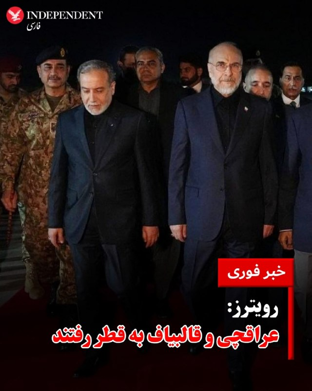

♦️خبرگزاری رویترز، روز دوشنبه چهارم خرداد به نقل از یک منبع آگاه گزارش کرد محمدباقر قالیباف، رئیس مجلس شورای اسلامی و مذاکره‌کننده ارشد جمهوری اسلامی به همراه عباس عراقچی برای مذاکره با نخست‌وزیر قطر در مورد توافق احتمالی ایران و آمریکا با هدف پایان دادن به جنگ، به دوحه سفر کرده‌اند.

این مقام که نامش فاش نشده به رویترز گفت که «مذاکرات عمدتا بر تنگه هرمز و ذخایر اورانیوم غنی‌شده با خلوص بالا متمرکز است.»

به گزارش رویترز،عبدالناصر همتی، رئیس بانک مرکزی ایران نیز عضو هیئتی است که قرار است در مورد آزادسازی احتمالی دارایی‌های مسدود شده ایران به عنوان بخشی از توافق نهایی با مقام‌های قطری گفتگو کند.
‌🇸🇦 Indypersian

🤖 @VahidOOnLine

## VahidOOnLine — post 242116

  

رویترز به نقل از یک مقام آگاه گزارش داد محمدباقر قالیباف و عباس عراقچی برای دیدار با نخست‌وزیر قطر، در خصوص توافق احتمالی میان جمهوری اسلامی و آمریکا، وارد دوحه شده‌اند.

پیش‌تر رسانه‌های ایران از سفر عبدالناصر همتی، رییس کل بانک مرکزی به قطر خبر داده بودند.
iranintl
‌🏁 🇬🇧 IranintlTV

🤖 @VahidOOnLine

## VahidOOnLine — post 242115

  

♦️شی جین‌پینگ، رئیس جمهوری چین روز دوشنبه چهارم خردادماه در جریان دیدار با شهباز شریف، نخست وزیر پاکستان در پکن از نقش «سازنده» اسلام‌آباد در میانجیگری میان ایالات متحده آمریکا و جمهوری اسلامی ایران تقدیر کرد.

به گزارش خبرگزاری دولتی پاکستان، شهباز شریف که به همراه فیلدمارشال عاصم منیر، فرمانده ارتش و میانجی اصلی مذاکرات تهران و واشنگتن به پکن سفر کرده از حمایت‌های چین از گفتگوهای صلح تشکر کرد.

به گزارش رویترز، شهباز شریف پیش از ملاقات با رئیس جمهوری چین و در جریان دیدار با لی چیانگ، نخست‌وزیر این کشور، گفته بود «جهان در حال گذار از یک لحظه حساس در بحبوحه بحران» در خلیج فارس است.
‌🇸🇦 Indypersian

🤖 @VahidOOnLine

## VahidOOnLine — post 242114

  

⭕️ رئیس کل بانک مرکزی ایران به قطر رفت

♦️رسانه‌های داخلی ایران روز دوشنبه چهارم خردادماه از سفر عبدالناصر همتی، رئیس کل بانک مرکزی ایران به قطر خبر دادند.

خبرگزاری فارس، وابسته به سپاه پاسداران با اعلام این خبر نوشت: «عبدالناصر همتی پیرامون بررسی آزادسازی اموال بلوکه‌شده و در راستای کمیسیون اقتصادی مذاکرات به قطر سفر کرد.»

قطر در این دور از مذاکرات، میانجی مستقیم نیست اما هفته گذشته، یک هیئت از قطر به تهران سفر کرده بود.
‌🇸🇦 Indypersian

🤖 @VahidOOnLine

## VahidOOnLine — post 242113

  

پایگاه خبری بلومبرگ گزارش داد شرکت نفت ابوظبی در هفته‌های اخیر با استفاده از ناوگان خود و به‌کارگیری روش‌های خاص، صادرات نفت و گاز از خلیج فارس را ادامه داده است.

بر اساس این گزارش، برخی نفتکش‌ها با خاموش کردن سامانه‌های ردیابی هنگام عبور از تنگه هرمز موفق شده‌اند محموله‌ها را جابه‌جا کنند. هم‌زمان، قطر نیز به‌صورت نامحسوس صادرات گاز طبیعی مایع (ال‌ان‌جی) را از تنگه هرمز ادامه داده و دست‌کم یک کشتی حامل ال‌ان‌جی پس از عبور از این مسیر راهبردی، در مسیر چین رصد شده است. اگرچه حجم این انتقال‌ها هنوز با سطح تجارت پیش از جنگ فاصله دارد، اما به گفته بلومبرگ، این تحرکات نشان‌دهنده تلاش تولیدکنندگان انرژی منطقه برای حفظ جریان صادرات و ایجاد موازنه میان فشارهای ایران و ایالات متحده است.
iranintl
‌🏁 🇬🇧 IranintlTV

🤖 @VahidOOnLine

## VahidOOnLine — post 242112

در حالیکه ۸۷ روز از خاموشی دیجیتال و قطع ارتباط ایران با جهان می‌گذرد، رسانه‌های داخلی به‌نقل از منابع آگاه گزارش دادند که در چهارمین جلسه «ستاد راهبری و ساماندهی فضای مجازی» به ریاست محمدرضا عارف، معاون اول پزشکیان، «مصوب شده تا اینترنت به وضعیت پیش از دی‌ماه ۱۴۰۴ باز گردد.»

این خبر در حالی منتشر می‌شود که اینترنت در ایران از زمان آغاز جنگ با آمریکا و اسرائیل قطع شده است. پیش از آن هم دسترسی به اینترنت از روزهای ۱۸ و ۱۹ دی‌ماه و همزمان با انقلاب ملی ایرانیان و کشتار گسترده مردم، قطع شده بود.
‌🇸🇦 Indypersian

🤖 @VahidOOnLine

## VahidOOnLine — post 242111

  

علیرضا سلیمی، عضو هیات رییسه مجلس، گفت آمریکا هیچ‌گاه به دنبال مذاکره واقعی برای پایان دادن به تنش‌ها نبوده و از میز مذاکره فقط به‌عنوان «تله‌گذاری» برای پیشبرد اقدامات «خصمانه» بعدی استفاده می‌کند.

او افزود: «اگر مقام‌های آمریکایی صادق بودند و حسن نیت داشتند، هم‌زمان با سخن گفتن از مذاکره، تحریم‌های جدید علیه جمهوری اسلامی اعمال نمی‌کردند.»
iranintl
‌🏁 🇬🇧 IranintlTV

🤖 @VahidOOnLine

## VahidOOnLine — post 242110

  

♦️دونالد ترامپ با انتشار پیامی در تروث سوشال، به‌شدت از منتقدان و مخالفان «توافق احتمالی» با جمهوری اسلامی انتقاد و تاکید کرد که اگر توافق «عالی و پرمعنی» نباشد، اصلا توافقی در کار نخواهد بود.

ترامپ در این پیام نوشت: «من به همه دموکرات‌ها، جمهوریخواهان مستقل و احمق‌هایی که هیچ چیز در مورد توافق بالقوه‌ای که من با ایران انجام می‌دهم نمی‌دانند، چیزهایی که هنوز حتی در مورد آنها مذاکره نشده است، می‌خندم. افراد ضعیف و بی‌تاثیری مثل سناتور شکست‌خورده تام تیلیس (که به زودی از سمت خود برکنار می‌شود!)، بیل کسیدی که به تازگی شکست سنگینی در انتخابات مقدماتی متحمل شد، توماس ماسی، نماینده بد کنگره، یک آدم کثیف و بی‌عرضه که پس از نشان دادن بی‌وفایی عظیم به حزب (و کشورش!) با اختلاف فاحشی به یک میهن‌پرست بزرگ آمریکایی (که توسط «ترامپ» تایید شده بود) باخت، و تقریبا همه دموکرات‌ها، افرادی که کاملا راه خود را گم کرده‌اند، دائما از سیاست‌های بد و حتی نامزدهای بدتر حمایت می‌کنند، اما همیشه از هر پیروزی فوق‌العاده‌ای که من به دست می‌آورم انتقاد می‌کنند. این افراد باید به خانه بروند و استراحت کنند.»
‌🇸🇦 Indypersian

🤖 @VahidOOnLine

## VahidOOnLine — post 242109

  

خبرگزاری فارس، وابسته به سپاه پاسداران، ضمن اعلام خبر سفر عبدالناصر همتی، رییس بانک مرکزی جمهوری اسلامی به قطر، نوشت که این سفر پیرامون بررسی «آزادسازی اموال بلوکه‌شده» و در راستای کمیسیون اقتصادی مذاکرات انجام شده است.

این در حالی است که در روزهای اخیر و در جریان مذاکرات، هیاتی قطری به ایران سفر کرده بود.
‌🏁 🇬🇧 IranintlTV

🤖 @VahidOOnLine

## VahidOOnLine — post 242108

  <a href="telegram/content/VahidOOnLine_242108_1779712014.mp4" target="_blank">🎬 Download video</a>

تماسی از هلند:
«می‌گفت هر روز با برنامه‌های منوتو زندگی می‌کردیم…
و حالا نمی‌دانیم بعد از آن باید چه کنیم.»
او همچنین از جاویدنام سینا حق‌شناس یاد کرد؛ دوستی که خبر جان‌باختنش زندگی او را زیر و رو کرده بو
‌🏁 🇬🇧 ManotoTV

🤖 @VahidOOnLine

## VahidOOnLine — post 242107

  

سایت هرانا خبر داد گلرخ ایرایی، زهرا صفایی، مرضیه فارسی، شیوا اسماعیلی و سکینه پروانه، پنج تن از زندانیان سیاسی محبوس در بند زنان زندان اوین، از یکشنبه به‌صورت تنبیهی از حق استفاده از تلفن زندان محروم شده‌اند.

هرانا نوشت محرومیت تنبیهی این پنج زندانی سیاسی پس از آن اعمال شد که آنان در اعتراض به اجرای احکام اعدام، در محوطه هواخوری زندان شعار داده بودند.

این زندانیان پیش‌تر نیز از حق ملاقات حضوری با خانواده و وکلای خود محروم بوده‌اند و این محدودیت همچنان ادامه دارد.
‌🏁 🇬🇧 IranintlTV

🤖 @VahidOOnLine

## VahidOOnLine — post 242106

  

دونالد ترامپ در شبکه تروث سوشال نوشت: «توافق با ایران یا یک توافق بزرگ و معنادار خواهد بود یا اصلا توافقی در کار نخواهد بود. این دقیقا برعکس فاجعه برجام است که توسط دولت شکست‌خورده اوباما انجام شد؛ توافقی که یک مسیر مستقیم و آشکار برای دستیابی آن‌ها به سلاح هسته‌ای بود. نه، من چنین توافق‌هایی انجام نمی‌دهم.»

او افزود: «من به همه دموکرات‌ها و جمهوری‌خواهانِ اسمی و احمق‌هایی می‌خندم که هیچ چیزی درباره توافق احتمالی که من با ایران در حال انجامش هستم نمی‌دانند؛ موضوعاتی که هنوز حتی درباره‌شان مذاکره هم نشده است.»
iranintl
‌🏁 🇬🇧 IranintlTV

🤖 @VahidOOnLine

## VahidOOnLine — post 242105

  <a href="telegram/content/VahidOOnLine_242105_1779712016.mp4" target="_blank">🎬 Download video</a>

ویدیوهای رسیده به ایران‌اینترنشنال نشان می‌دهند گروهی از ایرانیان مقیم آلمان هم‌زمان با فستیوال موسیقی گوتیک‌ویو در شهر لایپزیگ علیه جمهوری اسلامی راهپیمایی نمادین برگزار کردند.
این تجمع با پوشیدن لباس مشکی، پخش موسیقی نویز و نصب نماد «وای‌فای خاموش» بر دهان شرکت‌کنندگان همراه بود؛ حرکتی اعتراضی برای جلب توجه افکار عمومی به کشتارهای رخ‌داده در ایران و بی‌توجهی سیاستمداران اروپایی.
‌🏁 🇬🇧 IranintlTV

🤖 @VahidOOnLine

## VahidOOnLine — post 242104

  

♦️اسماعیل بقایی، سخنگوی وزارت امور خارجه جمهوری اسلامی روز دوشنبه چهارم خرداد در پاسخ به پرسش‌های خبرنگاران درباره اعمال هزینه عبور از تنگه هرمز گفت: «کشتی‌ها عوارضی نمی‌پردازند. ناوبری و حفاظت از محیط زیست در تنگه هرمز هزینه‌هایی دارد و ما با کشور عمان در حال بررسی طرحی برای تامین این هزینه‌ها هستیم.»

این اظهارات در حالی بیان می‌شود که عبور و مرور کشتی‌های باری و نفتکش‌ها در از تنگه هرمز، محل گذر یک پنجم انرژی جهان از زمان آغاز جنگ آمریکا و اسرائیل با جمهوری اسلامی عملا متوقف شده است. مساله بازگشایی تنگه هرمز یکی از موضوعات مذاکرات جاری میان تهران و واشنگتن است.
‌🇸🇦 Indypersian

🤖 @VahidOOnLine

## VahidOOnLine — post 242103

  

نت‌بلاکس صبح دوشنبه اعلام کرد خاموشی اینترنت در ایران وارد هشتادوهفتمین روز متوالی شده و بیش از ۲۰۶۴ ساعت ادامه داشته است. نت‌بلاکس نوشت قطع اینترنت «هرگونه شفافیت درباره اعدام‌ها» را از بین برده و به شرایط «غیرانسانی» و بلاتکلیفی منتقدان زندانی، مخالفان و گردشگران افزوده است.
iranintl
‌🏁 🇬🇧 IranintlTV

🤖 @VahidOOnLine

## VahidOOnLine — post 242102

  

مسعود پزشکیان، رییس دولت جمهوری اسلامی گفت: «روند مذاکرات و تعاملات خارجی کشور به‌گونه‌ای طراحی شده که حقوق ملت ایران به‌صورت کامل استیفا شود و جمهوری اسلامی تحت هیچ شرایطی در برابر فشارها و مطالبات زیاده‌خواهانه تسلیم نخواهد شد.»

او افزود: «حفظ ثبات بازار و تامین نیازهای کشور در شرایط جنگی، مرهون تلاش موثر فعالان اقتصادی بوده است.»
iranintl
‌🏁 🇬🇧 IranintlTV

🤖 @VahidOOnLine

## VahidOOnLine — post 242101

  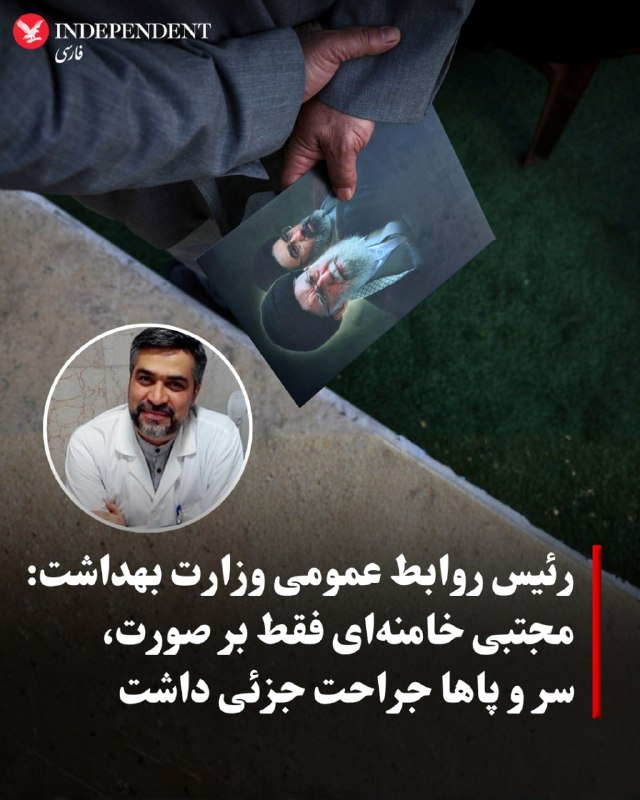

♦️حسین کرمانپور، رییس مرکز روابط عمومی وزارت بهداشت درباره وضعیت مجتبی خامنه‌ای، سومین رهبر جمهوری اسلامی به ایلنا گفت او در جریان بمباران بیت رهبری فقط  بر صورت، سر و پاها دچار جراحت جزئی شده بود.

این مقام وزارت بهداشت گفت: «استنباط ما این بود که کسی که زیر چنین بمبارانی باشد نباید بدن سالمی داشته باشد، اما به جز جراحت سطحی بر صورت، سر و پاها که منجر به هیچ قطع عضو و ناراحتی خاصی نشده بود، اتفاق خاصی نیفتاده بود و از دید من پزشک جزو مجروحیت‌های مهمی تلقی نمی‌شد و نیاز به اقدامات خاصی نداشت، جز یک الی دو بخیه که به ایشان زده شد. اگر اشتباه نکنم تا ساعت ۲ بامداد دهم اسفند هم مهمان ما بودند.»

کرمانپور گفت: «همکارانم گفتند هرکاری کردیم ایشان روزه‌شان را باز کنند، نکردند و تا افطار ایشان روزه‌شان را نگه داشتند که این هم نشان از سلامت ایشان دارد که اگر مجروحیت زیاد بود نمی‌توانستند به حرف ما گوش ندهند... تا افطار ماندند بخیه‌ها هم زده شد و ساعت ۲ بامداد دهم اسفند ترخیص شدند و به محلی که باید می‌رفتند، منتقل شدند.»
از زمان بمباران بیت رهبری هیچ صدا یا تصویری از مجتبی خامنه‌ای منتشر نشده است.
‌🇸🇦 Indypersian

🤖 @VahidOOnLine

## VahidOOnLine — post 242100

🗣روایت شما از احتمال توافق میان آمریکا و جمهوری اسلامی- دوشنبه ۴ خرداد

🔹آقای ترامپ اومدی راجع به اون چهل‌هزار گل پژمرده و این زندانی‌های در معرض اعدام حرف زدی. گفتی که این رژیم فاسد هر کاری کنه حمله می‌کنی. ولی خب معلوم شد که به ما مردم بیچاره اهمیت ندادی.

🔹چه مذاکره‌ای؟ واقعا نمی‌فهمیم ترامپ داره چه غلطی می‌کنه. ولی ما بدون ترامپ هم می‌تونیم. هم‌میهنان، ما اعتراضات رو دوباره شروع می‌کنیم و ایران‌مون رو پس می‌گیریم. ناامید نباشید.

🔹برامون مهمه که خون عزیزترین‌های ایران پایمال نشه. فکر اینکه اون همه زندگی، آینده، تجربه و متعلقات رو برای «هیچ» رها کرده باشن عذابم می‌ده.

🔹اگر می‌خواستی توافق کنی، بی‌جا کردی به ما مردم گفتی کمک در راه است. چه کمکی؟ جنگ نصفه‌نیمه و بی‌نتیجه که فقط اینترنت‌ها رو قطع کرد و قیمت‌ها رو برد بالا.

🔹الان حدود سه ماهه که با قطعی اینترنت و گرانی روزبه‌روز داریم عقب‌مونده‌تر و فقیرتر می‌شیم. قرار بود ترامپ از ما حمایت کنه، نه اینکه نصف کار رو ول کنه بره. آقای ترامپ، ۸۰ میلیون ایرانی حرف شما رو حساب کردن و امید بستن.

🔹یکی به این ترامپ بگه قبل از جنگ این همه از خون جاویدنام‌ها و جون مردم مایه گذاشت برای شروع جنگ، حداقل یکی از بندهای توافق رو اختصاص می‌داد به حقوق مردم مثل اینترنت یا حق اعتراض آزاد.

🔹ترامپ عزیز، اول ازت ممنونم بابت همراهی‌هات تاکنون، ولی اگر با بوفالوی منطقه و قاتل مردم ایران هر توافقی بکنی، نه می‌بخشیم و نه فراموش می‌کنیم و البته قطعا خودمون ریشه این جهل و جور و فساد رو از تاریخ ایران درمیاریم و به زباله‌دان تاریخ می‌اندازیم.

🔹فقط از خدا می‌خوام که توافق نشه، مجدد جنگ بشه، چون هیچ‌کس از هیچ کجای دنیا نمی‌تونه درک کنه این جمهوری اسلامی چقدر وحشی، چقدر متجاوز و چقدر خشنه. موندن اینا یعنی نادیده گرفتن قتل‌عام ده‌ها هزار جاویدنام
‌🏁 🇬🇧 IranintlTV

🤖 @VahidOOnLine

## VahidOOnLine — post 242099

  

ابراهیم رضایی، سخنگوی کمیسیون امنیت ملی مجلس، گفت جمهوری اسلامی نباید در موضوع هسته‌ای تعهدی بدهد که قدرت بازدارندگی‌اش را تضعیف کند.

او افزود: «جمهوری اسلامی نباید چیزی را که برای آن هزینه زیادی پرداخته، «دو دستی تقدیم دشمن» کند.

او توان هسته‌ای را «دارایی استراتژیک» خواند و گفت واگذاری آن در مذاکره ممکن است خطراتی به همراه داشته باشد و دشمن را برای حمله مجدد «حریص‌تر» کند.
iranintl
‌🏁 🇬🇧 IranintlTV

🤖 @VahidOOnLine

## VahidOOnLine — post 242098

  

غلامحسین محسنی اژه‌ای، رییس قوه قضاییه در پیامی در خصوص انتخاب مجدد قالیباف به‌عنوان رییس مجلس شورای اسلامی، نوشت: «محمدباقر قالیباف که مدیری جهادی و نستوه و میدان‌دیده است و در جنگهای ۱۲ روزه و رمضان و پس از آن، در عرصه‌های میدان و دیپلماسی جهاد کرد.»

او ادامه داد: «قوه قضاییه آماده است بیش از گذشته با مجلس و نمایندگان آن، همکاری و مساعدت داشته باشد.»
‌🏁 🇬🇧 IranintlTV

🤖 @VahidOOnLine

## WithYashar — post 12415

  <a href="telegram/content/WithYashar_12415_1779712021.mp4" target="_blank">🎬 Download video</a>

فاکس نیوز: رئیس‌جمهور ترامپ با قاطعیت شایعات دربارهٔ یک توافق هسته‌ای ضعیف را رد کرد و اعلام کرد که هرگز به تهران «پول نقد تحویل نخواهد داد.»

رئیس‌جمهور ترامپ به لارِنس بیلی جونز؛ (مجری تلویزیونی، مفسر سیاسی و خبرنگار آمریکایی شبکه فاکس‌نیوز) گفت منتقدانی که ادعا می‌کنند او در برابر ایران رویکردی نرم دارد، کاملاً در اشتباه‌اند.

«واقعاً فکر می‌کنید بعد از تمام حرف‌هایی که دربارهٔ این‌که ایران هرگز نباید به سلاح هسته‌ای دست پیدا کند زده‌ام، من به‌عنوان رئیس‌جمهور فقط بیایم و پول نقد به آن‌ها تحویل بدهم؟»
@withyashar

## WithYashar — post 12414

  <a href="telegram/content/WithYashar_12414_1779712023.mp4" target="_blank">🎬 Download video</a>

روایت مذاکرات ایران: رئیس‌جمهور ترامپ با قاطعیت شایعات دربارهٔ یک توافق هسته‌ای ضعیف را رد کرد و اعلام کرد که هرگز به تهران «پول نقد تحویل نخواهد داد.»

رئیس‌جمهور ترامپ به لارِنس بیلی جونز؛ (مجری تلویزیونی، مفسر سیاسی و خبرنگار آمریکایی شبکه فاکس‌نیوز) گفت منتقدانی که ادعا می‌کنند او در برابر ایران رویکردی نرم دارد، کاملاً در اشتباه‌اند.

«واقعاً فکر می‌کنید بعد از تمام حرف‌هایی که دربارهٔ این‌که ایران هرگز نباید به سلاح هسته‌ای دست پیدا کند زده‌ام، من به‌عنوان رئیس‌جمهور فقط بیایم و پول نقد به آن‌ها تحویل بدهم؟»
@withyashar

## WithYashar — post 12413

همتی رئیس بانک مرکزی هم در تیمه و برای پیگیری آزادسازی منابع ارزی ایران راهی قطر شده

قرار شده است که قطر بخشی از پول‌های بلوکه شده ایران را پرداخت کند و بعد آمریکا به آن بپردازد!

سید محمد مرندی، عضو سابق تیم مذاکره‌کننده هسته‌ای: ظاهرا قرار بر این است قطری ها بخشی از پول را برای ما تامین و بعداز آمریکا دریافت کنند.
@withyashar

## WithYashar — post 12412

فاکس نیوز : قالیباف و عراقچی امروز رفتن قطر برای مذاکرات
@withyashar

## WithYashar — post 12411

واشنگتن پست به نقل از یک مقام ایرانی:
بازگشایی تنگه هرمز مرحله‌به‌مرحله انجام میشه. اول مین‌ها پاک‌سازی میشه، بعد محاصره آمریکا برداشته میشه و اون 12 میلیارد دلار دارایی مسدود شده هم آزاد میشه.

یه یادداشت هم امضا شده که اصلا ربطی به توافق هسته‌ای نداره، فقط قول دادیم که مذاکرات رو ادامه بدیم.
@withyashar

## WithYashar — post 12410

ترامپ: چیزهایی هست که از اول هم با ایران در موردشان مذاکره نشده بود
@withyashar

## WithYashar — post 12409

دیلی‌میل: تد کروز و لیندسی گراهام رهبری جمهوری‌خواهان رو بر عهده دارن که از توافق در حال شکل‌گیری ترامپ با ایران انتقاد میکنن و اونو اشتباهی فاجعه‌‌بار می‌دونن.
@withyashar

## WithYashar — post 12408

ترامپ در تروث : «من به تمام دموکرات‌ها، جمهوری‌خواه‌های ظاهری (RINOها) و احمق‌هایی می‌خندم که هیچ اطلاعی درباره توافق احتمالی‌ای که من با ایران در حال انجامش هستم ندارند؛ مسائلی که حتی هنوز وارد مرحله مذاکره هم نشده‌اند.

افراد ضعیف و بی‌اثری مثل سناتور شکست‌خورده تام تیلیس که به‌زودی از قدرت کنار می‌رود یا بیل کسیدی که تازه یک شکست سنگین در انتخابات مقدماتی خورده، یا نماینده واقعاً افتضاح، توماس مَسی؛ آدمی کاملاً کثیف که بعد از خیانت بزرگ به حزبش (و کشورش!) با اختلاف سنگین از یک میهن‌پرست واقعی آمریکایی که مورد حمایت «ترامپ» بود شکست خورد؛ و تقریباً تمام دموکرات‌ها؛ کسانی که کاملاً راهشان را گم کرده‌اند، مدام از سیاست‌های بد و نامزدهای حتی بدتر حمایت می‌کنند، اما همزمان از تک‌تک پیروزی‌های فوق‌العاده من انتقاد دارند.

این افراد بهتر است به خانه بروند و استراحت کنند؛ چون جز ایجاد تفرقه و شکست، کاری انجام نمی‌دهند. به زبان ساده: آن‌ها بازنده‌اند!

توافق با ایران یا یک توافق بزرگ و معنادار خواهد بود، یا اصلاً توافقی در کار نخواهد بود.
این توافق دقیقاً نقطه مقابل فاجعه برجام (JCPOA) خواهد بود؛ توافقی که توسط دولت شکست‌خورده اوباما مذاکره شد و مسیری مستقیم و آشکار برای دستیابی ایران به سلاح هسته‌ای ایجاد می‌کرد.
نه، من چنین توافق‌هایی انجام نمی‌دهم!
@withyashar

## WithYashar — post 12407

خوش چشم (مرشد فیلم صمد)تحلیلگر صداسیما: پول بشینه توی حساب جمهوری اسلامی میریم پای میز مذاکره
@withyashar

## WithYashar — post 12406

شبکه ۱۲ عبری: حزب‌الله استفاده از پهپادهای انتحاری را به‌طور چشمگیری افزایش داده است
@withyashar

## WithYashar — post 12405

فوری/ بازگشایی اینترنت بین الملل مصوب شد

ستاد راهبری و ساماندهی فضای مجازی صبح امروز دوشنبه (چهارم خردادماه) به ریاست دکتر عارف معاون اول رئیس جمهور تشکیل جلسه داد و بازگشت اینترنت به وضعیت قبل از دی ماه 1404 مصوب شد.

این مصوبه برای رییس جمهور ارسال شد و در صورت تایید رئیس جمهور جهت اجرا برای وزارت ارتباطات ارسال خواهد شد.
@withyashar

## mwarmonitor — post 9684

🔴« محمدباقر قالیباف، رئیس مجلس ایران، و عباس عراقچی، وزیر امور خارجه، امروز زودتر به دوحه رسیدند تا درباره تلاش‌های دیپلماتیک جاری برای پایان دادن به درگیری‌ها گفت‌وگو کنند؛ یک منبع مطلع از این سفر به فاکس نیوز گفته است.» @mwarmonitor

## mwarmonitor — post 9683

🔴« محمدباقر قالیباف، رئیس مجلس ایران، و عباس عراقچی، وزیر امور خارجه، امروز زودتر به دوحه رسیدند تا درباره تلاش‌های دیپلماتیک جاری برای پایان دادن به درگیری‌ها گفت‌وگو کنند؛ یک منبع مطلع از این سفر به فاکس نیوز گفته است.»

@mwarmonitor

## mwarmonitor — post 9682

  

🔴 ناو هواپیمابر فرانسوی «شارل دو گل (R91)» را در تصاویر ماهواره‌ای Sentinel-2، تاریخ ۲۴/۰۵/۲۰۲۶.

این ناو در حال حاضر در دریای عرب در حال حرکت است و تنها توسط یک ناوشکن اسکورت می‌شود.

📍مختصات: 16.83654, 55.92432

@mwarmonitor

## mwarmonitor — post 9681

  

🔸ایلان عمر، پیشنهاد مطرح‌شده‌ای را که می‌تواند به ممنوعیت حضور او در کنگره منجر شود، بی‌اهمیت و رد کرد. نیویورک پست

@mwarmonitor

## mwarmonitor — post 9680

  

📝 موقع خوندن خبرها این خبر توجهم جلب کرد . 📌‏یک جوان ۱۹ ساله افغان در منطقه لپن میرابو در نزدیکی شهر مارسی فرانسه، به اتهام تجاوز جنسی بر بزها و گوسفندان بازداشت و به دادگاه معرفی شده است. 📌متهم در صورت اثبات جرم، با سه سال زندان و ۴۵ هزار یورو جریمه مواجه…

## mwarmonitor — post 9679

  

🔸طبق اعلام وزارت خارجه جمهوری اسلامی، عباس عراقچی، وزیر امور خارجه ایران، به دلیل شرایط کلی و یک مشکل مرتبط با ویزای آمریکا، برای شرکت در نشست شورای امنیت سازمان ملل به نیویورک سفر نخواهد کرد.

@mwarmonitor

## mwarmonitor — post 9678

📌ایران اعلام کرد که «بسیاری از مسائل» مربوط به یک توافق با آمریکا برای تمدید آتش‌بس شکننده به مدت ۶۰ روز و بازگشایی تنگه هرمز را نهایی کرده است، اما هشدار داد که با وجود ادامه مذاکرات درباره جزئیات باقی‌مانده، رسیدن به توافق نهایی هنوز قریب‌الوقوع نیست. فیننشال تایمز

@mwarmonitor

## mwarmonitor — post 9677

🔴واشنگتن پست: مرحله اول شامل پاک‌سازی مین‌ها و برداشتن محاصره آمریکا و آزادسازی ۱۲ میلیارد دلار است. یادداشت تفاهم شامل یک توافق هسته‌ای نیست، بلکه فقط یک تعهد برای مذاکره درباره پرونده هسته‌ای در آینده است.

@mwarmonitor

## mwarmonitor — post 9676

🔸یک سرمایه‌گذاری مشترک آمریکا–عربستان در ریاض قصد دارد نمونه‌های مشابه پهپادهای «شاهد» تولید کند — سامافور (Samafor).

@mwarmonitor

## mwarmonitor — post 9675

Hey you yellow-headed real estate hustler, how can an orange old man be so spineless, pathetic, and cowardly? You vilely free-rode on the blood and slaughter of 45,000 Iranians just to buy yourself a fake license to attack and a tough-guy posture. But look at you now—like a bankrupt political vulture, you're on your knees begging for a deal with the exact same terrorist sect you curse day and night!
Wipe that filthy smirk off your face; you are worse than Obama. At least he didn't screw over a nation of 80 million like this, nor did he use the spilled blood of half of them to buy himself fake credit. Screw your "art of the deal" where you swallowed every single loud promise you made and are now wagging your tail to get a photo-op with murderers!
Finish what you started like a man. Otherwise, with this humiliation and hidden begging, you won't just flush your own lack of dignity down the toilet of history—you will be recorded forever as an eternal stain of disgrace, a loser dushman-begging broker, and an absolute idiot who mistook human blood for his own real estate projects!

@RealDonaldTrump
@DonaldJTrumpJr
@EricTrump
@JDVance
@elonmusk
@VivekGRamaswamy
@susie57
@StephenM
@marcorubio
@michaelgwaltz
@SenTomCotton
@tedcruz
@LindseyGrahamSC
@HawleyMO
@SenRickScott
@SenRonJohnson
@kleavittnh
@TeamTrump

## mwarmonitor — post 9674

‼️این متن رو به انگلیسی تو اینستاگرام و ایکس استفاده کنید. ترامپ و هرکی رو می‌شناسید تگ کنید که به دستش برسه.

## mwarmonitor — post 9673

من به همه «دوموکراسی‌خواهان» (ترکیب تمسخرآمیز دموکرات و احمق)، رینوها (جمهوری‌خواهان فقط در نام) و نادان‌هایی که هیچ چیز درباره توافق احتمالی من با ایران نمی‌دانند می‌خندم؛ چیزهایی که هنوز حتی درباره آن‌ها مذاکره هم نشده است. افراد ضعیف و بی‌کفایتی مانند سناتور…

## mwarmonitor — post 9672

من به همه «دوموکراسی‌خواهان» (ترکیب تمسخرآمیز دموکرات و احمق)، رینوها (جمهوری‌خواهان فقط در نام) و نادان‌هایی که هیچ چیز درباره توافق احتمالی من با ایران نمی‌دانند می‌خندم؛ چیزهایی که هنوز حتی درباره آن‌ها مذاکره هم نشده است. افراد ضعیف و بی‌کفایتی مانند سناتور شکست‌خورده تام تیلیس (که به زودی از سمت خود کنار می‌رود!)، بیل کسیدی که همین چند وقت پیش شکست سنگینی را در انتخابات مقدماتی متحمل شد، و نماینده واقعاً بد کنگره توماس مسی؛ یک کیسه کثافت بزرگ که در یک شکست مفتضحانه، نتیجه را به یک وطن‌پرست بزرگ آمریکایی (مورد تایید "ترامپ") واگذار کرد، آن هم پس از اینکه بی‌وفایی شدیدی به حزب (و کشورش!) نشان داد.
و تقریباً همه «دوموکراسی‌خواهان»، افرادی که کاملاً راه خود را گم کرده‌اند و مدام از سیاست‌های بد و حتی نامزدهای بدتر حمایت می‌کنند، اما به طور مداوم از تک‌تک پیروزی‌های فوق‌العاده من انتقاد می‌کنند. این افراد باید به خانه بروند و استراحت کنند، آن‌ها کاری جز ایجاد تفرقه و باخت انجام نمی‌دهند. به عبارت دیگر، آن‌ها بازنده هستند!
توافق با ایران یا یک توافق بزرگ و معنادار خواهد بود، یا اصلاً توافقی در کار نخواهد بود. این توافق دقیقاً نقطه مقابل فاجعه برجام (JCPOA) خواهد بود که توسط دولت شکست‌خورده اوباما مذاکره شد؛ توافقی که یک مسیر مستقیم و باز برای رسیدن ایران به سلاح هسته‌ای بود. خیر، من این‌طور معامله نمی‌کنم!

رئیس‌جمهور دونالد جی ترامپ (DJT)

@mwarmonitor

## mwarmonitor — post 9671

🔸شبکه ۱۲ اسرائیل: از صبح تاکنون ۳ پهپاد حزب‌الله در داخل اسرائیل منفجر شده‌اند که یکی از آن‌ها به یک ساختمان در منطقه «مطله» اصابت کرده است.

@mwarmonitor

## mwarmonitor — post 9670

🔴تد کروز و لیندسی گراهام رهبری جمهوری‌خواهان را بر عهده دارند که از ترامپ به‌خاطر «اشتباه فاجعه‌بار» در توافق در حال شکل‌گیری او با ایران به‌شدت انتقاد می‌کنند. Daily mail

@mwarmonitor

## mwarmonitor — post 9669

  

🔴فایننشال تایمز گزارش می‌دهد که شی جین‌پینگ در جریان دیدار با ترامپ، هنگام صحبت درباره طرح‌های نظامی‌سازی مجدد ژاپن و افزایش هزینه‌های دفاعی تحت نخست‌وزیری سانائه تاکایچی، دچار عصبانیت شده است.

🔸ترامپ گفته است که ژاپن برای دفاع از خود در برابر تهدیدهای کره شمالی به یک ارتش قوی‌تر نیاز دارد.

@mwarmonitor

## mwarmonitor — post 9668

🔴شبکه کان اسرائیل: رئیس ستاد ارتش اسرائیل خواستار حمله به بیروت در پاسخ به پهپادهای حزب‌الله شده است.

@mwarmonitor

## mwarmonitor — post 9667

  <a href="telegram/content/mwarmonitor_9667_1779712027.mp4" target="_blank">🎬 Download video</a>

📍مرکز خرید محبوب «Kvadrat» در منطقه لوکیانیوکا در کی‌یف پس از یک حمله سنگین موشکی و پهپادی روسیه در یکشنبه کاملاً در آتش سوخت.

🔸در منطقه شوچنکیفسکی، یک نفر کشته شد. تعداد کل مجروحان در کی‌یف به بیش از ۴۰ نفر افزایش یافته است.

@mwarmonitor

## mwarmonitor — post 9666

  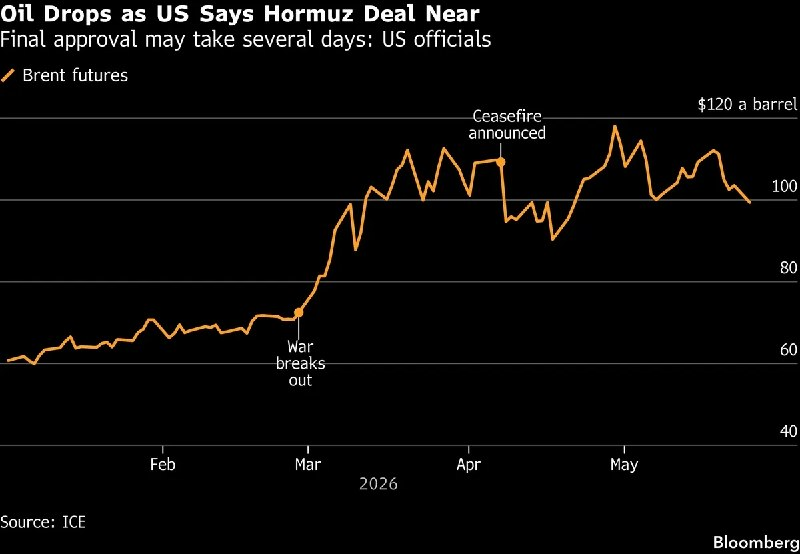

📊آسیا هفته را با خبرهایی آغاز کرد مبنی بر اینکه آمریکا و ایران به‌تدریج در حال نزدیک شدن به یک توافق هستند و بازارها نیز تصمیم گرفتند به جنبه مثبت ماجرا نگاه کنند: بلومبرگ

@mwarmonitor

## mwarmonitor — post 9665

🔴وزیر دارایی اسرائیل، بتسالل اسموتریچ:

🔸«برای هر پهپاد انفجاری حزب‌الله، باید ده ساختمان در بیروت با خاک یکسان شود.

🔹این هفته بودجه‌ای حدود دو میلیارد شکل برای راهکارهای فناورانه مقابله با تهدید پهپادها تصویب کردم. از جمله این بودجه به نهادهای غیرنظامی اجازه می‌دهد راهکارها و ایده‌های خلاقانه و خارج از چارچوب ارائه کنند.»

@mwarmonitor

## FoxNewsTwitter — post 342197

  

Fox News (Twitter/X)

JUST IN: President Trump releases a Memorial Day message ahead of taking part in a wreath-laying ceremony at Arlington National Cemetery:

"God Bless those that have made the ultimate sacrifice. I love you all!"

## FoxNewsTwitter — post 342196

  

Fox News (Twitter/X)

WATCH LIVE: Memorial Day ceremony to honor fallen service members https://twitter.com/i/broadcasts/1lJQRRRrOEkxE

## pm_afshaa — post 91451

  <a href="telegram/content/pm_afshaa_91451_1779712030.webm" target="_blank">🎬 Download video</a>

🔴رویترز: قالیباف و عراقچی برای گفت‌وگو درباره توافق با آمریکا وارد قطر شدن.

اولویت اصلی مذاکرات در دوحه، تنگه هرمز و غنی‌سازی اورانیوم هست.

رئیس بانک مرکزی که بخشی از هیئت ایرانی در دوحه بود، قراره درباره آزادسازی احتمالی دارایی مسدود شده ایران به عنوان بخشی از توافق نهایی میان ایران و آمریکا صحبت کنه.

💧 Rainbet.com the #1 Non-KYC Crypto Casino & Sportsbook @rainbetcom

😁 @Pm_Afshaa

## pm_afshaa — post 91450

  <a href="telegram/content/pm_afshaa_91450_1779712030.webm" target="_blank">🎬 Download video</a>

🔴فاکس نیوز: قالیباف و عراقچی امروز زودتر به قطر رسیدن برای مذاکرات مرتبط با تلاش‌های دیپلماتیک جاری که هدف آن پایان دادن به درگیری است.

💧 Rainbet.com the #1 Non-KYC Crypto Casino & Sportsbook @rainbetcom

😁 @Pm_Afshaa

## pm_afshaa — post 91449

🔴ترامپ: دموکرات‌ها سیاست‌های بد و نامزدهای بدی دارند. غیر از این، آن‌ها عملکرد نسبتاً خوبی دارن

💧 Rainbet.com the #1 Non-KYC Crypto Casino & Sportsbook @rainbetcom

😁 @Pm_Afshaa

## pm_afshaa — post 91448

  <a href="telegram/content/pm_afshaa_91448_1779712031.webm" target="_blank">🎬 Download video</a>

🔴واشنگتن پست به نقل از یک مقام ایرانی:
بازگشایی تنگه هرمز مرحله‌به‌مرحله انجام میشه. اول مین‌ها پاک‌سازی میشه، بعد محاصره آمریکا برداشته میشه و اون 12 میلیارد دلار دارایی مسدود شده هم آزاد میشه.

یه یادداشت هم امضا شده که اصلا ربطی به توافق هسته‌ای نداره، فقط قول دادیم که مذاکرات رو ادامه بدیم.

💧 Rainbet.com the #1 Non-KYC Crypto Casino & Sportsbook @rainbetcom

😁 @Pm_Afshaa

## pm_afshaa — post 91447

  <a href="telegram/content/pm_afshaa_91447_1779712031.webm" target="_blank">🎬 Download video</a>

🔴العربیه:
نخست‌وزیر پاکستان با رهبران چین درباره پرونده ایران و توافق با آمریکا صحبت کرد.

اسلام‌آباد اصرار داره که پکن نقش ضامن رو تو هر جور توافقی بین آمریکا و ایران بازی کنه.

💧 Rainbet.com the #1 Non-KYC Crypto Casino & Sportsbook @rainbetcom

😁 @Pm_Afshaa

## pm_afshaa — post 91446

  <a href="telegram/content/pm_afshaa_91446_1779712032.webm" target="_blank">🎬 Download video</a>

🔴صداوسیما از سفر عبدالناصر همتی، رییس کل بانک مرکزی، به قطر خبر داد و نوشت این سفر در حالی انجام شده که چند روز پیش هیاتی قطری برای گفت‌وگو درباره اموال بلوکه‌شده ایران در تهران حضور داشتن.

💧 Rainbet.com the #1 Non-KYC Crypto Casino & Sportsbook @rainbetcom

😁 @Pm_Afshaa

## pm_afshaa — post 91445

  <a href="telegram/content/pm_afshaa_91445_1779712032.webm" target="_blank">🎬 Download video</a>

🔴دیلی‌میل: تد کروز و لیندسی گراهام رهبری جمهوری‌خواهان رو بر عهده دارن که از توافق در حال شکل‌گیری ترامپ با ایران انتقاد میکنن و اونو اشتباهی فاجعه‌‌بار می‌دونن.

💧 Rainbet.com the #1 Non-KYC Crypto Casino & Sportsbook @rainbetcom

😁 @Pm_Afshaa

## pm_afshaa — post 91444

  <a href="telegram/content/pm_afshaa_91444_1779712033.webm" target="_blank">🎬 Download video</a>

🔴پست جدید ترامپ در تروث سوشال:

من میخندم به همه‌ی دموکرات‌های احمق و رینوها (جمهوری‌خواهان بدلی) و ابلهانی که هیچ‌چیز درباره‌ی توافق احتمالی من با ایران نمیدانند؛ چیزهایی که حتی هنوز مورد مذاکره هم قرار نگرفته‌اند. افراد ضعیف و بی‌خاصیتی مثل سناتور شکست‌خورده تام تیلیس (که به‌زودی از کار برکنار میشود!)، بیل کسیدی که همین چندهفته پیش یک شکست سنگین رو توی انتخابات درون‌حزبی تجربه کرد، و عضو واقعاً بد کنگره توماس مسی؛ یک آدم پست و رذل به تمام‌معنا که بعد از نشان دادن بی‌وفایی شدید به حزبش (و کشورش!)، در یک انتخابات قاطع (با اختلاف فاحش) به یک میهن‌پرست بزرگ آمریکایی (مورد حمایت "ترامپ") باخت. و تقریباً همه‌ی دموکرات‌های احمق، افرادی که کاملاً راه خودشون رو گم کرده‌اند، مدام از سیاست‌های بد و حتی نامزدهای بدتر حمایت میکنند، اما به‌طور مستمر از تک‌تک بردهای شگفت‌انگیز من انتقاد میکنند. این افراد باید بروند خانه و استراحت کنند، اونا کاری جز ایجاد تفرقه و باخت انجام نمیدهند. به عبارت دیگر، اونا بازنده هستند!

توافق با ایران یا یک توافق بزرگ و پرمحتوا خواهد بود، یا اصلاً توافقی در کار نخواهد بود. این توافق دقیقاً نقطه‌ی مقابل فاجعه‌ی برجام خواهد بود که توسط دولت شکست‌خورده‌ی اوباما مذاکره شد؛ توافقی که یک مسیر مستقیم و باز واسه رسیدن به سلاح هسته‌ای جلو پای ایران گذاشت. نخیر، من از این مدل توافق‌ها نمیکنم!

💧 Rainbet.com the #1 Non-KYC Crypto Casino & Sportsbook @rainbetcom

😁 @Pm_Afshaa

## pm_afshaa — post 91443

  <a href="telegram/content/pm_afshaa_91443_1779712033.webm" target="_blank">🎬 Download video</a>

🔴بقایی، سخنگوی وزارت خارجه:
درسته که تو خیلی از موضوعات به یه جمع‌بندی رسیدیم، ولی اگه بگیم این یعنی امضای یه توافق نزدیکه، کسی نمیتونه چنین ادعایی بکنه.

ما مدام میبینیم که موضع مقامات آمریکا تغییر میکنه و این روند هر گفت‌وگویی رو با اشکال و شک‌های زیادی مواجه میکنه

💧 Rainbet.com the #1 Non-KYC Crypto Casino & Sportsbook @rainbetcom

😁 @Pm_Afshaa

## pm_afshaa — post 91442

  <a href="telegram/content/pm_afshaa_91442_1779712034.webm" target="_blank">🎬 Download video</a>

🔴اکونومیست: عربستان از ترامپ خواسته هرگونه حمله جدید به ایران رو تا بعد از مراسم سالانه حج به تعویق بندازه.

ریاض نگرانه اگه درگیری دوباره آغاز و حریم هوایی منطقه بسته بشه، زائران در عربستان سعودی گیر بیفتن.

💧 Rainbet.com the #1 Non-KYC Crypto Casino & Sportsbook @rainbetcom

😁 @Pm_Afshaa

## pm_afshaa — post 91441

  <a href="telegram/content/pm_afshaa_91441_1779712034.webm" target="_blank">🎬 Download video</a>

🔴سی‌بی‌اس: مجتبی خامنه‌ای در مکانی نامعلوم با دسترسی کم به دنیای خارج پنهان شده و ارتباط با اون فقط از طریق شبکه‌ای از پیک‌ها انجام میشه.

حتی بسیاری از مقام‌های ارشد جمهوری اسلامی هم به مجتبی خامنه‌ای دسترسی مستقیم ندارن و همین روند مذاکرات و پاسخ تهران به پیشنهادهای آمریکا رو کند کرده.

💧 Rainbet.com the #1 Non-KYC Crypto Casino & Sportsbook @rainbetcom

😁 @Pm_Afshaa

## pm_afshaa — post 91440

تسنیم: مصوبه رفع انسداد اینترنت بین‌المللی تأیید شد و به دست پزشکیان رسید؛ اگر پزشکیان هم تأییدش کنه، این مصوبه برای اجرا به وزارت ارتباطات صادر می‌شه و تا هفته آینده نت بین‌المللی وصل می‌شه

💧 Rainbet.com the #1 Non-KYC Crypto Casino & Sportsbook @rainbetcom

😁 @Pm_Afshaa

## DEJradio — post 4937

⭕️ ترامپ گفت توافق با جمهوری اسلامی یا عالی و معنادار می‌شود یا توافقی در کار نیست

دونالد ترامپ، رئیس‌ جمهوری آمریکا، روز دوشنبه در شبکۀ اجتماعی تروث نوشت توافق احتمالی با جمهوری اسلامی یا «عالی و معنادار» می‌شود یا اصلا توافقی انجام نمی‌گیرد.
ترامپ منتقدان دموکرات و برخی جمهوری‌خواهان را متهم کرد که آنها دربارۀ موضوعاتی نظر می‌دهند که هنوز مذاکره نشده‌ است.
او بازهم توافق هسته‌ای برجام را «فاجعه» خواند. ترامپ گفت دولت باراک اوباما مسیری مستقیم و آشکار را برای دستیابی جمهوری اسلامی به جنگ‌افزار هسته‌ای ایجاد کرده بود.
رئیس‌ جمهوری آمریکا تأکید کرد توافق احتمالی دولت او دقیقأا درنقطۀ مقابل برجام قرار می‌گیرد.
ترامپ افزود: من چنین توافق‌هایی مشابه برجام را انجام نمی‌دهم.

#مذاکرات #ترامپ
@DEJradio

## DEJradio — post 4936

  <a href="telegram/content/DEJradio_4936_1779712035.mp4" target="_blank">🎬 Download video</a>

🔺📢 پیام از ساوه:
کارگر کارخانه پتروشیمی بودم، بعد از جنگ بیکار شدم

یک شهروند از ساوه با ارسال ویدیویی می‌گوید، «من تا قبل از جنگ تو شرکت محصولات پتروشیمی کار می‌کردم، الان بخاطر وضع اقتصادی بسته شده و همه کارگران و کارمنداش بیکاران و حقوق نمیگیرن. کسی به فکر ما نیست و معلوم نیست کی به‌درد ما برسن؟»

#ساوه #جنگ
@DEJradio

## DEJradio — post 4935

  <a href="telegram/content/DEJradio_4935_1779712036.mp4" target="_blank">🎬 Download video</a>

👑🎥 درخواست شهروندان داخل کشور؛ "اتحاد برای ایران"

#ایران #اتحاد
@DEJradio

## DEJradio — post 4934

  <a href="telegram/content/DEJradio_4934_1779712037.webm" target="_blank">🎬 Download video</a>

🔺📢 خبرنامه امیرکبیر؛
بیانیه جمعی از دانشجویان دانشگاه شیراز خطاب به اساتید:
زمانی که مردم را می‌کشتند، لال بودید؟

در پی اعتصاب اساتید دانشگاه شیراز به دلیل مسائل معیشتی، جمعی از دانشجوبان دانشگاه شیراز در نامه‌ای شدیدالحن، به سکوت این اساتید در قبال جنایت‌های حکومت اعتراض کردند. خبرنامه امیرکبیر متن کامل این نامه را روز دوشنبه چهارم خرداد ۱۴۰۵ منتشر کرد.

در مقدمه این بیانه آمده، این روزها شاهد صدور بیانیه‌های پرطمطراق و تعلیق فعالیت‌های آموزشی از سوی شورای صنفی اساتید دانشگاه شیراز هستیم. حضرات اساتید ناگهان یاد «شأن و کرامت اعضای هیئت علمی» افتاده‌اند و با واژه‌های مقدسی چون «ساحت دانایی»، «اخلاق» و «حاکمیت قانون» کلاس‌ها را تعطیل کرده‌اند. اما ما دانشجویان، حافظه تاریخی خود را از دست نداده‌ایم و این نمایش ریاکارانه را با شدیدترین لحن ممکن محکوم می‌کنیم.

‌آقایان و خانم‌های استاد! بیانیه‌های امروز شما نه نشانه‌ای از بیداری وجدان، بلکه اوج فرار رو به جلو و عافیت‌طلبی است. نگاهی به کارنامه‌تان بیندازید تا ببینید چرا حق ندارید پشت نام دانشجو و آینده این سرزمین سنگر بگیرید:
وقتی ظلم آشکار بود، لال بودید: در تمام سال‌هایی که بدیهی‌ترین حقوق انسانی و شهروندی مردم در جامعه زیر پا گذاشته می‌شد، صدای اعتراض و تظلم‌خواهی هیچ‌کدام از شما از دیوارهای این دانشگاه بلند نشد. چشم بر روی حقیقت بستید تا صندلی‌های امن خود را حفظ کنید.

‌ وقتی مردم را می‌کشتند، لال بودید: در روزهای خونین و تلخی که جان جوانان و مردم بی‌گناه در خیابان‌ها گرفته می‌شد، شما سکوت مصلحتی را ترجیح دادید. در برابر فاجعه چشم‌پوشی کردید و ترجیح دادید مرزهای عافیت‌طلبی‌تان مخدوش نشود.
‌ وقتی دانشجویان اعتصاب کردند، شما بازجو و ناظم شدید: روزهایی را به یاد بیاورید که همین دانشجویان برای دفاع از شرف، آزادی و حق ابتدایی خود دست به اعتراض و تحریم کلاس‌ها زدند. شما نه تنها همراه و پناه شاگردانتان نشدید، بلکه در نقش بازوی انضباطی ظاهر شدید... [برای دسترسی به متن کامل این بیانیه به خبرنامه امیرکبیر مراجعه شود]

#خبرنامه_امیرکبیر #دانشگاه_شیراز
@DEJradio

## DEJradio — post 4933

  <a href="telegram/content/DEJradio_4933_1779712038.webm" target="_blank">🎬 Download video</a>

🔺📌 با توجه به شرایط اقتصادی ایران، بسیاری از مردم برای تامین لوازم زندگی از روی ناچاری سراغ سمساری‌ها و دست دوم فروشی‌ها می‌روند. گزارش‌های میدانی حاکی از آن است حتی خرید اقساط از سمساری‌ها نیز بیشتر شده است:
از آخرین باری که برای منزل لوازم جدید خرید کردید چقدر می‌گذرد؟ آیا پول شما به خرید دکور می‌رسد؟ مثلا خرید یک مجسمه؛ در اروپا یک استقبال از مجسمه دکوری زیاد شده: مجسمه یا تندیس آلت جنسی!

#مجسمه #آلت_جنسی
@DEJradio

## DEJradio — post 4932

  <a href="telegram/content/DEJradio_4932_1779712038.webm" target="_blank">🎬 Download video</a>

🔺📢 صبح روز دوشنبه ۴ خرداد و در جریان عملیات آواربرداری در پالایشگاه ششم پارس جنوبی، حادثه‌ای رخ داد که به مصدوم شدن شش تن از کارکنان شرکت پیمانکار انجامید.

به گفته ابراهیم عباسی، سخنگوی مجتمع گاز پارس جنوبی، این حادثه حدود ساعت ۱۰ صبح روز دوشنبه چهارم خرداد و هنگام پاک‌سازی بقایای تأسیسات آسیب‌دیده رخ داده است.

بر اساس این گزارش، سه تن از مصدومان به صورت سرپایی درمان شدند و سه نفر دیگر برای بررسی‌های بیشتر به بیمارستان عسلویه منتقل شده‌اند. مقام‌های مسئول اعلام کرده‌اند علت وقوع این حادثه همچنان در دست بررسی است.

#آواربرداری #عسلویه
@DEJradio

## mamlekate — post 103580

📝 سفر همتی به قطر در سایه پرونده پول‌های بلوکه‌شده

خبرگزاری ایلنا از سفر عبدالناصر همتی، رئیس کل بانک مرکزی جمهوری اسلامی، به قطر خبر داد و نوشت یکی از دلایل سفر همتی به قطر پیگیری آزادسازی منابع ارزی ایران است.

📝 اولین جلسه حضوری مجلس جمهوری اسلامی پس از جنگ

@mamlekate

## kianmeli1 — post 87657

🔴ادعای فاکس نیوز به نقل از منابع مطلع:

محمدباقر قالیباف، رئیس مجلس و رییس تیم مذاکرکننده ایران و عباس عراقچی، وزیر امور خارجه، امروز وارد دوحه شدند تا مذاکرات مرتبط با تلاش‌های دیپلماتیک جاری که هدف آن پایان دادن به درگیری است را پیگیری کنند.
https://t.me/kianmeli1

## kianmeli1 — post 87656

  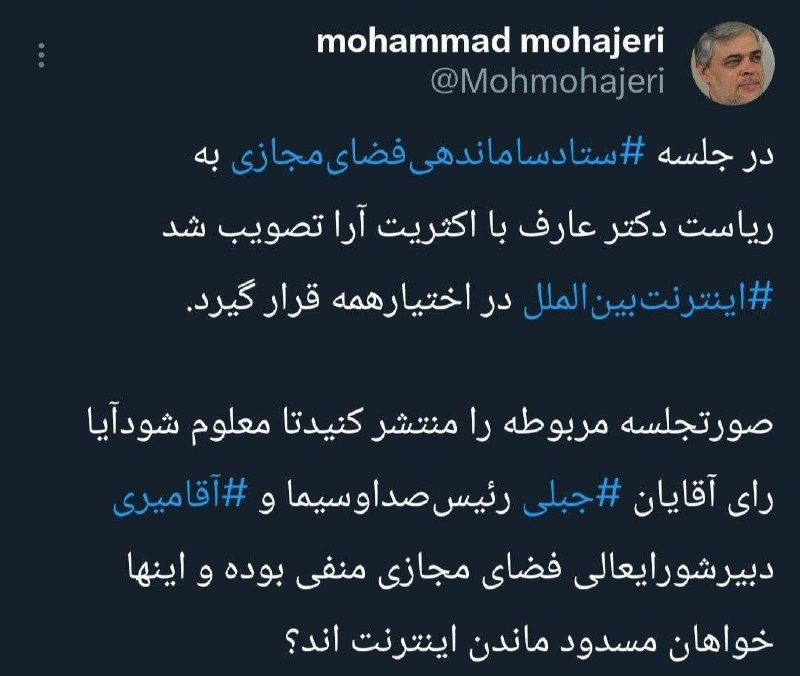

🔴محمد مهاجری: کدام مسئولان رأی به مسدود ماندن اینترنت دادند؟

در جلسه فضاي مجازي به رياست عارف تصويب شد اينترنت بين الملل در اختيار همه قرار گيرد
صورتجلسه را منتشر كنيد تا معلوم شود آيا راي جبلي رييس صداوسيما و آقا ميري دبير شوراي فضاي مجازي منفي بوده و خواهان مسدود ماندن اينترنت اند؟
https://t.me/kianmeli1

## kianmeli1 — post 87653

🔴در روبیکا و جاهای دیگه به اسم کیان ملی کانال ساختن و فیلترشکن میفروشن مراقب باشید اونجاها دست افراد مشکوکه

نمونه پیام: بنده داخل روبیکا به اسم کیان ملی بهم دو بار فیلتر فروختن
دیگه هم‌جواب ندادن
تو شونم ادعا شون میشد چنل تلگرام مال اوناس
https://t.me/kianmeli1

## kianmeli1 — post 87652

🔴زلزله ۴.۷ ریشتری لافت هرمزگان بزرگترین لرزه ثبت‌شده در کشور
https://t.me/kianmeli1

## kianmeli1 — post 87651

  <a href="telegram/content/kianmeli1_87651_1779712039.mp4" target="_blank">🎬 Download video</a>

🔴من تا قبل از جنگ تو این شرکت محصولات پتروشیمی تو ساوه کار میکردم که الآن بخاطر وضع اقتصادی بسته شده و همه کارگرا و کارمنداش بیکارن و حقوق نمیگیرن.
کسی به فکر ما نیست و معلوم نیست کی بدرد ما برسن؟
https://t.me/kianmeli1

## kianmeli1 — post 87650

  <a href="telegram/content/kianmeli1_87650_1779712040.mp4" target="_blank">🎬 Download video</a>

🔴اسماعیل بقایی، سخنگوی وزارت خارجه جمهوری اسلامی که همزمان سخنگوی تیم مذاکره‌کننده با آمریکاست، صبح امروز در نشست خبری گفت: «کسی نمی‌تواند ادعا کند که به توافق نزدیک شده‌ایم. تغییرات مکرر مواضع مقامات آمریکایی هر گفت‌گویی را دچار اشکال می‌کند. در حوزه هسته‌ای هیچ مذاکره‌ای نمی‌کنیم و هر اقدام خصمانه‌ای نیز با واکنش شدید ایران مواجه خواهد شد. همچنین بحثی در مورد جزئیات مدیریت تنگه هرمز نداریم و اینکه تنگه به چه شیوه‌ای مدیریت شود، مربوط به دولت‌های ساحلی آن است.»
https://t.me/kianmeli1

## kianmeli1 — post 87649

  <a href="telegram/content/kianmeli1_87649_1779712042.mp4" target="_blank">🎬 Download video</a>

🔴تحلیلگر صداسیما: پول بشینه توی حساب جمهوری اسلامی میریم پای میز مذاکره
https://t.me/kianmeli1

## IranIntlTV — post 338918

  

🔻اسماعیل بقایی، سخنگوی وزارت امور خارجه در نشست خبری خود درباره ویزای اعضای تیم ملی فوتبال گفت: «طرف ما فیفاست. سفر تیم فوتبال ایران به آمریکا، هیچ هدف دیگری جز شرکت در مسابقات جام جهانی ندارد. برگزارکننده فیفاست و بر اساس قواعد فیفا عمل می‌شود.»

🔹او گفت: «آمریکا موظف است همه شرایط لازم را برای حضور بدون مشکل تیم ملی فوتبال ایران فراهم کند.»

🔹بقایی درباره تغییر کمپ تیم ملی گفت: «تصمیمی که فدراسیون فوتبال گرفته، در هماهنگی کامل با فیفا، فدراسیون فوتبال مکزیک و با طرف‌های ذی‌ربط آمریکایی بوده، تا مانع ایجاد مشکل برای تیم ملی شوند.»

🔹روز شنبه، مهدی تاج، رییس فدراسیون فوتبال خبر داد که کمپ تیم ملی از آریزونای آمریکا به تیخوانای مکزیک تغییر کرده و به گفته او با این تغییر، مشکل ویزا برطرف می‌شود.

@iranintltvsport

## IranIntlTV — post 338917

  <a href="telegram/content/IranIntlTV_338917_1779712044.mp4" target="_blank">🎬 Download video</a>

🔻قهرمانی آرسنال در لیگ برتر فوتبال انگلستان، هفته گذشته، پس از ۲۲ سال انتظار، قطعی شد و دیشب با پایان فصل سرخ‌پوش‌های لندن چهاردهمین جام قهرمانی‌ را بالای سر بردند. شبی تاریخی که با نام عارف جعفرزاده، از جاویدنامان انقلاب ملی گره خورد.

🔹عارف جعفرزاده، هوادار ۳۲ ساله تیم آرسنال و اهل رشت بود که در اعتراضات دی‌ماه ۱۴۰۴ به دست نیروهای سرکوبگر جان خود را از دست داد.

🔹گزارش آیدین مقیمی، ایران اینترنشنال از آخرین بازی خانگی آرسنال

@iranintltvsport

## IranIntlTV — post 338916

  <a href="telegram/content/IranIntlTV_338916_1779712046.mp4" target="_blank">🎬 Download video</a>

مقام‌های اسرائیلی نسبت به توافق احتمالی میان جمهوری اسلامی و آمریکا ابراز نگرانی کردند و آن را توافقی بد توصیف کردند.

بابک اسحاقی، خبرنگار ایران‌اینترنشنال، گزارش می‌دهد

@iranintltv

## IranIntlTV — post 338915

  <a href="telegram/content/IranIntlTV_338915_1779712047.mp4" target="_blank">🎬 Download video</a>

علیرضا اعوانی، مدیرعامل شرکت گاز استان تهران، در یک برنامه تلویزیونی اعلام کرد تعرفه گاز ۸۲ درصد افزایش یافت. تشدید بحران انرژی و سوخت در ایران و سیاست‌های دولت برای کنترل مصرف، واکنش‌های گسترده‌ای در پی داشته است.

گفت‌وگو با آرش آزرمی، دبیر بخش اقتصادی ایران‌اینترنشنال

@iranintltv

## IranIntlTV — post 338914

  <a href="telegram/content/IranIntlTV_338914_1779712049.mp4" target="_blank">🎬 Download video</a>

یک شهروند با ارسال ویدیویی به ایران‌اینترنشنال می‌گوید راننده تاکسی اینترنتی است و سهمیه بنزین در نظر گرفته‌شده برای او کفاف سه روز کاری‌اش را هم نمی‌دهد: «حالا کارت آزاد جایگاه‌ها را هم حذف کرده‌اند و نمی‌دانیم چه کنیم.»

## IranIntlTV — post 338913

  

رویترز به نقل از یک مقام آگاه گزارش داد محمدباقر قالیباف و عباس عراقچی برای دیدار با نخست‌وزیر قطر، در خصوص توافق احتمالی میان جمهوری اسلامی و آمریکا، وارد دوحه شده‌اند.

پیش‌تر رسانه‌های ایران از سفر عبدالناصر همتی، رییس کل بانک مرکزی به قطر خبر داده بودند.
iranintl.com/202605250172

## IranIntlTV — post 338912

  <a href="telegram/content/IranIntlTV_338912_1779712051.mp4" target="_blank">🎬 Download video</a>

نعیم قاسم، دبیرکل حزب‌الله لبنان، ابراز امیدواری کرد هرگونه توافق احتمالی میان جمهوری اسلامی و ایالات متحده به توقف کامل جنگ در لبنان منجر شود.

گفت‌وگو با می فرحات، خبرنگار ایران‌اینترنشنال

@iranintltv

## IranIntlTV — post 338911

در ادامه کارزار ثبت حقیقت درباره جاویدنامان انقلاب ملی، ایران‌اینترنشنال جزییات تازه‌ای از جان‌باختن رئوف درخشانی‌مهر در جریان اعتراضات دی‌ماه روایت می‌کند.

فرنوش فرجی، عضو تحریریه ایران‌اینترنشنال، گزارش می‌دهد

@iranintltv

## IranIntlTV — post 338910

  <a href="telegram/content/IranIntlTV_338910_1779712052.mp4" target="_blank">🎬 Download video</a>

مروری بر روزنامه‌های ایران، دوشنبه ۴ خرداد، با مجتبی هاشمی، روزنامه‌نگار
@iranintltv

## IranIntlTV — post 338909

  

پایگاه خبری بلومبرگ گزارش داد شرکت نفت ابوظبی در هفته‌های اخیر با استفاده از ناوگان خود و به‌کارگیری روش‌های خاص، صادرات نفت و گاز از خلیج فارس را ادامه داده است.

بر اساس این گزارش، برخی نفتکش‌ها با خاموش کردن سامانه‌های ردیابی هنگام عبور از تنگه هرمز موفق شده‌اند محموله‌ها را جابه‌جا کنند. هم‌زمان، قطر نیز به‌صورت نامحسوس صادرات گاز طبیعی مایع (ال‌ان‌جی) را از تنگه هرمز ادامه داده و دست‌کم یک کشتی حامل ال‌ان‌جی پس از عبور از این مسیر راهبردی، در مسیر چین رصد شده است. اگرچه حجم این انتقال‌ها هنوز با سطح تجارت پیش از جنگ فاصله دارد، اما به گفته بلومبرگ، این تحرکات نشان‌دهنده تلاش تولیدکنندگان انرژی منطقه برای حفظ جریان صادرات و ایجاد موازنه میان فشارهای ایران و ایالات متحده است.
iranintl.com/202605253407

## IranIntlTV — post 338908

  

علیرضا سلیمی، عضو هیات رییسه مجلس، گفت آمریکا هیچ‌گاه به دنبال مذاکره واقعی برای پایان دادن به تنش‌ها نبوده و از میز مذاکره فقط به‌عنوان «تله‌گذاری» برای پیشبرد اقدامات «خصمانه» بعدی استفاده می‌کند.

او افزود: «اگر مقام‌های آمریکایی صادق بودند و حسن نیت داشتند، هم‌زمان با سخن گفتن از مذاکره، تحریم‌های جدید علیه جمهوری اسلامی اعمال نمی‌کردند.»
iranintl.com/202605259691

## IranIntlTV — post 338907

  

خبرگزاری فارس، وابسته به سپاه پاسداران، ضمن اعلام خبر سفر عبدالناصر همتی، رییس بانک مرکزی جمهوری اسلامی به قطر، نوشت که این سفر پیرامون بررسی «آزادسازی اموال بلوکه‌شده» و در راستای کمیسیون اقتصادی مذاکرات انجام شده است.

این در حالی است که در روزهای اخیر و در جریان مذاکرات، هیاتی قطری به ایران سفر کرده بود.
https://iranintl.com/202605259276

## IranIntlTV — post 338906

  <a href="telegram/content/IranIntlTV_338906_1779712055.mp4" target="_blank">🎬 Download video</a>

یک شهروند با ارسال پیام به ایران‌اینترنشنال سمی‌گوید: «در کاشان سر هر چهارراه و میدان چادر زده‌اند و به زن‌ها و بچه‌ها تیراندازی و کار با تفنگ یاد می‌دهند. دارند از بچه‌ای که باید از این مسائل دور باشد، سوءاستفاده ابزاری می‌کنند و افکار و روحیاتش را خراب می‌کنند.»

## IranIntlTV — post 338905

  <a href="telegram/content/IranIntlTV_338905_1779712056.mp4" target="_blank">🎬 Download video</a>

سرخط خبرهای دوشنبه ۴ خرداد
@iranintltv

## IranIntlTV — post 338904

  

سایت هرانا خبر داد گلرخ ایرایی، زهرا صفایی، مرضیه فارسی، شیوا اسماعیلی و سکینه پروانه، پنج تن از زندانیان سیاسی محبوس در بند زنان زندان اوین، از یکشنبه به‌صورت تنبیهی از حق استفاده از تلفن زندان محروم شده‌اند.

هرانا نوشت محرومیت تنبیهی این پنج زندانی سیاسی پس از آن اعمال شد که آنان در اعتراض به اجرای احکام اعدام، در محوطه هواخوری زندان شعار داده بودند.

این زندانیان پیش‌تر نیز از حق ملاقات حضوری با خانواده و وکلای خود محروم بوده‌اند و این محدودیت همچنان ادامه دارد.
https://iranintl.com/202605252442

## IranIntlTV — post 338903

  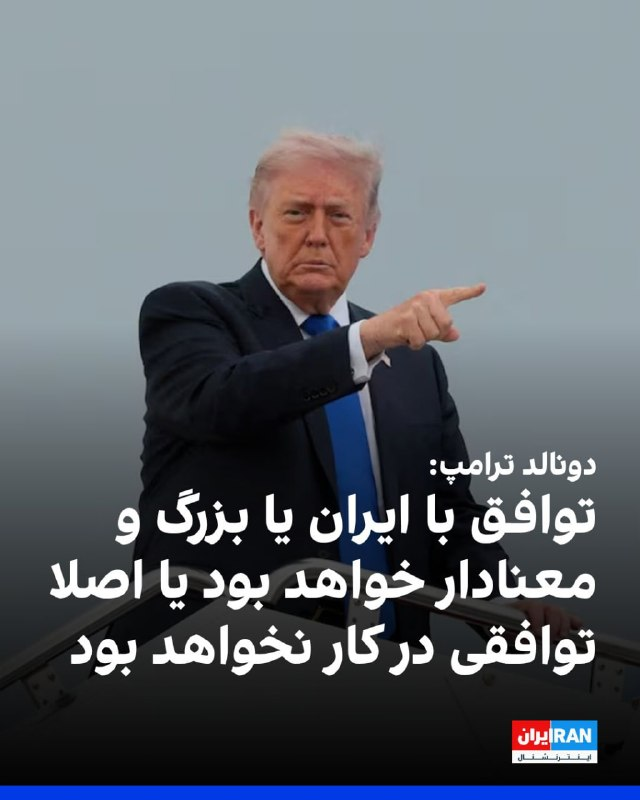

دونالد ترامپ در شبکه تروث سوشال نوشت: «توافق با ایران یا یک توافق بزرگ و معنادار خواهد بود یا اصلا توافقی در کار نخواهد بود. این دقیقا برعکس فاجعه برجام است که توسط دولت شکست‌خورده اوباما انجام شد؛ توافقی که یک مسیر مستقیم و آشکار برای دستیابی آن‌ها به سلاح هسته‌ای بود. نه، من چنین توافق‌هایی انجام نمی‌دهم.»

او افزود: «من به همه دموکرات‌ها و جمهوری‌خواهانِ اسمی و احمق‌هایی می‌خندم که هیچ چیزی درباره توافق احتمالی که من با ایران در حال انجامش هستم نمی‌دانند؛ موضوعاتی که هنوز حتی درباره‌شان مذاکره هم نشده است.»
iranintl.com/202605255000

## IranIntlTV — post 338902

  <a href="telegram/content/IranIntlTV_338902_1779712058.mp4" target="_blank">🎬 Download video</a>

روزنامه شرق از بلاتکلیفی آموزش و پرورش برای حضوری کردن کلاس‌ها و چالش خانواده‌ها در ثبت‌نام سال تحصیلی جدید گزارش داد. بنا بر این گزارش، معاون وزیر آموزش و پرورش گفت: «تصمیم به حضوری کردن مدارس در اختیار آموزش و پرورش نیست.»

گفت‌وگو با لیلا سعادتی، عضو تحریریه ایران‌اینترنشنال

@iranintltv

## IranIntlTV — post 338901

  <a href="telegram/content/IranIntlTV_338901_1779712060.mp4" target="_blank">🎬 Download video</a>

پلیس ضد شورش ترکیه یکشنبه با شلیک گاز اشک‌آور وارد دفتر مرکزی حزب جمهوری‌خواه خلق، بزرگ‌ترین حزب مخالف دولت رجب طیب اردوغان، شد تا رهبر برکنار‌شده این حزب را بیرون کند.

گفت‌وگو با میثم بادامچی، نویسنده و پژوهشگر علوم سیاسی

@iranintltv

## IranIntlTV — post 338900

  <a href="telegram/content/IranIntlTV_338900_1779712061.mp4" target="_blank">🎬 Download video</a>

ویدیوهای رسیده به ایران‌اینترنشنال نشان می‌دهند گروهی از ایرانیان مقیم آلمان هم‌زمان با فستیوال موسیقی گوتیک‌ویو در شهر لایپزیگ علیه جمهوری اسلامی راهپیمایی نمادین برگزار کردند.
این تجمع با پوشیدن لباس مشکی، پخش موسیقی نویز و نصب نماد «وای‌فای خاموش» بر دهان شرکت‌کنندگان همراه بود؛ حرکتی اعتراضی برای جلب توجه افکار عمومی به کشتارهای رخ‌داده در ایران و بی‌توجهی سیاستمداران اروپایی.

## IranIntlTV — post 338899

  <a href="telegram/content/IranIntlTV_338899_1779712063.mp4" target="_blank">🎬 Download video</a>

یک شهروند با ارسال پیامی به ایران‌اینترنشنال می‌گوید: «مگر ما در ۱۸ و ۱۹ دی، در خیابان فریاد زدیم که توافق هسته‌ای جدید می‌خواهیم؟ توافق هسته‌ای که قبلا انجام شده بود. ما فریاد آزادی سر دادیم، نه فریاد توافق هسته‌ای که حالا ترامپ می‌خواهد انجام دهد.»

## Shin_Persian — post 6217

  

Shin ✓ @hey_itsmyturn Mon, 25 May 2026 12:25:27 UTC President Trump @POTUS: "Negotiations with the Islamic Republic of Iran are proceeding nicely! It will only be a Great Deal for all or, no Deal at all — Back to the Battlefront and shooting, but bigger…

## Shin_Persian — post 6216

Shin ✓ @hey_itsmyturn
Mon, 25 May 2026 12:25:27 UTC

President Trump @POTUS:
"Negotiations with the Islamic Republic of Iran are proceeding nicely! It will only be a Great Deal for all or, no Deal at all — Back to the Battlefront and shooting, but bigger and stronger than ever before — And nobody wants that! During my discussions on Saturday with President Mohammed bin Salman Al Saud, of Saudi Arabia, Mohammed bin Zayed Al Nahyan, of The United Arab Emirates, Emir Tamim bin Hamad bin Khalifa Al Thani, Prime Minister Mohammed bin Abdulrahman bin Jassim bin Jaber Al Thani, and Minister Ali al-Thawadi, of Qatar, Field Marshal Syed Asim Munir Ahmed Shah, of Pakistan, President Recep Tayyip Erdoğan, of Türkiye, President Abdel Fattah El-Sisi, of Egypt, King Abdullah II, of Jordan, and King Hamad bin Isa Al Khalifa, of Bahrain, I stated that, after all the work done by the United States to try and pull this very complex puzzle together,  it should be mandatory that all of these Countries, at a minimum, simultaneously, sign onto the Abraham Accords. Those Countries discussed are Saudi Arabia, The United Arab Emirates (already a Member!), Qatar, Pakistan, Türkiye, Egypt, Jordan, and Bahrain (already a Member!). It may be possible that one or two have a reason for not doing so, and that will be accepted, but most should be ready, willing, and able to make this Settlement with Iran a far more Historic Event than it would, otherwise, be. The Abraham Accords have proven to be, for the Countries involved (The United Arab Emirates, Bahrain, Morocco, Sudan, and Kazakhstan), a Financial, Economic, and Social BOOM, even during this time of Conflict and War, with the current Members never even suggesting leaving, or taking so much as even a pause. The reason for this is that the Abraham Accords have been great for them, and will be even better for everybody, and bring true Power, Strength, and Peace to the Middle East for the first time in 5,000 years. It will be a Document respected like no other that has ever been signed, anywhere in the World. Its level of Importance and Prestige will be unparalleled! It should start with the immediate signing by Saudi Arabia and Qatar, and everybody else should follow suit. If they don’t, they should not be part of this Deal in that it shows bad intention. In speaking to numerous of the Great Leaders mentioned above, they would be honored, as soon as our Document is signed, to have the Islamic Republic of Iran as part of the Abraham Accords. Wow, now that would be something special! This will be the most important Deal that any of these Great, but always in Conflict Countries, will ever sign. Nothing in the past, or in the future, will surpass it. Therefore, I am mandatorily requesting that all Countries immediately sign the Abraham Accords, and that, if Iran signs its Agreement with me, as President of the United States of America, it would be an Honor to have them also be part of this unparalleled World Coalition. The Middle East would be United, Powerful, and Economically Strong, like perhaps no other area, anywhere in the World! By copy of this TRUTH, I am asking my Representatives to begin, and successfully complete, the process of signing these Countries into the already Historic Abraham Accords. Thank you for your attention to this matter!DONALD J. TRUMPPRESIDENT OF THE UNITED STATES OF AMERICA"

ترجمه فارسی در بخش نظرات

𝕏 · @shin_persian

## Shin_Persian — post 6215

Shin ✓ @hey_itsmyturn
Mon, 25 May 2026 12:23:07 UTC

State-owned Mehr reports that Regime’s parliament spokesman, Mohammad Bagher Ghalibaf, as well as FM Araghchi and Head of the Central Bank Hemmati have traveled to Qatar to discuss the ceasefire talks and sanction relief
#Iran

فارسی

خبرگزاری دولتی مهر گزارش می‌دهد که محمدباقر قالیباف سخنگوی مجلس رژیم، به همراه عراقچی وزیر امور خارجه و همتی رئیس بانک مرکزی برای گفتگو درباره مذاکرات آتش‌بس و رفع تحریم‌ها به قطر سفر کرده‌اند.
#Iran

𝕏 · @shin_persian

## Shin_Persian — post 6214

  

Shin ✓ @hey_itsmyturn Mon, 25 May 2026 10:15:32 UTC President Trump @POTUS: "I laugh at all of the Dumocrats, RINOS, and Fools who know nothing about the potential deal I am making with Iran, things that haven’t even been negotiated yet, weak and ineffective…

## Shin_Persian — post 6213

Shin ✓ @hey_itsmyturn
Mon, 25 May 2026 10:15:32 UTC

President Trump @POTUS:
"I laugh at all of the Dumocrats, RINOS, and Fools who know nothing about the potential deal I am making with Iran, things that haven’t even been negotiated yet, weak and ineffective people like failed Senator Thom Tillis (Soon out of office!), Bill Cassidy, who just suffered a massive Primary loss, really bad Congressman Thomas Massie, a major sleazebag who lost in a landslide to a great American Patriot (Endorsed by “TRUMP”) after showing tremendous disloyalty to his Party (and Country!), and almost all Dumocrats, people that have totally lost their way, constantly supporting bad policy and even worse candidates, but are constantly critical of each and every fantastic win I have. These people should go home and rest, they do nothing but create division and loss. In other words, they are losers! The deal with Iran will either be a great and meaningful one, or there will be no deal. It will be the exact opposite of the JCPOA disaster negotiated by the failed Obama Administration, which was a direct and open path to a Nuclear Weapon for Iran. No, I don’t do deals like that! President DJT"

فارسی

رئیس‌جمهور ترامپ @POTUS:
«من به تمام دموکرات‌های نادان (Dumocrats)، راینوها (RINOs - جمهوری‌خواهان اسمی) و احمق‌هایی که هیچ‌چیز درباره توافق احتمالی من با ایران نمی‌دانند می‌خندم؛ مواردی که هنوز حتی درباره آن‌ها مذاکره هم نشده است. افراد ضعیف و بی‌کفایتی مانند سناتور شکست‌خورده تام تیلیس (که به‌زودی از سمتش برکنار می‌شود!)، بیل کسیدی که همین اواخر شکست سنگینی در انتخابات مقدماتی متحمل شد، کنگره‌منِ واقعاً بد توماس مسی، یک رذل تمام‌عیار که پس از نشان دادن بی‌لیاقتی و بی‌وفایی عظیم به حزب (و کشورش!) با شکستی فاحش در برابر یک میهن‌پرست بزرگ آمریکایی (مورد حمایت "ترامپ") شکست خورد، و تقریباً تمام دموکرات‌های نادان؛ افرادی که کاملاً راهشان را گم کرده‌اند، مدام از سیاست‌های بد و نامزدهای حتی بدتر حمایت می‌کنند، اما به‌طور مداوم از تک‌تک پیروزی‌های شگفت‌انگیز من انتقاد می‌کنند. این افراد باید به خانه بروند و استراحت کنند، آن‌ها کاری جز ایجاد تفرقه و شکست انجام نمی‎دهند. به عبارت دیگر، آن‌ها بازنده هستند! توافق با ایران یا توافقی بزرگ و معنادار خواهد بود یا اصلاً توافقی در کار نخواهد بود. این دقیقاً برعکس فاجعه برجام (JCPOA) خواهد بود که توسط دولت شکست‌خورده اوباما مذاکره شد؛ توافقی که مسیری مستقیم و باز برای رسیدن ایران به سلاح هسته‌ای بود. خیر، من چنین توافق‌هایی نمی‌کنم! پرزیدنت دی‌جی‌تی»

𝕏 · @shin_persian

## ManotoTV — post 105828

  <a href="telegram/content/ManotoTV_105828_1779712065.mp4" target="_blank">🎬 Download video</a>

تماسی از هلند:
«می‌گفت هر روز با برنامه‌های منوتو زندگی می‌کردیم…
و حالا نمی‌دانیم بعد از آن باید چه کنیم.»
او همچنین از جاویدنام سینا حق‌شناس یاد کرد؛ دوستی که خبر جان‌باختنش زندگی او را زیر و رو کرده بو

## ManotoTV — post 105827

  <a href="telegram/content/ManotoTV_105827_1779712067.mp4" target="_blank">🎬 Download video</a>

گفت‌وگو درباره اعتراضات خارج از کشور:
« چه رفتارهایی به همبستگی و رساندن پیام مردم ایران کمک می‌کند؟»

## FarsiVOA — post 218609

رسانه‌های محلی گزارش دادند یک زن پاراگلایدرسوار در آسمان اتریش با یک هواپیمای سسنا ۱۷۲ برخورد کرد.

او پس از فعال کردن چتر نجات اضطراری، سالم فرود آمد و خلبان هواپیما نیز توانست هواپیما را با موفقیت فرود بیاورد.

@FarsiVOA

## FarsiVOA — post 218608

🔺ترامپ: توافق با تهران یا «بزرگ و معنادار» خواهد بود یا اصلاً در کار نخواهد بود

◾️دونالد ترامپ با دفاع از روند مذاکرات کنونی با جمهوری اسلامی، اعلام کرد که واشنگتن یا به یک «توافق بزرگ و معنادار» دست خواهد یافت یا هیچ توافقی انجام نخواهد شد.

◾️او در پیامی در شبکه تروت‌سوشال تصریح کرد که «این توافق دقیقاً نقطه مقابل فاجعه برجام خواهد بود که توسط دولت شکست‌خورده اوباما مذاکره شد؛ توافقی که یک مسیر مستقیم و آشکار به سوی دستیابی ایران به سلاح هسته‌ای بود.»

◾️ساعاتی قبل، وزیر خارجه آمریکا، اعلام کرد که واشنگتن با تهران به یک توافق خوب خواهد رسید یا به «شیوه‌ای دیگر» با جمهوری اسلامی برخورد خواهد کرد، زیرا هیچ کس به اندازه دونالد ترامپ نسبت به تهدید هسته‌ای حکومت ایران جدی نبوده است.

⬇️ بیشتر بخوانید:
https://ir.voanews.com/a/deal-with-iran-will-be-great-and-meaningful-or-there-will-be-no-deal-trump-says/8153584.html

## FarsiVOA — post 218607

🔺مصوبه «اتصال اینترنت بین‌الملل» برای اجرا «در انتظار تأیید پزشکیان» است

◾️منابع داخلی ایران از تصویب مصوبه‌ای تازه درباره اتصال اینترنت بین‌الملل خبر داده‌اند؛ مصوبه‌ای که هنوز اجرا نشده و اجرای آن به تأیید نهایی مسعود پزشکیان و ابلاغ به وزارت ارتباطات و فناوری اطلاعات منوط است.

◾️جزئیات دقیق مصوبه، سطح اتصال، زمان اجرا و اینکه آیا این تصمیم شامل بازگشت عمومی اینترنت بین‌الملل می‌شود یا فقط بخشی از محدودیت‌ها را کاهش می‌دهد، هنوز اعلام نشده است.

◾️ستاد ویژه ساماندهی فضای مجازی، به تازگی به حکم پزشکیان به معاون اولش عارف تشکیل شده و نخستین تصمیم مهم این ستاد در شرایطی اعلام می‌شود که هم‌زمان گزارش‌هایی درباره کم‌تحرکی شورای عالی فضای مجازی منتشر شده است.

⬇️ بیشتر بخوانید:
https://ir.voanews.com/a/8153583.html

## FarsiVOA — post 218606

🔺سفر همتی به قطر در سایه پرونده پول‌های بلوکه‌شده

◾️خبرگزاری ایلنا از سفر عبدالناصر همتی، رئیس کل بانک مرکزی جمهوری اسلامی، به قطر خبر داد و نوشت یکی از دلایل سفر همتی به قطر پیگیری آزادسازی منابع ارزی ایران است.

◾️قطر از سال ۲۰۲۳ به یکی از گره‌های اصلی پرونده مالی ایران و آمریکا تبدیل شد؛ زمانی که حدود شش میلیارد دلار از پول‌های ایران که در کره جنوبی مسدود بود، به حساب‌هایی در قطر منتقل شد.

◾️اخیراً و در جریان مذاکرات تهران و واشنگتن، موضوع دارایی‌های مسدودشده جمهوری اسلامی بار دیگر مطرح شد.

◾️قطر هم محل نگهداری بخشی از منابع مسدودشده ایران است، هم کانال میانجی‌گری با آمریکا، هم طرف گفت‌وگو با واشنگتن درباره امنیت تنگه هرمز.

⬇️ بیشتر بخوانید:
https://ir.voanews.com/a/8153581.html

## FarsiVOA — post 218605

  

شی جین‌پینگ، رئیس‌جمهوری چین، در دیدار با شهباز شریف، نخست‌وزیر پاکستان در پکن، از دوستی «ناگسستنی» میان پکن و اسلام‌آباد و همچنین تلاش‌های پاکستان برای پایان جنگ علیه حکومت ایران تمجید کرد.

در این دیدار که روز دوشنبه برگزار شد، عاصم منیر، فرمانده ارتش پاکستان، نیز شریف را همراهی می‌کرد. منیر به‌تازگی برای دستیابی به یک توافق میان تهران و واشنگتن به ایران سفر کرد.

شی روز دوشنبه هنگام استقبال از هیئت پاکستانی گفت: «می‌دانم که شما تازه از ایران بازگشته‌اید و برای صلح کنونی تلاش‌های مثبتی انجام داده‌اید. ما همچنان نقش سازنده‌ای را که پاکستان ایفا کرده است، ارج می‌نهیم.»

خبرگزاری رویترز نوشت که برای پاکستان، درگیر کردن چین در تلاش‌های میانجی‌گرانه‌اش اهمیت زیادی دارد، زیرا پکن و تهران روابط نزدیکی با یکدیگر دارند.

چین و پاکستان در ماه مارس، هم‌زمان با دیدار وزیران خارجه دو کشور در پکن، ابتکار مشترک پنج‌ماده‌ای صادر کردند که در آن خواستار مذاکرات صلح و بازگشت عبور و مرور عادی دریایی در تنگه هرمز شدند؛ آبراهی حیاتی که معمولاً حدود یک‌پنجم نفت و گاز طبیعی مایع جهان از آن عبور می‌کند.
@FarsiVOA

## FarsiVOA — post 218604

  

جوزف عون، رئیس‌جمهوری لبنان، در آستانه دور تازه گفت‌وگوهای مورد حمایت آمریکا با اسرائیل، خروج نیروهای اسرائیلی از جنوب لبنان را مطالبه‌ای «غیرقابل مذاکره» خواند و گفت دولت لبنان این هدف را از مسیر مذاکره دنبال می‌کند.

او گفت روستاهای جنوبی لبنان همچنان زیر فشار حملات و «اشغال تازه» قرار دارند و بیروت این وضعیت را نمی‌پذیرد. مقام‌های اسرائیلی در مقابل می‌گویند تا زمانی که تهدید حزب‌الله رفع نشود، نیروهای اسرائیلی در جنوب لبنان باقی خواهند ماند.

زمینه این موضع، روند تازه‌ای است که با میانجی‌گری دولت دونالد ترامپ آغاز شد. واشنگتن ماه گذشته آتش‌بسی ۱۰روزه میان لبنان و اسرائیل اعلام کرد و ترامپ هم‌زمان از جوزف عون و بنیامین نتانیاهو برای گفت‌وگو در کاخ سفید دعوت کرد.

دورهای قبلی گفت‌وگو در واشنگتن به تمدید آتش‌بس انجامید. بر اساس گزارش رویترز، گفت‌وگوهای ۱۴ و ۱۵ مه با میانجی‌گری آمریکا به تمدید ۴۵روزه آتش‌بس منجر شد و وزارت خارجه آمریکا آن را «سازنده» توصیف کرد.

قرار است پیش از دور سیاسی بعدی در اوایل ژوئن، هیئت‌های نظامی دو طرف روز ۲۹ مه در پنتاگون گفت‌وگو کنند.
@FarsiVOA

## FarsiVOA — post 218603

  

سخنگوی وزارت امور خارجه جمهوری اسلامی از عدم سفر عباس عراقچی، وزیر خارجه، به نیویورک خبر داد و گفت که او در جلسه شورای امنیت سازمان ملل شرکت نمی‌کند.

نشست علنی شورای امنیت سازمان ملل رو ز پنچم خرداد، با حضور وزیران خارجه کشورهای عضو در نیویورک برگزار می‌شود و چین ریاست دوره‌ای این نشست را بر عهده دارد.

پیشتر اسماعیل بقایی، گفته بود که با توجه به ریاست دوره‌ای چین و برنامه این کشور برای برگزاری نشست ویژه وزرای خارجه درباره مباحث مرتبط با صلح و امنیت بین‌المللی، از عباس عراقچی نیز برای حضور در این نشست دعوت شده است.

بقایی در ۳۰ اردیبهشت به صدا و سیمای جمهوری اسلامی گفته بود که مقدمات این سفر در حال انجام است.

اما او در نشست خبری روز چهارم خرداد اعلام کرد که «با توجه به مجموع شرایط»، سفر عراقچی به نیویورک انجام نخواهد شد.
@FarsiVOA

## FarsiVOA — post 218602

🔺حصر دیجیتال ۸۷روزه شد؛ هشدار درباره پنهان‌ماندن اعدام‌ها و ضربه به درآمدهای مالیاتی

◾️نت‌بلاکس، نهاد ناظر بر اختلالات اینترنتی، اعلام کرد محدودیت گسترده اینترنت در ایران وارد هشتادوهفتمین روز پیاپی شده و بیش از دو هزار و ۶۴ ساعت ادامه یافته است.

◾️به گفته این نهاد، وضعیت کنونی شفافیت درباره اعدام‌ها را از میان برده و بلاتکلیفی روزانه زندانیان، مخالفان، منتقدان و بازداشت‌شدگان را تشدید کرده است.

◾️این هشدار در شرایطی مطرح می‌شود که عفو بین‌الملل در گزارشی به تاریخ ۳۱ اردیبهشت ۱۴۰۵ اعلام کرد از زمان آغاز حملات آمریکا و اسرائیل به ایران در ۲۸ فوریه، مقام‌های جمهوری اسلامی دست‌کم ۳۶ نفر را پس از محکومیت در پرونده‌های سیاسی و در پی «محاکمه‌های به‌شدت ناعادلانه» اعدام کرده‌اند.

⬇️ بیشتر بخوانید:
https://ir.voanews.com/a/8153580.html

## FarsiVOA — post 218601

🔺مقام وزارت خارجه جمهوری اسلامی: درباره اورانیوم با غلطت بالا بعد از تفاهم اولیه مذاکره می‌کنیم

◾️یک دیپلمات ارشد جمهوری اسلامی اعلام کرد که در صورت دستیابی به توافق میان تهران و واشنگتن، «موضوع هسته‌ای و غنی‌سازی و ذخایر اورانیوم غنی‌شده با خلوص بالا» در فرصت نهایتاً ۶۰ روزه این توافق بررسی خواهد شد.

◾️پیشتر دونالد ترامپ گفته بود واشنگتن قصد دارد اورانیوم غنی‌شده جمهوری اسلامی را از کنترل تهران خارج کند.

◾️رسانه‌های ایران ادعا کردند مجتبی خامنه‌ای با خارج کردن این مواد هسته‌ای از ایران مخالفت کرده است.

◾️با وجود این، مقام آمریکایی گفت مجتبی خامنه‌ای «چارچوب کلی» توافق را «تأیید کرده» و مسئله فقط این است که چگونه این موضوع را به «تندروها و مردم بفروشند» که معنای تسلیم در برابر خواست آمریکا را ندهد.

⬇️ بیشتر بخوانید:
https://ir.voanews.com/a/8153579.html

## DW_Farsi — post 125130

🔶 میلیون‌ها زائر مسلمان به رغم جنگ ایران راهی مکه شده‌اند

روز دوشنبه ۲۵ مه (۴ خرداد) مناسک حج برای بسیاری از مسلمانان سراسر جهان آغاز می‌شود.

جنگ ایران امنیت کشورهای حوزه خلیج فارس را به خطر افکنده و به همین دلیل پیش‌‌تر هشدارهایی در زمینه مراسم حج صادر شده بود. اما به رغم این تهدیدات، برخی مسلمانان جهان امسال نیز از سفر زیارتی به مکه چشم‌پوشی نکرده‌اند.

طبق اعلام مقامات عربستان سعودی، تا پایان هفته‌ای که گذشت بیش از یک‌ونیم میلیون نفر برای شرکت در حج وارد این شهر شده‌اند که این شمار نشان‌گر افزایش تعداد زائران بین‌المللی حج نسبت به سال گذشته است.

@dw_farsi

## DW_Farsi — post 125129

🔸 عقب‌نشینی اردوغان از تعطیلی یک دانشگاه لیبرال در استانبول

پس از اعتراض صدها دانشجو، رجب طیب اردوغان، رئیس جمهور ترکیه، دستور جنجالی خود درباره تعطیلی دانشگاه خصوصی "بیلگی" استانبول را لغو کرد. فرمان مربوط به این تصمیم روز یکشنبه ۲۴ مه (سوم خرداد) در روزنامه رسمی ترکیه منتشر شد.
این فرمان تصمیمی را لغو کرده است که اردوغان از روز جمعه گذشته اجرایی کرده بود؛ تصمیمی که بر اساس آن بایستی این دانشگاه معتبر با گرایش‌های لیبرال تعطیل می‌شد. رسانه‌های ترکیه از جمله روزنامه "ترکیه" درباره این تحول جدید گزارش داده‌اند.
رئیس جمهور ترکیه تصمیم اولیه خود را با "ناکافی" خواندن سطح آموزشی این مؤسسه توجیه کرده بود. تعطیلی موقت این دانشگاه تنها یک ماه پیش از برگزاری امتحانات نهایی برنامه‌ریزی‌شده برای ماه ژوئن صورت گرفته بود.

نزدیک به هزار دانشجو و شماری از استادان، روز یکشنبه در محوطه دانشگاه علیه لغو مجوز فعالیت آن دست به اعتراض زده بودند.

در جریان این اعتراضات، ده‌ها دانشجو ساختمان دانشگاه بیلگی را اشغال کردند، اما توسط مأموران پلیس از ساختمان بیرون برده شدند.

به گفته یکی از شرکت‌کنندگان در این حرکت اعتراضی، نیروهای پلیس دست و پای دانشجویان را گرفته و از ساختمان بیرون انداختند. در جریان این برخوردها، بینی یکی از دانشجویان نیز شکست.

در دانشگاه خصوصی بیلگی که در سال ۱۹۹۶ تأسیس شده است، بیش از ۲۰ هزار دانشجوی ترک و خارجی تحصیل می‌کنند. این مرکز آموزشی در برنامه تبادل دانشجوی "اراسموس" اتحادیه اروپا نیز مشارکت دارد.

📌 برای دسترسی کامل به گزارش به وبسایت دویچه‌وله فارسی مراجعه کنید.
@dw_farsi

## DW_Farsi — post 125128

  

🔸 رئیس جمهور لبنان: خروج نیروهای اسرائیلی غیرقابل مذاکره است

جوزف عون، رئیس جمهور لبنان، می‌گوید عقب‌نشینی اسرائیل از جنوب این کشور "یک خواسته غیرقابل مذاکره" است که مقامات لبنانی آن را در قالب گفت‌وگوها پیگیری خواهند کرد.
عون در بیانیه‌ای به مناسبت بزرگداشت عقب‌نشینی اسرائیل از اشغال جنوب لبنان در ۲۵ مه ۲۰۰۰ گفت: «امسال، سالگرد آزادسازی در حالی فرا می‌رسد که لبنان زیر بار یک واقعیت دردناک کمر خم کرده است.»
او افزود: «حملات اسرائیل متوقف نشده است و روستاهای عزیز جنوبی ما هنوز از اشغال مجدد رنج می‌برند.»
به گفته عون، "لبنان این واقعیت را نخواهد پذیرفت".
او تصریح کرد: «مسیر خروج کامل اسرائیل همچنان یک مطالبه ملی پایدار و بدون مصالحه خواهد بود که دولت لبنان برای دستیابی به آن از طریق گزینه مذاکره تلاش می‌کند.»
مقامات اسرائیلی گفته‌اند که نیروهای این کشور "تا زمان رفع تهدید حزب‌الله" در جنوب لبنان باقی خواهند ماند.
@dw_farsi

## DW_Farsi — post 125127

  

🔸 ایران می‌گوید "هیچ تعهدی" در موضوع هسته‌ای به آمریکا نداده است

حسین نوش‌آبادی، مدیرکل پارلمانی و قوانین وزارت خارجه ایران، روز دوشنبه ۴ خرداد (۲۵ مه) در گفت‌وگو با خبرگزاری ایسنا گفت ایران هیچ تعهدی در پیش‌نویس توافق‌ اولیه با آمریکا در موضوع هسته‌ای و اورانیوم با غنای بالا به طرف مقابل نداده است.

او همچنین آنچه "شایعه تعلیق ۲۰ ساله غنی‌سازی" نامید را کذب محض دانست.

نوش‌آبادی درباره مفاد پیش‌نویس پیشنهادی ایران افزود: «پایان جنگ در همه جبهه‌ها از جمله لبنان، آزاد شدن میلیاردها دلار از دارایی‌های مسدود شده ایران، لغو محاصره دریایی آمریکا و گشایش تنگه هرمز، خروج نیروهای آمریکایی از محیط پیرامونی جمهوری اسلامی و آزادی فروش نفت ایران در تفاهم احتمالی بین ایران و آمریکا در نظر گرفته شده است.»

به گفته مدیرکل پارلمانی وزارت خارجه ایران، بر اساس توافق اولیه، طرفین ۳۰ روز فرصت خواهند داشت تا درباره مسائل دیگر به توافق نهایی برسند که این مهلت تا ۶۰ روز قابل تمدید است.

نوش‌آبادی همچنین موضوع مدیریت تنگه هرمز را "یک موضوع ایرانی عمانی" دانست و گفت که جمهوری اسلامی ایران در حال مذاکره با طرف عمانی است.
@dw_farsi

## DW_Farsi — post 125126

🔸 اسرائیل زیر فشار حملات پهپادهای ارزان‌قیمت

ویدیویی منتشرشده در فضای مجازی به‌سختی می‌توانست نمادین‌تر از این باشد: یک پهپاد حامل مواد منفجره به یک سامانه گنبد آهنین اسرائیل اصابت می‌کند. سامانه دفاع هوایی مشهور و میلیارد دلاری اسرائیل هدف وسیله‌ای قرار می‌گیرد که بهای آن به زحمت از چند صد یورو فراتر می‌رود. این ویدیو تاکنون به‌طور قطعی تأیید نشده است، اما کارشناسان آن را واقعی می‌دانند.

ویدیوی یادشده حدود یک هفته پیش توسط شبه‌نظامیان حزب‌الله مورد حمایت ایران، که از جمله از سوی آلمان، آمریکا و چندین کشور عربی سنی‌مذهب به عنوان سازمانی تروریستی طبقه‌بندی شده، در شبکه‌های اجتماعی منتشر شد. این رخداد برای حزب‌الله یک پیروزی تبلیغاتی بزرگ به شمار می‌رود و ارتش اسرائیل بیش از هر زمان دیگری در سال‌های اخیر آسیب‌پذیر به نظر می‌رسد.

حزب‌الله لبنان از ماه مارس گذشته بیش از پیش از پهپادهای موسوم به "نمای اول‌شخص" (FPV) استفاده می‌کند؛ پهپادهایی که امکان مشاهده لحظه‌‌ای هدف را به هدایت‌کننده می‌دهند. در جریان این حملات چندین سرباز اسرائیلی کشته و تعداد بیشتری زخمی شده‌اند.

اما آنچه کارشناسان نظامی اسرائیلی را بیش از هر چیز نگران کرده، این است که شمار فزاینده‌ای از این پهپادها دیگر نه از طریق امواج رادیویی، بلکه از راه کابل‌های فیبر نوری هدایت می‌شوند. سیگنال‌های آنها از طریق کابل‌های باریکی به هدایت‌گر منتقل می‌شود که پهپاد هنگام حرکت آنها را از روی یک قرقره پشت سر خود باز می‌کند. نتیجه این‌که، هم ردیابی این پهپادها و هم مختل کردن ارتباطات آنها، موسوم به "جمینگ"، با ابزارهای کلاسیک جنگ الکترونیک تقریباً غیرممکن است.

در جنگ اوکراین، این پهپادهای فیبر نوری از سال ۲۰۲۴ در مقیاس وسیع از سوی کی‌یف و مسکو به کار گرفته شده‌اند. بسیاری از اقدامات برای مقابله با آنها نیز تاکنون بیشتر حالتی بداهه و موقتی داشته است.

📌 برای دسترسی کامل به گزارش به وبسایت دویچه‌وله فارسی مراجعه کنید.
@dw_farsi

## DW_Farsi — post 125125

  

🔸 چهار متهم پرونده اکباتان به اعدام محکوم شدند

ارگان خبری مجموعه فعالان حقوق بشر در ایران (هرانا) گزارش داد که شعبه ۱۵ دادگاه انقلاب تهران به ریاست ابوالقاسم صلواتی، چهار متهم پرونده اکباتان تهران و از بازداشت شدگان اعتراضات سراسری ۱۴۰۱، به نام‌های میلاد آرمون، نوید نجاران، مهدی ایمانی و محمدمهدی حسینی را به اتهام "محاربه" به اعدام محکوم کرده است.

صدور این حکم علیه این چهار جوان در حالی است که پیش‌تر احکام اعدام صادرشده از سوی دادگاه کیفری به اتهام مشارکت در قتل عمد، از سوی دیوان عالی کشور رد شده و پس از بررسی مجدد در شعبه بدوی به حبس و پرداخت دیه تغییر کرده بود.

آنگونه که هرانا نوشته، امیرمحمد خوش‌اقبال، علیرضا برمرز پورناک، علیرضا کفایی و حسین نعمتی دیگر متهمان این پرونده نیز هرکدام به پنج سال زندان از بابت اتهام اجتماع و تبانی، دوسال حبس از بابت تبلیغ علیه نظام، دو سال منع فعالیت در فضای مجازی و دو سال منع اسکان در تهران و البرز محکوم شده‌اند.
@dw_farsi

## DW_Farsi — post 125124

  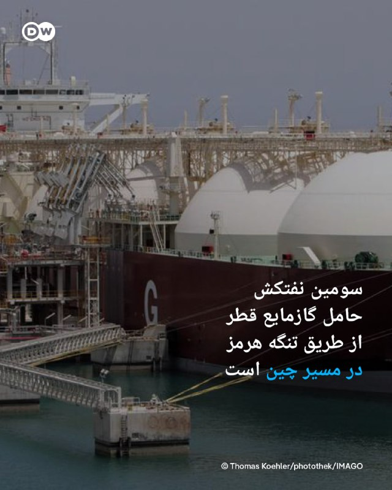

🔶 سومین نفتکش حامل گازمایع قطر از طریق تنگه هرمز در مسیر چین است

داده‌های ردیابی کشتی‌ها در روز جمعه ۲۲ مه (۱ خرداد) نشان داد که سومین نفتکش حامل گاز طبیعی مایع قطر در حال عبور از تنگه هرمز و حرکت به سمت چین است.

این در شرایطی است که یک تیم مذاکره‌کننده قطری برای کمک به دستیابی به توافقی برای پایان دادن به جنگ با ایران وارد تهران شده است.

ارسال محموله‌ها از طریق این آبراه مهم بین‌المللی همچنان نامنظم است و این سومین ترانزیت یک تانکر گاز مایع قطری تقریباً دو هفته پس از عبور اولین محموله از این تنگه تحت توافق ایران و پاکستان به شمار می‌رود.

طبق داده‌های کشتیرانی LSEG، این کشتی با نام السهله، با ظرفیت ۲۱۱ هزار و ۲۸۴ متر مکعب، منطقه رأس لفان در قطر را ترک کرده و انتظار می‌رود در روز شنبه ۱۴ ژوئن (۲۴ خرداد)‌ به ترمینال گاز مایع تیانجین چین برسد.

به گفته این منابع، ایران اجازه عبور این محموله را برای کمک به ایجاد اعتماد میان قطر و پاکستان که در حال میانجیگری در مذاکرات صلح هستند، صادر کرده است.
@dw_farsi

## DW_Farsi — post 125123

  

🔶 ایران می‌گوید علیرغم پیشرفت، توافق با آمریکا "قریب‌الوقوع" نیست

اسماعیل بقایی، سخنگوی وزارت امور خارجه ایران، روز دوشنبه ۴ خرداد (۲۵ مه) هشدار داد که با وجود پیشرفت تهران و واشنگتن در "بخش بزرگی از مسائل" در تبادلاتشان، توافق با ایالات متحده برای پایان دادن به جنگ "قریب‌الوقوع" نیست.

مارکو روبیو، وزیر امور خارجه ایالات متحده، پیش از این گفته بود که توافق می‌تواند "امروز" [دوشنبه چهارم خرداد] محقق شود.

بقایی تصریح کرد: «در بخش زیادی از موضوعات مورد گفت‌وگو، ما به یک جمع‌بندی رسیده‌ایم و این یک امر درستی است ولی این‌که بخواهیم بگوییم امضای توافق قریب الوقوع است، کسی نمی‌تواند چنین ادعایی بکند.»

سخنگوی وزارت امور خارجه ایران همچنین با تاکید بر اینکه تمرکز مذاکرات بر "خاتمه جنگ" است گفت: «در این مرحله درباره جزئیات موضوع هسته‌ای صحبتی نداریم.»

بقایی افزود: «تهدیدها، فشارها، کاریکاتور منتشر کردن بخشی از سیاست‌ورزی در آن طرف دنیاست. ما کار خود را در میدان عمل دنبال می‌کنیم.»
@dw_farsi

## DW_Farsi — post 125122

  

🔶 "مصادره اموال و اخراج هزاران شیعه پاکستانی" از امارات در جنگ ایران

خبرگزاری رویترز در گزارشی نوشت"هزاران شیعه" پاکستانی در طول جنگ ایران از امارات متحده عربی به پاکستان اخراج شده‌‌اند. به نوشته رویترز این امر باعث نگرانی جامعه شیعیان پاکستان شده و دیده‌بان حقوق بشر را بر آن داشته است تا در این مورد تحقیق کند.

رویترز اسناد مهاجرت، ویزا و جزئیات پرواز ۱۰۳ پاکستانی را که گفته بودند شیعه اخراج شده هستند، بررسی و با ۲۴ نفر از آنها مصاحبه کرده است. مصاحبه‌شوندگان گفته‌اند که پیش از سوار شدن به هواپیما حتی نتوانسته‌اند چمدان یا پس‌انداز خود را پس بگیرند.

بانک اطلاعاتی که توسط سازمان سیاسی شیعه پاکستانی "مجلس وحدت مسلمین" گردآوری شده و توسط رویترز مشاهده شده است، نشان می‌دهد ۷ هزار و ۵۰۰ شیعه پاکستانی از ۲۸ فوریه (۹ اسفند ۱۴۰۴)، همزمان با آغاز حمله آمریکا و اسرائیل به ایران، از این کشور عربی حاشیه خلیج فارس اخراج شده‌اند.
@dw_farsi

## DW_Farsi — post 125121

🔶 گزارش سیپری؛ ماموریت‌های صلح در تنگنای بودجه و نیروی انسانی

سال ۲۰۲۵ سال خوبی برای ماموریت‌های بین‌المللی صلح نبوده است. طبق گزارش جدید مؤسسه پژوهش‌های صلح استکهلم "سیپری" (SIPRI)، شمار این مأموریت‌ها اندکی کاهش یافته است. در حدود ۲۵ سال گذشته، هرگز شمار نیروهای بین‌المللی فعال در عرصه صلح تا این اندازه کم نبوده است.

تا پایان ماه دسامبر گذشته، مجموعاً نزدیک به ۷۹ هزار نفر در این مأموریت‌ها حضور داشتند؛ رقمی که شامل نیروهای نظامی، نیروهای پلیس و کارکنان غیرنظامی می‌شود. بر اساس این گزارش، تنها طی ده سال گذشته شمار آنها تقریباً به نصف کاهش یافته است.

کلودیا فایفر کروز، پژوهشگر مؤسسه سیپری، به کانال اول تلویزیون آلمان (ARD) گفته است که دلایل مختلفی برای این وضعیت وجود دارد.

به گزارش کانال اول تلویزیون آلمان، در شورای امنیت سازمان ملل، قدرت‌های دارای حق وتو بیش از پیش مانع یکدیگر می‌شوند و در سازمان‌های منطقه‌ای مانند اتحادیه آفریقا نیز مشکلات مشابهی وجود دارد.

افزون بر این، سازمان‌های بین‌المللی مانند سازمان ملل متحد نیز با کمبود بودجه روبه‌رو هستند؛ به‌گونه‌ای‌که در سال ۲۰۲۵ بیش از دو میلیارد دلار کسری بودجه داشته‌اند.

طبق همین گزارش، دیگر کشورهای بزرگ تأمین‌کننده بودجه این مأموریت‌ها، از جمله چین، نیز یا سهم خود را پرداخت نکرده‌اند یا با تأخیر پرداخت کرده‌اند. در نتیجه، تمامی ماموریت‌های سازمان ملل به‌ناچار فعالیت‌های خود را محدود و شمار کارکنانشان را کاهش داده‌اند.

📌 برای دسترسی کامل به گزارش به وبسایت دویچه‌وله فارسی مراجعه کنید.
@dw_farsi

## DW_Farsi — post 125120

  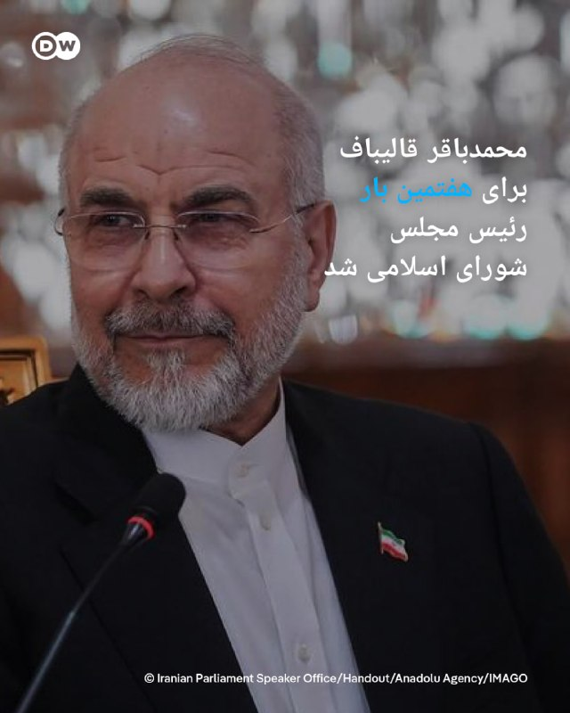

🔶 محمدباقر قالیباف برای هفتمین بار رئیس مجلس شورای اسلامی شد

محمدباقر قالیباف در انتخابات هیئت رئیسه مجلس شورای اسلامی که صبح روز دوشنبه ۴ خرداد (۲۵ مه) برگزار شد، برای هفتمین سال متوالی به عنوان رئیس مجلس انتخاب شد.

قالیباف ۶۴ ساله، به عنوان سیاستمداری با نفوذ در ساختار سپاه پاسداران انقلاب اسلامی شناخته می‌شود. به ویژه پس از کشته شدن علی خامنه‌ای، علی لاریجانی و شمار دیگری از مقامات ارشد جمهوری اسلامی و تغییر ساختار قدرت، نام او به عنوان یکی از تصمیم‌گیران اصلی در پیشبرد سیاست‌های نظام و مذاکره با آمریکا مطرح شده است.

محمدباقر قالیباف بارها برای انتخابات ریاست جمهوری نامزد شد. او در سال ۱۳۸۴ نامزد شد اما از محمود احمدی‌نژاد شکست خورد. پس از آن به عنوان شهردار تهران منصوب شد و از سال ۱۳۸۴ تا ۱۳۹۶ این سمت را در اختیار داشت.

او در سال ۱۳۹۲ بار دیگر نامزد انتخابات ریاست جمهوری شد اما از حسن روحانی شکست خورد و در سال ۹۶ نیز پیش از برگزاری انتخابات به نفع ابراهیم رئیسی کناره‌گیری کرد.

نام قالیباف با فسادهای مالی خود و خانواده‌اش و نقش او در سرکوب جنبش‌های سیاسی و مدنی در ایران نیز گره خورده است.
@dw_farsi

## Persian_Trend_Official — post 14935

  

📸 حنظله اطلاعات ۶۹ افسر اسرائیلی که به کاروان صمود حمله کردند را افشا کرد

گروه هکری حنظله:

🔹نام‌ها و مشخصات کامل ۶۹ افسر نیروی دریایی اسرائیل که اخیراً به کاروان جهانی «صمود» حمله کردند، افشا شده و برای هر یک از این افراد مبلغ ۱۰۰ هزار دلار جایزه تعیین شده است.

👩‍💻PhantomDirective

🆔@persian_trend_official
پرشین ترند | متفاوت‌ترین کانال نظامی

## Persian_Trend_Official — post 14934

🔴 فاکس‌نیوز: قالیباف و عراقچی برای رایزنی درباره پایان جنگ وارد دوحه شدند ▪️ فاکس‌نیوز گزارش داد محمدباقر قالیباف، رئیس مجلس ایران، و عباس عراقچی، وزیر خارجه ایران، امروز وارد دوحه شدند ▪️ این سفر در چارچوب تلاش‌های دیپلماتیک جاری برای پایان‌دادن به درگیری‌ها…

## Persian_Trend_Official — post 14933

🔴 فاکس‌نیوز: قالیباف و عراقچی برای رایزنی درباره پایان جنگ وارد دوحه شدند ▪️ فاکس‌نیوز گزارش داد محمدباقر قالیباف، رئیس مجلس ایران، و عباس عراقچی، وزیر خارجه ایران، امروز وارد دوحه شدند ▪️ این سفر در چارچوب تلاش‌های دیپلماتیک جاری برای پایان‌دادن به درگیری‌ها…

## Persian_Trend_Official — post 14932

🔴 یک مقام ایرانی به واشینگتن‌پست:

▪️ بازگشایی تنگه هرمز به‌صورت مرحله‌ای انجام خواهد شد
▪️ مرحله نخست شامل پاکسازی مین‌ها از تنگه، رفع محاصره آمریکا و آزادسازی ۱۲ میلیارد دلار از دارایی‌های بلوکه‌شده ایران است
▪️ یادداشت تفاهم شامل توافق هسته‌ای نیست و فقط تعهد به آغاز مذاکرات درباره این پرونده در آینده را در بر می‌گیرد

🫆:Tony

📌 @persian_trend_official
پرشین ترند | متفاوت‌ترین کانال نظامی

## Persian_Trend_Official — post 14931

🔴 فاکس‌نیوز: قالیباف و عراقچی برای رایزنی درباره پایان جنگ وارد دوحه شدند

▪️ فاکس‌نیوز گزارش داد محمدباقر قالیباف، رئیس مجلس ایران، و عباس عراقچی، وزیر خارجه ایران، امروز وارد دوحه شدند
▪️ این سفر در چارچوب تلاش‌های دیپلماتیک جاری برای پایان‌دادن به درگیری‌ها و پیشبرد مذاکرات انجام شده است
▪️ قطر یکی از اصلی‌ترین میانجی‌ها میان تهران و واشینگتن در مذاکرات اخیر محسوب می‌شود

🫆:Tony

📌 @persian_trend_official
پرشین ترند | متفاوت‌ترین کانال نظامی

## Persian_Trend_Official — post 14930

  <a href="telegram/content/Persian_Trend_Official_14930_1779712074.mp4" target="_blank">🎬 Download video</a>

♦️نگاهی به ۱۰ بهمن ۱۳۵۷ ...

جهت ثبت در تاریخ

🫆:Tony

📌 @persian_trend_official
پرشین ترند | متفاوت‌ترین کانال نظامی

## Persian_Trend_Official — post 14928

  <a href="telegram/content/Persian_Trend_Official_14928_1779712075.webm" target="_blank">🎬 Download video</a>

من به تمام دموکرات‌های احمق، جمهوری‌خواهان ظاهری و نادان‌هایی که هیچ چیزی درباره توافق احتمالی‌ای که با ایران در حال انجامش هستم نمی‌دانند می‌خندم؛ چیزهایی که حتی هنوز مذاکره هم نشده‌اند. افراد ضعیف و بی‌اثری مثل سناتور شکست‌خورده تام تیلیس (که به‌زودی از کار برکنار می‌شود!)، بیل کسیدی که تازه یک شکست سنگین در انتخابات مقدماتی خورده، و نماینده واقعاً افتضاح، توماس مَسی، یک آدم کثیف واقعی که پس از خیانت بزرگ به حزبش (و کشورش!) با اختلاف سنگین به یک میهن‌پرست بزرگ آمریکایی (که مورد حمایت «ترامپ» بود) باخت؛ و تقریباً تمام دموکرات‌ها، افرادی که کاملاً راهشان را گم کرده‌اند، مدام از سیاست‌های بد و نامزدهای حتی بدتر حمایت می‌کنند، اما دائماً از تک‌تک پیروزی‌های فوق‌العاده من انتقاد می‌کنند.

این افراد باید به خانه بروند و استراحت کنند؛ آن‌ها هیچ کاری جز ایجاد تفرقه و شکست انجام نمی‌دهند. به زبان ساده، آن‌ها بازنده‌اند!

توافق با ایران یا یک توافق بزرگ و معنادار خواهد بود، یا اصلاً توافقی در کار نخواهد بود. این توافق دقیقاً برعکس فاجعه برجام خواهد بود که توسط دولت شکست‌خورده اوباما مذاکره شد؛ توافقی که یک مسیر مستقیم و آشکار برای دستیابی ایران به سلاح هسته‌ای بود.

نه، من چنین توافق‌هایی انجام نمی‌دهم!

رئیس‌جمهور DJT

🫆:Tony

📌 @persian_trend_official
پرشین ترند | متفاوت‌ترین کانال نظامی

## Persian_Trend_Official — post 14927

  

📷 Photo

## Persian_Trend_Official — post 14926

🔴تسنیم به نقل از منابع ایرانی:

«ایران هیچ خوش‌بینی‌ای نسبت به آمریکا ندارد.

♦️هنوز هیچ تفاهم نهایی حاصل نشده و اختلافات بر سر برخی بندها همچنان پابرجاست.

♦️حتی اگر یک تفاهم اولیه هم حاصل شود، این موضوع نگاه ایران به آمریکا یا اعتماد تهران به پایبندی این دولت به تعهداتش را تغییر نخواهد داد.

♦️آمریکایی‌ها سابقه بسیار بدی در مذاکرات دارند و همین مسئله بدبینی را تقویت و تثبیت می‌کند.

♦️حتی در صورت دستیابی به تفاهم، ایران در تمام مراحل پس از اعلام آن، اقدامات آمریکا را زیر نظر خواهد داشت.

♦️اگر آمریکا به وعده‌های خود عمل نکند، ایران همچنان کارت‌های فشار و ابزارهای لازم برای مقابله را حفظ خواهد کرد.»

🫆:Tony

📌 @persian_trend_official
پرشین ترند | متفاوت‌ترین کانال نظامی

## Persian_Trend_Official — post 14925

  <a href="telegram/content/Persian_Trend_Official_14925_1779712076.mp4" target="_blank">🎬 Download video</a>

داکتر مرندی، تحلیلگر سیاسی: ظاهرا قرار بر این است قطری ها بخشی از پول را برای ما تامین و بعد از آمریکا دریافت کنند.

📌 @persian_trend_official
پرشین ترند | متفاوت‌ترین کانال نظامی

## Persian_Trend_Official — post 14924

  <a href="telegram/content/Persian_Trend_Official_14924_1779712077.mp4" target="_blank">🎬 Download video</a>

پروفسور خوش‌چشم، تحلیلگر مسائل راهبردی: علت منصرف‌شدن ترامپ از حملهٔ دوباره به ایران، ۲ عملیات پیش‌دستانهٔ منتسب به ایران بود نه درخواست عرب‌ها !!! 📌 @persian_trend_official پرشین ترند | متفاوت‌ترین کانال نظامی

## Persian_Trend_Official — post 14923

  <a href="telegram/content/Persian_Trend_Official_14923_1779712079.webm" target="_blank">🎬 Download video</a>

🔴 بازگشایی اینترنت بین الملل مصوب شد ♦️سیتنا خبر داد: ستاد راهبری و ساماندهی فضای مجازی صبح امروز دوشنبه (چهارم خردادماه) به ریاست دکتر عارف معاون اول رئیس جمهور تشکیل جلسه داد و بازگشت اینترنت به وضعیت قبل از دی ماه 1404 مصوب شد. ♦️این مصوبه برای رییس جمهور…

## Persian_Trend_Official — post 14922

  <a href="telegram/content/Persian_Trend_Official_14922_1779712079.webm" target="_blank">🎬 Download video</a>

مهر: حادثه در پالایشگاه ششم پارس جنوبی؛ ۳ نفر مصدوم شدند

سخنگو مجتمع گاز پارس جنوبی عسلویه:

صبح امروز در حین آوار برداری از تاسیسات آسیب دیده جنگ رمضان در پالایشگاه ششم گاز عسلویه، انفجار محدودی رخ داد.

بلافاصله نیروهای امدادی و آتش نشانی پالایشگاه وارد عمل شده و آتش را کنترل و خاموش کردند.

علت حادثه در دست بررسی است.

در این حادثه ۳ نفر از کارکنان شرکت پیمانکاری بازسازی پالایشگاه مصدوم و به بیمارستان منتقل شدند.

🫆:Tony

📌 @persian_trend_official
پرشین ترند | متفاوت‌ترین کانال نظامی

## Persian_Trend_Official — post 14921

پروفسور خوش‌چشم، تحلیلگر مسائل راهبردی: علت منصرف‌شدن ترامپ از حملهٔ دوباره به ایران، ۲ عملیات پیش‌دستانهٔ منتسب به ایران بود نه درخواست عرب‌ها !!!

📌 @persian_trend_official
پرشین ترند | متفاوت‌ترین کانال نظامی

## Persian_Trend_Official — post 14920

  <a href="telegram/content/Persian_Trend_Official_14920_1779712080.webm" target="_blank">🎬 Download video</a>

🔴 بازگشایی اینترنت بین الملل مصوب شد

♦️سیتنا خبر داد: ستاد راهبری و ساماندهی فضای مجازی صبح امروز دوشنبه (چهارم خردادماه) به ریاست دکتر عارف معاون اول رئیس جمهور تشکیل جلسه داد و بازگشت اینترنت به وضعیت قبل از دی ماه 1404 مصوب شد.

♦️این مصوبه برای رییس جمهور ارسال شد و در صورت تایید رئیس جمهور جهت اجرا برای وزارت ارتباطات ارسال خواهدشد.

🫆:Tony

📌 @persian_trend_official
پرشین ترند | متفاوت‌ترین کانال نظامی

## Persian_Trend_Official — post 14919

  

🔴محمدباقر قالیباف رئیس مجلس ماند

♦️قالیباف با رای نمایندگان مجلس برای یکسال دیگر رئیس‌مجلس باقی ماند.

## Persian_Trend_Official — post 14918

  

اورشلیم پست :
کشورهای خلیج فارس توان تحمل هزینه جنگ دیگری را ندارند، به ترامپ فشار می‌آورند تا از حمله به جمهوری اسلامی خودداری کند !

📌 @persian_trend_official
پرشین ترند | متفاوت‌ترین کانال نظامی

## Persian_Trend_Official — post 14917

  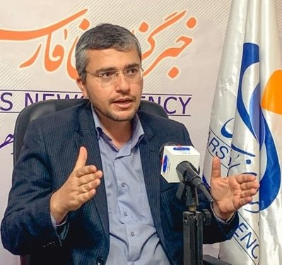

ابراهیم رضایی سخنگوی کمیسیون امنیت ملی و سیاست خارجی مجلس :

در دوره جنگ نظامی تاکتیک ما چشم در مقابل چشم بود، در جنگ دیپلماتیک اقدام در مقابل اقدام است. بلوف رییس‌جمهور شکست‌خورده را باور نکنید، زمان به ضرر آمریکایی‌هاست. اگر توافق می‌خواهند مذاکره کنند، اگر بنزین ۶ دلاری می‌خواهند بایستند و بلوف بزنند تا علف زیر پایشان سبز شود. ایران زیر بار زور و تهدید نمی‌رود.

📌 @persian_trend_official
پرشین ترند | متفاوت‌ترین کانال نظامی

## Persian_Trend_Official — post 14916

ستاد راهبری و ساماندهی فضای مجازی صبح امروز دوشنبه (چهارم خردادماه) به ریاست دکتر عارف معاون اول رئیس جمهور تشکیل جلسه داد و بازگشت اینترنت به وضعیت قبل از دی ماه 1404 مصوب شد.

📌 @persian_trend_official
پرشین ترند | متفاوت‌ترین کانال نظامی

## Persian_Trend_Official — post 14915

  <a href="telegram/content/Persian_Trend_Official_14915_1779712082.webm" target="_blank">🎬 Download video</a>

خبرگزاری فارس، وابسته به سپاه پاسداران، از برگزاری «حضوری» انتخابات هیات‌رییسه مجلس شورای اسلامی با «رای مستقیم نمایندگان» خبر داد.

به گزارش این رسانه حکومتی، «بیش از ۲۷۰ نماینده» از مجموع ۲۸۵ نماینده مجلس در انتخابات هیات‌رییسه شرکت کردند.

فارس نوشت محمدباقر قالیباف با کسب ۲۳۵ رای، برای هفتمین سال متوالی به‌عنوان رییس مجلس انتخاب شد.

فارس افزود: «با آغاز انتخابات هیات‌رییسه مجلس، قالیباف در محل رای‌گیری حاضر شد و اولین نماینده‌ای بود که رای داد.»

با این حال، هنوز جزییاتی درباره نحوه برگزاری و محل دقیق این رای‌گیری منتشر نشده است.

این در حالی است که از زمان آغاز جنگ اخیر در ۹ اسفند ۱۴۰۴، جلسات علنی صحن مجلس برگزار نشده است.

📌 @persian_trend_official
پرشین ترند | متفاوت‌ترین کانال نظامی

## RadioFarda — post 157539

  <a href="https://t.me/radiofarda/157539" target="_blank">📎 Download file</a>

📻بشنوید: ساعت ۱۴ با رادیوفردا، چهارم خرداد ۱۴۰۵‌

@Radiofarda

## RadioFarda — post 157538

  

🔸دونالد ترامپ، رئیس‌جمهور آمریکا، روز دوشنبه چهارم خرداد در پیامی در شبکه اجتماعی تروث سوشال گفت توافق احتمالی با ایران یا «عالی و معنادار» خواهد بود یا اساساً توافقی در کار نخواهد بود.

🔸آقای ترامپ در این پیام، منتقدان خود در میان دموکرات‌ها و برخی جمهوری‌خواهان را به باد انتقاد گرفت و گفت آنان «هیچ چیز» دربارهٔ توافق احتمالی او با ایران نمی‌دانند و حتی دربارهٔ موضوعاتی اظهار نظر می‌کنند که به گفتهٔ او «هنوز مذاکره نشده‌اند».

🔸ترامپ تأکید کرد توافق مورد نظر او با ایران «دقیقاً نقطهٔ مقابل» توافق هسته‌ای برجام خواهد بود؛ توافقی که او بار دیگر آن را «فاجعه» خواند و دولت باراک اوباما را به گشودن «مسیر مستقیم و آشکار» ایران به سوی جنگ‌افزار هسته‌ای متهم کرد.

🔸او در پایان پیام خود نوشت: «من چنین توافق‌هایی نمی‌کنم.»

🔸ایران و ایالات متحده روز دوشنبه موضوع گشایش قریب‌الوقوع در تلاش‌ها جهت پایان دادن به جنگ را تأیید نکردند و وزیر خارجه ایالات متحده اعلام کرد که واشنگتن یا به یک توافق خوب دست خواهد یافت یا به «شیوه‌ای دیگر» با ایران برخورد خواهد کرد.

@RadioFarda

## RadioFarda — post 157537

  

🔸رسانه‌های ایران از تصویب مصوبه‌ای «جدید و مهم» دربارهٔ اتصال دوباره اینترنت کشور به اینترنت بین‌الملل در «ستاد ویژه ساماندهی فضای مجازی» خبر داده‌اند؛ مصوبه‌ای که هنوز برای اجرا نیازمند تأیید نهایی مسعود پزشکیان، رئیس‌جمهور ایران، است.

🔸خبرگزاری فارس روز دوشنبه چهارم خرداد گزارش داد چهارمین جلسه این ستاد به ریاست محمدرضا عارف، معاون اول رئیس‌جمهور، برگزار شد و در آن «مصوبات مهمی» دربارهٔ اتصال به اینترنت بین‌الملل به تصویب رسید.

🔸فارس به نقل از یک منبع نوشت که «برقراری اتصال اینترنت بین‌الملل» با ۹ رأی موافق و سه رأی مخالف تصویب شده و برای تأیید به دفتر رئیس‌جمهور ارسال شده است.

🔸خبرگزاری تسنیم نیز با انتشار گزارشی مشابه نوشت مصوبات این جلسه پس از تأیید نهایی رئیس‌جمهور، برای اجرا به وزارت ارتباطات و فناوری اطلاعات ابلاغ خواهد شد.

🔸در همین حال، سیتنا، رسانه تخصصی حوزه ارتباطات و فناوری اطلاعات، به نقل از «یک منبع آگاه» گزارش داد که در جلسه صبح دوشنبه «بازگشت اینترنت به وضعیت قبل از دی‌ماه ۱۴۰۴» مصوب شده و در صورت تأیید مسعود پزشکیان، جهت اجرا به وزارت ارتباطات ابلاغ خواهد شد.

@RadioFarda

## RadioFarda — post 157536

  

🔸رئیس مرکز روابط عمومی و اطلاع‌رسانی وزارت بهداشت روز دوشنبه چهارم خرداد مدعی شد که مجتبی خامنه‌ای در جریان حملات آمریکا و اسرائیل به «بیت رهبری» در نهم اسفند ۱۴۰۴ زیر بمباران تنها دچار چند «جراحت سطحی» شده بود.

🔸حسین کرمانپور سه ماه پس از این حمله به خبرگزاری ایلنا گفت: «استنباط ما این بود که کسی که زیر چنین بمبارانی باشد نباید بدن سالمی داشته باشد، اما به جز جراحت سطحی بر صورت، سر و پا‌ها که منجر به هیچ قطع عضو و ناراحتی خاصی نشده بود، اتفاق خاصی نیفتاده بود.»

🔸آقای کرمانپور در ادامه افزود که از دید او به عنوان یک پزشک جراحت‌های مجتبی خامنه‌ای مهم نبوده و تنها «یکی یا دو بخیه» که زده و او ساعت ۲ بامداد دهم اسفند مرخص شده است.

🔸این اظهارات در حالی مطرح می‌شود که پیش از گزارش‌هایی درباره جراحت‌های شدید به مجتبی خامنه‌ای منتشر شده بود.

🔸ازجمله نیوریوک تایمز سوم اردیبهشت از قول چهار مقام ایرانی گفته بود که مجتبی خامنه‌ای همچنان تحت درمان قرار دارد و در انتظار دریافت پروتز برای یکی از پاها و جراحی پلاستیک برای ترمیم آسیب‌های شدید صورت است.

@RadioFarda

## RadioFarda — post 157535

🔸اسماعیل بقائی در نشست خبری روز دوشنبه چهارم خرداد از لغو سفر عباس عراقچی، وزیر امور خارجه ایران به نشست شورای امنیت در آمریکا خبر داد.

🔸سخنگوی وزارت خارجه ایران در پاسخ به پرسش یک خبرنگار گفت که «با توجه به مجموع شرایط، این سفر انجام نخواهد شد. ضمن این که ما با یک مسئله مرتبط با روادید آمریکا هم مواجه شدیم.»

🔸جلسه شورای امنیت سازمان ملل قرار است روز سه‌شنبه این هفته در نیویورک برگزار شود.

🔸آمریکا پس از سرکوب خشونت‌بار اعتراضات دی ۱۴۰۴ شماری از مقامات ایران را تحریم کرد اما عباس عراقچی در این فهرست نبود.

🔸ایالات متحده سال گذشته نیز محدودیت‌های بی‌سابقه‌ای بر تردد، خرید و صدور ویزا برای هیئت جمهوری اسلامی در حاشیه هشتادمین نشست مجمع عمومی سازمان ملل در نیویورک اعمال کرد.

@RadioFarda

## IranianMinds — post 20720

🔴 خبرگزاری رویترز :

عباس عراقچی و محمدباقر قالیباف وارد قطر شدن.

@IranianMinds

## IranianMinds — post 20719

  

🔴مارک لوین :

در اینترنت مطالب زیادی درباره یک توافق احتمالی با جمهوری اسلامی وجود دارد. اما من هیچ چیزی درباره خود مردم ایران ندیدم و کسی در مورد مردم ایران حرف نمی زند..

@IranianMinds

## IranianMinds — post 20718

  

🔴 واشنگتن‌ پست:

آمریکا و ایران به یک چارچوب اولیه برای تمدید آتش‌بس به مدت ۶۰ روز رسیده‌اند تا مذاکرات برای پایان جنگ ادامه پیدا کند.

ایران قرار است طی ۳۰ روز تنگه هرمز را بازگشایی و مین‌های دریایی را پاکسازی کند

آمریکا هم محاصره دریایی بنادر ایران را لغو خواهد کرد

آزادسازی ۱۲ میلیارد دلار از دارایی‌های بلوکه‌شده ایران بخشی از توافق است

ایران پس از دریافت این پول، پاکسازی مین‌ها را آغاز می‌کند
تهران تعهد سطح بالایی درباره عدم دستیابی به سلاح هسته‌ای خواهد داد.

هنوز هیچ توافق نهایی امضا نشده است!

@IranianMinds

## IranianMinds — post 20717

  

🔴 پست ترامپ در تروث‌سوشال:

دموکرات‌ها سیاست‌های بد و نامزد‌های بدی دارند. غیر از این، آن‌ها عملکرد نسبتأ خوبی دارند!

@IranianMinds

## IranianMinds — post 20716

🔴 ترامپ :

من به همه دموکرات ها، رینوس ها و احمق هایی که هیچ چیز در مورد معامله احتمالی من با ایران نمی دانند می خندم.

توافق با ایران یا توافقی بزرگ و معنادار خواهد بود یا توافقی وجود نخواهد داشت.

این دقیقا برعکس فاجعه برجام خواهد بود که توسط دولت شکست خورده اوباما مذاکره شد، که راهی مستقیم و باز برای دستیابی به سلاح هسته ای برای ایران بود.

نه، من چنین معامله ای انجام نمی دهم!

@IranianMinds

## IranianMinds — post 20715

🔴 خبرگزاری تسنیم : دستور رفع محدودیت های اینترنت بین الملل تایید شده و فقط به تایید نهایی پزشکیان نیاز داره ، در صورت تایید اینترنت بین الملل تا هفته ی آینده به حالت قبل جنگ برمیگرده! @IranianMinds

## IranianMinds — post 20714

  

🔴 بن‌ گویر، وزیر امنیت ملی اسرائیل:

نتانیاهو باید مشت خود را روی میز ترامپ بکوبد و به او بگوید که ما به جنگ برمی‌گردیم!

@IranianMinds

## IranianMinds — post 20713

❌دیگه فریب بونوس سایت های متفرقه رو نخورید!

💖توی این سایت که مورد #تایید ماست، با عضویت 500 هزارتومان بگیر!

🌐 Winro.io

🌐 Winro.io

## IranianMinds — post 20712

  <a href="telegram/content/IranianMinds_20712_1779712086.webm" target="_blank">🎬 Download video</a>

💩 
⚠️ دیگه #فریب بونوس های الکی سایت های سودجو رو نخورید
❌

💲بیا توی سایت مورد تایید ما یعنی #وینرو و با عضویت 500 هزار تومان اعتبار بی قیدو شرط بگیر
👏

🤩با عضویت 
🤩 
🤩 
🤩 هزار تومان اعتبار رایگان بگیر!

⌛ پشتیبانی 24 ساعته

🌐 Winro.io

🌐 Winro.io
کانال بونوس های رایگانr4

📱 @winro_io

## IranianMinds — post 20711

🔴 کلاس های دانشگاه تهران هم‌ از ۹ خرداد حضوری شد.

@IranianMinds

## IranianMinds — post 20710

🔴 خبرگزاری تسنیم :

دستور رفع محدودیت های اینترنت بین الملل تایید شده و فقط به تایید نهایی پزشکیان نیاز داره ، در صورت تایید اینترنت بین الملل تا هفته ی آینده به حالت قبل جنگ برمیگرده!

@IranianMinds

## BBCPersian — post 282016

  

🔻عبدالناصر همتی، رئیس کل بانک مرکزی ایران، عازم قطر شد.

به گزارش رسانه‌های دولتی ایران، این سفر در پی گفت‌وگوهای اخیر هیئت قطری در تهران درباره دارایی‌های مسدودشده ایران انجام شده است.

یکی از خواسته‌های ایران در مذاکرات با آمریکا آزاد شدن منابع مالی مسدود شده‌اش در خارج از کشور، از جمله در قطر، بوده است.

در زمان ریاست جمهوری ابراهیم رئیسی، بخشی از دارایی‌های مسدود شده ایران از بانک‌های کره جنوبی به قطر منتقل شد تا همزمان با آزادی برخی از اتباع آمریکایی از زندان‌های ایران، با نظارت ایالات متحده صرف خرید کالاهای ضروری مورد درخواست ایران از جمله غدا و دارو شود.

با تبادل زندانیان، این پول به بانک‌های قطر منتقل شد، اما با حمله هفتم اکتبر حماس به اسرائیل و آغاز جنگ در غزه، انتقال پول به ایران انجام نشد.

علی خامنه‌ای، رهبر سابق جمهوری اسلامی در سفر امیر قطر به تهران در بهمن ۱۴۰۳، خواستار آزاد شدن این منابع مالی شده بود.

📸ASRIRAN
https://bbc.in/49V4TEj
@BBCPersian

## BBCPersian — post 282015

  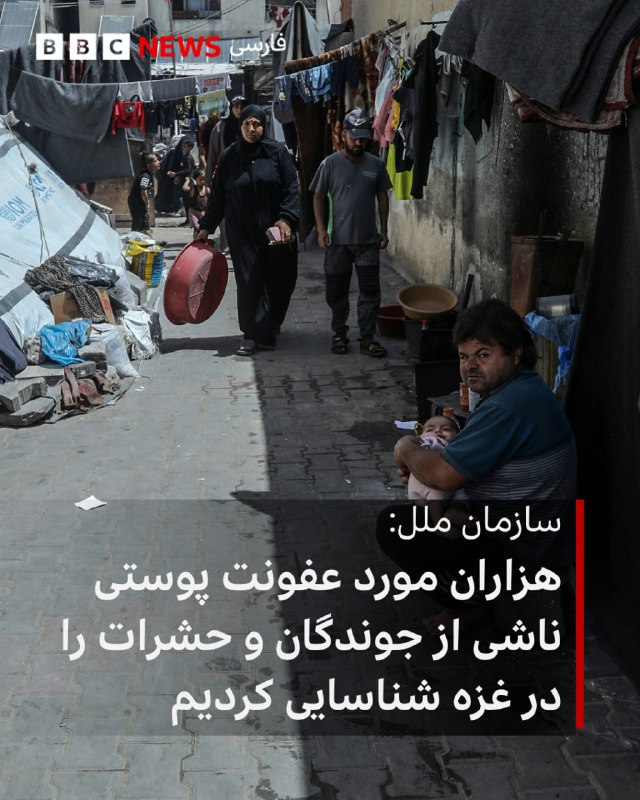

🔻آژانس پناهندگان فلسطینی سازمان ملل، اونروا، می‌گوید که بیش از ۱۲۵ هزار مورد عفونت پوستی ناشی از جوندگان و حشرات را در این منطقه محاصره‌شده شناسایی کرده است.

این نهاد در حسابش در شبکه اجتماعی ایکس نوشت: «تیم‌های بهداشت ما در حال سم‌پاشی و آفت‌کشی ایمن در مناطقی هستند که تعداد زیادی از آوارگان هنوز در سکونتگاه‌های موقت پرجمعیت زندگی می‌کنند.»

این آژانس می‌گوید: «کمبود شدید سوخت، آفت‌کش‌، چادر و دارو واکنش به این بحران را محدود می‌کند.»

به گفته اونروا، غزه نیاز به «ورود نامحدود لوازم بهداشتی و پزشکی» دارد.

براساس گزارش‌ها، با توجه به اینکه همچنان صدها هزار فلسطینی آواره در غزه هنوز در چادرها زندگی می‌کنند و هیچ نشانه‌ای از بازسازی این منطقه به چشم نمی‌خورد، تلاش برای تهیه آب تمیز و مقابله با حیوانات ناقل بیماری به طور فزاینده‌ای دشوار شده است.

📸Anadolu via Getty Images
https://bbc.in/4uFNNTh
@BBCPersian

## BBCPersian — post 282014

  

🔻شهباز شریف، نخست‌وزیر پاکستان، در دیدار با همتای چینی خود در پکن، ابراز خوشبینی کرده است که مذاکرات ایران و آمریکا «در مسیر درست در حال پیشرفت است.»

آقای شریف همراه با فیلد مارشال عاصم منیر، فرمانده کل ارتش و نیروهای مسلح پاکستان، به چین سفر کرده است که اخیرا با هدف میانجیگری و کمک به حصول توافق میان ایران و آمریکا به تهران رفته بود.

به گزارش خبرگزاری دولتی پاکستان، آقای شریف از شی جین پینگ، رئیس‌جمهور چین، برای حمایت‌ از تلاش‌های اسلام‌آباد برای ترویج صلح و برقراری آتش‌بس تشکر کرد.

آقای شریف در دیدار با لی چیانگ، نخست‌وزیر چین، گفت که «جهان در حال عبور از یک لحظه حساس در میانه بحران» در خلیج فارس است.

به گفته آقای شریف، «این بحران هم به اقتصادهای منطقه از جمله پاکستان، که واردکننده نفت و فرآورده‌های نفتی است، آسیب رسانده است و هم به جامعه جهانی.»

📸EPA/Shutterstock
https://bbc.in/42PXDpt
@BBCPersian

## BBCPersian — post 282013

🔻نیکزاد و حاجی‌بابایی نایب رئیس مجلس ماندند

علی نیکزاد، نماینده اردبیل و حمیدرضا حاجی بابایی، نماینده همدان بعنوان نواب رئیس انتخاب شدند.

به گزارش رسانه‌های ایران، آقای نیکزاد با ۱۴۳ رای و آقای حاجی‌بابایی با ۱۰۰ رای از ۲۸۰ نماینده حاضر در انتخابات نواب رئیس مجلس اول و دوم شدند.

عبدالرضا مصری با ۸۸ رای، حسینعلی حاجی دلگیانی با ۶۸ رای، رضا جباری با ۵۷ رای، علیرضا منادی سفیدان با ۵۲ رای و پیمان فلسفی با چهار رای، دیگر نامزدهای نیابت رئیس مجلس بودند.

پیش از این محمدباقر قالیباف با ۲۳۵ رأی از ۲۷۱ آرای مأخوذه، برای هفتمین سال متوالی به‌عنوان رئیس مجلس انتخاب شده بود.

به این ترتیب رئیس و دو نایب رئیس مجلس ابقا شدند.

این انتخابات حضوری و با رای مستقیم نمایندگان برای انتخاب ۱۲ عضو هیئت‌رئیسه شامل یک رئیس، دو نایب رئیس، شش دبیر و سه ناظر برگزار شد.

پیش از این، انتخابات با ورقه برگزار می‌شد اما رای‌گیری امسال با رای مستقیم نمایندگان به صندوق‌های الکترونیک رای‌گیری انجام شد.

https://bbc.in/4dvvoTc
@BBCPersian

## BBCPersian — post 282012

  

🔻سخنگوی وزارت خارجه ایران در واکنش به اظهارات مقام‌های آمریکایی که از پیشرفت در مذاکرات می‌گویند، گفت که در برخی موضوعات دو طرف به جمع‌بندی رسیده‌اند اما نمی‌توان گفت که توافق قریب‌الوقوع است.

اسماعیل بقایی مواضع ضد‌و‌نقیض مقام‌های آمریکا و سابقه حمله این کشور در میانه مذاکره را ازجمله دلایل این امر عنوان کرد.

این در حالی است که مارکو روبیو، وزیر خارجه آمریکا، گفته است که توافق میان تهران و واشنگتن «هنوز در حال پیشرفت است». دونالد ترامپ هم دیروز از نزدیک شدن به توافق گفته بود اما بعد تاکید کرد که عجله‌ای برای رسیدن به توافق ندارد.

📸GettyImages
@BBCPersian

## BBCPersian — post 282011

  <a href="telegram/content/BBCPersian_282011_1779712088.mp4" target="_blank">🎬 Download video</a>

🔻‌مارکو روبیو، وزیر خارجه آمریکا، گفته است که توافق میان تهران و واشنگتن «هنوز در حال پیشرفت است» و دونالد ترامپ، رئیس‌جمهور آمریکا، «عجله‌ای برای رسیدن به توافق ندارد.»

او پیش از ترک دهلی نو گفت که در حال حاضر «یک پیشنهاد کاملا محکم» برای رسیدن به توافق داریم که با باز شدن تنگه هرمز می‌توانیم وارد «یک مذاکره بسیار واقعی، مهم و با محدودیت زمانی در مورد مسائل هسته‌ای» بشویم.

به گفته وزیر خارجه آمریکا، دونالد ترامپ «قرار نیست توافق بدی انجام دهد، بنابراین بیایید ببینیم چه اتفاقی می‌افتد. ما قبل از بررسی گزینه‌های دیگر، هر فرصتی به دیپلماسی برای موفقیت می‌دهیم.»

او تاکید کرد که «یا توافق خوبی خواهیم داشت، یا باید به روش دیگری با این مسئله برخورد کنیم و ما ترجیح می‌دهیم توافق خوبی داشته باشیم.»

او در مورد اینکه چرا هنوز توافق اعلام نشده است گفت که این را باید از ایرانی‌ها پرسید و «ما منتظر شنیدن نظرات آنها هستیم و در سیستم آنها کمی طول می‌کشد تا آنها پاسخ دهند.»

https://bbc.in/4tYH5Xb
@BBCPersian

## BBCPersian — post 282010

  

🔻ایران می‌گوید که سفر وزیر خارجه به نیویورک برای شرکت در نشست شورای امنیت «منتفی» شده است.

اسماعیل بقایی، سخنگوی وزارت خارجه ایران، دلیل انجام نشدن سفر عباس عراقچی را «مشکل روادید» عنوان کرد.

آقای بقایی چهارشنبه هفته پیش درمورد حضور آقای عراقچی در این نشست گفته بود: «این سفر به نیویورک احتمال دارد انجام شود و البته ممکن هم هست انجام نشود، چون هنوز قطعی نیست. دلیلش هم این است که هم باید روادید صادر شود و هم ممکن است اولویت‌های دیگری داشته باشیم.»

چین به‌عنوان رئیس دوره‌ای شورای امنیت، سه‌شنبه ۲۶ مه یک بحث آزاد در سطح بالا با موضوع «حفظ اهداف و اصول منشور سازمان ملل و تقویت نظام بین‌المللی متمرکز بر سازمان ملل» برگزار خواهد کرد.

این جلسه به ریاست وانگ یی، عضو دفتر سیاسی کمیته مرکزی حزب کمونیست و وزیر امور خارجه چین، برگزار می‌شود.

چین این نشست را «فرصتی» برای همبستگی و اجماع کشورهای عضو توصیف کرد تا «تعهد راسخ خود را به حفظ اهداف و اصول منشور سازمان ملل متحد مجددا تصریح و نقش محوری این سازمان را در نظام بین‌المللی احیا کنند.»

📸Anadolu via Getty Images
https://bbc.in/42PLVv0
@BBCPersian

## BBCPersian — post 282003

🖋پاول آکسنوف
خبرنگار امور نظامی، بخش روسی بی‌بی‌سی

سرگئی مرنکوف، طراح ارشد هواپیماهای ترابری شرکت «هواپیماسازی غیرنظامی اورال»، اعلام کرد که کار روی ساخت هواپیمای جدید توربوپراپ «تی‌وی‌آراس-۴۴ لادوگا» در روسیه متوقف شده و این پروژه به وزارت دفاع واگذار شده است.

آقای مرنکوف در کنفرانسی درباره پشتیبانی هوانوردی مناطق قطبی، سیبری و خاور دور که سازمان هوانوردی روسیه برگزار کرده بود، گفت: «پروژه تی‌وی‌آراس-۴۴ لادوگا متوقف شده است. تصمیم گرفته شده این هواپیما و تمام زیرساخت‌های علمی و فنی آن در اختیار وزارت دفاع قرار گیرد تا بر پایه آن، یا نسخه ترابری مجهز به رمپ، یا نسخه ترابری با در جانبی، یا نسخه مسافربری ویژه نیازهای وزارت دفاع ساخته شود.»

او همچنین گفت که به دفتر طراحی این پروژه اجازه داده شده نخستین پرواز لادوگا را در سال ۲۰۲۶ انجام دهد.
ادامه مطلب⬇️

📸Getty/ elegram/favt_ru/ V.Lapkin/TASS/
https://bbc.in/4dGyZg1
@BBCPersian

## Dirty_Kids — post 390143

دسته جمعی به گا رفتیم مقصرم تو یخچاله.

@Dirty_Kids 👻

## Dirty_Kids — post 390142

‏ترامپ هم مثل منه، معلوم نیست چه گهی داره تو زندگیش می‌خوره‌.

@Dirty_Kids 👻

## Dirty_Kids — post 390141

  

مامان بزرگم وقتی داییم و زن داییم برای بار پنجم توی عروسیشون لب گرفتن:

@Dirty_Kids 👻

## Dirty_Kids — post 390138

نه بابا فشار چیه؛ توی توییتر یه نفر توییت زده «گل مورد علاقه شما چیه؟»

و حالا پسرا شروع کردن از دوس دخترشون عکس گذاشتن.

@Dirty_Kids 👻

## Dirty_Kids — post 390137

مسجد ابوذر در بلوار ابوذر ،اتوبان محلاتی؛
آموزش کار با اسلحه ،جمهوری اسلامی از چه خطری این روزها انقد وحشت کرده؟

@Dirty_Kids 👻

## Dirty_Kids — post 390136

  

ترامپ: من می‌خندم به همه‌ی این دموکرات‌های مادرقحبه‌ی احمق.

راینوها [جمهوری‌خواهان اسمی] و نادان‌هایی که هیچ‌چی از توافق احتمالی من با رژیم هزارپدر روافض نمی‌دونن، چیزهایی که هنوز حتی مذاکره هم درباره‌شون نشده.

آدم‌های ضعیف و بی‌عرضه‌ای مثل سناتور شکست‌خورده‌ تام‌تیلیس (که به زودی از کار برکنار میشه)، بیل‌کسیدی که همین تازگی‌ها توی انتخابات مقدماتی یه شکست سنگین خورد، و نماینده‌ی واقعاً پدرقحبه‌ی کنگره توماس‌مسی یه آدم کثیف و کسکش تمام‌عیار که بعد از نشون دادن بی‌وفایی شدید به حزبش و کشور در یه شکست مفتضحانه و تاریخی بازی رو به یه میهن‌پرست بزرگ آمریکایی [با حمایت و تایید ترامپ] واگذار کرد.

و تقریباً همه‌ی دموکرات‌های قرمساق، آدم‌هایی که کلاً راهشون رو گم کردن، دائماً از سیاست‌های بد و نامزدهای حتی بدتر حمایت می‌کنن، اما در عین حال، مدام از تک‌تکِ بردهای فوق‌العاده من ایراد می‌گیرن.

این پدرخراب‌ها باید برن خونه‌شون و استراحت کنن، کارشون فقط تفرقه‌اندازی و باخته. به عبارت دیگه، اینا یه مشت بازنده‌‌ی مادرقحبه‌ان.

توافق با رژیم روافض یا یه توافق بزرگ و پرمعنی می‌شه، یا اصلاً توافقی در کار نخواهد بود.

این دقیقاً برعکس فاجعه‌ی برجام خواهد بود که توسط دولت شکست‌خورده‌ی اوبامای قحبه مذاکره شد. همون توافقی که یه مسیر مستقیم و باز برای رسیدن ایران به سلاح هسته‌ای بود.

خیر عزیزان، من از این‌جور توافق‌ها نمی‌کنم [اینقدر کسخل و‌مشنگ نیستم که به روافض کون بدم]

رئیس‌جمهور دی‌جی‌تی،

@Dirty_Kids 👻

## Dirty_Kids — post 390135

  <a href="telegram/content/Dirty_Kids_390135_1779712091.mp4" target="_blank">🎬 Download video</a>

از وقتی اینترنت قطع شده انلاین شاپا دست به هرکاری میزنن بتونن جنساشونو بفروشن

@Dirty_Kids 👻

## Dirty_Kids — post 390134

  <a href="telegram/content/Dirty_Kids_390134_1779712092.mp4" target="_blank">🎬 Download video</a>

طرفدارهایی که از پایان سریال The Boys شاکی هستن شروع کردن خودشون پایان بندی‌های مختلف رو با AI می‌سازن و باید بگم همین یک دقیقه‌ای که یکی از طرفدارها ساخته هم کیفیت VFXش و هم هیجانش از کل فصل ۵ بیشتر بود!

@Dirty_Kids 👻

## Dirty_Kids — post 390133

  <a href="telegram/content/Dirty_Kids_390133_1779712093.mp4" target="_blank">🎬 Download video</a>

امید دانا خود مواد مخدره، مصرف نمی‌کنه، خودش عین و سرچشمه مواد مخدره

@Dirty_Kids 👻

## Dirty_Kids — post 390132

  <a href="https://t.me/Dirty_Kids/390132" target="_blank">📎 Download file</a>

📱 اپلیکیشن اندروید بدون فیلتر ریتزوبت

➖➖➖➖➖

🔹 ثبت نام آسان 
✅
🔹 رابط کاربری بسیار راحت و سریع 
✅
🔹 درگاه پرداخت کارت به کارت 
✅
🔹 درگاه پرداخت دلاری سریع 
✅
🔹 بونوس ۱۰۰ درصدی اولین واریز 
✅
🔹 بونوس ۱۰۰ درصدی واریز یکشنبه ها 
✅

➖➖➖➖➖
🌐 https://RitzoBet.com

⚡️ @RitzoBet_ir

## Dirty_Kids — post 390131

  

⚠️ برای #شرطبندی های فوتبال از سایت معتبر و بین المللی استفاده کنید ✅

سایت #ریتزوبت ، چهار سال هستش داخل ایران فعالیت میکنه 
✅

لایسنس بین المللی داره ، روش های شارژ و برداشت متنوع داره و بونوس 100% ورزشی و کش بک های جذاب
💎

⏪ اپلیکیشن بدون فیلتر ریتزوبت 
📱
⏩
R4

✅ لینک بدون‌ فیلتر ریتزوبت
🤣

🆔 @RitzoBet_ir 
🇮🇷

## Dirty_Kids — post 390130

هر موقع شک کردی رب گوجه فرنگی کافیه برای ماکارونی ، دو قاشق دیگه رب بریز.

@Dirty_Kids 👻

## Dirty_Kids — post 390129

  <a href="telegram/content/Dirty_Kids_390129_1779712095.mp4" target="_blank">🎬 Download video</a>

پخش اذان مغرب مسلمانان از بلندگو در ميدان شلوغ دانداس تورنتو كانادا 🇨🇦

@Dirty_Kids 👻

## Dirty_Kids — post 390127

  

🌪وقتی اینترنت طوفانیه فقط کافیه بادبان ها رو بکشی

⚫️100 هزار تومان تخفیف خرید اول 
🎁

⚫️پایین ترین قیمت گیگی 180 هزار تومان
🌐 

⚫️پورسانت %10 دائمی برای هر معرفی
💼

با بادبان، میتونی یه اتصال سریع، پایدار و امن
همراه با پشتیبانی ۲۴ ساعته داشته باشی
🚀

🛒کد تخفیف: badban4k

بادبان راهتو باز می‌کنه
⛵️
R4

🛡@BadBan_VPN | کانال 

🤖@BadBan_VPNBot | ربات 

📞@BadBan_VPNSupport | پشتیبانی

## Dirty_Kids — post 390126

  

فارس: تو جلسهٔ ستاد ویژهٔ ساماندهی فضای مجازی

اتصال مجدد اینترنت بین‌الملل به رای گذاشته شد که با 9 رای موافق و 3 رای مخالف تصویب و به پزشکیان ارسال شد.

@Dirty_Kids 👻

## Hranews — post 113151

با انگیزه تجاوز؛ گزارشی از قتل یک پسر ۱۱ ساله در مشهد

❗️
❗️
❗️
❗️
❗️– مردی ۲۳ ساله در مشهد که با انگیزه تجاوز اقدام به ربودن یک #کودک پسر ۱۱ ساله کرده بود، با وارد کردن ضربات سنگ به سرش، آن کودک را به #قتل رساند. متهم هم اکنون در بازداشت به سر می برد و تحقیقات در خصوص این پرونده ادامه دارد.

ادامه مطلب

↘️
@hranews_bot تماس ✉️ -  @Hranews  کانال هرانا 🆑

## Hranews — post 113150

وقوع حادثه در پالایشگاه ششم پارس جنوبی؛ ۶ کارگر مصدوم شدند

❗️
❗️
❗️
❗️
❗️– سخنگوی مجتمع گاز پارس جنوبی اعلام کرد که حین عملیات آواربرداری پالایشگاه ششم پارس جنوبی ۶ #کارگر در پی وقوع حادثه‌ای مصدوم شدند.

ادامه مطلب

↘️
@hranews_bot تماس ✉️ -  @Hranews  کانال هرانا 🆑

## Hranews — post 113149

  

مجید رحمتی، عضو هیات مدیره کانون هماهنگی شوراهای اسلامی کار تهران، با اشاره به افزایش شدید قیمت مواد غذایی در ایران گفت که «مرغ هم از سفره ما کارگران حذف شده» و بسیاری از خانواده‌های کارگری دیگر توان خرید منظم منابع پروتئینی را ندارند. براساس گزارش منتشرشده، قیمت هر شانه تخم‌مرغ به حدود ۵۰۰ هزار تومان و قیمت مرغ در برخی موارد به کیلویی ۴۷۰ هزار تومان رسیده؛ در حالی که حداقل دستمزد ماهانه کارگران حدود ۲۳ تا ۲۴ میلیون تومان است. رحمتی می‌گوید بخش عمده درآمد #کارگران صرف اجاره مسکن و هزینه‌های اولیه زندگی می‌شود و حتی تامین خوراک ساده نیز برای بسیاری از خانوارها دشوار شده است.

این فعال کارگری همچنین گفت که سبد حداقلی معیشت خانوار کارگری که سال گذشته حدود ۴۵ میلیون تومان برآورد می‌شد، اکنون به حدود ۷۰ میلیون تومان رسیده است. به گفته او، کارگران امروز «برای بقا و زنده ماندن مبارزه می‌کنند» و سیاست‌های کنونی کنترل قیمت‌ها نیز دیگر کارایی گذشته را ندارند.

↘️
@hranews_bot تماس ✉️ -  @Hranews  کانال هرانا 🆑

## Hranews — post 113148

  

بر اساس آخرین داده‌های نت‌بلاکس، اکنون هشتادوهفتمین روز متوالی قطع اینترنت در ایران است؛ محدودیتی که بیش از ۲۰۶۴ ساعت ادامه داشته است. این نهاد ناظر بر وضعیت #اینترنت در جهان تاکید می‌کند این اقدام هرگونه شفافیت درباره اعدام‌ها را از میان برده و بر شرایط غیرانسانی و وضعیت بلاتکلیفی روزانه که منتقدان، مخالفان و گردشگران زندانی با آن روبه‌رو هستند، افزوده است.

↘️
@hranews_bot تماس ✉️ -  @Hranews  کانال هرانا 🆑

## Hranews — post 113147

  

بند زنان زندان اوین؛ ۵ زندانی سیاسی از دسترسی به تماس تلفنی محروم شدند

❗️
❗️
❗️
❗️
❗️– گلرخ ایرایی، زهرا صفایی، مرضیه فارسی، شیوا اسماعیلی و سکینه پروانه، پنج زندانی سیاسی محبوس در زندان اوین، از روز گذشته به صورت تنبیهی از حق استفاده از تلفن زندان محروم شده‌اند. این زندانیان همچنین پیش از این نیز از حق ملاقات حضوری با خانواده و وکلای خود محروم بوده‌اند و این محدودیت همچنان ادامه دارد.

به گزارش خبرگزاری هرانا، ارگان خبری مجموعه فعالان حقوق بشر در ایران، پنج زندانی سیاسی زن محبوس در زندان اوین از حق استفاده از تلفن زندان محروم شدند.

براساس اطلاعات دریافتی هرانا، روز گذشته گلرخ ایرایی، زهرا صفایی، مرضیه فارسی، شیوا اسماعیلی و سکینه پروانه از امکان دسترسی و استفاده از تلفن زندان منع شده‌اند و این محرومیت همچنان ادامه دارد.
اقدام تنبیهی یادشده پس از آن اعمال شد که این زندانیان در اعتراض به اجرای احکام اعدام، در محوطه هواخوری زندان اقدام به سر دادن شعار کرده بودند.

ادامه مطلب

#گلرخ_ایرایی
#زهرا_صفایی
#مرضیه_فارسی
#شیوا_اسماعیلی
#سکینه_پروانه

↘️
@hranews_bot تماس ✉️ -  @Hranews  کانال هرانا 🆑

## manototv — post 105828

  <a href="telegram/content/manototv_105828_1779712099.mp4" target="_blank">🎬 Download video</a>

تماسی از هلند:
«می‌گفت هر روز با برنامه‌های منوتو زندگی می‌کردیم…
و حالا نمی‌دانیم بعد از آن باید چه کنیم.»
او همچنین از جاویدنام سینا حق‌شناس یاد کرد؛ دوستی که خبر جان‌باختنش زندگی او را زیر و رو کرده بو

## manototv — post 105827

  <a href="telegram/content/manototv_105827_1779712100.mp4" target="_blank">🎬 Download video</a>

گفت‌وگو درباره اعتراضات خارج از کشور:
« چه رفتارهایی به همبستگی و رساندن پیام مردم ایران کمک می‌کند؟»

## alonews — post 122559

  <a href="telegram/content/alonews_122559_1779712102.webm" target="_blank">🎬 Download video</a>

👈ارتش دفاعی اسرائیل دو هشدار تخلیه برای ساختمان‌هایی در برج الشمالی، منطقه صور، جنوب لبنان صادر کرده است.

🔴 ارتش اسرائیل ادعا می‌کند که این ساختمان‌ها توسط حزب‌الله استفاده می‌شوند..

✅ @AloNews خبر جنگ

## alonews — post 122558

  <a href="telegram/content/alonews_122558_1779712102.webm" target="_blank">🎬 Download video</a>

👈خبرگزاری مهر: محمد باقر قالیباف با امیر قطر دیدار خواهد کرد!

✅ @AloNews خبر جنگ

## alonews — post 122557

  <a href="telegram/content/alonews_122557_1779712102.webm" target="_blank">🎬 Download video</a>

👈ترامپ به مجری فاکس‌نیوز: هرگز پول نقد به ایران نمی‌دهم

✅ @AloNews خبر جنگ

## alonews — post 122556

  <a href="telegram/content/alonews_122556_1779712103.webm" target="_blank">🎬 Download video</a>

👈جروزالم پست: رهبری چین ممکن است محاسبه کند که همکاری معنادار با واشنگتن در مورد ایران، انعطاف‌پذیری متقابل آمریکایی را در مورد هدف ملی اصلی پکن شایسته می‌داند.

✅ @AloNews خبر جنگ

## alonews — post 122555

  <a href="telegram/content/alonews_122555_1779712103.webm" target="_blank">🎬 Download video</a>

👈 «اتاق بازرگانی ایران و پاکستان، یک نهاد تجاری خصوصی دوجانبه که منافع تجاری ایران و پاکستان را نمایندگی می کند، امارات متحده عربی را متهم کرده است که فعالانه مانع ادغام ایران در کریدور اقتصادی چین-پاکستان از تبدیل شدن به یک کریدور اقتصادی پورتدارو پاکستان (CPEC) در دو کشور است دبی." - فارس نیوز.

✅ @AloNews خبر جنگ

## alonews — post 122554

  <a href="telegram/content/alonews_122554_1779712103.webm" target="_blank">🎬 Download video</a>

👈تسنیم خبر سفر قالیباف و عراقچی به قطر را تأیید کرد

✅ @AloNews خبر جنگ

## alonews — post 122553

  <a href="telegram/content/alonews_122553_1779712103.webm" target="_blank">🎬 Download video</a>

👈ارتش دفاعی اسرائیل هشدار تخلیه برای ساختمانی در اردوگاه پناهندگان فلسطینی رشدیه در نزدیکی شهر صور در جنوب لبنان صادر کرده است و ادعا می‌کند که این ساختمان توسط حزب‌الله استفاده می‌شود.

🔴 از ساکنان خواسته شده حداقل ۳۰۰ متر از این ساختمان فاصله بگیرند

✅ @AloNews خبر جنگ

## alonews — post 122552

  <a href="telegram/content/alonews_122552_1779712103.webm" target="_blank">🎬 Download video</a>

👈رئیس مجلس ایران، قالیباف، و وزیر امور خارجه عراقچی امروز زودتر به دوحه، قطر، رسیدند برای گفتگو درباره تلاش‌های دیپلماتیک جاری برای پایان دادن به درگیری، طبق گزارش فاکس نیوز 
✅ @AloNews خبر جنگ

## alonews — post 122551

  <a href="telegram/content/alonews_122551_1779712103.webm" target="_blank">🎬 Download video</a>

🔴مسجد ابوذر در بلوار ابوذر ،اتوبان محلاتی؛
آموزش کار با اسلحه.

🤔جمهوری اسلامی از چه خطری این روزها وحشت کرده ؟

✅@AloNews

## alonews — post 122550

  <a href="telegram/content/alonews_122550_1779712104.webm" target="_blank">🎬 Download video</a>

👈 همچنان حمله‌های ارتش اسرائیل به جنوب لبنان

✅ @AloNews خبر جنگ

## alonews — post 122549

  <a href="telegram/content/alonews_122549_1779712104.webm" target="_blank">🎬 Download video</a>

👈دو مقام اسرائیلی به رویترز: نتانیاهو به نزدیکان خود می‌گوید که هیچ تأثیری بر تصمیمات ترامپ ندارد

✅ @AloNews خبر جنگ

## alonews — post 122547

  <a href="telegram/content/alonews_122547_1779712104.mp4" target="_blank">🎬 Download video</a>

👈تخریب در قانا و نبطیه در جنوب لبنان پس از حملات اسرائیل

✅ @AloNews خبر جنگ

## alonews — post 122546

  <a href="telegram/content/alonews_122546_1779712105.webm" target="_blank">🎬 Download video</a>

👈نیروی دریایی سپاه: در شبانه‌روز گذشته ۳۲ کشتی اعم از نفتکش، کانتینربر و سایر کشتی‌های تجاری پس از کسب مجوز با هماهنگی و تامین امنیت نیروی دریایی سپاه از تنگهٔ هرمز عبور کردند

✅ @AloNews خبر جنگ

## alonews — post 122545

  <a href="telegram/content/alonews_122545_1779712105.webm" target="_blank">🎬 Download video</a>

👈رئیس مجلس ایران، قالیباف، و وزیر امور خارجه عراقچی امروز زودتر به دوحه، قطر، رسیدند برای گفتگو درباره تلاش‌های دیپلماتیک جاری برای پایان دادن به درگیری، طبق گزارش فاکس نیوز

✅ @AloNews خبر جنگ

## alonews — post 122544

  <a href="telegram/content/alonews_122544_1779712105.webm" target="_blank">🎬 Download video</a>

👈عوستاد خوش‌چشم: علت منصرف‌شدن ترامپ از حملهٔ دوباره به ایران، ۲ عملیات پیش‌دستانهٔ منتسب به ایران بود نه درخواست عرب‌ها!

✅ @AloNews خبر جنگ

## alonews — post 122543

  <a href="telegram/content/alonews_122543_1779712105.webm" target="_blank">🎬 Download video</a>

👈ادعای واشنگتن پست به نقل از یک منبع:
بازگشایی تنگه به صورت مرحله‌ای خواهد بود.

🔴در مرحله اول، آمریکا ۱۲ میلیارد دلار از دارایی‌های بلوکه‌شده ایران را آزاد می‌کند، مین‌روبی در تنگه آغاز می‌شود و محاصره آمریکا برداشته می‌شود.

🔴 تفاهم‌نامه شامل توافق هسته‌ای نیست، فقط تعهدی برای مذاکره بعدی درباره مسئله هسته‌ای است.

✅ @AloNews خبر جنگ

## alonews — post 122540

  <a href="telegram/content/alonews_122540_1779712105.mp4" target="_blank">🎬 Download video</a>

👈یک پهپاد حزب‌الله امروز صبح به سقف ساختمانی در متولا، شمال اسرائیل، حمله کرد

✅ @AloNews خبر جنگ

---
📅 بروزرسانی: 1405/03/04 12:28
---

## VahidOOnLine — post 242092

  

♦️رسانه‌های داخلی ایران روز دوشنبه چهارم خرداد به نقل از علی عبداللهی، فرمانده قرارگاه خاتم الانبیا گزارش کردند که نیروهای مسلح جمهوری اسلامی در دور بعدی جنگ «با استفاده از سامانه‌های جدید پدافندی، بیش از پیش با حملات هوایی دشمن مقابله» خواهد کرد.
این ادعا در حالی مطرح می‌شود که از زمان نخستین حمله اسرائیل به مواضع نظامی جمهوری اسلامی، بخشی از سامانه پدافندی ایران به‌شدت آسیب دید. این روند در جریان جنگ دوازده روزه تکمیل شد و آسمان ایران عملا در اختیار جنگنده‌های اسرائیلی و آمریکایی قرار گرفت. در جریان جنگ اخیر هم جمهوری اسلامی تنها توانست یک فروند جنگنده اف۱۸ آمریکا را هدف قرار دهد و سرنگون کند. با این حال براساس گزارش‌ها تعدادی از پهپادهای آمریکایی و اسرائیل در مناطق مختلف ایران رهگیری و منهدم شدند.
‌🇸🇦 Indypersian

🤖 @VahidOOnLine

## VahidOOnLine — post 242091

  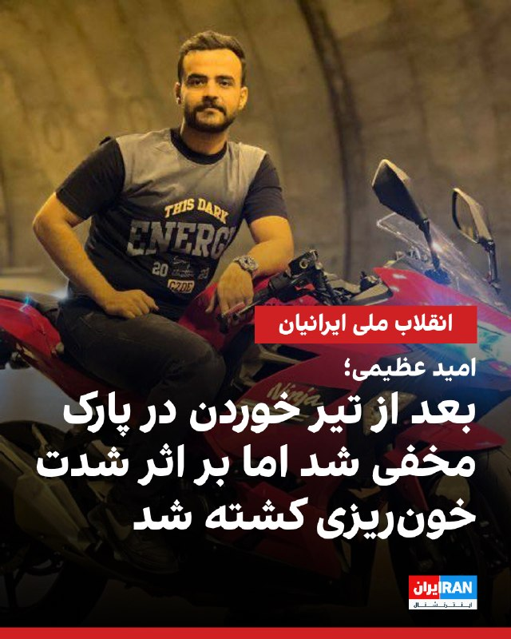

بر اساس اطلاعات رسیده به ایران‌اینترنشنال، امید عظیمی، ۲۶ ساله، روز ۱۹ دی‌ماه در جریان اعتراضات صادقیه تهران هدف گلوله قرار گرفت، خود را در یک پارک مخفی کرد اما به دلیل خونریزی شدید جان باخت.

به گفته یک منبع مطلع، امید عظیمی روز ۱۹ دی پس از خروج از باشگاه، برای شرکت در تجمع اعتراضی علیه گرانی و جمهوری اسلامی، مطابق فراخوان شاهزاده رضا پهلوی، به خیابان رفته بود. پس از قطع ناگهانی آنتن‌های تلفن همراه، ارتباط نزدیکانش با او قطع شد و خانواده و اطرافیانش تا صبح در بیمارستان‌ها به دنبال او گشتند.

امید پس از اصابت گلوله، خود را به یک پارک رساند و در آنجا پنهان شد. زمانی که نزدیکانش او را پیدا کردند، خون زیادی از دست داده بود. او را سپس به بیمارستان شهریار منتقل کردند اما به دلیل شدت جراحات و خونریزی شدید جان باخت.

دوستانش امید را فردی شجاع و نترس می‌دانند و می‌گویند که او همیشه دوست داشت مردم متحد باشند تا ایران آزاد شود. او عاشق ورزش و موتور‌سواری بود

امید در آخرین تماس تلفنی با مادرش گفته بود: شام می‌آیم و دور هم می‌خوریم.

‌🏁 🇬🇧 IranintlTV

🤖 @VahidOOnLine

## VahidOOnLine — post 242090

  

سماعیل بقائی، سخنگوی وزارت خارجه جمهوری اسلامی گفت: «کسی نمی‌تواند ادعا بکند به توافق نزدیک شده‌ایم، تغییرات مکرر مواضع مقامات آمریکایی هر گفت‌وگویی را دچار اشکال می‌کند.»

او افزود: «جمهوری اسلامی در حال حاضر بر روند مذاکرات متمرکز است و اینکه توافق احتمالی بعدا چگونه اعلام یا امضا شود، موضوعی است که برای تصمیم‌گیری درباره آن فرصت وجود دارد.»

بقائی اضافه کرد: «سفر هیئت‌ها به تهران یا سفر متقابل ممکن است در صورت لزوم انجام شود، اما در شرایط فعلی برنامه‌ای برای سفر به پاکستان یا سفر هیئت پاکستانی به ایران برنامه‌ریزی نشده است.»
‌🏁 🇬🇧 IranintlTV

🤖 @VahidOOnLine

## VahidOOnLine — post 242089

  <a href="telegram/content/VahidOOnLine_242089_1779699521.mp4" target="_blank">🎬 Download video</a>

ویدیویی که تازه به دست ایران‌اینترنشنال رسیده، خاکسپاری شبانه جاویدنام رئوف درخشانی‌مهر را نشان می‌دهد؛ سندی از اجبار خانواده‌ها به دفن مخفیانه و شبانه معترضان کشته‌شده.
رئوف، ۱۹ ساله و دانشجوی حقوق، شامگاه ۱۹ دی در دزفول با شلیک گلوله جنگی کشته شد و او را با تدابیر امنیتی در آرامستان شهیدآباد دزفول به خاک سپردند.
‌🏁 🇬🇧 IranintlTV

🤖 @VahidOOnLine

## VahidOOnLine — post 242088

  

اسماعیل بقائی، سخنگوی وزارت خارجه جمهوری اسلامی در نشست خبری دوشنبه خود گفت: «حتما بخشی از پول‌های ما خرج موشک و پهپاد می‌شود که اگر چنین نمی‌کردیم، دشمنان ما می‌توانستند به مطامع‌شان برسند.»

او افزود: «آمریکا به تاسیسات زیربنایی ما که نماد توسعه بومی و درون‌زای کشور بود، حمله کردند.»

بقائی ادامه داد: «پل‌ها و نیروگاه‌ها که ظاهرا خار چشم طرف‌های آمریکایی هستند، بارها تهدید شده‌اند که مورد حمله قرار می‌گیرند و همه این‌ها با پول همین مردم ساخته شده است.»
‌🏁 🇬🇧 IranintlTV

🤖 @VahidOOnLine

## VahidOOnLine — post 242087

  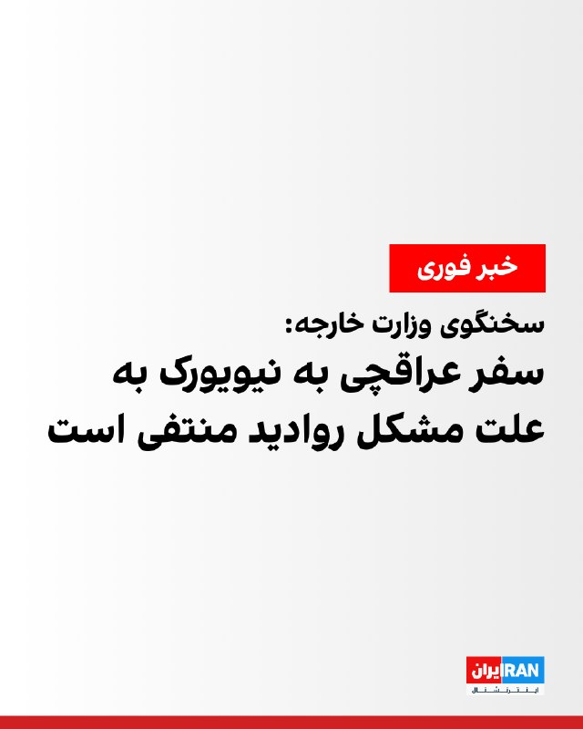

اسماعیل بقائی، سخنگوی وزارت خارجه جمهوری اسلامی در نشست خبری خود در خصوص سفر عباس عراقچی به نیویورک، گفت: «ما داریم برنامه‌ریزی می‌کنیم و گفته بودیم اگر اولویت دیگری پیش نیاید، سفر انجام می‌شود. اما با مشکل روادید مواجه شدیم و این سفر منتفی است.»
‌🏁 🇬🇧 IranintlTV

🤖 @VahidOOnLine

## VahidOOnLine — post 242086

⭕️ بقایی: به پیام‌های ترامپ پاسخ نمی‌دهیم چون کارهای مهم‌تری داریم

♦️اسماعیل بقایی، سخنگوی وزارت امور خارجه جمهوری اسلامی روز دوشنبه چهارم خرداد در نشست خبری هفتگی و در پاسخ به پرسش خبرنگاران درباره پیام‌های «تهدیدآمیز» ترامپ در شبکه‌های اجتماعی گفت: «به این پیام‌ها پاسخی نمی‌دهیم، چون کارهای مهم‌تری داریم... کاریکاتور منتشر کردن بخشی از سیاست‌ورزی در آن طرف دنیا است و ما کارمان را در میدان عمل دنبال می‌کنیم.»
دونالد ترامپ، رئیس جمهوری آمریکا از چند هفته پیش و همزمان با ادامه آتش‌بس، تصاویری که عمدتا با هوش مصنوعی ساخته شده‌اند را درباره چیرگی قدرت نظامی آمریکا و انهدام اهداف نظامی جمهوری اسلامی ایران و آمادگی برای از سرگیری جنگ و همچنین نقشه ایران با پرچم ایالات متحده آمریکا منتشر می‌کند.
‌🇸🇦 Indypersian

🤖 @VahidOOnLine

## VahidOOnLine — post 242085

  

اسماعیل بقائی، سخنگوی وزارت خارجه گفت که جمهوری اسلامی و عمان در حال تدوین سازوکاری برای تضمین تردد ایمن کشتی‌ها در تنگه هرمز هستند و تاکید کرد «ما در تنگه هرمز به دنبال اخذ عوارض نیستیم» و نباید هزینه‌های مربوط به خدمات ناوبری و حفاظت از محیط‌زیست را «عوارض» نامید.

او ادامه داد: «این‌که تنگه هرمز چگونه مدیریت شود به کشورهای ساحلی تنگه مربوط می‌شود.»

بقائی افزود: «اروپایی‌ها باید همواره به خاطر داشته باشند که تنگه هرمز پیش از ۹ اسفند باز بود و صرفا به دلیل تعرض آمریکا و اسرائیل علیه ما، دچار این وضعیت شده است.»
‌🏁 🇬🇧 IranintlTV

🤖 @VahidOOnLine

## VahidOOnLine — post 242084

  

رسانه‌های ایران گزارش دادند محمدباقر قالیباف با ۲۳۵ رای از مجموع ۲۷۱ آرای ماخوذه، بار دیگر به‌عنوان رییس مجلس انتخاب شده است.

بر اساس این گزارش‌، علی نیکزاد با ۱۴۳ رای و حمیدرضا حاجی بابایی با ۱۰۰ رای، به‌عنوان نواب رییس مجلس شورای اسلامی انتخاب شده‌اند.

هنوز مشخص نیست این رای‌گیری به چه شکل و در چه مکانی برگزار شده است. جلسات صحن مجلس از آغاز جنگ میان جمهوری اسلامی، آمریکا و اسرائیل در ۹ اسفند ۱۴۰۴ برگزار نشده است.
‌🏁 🇬🇧 IranintlTV

🤖 @VahidOOnLine

## VahidOOnLine — post 242083

  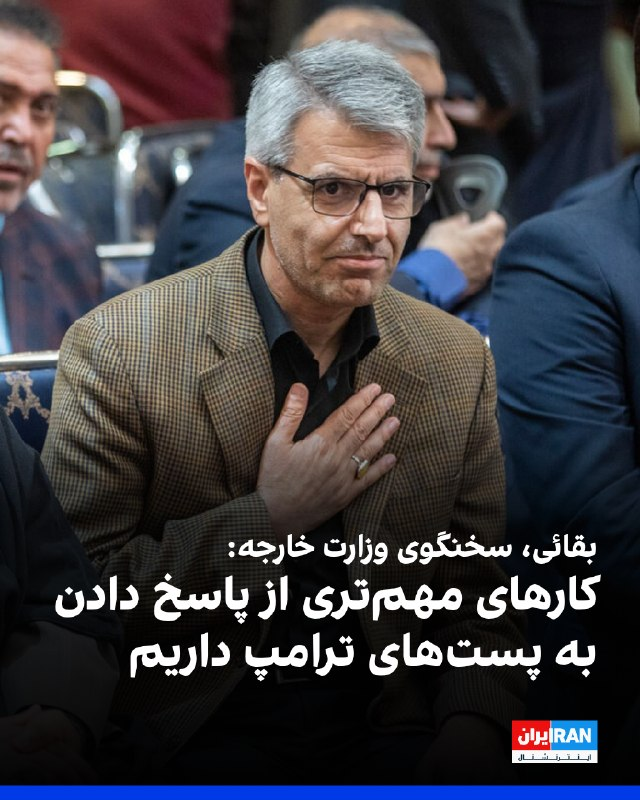

اسماعیل بقائی، سخنگوی وزارت خارجه جمهوری اسلامی در نشست خبری خود گفت: «ما کارهای خیلی مهم‌تری از پاسخ دادن به پست‌های ترامپ داریم. اگر بخواهیم به پست‌ها و تصاویر منتشرشده طرف دیگران پاسخ دهیم، به کارهای خودمان نمی‌رسیم. هر کجا لازم باشد جواب می‌دهیم.»

او افزود: «ما سبک خود را داریم و قرار نیست سبک و روش دشمن را کپی‌برداری کنیم. به عنوان یک ملت متمدن و صاحب سبک و مقتدر هر جا لازم بدانیم و به هر شیوه‌ای که لازم باشد این کار را صورت می‌دهیم، کما اینکه این کار را صورت دادیم. ما کارمان را در میدان عمل دنبال می‌کنیم.»
‌🏁 🇬🇧 IranintlTV

🤖 @VahidOOnLine

## VahidOOnLine — post 242082

  

حسین نوش‌آبادی، مدیرکل پارلمانی و قوانین وزارت خارجه، گفت که در صورت انجام تعهدات طرف آمریکایی و پیشرفت توافق مرحله اول، موضوع هسته‌ای و غنی‌سازی و ذخایر اورانیوم غنی‌شده با خلوص بالا در مقابل لغو تحریم‌ها و آزادسازی کامل دارایی‌های مسدود شده بررسی خواهد شد و نیروهای آمریکایی به طور کامل از منطقه پیرامونی ایران خارج خواهند شد.

او افزود: «تعهد جمهوری اسلامی به طرف آمریکایی در پیش‌نویس ارائه شده جهت توافق اولیه، در خصوص پرونده هسته‌ای و موضوع اورانیوم و تعلیق ۲۰ساله غنی‌سازی، کذب محض است.»
‌🏁 🇬🇧 IranintlTV

🤖 @VahidOOnLine

## VahidOOnLine — post 242081

  

⭕️ تلویزیون پاکستان:
ژنرال عاصم منیر، میانجی گفتگوهای تهران و واشنگتن به چین رفت

♦️تلویزیون دولتی پاکستان، روز دوشنبه چهارم خرداد تصاویری را از حضور  فیلد مارشال عاصم منیر، فرمانده ارتش این کشورو مذاکره‌کننده کلیدی اسلام‌آباد میان ایالات متحده و جمهوری اسلامی ایران، به همراه شهباز شریف، نخست‌وزیر پاکستان در چین منتشر کرد.
عاصم منیر روزهای جمعه و شنبه به همراه محسن نقوی، وزیر کشور پاکستان، به عنوان بخشی از تلاش‌های میانجیگرانه برای پایان رسمی جنگ ایران، به تهران سفر کرده و با مقام‌های ارشد جمهوری اسلامی دیدار کرده بود.
‌🇸🇦 Indypersian

🤖 @VahidOOnLine

## VahidOOnLine — post 242080

  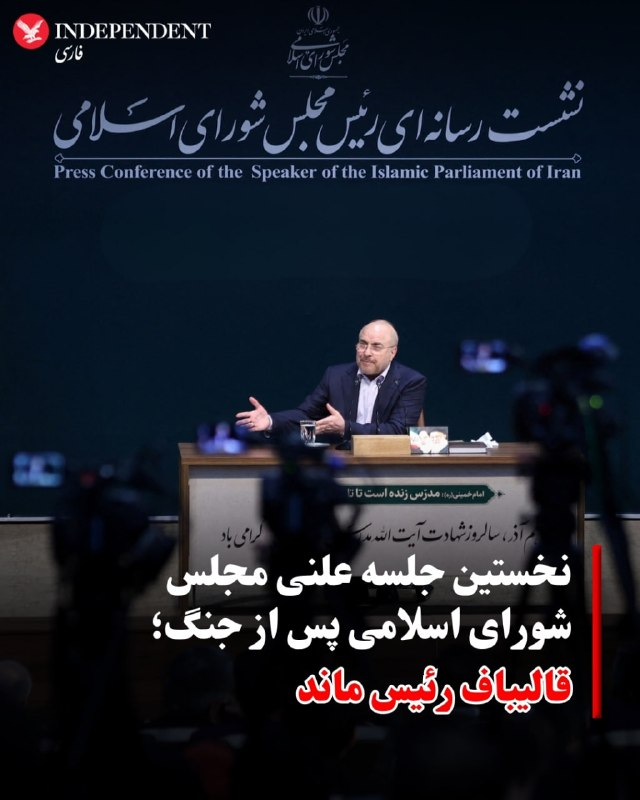

⭕️ نخستین جلسه علنی مجلس شورای اسلامی پس از جنگ؛
قالیباف رئیس ماند

♦️مجلس شورای اسلامی، روز دوشنبه چهارم خردادماه نخستین جلسه علنی و «حضوری» خود را از زمان آغاز حملات اسرائیل و آمریکا در نهم اسفند سال گذشته برگزار کرد.
در این جلسه، محمدباقر قالیباف، رئیس هیئت مذاکره‌کننده جمهوری اسلامی با آمریکا، برای یک سال دیگر در سمت ریاست مجلس شورای اسلامی ابقا شد.
‌🇸🇦 Indypersian

🤖 @VahidOOnLine

## VahidOOnLine — post 242079

  

علی احسان ظفری، مدیرعامل اتحادیه تعاونی‌های لبنی، در مصاحبه با ایلنا، به افزایش ۲۰ درصدی قیمت لبنیات از ابتدای خردادماه اشاره کرد و گفت: «گران شدن لبنیات حتما بر سرانه مصرف مردم تاثیر دارد. البته این گرانی و کاهش سرانه مصرف از قبل هم بوده و همین‌طور این روند ادامه دارد.»

او افزود: «عامل این کار خود دولت بوده است، زیرا دولت شیر خام را در همین دو سه روزه، از کیلویی ۴۶ هزار تومان به ۶۱ هزار تومان رسانده است. وقتی دولت مواد اولیه را با این سرعت گران می‌کند نمی‌توانیم توقع داشته باشیم قیمت لبنیات ثابت بماند.»

ظفری نسبت به کاهش سرانه مصرف لبنیات و تعطیلی کارخانه‌های کوچک و متوسط هشدار داد و گفت سرانه مصرف لبنیات در کشور یک‌چهارم میانگین جهانی است.

او ادامه داد: «سرانه مصرف لبنیات به ازای هر فرد در سال گذشته ۵۵ تا ۶۰ کیلوگرم بود، ولی در حال حاضر به ۴۰ کیلوگرم رسیده است. در صورتی که سرانه مصرف لبنیات در کشورهای جهان سالی ۱۸۰ کیلوگرم و در کشورهای پیشرفته سالی ۳۶۰ کیلوگرم است.»
‌🏁 🇬🇧 IranintlTV

🤖 @VahidOOnLine

## VahidOOnLine — post 242078

  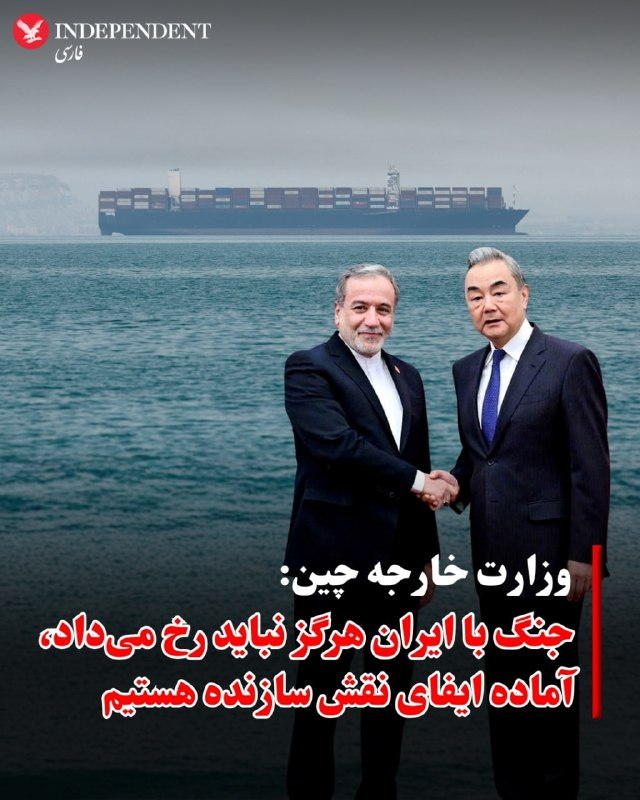

♦️وزارت امور خارجه چین روز دوشنبه چهارم خردادماه با انتقاد دوباره از جنگ آمریکا و اسرائیل علیه جمهوری اسلامی، اعلام کرد این کشور آماد ایفای هرگونه نقش سازنده برای برقراری صلح در خاورمیانه است.

وزارت امور خارجه چین با ابراز نگرانی از احتمال شکست مذاکرات تاکید کرد «درهای گفتگوها هرگز نباید بسته شود. امنیت کشتیرانی و تامین زنجیره کالا باید تضمین شود.»
‌🇸🇦 Indypersian

🤖 @VahidOOnLine

## VahidOOnLine — post 242077

🗣روایت شما از احتمال توافق میان آمریکا و جمهوری اسلامی- دوشنبه ۴ خرداد

🔹هموطن، از شنیدن کلمه توافق ناراحت نشید. چرا که اگه توافقی بشه، جمهوری اسلامی دیگه موجودیت خودش رو از دست داده. همین الان هم جنگ داخلی بین خودشون راه افتاده.

🔹زنده‌ایم؛ نه از روی عادت بلکه از روی امید. خواهش می‌کنم دنیا سکوت نکند. از ترامپ خواهش می‌کنم با قاتلین ۴۰ هزار نفر مذاکره نکند. به امید آزادی.

🔹ترامپ و نتانیاهو کمک خودشون رو رسوندن و ما نباید توقع داشته باشیم که اونا سقوط رژیم رو نهایی کنن. نبرد اصلی و نهایی رو فقط ما مردم انجام می‌دیم.

🔹واقعا دیگه خسته شدیم و زندگی برای مردم سخت شده. اگه قرار بود جنگ رو نصفه ‌راه ول کند، ای‌کاش از اول جنگ راه نمی‌انداخت. مردم ما بیچاره شدن.

🔹مادرم از انواع دردها و بیماری‌ها داره جون می‌ده، اما به خاطر شرایط افتضاح اقتصادی نمی‌تونیم درمانش کنیم. خواهش می‌کنم ما رو از این وضعیت نجات بدید. واقعا دیگه خسته شدیم.

🔹ترامپ در طول جنگ فقط دو بار از مردم ایران حرف زد و اون هم برای تحت فشار گذاشتن جمهوری اسلامی برای امضای توافق بود. این آمریکایی‌ها غیر از منافع‌شون هیچ‌چیز دیگری براشون مهم نیست.

🔹زمان جنگ ترس بود، اما ته‌ش امید قشنگی وجود داشت که قراره خیلی چیزها تغییر کنه. الان ناامیدی و افسردگی به حدی در مردم بالاست که مثل مردگان متحرک زندگی می‌کنیم. اگه قرار هست مذاکره‌ای بشه، وضعیت مردم و تغییر حکومت با انتخاب مردم هم باید جزوش باشه.

🔹ترامپ من بهت امید داشتم؛ نه فقط من بلکه ۸۰ میلیون ایرانی. اینا آدم توافق نیستن. روز به روز قیمت‌ها بالا میره و سفره‌ها کوچک‌تر می‌شه. به دادمون برسید.

🔹ترامپ کاری کرد که تو خواب هم نمی‌دیدیم. حالا بدهکارمون شده؟ نجات ما وظیفه اونه؟ هموطن، به پا خیز.

🔹هموطن محترم، هیچ‌کس به فکر ما نیست. هیچ‌چیز رایگان به دست نمی‌آید؛ حتی نان و آب. پس آزادی کشور هم رایگان نیست. آمریکا به فکر منافع خودش و متحدانش هست. ما هم باید به فکر کشور و منافع خودمون باشیم.

🔹یعنی قرار نیست ما ایران رو بدون این حکومت ببینیم؟ توافق باعث نمی‌شه ما یادمون بره چه خون‌هایی از دست رفته.

🔹آقای ترامپ، تو به ما قول دادی و گفتی کمک در راه است. ما چهل‌هزار کشته دادیم و تو قول دادی که به ما کمک می‌کنی. آیا کمک تو یک توافق هسته‌ای جدید با جمهوری اسلامی بود؟
‌🏁 🇬🇧 IranintlTV

🤖 @VahidOOnLine

## VahidOOnLine — post 242076

  <a href="telegram/content/VahidOOnLine_242076_1779699532.mp4" target="_blank">🎬 Download video</a>

بر اساس ویدیوهای رسیده به ایران‌اینترنشنال گروهی از ایرانیان مقیم آلمان یکشنبه سوم خرداد در اعتراض به اعدام‌های جمهوری اسلامی و برای حمایت از شاهزاده رضا پهلوی در شهر براونشوایگ تجمع کردند.
‌🏁 🇬🇧 IranintlTV

🤖 @VahidOOnLine

## VahidOOnLine — post 242075

  

ابراهیم رضایی، سخنگوی کمیسیون امنیت ملی مجلس، در شبکه ایکس نوشت: «جمهوری اسلامی زیر بار زور و تهدید نمی‌رود. اگر توافق می‌خواهند مذاکره کنند، اگر بنزین شش دلاری می‌خواهند بایستند و بلوف بزنند تا علف زیر پایشان سبز شود.»

او ادامه داد: «در دوره جنگ نظامی تاکتیک ما چشم در مقابل چشم بود، در جنگ دیپلماتیک اقدام در مقابل اقدام است. بلوف رییس‌جمهوری شکست‌خورده را باور نکنید، زمان به ضرر آمریکایی‌هاست.»
‌🏁 🇬🇧 IranintlTV

🤖 @VahidOOnLine

## VahidOOnLine — post 242074

  <a href="telegram/content/VahidOOnLine_242074_1779699536.mp4" target="_blank">🎬 Download video</a>

⭕️ مارکو روبیو و همسرش از تاج محل بازدید کردند

♦️مارکو روبیو، وزیر امور خارجه آمریکا، روز دوشنبه چهارم خرداد به همراه همسرش ژانت دوسدبس، از تاج محل، بنای معروف عشاق هند در شهر آگرا بازدید کرد.

تاج محل، یکی از شناخته شده‌ترین بناهای کشور هند و متعلق به قرن ۱۷ میلادی (۱۱ هجری شمسی) است. این بنای تاریخی، به دستور شاه جهان، پادشاه گورکانی به یاد همسر درگذشته‌اش، ممتاز محل، بانوی ایرانی، ساخته شد و سال‌ها است که از جاذبه‌های گردشگری هند به شمار می‌رود.

مارکو روبیو در نخستین سفر به‌ هند تلاش می‌کند تا مناسبات «آسیب دیده» واشنگتن و دهلی نو را بازسازی کند و همزمان، تعادل قدرت در آسیا را همزمان با گسترش نفوذ چین و روسیه، از نو برقرار سازد.
‌🇸🇦 Indypersian

🤖 @VahidOOnLine

## VahidOOnLine — post 242073

  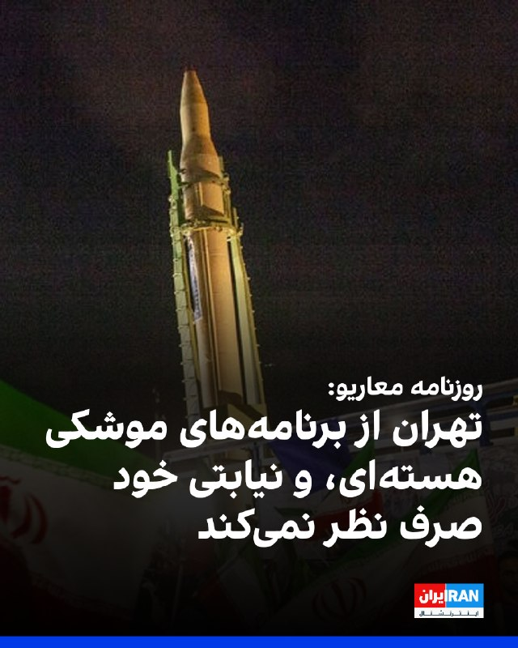

روزنامه معاریو در گزارشی تحلیلی نوشت جمهوری اسلامی در پی تشکیل یک «امپراتوری شیعه انقلابی» در منطقه است و به همین دلیل حاضر نخواهد شد از برنامه هسته‌ای، توان موشکی، نیروهای نیابتی و دیگر ابزارهای نفوذ منطقه‌ای خود صرف‌نظر کند.

این روزنامه افزود که اگر جمهوری اسلامی تصمیم به ادامه برنامه هسته‌ای و دستیابی به سلاح اتمی داشته باشد، هیچ توافق بین‌المللی قادر به جلوگیری از آن نخواهد بود.

به نوشته این روزنامه، تنها دو راه برای اطمینان ازعدم دستیابی تهران به سلاح هسته‌ای وجود دارد؛ نخست، تلاش برای تغییر نظام سیاسی در ایران و دوم، ایجاد «بازدارندگی موثر» به گونه‌ای که رهبران جمهوری اسلامی حتی به ساخت سلاح اتمی فکر نکنند.
‌🏁 🇬🇧 IranintlTV

🤖 @VahidOOnLine

## WithYashar — post 12404

بقایی: برای تنگه هرمز عوارض نمی‌گیریم؛ هزینه‌های دریافتی صرفاً بابت خدمات ناوبری و حفاظت از محیط زیست است
@withyashar

## WithYashar — post 12403

ربیو:اگر مذاکرات شکست بخورد تقصیر ایالات متحده یا متحدان ما در منطقه خلیج فارس نیست. 100 درصد تقصیر ایران است
@withyashar

## WithYashar — post 12402

سخنگوی وزارت خارجه:

سفر آقای عراقچی به نیویورک به علت مشکل روادید منتفی است
@withyashar

## WithYashar — post 12401

  

بیانیهٔ مارکو روبیو، وزیر امور خارجه آمریکا
محکومیت درخواست بی‌پروا و خطرناک حزب‌الله برای سرنگونی دولت لبنان

ایالات متحده با شدیدترین لحن ممکن، درخواست بی‌ملاحظه حزب‌الله برای سرنگونی دولت منتخب و قانونی لبنان را محکوم می‌کند.
حزب‌الله بارها درخواست‌های دولت قانونی لبنان برای توقف حملات و احترام به آتش‌بس را نادیده گرفته است. در عوض، به شلیک به مواضع اسرائیل و انتقال نیروها و سلاح‌ها به جنوب لبنان ادامه داده است. این یک کارزار عمدی برای بی‌ثبات کردن کشور و حفظ قدرت خود، به بهای آینده مردم لبنان است.

دولت لبنان در حال تلاش برای بازسازی، احیای کشور، دریافت کمک‌های بین‌المللی و ایجاد آینده‌ای باثبات برای شهروندانش با حمایت کامل ایالات متحده است. اما حزب‌الله، برعکس، فعالانه می‌کوشد لبنان را دوباره به سوی هرج‌ومرج و ویرانی بکشاند.

ایالات متحده قاطعانه در کنار دولت قانونی لبنان ایستاده است؛ دولتی که برای بازگرداندن حاکمیت خود و ساختن آینده‌ای بهتر برای همه مردم لبنان تلاش می‌کند. تهدیدهای حزب‌الله برای خشونت و سرنگونی حکومت، اجازه موفقیت نخواهد یافت. دورانی که یک گروه تروریستی تمام یک کشور را گروگان گرفته بود، رو به پایان است.
@withyashar

## WithYashar — post 12400

سعید قاسمی نژاد مشاور شاهزاده : ‏شاید شما هم مثل من همیشه این سوال را از خودتان می‌پرسید که اگر در سال ۵۷ بودید آیا اسیر جو زمان می‌شدید و روبروی شاه می‌ایستادید یا کنار او می‌ایستادید و از ایران دفاع می‌کردید. اگر امروز روبروی شاهزاده رضا پهلوی ایستاده‌اید و‌ دشمن اویید قطعا آن روز هم روبروی شاه می‌ایستادید و‌ دشمن او می‌بودید، شک نکنید و به خودتان و دیگران دروغ نگویید.
@withyashar
یاشار : چقدر زیبا یاد آوری کردید ، اتفاقا اگه در اون زمان بودیم جلوی اطرافیان شاه میستادیم !
جلوی فردوست ، جلوی بختیار ، جلوی ارتشید قره باغی و حتی اردشیر زاهدی و خیلی از حلقه اطرافیان ایشان !
جاوید شاه پاینده ایران !

## WithYashar — post 12399

ترامپ در تروث : یکی از بدترین توافق‌هایی که کشور ما تا به حال انجام داده، «توافق هسته‌ای ایران» بود که توسط باراک حسین اوباما و افراد کاملاً غیرحرفه‌ای دولت اوباما طراحی و امضا شد. این توافق، یک مسیر مستقیم برای ایران جهت دستیابی به سلاح هسته‌ای ایجاد می‌کرد.…

## WithYashar — post 12398

انتخابات هیئت رئیسه مجلس که از ساعت ۷:۳۰ صبح امروز آغاز شد، دقایقی پیش پایان یافت
با آرا اکثریت نمایندگان قالیباف رئیس‌مجلس ماند
این انتخابات بصورت حضوری و با رای مستقیم نمایندگان برای انتخاب ۱۲ عضو هیئت رئیسه مجلس شامل یک رئیس، ۲ نایب رئیس، ۶ دبیر و ۳ ناظر بود.
@withyashar

## WithYashar — post 12397

😂😂😂

## WithYashar — post 12396

نعیم قاسم دبیرکل حزب الله:به خیابان ها بیاید و دولت لبنان را سرنگون کنید
@withyashar

## WithYashar — post 12395

## WithYashar — post 12394

## WithYashar — post 12393

## WithYashar — post 12392

Voice message

## WithYashar — post 12391

در مسیر قاهره در یک کاروانسرا استراحت می‌کنیم. نگران نباشید، کمی بعد حرکت می‌کنیم.😃

## WithYashar — post 12390

نیویورک پست : ترامپ نظر خود را تغییر داده و احتمال توافق اکنون به طور قابل توجهی کاهش یافته است؛ تماس ترامپ با نتانیاهو تأثیر بسیار زیادی داشته
@withyashar

## WithYashar — post 12389

۱۵۴۰ تا دایرکت نخونده دارم ، یه فرصت بدید شاید نتونم این سری لایک هم کنم والی همه رو یکم دیگه میخونم🥲🙌🏾

## WithYashar — post 12388

شبکه خبری سی‌بی‌اس به نقل از مقام‌های آمریکایی آگاه گزارش داد اطلاعات ایالات متحده نشان می‌دهد خامنه‌ای، رهبر جمهوری اسلامی، عملا در مکانی نامعلوم پنهان شده و دسترسی بسیار محدودی به دنیای خارج دارد. بر اساس این گزارش، مقام‌های حکومت ایران تنها از طریق شبکه‌ای…

## WithYashar — post 12387

اکونومیست: گزارش‌ها حاکی از آن است که عربستان سعودی از دونالد ترامپ درخواست کرده است هرگونه حمله جدید به ایران را تا پس از حج به تعویق بیندازد.
همچنان ترس وجود دارد که اگر درگیری دوباره آغاز شود، زائران در آنجا گیر خواهند افتاد.
@withyashar

## WithYashar — post 12386

فایننشال تایمز: عصبانیت رئیس‌جمهور چین از «افزایش توان نظامی ژاپن» در حضور همتای آمریکایی‌اش

پاسخ ترامپ: ژاپن به دلیل تهدیدات کره شمالی، به دفاع قوی‌تری نیاز دارد
@withyashar

## mwarmonitor — post 9664

  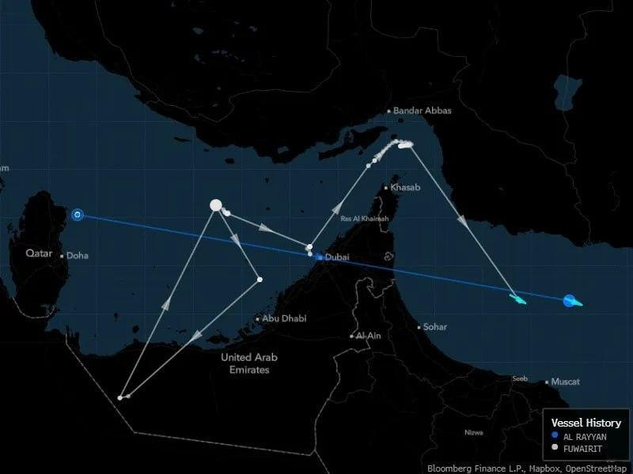

🔴قطر به‌صورت مخفیانه LNG از طریق تنگه هرمزِ مسدودشده جابه‌جا می‌کند

🔹با وجود انسداد تقریباً کامل تنگه هرمز، قطر موفق شده است سه کشتی حامل LNG را به‌صورت مخفیانه از این آبراه حیاتی عبور دهد.

🔹به گزارش بلومبرگ، این تانکرها شامل Al Rayyan (در مسیر چین) و Fuwairit (در مسیر پاکستان) هستند که در روزهای اخیر فرستنده‌های موقعیت‌یاب خود را خاموش کرده و با موفقیت از تنگه عبور کرده‌اند.

🔸این اقدام به قطر اجازه می‌دهد حتی در شرایط ادامه درگیری نظامی در منطقه، همچنان به تأمین مشتریان اصلی آسیایی خود ادامه دهد.

@mwarmonitor

## mwarmonitor — post 9663

  

🚀چین فضاپیمای شِنژو ۲۳ را پرتاب کرد؛ یکی از سه فضانورد قرار است یک مأموریت یک‌ساله در فضا انجام دهد.

🔸در این مأموریت، فضاپیما با سه فضانورد به ایستگاه فضایی تیانگونگ در مدار زمین پرتاب شد و طبق برنامه، یکی از اعضای خدمه قرار است حدود یک سال در فضا بماند.

🔹این مأموریت بخشی از برنامه چین برای افزایش توان پروازهای طولانی‌مدت فضایی و آماده‌سازی برای فرود سرنشین‌دار بر ماه تا سال ۲۰۳۰ است. نیویورک پست

@mwarmonitor

## mwarmonitor — post 9662

🔸سخنگوی وزارت امور خارجه ایران گفت: ما از تنگه هرمز عوارض دریافت نخواهیم کرد.

🔹سخنگوی وزارت امور خارجه ایران گفت که طبیعی است خدماتی که ارائه می‌شود هزینه‌ای داشته باشد، اما نباید این هزینه‌ها به‌عنوان «عوارض» معرفی شوند.

@mwarmonitor

## mwarmonitor — post 9661

  

🔴یک پهپاد MQ-4C Triton نیروی دریایی ایالات متحده که دو روز پیش به پایگاه هوایی موفق‌السلطی در اردن منتقل شده بود، اکنون به پرواز درآمده و در حال حرکت به سمت خلیج فارس برای انجام یک مأموریت شناسایی در نزدیکی ایران است.

@mwarmonitor

## pm_afshaa — post 91439

🔴ربیو:اگر مذاکرات شکست بخورد تقصیر ایالات متحده یا متحدان ما در منطقه خلیج فارس نیست. 100 درصد تقصیر ایران است

💧 Rainbet.com the #1 Non-KYC Crypto Casino & Sportsbook @rainbetcom

😁 @Pm_Afshaa

## pm_afshaa — post 91438

درود هموطنان عزیزم یک دختر 26 سال داره بجرم کشتن یکنفر که وارد خونش شده که بهش تعرض و تجاوز بکنه صبح 5 خرداد اعدام میشه، باید ۱۰ میلیارد جمع بشه که رضایت بدن تا حالا ۹ میلیارد جمع شده  همه چی داخل تصویر هست کسی خواست استعلام بگیره میدونم ایرانی ها آدم با…

## pm_afshaa — post 91437

به قرآن قسم بگی چندجا روبیکا هم گفتم بزارن شما کامل بخون و استعلام هم بگیر که دروغ نیست میتونی کانال بزاری فردا اعدام میشه یک میلیارد مونده💔💔

## pm_afshaa — post 91436

درود هموطنان عزیزم یک دختر 26 سال داره بجرم کشتن یکنفر که وارد خونش شده که بهش تعرض و تجاوز بکنه صبح 5 خرداد اعدام میشه، باید ۱۰ میلیارد جمع بشه که رضایت بدن تا حالا ۹ میلیارد جمع شده  همه چی داخل تصویر هست کسی خواست استعلام بگیره میدونم ایرانی ها آدم با…

## pm_afshaa — post 91435

  

درود هموطنان عزیزم
یک دختر 26 سال داره بجرم کشتن یکنفر که وارد خونش شده که بهش تعرض و تجاوز بکنه
صبح 5 خرداد اعدام میشه، باید ۱۰ میلیارد جمع بشه که رضایت بدن تا حالا ۹ میلیارد جمع شده  همه چی داخل تصویر هست کسی خواست استعلام بگیره
میدونم ایرانی ها آدم با غیرتی هستند حتی شما با کمک ۱۰ هزار تومان کمک بزرگی کردید❤️

شماره کارت:۵۸۹۴۶۳۱۵۹۴۰۴۵۲۸۸
شبا: ۲۲۰۱۳۰۱۰۰۰۰۰۰۰۰۲۶۰۴۸۲۷۶۶

روی شماره کارت و شماره شبا بزنید کپی میشه

## pm_afshaa — post 91434

🔴قالیباف برای هفتمین بار رئیس مجلس رژیم شد

💧 Rainbet.com the #1 Non-KYC Crypto Casino & Sportsbook @rainbetcom

😁 @Pm_Afshaa

## pm_afshaa — post 91433

🔴کابینه سیاسی-امنیتی اسراییل فردا ساعت 18 تشکیل جلسه خواهد داد

💧 Rainbet.com the #1 Non-KYC Crypto Casino & Sportsbook @rainbetcom

😁 @Pm_Afshaa

## pm_afshaa — post 91432

وزارت امور خارجه چین امروز در واکنش به مذاکرات بین ایران و ایالات متحده برای رسیدن به توافقی جهت پایان جنگ اعلام کرد که این جنگ اصلاً نباید آغاز می‌شد و نیازی به ادامه آن نیست

💧 Rainbet.com the #1 Non-KYC Crypto Casino & Sportsbook @rainbetcom

😁 @Pm_Afshaa

## pm_afshaa — post 91431

مشاور وزیر ارتباطات از احتمال دسترسی و اتصال به اینترنت بین‌المللی در هفته آینده خبر داد

💧 Rainbet.com the #1 Non-KYC Crypto Casino & Sportsbook @rainbetcom

😁 @Pm_Afshaa

## pm_afshaa — post 91430

  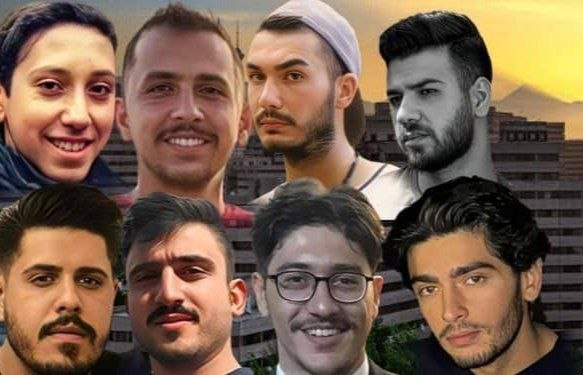

رژیم تروریستی جمهوری اسلامی برای بچه های اکباتان حکم اعدام صادر کرد

میلاد آرمون، نوید نجاران، مهدی ایمانی و سید محمدمهدی حسینی به اعدام محکوم شدن

💧 Rainbet.com the #1 Non-KYC Crypto Casino & Sportsbook @rainbetcom

😁 @Pm_Afshaa

## pm_afshaa — post 91429

نعیم قاسم دبیرکل حزب الله:به خیابان ها بیاید و دولت لبنان را سرنگون کنید

💧 Rainbet.com the #1 Non-KYC Crypto Casino & Sportsbook @rainbetcom

😁 @Pm_Afshaa

## pm_afshaa — post 91428

🔴نیویورک پست : ترامپ نظر خود را تغییر داده و احتمال توافق اکنون به طور قابل توجهی کاهش یافته است؛ تماس ترامپ با نتانیاهو تأثیر بسیار زیادی داشته

💧 Rainbet.com the #1 Non-KYC Crypto Casino & Sportsbook @rainbetcom

😁 @Pm_Afshaa

## pm_afshaa — post 91427

  

عباس اکبری فیض آبادی از معترضین دی ماه در اصفهان امروز با اذان صبح توسط جمهوری اسلامی اعدام شد

💧 Rainbet.com the #1 Non-KYC Crypto Casino & Sportsbook @rainbetcom

😁 @Pm_Afshaa

## DEJradio — post 4931

👑🎥 شماری از ایرانیان میهن‌دوست روز یکشنبه سوم خرداد ۱۴۰۵ در حمایت از انقلاب شیر و خورشید و شاهزاده رضا پهلوی در شهر تریر آلمان تظاهرات کردند.

#آلمان #انقلاب_شیروخورشید
@DEJradio

## DEJradio — post 4930

  <a href="telegram/content/DEJradio_4930_1779699545.webm" target="_blank">🎬 Download video</a>

🔺📢 مجله اکونومیست می‌نویسد، گزارش‌‌ها حاکی از آن است که عربستان سعودی از دونالد ترامپ درخواست کرده است هرگونه حمله جدید به ایران را تا پس از حج به تعویق بیندازد زیرا این نگرانی وجود دارد که اگر درگیری دوباره آغاز شود، زائران در آنجا گیر خواهند افتاد.

این مراسم ۹ خرداد تمام می‌شود.

#حج #عربستان_سعودی
@DEJradio

## DEJradio — post 4929

  <a href="telegram/content/DEJradio_4929_1779699546.webm" target="_blank">🎬 Download video</a>

🤡
🔺 حبیب‌الله سیاری معاون هماهنگ‌کننده ارتش جمهوری اسلامی در واکنش به ادعاها درباره توافق آمریکا و جمهوری اسلامی با اعلام بی‌خبری از موضوع به کنایه می‌گوید، اصلا نمی‌دونم توافق سر چی هست!

کانال تلگرامی سـ.ـپاه نیوز می‌نویسد: «در حالی‌که رسانه‌های بیگانه با جزئیات دقیق یا تحریف‌شده، در حال مهندسی اخبار تفاهم احتمالی و تزریق ابهام و اضطراب به جامعه هستند، مراجع رسمی داخلی حتی از انتشار یک خط روایت اول و شفاف دریغ می‌کنند.»
محمد منان نماینده مجلس شورای اسلامی گفته «حسب اخبار واصله طبق توافق احتمالی،ایران تنگه هرمز را باز خواهد کرد بدون آنکه به اخذ عوارض توسط ایران اشاره ای شده باشد!»

#توافق #مذاکرات
@DEJradio

## mamlekate — post 103579

📝 مقام ارشد آمریکا: ایران پشت‌پرده برای واگذاری اورانیوم غنی‌شده، تعهد داده است

یک مقام ارشد دولت ترامپ اعلام کرد رژیم ایران «پشت‌پرده» تعهداتی در زمینه واگذاری اورانیوم غنی‌شده داده و جمهوری اسلامی بدون اجرای این تعهدات، دستاورد چندانی از مذاکرات نخواهد داشت.

📝 مقام وزارت خارجه جمهوری اسلامی: درباره اورانیوم با غلطت بالا بعد از تفاهم اولیه مذاکره می‌کنیم

یک دیپلمات ارشد جمهوری اسلامی اعلام کرد که در صورت دستیابی به توافق میان تهران و واشنگتن، «موضوع هسته‌ای و غنی‌سازی و ذخایر اورانیوم غنی‌شده با خلوص بالا» در فرصت نهایتا ۶۰ روزه این توافق بررسی خواهد شد.

@mamlekate

## VahidOnline — post 75695

  

وزیر خارجه ایالات متحده، روز دوشنبه چهارم خرداد گفت که واشینگتن در مذاکرات جاری خود با ایران، «هر فرصتی برای موفقیت» به دیپلماسی خواهد داد.

مارکو روبیو که اکنون در هند به‌سر می‌برد در جمع خبرنگاران گفت که مذاکرات با ایران همچنان «در حال پیشرفت» است و خوش‌بینی محتاطانه‌ای نسبت به توافق احتمالی برای بازگشایی مسیرهای کلیدی کشتیرانی و از سرگیری مذاکرات هسته‌ای ابراز کرد.

او که روز گذشته از احتمال توافق با ایران تا پایان روز یک‌شنبه خبر داده بود، گفت: «همه ما باید مطمئن باشیم که یا به یک توافق خوب خواهیم رسید، یا مجبور می‌شویم به شکل دیگری با این مسئله برخورد کنیم. ترجیح ما این است که یک توافق خوب داشته باشیم.»

دونالد ترامپ، رئیس‌جمهور آمریکا نیز شامگاه یک‌شنبه در دومین پیام خود درباره روند مذاکرات با ایران اطمینان داد که توافق احتمالی با ایران «خوب و درست» خواهد بود اما هیچ کس درباره محتوای آن اطلاع ندارد.
@VahidHeadline

📡 @VahidOnline

## VahidOnline — post 75694

  

خبرگزاری «میزان» رسانه قوه قضاییه جمهوری اسلامی اعلام کرد حکم اعدام «عباس اکبری فیض‌آبادی»، از متهمان پرونده اعتراضات دی‌۱۴۰۴ در شهرستان «نایین» اصفهان، صبح روز دوشنبه ۴خرداد۱۴۰۵ اجرا شده است.

«میزان» مدعی شده که عباس اکبری از «لیدرهای مسلح» اعتراضات در نایین بوده و در جریان حمله به فرمانداری این شهر و برخی مراکز حکومتی، به سوی ماموران امنیتی تیراندازی کرده است.
@VahidHeadline

📡 @VahidOnline

## IranIntlTV — post 338886

  

🔻عبدالکریم حسین‌زاده، معاون مسعود پزشکیان، رییس دولت جمهوری اسلامی در پیامی در شبکه اجتماعی ایکس با اشاره به یادداشت سردار آزمون، او را «سرمایه ملی» خواند و خواستار بازگشت سردار به تیم ملی فوتبال شد: «هرکس نام ایران را بالاتر از گلایه‌های شخصی می‌نشاند، بخشی از سرمایه ملی ماست.»

🔹سردار آزمون چهار روز پیش در یادداشتی در صفحه اینستاگرام خود نوشت: «تا امروز از هيچ تلاشی برای حمايت از هموطنانم دريغ نكردم. هر جايی كه فوتبال بازی كنم، هويت من، قلب من و افتخار من ايران است.»

🔹او همچنین نوشت: «من هميشه با افتخار برای تيم ملی كشورم بازی كردم. وقتی می‌برديم، به خودم و هم‌تيمی‌هام افتخار می كردم و وقتی نمی‌برديم مثل همه آنها ناراحت‌ترين آدم دنيا بودم. من عاشق فوتبال هستم و عاشق مردم خوب و شايسته كشورم ايران.»

🔹درحالی که امیر قلعه‌نویی، سرمربی تیم ملی هنوز فهرست نهایی تیم ملی را اعلام نکرده است، روزنامه فرهیختگان خواستار عذرخواهی سردار آزمون برای بازگشت به تیم ملی شده است.

🔹این روزنامه امروز در یادداشتی نوشت: «اگر قرار به بازگشت او باشد، همه منتظر شنیدن یک عذرخواهی واقعی و صادقانه هستند.»

@iranintltvsport

## IranIntlTV — post 338885

  

بر اساس اطلاعات رسیده به ایران‌اینترنشنال، امید عظیمی، ۲۶ ساله، روز ۱۹ دی‌ماه در جریان اعتراضات صادقیه تهران هدف گلوله قرار گرفت، خود را در یک پارک مخفی کرد اما به دلیل خونریزی شدید جان باخت.

به گفته یک منبع مطلع، امید عظیمی روز ۱۹ دی پس از خروج از باشگاه، برای شرکت در تجمع اعتراضی علیه گرانی و جمهوری اسلامی، مطابق فراخوان شاهزاده رضا پهلوی، به خیابان رفته بود. پس از قطع ناگهانی آنتن‌های تلفن همراه، ارتباط نزدیکانش با او قطع شد و خانواده و اطرافیانش تا صبح در بیمارستان‌ها به دنبال او گشتند.

امید پس از اصابت گلوله، خود را به یک پارک رساند و در آنجا پنهان شد. زمانی که نزدیکانش او را پیدا کردند، خون زیادی از دست داده بود. او را سپس به بیمارستان شهریار منتقل کردند اما به دلیل شدت جراحات و خونریزی شدید جان باخت.

دوستانش امید را فردی شجاع و نترس می‌دانند و می‌گویند که او همیشه دوست داشت مردم متحد باشند تا ایران آزاد شود. او عاشق ورزش و موتور‌سواری بود

امید در آخرین تماس تلفنی با مادرش گفته بود: شام می‌آیم و دور هم می‌خوریم.

https://iranintl.com/202605258688

## IranIntlTV — post 338884

  

اسماعیل بقائی، سخنگوی وزارت خارجه جمهوری اسلامی گفت: «کسی نمی‌تواند ادعا بکند به توافق نزدیک شده‌ایم، تغییرات مکرر مواضع مقامات آمریکایی هر گفت‌وگویی را دچار اشکال می‌کند.»

او افزود: «جمهوری اسلامی در حال حاضر بر روند مذاکرات متمرکز است و اینکه توافق احتمالی بعدا چگونه اعلام یا امضا شود، موضوعی است که برای تصمیم‌گیری درباره آن فرصت وجود دارد.»

بقائی اضافه کرد: «سفر هیئت‌ها به تهران یا سفر متقابل ممکن است در صورت لزوم انجام شود، اما در شرایط فعلی برنامه‌ای برای سفر به پاکستان یا سفر هیئت پاکستانی به ایران برنامه‌ریزی نشده است.»
https://www.iranintl.com/202605257022

## IranIntlTV — post 338883

  <a href="telegram/content/IranIntlTV_338883_1779699550.mp4" target="_blank">🎬 Download video</a>

ویدیویی که تازه به دست ایران‌اینترنشنال رسیده، خاکسپاری شبانه جاویدنام رئوف درخشانی‌مهر را نشان می‌دهد؛ سندی از اجبار خانواده‌ها به دفن مخفیانه و شبانه معترضان کشته‌شده.
رئوف، ۱۹ ساله و دانشجوی حقوق، شامگاه ۱۹ دی در دزفول با شلیک گلوله جنگی کشته شد و او را با تدابیر امنیتی در آرامستان شهیدآباد دزفول به خاک سپردند.

## IranIntlTV — post 338882

  

اسماعیل بقائی، سخنگوی وزارت خارجه جمهوری اسلامی در نشست خبری دوشنبه خود گفت: «حتما بخشی از پول‌های ما خرج موشک و پهپاد می‌شود که اگر چنین نمی‌کردیم، دشمنان ما می‌توانستند به مطامع‌شان برسند.»

او افزود: «آمریکا به تاسیسات زیربنایی ما که نماد توسعه بومی و درون‌زای کشور بود، حمله کرد.»

بقائی ادامه داد: «پل‌ها و نیروگاه‌ها که ظاهرا خار چشم طرف‌های آمریکایی هستند، بارها تهدید شده‌اند که مورد حمله قرار می‌گیرند و همه این‌ها با پول همین مردم ساخته شده است.»
https://iranintl.com/202605252121

## IranIntlTV — post 338881

  

اسماعیل بقائی، سخنگوی وزارت خارجه جمهوری اسلامی در نشست خبری خود در خصوص سفر عباس عراقچی به نیویورک، گفت: «ما داریم برنامه‌ریزی می‌کنیم و گفته بودیم اگر اولویت دیگری پیش نیاید، سفر انجام می‌شود. اما با مشکل روادید مواجه شدیم و این سفر منتفی است.»
https://iranintl.com/202605256350

## IranIntlTV — post 338880

  

اسماعیل بقائی، سخنگوی وزارت خارجه گفت که جمهوری اسلامی و عمان در حال تدوین سازوکاری برای تضمین تردد ایمن کشتی‌ها در تنگه هرمز هستند و تاکید کرد «ما در تنگه هرمز به دنبال اخذ عوارض نیستیم» و نباید هزینه‌های مربوط به خدمات ناوبری و حفاظت از محیط‌زیست را «عوارض» نامید.

او ادامه داد: «این‌که تنگه هرمز چگونه مدیریت شود به کشورهای ساحلی تنگه مربوط می‌شود.»

بقائی افزود: «اروپایی‌ها باید همواره به خاطر داشته باشند که تنگه هرمز پیش از ۹ اسفند باز بود و صرفا به دلیل تعرض آمریکا و اسرائیل علیه ما، دچار این وضعیت شده است.»
https://iranintl.com/202605252733

## IranIntlTV — post 338879

  

رسانه‌های ایران گزارش دادند محمدباقر قالیباف با ۲۳۵ رای از مجموع ۲۷۱ آرای ماخوذه، بار دیگر به‌عنوان رییس مجلس انتخاب شده است.

بر اساس این گزارش‌، علی نیکزاد با ۱۴۳ رای و حمیدرضا حاجی بابایی با ۱۰۰ رای، به‌عنوان نواب رییس مجلس شورای اسلامی انتخاب شده‌اند.

هنوز مشخص نیست این رای‌گیری به چه شکل و در چه مکانی برگزار شده است. جلسات صحن مجلس از آغاز جنگ میان جمهوری اسلامی، آمریکا و اسرائیل در ۹ اسفند ۱۴۰۴ برگزار نشده است.
https://iranintl.com/202605258172

## IranIntlTV — post 338878

  <a href="telegram/content/IranIntlTV_338878_1779699556.mp4" target="_blank">🎬 Download video</a>

یک دانش‌آموز با ارسال پیامی به ایران‌اینترنشنال می‌گوید در امتحانات آمادگی دفاعی مدرسه، اعتراضات دی‌ماه را جنگ حساب کرده‌اند.

## IranIntlTV — post 338877

  

اسماعیل بقائی، سخنگوی وزارت خارجه جمهوری اسلامی در نشست خبری خود گفت: «ما کارهای خیلی مهم‌تری از پاسخ دادن به پست‌های ترامپ داریم. اگر بخواهیم به پست‌ها و تصاویر منتشرشده طرف دیگران پاسخ دهیم، به کارهای خودمان نمی‌رسیم. هر کجا لازم باشد جواب می‌دهیم.»

او افزود: «ما سبک خود را داریم و قرار نیست سبک و روش دشمن را کپی‌برداری کنیم. به عنوان یک ملت متمدن و صاحب سبک و مقتدر هر جا لازم بدانیم و به هر شیوه‌ای که لازم باشد این کار را صورت می‌دهیم، کما اینکه این کار را صورت دادیم. ما کارمان را در میدان عمل دنبال می‌کنیم.»
https://iranintl.com/202605258641

## IranIntlTV — post 338876

  

حسین نوش‌آبادی، مدیرکل پارلمانی و قوانین وزارت خارجه، گفت که در صورت انجام تعهدات طرف آمریکایی و پیشرفت توافق مرحله اول، موضوع هسته‌ای و غنی‌سازی و ذخایر اورانیوم غنی‌شده با خلوص بالا در مقابل لغو تحریم‌ها و آزادسازی کامل دارایی‌های مسدود شده بررسی خواهد شد و نیروهای آمریکایی به طور کامل از منطقه پیرامونی ایران خارج خواهند شد.

او افزود: «تعهد جمهوری اسلامی به طرف آمریکایی در پیش‌نویس ارائه شده جهت توافق اولیه، در خصوص پرونده هسته‌ای و موضوع اورانیوم و تعلیق ۲۰ساله غنی‌سازی، کذب محض است.»
https://iranintl.com/202605252499

## IranIntlTV — post 338875

  <a href="telegram/content/IranIntlTV_338875_1779699561.mp4" target="_blank">🎬 Download video</a>

شهباز شریف، نخست‌وزیر پاکستان، اعلام کرد کشورش به تلاش‌های خود برای برقراری صلح در منطقه ادامه می‌دهد و امیدوار است دور بعدی «گفت‌وگوهای صلح» میان ایالات متحده و جمهوری اسلامی به‌زودی در پاکستان برگزار شود.

گزارش جواد همدانی، خبرنگار ایران‌اینترنشنال
@iranintltv

## IranIntlTV — post 338874

  

علی احسان ظفری، مدیرعامل اتحادیه تعاونی‌های لبنی، در مصاحبه با ایلنا، به افزایش ۲۰ درصدی قیمت لبنیات از ابتدای خردادماه اشاره کرد و گفت: «گران شدن لبنیات حتما بر سرانه مصرف مردم تاثیر دارد. البته این گرانی و کاهش سرانه مصرف از قبل هم بوده و همین‌طور این روند ادامه دارد.»

او افزود: «عامل این کار خود دولت بوده است، زیرا دولت شیر خام را در همین دو سه روزه، از کیلویی ۴۶ هزار تومان به ۶۱ هزار تومان رسانده است. وقتی دولت مواد اولیه را با این سرعت گران می‌کند نمی‌توانیم توقع داشته باشیم قیمت لبنیات ثابت بماند.»

ظفری نسبت به کاهش سرانه مصرف لبنیات و تعطیلی کارخانه‌های کوچک و متوسط هشدار داد و گفت سرانه مصرف لبنیات در کشور یک‌چهارم میانگین جهانی است.

او ادامه داد: «سرانه مصرف لبنیات به ازای هر فرد در سال گذشته ۵۵ تا ۶۰ کیلوگرم بود، ولی در حال حاضر به ۴۰ کیلوگرم رسیده است. در صورتی که سرانه مصرف لبنیات در کشورهای جهان سالی ۱۸۰ کیلوگرم و در کشورهای پیشرفته سالی ۳۶۰ کیلوگرم است.»
https://iranintl.com/202605258095

## IranIntlTV — post 338873

  <a href="telegram/content/IranIntlTV_338873_1779699564.mp4" target="_blank">🎬 Download video</a>

یک شهروند با ارسال ویدیویی به ایران‌اینترنشنال یک شرکت محصولات پتروشیمی را در حوالی ساوه نشان می‌دهد و از تعطیلی آن پس از جنگ و بیکاری کارگرانش می‌گوید.

## IranIntlTV — post 338872

🗣روایت شما از احتمال توافق میان آمریکا و جمهوری اسلامی- دوشنبه ۴ خرداد

🔹هموطن، از شنیدن کلمه توافق ناراحت نشید. چرا که اگه توافقی بشه، جمهوری اسلامی دیگه موجودیت خودش رو از دست داده. همین الان هم جنگ داخلی بین خودشون راه افتاده.

🔹زنده‌ایم؛ نه از روی عادت بلکه از روی امید. خواهش می‌کنم دنیا سکوت نکند. از ترامپ خواهش می‌کنم با قاتلین ۴۰ هزار نفر مذاکره نکند. به امید آزادی.

🔹ترامپ و نتانیاهو کمک خودشون رو رسوندن و ما نباید توقع داشته باشیم که اونا سقوط رژیم رو نهایی کنن. نبرد اصلی و نهایی رو فقط ما مردم انجام می‌دیم.

🔹واقعا دیگه خسته شدیم و زندگی برای مردم سخت شده. اگه قرار بود جنگ رو نصفه ‌راه ول کند، ای‌کاش از اول جنگ راه نمی‌انداخت. مردم ما بیچاره شدن.

🔹مادرم از انواع دردها و بیماری‌ها داره جون می‌ده، اما به خاطر شرایط افتضاح اقتصادی نمی‌تونیم درمانش کنیم. خواهش می‌کنم ما رو از این وضعیت نجات بدید. واقعا دیگه خسته شدیم.

🔹ترامپ در طول جنگ فقط دو بار از مردم ایران حرف زد و اون هم برای تحت فشار گذاشتن جمهوری اسلامی برای امضای توافق بود. این آمریکایی‌ها غیر از منافع‌شون هیچ‌چیز دیگری براشون مهم نیست.

🔹زمان جنگ ترس بود، اما ته‌ش امید قشنگی وجود داشت که قراره خیلی چیزها تغییر کنه. الان ناامیدی و افسردگی به حدی در مردم بالاست که مثل مردگان متحرک زندگی می‌کنیم. اگه قرار هست مذاکره‌ای بشه، وضعیت مردم و تغییر حکومت با انتخاب مردم هم باید جزوش باشه.

🔹ترامپ من بهت امید داشتم؛ نه فقط من بلکه ۸۰ میلیون ایرانی. اینا آدم توافق نیستن. روز به روز قیمت‌ها بالا میره و سفره‌ها کوچک‌تر می‌شه. به دادمون برسید.

🔹ترامپ کاری کرد که تو خواب هم نمی‌دیدیم. حالا بدهکارمون شده؟ نجات ما وظیفه اونه؟ هموطن، به پا خیز.

🔹هموطن محترم، هیچ‌کس به فکر ما نیست. هیچ‌چیز رایگان به دست نمی‌آید؛ حتی نان و آب. پس آزادی کشور هم رایگان نیست. آمریکا به فکر منافع خودش و متحدانش هست. ما هم باید به فکر کشور و منافع خودمون باشیم.

🔹یعنی قرار نیست ما ایران رو بدون این حکومت ببینیم؟ توافق باعث نمی‌شه ما یادمون بره چه خون‌هایی از دست رفته.

🔹آقای ترامپ، تو به ما قول دادی و گفتی کمک در راه است. ما چهل‌هزار کشته دادیم و تو قول دادی که به ما کمک می‌کنی. آیا کمک تو یک توافق هسته‌ای جدید با جمهوری اسلامی بود؟

## IranIntlTV — post 338871

  <a href="telegram/content/IranIntlTV_338871_1779699567.mp4" target="_blank">🎬 Download video</a>

بر اساس ویدیوهای رسیده به ایران‌اینترنشنال گروهی از ایرانیان مقیم آلمان یکشنبه سوم خرداد در اعتراض به اعدام‌های جمهوری اسلامی و برای حمایت از شاهزاده رضا پهلوی در شهر براونشوایگ تجمع کردند.

## IranIntlTV — post 338870

  

ابراهیم رضایی، سخنگوی کمیسیون امنیت ملی مجلس، در شبکه ایکس نوشت: «جمهوری اسلامی زیر بار زور و تهدید نمی‌رود. اگر توافق می‌خواهند مذاکره کنند، اگر بنزین شش دلاری می‌خواهند بایستند و بلوف بزنند تا علف زیر پایشان سبز شود.»

او ادامه داد: «در دوره جنگ نظامی تاکتیک ما چشم در مقابل چشم بود، در جنگ دیپلماتیک اقدام در مقابل اقدام است. بلوف رییس‌جمهوری شکست‌خورده را باور نکنید، زمان به ضرر آمریکایی‌هاست.»
https://iranintl.com/202605253979

## IranIntlTV — post 338869

  <a href="https://t.me/IranintlTV/338869" target="_blank">📎 Download file</a>

🎧نسخه صوتی اخبار بامدادی | دوشنبه ۴ خرداد
@iranintlTV

## IranIntlTV — post 338868

  

روزنامه معاریو در گزارشی تحلیلی نوشت جمهوری اسلامی در پی تشکیل یک «امپراتوری شیعه انقلابی» در منطقه است و به همین دلیل حاضر نخواهد شد از برنامه هسته‌ای، توان موشکی، نیروهای نیابتی و دیگر ابزارهای نفوذ منطقه‌ای خود صرف‌نظر کند.

این روزنامه افزود که اگر جمهوری اسلامی تصمیم به ادامه برنامه هسته‌ای و دستیابی به سلاح اتمی داشته باشد، هیچ توافق بین‌المللی قادر به جلوگیری از آن نخواهد بود.

به نوشته این روزنامه، تنها دو راه برای اطمینان ازعدم دستیابی تهران به سلاح هسته‌ای وجود دارد؛ نخست، تلاش برای تغییر نظام سیاسی در ایران و دوم، ایجاد «بازدارندگی موثر» به گونه‌ای که رهبران جمهوری اسلامی حتی به ساخت سلاح اتمی فکر نکنند.
https://iranintl.com/202605253709

## IranIntlTV — post 338867

  

روزنامه کیهان با اشاره به احتمال تفاهم موقت میان جمهوری اسلامی و آمریکا، نوشت: «ملت ایران از مطالبه غرامت، خسارت، تنبیه متجاوز و رفع شر او و همچنین از حکمرانی بر تنگه هرمز به عنوان حاکمیت سرزمینی خود عقب نخواهد نشست.»

این روزنامه افزود: «توافق با عنصر عهدشکنی که تعهد دولت آمریکا در برجام را زیر پا گذاشت، مانند نقش زدن بر قالب یخ زیر آفتاب است.»

کیهان ادامه داد: «شرایط برخلاف تظاهر مذاکراتی دشمن، جنگی است و در برابر دشمن زخم‌خورده و مترصد، غفلت از آرایش دفاعی و تهاجمی و احتیاط ممکن نیست.»
https://iranintl.com/202605252293

## ManotoTV — post 105826

  <a href="telegram/content/ManotoTV_105826_1779699572.mp4" target="_blank">🎬 Download video</a>

تماسی از اتریش:
«می‌گفت سختی‌ها خیلی‌ها را عوض کرد…
و از کیوان عباسی به‌خاطر حفظ همان نگاه و مسیر همیشگی‌اش قدردانی کرد.»

## FarsiVOA — post 218600

  

سخنگوی وزارت امور خارجه جمهوری اسلامی گفت امنیت تنگه هرمز «دغدغه کل دنیاست»، اما مدیریت و تدوین سازوکار تردد ایمن در این آبراه بر عهده ایران و عمان است.

اسماعیل بقایی گفت تهران و مسقط در حال تدوین پروتکلی برای اطمینان از عبور ایمن کشتی‌ها هستند و این اقدام را «مسئولانه» و مطابق حقوق بین‌الملل دانست. او با رد تعبیر «عوارض» گفت ایران در پی دریافت عوارض نیست، اما خدماتی مانند ناوبری و حفاظت از محیط زیست تنگه هرمز، خلیج فارس و دریای عمان می‌تواند مستلزم دریافت هزینه باشد.

این موضع در حالی مطرح می‌شود که واشنگتن بارها با هرگونه دریافت «عوارض» یا کنترل یک‌جانبه بر تنگه هرمز مخالفت کرده است. کاخ سفید اعلام کرده بود دونالد ترامپ و شی جین‌پینگ، رئیس جمهوری چین، بر بازگشایی تنگه هرمز و مخالفت با دریافت عوارض از سوی هر کشور یا سازمانی توافق کرده‌اند.

رویترز نیز گزارش داده مارکو روبیو، وزیر خارجه آمریکا، گفته طرحی «نسبتاً محکم» درباره بازگشایی تنگه هرمز روی میز است، اما اگر مذاکرات با ایران شکست بخورد، واشنگتن «راه دیگری» را دنبال خواهد کرد.
@FarsiVOA

## FarsiVOA — post 218599

  

رسانه‌های داخلی از برگزاری جلسه حضوری مجلس شورای اسلامی پس از ۹۷ روز تعطیلی خبر داده و اعلام کردند که محمدباقر قالیباف، برای هفتمین سال به عنوان رئيس مجلس شورای اسلامی انتخاب شد.

آخرین جلسه حضوری مجلس در ۲۸ بهمن ۱۴۰۴، تقریباً دو هفته پیش از درگیری نظامی، برگزار شده بود و جلسه روز چهارم خرداد، به صورت حضوری و با هدف برگزاری انتخابات هیات رئیسه تشکیل شده است.

قالیباف برای نشستن دوباره بر صندلی ریاست مجلس، رقیب جدی نداشت و باید با محمدتقی نقدعلی، نماینده خمینی‌شهر و عثمان سالاری، نماینده تربت‌جام رقابت می‌کرد.

با اوج‌گیری تنش‌های نظامی در منطقه، قالیباف همزمان به عنوان رئيس هیئت‌ مذاکره کننده جمهوری اسلامی با آمریکا و همچنین نماینده ویژه جمهوری اسلامی در امور چین نیز فعالیت می‌کند.
@FarsiVOA

## FarsiVOA — post 218598

  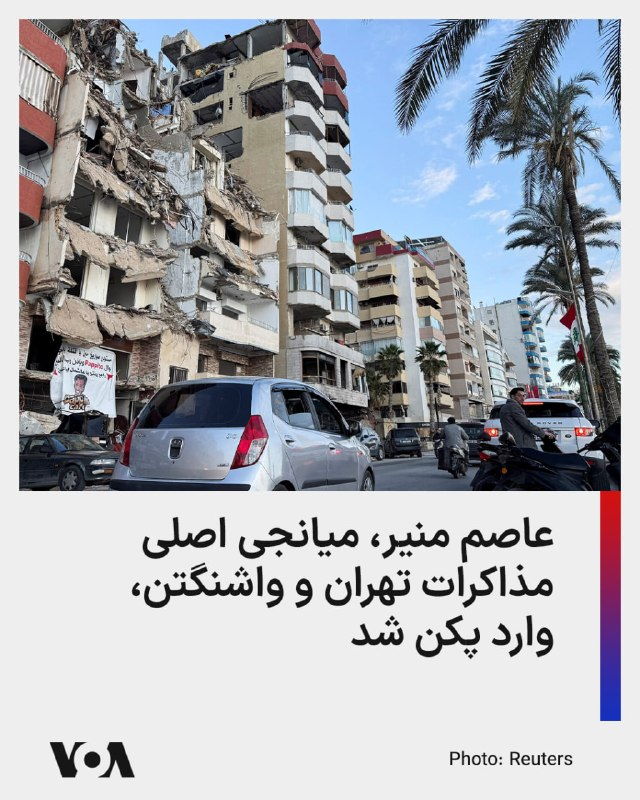

ارتش اسرائیل به ساکنان ۱۰ منطقه شامل شهر و روستا در جنوب لبنان هشدار داد که پیش از حملات هوایی علیه مواضع گروه حزب‌الله لبنان، این مناطق را تخلیه کنند.

ارتش اسرائیل صبح دوشنبه با انتشار بیانیه‌ای اسامی این مناطق را اعلام کرد و گفت که به ساکنان دستور داده شده است دست‌کم یک کیلومتر از محل سکونت خود فاصله بگیرند.

سرهنگ آویخای ادرعی، سخنگوی ارتش، هشدار داده است: «در پی نقض توافق آتش‌بس توسط سازمان تروریستی حزب‌الله، ارتش ناچار است با قدرت علیه آن اقدام کند و قصد آسیب رساندن به شما را ندارد.»

او افزود: «هر کسی که در نزدیکی عناصر حزب‌الله و تأسیسات و ابزارهای نظامی آن‌ها باشد، جان خود را در معرض خطر قرار می‌دهد.»

مارکو روبیو، وزیر خارجه آمریکا روز دوشنبه در جریان سفر به هند گفت: «اسرائیل همیشه حق دارد از خود دفاع کند. هر کشوری در جهان چنین حقی دارد. بنابراین اگر حزب‌الله قرار است به سوی آن‌ها موشک شلیک کند یا موشک شلیک می‌کند، اسرائیل کاملاً حق دارد به آن پاسخ دهد یا از وقوع آن جلوگیری کند.»
@FarsiVOA

## FarsiVOA — post 218597

  

تلویزیون پاکستان گزارش داد که عاصم منیر، فرمانده ارتش پاکستان و میانجی اصلی مذاکرات جمهوری اسلامی و آمریکا، در جریان سفر رسمی شهباز شریف به چین، در پکن کنار نخست‌وزیر پاکستان حاضر شده و در گفت‌وگو با مقام‌های چینی شرکت کرده است.

شهباز شریف سفر رسمی چهارروزه خود به چین را روز شنبه از هانگژو آغاز کرده بود، اما تصاویر پخش‌شده از تلویزیون دولتی پاکستان نشان می‌دهد که عاصم منیر نیز در پکن در کنار او با رهبران چین دیدار کرده است.

بر اساس این گزارش، شریف در حضور عاصم منیر به مقام‌های چینی گفت پاکستان برای میانجی‌گری میان جمهوری اسلامی و آمریکا «نقشی صادقانه» ایفا کرده و از حمایت چین برای پیشبرد صلح قدردانی کرد.

عاصم منیر روزهای جمعه و شنبه در تهران بود و این سفر بخشی از تلاش‌های میانجی‌گرانه پاکستان برای پایان رسمی جنگ ایران عنوان شده است. حضور او در پکن، بلافاصله پس از رایزنی‌های تهران، نشان می‌دهد اسلام‌آباد تلاش دارد میانجی‌گری خود میان تهران و واشنگتن را با هماهنگی نزدیک‌تر با چین پیش ببرد.
@FarsiVOA

## FarsiVOA — post 218596

  

ارتش اسرائیل اعلام کرد هشدار مربوط به احتمال نفوذ پهپاد در منطقه عرب العرامشه در شمال اسرائیل پایان یافته و دیگر تهدید فوری شناسایی نمی‌شود.

به گزارش تایمز اسرائیل، آژیرها دقایقی پیش در این منطقه به صدا درآمده بود. ارتش اسرائیل می‌گوید یک «هدف هوایی مشکوک» شناسایی شد، اما بعداً تماس سامانه‌های رصد با آن از دست رفت؛ موضوعی که می‌تواند به خروج پهپاد از منطقه تحت پایش یا سقوط آن مربوط باشد.

براساس اعلام ارتش اسرائیل، این رویداد بدون گزارش زخمی پایان یافته است.
@FarsiVOA

## FarsiVOA — post 218595

🔺اکسیوس: ترامپ خواستار پیوستن کشورهای عرب به توافق ابراهیم پس از پایان جنگ شد

◾️اکسیوس گزارش داد دونالد ترامپ از رهبران چند کشور عربی خواسته است اگر توافقی برای پایان جنگ با جمهوری اسلامی حاصل شود، به روند توافق ابراهیم بپیوندند و روابط خود را با اسرائیل عادی کنند.

◾️بر اساس این گزارش، تماس ترامپ با رهبران عربستان، امارات، قطر، پاکستان، ترکیه، مصر، اردن و بحرین انجام شد و محور اصلی آن توافق در حال شکل‌گیری با جمهوری اسلامی بود.

◾️یک مقام آمریکایی به اکسیوس گفته است که رهبران حاضر در تماس روز شنبه اعلام کرده‌اند در صورت موفقیت یا شکست توافق، در کنار واشنگتن خواهند بود.

⬇️ بیشتر بخوانید:
https://ir.voanews.com/a/8153577.html

## FarsiVOA — post 218594

  

بلومبرگ گزارش داد یک خریدار کشتی‌های فرسوده گفته وزارت خزانه‌داری آمریکا اجازه داده چهار شناور تحریمی مرتبط با حمل محموله‌های ایران برای اوراق خریداری شوند.

بر اساس گزارش‌ها، شرکت جی‌ام‌اس مستقر در دبی، مجوز خرید چهار کشتی یوگی، تیمون، رانتانپلن و بیگلی را دریافت کرده است؛ شناورهایی که به شبکه کشتیرانی مرتبط با محمدحسین شمخانی نسبت داده شده‌اند. این شبکه از سوی آمریکا به انتقال نفت و کالاهای مرتبط با ایران متهم شده است.

این تصمیم در حالی گرفته شده که وزارت خزانه‌داری آمریکا اخیراً در چارچوب فشار حداکثری تازه، ۱۹ کشتی و بیش از ۵۰ فرد و شرکت مرتبط با تجارت نفت و پتروشیمی ایران را تحریم کرده بود.

مالکان ناشناس این کشتی‌ها می‌توانند از ارزش آهن‌قراضه آنها میلیون‌ها دلار دریافت کنند و واشنگتن می‌گوید خروج کنترل‌شده کشتی‌های فرسوده از «ناوگان سایه» می‌تواند ریسک‌های ایمنی و زیست‌محیطی را کاهش دهد.
@FarsiVOA

## FarsiVOA — post 218593

  

قیمت طلا روز دوشنبه همزمان با افت دلار و کاهش شدید بهای نفت افزایش یافت؛ نشانه‌ای از بازاری که هنوز میان امید به توافق آمریکا و جمهوری اسلامی و تردید درباره پایداری آن در نوسان است.

رویترز گزارش داد بهای هر اونس طلا بیش از یک درصد بالا رفت و به حدود ۴ هزار و ۵۵۹ دلار رسید. تضعیف دلار، خرید طلا را برای دارندگان ارزهای دیگر ارزان‌تر کرد و افت نفت نیز بخشی از نگرانی‌های تورمی را کاهش داد.

همزمان، نفت برنت حدود ۶ درصد سقوط کرد و به محدوده ۹۸ دلار رسید؛ نفت خام آمریکا نیز به حدود ۹۱ دلار کاهش یافت. علت اصلی افت نفت، امید بازار به پیشرفت در توافقی است که می‌تواند مسیر تنگه هرمز و صادرات انرژی خلیج فارس را تا حدی باز کند.

با این حال، رشد طلا نشان می‌دهد سرمایه‌گذاران هنوز پایان بحران را قطعی نمی‌دانند.
@FarsiVOA

## FarsiVOA — post 218592

🔺مقام ارشد آمریکا: ایران پشت‌پرده برای واگذاری اورانیوم غنی‌شده، تعهد داده است

◾️یک مقام ارشد دولت ترامپ اعلام کرد رژیم ایران «پشت‌پرده» تعهداتی در زمینه واگذاری اورانیوم غنی‌شده داده و جمهوری اسلامی بدون اجرای این تعهدات، دستاورد چندانی از مذاکرات نخواهد داشت.

◾️به گزارش نیویورک‌پست، این مقام آمریکایی که با خبرنگاران صحبت می‌کرد، درباره روند مذاکرات برای دستیابی به یک توافق احتمالی با تهران گفت: «۹۵ درصد کار انجام شده، اما در سیستم آن‌ها حتی تغییر واژه‌ها هم مستلزم چند روز بررسی و مشورت است.»

◾️این منبع ارشد دست‌کم دو بار برای خبرنگاران توضیح داد که توافق قریب‌الوقوع نیست و قرار نیست انتقال پول نقد شبیه انتقال پول نقد به ایران در سال ۲۰۱۶ در دوران باراک اوباما رخ دهد.

⬇️ بیشتر بخوانید:
https://ir.voanews.com/a/8153576.html

## FarsiVOA — post 218591

  

ارتش اسرائیل اعلام کرد نیروهای این کشور در جریان عملیاتی در جنوب، لؤی هشام محمود بصل، عضو سازمان تروریستی حماس را که در حمله به پایگاه زیکیم در جریان کشتار هفتم اکتبر نقش داشت، از پا درآوردند.

بر اساس اعلام ارتش اسرائیل، بصل به‌عنوان تک‌تیرانداز در گردان زیتون حماس فعالیت می‌کرد و در روزهای اخیر نیز برای اجرای حملات تروریستی علیه نیروهای اسرائیلی در منطقه برنامه‌ریزی می‌کرد.

ارتش اسرائیل گفته است این عملیات برای رفع یک تهدید فوری انجام شده و نیروهای این کشور در چارچوب توافق موجود در منطقه مستقر هستند و به مقابله با هرگونه تهدید فوری ادامه خواهند داد.
@FarsiVOA

## FarsiVOA — post 218590

  

بر اساس آمار شرکت مدیریت منابع آب ایران، ‌هم‌اکنون میزان پرشدگی پنج صد مهم کشور از جمله «سدهای لار، دوستی، پانزدهم خرداد، بارزو و ساوه» کمتر از ۱۰ درصد است.

خبرگزاری ایسنا با تحلیل این آمار، اعلام کرد که علیرغم افزایش موجودی مخازن سدهای غربی، استان‌های تهران، مرکزی، خراسان رضوی، قم، اصفهان، زنجان و همدان در وضعیت نامطلوبی قرار دارند.

بر این اساس تامین آب شرب در شهرهای تهران، کرج، مشهد، اراک، قم، اصفهان، یزد، زنجان و همدان، با محدودیت مواجه است.

پیشتر علیرضا شریعت، دبیرکل فدراسیون صنعت آب ایران، هشدار داده بود که در صورت عدم کاهش مصرف، با بحران مهاجرت اجباری ۱۵ میلیون نفر در فلات مرکزی ایران مواجه خواهیم شد.

فلات مرکزی ایران شامل هفت استان کرمان، فارس، اصفهان، یزد، مرکزی، قم و سمنان می‌شود.
@FarsiVOA

## FarsiVOA — post 218589

🔺عبور محدود تانکرهای نفت و گاز از هرمز؛ قطر محموله‌های گاز را راهی پاکستان و چین کرد

◾️دو کشتی حامل گاز طبیعی مایع، ال‌ان‌جی، روز دوشنبه از تنگه هرمز خارج شده و به سوی پاکستان و چین در حرکت‌اند.

◾️همزمان، یک ابرنفتکش حامل نفت خام عراق نیز پس از نزدیک به سه ماه توقف در خلیج فارس، از هرمز عبور کرده و راهی چین شده است.

⬇️ بیشتر بخوانید:
https://ir.voanews.com/a/8153574.html

## FarsiVOA — post 218588

🔺روبیو: هیچ‌کس به اندازه ترامپ در مورد تهدید هسته‌ای ایران جدی نبوده است

◾️مارکو روبیو، وزیر خارجه آمریکا، اعلام کرد که واشنگتن با تهران به یک توافق خوب خواهد رسید یا به «شیوه‌ای دیگر» با جمهوری اسلامی برخورد خواهد کرد.

◾️روبیو تصریح کرد که هیچ کس به اندازه دونالد ترامپ، رئیس‌جمهوری آمریکا نسبت به تهدید هسته‌ای حکومت ایران جدی نبوده است.

◾️او همچنین پیش از ترک هند به خبرنگاران گفت که آمریکا پیش از بررسی «گزینه‌های جایگزین»، به دیپلماسی تمام فرصت برای موفقیت را خواهد داد.

⬇️ بیشتر بخوانید:
https://ir.voanews.com/a/8153575.html

## DW_Farsi — post 125119

  

🔶 لیندزی گراهام از ترامپ خواست در توافق با ایران به تعهداتش "پایبند" باشد

لیندزی گراهام، سناتور جمهوری‌خواه از ایالت کارولینای جنوبی، روز یکشنبه ۲۴ مه (۳ خرداد) از دونالد ترامپ، رئیس‌جمهور آمریکا، خواست تا در حالی که واشنگتن به تلاش برای نهایی کردن توافق با تهران بر سر جنگ ادامه می‌دهد، ثابت قدم بماند.

گراهام در پستی در شبکه اجتماعی ایکس نوشت: «اگر در واقع، در نتیجه این مذاکرات برای پایان دادن به درگیری با ایران، متحدان عرب و مسلمان ما در منطقه با پیوستن به پیمان ابراهیم موافقت کنند، این توافق‌نامه به یکی از مهم‌ترین توافق‌نامه‌ها در تاریخ خاورمیانه تبدیل خواهد شد.»

گراهام همچنین به اظهارات قبلی ترامپ در مورد پیوستن عربستان سعودی، قطر و پاکستان به پیمان ابراهیم اشاره کرد و پیشنهاد او را "فراتر از یک تغییر اساسی برای منطقه و جهان" خواند. او گفت: «این یک اقدام درخشان از سوی رئیس‌ جمهور ترامپ است.»

گراهام خطاب به ترامپ نیز نوشت: «رئیس جمهور ترامپ، برای رسیدن به یک توافق خوب با ایران، به مواضع خود پایبند باشید.»
@dw_farsi

## DW_Farsi — post 125118

  

📸عکس روز: فانوس‌های آرزو در جشن تولد بودا

همزمان با جشن تولد بودا، فانوس‌های رنگارنگ در معبد "جوگیه" در شهر سئول روشن شده‌اند. در این آیین سنتی، به هرکدام از فانوس‌ها کارتی همراه با آرزوهای پیروان بودا آویزان شده که نمادی از امید، آرامش و دعا برای آینده است.
جشن تولد بودا یکی از مهم‌ترین مناسبت‌های مذهبی در کره‌جنوبی به شمار می‌رود و هر سال هزاران نفر را به معابد تاریخی این کشور می‌کشاند.
@dw_farsi

## DW_Farsi — post 125117

  

🔶 تهدید ایران به شکستن محاصره دریایی تنگه هرمز و خروج از ان‌پی‌تی

محسن رضایی، مشاور نظامی مجتبی خامنه‌ای، روز یکشنبه سوم خرداد (۲۴ مه) گفت که مدیریت تنگه هرمز "حق قانونی" تهران برای تضمین امنیت ملی است. او مدعی شد: «مدیریت ایران بر تنگه هرمز به ۵۰ سال ناامنی در خلیج فارس پایان می‌دهد.»

رضایی، که تحت تحریم‌های ایالات متحده قرار دارد، همچنین گفت که ایران "دلایل محکمی" برای حفظ کنترل تنگه دارد و ادعا کرد که هدف تهران جلوگیری از تبدیل شدن خلیج فارس به مرکزی برای استقرار نظامی و بی‌ثباتی است.

اظهارات محسن رضایی روز یکشنبه توسط خبرگزاری مهر، نزدیک به سپاه پاسداران، منتشر شد.

در همین حال، ابراهیم ذوالفقاری، سخنگوی قرارگاه خاتم الانبیاء، هشدار داد که اگر تنگه هرمز مورد حمله قرار گیرد، نیروهای نظامی جمهوری اسلامی محاصره بنادر ایران توسط ایالات متحده را خواهند شکست.

ذوالفقاری همچنین تهدید به "خروج ایران از پیمان منع گسترش سلاح‌های هسته‌ای" کرد. او گفت: «اگر دشمن به تنگه هرمز حمله کند، ما محاصره دریایی را خواهیم شکست و ممکن است از پیمان منع گسترش سلاح‌های هسته‌ای (ان‌پی‌تی) خارج شویم.»
@dw_farsi

## DW_Farsi — post 125116

  

🔶 نعیم قاسم: خلع سلاح به معنای نابودی است و ما نمی‌توانیم آن را بپذیریم

نعیم قاسم، دبیرکل حزب‌الله، در یک سخنرانی به مناسبت "روز مقاومت و آزادسازی" که یادآور عقب‌نشینی نیروهای ارتش اسرائیل از اشغال جنوب لبنان در ۲۵ مه ۲۰۰۰ است، درخواست خلع سلاح این گروه را محکوم کرد.

او گفت: «چیزی به نام انحصار سلاح یا خلع سلاح حزب‌الله وجود ندارد.»

قاسم همچنین افزود، خلع سلاح حزب‌الله "توان دفاعی لبنان و توان مقاومت و مردم آن را به عنوان مقدمه‌ای برای نابودی" از بین می‌برد. او افزود: «خلع سلاح به معنای نابودی است و این چیزی است که ما نمی‌توانیم بپذیریم.»

نعیم قاسم همچنین ضمن برشمردن چندین حمله به سربازان ارتش اسرائیل، از پهپادهای انتحاری دید اول شخص (FPV) حزب‌الله که به گفته او باعث "گیج‌شدن" اسرائیل شده‌اند، تمجید کرد. او ادعا کرد که این حملات منجر به کشته شدن چندین افسر اسرائیلی شده است، در حالی که ارتش اسرائیل اعلام کرده است که آنها زخمی شده‌اند.

دبیرکل حزب‌الله همچنین ایالات متحده را محکوم کرد و گفت که این کشور نه میانجی است و نه بازیگری صادق، زیرا "اسرائیل را بر اساس منافع خود مدیریت می‌کند".
@dw_farsi

## DW_Farsi — post 125115

  

🔶 بالا نگه داشتن سطح هشدار ارتش اسرائیل همزمان با کاهش نیروهای ذخیره

در بحبوحه انتشار اخبار لحظه به لحظه در مورد "پیشرفت" مذاکرات بین ایالات متحده و ایران، افسران ارشد ارتش اسرائیل روز یکشنبه ۲۴ ماه (۳ خرداد) تأیید کردند که چندین شاخه از ارتش، تعداد سربازان ذخیره را در ستاد کل کاهش داده‌اند.

به گزارش "جروزالم پست" برخی از افسران پیامی دریافت کردند مبنی بر اینکه باید "نسبت به هرگونه درخواست برای بازگشت به خدمت هوشیار و گوش به زنگ باشند"، اما مجبور نیستند به ستاد بیایند.

شلومی بیندر، رئیس اداره اطلاعات ارتش اسرائیل، هدایت عملیات جمع‌آوری اطلاعات برای ایجاد تصویری روشن از تلاش‌های ایران برای بازسازی قابلیت‌های نظامی آسیب‌دیده‌اش را بر عهده دارد.

طبق این گزارش، افسران ارشد ارتش اسرائیل ادعا می‌کنند که بنا بر ارزیابی آنها، رده سیاسی اسرائیل از هسته مذاکرات ایالات متحده و ایران کنار گذاشته شده است.

در شرایط کنونی و با وجود سیگنال‌های متناقض طرفین، مشخص نیست که آیا واقعاً پیشرفتی در مذاکرات حاصل شده است یا اینکه هرکدام از طرفین صرفا در تلاش برای افزایش فشار بر طرف مقابل است.
@dw_farsi

## DW_Farsi — post 125114

  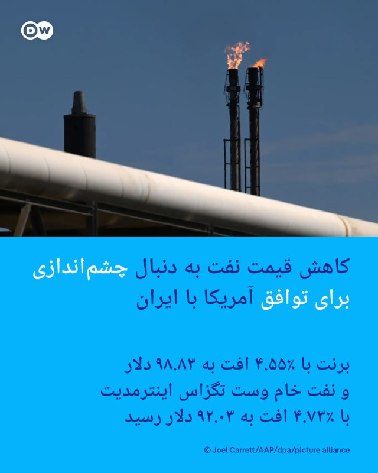

🔶 کاهش قیمت نفت به دنبال چشم‌اندازی برای توافق آمریکا با ایران

امیدها برای دستیابی به یک توافق صلح بین ایالات متحده و ایران، قیمت نفت را به پایین‌ترین سطح خود در بیش از دو هفته گذشته رسانده است.

نفت خام برنت دریای شمال با ۴.۵۵ درصد کاهش به ۹۸.۸۳ دلار در هر بشکه رسید، در حالی که نفت خام وست تگزاس اینترمدیت (WTI) با ۴.۷۳ درصد کاهش به ۹۲.۰۳ دلار رسید. این نرخ پایین‌ترین سطح از ۷ مه (۱۷ اردیبهشت) تا کنون است. با این حال، چشم‌انداز توافق سریع پس از سیگنال‌های متناقض از سوی واشنگتن همچنان نامشخص است.

کارشناسان پیش‌بینی می‌کنند که بحران انرژی ناشی از جنگ ایران ادامه خواهد یافت.

یکی از موضوعات مورد اختلاف، همچنان حاکمیت بر تنگه هرمز است؛ آبراهی کلیدی که از طریق آن پیش از جنگ یک پنجم نفت و گاز مایع جهان منتقل می‌شد. رئیس شرکت ملی نفت ابوظبی هفته گذشته هشدار داد که حتی در صورت پایان فوری جنگ، ترافیک کشتیرانی در این تنگه حداقل تا سال ۲۰۲۷ به سطح عادی خود باز نخواهد گشت.
@dw_farsi

## DW_Farsi — post 125113

  

🔶 سی‌بی‌اس: مجتبی خامنه‌ای از طریق شبکه‌ای از پیام‌رسان‌ها ارتباط برقرار می‌کند

مقامات آمریکایی به نقل از نهادهای اطلاعاتی آمریکا به شبکه تلویزیونی "سی‌بی‌اس" گفتند که مجتبی خامنه‌ای، رهبر جمهوری اسلامی، در مکانی مخفی پنهان شده و از طریق شبکه‌ای پیچیده از پیام‌رسان‌ها ارتباط برقرار می‌کند.

این گزارش می‌گوید اقدامات احتیاطی که برای جلوگیری از ترور خامنه‌ای توسط اسرائیل در نظر گرفته شده، باعث تأخیر در مذاکرات آمریکا و ایران برای پایان دادن به جنگ می‌شود. گزارش می‌افزاید که حتی مقامات ارشد جمهوری اسلامی نیز نمی‌توانند مستقیماً با مجتبی خامنه‌ای تماس بگیرند.

یک مقام آمریکایی به این شبکه گفت: «به همین دلیل است که می‌بینید افرادی چیزهایی مانند "رهبر معظم انقلاب با چارچوب موافقت کرده است" یا "ما منتظر شنیدن نظرات در مورد نکات نهایی توافق هستیم"، می‌گویند. هر اطلاعاتی که او دریافت می‌کند، تاریخ‌دار است و پاسخ‌های او با تأخیر زیادی همراه است.»
@dw_farsi

## DW_Farsi — post 125112

🔶 جام ۱۹۸۲؛ زیکو، "جوجه‌ای" که به "پله سفید" شهرت یافت

🔺 گزارشی از شهرام احدی

در تاریخ جام جهانی فوتبال بازندگانی بوده‌اند که بخت با آنان یار نبوده و برخلاف آنچه که شاید سزاوار آن بوده باشند، از دور مسابقات حذف شده‌اند:

ناکامی مجارستان در برابر آلمان در فینال جام جهانی ۱۹۵۴، شکست آلمان‌ها در برابر لاجوردی‌های ایتالیا در نیمه‌نهایی ۱۹۷۰ مکزیک و ناکامی فرانسویان در سال‌های ۱۹۸۲ و ۱۹۸۶ در مقابل آلمان در مرحله نیمه‌نهایی، نمونه‌هایی از این دست هستند.

اما شاید ناکامی یک تیم تلخ‌تر و ناسزاوارتر از همه بوده باشد: خداحافظی غمگین رقصندگان برزیل از جام جهانی ۱۹۸۲.

زیکو و یارانش که در مرحله‌ی دوم، آرژانتین و ستاره‌اش مارادونا را ۳ بر یک به زانو درآورده بودند، در بازی بعدی‌شان تنها به تساوی در برابر ایتالیا نیاز داشتند. آنان در دقیقه ۶۸ به گل تساوی دست یافتند و به جای آنکه در پی حفظ نتیجه برآیند، به حملات و هنرنمایی‌های خود ادامه دادند.

گل پائولو روسی، مهاجم زهردار ایتالیا، در دقیقه ۷۵ اما رویای فوتبال‌دوستان را که شیفته زیبایی بازی برزیل شده بودند، نقش بر آب کرد.

📌 برای دسترسی کامل به گزارش به وبسایت دویچه‌وله فارسی مراجعه کنید.
@dw_farsi

## DW_Farsi — post 125111

  

🔶 قوه قضائیه عباس اکبری را به اتهام "لیدری مسلحانه" اعتراضات دی‌ماه اعدام کرد

خبرگزاری میزان، وابسته به قوه قضائیه جمهوری اسلامی، از اعدام عباس اکبری فیض‌آبادی در بامداد دوشنبه چهارم خرداد (۲۵ مه) به اتهام "لیدری مسلحانه و تیراندازی به سوی نیروهای حافظ امنیت" خبر داد.

در این گزارش ادعا شده که عباس اکبری "یکی از لیدر‌های مسلح" اعتراضات در شهرستان نائین اصفهان بوده و "نقش مهمی در حمله به فرمانداری شهرستان و مراکز تأمین امنیت و همچنین مراکز خدماتی" داشته است.

میزان مدعی شده است که عباس اکبری "بر اساس اسناد و تصاویر موجود در پرونده، به‌صورت مسلح در خیابان حضور یافته و اقدام به تیراندازی به سمت ماموران حافظ امنیت" کرده است.

این خبرگزاری همچنین ویدیویی منتسب به عباس اکبری با عنوان "تصاویر دوربین مدار بسته از تیر اندازی، حمله و تخریب اماکن" منتشر کرده است.

جزئیات بیشتری درباره این پرونده و روند رسیدگی به آن منتشر نشده، اما "کشف اسلحه از منزل متهم و اقرارهای او" علت "محرز شدن بزهکاری او" عنوان شده است.

از عباس اکبری هیچ عکسی منتشر نشده است.
@dw_farsi

## DW_Farsi — post 125110

  

🔶 روبیو می‌گوید توافق با ایران هنوز هم ممکن است

مارکو روبیو، وزیر امور خارجه ایالات متحده، می‌گوید که توافق برای پایان دادن به جنگ با ایران می‌تواند "امروز" [دوشنبه] محقق شود. روبیو در دهلی نو با اشاره به توافق احتمالی گفت: «ما فکر می‌کردیم که دیشب، شاید امروز، خبری داشته باشیم، من زیاد در مورد آن نظر نمی‌دهم.»

او روز دوشنبه ۲۵ مه (۴ خرداد) هنگام ترک پایتخت هند در جریان یک سفر رسمی چهار روزه به این کشور به خبرنگاران گفت: «ما آن چیزی را که فکر می‌کنم برای باز کردن تنگه‌ روی میز مذاکره لازم است، داریم.»

«این [توافق] در خلیج فارس حمایت زیادی دارد... هر کشوری که ما با او [از این پروسه] عبور کرده‌ایم، می‌داند که این [توافق] نه تنها بسیار منطقی است، بلکه کار درستی است که جهان باید انجام دهد.»

روبیو همچنین ابراز اطمینان کرد که ایران "وارد یک مذاکره بسیار واقعی، مهم و با محدودیت زمانی در مورد موضوع هسته‌ای خواهد شد".

اظهارات روبیو پس از آن مطرح شد که دونالد ترامپ، رئیس جمهور آمریکا، انتظارات از یک توافق را تعدیل کرد و گفت که به مذاکره‌کنندگانش گفته است که "عجله نکنند".
@dw_farsi

## DW_Farsi — post 125109

  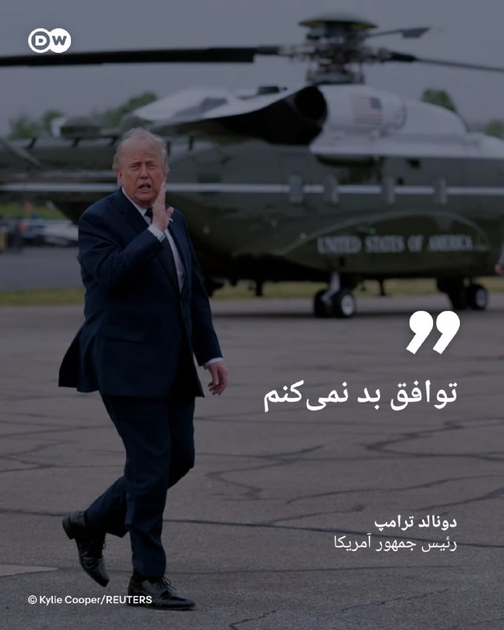

🔶 دفاع ترامپ از توافق با ایران: توافق بد نمی‌کنم

دونالد ترامپ، رئیس جمهور آمریکا، شامگاه یکشنبه ۲۴ مه (۳ خرداد) در پستی در تروث سوشال، نوشت توافق برای پایان دادن به جنگ "هنوز به طور کامل مذاکره نشده است. "

او همچنین به افرادی که "از چیزی که هیچ چیز درباره آن نمی‌دانند، انتقاد می‌کنند" حمله کرد.

پس از انتشار خبر احتمال یک توافق با ایران، ترامپ با انتقاد دموکرات‌ها و همچنین اعضای حزب خود مواجه شد.

او با تاکید بر اینکه "توافق بد" نمی‌کند، نوشت: «اگر من با ایران توافقی انجام دهم، توافقی خوب و مناسب خواهد بود، نه مانند توافقی که اوباما انجام داد و به ایران مقادیر زیادی پول نقد و مسیری روشن و باز به سوی سلاح هسته‌ای داد. توافق ما دقیقاً برعکس است، اما هیچ کس آن را ندیده یا نمی‌داند چیست. هنوز حتی به طور کامل مذاکره نشده است. بنابراین به بازندگان گوش ندهید که از چیزی که هیچ چیز در مورد آن نمی‌دانند انتقاد می‌کنند.»
@dw_farsi

## Persian_Trend_Official — post 14908

🔴 ارتش اسرائیل حملات به مواضع حزب‌الله در لبنان را ادامه می‌دهد

▪️ ارتش اسرائیل اعلام کرد حملات علیه اهداف وابسته به حزب‌الله در لبنان همچنان ادامه دارد
▪️ این حملات پس از کشته‌شدن یک نظامی دیگر اسرائیلی در حمله پهپاد انفجاری انجام شده است
▪️ تنش در جبهه لبنان همچنان بالا باقی مانده؛ آن هم در حالی که مذاکرات مربوط به آتش‌بس و توافق منطقه‌ای ادامه دارد

🫆:Tony

📌 @persian_trend_official
پرشین ترند | متفاوت‌ترین کانال نظامی

## Persian_Trend_Official — post 14907

  <a href="telegram/content/Persian_Trend_Official_14907_1779699591.webm" target="_blank">🎬 Download video</a>

🔴مارکو روبیو :

«یا به یک توافق خوب با ایران می‌رسیم یا با روشی دیگر با آنها برخورد خواهیم کرد.»

🫆:Tony

📌 @persian_trend_official
پرشین ترند | متفاوت‌ترین کانال نظامی

## RadioFarda — post 157534

  

🔸رسانه‌های دولتی پاکستان روز دوشنبه چهارم خرداد گزارش دادند که عاصم منیر، فرمانده ارتش پاکستان و یکی از چهره‌های اصلی میانجی‌گری میان ایران و آمریکا، همراه با شهباز شریف، نخست‌وزیر پاکستان، در پکن با مقام‌های چینی دیدار کرده است.

🔸عاصم منیر که روزهای جمعه و شنبه در تهران حضور داشت، همراه با محسن نقوی، وزیر کشور پاکستان، در تلاش‌های میانجی‌گرانه برای پایان رسمی جنگ ایران مشارکت دارد.

🔸چین نیز اعلام کرده است که با همکاری پاکستان برای «بازگرداندن هرچه سریع‌تر صلح و ثبات به خاورمیانه» تلاش خواهد کرد.

🔸شهباز شریف که از روز شنبه سفر چهارروزهٔ رسمی خود به چین را آغاز کرده، در دیدار با مقام‌های چینی گفت: «جهان در حال گذر از لحظه‌ای بحرانی است.» او همچنین از نقش پاکستان در میانجیگری میان تهران و واشینگتن دفاع کرد و گفت اسلام‌آباد «نقشی صادقانه» در این روند داشته است.

🔸به گزارش تلویزیون دولتی پاکستان، شهباز شریف در حضور عاصم منیر افزود: «اوضاع در مسیر درستی حرکت می‌کند» و از حمایت چین برای پیشبرد صلح قدردانی کرد.

@RadioFarda

## RadioFarda — post 157533

  

🔸اسماعیل بقائی، سخنگوی وزارت امور خارجه ایران در نشست خبری روز دوشنبه ۴ خرداد خود درباره روند مذاکرات با آمریکا گفت «این تحولات که در چند روز اخیر خبری شد، نتیجه چند هفته گفت‌وگو از طریق میانجی پاکستانی است.»

🔸او افزود که «برخی کشورهای دیگر نیز در این مدت نقش داشتند. بنابراین اینکه در زمینه بسیاری از موضوعات مورد گفت‌وگو ما به جمع‌بندی رسیده‌ایم، امر درستی است، اما اینکه بگوییم این به معنای امضای یک توافق قریب‌الوقوع است، کسی نمی‌تواند چنین ادعایی بکند.»

🔸اسماعیل بقائی اضافه کرد که «تمرکز مذاکرات بر خاتمه جنگ است و در این مرحله درباره جزئیات موضوع هسته‌ای صحبتی نداریم.»

🔸مارکو روبیو، وزیر خارجه آمریکا، روز دوشنبه گفت توافق برای پایان دادن به جنگ با ایران ممکن است حتی «امروز» حاصل شود، اما تأکید کرد واشینگتن عجله‌ای برای توافق بد ندارد.

🔸آقای روبیو افزود که ایالات متحده یا با ایران به توافقی خوب خواهد رسید یا «از راه دیگری» با این کشور برخورد خواهد کرد.

🔸روبیو به خبرنگاران گفت آمریکا پیش از بررسی «گزینه‌های دیگر»، به دیپلماسی هر فرصتی برای موفقیت خواهد داد.

@RadioFarda

## RadioFarda — post 157532

  

🔸محمدباقر قالیباف با رأی نمایندگان مجلس شورای اسلامی برای سومین سال در دوازدهمین دوره مجلس، بار دیگر رئیس مجلس شد.

🔸خبرگزاری‌های ایلنا و فارس گزارش دادند که انتخابات سومین اجلاسیه هیئت‌رئیسه دوازدهمین دوره مجلس صبح دوشنبه ۴ خرداد به صورت حضوری برگزار شد و قالیباف برای یک دورهٔ یک‌ساله دیگر بر کرسی ریاست مجلس باقی ماند.

🔸این هفتمین سال متوالی است که قالیباف ریاست مجلس شورای اسلامی را برعهده می‌گیرد.

🔸هیئت‌رئیسه مجلس شورای اسلامی ۱۲ عضو دارد: یک رئیس، دو نایب‌رئیس، سه ناظر و شش دبیر. اعضای هیئت‌رئیسه با رأی مستقیم نمایندگان برای دوره‌ای یک‌ساله انتخاب می‌شوند.

🔸رسانه‌های ایران همچنین گزارش داده‌اند که جلسه روز دوشنبه حضوری برگزار شده که بنابر این نخستین جلسۀ حضوری مجلس پس از بیش از ۸۰ روز بوده است. پس از آغاز جنگ اسرائیل و آمریکا با ایران، جلسات حضوری مجلس متوقف شده بود و در این مدت تنها یک جلسه مجازی برگزار شده بود.

@RadioFarda

## RadioFarda — post 157531

🔸مقامات کالیفرنیا در آمریکا در روزهای گذشته درباره انفجار یک مخزن معیوب حاوی مواد شیمیایی در لس‌آنجلس هشدار دادند.

🔸به گفته آن‌ها افزایش دمای این مخزن که می‌‌تواند منجر به انفجار آن یا نشت مواد شود، بخار سمی در هوا آزاد خواهد کرد.

🔸تاکنون حدود ۵۰ هزار از ساکنان محلی تخلیه شده‌اند.

🔸فرماندار کالیفرنیا، روز یکشنبه (سوم خرداد) گفت که از دونالد ترامپ، رئیس‌جمهور، درخواست کرده است تا برای پشتیبانی از عملیات، اعلامیه اضطراری فدرال صادر کند.

@RadioFarda

## RadioFarda — post 157530

  

🔸شبکه خبری سی‌بی‌اس در گزارشی بر اساس گفته‌های «مقام‌های «آگاه از موضوع» در دولت آمریکا گفت مجتبی خامنه‌ای، رهبر جمهوری اسلامی در مکانی نامعلوم پنهان شده و دسترسی محدودی به جهان خارج دارد و ارتباطاتش تنها از طریق شبکه پیچیده‌ای از نامه‌برها انجام می‌شود.

🔸این مقام‌ها بر اساس یافته‌های نهادهای اطلاعاتی آمریکا گفته‌اند مقام‌های حکومت ایران که مجوز مذاکره با دولت آمریکا را دارند، برای برقراری ارتباط در داخل ساختار حکومت خود با دشواری روبه‌رو بوده‌اند و همین موضوع یکی از دلایل اصلی تأخیر در روشن شدن جزئیات توافق احتمالی با ایران بوده است.

🔸دو مقام آمریکایی به سی‌بی‌اس گفتند وقتی آمریکا جزئیات پیشنهادی را ارسال می‌کند، دشواری دسترسی به مجتبی خامنه‌ای باعث می‌شود در دریافت پاسخ، تأخیری طولانی رخ دهد.

🔸مجتبی خامنه‌ای از زمان آغاز حملات آمریکا و اسرائیل به ایران، از انظار عمومی پنهان شده و با وجود اعلام نامش به عنوان رهبر سوم جمهوری اسلامی تاکنون از او صدا یا تصویری منتشر نشده است.

@RadioFarda

## RadioFarda — post 157529

  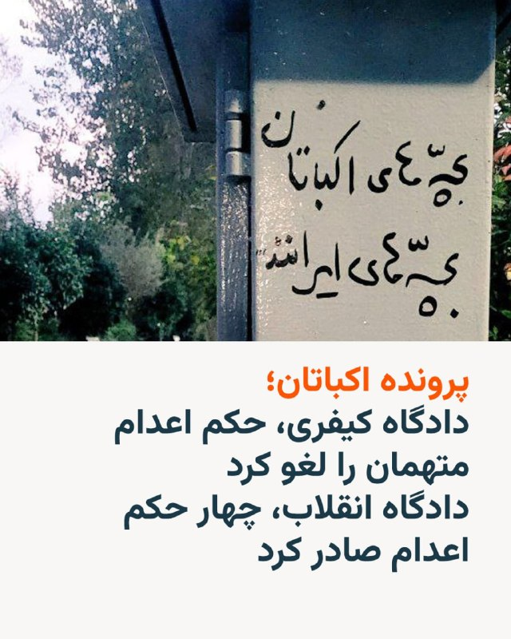

🔸رسانه‌ها در ایران روز یک‌شنبه سوم خرداد خبر دادند که دادگاه انقلاب تهران برای چهار نفر از متهمان پرونده اکباتان حکم اعدام صادر کرده است.

🔸بر اساس گزارشی که به‌صورت یکسان در این رسانه‌ها منتشر شد، حکم جدید مربوط به «رسیدگی موازی» در دادگاه انقلاب تهران است و این دادگاه «با توجه به جمیع اوراق و محتویات پرونده، شکایت اولیای دم شهید، گزارش مرکز تشخیص هویت پلیس آگاهی تهران، نظریه پزشکی قانونی و اظهارات متهمان، متهمان ردیف اول تا چهارم پرونده را بابت اتهام افساد فی‌الارض به مجازات اعدام محکوم کرد.»

🔸در این گزارش‌ هم‌چنین آمده که «متهمان ردیف پنجم تا نهم نیز بابت اتهام اجتماع و تبانی برای ارتکاب جرم علیه امنیت داخلی کشور و اتهام فعالیت تبلیغی علیه نظام جمهوری اسلامی ایران به حبس از یک تا پنج سال و مجازات‌های تکمیلی محکوم شدند.»

🔸گفته شده که این حکم قابل فرجام خواهی و ارجاع به دیوان عالی کشور است.

@RadioFarda

## RadioFarda — post 157528

  

🔸وزیر خارجه ایالات متحده، روز دوشنبه چهارم خرداد گفت که واشینگتن در مذاکرات جاری خود با ایران، «هر فرصتی برای موفقیت» به دیپلماسی خواهد داد.

🔸مارکو روبیو که اکنون در هند به‌سر می‌برد در جمع خبرنگاران گفت که مذاکرات با ایران همچنان «در حال پیشرفت» است و خوش‌بینی محتاطانه‌ای نسبت به توافق احتمالی برای بازگشایی مسیرهای کلیدی کشتیرانی و از سرگیری مذاکرات هسته‌ای ابراز کرد.

🔸او که روز گذشته از احتمال توافق با ایران تا پایان روز یک‌شنبه خبر داده بود، گفت: «همه ما باید مطمئن باشیم که یا به یک توافق خوب خواهیم رسید، یا مجبور می‌شویم به شکل دیگری با این مسئله برخورد کنیم. ترجیح ما این است که یک توافق خوب داشته باشیم.»

🔸دونالد ترامپ، رئیس‌جمهور آمریکا نیز شامگاه یک‌شنبه در دومین پیام خود درباره روند مذاکرات با ایران اطمینان داد که توافق احتمالی با ایران «خوب و درست» خواهد بود اما هیچ کس درباره محتوای آن اطلاع ندارد.

@RadioFarda

## IranianMinds — post 20709

ترامپ چند روز‌ دیگه :

تا ظهور‌ امام زمان به ایران فرصت دادم ، امیدوارم‌ زودتر به یه نتیجه ای برسیم و اگرنه خیلی براشون بد میشه!

@IranianMinds

## IranianMinds — post 20708

🔴 مشاور وزیر ارتباطات :

شاید تا هفته آینده اینترنت بین الملل وصل شد.

@IranianMinds

## IranianMinds — post 20707

  

🔴 فاکس‌ نیوز :

ترامپ برای رسیدن به توافق نهایی ۷ روز‌ دیگر به جمهوری اسلامی زمان داد.

@IranianMinds

## IranianMinds — post 20706

🔴 اکونومیست:

عربستان از ترامپ خواسته هرگونه حمله جدید به ایران رو تا بعد از مراسم سالانه حج به تعویق بندازه.

ریاض نگرانه اگه درگیری دوباره آغاز و حریم هوایی منطقه بسته بشه، زائران در عربستان سعودی گیر بیفتن.

@IranianMinds

## IranianMinds — post 20705

  <a href="telegram/content/IranianMinds_20705_1779699597.mp4" target="_blank">🎬 Download video</a>

🔴 مارکو روبیو درباره ایران:

پیشنهاد بسیار محکمی روی میز وجود دارد.

این توافق شامل باز شدن تنگه‌ها و آغاز مذاکرات واقعی، جدی و زمان‌دار درباره مسائل هسته‌ای است.

این طرح حمایت زیادی در خلیج فارس و در سطح جهانی دارد ، همه کشورهایی که با آن‌ها صحبت کردیم، معتقدند این فقط یک پیشنهاد منطقی نیست، بلکه اقدامی درست برای جهان است

ترامپ عجله‌ای ندارد و توافق بد امضا نخواهد کرد ، ما قبل از بررسی گزینه‌های دیگر، به دیپلماسی هر فرصتی برای موفقیت می‌دهیم!

@IranianMinds

## IranianMinds — post 20704

  

⚫️ جمهوری اسلامی یکی دیگه از هموطن هامونو هم امروز کشت. خبرگزاری قوه قضائیه جمهوری اسلامی اعلام کرد مجتبی کیان امروز صبح به دلیل ارسال پیام و دادن مختصات صنایع نظامی به شبکه های ماهواره ای معاند ( ایران اینترنشنال ) اعدام شد. @IranianMinds

## IranianMinds — post 20703

  

🔴 سی بی اس نیوز :

مجتبی خامنه ای ، رهبر‌ جمهوری اسلامی در مکانی نامعلوم پنهان شده و بر ارساس ارزیابی اطلاعاتی آمریکا دسترسی خیلی کمی به دنیای بیرون داره و‌ با افراد خیلی کمی هم در ارتباطه .

@IranianMinds

## BBCPersian — post 281993

🖋سعید جعفری، روزنامه‌نگار

محمود احمدی‌نژاد سال‌ها به‌عنوان یکی از تندترین چهره‌های ضداسرائیلی جمهوری اسلامی شناخته می‌شد. اما حالا گزارش‌ها و روایت‌هایی منتشر شده که می‌گویند نام او در برخی سناریوهای مرتبط با آینده سیاسی ایران مطرح بوده است.

در این پست، نگاهی داریم به مواضع جنجالی احمدی‌نژاد، واکنش تحلیلگران اسرائیلی و آمریکایی، و این پرسش که چرا نام او دوباره در میانه بحث‌های مربوط به آینده ایران مطرح شده است.
ادامه مطلب⬇️

📸Getty/ Social media/ mahmoud ahmadinejad X/
https://bbc.in/4fGx9y5
@BBCPersian

## BBCPersian — post 281992

🔻ارتش اسرائیل دستور تخلیه ۱۰ روستا در جنوب لبنان را صادر کرد

آویخای ادرعی، سخنگوی عرب زبان ارتش اسرائیل، برای تخلیه ۱۰ روستا در جنوب لبنان دستور فوری صادر کرده است.

آقای ادرعی در حسابش در شبکه اجتماعی ایکس نوشت:‌ «هر کسی که در نزدیکی عناصر حزب‌الله، تأسیسات و تجهیزات جنگی آنها حضور داشته باشد، جان خود را در معرض خطر قرار می‌دهد!»

او به ساکنان این مناطق هشدار داد که «فورا خانه‌های خود را تخلیه کنید و از روستاها و شهرها حداقل ۱۰۰۰ متر تا مناطق باز فاصله بگیرید.»

سخنگوی ارتش اسرائیل دلیل صدور این دستور را «نقض توافق آتش‌بس» از سوی حزب‌الله عنوان کرد.

اسرائیل دیروز هم برای ۱۰ شهر و روستا در جنوب و شرق لبنان دستور تخلیه صادر کرده بود.

https://bbc.in/4wPeI0e
@BBCPersian

## BBCPersian — post 281991

  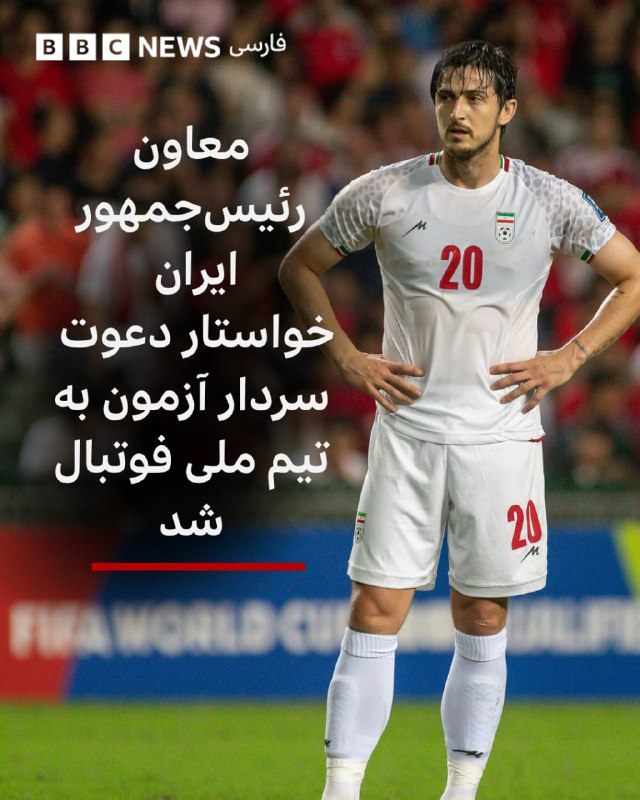

🔻معاون رئیس‌جمهور ایران خواستار دعوت از سردار آزمون به تیم ملی فوتبال شد چراکه «این نه یک تصمیم ورزشی، که پیامی به نفع انسجام ملی است.»

عبدالکریم حسین‌زاده معاون رئیس‌جمهور در امور توسعه روستایی و مناطق محروم در حسابش در شبکه اجتماعی ایکس نوشت: «نیاز وطن حفظ نخ‌های پیوند بین فرزندانش است. هرکس نام ایران را بالاتر از گلایه‌های شخصی می‌شناسد، بخشی از سرمایه ملی ماست.»

او به پیام سردار آزمون به تیم ملی فوتبال اشاره کرد: «اقدام سردار آزمون برای نمایش این پیوند را نادیده نگیریم و در صورت امکان او را به تیم ملی برگردانیم.»

وبسایت رسمی فدراسیون فوتبال ۲۶ اردیبهشت فهرست سی نفره تیم ملی برای جام جهانی ۲۰۲۶ را منتشر کرد که در آن نام سردار آزمون نبود.

توضیح رسمی در این باره داده نشد اما انتشار عکس‌های سردار آزمون عکس‌هایش در کنار حاکم دوبی در خلال جنگ آمریکا و اسرائیل و حمایتش از اعتراضات مردم در ایران از عوامل دعوت نشدن به تیم ملی بوده است.

سردار آزمون با با ۵۷ گل در ۹۱ بازی ملی دومین گلزن برتر تیم ملی فوتبال مردان است.

📸GettyImages
https://bbc.in/3Q2832i
@BBCPersian

## BBCPersian — post 281990

🔻عاصم منیر به پکن رفت

عاصم منیر، فرمانده کل قوای پاکستان و میانجی اصلی در گفت‌وگوهای ایران و آمریکا به شهباز شریف، نخست‌وزیر پاکستان ملحق شد که برای یک سفر رسمی در چین است.

شهباز شریف با رهبران چین از جمله شی جین‌پینگ، رئیس‌حمهور، دیدار می‌کند و ایران یکی از محورهای گفت‌وگوهاست.

چین گفته است که با پاکستان همکاری خواهد کرد تا «در بازگرداندن هرچه سریع‌تر صلح و ثبات به خاورمیانه مشارکت مثبتی داشته باشد.»

فیلد مارشال عاصم منیر جمعه و شنبه به همراه محسن نقوی، وزیر کشور پاکستان، برای میانجی‌گری با آمریکا در تهران بود.

https://bbc.in/4tUrtEo
@BBCPersian

## BBCPersian — post 281989

🔻رئیس‌جمهور لبنان می‌گوید عقب‌نشینی کامل اسرائیل همچنان در اولویت است

جوزف عون، رئیس‌جمهور لبنان، در بیانیه‌ای به مناسبت سالگرد پایان اشغال ۲۲ ساله جنوب لبنان در سال ۲۰۰۰ گفت که «مسیر خروج کامل اسرائیل همچنان یک مطالبه ملی پایدار است، مطالبه‌ای که دولت لبنان از طریق مذاکرات برای دستیابی به آن تلاش می‌کند.»

آقای عون خاطرنشان کرد که بزرگداشت امسال در بحبوحه ادامه اشغال روستاهای جنوب لبنان و حملات مرگبار اسرائیل برگزار می‌شود.

به گفته وی مذاکرات اخیر با اسرائیل «به منزله امتیاز یا تسلیم نخواهد بود، بلکه تأکید مجددی بر حق انحصاری لبنان برای محافظت از سرزمین و حاکمیت خود و گسترش اقتدار خود از طریق ارتش و نیروهای امنیتی مشروع آن است.»

https://bbc.in/3Q26m4W
@BBCPersian

## BBCPersian — post 281988

  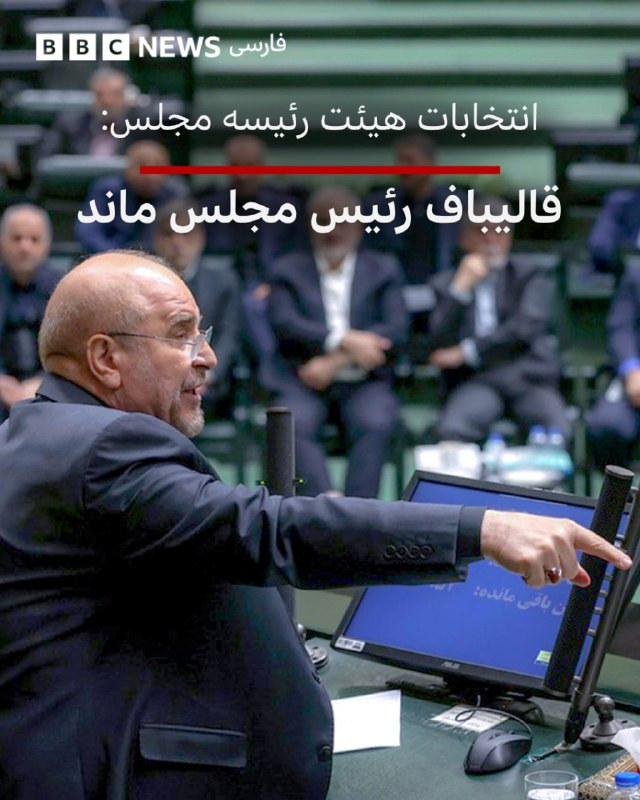

🔻انتخابات هیئت رئیسه مجلس در ایران برگزار شده است و به گزارش رسانه‌های ایران، محمدباقر قالیباف برای یک سال دیگر به‌عنوان رئیس مجلس انتخاب شده است.

انتخاب دیگر اعضای هیئت رئیسه در جریان است.

امروز اولین جلسه حضوری مجلس پس از حدود سه ماه است.

با آغاز جنگ اسرائیل و آمریکا با ایران، جلسات مجلس ایران متوقف شده بود و تنها در این مدت یک جلسه مجازی داشته است.

📸Anadolu via Getty Images
https://bbc.in/3Q08Gte
@BBCPersian

## BBCPersian — post 281987

🔻مقام‌های آمریکایی به فاکس نیوز: ۹۵ درصد توافق‌ نهایی شده است

شبکه فاکس نیوز آمریکا که به جناح جمهوری‌خواه نزدیک است می‌گوید مقام‌های دولت از نهایی شدن ۹۵ درصد مفاد توافق میان تهران و واشنگتن خبر داده‌اند.

روز یکشنبه فاکس‌نیوز در برنامه‌های مختلف خبری و تحلیلی خود به موضوع مذاکرات جاری میان آمریکا و ایران پرداخت و مجریان آن از نزدیک شدن مواضع دو طرف بر سر تمدید آتش‌بس، باز شدن تنگه هرمز و برداشتن محاصره دریایی ایران سخن گفتند.

این شبکه همچنین با پخش اظهارات اخیر محسن رضایی، فرمانده پیشین سپاه پاسداران، از نگرانی درباره مواضع حکومت ایران در میان ناظران آمریکایی خبر داد.

آقای رضایی در اظهارات جدید خود تهدید کرده است که ایران ممکن است در صورت ادامه وضعیت موجود از پیمان منع گسترش سلاح‌های هسته‌ای - موسوم به ان‌پی‌تی - خارج شود.

https://bbc.in/4wImZmJ
@BBCPersian

## BBCPersian — post 281986

🔻ارتش اسرائیل می‌گوید یک سربازش در جنوب لبنان کشته شده است

ارتش اسرائیل می‌گوید یک سرباز «در جریان درگیری‌ها» در جنوب لبنان کشته شده است.

همچنین اسرائیل اعلام کرد که یک سرباز دیگر نیز در همان حادثه به شدت مجروح شده و برای درمان به بیمارستان منتقل شده است.

جزئیات بیشتری از نحوه کشته شدن و محل این درگیری منتشر نشده است.

https://bbc.in/3RjdBWJ
@BBCPersian

## BBCPersian — post 281985

🔻برگزاری اولین جلسه حضوری مجلس ایران پس جنگ اخیر

رسانه‌های ایران گزارش کرده‌اند که اولین جلسه حضوری مجلس ایران امروز پس از بیش از ۸۰ روز برگزار شده است.

خبرگزاری صداوسیمای دولتی ایران نوشته در این جلسه انتخابات هیئت رئیسه مجلس برگزار شده است.

با آغاز جنگ اسرائیل و آمریکا با ایران، جلسات مجلس ایران متوقف شده بود و تنها در این مدت یک جلسه مجازی آن تشکیل شده بود.

https://bbc.in/4wNnwDT
@BBCPersian

## BBCPersian — post 281984

  

🔻شبکه خبری سی‌بی‌اس که شریک کاری بی‌بی‌سی در آمریکاست روز یکشنبه در گزارشی نوشت «اطلاعات دستگاه‌های اطلاعاتی آمريکا نشان می دهد رهبر جمهوری اسلامی ايران عملا در مکانی نامعلوم پنهان شده و دسترسی بسيار محدودی به دنيای خارج دارد و ارتباط با او تنها از طريق شبکه‌ای پيچيده از پيام‌رسان‌ها امکان پذير است.»

به گزارش سی‌بی‌اس، این دسترسی دشوار یکی از علل کندی نهایی شدن جزییات توافق احتمالی میان ایران و واشنگتن شده است.

با اين حال، سی‌بی‌اس نوشته يک مقام ارشد دولت آمريکا روز يکشنبه به این شبکه گفته مجتبی خامنه‌ای، رهبر جدید جمهوری اسلامی با چارچوب کلی پيش‌نويس توافق کنونی موافقت کرده است.

روز یکشنبه دونالد ترامپ نيز در پيامی در شبکه تروث سوشال نوشت انتظار دارد تصميم نهايی ظرف چند روز آينده اعلام شود.

📸AFP via Getty Images
https://bbc.in/4nKbM0O
@BBCPersian

## BBCPersian — post 281983

  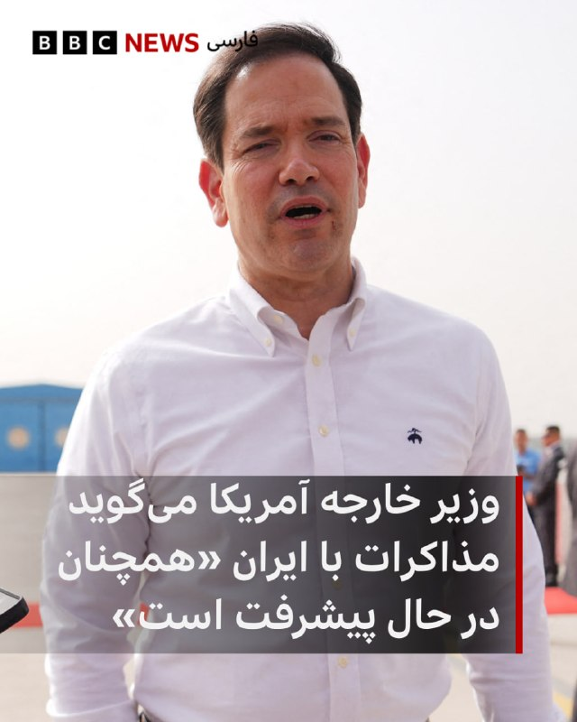

🔻مارکو روبیو، وزیر خارجه آمریکا، گفته است که توافق میان تهران و واشنگتن «هنوز در حال پیشرفت است» و دونالد ترامپ، رئیس‌جمهور آمریکا «عجله‌ای برای رسیدن به توافق ندارد.»

او پیش از ترک دهلی‌نو گفت در حال حاضر «یک پیشنهاد کاملا محکم» برای رسیدن به توافق داریم که با باز شدن تنگه هرمز می‌توانیم وارد «یک مذاکره بسیار واقعی، مهم و با محدودیت زمانی در مورد مسائل هسته‌ای» بشویم.

آقای روبیو گفت: «این طرح در خلیج فارس و در سطح جهانی نیز حمایت زیادی دارد» و هر کشوری که ما با آنها ارتباط داریم «می‌داند که این نه تنها بسیار منطقی است، بلکه کار درستی است که جهان باید انجام دهد.»

به گفته وزیر خارجه آمریکا، دونالد ترامپ «قرار نیست توافق بدی انجام دهد، بنابراین بیایید ببینیم چه اتفاقی می‌افتد. ما قبل از بررسی گزینه‌های دیگر، به دیپلماسی هر فرصتی برای موفقیت می‌دهیم.»

او تاکید کرد که «یا توافق خوبی خواهیم داشت، یا باید به روش دیگری با این مسئله برخورد کنیم و ما ترجیح می‌دهیم توافق خوبی داشته باشیم.»
ادامه مطلب⬇️

📸AFP via Getty Images
https://bbc.in/3S079Uz
@BBCPersian

## Dirty_Kids — post 390125

  <a href="telegram/content/Dirty_Kids_390125_1779699604.mp4" target="_blank">🎬 Download video</a>

بیوگرافی کوتاهی از عمو مانوک و مرگ مشکوکش:

@Dirty_Kids 👻

## Dirty_Kids — post 390124

  

خودت خایه نوشتن «خایه» رو نداشتی.

@Dirty_Kids 👻

## Dirty_Kids — post 390123

  <a href="telegram/content/Dirty_Kids_390123_1779699606.mp4" target="_blank">🎬 Download video</a>

دل یه ایران گرفته

@Dirty_Kids 👻

## Dirty_Kids — post 390122

  <a href="telegram/content/Dirty_Kids_390122_1779699609.mp4" target="_blank">🎬 Download video</a>

دیگه نمیتونم تشخیص بدم کی پرستوعه کی کصخل‌مجازیه

@Dirty_Kids 👻

## Dirty_Kids — post 390121

  

بکیرم میگی چی‌کار کنیم الان
اگه خواستن بهت بدن تو نکن

@Dirty_Kids 👻

## Dirty_Kids — post 390120

  <a href="telegram/content/Dirty_Kids_390120_1779699611.mp4" target="_blank">🎬 Download video</a>

مراد ویسی: مردم ایران منتظر ترامپ و بی‌بی نبودن رو پای خودشون همیشه وایستادن

@Dirty_Kids 👻

## Dirty_Kids — post 390119

  

بیا برو بابا قهبه 😂 همه‌ی شما صیغه‌زاده‌ها روهم یه تار از پشمشم نمیشید

انگار فرغون رو با بنز بیای مقایسه کنی
اصن فیس گربه‌ای رو ببین 😍

@Dirty_Kids 👻

## Dirty_Kids — post 390118

  <a href="telegram/content/Dirty_Kids_390118_1779699614.mp4" target="_blank">🎬 Download video</a>

صدا ، تصویر و خواسته مردم ایران سانسورشدنی نیست.

@Dirty_Kids 👻

## Hranews — post 113146

اعتراضات ۱۴۰۴؛ عباس اکبری فیض‌آبادی اعدام شد

❗️
❗️
❗️
❗️
❗️– مرکز رسانه قوه قضاییه از اجرای حکم اعدام عباس اکبری فیض‌آبادی، از بازداشت‌شدگان اعتراضات ۱۴۰۴ که به اتهاماتی از جمله «محاربه» متهم شده بود خبر داد. این حکم بامداد امروز به اجرا درآمد. بر اساس داده‌های گردآوری‌شده توسط هرانا، همزمان با آغاز درگیری‌های نظامی، روند صدور و اجرای احکام #اعدام در پرونده‌های سیاسی و امنیتی افزایش یافته و تاکنون ۳۶ زندانی با این اتهامات در این بازه زمانی اعدام شده‌اند.

ادامه مطلب

#عباس_اکبری_فیض‌آبادی

↘️
@hranews_bot تماس ✉️ -  @Hranews  کانال هرانا 🆑

## Hranews — post 113145

  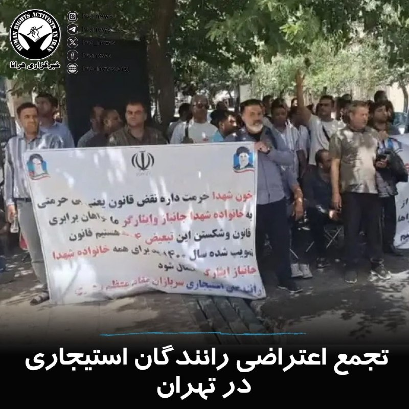

جمعی از رانندگان استیجاری برای سومین روز متوالی در مقابل ساختمان نهاد ریاست جمهوری در تهران، #تجمع_اعتراضی برگزار کردند.

به گفته این رانندگان، ما از استان‌های مختلف در حالی برای اعتراض به تهران آمده‌ایم که از سال ۱۴۰۰ به دنبال اجرای قانون و تبدیل وضعیت هستیم اما هیچ نهادی پیگیر وضعیت ما نیست.

↘️
@hranews_bot تماس ✉️ -  @Hranews  کانال هرانا 🆑

## manototv — post 105826

  <a href="telegram/content/manototv_105826_1779699617.mp4" target="_blank">🎬 Download video</a>

تماسی از اتریش:
«می‌گفت سختی‌ها خیلی‌ها را عوض کرد…
و از کیوان عباسی به‌خاطر حفظ همان نگاه و مسیر همیشگی‌اش قدردانی کرد.»

## alonews — post 122503

  <a href="telegram/content/alonews_122503_1779699619.mp4" target="_blank">🎬 Download video</a>

👈وزارت امور خارجه چین: در جهان تنها یک چین وجود دارد.

🔴تایوان بخش جدایی‌ناپذیر از قلمرو چین است

🔴ما از طرف آلمان می‌خواهیم که اصل چین واحد را حفظ کند و ارسال سیگنال‌های نادرست به نیروهای جدایی‌طلب استقلال تایوان را متوقف نماید.

✅ @AloNews خبر جنگ

## alonews — post 122502

  <a href="telegram/content/alonews_122502_1779699621.webm" target="_blank">🎬 Download video</a>

👈بقایی: برای تنگه هرمز عوارض نمی‌گیریم؛ هزینه‌های دریافتی صرفاً بابت خدمات ناوبری و حفاظت از محیط زیست است

✅ @AloNews خبر جنگ

## alonews — post 122501

  <a href="telegram/content/alonews_122501_1779699621.webm" target="_blank">🎬 Download video</a>

👈مارکو روبیو، وزیر امور خارجه آمریکا، در شبکه تلویزیونی ایندیا تودی: اگر مذاکرات شکست بخورد تقصیر ایالات متحده یا متحدان ما در منطقه خلیج فارس نیست. ۱۰۰ درصد تقصیر ایران است

✅ @AloNews خبر جنگ

## alonews — post 122500

  <a href="telegram/content/alonews_122500_1779699622.webm" target="_blank">🎬 Download video</a>

👈العربیه: اسلام‌آباد اصرار دارد که پکن نقش ضامن را در هر توافقی بین آمریکا و ایران ایفا کند

✅ @AloNews خبر جنگ

## alonews — post 122499

  <a href="telegram/content/alonews_122499_1779699622.webm" target="_blank">🎬 Download video</a>

👈بقایی: چین و روسیه نقش سازنده و مثبتی در تحولات منطقه ای ایفا کرده‌اند

✅ @AloNews خبر جنگ

## alonews — post 122498

  <a href="telegram/content/alonews_122498_1779699622.webm" target="_blank">🎬 Download video</a>

👈 فرمانده قرارگاه خاتم: سامانه‌های جدید پدافندی به کار می‌گیریم

✅ @AloNews خبر جنگ

## alonews — post 122497

  <a href="telegram/content/alonews_122497_1779699623.webm" target="_blank">🎬 Download video</a>

👈بعد از ۲۳ سال، یک خانم (سمیه رفیعی نماینده تهران) عضو هیئت‌رئیسۀ مجلس شد

از مجلس هفتم تاکنون خانمی در جایگاه هیئت‌رئیسه حضور نداشت.

✅ @AloNews خبر جنگ

## alonews — post 122496

  <a href="telegram/content/alonews_122496_1779699623.webm" target="_blank">🎬 Download video</a>

👈نت بلاکس:  اکنون روز ۸۷ام متوالی قطعی اینترنت ایران است که بیش از ۲۰۶۴ ساعت ادامه داشته است

✅ @AloNews خبر جنگ

## alonews — post 122495

  <a href="telegram/content/alonews_122495_1779699623.webm" target="_blank">🎬 Download video</a>

👈بقایی: حتما بخشی از پول‌های ما خرج موشک و پهپاد می‌شود.

🔴 اگر چنین نمی‌کردیم دشمنان ما می‌توانستند به مطامع‌شان برسند.

✅ @AloNews خبر جنگ

## alonews — post 122494

  <a href="telegram/content/alonews_122494_1779699623.webm" target="_blank">🎬 Download video</a>

👈وزارت امور خارجه ایران: اینکه ما به نتیجه‌ای در بخش بزرگی از موضوعات مورد بحث رسیده‌ایم، درست است.

🔴 با این حال، اینکه بگوییم این به معنای قریب‌الوقوع بودن امضای توافق است، هیچ‌کس نمی‌تواند چنین ادعایی کند.

🔴 سیاست‌گذاری و تصمیم‌گیری در ایالات متحده دچار نوعی تردید نهادی شده است.

🔴 تغییرات مکرر در مواضع — در عرض چند ساعت با دیدگاه‌های مختلف، اغلب متناقض و متضاد مواجه می‌شوید.

🔴 این روند هر مذاکره‌ای را مختل می‌کند.

✅ @AloNews خبر جنگ

## alonews — post 122493

  <a href="telegram/content/alonews_122493_1779699623.webm" target="_blank">🎬 Download video</a>

👈سخنگوی وزارت خارجه: تمرکز مذاکرات بر خاتمه جنگ است و در این مرحله درباره جزئیات موضوع هسته‌ای صحبتی نداریم

✅ @AloNews خبر جنگ

## alonews — post 122492

  <a href="telegram/content/alonews_122492_1779699624.webm" target="_blank">🎬 Download video</a>

👈بقایی: سفر آقای عراقچی به نیویورک به علت مشکل روادید منتفی است

✅ @AloNews خبر جنگ

## alonews — post 122491

  <a href="telegram/content/alonews_122491_1779699624.webm" target="_blank">🎬 Download video</a>

👈سخنگوی وزارت خارجه: فعلا سفر هیئت ایرانی به پاکستان برنامه ریزی نشده است

🔴موضوعات شکلی، فرع بر اصل موضوع و محتوا است. ما الان متمرکز بر روند مذاکرات هستیم. اینکه بعداً به چه شکلی تفاهم اعلام شود یا امضا شود، یک موضوعی است که خب فرصت هست برای تصمیم‌گیری درباره آن در آینده.

🔴 اینکه هیئت‌ها باز سفری داشته باشند به تهران یا متقابل، بله ممکن است؛ اگر لازم شود چنین کاری انجام خواهد شد. ولی در شرایط فعلی، ما برنامه‌ای برای سفر به پاکستان یا سفر هیئت پاکستانی به ایران فعلاً چیزی را برنامه‌ریزی نکرده‌ایم

✅ @AloNews خبر جنگ

## alonews — post 122490

  <a href="telegram/content/alonews_122490_1779699624.webm" target="_blank">🎬 Download video</a>

👈سخنگوی وزارت خارجه: امیر قطر سفری به تهران نداشت

🔴معاون دبیر شورای امنیت ملی قطر به ایران سفر کرد آن هم در چارچوب مساعی جمیله و تلاش‌های قطر برای کمک به پیشبرد تفاهمی که به میانجیگری پاکستان در حال انجام است.

🔴میانجی رسمی بین ایران و آمریکا، پاکستان است و برخی کشورها نقش مثبتی در این روند داشتند برای کمک به حل موضوعات.

✅ @AloNews خبر جنگ

## alonews — post 122489

  <a href="telegram/content/alonews_122489_1779699624.webm" target="_blank">🎬 Download video</a>

👈قسمت دارک ماجرا این بود که «منادی» خودش عضو هیئت نظارت بر رفتار نمایندگانه که وظیفه‌شون رسیدگی به رانت و فساد نماینده‌هاست

✅ @AloNews خبر جنگ

## alonews — post 122488

  <a href="telegram/content/alonews_122488_1779699625.webm" target="_blank">🎬 Download video</a>

👈کودتای رهبر بولشویک‌ها در مجلس جواب نداد

🔴حمید رسایی سعی داشت انتخابات مجلس رو تحریم کنه

✅ @AloNews خبر جنگ

## alonews — post 122487

  <a href="telegram/content/alonews_122487_1779699625.webm" target="_blank">🎬 Download video</a>

‌ 
👈تعداد آرای انتخابات هیئت‌رئیسه اعلام شد 
🔴محمدباقر قالیباف: ۲۳۵ رای 
🔴محمدتقی نقد علی: ۲۹ 
🔴عثمان سالاری: ۷ 
🔴رای سفید: ۵ 
✅ @AloNews خبر جنگ

## alonews — post 122485

  <a href="telegram/content/alonews_122485_1779699625.webm" target="_blank">🎬 Download video</a>

👈خب منادی نماینده فاسد و پست تبریز که به نماینده‌ها وعده خونه داده بود تا بهش رای بدن، رای نیاورد و میتونه به عنوان یه نماینده ساده به فسادش ادامه بده

✅ @AloNews خبر جنگ

## alonews — post 122484

  <a href="telegram/content/alonews_122484_1779699625.webm" target="_blank">🎬 Download video</a>

‌

👈تعداد آرای انتخابات هیئت‌رئیسه اعلام شد

🔴محمدباقر قالیباف: ۲۳۵ رای

🔴محمدتقی نقد علی: ۲۹

🔴عثمان سالاری: ۷

🔴رای سفید: ۵

✅ @AloNews خبر جنگ

<!-- MSG END -->

<!-- NAV START -->

<a href="https://github.com/hosseinbaghi/aio-downloader/blob/main/telegram/content/archive_1.md" style="display:inline-block; padding:6px 12px; margin:0 4px; background-color:#2ea44f; color:white; text-decoration:none; border-radius:4px; font-weight:bold;">صفحه بعد</a>

<!-- NAV END -->
