# خواننده تلگرام

<!-- TOP_NAV START -->

<a href="https://github.com/hosseinbaghi/aio-downloader/blob/main/telegram/content/archive_1.md" style="display:inline-block; padding:6px 12px; margin:0 4px; background-color:#2ea44f; color:white; text-decoration:none; border-radius:4px; font-weight:bold;">صفحه بعد</a>

<!-- TOP_NAV END -->

<!-- MSG START -->

---
📅 بروزرسانی: 1405/03/02 23:25
---

## VahidOOnLine — post 241800

  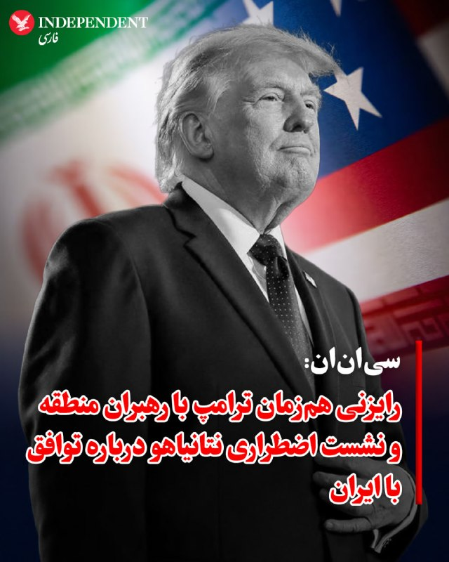

♦️ به گزارش سی‌ان‌ان، دونالد ترامپ، رئیس‌جمهوری آمریکا، عصر روز شنبه دوم خرداد در یک نشست تلفنی با رهبران کشورهای حوزه خلیج فارس و دیگر مقامات منطقه، به بررسی آخرین پیشنهاد جمهوری اسلامی برای پایان دادن به جنگ پرداخت. این رایزنی‌ها در حالی صورت می‌گیرد که میانجی‌ها پس از پایان جلسات خود در تهران، از نزدیک شدن به یک چارچوب برای توافق احتمالی خبر داده‌اند.

یک منبع منطقه‌ای به سی‌ان‌ان گفت که در این تماس تلفنی، مقامات ارشد کشورهای خلیج فارس، پاکستان، ترکیه و مصر حضور داشته‌اند. هم‌زمان، جی‌دی ونس، معاون رئیس‌جمهوری آمریکا، در کاخ سفید دیده شده و ترامپ نیز از برنامه‌اش برای گفتگو با استیو ویتکاف و جرد کوشنر خبر داده است.

از سوی دیگر، یک منبع اسرائیلی به سی‌ان‌ان اعلام کرد که بنیامین نتانیاهو، نخست‌وزیر اسرائیل، قرار است شنبه‌شب یک نشست امنیتی محدود با حضور برخی وزرا و مقامات دفاعی برگزار کند تا تحولات مربوط به مذاکرات تهران و واشنگتن که تل‌آویو از آن کنار گذاشته شده را بررسی کنند.
‌🇸🇦 Indypersian

🤖 @VahidOOnLine

## VahidOOnLine — post 241799

  

ستاد کل نیروهای مسلح جمهوری اسلامی در بیانیه‌ای نوشت: «این مسیر پرفروغ و نورانی ادامه خواهد یافت و مسلمانان و آزادی‌خواهان جهان، طعم شیرین نجات از شر شیاطین عالم، به ویژه آمریکا و اسرائیل را خواهند چشید و به فتوحات بیشتری نائل خواهند شد.»
‌🏁 🇬🇧 IranintlTV

🤖 @VahidOOnLine

## VahidOOnLine — post 241798

مهدیس نظری
۷ ساله بود.

عاشق اسکیت بود.
عاشق شعر خواندن.
شاهنامه...

۹ اسفند،
در حمله به مدرسه شجره طیبه میناب،
او و ۱۲۰ کودک دیگر
جانشان را از دست دادند
‌🏁 🇬🇧 ManotoTV

🤖 @VahidOOnLine

## VahidOOnLine — post 241797

  <a href="telegram/content/VahidOOnLine_241797_1779566151.mp4" target="_blank">🎬 Download video</a>

تماسی از ایران؛
«مرسی که همیشه صدای ما بودید»
‌🏁 🇬🇧 ManotoTV

🤖 @VahidOOnLine

## VahidOOnLine — post 241796

  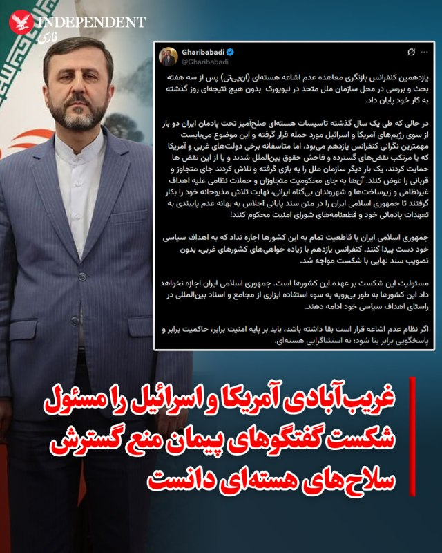

♦️ کاظم غریب‌آبادی، معاون وزیر امور خارجه جمهوری اسلامی، در پی پایان بدون نتیجه و دست نیافتن به توافق در یازدهمین نشست بازنگری پیمان منع گسترش سلاح‌های هسته‌ای (NPT)، ایالات متحده، کشورهای غربی و اسرائیل را مقصر این ناکامی دانست.

غریب‌آبادی در پیامی در شبکه اجتماعی ایکس نوشت که دولت‌های غربی تلاش کردند «جای متجاوز و قربانی را عوض کنند». او همچنین از حملات مشترک آمریکا و اسرائیل به تاسیسات هسته‌ای ایران به شدت انتقاد کرد.

معاون وزیر خارجه جمهوری اسلامی در خصوص خروجی این نشست تاکید کرد: «مسئولیت این شکست بر عهده این کشورهاست. ایران به آن‌ها اجازه نخواهد داد که به سوءاستفاده ابزاری و لجام‌گسیخته خود از مجامع و اسناد بین‌المللی برای رسیدن به اهداف سیاسی‌شان ادامه دهند.»
‌🇸🇦 Indypersian

🤖 @VahidOOnLine

## VahidOOnLine — post 241795

  

سایت هرانا گزارش داد بیژن کاظمی، زندانی سیاسی محبوس در زندان اوین، با حکم شعبه ۱۵ دادگاه انقلاب تهران در مجموع به ۳۷ سال و شش ماه حبس محکوم شد.

بیژن کاظمی، زندانی سیاسی پس از کشته شدن محمد مقیسه و علی رازینی، دو قاضی دیوان عالی کشور در ۳۰ دی‌ماه ۱۴۰۳، در شهرستان کوهدشت بازداشت شده بود.
‌🏁 🇬🇧 IranintlTV

🤖 @VahidOOnLine

## VahidOOnLine — post 241794

♦️مهدی تاج، رئیس فدراسیون فوتبال جمهوری اسلامی، روز شنبه دوم خردادماه اعلام کرد تیم ملی در جریان جام جهانی ۲۰۲۶ در شهر تیخوانا مکزیک، در نزدیکی مرز آمریکا، مستقر خواهد شد.
او گفت این تصمیم با تایید فیفا و به‌دلیل مشکلات مربوط به صدور ویزا برای ورود به آمریکا اتخاذ شده و تیم ملی می‌تواند به‌صورت مستقیم با پروازهای «ایران‌ایر» به مکزیک سفر کند.
بر اساس برنامه مسابقات، ایران در دو دیدار نخست خود در مرحله گروهی در لس‌آنجلس مقابل نیوزیلند و بلژیک به میدان می‌رود و سپس در سیاتل با مصر دیدار خواهد کرد. تاج همچنین تأکید کرد نزدیکی تیخوانا به محل برگزاری مسابقات، یکی از دلایل انتخاب این شهر به‌عنوان محل اردوی تمرینی بوده است.
‌🇸🇦 Indypersian

🤖 @VahidOOnLine

## VahidOOnLine — post 241793

  

♦️ لیندزی گراهام، سناتور جمهوری‌خواه روز شنبه دوم خرداد، در پی انتشار اخبار مربوط به توافق احتمالی با جمهوری اسلامی، منطق دستیابی به چنین تفاهمی را زیر سوال برد و آن را یک «کابوس» برای اسرائیل توصیف کرد.

گراهام که از حامیان سرشناس از سرگیری حملات آمریکا به ایران است، در شبکه اجتماعی ایکس نوشت: «اگر قرار باشد توافقی برای پایان دادن به درگیری‌ها امضا شود، با این فرض که نمی‌توان از تنگه هرمز در برابر تروریسم ایران محافظت کرد و ایران همچنان توانایی نابودی زیرساخت‌های نفتی خلیج فارس را دارد، در این صورت ایران به عنوان یک قدرت مسلط که نیازمند راهکار دیپلماتیک است، دیده خواهد شد.»

او این توافق را مایه تغییر توازن قوا به نفع تهران دانست و افزود: «این برداشت که ایران می‌تواند برای همیشه به ترور در تنگه هرمز ادامه دهد و به زیرساخت‌های نفتی آسیب بزند، در طول زمان یک کابوس برای اسرائیل خواهد بود.»

گراهام در پایان با ابراز تردید نسبت به ناتوانی در مهار نظامی جمهوری اسلامی گفت: «اگر این برداشت‌ها درست باشد، این سوال پیش می‌آید که اصلا چرا جنگ را شروع کردیم؟»
‌🇸🇦 Indypersian

🤖 @VahidOOnLine

## VahidOOnLine — post 241792

  

محمد اکرمی‌نیا، سخنگوی ارتش جمهوری اسلامی، گفت: «تا آخرین لحظه دست از عملیات برنداشتیم. با موشک‌ها و پهپادها برابر دشمن که مجهز به تسلیحات پیشرفته است، مقاومت کردیم.» او گفت: «با نابودی کامل اسرائیل منطقه جای آرام‌تری خواهد بود.»
‌🏁 🇬🇧 IranintlTV

🤖 @VahidOOnLine

## VahidOOnLine — post 241791

  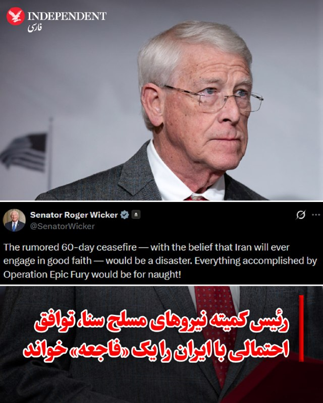

♦️ راجر ویکر ، سناتور جمهوری‌خواه، از ایالت می‌سی‌سی‌پی و رئیس کمیته قدرتمند نیروهای مسلح سنای آمریکا، توافق احتمالی با جمهوری اسلامی را یک «فاجعه» توصیف کرد.

ویکر از منتقدان سرشناس مذاکره برای دستیابی به توافق با تهران است و همواره خواستار از سرگیری بمباران‌های گسترده علیه ایران بوده است.

ویکر در حساب کاربری خود در شبکه اجتماعی ایکس نوشت: «شایعات درباره آتش‌بس ۶۰ روزه با این باور که ایران روزی با حسن نیت وارد تعامل خواهد شد، یک فاجعه است. با این کار، تمام دستاوردهای عملیات خشم حماسی به باد خواهد رفت!»

ویکر روز جمعه نیز تاکید کرده بود که به ترامپ برای پیگیری این توافق «مشاوره‌های غلطی داده شده» و این تصمیم، «میراث دوران ریاست‌جمهوری ترامپ را تعریف خواهد کرد.»
‌🇸🇦 Indypersian

🤖 @VahidOOnLine

## VahidOOnLine — post 241790

  <a href="telegram/content/VahidOOnLine_241790_1779566157.mp4" target="_blank">🎬 Download video</a>

♦️در پی تحولات مربوط به ایران، جی‌دی ونس، معاون رئیس‌جمهوری آمریکا، به‌صورت غیرمنتظره به واشینگتن بازگشت و کاروان خودرویی او با سرعت به سمت کاخ سفید حرکت کرد.
بر اساس گزارش‌ها، دونالد ترامپ تمامی اعضای تیم امنیت ملی آمریکا را برای برگزاری نشستی درباره ایران فراخوانده است. همچنین قرار است رئیس‌جمهوری آمریکا ساعت ۱ بعدازظهر به وقت شرق آمریکا، یک تماس کنفرانسی با رهبران چند کشور عربی برگزار کند.
این تحرکات در حالی انجام می‌شود که طی روزهای اخیر، مقام‌های آمریکایی از احتمال تشدید تنش‌ها و حتی بازگشت عملیات نظامی علیه ایران سخن گفته‌اند.
‌🇸🇦 Indypersian

🤖 @VahidOOnLine

## WithYashar — post 12246

رویترز:
یک چارچوب سه مرحله‌ای برای مذاکرات آمریکا و ایران پیشنهاد شده:
پایان رسمی جنگ.
حل و فصل بن‌بست تنگه هرمز .
باز کردن پنجره مذاکره ۳۰ روزه برای توافقی گسترده‌تر.
امکان تمدید آتش بس نیز وجود دارد.
@withyashar

## WithYashar — post 12245

کنسول جمهوری آذربایجان در تبریز بر اثر تصادف در اتوبان جلفا-تبریز جان باخت.
@withyashar

## WithYashar — post 12244

سناتور لیندسی گراهام:
اگه با ایران توافق کنیم فقط بخاطر اینه که چون فهمیدیم نمی‌تونیم تنگه هرمز رو از دست ایران حفظ کنیم و ایران هنوز هم میتونه زیرساخت‌های نفتی خلیج فارس رو نابود کنه؛ یعنی اون‌وقت ایران به‌عنوان قدرت غالب منطقه شناخته میشه و همه مجبور میشن باهاش دیپلماتیک کنار بیان.

اینکه ایران بتونه همیشه تنگه هرمز رو به‌هم بریزه و همزمان توان ضربه سنگین به نفت خلیج فارس رو داشته باشه، موازنه قدرت منطقه رو کامل عوض میکنه و در آینده واسه اسرائیل تبدیل به کابوس میشه.

من شخصاً قبول ندارم که نشه جلوی توان ایران رو گرفت یا منطقه نتونه از خودش در برابر قدرت نظامی ایران دفاع کنه. باید خیلی حواسمون باشه که این قضیه رو خراب نکنیم.
@withyashar

## WithYashar — post 12243

خبرنگار لبنانی در شبکه سه: حزب‌الله بر روی نابودکردن گنبد آهنین اسرائیل تمرکز کرده است!
@withyashar

## WithYashar — post 12242

توییت مارک لوین:
شما متحدی را که در یک عملیات نظامی بزرگ در کنار شما جنگیده است، کنار نمی‌گذارید. یا این فقط یکی دیگر از فهرست طولانی تهمت‌ها علیه نتانیاهو است که نیویورک تایمز و جروزالم پست بدنام از او متنفرند، یا یک اشتباه استراتژیک بسیار بزرگ است.
@withyashar

## WithYashar — post 12241

## WithYashar — post 12240

## WithYashar — post 12239

پرواز گسترده جنگنده های آمریکایی در نزدیکی مرز ایران

@withyashar

## WithYashar — post 12238

علی خضریان، عضو کمیسیون امنیت ملی مجلس : در هر توافقی ایران حتما باید غرامت جنگ را دریافت کند.
شرایط تنگه هرمز به قبل از جنگ برنخواهد گشت این دستاورد و مطالبه رهبری است .
مطالبه ملت ایران است که از مدیریت تنگه هرمز عقب‌نشینی نشود
@withyashar

## WithYashar — post 12237

گروه کرد ایرانی کومله می‌گوید پهپادها کمی پیش پایگاه‌های آن را در استان اربیل، کردستان عراق، مورد حمله قرار دادند، در حالی که پهپادهایی توسط «هواپیماهای ائتلاف» سرنگون شدند.
@withyashar

## WithYashar — post 12236

همین الان دارن میجنگن فقط تو عراق 😂

## WithYashar — post 12235

جنگنده‌های نیروی هوایی ایالات متحده در حال حاضر بر فراز منطقه خلیفان در استان اربیل در شمال عراق پرواز می‌کنند تا پهپادهای ایرانی را که گروه‌های مخالف کرد-ایرانی در منطقه را هدف قرار داده‌اند، رهگیری کنند.
@withyashar

## WithYashar — post 12234

فاکس نیوز:هنوز هیچ توافقی بین رژیم جمهوری اسلامی و آمریکا صورت نگرفته

@withyashar

## WithYashar — post 12233

یاشار جان این ترامپ اشتباهی بجای اینکه مارو ببره قاهره داره میبره بورکینافاسو 😂😂😂

## WithYashar — post 12232

یاشار جان این ترامپ اشتباهی بجای اینکه مارو ببره قاهره داره میبره بورکینافاسو 😂😂😂

## WithYashar — post 12231

کانال 14 اسرائیل: چند منبع معتبر تأیید می‌کنند که ایران با برخی از درخواست‌های کلیدی ایالات متحده موافقت کرده است و کمتر از 24 ساعت دیگر اعلام توافق انجام خواهد شد که به تهران چند ماه فرصت می‌دهد تا کاملاً تسلیم شود
@withyashar

## mwarmonitor — post 9579

🔴سناتور لیندسی گراهام ؛ اگر در منطقه این برداشت وجود داشته باشد که توافق با ایران باعث می‌شود این رژیم پابرجا بماند و در طول زمان قدرتمندتر شود، ما در واقع بنزین روی آتش درگیری‌ها در لبنان و عراق ریخته‌ایم. 🔸توافقی که چنین برداشتی ایجاد کند مبنی بر اینکه…

## mwarmonitor — post 9578

🔴سناتور لیندسی گراهام ؛ اگر در منطقه این برداشت وجود داشته باشد که توافق با ایران باعث می‌شود این رژیم پابرجا بماند و در طول زمان قدرتمندتر شود، ما در واقع بنزین روی آتش درگیری‌ها در لبنان و عراق ریخته‌ایم.

🔸توافقی که چنین برداشتی ایجاد کند مبنی بر اینکه ایران می‌تواند باقی بماند و در آینده توان کنترل تنگه را داشته باشد، حزب‌الله در لبنان و شبه‌نظامیان شیعه در عراق را بسیار تقویت خواهد کرد.

@mwarmonitor

## mwarmonitor — post 9577

  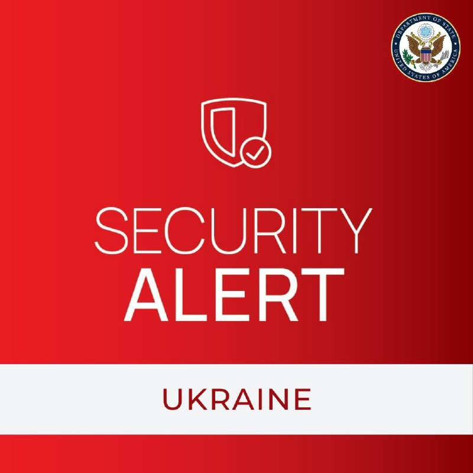

🔸اوکراین: سفارت ایالات متحده در کی‌یف اطلاعاتی دریافت کرده است مبنی بر اینکه ممکن است طی ۲۴ ساعت آینده یک حمله هوایی قابل توجه در هر لحظه رخ دهد.

🔹این سفارتخانه، مانند همیشه، به شهروندان آمریکایی توصیه می‌کند در صورت اعلام هشدار حمله هوایی، فوراً برای پناه گرفتن آماده باشند.

@mwarmonitor

## mwarmonitor — post 9576

🔴«تماس بسیار مثبت بود. پیشرفت خوبی در حال انجام است»، یک دیپلمات منطقه‌ای به فاکس نیوز گفت. «رهبران منطقه از این پیشرفت و همچنین از دستاوردی که رئیس‌جمهور ترامپ در مذاکرات به آن رسیده حمایت کردند.»

@mwarmonitor

## mwarmonitor — post 9575

🔴سفیر ایران در پاکستان: با خوش‌بینی محتاطانه می‌توان امیدوار بود که اگر طرف مقابل تعهد کافی نشان دهد، گام‌های مثبتی در حال شکل‌گیری است.

@mwarmonitor

## mwarmonitor — post 9574

  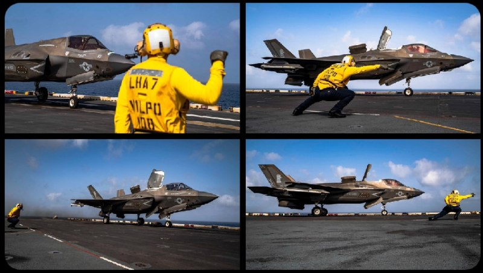

🔸ملوانان و تفنگداران دریایی آمریکا در ناو USS Tripoli (LHA-7) در حالی که این ناو در حال عبور از دریای عرب است، عملیات پروازی انجام می‌دهند.

@mwarmonitor

## mwarmonitor — post 9573

پیام دادن که فلان خبر موثق ؟!!!
نه استخاره میکنم از لای نهج‌البلاغه خبر در میارم

## FoxNewsTwitter — post 342168

  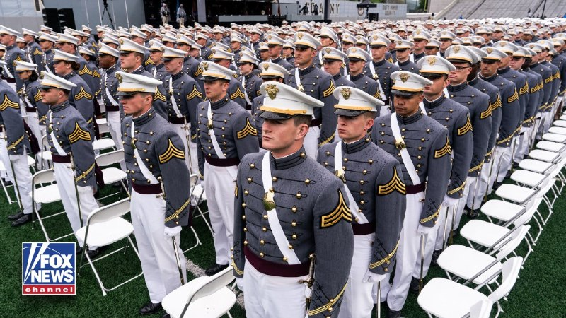

Fox News (Twitter/X)

"You will be the tip of the spear."

The Army has now hit its 2026 recruiting goal months ahead of schedule, according to War Secretary Pete Hegseth.

During a commencement speech at West Point, Hegseth announced the Army reached the milestone four months early and said the service is preparing to bring in 61,500 new soldiers.

The announcement comes as the Pentagon faces mounting global tensions and renewed focus on military readiness.

## pm_afshaa — post 91321

  <a href="telegram/content/pm_afshaa_91321_1779566161.webm" target="_blank">🎬 Download video</a>

🔴سناتور لیندسی گراهام: برخی رهبران منطقه از ترامپ خواستن برای تضعیف جمهوری اسلامی اقدام نظامی انجام بده تا توافق بهتری حاصل بشه. 
💧 Rainbet.com the #1 Non-KYC Crypto Casino & Sportsbook @rainbetcom 
😁 @Pm_Afshaa

## pm_afshaa — post 91320

  <a href="telegram/content/pm_afshaa_91320_1779566162.webm" target="_blank">🎬 Download video</a>

🔴سناتور لیندسی گراهام:
برخی رهبران منطقه از ترامپ خواستن برای تضعیف جمهوری اسلامی اقدام نظامی انجام بده تا توافق بهتری حاصل بشه.

💧 Rainbet.com the #1 Non-KYC Crypto Casino & Sportsbook @rainbetcom

😁 @Pm_Afshaa

## pm_afshaa — post 91319

  <a href="telegram/content/pm_afshaa_91319_1779566162.webm" target="_blank">🎬 Download video</a>

🔴سفیر ایران در پاکستان:
با خوش‌بینی محتاطانه میشه امیدوار بود که اگه طرف مقابل تعهد کافی نشون بده، گام‌های مثبتی در حال شکل‌گیریه.

💧 Rainbet.com the #1 Non-KYC Crypto Casino & Sportsbook @rainbetcom

😁 @Pm_Afshaa

## pm_afshaa — post 91318

🔴تماس تلفنی بی بی با ترامپ شروع شد

💧 Rainbet.com the #1 Non-KYC Crypto Casino & Sportsbook @rainbetcom

😁 @Pm_Afshaa

## pm_afshaa — post 91317

  <a href="telegram/content/pm_afshaa_91317_1779566163.webm" target="_blank">🎬 Download video</a>

🔴توییت اتاق جنگ اسرائیل:
⌛️

💧 Rainbet.com the #1 Non-KYC Crypto Casino & Sportsbook @rainbetcom

😁 @Pm_Afshaa

## pm_afshaa — post 91316

  <a href="telegram/content/pm_afshaa_91316_1779566164.webm" target="_blank">🎬 Download video</a>

🔴واشنگتن‌تایمز به نقل از یک منبع نزدیک به مذاکرات: آمریکا و ایران احتمالا طی 24 ساعت آینده نهایی‌شدن توافق صلح رو اعلام می‌کنن.

مذاکره‌کنندگان پیش‌نویس پایان درگیری‌ها در همه جبهه‌ها رو تایید کردن، اما توافق هنوز نیازمند تایید نهایی دو طرفه.

💧 Rainbet.com the #1 Non-KYC Crypto Casino & Sportsbook @rainbetcom

😁 @Pm_Afshaa

## pm_afshaa — post 91315

🔴پرواز گسترده جنگنده های آمریکایی در نزدیکی مرز ایران

💧 Rainbet.com the #1 Non-KYC Crypto Casino & Sportsbook @rainbetcom

😁 @Pm_Afshaa

## pm_afshaa — post 91314

  <a href="telegram/content/pm_afshaa_91314_1779566164.mp4" target="_blank">🎬 Download video</a>

مونترال کانادا

💧 Rainbet.com the #1 Non-KYC Crypto Casino & Sportsbook @rainbetcom

😁 @Pm_Afshaa

## pm_afshaa — post 91313

العربیه : چیزی تا نهایی شدن توافق میان آمریکا و ایران نمانده

💧 Rainbet.com the #1 Non-KYC Crypto Casino & Sportsbook @rainbetcom

😁 @Pm_Afshaa

## pm_afshaa — post 91312

سردار نقدی : هرگونه تجاوز دشمن با ضربات جبران‌ناپذیر جواب داده میشه

💧 Rainbet.com the #1 Non-KYC Crypto Casino & Sportsbook @rainbetcom

😁 @Pm_Afshaa

## pm_afshaa — post 91311

🔐 سرور اختصاصی ترکیه با پینگ فوق‌العاده پایین
مناسب گیم، ترید، استریم و استفاده حرفه‌ای

✅ سرعت و کیفیت عالی

✅ آی‌پی ترکیه واقعی

✅ پایداری بالا و بدون قطعی

✅ مناسب استفاده 24/7

✅ بدون محدودیت زمان و بدون ضریب

💰 قیمت تک: هر گیگ 150 هزار تومان

🤝 قیمت همکاری: هر گیگ فقط 120 هزار تومان

با ضمانت عودت وجه در صورت قطعی
🙏
برای تست و ثبت سفارش پیام بدید 
✉️:
@V2rayyar_sup
@v2rayyar

## pm_afshaa — post 91310

🔴فاکس نیوز:هنوز هیچ توافقی بین رژیم جمهوری اسلامی و آمریکا صورت نگرفته

💧 Rainbet.com the #1 Non-KYC Crypto Casino & Sportsbook @rainbetcom

😁 @Pm_Afshaa

## pm_afshaa — post 91309

🔴ترامپ نیم ساعت دیگر با رهبران عرب کنفرانس تلفنی انجام خواهد داد

💧 Rainbet.com the #1 Non-KYC Crypto Casino & Sportsbook @rainbetcom

😁 @Pm_Afshaa

## pm_afshaa — post 91308

حمله پهپادی جمهوری اسلامی به اربیل عراق

😁 @Pm_Afshaa

## DEJradio — post 4889

  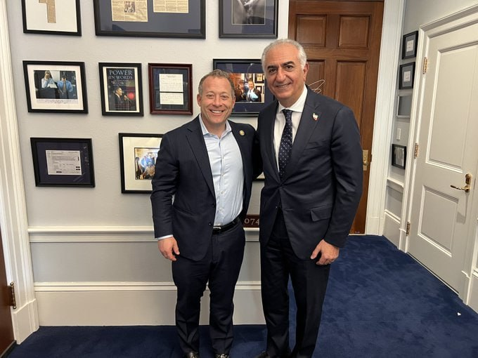

👑
⭕️ شاهزاده رضا پهلوی در پیامی در حساب کاربری خود در شبکهٔ ایکس، از دیدار و گفت‌وگوی خود با جاش گاتهایمر، نمایندهٔ کنگره آمریکا، خبر دادند. ایشان با قدردانی از مواضع این نماینده دربارهٔ ایران، تأکید کردند در این دیدار دربارهٔ اهمیت حمایت دوحزبی از مردم ایران گفت‌وگو شده است.
شاهزاده رضا پهلوی همچنین تصریح کردند مردم ایران تنها برای آزادی کشور خود مبارزه نمی‌کنند، بلکه در تلاش هستند تروریسم جمهوری اسلامی علیه جهان را نیز پایان دهند.

#شاهزاده_رضا_پهلوی #کنگره_آمریکا
@DEJradio

## VahidOnline — post 75659

  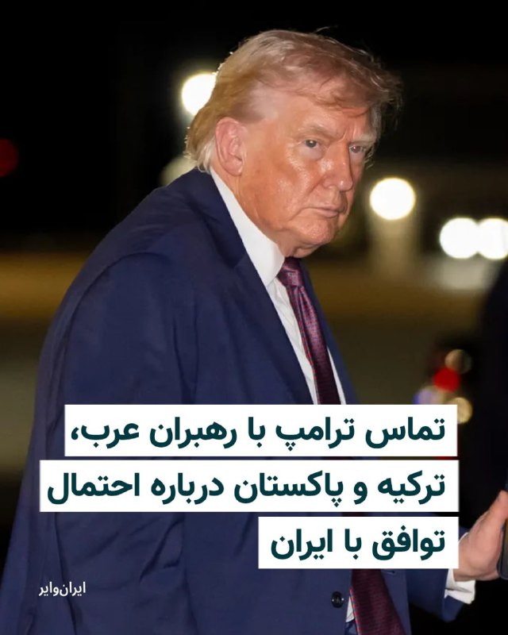

دونالد ترامپ، رییس‌جمهوری آمریکا، روز شنبه دوم خرداد ۱۴۰۵ در تماس‌هایی جداگانه با رهبران عربستان سعودی، امارات، قطر، مصر، ترکیه، پاکستان و فرانسه درباره توافق احتمالی برای پایان جنگ با جمهوری اسلامی گفت‌وگو کرد. همزمان یک مقام آمریکایی آگاه از روند مذاکرات گفت واشنگتن و تهران به دستیابی به توافق نزدیک شده‌اند و اختلاف‌های باقی‌مانده عمدتا بر سر نحوه نگارش برخی بندهای توافق است.

به گزارش اکسیوس، چند تن از رهبران حاضر در تماس با ترامپ از او خواسته‌اند مسیر دستیابی به توافق را دنبال کند. با این حال، این مقام آمریکایی تاکید کرده است که هنوز تصمیم نهایی از سوی رییس‌جمهوری آمریکا اتخاذ نشده و او همچنان می‌تواند توافق را رد کرده و دستور حملات جدید علیه ایران را صادر کند.

همزمان، جی‌دی ونس، معاون رییس‌جمهوری آمریکا، و پیت هگست، وزیر دفاع این کشور، برای شرکت در نشست ویژه بررسی توافق احتمالی به واشینگتن فراخوانده شدند. ترامپ پیش‌تر گفته بود پس از بررسی آخرین پیشنهاد ایران با تیم مذاکره‌کننده خود، احتمالا تا روز یکشنبه درباره ادامه مذاکرات یا ازسرگیری جنگ تصمیم خواهد گرفت.

به گفته منابع آگاه، پیش‌نویس جدیدی که قرار است ترامپ آن را بررسی کند، حاصل مذاکرات اخیر میان ایران و پاکستان است.
@VahidHeadline

📡 @VahidOnline

## kianmeli1 — post 87616

🔴این توافق احتمالی چه پیروزی برای ترامپ دارد!

۱-رهبری پیر در اوج نفرت تبدیل به شهید شد
۲-فرزندش بر تخت نشست
۳-تنگه هرمز بسته شد
۴-تمام پایگاه های امریکایی پودر شدند
۵-تخم کشورهای عربی کشیده شد
۶-اورانیوم ها در ایران ماند
۷-نفت ۱۰۰ دلاری

اگر پیروزی ترامپ نیست پس چیست
https://t.me/kianmeli1

## kianmeli1 — post 87615

  

🔴بنا به گزارش‌ها، تماس تلفنی امروز بین رئیس جمهور ترامپ و رهبران عرب به پایان رسیده است و یک دیپلمات منطقه‌ای به فاکس نیوز گفته است که این تماس «بسیار مثبت» بوده و «پیشرفت خوبی حاصل شده است.» وی افزود: «رهبران منطقه‌ای از پیشرفت و موفقیتی که رئیس جمهور ترامپ در مذاکرات [با ایران] به دست آورده است، حمایت کردند.»
https://t.me/kianmeli1

## kianmeli1 — post 87614

‏🔴سازمان هواپیمایی کشوری: فرودگاه‌های اصفهان، اردبیل و لامرد از یکشنبه سه خرداد فعالیت خود را از سر می‌گیرند.
‏این سازمان اعلام کرد در حال حاضر هیچ محدودیت تازه‌ای در فضای هوایی کشور اعمال نشده است
https://t.me/kianmeli1

## kianmeli1 — post 87613

  <a href="telegram/content/kianmeli1_87613_1779566167.mp4" target="_blank">🎬 Download video</a>

‏🔴برخی رسانه‌های ایران از حمله موشکی از سوی جمهوری اسلامی به اربیل کردستان عراق خبر دادند https://t.me/kianmeli1

## kianmeli1 — post 87612

‏🔴برخی رسانه‌های ایران از حمله موشکی از سوی جمهوری اسلامی به اربیل کردستان عراق خبر دادند
https://t.me/kianmeli1

## IranIntlTV — post 338656

  <a href="https://t.me/IranintlTV/338656" target="_blank">📎 Download file</a>

🎧نسخه صوتی چشم‌انداز: تاثیرات بن لادن بر سبک زندگی مجتبی خامنه‌ای
@iranintlTV

## IranIntlTV — post 338655

  <a href="telegram/content/IranIntlTV_338655_1779566169.mp4" target="_blank">🎬 Download video</a>

تاثیرات بن لادن بر سبک زندگی مجتبی خامنه‌ای

چشم‌انداز با مهدی مهدوی‌آزاد

نسخه کامل این برنامه در یوتیوب:
https://youtu.be/oPPdjYWeEIE
@iranintltv

## IranIntlTV — post 338654

  <a href="telegram/content/IranIntlTV_338654_1779566172.mp4" target="_blank">🎬 Download video</a>

تاثیرات بن لادن بر سبک زندگی مجتبی خامنه‌ای

چشم‌انداز با مهدی مهدوی‌آزاد

نسخه کامل این برنامه در یوتیوب:
https://youtu.be/oPPdjYWeEIE
@iranintltv

## IranIntlTV — post 338653

  

ستاد کل نیروهای مسلح جمهوری اسلامی در بیانیه‌ای نوشت: «این مسیر پرفروغ و نورانی ادامه خواهد یافت و مسلمانان و آزادی‌خواهان جهان، طعم شیرین نجات از شر شیاطین عالم، به ویژه آمریکا و اسرائیل را خواهند چشید و به فتوحات بیشتری نائل خواهند شد.»
https://iranintl.com/202605233697

## IranIntlTV — post 338652

  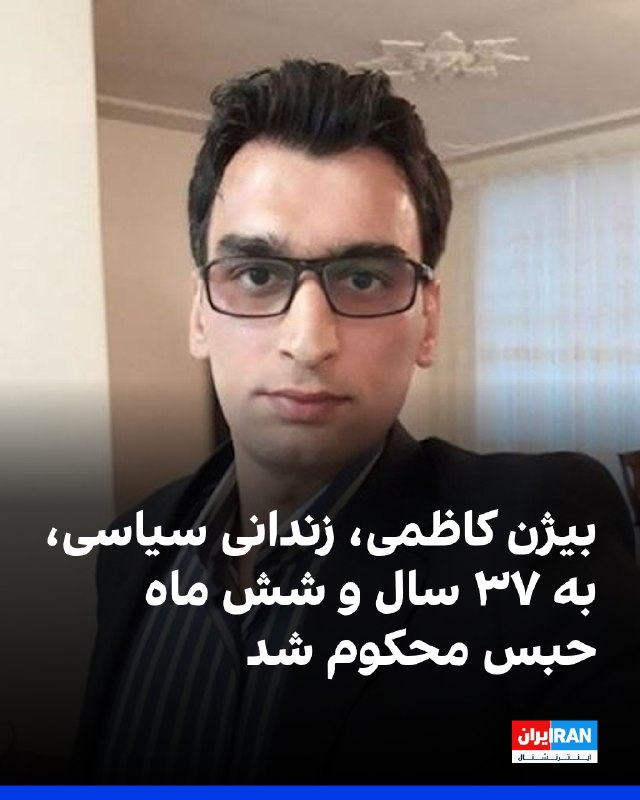

سایت هرانا گزارش داد بیژن کاظمی، زندانی سیاسی محبوس در زندان اوین، با حکم شعبه ۱۵ دادگاه انقلاب تهران در مجموع به ۳۷ سال و شش ماه حبس محکوم شد.

بیژن کاظمی، زندانی سیاسی پس از کشته شدن محمد مقیسه و علی رازینی، دو قاضی دیوان عالی کشور در ۳۰ دی‌ماه ۱۴۰۳، در شهرستان کوهدشت بازداشت شده بود.
https://iranintl.com/202605234393

## IranIntlTV — post 338651

  <a href="telegram/content/IranIntlTV_338651_1779566176.mp4" target="_blank">🎬 Download video</a>

در برنامه‌ای زنده در صداوسیما، زنی که ادعا می‌شود همسایه بیت علی خامنه‌ای، رهبر کشته‌شده جمهوری اسلامی، بوده در پاسخ به مجری که از او می‌پرسد چه اتفاقی برای «بیت رهبری» افتاده است، می‌گوید: «اگر از پشت‌بام نگاه کنی، تلی از خاک می‌بینی. منطقه [خامنه‌ای] خیلی سرسبز بود، اما حالا به بیابانی بی‌درخت تبدیل شده و فقط خاک است. درختی هم نیست.»
@iranintltv

## IranIntlTV — post 338650

  <a href="https://t.me/IranintlTV/338650" target="_blank">📎 Download file</a>

🎧نسخه صوتی تیتراول با نیوشا صارمی: ترامپ: شانس توافق با جمهوری اسلامی یا نابودی کامل آن‌ها پنجاه-پنجاه است
@iranintlTV

## IranIntlTV — post 338649

  

محمد اکرمی‌نیا، سخنگوی ارتش جمهوری اسلامی، گفت: «تا آخرین لحظه دست از عملیات برنداشتیم. با موشک‌ها و پهپادها برابر دشمن که مجهز به تسلیحات پیشرفته است، مقاومت کردیم.» او گفت: «با نابودی کامل اسرائیل منطقه جای آرام‌تری خواهد بود.»
https://iranintl.com/202605236138

## IranIntlTV — post 338648

  <a href="telegram/content/IranIntlTV_338648_1779566178.mp4" target="_blank">🎬 Download video</a>

دونالد ترامپ، رییس‌جمهوری آمریکا، در گفت‌وگو با اکسیوس اعلام کرد در دیدار با تیم مذاکره‌کننده، آخرین پیشنهاد جمهوری اسلامی را بررسی خواهد کرد. ترامپ گفته است احتمال دارد روز یکشنبه درباره ازسرگیری جنگ تصمیم‌گیریa کند و شانس توافق یا بازگشت به درگیری را «۵۰-۵۰» می‌داند.
گفت‌وگو با امید معماریان، تحلیل‌گر سیاسی
@iranintltv

## Shin_Persian — post 6171

Shin ✓ @hey_itsmyturn
Sat, 23 May 2026 19:27:12 UTC

PM @netanyahu on the phone with @POTUS - Reports

فارسی

گزارش‌ها: نخست‌وزیر @netanyahu در حال گفتگو با @POTUS (رئیس‌جمهور ایالات متحده) است.

𝕏 · @shin_persian

## Shin_Persian — post 6170

Gordo ✓ @GordoCDA
Sat, 23 May 2026 18:40:42 UTC

Fox News is reporting that no deal has been made with the Iranians.

فارسی

فاکس نیوز گزارش می‌دهد که هیچ توافقی با ایرانی‌ها حاصل نشده است.

𝕏 · @shin_persian

## Shin_Persian — post 6169

  

↩️ Quoted tweet: Shin ✓ @hey_itsmyturn Fri, 22 May 2026 19:46:10 UTC Intense jet activity over Eastern Iraq, near Iranian western borders. #Iraq 🇮🇶 ↩️ توییت نقل‌قول شده — برای پاسخ، پست زیر را ببینید. فارسی فعالیت شدید جت‌های جنگنده برفراز شرق عراق،…

## Shin_Persian — post 6168

  

↩️ Quoted tweet:
Shin ✓ @hey_itsmyturn
Fri, 22 May 2026 19:46:10 UTC

Intense jet activity over Eastern Iraq, near Iranian western borders.
#Iraq 🇮🇶

↩️ توییت نقل‌قول شده — برای پاسخ، پست زیر را ببینید.

فارسی

فعالیت شدید جت‌های جنگنده برفراز شرق عراق، در نزدیکی مرزهای غربی ایران.
#Iraq 🇮🇶

𝕏 · @shin_persian

## ManotoTV — post 105782

مهدیس نظری
۷ ساله بود.

عاشق اسکیت بود.
عاشق شعر خواندن.
شاهنامه...

۹ اسفند،
در حمله به مدرسه شجره طیبه میناب،
او و ۱۲۰ کودک دیگر
جانشان را از دست دادند

## ManotoTV — post 105781

  <a href="telegram/content/ManotoTV_105781_1779566183.mp4" target="_blank">🎬 Download video</a>

تماسی از ایران؛
«مرسی که همیشه صدای ما بودید»

## FarsiVOA — post 218472

⚡️رئیس جمهوری آمریکا می‌گوید طرح ‌پیشنهادی جمهوری اسلامی را دریافت‌ کرده و در مورد آن تصمیم‌ می‌گیرد
@FarsiVOA

## FarsiVOA — post 218471

🔺گزارش | روایت اعدام عبدالجلیل شه‌بخش؛ از روستای چاه احمد تا اعترافات تلویزیونی

▪️عبدالجلیل شه‌بخش، زندانی سیاسی، روز ۲۲ اردیبهشت ۱۴۰۵ اعدام شد. بنا بر برخی گزارش‌ها، او ۲۶ ساله، پدر دو کودک خردسال و اهل روستای چاه احمد بود.

⬇️ بیشتر بخوانید:
https://ir.voanews.com/a/iran-baloch-sistan-execution-abdoljalil-shahbakhsh-prison/8153055.html
@FarsiVOA

## FarsiVOA — post 218470

⚡️گروهی از دانش‌آموزان در شهرهای دورود، یاسوج، خرم‌آبا‌‌د، و بر‌وجرد تجمع‌های اعتراضی برگزار کردند و خواستند امتحانات‌شان به طور مجازی برگزار شود.
@FarsiVOA

## FarsiVOA — post 218469

⚡️گفت‌وگو با دکتر بابک خطی برای بررسی دلایل بحران دارو در ایران؛ سوء مدیریت، مافیای دارو یا مشکل واردات؟
@FarsiVOA

## FarsiVOA — post 218468

⚡️گفت‌وگو با حسن هاشمیان درباره تلاش‌های دیپلماتیک برای توافق و تماس‌های پاکستان و قطر با مقام‌های جمهوری اسلامی
@FarsiVOA

## FarsiVOA — post 218467

⚡️گفت‌وگو با علیرضا فیروزی درباره پیامدهای بیش از دوهزار ساعت قطع اینترنت در ایران، از جمله اختلال در ارتباطات، آموزش، و کسب‌وکار.
@FarsiVOA

## DW_Farsi — post 125064

🔶 نشست نتانیاهو با رهبران احزاب و مقام‌های امنیتی اسرائیل درباره توافق احتمالی میان آمریکا و جمهوری اسلامی

کانال ۱۲ اسرائیل گزارش داد بنیامین نتانیاهو، نخست وزیر اسرائیل، قرار است شامگاه شنبه ۲۳ مه (۲ خرداد) رهبران احزاب ائتلاف و مقام‌های امنیتی این کشور را برای گفت‌وگو درباره توافقی که میان آمریکا و جمهوری اسلامی برای پایان دادن به جنگ در حال شکل‌گیری است، گرد هم آورد.

این شبکه مفاد گزارش‌شده این توافق را برای اسرائیل "بسیار بد" توصیف کرد.

در این گزارش به نقل از یک مقام اسرائیلی که نامش فاش نشده آمده است استیو ویتکاف، فرستاده آمریکا، بیش از همه برای آن تلاش می‌کند که ترامپ این توافق را بپذیرد.

به نوشته این گزارش، اسرائیل،  ویتکاف را بازیگر اصلی‌ای می‌داند که "تقریبا به هر قیمتی خواهان توافق است و فشار بسیار زیادی به ترامپ وارد می‌کند تا جنگ را از سر نگیرد."

با این حال، گزارش می‌افزاید اگر مفاد منتشرشده این توافق درست باشد، در اسرائیل آن را چنان "بد" می‌دانند که به سختی می‌توان تصور کرد ترامپ با آن موافقت کند.

به گفته این گزارش، این توافق "یک مشکل بسیار بزرگ برای اسرائیل" خواهد بود و "به شدت با آنچه نتانیاهو علنا گفته و حتی بیش از آن، با آنچه ترامپ تنها چند ساعت پیش علنا گفته، در تضاد است."

کانال ۱۲ در توضیح بیشتر نوشت که این مفاد، بازگشایی تنگه هرمز از سوی ایران را در ازای دریافت امتیازهای مالی پیش‌بینی می‌کند، در حالی که قرار است درباره برنامه هسته‌ای جمهوری اسلامی و خارج کردن ذخایر اورانیوم غنی‌شده آن تازه در مرحله‌ای بعد گفت‌وگو شود.

این گزارش افزود که برنامه موشک‌های بالستیک جمهوری اسلامی اصلا در دستور کار قرار ندارد.

این گزارش در جمع‌بندی نوشت: «آمریکا نقدی پرداخت می‌کند، در حالی که ایران اگر اصلا چیزی بپردازد، نسیه خواهد پرداخت.»

با این حال، گزارش ادامه می‌دهد که میان نتانیاهو و ترامپ "هماهنگی نزدیک" وجود دارد و "هیچ فاصله‌ای" میان آن دو نیست.

این ادعا با گزارش نیویورک تایمز در اوایل امروز در تضاد است؛ گزارشی که گفته بود نتانیاهو "تقریبا به طور کامل" از روند مذاکرات کنار گذاشته شده است.

ترامپ پیش‌تر روز شنبه به اکسیوس گفته بود: «برخی خیلی بیشتر ترجیح می‌دهند توافقی حاصل شود و برخی دیگر ترجیح می‌دهند جنگ از سر گرفته شود.»

او همچنین گفته بود نتانیاهو "دو دل" است، اما این تصور را رد کرده بود که نخست وزیر اسرائیل نگران باشد او با یک توافق بد موافقت کند.

گزارش اکسیوس به نقل از مقام‌های اسرائیلی گفته بود که نتانیاهو در واقع به شدت نگران توافق احتمالی است و از ترامپ خواسته دور تازه‌ای از حملات را آغاز کند.

در همین حال باراک راوید، خبرنگار اکسیوس و کانال ۱۲، به این شبکه گفت ترامپ به او اطمینان داده که اگر توافق "برای اسرائیل خوب" نباشد، آن را نخواهد پذیرفت.

در حال حاضر هیچ متن رسمی‌ای از این توافق منتشر نشده است، هرچند وبسایت العربیه روز گذشته متنی که آن را "پیش‌نویس نهایی" خوانده بود، منتشر کرد.

سخنگوی وزارت امور خارجه جمهوری اسلامی پیش‌تر امروز گفته بود یادداشت تفاهمی که اکنون در دست بررسی است، به بازگشایی تدریجی تنگه هرمز، لغو محاصره آمریکا علیه بنادر ایران و آزادسازی دارایی‌های مسدودشده ایران خواهد پرداخت.

او همچنین گفت مفاد این توافق یک دوره ۳۰ تا ۶۰ روزه بعدی را برای مذاکرات بر سر یک توافق تفصیلی پیش‌بینی می‌کند.

@dw_farsi

## Persian_Trend_Official — post 14765

کانال رسمی پرشین ترند pinned «راستش امشب اصلا حال جسمی خوبی ندارم اما این رو بهتون بگم بهم اعتماد داشته باشید به نظر من دور بعدی جنگ در راهه این خبر هایی که در مورد توافق گفته میشه احمقانست توافقی وجود نداره همه هدف این هست که غافلگیری بوحود بیارن وگرنه امکان توافق بین این تیم فعلی…»

## Persian_Trend_Official — post 14764

🔴 ترامپ اعضای ارشد تیم امنیت ملی آمریکا را به اتاق وضعیت کاخ سفید فراخواند

💢گزارش‌ها حاکی است دونالد ترامپ معاون رئیس‌جمهور «جی‌دی ونس»، وزیر جنگ «پیت هگست»، رئیس ستاد مشترک ارتش ژنرال «دن کین» و تمامی اعضای شورای امنیت ملی آمریکا را به اتاق وضعیت (Situation Room) کاخ سفید فراخوانده است

🫆:Tony

📌 @persian_trend_official
پرشین ترند | متفاوت‌ترین کانال نظامی

## Persian_Trend_Official — post 14763

راستش امشب اصلا حال جسمی خوبی ندارم
اما این رو بهتون بگم
بهم اعتماد داشته باشید
به نظر من دور بعدی جنگ در راهه
این خبر هایی که در مورد توافق گفته میشه احمقانست

توافقی وجود نداره

همه هدف این هست که غافلگیری بوحود بیارن وگرنه امکان توافق بین این تیم فعلی جمهوری اسلامی با تیم فعلی امریکا و اسرائیل وجود نداره !

## Persian_Trend_Official — post 14762

💢کانال اسرائیلی کان:

💢«ساعت‌های حساس: در اسرائیل منتظرند ببینند آیا تلاش‌های دیپلماتیک فشرده، به ویژه از سوی پاکستان و قطر، به امضای یادداشت تفاهم بین ایران و ایالات متحده منجر خواهد شد یا نه.

💢این در حالی است که نخست‌وزیر بنیامین نتانیاهو به سمت ازسرگیری جنگ و حملات علیه ایران فشار آورده است.

🫆:Tony

📌 @persian_trend_official
پرشین ترند | متفاوت‌ترین کانال نظامی

## Persian_Trend_Official — post 14761

  <a href="telegram/content/Persian_Trend_Official_14761_1779566185.webm" target="_blank">🎬 Download video</a>

🔴 ترامپ در حال برگزاری نشست امنیت ملی درباره ایران است

💢گزارش‌ها حاکی است دونالد ترامپ هم‌اکنون در کاخ سفید ریاست یک نشست امنیت ملی را برعهده دارد؛ نشستی که همزمان با پیشرفت مذاکرات ایران و آمریکا و احتمال توافق بر سر «یادداشت تفاهم» برگزار می‌شود.

بر اساس گزارش رسانه‌های آمریکایی:

▪️ این نشست با حضور مقام‌های ارشد امنیتی، اطلاعاتی و نظامی آمریکا برگزار شده است
▪️ محور اصلی گفت‌وگوها، بررسی پیش‌نویس توافق و تصمیم‌گیری درباره ادامه مسیر مذاکرات یا بازگشت به گزینه نظامی است
▪️ ترامپ طی ساعات اخیر گفته بود «مذاکرات بسیار به توافق نزدیک شده‌اند» و پیش‌نویس توافق را مطالعه کرده است.

همزمان:

▪️ میانجیگران منطقه‌ای از جمله پاکستان، قطر و عربستان همچنان در تماس با دو طرف هستند
▪️ گزارش‌ها از آماده بودن یک «یادداشت تفاهم» برای پایان جنگ و آغاز مذاکرات گسترده‌تر خبر می‌دهند
▪️ با وجود فضای مثبت، اختلافات درباره برنامه هسته‌ای ایران و تحریم‌ها همچنان پابرجاست.

🫆:Tony

📌 @persian_trend_official
پرشین ترند | متفاوت‌ترین کانال نظامی

## Persian_Trend_Official — post 14760

  <a href="telegram/content/Persian_Trend_Official_14760_1779566186.webm" target="_blank">🎬 Download video</a>

دوستان باک ماشین ها رو پر کنید و کمربند هاتون رو سفت ببندید. 👽👾

📝 Nick

## Persian_Trend_Official — post 14759

اگر جنگ بشه میام اگر نشه فعلا همون خبر های دیشب هست

## Persian_Trend_Official — post 14758

دوستان امشب کسالت دارم نمیتونم لایو اجرا کنم
عذرخواهی میکنم

## Persian_Trend_Official — post 14757

  <a href="telegram/content/Persian_Trend_Official_14757_1779566186.mp4" target="_blank">🎬 Download video</a>

💢همزمان با اخبار توافق، جمهوری اسلامی مقر گروه کومله در اربیل عراق را زیر ضرب حملات موشکی و پهپادی برده است.
🫆:Tony

📌 @persian_trend_official
پرشین ترند | متفاوت‌ترین کانال نظامی

## Persian_Trend_Official — post 14756

💢 فرانس پرس:

💢تماس مکرون با ترامپ و رهبران عرب خلیج‌فارس در حمایت از راه‌حل دیپلماتیک با ایران

🫆:Tony

📌 @persian_trend_official
پرشین ترند | متفاوت‌ترین کانال نظامی

## Persian_Trend_Official — post 14755

💢ادعای رویترز درباره چارچوب سه مرحله‌ای برای مذاکرات آمریکا و ایران

💢یک چارچوب سه مرحله‌ای برای مذاکرات آمریکا و ایران پیشنهاد شده است:

♦️پایان رسمی جنگ،

♦️حل و فصل بن‌بست تنگه هرمز

♦️باز کردن پنجره مذاکره ۳۰ روزه برای توافقی گسترده‌تر. امکان تمدید نیز وجود دارد.

🫆:Tony

📌 @persian_trend_official
پرشین ترند | متفاوت‌ترین کانال نظامی

## Persian_Trend_Official — post 14754

🔴 العربیه: تنها چند ساعت تا اعلام توافق میان ایران و آمریکا باقی مانده است

💢خبرگزاری العربیه به نقل از یک منبع ارشد گزارش داد تنها «چند ساعت» تا اعلام رسمی توافق میان تهران و واشینگتن باقی مانده است.

🫆:Tony

📌 @persian_trend_official
پرشین ترند | متفاوت‌ترین کانال نظامی

## Persian_Trend_Official — post 14753

  <a href="telegram/content/Persian_Trend_Official_14753_1779566187.mp4" target="_blank">🎬 Download video</a>

🔴علی خضریان، عضو کمیسیون امنیت ملی مجلس

💢در هر توافقی ایران حتما باید غرامت جنگ را دریافت کند.

▪️شرایط تنگه هرمز به قبل از جنگ برنخواهد گشت این دستاورد و مطالبه رهبری است .

▪️مطالبه ملت ایران است که از مدیریت تنگه هرمز عقب‌نشینی نشود

🫆:Tony

📌 @persian_trend_official
پرشین ترند | متفاوت‌ترین کانال نظامی

## Persian_Trend_Official — post 14752

## Persian_Trend_Official — post 14751

  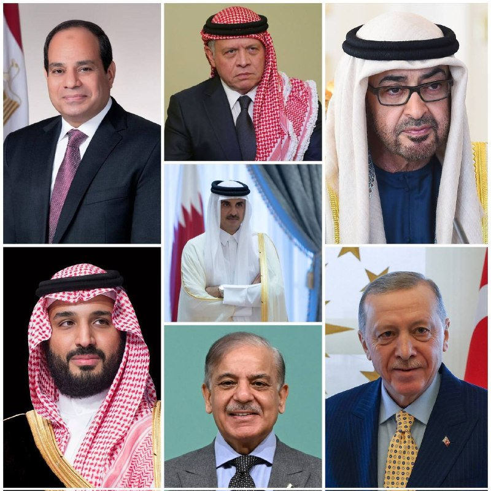

🔴 فاکس‌نیوز: تماس بسیار مثبت بود و پیشرفت خوبی در مذاکرات حاصل شده است

«تماس سران عرب و ترامپ بسیار مثبت بود. پیشرفت خوبی در حال انجام است.

بر اساس این گزارش:

▪️ رهبران منطقه از روند پیشرفت مذاکرات حمایت کرده‌اند
▪️ این منابع از «دستاورد دیپلماتیک» ترامپ در مذاکرات تمجید کرده‌اند
▪️ فضای کلی گفت‌وگوها نسبت به روزهای گذشته مثبت‌تر ارزیابی می‌شود

💢این گزارش در حالی منتشر می‌شود که:

▪️ میانجیگری پاکستان، قطر، عربستان و چند کشور منطقه ادامه دارد
▪️ بحث بر سر تمدید آتش‌بس و آغاز مذاکرات گسترده‌تر هسته‌ای همچنان در جریان است
▪️همزمان آمریکا هنوز گزینه نظامی را کاملاً کنار نگذاشته است

🫆:Tony

📌 @persian_trend_official
پرشین ترند | متفاوت‌ترین کانال نظامی

## RadioFarda — post 157502

  <a href="https://t.me/radiofarda/157502" target="_blank">📎 Download file</a>

📻بشنوید: خبرهای ساعت ۲۱ با رادیوفردا، دوم خرداد ۱۴۰۵‌

@RadioFarda

## RadioFarda — post 157501

🔸مهدی تاج، رئیس فدراسیون فوتبال ایران، اعلام کرد که تیم ملی فوتبال در جریان جام جهانی ۲۰۲۶ در شهر مرزی تیخوانا در مکزیک مستقر خواهد شد. 🔸او روز شنبه دوم خرداد گفت که فدراسیون جهانی فوتبال، فیفا، با درخواست ایران برای انتقال محل اردو از ایالت آریزونا آمریکا…

## RadioFarda — post 157500

  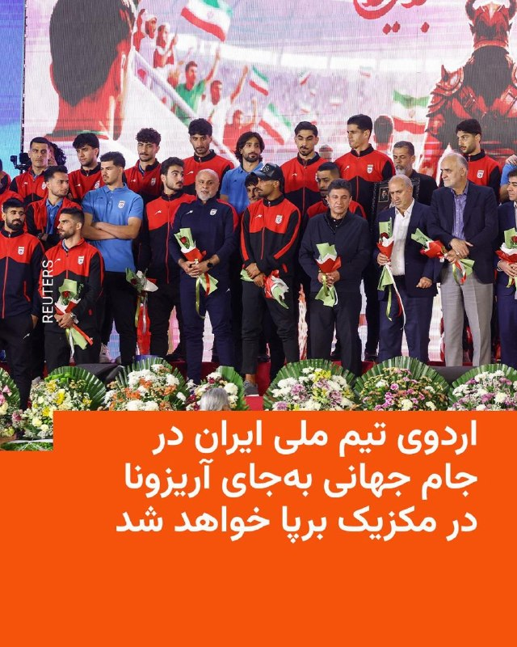

🔸مهدی تاج، رئیس فدراسیون فوتبال ایران، اعلام کرد که تیم ملی فوتبال در جریان جام جهانی ۲۰۲۶ در شهر مرزی تیخوانا در مکزیک مستقر خواهد شد.

🔸او روز شنبه دوم خرداد گفت که فدراسیون جهانی فوتبال، فیفا، با درخواست ایران برای انتقال محل اردو از ایالت آریزونا آمریکا موافقت کرده است.

🔸تیخوانا در نزدیکی اقیانوس آرام و مرز مکزیک با آمریکا قرار دارد و به‌گفتهٔ مهدی تاج، این جابه‌جایی محل اردو می‌تواند از مشکلات مربوط به دریافت ویزا جلوگیری کند. او افزود اعضای تیم ملی می‌توانند با پرواز مستقیم ایران‌ایر به مکزیک سفر کنند.

🔸رئیس فدراسیون فوتبال ایران گفت فاصله تیخوانا تا لس‌آنجلس حدود ۵۵ دقیقه پرواز است و این شهر نسبت به اردوی قبلی در آریزونا به محل مسابقات نزدیک‌تر است.

@RadioFarda

## IranianMinds — post 20636

🔴 نیویورک‌ تایمز: ترامپ قبلا نتانیاهو را شریک اصلی خود علیه ایران می‌دانست، اما بعد از متوقف شدن جنگ و آغاز مذاکرات آتش‌بس، اسرائیل عملاً از مذاکرات آمریکا و ایران کنار گذاشته شده است. نتانیاهو امیدوار بود جنگ باعث سقوط حکومت ایران، نابودی برنامه هسته‌ای…

## IranianMinds — post 20635

  

🔴 نیویورک‌ تایمز:

ترامپ قبلا نتانیاهو را شریک اصلی خود علیه ایران می‌دانست، اما بعد از متوقف شدن جنگ و آغاز مذاکرات آتش‌بس، اسرائیل عملاً از مذاکرات آمریکا و ایران کنار گذاشته شده است.

نتانیاهو امیدوار بود جنگ باعث سقوط حکومت ایران، نابودی برنامه هسته‌ای و از بین رفتن موشک‌های ایران شود، اما هیچ‌کدام محقق نشد

ترامپ به سمت پایان دادن به جنگ رفت و نفوذ اسرائیل بر توافق نهایی را محدود کرد

این موضوع برای نتانیاهو هم از نظر سیاسی و هم راهبردی ضربه محسوب می‌شود، چون تصویر او به‌عنوان فردی با نفوذ ویژه روی ترامپ تضعیف شده است!

@IranianMinds

## IranianMinds — post 20634

😳 هنوزم واسه کانفیگ هزینه میکنی؟ 🍸 با داییجون رایگان وصل شو 🎁 کافیه فقط دوستاتو بیاری تو ربات و کانفیگتو رایگان از ما تحویل بگیری ⭐ راستی دایی جون اگه تلگرامت پرمیوم باشه به محض استارت کردن ربات صد مگابایت کانفیگ رایگان از دایی هدیه میگیری 🎁 @Daeijoonbot…

## IranianMinds — post 20633

🔴 فاکس نیوز :

تماس های ترامپ با رهبر های منطقه مثبت بوده و‌ مذاکرات پیشرفت قابل توجهی داشته.

@IranianMinds

## IranianMinds — post 20632

بنظرتون باز مثل همیشه دوروز دیگه میزنن یا ایندفه یه خبرایی هست واقعا؟

## IranianMinds — post 20631

🔴 العربیه :

چیزی تا نهایی شدن توافق میان آمریکا و ایران نمانده …

@IranianMinds

## IranianMinds — post 20630

  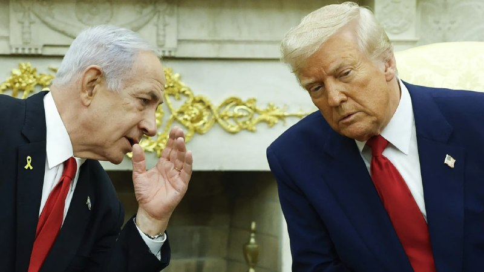

🔴 به گزارش آکسیوس به نقل از یک مقام ارشد اسرائیلی، ترامپ قرار است امشب با بنیامین نتانیاهو، نخست‌وزیر اسرائیل، درباره توافق با ایران گفتگو کند.

@IranianMinds

## BBCPersian — post 281900

🔻ایران: آمریکا و اسرائیل مسئول بی‌نتیجه ماندن کنفرانس بازنگری ان‌پی‌تی هستند

ساعاتی پیش گزارش دادیم که کنفرانس بازنگری پیمان منع گسترش سلاح‌های هسته‌ای بدون نتیجه در نیویورک به کار خود خاتمه داده است.

اینک معاون وزیر خارجه ایران در امور بین‌المللی، ایالات متحده، کشورهای غربی و اسرائیل را مسئول پایان بی‌نتیجه یازدهمین کنفرانس بازنگری ان‌پی‌تی خوانده و گفته «مسئولیت این شکست بر عهده این کشورهاست.»

کاظم غریب‌آبادی در پیامی در شبکه ایکس نوشت که دولت‌های غربی تلاش کردند «جای متجاوز و قربانی را عوض کنند» و از حملات آمریکا و اسرائیل به تأسیسات هسته‌ای ایران انتقاد کرد.

آقای غریب‌آبادی نوشت: «ایران اجازه نخواهد داد این کشورها همچنان از مجامع و اسناد بین‌المللی به‌صورت ابزاری و بدون محدودیت برای اهداف سیاسی خود سوءاستفاده کنند.»

https://bbc.in/4dtIPCY
@BBCPersian

## BBCPersian — post 281899

  <a href="telegram/content/BBCPersian_281899_1779566193.mp4" target="_blank">🎬 Download video</a>

🔻آخرین خبرهای مهم روز شنبه ۲ خرداد ۱۴۰۵

@BBCPersian

## BBCPersian — post 281897

🔻ابراز خوش‌بینی محتاطانه وزیر خارجه آمریکا در مورد گفت‌وگو با ایران

مارکو روبیو با خوش‌بینی محتاطانه‌ نسبت به مذاکرات با ایران گقت دولت دونالد ترامپ ممکن است به زودی «حرفی برای گفتن» در این باره داشته باشد.

اظهارات وزیر خارجه آمریکا در سفر به هند مطرح شد.

تام بیتمن، خبرنگار بی‌بی‌سی، از او پرسید که آیا دولت آمریکا امروز جوابی از ایران گرفته است. او پاسخ داد که دیپلماسی در حال پیشرفت است و ممکن است امروز یا ظرف چند روز آینده خبری منتشر شود هرچند که نمی‌توان مطمئن بود.

او بار دیگر تاکید کرد که ایران باید اورانیوم غنی‌شده با خلوص بالا را تحویل دهد و عوارض ترانزیت از تنگه هرمز دریافت نکند.

آقای روبیو امروز در دیدار با نخست‌وزیر هند درباره بحران در خاورمیانه گفت‌وگو کرد.

هند از جمله کشورهایی است که بیشترین آسیب را از بسته شدن تنگه هرمز دیده است.

به نظر می‌رسد یکی از راه‌حل‌های پیشنهادی آقای روبیو، تلاش برای متقاعد کردن هند به خرید نفت بیشتر از آمریکا است حتی اگر گران‌تر باشد و مسافت بیشتری را طی کند

https://bbc.in/4dtIPCY
@BBCPersian

## BBCPersian — post 281896

🔻چرا رژه با نمادهای ساواک در اروپا جنجالی شد؟

در روزهای گذشته تجمع برخی از پادشاهی‌خواهان در چندین شهر آلمان با نمادهای ساواک، سازمان اطلاعات و امنیت در دوران محمدرضا شاه پهلوی، حسابی بحث‌برانگیز شده و دوباره توجه‌ها را نسبت به عملکرد این سازمان امنیتی جلب کرده است. مخالفان می‌گویند با نمادهای یک سازمانی امنیتی که در سرکوب و شکنجه نقش داشته نمی‌توان برای دمکراسی در ایران مبارزه کرد و در طرف مقابل طرفداران می‌گویند ساواک تنها برای برقراری امنیت کشور تلاش می‌کرد.

گزارش فرزاد صیفی‌کاران، از بخش راستی‌آزمایی بی‌بی‌سی، با این هشدار که حاوی روایت‌هایی است که برای برخی ممکن است آزاردهنده باشد.

@BBCPersian

## BBCPersian — post 281895

🔻رویترز: ترامپ امروز با رهبران کشورهای منطقه تلفنی صحبت می‌کند

خبرگزاری رویترز به نقل از یک مقام از کشورهای عربی گفت که دونالد ترامپ، رئیس‌جمهور آمریکا، امروز گفت‌وگویی تلفنی با برخی از رهبران کشورهای منطقه خواهد داشت.

بر اساس این گزارش قرار است آقای ترامپ با رهبران عربستان سعودی، قطر، امارات متحده عربی، مصر، ترکیه و پاکستان تلفنی صحبت کند.

https://bbc.in/4dtIPCY
@BBCPersian

## BBCPersian — post 281894

🔻ایران و پاکستان از تلاش برای تنظیم یادداشت تفاهم خبر دادند

سخنگوی وزارت خارجه ایران و یک مقام پاکستانی گفته‌اند که طرف‌ها در حال کار به روی متن یادداشت تفاهم درباره توافق ایران و آمریکا هستند.

اسماعیلی بقایی، سخنگوی وزارت خارجه ایران، درباره نتایج تازه‌ترین میانجیگری‌های پاکستان بین ایران و آمریکا گفته است که «ما در مرحله نهایی‌سازی یادداشت تفاهم هستیم.»

آقای بقایی گفت: «موضوعاتی که در این مرحله درباره آنها بحث می‌شود به طور کلی بر خاتمه جنگ متمرکز است. موضوع پایان یافتن تعرضات دریایی آمریکا و موضوعات مرتبط با آزاد شدن اموال بلوکه شده ایران، از عمده مواردی هستند که در این یادداشت تفاهم به آنها پرداخته می‌شود.»

همزمان یک یک مقام امنیتی پاکستانی هم به خبرگزاری رویترز گفت که «یادداشت تفاهم برای پایان دادن به جنگ میان آمریکا و ایران در حال نهایی‌سازی و تنظیم جزئیات است.»

آمریکا می‌گوید در حال بررسی پاسخ ایران است و احتمال توافق یا درگیری مجدد در حال حاضر پنجاه پنجاه است.

https://bbc.in/4dtIPCY
@BBCPersian

## Dirty_Kids — post 390035

  

بعد عدم توانایی مردم واسه خرید ماشین، حالا دیگه گرفتن گواهینامه هم داره به یه آرزو تبدیل میشه؛

هزینه دریافت گواهینامه رانندگی با افزایش 56 درصدی نسبت به قبل، ناقابل 15 میلیون تومن شد.

@Dirty_Kids 👻

## Dirty_Kids — post 390034

آخرین اخبار و وضعیت مذاکرات دقیقا مانند روزهای پیش از دو جنگ قبلی است؛ آمریکایی‌ها به دروغ ابراز امیدواری می‌کنند که توافق امضا می‌شود، اما مقامات و رسانه‌های ایرانی اعتراف می‌کنند که اختلاف‌نظرها زیاد است و توافق در دسترس نیست، و سپس ناگهان مخفیگاه مقامات در تهران منفجر می‌شود.

@Dirty_Kids 👻

## Dirty_Kids — post 390033

شاید خبر ندارید ولی سپاه مادرقحبه‌ی پاسداران ، امسال سراسر ایران رو تبدیل کرده به یه مزرعه بزرگ خشخاش و بزودی تولید تریاک ایران از افغانستان هم میزنه جلو

@Dirty_Kids 👻

## Dirty_Kids — post 390032

  <a href="telegram/content/Dirty_Kids_390032_1779566196.mp4" target="_blank">🎬 Download video</a>

اینجوری که وسط تعریف کردن ارضا شد، دست عاقا جای بالا رفته بوده پایین!
با حجاب شد، لاک قرمزشم پاک کرد
فقط مونده با یه سپاهی صیغه کنه و وسط خیابون براش جشن عروسی بگیرن.

@Dirty_Kids 👻

## Hranews — post 113122

  

بیژن کاظمی به بیش از ۳۷ سال حبس محکوم شد

❗️
❗️
❗️
❗️
❗️– بیژن کاظمی، زندانی سیاسی محبوس در زندان اوین، با حکم شعبه ۱۵ دادگاه انقلاب تهران در مجموع به ۳۷ سال و شش ماه حبس محکوم شد.

به گزارش خبرگزاری هرانا، ارگان خبری مجموعه فعالان حقوق بشر در ایران، بیژن کاظمی به حبس محکوم شد.

بر اساس حکمی که توسط شعبه ۱۵ دادگاه انقلاب تهران به ریاست قاضی ابوالقاسم صلواتی صادر و اخیراً ابلاغ شده است، وی از بابت اتهامات مطروحه در پرونده خود در مجموع به ۳۷ سال و شش ماه حبس محکوم شده است.

بیژن کاظمی که تاکنون در بازداشت موقت به‌ سر می‌برد، بهمن ماه سال گذشته با اتهاماتی از جمله اجتماع و تبانی برای ارتکاب جرم علیه امنیت داخلی و خارجی و عضویت در جمعیت‌های معارض کشور در شعبه ۱۵ دادگاه انقلاب تهران محاکمه شده بود.

یک منبع مطلع در این خصوص به هرانا گفت: "وی در این پرونده همچنین با اتهامی مرتبط با «تهیه سلاح برای ضارب دو قاضی رازینی و مقیسه» مواجه شد؛ اتهامی که پیش‌تر توسط ضابطان امنیتی رد شده و مقام‌های قضایی کوهدشت نیز درباره آن سکوت کرده بودند."

ادامه مطلب

#بیژن_کاظمی

↘️
@hranews_bot تماس ✉️ - @Hranews کانال هرانا 🆑

## manototv — post 105782

مهدیس نظری
۷ ساله بود.

عاشق اسکیت بود.
عاشق شعر خواندن.
شاهنامه...

۹ اسفند،
در حمله به مدرسه شجره طیبه میناب،
او و ۱۲۰ کودک دیگر
جانشان را از دست دادند

## manototv — post 105781

  <a href="telegram/content/manototv_105781_1779566198.mp4" target="_blank">🎬 Download video</a>

تماسی از ایران؛
«مرسی که همیشه صدای ما بودید»

## alonews — post 122163

  

قیمت استثنایی گیگی
9️⃣
8️⃣
1️⃣

تحویل زیر یک دقیقه
✅
دارای لینک سابسکریشن جهت دیدن حجم و کنترل مصرف
✅
بدون قطعی 
✅
بدون محدودیت کاربر و زمان
✅
جمینایو چت جی بی تی و... کامل اوکیه با سرورامون
✅

🏪پشتیبانی کامل
✅
شروع فعالیت از سال 2022 
✅
پرداخت ریالی
✅

ضریب و این چیزا ندارن و تا آخرین مگابایت برای پشتیبانیش درختمتیم
🥂

💤این تخفیف فقط تا ۱۲ شب فعاله
💤

⭐️ @Napsternetiran_bot
〰️〰️〰️〰️〰️〰️〰️

🔶 @Napsternetvirani

## alonews — post 122162

  <a href="telegram/content/alonews_122162_1779566201.webm" target="_blank">🎬 Download video</a>

👈کانال عبری کان: «ساعت‌های حساس: در اسرائیل منتظرند ببینند آیا تلاش‌های دیپلماتیک فشرده، به ویژه از سوی پاکستان و قطر، به امضای یادداشت تفاهم بین ایران و ایالات متحده منجر خواهد شد یا نه.

🔴این در حالی است که نخست‌وزیر بنیامین نتانیاهو به سمت ازسرگیری جنگ و حملات علیه ایران فشار آورده است.»

✅ @AloNews خبر جنگ

## alonews — post 122161

  <a href="telegram/content/alonews_122161_1779566201.webm" target="_blank">🎬 Download video</a>

👈فاکس نیوز: «شما نوک نیزه خواهید بود.»

🔴ارتش اکنون چهار ماه زودتر از برنامه به هدف استخدامی خود در سال ۲۰۲۶ رسیده است، طبق گفته پیت هگست، وزیر جنگ.

🔴هگستث در سخنرانی فارغ‌التحصیلی در وست پوینت اعلام کرد که ارتش چهار ماه زودتر به این نقطه عطف رسیده و گفت که این نیرو در حال آماده‌سازی برای جذب ۶۱,۵۰۰ سرباز جدید است.

🔴این اعلامیه در حالی صورت می‌گیرد که پنتاگون با تنش‌های فزاینده جهانی و تمرکز مجدد بر آمادگی نظامی روبرو است.

✅ @AloNews خبر جنگ

## alonews — post 122160

  <a href="telegram/content/alonews_122160_1779566202.webm" target="_blank">🎬 Download video</a>

👈کنسول جمهوری آذربایجان در تبریز بر اثر تصادف در اتوبان جلفا-تبریز جان باخت.

✅ @AloNews خبر جنگ

## alonews — post 122159

  <a href="telegram/content/alonews_122159_1779566202.webm" target="_blank">🎬 Download video</a>

👈خبرنگار لبنانی در شبکه سه: حزب‌الله بر روی نابودکردن گنبد آهنین اسرائیل تمرکز کرده است!

✅ @AloNews خبر جنگ

## alonews — post 122158

  <a href="telegram/content/alonews_122158_1779566202.webm" target="_blank">🎬 Download video</a>

👈ادعای رویترز درباره چارچوب سه مرحله‌ای برای مذاکرات آمریکا و ایران

🔴پایان رسمی جنگ، حل و فصل بن‌بست تنگه هرمز و باز کردن پنجره مذاکره ۳۰ روزه برای توافقی گسترده‌تر. امکان تمدید نیز وجود دارد.

✅ @AloNews خبر جنگ

## alonews — post 122157

  <a href="telegram/content/alonews_122157_1779566202.mp4" target="_blank">🎬 Download video</a>

👈 فیلمی از حمله پهپادی ایرانی به حزب آزادی کردستان (پاک) در استان اربیل، شمال عراق

✅ @AloNews خبر جنگ

## alonews — post 122156

  <a href="telegram/content/alonews_122156_1779566203.mp4" target="_blank">🎬 Download video</a>

👈 پهپادهای ایران مواضع گروه های جدایی طلب در کردستان عراق را هدف قرار دادند.

✅ @AloNews خبر جنگ

## alonews — post 122155

  <a href="telegram/content/alonews_122155_1779566204.webm" target="_blank">🎬 Download video</a>

👈مکرون در تماس با ترامپ و سران خلیج فارس، خواستار راهکار دیپلماتیک و توافق با ایران شد

✅ @AloNews خبر جنگ

## alonews — post 122154

  <a href="telegram/content/alonews_122154_1779566204.webm" target="_blank">🎬 Download video</a>

👈 شنیده شدن صدای انفجار در اربیل عراق

✅ @AloNews خبر جنگ

## alonews — post 122153

  <a href="telegram/content/alonews_122153_1779566205.mp4" target="_blank">🎬 Download video</a>

👈خضریان، عضو کمیسیون امنیت ملی مجلس: در هر توافقی ایران حتما باید غرامت جنگ را دریافت کند/ مطالبه ملت ایران است که از مدیریت تنگه هرمز عقب‌نشینی نشود

✅ @AloNews خبر جنگ

## alonews — post 122152

  <a href="telegram/content/alonews_122152_1779566207.webm" target="_blank">🎬 Download video</a>

👈یک دیپلمات منطقه‌ای به فاکس نیوز:
«تماس سران عرب و ترامپ بسیار مثبت بود. پیشرفت خوبی در حال انجام است. رهبران منطقه از این پیشرفت که ترامپ با مذاکرات به دست آورد، حمایت کردند.»

✅ @AloNews خبر جنگ

## alonews — post 122151

  <a href="telegram/content/alonews_122151_1779566208.webm" target="_blank">🎬 Download video</a>

🔴فوری / هم اکنون جلسه اضطراری امنیت ملی دولت ترامپ در اتاق جنگ کاخ سفید در حال برگزاری است. 
✅ @AloNews خبر جنگ

## alonews — post 122150

  <a href="telegram/content/alonews_122150_1779566208.webm" target="_blank">🎬 Download video</a>

👈سفیر ایران در پاکستان: چند دقیقه پیش، جناب وزیر محترم کشور پاکستان، برادر عزیزم محسن نقوی، پس از بازگشت از تهران، مرا از دستاوردهای مذاکرات با مقامات کشورم مطلع کردند.

🔴با خوش‌بینی محتاطانه می‌توان امیدوار بود که در صورت پایبندی کافی طرف مقابل، گام مثبتی در حال شکل‌گیری است که نتیجه مواضع جمهوری اسلامی ایران مبتنی بر عزت، ایستادگی نیروهای مسلح شجاع و مقاومت ملت شجاع ایران، همچنین ابتکار و تلاش‌های فداکارانه میانجی پاکستان است

✅ @AloNews خبر جنگ

---
📅 بروزرسانی: 1405/03/02 22:19
---

## VahidOOnLine — post 241789

  <a href="telegram/content/VahidOOnLine_241789_1779562144.mp4" target="_blank">🎬 Download video</a>

♦️حضور آیشواریا رای باچان، ستاره افسانه‌ای بالیوود، در هفتاد و نهمین دوره جشنواره فیلم کن (2026)، بار دیگر تمام نگاه‌ها را به خود معطوف کرد. این حضور در حالی رقم خورد که غیبت او در پوسترهای تبلیغاتی جدید «لورئال پاریس» در هتل مارتینز، موجی از نگرانی و اعتراض را در فضای مجازی به راه انداخته بود.

هواداران که کن را بدون «ملکه» خود متصور نبودند، با مشاهده جای خالی او در کنار دیگر سفیران نام تجاری لورئال، واکنش‌های تندی نشان دادند. با این حال، لورئال با خطاب کردن او به عنوان یک «اسطوره زنده»، اطمینان داد که پیوند آیشواریا و کن ناگسستنی است.

آیشواریا با پوشیدن پیراهنی آبی و مجسمه‌گونه از «آمیت آگاروال»، روی فرش قرمز درخشید و ثابت کرد که همچنان نماد بیانی از اصالت و شکوه است. او پس از مراسم، با توقفی کوتاه و صمیمانه در میان هواداران، بار دیگر نشان داد چرا پس از دو دهه، همچنان قلب‌ها را تسخیر می‌کند. این لحظات که به سرعت در شبکه‌های اجتماعی دست‌به‌دست شد، پایانی بود بر شایعات و تاییدی بر جایگاه تزلزل‌ناپذیر او در دنیای مد و سینما.
‌🇸🇦 Indypersian

🤖 @VahidOOnLine

## VahidOOnLine — post 241788

  

♦️ منابع آگاه به خبرگزاری رویترز اعلام کردند که چارچوب پیشنهادی برای حل بحران شامل سه مرحله است: پایان رسمی جنگ، حل بحران در تنگه هرمز، و ایجاد یک بازه زمانی ۳۰ روزه و قابل تمدید برای آغاز مذاکرات جهت دستیابی به توافقی گسترده‌تر.

یکی از این منابع پاکستانی تاکید کرد که هیچ تضمینی برای پذیرش این تفاهم‌نامه از سوی ایالات متحده وجود ندارد. با این حال، در صورت موافقت تهران و واشنگتن، این تفاهم‌نامه بستر مناسبی را فراهم می‌کند تا مذاکرات تکمیلی پس از پایان تعطیلات عید [قربان] در روز جمعه، از سر گرفته شود.

این گمانه‌زنی‌ها در حالی مطرح می‌شود که به گزارش آکسیوس، دونالد ترامپ، رئیس‌جمهور آمریکا، اعلام کرده است اواخر امروز پیش‌نویس توافق با جمهوری اسلامی را با مشاورانش بررسی می‌کند و احتمالا روز یکشنبه درباره پذیرش آن یا از سرگیری حملات تصمیم خواهد گرفت. ترامپ با لحنی هشداری افزود: «یا به یک توافق خوب می‌رسیم، یا آن‌ها را نابود می‌کنم.»
‌🇸🇦 Indypersian

🤖 @VahidOOnLine

## VahidOOnLine — post 241787

  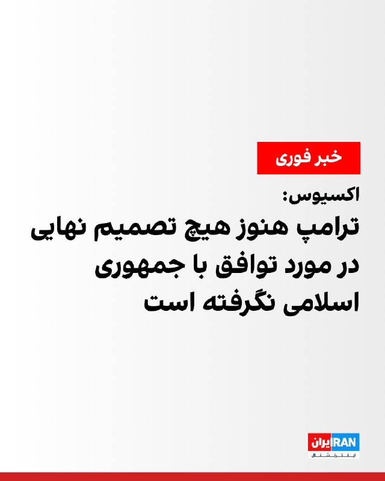

اکسیوس به نقل از یک مقام آمریکایی گزارش داد: «ترامپ هنوز هیچ تصمیم نهایی در مورد توافق با جمهوری اسلامی نگرفته است.»

اکسیوس نوشت که ترامپ و مشاورانش در مراحل قبلی جنگ نیز چندین بار تصور می‌کردند به توافق نزدیک شده‌اند، اما هیچ‌یک به نتیجه نرسید.
‌🏁 🇬🇧 IranintlTV

🤖 @VahidOOnLine

## VahidOOnLine — post 241786

  <a href="telegram/content/VahidOOnLine_241786_1779562147.mp4" target="_blank">🎬 Download video</a>

راهپیمایی ایرانیان برلین
‌🏁 🇬🇧 ManotoTV

🤖 @VahidOOnLine

## VahidOOnLine — post 241785

  <a href="telegram/content/VahidOOnLine_241785_1779562150.mp4" target="_blank">🎬 Download video</a>

تصاویر جاویدنامان انقلاب ملی در بوردو فرانسه، دوم خرداد ۱۴۰۵
‌🏁 🇬🇧 ManotoTV

🤖 @VahidOOnLine

## VahidOOnLine — post 241784

  <a href="telegram/content/VahidOOnLine_241784_1779562152.mp4" target="_blank">🎬 Download video</a>

تماسی از ایران؛
«من پر از بغضم از رفتن شما»
‌🏁 🇬🇧 ManotoTV

🤖 @VahidOOnLine

## VahidOOnLine — post 241783

  <a href="telegram/content/VahidOOnLine_241783_1779562154.mp4" target="_blank">🎬 Download video</a>

راهپیمایی ایرانیان استکهلم
‌🏁 🇬🇧 ManotoTV

🤖 @VahidOOnLine

## VahidOOnLine — post 241782

  <a href="telegram/content/VahidOOnLine_241782_1779562156.mp4" target="_blank">🎬 Download video</a>

راهپیمایی ایرانیان لاهه در هلند، دوم خرداد ۱۴۰۵
‌🏁 🇬🇧 ManotoTV

🤖 @VahidOOnLine

## VahidOOnLine — post 241781

  <a href="telegram/content/VahidOOnLine_241781_1779562158.mp4" target="_blank">🎬 Download video</a>

بر پایه گزارش‌ها ترامپ برای تماس گروهی با رهبران عربستان سعودی، امارات متحده عربی، مصر، قطر، اردن، پاکستان و ترکیه وارد اتاق بیضی کاخ سفید شده است. همزمان سناتور لیندسی گراهام به باراک راوید خبرنگار آکسیوس گفت برخی از رهبران منطقه از ترامپ خواسته‌اند به ایران حمله کند تا حکومت تضعیف شود و در نتیجه توافقی با شرایط بهتر به دست آید.
او در مقابل گفت برخی دیگر از رهبران منطقه و همچنین تعدادی از مشاوران ارشد رئیس‌جمهور از او خواسته‌اند همان توافقی را که روی میز است بپذیرد.
راوید در ادامه نوشته به گفته گراهام، این گروه معتقدند تنگه هرمز نمی‌تواند از نفوذ جمهوری‌اسلامی در امان باشد و اگر ایران هدف حمله قرار بگیرد، این توانایی را دارد که بخش قابل توجهی از عملیات نفتی خلیج فارس را نابود کند.
گراهام همچنین گفت: من به‌شدت تردید دارم که نتوان ایران را از تهدید تنگه هرمز بازداشت و نتوان منافع حیاتی منطقه را پس از حملات گسترده به ایران دفاع کرد؛ اگر واقعاً ایران به‌طور کامل نابود شده باشد، نباید بتواند هیچ‌کدام از این کارها را انجام دهد. زمان مشخص خواهد کرد. هنوز امیدوارم نتیجه خوبی به دست بیاید.
‌🏁 🇬🇧 ManotoTV

🤖 @VahidOOnLine

## VahidOOnLine — post 241780

  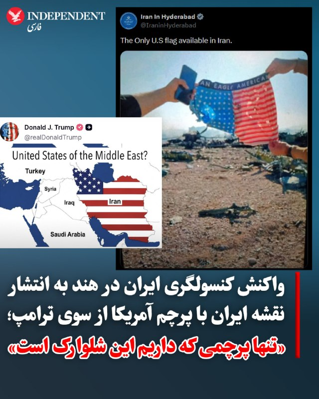

♦️ در واکنش به انتشار تصویری در حساب تروث‌سوشال ترامپ که در آن پرچم آمریکا روی سراسر ایران کشیده شده بود، کنسولگری جمهوری اسلامی در حیدرآباد هند، در نوشته‌ای طنزآمیز تصویر شلوارک کوتاهی که منقوش به پرجم آمریکا بود را منتشر کرد و نوشت: «تنها پرچم آمریکایی که داریم این است».

گفته می‌شود که این شلوارک مربوط به بقایای لوازم خلبان آمریکایی است که در ایران سقوط کرده بود. در آن زمان، نیروهای نظامی جمهوری اسلامی، پس از کشف لاشه هواپیمای سقوط کرده، تصاویری از این لوازم را منتشر کرده بودند.
‌🇸🇦 Indypersian

🤖 @VahidOOnLine

## VahidOOnLine — post 241779

  <a href="telegram/content/VahidOOnLine_241779_1779562160.mp4" target="_blank">🎬 Download video</a>

ویدیوهای رسیده به ایران‌اینترنشنال نشان می‌دهند گروهی از ایرانیان مقیم آلمان روز شنبه دوم خرداد، علیه اعدام‌های جمهوری اسلامی و در حمایت از شاهزاده رضا پهلوی، در شهر هانوفر تجمع کردند.
‌🏁 🇬🇧 IranintlTV

🤖 @VahidOOnLine

## VahidOOnLine — post 241778

  <a href="telegram/content/VahidOOnLine_241778_1779562163.mp4" target="_blank">🎬 Download video</a>

♦️سفارت ایالات متحده در کاراکاس، روز شنبه دوم خردادماه، با انتشار ویدیویی از برگزاری یک تمرین نظامی در محوطه سفارت خبر داد؛ تمرینی که با فرود دو هواپیمای عمودپرواز آمریکایی انجام شد.
در توضیحات منتشرشده آمده است که حفظ توان واکنش سریع نیروهای نظامی، بخشی کلیدی از آمادگی مhموریت‌های آمریکا در ونزوئلا و سایر نقاط جهان محسوب می‌شود. سفارت آمریکا همچنین اعلام کرد این اقدامات در چارچوب «برنامه سه‌مرحله‌ای» دولت دونالد ترامپ برای ونزوئلا دنبال می‌شود.
بر اساس گزارش‌ها، این رزمایش با هماهنگی مقام‌های ونزوئلا و با هدف آمادگی برای شرایط اضطراری و عملیات تخلیه احتمالی برگزار شده است.
‌🇸🇦 Indypersian

🤖 @VahidOOnLine

## VahidOOnLine — post 241777

  

♦️ یک مقام امنیتی پاکستان که در جریان جزئیات سفر فرمانده ارتش این کشور به تهران و دیدارهایش با مقامات جمهوری اسلامی قرار گرفته است، روز شنبه دوم خرداد، در گفتگو با رویترز اعلام کرد که «پیش‌نویس یک تفاهم‌نامه (MoU) برای پایان دادن به جنگ میان ایالات متحده و ایران در حال اصلاح و نهایی‌شدن است.»

این مقام امنیتی افزود که سفر فرمانده ارتش به تهران، «پیشرفت چشمگیری» در راستای محورهای تعیین‌شده در «مذاکرات اسلام‌آباد» برای پایان دادن به این جنگ به همراه داشته است. وی جزئیات بیشتری درباره محورهای دقیق گفتگوهای اسلام‌آباد ارائه نکرد.
‌🇸🇦 Indypersian

🤖 @VahidOOnLine

## VahidOOnLine — post 241776

  

امیرحسین ثابتی، نماینده مجلس، در تجمع شبانه حامیان حکومت با تاکید بر قطعی بودن وقوع مجدد جنگ نظامی گفت: «ممکن است یک ساعت دیگر باشد، ممکن است یک روز یا یک سال، اما قطعی است. حتی اگر آمریکا تمام شرایط ما را بپذیرد، امضا کند و تسلیم شود، باز هم جنگ خواهیم داشت.»
‌🏁 🇬🇧 IranintlTV

🤖 @VahidOOnLine

## WithYashar — post 12230

نخست‌وزیر اسرائیل، بنیامین نتانیاهو، به منظور بررسی آخرین تحولات مذاکرات با ایران، جلسه امنیتی محدودی برگزار خواهد کرد. یک منبع اسرائیلی در گفت‌وگو با سی‌ان‌ان این خبر را اعلام کرد.
@withyashar

## WithYashar — post 12229

کانال ۱۴ اسرائیل:چند منبع معتبر تأیید می‌کنند که ایران با برخی از درخواست‌های کلیدی ایالات متحده موافقت کرده است و کمتر از ۲۴ ساعت دیگر اعلام توافق انجام خواهد شد که به تهران چند ماه فرصت می‌دهد تا کاملاً تسلیم شود.
@withyashar

## WithYashar — post 12228

هم اکنون تماس تلفنی نتانیاهو و ترامپ! @withyashar

## WithYashar — post 12227

ترامپ با سران منطقه گفتگو کرد

آکسیوس:
ترامپ روز شنبه با رهبران عربستان سعودی، امارات متحده عربی، قطر، مصر، ترکیه و پاکستان تماس تلفنی داشت.

به گفته منبعی که از جزئیات این تماس مطلع شده، چند تن از این رهبران عرب از ترامپ خواستند که توافق را بپذیرد.
@withyashar

## WithYashar — post 12226

هم اکنون تماس تلفنی نتانیاهو و ترامپ!
@withyashar

## WithYashar — post 12225

## WithYashar — post 12224

هم اکنون جلسه اضطراری امنیت ملی دولت ترامپ در اتاق جنگ کاخ سفید در حال برگزاری است.
@withyashar

## WithYashar — post 12223

## WithYashar — post 12222

به گفته یک مقام آمریکایی که توسط اکسیوس نقل شده است، دونالد ترامپ هنوز تصمیم نهایی خود را در مورد این توافق نگرفته است
@withyashar

## WithYashar — post 12221

من که میدونیم ترامپ کار رو در میاره ولی این رسمش‌ نبود که این کارا رو با ما بکنه 😂
@withyashar

## WithYashar — post 12220

الحدث به نقل از یک منبع عالی‌رتبه: تنها ساعات کمی تا اعلام توافق بین آمریکا و ایران فاصله است
@withyashar

## WithYashar — post 12219

معاون رئیس‌جمهور ونس به کاخ سفید رسید
۱ دقیقه تا تماس تصویری ترامپ با شیوخ کشور های خلیج فارس
@withyashar

## WithYashar — post 12218

## WithYashar — post 12217

یاشار جان خسته نباشی
تو ویس های آخرت احساس ناامیدی کردم والا تو ماشین نشستم گریه میکنم
ما به امید شما امیدواریم
من پدرام مادرم بالای ۸۰ دارن و مریضن و من دیگه نمیتونم برم ایران ببینمشون
به امید ویس و تحلیل های شما تا حالا گذروندم
✌🏼💔

## WithYashar — post 12216

  <a href="telegram/content/WithYashar_12216_1779562166.mp4" target="_blank">🎬 Download video</a>

وزیر جنگ پیتر هگستث: اولین حمله هوایی که هرگز انجام دادم و یک دسته را در وسط شب در بغداد رهبری کردم. ما ۳۶ ساعت برای آماده‌سازی داشتیم و من هر دقیقه از آن ۳۶ ساعت را صرف آماده‌سازی کردم.

وقتی خلبان‌ها ما را چند صد متر در نقطه اشتباهی در وسط یک زمین گل‌آلود فرود آوردند و GPS کار نمی‌کرد.
یک مرد بود که آن دسته به او نگاه می‌کردند و آن مرد من بودم.
@withyashar

## WithYashar — post 12215

## mwarmonitor — post 9572

  <a href="telegram/content/mwarmonitor_9572_1779562169.mp4" target="_blank">🎬 Download video</a>

✈️پرواز جنگنده‌های آمریکایی بر فراز آسمان منطقه خلیفان در استان اربیل، در شمال عراق.

@mwarmonitor

## mwarmonitor — post 9570

🔴 آکسیوس به نقل از یک منبع مطلع: چند تن از رهبران در جریان تماس تلفنی از ترامپ خواسته‌اند که توافق را بپذیرد.

📌 معاون رئیس‌جمهور از اوهایو و وزیر جنگ از نیویورک به واشنگتن فراخوانده شده‌اند تا برای یک نشست درباره توافق حضور پیدا کنند.

@mwarmonitor

## mwarmonitor — post 9569

🔴ایالات متحده و ایران در آستانه توافقی برای پایان دادن به جنگ؛ یک مقام مسئول خبر داد 📝باراک راوید AXIOS 🔰یک مقام آمریکایی که در جریان مذاکرات قرار گرفته است، روز شنبه اعلام کرد که دولت ترامپ و ایران به توافقی برای پایان دادن به جنگ نزدیک شده‌اند و اختلافات…

## mwarmonitor — post 9568

🔴ایالات متحده و ایران در آستانه توافقی برای پایان دادن به جنگ؛ یک مقام مسئول خبر داد

📝باراک راوید AXIOS

🔰یک مقام آمریکایی که در جریان مذاکرات قرار گرفته است، روز شنبه اعلام کرد که دولت ترامپ و ایران به توافقی برای پایان دادن به جنگ نزدیک شده‌اند و اختلافات باقی‌مانده عمدتاً بر سر «لحن و عبارات» چند بند متمرکز است.

🔹چرا این موضوع اهمیت دارد؟
این اتفاق یکی از قوی‌ترین نشانه‌ها تا به امروز است که نشان می‌دهد این جنگِ تقریباً سه ماهه، ممکن است به پایان خود نزدیک شده باشد.

🔸نکات کلیدی
این مقام مسئول تاکید کرد که هنوز هیچ تصمیم نهایی از سوی پرزیدنت ترامپ در خصوص این توافق اتخاذ نشده است.

📌ارزیابی واقع‌بینانه: ترامپ و مشاورانش در مراحل قبلی این جنگ نیز چندین بار تصور می‌کردند که به توافق نزدیک شده‌اند، اما در نهایت هیچ‌کدام از آن‌ها به نتیجه نرسید.

@mwarmonitor

## mwarmonitor — post 9567

🚨 یک مقام آمریکایی مطلع از مذاکرات به من گفت دولت ترامپ و ایران به توافقی برای پایان دادن به جنگ نزدیک شده‌اند و اشاره کرد که اختلافات باقی‌مانده بیشتر بر سر «نحوه بیان» چند بند است. باراک راوید

@mwarmonitor

## mwarmonitor — post 9566

🔴سناتور لیندسی گراهام ؛ اگر توافقی برای پایان دادن به درگیری ایران حاصل شود، به این دلیل که باور بر این است که تنگه هرمز نمی‌تواند از «تروریسم ایران» محافظت شود و ایران همچنان توانایی نابود کردن زیرساخت‌های اصلی نفتی خلیج فارس را دارد، در این صورت ایران به‌عنوان یک قدرت مسلط تلقی خواهد شد که نیازمند یک راه‌حل دیپلماتیک است.

🔹این ترکیب از این تصور که ایران توانایی تهدید دائمی تنگه هرمز را دارد و همچنین توانایی وارد کردن خسارت گسترده به زیرساخت‌های نفتی خلیج فارس، یک تغییر مهم در توازن قدرت در منطقه محسوب می‌شود و در طول زمان می‌تواند برای اسرائیل یک کابوس باشد.

🔸همچنین این سؤال را ایجاد می‌کند که اگر این برداشت‌ها درست باشد، اصلاً چرا این جنگ آغاز شد؟ شخصاً من نسبت به این ایده که ایران را نمی‌توان از توانایی تهدید تنگه هرمز محروم کرد و اینکه منطقه قادر به محافظت از خود در برابر توان نظامی ایران نیست، تردید دارم.

🔸مهم است که در این مورد به نتیجه‌گیری درستی برسیم.

@mwarmonitor

## mwarmonitor — post 9565

🔴کان نیوز: اسرائیل سطح آماده‌باش بالایی را که در طول تعطیلات به دلیل نگرانی از احتمال حمله به ایران برقرار کرده بود، کاهش داده است. در این مرحله، مقام‌های اسرائیلی از هیچ حمله احتمالی آمریکا به ایران اطلاع ندارند.

@mwarmonitor

## mwarmonitor — post 9564

  

✈️در حال حاضر تعداد قابل توجهی پرواز خروجی از خاورمیانه در جریان است. در حالی که در حال حاضر هیچ پرواز ورودیِ قابل ردیابی (که سیگنال ترنسپاندر فعال داشته باشد) دیده نمی‌شود، به جز شاید MOOSE56. MOOSE48 و MOOSE58 (هر دو در شرق امارات متحده عربی به نظر می‌رسد)…

## mwarmonitor — post 9563

  

✈️در حال حاضر تعداد قابل توجهی پرواز خروجی از خاورمیانه در جریان است. در حالی که در حال حاضر هیچ پرواز ورودیِ قابل ردیابی (که سیگنال ترنسپاندر فعال داشته باشد) دیده نمی‌شود، به جز شاید MOOSE56.

MOOSE48 و MOOSE58 (هر دو در شرق امارات متحده عربی به نظر می‌رسد) نیز در حال ترک منطقه هستند، اما اختلال در سیگنال‌ها (spoofing) شدید شده است.

بوئینگ C-17A گلوب‌مستر III:

RCH643 - 10-0218
RCH542 - 06-6158
RCH445 - 08-8195
MOOSE53 - 06-6164
MOOSE42 - 01-0191
MOOSE57 - 06-6168
MOOSE56 - 00-0177
MOOSE48 - 07-7170
MOOSE58 - 07-7174
بوئینگ KC-135R استراتوتانکر:
NA - 63-8028
NA - 62-3552

@mwarmonitor

## FoxNewsTwitter — post 342167

‌Fox News (Twitter/X)

Read more:

## FoxNewsTwitter — post 342166

  

Fox News (Twitter/X)

BREAKING NEWS: The U.S. Embassy in Kyiv issued a security alert Saturday warning of a “potentially significant air attack” that could strike the Ukrainian capital within the next 24 hours.

## FoxNewsTwitter — post 342165

  

Fox News (Twitter/X)

RT @foxnewspolitics: Nine minutes after the AG announced murder charges against Raúl Castro, a pre-produced rapid-response campaign launched across multiple U.S. organizations defending the Cuban dictator. @FoxNews Digital's @AsraNomani reports DOJ and Treasury investigators probe whether that synchronized activation reveals a foreign influence operation directed by Havana — with 145 nonprofits with $1 billion in combined revenue under scrutiny.

## pm_afshaa — post 91307

🔴کانال 14 اسرائیل: چند منبع معتبر تأیید می‌کنند که ایران با برخی از درخواست‌های کلیدی ایالات متحده موافقت کرده است و کمتر از 24 ساعت دیگر اعلام توافق انجام خواهد شد که به تهران چند ماه فرصت می‌دهد تا کاملاً تسلیم شود

💧 Rainbet.com the #1 Non-KYC Crypto Casino & Sportsbook @rainbetcom

😁 @Pm_Afshaa

## pm_afshaa — post 91306

🔴آکسیوس : گزارش‌ها حاکی از آن است که دولت ترامپ و ایران به توافق برای پایان جنگ نزدیک شده‌اند و اختلافات باقی‌مانده بیشتر بر سر نحوه نگارش برخی بندهاست

💧 Rainbet.com the #1 Non-KYC Crypto Casino & Sportsbook @rainbetcom

😁 @Pm_Afshaa

## pm_afshaa — post 91305

🔴هم اکنون جلسه اضطراری امنیت ملی دولت ترامپ در اتاق جنگ کاخ سفید در حال برگزاریه

💧 Rainbet.com the #1 Non-KYC Crypto Casino & Sportsbook @rainbetcom

😁 @Pm_Afshaa

## pm_afshaa — post 91304

🔴مقامات ارشد در اسرائیل: ویتکاف تلاش می‌کند به هر قیمتی توافقی با ایران به دست آورد، او کسی است که به ترامپ فشار می‌آورد تا به جنگ بازنگردد

💧 Rainbet.com the #1 Non-KYC Crypto Casino & Sportsbook @rainbetcom

😁 @Pm_Afshaa

## pm_afshaa — post 91303

🔴کانال 13 اسرائیل:نیروهای دفاعی اسرائیل در حالت آماده‌باش کامل به‌دلیل احتمال شکست مذاکرات و از سرگیری درگیری‌ها هستن

💧 Rainbet.com the #1 Non-KYC Crypto Casino & Sportsbook @rainbetcom

😁 @Pm_Afshaa

## DEJradio — post 4888

  <a href="telegram/content/DEJradio_4888_1779562174.mp4" target="_blank">🎬 Download video</a>

🚨
🔸 خبر ۲۱
شنبه ۲ خرداد ۱۴۰۵

#خبر۲۱
@DEJradio

## VahidOnline — post 75658

  

شبکه ۱۳ اسرائیل در گزارشی از روند گفت‌وگوهای ایران و آمریکا گفت مقام‌های اسرائیلی معتقدند ایالات متحده و ایران به دستیابی به توافق احتمالی نزدیک‌تر شده‌اند و گزارش‌های اخیر و اطلاعاتی که دریافت می‌شود، «در اورشلیم به‌طور فزاینده‌ای معتبر تلقی می‌شود».

بر اساس گزارش این شبکه، مقام‌های ارشد اسرائیلی گفته‌اند پیشرفت در مذاکرات برای بخشی از نهاد امنیتی اسرائیل «بسیار ناامیدکننده» است، به‌ویژه در شرایطی که به نظر می‌رسد تلاش واشینگتن برای رسیدن به توافق در حال تشدید شدن است.

این مقام‌ها همچنین معتقدند فشار برخی مشاوران رئیس‌جمهور ترامپ در روزهای اخیر افزایش یافته و انتظار می‌رود بنیامین نتانیاهو، نخست‌وزیر اسرائیل، در پی این تحولات، نشست‌هایی مشورتی با وزیران ارشد و مقام‌های امنیتی برگزار کند.
نهادها و مقامات رسمی اسرائیل هنوز این گزارش را رد یا تأیید نکرده‌اند.

ارزیابی اسرائیل در دو هفتهٔ گذشته این بود که ترامپ خواهان توافق است، اما در نهایت به دلیل اختلاف بر سر مسائل کلیدی، موفق به دستیابی به آن نخواهد شد. با این حال، مقام‌های اسرائیلی اکنون معتقدند روند کنونی ظاهراً برخلاف چیزی است که اسرائیل در هفته‌های اخیر برای آن تلاش کرده بود.

این گزارش همچنین می‌گوید چارچوبی که دربارهٔ آن گفت‌وگو می‌شود، شامل یک توافق موقت ۶۰ روزه خواهد بود که ممکن است بعداً در حالی که مذاکرات درباره توافقی گسترده‌تر ادامه دارد، تمدید شود.

روز شنبه مقامات ایران و آمریکا و همچنین پاکستان که نقش میانجی را بین دو طرف بر عهده دارد، اعلام کردند که در مذاکرات برای پایان دادن به جنگ پیشرفت حاصل شده است.

روز شنبه، روزنامه اسرائیل هیوم نیز در گزارشی ادعا کرد پیش‌نویس توافقی که روی میز قرار دارد، شامل تعهد اولیه ایران به خودداری از توسعه سلاح هسته‌ای و تعلیق بلندمدت غنی‌سازی اورانیوم است و سایر مسائل، از جمله سرنوشت ذخایر کنونی اورانیوم غنی‌شده ایران، در مذاکرات بعدی در دورهٔ آتش‌بس بررسی خواهد شد.

این روزنامه همچنین به‌نقل از منابع آگاه که نام‌شان را نیاورده، ادعا کرد «رهبری سیاسی ایران پیش‌تر با تحویل اورانیوم غنی‌شده موافقت کرده بود، اما فرماندهان سپاه پاسداران با این اقدام مخالفت کردند و تصمیم‌گیری دربارهٔ این موضوع اکنون به تأیید رهبر جمهوری اسلامی بستگی دارد».
@VahidHeadline

📡 @VahidOnline

## kianmeli1 — post 87611

  

🔴خلاصه تمام خبرهای امروز

آمریکا و ایران به توافق برای پایان دادن به جنگ نزدیک شده‌اند و اختلافات باقی‌مانده بر سر نحوه نگارش چندین نکته کلیدی است - اکسیوس

ممکن است ظرف ۲۴ ساعت آینده توافق صلح اعلام شود.

انتظار می‌رود ترامپ امشب با نتانیاهو در مورد توافق مورد انتظار با ایران صحبت کند، اگرچه به احتمال زیاد نتانیاهو تلاش خواهد کرد ترامپ را متقاعد کند که به جای آن به ایران حمله کند.
https://t.me/kianmeli1

## kianmeli1 — post 87610

🔴گزارش رویترز:

طرح پیشنهادی توافق بین ایران و آمریکا قرار است در سه مرحله پیش برود - پایان رسمی جنگ، حل بحران تنگه هرمز و باز شدن پنجره زمانی 30 روزه برای مذاکره درباره توافقی گسترده‌تر، البته با امکان تمدید مدت زمانی
https://t.me/kianmeli1

## kianmeli1 — post 87609

‏🔴سلمان اسحاقی، سخنگوی کمیسیون بهداشت مجلس، گفت: کشور با کمبود نزدیک به هزار قلم دارو روبه‌رو است
https://t.me/kianmeli1

## kianmeli1 — post 87608

🔴هم اکنون جلسه اضطراری امنیت ملی دولت ترامپ در اتاق جنگ کاخ سفید در حال برگزاری است
https://t.me/kianmeli1

## kianmeli1 — post 87607

🔴آکسیوس: طبق گفته یک منبع مطلع ترامپ قرار است امشب با نتانیاهو گفتگو کند تا درباره توافق در حال شکل‌گیری با ایران بحث کنند.
https://t.me/kianmeli1

## kianmeli1 — post 87606

🔴به گزارش خبرگزاری دولتی عربستان سعودی، العربیه، به نقل از یک منبع ارشد: «چند ساعت تا اعلام توافق بین ایران و ایالات متحده فاصله داریم.»
https://t.me/kianmeli1

## kianmeli1 — post 87605

  

🔴آتش بس ۶۰ روزه پیروزی ایران است / مارک دوبوویتز، مدیر اندیشکده مهم FDD:

اگر رئیس جمهور ترامپ بر اساس وعده‌های مبهم ایران برای «بحث» در مورد مسائل هسته‌ای، با تمدید آتش‌بس ۶۰ روزه موافقت کند، بازی تمام است. این امر بحران را به اواخر ژوئیه یا اوایل اوت سوق می‌دهد، زمانی که احتمال عملیات نظامی عمده پیش از انتخابات میان‌دوره‌ای بسیار کمتر می‌شود.

هنگامی که اهرم نظامی از بین برود، امتیازات هسته‌ای معنادار نیز با آن از بین می‌روند. محدودیت‌های موشک‌های بالستیک وجود نخواهد داشت. ایران میلیاردها دلار از تخفیف تحریم‌ها دریافت خواهد کرد - در حالی که بارها از تنگه هرمز به عنوان ابزاری برای باج‌گیری استفاده می‌کند.

تهران آنچه را که در میدان نبرد از دست داده بود، در میز مذاکره به دست آورده است.
https://t.me/kianmeli1

## kianmeli1 — post 87604

  <a href="telegram/content/kianmeli1_87604_1779562180.mp4" target="_blank">🎬 Download video</a>

🔴وضعیت امشب یکی از میادین مملکت

کشور دست مداحان است نه سرداران
https://t.me/kianmeli1

## kianmeli1 — post 87603

🔴یک شب قبل کشتن خامنه ای خبر توافق تیتر تمام خبرگزاری ها بود

دقیقا مشخص نیست آیا توافق واقعی است یا خیر
https://t.me/kianmeli1

## kianmeli1 — post 87602

‏🔴الحدث به نقل از یک «منبع عالی‌رنبه» نوشت: «تنها چند ساعت تا اعلام توافق بین واشینگتن و تهران فاصله داریم»
https://t.me/kianmeli1

## kianmeli1 — post 87601

  <a href="telegram/content/kianmeli1_87601_1779562182.mp4" target="_blank">🎬 Download video</a>

🔴نیروهای واکنش سریع آمریکا برای مقابله با نیروهای نیابتی ایران به خاورمیانه اعزام می‌شوند

پیت هگست:

ما از نیروهای هوابرد و واکنش سریع خود خواسته‌ایم که در هر لحظه آماده اعزام به خاورمیانه باشند؛ تا همچون سپری آهنین از پایگاه‌ها و جان آمریکایی‌ها در برابر نیروهای نیابتی ایران محافظت کنند.

این شامل یگان‌های ارتش آمریکا می‌شود که با استفاده از سامانه‌های هیمارس (HIMARS) برای غرق کردن نیروی دریایی ایران کمک می‌کنند.

من می‌دانم که ارتش عاشق غرق کردن نیروهای دریایی است. این تنها نیروی دریایی است که در حال حاضر اجازه دارید غرق کنید.
https://t.me/kianmeli1

## kianmeli1 — post 87600

  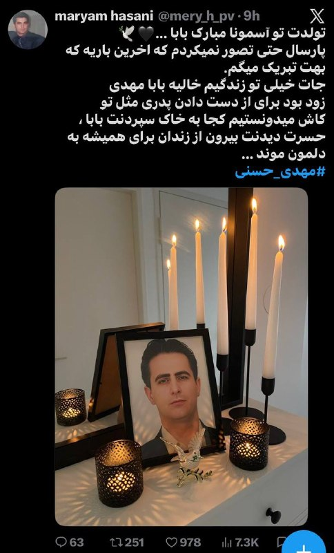

🔴دوم خرداد سالروز تولد مهدی حسنی که توسط جمهوری اسلامی اعدام شد

به مهدی حسنی در زندان گفته بودند اگر اعتراف نکنی به پسر کوچکت تجاوز میکنیم
https://t.me/kianmeli1

## kianmeli1 — post 87599

  <a href="telegram/content/kianmeli1_87599_1779562185.mp4" target="_blank">🎬 Download video</a>

🔴پاسخ به صدای دانش‌آموزان: باتوم و اشک‌آور!

دانش‌آموزان خرم‌آباد در اعتراض به شرایط آموزشی و اختلالات گسترده، مقابل آموزش‌وپرورش تجمع کردند.
آن‌ها از کیفیت پایین آموزش، اینترنت ضعیف و بی‌عدالتی در امتحانات گلایه داشتند.
این تجمع با برخورد نیروهای امنیتی و استفاده از گاز اشک‌آور و باتوم به تنش کشیده شد.
https://t.me/kianmeli1

## kianmeli1 — post 87598

  <a href="telegram/content/kianmeli1_87598_1779562186.mp4" target="_blank">🎬 Download video</a>

🔴ثابتی: جنگ نظامی مجدد قطعی است حتی اگر آمریکا تسلیم شود

امیرحسین ثابتی نماینده تهران در تجمعات شبانه مردم امشب (۲ خرداد) با تأکید بر قطعی بودن وقوع مجدد جنگ نظامی گفت: ممکن است یک ساعت دیگر باشد، ممکن است یک روز یا یک سال، اما قطعاً قطعی است.

وی افزود: حتی اگر آمریکا تمام شرایط ما را بپذیرد امضا کند و تسلیم شود، باز هم جنگ خواهیم داشت.

ثابتی تأکید کرد: حتی اگر تیتر همه رسانه‌های غربی درباره نزدیک بودن مذاکره و توافق درست باشد، من بازگشت جنگ را تضمین می‌کنم.
https://t.me/kianmeli1

## IranIntlTV — post 338647

  

اکسیوس به نقل از یک مقام آمریکایی گزارش داد: «ترامپ هنوز هیچ تصمیم نهایی در مورد توافق با جمهوری اسلامی نگرفته است.»

اکسیوس نوشت که ترامپ و مشاورانش در مراحل قبلی جنگ نیز چندین بار تصور می‌کردند به توافق نزدیک شده‌اند، اما هیچ‌یک به نتیجه نرسید.
https://iranintl.com/202605230532

## IranIntlTV — post 338646

  

🔻مهدی تاج، رییس فدراسیون فوتبال، خبر داد کمپ تیم ملی فوتبال از آریزونای آمریکا به کمپی در شهر تیخوانا مکزیک منتقل شده است.

🔹او به سایت فدراسیون فوتبال گفت: «با این تغییر، مساله ویزا تا اندازه زیادی حل می‌شود. می‌توانیم با پرواز ایران‌ایر به مکزیک برویم و برگشت هم از همان‌جا بیاییم.»

🔹تیخوانا شهری مرزی در شمال غربی مکزیک، در ایالت باخا کالیفرنیا، است و در نزدیکی مرز ایالات متحده و شهر سن‌دیگو قرار دارد.

🔹رسانه‌های ایران امروز گزارش دادند سفارت آمریکا در آنکارا برای تعدادی از بازیکنان تیم ملی، از جمله مهدی طارمی، شجاع خلیل‌زاده و احسان حاج‌صفی، ویزا صادر نکرده است.

🔹از سوی دیگر، فدراسیون فوتبال اصرار دارد با پرواز ایران‌ایر به آمریکا سفر کند؛ تصمیمی که با توجه به تحریم‌های این شرکت هواپیمایی، امکان‌پذیر نیست.

🔹مهدی تاج توضیحی نداد که تکلیف ویزای ورود به آمریکا برای برگزاری مسابقات تیم ملی چه می‌شود.

🔹از سوی دیگر به نظر می‌رسد این تصمیم فدراسیون فوتبال برای دور ماندن تیم ملی از تقابل با ایرانیان مقیم آمریکا باشد.

@iranintltvsport

## IranIntlTV — post 338645

دانش‌آموزان در ایران در مناطق مختلف کشور در اعتراض به وضع موجود آموزشی تجمع کردند. آن‌ها به وضعیت بلاتکلیف آموزشی، فشارهای معیشتی و تصمیم مسئولان درباره امتحانات نهایی اعتراض کردند.

گفت‌وگو با مهرداد قاسمفر، روزنامه‌نگار و تحلیل‌گر مسائل ایران
@iranintltv

## IranIntlTV — post 338644

  <a href="telegram/content/IranIntlTV_338644_1779562190.mp4" target="_blank">🎬 Download video</a>

ویدیوهای رسیده به ایران‌اینترنشنال نشان می‌دهند گروهی از ایرانیان مقیم آلمان روز شنبه دوم خرداد، علیه اعدام‌های جمهوری اسلامی و در حمایت از شاهزاده رضا پهلوی، در شهر هانوفر تجمع کردند.

## IranIntlTV — post 338643

  <a href="telegram/content/IranIntlTV_338643_1779562194.mp4" target="_blank">🎬 Download video</a>

مهدی مهدوی‌آزاد در برنامه «چشم‌انداز» می‌گوید علی خامنه‌ای در خاطراتش به‌صراحت از تاثیرپذیری خود از سید قطب و نواب صفوی گفته است؛ افرادی که به گفته او در شکل‌گیری جریان‌های اسلام‌گرای رادیکال نقش داشتند. مهدوی‌آزاد در ادامه می‌گوید بر اساس برخی منابع آمریکایی، مجتبی خامنه‌ای نیز در نگاه سیاسی خود تحت تاثیر اسامه بن‌لادن قرار دارد.
@iranintltv

## IranIntlTV — post 338642

  

امیرحسین ثابتی، نماینده مجلس، در تجمع شبانه حامیان حکومت با تاکید بر قطعی بودن وقوع مجدد جنگ نظامی گفت: «ممکن است یک ساعت دیگر باشد، ممکن است یک روز یا یک سال، اما قطعی است. حتی اگر آمریکا تمام شرایط ما را بپذیرد، امضا کند و تسلیم شود، باز هم جنگ خواهیم داشت.»
https://iranintl.com/202605233406

## IranIntlTV — post 338641

گرچه در ساعات گذشته بحث توافق اولیه یا تمدید آتش‌بس بین جمهوری اسلامی و آمریکا مطرح شده، اما آن‌‌طور که سی‌بی‌اس گزارش داده، ارتش و نهادهای اطلاعاتی آمریکا برنامه حمله احتمالی به ایران را آماده و این برنامه را به دونالد ترامپ هم ارائه کرده‌اند. برنامه‌ای که شامل اهداف مختلفی در داخل ایران می‌شود. براساس گزارش‌ها، بسیاری از مقام‌های ارشد اطلاعاتی و نظامی آمریکا هم برنامه‌های آخر هفته‌ خود را تغییر داده و مرخصی‌های‌شان را لغو کرده‌اند.

@iranintltv

## ManotoTV — post 105780

  <a href="telegram/content/ManotoTV_105780_1779562197.mp4" target="_blank">🎬 Download video</a>

راهپیمایی ایرانیان برلین

## ManotoTV — post 105779

  <a href="telegram/content/ManotoTV_105779_1779562199.mp4" target="_blank">🎬 Download video</a>

تصاویر جاویدنامان انقلاب ملی در بوردو فرانسه، دوم خرداد ۱۴۰۵

## ManotoTV — post 105778

  

به دنبال اعلام توقف پخش ماهواری‌ای و کانال یوتیوب منوتو، شماری از بینندگان با ارسال پیام‌هایی، از سال‌ها فعالیت منوتو و همراهی آن با مخاطبان قدردانی کردند.
یکی از بینندگان در پیام خود نوشته است:
«راستش هنوز باورم نمی‌شود که داریم درباره پایان منوتو صحبت می‌کنیم. من به عنوان نسلی که با منوتو بزرگ شد، بخشی از خاطرات زندگی‌ام با منوتو ورق خورد.»

در پیام دیگری آمده است:
«شما فقط یک شبکه نبودید، نوری بودید در میان سایه تیره فراموشی و وارونه‌نمایی حقیقت.»

## ManotoTV — post 105777

  <a href="telegram/content/ManotoTV_105777_1779562202.mp4" target="_blank">🎬 Download video</a>

تماسی از ایران؛
«من پر از بغضم از رفتن شما»

## ManotoTV — post 105776

  <a href="telegram/content/ManotoTV_105776_1779562204.mp4" target="_blank">🎬 Download video</a>

راهپیمایی ایرانیان استکهلم

## ManotoTV — post 105775

  <a href="telegram/content/ManotoTV_105775_1779562206.mp4" target="_blank">🎬 Download video</a>

راهپیمایی ایرانیان لاهه در هلند، دوم خرداد ۱۴۰۵

## ManotoTV — post 105774

  <a href="telegram/content/ManotoTV_105774_1779562209.mp4" target="_blank">🎬 Download video</a>

بر پایه گزارش‌ها ترامپ برای تماس گروهی با رهبران عربستان سعودی، امارات متحده عربی، مصر، قطر، اردن، پاکستان و ترکیه وارد اتاق بیضی کاخ سفید شده است. همزمان سناتور لیندسی گراهام به باراک راوید خبرنگار آکسیوس گفت برخی از رهبران منطقه از ترامپ خواسته‌اند به ایران حمله کند تا حکومت تضعیف شود و در نتیجه توافقی با شرایط بهتر به دست آید.
او در مقابل گفت برخی دیگر از رهبران منطقه و همچنین تعدادی از مشاوران ارشد رئیس‌جمهور از او خواسته‌اند همان توافقی را که روی میز است بپذیرد.
راوید در ادامه نوشته به گفته گراهام، این گروه معتقدند تنگه هرمز نمی‌تواند از نفوذ جمهوری‌اسلامی در امان باشد و اگر ایران هدف حمله قرار بگیرد، این توانایی را دارد که بخش قابل توجهی از عملیات نفتی خلیج فارس را نابود کند.
گراهام همچنین گفت: من به‌شدت تردید دارم که نتوان ایران را از تهدید تنگه هرمز بازداشت و نتوان منافع حیاتی منطقه را پس از حملات گسترده به ایران دفاع کرد؛ اگر واقعاً ایران به‌طور کامل نابود شده باشد، نباید بتواند هیچ‌کدام از این کارها را انجام دهد. زمان مشخص خواهد کرد. هنوز امیدوارم نتیجه خوبی به دست بیاید.

## FarsiVOA — post 218466

روزنامه دنیای اقتصاد در گزارشی از همایش «چشم‌انداز اقتصاد ایران ۱۴۰۵» تصویری نگران‌کننده از اقتصاد ایران ترسیم کرده است؛ تصویری که در آن تورم، بیکاری، رکود سرمایه‌گذاری، و کاهش رفاه خانوارها به مرحله‌ای خطرناک‌تر رسیده‌اند.

مسعود نیلی، اقتصاددان، در این همایش هشدار داده اقتصاد ایران از وضعیت «بحران مزمن» وارد مرحله «بروز آشکار بحران‌ها» شده و اگر سازوکارهای شکل‌گیری این بحران‌ها درست شناخته نشود، هزینه‌های سنگین‌تری در آینده تحمیل خواهد شد. او با اشاره به آمار مرکز آمار گفته تورم کالاها از ۱۰۰ درصد گذشته و شرایط تورمی ایران به‌سادگی به وضعیت نرمال بازنخواهد گشت.

گزارش کامل را در وب‌سایت صدای آمریکا بخوانید.

@FarsiVOA

## FarsiVOA — post 218465

اروپا در مسیر بدون بازگشت؛ حرکت به سوی پایان وابستگی به انرژی روسیه

## FarsiVOA — post 218464

در گفت‌وگو با کیانوش رزاقی، وکیل مهاجرت در مریلند، به تصمیم جدید دولت پرزیدنت ترامپ درباره الزام ثبت درخواست گرین کارت از خارج خاک آمریکا پرداختیم و پیامدهای حقوقی و عملی آن را برای دانشجویان، نیروهای متخصص و متقاضیانی که با محدودیت‌های کنسولی در کشور خود روبه‌رو هستند بررسی کردیم.

## FarsiVOA — post 218460

اسپیس‌ایکس اعلام کرد «استارشیپ وی۳»، برای نخستین بار به پرواز درآمده است.

استارشیپ بزرگ‌ترین و قدرتمندترین فضاپیمای ساخته‌شده توسط اسپیس‌ایکس است.

@FarsiVOA

## DW_Farsi — post 125063

  <a href="telegram/content/DW_Farsi_125063_1779562209.mp4" target="_blank">🎬 Download video</a>

🎥 اعتراض دانش‌آموزان در ایران به حضوری شدن امتحانات

ویدیوهایی در شبکه‌های اجتماعی، تجمع گروهی از دانش‌آموزان در چند شهر ایران را در روز شنبه، دوم خرداد ماه نشان می‌دهد. آنها به احتمال برگزاری حضوری امتحانات اعتراض دارند و می‌گویند ماه‌ها آموزش غیرحضوری، اختلال اینترنت و شرایط جنگی، روند یادگیری‌شان را مختل کرده است.

@dw_farsi

## DW_Farsi — post 125062

🔶 ترامپ قصد دارد با چند تن از رهبران خاورمیانه تلفنی گفت‌وگو کند

به گفته یک منبع آگاه، دونالد ترامپ، رئیس جمهور آمریکا، قصد دارد با چند تن از سران کشورها و دولت‌های منطقه خاورمیانه تلفنی گفت‌وگو کند.

یک مقام دولتی عرب به خبرگزاری رویترز گفت که قرار است این تماس‌ها با رهبران عربستان سعودی، قطر، امارات متحده عربی، مصر، ترکیه و پاکستان انجام شود.

بر اساس یک گزارش رسانه‌ای، دونالد ترامپ احتمال دستیابی به یک توافق احتمالی، و از نگاه آمریکا "خوب"، در جنگ ایران را "پنجاه به پنجاه" ارزیابی کرده است.

پرتال اکسیوس همچنین از قول رئیس جمهور آمریکا نوشت: «فکر می‌کنم یکی از این دو اتفاق خواهد افتاد: یا آنها را شدیدتر از هر زمان دیگری هدف قرار خواهم داد، یا یک توافق خوب امضا خواهیم کرد.»

اکسیوس همچنین به نقل از این گفت‌وگو گزارش داد که ترامپ قرار است همین روز شنبه با استیو ویتکاف و جرد کوشنر، مذاکره‌کنندگان خود، دیدار کند تا پیشنهاد تازه جمهوری اسلامی را بررسی کند.

در ادامه این گزارش آمده است که ترامپ احتمالا تا روز یکشنبه تصمیم خواهد گرفت که آیا جنگ از سر گرفته خواهد شد یا نه.

@dw_farsi

## DW_Farsi — post 125061

🔶 بقائی: چارچوب مذاکرات ایران و آمریکا تقریبا نهایی شده است

به گفته مقام‌های جمهوری اسلامی، چارچوب ادامه گفت‌وگوها میان تهران و واشنگتن در آستانه نهایی شدن است.

با این حال، به گفته اسماعیل بقائی، سخنگوی وزارت امور خارجه جمهوری اسلامی، اینکه در پایان توافقی حاصل شود، هم "بسیار نزدیک" است و هم "بسیار دور".

او در تلویزیون دولتی گفت: «در حال حاضر در مرحله نهایی تدوین یک یادداشت تفاهم هستیم.»

بر اساس گزارش‌های همسو در رسانه‌های آمریکایی، واشنگتن و تهران با میانجی‌گری طرف‌های واسطه در حال کار بر روی یک یادداشت تفاهم ۱۴ ماده‌ای هستند. این سند قرار است چارچوبی برای مذاکرات ایجاد کند و به طور رسمی به جنگ پایان دهد.

بقائی اکنون گفت محور این یادداشت تفاهم، پایان دادن به جنگ، لغو محاصره آمریکایی در تنگه هرمز و نیز آزادسازی کلی دارایی‌های مسدودشده ایران در خارج از کشور است.

به گفته بقائی، قرار است در ۳۰ تا ۶۰ روز آینده، در چارچوب همین یادداشت تفاهم ۱۴ ماده‌ای، جزئیات بیشتری مذاکره شود تا در نهایت توافقی نهایی حاصل شود.

بر این اساس، اختلاف بر سر برنامه هسته‌ای جمهوری اسلامی و نیز روند فنی لغو تحریم‌های اعمال‌شده علیه تهران و آزادسازی حساب‌های ایرانی در خارج از کشور نیز در همین مرحله بررسی خواهد شد.

او افزود که آمریکا در جریان روند مذاکرات تا کنون چند بار مواضعی متناقض اتخاذ کرده و دیدگاه‌های خود را تغییر داده است. به همین دلیل، تهران نمی‌تواند مطمئن باشد که این وضعیت بار دیگر تکرار نخواهد شد.

بقائی هم‌زمان از "نزدیک شدن مواضع" سخن گفت، بدون آنکه جزئیات بیشتری ارائه کند.

@dw_farsi

## Persian_Trend_Official — post 14750

  <a href="telegram/content/Persian_Trend_Official_14750_1779562212.webm" target="_blank">🎬 Download video</a>

🔴ادعای اکسیوس:

«ترامپ هنوز تصمیم نهایی خود را درباره توافق با ایران اتخاذ نکرده است.»

🫆:Tony

📌 @persian_trend_official
پرشین ترند | متفاوت‌ترین کانال نظامی

## Persian_Trend_Official — post 14749

💢ادعای الحدث به نقل از یک منبع عالی‌رتبه:

💢تنها ساعات کمی تا اعلام توافق بین آمریکا و ایران فاصله است.

🫆:Tony

📌 @persian_trend_official
پرشین ترند | متفاوت‌ترین کانال نظامی

## Persian_Trend_Official — post 14748

  <a href="telegram/content/Persian_Trend_Official_14748_1779562213.mp4" target="_blank">🎬 Download video</a>

🔴مارکو روبیو می‌گوید ممکن است امروز درباره مذاکرات ایران «خبر» اعلام شود، اما خودش هم هیچ چیز قطعی ندارد. به‌زبان ساده: احتمال پیشرفت هست، ولی تضمینی نیست.

ممکن است امروز، فردا یا چند روز آینده نتیجه‌ای اعلام شود.
💢هنوز کارها در جریان است «کمی پیشرفت» وجود داشته
اما موضوع هنوز حل نشده.

▪️ایران نباید سلاح هسته‌ای
داشته باشد.

▪️مسئله غنی‌سازی باید حل شود.
اورانیوم غنی‌شده (خصوصاً سطح بالا) باید تحویل داده شود.

▪️باید درباره دسترسی و کنترل غنی‌سازی توافق شود.

▪️تنگه‌ها (احتمالاً اشاره به هرمز) باید بدون محدودیت باز بمانند.

🫆:Tony

📌 @persian_trend_official
پرشین ترند | متفاوت‌ترین کانال نظامی

## RadioFarda — post 157499

  <a href="https://t.me/radiofarda/157499" target="_blank">📎 Download file</a>

📻بشنوید: ایستگاه ۱۹ با رادیوفردا، دوم خرداد ۱۴۰۵

@RadioFarda

## RadioFarda — post 157498

  <a href="https://t.me/radiofarda/157498" target="_blank">📎 Download file</a>

تهران، واشینگتن و میانجی‌ها؛ آیا زمان توافق فرا رسیده است؟

🔸پس از ۲۴ ساعت مذاکرات فشرده میان ایران و پاکستان با واسطهٔ پاسکتان، حضور نمایندگانی از قطر در تهران و تماس‌های عباس عراقچی با وزیران خارجه کشورهای منطقه، مقام‌های ایرانی، آمریکایی و پاکستانی از «پیشرفت‌های امیدوارکننده» در گفت‌وگوها خبر دادند.

🔸مقام‌های ایرانی می‌گویند تمرکز کنونی بر نهایی‌کردن یک «تفاهم‌نامه» است، اما اختلاف‌ها همچنان بر سر موضوع‌هایی چون برنامه هسته‌ای، بازگشایی تنگه هرمز، سرنوشت ذخایر اورانیوم غنی‌شده و تضمین عدم حمله دوباره آمریکا ادامه دارد. هم‌زمان، واشینگتن نیز از پیشرفت در مذاکرات سخن گفته، اما بر شروط خود درباره برنامه هسته‌ای و تنگه هرمز تأکید کرده است.

🔸فرشته پزشک، کارشناس روابط بین‌الملل، به این پرسش پاسخ داده که آیا این نشانه‌ها از نزدیکی به توافق حکایت دارد یا بیشتر تلاشی برای مدیریت فضای سیاسی و رسانه‌ای است؟

@RadioFarda

## RadioFarda — post 157497

🔸شبکه ۱۳ اسرائیل در گزارشی از روند گفت‌وگوهای ایران و آمریکا گفت مقام‌های اسرائیلی معتقدند ایالات متحده و ایران به دستیابی به توافق احتمالی نزدیک‌تر شده‌اند و گزارش‌های اخیر و اطلاعاتی که دریافت می‌شود، «در اورشلیم به‌طور فزاینده‌ای معتبر تلقی می‌شود». 🔸بر…

## RadioFarda — post 157496

  

🔸شبکه ۱۳ اسرائیل در گزارشی از روند گفت‌وگوهای ایران و آمریکا گفت مقام‌های اسرائیلی معتقدند ایالات متحده و ایران به دستیابی به توافق احتمالی نزدیک‌تر شده‌اند و گزارش‌های اخیر و اطلاعاتی که دریافت می‌شود، «در اورشلیم به‌طور فزاینده‌ای معتبر تلقی می‌شود».

🔸بر اساس گزارش این شبکه، مقام‌های ارشد اسرائیلی گفته‌اند پیشرفت در مذاکرات برای بخشی از نهاد امنیتی اسرائیل «بسیار ناامیدکننده» است، به‌ویژه در شرایطی که به نظر می‌رسد تلاش واشینگتن برای رسیدن به توافق در حال تشدید شدن است.

🔸این مقام‌ها همچنین معتقدند فشار برخی مشاوران رئیس‌جمهور ترامپ در روزهای اخیر افزایش یافته و انتظار می‌رود بنیامین نتانیاهو، نخست‌وزیر اسرائیل، در پی این تحولات، نشست‌هایی مشورتی با وزیران ارشد و مقام‌های امنیتی برگزار کند.

🔸نهادها و مقامات رسمی اسرائیل هنوز این گزارش را رد یا تأیید نکرده‌اند.

@RadioFarda

## IranianMinds — post 20629

🔴 آکسیوس : گزارش‌ها حاکی از آن است که دولت ترامپ و ایران به توافق برای پایان جنگ نزدیک شده‌اند و اختلافات باقی‌مانده بیشتر بر سر نحوه نگارش برخی بندهاست. @IranianMinds

## IranianMinds — post 20627

🔴 آکسیوس :

گزارش‌ها حاکی از آن است که دولت ترامپ و ایران به توافق برای پایان جنگ نزدیک شده‌اند و اختلافات باقی‌مانده بیشتر بر سر نحوه نگارش برخی بندهاست.

@IranianMinds

## IranianMinds — post 20626

🔴سناتور راجر ویکر، رئیس کمیته نیروهای مسلح سنای آمریکا در ایکس نوشت:

آتش‌بس ۶۰ روزه با فرض حسن‌نیت جمهوری اسلامی، یک فاجعه خواهد بود و دستاوردهای خشم حماسی را از بین می‌برد.

ویکر روز گذشته نیز در ایکس نوشت :
باید کاری را که آغاز کرده‌ایم، به پایان رسانیم.

@IranianMinds

## Dirty_Kids — post 390031

  

دمش گرم 😂😂
اِسمایلی «ت» براش گذاشته

@Dirty_Kids 👻

## Dirty_Kids — post 390030

  

من چرا با ریتم خوندم چت اینارو 😐😂

@Dirty_Kids 👻

## Dirty_Kids — post 390029

  

واشنگتن پست :
احتمالاً آمریکا و ایران تا عصر فردا یه توافق صلح اعلام کنن که هدفش تموم کردن درگیری‌ها تو همه جبهه‌هاست.

متن اولیه توافق، صبح امروز نهایی شده و فرستادنش واسه تأیید نهایی دست رهبران دو کشور.
تو روند تأیید این توافق هم اسم قالیباف، جی‌دی ونس، استیو ویتکاف و جرد کوشنر مطرح شده.

@Dirty_Kids 👻

## Hranews — post 113121

دست‌کم ۳ تجمع اعتراضی برگزار شد

❗️
❗️
❗️
❗️
❗️– امروز شنبه ۲ خردادماه، جمعی از رانندگان استیجاری از استان‌های مختلف در مقابل نهاد ریاست جمهوری در تهران، گروهی از کارکنان شرکت‌های تعاونی سهام عدالت مقابل وزارت اقتصاد در تهران و شماری از #کارگران اپراتور برق فشار قوی در کرمانشاه، با برگزاری تجمعات اعتراضی خواستار رسیدگی به مطالبات خود شدند.

ادامه مطلب

↘️
@hranews_bot تماس ✉️ - @Hranews کانال هرانا 🆑

## manototv — post 105780

  <a href="telegram/content/manototv_105780_1779562218.mp4" target="_blank">🎬 Download video</a>

راهپیمایی ایرانیان برلین

## manototv — post 105779

  <a href="telegram/content/manototv_105779_1779562221.mp4" target="_blank">🎬 Download video</a>

تصاویر جاویدنامان انقلاب ملی در بوردو فرانسه، دوم خرداد ۱۴۰۵

## manototv — post 105778

  

به دنبال اعلام توقف پخش ماهواری‌ای و کانال یوتیوب منوتو، شماری از بینندگان با ارسال پیام‌هایی، از سال‌ها فعالیت منوتو و همراهی آن با مخاطبان قدردانی کردند.
یکی از بینندگان در پیام خود نوشته است:
«راستش هنوز باورم نمی‌شود که داریم درباره پایان منوتو صحبت می‌کنیم. من به عنوان نسلی که با منوتو بزرگ شد، بخشی از خاطرات زندگی‌ام با منوتو ورق خورد.»

در پیام دیگری آمده است:
«شما فقط یک شبکه نبودید، نوری بودید در میان سایه تیره فراموشی و وارونه‌نمایی حقیقت.»

## manototv — post 105777

  <a href="telegram/content/manototv_105777_1779562224.mp4" target="_blank">🎬 Download video</a>

تماسی از ایران؛
«من پر از بغضم از رفتن شما»

## manototv — post 105776

  <a href="telegram/content/manototv_105776_1779562226.mp4" target="_blank">🎬 Download video</a>

راهپیمایی ایرانیان استکهلم

## manototv — post 105775

  <a href="telegram/content/manototv_105775_1779562228.mp4" target="_blank">🎬 Download video</a>

راهپیمایی ایرانیان لاهه در هلند، دوم خرداد ۱۴۰۵

## manototv — post 105774

  <a href="telegram/content/manototv_105774_1779562230.mp4" target="_blank">🎬 Download video</a>

بر پایه گزارش‌ها ترامپ برای تماس گروهی با رهبران عربستان سعودی، امارات متحده عربی، مصر، قطر، اردن، پاکستان و ترکیه وارد اتاق بیضی کاخ سفید شده است. همزمان سناتور لیندسی گراهام به باراک راوید خبرنگار آکسیوس گفت برخی از رهبران منطقه از ترامپ خواسته‌اند به ایران حمله کند تا حکومت تضعیف شود و در نتیجه توافقی با شرایط بهتر به دست آید.
او در مقابل گفت برخی دیگر از رهبران منطقه و همچنین تعدادی از مشاوران ارشد رئیس‌جمهور از او خواسته‌اند همان توافقی را که روی میز است بپذیرد.
راوید در ادامه نوشته به گفته گراهام، این گروه معتقدند تنگه هرمز نمی‌تواند از نفوذ جمهوری‌اسلامی در امان باشد و اگر ایران هدف حمله قرار بگیرد، این توانایی را دارد که بخش قابل توجهی از عملیات نفتی خلیج فارس را نابود کند.
گراهام همچنین گفت: من به‌شدت تردید دارم که نتوان ایران را از تهدید تنگه هرمز بازداشت و نتوان منافع حیاتی منطقه را پس از حملات گسترده به ایران دفاع کرد؛ اگر واقعاً ایران به‌طور کامل نابود شده باشد، نباید بتواند هیچ‌کدام از این کارها را انجام دهد. زمان مشخص خواهد کرد. هنوز امیدوارم نتیجه خوبی به دست بیاید.

## alonews — post 122149

  <a href="telegram/content/alonews_122149_1779562231.webm" target="_blank">🎬 Download video</a>

👈۷ نماینده کاندید نایب‌‌رئیسی مجلس شدند

🔴علی نیکزاد ثمرین نماینده اردبیل

🔴عبدالرضا مصری نماینده کرمانشاه

🔴حسینعلی حاجی دلیگانی نماینده شاهین شهر

🔴حمیدرضا حاجی بابایی نماینده همدان

🔴رضا جباری نماینده مسجد سلیمان

🔴علیرضا منادی نماینده تبریز

🔴پیمان فلسفی نماینده تهران

🔴انتخابات هیئت رئیسه مجلس دوشنبه این هفته برگزار خواهد شد.

✅ @AloNews خبر جنگ

## alonews — post 122148

  <a href="telegram/content/alonews_122148_1779562231.webm" target="_blank">🎬 Download video</a>

👈وضعیت قیمت تتر بعد از اخبار مذاکرات

✅ @AloNews خبر جنگ

## alonews — post 122147

  <a href="telegram/content/alonews_122147_1779562231.webm" target="_blank">🎬 Download video</a>

👈سی ان ان به نقل از یک منبع اسرائیلی: نتانیاهو یک نشست امنیتی محدود برای گفتگو درباره تحولات مذاکرات با ایران برگزار خواهد کرد

✅ @AloNews خبر جنگ

## alonews — post 122146

  <a href="telegram/content/alonews_122146_1779562231.webm" target="_blank">🎬 Download video</a>

👈اکسیوس: معاون رئیس جمهور از اوهایو و وزیر جنگ از نیویورک برای جلسه‌ای در مورد این توافق به واشنگتن احضار شدند

✅ @AloNews خبر جنگ

## alonews — post 122145

  <a href="telegram/content/alonews_122145_1779562232.webm" target="_blank">🎬 Download video</a>

👈احتمال توافق ایران و آمریکا صدای انتقاد سناتور لیندسی گراهام را بلند کرد!

🔴گراهام اگر توافقی برای پایان دادن به درگیری ایران حاصل شود،زیرا اعتقاد بر این است که تنگه هرمز را نمی‌توان از تروریسم ایران محافظت کرد و ایران هنوز توانایی تخریب زیرساخت‌های اصلی نفتی خلیج فارس را دارد،در آن صورت ایران به عنوان یک نیروی مسلط که نیاز به یک راه حل دیپلماتیک دارد، تلقی خواهد شد.

🔴این ترکیب از اینکه ایران به عنوان کشوری که توانایی ایجاد رعب و وحشت دائمی در تنگه هرمز را دارد و قادر به وارد کردن خسارات گسترده به زیرساخت‌های نفتی خلیج فارس است،یک تغییر عمده در توازن قدرت در منطقه می‌باشد.و با گذشت زمان برای اسرائیل به یک کابوس تبدیل خواهد شد.

🔴همچنین،اگر این برداشت‌ها دقیق باشند، باعث تعجب می‌شود که چرا این جنگ آغاز شد.من شخصاً به این ایده که نمی‌توان توانایی ایجاد رعب و وحشت در تنگه هرمز را از ایران سلب کرد و منطقه نمی‌تواند از خود در برابر توانایی نظامی ایران محافظت کند، شک دارم.مهم است که این موضوع را درست درک کنیم.

✅ @AloNews خبر جنگ

## alonews — post 122144

  <a href="telegram/content/alonews_122144_1779562232.webm" target="_blank">🎬 Download video</a>

👈دو منبع پاکستانی به رویترز: انتظار می‌رود پاسخ آمریکا به پیشنهاد توافق فردا یکشنبه اعلام شود

✅ @AloNews خبر جنگ

## alonews — post 122143

  <a href="telegram/content/alonews_122143_1779562232.webm" target="_blank">🎬 Download video</a>

👈ترامپ با سران منطقه ( رهبران عربستان، قطر، امارات، مصر، ترکیه و پاکستان) گفتگو کرد

✅ @AloNews خبر جنگ

## alonews — post 122142

  <a href="telegram/content/alonews_122142_1779562232.webm" target="_blank">🎬 Download video</a>

👈ادعای کانال ۱۴ اسرائیل: چند منبع معتبر تأیید می‌کنند که ایران با برخی از درخواست‌های کلیدی ایالات متحده موافقت کرده است و کمتر از ۲۴ ساعت دیگر اعلام توافق انجام خواهد شد که به تهران چند ماه فرصت می‌دهد تا کاملاً تسلیم شود

✅ @AloNews خبر جنگ

## alonews — post 122141

  <a href="telegram/content/alonews_122141_1779562233.webm" target="_blank">🎬 Download video</a>

👈بلومبرگ: ایران و پاکستان پیشنهاد بازنگری‌شده‌ای را به ایالات متحده برای پایان دادن به درگیری و بازگشایی تنگه هرمز ارسال کرده‌اند؛ دو منبع پاکستانی آگاه از مذاکرات این موضوع را به بلومبرگ گفته‌اند.

✅ @AloNews خبر جنگ

## alonews — post 122140

  <a href="telegram/content/alonews_122140_1779562233.webm" target="_blank">🎬 Download video</a>

👈خبرنگار الجزيرة: ۳ حمله هوایی اسرائیل به شهر دیر قانون النهر در منطقه صور در جنوب لبنان

✅ @AloNews خبر جنگ

## alonews — post 122139

  <a href="telegram/content/alonews_122139_1779562233.webm" target="_blank">🎬 Download video</a>

👈هم اکنون تماس تلفنی نتانیاهو و ترامپ!

✅ @AloNews خبر جنگ

## alonews — post 122138

  <a href="telegram/content/alonews_122138_1779562233.webm" target="_blank">🎬 Download video</a>

👈آکسیوس به گفته یک مقام آگاه آمریکایی: ترامپ هنوز تصمیم نهایی در مورد توافق با ایران نگرفته است

✅ @AloNews خبر جنگ

## alonews — post 122137

  <a href="telegram/content/alonews_122137_1779562234.webm" target="_blank">🎬 Download video</a>

🔴فوری / هم اکنون جلسه اضطراری امنیت ملی دولت ترامپ در اتاق جنگ کاخ سفید در حال برگزاری است.

✅ @AloNews خبر جنگ

## alonews — post 122136

  <a href="telegram/content/alonews_122136_1779562234.webm" target="_blank">🎬 Download video</a>

👈ارتش اسرائیل: کشته شدن یک سرباز و زخمی شدن ۲ نفر در انفجار پهپاد در جنوب لبنان

✅ @AloNews خبر جنگ

## alonews — post 122135

  <a href="telegram/content/alonews_122135_1779562234.webm" target="_blank">🎬 Download video</a>

👈رویترز به نقل از یک مقام پاکستانی: نمی توان این موضوع را تمام شده دانست مگر اینکه توافق نهایی شود

✅ @AloNews خبر جنگ

## alonews — post 122134

  <a href="telegram/content/alonews_122134_1779562234.webm" target="_blank">🎬 Download video</a>

👈رئیس ستاد مشترک ارتش آمریکا، ژنرال دن کین هم اکنون تو کاخ سفید حضور داره

✅ @AloNews خبر جنگ

## alonews — post 122133

  <a href="telegram/content/alonews_122133_1779562235.webm" target="_blank">🎬 Download video</a>

👈شب قبل از حمله تقریباً تمام تیتر خبرها درباره توافق بود و حتی خود ترامپ هم از عالی پیش رفتن مذاکرات و نزدیک بودن توافق صحبت می‌کرد!

🔴حالا باید دید این‌بار واقعاً توافقی در کار هست یا باز هم فقط بازی رسانه‌ایه.

✅ @AloNews خبر جنگ

## alonews — post 122132

  <a href="telegram/content/alonews_122132_1779562235.webm" target="_blank">🎬 Download video</a>

👈اکسیوس : مقام آمریکایی که تو جریان مذاکره‌هاست به من گفته دولت ترامپ و ایران خیلی نزدیک شدن به یه توافق برای تموم کردن جنگ

🔴گفته اختلاف‌های باقی‌مونده فقط سر «اینکه چند تا بند چطور نوشته بشه» هست

✅ @AloNews خبر جنگ

## alonews — post 122131

  <a href="telegram/content/alonews_122131_1779562235.webm" target="_blank">🎬 Download video</a>

👈قطر: تماس امیر قطر با محمد بن سلمان

✅ @AloNews خبر جنگ

## alonews — post 122130

  <a href="telegram/content/alonews_122130_1779562235.webm" target="_blank">🎬 Download video</a>

🔴فوری / الحدث به نقل از یک منبع عالی‌رتبه: تنها ساعات کمی تا اعلام توافق بین آمریکا و ایران فاصله است

✅ @AloNews خبر جنگ

---
📅 بروزرسانی: 1405/03/02 21:18
---

## VahidOOnLine — post 241775

  

♦️ یک منبع نزدیک به مذاکرات، روز شنبه دوم خرداد به واشنگتن تایمز گفت انتظار می‌رود ایالات متحده و جمهوری اسلامی تا بعدازظهر روز یکشنبه، نهایی شدن یک تفاهم صلح برای پایان دادن به درگیری‌ها در تمام جبهه‌ها را اعلام کنند. به گفته این منبع، پیش‌نویس این پیشنهاد در ساعات اولیه روز شنبه مورد موافقت قرار گرفته و انتظار می‌رود ظرف ۲۴ ساعت آینده به‌طور رسمی اعلام شود.

مذاکره‌کنندگان ارشد دو طرف، از جمله محمدباقر قالیباف رئیس مجلس شورای اسلامی، جی‌دی ونس، معاون رئیس‌جمهور آمریکا، استیو ویتکاف و جرد کوشنر داماد ترامپ، این پیش‌نویس را تایید کرده‌اند. نسخه پیش‌نویس این تفاهم‌نامهم صلح اکنون جهت تایید نهایی برای رهبران هر دو کشور ارسال شده است.

در صورت موفقیت، این تفاهم‌نامه آتش‌بس شکننده شش هفته‌ای موجود را به یک صلح پایدار تبدیل خواهد کرد؛ هرچند ترامپ پیش از این اشاره کرده بود که در صورت دست نیافتن به توافق، احتمال حملات جدید وجود دارد.
‌🇸🇦 Indypersian

🤖 @VahidOOnLine

## VahidOOnLine — post 241774

  

سناتور راجر ویکر، رییس کمیته نیروهای مسلح سنای آمریکا، در ایکس نوشت که آتش‌بس ۶۰ روزه با فرض حسن نیت جمهوری اسلامی یک «فاجعه» خواهد بود و دستاوردهای عملیات خشم حماسی را از بین می‌برد.
ویکر روز گذشته نیز در ایکس نوشت: «باید کاری را که آغاز کرده‌ایم، به پایان برسانیم.»
‌🏁 🇬🇧 IranintlTV

🤖 @VahidOOnLine

## VahidOOnLine — post 241773

  

اکسیوس به نقل از لیندسی گراهام، سناتور جمهوری‌خواه نوشت که برخی رهبران منطقه از ترامپ خواسته‌اند برای تضعیف جمهوری اسلامی اقدام نظامی انجام دهد تا توافق بهتری حاصل شود.

گراهام به اکسیوس گفت: «برخی معتقدند در صورت حمله به ایران، این کشور توان آسیب جدی به زیرساخت‌های نفتی خلیج فارس را دارد و امنیت تنگه هرمز قابل تضمین نیست.»

بنا بر این گزارش، برخی دیگر از رهبران منطقه و مشاوران ارشد ترامپ او را به پذیرش توافق فعلی ترغیب کرده‌اند.
‌🏁 🇬🇧 IranintlTV

🤖 @VahidOOnLine

## VahidOOnLine — post 241772

  <a href="telegram/content/VahidOOnLine_241772_1779558488.mp4" target="_blank">🎬 Download video</a>

ترامپ می‌گوید آمریکا و جمهوری‌اسلامی «خیلی به توافق نزدیک‌تر شده‌اند»
دونالد ترامپ، رئیس‌جمهور آمریکا، به شبکه سی‌بی‌اس نیوز گفته است که واشنگتن و تهران «روزبه‌روز به نهایی‌کردن یک توافق نزدیک‌تر می‌شوند».
او گفت: «هر روز بهتر و بهتر می‌شود.»
ترامپ همچنین افزود که در صورت رسیدن به توافق احتمالی، اورانیوم غنی‌شده ایران «به‌طور رضایت‌بخش مدیریت خواهد شد»، اما جزئیات بیشتری ارائه نکرد.
او تأکید کرد: «من فقط توافقی را امضا می‌کنم که در آن همه چیزهایی که می‌خواهیم را به دست آوریم.»
‌🏁 🇬🇧 ManotoTV

🤖 @VahidOOnLine

## VahidOOnLine — post 241771

  <a href="telegram/content/VahidOOnLine_241771_1779558489.mp4" target="_blank">🎬 Download video</a>

ایرانیان آلمان روز شنبه در شهرهای کاسل و دوسلدورف برای حمایت از انقلاب ملی تجمع کرده و پرفورمنس هنری به یاد جاویدنامان انقلاب ملی برگزار کردند. در شهر کاسل ایرانیان شعار «کینگ رضا پهلوی» سر دادند.
‌🏁 🇬🇧 IranintlTV

🤖 @VahidOOnLine

## VahidOOnLine — post 241770

  

دونالد ترامپ، رییس‌جمهوری آمریکا، به کانال ۱۲ اسرائیل گفت که یا به توافق می‌رسیم یا جمهوری اسلامی را برای همیشه نابود خواهم کرد. او افزود: «هیچ توافقی بدون در نظر گرفتن منافع اسرائیل انجام نخواهد شد و موضوعات هسته‌ای در آن خواهد بود.»

رییس‌جمهوری آمریکا گفت: «فکر نمی‌کنم نتانیاهو نگران باشد. اگر برای اسرائیل خوب نبود، من توافق نمی‌کردم.»
‌🏁 🇬🇧 IranintlTV

🤖 @VahidOOnLine

## VahidOOnLine — post 241769

  <a href="telegram/content/VahidOOnLine_241769_1779558491.mp4" target="_blank">🎬 Download video</a>

♦️وزارت جنگ ایالات متحده با انتشار ویدیویی در شبکه اجتماعی ایکس، لحظه پایانی مراسم فارغ‌التحصیلی دانشجویان دانشکده افسری نیروی زمینی آمریکا وست پوینت (West Point) در سال ۲۰۲۶ را به نمایش گذاشت؛ جایی که طبق سنتی قدیمی، فارغ‌التحصیلان کلاه‌های خود را به هوا پرتاب کردند.
این مراسم با حضور پیت هگست، وزیر جنگ آمریکا، برگزار شد. او در سخنانی خطاب به فارغ‌التحصیلان گفت: «به کلاس ۲۰۲۶ تبریک می‌گویم. مشتاقم در کنار شما خدمت کنم و شما را در میدان ببینم.»
هگست در پایان با آرزوی موفقیت برای این دانشجویان، گفت: «خداوند شما را، ارتش ایالات متحده و جمهوری بزرگ آمریکا را حفظ کند.»
‌🇸🇦 Indypersian

🤖 @VahidOOnLine

## VahidOOnLine — post 241768

  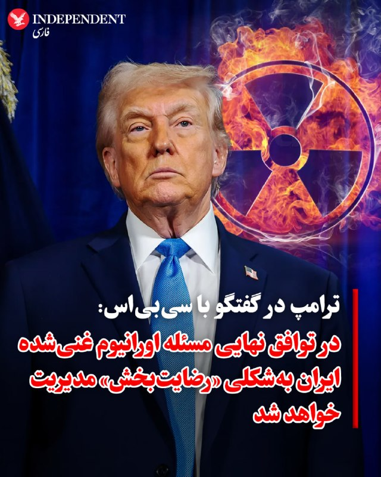

♦️ دونالد ترامپ، رئیس‌جمهوری آمریکا، روز شنبه دوم خرداد در گفتگو با شبکه سی‌بی‌اس نیوز اعلام کرد که جمهوری اسلامی و ایالات متحده به نهایی کردن یک توافق «بسیار نزدیک‌تر» شده‌اند. ترامپ از ارائه جزئیات بیشتر خودداری کرد اما گفت: «هر روز اوضاع بهتر و بهتر می‌شود.»

منابع آگاه به سی‌بی‌اس نیوز گفتند که آخرین پیشنهاد شامل فرآیندی برای بازگشایی تنگه هرمز، آزادسازی برخی از دارایی‌های مسدودشده ایران در بانک‌های خارجی و تداوم مذاکرات است. ترامپ تاکید کرد که توافق نهایی مانع از دستیابی ایران به سلاح هسته‌ای خواهد شد و مسئله اورانیوم غنی‌شده ایران نیز به شکلی «رضایت‌بخش مدیریت می‌شود.» او افزود: «اگر غیر از این بود، من حتی درباره آن صحبت هم نمی‌کردم.»

با این حال، منابع مطلع اشاره کردند که ترامپ هنوز تصمیم نهایی را نگرفته و در حال بررسی پیشنهادها و رایزنی با مشاوران و رهبران خارجی، از جمله مقامات عربستان سعودی و دیگر کشورهای حوزه خلیج فارس است.

ترامپ در پایان تصریح کرد: «من تنها توافقی را امضا خواهم کرد که در آن به هر آنچه می‌خواهیم، برسیم.»
‌🇸🇦 Indypersian

🤖 @VahidOOnLine

## VahidOOnLine — post 241767

  <a href="telegram/content/VahidOOnLine_241767_1779558493.mp4" target="_blank">🎬 Download video</a>

برخی رسانه‌ها از قول منابع منطقه‌ای گزارش داده‌اند قرار است دونالد ترامپ امروز ساعت ۱ بعدازظهر به وقت شرق آمریکا با رهبران عربستان سعودی، امارات متحده عربی، مصر، قطر، اردن، پاکستان و ترکیه، درباره ایران تماس گروهی داشته باشد. این تماس برابر است با ساعت ۸:۳۰ شب به وقت تهران
‌🏁 🇬🇧 ManotoTV

🤖 @VahidOOnLine

## VahidOOnLine — post 241766

  

اکسیوس به نقل از مقام‌های اسرائیلی گزارش داد که بنیامین نتانیاهو، نخست‌وزیر اسرائیل، از دونالد ترامپ، رییس‌جمهوری ایالات متحده، خواست تا حملات علیه جمهوری اسلامی را از سر بگیرد.

بر اساس این گزارش، نتانیاهو نگران پیش‌نویس توافقی است که در حال حاضر بین ایالات متحده و جمهوری اسلامی روی میز است.
‌🏁 🇬🇧 IranintlTV

🤖 @VahidOOnLine

## VahidOOnLine — post 241765

  

♦️ سه منبع آگاه به شبکه سی‌بی‌اس نیوز اعلام کردند که دونالد ترامپ، رئیس‌جمهور آمریکا، قرار است بعدازظهر روز شنبه، دوم خرداد، در یک نشست تلفنی با رهبران کشورهای حوزه خلیج فارس و دیگر کشورها گفتگو کند. مقامات آمریکایی هدف از این تماس را بحث و تبادل‌نظر درباره مذاکرات جاری با ایران عنوان کرده‌اند.

به گفته منابع سی‌بی‌اس، ترامپ هنوز در حال بررسی پیشنهادهاست و تصمیم نهایی خود را نگرفته است؛ یک مقام منطقه‌ای نیز اشاره کرد که برخی از رهبران خاورمیانه هنوز نمی‌دانند ترامپ به کدام گزینه تمایل بیشتری دارد.

این رایزنی‌های فشرده در حالی انجام می‌شود که ترامپ پیشتر در روز شنبه در گفتگو با آکسیوس هشدار داده بود که اگر ایالات متحده و جمهوری اسلامی به توافق نرسند، «شاهد وضعیتی خواهیم بود که در آن، هیچ کشوری در تاریخ به سختی ضربه‌ای که آن‌ها [ایران] قرار است بخورند، آسیب ندیده است.»
‌🇸🇦 Indypersian

🤖 @VahidOOnLine

## WithYashar — post 12214

## WithYashar — post 12213

## WithYashar — post 12212

## WithYashar — post 12211

## WithYashar — post 12210

انتظار می‌رود ایالات متحده و ایران تا بعدازظهر یکشنبه توافقنامه صلحی را اعلام کنند که هدف آن پایان دادن به درگیری‌ها در تمام جبهه‌ها است، طبق گزارش واشنگتن تایمز.

پیش‌نویس پیشنهادی اوایل شنبه نهایی شد و برای تأیید نهایی به رهبران هر دو کشور ارسال گردید.

شخصیت‌های کلیدی در تأیید این پیش‌نویس شامل محمدباقر قالیباف، رئیس مجلس ایران، معاون رئیس‌جمهور جی‌دی ونس، استیو ویتکاف و جارد کوشنر بودند.
@withyashar

## WithYashar — post 12209

  <a href="telegram/content/WithYashar_12209_1779558495.webm" target="_blank">🎬 Download video</a>

🎬 Video

## WithYashar — post 12208

اتاق جنگ با یاشار : متوجه شدین چی‌شده ؟ از امروز تا پایان جام جهانی میشه ۵۷ روز ! آتش بس ۶۰ روزه یعنی دقیق ۳ روز بعد از فینال که همه برگشتن !
@withyashar

## WithYashar — post 12207

کانال ۱۳ اسرائیل: اگر آتش‌بس به مدت ۶۰ روز تمدید شود، این گام کاملا مغایر با خواسته‌ها و اهداف اسرائیل خواهد بود
@withyashar

## WithYashar — post 12206

لیبرمن وزیر دفاع سابق اسرائیل:

هر توافق آمریکا با ایران برای ما فاجعه است.
@withyashar

## WithYashar — post 12205

گزارش‌ها حاکی از بازگشت اضطراری «جی‌دی ونس» معاون اول رئیس‌جمهور آمریکا به کاخ سفید و برگزاری نشست امنیتی ترامپ درباره ایران است.
«جی‌دی ونس» معاون اول رئیس‌جمهور آمریکا سفرهای خود را نیمه‌تمام گذاشته و به طور اضطراری به کاخ سفید بازگشت
@withyashar

## WithYashar — post 12204

لیندری گراهام، سناتور ارشد جمهوری‌خواه و دوست نزدیک دونالد ترامپ، به آکسیوس گفت که رهبران منطقه در توصیه‌های خود به دونالد ترامپ اختلاف نظر دارند و برخی از او برای ضربه زدن به ایران برای تضعیف دولتش و دستیابی به توافقی بهتر فشار می‌آورند، در حالی که برخی دیگر به همراه برخی از مشاوران ارشد کاخ سفید از او خواستند که پیشنهاد فعلی را بپذیرد.

گروه اخیر استدلال کردند که ایران توانایی تخریب زیرساخت های نفتی مهم خلیج فارس را در صورت حمله حفظ می کند و امنیت تنگه هرمز را نمی توان در برابر نفوذ ایران تضمین کرد.
@withyashar

## WithYashar — post 12203

ترامپ در تروث:
ممنونم رئیس‌جمهور اردوغان!

ترامپ همون رهبریه که دنیا قرن‌ها منتظرش بود فقط از قدرت حرف نمی‌زنه، خودش نماد قدرته.
@withyashar

## WithYashar — post 12202

کانال ۱۳ اسرائیل: نیروهای دفاعی اسرائیل در حالت آماده‌باش کامل به‌دلیل احتمال شکست مذاکرات و از سرگیری درگیری‌ها هستند.

نیروهای نظامی نگرانی‌هایی درباره مفاد کلیدی از جمله عدم توقف غنی‌سازی اورانیوم ایران و ادامه توسعه موشک‌های تهران ابراز کردند.
@withyashar

## WithYashar — post 12201

شبکه 12 اسرائیل : نتانیاهو امشب با رهبران ائتلاف دولتیش یه جلسه برگزار می‌کنه
@withyashar

## WithYashar — post 12200

## WithYashar — post 12199

کانال 13 اسرائیل:
اسرائیل اطلاعاتی دریافت کرده که توافق با ایران ممکن شده.
@withyashar

## WithYashar — post 12198

منبعی عالی‌رتبه به العربیه: نشانه‌ها درباره توافق بین آمریکا و ایران بسیار مثبت است.
@withyashar

## WithYashar — post 12197

آکسیوس به نقل از مقامات اسرائیلی:
نتانیاهو عمیقاً نگران توافق مورد بحث است؛ نتانیاهو از ترامپ خواست تا دور جدیدی از حملات به ایران رو آغاز کنه.
@withyashar

## WithYashar — post 12196

خبرنگار کانال ۱۵، یوسی یهوشوا، می‌گوید احتمال درگیری مجدد با ایران بالا است مگر اینکه یکی از طرفین انعطاف نشان دهد؛ او نسبت به گزارش‌های مربوط به یک پیشرفت بزرگ شکاک است و با توجه به حجم شایعات در ساعات اخیر، به احتیاط فراخوانده است
@withyashar

## WithYashar — post 12195

کانال ۱۲ اسرائیل: استیو ویتکوف، نماینده آمریکا، در تلاش است تا به هر قیمتی به یک توافق دست یابد و بر رئیس‌جمهور ترامپ فشار می‌آورد که به جنگ با ایران بازنگردد.
@withyashar

## mwarmonitor — post 9562

  

🔸وزیر جنگ، هگست در حال بازگشت به واشنگتن دی‌سی است.

@mwarmonitor

## mwarmonitor — post 9561

  

✈️نیروی هوایی ایالات متحده (USAF)

۲ فروند سوخت رسان بوئینگ KC-135 استراتوتانکر:

AE036A 63-7985 — پرواز REACH 171
AE0656 58-0102 — پرواز REACH 290

✈️پروازهای REACH 171 و REACH 290 امشب در حال ورود به پایگاه RAF Mildenhall هستند، که از پایگاه Bangor Air National Guard برخاسته‌اند.

@mwarmonitor

## mwarmonitor — post 9560

🔴 مارک لوین ؛ شما یک متحدی را که در یک عملیات نظامی بزرگ در کنار شما جنگیده، کنار نمی‌گذارید. یا این فقط یکی دیگر از مجموعه طولانیِ بدنام‌سازی‌ها علیه نتانیاهو است—کسی که نیویورک تایمز و جروزالم پستِ بی‌اعتبار از او بیزارند—یا یک اشتباه استراتژیک بسیار بزرگ.

@mwarmonitor

## mwarmonitor — post 9559

🔴راجر ویکر رئیس کمیته نیروهای مسلح در سنا «آتش‌بس ۶۰ روزه‌ی شایعه‌شده — با این باور که ایران هرگز با حسن نیت وارد تعامل نخواهد شد — یک فاجعه خواهد بود. تمام دستاوردهایی که در جریان عملیات «Epic Fury» به دست آمده، هدر خواهد رفت!»

@mwarmonitor

## mwarmonitor — post 9558

🚨 ترامپ اذعان کرد که «برخی افراد ترجیح می‌دهند توافقی انجام شود و برخی دیگر ترجیح می‌دهند جنگ از سر گرفته شود»، اما این ایده را رد کرد که نتانیاهو «نگران» است که او ممکن است توافقی نامطلوب انجام دهد.
🚨 ترامپ نتانیاهو را «دو دل» توصیف کرد. مقام‌های اسرائیلی می‌گویند نخست‌وزیر به‌شدت نگران توافق در حال بررسی است و از ترامپ خواسته است دور جدیدی از حملات را آغاز کند. باراک راوید

@mwarmonitor

## mwarmonitor — post 9557

🔴سناتور لیندسی گراهام ؛ به من گفت که برخی رهبران منطقه، رئیس‌جمهور ترامپ را تشویق کرده‌اند به ایران حمله کند تا رژیم تضعیف شود و بتوان به توافقی با شروط بهتر دست یافت.

🚨 از سوی دیگر، او گفت که برخی دیگر از رهبران منطقه و تعدادی از مشاوران ارشد رئیس‌جمهور، ترامپ را ترغیب کرده‌اند که توافقی را که اکنون روی میز است بپذیرد.

🚨 به گفته او، این گروه معتقدند که تنگه هرمز را نمی‌توان از نفوذ ایران کاملاً امن کرد و اگر به ایران حمله شود، این کشور توانایی تخریب بخش قابل‌توجهی از عملیات نفتی خلیج فارس را دارد.

🚨 او افزود: «مرا در شمار کسانی بگذارید که به‌شدت تردید دارند ایران نتواند از ایجاد ناامنی در تنگه هرمز بازداشته شود و این‌که ما پس از حملات گسترده علیه ایران نتوانیم از منافع حیاتی خود در منطقه دفاع کنیم. اگر آن‌ها واقعاً به‌طور کامل نابود شده باشند، نباید قادر به انجام هیچ‌کدام از این کارها باشند. زمان همه‌چیز را مشخص خواهد کرد. من همچنان امیدوار به یک نتیجه خوب هستم.» باراک راوید

@mwarmonitor

## mwarmonitor — post 9556

🔴ترامپ در سوشال تروث

ممنونم رئیس‌جمهور اردوغان!

«رئیس‌جمهور ترامپ رهبری است که جهان قرن‌هاست در انتظار او بوده است — او فقط از قدرت صحبت نمی‌کند — او خودِ مظهر قدرت است.»

@mwarmonitor

## mwarmonitor — post 9555

🔴بر اساس گزارش The Washington Times به نقل از منبعی نزدیک به مذاکرات، انتظار می‌رود آمریکا و ایران ظرف ۲۴ ساعت آینده نهایی‌شدن یک توافق صلح را اعلام کنند؛ این پس از آن است که مذاکره‌کنندگان پیش‌نویس پیشنهادی برای پایان دادن به درگیری‌ها در همه جبهه‌ها را تأیید کرده‌اند. این توافق همچنان به تأیید نهایی هر دو دولت نیاز دارد.

@mwarmonitor

## mwarmonitor — post 9554

🚨 دونالد ترامپ به CBS News گفت که آمریکا «خیلی به رسیدن به یک توافق» با ایران نزدیک‌تر شده است.

@mwarmonitor

## mwarmonitor — post 9552

🔴 رویترز به نقل از یک مقام امنیتی پاکستانی گزارش داد: در حال نهایی‌سازی یادداشت تفاهمی برای پایان دادن به جنگ میان واشنگتن و تهران هستند.

@mwarmonitor

## mwarmonitor — post 9551

🚨 دونالد ترامپ قرار است ساعت ۸ امشب به وقت اسرائیل، یک تماس ویدئویی با رهبران عرب برگزار کند تا پیش‌نویس توافق با ایران را بررسی کرده و نظر آن‌ها را بشنود؛ این خبر به نقل از دو منبع آگاه از جزئیات منتشر شده است. باراک راوید @mwarmonitor

## mwarmonitor — post 9550

🚨 دونالد ترامپ قرار است ساعت ۸ امشب به وقت اسرائیل، یک تماس ویدئویی با رهبران عرب برگزار کند تا پیش‌نویس توافق با ایران را بررسی کرده و نظر آن‌ها را بشنود؛ این خبر به نقل از دو منبع آگاه از جزئیات منتشر شده است. باراک راوید

@mwarmonitor

## mwarmonitor — post 9549

📌مقام‌های اسرائیلی به Axios گفتند که بنیامین نتانیاهو، دونالد ترامپ را به ازسرگیری حملات علیه ایران ترغیب کرده است.

@mwarmonitor

## mwarmonitor — post 9548

🔴به گفته مقام‌های اسرائیلی، فرستاده آمریکا Steve Witkoff در تلاش است «به هر قیمتی» یک توافق را نهایی کند و او کسی است که برای ازسرنگرفتن درگیری‌ها به ترامپ فشار می‌آورد؛ این خبر را کانال 12 اسرائیل گزارش داده است.

@mwarmonitor

## FoxNewsTwitter — post 342164

  <a href="telegram/content/FoxNewsTwitter_342164_1779558496.mp4" target="_blank">🎬 Download video</a>

Fox News (Twitter/X)

“We gave up our yesterdays for your tomorrows.”

98-year-old World War II veteran David Yoho delivered an emotional message at the WWII Memorial in Washington, D.C. as Americans gathered to honor the more than 400,000 U.S. service members who died during the war.

Standing before the crowd in the rain, Yoho urged younger generations to remember the sacrifices made by veterans and to keep telling their stories long after they’re gone.

“Tell them it was a 16-year-old boy in the hearts and mind and body of a 98-year-old veteran of World War II.”

## pm_afshaa — post 91302

⚡️ فایتر رادار | Fighter Radar ⚡️

🌍 اخبار فوری نظامی و تحولات جهان
🛰 پوشش جنگ‌ها و تحلیل‌های نظامی

اگه میخوای از اخبار جا نمونی
و اطلاعات نظامیت بالا بره 👇

https://t.me/+9C1ENi5qn6hhZjk0
https://t.me/+9C1ENi5qn6hhZjk0

حتما عضو کانال فایتر رادار بشید

## pm_afshaa — post 91301

🔴شبکه 12 اسرائیل : نتانیاهو امشب با رهبران ائتلاف دولتیش یه جلسه برگزار می‌کنه

💧 Rainbet.com the #1 Non-KYC Crypto Casino & Sportsbook @rainbetcom

😁 @Pm_Afshaa

## pm_afshaa — post 91300

  <a href="telegram/content/pm_afshaa_91300_1779558498.webm" target="_blank">🎬 Download video</a>

🔴کانال 13 اسرائیل:
اسرائیل اطلاعاتی دریافت کرده که توافق با ایران ممکن شده.

💧 Rainbet.com the #1 Non-KYC Crypto Casino & Sportsbook @rainbetcom

😁 @Pm_Afshaa

## pm_afshaa — post 91299

  <a href="telegram/content/pm_afshaa_91299_1779558499.webm" target="_blank">🎬 Download video</a>

🔴آکسیوس به نقل از مقامات اسرائیلی:
نتانیاهو عمیقاً نگران توافق مورد بحث است؛ نتانیاهو از ترامپ خواست تا دور جدیدی از حملات به ایران رو آغاز کنه.

💧 Rainbet.com the #1 Non-KYC Crypto Casino & Sportsbook @rainbetcom

😁 @Pm_Afshaa

## pm_afshaa — post 91298

  <a href="telegram/content/pm_afshaa_91298_1779558500.webm" target="_blank">🎬 Download video</a>

🔴ترامپ به اکسیوس: شانس توافق یا جنگ 50/50 است. بعد از دیدار با نمایندگانم تصمیم میگیرم! امروز با نمایندگان خود دیدار خواهم کرد و تا فردا تصمیم خواهم گرفت! 
💧 Rainbet.com the #1 Non-KYC Crypto Casino & Sportsbook @rainbetcom 
😁 @Pm_Afshaa

## pm_afshaa — post 91297

  <a href="telegram/content/pm_afshaa_91297_1779558500.webm" target="_blank">🎬 Download video</a>

🔴الحدث:
عاصم مانیر با فرماندهان سپاه پاسداران دیدار کرده و از مواضع اونا شوکه شده.

💧 Rainbet.com the #1 Non-KYC Crypto Casino & Sportsbook @rainbetcom

😁 @Pm_Afshaa

## DEJradio — post 4887

  <a href="telegram/content/DEJradio_4887_1779558501.mp4" target="_blank">🎬 Download video</a>

🚨🎥 مانور کماندوهای آمریکایی در کاراکاس؛ هلی‌برن نیروها در سفارت آمریکا

#جنگ #کاراکاس
@DEJradio

## kianmeli1 — post 87597

  

🔴تهدید امریکا توسط سپاه

توافق نکنید ٫ مذاکره شکست میخورد

(حرف های شبیه ترامپ میزنند).
https://t.me/kianmeli1

## kianmeli1 — post 87596

  

🔴سفارت آمریکا در کی‌یف هشدار فوری در مورد حمله‌ای جدی که می‌تواند هر لحظه طی ۲۴ ساعت آینده اوکراین را هدف قرار دهد، صادر کرده است.

انتظار می‌رود روسیه از انواع مختلف سلاح، از جمله موشک‌های بالستیک قاره‌پیما، استفاده کند.

زلنسکی از شهروندان خواسته است که فوراً به پناهگاه بروند.
https://t.me/kianmeli1

## kianmeli1 — post 87595

🔴ترامپ: یکشنبه ظهر تصمیم نهایی برای حمله یا توافق را می گیرم https://t.me/kianmeli1

## kianmeli1 — post 87594

‏🔴سناتور راجر ویکر در شبکه ایکس نوشت: آتش‌بس ۶۰ روزه با فرض حسن نیت جمهوری اسلامی یک «فاجعه» خواهد بود و دستاوردهای عملیات خشم حماسی را از بین می‌برد
https://t.me/kianmeli1

## kianmeli1 — post 87593

🔴ترامپ: یکشنبه ظهر تصمیم نهایی برای حمله یا توافق را می گیرم
https://t.me/kianmeli1

## kianmeli1 — post 87592

🔴نتانیاهو روسای فراکسیون های ائتلاف و همینطور روسای اپوزسیون را برای یک جلسه در مورد تحولات مربوط به ایران دعوت کرده است.
https://t.me/kianmeli1

## kianmeli1 — post 87591

‏🔴کانال ۱۳ اسرائیل: اگر آتش‌بس به مدت ۶۰ روز تمدید شود، این گام کاملا مغایر با خواسته‌ها و اهداف اسرائیل خواهد بود
https://t.me/kianmeli1

## kianmeli1 — post 87590

🔴مقامات ارشد در اسرائیل: ویتکاف تلاش می‌کند به هر قیمتی توافقی با ایران به دست آورد، او کسی است که به ترامپ فشار می‌آورد تا به جنگ بازنگردد./یدیعوت آحارونوت
https://t.me/kianmeli1

## kianmeli1 — post 87589

🔴یک منبع بلندپایه به العربیه:

نشانه‌هایی بسیار مثبت مربوط به توافق آتش‌بس میان واشینگتن و تهران وجود دارد.
https://t.me/kianmeli1

## kianmeli1 — post 87588

🔴سازمان رادیو و تلویزیون اسرائیل: تل‌آویو سطح آماده‌باش را در پرتو همگرایی میان آمریکا و ایران کاهش می‌دهد. در این میان انجام حمله‌ای علیه ایران پیش‌بینی نمی‌شود.
https://t.me/kianmeli1

## kianmeli1 — post 87587

  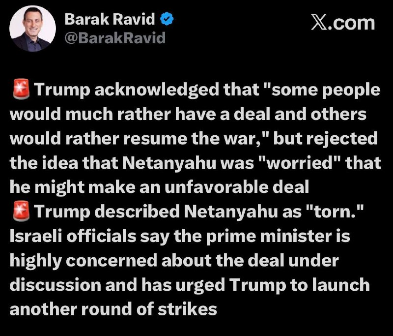

🔴خبرنگار اکسیوس

ترامپ اذعان کرد که «بعضی افراد توافق را ترجیح می‌دهند و برخی دیگر ترجیح می‌دهند جنگ را از سر بگیرند»، اما این ایده را که نتانیاهو «نگران» است که ممکن است به توافق نامطلوبی دست یابد، رد کرد.

ترامپ نتانیاهو را «از درون متلاشی» توصیف کرد. مقامات اسرائیلی می‌گویند نخست وزیر به شدت نگران توافق مورد بحث است و از ترامپ خواسته است که دور دیگری از حملات را آغاز کند.
https://t.me/kianmeli1

## kianmeli1 — post 87586

🔴به شما قول میدهم، خامنه ای دوم را هم بکشند

همین اپوزسیون میگوید حال بروید زیر تونل های تهران تا اخرین سپاهی را پیدا کنید حذف کنید بعد به قدرت برسیم_هیچ برنامه عملی ندارند- اگر بود تا امروز دیده بودیم

به ایران قسم ۱۰ سال است در این کانال گفته ایم بدون سازماندهی نمیشود یک کوچه بن بست را تسخیر کرد

با دروغ و جنگ روانی و پمپاژ رسانه ای نمیشود به براندازی رسید
https://t.me/kianmeli1

## kianmeli1 — post 87585

🔴مملکت توسط ۱۲۰ مداح با سیرک و مسخره بازی شبانه اداره میشود
تمام سران +جانشینان شان کشته شده اند

خلأ قدرت از شب کشته شدن خامنه ای در اوج است

باید از اپوزسیون پرسید:
برنامه تان برای مداحان چیست
خامنه ای که رفت
حتی شما برای مداحان برنامه ندارید

۱۶۰ هزار نیرو ریزشی تان چرا قدرت را دست نمیگیرند
https://t.me/kianmeli1

## kianmeli1 — post 87584

🔴اساسا چرا باید حمله کند!
اگر بناست به براندازی٫ کار بزرگ را کردند

تا قبل کشتن خامنه ای ، همه میگفتند با حذف خامنه ای کار تمام میشود
حال می گویند منتظریم خامنه ای دوم حذف شود کار را تمام میکنیم

به این حضرات که ۲۴ ساعت در تلویزیون ها نشسته اند تحت عناوین تحلیل گر و مشاور باید گفت اگر شما سازماندهی داشتید٫ همان شب ۱۸-۱۹ دی کار تمام میشد

با حذف خامنه ای دوم٫ چه چیزی تغییر میکند؟
برنامه تان چیست؟
ساز و برگ جنگ تان چیست؟
در این چندماهه پس از دی٫ چند قاضی را ادب کرده اید که حکم اعدام صادر کرده اند
https://t.me/kianmeli1

## IranIntlTV — post 338640

  

سناتور راجر ویکر، رییس کمیته نیروهای مسلح سنای آمریکا، در ایکس نوشت که آتش‌بس ۶۰ روزه با فرض حسن نیت جمهوری اسلامی یک «فاجعه» خواهد بود و دستاوردهای عملیات خشم حماسی را از بین می‌برد.
ویکر روز گذشته نیز در ایکس نوشت: «باید کاری را که آغاز کرده‌ایم، به پایان برسانیم.»
https://iranintl.com/202605232378

## IranIntlTV — post 338639

  <a href="telegram/content/IranIntlTV_338639_1779558506.mp4" target="_blank">🎬 Download video</a>

دونالد ترامپ گفت شانس دستیابی به توافق با تهران یا حمله و نابودی، «پنجاه‌پنجاه» است.

رییس‌جمهوری آمریکا همچنین به اکسیوس گفت اواخر امروز برای بررسی آخرین پیشنهاد جمهوری اسلامی با مشاورانش دیدار می‌کند و احتمالا تا فردا درباره از سرگیری جنگ تصمیم خواهد گرفت.

گفت‌وگو با فرشته پزشک، کارشناس روابط بین‌الملل، و جمشید برزگر، روزنامه‌نگار و تحلیل‌گر سیاسی
@iranintltv

## IranIntlTV — post 338638

  <a href="telegram/content/IranIntlTV_338638_1779558508.mp4" target="_blank">🎬 Download video</a>

پنتاگون ده‌ها فایل و ویدیو از پدیده‌های ناشناس هوایی منتشر کرده؛ از جمله تصاویری نزدیک ایران که بیش از پاسخ، پرسش می‌سازند: بشقاب‌پرنده یا خطای دید؟

آرین ریسباف گزارش می‌دهد.
@iranintltv

## IranIntlTV — post 338637

  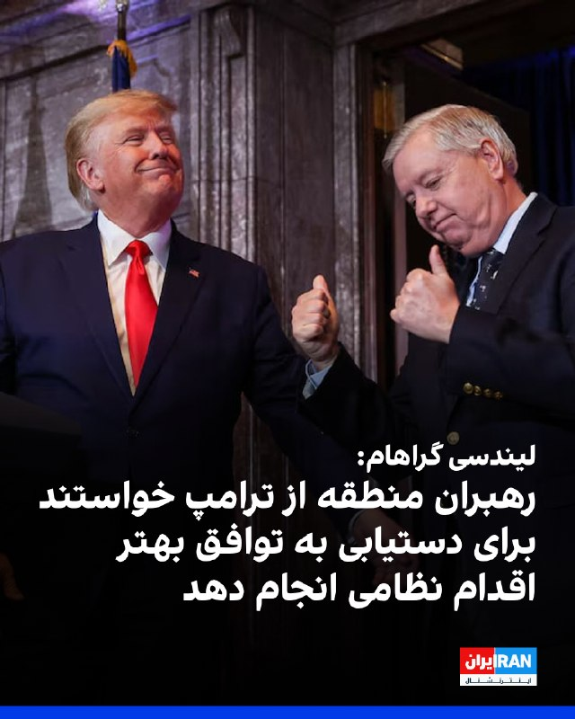

اکسیوس به نقل از لیندسی گراهام، سناتور جمهوری‌خواه نوشت که برخی رهبران منطقه از ترامپ خواسته‌اند برای تضعیف جمهوری اسلامی اقدام نظامی انجام دهد تا توافق بهتری حاصل شود.

گراهام به اکسیوس گفت: «برخی معتقدند در صورت حمله به ایران، این کشور توان آسیب جدی به زیرساخت‌های نفتی خلیج فارس را دارد و امنیت تنگه هرمز قابل تضمین نیست.»

بنا بر این گزارش، برخی دیگر از رهبران منطقه و مشاوران ارشد ترامپ او را به پذیرش توافق فعلی ترغیب کرده‌اند.
https://iranintl.com/202605238770

## IranIntlTV — post 338636

  <a href="telegram/content/IranIntlTV_338636_1779558510.mp4" target="_blank">🎬 Download video</a>

محمدباقر قالیباف، اسماعیل بقایی، سخنگوی وزارت امور خارجه، را به‌عنوان سخنگوی هیات مذاکره‌کننده جمهوری اسلامی منصوب کرد. قالیباف پس از جنگ به ریاست این هیات منصوب شده و هفته گذشته نیز به‌عنوان نماینده ویژه جمهوری اسلامی در امور چین معرفی شد. وب‌سایت المانیتور در گزارشی این انتخاب‌ها را نشانه‌ای از تقویت جایگاه سیاسی او دلنست.

گفت‌وگو با ایمان آقایاری، تحلیل‌گر سیاسی
@iranintltv

## IranIntlTV — post 338635

  <a href="telegram/content/IranIntlTV_338635_1779558512.mp4" target="_blank">🎬 Download video</a>

ایرانیان آلمان روز شنبه در شهرهای کاسل و دوسلدورف برای حمایت از انقلاب ملی تجمع کرده و پرفورمنس هنری به یاد جاویدنامان انقلاب ملی برگزار کردند. در شهر کاسل ایرانیان شعار «کینگ رضا پهلوی» سر دادند.

## IranIntlTV — post 338634

  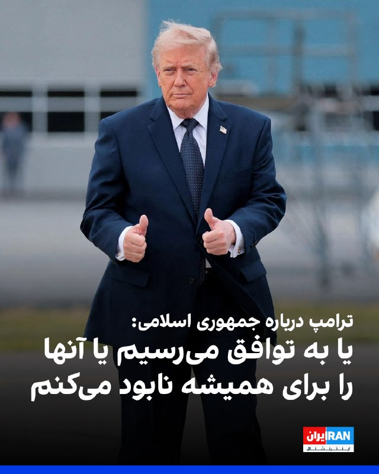

دونالد ترامپ، رییس‌جمهوری آمریکا، به کانال ۱۲ اسرائیل گفت که یا به توافق می‌رسیم یا جمهوری اسلامی را برای همیشه نابود خواهم کرد. او افزود: «هیچ توافقی بدون در نظر گرفتن منافع اسرائیل انجام نخواهد شد و موضوعات هسته‌ای در آن خواهد بود.»

رییس‌جمهوری آمریکا گفت: «فکر نمی‌کنم نتانیاهو نگران باشد. اگر برای اسرائیل خوب نبود، من توافق نمی‌کردم.»
https://iranintl.com/202605236595

## IranIntlTV — post 338633

  <a href="https://t.me/IranintlTV/338633" target="_blank">📎 Download file</a>

🎧نسخه صوتی اخبار شبانگاهی | شنبه ۲ خرداد
@iranintlTV

## IranIntlTV — post 338632

  

اکسیوس به نقل از مقام‌های اسرائیلی گزارش داد که بنیامین نتانیاهو، نخست‌وزیر اسرائیل، از دونالد ترامپ، رییس‌جمهوری ایالات متحده، خواست تا حملات علیه جمهوری اسلامی را از سر بگیرد.

بر اساس این گزارش، نتانیاهو نگران پیش‌نویس توافقی است که در حال حاضر بین ایالات متحده و جمهوری اسلامی روی میز است.
https://iranintl.com/202605232747

## Shin_Persian — post 6167

  

Shin ✓ @hey_itsmyturn
Sat, 23 May 2026 16:59:26 UTC

President Trump @POTUS:
"Trump’s Global Gambit: How Strikes On Iran And Venezuela Are Fueling America’s Economic Comeback And Checking China: https://loomered.com/2026/04/28/trumps-global-gambit-how-strikes-on-iran-and-venezuela-are-fueling-americas-economic-comeback-and-checking-china/"

فارسی

رئیس‌جمهور ترامپ @POTUS:
«قمار جهانی ترامپ: چگونه حملات به ایران و ونزوئلا در حال تقویت بازگشت اقتصادی آمریکا و مهار چین است: https://loomered.com/2026/04/28/trumps-global-gambit-how-strikes-on-iran-and-venezuela-are-fueling-americas-economic-comeback-and-checking-china/»

𝕏 · @shin_persian

## ManotoTV — post 105773

  <a href="telegram/content/ManotoTV_105773_1779558516.mp4" target="_blank">🎬 Download video</a>

ترامپ می‌گوید آمریکا و جمهوری‌اسلامی «خیلی به توافق نزدیک‌تر شده‌اند»
دونالد ترامپ، رئیس‌جمهور آمریکا، به شبکه سی‌بی‌اس نیوز گفته است که واشنگتن و تهران «روزبه‌روز به نهایی‌کردن یک توافق نزدیک‌تر می‌شوند».
او گفت: «هر روز بهتر و بهتر می‌شود.»
ترامپ همچنین افزود که در صورت رسیدن به توافق احتمالی، اورانیوم غنی‌شده ایران «به‌طور رضایت‌بخش مدیریت خواهد شد»، اما جزئیات بیشتری ارائه نکرد.
او تأکید کرد: «من فقط توافقی را امضا می‌کنم که در آن همه چیزهایی که می‌خواهیم را به دست آوریم.»

## ManotoTV — post 105772

  <a href="telegram/content/ManotoTV_105772_1779558516.mp4" target="_blank">🎬 Download video</a>

برخی رسانه‌ها از قول منابع منطقه‌ای گزارش داده‌اند قرار است دونالد ترامپ امروز ساعت ۱ بعدازظهر به وقت شرق آمریکا با رهبران عربستان سعودی، امارات متحده عربی، مصر، قطر، اردن، پاکستان و ترکیه، درباره ایران تماس گروهی داشته باشد. این تماس برابر است با ساعت ۸:۳۰ شب به وقت تهران

## FarsiVOA — post 218459

گزارش‌ها از موج تازه کمبود و گرانی در بازار دیجیتال ایران خبر می‌دهند؛ جایی که به‌دنبال تنش‌ها میان جمهوری اسلامی و امارات و اختلال در مسیر واردات، بازار موبایل، لپ‌تاپ و قطعات کامپیوتری با بحران تأمین کالا روبه‌رو شده است.

## FarsiVOA — post 218458

  <a href="telegram/content/FarsiVOA_218458_1779558517.mp4" target="_blank">🎬 Download video</a>

وزیر امور خارجه ایالات متحده که در نخستین سفر خود به هند به‌سر می‌برد با تکرار مواضع رسمی و قطعی آمریکا در مذاکرات جاری با رژیم ایران گفت: «در مذاکرات با جمهوری اسلامی پیشرفت‌هایی حاصل شده، اما آمریکا از خطوط قرمز پرزیدنت ترامپ کوتاه نخواهد آمد.»

## FarsiVOA — post 218457

🔺افزایش نشانه‌ها از توافق آمریکا و رژیم ایران؛ پرزیدنت ترامپ: «بسیار نزدیک» است

▪️همزمان با پایان سفر فرمانده ارتش پاکستان به ایران به عنوان میانجی گفتگوها، رسانه‌ها از افزایش احتمال دستیابی تهران و واشنگتن به توافق خبر دادند. همزمان رئیس‌جمهوری آمریکا به سی‌بی‌اس نیوز گفت که دو کشور به توافق نهایی «بسیار نزدیک‌تر» شده‌اند.

⬇️ بیشتر بخوانید:

https://ir.voanews.com/a/iran-trump-us-negotiations-hormuz-persian-gulf/8153056.html/?nocach=1

## FarsiVOA — post 218456

🔺درگذشت پرویز قلیچ‌خانی، ستاره سال‌های دور فوتبال ایران

▪️پرویز قلیچ‌خانی، ستاره فوتبال ایران در دهه‌های ۴۰ و ۵۰ خورشیدی، پس از ماه‌ها تحمل بیماری، روز شنبه ۲ خرداد در بیمارستانی در حومه پاریس فرانسه درگذشت.

⬇️ بیشتر بخوانید:

https://ir.voanews.com/a/iran-soccor-footbal-parviz-ghalichkhani-legendary/8153050.html

## FarsiVOA — post 218454

در حالی که محدودیت گسترده اینترنت بین‌الملل در ایران وارد هشتاد و پنجمین روز شده، داده‌های نت‌بلاکس نشان می‌دهد میزان «انزوای دیجیتال» ایران از جهان از مرز ۲۰۱۶ ساعت گذشته است.

بر اساس اعلام این نهاد ناظر بر اینترنت، قطع یا محدودیت شدید دسترسی به اینترنت جهانی اکنون وارد هفته سیزدهم شده و زندگی روزمره، کار، آموزش، ارتباطات و دسترسی به اطلاعات را برای میلیون‌ها شهروند ایرانی مختل کرده است.

نت‌بلاکس می‌گوید این سطح از قطع ارتباط، شهروندان را از فرصت‌ها و اطلاعاتی محروم کرده که در بسیاری از کشورها در چند ثانیه در دسترس است.

این گزارش در حالی منتشر می‌شود که مقام‌های جمهوری اسلامی همچنان زمان روشنی برای بازگشایی اینترنت اعلام نکرده‌اند.

گزارش کامل را در وب‌سایت صدای آمریکا بخوانید.

@FarsiVOA

## DW_Farsi — post 125060

  <a href="telegram/content/DW_Farsi_125060_1779558518.mp4" target="_blank">🎬 Download video</a>

🎥 روبیو: در مذاکرات با ایران پیشرفت‌هایی حاصل شده است

مارکو روبیو در سفرش به هند گفت در مذاکرات با ایران "پیشرفت‌هایی" حاصل شده و واشنگتن همچنان راه‌حل دیپلماتیک را ترجیح می‌دهد. او همچنین گفت که ایران باید اورانیوم غنی‌شده خود را تحویل دهد.

@dw_farsi

## Persian_Trend_Official — post 14747

  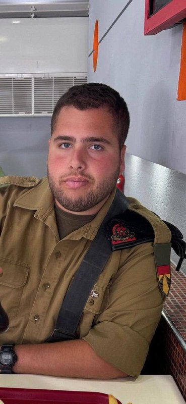

♦️یک نظامی ارتش اسراییل توسط حزب الله لبنان کشته شد.

🫆:Tony

📌 @persian_trend_official
پرشین ترند | متفاوت‌ترین کانال نظامی

## Persian_Trend_Official — post 14746

  <a href="telegram/content/Persian_Trend_Official_14746_1779558520.webm" target="_blank">🎬 Download video</a>

🔴 لیندزی گراهام: برخی رهبران منطقه از ترامپ خواسته بودند به ایران حمله کند

لیندزی گراهام، سناتور آمریکایی، به آکسیوس گفت برخی رهبران منطقه‌ای از دونالد ترامپ خواسته بودند برای تضعیف حکومت ایران و وادار کردن تهران به پذیرش توافقی با شرایط سخت‌تر، حملات نظامی علیه ایران انجام دهد.

بر اساس این گزارش:

▪️ در مقابل، گروهی دیگر از رهبران منطقه به همراه برخی مشاوران ارشد ترامپ، خواستار پذیرش توافق فعلی با ایران شده‌اند
▪️ این افراد هشدار داده‌اند در صورت حمله، ایران همچنان توان تهدید تنگه هرمز و زیرساخت‌های اصلی نفتی خلیج فارس را خواهد داشت
▪️ نگرانی اصلی آن‌ها، اختلال در صادرات انرژی و گسترش جنگ در منطقه بوده است
♦️گراهام اما گفت:
▪️ نسبت به این هشدارها تردید دارد
▪️ اگر ایران در یک حمله گسترده «واقعاً نابود» شود، دیگر نباید توان تهدید هرمز یا منافع حیاتی منطقه را داشته باشد

🫆:Tony

📌 @persian_trend_official
پرشین ترند | متفاوت‌ترین کانال نظامی

## Persian_Trend_Official — post 14745

  <a href="telegram/content/Persian_Trend_Official_14745_1779558521.mp4" target="_blank">🎬 Download video</a>

وزیر جنگ آمریکا: نیروهوایی ما برای اعزام به خاورمیانه آماده‌باش هستند

▪️پیت هگست:

♦️نیروهای ما برای همه‌چیز باید آماده باشند، زیرا دنیا در حال پیچیده‌تر شدن است.

💢فقط به آنچه که سربازان ما در چند ماه گذشته انجام داده‌اند نگاه کنید. ما از آن‌ها خواستیم که از نیروی هوایی واکنش سریع، در هر لحظه، برای اعزام به خاورمیانه آماده باشند.

💢ما از نیروهای ویژه‌مان خواسته‌ایم که مأموریت‌های سخت و بسیار مخفیانه‌ای را در منطقه جنوبی آمریکا انجام دهند؛ به‌عنوان نمونه، یک عملیات کوچک در ونزوئلا

🫆:Tony

📌 @persian_trend_official
پرشین ترند | متفاوت‌ترین کانال نظامی

## Persian_Trend_Official — post 14744

  <a href="telegram/content/Persian_Trend_Official_14744_1779558522.webm" target="_blank">🎬 Download video</a>

ادعای کانال ۱۳ اسرائیل:

اسرائیل اطلاعاتی دریافت کرده که توافق [آمریکا] با ایران ممکن شده است./انتخاب

🫆:Tony

📌 @persian_trend_official
پرشین ترند | متفاوت‌ترین کانال نظامی

## RadioFarda — post 157495

🔸کانال شورای تشکل‌های صنفی فرهنگیان می‌گوید مدیرکل آموزش و پرورش استان لرستان در واکنش به تجمعات اعتراضی دانش‌آموزان این استان اعلام کرد آزمون‌های نوبت دوم دانش‌آموزان این استان نیز همانند سایر استان‌ها به‌صورت مجازی برگزار خواهد شد. 🔸روز شنبه دوم خرداد،…

## RadioFarda — post 157493

  <a href="telegram/content/RadioFarda_157493_1779558523.mp4" target="_blank">🎬 Download video</a>

🔸کانال شورای تشکل‌های صنفی فرهنگیان می‌گوید مدیرکل آموزش و پرورش استان لرستان در واکنش به تجمعات اعتراضی دانش‌آموزان این استان اعلام کرد آزمون‌های نوبت دوم دانش‌آموزان این استان نیز همانند سایر استان‌ها به‌صورت مجازی برگزار خواهد شد.

🔸روز شنبه دوم خرداد، ویدئوهایی از تجمع اعتراضی گستردهٔ دانش‌آموزان در مقابل آموزش و پرورش لرستان منتشر شد.

🔸بر اساس شعارهای ویدئوها و توضیحات برخی کانال‌های خبری، دانش‌آموزان می‌گویند آموزش آنلاین از طریق سامانهٔ «شاد»، به‌دلیل اینترنت ملی ضعیف و اختلال، با مشکلات جدی همراه بوده و به همین دلیل انتظار دارند بین نوع آموزش و شیوهٔ ارزیابی تناسب وجود داشته باشد.

🔸در ویدئویی که عصر شنبه منتشر شد، مدیر آموزش و پرورش در جمع معترضان اعلام می‌کند که تمامی امتحانات پایه‌های هفتم تا دهم در استان لرستان نیز به‌صورت مجازی برگزار خواهد شد.

@RadioFarda

## RadioFarda — post 157492

🔸دونالد ترامپ، رئیس‌جمهور آمریکا، می‌گوید مذاکره‌کنندگان ایالات متحده و ایران برای نهایی کردن توافقی که به جنگ پایان دهد، «بسیار به هم نزدیک‌تر شده‌اند»، اما در صورت شکست مذاکرات، ایران «به‌شدت هدف قرار خواهد گرفت». 🔸آقای ترامپ روز دوم خرداد، در گفت‌وگو با…

## RadioFarda — post 157491

  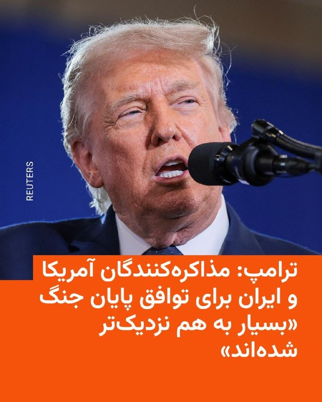

🔸دونالد ترامپ، رئیس‌جمهور آمریکا، می‌گوید مذاکره‌کنندگان ایالات متحده و ایران برای نهایی کردن توافقی که به جنگ پایان دهد، «بسیار به هم نزدیک‌تر شده‌اند»، اما در صورت شکست مذاکرات، ایران «به‌شدت هدف قرار خواهد گرفت».

🔸آقای ترامپ روز دوم خرداد، در گفت‌وگو با شبکۀ سی‌بی‌اس نیوز، گفت که روند مذاکرات «هر روز بهتر و بهتر می‌شود»، اما تأکید کرد که فقط توافقی را امضا خواهد کرد که در آن آمریکا «به هرچه می‌خواهد برسد».

🔸رئیس‌جمهور آمریکا همچنین به وب‌سایت آکسیوس گفت که تازه‌ترین پیش‌نویس توافق با ایران را با مشاورانش بررسی خواهد کرد و ممکن است تا روز یکشنبه دربارهٔ ادامۀ مسیر، از جمله احتمال ازسرگیری جنگ، تصمیم بگیرد.

🔸او در این گفت‌وگو گفت: «یا به یک توافق خوب می‌رسیم یا آن‌ها را به هزار جهنم می‌فرستم (به شدت هدف قرار می‌دهیم).»

🔸به گزارش سی‌بی‌اس نیوز، منابع آگاه از مذاکرات گفته‌اند که تازه‌ترین پیشنهاد شامل روندی برای بازگشایی تنگۀ هرمز، آزادسازی بخشی از دارایی‌های مسدودشدۀ ایران در بانک‌های خارجی و ادامۀ مذاکرات است.

@RadioFarda

## IranianMinds — post 20625

🔴 ترامپ :

اگه توافقمون برای اسرائیل خوب نباشه ، قبولش نمیکنم !

@IranianMinds

## IranianMinds — post 20624

  

😂😂😂

@IranianMinds

## IranianMinds — post 20623

🔴 الحدث:

عاصم منیر، رئیس کل ارتش پاکستان، در سفر به تهران، با فرماندهان سپاه دیدار کرد و از مواظع آنها شوکه شده است😂

@IranianMinds

## IranianMinds — post 20622

  

🔴 ترامپ گفت آمریکا و ایران «خیلی به توافق نزدیک شده‌اند» و به سی بی اس نیوز گفت: «هر روز اوضاع بهتر و بهتر می‌شود.»

او گفت هر توافقی باید مانع دستیابی ایران به سلاح هسته‌ای شود و تضمین کند که اورانیوم غنی‌شده ایران «به‌طور رضایت‌بخش مدیریت شود.»

ترامپ همچنین بدون ارائه جزئیات گفت:
«فقط توافقی را امضا می‌کنم که در آن به همه چیزهایی که می‌خواهیم برسیم.

@IranianMinds

## IranianMinds — post 20621

  

😳 هنوزم واسه کانفیگ هزینه میکنی؟
🍸 با داییجون رایگان وصل شو

🎁 کافیه فقط دوستاتو بیاری تو ربات و کانفیگتو رایگان از ما تحویل بگیری

⭐ راستی دایی جون اگه تلگرامت پرمیوم باشه به محض استارت کردن ربات صد مگابایت کانفیگ رایگان از دایی هدیه میگیری

🎁 @Daeijoonbot | استارت کن و کانفیگ رایگان بگیر 🌟

## IranianMinds — post 20620

  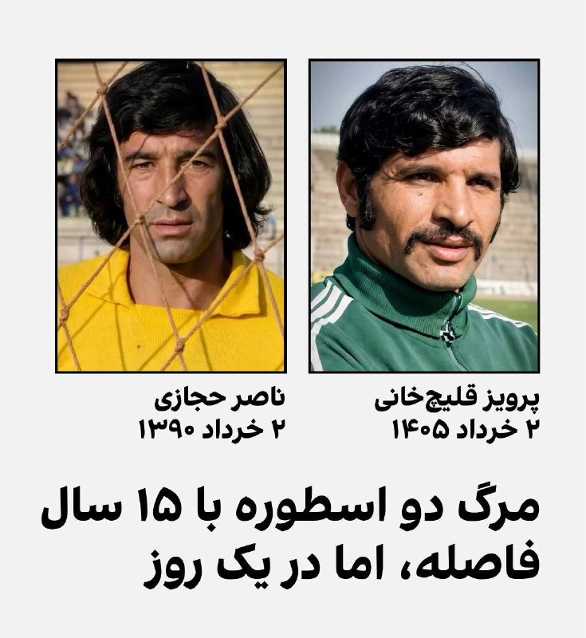

⚫️پرویز قلیچ‌خانی، اسطوره فوتبال ایران و تنها فوتبالیست ایرانی که سه بار قهرمان جام ملت‌های آسیا شد، امروز شنبه دوم خرداد ۱۴۰۵ در ۸۱ سالگی در بیمارستانی در پاریس درگذشت.

@IranianMinds

## BBCPersian — post 281893

  <a href="https://t.me/bbcpersian/281893" target="_blank">📎 Download file</a>

پادکست رادیویی جام جهان‌نما شنبه ۲  خرداد ۱۴۰۵ 
در پی تحولات اخیر ایران و قطع و اختلال در اینترنت که امکان دسترسی مخاطبان در ایران به رسانه‌ها را با مشکل مواجه کرده است، بی‌بی‌سی فارسی از ۱۵ بهمن پخش رادیویی برنامه‌های خود را دوباره آغاز کرده است.

برنامه‌ جام جهان‌نما از این پس همه روزه از ساعت ۱۶:۳۰ گرینویچ (۲۰:۰۰ ایران) روی موج متوسط ۷۰۲ کیلوهرتز و موج کوتاه ۹۴۶۵ کیلوهرتز پخش می‌شود.

تکرار این برنامه از ساعت ۱۸:۰۰ گرینویچ (۲۱:۳۰ ایران) روی موج متوسط ۷۰۲ کیلوهرتز و موج کوتاه ۵۹۳۵ کیلوهرتز پخش می‌شود.
@BBCPersian

## BBCPersian — post 281891

  

🔻دونالد ترامپ می‌گوید آمریکا و ایران به توافق نهایی «بسیار نزدیک‌‌تر» شده‌‌اند.

رئیس‌جمهور آمریکا با این حال به شبکه آمریکایی سی‌بی‌اس گفت: «من فقط توافقی را امضا خواهم کرد که در آن به تمام خواسته‌های خود برسیم.»

او تاکید کرد که توافق نهایی باید مانع دستیابی ایران به «سلاح هسته‌ای» و «مدیریت رضایت‌بخش» اورانیوم غنی‌شده شود وگرنه «اصلا نمی‌شود درباره آن صحبت می‌کرد.»

سی بی اس به نقل از منابع آگاه نوشت آخرین پیشنهاد شامل تعیین روند بازگشایی تنگه هرمز، آزادسازی بخشی از دارایی‌های مسدودشده ایران در بانک‌های خارجی و ادامه مذاکرات است.

این منابع به سی‌بی‌اس گفته‌اند که آقای ترامپ تصمیم نهایی خود را نگرفته و در حال مشورت با مشاورانش و گفت‌وگو با رهبران خارجی از جمله رهبران عربستان سعودی و دیگر کشورهای حوزه خلیج فارس است.

رئیس‌جمهور آمریکا تهدید کرد که اگر توافق حاصل نشود «با وضعیتی روبه‌رو خواهیم شد که هیچ کشوری تاکنون به این شدت هدف حمله قرار نگرفته است.»

📸Getty Images
https://bbc.in/4dr8pIP
@BBCPersian

## Dirty_Kids — post 390028

پسرا موجودات عجیبی هستن، برای تو وقت ندارن ولی برای اهلی کردن اسب توی بازی red dead redemption سه روز وقت دارن

@Dirty_Kids 👻

## Dirty_Kids — post 390027

  <a href="telegram/content/Dirty_Kids_390027_1779558529.mp4" target="_blank">🎬 Download video</a>

ولی این چالشه که اخیرا ترند شده یه چیزیو در من روشن میکنه :)))

@Dirty_Kids 👻

## Dirty_Kids — post 390026

  

وزارت خارجه اسرائیل:

بالاخره پزشکیان با «مجتبی خامنه‌ای» ملاقات کرد.

@Dirty_Kids 👻

## Dirty_Kids — post 390025

  <a href="https://t.me/Dirty_Kids/390025" target="_blank">📎 Download file</a>

✅ اپلیکیشن اندروید سایت جهانی دربی بت

💰اولین سایت جهانی با امکان شارژ و برداشت ریالی(کارت به کارت)

🔗 برای ورود فیلترشکن روی کشور مناسب قرار دهید مانند فنلاند و المان و....

😀Telegram Channel
👇
https://t.me/+bcynkEgSW2dlYTc0

## Dirty_Kids — post 390024

  

😤دنبال یه سایت شرط بندی بین المللی بودی که به ایرانیا خدمات بده؟!
⛔

👍دربی بت همون انتخاب  100%

💎ویژگی های سایت جهانی Derby Bet:

⬅️امکان شارژ امن با کارت بانکی

⬅️واریز اول دوبل شارژ می شوید(بونوس۱۰۰٪)

⬅️پر اپشن ترین سایت فعال در ایران

⬅️تسویه حساب کمتر از 5 دقیقه

⬅️برگشت بخشی از باخت به صورت هفتگی

🚨کد هدیه ثبت نام:GG007

⚠️برای دانلود اپلکیشن کلیک کنید
👉

🔔کانال دربی بت :

🪙https://t.me/+bcynkEgSW2dlYTc0

## Hranews — post 113120

اجرای حکم اعدام یک زندانی زن در اردبیل/ رهایی ۳ زندانی از چوبه دار

❗️
❗️
❗️
❗️
❗️– سحرگاه روز چهارشنبه ۳۰ اردیبهشت‌ماه، حکم یک زندانی زن که پیشتر از بابت اتهام قتل به #اعدام محکوم شده بود، در زندان اردبیل اجرا شد. از سوی دیگر، سه زندانی محکوم به اعدام در استان‌های مختلف از جمله خوزستان و کرمان، با کسب رضایت اولیای دم از چوبه دار رهایی یافتند.

ادامه مطلب

#اسما_زارعی

↘️
@hranews_bot تماس ✉️ - @Hranews کانال هرانا 🆑

## Hranews — post 113119

  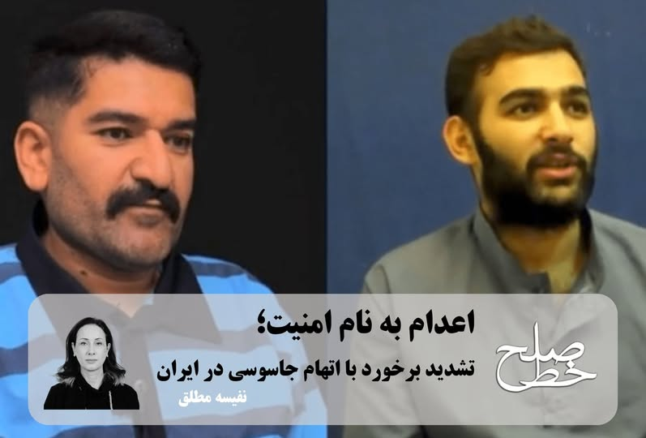

اعدام به نام امنیت؛ تشدید برخورد با اتهام جاسوسی در ایران/ #نفیسه_مطلق

📡
📡
📡
📡
📡– در پی تشدید تنش‌های نظامی و حملات ایالات متحده آمریکا و اسرائیل، روند برخورد قضایی با اتهام «جاسوسی» و «همکاری با دولت‌های متخاصم» در ایران وارد مرحله‌ای تازه شده است. آن‌چه بیش از خود قوانین محل بحث قرار گرفته، نحوه‌ی اجرای آن‌هاست: رسیدگی‌های سریع، نبود شفافیت و محدودیت دسترسی متهمان به روندهای دفاعی استاندارد؛ عواملی که پرسش‌هایی جدی درباره‌ی رعایت دادرسی عادلانه ایجاد کرده‌اند.

در آن سوی این تنش‌ها، رسانه‌های اسرائیلی از بازداشت دو نظامی نیروی هوایی این کشور به اتهام همکاری اطلاعاتی با ایران خبر داده‌اند؛ پرونده‌ای که با دسترسی به وکیل و طی مراحل قانونی در حال بررسی است و با وجود پیش‌بینی مجازات #اعدام در قوانین این کشور، تاکنون گزارشی از اجرای چنین حکمی منتشر نشده است. در مقابل، در ایران، اتهامی مشابه می‌تواند به‌سرعت به مجازات نهایی منجر شود. در یکی از نمونه‌های اجرای احکام اعدام که به‌تازگی اعلام شد، دو زندانی به نام‌های یعقوب کریم‌پور و ناصر بکرزاده پس از محاکمه به اتهام «همکاری اطلاعاتی و جاسوسی» برای اسرائیل، بلافاصله پس از تایید حکم در دیوان عالی، اعدام شدند؛ تفاوتی که بیش از هر چیز به کیفیت دادرسی بازمی‌گردد.

طبق اخبار و اطلاعات منتشر شده در خبرگزاری هرانا، تنها از ۹ اسفند ۱۴۰۴ (از زمان آغاز درگیری ایالات متحده آمریکا و اسرائیل با ایران) تا ۳۱ اردیبهشت ماه ۱۴۰۵، دستکم ۳۴ مورد اعدام با اتهامات سیاسی و امنیتی صورت گرفته است.

ادامه مطلب

ادامه مطلب در وبسایت خط صلح

↘️
@hranews_bot تماس ✉️ - @Hranews کانال هرانا 🆑

## manototv — post 105773

  <a href="telegram/content/manototv_105773_1779558532.mp4" target="_blank">🎬 Download video</a>

ترامپ می‌گوید آمریکا و جمهوری‌اسلامی «خیلی به توافق نزدیک‌تر شده‌اند»
دونالد ترامپ، رئیس‌جمهور آمریکا، به شبکه سی‌بی‌اس نیوز گفته است که واشنگتن و تهران «روزبه‌روز به نهایی‌کردن یک توافق نزدیک‌تر می‌شوند».
او گفت: «هر روز بهتر و بهتر می‌شود.»
ترامپ همچنین افزود که در صورت رسیدن به توافق احتمالی، اورانیوم غنی‌شده ایران «به‌طور رضایت‌بخش مدیریت خواهد شد»، اما جزئیات بیشتری ارائه نکرد.
او تأکید کرد: «من فقط توافقی را امضا می‌کنم که در آن همه چیزهایی که می‌خواهیم را به دست آوریم.»

## manototv — post 105772

  <a href="telegram/content/manototv_105772_1779558533.mp4" target="_blank">🎬 Download video</a>

برخی رسانه‌ها از قول منابع منطقه‌ای گزارش داده‌اند قرار است دونالد ترامپ امروز ساعت ۱ بعدازظهر به وقت شرق آمریکا با رهبران عربستان سعودی، امارات متحده عربی، مصر، قطر، اردن، پاکستان و ترکیه، درباره ایران تماس گروهی داشته باشد. این تماس برابر است با ساعت ۸:۳۰ شب به وقت تهران

## alonews — post 122125

  

قیمت استثنایی گیگی
9️⃣
8️⃣
1️⃣

تحویل زیر یک دقیقه
✅
دارای لینک سابسکریشن جهت دیدن حجم و کنترل مصرف
✅
بدون قطعی 
✅
بدون محدودیت کاربر و زمان
✅
جمینایو چت جی بی تی و... کامل اوکیه با سرورامون
✅

🏪پشتیبانی کامل
✅
شروع فعالیت از سال 2022 
✅
پرداخت ریالی
✅

ضریب و این چیزا ندارن و تا آخرین مگابایت برای پشتیبانیش درختمتیم
🥂

💤این تخفیف فقط تا ۱۲ شب فعاله
💤

⭐️ @Napsternetiran_bot
〰️〰️〰️〰️〰️〰️〰️

🔶 @Napsternetvirani

## alonews — post 122124

  <a href="telegram/content/alonews_122124_1779558534.webm" target="_blank">🎬 Download video</a>

👈انتظار می‌رود ایالات متحده و ایران تا بعدازظهر یکشنبه توافقنامه صلحی را اعلام کنند که هدف آن پایان دادن به درگیری‌ها در تمام جبهه‌ها است، طبق گزارش واشنگتن تایمز.

🔴پیش‌نویس پیشنهادی اوایل شنبه نهایی شد و برای تأیید نهایی به رهبران هر دو کشور ارسال گردید.

🔴شخصیت‌های کلیدی در تأیید این پیش‌نویس شامل محمدباقر قالیباف، رئیس مجلس ایران، معاون رئیس‌جمهور جی‌دی ونس، استیو ویتکاف و جارد کوشنر بودند.

✅ @AloNews خبر جنگ

## alonews — post 122123

  <a href="telegram/content/alonews_122123_1779558534.webm" target="_blank">🎬 Download video</a>

👈 هشدارهای پهپاد در منطقه خط تقابل، شمال اسرائیل فعال هستند. 
✅ @AloNews خبر جنگ

## alonews — post 122122

  <a href="telegram/content/alonews_122122_1779558534.webm" target="_blank">🎬 Download video</a>

👈کانال ۱۳ اسرائیل: اگر آتش‌بس به مدت ۶۰ روز تمدید شود، این گام کاملا مغایر با خواسته‌ها و اهداف اسرائیل خواهد بود

✅ @AloNews خبر جنگ

## alonews — post 122121

  <a href="telegram/content/alonews_122121_1779558534.webm" target="_blank">🎬 Download video</a>

👈 هشدارهای پهپاد در منطقه خط تقابل، شمال اسرائیل فعال هستند.

✅ @AloNews خبر جنگ

## alonews — post 122120

  <a href="telegram/content/alonews_122120_1779558535.mp4" target="_blank">🎬 Download video</a>

👈جی‌دی ونس معاون اول رئیس‌جمهور آمریکا سفرهای خود را نیمه‌تمام گذاشته و به طور اضطراری به کاخ سفید بازگشت

✅ @AloNews خبر جنگ

## alonews — post 122119

  <a href="telegram/content/alonews_122119_1779558537.webm" target="_blank">🎬 Download video</a>

👈 لیندری گراهام، سناتور ارشد جمهوری‌خواه و دوست نزدیک دونالد ترامپ، به آکسیوس گفت که رهبران منطقه در توصیه‌های خود به دونالد ترامپ اختلاف نظر دارند و برخی از او برای ضربه زدن به ایران برای تضعیف دولتش و دستیابی به توافقی بهتر فشار می‌آورند، در حالی که برخی دیگر به همراه برخی از مشاوران ارشد کاخ سفید از او خواستند که پیشنهاد فعلی را بپذیرد.

🔴 گروه اخیر استدلال کردند که ایران توانایی تخریب زیرساخت های نفتی مهم خلیج فارس را در صورت حمله حفظ می کند و امنیت تنگه هرمز را نمی توان در برابر نفوذ ایران تضمین کرد.

✅ @AloNews خبر جنگ

## alonews — post 122118

  <a href="telegram/content/alonews_122118_1779558537.webm" target="_blank">🎬 Download video</a>

👈 ترامپ بازنشر می‌کند: تسلط پرزیدنت ترامپ بر بهشت برای آمریکا خوب است

✅ @AloNews خبر جنگ

## alonews — post 122117

  <a href="telegram/content/alonews_122117_1779558537.webm" target="_blank">🎬 Download video</a>

👈پرزيدنت ترامپ از اردوغان تشکر کرد که او را رهبر جهان قرن‌ها منتظر خوانده است.

✅ @AloNews خبر جنگ

## alonews — post 122116

  <a href="telegram/content/alonews_122116_1779558537.webm" target="_blank">🎬 Download video</a>

👈وزارت خارجه قطر: وزیر خارجه قطر با وزیر خارجه بریتانیا در مورد تلاش‌های حمایت از میانجی‌گری پاکستان گفت‌وگو کرد

✅ @AloNews خبر جنگ

## alonews — post 122115

  <a href="telegram/content/alonews_122115_1779558538.webm" target="_blank">🎬 Download video</a>

👈منبعی عالی‌رتبه به العربیه: نشانه‌ها درباره توافق بین آمریکا و ایران بسیار مثبت است.

✅ @AloNews خبر جنگ

## alonews — post 122114

  <a href="telegram/content/alonews_122114_1779558538.webm" target="_blank">🎬 Download video</a>

👈آکسیوس: دونالد ترامپ گفته است که فکر نمی‌کند بنیامین نتانیاهو نگران یک توافق احتمالی میان آمریکا و ایران باشد

✅ @AloNews خبر جنگ

## alonews — post 122113

  <a href="telegram/content/alonews_122113_1779558538.webm" target="_blank">🎬 Download video</a>

👈سفارت ایالات متحده در کی‌یف هشدار داد که ممکن است در ۲۴ ساعت آینده یک حمله بزرگ‌مقیاس رخ دهد

✅ @AloNews خبر جنگ

## alonews — post 122112

  <a href="telegram/content/alonews_122112_1779558538.webm" target="_blank">🎬 Download video</a>

👈خبرنگار کانال ۱۵، یوسی یهوشوا، می‌گوید احتمال درگیری مجدد با ایران بالا است مگر اینکه یکی از طرفین انعطاف نشان دهد؛ او نسبت به گزارش‌های مربوط به یک پیشرفت بزرگ شکاک است و با توجه به حجم شایعات در ساعات اخیر، به احتیاط فراخوانده است

✅ @AloNews خبر جنگ

## alonews — post 122111

  <a href="telegram/content/alonews_122111_1779558538.webm" target="_blank">🎬 Download video</a>

👈کانال ۱۲ اسرائیل: استیو ویتکوف، نماینده آمریکا، در تلاش است تا به هر قیمتی به یک توافق دست یابد و بر رئیس‌جمهور ترامپ فشار می‌آورد که به جنگ با ایران بازنگردد

✅ @AloNews خبر جنگ

## alonews — post 122110

  <a href="telegram/content/alonews_122110_1779558539.webm" target="_blank">🎬 Download video</a>

👈 گویا چندتا از هواپیماهای ترابری امریکا دارن از خاورمیانه میرن!

✅ @AloNews خبر جنگ

## alonews — post 122109

  <a href="telegram/content/alonews_122109_1779558539.webm" target="_blank">🎬 Download video</a>

👈رویترز به نقل از یک مقام امنیتی پاکستانی: یک یادداشت تفاهم (MOU) در حال نهایی‌سازی برای پایان دادن به جنگ آمریکا و ایران است

✅ @AloNews خبر جنگ

## alonews — post 122108

  <a href="telegram/content/alonews_122108_1779558539.webm" target="_blank">🎬 Download video</a>

👈ادعای کانال ۱۳ اسرائیل: اسرائیل اطلاعاتی دریافت کرده که توافق [آمریکا] با ایران ممکن شده است

✅ @AloNews خبر جنگ

## alonews — post 122107

  <a href="telegram/content/alonews_122107_1779558539.webm" target="_blank">🎬 Download video</a>

👈صدای انفجار در استان سلیمانیه، شمال عراق، شنیده و پس از آن ستون‌هایی از دود در این منطقه مشاهده شد.

✅ @AloNews خبر جنگ

## alonews — post 122106

  <a href="telegram/content/alonews_122106_1779558539.webm" target="_blank">🎬 Download video</a>

👈آکسیوس: ترامپ امشب علاوه بر کشورهای عربی با اسرائیل هم در رابطه با پیش‌نویس توافق گفتگو خواهد کرد

✅ @AloNews خبر جنگ

<!-- MSG END -->

<!-- NAV START -->

<a href="https://github.com/hosseinbaghi/aio-downloader/blob/main/telegram/content/archive_1.md" style="display:inline-block; padding:6px 12px; margin:0 4px; background-color:#2ea44f; color:white; text-decoration:none; border-radius:4px; font-weight:bold;">صفحه بعد</a>

<!-- NAV END -->
