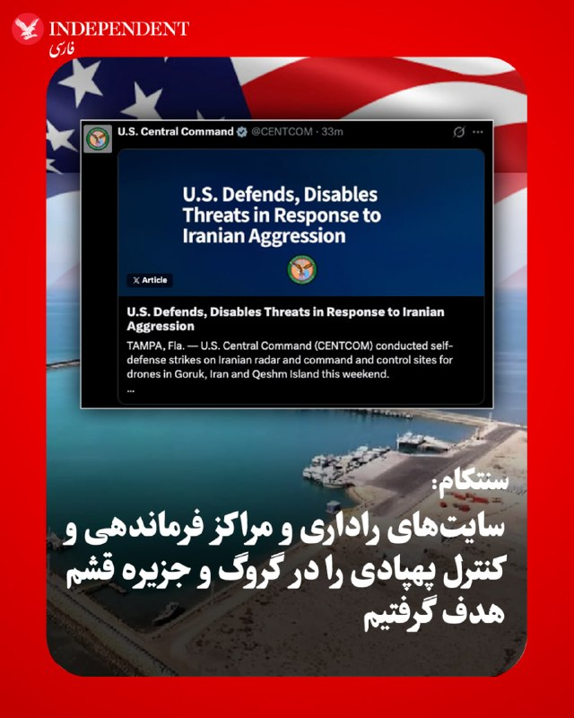
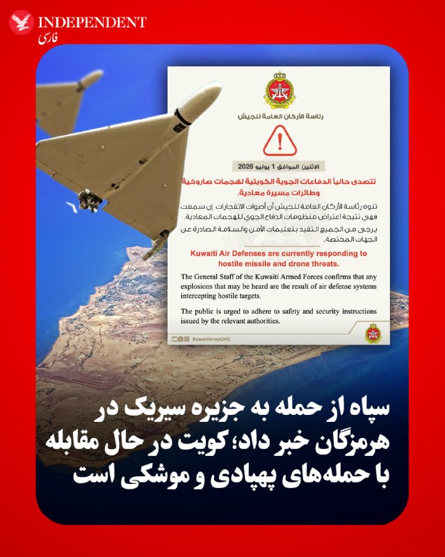
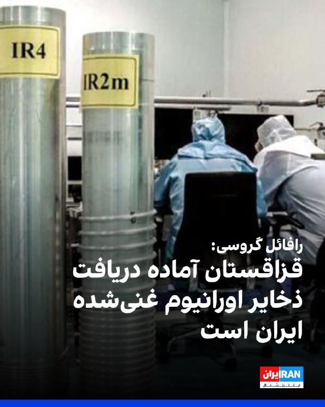
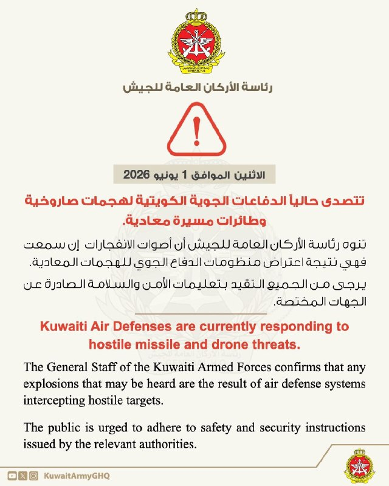
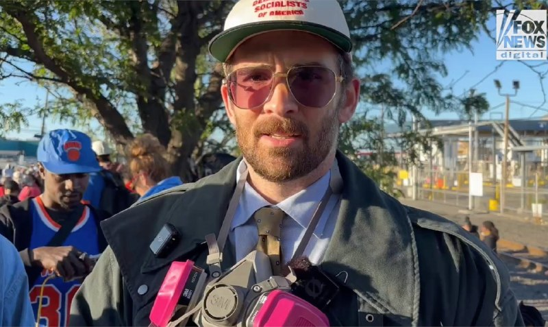
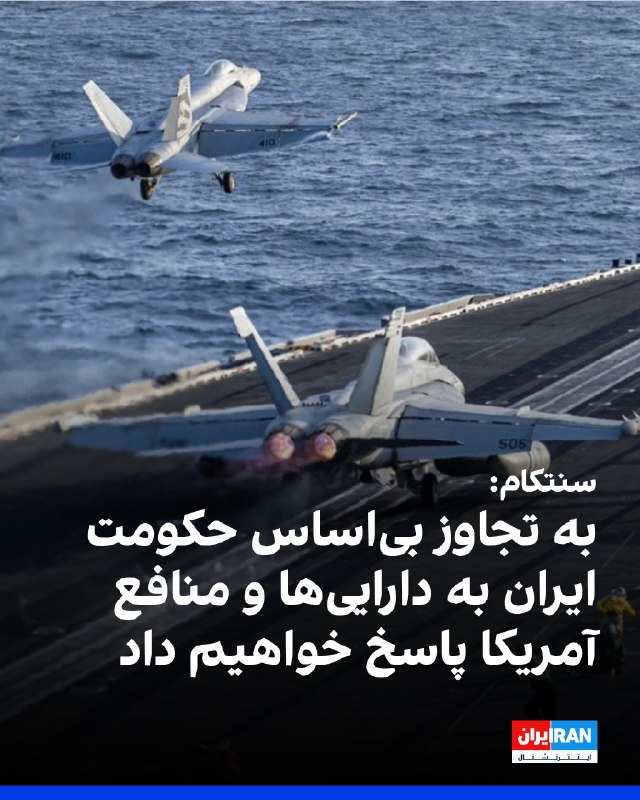
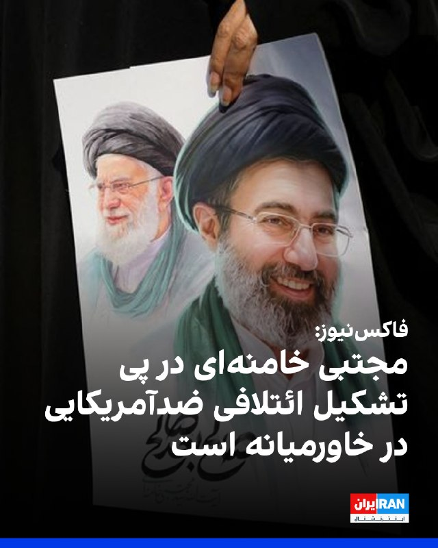
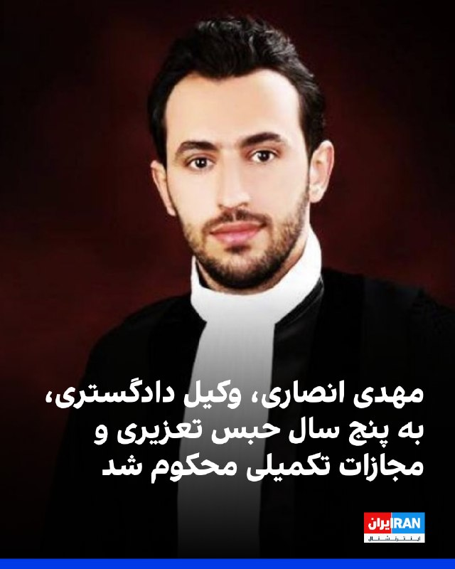

# خواننده تلگرام

<!-- TOP_NAV START -->

<a href="https://github.com/hosseinbaghi/aio-downloader/blob/main/telegram/content/archive_1.md" style="display:inline-block; padding:6px 12px; margin:0 4px; background-color:#2ea44f; color:white; text-decoration:none; border-radius:4px; font-weight:bold;">صفحه بعد</a>

<!-- TOP_NAV END -->

<!-- MSG START -->

---
📅 بروزرسانی: 1405/03/11 07:44
---

## VahidOOnLine — post 243149

  

فرماندهی مرکزی ایالات متحده، سنتکام، در شبکه اجتماعی ایکس تاکید کرد: «در پاسخ به تجاوز بی‌اساس ایران در طول آتش‌بس جاری، به حفاظت از دارایی‌ها و منافع ایالات متحده ادامه خواهد داد.»

سنتکام نوشت که این فرماندهی در روزهای اخیر حملات دفاع از خود را علیه سایت‌های راداری و فرماندهی و کنترل پهپادهای حکومت ایران در منطقه روستایی گورک، و جزیره قشم انجام داد.

فرماندهی مرکزی ایالات متحده افزود: «این حملات سنجیده و حساب‌شده روزهای شنبه و یکشنبه در پاسخ به اقدامات تهاجمی ایران از جمله سرنگونی یک پهپاد ام‌کیو یک آمریکایی که بر فراز آب‌های بین‌المللی در حال پرواز بود، انجام شدند.»

سنتکام نوشت: «جنگنده‌های آمریکایی به سرعت با از بین بردن پدافند هوایی ایران، یک ایستگاه کنترل زمینی و دو پهپاد انتحاری که تهدید آشکاری برای کشتی‌های عبوری از آب‌های منطقه‌ای ایجاد می‌کردند، واکنش نشان دادند» و «هیچ یک از نیروهای نظامی آمریکایی آسیب ندیدند.»
‌🏁 🇬🇧 IranintlTV

🤖 @VahidOOnLine

## VahidOOnLine — post 243148

  

♦️فرماندهی مرکزی ایالات متحده (سنتکام) صبح دوشنبه اعلام کرد که در در دو روز گذشته حملات «دفاع از خود» علیه سایت‌های راداری و مراکز فرماندهی و کنترل پهپادهای ایران در گروگ (شهر گروگ در میانه غربی شهرستان سیریک واقع شده) و جزیره قشم انجام داده است.
به گفته این فرماندهی، این حملات «حساب‌شده و هدفمند» روزهای شنبه و یکشنبه در پاسخ به اقدامات تهاجمی رژیم ایران انجام شد؛ اقداماتی که شامل سرنگونی یک پهپاد آمریکایی ام‌کیو-۱ MQ-1 بود که در حال فعالیت بر فراز آب‌های بین‌المللی بود. جنگنده‌های آمریکایی به‌سرعت واکنش نشان داده و پدافند هوایی ایران، یک ایستگاه کنترل زمینی و دو پهپاد تهاجمی یک‌طرفه را که تهدیدی آشکار برای کشتی‌های عبوری در آب‌های منطقه‌ای بودند، از بین بردند.
در این بیانیه آمده است که هیچ‌یک از نظامیان آمریکایی آسیب ندیده‌اند. سنتکام تأکید کرده است که در واکنش به اقدامات «غیرموجه» ایران در جریان آتش‌بس جاری، به حفاظت از نیروها و منافع آمریکا ادامه خواهد داد.
‌🇸🇦 Indypersian

🤖 @VahidOOnLine

## VahidOOnLine — post 243147

  

روزنامه شرق گزارش داد پس از اعتراضات دی‌ماه و در ادامه روند تشکیل پرونده‌های انضباطی برای دانشجویان، دانشگاه‌های ایران بار دیگر پیگیری پرونده‌ها و صدور احکام جدید را آغاز کرده‌اند؛ احکامی که این روزنامه آن‌ها را «کم‌سابقه» توصیف کرده است.

شرق دوشنبه ۱۱ خرداد نوشت در دانشگاه شریف، پنج تا هفت دانشجو حکم اخراج گرفته‌اند و بیش از ۲۰ دانشجو نیز یک تا سه ترم از تحصیل تعلیق شده‌اند.

بر اساس این گزارش، سامانه‌های آموزشی ۲۰ تا ۲۵ دانشجوی دانشگاه شهید بهشتی از دسترس خارج شده، برای بیش از ۱۰۰ دانشجوی دانشگاه علم و صنعت پرونده انضباطی تشکیل شده و ۱۵۰ تا ۲۰۰ دانشجوی دانشگاه تهران در حال نوشتن دفاعیه‌های خود هستند.

شرق همچنین نوشت رسیدگی به این پرونده‌ها با «نقض گسترده» اصول شیوه‌نامه انضباطی همراه بوده است.

این برخوردها در حالی ادامه دارد که حسین سیمایی‌صراف، وزیر علوم دولت مسعود پزشکیان، پیش‌تر گفته بود مانعی برای تحصیل هیچ دانشجویی وجود ندارد و همه دانشجویان محروم‌شده به دانشگاه بازگشته‌اند.
متن کامل را اینجا بخوانید
‌🏁 🇬🇧 IranintlTV

🤖 @VahidOOnLine

## VahidOOnLine — post 243146

  

♦️خبرگزاری دولتی کویت بامداد دوشنبه اعلام کرد که دفاع هوایی این کشور در حال مقابله با حمله‌های موشکی و پهپادی است و آژیر خطر در سراسر کشور به صدا در آمده است. سپاه پاسداران نیز در بیانیه‌ای اعلام کرد که به دنبال «تجاوز ساعتی پیش آمریکا به یک دکل مخابراتی در جزیر سیریک در استان هرمزگان، مبدا تجاوز هدف گرفته شده است.» هفته گذشته نیز به دنبال حمله‌ای در شرق بندرعباس که رویترز اعلام کرد هدف آن یک سایت نظامی بوده، کویت از مقابله با پهپادها و موشک‌ها خبر داده بود. همزمان، سپاه پاسداران نیز اعلام کرد که مبدا حمله به بندرعباس را هدف حمله قرار داده است.
‌🇸🇦 Indypersian

🤖 @VahidOOnLine

## VahidOOnLine — post 243145

♦️حسین طاهری، مداح حکومتی، در جمع حامیان جمهوری اسلامی درباره مذاکرات و توافق احتمالی تهران و واشنگتن خطاب به مقامات گفت: «اگر دارید مذاکره یا توافق می‌کنید یا اگر جنگ است، نتیجه‌اش را بگویید تا ما تکلیف خودمان را در خیابان‌ها بدانیم».
‌🇸🇦 Indypersian

🤖 @VahidOOnLine

## VahidOOnLine — post 243144

  

ستاد کل ارتش کویت دقایقی پیش اعلام کرد سامانه‌های پدافند هوایی این کشور در حال مقابله با حملات موشکی و پهپادی دشمن هستند.

به گزارش خبرگزاری رویترز، جزییات بیشتری درباره این حمله پهپادی منتشر نشده است.

ارتش کویت در بیانیه خود تاکید کرد که صداهای احتمالی انفجار ناشی از رهگیری اهداف مهاجم از سوی سامانه‌های پدافندی است و از شهروندان خواست دستورالعمل‌های ایمنی را رعایت کنند.
‌🏁 🇬🇧 IranintlTV

🤖 @VahidOOnLine

## VahidOOnLine — post 243143

  

آکسیوس گزارش داد که ایالات متحده در قالب یک گام اولیه برای برقراری صلح، پیشنهاد کرده است که حزب‌الله تمام حملات خود به اسرائیل را متوقف کند.

به نوشته آکسیوس، این پیشنهاد در چارچوب تلاش‌های دیپلماتیک برای کاهش تنش در مرزهای لبنان و اسرائیل مطرح شده است.
‌🏁 🇬🇧 IranintlTV

🤖 @VahidOOnLine

## VahidOOnLine — post 243142

♦️براساس تصاویر منتشر شده در شبکه‌های اجتماعی، احمد الشرع، رئیس‌جمهوری سوریه و همسرش لطیفه الدروبی، در جدیدترین حضور غیررسمی خود در یکی از رستوران‌های شهر دمشق دیده شدند. این حضور علنی در حالی صورت گرفت که او پیش از این نیز در ۳۱ فروردین‌ماه، با حضور در مراسم افتتاحیه ورزشگاه «الفیحا» دمشق و انجام بازی بسکتبال، توجه رسانه‌ها را به خود جلب کرده بود.
‌🇸🇦 Indypersian

🤖 @VahidOOnLine

## VahidOOnLine — post 243141

  <a href="telegram/content/VahidOOnLine_243141_1780287279.mp4" target="_blank">🎬 Download video</a>

♦️به گزارش رسانه‌های ایران، روز یکشنبه، ۱۰ خرداد نخستین جلسه سومین سال فعالیت مجلس دوازدهم «به‌صورت مجازی» و به ریاست محمدباقر قالیباف در مکانی نامعلوم برگزار شد. باوجود اینکه ساختمان مجلس شورای اسلامی هدف حملات نبوده است، اما در چهار ماه اخیر، محمدباقر قالیباف و نمایندگان مجلس شورای اسلامی از حضور در مجلس و برگزاری جلسه در آن خودداری کرده‌اند. بنا بر گزارش‌ها، این جلسه با حضور ۱۸۷ نماینده به‌صورت مجازی و ۱۴ نماینده به‌صورت حضوری برگزار شد و اعضای جدید هیئت‌رئیسه مجلس سوگند یاد کردند. پیش از این، عباس گودرزی، سخنگوی هئیت رئیسه مجلس شورای اسلامی، اعلام کرده بود که به دلیل «تدابیر امنیتی و شرایط موجود» نخستین جلسه صحن علنی مجلس از آغاز جنگ جاری روز یکشنبه به صورت «ویدئو کنفرانس» برگزار خواهد شد. آخرین جلسه علنی مجلس شورای اسلامی روز ۲۸ بهمن‌ماه سال گذشته برگزار شد.
‌🇸🇦 Indypersian

🤖 @VahidOOnLine

## VahidOOnLine — post 243139

♦️به گزارش رویترز، امانوئل مکرون روز یکشنبه، در کاخ ریاست‌جمهوری الیزه میزبان بازیکنان پاریس سن‌ ژرمن بود که پس از شکست دادن آرسنال در مسابقه نهایی بوداپست و کسب جام، به پایتخت بازگشته بودند. مکرون در سخنرانی خود خطاب به شاگردان لوئیس انریکه گفت: «شما ما را تا آخرین ثانیه به هیجان آوردید؛ به لطف پاریس سن‌ ژرمن، فرانسه توانست در دو سال کاری را انجام دهد که در ۷۰ سال تاریخ فوتبال ما بی‌سابقه بوده، یعنی کسب دو عنوان قهرمانی.» رئیس‌جمهوری فرانسه که همراه با همسرش، بریژیت مکرون، میزبان بازیکنان این تیم بود، با اشاره به برخی ناآرامی‌ها و آشوب‌های خیابانی جریان جشن‌های مردمی، با تاکید بر برخورد قاطع با افراد بازداشت‌شده افزود: «این رفتارها ربطی به فوتبال و ورزش ندارد و آن چیزی نیست که ما به آن عشق می‌ورزیم.»
‌🇸🇦 Indypersian

🤖 @VahidOOnLine

## VahidOOnLine — post 243138

  

رافائل گروسی، مدیرکل آژانس بین‌المللی انرژی اتمی، گفت قزاقستان اعلام کرده است که در صورت دستیابی واشینگتن و تهران به توافق هسته‌ای، آماده دریافت ذخایر اورانیوم غنی‌شده ایران است.

گروسی به فایننشال تایمز گفت که قاسم جومارت توکایف، رییس‌جمهوری قزاقستان، در جریان مذاکراتی در آستانه، تمایل خود را برای دریافت این ذخایر نشان داده است.

او افزود از آنجا که آژانس بین‌المللی انرژی اتمی داراییک «بانک» برای ذخیره اورانیوم با غنای پایین در قزاقستان است، این کشور «مکانی» دارد که می‌توان این اورانیوم را به طور ایمن در آن ذخیره کرد.

اورانیوم غنی‌شده جمهوری اسلامی موضوعی کلیدی در مذاکرات بین ایالات متحده و جمهوری اسلامی است.
‌🏁 🇬🇧 IranintlTV

🤖 @VahidOOnLine

## VahidOOnLine — post 243137

♦️مهدی خراتیان، کارشناس حکومتی، با انتقاد از پافشاری بر دکترین هسته‌ای فعلی و در واکنش به تهدیدهای خارجی گفت: «ما بارها، از جمله از طرف ترامپ، به صورت تلویحی و تصریحا مورد تهدید اتمی قرار گرفته‌ایم. نمی‌توانیم صرفا بگوییم چون فتوایی داریم، پس تحت هر شرایطی بمب اتمی نمی‌سازیم.» خراتیان با توجه به دو سال باقیمانده از دوران ریاست‌جمهوری دونالد ترامپ گفت: «این وضعیت دیگر قابل تحمل نیست. نمی‌توانیم رهبرمان را برای دو سال زیر زمین نگه داریم.»
‌🇸🇦 Indypersian

🤖 @VahidOOnLine

## VahidOOnLine — post 243136

  

فاکس‌نیوز در گزارشی نوشت که مجتبی خامنه‌ای در واکنش به تلاش‌های دونالد ترامپ برای گسترش پیمان ابراهیم، درصدد ایجاد یک ائتلاف منطقه‌ای علیه نظم تحت رهبری آمریکا است و می‌کوشد کشورهای خاورمیانه را زیر پرچم «تمدن نوین اسلامی» گرد هم آورد.

در این گزارش آمده است که رهبر جمهوری اسلامی، کارزاری سیاسی و ایدئولوژیک را برای مقابله با نفوذ آمریکا در خاورمیانه آغاز کرده و تلاش دارد کشورهای منطقه را به سمت نوعی همگرایی اسلامی تحت رهبری تهران سوق دهد.

این گزارش می‌گوید تحرکات اخیر تهران تنها چند ساعت پس از آن آغاز شد که ترامپ با رهبران عربستان سعودی، امارات متحده عربی، قطر، ترکیه، پاکستان، مصر، اردن و بحرین درباره گسترش پیمان ابراهیم گفت‌وگو کرد. ترامپ همچنین در ۲۵ مه [۴ خرداد] در شبکه اجتماعی تروث سوشال از توسعه این پیمان حمایت کرده بود.

به نوشته فاکس‌نیوز، یک روز بعد، مجتبی خامنه‌ای در پیامی [منتسب به او] در شبکه اجتماعی ایکس خواستار شکل‌گیری «تمدن نوین اسلامی» شد و از دولت‌های اسلامی خواست برای پیشرفت «امت اسلامی» و حل مشکلات جهان اسلام با یکدیگر همکاری کنند.
متن کامل را اینجا بخوانید
‌🏁 🇬🇧 IranintlTV

🤖 @VahidOOnLine

## VahidOOnLine — post 243135

  

یک مقام رسمی ایالات متحده به روزنامه نیویورک‌تایمز گفت ارتش آمریکا بی‌سروصدا کشتی‌ها را برای عبور از تنگه هرمز هدایت می‌کند.

یک مقام دیگر که خواست نامش فاش نشود، ‌به این روزنامه گفت فرماندهی مرکزی ایالات متحده، سنتکام، طی سه هفته گذشته، حدود ۷۰ کشتی تجاری را که به خلیج فارس وارد و از آن خارج می‌شدند، از این تنگه عبور داده است.

به نوشته نیویورک‌تایمز، مقام‌های آمریکایی اشاره کردند که بیشتر کشتی‌ها برای جلوگیری از شناسایی شدن توسط جمهوری اسلامی، هنگام عبور از این آبراه، فرستنده‌های خود را خاموش کرده‌ بودند.

آن‌ها در مورد نوع کشتی‌هایی که از تگه هرمز عبور ‌کردند و همچنین مقصد آن‌ها توضیحی ندادند.

اما یکی از این مقام‌ها به نیویورک‌تایمز گفت که مسیر آن‌ها نزدیک خط ساحلی ایران نبود.

بر اساس این گزارش، تحلیلگران امور کشتیرانی می‌گویند به نظر می‌رسد که گذرگاه‌های هدایت‌شده توسط ایالات متحده به عمان نزدیک‌تر هستند.

نیویورک‌تایمز اشاره کرد مسیر هماهنگ شده با آمریکا جایگزینی برای مالکان کشتی‌هایی به شمار می‌رود که نمی‌خواهند برای عبور از تنگه هرمز مجبور به دریافت اجازه از تهران یا پرداخت عوارض باشند.
https://iran
‌🏁 🇬🇧 IranintlTV

🤖 @VahidOOnLine

## VahidOOnLine — post 243134

♦️محسن هاشمی رفسنجانی، رئیس شورای مرکزی حزب کارگزاران سازندگی، در گفتگو با «جماران» درباره نحوه مواجهه با دولت جدید آمریکا، ضمن «گاو خشمگین» خواندن دونالد ترامپ گفت: «یک عقل سلیمی الان می‌گوید که ما باید یک کاری بکنیم که این گاو خشمگین، این دوران دو سال مانده‌اش را یک‌جوری طی بکند و از قدرت آمریکا کنار برود». پسر بزرگ اکبر هاشمی رفسنجانی گفت: «مگر خود ترامپ زیر توافقنامه‌اش نزد و آن را پاره نکرد؟ خب ما هم پاره می‌کنیم، اتفاقی نمی‌افتد.»
‌🇸🇦 Indypersian

🤖 @VahidOOnLine

## VahidOOnLine — post 243133

♦️بر اساس گزارش رویترز، یکشنبه‌شب، پدیده نادر «ماه آبی» بر فراز معبد باستانی «پوزئیدون» در منطقه «دماغه‌ سونیون» یونان طلوع کرد. رویدادی نسبتا کم‌نظیر که به دومین ماه کامل در طول یک ماه تقویمی اطلاق می‌شود و این‌بار، نشانه پایانی برای فصل بهار است. با وجود نام این پدیده، رنگ ماه در واقعیت آبی نیست و طبق اعلام سازمان فضایی «ناسا»، این پدیده یکی از کوچک‌ترین ماه‌های کامل سال به شمار می‌رود که به «ماه مینیاتوری» (Micromoon) معروف است.
‌🇸🇦 Indypersian

🤖 @VahidOOnLine

## VahidOOnLine — post 243132

  

♦️دونالد ترامپ، رئیس جمهوری آمریکا در پیامی در تروث سوشال نوشت: «رسانه جعلی سی‌ان‌ان امروز طبق روال همیشگی خود ادعا کرد که توافق هسته‌ای من با ایران درباره موضوع هسته‌ای چیزی نمی‌گوید؛ در حالی که این توافق به‌روشنی تصریح می‌کند که ایران به سلاح هسته‌ای دست نخواهد یافت.
این توافق سپس با جزئیات فراوان و بسیار قاطع، به جنبه‌های مختلف دیگر موضوع هسته‌ای می‌پردازد. در واقع، بخش عمده این توافق دقیقا درباره همین موضوع است.
سی‌ان‌ان و بسیاری دیگر از رسانه‌های جعلی، به فاجعه‌ای از نظر میزان مخاطب تبدیل شده‌اند. حتی با وجود مالکان جدید نیز بعید است هرگز بهتر شوند!!»
‌🇸🇦 Indypersian

🤖 @VahidOOnLine

## VahidOOnLine — post 243131

  

مهدی انصاری، وکیل، عضو کانون وکلای دادگستری فارس و کهگیلویه و بویراحمد و از بازداشت‌شدگان اعتراضات دی‌ماه ۱۴۰۴، توسط دادگاه انقلاب اسلامی شیراز به «پنج سال حبس تعزیری و مجازات تکمیلی» محکوم شد.

به گزارش سازمان حقوق بشری هه‌نگاو، در این حکم که به انصاری ابلاغ شده است، او از بابت اتهام «اجتماع و تبانی به قصد برهم زدن امنیت کشور» به تحمل ۵ سال حبس تعزیری محکوم شده است.

انصاری همچنین به عنوان مجازات تکمیلی به دو سال منع خروج از کشور محکوم شده است.

هه‌نگاو اشاره کرد که این وکیل دادگستری هشتم بهمن سال گذشته و در جریان اعتراضات سراسری، به دست نیروهای حکومتی در منزل خود در شیراز، بازداشت شد.

او پساز پایان بازجویی، با تودیع قرار وثیقه ۵ میلیارد تومانی به صورت موقت و تا پایان مراحل دادرسی از زندان عادل‌آباد شیراز آزاد شده بود.
‌🏁 🇬🇧 IranintlTV

🤖 @VahidOOnLine

## VahidOOnLine — post 243130

  

♦️به گزارش دنیای اقتصاد، در حال حاضر هزینه خرید چهار قلم کالای اساسی خانگی تولید داخل، شامل یخچال، تلویزیون، جاروبرقی و ماشین لباسشویی، ۳۶ برابر پایه حقوق کارگران است و برای خرید فقط این چهار قلم باید سه سال همه حقوق خود را جمع کنند و هیچ هزینه‌ای انجام ندهند. براساس این گزارش، هزینه این چهار قلم کالای اساسی خانگی از نام‌های تجاری ایرانی دست‌کم ۳۷۵ میلیون تومان است . به نوشته دنیای اقتصاد، قیمت لوازن خانگی در یک دهه اخیر پنج هزار درصد افزایش یافته است.
‌🇸🇦 Indypersian

🤖 @VahidOOnLine

## mwarmonitor — post 9967

🔴دفاع آمریکا و خنثی‌سازی تهدیدات در پاسخ به تجاوزات ایران

🔸فرماندهی مرکزی ایالات متحده (سنتکام)

🔰تامپا، فلوریدا — فرماندهی مرکزی ایالات متحده (سنتکام) در پایان این هفته، حملات دفاع مشروعی را علیه رادارهای ایرانی و سایت‌های فرماندهی و کنترل پهپادها در گورک ایران و جزیره قشم انجام داد.

🔹این حملات سنجیده و حساب‌شده در روزهای شنبه و یکشنبه در پاسخ به اقدامات تهاجمی ایران، از جمله سرنگونی یک پهپاد MQ-1 آمریکایی که در حریم هوایی بین‌المللی در حال فعالیت بود، صورت گرفت.

🔹 جنگنده‌های آمریکایی با سرعت پاسخ دادند و پدافند هوایی ایران، یک ایستگاه کنترل زمینی و دو پهپاد تهاجمی انتحاری (یک‌طرفه) را که تهدیدی آشکار برای کشتی‌های در حال عبور از آب‌های منطقه بودند، منهدم کردند.

🔸به هیچ‌یک از اعضای خدمت‌گذار ارتش آمریکا آسیبی نرسید. سنتکام به محافظت از دارایی‌ها و منافع ایالات متحده در پاسخ به تجاوزات بی‌دلیل ایران در طول آتش‌بس جاری ادامه خواهد داد.

@mwarmonitor

## mwarmonitor — post 9966

  

🔸ستاد کل ارتش کویت دوشنبه، ۱ ژوئن ۲۰۲۶ پدافند هوایی کویت در حال حاضر در حال مقابله با تهدیدات موشکی و پهپادی متخاصم است. ستاد کل نیروهای مسلح کویت تایید می‌کند که هرگونه صدای انفجاری که ممکن است شنیده شود، ناشی از رهگیری اهداف متخاصم توسط سامانه‌های پدافند…

## mwarmonitor — post 9965

  

🚨فوری | خبرنگار الجزیره: آژیرهای هشدار در کویت به صدا درآمد. @mwarmonitor

## mwarmonitor — post 9964

🚨فوری | خبرنگار الجزیره: آژیرهای هشدار در کویت به صدا درآمد.

@mwarmonitor

## mwarmonitor — post 9963

🔴باراک راوید: یک مقام آمریکایی به من گفت که وزیر خارجه ایالات متحده، مارکو روبیو، طی ۴۸ ساعت گذشته با جوزف عون رئیس‌جمهور لبنان و بنیامین نتانیاهو نخست‌وزیر اسرائیل گفت‌وگو کرده تا ابتکار جدیدی برای آتش‌بس را پیش ببرد.

🔴 این مقام آمریکایی گفت ابتکار جدید در چارچوب مذاکرات جاری میان اسرائیل و لبنان پیشنهاد شده است.

🔴 به گفته این مقام، آمریکا برای پیشبرد این گفت‌وگوها پیشنهاد داده که در گام نخست، حزب‌الله تمامی حملات خود علیه اسرائیل را متوقف کند و در مقابل، اسرائیل از تشدید تنش در بیروت خودداری کند.

🔴 این مقام افزود که چنین اقدامی «فضایی برای کاهش تدریجی تنش و توقف مؤثر درگیری‌ها» ایجاد خواهد کرد.

🔴 به گفته مقام آمریکایی، رئیس‌جمهور عون تلاش کرد این پیشنهاد را پیش ببرد و به توافقی دست یابد، اما پاسخ نبیه بری، رئیس پارلمان لبنان، مبهم و ناامیدکننده بود.

🔴 این مقام ادعا کرد که بری مدعی شد می‌تواند پایبندی حزب‌الله به آتش‌بس را تضمین کند، اما مسئولیت آغاز توقف تیراندازی را بر عهده اسرائیل گذاشت؛ آن هم در حالی که به گفته او، حزب‌الله آغازگر این دور از درگیری‌ها بوده است.

🔴 این مقام آمریکایی تأکید کرد: «حزب‌الله از خط‌مشی تهران پیروی می‌کند و آشکارا هیچ علاقه‌ای به رفاه مردم لبنان ندارد.»

🔴به ادعای این مقام، ایران می‌خواهد درگیری در لبنان را طولانی کند تا بتواند بعداً مدعی شود که «اوضاع را نجات داده است».

🔴 این مقام گفت: «ایالات متحده انتظار ندارد اسرائیل حملات مداوم به غیرنظامیان خود از سوی یک سازمان تروریستی را تحمل کند. سریع‌ترین راه برای کاهش تنش و حفاظت از غیرنظامیان در همه طرف‌ها این است که حزب‌الله فوراً شلیک را متوقف کند.»

@mwarmonitor

## mwarmonitor — post 9962

🔴شبکه خبری جعلی سی‌ان‌ان (CNN) امروز طبق معمول ادعا کرد که توافق هسته‌ای ایرانِ من اصلاً درباره مسائل هسته‌ای صحبت نمی‌کند؛ در حالی که در واقع این توافق با وضوح کامل بیان می‌کند که ایران سلاح هسته‌ای نخواهد داشت. این توافق در ادامه، با جزئیاتی بسیار محکم و طولانی، به بحث درباره ابعاد مختلف دیگرِ موضوع هسته‌ای می‌پردازد. در حقیقت، بخش عمده‌ای از این توافق درباره همین موضوع است. سی‌ان‌ان و بسیاری دیگر از رسانه‌های خبری جعلی، یک فاجعه با میزان بیننده (رِیتینگ) پایین هستند. حتی با مدیریت و مالکیت جدید هم بعید است که وضعیت آن‌ها هرگز بهتر شود!!!

رئیس‌جمهور دونالد جی ترامپ

@mwarmonitor

## FoxNewsTwitter — post 342467

‌Fox News (Twitter/X)

👉 Full story here:

## FoxNewsTwitter — post 342466

  

Fox News (Twitter/X)

Hasan Piker gets denied entry to the UK over alleged antisemitism — then immediately blames 'Israel advocacy organizations' for wielding 'unbelievable amounts of power' over British policy.

The streamer's response to the ban landed on a classic antisemitic trope about Jewish influence, even as he insisted he harbors no antisemitism. British Jewish groups and a Labour MP had urged the government to block his visit, citing his comments about Hamas, Hezbollah, and his claim that the U.S. deserved 9/11.

The ban caps a brutal stretch for Piker: a Treasury Department subpoena over his Cuba trip, and hecklers confronting him at a Newark ICE protest calling him a 'f***ing fraud.'

## pm_afshaa — post 91979

  <a href="telegram/content/pm_afshaa_91979_1780287286.mp4" target="_blank">🎬 Download video</a>

موزیک جدید حامدفرد به اسم «بزن که خوب میزنی» منتشر شد و توی چند ساعت اول بازدید میلیونی گرفت

💧 Rainbet.com the #1 Non-KYC Crypto Casino & Sportsbook @rainbetcom

😁 @Pm_Afshaa

## pm_afshaa — post 91978

  <a href="telegram/content/pm_afshaa_91978_1780287287.mp4" target="_blank">🎬 Download video</a>

مداح حکومتی حسین طاهری:اگه دارین مذاکره می‌کنید به ماهم بگین که حداقل تکلیف خودمونو تو این دورهم جمع شدنایِ شبانه بدونیم.

💧 Rainbet.com the #1 Non-KYC Crypto Casino & Sportsbook @rainbetcom

😁 @Pm_Afshaa

## pm_afshaa — post 91977

  <a href="telegram/content/pm_afshaa_91977_1780287289.webm" target="_blank">🎬 Download video</a>

🔴محسن رضایی: با ادامه محاصره دریایی و مطرح کردن خواسته‌های بیش از حد در مذاکرات، ترامپ‌بار دیگر ثابت کرده که تمایلی به مذاکره و توافق نداره.

💧 Rainbet.com the #1 Non-KYC Crypto Casino & Sportsbook @rainbetcom

😁 @Pm_Afshaa

## VahidOnline — post 75834

بیانیه سپاه: ساعتی پیش آمریکا به دکل مخابراتی سیریک حمله کرده بود پاسخ دادیم

من اون موقع فقط از یک نفر دو پیام داشتم:
ساعت 4:00 چهار انفجار در شهرستان سیریک
پایگاه سپاه سرخور زدن

ساعت 4:26 دوباره یکی زد
هرمزگان شهرستان سیریک

و الان کسی تصویر دوم بالا رو فرستاد و نوشت:
"حدود ساعت چهار صبح، آمریکا با چند موشک به اینجا حمله کرد.
پایگاه نیروی دریایی سپاه شهرستان سیریک ، حوالی روستای گروک"

📡 @VahidOnline

## VahidOnline — post 75833

  <a href="telegram/content/VahidOnline_75833_1780287289.mp4" target="_blank">🎬 Download video</a>

'شلیک موشک از #امیدیه در خوزستان'
ویدیوی دریافتی دیگر از همان موشک،
دوشنبه ۱۱ خرداد ساعت ۶:۳۰
Vahid
ستاد کل ارتش کویت دقایقی پیش اعلام کرد سامانه‌های پدافند هوایی این کشور در حال مقابله با حملات موشکی و پهپادی دشمن هستند.

به گزارش خبرگزاری رویترز، جزییات بیشتری درباره این حمله پهپادی منتشر نشده است.

ارتش کویت در بیانیه خود تاکید کرد که صداهای احتمالی انفجار ناشی از رهگیری اهداف مهاجم از سوی سامانه‌های پدافندی است و از شهروندان خواست دستورالعمل‌های ایمنی را رعایت کنند.
@VahidOOnLine

📡 @VahidOnline

## VahidOnline — post 75832

  

بیانیه سنتکام درباره حملات شنبه و یکشنبه
(از جمله حمله به سیریک هرمزگان که با توجه به پستی پایین‌تر گویا ساعت ۴ صبح دوشنبه ایران انجام شده. در آمریکا هنوز یکشنبه است.)

ترجمه ماشین:
"آمریکا در واکنش به تجاوز ایران، از خود دفاع کرد و تهدیدها را از کار انداخت

تامپا، فلوریدا — فرماندهی مرکزی ایالات متحده آمریکا، سنتکام، این آخر هفته حملات دفاعی علیه سایت‌های راداری ایران و مراکز فرماندهی و کنترل پهپادها در گروک ایران و جزیره قشم انجام داد.

این حملات حساب‌شده و عامدانه، روزهای شنبه و یکشنبه و در پاسخ به اقدامات تهاجمی ایران انجام شد؛ اقداماتی که شامل سرنگونی یک پهپاد MQ-1 آمریکا بود که بر فراز آب‌های بین‌المللی فعالیت می‌کرد. جنگنده‌های آمریکایی به‌سرعت واکنش نشان دادند و پدافند هوایی ایران، یک ایستگاه کنترل زمینی، و دو پهپاد تهاجمی یک‌طرفه را که تهدیدی آشکار برای کشتی‌های در حال عبور از آب‌های منطقه‌ای محسوب می‌شدند، منهدم کردند.

هیچ‌یک از نیروهای نظامی آمریکا آسیب ندیدند. سنتکام در جریان آتش‌بس جاری، در واکنش به تجاوز بی‌دلیل ایران، به حفاظت از دارایی‌ها و منافع ایالات متحده ادامه خواهد داد."
CENTCOM

📡 @VahidOnline

## VahidOnline — post 75828

  <a href="telegram/content/VahidOnline_75828_1780287290.mp4" target="_blank">🎬 Download video</a>

'شلیک موشک از #امیدیه در خوزستان'
تصاویر دریافتی، دوشنبه ۱۱ خرداد ساعت ۶:۳۰ به وقت #ایران
Vahid

📡 @VahidOnline

## VahidOnline — post 75827

  

شلیک موشک به کویت

دوباره همز‌مان پیام‌هایی درباره شلیک موشک از امیدیه خوزستان و اعلام هشدار در کویت دریافت کردم.
دوشنبه ۱۱ خرداد
ساعت ۶ به وقت کویت که میشه ساعت ۶:۳۰ به وقت ایران
Vahid

📡 @VahidOnline

## IranIntlTV — post 339963

  

فرماندهی مرکزی ایالات متحده، سنتکام، در شبکه اجتماعی ایکس تاکید کرد: «در پاسخ به تجاوز بی‌اساس ایران در طول آتش‌بس جاری، به حفاظت از دارایی‌ها و منافع ایالات متحده ادامه خواهد داد.»

سنتکام نوشت که این فرماندهی در روزهای اخیر حملات دفاع از خود را علیه سایت‌های راداری و فرماندهی و کنترل پهپادهای حکومت ایران در منطقه روستایی گورک، و جزیره قشم انجام داد.

فرماندهی مرکزی ایالات متحده افزود: «این حملات سنجیده و حساب‌شده روزهای شنبه و یکشنبه در پاسخ به اقدامات تهاجمی ایران از جمله سرنگونی یک پهپاد ام‌کیو یک آمریکایی که بر فراز آب‌های بین‌المللی در حال پرواز بود، انجام شدند.»

سنتکام نوشت: «جنگنده‌های آمریکایی به سرعت با از بین بردن پدافند هوایی ایران، یک ایستگاه کنترل زمینی و دو پهپاد انتحاری که تهدید آشکاری برای کشتی‌های عبوری از آب‌های منطقه‌ای ایجاد می‌کردند، واکنش نشان دادند» و «هیچ یک از نیروهای نظامی آمریکایی آسیب ندیدند.»
https://iranintl.com/202606012118

## IranIntlTV — post 339962

  

روزنامه شرق گزارش داد پس از اعتراضات دی‌ماه و در ادامه روند تشکیل پرونده‌های انضباطی برای دانشجویان، دانشگاه‌های ایران بار دیگر پیگیری پرونده‌ها و صدور احکام جدید را آغاز کرده‌اند؛ احکامی که این روزنامه آن‌ها را «کم‌سابقه» توصیف کرده است.

شرق دوشنبه ۱۱ خرداد نوشت در دانشگاه شریف، پنج تا هفت دانشجو حکم اخراج گرفته‌اند و بیش از ۲۰ دانشجو نیز یک تا سه ترم از تحصیل تعلیق شده‌اند.

بر اساس این گزارش، سامانه‌های آموزشی ۲۰ تا ۲۵ دانشجوی دانشگاه شهید بهشتی از دسترس خارج شده، برای بیش از ۱۰۰ دانشجوی دانشگاه علم و صنعت پرونده انضباطی تشکیل شده و ۱۵۰ تا ۲۰۰ دانشجوی دانشگاه تهران در حال نوشتن دفاعیه‌های خود هستند.

شرق همچنین نوشت رسیدگی به این پرونده‌ها با «نقض گسترده» اصول شیوه‌نامه انضباطی همراه بوده است.

این برخوردها در حالی ادامه دارد که حسین سیمایی‌صراف، وزیر علوم دولت مسعود پزشکیان، پیش‌تر گفته بود مانعی برای تحصیل هیچ دانشجویی وجود ندارد و همه دانشجویان محروم‌شده به دانشگاه بازگشته‌اند.
متن کامل را اینجا بخوانید
https://iranintl.com/202606016808

## IranIntlTV — post 339961

  

ستاد کل ارتش کویت دقایقی پیش اعلام کرد سامانه‌های پدافند هوایی این کشور در حال مقابله با حملات موشکی و پهپادی دشمن هستند.

به گزارش خبرگزاری رویترز، جزییات بیشتری درباره این حمله پهپادی منتشر نشده است.

ارتش کویت در بیانیه خود تاکید کرد که صداهای احتمالی انفجار ناشی از رهگیری اهداف مهاجم از سوی سامانه‌های پدافندی است و از شهروندان خواست دستورالعمل‌های ایمنی را رعایت کنند.
https://iranintl.com/202606016607

## IranIntlTV — post 339960

  

آکسیوس گزارش داد که ایالات متحده در قالب یک گام اولیه برای برقراری صلح، پیشنهاد کرده است که حزب‌الله تمام حملات خود به اسرائیل را متوقف کند.

به نوشته آکسیوس، این پیشنهاد در چارچوب تلاش‌های دیپلماتیک برای کاهش تنش در مرزهای لبنان و اسرائیل مطرح شده است.
https://iranintl.com/202606018578

## IranIntlTV — post 339959

  

رافائل گروسی، مدیرکل آژانس بین‌المللی انرژی اتمی، گفت قزاقستان اعلام کرده است که در صورت دستیابی واشینگتن و تهران به توافق هسته‌ای، آماده دریافت ذخایر اورانیوم غنی‌شده ایران است.

گروسی به فایننشال تایمز گفت که قاسم جومارت توکایف، رییس‌جمهوری قزاقستان، در جریان مذاکراتی در آستانه، تمایل خود را برای دریافت این ذخایر نشان داده است.

او افزود از آنجا که آژانس بین‌المللی انرژی اتمی داراییک «بانک» برای ذخیره اورانیوم با غنای پایین در قزاقستان است، این کشور «مکانی» دارد که می‌توان این اورانیوم را به طور ایمن در آن ذخیره کرد.

اورانیوم غنی‌شده جمهوری اسلامی موضوعی کلیدی در مذاکرات بین ایالات متحده و جمهوری اسلامی است.
https://iranintl.com/202606010885

## IranIntlTV — post 339958

  

فاکس‌نیوز در گزارشی نوشت که مجتبی خامنه‌ای در واکنش به تلاش‌های دونالد ترامپ برای گسترش پیمان ابراهیم، درصدد ایجاد یک ائتلاف منطقه‌ای علیه نظم تحت رهبری آمریکا است و می‌کوشد کشورهای خاورمیانه را زیر پرچم «تمدن نوین اسلامی» گرد هم آورد.

در این گزارش آمده است که رهبر جمهوری اسلامی، کارزاری سیاسی و ایدئولوژیک را برای مقابله با نفوذ آمریکا در خاورمیانه آغاز کرده و تلاش دارد کشورهای منطقه را به سمت نوعی همگرایی اسلامی تحت رهبری تهران سوق دهد.

این گزارش می‌گوید تحرکات اخیر تهران تنها چند ساعت پس از آن آغاز شد که ترامپ با رهبران عربستان سعودی، امارات متحده عربی، قطر، ترکیه، پاکستان، مصر، اردن و بحرین درباره گسترش پیمان ابراهیم گفت‌وگو کرد. ترامپ همچنین در ۲۵ مه [۴ خرداد] در شبکه اجتماعی تروث سوشال از توسعه این پیمان حمایت کرده بود.

به نوشته فاکس‌نیوز، یک روز بعد، مجتبی خامنه‌ای در پیامی [منتسب به او] در شبکه اجتماعی ایکس خواستار شکل‌گیری «تمدن نوین اسلامی» شد و از دولت‌های اسلامی خواست برای پیشرفت «امت اسلامی» و حل مشکلات جهان اسلام با یکدیگر همکاری کنند.
متن کامل را اینجا بخوانید
https://iranintl.com/2026053140

## IranIntlTV — post 339957

  

یک مقام رسمی ایالات متحده به روزنامه نیویورک‌تایمز گفت ارتش آمریکا بی‌سروصدا کشتی‌ها را برای عبور از تنگه هرمز هدایت می‌کند.

یک مقام دیگر که خواست نامش فاش نشود، ‌به این روزنامه گفت فرماندهی مرکزی ایالات متحده، سنتکام، طی سه هفته گذشته، حدود ۷۰ کشتی تجاری را که به خلیج فارس وارد و از آن خارج می‌شدند، از این تنگه عبور داده است.

به نوشته نیویورک‌تایمز، مقام‌های آمریکایی اشاره کردند که بیشتر کشتی‌ها برای جلوگیری از شناسایی شدن توسط جمهوری اسلامی، هنگام عبور از این آبراه، فرستنده‌های خود را خاموش کرده‌ بودند.

آن‌ها در مورد نوع کشتی‌هایی که از تگه هرمز عبور ‌کردند و همچنین مقصد آن‌ها توضیحی ندادند.

اما یکی از این مقام‌ها به نیویورک‌تایمز گفت که مسیر آن‌ها نزدیک خط ساحلی ایران نبود.

بر اساس این گزارش، تحلیلگران امور کشتیرانی می‌گویند به نظر می‌رسد که گذرگاه‌های هدایت‌شده توسط ایالات متحده به عمان نزدیک‌تر هستند.

نیویورک‌تایمز اشاره کرد مسیر هماهنگ شده با آمریکا جایگزینی برای مالکان کشتی‌هایی به شمار می‌رود که نمی‌خواهند برای عبور از تنگه هرمز مجبور به دریافت اجازه از تهران یا پرداخت عوارض باشند.
https://iran

## IranIntlTV — post 339956

  

مهدی انصاری، وکیل، عضو کانون وکلای دادگستری فارس و کهگیلویه و بویراحمد و از بازداشت‌شدگان اعتراضات دی‌ماه ۱۴۰۴، توسط دادگاه انقلاب اسلامی شیراز به «پنج سال حبس تعزیری و مجازات تکمیلی» محکوم شد.

به گزارش سازمان حقوق بشری هه‌نگاو، در این حکم که به انصاری ابلاغ شده است، او از بابت اتهام «اجتماع و تبانی به قصد برهم زدن امنیت کشور» به تحمل ۵ سال حبس تعزیری محکوم شده است.

انصاری همچنین به عنوان مجازات تکمیلی به دو سال منع خروج از کشور محکوم شده است.

هه‌نگاو اشاره کرد که این وکیل دادگستری هشتم بهمن سال گذشته و در جریان اعتراضات سراسری، به دست نیروهای حکومتی در منزل خود در شیراز، بازداشت شد.

او پساز پایان بازجویی، با تودیع قرار وثیقه ۵ میلیارد تومانی به صورت موقت و تا پایان مراحل دادرسی از زندان عادل‌آباد شیراز آزاد شده بود.
https://iranintl.com/202606018525

## IranIntlTV — post 339955

  <a href="telegram/content/IranIntlTV_339955_1780287295.mp4" target="_blank">🎬 Download video</a>

ارتش اسرائیل روز یک‌شنبه ۱۰ خرداد با انتشار ویدیوهایی از تصرف قلعه ۹۰۰ ساله شقیف (بوفور) در ارتفاعات راهبردی جنوب لبنان خبر داد.

به گفته ارتش اسرائیل، هدف از این عملیات تضعیف شبه‌نظامیان حزب‌الله و زیرساخت‌های این گروه در ارتفاعاتی است که به گفته اسرائیل با هدایت جمهوری اسلامی در این منطقه ایجاد شده‌اند.

تصرف این قلعه و ارتفاعات اطراف آن، پیش‌روی اسرائیل در لبنان را گسترش می‌دهد.
@iranintltv

## Shin_Persian — post 6345

  

Shin ✓ @hey_itsmyturn
Mon, 01 Jun 2026 03:09:11 UTC

Kuwait Ministry of Defense:
Air defenses are currently engaging hostile missile and drone attacks.

General Staff notes that explosion sounds are the result of air defense interceptions.

Follow safety instructions …

Source: https://x.com/i/web/status/2061283849951166777

فارسی

وزارت دفاع کویت:
پدافند هوایی در حال حاضر در حال درگیری با حملات موشکی و پهپادی متخاصم است.

ستاد کل نیروهای مسلح خاطرنشان می‌کند که صدای انفجارها ناشی از رهگیری‌های پدافند هوایی است.

دستورالعمل‌های ایمنی را رعایت کنید ...

منبع: https://x.com/i/web/status/2061283849951166777

𝕏 · @shin_persian

## Shin_Persian — post 6344

  

Shin ✓ @hey_itsmyturn
Mon, 01 Jun 2026 03:07:57 UTC

Kuwaiti Air Defenses are currently responding to hostile missile and drone attacks.

General Staff of the Army: Explosions heard are the result of interceptions.

Follow all safety instructions from authorities.

#Kuwa…

Source: https://x.com/i/web/status/2061283538721206351

فارسی

پدافند هوایی کویت در حال حاضر در حال مقابله با حملات موشکی و پهپادی متخاصم است.

ستاد کل ارتش: انفجارهای شنیده شده نتیجه رهگیری‌ها است.

تمامی دستورالعمل‌های ایمنی مقامات را رعایت کنید.

#Kuwa…

منبع: https://x.com/i/web/status/2061283538721206351

𝕏 · @shin_persian

## FarsiVOA — post 219224

🔺داروی «انقلابی» سرطان پانکراس؛ بیماران دو برابر بیشتر زنده ماندند

▪️نتایج یک پژوهش مهم که روز یکشنبه در نشست سالانه انجمن سرطان‌شناسی بالینی آمریکا در شیکاگو ارائه و همزمان در مجله پزشکی نیوانگلند منتشر شد، نشان داد داروی جدید داراکسونراسیب، تولید شرکت «روولوشن مدیسینز» (داروهای انقلابی) می‌تواند تحول بزرگی در درمان (و نه رفع کامل) سرطان لوزالمعده (پانکراس) ایجاد کند.

⬇️ بیشتر بخوانید:
https://ir.voanews.com/a/8156040.html
@FarsiVOA

## Persian_Trend_Official — post 15419

  <a href="telegram/content/Persian_Trend_Official_15419_1780287298.mp4" target="_blank">🎬 Download video</a>

صبحتون بخیر ☕️🤍

📝 Nick

📌 @persian_trend_official
پرشین ترند | متفاوت‌ترین کانال نظامی

## RadioFarda — post 157754

  <a href="https://t.me/radiofarda/157754" target="_blank">📎 Download file</a>

📻بشنوید: سرخط خبرها با رادیوفردا، ۱۱ خرداد ۱۴۰۵‌

@RadioFarda

## IranianMinds — post 21167

🔴فرمانده کل ایران محسن رضایی : یا محاصره را تمام می‌کنید یا محاصره را تمام می‌کنیم @IranianMinds

## IranianMinds — post 21166

  

🔴فرمانده کل ایران محسن رضایی :

یا محاصره را تمام می‌کنید
یا محاصره را تمام می‌کنیم

@IranianMinds

## BBCPersian — post 282529

‌ ‌ ‌
دانشمندان در حال بررسی این هستند که اگر بدن انسان به‌طور مداوم در معرض چنین گرمایی قرار بگیرد، چه اتفاقی در درون آن رخ می‌دهد.

یک پژوهش در دانشگاه کالیفرنیای جنوبی بررسی کرده است که زمانی که دمای روزانه به بیش از ۳۲ درجه سانتی‌گراد رسید، چه اتفاقی برای چند هزار آمریکایی ساکن در ایالت‌ها و اقلیم‌های مختلف رخ داد.

با استفاده از آزمایش‌های خون، این تیم سن زیستی ۳۶۰۰ شرکت‌کننده را با سن واقعی آن‌ها اندازه‌گیری کرد و آن را با شاخص گرما مقایسه کرد. یون‌یانگ چوی، پژوهشگر فوق‌دکتری و نویسنده این مطالعه، می‌گوید تاثیر این وضعیت بر بدن افراد شگفت‌آور بود، افرادی که بیشتر در معرض دماهای بالاتر قرار داشتند، سریع‌تر پیر می‌شدند.

📷📸GettyImages/ AFP via Getty Images
@BBCPersian

## BBCPersian — post 282524

‌ ‌ ‌
دولت ایتالیا به‌دلیل ارائه مشوق‌ها و معافیت‌های مالیاتی مورد انتقاد قرار گرفته است. این کشور با این کار ثروتمندان فرانسوی و ساکنان خارجی فرانسه را به ترک این کشور ترغیب کرده و هدف انتقاد دولت فرانسه قرار گرفته است.

همچنین در پی آسیب‌هایی که جنگ در خاورمیانه به کشورهای حوزه خلیج فارس وارد کرده، ایتالیا بیش از پیش به مقصدی جذاب برای ثروتمندان تبدیل شده است.

https://trib.al/eoPjpM1
📷Getty/ John Laurenson
@BBCPersian

## BBCPersian — post 282523

  

‌ ‌ ‌ ‌
مقامات بهداشتی در جمهوری دموکراتیک کنگو، بهبودی چهار نفر از مبتلایان ابولا را جشن گرفته‌اند.
آنها جزو اولین کسانی هستند که در شیوع فعلی بهبود یافته و مرخص شده‌اند.

در مراسمی در بونیا، با حضور تدروس آدهانوم گبریسوس، مدیر کل سازمان بهداشت جهانی، از کارکنان بهداشتی بهبود یافته به خاطر شجاعت‌شان تقدیر شد.

آقای تدروس گفت که بازماندگان ثابت کردند که شیوع بیماری قابل توقف است.

مقامات کنگو نیز تاکید کردند که این بهبودیافتگان نشان دادند که چگونه تشخیص و درمان زودهنگام می‌تواند شانس زنده ماندن را بهبود بخشد.

در همین حال، در برزیل، مقامات می‌گویند که در حال بررسی دومین مورد مشکوک به ابولا هستند.
در صورت تایید، موارد در ریودوژانیرو و ایالت سائوپائولو اولین موارد خارج از آفریقا از زمان شیوع اخیر این بیماری خواهد بود.

📷 Reuters
@BBCPersian

## BBCPersian — post 282522

‌ ‌ انتخابات رياست جمهوری کلمبيا پس از آنکه در رأی‌گيری روز يکشنبه - ۱۰ خرداد - هيچ نامزدی موفق به کسب اکثريت مطلق آرا نشد، به دور دوم در ۲۱ ژوئن (سه هفته دیگر) کشيده شد. در اين مرحله، يک نامزد چپ‌گرا و يک نامزد راست‌گرا که در دو سوی طيف سياسی قرار دارند،…

## BBCPersian — post 282521

  

‌ ‌
انتخابات رياست جمهوری کلمبيا پس از آنکه در رأی‌گيری روز يکشنبه - ۱۰ خرداد - هيچ نامزدی موفق به کسب اکثريت مطلق آرا نشد، به دور دوم در ۲۱ ژوئن (سه هفته دیگر) کشيده شد. در اين مرحله، يک نامزد چپ‌گرا و يک نامزد راست‌گرا که در دو سوی طيف سياسی قرار دارند، با يکديگر رقابت خواهند کرد.

آبلاردو د لا اسپريا، نامزد راست‌گرا و از ستايش‌گران دونالد ترامپ، در دور نخست بيشترين رأی را به دست آورد و پس از او ايوان سپدا، سناتور چپ‌گرا و متحد گوستاوو پترو، رئيس‌جمهور کنونی کلمبيا، قرار گرفت.

کارزار انتخاباتی با موجی از خشونت همراه بود؛ از جمله حملات پهپادی، آدم ربايی، قتل و ترور يک نامزد رياست‌جمهوری در جريان يک گردهمايی انتخاباتی در سال گذشته.

هر دو نامزد ديدگاه‌های متفاوتی درباره نحوه حل درگيری مسلحانه داخلی کلمبيا دارند؛ بحرانی که دهه‌ها ادامه داشته و در سال‌های اخير بار ديگر شدت گرفته است.

در رأی گيری روز يکشنبه، هيچ يک از دو نامزد نتوانست بيش از ۵۰ درصد آرا را برای پيروزی مستقيم کسب کند.

https://bbc.in/4ee3V8C
📷Reuters
@BBCPersian

## BBCPersian — post 282520

‌‌‌ ‌ مايک پنس، معاون پيشين رئيس جمهوری آمريکا، به شدت از صندوق ۱/۸ ميليارد دلاری دولت دونالد ترامپ برای پرداخت غرامت به افرادی که مدعی‌اند در دولت‌های پيشين به ناعادلانه‌ترين شکل تحت پيگرد قرار گرفته‌اند، انتقاد کرد. دولت ترامپ اوايل ماه جاری از ايجاد صندوقی…

<!-- MSG END -->

<!-- NAV START -->

<a href="https://github.com/hosseinbaghi/aio-downloader/blob/main/telegram/content/archive_1.md" style="display:inline-block; padding:6px 12px; margin:0 4px; background-color:#2ea44f; color:white; text-decoration:none; border-radius:4px; font-weight:bold;">صفحه بعد</a>

<!-- NAV END -->
