# خواننده تلگرام

<!-- TOP_NAV START -->

<a href="https://github.com/hosseinbaghi/aio-downloader/blob/main/telegram/content/archive_1.md" style="display:inline-block; padding:6px 12px; margin:0 4px; background-color:#2ea44f; color:white; text-decoration:none; border-radius:4px; font-weight:bold;">صفحه بعد</a>

<!-- TOP_NAV END -->

<!-- MSG START -->

---
📅 بروزرسانی: 1405/02/28 16:35
---

## VahidOOnLine — post 240794

  <a href="telegram/content/VahidOOnLine_240794_1779109511.mp4" target="_blank">🎬 Download video</a>

رویترز در گزارشی اختصاصی نوشت پاکستان در جریان جنگ ایران، هشت هزار نیرو، یک اسکادران جنگنده و یک سامانه پدافند هوایی به عربستان سعودی اعزام کرده است.

بر اساس این گزارش، این اعزام در چارچوب پیمان دفاعی دوجانبه اسلام‌آباد و ریاض انجام شده و شامل حدود ۱۶ جنگنده، عمدتا از نوع جی‌اف‌ـ۱۷ ساخت مشترک پاکستان و چین، دو اسکادران پهپاد و سامانه پدافند هوایی چینی اچ‌کیو‌ـ۹ است. منابع رویترز گفتند عربستان هزینه این اعزام را تامین می‌کند و تجهیزات را نیروهای پاکستانی اداره می‌کنند.

پنج منبع امنیتی و دولتی به رویترز گفتند این نیروها با هدف حمایت از ارتش عربستان در صورت حملات بیشتر به این کشور مستقر شده‌اند.
‌🏁 🇬🇧 ManotoTV

🤖 @VahidOOnLine

## VahidOOnLine — post 240793

  <a href="telegram/content/VahidOOnLine_240793_1779109512.mp4" target="_blank">🎬 Download video</a>

رسانه‌های ترکیه گزارش دادند فرخنده قائم‌مقامی، زن ایرانی ساکن منطقه مال‌تپه استانبول، پس از قتل، جسدش در استان قرشهر پیدا شده است.

بر اساس گزارش خبرگزاری «دمیراورن»، خانم قائم‌مقامی از ۲۲ فروردین ناپدید شده بود و نزدیکان او پس از بی‌خبری، در ۲۳ اردیبهشت گزارش مفقودی ثبت کردند.

پلیس ترکیه در تحقیقات خود «ارکان ب»، ۴۹ ساله، را به‌عنوان آخرین فردی شناسایی کرد که با این زن ایرانی در تماس بوده است. بنا بر این گزارش، او ابتدا اتهام‌ها را رد کرد، اما بعدا به قتل اعتراف کرد.

دمیراورن نوشت مظنون در اعترافات خود گفته است پس از مشاجره در خودرو، قائم‌مقامی را با قلاده سگش خفه کرده، جسد او را تکه‌تکه کرده و در زمینی خالی در شهرستان موجور استان قرشهر رها کرده است.

در ادامه تحقیقات، دو مظنون دیگر نیز بازداشت شدند. سه مظنون این پرونده پس از پایان بازجویی در اداره پلیس، به دادگاه منتقل شدند.
‌🏁 🇬🇧 ManotoTV

🤖 @VahidOOnLine

## VahidOOnLine — post 240792

  <a href="telegram/content/VahidOOnLine_240792_1779109512.mp4" target="_blank">🎬 Download video</a>

بر اساس گزارش رسانه‌های حقوق بشری، نیروهای حکومتی روز ۱۵ اردیبهشت با یورش به خانه «افسانه جذابی (راسخی)»، شهروند بهائی ساکن شیراز، منزل او را تفتیش کردند و بخشی از اموال شخصی او را با خود بردند.

در این گزارش‌ها آمده است یک زن و سه مرد با ارائه حکمی با عنوان «همکاری با اسرائیل» وارد خانه این خانواده شدند و خانم جذابی و مادر ۸۵ ساله او را مورد تهدید و تحقیر قرار دادند. خانم جذابی به‌تازگی همسر خود را از دست داده و از مادر سالخورده و بیمار خود مراقبت می‌کند.

به گفته این رسانه‌ها، ماموران حکومتی به او گفتند فرزندش در خارج از کشور در فضای مجازی و کمپین‌های حقوق بشری فعالیت می‌کند و تهدید کردند در صورت ادامه این فعالیت‌ها، «هم برای شما و هم برای آنها گران تمام می‌شود.» آنها همچنین این خانواده را به مصادره خانه تهدید کردند.

بر اساس این گزارش‌ها، نیروهای امنیتی همچنین این خانواده را با عباراتی مانند «فرقه» و «همدست اسرائیل» خطاب کردند و چند بار خانم جذابی را به دستبند زدن و انتقال به مکانی نامعلوم تهدید کردند.

این یورش چند ساعت ادامه داشت و در پایان، خانم جذابی و مادر سالخورده‌اش که دچار افت فشار خون شده بود، مجبور شدند برگه‌ای را امضا کنند که در آن نوشته شده بود هیچ خسارتی به خانه و وسایل وارد نشده است. در این رویداد هیچ‌یک از اعضای خانواده بازداشت نشدند.
‌🏁 🇬🇧 ManotoTV

🤖 @VahidOOnLine

## VahidOOnLine — post 240791

  <a href="telegram/content/VahidOOnLine_240791_1779109513.mp4" target="_blank">🎬 Download video</a>

روزنامه ایران وابسته به دولت جمهوری اسلامی در گزارشی نوشت محدودیت دسترسی به اینترنت بین‌الملل، بازار خرید و فروش سیم‌کارت‌های عراقی را در برخی مناطق مرزی غرب ایران رونق داده است.

بر اساس این گزارش، بیشترین متقاضیان این سیم‌کارت‌ها تجار، بازرگانان، صاحبان بار، رانندگان ترانزیتی و فعالان اقتصادی مرزی هستند که برای ارتباط با طرف‌های عراقی، ارسال اسناد، حواله‌های مالی، رسیدها، عکس و فیلم کالاها از پیام‌رسان‌هایی مانند واتس‌اپ و تلگرام استفاده می‌کنند.

نعیم احمدی، مدیر روابط عمومی استانداری خوزستان، به این روزنامه گفت این سیم‌کارت‌ها در عمق یک تا دو کیلومتری خاک ایران قابل استفاده‌اند و در مناطقی مانند شلمچه، چذابه، خرمشهر، اروندکنار و جزیره مینو به گزینه‌ای در دسترس برای فعالان اقتصادی تبدیل شده‌اند. به گفته او، ارزانی این سیم‌کارت‌ها در مقایسه با هزینه فیلترشکن‌ها از عوامل گرایش به آنهاست.

در همین حال، محمد شفیعی، فرماندار قصرشیرین، استفاده از سیم‌کارت‌های عراقی در کرمانشاه را عمدتا محدود به تجار، صاحبان بار، رانندگان ترانزیتی و فعالان اقتصادی دانست و فراگیر شدن آن در میان عموم مردم را رد کرد.
‌🏁 🇬🇧 ManotoTV

🤖 @VahidOOnLine

## VahidOOnLine — post 240790

  

فریدریش مرتس، صدراعظم آلمان، حملات تازه جمهوری اسلامی علیه کشورهای منطقه را به‌شدت محکوم کرد و گفت حمله به تأسیسات هسته‌ای «تهدیدی برای امنیت مردم در سراسر منطقه» است.

او در پیامی در ایکس تأکید کرد که نباید خشونت‌ها بیش از این تشدید شود و از جمهوری اسلامی خواست وارد مذاکرات جدی با آمریکا شود، تهدید همسایگانش را متوقف کند و تنگه هرمز را بدون محدودیت باز کند.

این موضع‌گیری پس از آن مطرح شد که امارات از آتش‌سوزی در محدوده نیروگاه هسته‌ای براکه پس از حمله پهپادی خبر داد. مقام‌های اماراتی اعلام کردند این حادثه تلفات جانی و خطر تشعشعاتی نداشته است. عربستان سعودی نیز هم‌زمان از رهگیری حملات پهپادی تازه خبر داده است.

فریدریش مرتس، صدراعظم آلمان، حملات تازه منسوب به جمهوری اسلامی علیه کشورهای منطقه را محکوم کرد و گفت حمله به تأسیسات هسته‌ای امنیت مردم منطقه را تهدید می‌کند.

او از جمهوری اسلامی خواست وارد مذاکرات جدی با آمریکا شود، تهدید همسایگانش را متوقف کند و تنگه هرمز را بدون محدودیت باز کند. این موضع‌گیری پس از حمله پهپادی به محدوده نیروگاه هسته‌ای براکه در امارات و رهگیری حملات پهپادی تازه از سوی عربستان مطرح شده است.
‌🏁 🇬🇧 ManotoTV

🤖 @VahidOOnLine

## VahidOOnLine — post 240789

  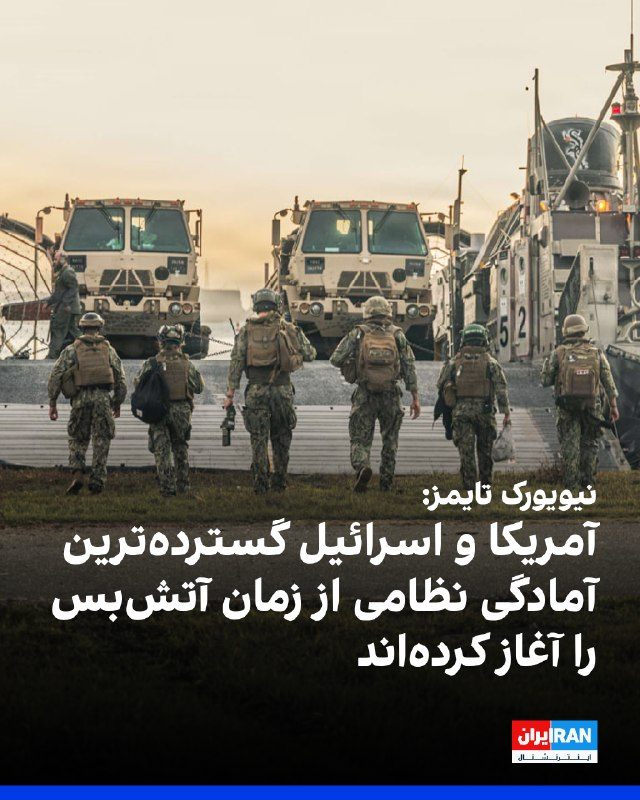

روزنامه نیویورک تایمز به نقل از دو مقام خاورمیانه‌ای گزارش داد که ایالات متحده و اسرائیل در حال انجام آماده‌سازی‌های «گسترده» برای احتمال ازسرگیری حملات علیه جمهوری اسلامی هستند.

این مقام‌ها احتمال دادند که حملات ممکن است در هفته جاری آغاز شود.

به نوشته این روزنامه، این سطح از آمادگی نظامی از زمان اجرای آتش‌بس بی‌سابقه بوده است.
‌🏁 🇬🇧 IranintlTV

🤖 @VahidOOnLine

## VahidOOnLine — post 240788

  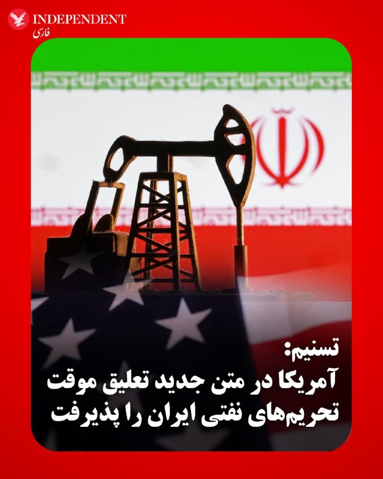

♦️خبرگزاری تسنیم وابسته به سپاه پاسداران، روز دوشنبه ۲۸ اردیبهشت، به نقل از یک منبع نزدیک به تیم مذاکره‌کننده گزارش داد آمریکا در متن جدید پیشنهادی خود، برخلاف متون پیشین، پذیرفته است تحریم‌های نفتی ایران را «در طول دوره مذاکرات» به‌طور موقت تعلیق کند.
به گفته این منبع، آمریکایی‌ها در متن جدید با «تعلیق موقت» (Waive) تحریم‌های نفتی ایران موافقت کرده‌اند. «ویو» به معنای معافیت یا چشم‌پوشی موقت از اجرای تحریم‌ها است و به معنای لغو کامل و دائمی آن‌ها محسوب نمی‌شود.
بر اساس این گزارش، تیم مذاکره‌کننده ایرانی همچنان بر این موضع تاکید دارد که لغو همه تحریم‌های ایران باید بخشی از تعهدات آمریکا باشد. در مقابل، واشنگتن پیشنهاد داده است معافیت‌های مرتبط با اوفک (دفتر کنترل دارایی‌های خارجی وزارت خزانه‌داری آمریکا) تنها تا زمان دستیابی به تفاهم نهایی اعمال شود.
به گزارش تسنیم، این تغییر در متن جدید آمریکا نسبت به پیشنهادهای قبلی، تحول تازه‌ای در روند مذاکرات به شمار می‌رود.
‌🇸🇦 Indypersian

🤖 @VahidOOnLine

## VahidOOnLine — post 240787

♦️بیست‌وهشتم اردیبهشت در تقویم ایران روز بزرگداشت حکیم عمر خیام نیشابوری، فیلسوف، ادیب، ریاضی‌دان و اخترشناس بزرگ ایرانی است.

آرامگاه خیام در شهر نیشابور، به همت استاد هوشنگ سیحون، یکی از پیشگامان معماری نوین ایران، در سال ۱۳۴۲ بنا شد.

این معمار صاحب‌نام ایرانی چند سال پیش در گفتگو با رسانه محلی عصر نیشابور گفته بود: «این بنا را بر اساس شعر خود خیام و غرق در گل و سبزه ساخته است.»
‌🇸🇦 Indypersian

🤖 @VahidOOnLine

## VahidOOnLine — post 240786

  

♦️خبرگزاری رویترز به نقل از منابع آگاه گزارش داد پاکستان در چارچوب پیمان دفاعی خود با عربستان سعودی، ۸ هزار نیروی نظامی به همراه یک اسکادران جنگنده و سامانه پدافند هوایی به این کشور اعزام کرده است.
بر اساس این گزارش، این نیروها از آمادگی عملیاتی برخوردارند و با هدف حمایت از عربستان در صورت ازسرگیری حملات علیه این کشور مستقر شده‌اند.

این تحرک نظامی در شرایطی انجام می‌شود که اسلام‌آباد هم‌زمان نقش مهمی در میانجی‌گری میان تهران و واشنگتن ایفا می‌کند.
‌🇸🇦 Indypersian

🤖 @VahidOOnLine

## VahidOOnLine — post 240785

  

خبرگزاری رویترز به نقل از منابع آگاه گزارش داد پاکستان در چارچوب پیمان دفاعی خود با عربستان سعودی، ۸ هزار نیروی نظامی به همراه یک اسکادران جنگنده و سامانه پدافند هوایی به این کشور اعزام کرده است.

به گزارش رویترز، این نیروها از توان عملیاتی برخوردارند و با هدف حمایت از عربستان سعودی در صورت ازسرگیری حملات علیه این کشور مستقر شده‌اند.

این تحرک نظامی در حالی صورت می‌گیرد که پاکستان نقش اصلی میانجی‌گری میان تهران و واشینگتن را بر عهده دارد.
‌🏁 🇬🇧 IranintlTV

🤖 @VahidOOnLine

## VahidOOnLine — post 240784

  

♦️جمهوری اسلامی ایران روز دوشنبه ۲۸ اردیبهشت‌ماه حساب کاربری «نهاد مدیریت آبراهه خلیج فارس» را در شبکه اجتماعی اکس فعال کرد.

این حساب در اولین پیام خود به دو زبان فارسی و انگلیسی نوشت: «حساب رسمی مدیریت آبراه خلیج فارس (#PGSA) در ایکس به منظور اطلاع‌رسانی فعالیت‌های این سازمان آغاز به کار می‌نماید.
برای اطلاع از آخرین وضعیت تنگه هرمز ما را دنبال کنید.»

خبرگزاری فرانسه گزارش کرد که شورای امنیت ملی ایران این حساب کاربری را به راه انداخته و حساب کاربری سپاه پاسداران هم اولین پیام آن را بازنشر کرده است.

ابراهیم عزیزی، رئیس کمیسیون امنیت ملی مجلس ایران، روز شنبه ۲۶ اردیبهشت با انتشار پیامی در شبکه اجتماعی اکس اعلام کرده بود که تهران سازوکاری «حرفه‌ای» برای مدیریت تردد در تنگه هرمز از طریق یک مسیر تعیین‌شده آماده کرده است که به‌زودی جزئیات آن را اعلام می‌کند.

عزیزی در این پیام نوشته بود: «فقط کشتی‌های تجاری و طرف‌های همکاری با ایران از آن بهره‌مند خواهند شد. حقوق لازم در ازای خدمات تخصصی ارائه شده، با این سازوکار برای ایران اخذ می‌شود. این مسیر کماکان برای عاملین پروژه به اصطلاح آزادی بسته خواهد ماند.»
‌🇸🇦 Indypersian

🤖 @VahidOOnLine

## VahidOOnLine — post 240783

  

نِت‌بلاکس اعلام کرد خاموشی اینترنت در ایران وارد هشتادمین روز شده و مدت این اختلال از ۱۸۹۶ ساعت گذشته است.

نِت‌بلاکس، نهاد ناظر بر اختلالات اینترنتی، در گزارشی اعلام کرد خاموشی اینترنت در ایران وارد هشتادمین روز شده و از ۱۸۹۶ ساعت عبور کرده است. این نهاد هم‌زمان نوشته که در حالی‌ که دسترسی آزاد شهروندان به اینترنت همچنان محدود است، محتوای حامی جمهوری اسلامی در شبکه‌های اجتماعی به‌طور گسترده منتشر می‌شود.

بر اساس گزارش نِت‌بلاکس، برخی کاربران در ایران گفته‌اند برای دریافت دسترسی‌های ویژه یا «سفید»، از آن‌ها خواسته شده روزانه سهمیه‌ای از محتوای تبلیغاتی منتشر کنند؛ روندی که گفته می‌شود با ابزارهای هوش مصنوعی هم کنترل می‌شود.
‌🏁 🇬🇧 ManotoTV

🤖 @VahidOOnLine

## VahidOOnLine — post 240782

  

♦️ در پی مرگ دست‌کم ۱۰۰ نفر در جمهوری دموکراتیک کنگو براثر ابتلا به گونه جدید ویروس ابولا، سازمان جهانی بهداشت روز یکشنبه هشدار فوری بین‌المللی صادر کرد.

به گزارش خبرگزاری فرانسه، این دومین سطح بالای هشدار سازمان جهانی بهداشت به‌شمار می‌رود. این نهاد وابسته به سازمان ملل اعلام کرد این گونه  که  بوندی بوگیو نام دارد نه واکسنی دارد و نه درمانی.

کشورهای آفریقایی در دهه گذشته و سال‌ها پیش از شیوع جهانی ویروس کووید، با بیماری ابولا درگیر شده بودند؛ بیماری که هزاران قربانی برجا گذاشت اما شیوع آن مانند کووید تبدیل به همه‌گیری جهانی نشد.
‌🇸🇦 Indypersian

🤖 @VahidOOnLine

## VahidOOnLine — post 240781

  <a href="telegram/content/VahidOOnLine_240781_1779109518.mp4" target="_blank">🎬 Download video</a>

ویدیوهای رسیده به ایران‌اینترنشنال، نصب بنرهای اعتراضی را در مناطق مختلف کرج نشان می‌دهد که روی آنها نوشته شده: «ما چیزی برای خوردن نداریم. بچه‌هایمان گرسنه هستن. همه‌چیز به ما بستگی دارد.»
‌🏁 🇬🇧 IranintlTV

🤖 @VahidOOnLine

## VahidOOnLine — post 240780

  

احمد ابوالغیط، دبیرکل اتحادیه عرب، حمله به عربستان سعودی با سه پهپاد را به‌شدت محکوم کرد و آن را نقضی آشکار حاکمیت و تمامیت ارضی این کشور دانست.

احمد ابوالغیط گفت: «این حمله بزدلانه به هیچ‌وجه قابل قبول یا توجیه نیست.»

او با اشاره به نقض حریم هوایی عربستان سعودی تاکید کرد این اقدام تجاوزی آشکار به حاکمیت این کشور بوده است.

جمال رشدی، سخنگوی دبیرکل اتحادیه عرب، نیز اعلام کرد دبیرکل همبستگی کامل خود را با پادشاهی عربستان سعودی در اقداماتی که برای حفاظت از اراضی و شهروندان خود مطابق با احکام حقوق بین‌الملل اتخاذ می‌کند، ابراز کرده است.
‌🏁 🇬🇧 IranintlTV

🤖 @VahidOOnLine

## VahidOOnLine — post 240779

  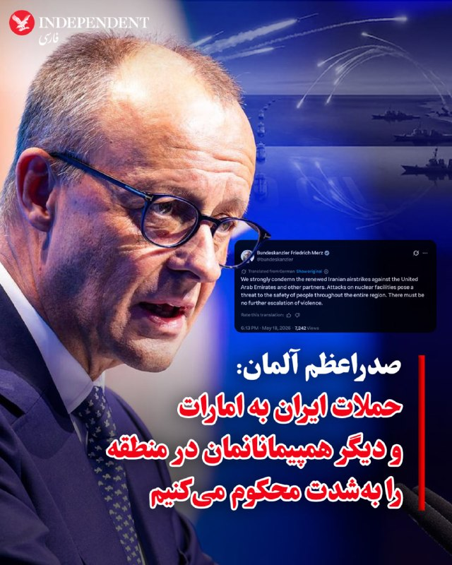

♦️ فردریش مرتس، صدراعظم آلمان روز دوشنبه ۲۸ اردیبهشت‌ماه با انتشار پیامی در اکس، حملات «اخیر» به امارات متحده عربی و دیگر کشورهای خلیج فارس را به‌شدت محکوم کرد و از جمهوری اسلامی ایران خواست تا به جدیت به میز مذاکرات با آمریکا بازگردد.

مرتس در این پیام، تلویحا حمله به محوطه نیروگاه هسته‌ای براکه را کار جمهوری اسلامی ایران توصیف کرد و نوشت: «حملات به تاسیسات هسته‌ای، تهدیدی برای امنیت مردم در سراسر منطقه است. نباید خشونت‌ها بیش از این تشدید شود. ایران باید وارد مذاکرات جدی با ایالات متحده شود، تهدید همسایگان خود را متوقف کند و تنگه هرمز را بدون محدودیت باز کند.»

امارات متحده عربی دیروز اعلام کرد در حال تحقیق درباره منشا حمله پهپادی به نیروگاه هسته‌ای براکه این کشور است.
‌🇸🇦 Indypersian

🤖 @VahidOOnLine

## VahidOOnLine — post 240778

  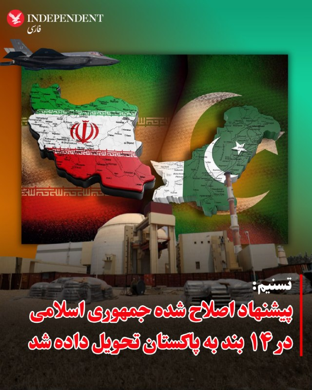

♦️خبرگزاری تسنیم، وابسته به سپاه پاسداران، روز دوشنبه ۲۸ اردیبهشت ماه به نقل از «یک منبع نزدیک به تیم مذاکره‌کننده» جمهوری اسلامی نوشت که تهران «جدیدترین متن خود را در ۱۴ بند به واسطه پاکستانی تحویل داده است و میانجی پاکستانی آن را به آمریکایی‌ها ارائه می‌کند.»

ساعتی پیش از انتشار این خبر رویترز به نقل از یک مقام پاکستانی گزارش کرده بود که اسلام‌آباد یکشنبه شب طرح پیشنهادی اصلاح‌شده جمهوری اسلامی ایران را به واشنگتن تحویل داده است.

تسنیم در گزارش خود به نقل از این منبع نوشت: « آمریکایی‌ها اخیرا در پاسخ به متن پیشین ایران که آن هم در ۱۴ بند ارائه شده بود، متنی ارسال کرده بودند. ایران نیز مجددا بر اساس روال چند وقت اخیر در تبادل پیام، متن خود را پس از انجام اصلاحاتی مجددا در ۱۴ بند به واسطه پاکستانی ارائه کرد. متن جدید ایران بر موضوع مذاکرات پایان جنگ و اقدامات اعتمادساز طرف آمریکایی متمرکز است.»

آمریکا هنوز واکنشی به این خبر نشان نداده است. دونالد ترامپ پیش از این گفته بود پس از خواندن خط اول طرح پیشنهادی قبلی جمهوری اسلامی ایران از آن خوشش نیامده و آن را کنار انداخته است.
‌🇸🇦 Indypersian

🤖 @VahidOOnLine

## VahidOOnLine — post 240777

  

فریدریش مرتس، صدراعظم آلمان، روز دوشنبه اعلام کرد برلین حملات جمهوری اسلامی به امارات متحده عربی و سایر کشورها را محکوم می‌کند و افزود تهران باید تهدید همسایگان خود را متوقف کرده و تنگه هرمز را بدون محدودیت باز نگه دارد.

فریدریش مرتس در پیامی در شبکه ایکس نوشت: «حملات به تاسیسات هسته‌ای تهدیدی برای امنیت مردم در سراسر منطقه است. نباید هیچ‌گونه تشدید بیشتر خشونت رخ دهد.»

او همچنین تاکید کرد حکومت ایران باید وارد مذاکرات جدی با آمریکا شود.
‌🏁 🇬🇧 IranintlTV

🤖 @VahidOOnLine

## VahidOOnLine — post 240776

  

⭕️آژانس بین‌المللی انرژی: ذخایر نفت تجاری جهان فقط برای چند هفته کافی است

♦️فاتح بیرول، مدیر آژانس بین‌المللی انرژی، هشدار داد که در پی جنگ ایران و بسته ماندن تنگه هرمز، ذخایر تجاری نفت جهان با سرعت زیادی در حال کاهش است و این ذخایر فقط برای چند هفته دیگر دوام خواهد داشت.

بیرول در نشست گروه هفت در پاریس گفت آزادسازی ذخایر راهبردی نفت تاکنون روزانه حدود ۲.۵ میلیون بشکه نفت به بازار اضافه کرده است، اما تاکید کرد که این ذخایر نامحدود نیستند.

او هشدار داد ادامه اختلال در مسیرهای اصلی انتقال انرژی، به‌ویژه تنگه هرمز، می‌تواند فشار بیشتری بر بازار جهانی نفت وارد کند و کشورها را با بحران تازه‌ای در تامین انرژی روبه‌رو سازد.

تنگه هرمز یکی از مهم‌ترین گذرگاه‌های انرژی جهان است و بسته ماندن آن در جریان جنگ ایران، بازار نفت و گاز را با نوسان شدید و نگرانی گسترده روبه‌رو کرده است.
‌🇸🇦 Indypersian

🤖 @VahidOOnLine

## VahidOOnLine — post 240775

  

رمضان‌علی سنگدوینی، نماینده مجلس، هشدار داد برخی اقلام با «قیمت‌های گزاف و چندبرابر» وارد بازار می‌شوند. او افزود: «آیا مردم با کالابرگ یک میلیون تومانی توان خرید مرغ کیلویی ۴۰۰ هزار تومانی را دارند؟»

زهرا سعیدی مبارکه، دیگر نماینده مجلس، با اشاره به افزایش قیمت مواد غذایی در کشور گفت هر کیلو برنج پاکستانی در پاکستان کمتر از یک دلار و در آلمان یک یورو است، اما در ایران سه دلار به مردم فروخته می‌شود.

علی خزائی، نماینده مجلس، هم سیاست‌های ارزی دولت و افزایش مداوم نرخ ارز از سوی بانک مرکزی را «کاملا اشتباه» دانست و گفت این سیاست‌ها به گرانی و تورم در ایران دامن می‌زنند.
‌🏁 🇬🇧 IranintlTV

🤖 @VahidOOnLine

## WithYashar — post 11547

خبر بد برای گیمرها
رضا احمدی، معاون نظارت بنیاد ملی بازی‌های رایانه‌ای:

طرحی برای سایتهای دانلود بازیهای کامپیوتری به تصویب رسیده که طبق اون، یک گیم سنتر مرکزی تشکیل میشه تا سایتهای دانلود بازی قبل اینکه لینک دانلود رو آپلود کنن باید اون لینکا رو به اون گیم سنتر ارسال کنن تا یه کمیته محتواش رو بررسی کنه و اگه تایید شد، اون سایت تازه اجازه داره لینکای دانلود رو برای گیمرها آپلود کنه!
@withyashar

## WithYashar — post 11546

آمریکا در متن جدید خود اسقاط تحریم‌های نفتی ایران را پذیرفته است

تسنیم : یک منبع نزدیک به تیم مذاکره‌کننده گفت که آمریکایی‌ها برخلاف متون پیشین خود، در متن جدید پذیرفته‌اند که در طول دوره مذاکره، تحریم‌های نفتی ایران را Wave کنند.

ایران تاکید دارد که لغو همه‌ی تحریم‌های ایران باید جزو تعهدات آمریکا باشد. آمریکا اما اسقاطی(OFAC) را تا زمان تفاهم نهایی مطرح کرده است.

اسقاط تحریم‌ها WAVE یعنی تحریم‌ها موقتاً یا عملاً اجرا نشوند اما به معنی حذف دائمی نیست
او‌فک (OFAC)مخفف:
Office of Foreign Assets Control
این یک نهاد در وزارت خزانه‌داری آمریکا است. کارش اجرای تحریم‌ها علیه کشورها، شرکت‌ها و افراد هست، به عبارتی کنترل اینکه چه کسی می‌تواند با چه کسی تجارت کند
@withyashar

## WithYashar — post 11545

  <a href="telegram/content/WithYashar_11545_1779109523.mp4" target="_blank">🎬 Download video</a>

مجری: آیا ارزش از دست دادن انتخابات میان دوره‌ای را دارد اگر نتیجه یک ایران غیر هسته‌ای باشد؟

سناتور گراهام: ارزش از دست دادن شغلم رو هم داره؛ اگر مجبور بودم کارم رو رها کنم تا مطمئن شم ایران هرگز سلاح هسته‌ای نخواهد داشت، این کار رو می‌کردم.‌‌
@withyashar

## WithYashar — post 11544

اتاق جنگ با یاشار : تا آغاز جام جهانی ۲۰۲۶ در تاریخ ۲۱ خرداد ۱۴۰۵، حدود ۲۴ روز مانده است. و تا فینال جام جهانی در تاریخ ۲۸ تیر ۱۴۰۵، دقیق ۲ ماه مانده است
عید قربان امسال در بیشتر کشورهای منطقه، روز چهارشنبه ۶ خرداد ۱۴۰۵ (۲۷ مه ۲۰۲۶) اعلام شده است.
بازارهای مالی (بورس‌ها) در ایام عید قربان روز تعطیل می‌شوند (حدود ۵ روز)
حدود ۹ روز تا عید قربان مانده است ، حساب دستتون باشه
@withyashar

## WithYashar — post 11543

  

نفتکش هندی‌مکس PEGASUS (9276028) که با پرچم روسیه و تحت تحریم ایالات متحده حرکت می‌کند، صرفاً از روی لجاجت، مدام به محدوده محاصره ایالات متحده رفت و آمد می‌کند. ما چندین تصویر ماهواره‌ای داریم که تأیید می‌کند این یک جعل سیستم اطلاعات ناوبری (AIS) نیست.
فردا ولادمیر پوتین برای دیدار با شی جین پینگ در‌یک سفر از پیش برنامه ریزی نشده به چین سفر میکند…
@withyashar

## WithYashar — post 11542

  <a href="telegram/content/WithYashar_11542_1779109525.mp4" target="_blank">🎬 Download video</a>

نیروهای ویژه دریایی شایتت ۱۳ اسرائیل سوار بر یک کشتی حامل فعالان حامی حماس، در آب‌های بین‌المللی مشاهده شدند. این تصاویر در حالی منتشر شده که اسرائیل همزمان با حرکت یک ناوگان دریایی به نام «Global Sumud Flotilla» از ترکیه به سمت غزه که طرفداران فلستین هستند، سطح آمادگی نیروی دریایی خود را افزایش داد.
@withyashar

## WithYashar — post 11541

زرشکیان : نباید به دروغ ادعا کنیم که هیچ مشکلی نداریم و دشمن در حال نابودی است! ما با چالش‌های جدی مواجهیم!
مسئولان ادعا نکنند ما در شکوفایی مطلق هستیم و دشمن در حال نابودی است!
@withyashar

## WithYashar — post 11540

  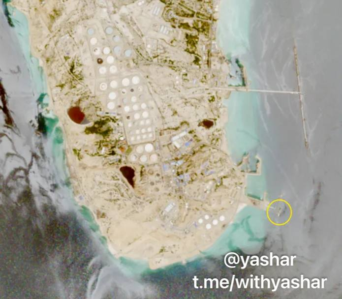

تصاویر ماهواره ای بلومبرگ: حدود 23 نفتکش در نزدیکی جزیره خارک مشاهده شدند که بزرگترین تجمع از زمان آغاز محاصره آمریکاست
@withyashar

## WithYashar — post 11539

سی‌ان‌ان: پنتاگون فهرستی از اهداف برای حمله به ایران در صورت صدور دستور ترامپ آماده کرده است
@withyashar

## mwarmonitor — post 9243

  

🔴یک عکس منتشرشده در DVIDS در تاریخ ۷ مه، یک پرتابگر سامانه THAAD ارتش آمریکا را در منطقه مسئولیت فرماندهی مرکزی آمریکا (CENTCOM) نشان می‌دهد.

🔸به نظر می‌رسد این تصویر در واقع در محل استقرار THAAD در بیابان نقب اسرائیل گرفته شده باشد (مختصات: 31°30'04.5"N 34°48'33.3"E)، با توجه به تطابق زمین اطراف و دیوارهای بتنی ضد انفجار مشابه.

@mwarmonitor

## mwarmonitor — post 9242

  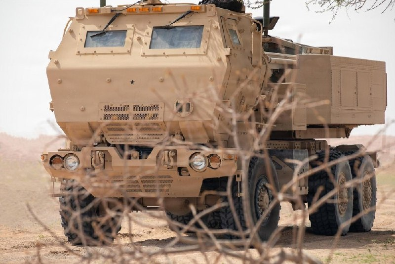

🔴سیستم راکت‌انداز M142 HIMARS ارتش آمریکا در تصاویری که در وب‌سایت DVIDS منتشر شده و مربوط به ۱۴ مه و ۶ مه است، در منطقه تحت مسئولیت فرماندهی مرکزی آمریکا (CENTCOM) مشاهده شده است.

🔸این سامانه‌ها احتمالاً در بحرین یا کویت مستقر هستند؛ جایی که پیش‌تر نیز در جریان عملیات «Epic Fury» حملاتی علیه ایران انجام داده بودند.

@mwarmonitor

## mwarmonitor — post 9240

🇸🇦🇵🇰پاکستان در چارچوب یک پیمان دفاعی مشترک، ۸۰۰۰ سرباز، یک اسکادران جنگنده و یک سامانه پدافند هوایی را به عربستان سعودی اعزام کرده است. این اقدام همکاری نظامی اسلام‌آباد با ریاض را تقویت می‌کند، در حالی که اسلام‌آباد همچنان به‌عنوان میانجی اصلی در جنگ ایران عمل می‌کند. رویترز

@mwarmonitor

## mwarmonitor — post 9239

🇮🇱🇺🇸ایالات متحده و اسرائیل در حال انجام آماده‌سازی‌های فشرده‌ای هستند — بزرگ‌ترین سطح آماده‌سازی از زمان برقراری آتش‌بس — برای احتمال ازسرگیری حملات علیه ایران، که ممکن است از همین هفته آغاز شود، به گفته دو مقام خاورمیانه‌ای — نیویورک تایمز

@mwarmonitor

## mwarmonitor — post 9238

  <a href="telegram/content/mwarmonitor_9238_1779109529.mp4" target="_blank">🎬 Download video</a>

🚢این نفتکش LPG که تحت تحریم‌های آمریکا قرار دارد، دو روز پیش (۱۶ مهٔ ۲۰۲۶) موفق شد در جزیره خارک ایران در مختصات 29.21431، 50.33619 گاز مایع بارگیری کند.

🚢این کشتی آخرین بار حدود دو هفته پیش در سامانه AIS در سواحل هند سیگنال ارسال کرده بود و سپس بدون شناسایی، از خط محاصره نیروی دریایی آمریکا عبور کرد. TANKER TRACKER

🔴بلومبرگ به نقل از تصاویر ماهواره‌ای: حدود ۲۳ نفتکش در نزدیکی جزیره خارک مشاهده شده‌اند که این بزرگ‌ترین تجمع از زمان آغاز محاصره آمریکا است.

@mwarmonitor

## mwarmonitor — post 9237

  

✈️یک فروند هواپیمای گلف‌استریم G-V «نخشون شاویت» نیروی هوایی اسرائیل، که برای شنود سیگنالی (SIGINT) و شناسایی به‌کار می‌رود، هم‌اکنون در حال انجام مأموریت ISR (اطلاعات، مراقبت و شناسایی) بر فراز شرق دریای مدیترانه و در سواحل مصر است.

@mwarmonitor

## mwarmonitor — post 9236

  

✈️🇸🇦یک فروند ایرباس سوخت رسان - ترابری A330 MRTT نیروی هوایی سلطنتی عربستان سعودی در حال حاضر بر فراز شرق عربستان سعودی فعال است؛ این هواپیما پیش‌تر نیز در نزدیکی حَفَرالباطن و نزدیک مرز عراق عملیات داشته است.

🔸آیا این تحرکات می‌تواند نشانه‌ای از حملات احتمالی علیه شبه‌نظامیان عراقی در پی حمله پهپادی روز گذشته باشد!!

@mwarmonitor

## FoxNewsTwitter — post 341871

  <a href="telegram/content/FoxNewsTwitter_341871_1779109531.mp4" target="_blank">🎬 Download video</a>

Fox News (Twitter/X)

“Your character will take you further than your resume. Continue to be kind. Continue to be humble.”

NBA legend Shaquille O'Neal shares an inspiring message with graduates during Louisiana State University’s commencement ceremony after receiving his own master’s degree from LSU.

The Hall of Famer laid out five key rules for the graduates to live by, emphasizing resilience, humility, and continuous learning.

O’Neal encouraged students to keep learning, embrace failure as motivation, and understand that persistence is essential to achieving success.

## FoxNewsTwitter — post 341870

  

Fox News (Twitter/X)

A 20-year-old Arkansas man was arrested after allegedly threatening to start a mass shooting at Walmart if the country shut down over hantavirus fears.

Authorities say the FBI tracked the threat through an online video game chat after another player recorded the conversation and sent it in.

Investigators say the gamer’s username and in-game recording helped lead agents directly to Aaron Bynum, who now faces terroristic threatening charges.

## FoxNewsTwitter — post 341869

  <a href="telegram/content/FoxNewsTwitter_341869_1779109534.mp4" target="_blank">🎬 Download video</a>

Fox News (Twitter/X)

“Thank you Jesus for letting me do this for a living.”

Ella Langley opened up during her Female Artist of the Year speech after sweeping all 7 of her ACM Award nominations, revealing Lainey Wilson prayed over her backstage before the show after emotions hit her hard.

“I walk right into Lainey’s room and I just got emotional... she hugged me, wrapped me up and started praying for me.”

“I would not be standing up here without just encouragement of so many women.”

## FoxNewsTwitter — post 341868

  

Fox News (Twitter/X)

RT @FoxNewsEnt: We settled some hot takes in the world of country music 🎤

Watch country stars go rapid fire with their answers at the 61st Academy of Country Music Awards.

## FoxNewsTwitter — post 341867

  <a href="telegram/content/FoxNewsTwitter_341867_1779109536.mp4" target="_blank">🎬 Download video</a>

Fox News (Twitter/X)

NEW: President Trump sends Iran a new warning: “The clock is ticking.”

This comes as reports say Tehran has submitted a revised proposal to Pakistani mediators amid ongoing nuclear negotiations and rising tensions in the Middle East.

As the U.S. blockade continues, Iran’s economy takes a major hit with pressure mounting on the regime to make a deal.

@TreyYingst reports the latest developments from the region.

## pm_afshaa — post 90948

🔴نیویورک تایمز: پنتاگون برای از سرگیری جنگ با ایران در روزهای آینده آماده می‌شود

💧 Rainbet.com the #1 Non-KYC Crypto Casino & Sportsbook @rainbetcom

😁 @Pm_Afshaa

## pm_afshaa — post 90947

  <a href="telegram/content/pm_afshaa_90947_1779109538.webm" target="_blank">🎬 Download video</a>

🔴رویترز: پاکستان 8 هزار نیروی نظامی به همراه یک اسکادران جنگنده و سامانه پدافند هوایی به عربستان سعودی اعزام کرده.

طبق این گزارش، این نیروها برای حمایت از عربستان در صورت ازسرگیری حملات احتمالی مستقر شدن. این تحرک در حالی انجام میشه که پاکستان همزمان نقش میانجی میان تهران و واشینگتن رو هم بر عهده داره.

💧 Rainbet.com the #1 Non-KYC Crypto Casino & Sportsbook @rainbetcom

😁 @Pm_Afshaa

## pm_afshaa — post 90946

  <a href="telegram/content/pm_afshaa_90946_1779109539.webm" target="_blank">🎬 Download video</a>

🔴ترامپ: اونا یه برگه می‌فرستن که هیچ ربطی به چیزی که توافق کرده بودیم نداره، منم میگم، شماها دیوونه‌اید یا چی؟

💧 Rainbet.com the #1 Non-KYC Crypto Casino & Sportsbook @rainbetcom

😁 @Pm_Afshaa

## pm_afshaa — post 90945

🔴کانال 12 اسرائیل: در پیشنهاد جدید ایران هیچ اشاره‌ای به هرمز و اورانیوم غنی‌شده نشده

💧 Rainbet.com the #1 Non-KYC Crypto Casino & Sportsbook @rainbetcom

😁 @Pm_Afshaa

## pm_afshaa — post 90944

  <a href="telegram/content/pm_afshaa_90944_1779109539.webm" target="_blank">🎬 Download video</a>

🔴کانال 13 اسرائیل: طی 24 ساعت گذشته ده‌ها هواپیمای باری خالی از اسرائیل به پایگاه‌های آمریکایی در آلمان رفتن، مهمات بارگیری کردن و سپس به اسرائیل بازگشتن.

ارتش اسرائیل در روزهای اخیر در سطح بالایی از آماده‌باش قرار داشته، اما جزئیاتی درباره نوع مهمات یا هدف این انتقال‌ها منتشر نشده.

💧 Rainbet.com the #1 Non-KYC Crypto Casino & Sportsbook @rainbetcom

😁 @Pm_Afshaa

## pm_afshaa — post 90943

  <a href="telegram/content/pm_afshaa_90943_1779109540.webm" target="_blank">🎬 Download video</a>

🔴منابع پاکستانی:آخرین پیشنهاد ایران برای پایان جنگ، یکشنبه شب(دیشب) به طرف آمریکایی ارسال شد 
💧 Rainbet.com the #1 Non-KYC Crypto Casino & Sportsbook @rainbetcom 
😁 @Pm_Afshaa

## iaghapour — post 2618

  

⭕️ دیگه پول فیلترشکن نده! آموزش ساخت فیلترشکن شخصی و رایگان با سرعت بالا 😎

🔹در این آموزش قدم‌به‌قدم بهت یاد می‌دم که چطور بدون نیاز به دانش خاصی، یک فیلترشکن (VPN) شخصی، امن و کاملاً رایگان برای خودت بسازی. این روش روی تمام اینترنت‌ها جواب می‌ده و سرعت خوبی برای تماشای یوتیوب، وب‌گردی و … داره.

🔗 تماشا ویدیو در یوتیوب

🔗 دانلود ویدیو با لینک مستقیم (بزودی)

#آموزش #فیلترشکن #رایگان #novaproxy
برای دور زدن فیلترینگ و آموزش تکنولوژی و هوش مصنوعی ما رو دنبال کنید 💚
🆔@iaghapour

## DEJradio — post 4699

  <a href="telegram/content/DEJradio_4699_1779109541.mp4" target="_blank">🎬 Download video</a>

🤡
🔺 ترس حکومت از نارضایتی‌های عمومی؛ آموزش کاربرد سلاح در تجمعات شبانه!

#تجمعات_حکومتی #شیفت_شب
@DEJradio

## DEJradio — post 4698

  <a href="telegram/content/DEJradio_4698_1779109542.mp4" target="_blank">🎬 Download video</a>

🔺🎥 ‏ماه‌ها پیش از آنکه دو پایگاه مخفی اسرائیل در عراق شناسایی شوند، یک چوپان ویدیویی از پرواز دو هواپیمای ترابری در بیابان‌های میان عراق و اردن منتشر کرد. اکنون رسانه‌ها با استناد به این ویدیو فعالیت پایگاه‌های مخفی اسرائیل را تایید می‌کنند.

#اسرائیل #عراق
@DEJradio

## DEJradio — post 4695

  <a href="telegram/content/DEJradio_4695_1779109544.webm" target="_blank">🎬 Download video</a>

🚨📢 روزنامه «نیویورک‌تایمز» گزارش داد اسرائیل ماه‌ها دو پایگاه مخفی را در بیابان‌های عراق برای پشتیبانی از عملیات علیه رژیم ایران پنهان نگه داشته بود.

بر اساس این گزارش، اسرائیل بیش از یک سال برای آماده‌سازی یکی از این پایگاه‌ها برنامه‌ریزی و فعالیت کرده بود. نیویورک‌تایمز به نقل از مقام‌های منطقه‌ای نوشت این تأسیسات به‌صورت محرمانه برای پشتیبانی از عملیات اسرائیل علیه جمهوری اسلامی ایران مورد استفاده قرار می‌گرفت.

این روزنامه همچنین گزارش داد مقام‌های عراقی بعداً وجود دومین پایگاه مخفی را نیز تأیید کرده‌اند.

ادعا شده این پایگاه را نیز یک چوپان کشف کرده است. سرلشکر علی الحمدانی فرمانده نیروهای فرات غربی ارتش عراق، گفت ارتش یک ماه قبل از آنکه یک چوپان پایگاه را شناسایی کند، به حضور اسرائیل در بیابان مشکوک شده بود اما سپهبد سعد معن، سخنگوی نیروهای امنیتی عراق، به تایمز گفت: «عراق هیچ اطلاعاتی درباره مکان هیچ پایگاه نظامی اسرائیلی ندارد.»

به گفته ژنرال الحمدانی، برای هفته‌ها بادیه‌نشین‌ها در بیابان غربی عراق فعالیت‌های نظامی غیرعادی را به فرماندهی منطقه‌ای عراق گزارش می‌کردند.
او گفت ارتش تصمیم گرفت نزدیک نشود و در عوض از فاصله دور «نظارت اطلاعاتی» انجام دهد؛ زیرا فرماندهان مشکوک بودند نیروهای اسرائیلی در منطقه حضور دارند. آن‌ها از همتایان آمریکایی خود درخواست اطلاعات کردند، اما پاسخی دریافت نکردند.

پیش از این فیلمی که از سوی یک چوپان در مرزهای عراق منتشر شده بود، نشان می‌داد که دو هواپیمای سی۱۳۰ در ارتفاع پایین در غرب عراق در حال پرواز هستند و با انتشار این گزارش، این فیلم مورد توجه جدی قرار گرفته است.
اکنون مشخص نیست آیا عدم شناسایی پایگاه‌های اسراییل در عراق ناتوانی و بی‌عرضگی ارتش عراق است یا همکاری غیرمستقیم آنها با ارتش اسرائیل.

#اسرائیل #جنگ #عراق
@DEJradio

## DEJradio — post 4694

  <a href="telegram/content/DEJradio_4694_1779109544.webm" target="_blank">🎬 Download video</a>

🔺📢 جمهوری اسلامی در وقت‌های اضافه
یادداشت: فریبرز کرمی‌زند

در روزهای گذشته تصاویری از صداوسیمای حکومتی پخش شد که در استودیوهای آن، یکی از نیروهای سـ.ـپاه پاسداران در حال آموزش استفاده از سلاح‌های انفرادی مانند AK-47 و تیربار چندمنظوره PK بود. هرچند از نحوه گفتار و توضیحات ناقص او به‌ وضوح پیداست که خود نیز نیاز به آموزش دارد، اما مسئله اصلی هدف از پخش چنین برنامه‌هایی است.

زمانیکه حکومت‌های تروریستی و خشن به پایان مسیر خود نزدیک می‌شوند، رفتارهایی از آنان سر می‌زند که لزوماً نمی‌توان برایشان توجیه منطقی یافت اما آنچه مسلم است، ترس عمیق حکومت از مردم ایران است؛ زیرا به‌ خوبی می‌داند ضربه نهایی را مردم وارد خواهند کرد.

به نظر می‌رسد نمایش سلاح در رسانه حکومتی تلاشی برای ارسال این پیام باشد که هرگونه اعتراض مردمی با واکنش سخت مواجه خواهد شد؛ تکرار همان ادبیاتی که پیش‌تر نیز از برخی چهره‌های نزدیک به حکومت مانند حسین یکتا از صداوسیما پخش شده بود، این‌بار در قالب تصویر و نمایش رسانه‌ای.

اما چنین نمایش‌هایی نه ‌تنها مانع خواست مردم برای آزادی نخواهد شد، بلکه شکاف میان حکومت و جامعه را عمیق‌تر و اراده معترضان برای تغییر را تقویت خواهد کرد و آنها را به سمت و سویی سوق خواهد داد که برای ایستادن در برابر حکومت به دنبال ابزارهای لازم بروند زیرا دست خالی ایستادن در برابر این جنایتکاران اشتباه است. لازم به ذکر است از این سلاح‌ها در دی‌ماه ۱۴۰۴ بر علیه مردم استفاده شده بود.

#صداوسیما #وقت_اضافه
@DEJradio

## DEJradio — post 4693

  <a href="telegram/content/DEJradio_4693_1779109544.webm" target="_blank">🎬 Download video</a>

🔺📢 "اقماری شرکت نفت هستم، بعد از جنگ پرواز نیست، ۳۰ ساعت طول می‌کشه با اتوبوس بیام تهران...

پیام دریافتی

#شرکت_نفت #تهران
@DEJradio

## DEJradio — post 4692

  <a href="telegram/content/DEJradio_4692_1779109545.webm" target="_blank">🎬 Download video</a>

🚨
🔸 چرا اصغر فرهادی در درون آشوویتس نقش بی‌طرف را بازی می‌کند؟

*پژمان گلچین، پژوهشگر فلسفه

#اصغر_فرهادی #آشوویتس
@DEJradio

## IranIntlTV — post 337778

  <a href="telegram/content/IranIntlTV_337778_1779109545.mp4" target="_blank">🎬 Download video</a>

روزنامه دنیای اقتصاد نوشت برای تامین حداقل کالری مورد نیاز روزانه افراد، رقم کالابرگ باید بین ۵۰ تا ۱۰۰ درصد افزایش یابد. بر اساس این گزارش، در حالی‌ که قرار بود این طرح به‌عنوان سپر تورمی از معیشت اقشار کم‌درآمد محافظت کند، وضعیت افزایش اعتبار کالابرگ به‌دلیل نبود بودجه همچنان نامشخص است.

ارزیابی اشکان نظام آبادی، روزنامه‌نگار اقتصادی
@iranintltv

## IranIntlTV — post 337777

  <a href="telegram/content/IranIntlTV_337777_1779109547.mp4" target="_blank">🎬 Download video</a>

مجری و یک کارشناس نظامی در برنامه‌ای که از صداوسیمای جمهوری اسلامی پخش شد، با اسلحه به تصاویر دونالد ترامپ و بنیامین نتانیاهو شلیک کردند و ابراز امیدواری کردند که چنین اتفاقی در واقعیت رخ دهد.
@iranintltv

## IranIntlTV — post 337776

  <a href="telegram/content/IranIntlTV_337776_1779109548.mp4" target="_blank">🎬 Download video</a>

یکی از شهروندان با ارسال ویدیویی به ایران‌اینترنشنال، فضای امنیتی شهر تهران را نشان می‌دهد. در این ویدیو تجمع حامیان حکومت و نظامیان مسلح را در میدان انقلاب تهران می‌بینیم.

## IranIntlTV — post 337775

  <a href="telegram/content/IranIntlTV_337775_1779109549.mp4" target="_blank">🎬 Download video</a>

شرکت آلکاتل اعلام کرد، تعمیر کابل‌های زیردریایی در خلیج فارس را به دلیل ناامنی و تهدیدهای سپاه پاسداران متوقف کرده است.

احمد صمدی، خبرنگار ایران‌اینترنشنال، گزارش می‌دهد
@iranintltv

## IranIntlTV — post 337774

  

روزنامه نیویورک تایمز به نقل از دو مقام خاورمیانه‌ای گزارش داد که ایالات متحده و اسرائیل در حال انجام آماده‌سازی‌های «گسترده» برای احتمال ازسرگیری حملات علیه جمهوری اسلامی هستند.

این مقام‌ها احتمال دادند که حملات ممکن است در هفته جاری آغاز شود.

به نوشته این روزنامه، این سطح از آمادگی نظامی از زمان اجرای آتش‌بس بی‌سابقه بوده است.
https://iranintl.com/202605180651

## IranIntlTV — post 337773

  <a href="https://t.me/IranintlTV/337773" target="_blank">📎 Download file</a>

🎧نسخه صوتی اخبار نیمروزی | دوشنبه ۲۸ اردیبهشت
@iranintlTV

## IranIntlTV — post 337772

  <a href="telegram/content/IranIntlTV_337772_1779109551.mp4" target="_blank">🎬 Download video</a>

مستند کوتاه «هنر مقاومت» به تهیه‌کنندگی ایران‌اینترنشنال و کارگردانی مهران عباسیان، خبرنگار این شبکه، برنده جایزه بهترین مستند کوتاه و بهترین کارگردانی فستیوال فیلم خانه سینمای سوئد شد.
گزارش مهسا مرتضوی، خبرنگار ایران‌اینترنشنال
@iranintltv

## IranIntlTV — post 337771

  <a href="telegram/content/IranIntlTV_337771_1779109553.mp4" target="_blank">🎬 Download video</a>

یک شهروند با ارسال ویدیویی به ایران‌اینترنشنال می‌گوید: «برنج آنقدر گران شده که توان خریدش را نداریم. قیمت برنج از دو میلیون تومان شروع می‌شود.»

## IranIntlTV — post 337770

  <a href="telegram/content/IranIntlTV_337770_1779109554.mp4" target="_blank">🎬 Download video</a>

اطلاعات رسیده به ایران‌اینترنشنال، جزییات تازه‌ای از چگونگی کشته شدن جاویدنام امیرپارسا اشکبوس، دانشجوی ترم آخر رشته میکروبیولوژی، در جریان انقلاب ملی ایرانیان روایت می‌کند.

گفت‌وگو با فرنوش فرجی، عضو تحریریه ایران‌اینترنشنال

@iranintltv

## IranIntlTV — post 337769

  

خبرگزاری رویترز به نقل از منابع آگاه گزارش داد پاکستان در چارچوب پیمان دفاعی خود با عربستان سعودی، ۸ هزار نیروی نظامی به همراه یک اسکادران جنگنده و سامانه پدافند هوایی به این کشور اعزام کرده است.

به گزارش رویترز، این نیروها از توان عملیاتی برخوردارند و با هدف حمایت از عربستان سعودی در صورت ازسرگیری حملات علیه این کشور مستقر شده‌اند.

این تحرک نظامی در حالی صورت می‌گیرد که پاکستان نقش اصلی میانجی‌گری میان تهران و واشینگتن را بر عهده دارد.
https://iranintl.com/202605187837

## IranIntlTV — post 337768

  <a href="telegram/content/IranIntlTV_337768_1779109556.mp4" target="_blank">🎬 Download video</a>

مسعود پزشکیان با اشاره به وضعیت وخیم اقتصادی در پی محاصره دریایی بندرهای ایران، از کاهش درآمدهای کشور خبر داد و گفت: «دولت به‌دلیل مشکلات تجارت و بازار، امکان اخذ مالیات را ندارد.»

گفت‌وگو با آرش آزرمی، دبیر بخش اقتصادی ایران‌اینترنشنال
@iranintltv

## IranIntlTV — post 337767

  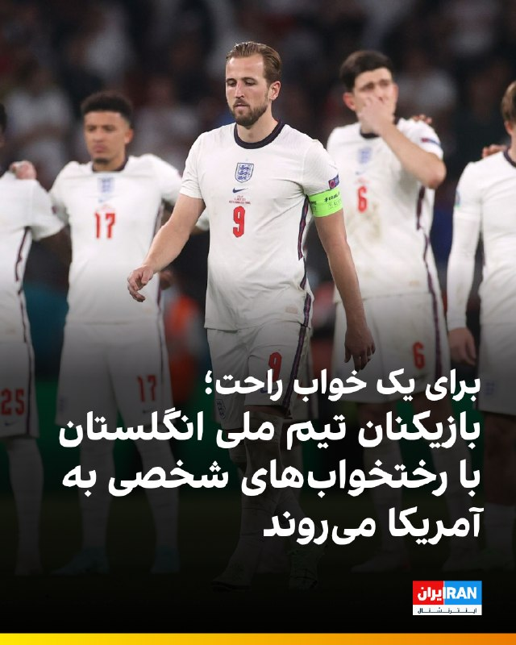

🔻روزنامه سان گزارش داد که بازیکنان تیم ملی فوتبال انگلستان در جریان جام جهانی ۲۰۲۶ در آمریکا، رختخواب‌های شخصی خود را همراه خواهند داشت تا کیفیت خواب و روند ریکاوری آن‌ها حفظ شود.

🔹این تصمیم پس از شکایت‌های متعدد درباره تخت‌های خشک و سفت هتل محل اقامت آن‌ها گرفته شده است. اتحادیه فوتبال انگلیس (FA) برای تضمین خواب راحت و باکیفیت بازیکنان، تشک‌های اسفنجی سبک و بالش‌های ویژه‌ای تهیه کرده است. از بازیکنان خواسته شده پتوهای شخصی خود را هم بیاورند تا اتاق هتل حس خانه را داشته باشند.

🔹بر اساس این گزارش، کادر فنی تیم ملی انگلستان به رهبری توماس توخل قصد دارد برای جلوگیری از خستگی و مشکلات ناشی از سفرهای طولانی در آمریکا، شرایط اقامت بازیکنان را تا حد ممکن مشابه خانه فراهم کند.

🔹این تصمیم در حالی گرفته شده که فاصله زیاد شهرهای میزبان جام جهانی ۲۰۲۶، یکی از نگرانی‌های اصلی تیم‌های حاضر در این رقابت‌ها عنوان شده است.

@iranintltvsport

## IranIntlTV — post 337766

  <a href="telegram/content/IranIntlTV_337766_1779109558.mp4" target="_blank">🎬 Download video</a>

دادگاه رسیدگی‌ به پرونده متهمان حمله با چاقو به پوریا زراعتی، مجری تلویزیون ایران‌اینترنشنال، در لندن آغاز می‌شود.

رضا محدث، خبرنگار ایران‌اینترنشنال، گزارش می‌دهد
@iranintltv

## IranIntlTV — post 337765

  <a href="telegram/content/IranIntlTV_337765_1779109560.mp4" target="_blank">🎬 Download video</a>

مروری بر روزنامه‌های ایران، دوشنبه ۲۸ اردیبهشت، با مجتبی هاشمی، روزنامه‌نگار
@iranintltv

## IranIntlTV — post 337764

  <a href="telegram/content/IranIntlTV_337764_1779109561.mp4" target="_blank">🎬 Download video</a>

مسعود پزشکیان به عوارض اقتصادی محاصره دریایی آمریکا اذعان کرد و گفت: «کشور امکان صادرات نفت و تامین دلار برای واردات بنزین را ندارد.»

گفت‌وگو با مرتضی کاظمیان، عضو تحریریه ایران‌اینترنشنال
@iranintltv

## IranIntlTV — post 337763

  <a href="telegram/content/IranIntlTV_337763_1779109563.mp4" target="_blank">🎬 Download video</a>

ویدیوهای رسیده به ایران‌اینترنشنال، نصب بنرهای اعتراضی را در مناطق مختلف کرج نشان می‌دهد که روی آنها نوشته شده: «ما چیزی برای خوردن نداریم. بچه‌هایمان گرسنه هستن. همه‌چیز به ما بستگی دارد.»

## IranIntlTV — post 337762

  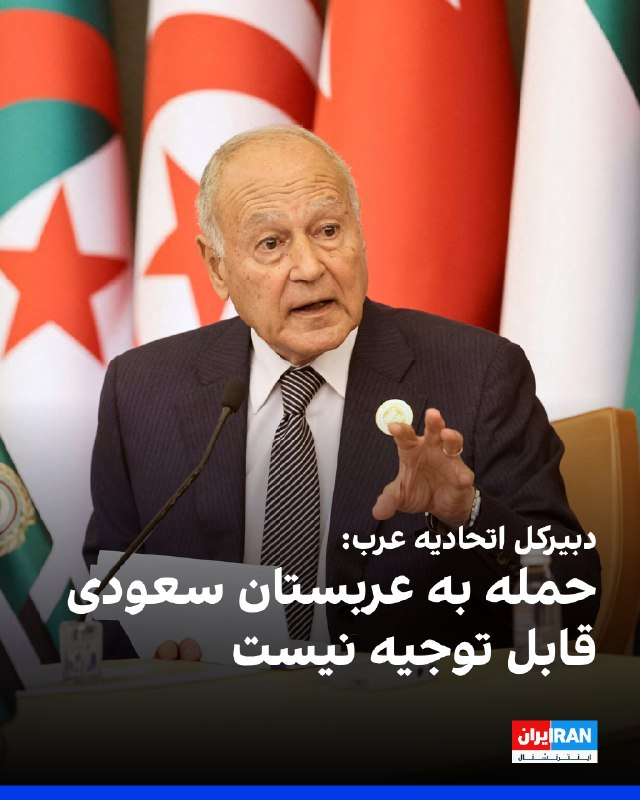

احمد ابوالغیط، دبیرکل اتحادیه عرب، حمله به عربستان سعودی با سه پهپاد را به‌شدت محکوم کرد و آن را نقضی آشکار حاکمیت و تمامیت ارضی این کشور دانست.

احمد ابوالغیط گفت: «این حمله بزدلانه به هیچ‌وجه قابل قبول یا توجیه نیست.»

او با اشاره به نقض حریم هوایی عربستان سعودی تاکید کرد این اقدام تجاوزی آشکار به حاکمیت این کشور بوده است.

جمال رشدی، سخنگوی دبیرکل اتحادیه عرب، نیز اعلام کرد دبیرکل همبستگی کامل خود را با پادشاهی عربستان سعودی در اقداماتی که برای حفاظت از اراضی و شهروندان خود مطابق با احکام حقوق بین‌الملل اتخاذ می‌کند، ابراز کرده است.
https://iranintl.com/202605184256

## IranIntlTV — post 337761

  <a href="telegram/content/IranIntlTV_337761_1779109565.mp4" target="_blank">🎬 Download video</a>

عفو بین‌الملل گزارش داد شمار اعدام‌ها در جهان در سال گذشته میلادی به بالاترین سطح در ۴۴ سال گذشته رسیده است؛ افزایشی که جمهوری اسلامی، نقش اول را در آن دارد.

گفت‌وگو با احمد صمدی، خبرنگار ایران‌اینترنشنال
@iranintltv

## IranIntlTV — post 337760

  <a href="telegram/content/IranIntlTV_337760_1779109567.mp4" target="_blank">🎬 Download video</a>

سرخط خبرهای دوشنبه ۲۸ اردیبهشت
@iranintltv

## IranIntlTV — post 337759

  

فریدریش مرتس، صدراعظم آلمان، روز دوشنبه اعلام کرد برلین حملات جمهوری اسلامی به امارات متحده عربی و سایر کشورها را محکوم می‌کند و افزود تهران باید تهدید همسایگان خود را متوقف کرده و تنگه هرمز را بدون محدودیت باز نگه دارد.

فریدریش مرتس در پیامی در شبکه ایکس نوشت: «حملات به تاسیسات هسته‌ای تهدیدی برای امنیت مردم در سراسر منطقه است. نباید هیچ‌گونه تشدید بیشتر خشونت رخ دهد.»

او همچنین تاکید کرد حکومت ایران باید وارد مذاکرات جدی با آمریکا شود.
https://iranintl.com/202605188672

## Shin_Persian — post 6061

Bundeskanzler Friedrich Merz @bundeskanzler
Mon, 18 May 2026 10:13:01 UTC

Die erneuten iranischen Luftschläge gegen die Vereinigten Arabischen Emirate und weitere Partner verurteilen wir scharf. Angriffe auf Nuklearanlagen sind eine Bedrohung für die Sicherheit der Menschen in der gesamten Region. Es darf zu keiner weiteren Gewalteskalation kommen.

فارسی

ما حملات هوایی مجدد ایران علیه امارات متحده عربی و سایر شرکا را به شدت محکوم می‌کنیم. حمله به تأسیسات هسته‌ای تهدیدی برای امنیت مردم در تمام منطقه است. نباید اجازه داد تنش و خشونت بیشتری رخ دهد.

𝕏 · @shin_persian

## Shin_Persian — post 6058

DefenceGeek 🇬🇧 ✓ @DefenceGeek Mon, 18 May 2026 09:46:18 UTC UPDATE: Fairford Bomber Training Flights #FreeIran‌ --- Operation EPIC FURY / Project FREEDOM --- As of a short while ago, @MATA_osint team members have tracked/identified a total of 50 training…

## Shin_Persian — post 6057

DefenceGeek 🇬🇧 ✓ @DefenceGeek
Mon, 18 May 2026 09:46:18 UTC

UPDATE: Fairford Bomber Training Flights #FreeIran‌
--- Operation EPIC FURY / Project FREEDOM ---

As of a short while ago, @MATA_osint team members have tracked/identified a total of 50 training sorties by US Air Force B-1B "Lancer" and B-52H "Stratofortress" bombers from RAF Fairford (EGVA) since the ceasefire began.

These comprise:
- 19 missions by B-52s (30 launches by 8 aircraft)
- 31 missions by B-1s (54 launches by 13 aircraft)
- 2 of the B-1s have not flown a single training sortie (yet)

Huge thanks as always to our team members @jamjake01 @Saint1Mil @Andyyyyrrrr @ArmchairAdml @LHA2709 @havoc_aviation

(Photos used with permission @havoc_aviation )

فارسی

به‌روزرسانی: پروازهای آموزشی بمب‌افکن‌های فایرفورد #FreeIran‌
--- عملیات خشم حماسی (Operation EPIC FURY) / پروژه آزادی ---

تا لحظاتی پیش، اعضای تیم @MATA_osint در مجموع ۵۰ سورتی پرواز آموزشی توسط بمب‌افکن‌های نیروی هوایی ایالات متحده (USAF) از نوع B-1B "Lancer" و B-52H "Stratofortress" را از پایگاه هوایی سلطنتی فایرفورد (EGVA) از زمان آغاز آتش‌بس ردیابی و شناسایی کرده‌اند.

این موارد شامل:
- ۱۹ ماموریت توسط B-52ها (۳۰ پرواز توسط ۸ فروند هواپیما)
- ۳۱ ماموریت توسط B-1ها (۵۴ پرواز توسط ۱۳ فروند هواپیما)
- ۲ فروند از B-1ها (هنوز) حتی یک سورتی پرواز آموزشی انجام نداده‌اند.

سپاس فراوان طبق معمول از اعضای تیم ما:
@jamjake01 @Saint1Mil @Andyyyyrrrr @ArmchairAdml @LHA2709 @havoc_aviation

(عکس‌ها با کسب اجازه استفاده شده است @havoc_aviation )

𝕏 · @shin_persian

## ManotoTV — post 105596

  <a href="telegram/content/ManotoTV_105596_1779109568.mp4" target="_blank">🎬 Download video</a>

رویترز در گزارشی اختصاصی نوشت پاکستان در جریان جنگ ایران، هشت هزار نیرو، یک اسکادران جنگنده و یک سامانه پدافند هوایی به عربستان سعودی اعزام کرده است.

بر اساس این گزارش، این اعزام در چارچوب پیمان دفاعی دوجانبه اسلام‌آباد و ریاض انجام شده و شامل حدود ۱۶ جنگنده، عمدتا از نوع جی‌اف‌ـ۱۷ ساخت مشترک پاکستان و چین، دو اسکادران پهپاد و سامانه پدافند هوایی چینی اچ‌کیو‌ـ۹ است. منابع رویترز گفتند عربستان هزینه این اعزام را تامین می‌کند و تجهیزات را نیروهای پاکستانی اداره می‌کنند.

پنج منبع امنیتی و دولتی به رویترز گفتند این نیروها با هدف حمایت از ارتش عربستان در صورت حملات بیشتر به این کشور مستقر شده‌اند.

## ManotoTV — post 105595

  <a href="telegram/content/ManotoTV_105595_1779109569.mp4" target="_blank">🎬 Download video</a>

رسانه‌های ترکیه گزارش دادند فرخنده قائم‌مقامی، زن ایرانی ساکن منطقه مال‌تپه استانبول، پس از قتل، جسدش در استان قرشهر پیدا شده است.

بر اساس گزارش خبرگزاری «دمیراورن»، خانم قائم‌مقامی از ۲۲ فروردین ناپدید شده بود و نزدیکان او پس از بی‌خبری، در ۲۳ اردیبهشت گزارش مفقودی ثبت کردند.

پلیس ترکیه در تحقیقات خود «ارکان ب»، ۴۹ ساله، را به‌عنوان آخرین فردی شناسایی کرد که با این زن ایرانی در تماس بوده است. بنا بر این گزارش، او ابتدا اتهام‌ها را رد کرد، اما بعدا به قتل اعتراف کرد.

دمیراورن نوشت مظنون در اعترافات خود گفته است پس از مشاجره در خودرو، قائم‌مقامی را با قلاده سگش خفه کرده، جسد او را تکه‌تکه کرده و در زمینی خالی در شهرستان موجور استان قرشهر رها کرده است.

در ادامه تحقیقات، دو مظنون دیگر نیز بازداشت شدند. سه مظنون این پرونده پس از پایان بازجویی در اداره پلیس، به دادگاه منتقل شدند.

## ManotoTV — post 105594

  <a href="telegram/content/ManotoTV_105594_1779109570.mp4" target="_blank">🎬 Download video</a>

بر اساس گزارش رسانه‌های حقوق بشری، نیروهای حکومتی روز ۱۵ اردیبهشت با یورش به خانه «افسانه جذابی (راسخی)»، شهروند بهائی ساکن شیراز، منزل او را تفتیش کردند و بخشی از اموال شخصی او را با خود بردند.

در این گزارش‌ها آمده است یک زن و سه مرد با ارائه حکمی با عنوان «همکاری با اسرائیل» وارد خانه این خانواده شدند و خانم جذابی و مادر ۸۵ ساله او را مورد تهدید و تحقیر قرار دادند. خانم جذابی به‌تازگی همسر خود را از دست داده و از مادر سالخورده و بیمار خود مراقبت می‌کند.

به گفته این رسانه‌ها، ماموران حکومتی به او گفتند فرزندش در خارج از کشور در فضای مجازی و کمپین‌های حقوق بشری فعالیت می‌کند و تهدید کردند در صورت ادامه این فعالیت‌ها، «هم برای شما و هم برای آنها گران تمام می‌شود.» آنها همچنین این خانواده را به مصادره خانه تهدید کردند.

بر اساس این گزارش‌ها، نیروهای امنیتی همچنین این خانواده را با عباراتی مانند «فرقه» و «همدست اسرائیل» خطاب کردند و چند بار خانم جذابی را به دستبند زدن و انتقال به مکانی نامعلوم تهدید کردند.

این یورش چند ساعت ادامه داشت و در پایان، خانم جذابی و مادر سالخورده‌اش که دچار افت فشار خون شده بود، مجبور شدند برگه‌ای را امضا کنند که در آن نوشته شده بود هیچ خسارتی به خانه و وسایل وارد نشده است. در این رویداد هیچ‌یک از اعضای خانواده بازداشت نشدند.

## ManotoTV — post 105593

  <a href="telegram/content/ManotoTV_105593_1779109571.mp4" target="_blank">🎬 Download video</a>

روزنامه ایران وابسته به دولت جمهوری اسلامی در گزارشی نوشت محدودیت دسترسی به اینترنت بین‌الملل، بازار خرید و فروش سیم‌کارت‌های عراقی را در برخی مناطق مرزی غرب ایران رونق داده است.

بر اساس این گزارش، بیشترین متقاضیان این سیم‌کارت‌ها تجار، بازرگانان، صاحبان بار، رانندگان ترانزیتی و فعالان اقتصادی مرزی هستند که برای ارتباط با طرف‌های عراقی، ارسال اسناد، حواله‌های مالی، رسیدها، عکس و فیلم کالاها از پیام‌رسان‌هایی مانند واتس‌اپ و تلگرام استفاده می‌کنند.

نعیم احمدی، مدیر روابط عمومی استانداری خوزستان، به این روزنامه گفت این سیم‌کارت‌ها در عمق یک تا دو کیلومتری خاک ایران قابل استفاده‌اند و در مناطقی مانند شلمچه، چذابه، خرمشهر، اروندکنار و جزیره مینو به گزینه‌ای در دسترس برای فعالان اقتصادی تبدیل شده‌اند. به گفته او، ارزانی این سیم‌کارت‌ها در مقایسه با هزینه فیلترشکن‌ها از عوامل گرایش به آنهاست.

در همین حال، محمد شفیعی، فرماندار قصرشیرین، استفاده از سیم‌کارت‌های عراقی در کرمانشاه را عمدتا محدود به تجار، صاحبان بار، رانندگان ترانزیتی و فعالان اقتصادی دانست و فراگیر شدن آن در میان عموم مردم را رد کرد.

## ManotoTV — post 105592

  

فریدریش مرتس، صدراعظم آلمان، حملات تازه جمهوری اسلامی علیه کشورهای منطقه را به‌شدت محکوم کرد و گفت حمله به تأسیسات هسته‌ای «تهدیدی برای امنیت مردم در سراسر منطقه» است.

او در پیامی در ایکس تأکید کرد که نباید خشونت‌ها بیش از این تشدید شود و از جمهوری اسلامی خواست وارد مذاکرات جدی با آمریکا شود، تهدید همسایگانش را متوقف کند و تنگه هرمز را بدون محدودیت باز کند.

این موضع‌گیری پس از آن مطرح شد که امارات از آتش‌سوزی در محدوده نیروگاه هسته‌ای براکه پس از حمله پهپادی خبر داد. مقام‌های اماراتی اعلام کردند این حادثه تلفات جانی و خطر تشعشعاتی نداشته است. عربستان سعودی نیز هم‌زمان از رهگیری حملات پهپادی تازه خبر داده است.

فریدریش مرتس، صدراعظم آلمان، حملات تازه منسوب به جمهوری اسلامی علیه کشورهای منطقه را محکوم کرد و گفت حمله به تأسیسات هسته‌ای امنیت مردم منطقه را تهدید می‌کند.

او از جمهوری اسلامی خواست وارد مذاکرات جدی با آمریکا شود، تهدید همسایگانش را متوقف کند و تنگه هرمز را بدون محدودیت باز کند. این موضع‌گیری پس از حمله پهپادی به محدوده نیروگاه هسته‌ای براکه در امارات و رهگیری حملات پهپادی تازه از سوی عربستان مطرح شده است.

## ManotoTV — post 105591

  

نِت‌بلاکس اعلام کرد خاموشی اینترنت در ایران وارد هشتادمین روز شده و مدت این اختلال از ۱۸۹۶ ساعت گذشته است.

نت‌بلاکس، نهاد ناظر بر اختلالات اینترنتی، در گزارشی اعلام کرد خاموشی اینترنت در ایران وارد هشتادمین روز شده و از ۱۸۹۶ ساعت عبور کرده است. این قطعی در حالی است‌ که دسترسی آزاد شهروندان به اینترنت همچنان محدود است، محتوای حامی جمهوری اسلامی در شبکه‌های اجتماعی به‌طور گسترده منتشر می‌شود.

بر اساس گزارش‌ها، برخی کاربران در ایران گفته‌اند برای دریافت دسترسی‌های ویژه یا «سفید»، از آن‌ها خواسته شده روزانه سهمیه‌ای از محتوای تبلیغاتی منتشر کنند؛ روندی که گفته می‌شود با ابزارهای هوش مصنوعی هم کنترل می‌شود.

## ManotoTV — post 105590

  <a href="telegram/content/ManotoTV_105590_1779109572.mp4" target="_blank">🎬 Download video</a>

یوروپل، آژانس همکاری پلیسی اتحادیه اروپا، اعلام کرد در یک اقدام هماهنگ برای مقابله با محتوای «تروریستی» در فضای مجازی، ۱۴ هزار و ۲۰۰ پیوند مرتبط با فعالیت‌های سپاه پاسداران شناسایی شده است.

بر اساس اعلام یوروپل، این عملیات با هدف مقابله با «زیست‌بوم تبلیغاتی» سپاه پاسداران در اینترنت انجام شد و محققان، هزاران پست و پیوند را برای ارجاع به ارائه‌دهندگان خدمات آنلاین هدف قرار دادند.

## ManotoTV — post 105589

  <a href="telegram/content/ManotoTV_105589_1779109573.mp4" target="_blank">🎬 Download video</a>

امروز، ۲۸ اردیبهشت ۱۴۰۵، هم‌زمان با زادروز محمدرشید مظاهری، دروازه‌بان سابق تیم ملی فوتبال ایران، جمعی از ایرانیان و اعضای «حزب پادشاهی‌خواه میهن‌پرستان ایران» مقابل کنسولگری جمهوری اسلامی در هامبورگ تجمع کردند.

تجمع‌کنندگان با گرامی‌داشت زادروز این ورزشکار، خواستار آزادی بی‌قیدوشرط او و همه زندانیان سیاسی شدند.

رشید مظاهری، بازیکن سابق استقلال، سپاهان، تراکتور و ذوب‌آهن، در ۵ اسفند ۱۴۰۴ پس از انتشار پستی انتقادی علیه علی خامنه‌ای بازداشت شد و بر اساس گزارش‌ها، نزدیک به سه ماه است در وضعیت ناپدیدشدن قهری قرار دارد.

گزارش‌ها و ویدیوهای خود را از طریق واتس‌اپ یا تلگرام برای منوتو بفرستید:

۰۰۴۴۷۵۹۰۸۹۹۹۹۹

## FarsiVOA — post 218056

  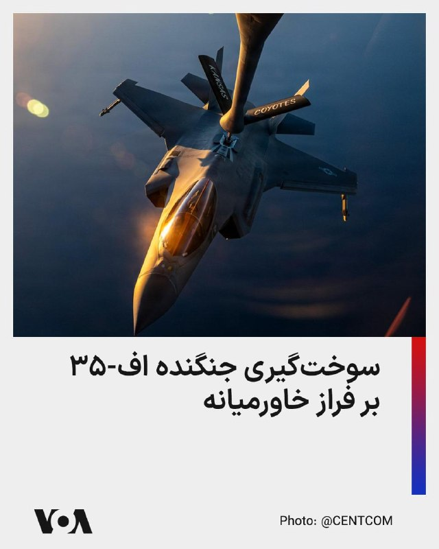

فرماندهی مرکزی ایالات متحده، سنتکام، با انتشار این تصویر اعلام کرد یک جنگنده رادارگریز اف-۳۵ در جریان گشت‌زنی معمول بر فراز آب‌های منطقه خاورمیانه سوخت‌گیری هوایی کرده است.

@FarsiVOA

## FarsiVOA — post 218055

  <a href="telegram/content/FarsiVOA_218055_1779109575.mp4" target="_blank">🎬 Download video</a>

جمهوری اسلامی به عنوان یکی از حکومت‌های دشمن روزنامه‌نگاری شناخته می‌شود. با این حال، روزنامه‌نگاران ایرانی در این سال‌ها هرگز گزارش‌های میدانی، خبررسانی‌، پرده‌برداری‌ از حقیقت و مستندسازی دردهای اجتماعی را متوقف نکرده‌اند

## FarsiVOA — post 218054

  <a href="telegram/content/FarsiVOA_218054_1779109575.mp4" target="_blank">🎬 Download video</a>

فرماندهی آمریکا در آفریقا، آفریکام، اعلام کرد در هماهنگی با دولت نیجریه، روز ۲۷ اردیبهشت مواضع گروه داعش در شمال شرقی این کشور را هدف حملات هوایی قرار داده است.

به گفته آفریکام، در این عملیات هیچ‌یک از نیروهای آمریکایی یا نیجریه‌ای آسیب ندیدند.

@FarsiVOA

## FarsiVOA — post 218053

  

فرماندهی مرکزی ایالات متحده، سنتکام، با انتشار این تصویر اعلام کرد ملوانان آمریکایی در ناو هواپیمابر آبراهام لینکلن در دریای عرب از عملیات پروازی پشتیبانی می‌کنند.

سنتکام نوشت: «هر موفقیت عملیاتی در حوزه مسئولیت این فرماندهی با زنان و مردان آمریکایی در یونیفرم آغاز و پایان می‌یابد.»

@FarsiVOA

## FarsiVOA — post 218052

🔺پاکستان یک اسکادران جنگنده و هزاران نیروی نظامی به عربستان سعودی اعزام کرد

▪️پاکستان تحت پیمان دفاعی دوجانبه، ۸ هزار نیروی نظامی، یک اسکادران جنگنده و یک سامانه پدافند هوایی به عربستان سعودی اعزام کرده است.

▪️این همکاری نظامی که هدف آن حمایت از ارتش عربستان در صورت مواجهه این کشور با حملات بیشتر است، در شرایطی است که اسلام‌آباد هم‌زمان نقش اصلی میانجی‌گری میان جمهوری اسلامی و آمریکا را بر عهده دارد.

▪️بر اساس اظهارات منابع آگاه، پاکستان یک اسکادران کامل شامل حدود ۱۶ هواپیما، عمدتاً جنگنده‌های جی‌اف-۱۷ که به‌طور مشترک با چین ساخته شده‌اند، به عربستان اعزام کرده است.

▪️این اقدام همچنین شامل اعزام حدود ۸ هزار نیروی نظامی است، همراه با تعهد برای اعزام نیروهای بیشتر در صورت نیاز.

⬇️ بیشتر بخوانید:
https://ir.voanews.com/a/8151190.html

## FarsiVOA — post 218051

🔺بلومبرگ: واردات ال‌ان‌جی اروپا برای دومین ماه متوالی کاهش می‌یابد

▪️بلومبرگ گزارش داد واردات گاز طبیعی مایع، ال‌ان‌جی، اروپا در ماه مه برای دومین ماه متوالی در مسیر کاهش قرار دارد؛ آن هم در شرایطی که جنگ اخلال جمهوری اسلامی در تنگه هرمز، جریان این سوخت را مختل کرده و محموله‌های بیشتری به سمت بازارهای آسیایی هدایت می‌شوند.

▪️حمله جمهوری اسلامی به تأسیسات رأس‌لفان قطر، ظرفیت تولید ال‌ان‌جی قطر را حدود ۱۷ درصد کاهش داد و قیمت‌های ال‌ان‌جی در آسیا را بیش از ۱۴۰ درصد بالا برد.

▪️اروپا پس از کاهش وابستگی به گاز روسیه، بیش از گذشته به واردات ال‌ان‌جی متکی شده است. اما افت واردات در ماه‌های آوریل و مه نشان می‌دهد این جایگزینی، اروپا را آسیب‌پذیر کرده است.

⬇️ بیشتر بخوانید:
https://ir.voanews.com/a/8151188.html

## FarsiVOA — post 218050

  

ارتش اسرائیل پیش از حملات هوایی که قرار است در روز دوشنبه علیه گروه تروریستی حزب‌الله تحت حمایت جمهوری اسلامی انجام شود، برای سه روستا در جنوب لبنان هشدار تخلیه صادر کرد.

بر اساس اعلام ارتش اسرائیل، به ساکنان این مناطق دستور داده شده دست‌کم یک کیلومتر از محل دور شوند.

سرهنگ آویخای ادرعی، سخنگوی ارتش اسرائیل، هشدار داد: «در پی نقض توافق آتش‌بس از سوی سازمان تروریستی حزب‌الله، ارتش اسرائیل ناچار است با قدرت علیه آن اقدام کند و قصد آسیب رساندن به شما را ندارد.»

پیشتر ارتش اسرائیل اعلام کرد که ده‌ها زیرساخت «سازمان تروریستی حزب‌الله» را در جنوب لبنان هدف قرار داده است؛ این اهداف شامل انبارهای تسلیحات، مواضع دیده‌بانی و زیرساخت‌هایی است که به گفته ارتش اسرائیل «برای پیشبرد طرح‌های تروریستی علیه نیروهای ما استفاده می‌شدند».
@FarsiVOA

## FarsiVOA — post 218049

  

رئیس آژانس بین‌المللی انرژی اعلام کرد که به‌دلیل بسته شدن تنگه هرمز به روی کشتیرانی، ذخایر تجاری نفت به‌سرعت در حال کاهش است و تنها چند هفته از این ذخایر باقی مانده است.

فاتح بیرول، روز دوشنبه ۲۸ اردیبهشت در حاشیه نشست رهبران مالی گروه هفت در پاریس، به خبرنگاران گفت که آزادسازی ذخایر راهبردی نفت، روزانه ۲.۵ میلیون بشکه نفت به بازار اضافه کرده اما این ذخایر «بی‌پایان نیستند».

او افزود آغاز فصل کشت بهاره و فصل سفرهای تابستانی در نیم‌کره شمالی باعث خواهد شد ذخایر سریع‌تر کاهش یابند، زیرا تقاضا برای گازوئیل، کود، سوخت جت و بنزین افزایش می‌یابد.

رئیس آژانس بین‌المللی انرژی در نشست وزیران دارایی و روسای بانک مرکزی کشورهای عضو گروه هفت درباره اختلاف میان بازار واقعی نفت و بازار مالی نفت صحبت کرد.

هفته گذشته، آژانس بین‌المللی انرژی اعلام کرد که عرضه جهانی نفت در سال جاری میلادی کمتر از مجموع تقاضا خواهد بود، زیرا جنگ علیه رژیم ایران تولید نفت خاورمیانه را به‌شدت مختل کرده و ذخایر با سرعتی بی‌سابقه در حال کاهش هستند.

این آژانس پیش‌تر برای امسال مازاد عرضه پیش‌بینی کرده بود.
@FarsiVOA

## FarsiVOA — post 218048

  

یک مقام وزارت نفت هند گفت دهلی‌نو خرید نفت از روسیه را صرف‌نظر از تمدید یا پایان معافیت‌های تحریمی آمریکا ادامه می‌دهد؛ موضعی که پس از پایان مهلت معافیت واشنگتن برای خرید نفت دریابرد روسیه اعلام شد.

رویترز گزارش داد سوجاتا شارما، از مقام‌های وزارت نفت هند، روز دوشنبه گفت هند «پیش از معافیت، در دوره معافیت و اکنون هم» از روسیه نفت خریده است. او افزود تصمیم دهلی‌نو بر پایه «منطق تجاری» است و معافیت یا نبود معافیت آمریکا، تأثیری بر خرید نفت روسیه نخواهد داشت.

با این حال، هند در برابر محموله‌های پرریسک‌تر محتاط‌تر عمل کرده است. رویترز پیش‌تر گزارش داده بود هند از خرید گاز طبیعی مایع روسیه که مشمول تحریم‌های آمریکا بود، خودداری کرده و یک محموله ال‌ان‌جی روسیه از تأسیسات پورتووایا، پس از رد شدن از سوی هند، نزدیک آب‌های سنگاپور بدون مقصد روشن مانده است. داده‌های مرین‌ترافیک نیز نشان می‌دهد کشتی «کونپنگ»، که تحت تحریم بریتانیا و اوکراین قرار دارد، پس از تغییر مسیر از هنگ‌کنگ به هند، دوباره سرگردان شده است.
@FarsiVOA

## FarsiVOA — post 218047

  

صدراعظم آلمان اعلام کرد که کشورش حملات جمهورس اسلامی به امارات متحده عربی و دیگر کشورها را محکوم می‌کند.

فریدریش مرتس روز دوشنبه در شبکه اجتماعی ایکس افزود که تهران باید تهدید همسایگان خود را متوقف کند و تنگه هرمز را بدون هیچ محدودیتی باز نگه دارد.

او در این پیام نوشت: «حملات به تأسیسات هسته‌ای، امنیت مردم در سراسر منطقه را تهدید می‌کند. نباید هیچ‌گونه تشدید بیشتر خشونت رخ دهد». او همچنین گفت که جمهوری اسلامی باید وارد مذاکراتی جدی با ایالات متحده شود.

مقام‌های ابوظبی اعلام کردند که یک حمله پهپادی روز یکشنبه باعث آتش‌سوزی در نزدیکی یک نیروگاه هسته‌ای در امارات متحده عربی شده است. کشورهای عربی منطقه این حمله را محکوم کردند.
@FarsiVOA

## FarsiVOA — post 218046

  <a href="telegram/content/FarsiVOA_218046_1779109578.mp4" target="_blank">🎬 Download video</a>

ارتش اسرائیل از کشتن یکی از اعضای حماس در غزه خبر داد؛

ارتش اسرائیل اعلام کرد که یکی از اعضای سازمان تروریستی حماس را که قصد اجرای طرح‌های تک‌تیراندازی علیه نیروهای این ارتش در آینده نزدیک داشت، کشته است.

ارتش اسرائیل با انتشار بیانیه‌ای نوشت: «یک هواگرد نیروی هوایی، با هدایت نیروهای لشکر غزه، روز یکشنبه یک تروریست از سازمان تروریستی حماس را که در حال پیشبرد طرح‌های تک‌تیراندازی در آینده نزدیک علیه نیروهای ارتش اسرائیل در جنوب نوار غزه بود، به هلاکت رساند.»

به نوشته ارتش اسرائیل، این عضو حماس «تهدیدی فوری برای نیروهای ارتش اسرائیل محسوب می‌شد و به‌صورت هدفمند برای رفع این تهدید» کشته شد.

بر اساس این گزارش، نیروهای ارتش اسرائیل تحت فرماندهی جبهه جنوب مطابق با توافق مستقر هستند و به فعالیت برای «رفع هرگونه تهدید فوری» ادامه خواهند داد.
@FarsiVOA

## FarsiVOA — post 218045

  <a href="telegram/content/FarsiVOA_218045_1779109580.mp4" target="_blank">🎬 Download video</a>

لحظه برخورد دو جنگنده نیروی دریایی آمریکا در نمایش هوایی؛

در دومین روز از نمایش هوایی «گانفایتر اسکایز» در پایگاه هوایی مانتین هوم در آبداهو، دو جت جنگنده ائی‌اِی-۱۸جی گرولر متعلق به نیروی دریایی ایالات متحده با یکدیگر برخورد کردند.

هر چهار سرنشین این دو جنگنده موفق به خروج اضطراری شدند و بر اساس تأیید نیروی دریایی، در حال حاضر تحت مراقبت‌های پزشکی هستند.

تحقیقات درباره علت دقیق این سانحه هوایی توسط مقامات نظامی آغاز شده است.
@FarsiVOA

## FarsiVOA — post 218044

  

رویترز به نقل از یک منبع پاکستانی گزارش داد اسلام‌آباد نسخه بازنگری‌شده پیشنهاد تهران برای پایان دادن به درگیری در خاورمیانه را به ایالات متحده منتقل کرده است؛ گزارشی که در ادامه تلاش‌های میانجی‌گرانه پاکستان و پس از رد پاسخ قبلی تهران از سوی دونالد ترامپ منتشر می‌شود.

این منبع پاکستانی به رویترز گفت «وقت زیادی نداریم» و افزود دو طرف همچنان مواضع و خواسته‌های خود را تغییر می‌دهند.

چند روز پیش، ترامپ پاسخ قبلی جمهوری اسلامی به طرح آمریکا را رد کرده و آن را «کاملاً غیرقابل قبول» خوانده بود.

انتشار خبر پیشنهاد بازنگری‌شده تهران هم‌زمان با سخنان تازه ترامپ درباره نیاز جمهوری اسلامی به توافق صورت می‌گیرد. رئیس جمهوری آمریکا در گفت‌وگویی با نشریه فورچون که روز دوشنبه منتشر شد، گفت مقام‌های جمهوری اسلامی با وجود اظهارات تند علنی، «به‌شدت» به امضای توافق با واشنگتن نیاز دارند. او همچنین گفت مقام‌های تهران «یک توافق می‌کنند و بعد کاغذی می‌فرستند که ربطی به توافق ندارد.»

ترامپ روز یکشنبه نیز هشدار داده بود تهران باید «سریع» اقدام کند، وگرنه با پیامدهای وخیم روبه‌رو خواهد شد.
@FarsiVOA

## FarsiVOA — post 218043

🔺خانوار ایرانی در وضعیت بقا؛ افت خرید زیر فشار تورم، جنگ و قطعی اینترنت

▪️آمار تازه شاپرک از فروردین ۱۴۰۵ نشان می‌دهد خانوارهای ایرانی زیر فشار تورم، جنگ، قطعی اینترنت و نااطمینانی اقتصادی، خریدهای خود را کاهش داده و بخشی از مصرف خود را به نیازهای فوری و حداقل‌های معیشتی محدود کرده‌اند.

▪️بر اساس این داده‌ها، حتی پس از حذف اثر تورم، هم ارزش حقیقی هر تراکنش و هم تعداد تراکنش‌ها در فروردین ۱۴۰۵ نسبت به فروردین سال قبل کاهش یافته است.

▪️در اسفند ۱۴۰۴، هم‌زمان با جنگ، رکود گسترده کسب‌وکارها و محدودیت اینترنت، ارزش حقیقی هر خرید بیش از ۲۰ درصد افت کرد؛ رقمی قابل توجه، چون اسفند به‌طور سنتی فصل افزایش خرید خانوارها پیش از نوروز است.

⬇️ بیشتر بخوانید:
https://ir.voanews.com/a/8151181.html

## FarsiVOA — post 218042

🔺عفو بین‌الملل: جمهوری اسلامی در سال ۲۰۲۵، دو هزار و ۱۵۹ نفر را اعدام کرده است

▪️عفو بین‌الملل می‌گوید در سال ۲۰۲۵، در مجموع دو هزار و ۷۰۷ اعدام در سراسر جهان به ثبت رسیده که نشان دهنده افزایش یک هزار و ۵۱۸ اعدام نسبت به سال ۲۰۲۴ است.

▪️افزایش چشمگیر تعداد اعدام‌ها در ایران، دلیل اصلی افزایش آمار جهانی اعدام‌ها اعلام شده است.

▪️جمهوری اسلامی در سال ۲۰۲۵، در مجموع دو هزار و ۱۵۹ مجازات اعدام به اجرا گذاشته است. این رقم در سال ۲۰۲۴، ۹۷۲ مورد ثبت شده است.

▪️عفو بین‌الملل یادآور شده که به دلیل عدم اطلاع‌رسانی و محرمانه بودن احکام اعدام در کشورهای چین، کره شمالی و ویتنام، به آمار این کشورها به صورت مستقل و دقیق دسترسی ندارد.

⬇️ بیشتر بخوانید:
https://ir.voanews.com/a/8151180.html

## FarsiVOA — post 218041

  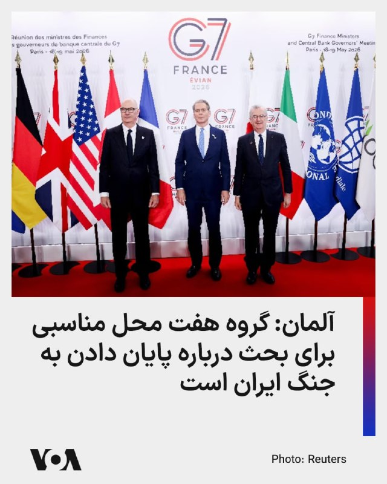

وزیر دارایی آلمان اعلام کرد که نشست گروه هفت محل مناسبی برای گفت‌وگو درباره چگونگی پایان دادن پایدار به جنگ ایران است.

لارس کلینگبایل که روز دوشنبه برای شرکت در نشست وزیران دارایی و روسای بانک‌های مرکزی کشورهای عضو گروه هفت به پاریس سفر خواهد کرد، گفت: «مسیر ما به‌عنوان اروپایی‌ها همچنان روشن است: ما به همکاری تکیه می‌کنیم، نه به تقابل.»

پیشتر دونالد ترامپ، رئیس‌جمهور آمریکا از کشورهای اروپایی به دلیل عملکردشان در قبال جنگ علیه جمهوری اسلامی انتقاد کرده است.

نشست گروه هفت در روزهای دوشنبه و سه‌شنبه برگزار می‌شود و به گفته وزیر دارایی آلمان در حاشیه آن همچنین گفت‌وگوهایی با وزیران دارایی برزیل، هند، کره جنوبی و کنیا انجام خواهد شد.

قرار است کلینگ‌بایل در پاریس، یک توافق‌نامه با اوکراین در زمینه اجتناب از اخذ مالیات مضاعف را امضا کند.
@FarsiVOA

## FarsiVOA — post 218040

  

وزارت خارجه اسرائیل با انتشار بیانیه‌ای، حرکت تازه یک ناوگان به‌سوی غزه را «تحریک‌آمیز» خواند و اعلام کرد این اقدام با عنوان کمک‌های بشردوستانه انجام می‌شود، اما به گفته این وزارتخانه، فاقد کمک واقعی است.

در این بیانیه آمده است که دو گروه ترکیه‌ای، از جمله مایوی مرمره و آی‌اچ‌اچ، در این حرکت نقش دارند. اسرائیل، آی‌اچ‌اچ را سازمانی تروریستی می‌داند.

وزارت خارجه اسرائیل هدف این ناوگان را خدمت به حماس، منحرف کردن افکار عمومی از خودداری حماس برای خلع سلاح و مانع‌تراشی در مسیر پیشبرد طرح صلح رئیس‌جمهور ایالات متحده آمریکا اعلام کرد.

این وزارتخانه همچنین به نقل از شورای صلح، نهاد ناظر بر فعالیت‌های بشردوستانه در غزه بر اساس قطعنامه ۲۸۰۳ شورای امنیت سازمان ملل، تأکید کرد که این ناوگان صرفاً اقدامی تبلیغاتی است.

در ادامه بیانیه آمده است که غزه از کمک‌های بشردوستانه پر شده و تنها از اکتبر ۲۰۲۵ تاکنون، بیش از یک میلیون و ۵۸۰ هزار تن کمک بشردوستانه و هزاران تن تجهیزات پزشکی وارد این منطقه شده است.
@FarsiVOA

## DW_Farsi — post 124829

🔶 سفر ترامپ به چین؛ آیا تهران در پی میانجی تازه است؟

اگر هدف سفر ترامپ به چین، رسیدن به یک تفاهم روشن و علنی با پکن بر سر ایران بود، دست‌کم در ظاهر چنین نتیجه‌ای حاصل نشد. نه بیانیه مشترکی منتشر شد و نه نشانه‌ای از یک توافق نهایی در موضوعات حساس دیده شد. با این حال، مجموعه پیام‌ها و واکنش‌ها نشان می‌دهد ایران یکی از محورهای مهم این سفر بوده است. در چنین فضایی، انتصاب فوری محمدباقر قالیباف به سمت نماینده ویژه ایران در امور چین، بیش از آنکه یک جابه‌جایی اداری ساده باشد، می‌تواند نشانه تلاش تهران برای بازتعریف کانال چین در میانه جنگ، فشار آمریکا و ابهام در آینده مذاکرات باشد.

به گزارش رویترز، جیمیسون گریر، نماینده تجاری ایالات متحده، گفت واشنگتن از چین نخواسته مستقیما برای بازگشایی تنگه هرمز وارد عمل شود، بلکه تمرکز اصلی بر این بوده که پکن از ارائه حمایت مادی به ایران خودداری کند. او همچنین گفت چین به دلیل وابستگی‌اش به مسیرهای انرژی و تجارت جهانی، به‌طور طبیعی از باز ماندن تنگه هرمز حمایت می‌کند. رویترز همچنین گزارش داده که موضع واشنگتن و پکن دست‌کم در مخالفت با محدودیت‌های تازه بر عبور و مرور در تنگه هرمز تا حدی به هم نزدیک شده است.

اما در سوی دیگر، موضع چین محتاط‌تر به نظر می‌رسد. همان گزارش‌ها نشان می‌دهد پکن بیش از آنکه به زبان فشار مستقیم علیه تهران سخن بگوید، بر کاهش تنش، باز ماندن مسیرهای انرژی و حل‌وفصل بحران از طریق دیپلماسی تاکید کرده است. این همان نقطه‌ای است که فاصله دیدگاه چین و آمریکا درباره ایران آشکار می‌شود: واشنگتن به‌دنبال مهار تهران از مسیر فشار و بازدارندگی است، اما چین ظاهرا هنوز می‌خواهد در چارچوب "مدیریت بحران" حرکت کند، نه در قالب همسویی آشکار با سیاست فشار آمریکا.

@dw_farsi

## DW_Farsi — post 124828

🔶 گفت‌وگوی تلفنی نتانیاهو و ترامپ درباره "حمله به ایران"

دفتر نخست‌وزیر اسرائیل در پاسخ به "تایمز اسرائیل" تأیید کرده است که بنیامین نتانیاهو، نخست‌وزیر این کشور، شامگاه یکشنبه ۱۷ مه (۲۷ اردیبهشت) در تماسی تلفنی با دونالد ترامپ، رئیس جمهور آمریکا، درباره جنگ با ایران گفت‌وگو کرده است.

بر اساس گزارش رسانه‌های عبری‌زبان، دو طرف درباره احتمال از سرگیری جنگ با ایران و همچنین سفر اخیر ترامپ به چین گفت‌وگو کرده‌اند.

به گزارش تایمز اسرائیل، نتانیاهو قرار بوده پس از این تماس، شماری از دستیاران ارشد و وزیران کابینه‌اش را برای یک نشست امنیتی در دفتر خود در اورشلیم گرد هم آورد.

چنین نشست‌هایی در دفتر نخست‌وزیری که اغلب "کابینه امنیتی کوچک" نامیده می‌شوند، معمولاً شامل گیدئون ساعر، وزیر خارجه، یسرائیل کاتس، وزیر دفاع، بتسالل اسموتریچ، وزیر دارایی، ایتامار بن‌گویر، وزیر امنیت ملی، و آریه درعی، رهبر حزب شاس، هستند.

هفته گذشته گزارش شده بود که اسرائیل و آمریکا در حال انجام آماده‌سازی‌های فشرده برای ازسرگیری حملات به ایران هستند و احتمال دارد این حملات حتی از همین هفته آغاز شوند. گفت‌وگوهای روز یکشنبه پس از آن انجام گرفته که حمله‌ای پهپادی نیروگاه هسته‌ای امارات متحده عربی را هدف قرار داد؛ کشوری که پس از اسرائیل، در جریان جنگ بیشترین ضربه‌ها را از ایران خورده است.

به گزارش اکسیوس به نقل از دو مقام آمریکایی، انتظار می‌رود ترامپ فردا سه‌شنبه نیز نشستی در "اتاق وضعیت" کاخ سفید با مشاوران ارشد امنیت ملی خود برای بررسی گزینه‌های نظامی علیه ایران برگزار کند.

@dw_farsi

## DW_Farsi — post 124827

  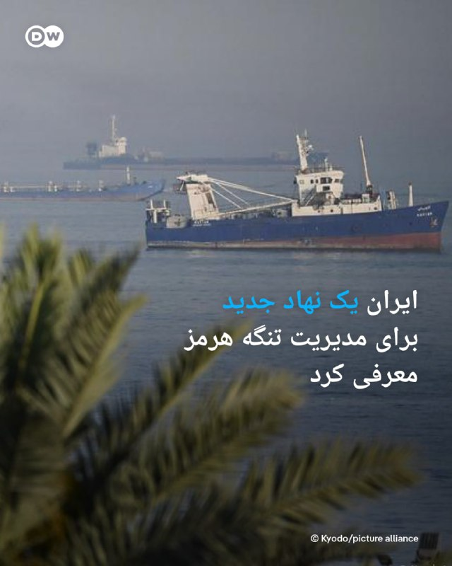

🔶 ایران یک نهاد جدید برای مدیریت تنگه هرمز معرفی کرد

شورای عالی امنیت ملی ایران از تشکیل نهادی برای مدیریت تنگه هرمز خبر داد. این شورا روز دوشنبه با انتشار پستی در شبکه ایکس با اعلام راه‌اندازی حساب کاربری این نهاد تازه تأسیس با نام "مدیریت آبراه خلیج فارس" نوشت "به‌روز رسانی‌های لحظه‌ای در مورد عملیات تنگه هرمز و آخرین تحولات" در این رابطه از طریق این حساب منتشر خواهد شد.

با این حال تاکنون جزئیات بیشتری درباره ساختار، اختیارات یا مأموریت‌های دقیق این نهاد تازه ‌تأسیس منتشر نشده است.

این اقدام در حالی صورت می‌گیرد که تنگه هرمز در ماه‌های اخیر به یکی از کانون‌های اصلی تنش‌های منطقه‌ای تبدیل شده و نقش آن در امنیت انرژی و حمل‌ونقل جهانی اهمیت بیشتری یافته است.

@dw_farsi

## DW_Farsi — post 124826

  

🔶 آژانس بین‌المللی انرژی: ذخایر تجاری نفت جهان به‌سرعت در حال کاهش است

آژانس بین‌المللی انرژی اعلام کرد که با ادامه اختلال در صادرات نفت خلیج فارس بر اثر جنگ خاورمیانه، ذخایر تجاری نفت جهان "بسیار سریع" در حال کاهش است؛ این روند حتی با وجود آزادسازی ذخایر راهبردی توسط دولت‌ها ادامه دارد.

فاتح بیرول، مدیر آژانس، روز دوشنبه، ۱۸ مه (۲۸ اردیبهشت) در حاشیه نشست وزیران دارایی گروه هفت در پاریس گفت: «ذخایر تجاری (انرژی) در حال کاهش‌اند… و به‌نظر من اکنون با سرعت زیادی تخلیه می‌شوند.»
او هشدار داد که اگرچه هنوز چند هفته زمان باقی مانده، اما این ذخایر "بی‌پایان نیستند".

نگرانی‌ها درباره کمبود انرژی هم‌زمان با نزدیک شدن فصل سفرهای تابستانی در نیمکره شمالی افزایش یافته است. شرکت‌های هواپیمایی هشدار داده‌اند که در صورت ادامه اختلالات، ممکن است طی چند هفته با کمبود سوخت جت روبه‌رو شوند.

پس از حملات آمریکا و اسرائیل به ایران در اواخر فوریه، ایران عملاً عبور نفتکش‌ها از تنگه هرمز را متوقف کرده؛ اقدامی که باعث اختلال شدید در انتقال نفت و گاز و جهش قیمت‌ها شده است.

@dw_farsi

## DW_Farsi — post 124825

  <a href="telegram/content/DW_Farsi_124825_1779109584.mp4" target="_blank">🎬 Download video</a>

🎥 خاویر باردم در کن؛ حمله به ترامپ، پوتین و نتانیاهو

خاویر باردم، بازیگر برنده اسکار، که در جشنواره فیلم کن جضور دارد، در سخنانی دونالد ترامپ، ولادیمیر پوتین و بنیامین نتانیاهو را به "رفتار مردانه سمی" متهم کرد. آسوشیتدپرس می‌نویسد باردم این رفتار را عامل جنگ‌های کنونی در ایران، غزه و اوکراین دانسته است.

باردم این سخنان را در نشست خبری فیلم "El Ser Quierdo" که نامزد دریافت نخل طلای جشنواره کن شده، بیان کرده است.

@dw_farsi

## DW_Farsi — post 124824

  

🔶 ترخیص نرگس محمدی از بیمارستان و تداوم نگرانی‌ها نسبت به وضعیت فاطمه سپهری

بنیاد نرگس محمدی روز دوشنبه ۲۸ اردیبهشت (۱۸ مه) اعلام کرد این فعال سیاسی پس از ۱۶ روز، از بیمارستان مرخص شد.

نرگس محمدی از ۱۱ تا ۲۰ اردیبهشت در بیمارستان زنجان و از ۲۰ تا ۲۷ اردیبهشت در بخش مراقبت‌های ویژه در بیمارستان پارس در تهران بستری بود و به گفته این بنیاد "تحت عمل آنژیوپلاستی و آزمایشات مربوط به اختلالات شدید فشار خون از جمله Tilt Test" قرار گرفت.

این فعال سیاسی برنده جایزه نوبل صلح آذرماه سال گذشته در جریان مراسم خاکسپاری خسرو علیکردی، وکیل دادگستری، در مشهد بازداشت و به زندان محکوم شد.

بنیاد نرگس محمدی گفته است که "طبق نظر پزشکان متخصص از جمله قلب و مغز، ضرورت بر تحت نظر و مراقبت‌های درمانی خاص برای او وجود دارد و تا یک ماه حداقل هر‌ روز در بیمارستان تحت فیزیوتراپی قرار خواهد داشت".

@dw_farsi

## DW_Farsi — post 124823

  

🔶 قطعی اینترنت در ایران از ۸۰ روز گذشت

نت‌بلاکس که در زمینه پایش، تحلیل و مستندسازی وضعیت اینترنت در جهان فعالیت می‌کند، روز دوشنبه ۲۸ اردیبهشت (۱۸ مه) با اشاره به تداوم قطعی سراسری اینترنت در ایران اعلام کرد این اختلال اکنون وارد هشتادمین روز خود شده و از ۱۸۹۶ ساعت فراتر رفته است.

نت بلاکس با اشاره به فعالیت قابل توجه کاربران و فعالان رسانه‌ای نزدیک به حکومت با استفاده از اینترنت موسوم به "سفید" در شبکه‌های اجتماعی، خاطرنشان ساخت محتوای تولید شده توسط این افراد در حمایت از جمهوری اسلامی شبکه‌های اجتماعی را "اشباع" کرده است.

در پیام نت بلاکس که در شبکه ایکس منتشر شده، آمده است: «ایرانیانی که به‌دنبال دریافت دسترسی ویژه یا دسترسی فهرست سفید هستند، می‌گویند از آن‌ها خواسته می‌شود سهمیه‌ای از پست‌های روزانه تبلیغاتی را منتشر کنند که این روند با استفاده از هوش مصنوعی پایش می‌شود.»

@dw_farsi

## DW_Farsi — post 124822

  

🔶 ترامپ: مقام‌های ایران به شدت مشتاق امضای توافق‌اند

دونالد ترامپ در گفت‌وگویی مفصل با مجله "فورچون" که روز دوشنبه ۲۸ اردیبهشت منتشر شد، گفت که مقام‌های جمهوری اسلامی به شدت به دنبال امضای یک توافق با آمریکا هستند، اما بعد از اینکه توافق می‌کنند، سندی را می‌فرستند که "هیچ ربطی با توافق ندارد".

رئیس جمهور آمریکا در این مصاحبه درباره ایرانی‌ها گفت: «آنها مدام فریاد می‌زنند.»

ترامپ افزود: «یک چیز را می‌توانم به شما بگویم، آن‌ها به‌شدت مشتاق امضای توافق هستند. اما یک توافق می‌کنند و بعد سندی برایتان می‌فرستند که هیچ ارتباطی با توافقی که کرده‌اید ندارد. من می‌گویم: شماها دیوانه‌اید؟»

ترامپ بارها در گفت‌وگو با رسانه‌ها و خبرنگاران در کاخ سفید اظهار داشته است که جمهوری اسلامی "مشتاق توافق" است. او تهدید کرده است چنانچه رهبران ایران با آمریکا به توافق نرسند، ایالات متحده حملات شدیدتری را علیه این کشور انجام خواهد داد.

او روز یکشنبه با انتشار پیامی در شبکه تروث سوشال هشدار داده بود که زمان برای ایران "در حال پایان است و آن‌ها بهتر است خیلی سریع اقدام کنند وگرنه چیزی ازشان باقی نخواهد ماند".

@dw_farsi

## Persian_Trend_Official — post 14414

  <a href="telegram/content/Persian_Trend_Official_14414_1779109587.webm" target="_blank">🎬 Download video</a>

⭕️بازسازی زیرساخت‌های آسیب‌دیده پارس جنوبی در ۲ سال

سخنگوی کمیسیون انرژی مجلس:
💢برای بازسازی و نوسازی زیرساخت‌های پالایشگاهی و پتروشیمی منطقه پارس جنوبی با تکیه بر دانش بومی برنامه‌ریزی شده است.

💢این مراکز با طراحی و فناوری‌های جدید و با ظرفیتی بیش از قبل، به مدار تولید بازخواهند گشت.

💢پیش‌بینی می‌شود حدود ۵۰ درصد از بازسازی‌ها تا پیش از آغاز فصل سرد سال به سرانجام برسد.

💢کل فرآیند آواربرداری، بازسازی و نوسازی زیرساخت‌ها در مدت حداکثر ۲ سال تکمیل شود.

🫆:Tony

📌 @persian_trend_official
پرشین ترند | متفاوت‌ترین کانال نظامی

## Persian_Trend_Official — post 14413

  <a href="telegram/content/Persian_Trend_Official_14413_1779109588.webm" target="_blank">🎬 Download video</a>

⭕️ وضعیت کم سابقه‌ی آسمان منطقه، از نظر خلوت بودن. (در عکس اول فقط پرواز های نظامی آمریکا و در عکس دوم تمام پرواز های نظامی) 📝 Nick 📌 @persian_trend_official پرشین ترند | متفاوت‌ترین کانال نظامی

## Persian_Trend_Official — post 14410

⭕️ وضعیت کم سابقه‌ی آسمان منطقه، از نظر خلوت بودن.

(در عکس اول فقط پرواز های نظامی آمریکا
و در عکس دوم تمام پرواز های نظامی)

📝 Nick

📌 @persian_trend_official
پرشین ترند | متفاوت‌ترین کانال نظامی

## Persian_Trend_Official — post 14409

  <a href="telegram/content/Persian_Trend_Official_14409_1779109588.webm" target="_blank">🎬 Download video</a>

📰
🇸🇦
🇵🇰طبق گزارش رویترز، پاکستان در چارچوب «توافق دفاع مشترک» با عربستان:

🔢حدود ۸ هزار نیروی نظامی،

🔢یک اسکادران جنگنده عمدتاً از نوع JF-17،

🔢دو اسکادران پهپادی

🔢 سامانه پدافند هوایی HQ-9 ساخت چین
را در خاک عربستان مستقر کرده است.

❎بر اساس این گزارش، این اقدام با هدف تقویت همکاری‌های دفاعی و امنیتی میان اسلام‌آباد و ریاض انجام شده است.
❎

☆Phantom☆

📌 @persian_trend_official
پرشین ترند | متفاوت‌ترین کانال نظامی

## Persian_Trend_Official — post 14408

  

ایران سامانه «هرمز سیف» را برای ثبت‌نام کشتی‌های عبوری از تنگه هرمز راه‌اندازی کرد

جمهوری اسلامی ایران سامانه‌ای تحت عنوان «هرمز سیف» را با هدف ارائه خدمات به کشتی‌های عبوری از تنگه هرمز راه‌اندازی کرده است. بر اساس این طرح، ناخدایان و شرکت‌های کشتیرانی می‌توانند از طریق این سامانه درخواست خدمات مختلف از جمله بیمه، کترینگ، خدمات اضطراری و همراهی اسکورت نظامی را ثبت کنند.جالبه که اسکورت نظامی رو هم جزو «خدمات» گذاشتن، کنارِ کترینگ! 😂

با این حال، این سامانه با یک چالش فنی قابل توجه مواجه است؛ وب‌سایت مذکور از خارج از ایران قابل دسترسی نیست و کاربران خارجی برای ثبت‌نام ملزم به استفاده از اینترنت ایرانی هستند.

آدرس سامانه: hormuzsafe.ir

☆Phantom☆

📌 @persian_trend_official
پرشین ترند | متفاوت‌ترین کانال نظامی

## Persian_Trend_Official — post 14407

  <a href="telegram/content/Persian_Trend_Official_14407_1779109589.webm" target="_blank">🎬 Download video</a>

⭕️ تسنیم: ایران متن جدید ۱۴ بندی به آمریکا ارائه کرد

💢خبرگزاری تسنیم به نقل از یک منبع نزدیک به تیم مذاکره‌کننده گزارش داد تهران از طریق میانجی پاکستانی، متن جدیدی شامل ۱۴ بند به طرف آمریکایی تحویل داده است.

▪️پیش تر اخباری از منابع پاکستانی نسبت به ارسال پیشنهاد جدید جمهوری اسلامی به آمریکا توسط این کشور منتشر شده بود.

🫆:Tony

📌 @persian_trend_official
پرشین ترند | متفاوت‌ترین کانال نظامی

## Persian_Trend_Official — post 14406

  

🕊
👨‍🦲 سفر پوتین به چین تنها ۴ روز پس از حضور ترامپ

🔹رئیس‌جمهور چین کمتر از یک هفته پس از سفر رئیس‌جمهور آمریکا به پکن، اکنون برای میزبانی همتای روس خود آماده می‌شود.

🔹دیدارهای روسای جمهور آمریکا و روسیه نشان می‌دهد که پکن «به سرعت در حال ظهور به عنوان نقطه کانونی دیپلماسی جهانی» است.

🔹تجارت دوجانبه چین و روسیه از سال ۲۰۲۲ بعد از جنگ اوکراین به بالاترین سطح خود رسیده است، به طوری که چین بیش از یک‌چهارم صادرات روسیه را خریداری می‌کند.

☆Phantom☆

📌 @persian_trend_official
پرشین ترند | متفاوت‌ترین کانال نظامی

## Persian_Trend_Official — post 14405

  <a href="telegram/content/Persian_Trend_Official_14405_1779109590.webm" target="_blank">🎬 Download video</a>

#طنز

جدیدا سرورهای سوپر اپلیکیشن بله وقت ناهار و نماز همراه کارمندان شرکت استراحت می‌کنند. 😌

📝 Nick

📌 @persian_trend_official
پرشین ترند | متفاوت‌ترین کانال نظامی

## Persian_Trend_Official — post 14404

  <a href="telegram/content/Persian_Trend_Official_14404_1779109590.mp4" target="_blank">🎬 Download video</a>

🇵🇰انفجار مرگبار در وزیرستان پاکستان و ترور یکی از بزرگان قبایل

🔹در پی انفجار بمب در بازار «رستم» شهر وانا، ۳ نفر کشته و ۴ نفر زخمی شدند.
🔹منابع محلی اعلام کردند در میان کشته‌شدگان، «ملک طارق وزیر» از بزرگان بانفوذ قبایل منطقه نیز حضور دارد که در حل اختلافات قومی نقش مهمی داشت.

PHANTOM

📌 @persian_trend_official
پرشین ترند | متفاوت‌ترین کانال نظامی

## RadioFarda — post 157312

  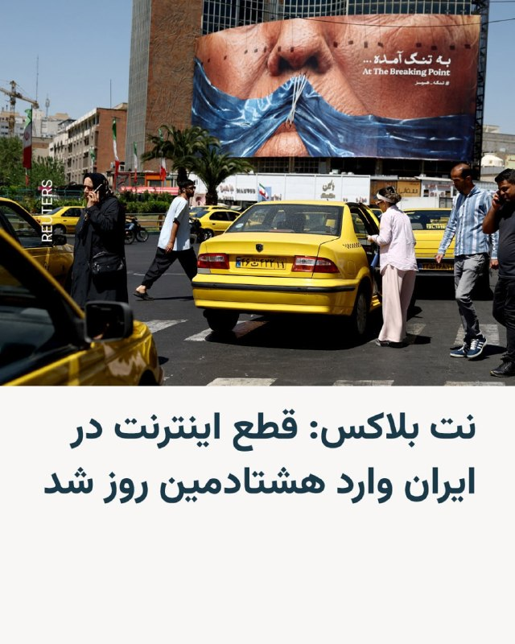

🔸 نت بلاکس، که وضعیت اینترنت را در جهان رصد می‌کند، روز دوشنبه ۲۸ اردیبهشت خبر داد که قطع اینترنت در ایران وارد هشتادمین روز خود شد و این خاموشی از ۱۸۹۶ ساعت گذشته است.

🔸 این شبکه در حساب کاربری خود در ایکس نوشت که در همین حال، شبکه‌های اجتماعی پر از محتواهای حامی حکومت است و ایرانیانی که به‌دنبال دریافت اینترنت پرو هستند می‌گویند از آن‌ها خواسته می‌شود سهمیه‌ای از پست‌های تبلیغاتی روزانه را منتشر کنند که توسط هوش مصنوعی نظارت می‌شود.

🔸 اینترنت در ایران، به‌رغم سانسور و اعمال فیلترینگ گسترده، از ۹ اسفند پارسال همزمان با شروع جنگ آمریکا و اسرائیل با ایران و به بهانهٔ آن، به‌طور کامل قطع شده است.

🔸 در این مدت، شمار قابل‌توجهی از فعالان رسانه‌ای نزدیک به حکومت با استفاده از اینترنت موسوم به «سفید» در شبکه‌های اجتماعی از عملکرد جمهوری اسلامی حمایت کرده‌اند.

🔸 همزمان، در هفته‌های اخیر برخی اپراتورها اقدام به تبلیغ و فروش اینترنت موسوم به «طبقاتی» یا «پرو» کرده‌اند؛ اینترنتی که با عنوان ویژهٔ «کسب‌وکارها» و با هزینه‌ای بسیار بالا عرضه می‌شود.

@RadioFarda

## RadioFarda — post 157311

  <a href="https://t.me/radiofarda/157311" target="_blank">📎 Download file</a>

📻بشنوید: ساعت ۱۴ با رادیوفردا، ۲۸ اردیبهشت ۱۴۰۵‌

@Radiofarda

## RadioFarda — post 157310

  

🔸صدراعظم آلمان آنچه که «از سرگیری حملات ایران» به امارات متحده عربی و دیگر شرکا خواند، را «قویاً» محکوم کرد و گفت تهران باید تهدید همسایگان خود را متوقف کرده و تنگه هرمز را بدون محدودیت باز نگه دارد.

🔸فردریش مرتس روز دوشنبه ۲۸ اردیبهشت در پیامی در شبکه ایکس نوشت: «حملات به تأسیسات هسته‌ای تهدیدی برای امنیت مردم در سراسر منطقه است. نباید هیچ‌گونه تشدید بیشتری در خشونت رخ دهد».

🔸او همچنین گفت که ایران باید وارد مذاکرات جدی با ایالات متحده شود.

🔸مقام‌های امارات روز یکشنبه اعلام کردند که یک حمله پهپادی باعث آتش‌سوزی در یک نیروگاه هسته‌ای این کشور شده است.

@RadioFarda

## RadioFarda — post 157309

  

🔸رئیس کل دادگستری آذربایجان غربی روز دوشنبه ۲۸ اردیبهشت از توقیف اموال ۱۲۹ نفر در این استان با اتهامات امنیتی خبر داد.

🔸ناصر عتباتی از این افراد با عنوان «گروهک‌های ضدانقلاب و تجزیه‌طلب» نام برد و آن‌ها را به «اقدامات ضدامنیتی و همکاری با کشورهای متخاصم» متهم و اعلام کرد که اموال آن‌ها به «نفع ملت» مصادره شده است.

🔸دادگستری آذربایجان غربی اسامی این افراد را اعلام نکرده و برای اتهامات علیه این افراد شواهد و مدارکی ارائه نداده است.

🔸پیش از این نیز گزارش‌های متعددی از توقیف اموال شماری از روزنامه‌نگاران، فعالان سیاسی و مدنی، هنرمندان، ورزشکاران و چهره‌های شناخته‌شده با اتهامات مشابه منتشر شده بود.

@RadioFarda

## RadioFarda — post 157308

پاراگراف اول؛ آیا کارزارهای تحریمی، تیم ملی فوتبال را به سمت حکومت هل داد؟

🔸«اجازه دادن به تیم رژیم ایران برای شرکت در جام جهانی یک فاجعه اخلاقی است»؛ این را یک ایرانی طرفدارِ دوآتشه فوتبال در یادداشتی برای هفته‌نامه بریتانیایی «اسپکتیتور» نوشته است.

🔸نام او آتبین معیدی است و در متن خود تأکید می‌کند که از طرفداران دو آتشه سردار آزمون و مهدی طارمی است؛ زوجی در خط حمله تیم ملی ایران که این هوادار فوتبال برای توصیف عملکردشان از تعبیر تله‌پاتیک (دورآگاهانه) استفاده می‌کند.

🔸با این حال، او اصرار دارد که مخالفتش با حضور تیم ملی فوتبال ایران در جام جهانی صرفاً سلیقه شخصی‌اش نیست و آن را «خواستی عمومی» معرفی می‌کند؛ به‌گونه‌ای که می‌نویسد، مسئله برای «ایرانیان» نه یک بحث سیاسی، بلکه مسئله‌ای درباره حقوق بشر و عدالت است.

🔸در ذهنیت او، سردار آزمون یک ترکمن ایرانیِ خونسرد، بی‌تکلف و دوست‌داشتنی است که در سال‌های اخیر علیه رژیم صحبت کرده است؛ و در مقابل، مهدی طارمی چهره‌ای آرام و کم‌حرف که در نگاه او حامی رژیم و ایدئولوژی آن بوده است. هرچند این هوادار فوتبال در ادامه می‌نویسد نشانه‌هایی وجود دارد که ستاره پیشین اینترمیلان موضع خود را تغییر داده است.

🔸این هوادار فوتبال، تابستان امسال به دیدار خانواده‌اش در لس‌آنجلس می‌رود؛ شهری که میزبان دو بازی ایران در جام جهانی است.

🔸نسخه کامل این گزارش را در وب‌سایت رادیوفردا بخوانید.

@RadioFarda

## IranianMinds — post 20335

  

🔴 نیویورک تایمز:

آمریکا و اسرائیل در حال انجام شدیدترین آمادگی‌های خود از زمان آغاز آتش‌بس هستند، چرا که احتمال حملات مجدد به ایران حتی از همین هفته وجود دارد.

پنتاگون نیز خود را برای از سرگیری احتمالی «عملیات خشم‌ حماسی» آماده میکند.

@IranianMinds

## IranianMinds — post 20334

  <a href="telegram/content/IranianMinds_20334_1779109594.mp4" target="_blank">🎬 Download video</a>

🔴ناو‌شکن با صلابت و سرافراز به صورت عمودی غرق شد.
یادآوری😂😂😂

@IranianMinds

## IranianMinds — post 20333

  

🔴 ارتش اسرائیل :

امروز‌ فرمانده جهاد اسلامی فلسطین رو از بین بردیم.

@IranianMinds

## IranianMinds — post 20332

  

🔴 رویترز :

پاکستان در جریان جنگ ایران، طبق یک توافق پنهان دفاعی، ۸۰۰۰ نیرو، جنگنده، پهپاد و سیستم‌های دفاع هوایی به عربستان فرستاده است.

این نیروها شامل جنگنده‌های JF-17، سیستم‌های چینی HQ-9 و تجهیزات تحت عملیات پاکستان است که توسط ریاض تأمین مالی شده‌اند.

این استقرار آماده عملیات رزمی است و در صورت نیاز می‌تواند تا ۸۰,۰۰۰ نیرو گسترش یابد.

@IranianMinds

## IranianMinds — post 20331

🔴 خبرگزاری فوق معتبر تسنیم:

گفته میشه تو پیش‌نویس تازه مذاکرات، آمریکا موافقت کرده موقتا تحریم‌های نفتی ایران رو در طول مذاکرات برداره.

ایران می‌خواد همه تحریم‌ها کامل برداشته بشه، اما آمریکا فعلا فقط پیشنهاد معافیت موقت از تحریم‌های OFAC رو تا رسیدن به توافق نهایی داده

@IranianMinds

## IranianMinds — post 20330

  

🔴 بعضی جوونا و‌ نوجوونا تو‌ این کشور یه خوشی داشتن اونم میخوان ازشون بگیرن

معاون نظارت بنیاد ملی بازی های رایانه جمهوری اسلامی اعلام کرد که قراره یه «گیم سنتر مرکزی» بسازن که همه سایت‌های دانلود بازی، لینک‌هاشون رو از اون رد کنن تا قبل از انتشار بازی‌ها رو چک کنن که با قوانین اسلامی سازگار باشه و روی نوجوونا تاثیری نداشته باشه !

@IranianMinds

## IranianMinds — post 20329

  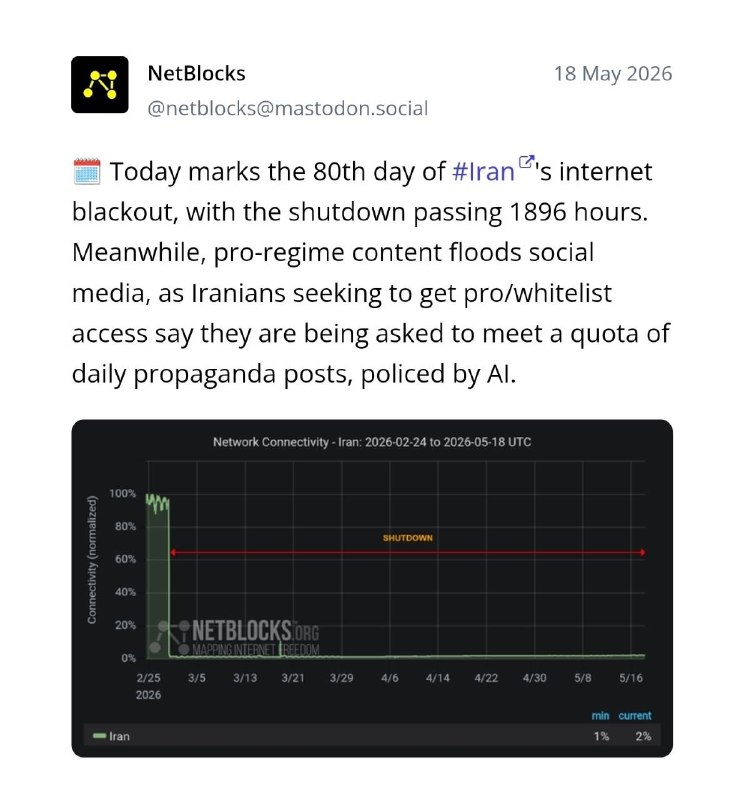

🔴نت‌بلاکس دوشنبه ۲۸ اردیبهشت اعلام کرد هشتادمین روز از قطع اینترنت در ایران است و مدتش به ۱۸۹۶ ساعت رسیده است.

بر اساس گزارش این نهاد ناظر بر اینترنت جهانی، همزمان با تداوم این وضعیت، محتوای حامی حکومت، شبکه‌های اجتماعی را پر کرده است.
این نهاد همچنین اعلام کرد برخی از ایرانیانی که برای دریافت اینترنت«پرو» یا دسترسی سیم‌کارت سفید اقدام کرده‌اند می‌گویند از آن‌ها خواسته می‌شود سهمیه‌ایی از پست‌های تبلیغاتی روزانه منتشر کنند.
نت‌بلاکس افزود: این فعالیت‌ها با استفاده از هوش مصنوعی نظارت می‌شود.

@IranianMinds

## IranianMinds — post 20328

در حالی که‌ مردم دنیا هیجان دارن واسه جام جهانی و‌ منتظرن شروع شه

ما ایرانیا دغدغمون اینه که کی بزنن و‌ دوباره جنگ شه که شاید از دست این آخوندا زودتر نجات پیدا کردیم :)

یعنی خورشید یه روزی تو‌این سرزمین هم طلوع میکنه دوباره؟

@IranianMinds

## IranianMinds — post 20327

  <a href="telegram/content/IranianMinds_20327_1779109597.mp4" target="_blank">🎬 Download video</a>

🔴 اکانت اسرائیل به فارسی:

هرچه بیشتر به سقوط نزدیک می‌شوند، اسلحه‌ها بزرگ‌تر می‌شوند.

@IranianMinds

## IranianMinds — post 20326

🔴 پاکستان :

تمام تلاشمونو میکنیم که آتش بس رو‌ زنده نگه داریم.

@IranianMinds

## BBCPersian — post 281379

🔻آژانس بین‌المللی انرژی در مورد کاهش سریع ذخایر تجاری نفت در جهان هشدار داد. فاتح بیرول، رئیس آژانس بین‌المللی انرژی، گفت که علی‌رغم آزاد شدن بخشی از ذخایر نفت استراتژیک دولت‌ها در سراسر جهان، ذخایر تجاری به‌دلیل اختلال در عرضه نفت در خلیج فارس، «بسیار سریع»…

## BBCPersian — post 281378

  

🔻آژانس بین‌المللی انرژی در مورد کاهش سریع ذخایر تجاری نفت در جهان هشدار داد.

فاتح بیرول، رئیس آژانس بین‌المللی انرژی، گفت که علی‌رغم آزاد شدن بخشی از ذخایر نفت استراتژیک دولت‌ها در سراسر جهان، ذخایر تجاری به‌دلیل اختلال در عرضه نفت در خلیج فارس، «بسیار سریع» در حال کاهش است.

با نزدیک شدن به فصل سفرهای تابستانی در نیمکره شمالی، نگرانی‌ درباره کمبود سوخت افزایش یافته است.

خطوط هوایی هشدار داده‌اند که در صورت تداوم اختلالات عرضه، در هفته‌های آینده با کمبود سوخت جت مواجه خواهند شد.

آقای بیرول هنگام ورود به نشست وزرای دارایی گروه هفت (جی-۷) در پاریس به خبرنگاران گفت: «موجودی‌های تجاری در حال کاهش است... فکر می‌کنم اکنون خیلی سریع در حال اتمام است.»

او گفت: «ما هنوز چند هفته فرصت داریم، اما باید از این واقعیت آگاه باشیم که ذخایر به‌سرعت در حال کاهش است.»

📷 AFP via Getty Images
https://bbc.in/4tJk5LV
@BBCPersian

## BBCPersian — post 281377

🔻فلج شدن حمل‌و‌نقل در کنیا، در پی اعتصاب به دلیل گرانی سوخت
اعتصاب کارکنان شبکه حمل‌و‌نقل کنیا در اعتراض به افزایش اخیر قیمت سوخت، باعث سرگردانی هزاران مسافر در این کشور شده است.

با ادامه بحران تنگه هرمز و گران شدن نفت، قیمت بنزین اخیرا در کنیا بیش از ۲۰ درصد افزایش یافته است.

اعتصاب امروز باعث خالی شدن خیابان‌های منتهی به نایروبی، پایتخت، شده و بسیاری از مردم ناچار شده‌‌اند با پای پیاده سر کار بروند؛ برخی از مغازه‌ها و کسبه هم کار خود را تعطیل کرده‌اند و مدارس از دانش‌آموزان خواسته‌اند که در خانه بمانند.

کنیا هم مانند بسیاری از کشورهای آفریقایی دیگر برای تامین سوخت خود به شدت به واردات از خلیج فارس وابسته است. اما جنگ آمریکا و اسرائیل با ایران و محدود شدن رفت‌و‌آمد در تنگه هرمز، این کشورها را با چالش مواجه کرده است.

https://bbc.in/4dOLHua
@BBCPersian

## BBCPersian — post 281376

🔻گزارش سالانه عفو بین‌الملل نشان می‌دهد که اعدام در سال ۲۰۲۵ به رقم بی‌سابقه‌ای رسیده است. بنابر این گزارش، این سازمان در سال گذشته میلادی ۲۷۷۰ مورد اعدام در ۱۷ کشور را ثبت کرده است که بالاترین رقم از سال ۱۹۸۱ است که عفو بین‌الملل ثبت آمار اعدام را آغاز کرد.…

## BBCPersian — post 281375

  

🔻گزارش سالانه عفو بین‌الملل نشان می‌دهد که اعدام در سال ۲۰۲۵ به رقم بی‌سابقه‌ای رسیده است.

بنابر این گزارش، این سازمان در سال گذشته میلادی ۲۷۷۰ مورد اعدام در ۱۷ کشور را ثبت کرده است که بالاترین رقم از سال ۱۹۸۱ است که عفو بین‌الملل ثبت آمار اعدام را آغاز کرد.

بنا بر آخرین گزارش عفو بین‌الملل، این افزایش چشمگیر به‌دلیل چند دولتی بوده است که می‌خواهند «از طریق ارعاب» حکومت کنند: «مقام‌های ایران عامل اصلی این جهش بودند که دست‌کم ۲۱۵۹ نفر را اعدام کردند، بیش از دو برابر آمار سال ۲۰۲۴.»

گزارش عفو بین‌الملل به چند کشور دیگر هم می‌پردازد: «عربستان سعودی شمار اعدام‌ را به دست‌کم ۳۵۶ مورد رساند، از مجازات اعدام برای جرایم مرتبط با مواد مخدر استفاده فراوانی کرد. تعداد اعدام‌ها در کویت تقریبا سه برابر شد (از ۶ به ۱۷)، و تقریبا دو برابر در مصر (از ۱۳ به ۲۳)، سنگاپور (از ۹ به ۱۷) و ایالات متحده آمریکا (از ۲۵ به ۴۷).

ادامه خبر را از لینک زیر در وبسایت بی‌بی‌سی فارسی بخوانید.

📷 NurPhoto via Getty Images
https://bbc.in/4ulEtDY
@BBCPersian

## BBCPersian — post 281374

  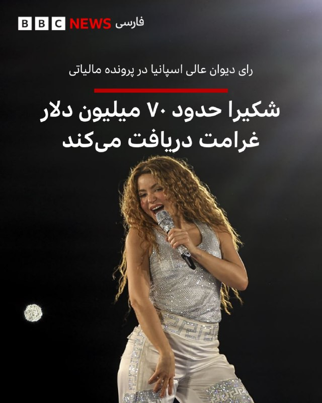

🔻دیوان عالی اسپانیا حکم کرد که سازمان‌های مالیاتی حدود ۷۰ میلیون دلار به شکیرا، ستاره موسیقی پاپ، غرامت بپردازند. پرونده‌ شکایت این خواننده از هشت سال پیش در جریان بود.

شکیرا از این رای استقبال کرد و گفت که دادگاه به «سال‌ها تلاش هماهنگ برای نابودی شهرتش» پایان داد.

شکیرا این پیروزی را به «شهروندان عادی» تقدیم کرد که از «موارد مشابه» رنج دیده‌اند.

دیوان عالی نتیجه گرفت این هنرمند اهل کلمبیا در سال مالی ۲۰۱۱ ساکن اسپانیا نبوده، بنابراین به اشتباه به پرداخت میلیون‌ها دلار مالیات بر درآمد در آن سال ملزم شده بود.

دستور دادگاه اسپانیا شامل پرداخت کامل مبلغ به‌علاوه سود به شکیرا است.

📷 Getty Images
@BBCPersian

## BBCPersian — post 281373

  

🔻فردریش مرتس گفت که «ما حملات هوایی تازه ایران به امارات و دیگر شرکا را به‌شدت محکوم می‌کنیم.»

صدر‌اعظم آلمان در شبکه اجتماعی ایکس، حمله به «تاسیسات هسته‌ای» را تهدیدی برای ایمنی مردم سراسر منطقه خواند.

امارات متحده دیروز گفت که در حمله پهپادی، ژانراتور برق بیرون محوطه نیروگاه هسته‌ای براکه در نزدیکی ابوظبی آتش گرفته است. امارات در بیانیه‌هایش نامی از کشوری نبرد و فقط گفت پهپاد از «مرز غربی» وارد شده بود.

آقای مرتس در این پست نوشت که «ایران باید وارد مذاکره جدی با آمریکا شود، از تهدید همسایگان خود دست بردارد و تنگه هرمز را بدون هیچ محدودیتی مجددا باز کند.»

اظهارات آقای مرتس درباره مذاکرات ایران و آمریکا اخیرا به تنش لفظی او با دونالد ترامپ منجر شد. او گفته بود مذاکره‌کنندگان ایران آمریکا را «تحقیر» کرده‌اند.

📷Getty Images
https://bbc.in/42ChAjs
@BBCPersian

## BBCPersian — post 281372

🔻سازمان غذا و داروی ایران: تأمین مواد اولیه و واردات دارو دچار اختلال شده است
سخنگوی سازمان غذا و داروی ایران می‌گوید که تأمین مواد اولیه و واردات دارو در ایران دچار اختلال شده است.

محمد هاشمی به خبرگزاری کار ایران، ایلنا، گفت که برای شناسایی و مدیریت به‌موقع هرگونه کمبود در بازار، سامانه‌ای فعال شده است که موجودی انبارها و خطوط تولید را به‌طور لحظه‌ای زیر نظر دارد.

آقای هاشمی افزود: «اولویت‌بندی واردات بر اساس ضرورت درمانی داروها در دستور کار قرار گرفته و نهاده‌های مربوط به داروهای حیاتی، مزمن و خاص در صدر فهرست تخصیص ارز و ترخیص قرار دارند.»

هدف قرار گرفتن برخی موسسات مرتبط با تولید دارو در حملات آمریکا و اسرائیل و همچنین محدود شدن واردات به دلیل اختلال در تنگه هرمز و مسیرهای هوایی، به کمبود دارو در ایران دامن زده است.

علاوه بر اینها، تخصیص ارز به واردات دارو هم کاهش یافته است.

پیشتر سخنگو و عضو هیات‌مدیره انجمن داروسازان ایران گفته بود: «محدود شدن منابع ارزی دولت به معنی کاهش امکان اختصاص یارانه به تولید و عرضه دارو است که منجر به افزایش قیمت بین ۳۰ تا ۳۰۰ درصدی قیمت دارو شده است.»

روزنامه اعتماد هفته پیش در گزارشی گفت که مصرف‌کنندگان داروهای خاص‌، با چالش بزرگی روبرو شده‌اند.

روایت‌های بیماران از نبود کیت آزمایش، کمیابی انسولین، افزایش چندبرابری قیمت داروهای حیاتی و توقف واردات برخی داروهای سرطان، از بحرانی حکایت دارد که مستقیما با جان انسان‌ها گره خورده است.

https://bbc.in/4uUCoPk
@BBCPersian

## BBCPersian — post 281371

  

🔻خبرگزای رسمی ایران (ایرنا) می‌گوید که با تداوم قطع اینترنت استفاده از سیم‌کارت‌های عراقی در شهرهای مرزی ایران رونق گرفته است.

ایرنا از کاربران نقل کرده است که به‌دلیل نزدیکی جغرافیایی آبادان و خرمشهر به خاک عراق، آنتن‌دهی اپراتورهای عراقی در برخی نقاط این شهرها، بویژه در مناطق نزدیک اروندرود، قابل دریافت است.

این گزارش می‌گوید خیابان‌های منتهی به رودخانه مرزی ایران و عراق در آبادان محل «تجمع خودروها و افراد پیاده است که در نگاه اول تداعی‌کننده یک تفریحگاه است اما در این مرز خبری از تفریح نیست، گوشی‌های به‌دست گرفته شده و سرهایی که در گوشی‌ها فرو رفته، حکایت از مهاجرت دیجیتال در نقطه صفر مرزی دارد.»

بر اساس این گزارش، قیمت این سیم‌کارت‌ها در بازار غیررسمی خوزستان حدود دو میلیون تومان است و در صورت فعال‌سازی اینترنت و خرید بسته‌های اولیه، هزینه آن گاهی به حدود پنج میلیون تومان نیز می‌رسد.

📷Reuters
@BBCPersian

## BBCPersian — post 281370

  <a href="telegram/content/BBCPersian_281370_1779109601.mp4" target="_blank">🎬 Download video</a>

🔻مقام‌های آمریکایی اعلام کردند که پس از برخورد و سقوط دو جت نیروی دریایی این کشور در جریان نمایش هوایی، وضعیت سلامتی چهار خدمه پایدار است. جت‌های بوئینگ EA18-G گرولر که ویژه جنگ الکترونیک هستند، در حال انجام حرکات نمایشی با هم برخورد و سقوط کردند، اما هر چهار سرنشین آنها با پرتاب اضطراری صندلی پیش از سقوط از هواپیماها خارج شدند.

این حادثه یکشنبه، در دومین و آخرین روز از نمایش هوایی گان‌فایتر اسکایز (Gunfighter Skies) در آیداهو رخ داد.

در پی این برخورد آتش‌سوزی رخ داد و بقیه نمایش هوایی لغو شد. تحقیقات در حال انجام است.

پایگاه هوایی مانتین ایر فورس گانفایترز در بیانیه‌ای که روز یکشنبه در شبکه‌های اجتماعی منتشر شد، اعلام کرد: «خدمه هوایی که در این حادثه درگیر بودند، در وضعیت پایداری قرار دارند.»

سخنگوی نیروی دریایی گفت که خدمه توسط پرسنل پزشکی معاینه می‌شوند.

هواپیماهای EA-18G گرولر متعلق به یک اسکادران جنگ الکترونیکی از ایالت واشنگتن بودند. نیروی دریایی ایالات متحده می‌گوید هر یک از این جت‌ها حدود ۶۷ میلیون دلار قیمت داشته است.

https://bbc.in/4fpKU47
@BBCPersian

## idfinfarsi — post 11595

  <a href="telegram/content/idfinfarsi_11595_1779109603.mp4" target="_blank">🎬 Download video</a>

‼️مستند از انهدام انبار سلاح‌های ضدزره سازمان تروریستی حزب‌الله: نیروهای تیپ ۷۶۹ زیرساخت‌های تروریستی را منهدم کرده و تسلیحات را کشف کردند

⭕️نیروهای تیپ ۷۶۹ تحت فرماندهی لشکر ۹۱، به عملیات خود در جنوب خط دفاعی مقدم با هدف رفع تهدیدها علیه شهروندان کشور اسرائیل ادامه می‌دهند.

⭕️این نیروها با پشتیبانی نیروی هوایی، در یک واکنش عملیاتی سریع، یک انبار سلاح‌های ضدزره را که توسط سازمان تروریستی حزب‌الله علیه نیروهای فعال در منطقه مورد استفاده قرار می‌گرفت، منهدم کردند.

⭕️در یک عملیات دیگر در منطقه روستای الخیام، نیروها انبارهای تسلیحاتی و مراکز استقرار سازمان تروریستی حزب‌الله را منهدم کرده و مقادیری سلاح از جمله پرتابگرهای ضدزره، مواد منفجره و سلاح‌های سبک را کشف کردند.

## idfinfarsi — post 11594

  

❌در یک حمله دقیق در بعلبک: ارتش اسرائیل فرمانده جهاد اسلامی فلسطین در منطقه بقاع لبنان را به هلاکت رساند

‼️ارتش اسرائیل در‌طول شب (یکشنبه) در منطقه بعلبک حمله کرده و وائل محمود عبدالحلیم، فرمانده جهاد اسلامی فلسطین در منطقه بقاع لبنان را به هلاکت رساند.

⭕️عبدالحلیم رهبری پیوستن تروریست‌های سازمان تروریستی جهاد اسلامی فلسطین به نبرد در کنار تروریست‌های سازمان تروریستی حزب‌الله در لبنان را بر عهده داشت و در دوره اخیر برای پیشبرد طرح‌های تروریستی علیه نیروهای ارتش اسرائیل فعالیت می‌کرد.

## Dirty_Kids — post 389677

  <a href="telegram/content/Dirty_Kids_389677_1779109605.mp4" target="_blank">🎬 Download video</a>

این خبرو این وسط خوندم خیلی خندیدم گفتم شماهم ببینید روحیه‌تون عوض شه:
تو ترکیه یه دستگاه گذاشتن به گربه ها غذا میده اتوماتیک با صدای میو کردن گربه؛ بعد این مرغ دریاییای پدرسوخته یادگرفتن میرن جلوش میو میو میکنن غذا بگیرن :)))

@Dirty_Kids 👻

## Dirty_Kids — post 389675

جورجینا (زن رونالدو) بلوند کرده

@Dirty_Kids 👻

## Dirty_Kids — post 389674

  <a href="telegram/content/Dirty_Kids_389674_1779109606.mp4" target="_blank">🎬 Download video</a>

نه داداش ببین...

@Dirty_Kids 👻

## Dirty_Kids — post 389673

  

از راست به چپ به ترتیب:
گلشیفته، نرگس محمدی، مصی علینژاد و لیلی بازرگان اگه رضاشاهِ اول نبود.

@Dirty_Kids 👻

## Dirty_Kids — post 389672

  

نشریه چپولیستی گاردین رسما اعلام کرده:
"اگه از بوی شاش و عرق حال‌تون به هم می‌خوره، شما راست افراطیِ ترامپ‌یستید" 😭😂
یعنی اینا برای حموم نرفتن و بوی تعفن هم دارن مشروعیت سیاسی صادر می‌کنن!!!!

@Dirty_Kids 👻

## Dirty_Kids — post 389670

  

اینا نه تنها باخت ندارن 😂
حتی یه مورد مساوی هم ندارن
فقط بردددد

@Dirty_Kids 👻

## Dirty_Kids — post 389669

  <a href="https://t.me/Dirty_Kids/389669" target="_blank">📎 Download file</a>

✅ اپلیکیشن اندروید سایت جهانی دربی بت

💰اولین سایت جهانی با امکان شارژ و برداشت ریالی(کارت به کارت)

🔗 برای ورود فیلترشکن روی کشور مناسب قرار دهید مانند فنلاند و المان و....

😀Telegram Channel
👇
https://t.me/+bcynkEgSW2dlYTc0

## Dirty_Kids — post 389668

  

😤دنبال یه سایت شرط بندی بین المللی بودی که به ایرانیا خدمات بده؟!
⛔

👍دربی بت همون انتخاب  100%

💎ویژگی های سایت جهانی Derby Bet:

⬅️امکان شارژ امن با کارت بانکی

⬅️واریز اول دوبل شارژ می شوید(بونوس۱۰۰٪)

⬅️پر اپشن ترین سایت فعال در ایران

⬅️تسویه حساب کمتر از 5 دقیقه

⬅️برگشت بخشی از باخت به صورت هفتگی

🚨کد هدیه ثبت نام:GG007

⚠️برای دانلود اپلکیشن کلیک کنید
👉

🔔کانال دربی بت :

🪙https://t.me/+bcynkEgSW2dlYTc0

## Dirty_Kids — post 389667

نگاهی عمیق‌تر به بیضه‌های بهزاد فراهانی

@Dirty_Kids 👻

## Dirty_Kids — post 389666

  <a href="telegram/content/Dirty_Kids_389666_1779109609.mp4" target="_blank">🎬 Download video</a>

Coming soon… 🐺⚽️

موزیک‌ویدئو شکیرا که با پله و مارادونا شروع می‌شه و قراره برای افتتاحیه‌ی جام جهانی اجراش کنه

@Dirty_Kids 👻

## Dirty_Kids — post 389665

  <a href="telegram/content/Dirty_Kids_389665_1779109610.mp4" target="_blank">🎬 Download video</a>

قاضی‌زاده‌هم گرفت رو بهزاد سگ‌سیبیل

@Dirty_Kids 👻

## Dirty_Kids — post 389664

  

🌪وقتی اینترنت طوفانیه... کافیه بادبان ها رو بکشی تا

⚫️با بالاترین کیفیت ممکن
⚡️ 

⚫️100 هزار تومان شارژ هدیه 
🎁

⚫️پایین ترین قیمت گیگی 250
🌐 

⚫️و ارائه پورسانت %10 در ازای هر معرفی
💼

بتونی یه اتصال پایدار با پشتیبانی 24 ساعته داشته باشی
🚀

بادبان راهتو باز می‌کنه
⛵️

R28

🛡@BadBan_VPN | کانال 

🤖@BadBan_VPNBot | ربات 

📞@BadBan_VPNSupport | پشتیبانی

## Dirty_Kids — post 389663

  <a href="telegram/content/Dirty_Kids_389663_1779109612.mp4" target="_blank">🎬 Download video</a>

رقابت شدیدی هست بین ورزش کردن با کافه رفتن تو عادیسازی..

خب اصن گیریم دو ساعت ورزش کردیم بعدش، گوشت مرغ‌تخم‌مرغ ارزون میشه؟

+ اینارو من نمیشناسم کلی مشاهداتمو میگم..

@Dirty_Kids 👻

## Hranews — post 113015

خبرگزاری هرانا pinned a photo

## Hranews — post 113014

  

میان موشک و سرکوب؛ گزارش مجموعه فعالان حقوق بشر درباره مخاصمه نظامی ایالات متحده-اسرائیل و ایران منتشر شد

💥
💥
💥
💥
💥 – امروز، مجموعه فعالان حقوق بشر در ایران گزارش جدیدی را در ۲۴۰ صفحه و دو زبان منتشر کرد که به بررسی کارزار نظامی ایالات متحده و اسرائیل در ایران در فاصله ۹ اسفند ۱۴۰۴ تا ۱۹ فروردین ۱۴۰۵ (۲۸ فوریه تا ۸ آوریل ۲۰۲۶) می‌پردازد.

این گزارش بر پایه ۱۷۷ منبع تأییدشده ــ شامل گزارش‌های منابع آزاد و شبکه میدانی مجموعه فعالان حقوق بشر در داخل کشور ــ ۶٬۳۲۴ رویداد منحصربه‌فرد شامل ۱۲٬۷۹۸ حمله مجزا را مستندسازی کرده است.
مجموعه فعالان تاکید کرد این گزارش با هدف ارائه روایت جامع از کل درگیری تهیه نشده است. یافته‌های آن صرفاً به رویدادهایی محدود می‌شود که در داده‌های این نهاد مستندسازی و راستی‌آزمایی شده‌اند.

📊 یافته‌های کلیدی گزارش
◾️ ثبت ۶٬۳۲۴ رویداد منحصربه‌فرد و ۱۲٬۷۹۸ حمله مجزا
◾️ ۷۷ درصد رویدادها شامل آسیب به غیرنظامیان یا اماکن غیرنظامی
◾️ ثبت دست‌کم ۳٬۶۳۶ مورد مرگ، از جمله ۱٬۷۰۱ غیرنظامی
◾️ کشته شدن ۳۰۷ کودک و زخمی شدن ۲٬۲۱۳ کودک
◾️ تمرکز ۴۴٫۸۵ درصدی رویدادها در استان تهران
◾️ هدف قرار گرفتن یا آسیب دیدن مدارس، مراکز درمانی، مراکز فرهنگی و زیرساخت‌های حیاتی

⚠️ الگوهای نگران‌کننده
این گزارش چندین الگوی نگران‌کننده را برجسته می‌کند، از جمله:
◾️ ضعف در راستی‌آزمایی اهداف
◾️ استفاده محدود از نظارت انسانی در برخی فناوری‌های هدف‌گیری
◾️ هشدارهای ناکافی پیش از حملات
◾️ استفاده از تسلیحات انفجاری سنگین در مناطق پرجمعیت
◾️ حملات تکراری به برخی مناطق غیرنظامی
◾️ آسیب گسترده به زیرساخت‌های غیرنظامی

🚨 این گزارش همچنین به بازداشت گسترده شهروندان در ایران اشاره دارد؛ دست‌کم ۴٬۰۲۳ نفر با اتهامات مرتبط با امنیت ملی یا جنگ بازداشت شده‌اند.

از سوی دیگر تشدید محدودیت‌های امنیتی، گسترش ایست‌های بازرسی و محدودیت‌های گسترده اینترنت از دیگر پیامدهای مستندسازی‌شده عنوان شده است.

در همین بازه زمانی، ۵۰ مورد اعدام ثبت شده که ۳۲ مورد آن با اتهامات سیاسی و امنیتی مرتبط بوده است.

📎 ادامه گزارش به زبان فارسی

📎 دانلود مستقیم فایل پی دی اف گزارش از تلگرام

📎 Read the report in English

📎Direct download of the PDF file of this report

↘️
@hranews_bot تماس ✉️ - @Hranews کانال هرانا 🆑

## Hranews — post 113013

دستکم ۳۲ نفر با اتهامات امنیتی در چند استان بازداشت شدند

❗️
❗️
❗️
❗️
❗️– سازمان اطلاعات سپاه از #بازداشت دستکم ۳۲ تن در استان‌های قزوین، کرمان و چهارمحال و بختیاری خبر داد. این نهاد، اتهامات مطرح‌ شده علیه این افراد را «جاسوسی، ارتباط با گروه‌های مخالف نظام، اقدامات تروریستی و خرابکارانه» عنوان کرده است.

ادامه مطلب

↘️
@hranews_bot تماس ✉️ -  @Hranews  کانال هرانا 🆑

## Hranews — post 113012

  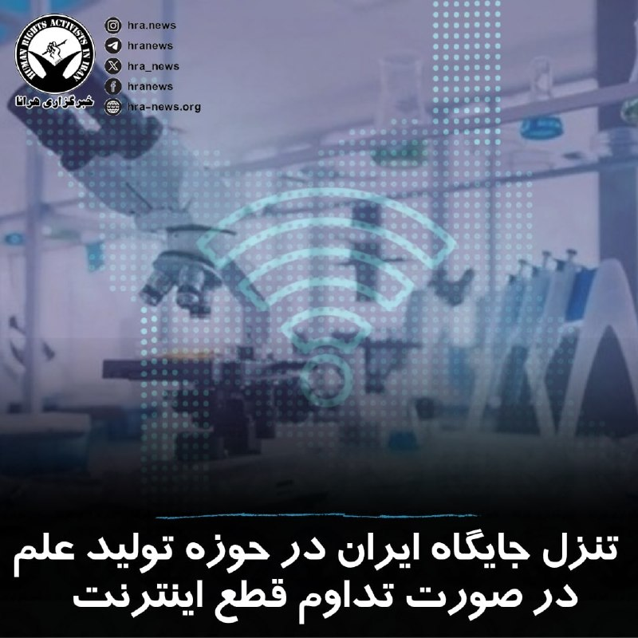

مهدی ابطحی، معاون پژوهشی وزیر علوم با اشاره به #قطع_اینترنت در کشور و محدودیت‌های موجود، به ویژه برای دانشجویان مقطع تحصیلات تکمیلی، اعلام کرد که تداوم این وضعیت باعث تنزل جایگاه ایران از جمع ۲۰ کشور برتر در حوزه تولید علم خواهد شد.

↘️
@hranews_bot تماس ✉️ -  @Hranews  کانال هرانا 🆑

## Hranews — post 113011

  

گزارشی از آخرین وضعیت پژمان زارع، شهروند بهائی در زندان عادل‌آباد

❗️
❗️
❗️
❗️
❗️– پژمان زارع، شهروند #بهائی ساکن شیراز، علیرغم گذشت ۶۵ روز از زمان دستگیری، همچنان در بازداشت و بلاتکلیفی به سر می‌برد. وی اخیراً به زندان عادل‌آباد این شهر منتقل شده است.

به گزارش خبرگزاری هرانا، ارگان خبری مجموعه فعالان حقوق بشر در ایران، پژمان زارع کماکان در بازداشت به‌سر می‌برد.

یک منبع مطلع نزدیک به خانواده این #شهروند_بهائی ضمن تایید این موضوع به هرانا گفت: آقای زارع پس از ۵۸ روز نگهداری در مکانی نامعلوم و بی‌خبری خانواده از وضعیتش، اخیراً به زندان عادل‌آباد شیراز منتقل شده و تاکنون تنها یک ملاقات از پشت شیشه با خانواده‌اش داشته است. وی همچنان از حق دسترسی به وکیل محروم بوده و تاکنون تفهیم اتهام نشده است.
این منبع مطلع افزود: «علیرغم تامین وثیقه توسط خانواده و ارائه آن به دادسرا، تاکنون با آزادی موقت وی موافقت نشده است.»

ادامه مطلب

#پژمان_زارع

↘️
@hranews_bot تماس ✉️ -  @Hranews  کانال هرانا 🆑

## manototv — post 105596

  <a href="telegram/content/manototv_105596_1779109615.mp4" target="_blank">🎬 Download video</a>

رویترز در گزارشی اختصاصی نوشت پاکستان در جریان جنگ ایران، هشت هزار نیرو، یک اسکادران جنگنده و یک سامانه پدافند هوایی به عربستان سعودی اعزام کرده است.

بر اساس این گزارش، این اعزام در چارچوب پیمان دفاعی دوجانبه اسلام‌آباد و ریاض انجام شده و شامل حدود ۱۶ جنگنده، عمدتا از نوع جی‌اف‌ـ۱۷ ساخت مشترک پاکستان و چین، دو اسکادران پهپاد و سامانه پدافند هوایی چینی اچ‌کیو‌ـ۹ است. منابع رویترز گفتند عربستان هزینه این اعزام را تامین می‌کند و تجهیزات را نیروهای پاکستانی اداره می‌کنند.

پنج منبع امنیتی و دولتی به رویترز گفتند این نیروها با هدف حمایت از ارتش عربستان در صورت حملات بیشتر به این کشور مستقر شده‌اند.

## manototv — post 105595

  <a href="telegram/content/manototv_105595_1779109615.mp4" target="_blank">🎬 Download video</a>

رسانه‌های ترکیه گزارش دادند فرخنده قائم‌مقامی، زن ایرانی ساکن منطقه مال‌تپه استانبول، پس از قتل، جسدش در استان قرشهر پیدا شده است.

بر اساس گزارش خبرگزاری «دمیراورن»، خانم قائم‌مقامی از ۲۲ فروردین ناپدید شده بود و نزدیکان او پس از بی‌خبری، در ۲۳ اردیبهشت گزارش مفقودی ثبت کردند.

پلیس ترکیه در تحقیقات خود «ارکان ب»، ۴۹ ساله، را به‌عنوان آخرین فردی شناسایی کرد که با این زن ایرانی در تماس بوده است. بنا بر این گزارش، او ابتدا اتهام‌ها را رد کرد، اما بعدا به قتل اعتراف کرد.

دمیراورن نوشت مظنون در اعترافات خود گفته است پس از مشاجره در خودرو، قائم‌مقامی را با قلاده سگش خفه کرده، جسد او را تکه‌تکه کرده و در زمینی خالی در شهرستان موجور استان قرشهر رها کرده است.

در ادامه تحقیقات، دو مظنون دیگر نیز بازداشت شدند. سه مظنون این پرونده پس از پایان بازجویی در اداره پلیس، به دادگاه منتقل شدند.

## manototv — post 105594

  <a href="telegram/content/manototv_105594_1779109616.mp4" target="_blank">🎬 Download video</a>

بر اساس گزارش رسانه‌های حقوق بشری، نیروهای حکومتی روز ۱۵ اردیبهشت با یورش به خانه «افسانه جذابی (راسخی)»، شهروند بهائی ساکن شیراز، منزل او را تفتیش کردند و بخشی از اموال شخصی او را با خود بردند.

در این گزارش‌ها آمده است یک زن و سه مرد با ارائه حکمی با عنوان «همکاری با اسرائیل» وارد خانه این خانواده شدند و خانم جذابی و مادر ۸۵ ساله او را مورد تهدید و تحقیر قرار دادند. خانم جذابی به‌تازگی همسر خود را از دست داده و از مادر سالخورده و بیمار خود مراقبت می‌کند.

به گفته این رسانه‌ها، ماموران حکومتی به او گفتند فرزندش در خارج از کشور در فضای مجازی و کمپین‌های حقوق بشری فعالیت می‌کند و تهدید کردند در صورت ادامه این فعالیت‌ها، «هم برای شما و هم برای آنها گران تمام می‌شود.» آنها همچنین این خانواده را به مصادره خانه تهدید کردند.

بر اساس این گزارش‌ها، نیروهای امنیتی همچنین این خانواده را با عباراتی مانند «فرقه» و «همدست اسرائیل» خطاب کردند و چند بار خانم جذابی را به دستبند زدن و انتقال به مکانی نامعلوم تهدید کردند.

این یورش چند ساعت ادامه داشت و در پایان، خانم جذابی و مادر سالخورده‌اش که دچار افت فشار خون شده بود، مجبور شدند برگه‌ای را امضا کنند که در آن نوشته شده بود هیچ خسارتی به خانه و وسایل وارد نشده است. در این رویداد هیچ‌یک از اعضای خانواده بازداشت نشدند.

## manototv — post 105593

  <a href="telegram/content/manototv_105593_1779109616.mp4" target="_blank">🎬 Download video</a>

روزنامه ایران وابسته به دولت جمهوری اسلامی در گزارشی نوشت محدودیت دسترسی به اینترنت بین‌الملل، بازار خرید و فروش سیم‌کارت‌های عراقی را در برخی مناطق مرزی غرب ایران رونق داده است.

بر اساس این گزارش، بیشترین متقاضیان این سیم‌کارت‌ها تجار، بازرگانان، صاحبان بار، رانندگان ترانزیتی و فعالان اقتصادی مرزی هستند که برای ارتباط با طرف‌های عراقی، ارسال اسناد، حواله‌های مالی، رسیدها، عکس و فیلم کالاها از پیام‌رسان‌هایی مانند واتس‌اپ و تلگرام استفاده می‌کنند.

نعیم احمدی، مدیر روابط عمومی استانداری خوزستان، به این روزنامه گفت این سیم‌کارت‌ها در عمق یک تا دو کیلومتری خاک ایران قابل استفاده‌اند و در مناطقی مانند شلمچه، چذابه، خرمشهر، اروندکنار و جزیره مینو به گزینه‌ای در دسترس برای فعالان اقتصادی تبدیل شده‌اند. به گفته او، ارزانی این سیم‌کارت‌ها در مقایسه با هزینه فیلترشکن‌ها از عوامل گرایش به آنهاست.

در همین حال، محمد شفیعی، فرماندار قصرشیرین، استفاده از سیم‌کارت‌های عراقی در کرمانشاه را عمدتا محدود به تجار، صاحبان بار، رانندگان ترانزیتی و فعالان اقتصادی دانست و فراگیر شدن آن در میان عموم مردم را رد کرد.

## manototv — post 105592

  

فریدریش مرتس، صدراعظم آلمان، حملات تازه جمهوری اسلامی علیه کشورهای منطقه را به‌شدت محکوم کرد و گفت حمله به تأسیسات هسته‌ای «تهدیدی برای امنیت مردم در سراسر منطقه» است.

او در پیامی در ایکس تأکید کرد که نباید خشونت‌ها بیش از این تشدید شود و از جمهوری اسلامی خواست وارد مذاکرات جدی با آمریکا شود، تهدید همسایگانش را متوقف کند و تنگه هرمز را بدون محدودیت باز کند.

این موضع‌گیری پس از آن مطرح شد که امارات از آتش‌سوزی در محدوده نیروگاه هسته‌ای براکه پس از حمله پهپادی خبر داد. مقام‌های اماراتی اعلام کردند این حادثه تلفات جانی و خطر تشعشعاتی نداشته است. عربستان سعودی نیز هم‌زمان از رهگیری حملات پهپادی تازه خبر داده است.

فریدریش مرتس، صدراعظم آلمان، حملات تازه منسوب به جمهوری اسلامی علیه کشورهای منطقه را محکوم کرد و گفت حمله به تأسیسات هسته‌ای امنیت مردم منطقه را تهدید می‌کند.

او از جمهوری اسلامی خواست وارد مذاکرات جدی با آمریکا شود، تهدید همسایگانش را متوقف کند و تنگه هرمز را بدون محدودیت باز کند. این موضع‌گیری پس از حمله پهپادی به محدوده نیروگاه هسته‌ای براکه در امارات و رهگیری حملات پهپادی تازه از سوی عربستان مطرح شده است.

## manototv — post 105591

  

نِت‌بلاکس اعلام کرد خاموشی اینترنت در ایران وارد هشتادمین روز شده و مدت این اختلال از ۱۸۹۶ ساعت گذشته است.

نت‌بلاکس، نهاد ناظر بر اختلالات اینترنتی، در گزارشی اعلام کرد خاموشی اینترنت در ایران وارد هشتادمین روز شده و از ۱۸۹۶ ساعت عبور کرده است. این قطعی در حالی است‌ که دسترسی آزاد شهروندان به اینترنت همچنان محدود است، محتوای حامی جمهوری اسلامی در شبکه‌های اجتماعی به‌طور گسترده منتشر می‌شود.

بر اساس گزارش‌ها، برخی کاربران در ایران گفته‌اند برای دریافت دسترسی‌های ویژه یا «سفید»، از آن‌ها خواسته شده روزانه سهمیه‌ای از محتوای تبلیغاتی منتشر کنند؛ روندی که گفته می‌شود با ابزارهای هوش مصنوعی هم کنترل می‌شود.

## manototv — post 105590

  <a href="telegram/content/manototv_105590_1779109618.mp4" target="_blank">🎬 Download video</a>

یوروپل، آژانس همکاری پلیسی اتحادیه اروپا، اعلام کرد در یک اقدام هماهنگ برای مقابله با محتوای «تروریستی» در فضای مجازی، ۱۴ هزار و ۲۰۰ پیوند مرتبط با فعالیت‌های سپاه پاسداران شناسایی شده است.

بر اساس اعلام یوروپل، این عملیات با هدف مقابله با «زیست‌بوم تبلیغاتی» سپاه پاسداران در اینترنت انجام شد و محققان، هزاران پست و پیوند را برای ارجاع به ارائه‌دهندگان خدمات آنلاین هدف قرار دادند.

## manototv — post 105589

  <a href="telegram/content/manototv_105589_1779109619.mp4" target="_blank">🎬 Download video</a>

امروز، ۲۸ اردیبهشت ۱۴۰۵، هم‌زمان با زادروز محمدرشید مظاهری، دروازه‌بان سابق تیم ملی فوتبال ایران، جمعی از ایرانیان و اعضای «حزب پادشاهی‌خواه میهن‌پرستان ایران» مقابل کنسولگری جمهوری اسلامی در هامبورگ تجمع کردند.

تجمع‌کنندگان با گرامی‌داشت زادروز این ورزشکار، خواستار آزادی بی‌قیدوشرط او و همه زندانیان سیاسی شدند.

رشید مظاهری، بازیکن سابق استقلال، سپاهان، تراکتور و ذوب‌آهن، در ۵ اسفند ۱۴۰۴ پس از انتشار پستی انتقادی علیه علی خامنه‌ای بازداشت شد و بر اساس گزارش‌ها، نزدیک به سه ماه است در وضعیت ناپدیدشدن قهری قرار دارد.

گزارش‌ها و ویدیوهای خود را از طریق واتس‌اپ یا تلگرام برای منوتو بفرستید:

۰۰۴۴۷۵۹۰۸۹۹۹۹۹

## alonews — post 120855

  <a href="telegram/content/alonews_120855_1779109620.webm" target="_blank">🎬 Download video</a>

👈نایب رئیس کمیسیون انرژی مجلس: افزایش قیمت سوخت در دستور کار نیست

✅ @AloNews خبر جنگ

## alonews — post 120854

  <a href="telegram/content/alonews_120854_1779109620.webm" target="_blank">🎬 Download video</a>

👈نخست‌ وزیر پاکستان: به مذاکرات ایران و آمریکا خوشبین هستم

✅ @AloNews خبر جنگ

## alonews — post 120853

  <a href="telegram/content/alonews_120853_1779109620.webm" target="_blank">🎬 Download video</a>

👈خبرگزاری رویترز در گزارشی مدعی شد که پاکستان در طول جنگ ایران، ۸۰۰۰ نیرو، جت جنگنده، پهپاد و سامانه‌های پدافند هوایی را در عربستان سعودی مستقر کرده است. این نیرو شامل جت‌های JF-17، سامانه‌های HQ-9 چینی و تجهیزات تحت مدیریت پاکستان با تأمین مالی ریاض است. این ظرفیت اعزامی از پاکستان، آماده نبرد است و در صورت نیاز می‌تواند به ۸۰۰۰۰ نیرو افزایش یابد.

🔴 عربستان و پاکستان سال گذشته پیمان دفاعی مشترک امضا کردند. وزیر پاکستان بعد از آن اعلام کرد که «عربستان سعودی تحت چتر هسته‌ای پاکستان محافظت می‌شود.»

✅ @AloNews خبر جنگ

## alonews — post 120852

  <a href="telegram/content/alonews_120852_1779109621.webm" target="_blank">🎬 Download video</a>

👈 تیم اقتصادی ترامپ از اول جنگ، 3600 معامله روی سهام انجام دادن. %80 رشد نسبت به قبل

✅ @AloNews خبر جنگ

## alonews — post 120850

  <a href="telegram/content/alonews_120850_1779109621.mp4" target="_blank">🎬 Download video</a>

👈ارتش اسرائیل، یه منطقه از جنوب لبنان رو با خاک یکسان کرد

✅ @AloNews خبر جنگ

## alonews — post 120849

  <a href="telegram/content/alonews_120849_1779109621.webm" target="_blank">🎬 Download video</a>

🔴فوری/نیویورک تایمز:
آمریکا و اسرائیل در حال آماده‌سازی گسترده برای ازسرگیری جنگ با ایران در همین هفته هستند.

✅ @AloNews خبر جنگ

## alonews — post 120848

  <a href="telegram/content/alonews_120848_1779109621.mp4" target="_blank">🎬 Download video</a>

👈فرماندهی آفریقای ایالات متحده، با هماهنگی دولت نیجریه، به حملات علیه تروریست‌های داعش در شمال شرقی نیجریه ادامه می‌دهد.

🔴 فیلمی از حمله هوایی به گروهی از تروریست‌ها دیروز نشان داده شده است

✅ @AloNews خبر جنگ

## alonews — post 120847

  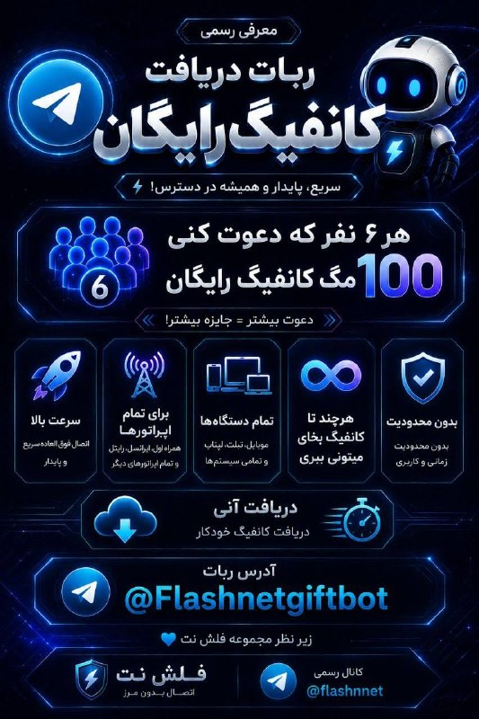

🎁 ربات رسمی دریافت کانفیگ رایگان فلش‌نت راه‌اندازی شد!

از این پس می‌توانید با دعوت دوستان خود به ربات،

🎉 کانفیگ اختصاصی و رایگان دریافت کنید.

✅ بدون ضریب

✅ کاملاً اختصاصی

✅ فعال‌سازی سریع

🤖 آیدی ربات:

https://t.me/Flashnetgiftbot?start=5011918694

📌 همین حالا دوستان خود را دعوت کنید و جایزه بگیرید!

🙏 تیم فلش نت

## alonews — post 120846

  <a href="telegram/content/alonews_120846_1779109623.webm" target="_blank">🎬 Download video</a>

👈 ترامپ در حال بررسی برنامه‌هایی برای نصب یک هلی‌پد در کاخ سفید است تا از آسیب دیدن چمن جنوبی توسط هلیکوپترهای جدید VH-92A پاتریوت که برای پروازهای مارین وان استفاده می‌شوند، جلوگیری شود، گزارش وال استریت ژورنال.

🔴 هلیکوپترهای قدرتمندتر VH-92A دود و هوایی تولید می‌کنند که به اندازه‌ای قوی است که می‌تواند بر چمن تأثیر بگذارد، که این موضوع باعث شده تا نصب یک هلی‌پد اختصاصی در نظر گرفته شود

✅ @AloNews خبر جنگ

## alonews — post 120845

  <a href="telegram/content/alonews_120845_1779109623.mp4" target="_blank">🎬 Download video</a>

👈فیلمی نشان می‌دهد که یک کشتی از ناوگان جهانی صمود به سمت غزه توسط سربازان ارتش اسرائیل تصرف می‌شود

✅ @AloNews خبر جنگ

## alonews — post 120844

  <a href="telegram/content/alonews_120844_1779109624.webm" target="_blank">🎬 Download video</a>

👈نخست‌وزیر پاکستان: تلاش‌های میانجی‌گرانه برای دستیابی به توافق بین آمریکا و ایران ادامه دارد.

🔴 تمام توان خود را برای تضمین برقراری صلحی پایدار به کار می‌بندیم

✅ @AloNews خبر جنگ

## alonews — post 120843

  <a href="telegram/content/alonews_120843_1779109625.webm" target="_blank">🎬 Download video</a>

👈ادعای رویترز به نقل از منابع: پاکستان بر اساس توافقنامه دفاع مشترک، ناوگانی از جت‌های جنگنده، هشت هزار سرباز و سامانه دفاع هوایی در عربستان سعودی مستقر کرده است

✅ @AloNews خبر جنگ

## alonews — post 120842

  <a href="telegram/content/alonews_120842_1779109625.webm" target="_blank">🎬 Download video</a>

👈ارتش دفاعی اسرائیل تأیید می‌کند که فرمانده ارشد جهاد اسلامی فلسطین، وائل محمود عبدالحلیم، در حمله هوایی اسرائیل به دره بقاع شرقی لبنان در طول شب کشته شده است.

🔴ارتش اسرائیل می‌گوید او به عنوان فرمانده گروه در منطقه بقاع خدمت می‌کرد

✅ @AloNews خبر جنگ

## alonews — post 120841

  <a href="telegram/content/alonews_120841_1779109625.webm" target="_blank">🎬 Download video</a>

👈کوثری عضو کمیسیون امنیت ملی و سیاست خارجی مجلس: قطعا و یقینا از طریق مذاکره به نتیجه نمی‌رسیم

🔴ترامپ جنگ را باخته و می‌خواهد یک جوری خودش را برنده نشان بدهد

✅ @AloNews خبر جنگ

## alonews — post 120840

  <a href="telegram/content/alonews_120840_1779109625.mp4" target="_blank">🎬 Download video</a>

👈 نمایی از تنگه هرمز از داخل یک هواپیمای مسافربری و کشتی های خاموش

✅ @AloNews خبر جنگ

## alonews — post 120839

  <a href="telegram/content/alonews_120839_1779109626.webm" target="_blank">🎬 Download video</a>

👈آمریکا در متن جدید خود اسقاط تحریم‌های نفتی ایران را پذیرفته است

🔴تسنیم نوشت: یک منبع نزدیک به تیم مذاکره‌کننده گفت که آمریکایی‌ها برخلاف متون پیشین خود، در متن جدید پذیرفته‌اند که در طول دوره مذاکره، تحریم‌های نفتی ایران را Wave کنند.

🔴 ویو کردن تحریم‌ها به معنای اسقاط موقت تحریم‌هاست

🔴ایران تاکید دارد که لغو همه‌ی تحریم‌های ایران باید جزو تعهدات آمریکا باشد. آمریکا اما اسقاطی اوفک را تا زمان تفاهم نهایی مطرح کرده است.

✅ @AloNews خبر جنگ

## alonews — post 120838

  <a href="telegram/content/alonews_120838_1779109626.webm" target="_blank">🎬 Download video</a>

👈در شبکه ایکس یک حساب کاربری جدید به اسم  « مدیریت بر تنگه خلیج فارس» ساخته شد

🔴امروز جمهوری اسلامی از ایجاد نهادی مسئول بر مدیریت تنگه هرمز خبر داده بود

✅ @AloNews خبر جنگ

## alonews — post 120837

  <a href="telegram/content/alonews_120837_1779109626.webm" target="_blank">🎬 Download video</a>

👈نیویورک‌تایمز: امارات بیش از ۶ میلیون دلار به شرکت مدیریت شهرت «تراکیت» پرداخت کرده تا نتایج جستجوی گوگل را دستکاری کند و گزارش‌های انتقادی درباره «یوسف العتیبه»، سفیر امارات در آمریکا را سرکوب کند

🔴 این گزارش‌ها اتهاماتی درباره ارتباط «العتیبه» با قاچاق جنسی را بررسی می‌کرد

🔴 شرکت «تراکیت» اقدام به ایجاد پروفایل‌های مثبت و ویرایش ویکی پدیا با حساب‌های ناشناس کرد

✅ @AloNews خبر جنگ

## alonews — post 120836

  <a href="telegram/content/alonews_120836_1779109626.webm" target="_blank">🎬 Download video</a>

👈ادعای رویترز به نقل از منابع: پاکستان بر اساس توافقنامه دفاع مشترک، ناوگانی از جت‌های جنگنده، هشت هزار سرباز و سامانه دفاع هوایی در عربستان سعودی مستقر کرده است

✅ @AloNews خبر جنگ

---
📅 بروزرسانی: 1405/02/28 13:21
---

## VahidOOnLine — post 240771

  

یوروپل، آژانس اتحادیه اروپا برای همکاری در اجرای قانون، اعلام کرد در اقدامی هماهنگ برای مقابله با محتوای «تروریستی» در فضای مجازی، در مجموع ۱۴ هزار و ۲۰۰ پست و پیوند مرتبط با سپاه پاسداران هدف قرار گرفته است.

به گفته یوروپل، این اقدام با هدایت واحد ارجاع اینترنتی اتحادیه اروپا انجام شد و بر شناسایی و اخلال در حضور آنلاین سپاه که برای انتشار تبلیغات، جذب حامیان و تامین مالی به کار می‌رفت، تمرکز داشت. این تصمیم به نهادهای اجرای قانون اجازه می‌دهد علیه فعالیت اعضا و نهادهای پشتیبان آن در اتحادیه اروپا اقدام کنند.

در این عملیات، ۱۹ کشور شامل اتریش، بلژیک، بوسنی و هرزگوین، بلغارستان، چک، دانمارک، استونی، فنلاند، فرانسه، آلمان، یونان، مجارستان، ایتالیا، هلند، پرتغال، اسپانیا، سوئد، اوکراین و آمریکا مشارکت داشتند. مقام‌ها بین ۲۲ اسفند تا هشتم اردیبهشت در مراحل هماهنگ زیر نظر یوروپل اقدام به جمع‌آوری اطلاعات، تطبیق اهداف و ارجاع مشترک محتوا به پلتفرم‌های آنلاین کردند.
‌🏁 🇬🇧 IranintlTV

🤖 @VahidOOnLine

## VahidOOnLine — post 240770

  <a href="telegram/content/VahidOOnLine_240770_1779097907.mp4" target="_blank">🎬 Download video</a>

♦️اسماعیل بقایی، سخنگوی وزارت امور خارجه جمهوری اسلامی روز دوشنبه ۲۸ اردیبهشت‌ماه و همزمان با ادامه «بن‌بست» در گفتگوهای تهران و واشنگتن  گفت: مذاکرات در این مرحله بر پایان جنگ متمرکز است و بنابراین ما از حقوق خودمان بر اساس معاهده منع گسترش تسلیحات هسته‌ای عدول نخواهیم کرد.

دونالد ترامپ، رئیس جمهوری آمریکا تاکید می‌کند که پایان دادن به برنامه هسته‌ای جمهوری اسلامی یکی از پیش‌شرط‌های دستیابی به هر توافقی برای پایان دادن به جنگ است.
‌🇸🇦 Indypersian

🤖 @VahidOOnLine

## VahidOOnLine — post 240769

  <a href="telegram/content/VahidOOnLine_240769_1779097909.mp4" target="_blank">🎬 Download video</a>

رویترز روز دوشنبه ۲۸ اردیبهشت به نقل از یک منبع پاکستانی گزارش داد پاکستان پیشنهاد بازنگری‌شده جمهوری اسلامی برای پایان دادن به درگیری در خاورمیانه را به آمریکا منتقل کرده است.

این منبع پاکستانی گفت مذاکرات صلح همچنان در بن‌بست به نظر می‌رسد و «زمان زیادی» برای کاهش اختلاف‌ها باقی نمانده است. او افزود هر دو طرف «مدام مواضع خود را تغییر می‌دهند.»
‌🏁 🇬🇧 ManotoTV

🤖 @VahidOOnLine

## VahidOOnLine — post 240768

  

اسماعیل بقائی، سخنگوی وزارت خارجه جمهوری اسلامی، درباره احتمال ازسرگیری جنگ گفت دیپلماسی جمهوری اسلامی «هوشمندانه» است، اما تهران با تمام توان برای هر سناریویی آماده است.

اسماعیل بقائی گفت: «دیپلماسی جمهوری اسلامی هوشمندانه است»، اما در عین حال تاکید کرد جمهوری اسلامی در برابر هر اقدام «دیوانه‌باری» با تمام توان دفاع می‌کند.

او همچنین افزود نیروهای نظامی «سورپرایزهایی» خواهند داشت.
‌🏁 🇬🇧 IranintlTV

🤖 @VahidOOnLine

## VahidOOnLine — post 240767

  <a href="telegram/content/VahidOOnLine_240767_1779097910.mp4" target="_blank">🎬 Download video</a>

بیمارستان الغدیر تهران در شب‌های ۱۸ و ۱۹ دی‌ماه یکی از قتل‌گاه‌های جمهوری اسلامی بود. در پی کارزار ایران‌اینترنشنال در خصوص ارسال اطلاعات بیشتر برای شناسایی پیکرهای جاویدنامان در این بیمارستان، اطلاعات و تصاویری به دست ما رسیده که بخشی از آن را در این ویدیو می‌بینید.
شاهدان و خانواده‌ها می‌توانند برای ثبت حقیقت این جنایت، اسناد، تصاویر و روایت‌های خود را از طریق بات اینتل‌مدیا ارسال کنند.
‌🏁 🇬🇧 IranintlTV

🤖 @VahidOOnLine

## VahidOOnLine — post 240766

  

♦️دونالد ترامپ، رئیس جمهوری آمریکا می‌گوید مقام‌های جمهوری اسلامی برای امضای توافق با آمریکا بی‌تابی می‌کنند.

ترامپ در مصاحبه ای با مجله فورچون (Fortune) که روز دوشنبه ۲۸ اردیبهشت منتشر شد، گفت: «می‌توانم به شما یک چیز بگویم: آن‌ها برای امضای توافق می‌میرند».

این سخنان در حالی عنوان می‌شود که ترامپ شامگاه یکشنبه اعلام کرد زمان برای جمهوری اسلامی به سرعت‌ در حال گذر است و اگر توافقی امضا نشود، چیزی برایشان باقی نخواهد ماند.
‌🇸🇦 Indypersian

🤖 @VahidOOnLine

## VahidOOnLine — post 240765

  

اسماعیل بقایی، سخنگوی وزارت خارجه جمهوری اسلامی، در پاسخ به پرسشی درباره گزارش‌ها از قصد امارات متحده عربی برای حمله به جمهوری اسلامی و سفر مقام‌های اسرائیلی به این کشور گفت: «ما قرار نیست با گزارش‌ها این واقعیت را از یاد ببریم که تهدید اصلی کدام طرف است.»

بقایی با تهدید کشورهای منطقه از جمله امارات متحده عربی گفت: « اماراتی‌ها از اتفاقاتی که در دو سه ماه اخیر افتاد باید درس بگیرند.»

او اضافه کرد: «ما با هیچ کشور منطقه دشمنی نداریم و با همه همسایه هستیم. همه را به مراقبت به دسیسه‌های طرف‌های خارجی برای ایجاد تفرقه دعوت می‌کنیم.»

بقایی گفت رفت‌وآمد مقام‌های اسرائیلی به منطقه از دید جمهوری اسلامی «مخفی نبوده» و این رفت‌وآمدها، اسرائیل را برای ادامه «جنایات» در منطقه جری‌تر کرده است.
‌🏁 🇬🇧 IranintlTV

🤖 @VahidOOnLine

## VahidOOnLine — post 240764

  

♦️ خبرگزاری رویترز روز دوشنبه ۲۸ اردیبهشت‌ماه به نقل از یک منبع پاکستانی گزارش کرد که اسلام‌آباد شامگاه یکشنبه «طرح پیشنهادی اصلاح شده»  جمهوری اسلامی ایران برای پایان دادن به جنگ را با آمریکا «به اشتراک گذاشته است».

این مقام پاکستانی که خواست نامش فاش نشود در پاسخ به پرسش رویترز درباره چالش زمان در حل اختلاف تهران و واشنگتن گفت: «ما وقت زیادی نداریم» و هر دو کشور به تغییر اهداف خود ادامه می‌دهند».

این خبر در حالی منتشر می‌شود که دونالد ترامپ، شامگاه یکشنبه هشدار داده بود که اگر ایران توافق را امضا نکند،‌ چیزی برایش باقی نخواهد ماند.
‌🇸🇦 Indypersian

🤖 @VahidOOnLine

## VahidOOnLine — post 240763

  

دونالد ترامپ، رییس‌جمهوری آمریکا، در مصاحبه با مجله فورچون گفت مقام‌های جمهوری اسلامی برای امضای توافق «بی‌تاب» هستند، اما پس از رسیدن به توافق، متنی ارسال می‌کند که به گفته او «هیچ ربطی به توافق انجام‌شده ندارد».

ترامپ گفت: «ایرانی‌ها برای امضای توافق بی‌تاب هستند. اما وقتی توافق می‌کنند، بعد از آن برگه‌ای برایت می‌فرستند که هیچ ربطی به توافقی که انجام داده‌اند ندارد. من به آن‌ها می‌گویم شما دیوانه هستید؟»
‌🏁 🇬🇧 IranintlTV

🤖 @VahidOOnLine

## VahidOOnLine — post 240762

  <a href="telegram/content/VahidOOnLine_240762_1779097913.mp4" target="_blank">🎬 Download video</a>

اسماعیل بقایی، سخنگوی وزارت خارجه جمهوری اسلامی، روز دوشنبه ۲۸ اردیبهشت، در نشست خبری خود گفت تهدید و فشار اقتصادی آمریکا نتوانسته تهران را از پیگیری حقوق خود منصرف کند.

بقایی با اشاره به تهدیدهای مطرح‌شده علیه جمهوری اسلامی گفت: «در صورت کوچک‌ترین خطایی از سوی طرف‌های مقابل، می‌توانیم خوب جواب دهیم.» او اضافه کرد در روزهای اخیر مردم در میدان‌های تهران می‌گویند: «تو رستم تهمتنی و بزن که خوب می‌زنی.»
‌🏁 🇬🇧 ManotoTV

🤖 @VahidOOnLine

## VahidOOnLine — post 240761

  

خبرگزاری رویترز به نقل از یک منبع پاکستانی گزارش داد که اسلام‌آباد پیشنهاد اصلاح‌شده جمهوری اسلامی برای پایان دادن به درگیری در خاورمیانه را با آمریکا به اشتراک گذاشته است.

این منبع در پاسخ به پرسشی درباره زمان لازم برای رفع اختلاف‌ها گفت: «وقت زیادی نداریم.» او افزود دو کشور «مدام خط قرمزهای خود را تغییر می‌دهند.»
‌🏁 🇬🇧 IranintlTV

🤖 @VahidOOnLine

## VahidOOnLine — post 240760

  <a href="telegram/content/VahidOOnLine_240760_1779097915.mp4" target="_blank">🎬 Download video</a>

رالی خودرها در سن‌دیگو در حمایت از مردم ایران، یکشنبه ۲۷ اردیبهشت
‌🏁 🇬🇧 ManotoTV

🤖 @VahidOOnLine

## VahidOOnLine — post 240759

  <a href="telegram/content/VahidOOnLine_240759_1779097917.mp4" target="_blank">🎬 Download video</a>

اسماعیل بقایی، سخنگوی وزارت خارجه جمهوری اسلامی، روز دوشنبه ۲۸ اردیبهشت گفت مواردی مانند آزادسازی دارایی‌های مسدودشده ایران و رفع تحریم‌ها «شرط» تهران نیست، بلکه «مطالبات روشن و به‌حق» جمهوری اسلامی در مذاکرات است.

بقایی در پاسخ به پرسشی درباره شروط جمهوری اسلامی گفت ممکن است طرف مقابل موضوعات را به تشخیص خود نام‌گذاری کند، اما «مطالبات ما روشن است.»

سخنگوی وزارت خارجه جمهوری اسلامی همچنین رفع تحریم‌ها را یکی دیگر از مطالبات ایران دانست و گفت این موارد در هر مذاکره‌ای از سوی هیئت مذاکره‌کننده جمهوری اسلامی «با جدیت» پیگیری می‌شود.
‌🏁 🇬🇧 ManotoTV

🤖 @VahidOOnLine

## VahidOOnLine — post 240758

  <a href="telegram/content/VahidOOnLine_240758_1779097918.mp4" target="_blank">🎬 Download video</a>

⭕️بقایی: کشورهای منطقه به‌ویژه امارات باید از اتفاقات اخیر درس بگیرند

♦️اسماعیل بقایی، سخنگوی وزارت امور خارجه جمهوری اسلامی روز دوشنبه ۲۸ اردیبهشت‌ماه با انتقاد شدید از کشورهای همسایه به‌دلیل آنچه او «همکاری با متجاوزان به ایران» خواند، گفت: «کشورهای منطقه به‌ویژه امارات متحده عربی باید از اتفاقات اخیر درس بگیرند.»

این سخنان در حالی مطرح می‌شود که روز یکشنبه، امارات متحده عربی از حمله پهپادی به نیروگاه هسته‌ای براکه خبر داد و اعلام کرد که در حال بررسی منشاء این حمله است.
ساعاتی بعد، عربستان سعودی اعلام کرد با پهپادهایی که از خاک عراقی بلند شده و حریم هوایی این کشور را نقض کرده بودند، مقابله کرده است.
‌🇸🇦 Indypersian

🤖 @VahidOOnLine

## VahidOOnLine — post 240757

⭕️ از مومیایی رضا شاه تا معمای دفن خامنه‌ای

📌 آیا این احتمال وجود دارد که دومین رهبر جمهوری اسلامی مخفیانه و به دور از چشم اغیار به خاک سپرده شده باشد؟

♦️ نزدیک به سه ماه از تاریخ کشته شدن رهبر جمهوری اسلامی آیت‌الله علی خامنه‌ای گذشته است؛ دومین چهره سیاسی نظام اسلامی که پس از آیت‌الله خمینی به قدرت رسید و تا زمان مرگ در نهم اسفندماه ۱۴۰۴، بیش از ۳۶ سال بر اریکه قدرت تکیه زد.

حاکم بلامنازعی که در هر رویداد سیاسی و اجتماعی ایران حرف آخر را می‌زد؛ مردی که بامداد شنبه نهم اسفند در مجتمع مسکونی موسوم به بیت رهبری در جریان حملات هوایی اسرائیل و آمریکا کشته شد.

آن‌گونه که نهادهای اطلاعاتی و امنیتی اسرائیلی و آمریکایی اعلام کردند و مقام‌های ایرانی نیز تایید کردند، وی در این حملات کشته شد، با این حال، آخرین فصل این ماجرا همچنان ناتمام مانده است: مراسم تشییع و تدفین رهبر پیشین جمهوری اسلامی.

🖊 کاملیا انتخابی فرد

بیشتر بخوانید...
‌🇸🇦 Indypersian

🤖 @VahidOOnLine

## VahidOOnLine — post 240756

  

علی بابایی کارنامی، رییس کمیسیون اجتماعی مجلس، اعلام کرد پس از جنگ اخیر، آمار بیکاری در کشور به‌صورت فزاینده‌ای رشد یافته و پیش‌بینی می‌شود بین ۲۲۰ تا ۴۰۰ هزار کارگر شغل خود را از دست بدهند.

او با اشاره به شرایط بحرانی بازار کار پیشنهاد کرد دولت مشابه دوران کرونا، حمایت مالی مستقیمی برای کارگران در نظر بگیرد و مبالغی به حساب آنان واریز کند تا امکان حفظ همکاری میان کارگران و کارفرمایان فراهم شود.

بابایی کارنامی افزود برای اجرای این طرح، لازم است هرچه سریع‌تر بخشنامه‌های لازم به استان‌ها ابلاغ شود، زیرا کارگران و کارفرمایان در انتظار تصمیم فوری دولت هستند.
‌🏁 🇬🇧 IranintlTV

🤖 @VahidOOnLine

## VahidOOnLine — post 240755

  <a href="telegram/content/VahidOOnLine_240755_1779097921.mp4" target="_blank">🎬 Download video</a>

ویدیوهای تازه رسیده به ایران‌اینترنشنال، بی‌تابی مادر جاویدنام متین پرویزی را در مراسم تولد او بر مزارش در هشتم فروردین نشان می‌دهد.
متین پرویزی، ۲۶ ساله، ۱۹ دی ۱۴۰۴ در زنجان از ناحیه پا هدف گلوله قرار گرفت و بر زمین افتاد. سپس مأموران به او تیر خلاص زدند.
‌🏁 🇬🇧 IranintlTV

🤖 @VahidOOnLine

## VahidOOnLine — post 240754

  

نت‌بلاکس دوشنبه ۲۸ اردیبهشت اعلام کرد هشتادمین روز از قطع اینترنت در ایران است و مدت این اختلال به ۱۸۹۶ ساعت رسیده است.

بر اساس گزارش این نهاد ناظر بر اینترنت جهانی، همزمان با تداوم این وضعیت، محتوای حامی حکومت شبکه‌های اجتماعی را پر کرده است.

این نهاد همچنین اعلام کرد برخی از ایرانیانی که برای دریافت اینترنت «پرو» یا دسترسی سیم‌کارت سفید اقدام کرده‌اند، می‌گویند از آن‌ها خواسته می‌شود سهمیه‌ای از پست‌های تبلیغاتی روزانه منتشر کنند.

نت‌بلاکس افزود این فعالیت‌ها با استفاده از هوش مصنوعی نظارت می‌شود.
‌🏁 🇬🇧 IranintlTV

🤖 @VahidOOnLine

## VahidOOnLine — post 240753

  

⭕️وزیر خزانه‌داری آمریکا: از گروه ۷ می‌خواهیم تا به نظام تحریم‌ها علیه «ماشین جنگی ایران» بپیوندند

♦️اسکات بسنت، وزیر خزانه‌داری ایالات متحده روز دوشنبه ۲۸ اردیبهشت‌ماه گفت از همتایان خود در گروه ۷ (هفت کشور صنعتی) خواهد خواست تا از نظام حقوقی تحریم‌های آمریکا علیه جمهوری اسلامی با هدف «اجازه ندادن به تامین مالی ماشین جنگی ایران» پیروی کنند.

به گزارش رویترز، بسنت به خبرنگاران گفت سفر هفته گذشته رئیس جمهوری آمریکا و همراهانش به چین بسیار موفقیت‌آمیز بوده است.
‌🇸🇦 Indypersian

🤖 @VahidOOnLine

## VahidOOnLine — post 240752

  

کانال ۱۳ اسرائیل گزارش داد در ۲۴ ساعت گذشته ده‌ها هواپیمای باری خالی از اسرائیل برخاستند، در پایگاه‌های آمریکایی در آلمان فرود آمدند، مهمات بارگیری کردند و سپس به اسرائیل بازگشتند.

بر اساس این گزارش، ارتش اسرائیل در روزهای اخیر در سطح بالایی از آماده‌باش قرار داشته و تاریخی را برای آمادگی تعیین کرده است.

کانال ۱۳ جزئیات بیشتری درباره نوع مهمات یا هدف از این جابه‌جایی منتشر نکرده است.
‌🏁 🇬🇧 IranintlTV

🤖 @VahidOOnLine

## WithYashar — post 11538

گسترش آلودگی نفتی ایران به سواحل کویت؛ زنگ خطر فاجعه در خلیج فارس؛بر اساس تصاویر منتشر شده در شبکه‌های اجتماعی، تداوم نشت نفت از زیرساخت‌های ایران، اکنون با عبور از مرزهای آبی، به سواحل کویت رسیده
@withyashar

## WithYashar — post 11537

ترامپ: اونا یه برگه می‌فرستن که هیچ ربطی به چیزی که توافق کرده بودیم نداره منم می‌گم، شماها دیوونه‌اید یا چی؟ @withyashar

## WithYashar — post 11536

ترامپ: اونا یه برگه می‌فرستن که هیچ ربطی به چیزی که توافق کرده بودیم نداره

منم می‌گم، شماها دیوونه‌اید یا چی؟
@withyashar

## WithYashar — post 11535

وای نت عبری از قول منبع پاکستانی: «ما پیشنهاد اصلاح‌شده ایران را به آمریکا ارسال کرده‌ایم، وقت زیادی نداریم»
@withyashar

## WithYashar — post 11534

انفجار سنگین در بیت شمش اسرائیل و دیده شدن ابر قارچی گزارش شده که در کارخانه شرکت تومر رخ داد. این شرکت موتورهای موشک سنگین و سبک، از جمله موتورهای پیشران موشک‌های ارو ۲ و ارو ۳، موتور موشک هدف سیلور انکر، موتورهای ماهواره هورایزن و موتورهای موشک باراک ۸ و…

## WithYashar — post 11533

سخنگوی وزارت خارجه:
هفته گذشته علی‌رغم اینکه طرف‌های آمریکایی به‌طور علنی اعلام کردند طرح ایران مردود است، ما از طرف میانجی پاکستانی مجموعه‌ای از نکات و ملاحظات اصلاحی را دریافت کردیم.

بنابراین از روز بعد از ارسال نقطه‌نظرات ما به طرف آمریکایی، از طرف پاکستان مجموعه‌ای از پیشنهادات را دریافت کردیم که در این چند روز بررسی شد و هم‌چنان که دیروز اعلام شد، متقابلا نقطه‌نظرات ما به طرف آمریکایی منعکس شده است.

روند مذاکرات از طریق میانجی پاکستانی ادامه دارد
@withyashar

## WithYashar — post 11532

سخنگوی سنتکام به شبکه العربیة:ما به اهداف نظامی که برای خود در ایران تعیین کرده بودیم، دست یافته‌ایم

ما تا حد زیادی توانایی‌های نظامی ایران را نابود کرده‌ایم.
ما ظرفیت تولید نظامی ایران را نابود کرده‌ایم.
با متحدان خود برای پشتیبانی از پدافند هوایی همکاری کردیم.
توانایی ایران برای تهدید دیگر مانند گذشته نیست.
عملیات علیه ایران بسیار مؤثر بود.
ما به دلیل استفاده از تنگه هرمز به عنوان سلاحی برای تهدید آزادی دریانوردی، ایران را محاصره می‌کنیم.

برای هرگونه طرح احتمالی که ممکن است از ما درخواست شود، آماده‌ایم.
در طول آتش‌بس با ایران، تجدید تسلیحات و استقرار مجدد نیرو داشته‌ایم.

تهدیدات ایران مانع عبور کشتی‌ها از تنگه هرمز می‌شود.
تحریم ایران بسیار مؤثر است و ما به اجرای آن ادامه می‌دهیم.
@withyashar

## WithYashar — post 11531

شب گذشته راننده یک خودروی شوتی با هدف فرار از دست نیروهای پلیس اقدام به ریختن میخ‌های چندپر در مسیر اتوبان تهران–کرج کرد که موجب آسیب‌دیدگی لاستیک‌های ۲۴ دستگاه خودرو و مسدود شدن آزادراه تا صبح امروز شد

پلیس اعلام کرده که با استفاده از دوربین های جاده ای خودروی شوتی شناسایی شده و راننده آن تحت تعقیب است
@withyashar

## WithYashar — post 11530

طبق روال هر روز اسرائیل جنوب لبنان را شخم میزند.
@withyashar

## WithYashar — post 11529

یک کارشناس صدا و سیما تهدید کرد:

با یک انفجار در فضا می‌توان خدمات اینترنت ماهواره‌ای استارلینک را از کار انداخت
@withyashar

## mwarmonitor — post 9235

🔴 خبرنگار الجزیره به نقل از منبعی در وزارت کشور پاکستان: وزیر کشور، سفر خود به تهران را برای روز سوم نیز تمدید کرده است. @mwarmonitor

## mwarmonitor — post 9234

📝تحلیل اختصاصی کانال 🇵🇰🇮🇷سفر از پیش‌اعلام‌نشده وزیر کشور پاکستان به تهران، بیش از آنکه یک رایزنی سنتی باشد، یک آفند دیپلماتیک پیشگیرانه است. در عرف بین‌الملل، حضور فیزیکی یک مقام ارشد از کشوری غیردرگیر در پایتختِ هدف، به عنوان یک ضربه‌گیر امنیتی عمل می‌کند؛…

## mwarmonitor — post 9233

🇺🇸🇵🇰🇮🇷پاکستان شامگاه یکشنبه یک پیشنهاد اصلاح‌شده از سوی ایران را با ایالات متحده به اشتراک گذاشت که هدف آن پایان دادن به جنگ است — رویترز @mwarmonitor

## mwarmonitor — post 9232

🇺🇸🇵🇰🇮🇷پاکستان شامگاه یکشنبه یک پیشنهاد اصلاح‌شده از سوی ایران را با ایالات متحده به اشتراک گذاشت که هدف آن پایان دادن به جنگ است — رویترز

@mwarmonitor

## mwarmonitor — post 9231

  <a href="telegram/content/mwarmonitor_9231_1779097924.mp4" target="_blank">🎬 Download video</a>

📝 شاید واستون سوال پیش بیاد کدوم حیونی پیراهن امضا شده اینا رو می‌خواد؟ جوابش راحته: همون جماعتی که شب‌ها پرچم می‌چرخوندن و تهِ افتخار زندگی‌شون، سواری دادن به این شوهای مسخره‌ است!

🔸اما اوج جنجال و وقاحت این کمدی، حرکت حماسیِ «آقای دکتر بیرانوند» هست. یارو با چنان سیسِ الیور کانی و قیافه‌ حق‌به‌جانبی می‌آد جلو که انگار داره بیانیه سازمان ملل رو تایید می‌کنه! خیلی جدی و طلبکارانه می‌گه: «کجا رو امضا کنم؟»

🔹آخه پوفیوز! تو با اون سطح از سواد و مغزِ آکبندت، بزرگترین توهین به مفهوم خودکاری! تو رو چه به امضا کردن؟ نهایتِ هنری که باید از خودت نشون بدی اینه که استامپ رو بذارن جلوت، انگشت بزنی و جفتک بندازی!

@mwarmonitor

## pm_afshaa — post 90942

🔴گسترش آلودگی نفتی ایران به سواحل کویت؛ زنگ خطر فاجعه در خلیج فارس؛بر اساس تصاویر منتشر شده در شبکه‌های اجتماعی، تداوم نشت نفت از زیرساخت‌های ایران، اکنون با عبور از مرزهای آبی، به سواحل کویت رسیده

💧 Rainbet.com the #1 Non-KYC Crypto Casino & Sportsbook @rainbetcom

😁 @Pm_Afshaa

## pm_afshaa — post 90941

🔴ترامپ : ایران داره التماس می‌کنه که یه توافق امضا بشه

💧 Rainbet.com the #1 Non-KYC Crypto Casino & Sportsbook @rainbetcom

😁 @Pm_Afshaa

## pm_afshaa — post 90940

🔴منابع پاکستانی:آخرین پیشنهاد ایران برای پایان جنگ، یکشنبه شب(دیشب) به طرف آمریکایی ارسال شد

💧 Rainbet.com the #1 Non-KYC Crypto Casino & Sportsbook @rainbetcom

😁 @Pm_Afshaa

## pm_afshaa — post 90939

🔴سی‌ان‌ان: پنتاگون فهرستی از اهداف برای حمله به ایران در صورت صدور دستور ترامپ آماده کرده

💧 Rainbet.com the #1 Non-KYC Crypto Casino & Sportsbook @rainbetcom

😁 @Pm_Afshaa

## pm_afshaa — post 90938

🔴سخنگوی وزارت امور خارجه بقایی:
تیم‌های فنی ما و عمان برای هماهنگی در پرونده تنگه هرمز دیدار کردند

ما با هیچ یک از کشورهای منطقه، از جمله امارات، دشمنی نداریم، ما همسایگانیم و تهران به دنبال صلح است

حضور آمریکا منطقه را در خطر دائمی قرار می‌دهد

ما از کشورهایی که سرزمین، منابع و آسمان خود را در اختیار متجاوزان قرار می‌دهند، گله‌مندیم

حق ما در غنی‌سازی اورانیوم را در مذاکرات مطرح نخواهیم کرد

💧 Rainbet.com the #1 Non-KYC Crypto Casino & Sportsbook @rainbetcom

😁 @Pm_Afshaa

## pm_afshaa — post 90937

انقدر که حرف گرونی بنزین تو آمریکا میزنین چرا حرفی از اینترنت گیگی 5 دلاری تو ایران نمیزنین!؟

## pm_afshaa — post 90936

  

کارشناسان معتبر عرب :

احمد خلیفه : داره اتفاق میوفته

💧 Rainbet.com the #1 Non-KYC Crypto Casino & Sportsbook @rainbetcom

😁 @Pm_Afshaa

## pm_afshaa — post 90935

🔴روزنامه خراسان: احتمال بروز جنگ و ترور مقامات سیاسی وجود دارد اما غافلگیر نمی‌شویم
 

💧 Rainbet.com the #1 Non-KYC Crypto Casino & Sportsbook @rainbetcom

😁 @Pm_Afshaa

## DEJradio — post 4691

  <a href="telegram/content/DEJradio_4691_1779097927.webm" target="_blank">🎬 Download video</a>

🔺📢 جمهوری اسلامی در وقت‌های اضافه
یادداشت: فریبرز کرمی‌زند

در روزهای گذشته تصاویری از صداوسیمای حکومتی پخش شد که در استودیوهای آن، یکی از نیروهای سـ.ـپاه پاسداران در حال آموزش استفاده از سلاح‌های انفرادی مانند AK-47 و تیربار چندمنظوره PK بود. هرچند از نحوه گفتار و توضیحات ناقص او به‌ وضوح پیداست که خود نیز نیاز به آموزش دارد، اما مسئله اصلی هدف از پخش چنین برنامه‌هایی است.

زمانیکه حکومت‌های تروریستی و خشن به پایان مسیر خود نزدیک می‌شوند، رفتارهایی از آنان سر می‌زند که لزوماً نمی‌توان برایشان توجیه منطقی یافت اما آنچه مسلم است، ترس عمیق حکومت از مردم ایران است؛ زیرا به‌ خوبی می‌داند ضربه نهایی را مردم وارد خواهند کرد.

به نظر می‌رسد نمایش سلاح در رسانه حکومتی تلاشی برای ارسال این پیام باشد که هرگونه اعتراض مردمی با واکنش سخت مواجه خواهد شد؛ تکرار همان ادبیاتی که پیش‌تر نیز از برخی چهره‌های نزدیک به حکومت مانند حسین یکتا از صداوسیما پخش شده بود، این‌بار در قالب تصویر و نمایش رسانه‌ای.

اما چنین نمایش‌هایی نه ‌تنها مانع خواست مردم برای آزادی نخواهد شد، بلکه شکاف میان حکومت و جامعه را عمیق‌تر و اراده معترضان برای تغییر را تقویت خواهد کرد و آنها را به سمت و سویی سوق خواهد داد که برای ایستادن در برابر حکومت به دنبال ابزارهای لازم بروند زیرا دست خالی ایستادن در برابر این جنایتکاران اشتباه است. لازم به ذکر است از این سلاح‌ها در دی‌ماه ۱۴۰۴ بر علیه مردم استفاده شده بود.

#صداوسیما #وقت_اضافه
@DEJradio

## DEJradio — post 4690

  <a href="telegram/content/DEJradio_4690_1779097927.webm" target="_blank">🎬 Download video</a>

🚨
⭕️ انتقال گسترده مهمات به اسرائیل

شبکه ۱۳ اسرائیل از انتقال گسترده مهمات از پایگاه‌های آمریکایی در آلمان به اسرائیل خبر داد. بر اساس این گزارش، در شبانه‌روز گذشته ده‌ها هواپیمای باری اسرائیلی بدون بار به آلمان پرواز کرده، پس از دریافت محموله‌های تسلیحاتی به اسرائیل بازگشته‌اند.

این شبکه همچنین گزارش داد ارتش اسرائیل طی روزهای اخیر در وضعیت آماده‌باش گسترده قرار داشته و برای سناریوهای احتمالی، زمان‌بندی مشخصی تعیین کرده است.

#جنگ #حمله_نظامی
@DEJradio

## DEJradio — post 4689

  <a href="telegram/content/DEJradio_4689_1779097927.webm" target="_blank">🎬 Download video</a>

🕐
🔺 جمهوری اسلامی در محاصره

#ترامپ #جمهوری_اسلامی
@DEJradio

## DEJradio — post 4688

  <a href="telegram/content/DEJradio_4688_1779097928.mp4" target="_blank">🎬 Download video</a>

🚨
🔸 اختلاف میان نیروهای مسلح؛ چالش تازه حکومت

*رضا تمیزکار، پرسنل سابق نیروی انتظامی

#نیروهای_مسلح #نیروی_انتظامی
@DEJradio

## DEJradio — post 4687

  <a href="telegram/content/DEJradio_4687_1779097930.mp4" target="_blank">🎬 Download video</a>

🔺🎥 “قیمت برنج سه برابر شده، دیگه نمی‌تونیم بخریم

یک شهروند با ارسال دیدیویی نوشت، «این فیلم کوتاه رو از فروشگاهی در تجریش - تهران - براتون میفرستم. قیمت یک گونی برنج از سال گذشته تا اکنون سه برابر شده. یه زمانی برنج ساده ترین ماده غذایی در سفره ها بود ولی با این قیمت‌ها دیگه برنج هم نمی تونیم بخریم. این حکومت فاسد هر روز سفره های ما رو کوچکتر و کوچکتر میکنه!»

#تورم #برنج
@DEJradio

## DEJradio — post 4686

  <a href="telegram/content/DEJradio_4686_1779097931.webm" target="_blank">🎬 Download video</a>

🚨📢 جیمی دایمن رئیس و مدیرعامل بانک «جی‌پی‌مورگان چیس» [بزرگترین بانک آمریکا]، در گفت‌وگو با فرانسین لاکوا در برنامه «بلومبرگ اوپن اینترست» با اشاره به جنگ آمریکا و اسرائیل با جمهوری اسلامی گفت: «آن‌ها ۴۷ سال است که تجاوز، کشتار و قتل انجام می‌دهند.» او افزود جهان غرب نباید اجازه می‌داد جنگ‌های نیابتی ادامه پیدا کند و «باید سال‌ها پیش سر مار را می‌زد.»

رئیس جی‌پی‌مورگان با اشاره به ادامه بحران خاورمیانه گفت اکنون ریسک بیشتری وجود دارد، اما شاید فرصت بیشتری هم برای صلح ایجاد شده باشد، زیرا «مردم خواهان صلح هستند.»

دایمن ۷۰ ساله گفت: «ما نباید نسبت به نقشی که حکومت فعلی ایران طی سال‌های طولانی در گسترش تروریسم و کشتن هزاران نفر، از جمله آمریکایی‌ها و بسیاری از شهروندان خودش، داشته است چشم‌پوشی کنیم. این تهدید باید به شکلی مناسب مورد رسیدگی قرار گیرد.»

#دی۱۴۰۴ #جنگ
@DEJradio

## IranIntlTV — post 337753

  

🔻اسماعیل بقایی، سخنگوی وزارت خارجه جمهوری اسلامی در نشست خبری درباره صدور روادید برای کادر فنی و تیم ملی فوتبال از سوی آمریکا گفت: «صدور روادید برای حضور تیم ملی فوتبال و کادر فنی، طبق مقررات فیفا، وظیفه دولت‌های میزبان است؛ بنابراین در اینجا فیفا طرف‌حسابِ ماست.»

🔹او گفت: «دو روز پیش در ترکیه، دیدار خوبی میان مسئولان فدراسیون فوتبال و مدیران ارشد فیفا برگزار شد و به ما اطمینان داده شد که فیفا تمام تلاش خود را به کار خواهد گرفت تا اطمینان حاصل شود که مقررات فیفا توسط میزبان‌ها رعایت می‌شود.»

🔹بقایی ادامه داد: «در عین حال، تردیدی نیست که آمریکا بارها تعهدات میزبانی خود را نقض کرده است. همچنین، اظهارنظرهایی که مطرح می‌شود مبنی بر اینکه ممکن است برای برخی از اعضای تیم ملی فوتبال به بهانه‌های خودساخته ویزا صادر نشود، اصلاً قابل قبول نیست و فدراسیون به صورت جدی این موضوع را پیگیری می‌کند.»

@iranintltvsport

## IranIntlTV — post 337752

  

یوروپل، آژانس اتحادیه اروپا برای همکاری در اجرای قانون، اعلام کرد در اقدامی هماهنگ برای مقابله با محتوای «تروریستی» در فضای مجازی، در مجموع ۱۴ هزار و ۲۰۰ پست و پیوند مرتبط با سپاه پاسداران هدف قرار گرفته است.

به گفته یوروپل، این اقدام با هدایت واحد ارجاع اینترنتی اتحادیه اروپا انجام شد و بر شناسایی و اخلال در حضور آنلاین سپاه که برای انتشار تبلیغات، جذب حامیان و تامین مالی به کار می‌رفت، تمرکز داشت. این تصمیم به نهادهای اجرای قانون اجازه می‌دهد علیه فعالیت اعضا و نهادهای پشتیبان آن در اتحادیه اروپا اقدام کنند.

در این عملیات، ۱۹ کشور شامل اتریش، بلژیک، بوسنی و هرزگوین، بلغارستان، چک، دانمارک، استونی، فنلاند، فرانسه، آلمان، یونان، مجارستان، ایتالیا، هلند، پرتغال، اسپانیا، سوئد، اوکراین و آمریکا مشارکت داشتند. مقام‌ها بین ۲۲ اسفند تا هشتم اردیبهشت در مراحل هماهنگ زیر نظر یوروپل اقدام به جمع‌آوری اطلاعات، تطبیق اهداف و ارجاع مشترک محتوا به پلتفرم‌های آنلاین کردند.
https://iranintl.com/202605183052

## IranIntlTV — post 337751

  

اسماعیل بقائی، سخنگوی وزارت خارجه جمهوری اسلامی، درباره احتمال ازسرگیری جنگ گفت دیپلماسی جمهوری اسلامی «هوشمندانه» است، اما تهران با تمام توان برای هر سناریویی آماده است.

اسماعیل بقائی گفت: «دیپلماسی جمهوری اسلامی هوشمندانه است»، اما در عین حال تاکید کرد جمهوری اسلامی در برابر هر اقدام «دیوانه‌باری» با تمام توان دفاع می‌کند.

او همچنین افزود نیروهای نظامی «سورپرایزهایی» خواهند داشت.
https://iranintl.com/202605183625

## IranIntlTV — post 337750

  <a href="telegram/content/IranIntlTV_337750_1779097934.mp4" target="_blank">🎬 Download video</a>

بیمارستان الغدیر تهران در شب‌های ۱۸ و ۱۹ دی‌ماه یکی از قتل‌گاه‌های جمهوری اسلامی بود. در پی کارزار ایران‌اینترنشنال در خصوص ارسال اطلاعات بیشتر برای شناسایی پیکرهای جاویدنامان در این بیمارستان، اطلاعات و تصاویری به دست ما رسیده که بخشی از آن را در این ویدیو می‌بینید.
شاهدان و خانواده‌ها می‌توانند برای ثبت حقیقت این جنایت، اسناد، تصاویر و روایت‌های خود را از طریق بات اینتل‌مدیا ارسال کنند.

## IranIntlTV — post 337749

  

اسماعیل بقایی، سخنگوی وزارت خارجه جمهوری اسلامی، در پاسخ به پرسشی درباره گزارش‌ها از قصد امارات متحده عربی برای حمله به جمهوری اسلامی و سفر مقام‌های اسرائیلی به این کشور گفت: «ما قرار نیست با گزارش‌ها این واقعیت را از یاد ببریم که تهدید اصلی کدام طرف است.»

بقایی با تهدید کشورهای منطقه از جمله امارات متحده عربی گفت: « اماراتی‌ها از اتفاقاتی که در دو سه ماه اخیر افتاد باید درس بگیرند.»

او اضافه کرد: «ما با هیچ کشور منطقه دشمنی نداریم و با همه همسایه هستیم. همه را به مراقبت به دسیسه‌های طرف‌های خارجی برای ایجاد تفرقه دعوت می‌کنیم.»

بقایی گفت رفت‌وآمد مقام‌های اسرائیلی به منطقه از دید جمهوری اسلامی «مخفی نبوده» و این رفت‌وآمدها، اسرائیل را برای ادامه «جنایات» در منطقه جری‌تر کرده است.
https://iranintl.com/202605189537

## IranIntlTV — post 337748

  <a href="telegram/content/IranIntlTV_337748_1779097936.mp4" target="_blank">🎬 Download video</a>

یک شهروند با ارسال پیامی به ایران‌اینترنشنال می‌گوید اینترنت پرو خریده و با وجود مصرف کم، بعد از دو روز به او پیام داده‌اند که نصف حجم را مصرف کرده‌اند: «اصلا نمی‌فهمم چطور این حجم استفاده شده. بنظر می‌رسد دولت از همین هم سوءاستفاده می‌کند.»

## IranIntlTV — post 337747

  

🔻فوتبال آلمان شاهد یکی از بزرگ‌ترین شگفتی‌های تاریخ خود است؛ باشگاه کوچک «الفرسبرگ» (SVE) با پیروزی ۳ بر صفر مقابل مونستر، برای نخستین بار در تاریخ ۱۰۹ ساله‌ی خود به بوندس‌لیگا صعود کرد. این تیم که در ایالت زارلاند واقع شده، نماینده‌ی شهری با جمعیت تنها ۱۳ هزار نفر است.

🔹به نوشته‌ روزنامه‌ بیلد، این منطقه حتی یک ایستگاه قطار هم ندارد، اما حالا آماده است تا در بالاترین سطح فوتبال آلمان حضور پیدا کند. الفرسبرگ پنجاه‌ونهمین تیم تاریخ بوندس‌لیگا و چهارمین نماینده‌ی ایالت زارلاند در این رقابت‌هاست.

🔹پشت پرده‌ این صعود معجزه‌آسا، فرانک هولتسر ۷۳ ساله، حامی مالی باشگاه و بازیکن سابق فوتبال قرار دارد. او پس از تحصیل در رشته داروسازی، شرکت داروسازی «اورسافارم» را تأسیس کرد؛ شرکتی که حامی مالی بایرن مونیخ نیز هست.

جزییات بیشتر را در سایت بخوانید

@iranintltvsport

## IranIntlTV — post 337746

  

دونالد ترامپ، رییس‌جمهوری آمریکا، در مصاحبه با مجله فورچون گفت مقام‌های جمهوری اسلامی برای امضای توافق «بی‌تاب» هستند، اما پس از رسیدن به توافق، متنی ارسال می‌کند که به گفته او «هیچ ربطی به توافق انجام‌شده ندارد».

ترامپ گفت: «ایرانی‌ها برای امضای توافق بی‌تاب هستند. اما وقتی توافق می‌کنند، بعد از آن برگه‌ای برایت می‌فرستند که هیچ ربطی به توافقی که انجام داده‌اند ندارد. من به آن‌ها می‌گویم شما دیوانه هستید؟»
https://iranintl.com/202605187853

## IranIntlTV — post 337745

  

خبرگزاری رویترز به نقل از یک منبع پاکستانی گزارش داد که اسلام‌آباد پیشنهاد اصلاح‌شده جمهوری اسلامی برای پایان دادن به درگیری در خاورمیانه را با آمریکا به اشتراک گذاشته است.

این منبع در پاسخ به پرسشی درباره زمان لازم برای رفع اختلاف‌ها گفت: «وقت زیادی نداریم.» او افزود دو کشور «مدام خط قرمزهای خود را تغییر می‌دهند.»
https://iranintl.com/202605185818

## IranIntlTV — post 337744

  <a href="telegram/content/IranIntlTV_337744_1779097939.mp4" target="_blank">🎬 Download video</a>

پلیس ترکیه از قتل هولناک یک زن میانسال ایرانی‌تبار در استانبول خبر داد. مقامات امنیتی این کشور ۳ نفر را در ارتباط با قتل فرخنده قائم‌مقامی، زن ۶۸ ساله ایرانی بازداشت کردند.

نرگس هورخش، خبرنگار ایران‌اینترنشنال، گزارش می‌دهد
@iranintltv

## IranIntlTV — post 337743

  <a href="telegram/content/IranIntlTV_337743_1779097940.mp4" target="_blank">🎬 Download video</a>

هم‌زمان با ادامه فشارهای اقتصادی و محدودیت‌های تجاری جمهوری اسلامی، صادرات افغانستان به ایران افزایش کم‌سابقه‌ای داشته است.

جواد همدانی، خبرنگار ایران‌اینترنشنال، گزارش می‌دهد
@iranintltv

## IranIntlTV — post 337742

  <a href="telegram/content/IranIntlTV_337742_1779097942.mp4" target="_blank">🎬 Download video</a>

همزمان با به بن‌بست خوردن مذاکرات میان واشینگتن و تهران و افزایش احتمال از سرگیری عملیات نظامی آمریکا و اسرائیل علیه جمهوری اسلامی، دونالد ترامپ هشدار داد: «زمان برای حکومت ایران به‌سرعت در حال پایان است.»

گفت‌وگو با محمد جواد اکبرین، عضو تحریریه ایران‌اینترنشنال
@iranintltv

## IranIntlTV — post 337741

  <a href="telegram/content/IranIntlTV_337741_1779097943.mp4" target="_blank">🎬 Download video</a>

همزمان با به بن‌بست خوردن مذاکرات میان واشینگتن و تهران، ترامپ گفت زمان برای رهبران جمهوری اسلامی رو به پایان است. رسانه‌های اسرائیل از آمادگی اورشلیم و واشینگتن برای ازسرگیری عملیات نظامی گزارش دادند.

اشکان صفایی، خبرنگار ایران‌اینترنشنال، گزارش می‌دهد
@iranintltv

## IranIntlTV — post 337740

  

علی بابایی کارنامی، رییس کمیسیون اجتماعی مجلس، اعلام کرد پس از جنگ اخیر، آمار بیکاری در کشور به‌صورت فزاینده‌ای رشد یافته و پیش‌بینی می‌شود بین ۲۲۰ تا ۴۰۰ هزار کارگر شغل خود را از دست بدهند.

او با اشاره به شرایط بحرانی بازار کار پیشنهاد کرد دولت مشابه دوران کرونا، حمایت مالی مستقیمی برای کارگران در نظر بگیرد و مبالغی به حساب آنان واریز کند تا امکان حفظ همکاری میان کارگران و کارفرمایان فراهم شود.

بابایی کارنامی افزود برای اجرای این طرح، لازم است هرچه سریع‌تر بخشنامه‌های لازم به استان‌ها ابلاغ شود، زیرا کارگران و کارفرمایان در انتظار تصمیم فوری دولت هستند.
https://iranintl.com/202605182561

## IranIntlTV — post 337739

  <a href="telegram/content/IranIntlTV_337739_1779097945.mp4" target="_blank">🎬 Download video</a>

ویدیوهای تازه رسیده به ایران‌اینترنشنال، بی‌تابی مادر جاویدنام متین پرویزی را در مراسم تولد او بر مزارش در هشتم فروردین نشان می‌دهد.
متین پرویزی، ۲۶ ساله، ۱۹ دی ۱۴۰۴ در زنجان از ناحیه پا هدف گلوله قرار گرفت و بر زمین افتاد. سپس مأموران به او تیر خلاص زدند.

## IranIntlTV — post 337738

  

نت‌بلاکس دوشنبه ۲۸ اردیبهشت اعلام کرد هشتادمین روز از قطع اینترنت در ایران است و مدت این اختلال به ۱۸۹۶ ساعت رسیده است.

بر اساس گزارش این نهاد ناظر بر اینترنت جهانی، همزمان با تداوم این وضعیت، محتوای حامی حکومت شبکه‌های اجتماعی را پر کرده است.

این نهاد همچنین اعلام کرد برخی از ایرانیانی که برای دریافت اینترنت «پرو» یا دسترسی سیم‌کارت سفید اقدام کرده‌اند، می‌گویند از آن‌ها خواسته می‌شود سهمیه‌ای از پست‌های تبلیغاتی روزانه منتشر کنند.

نت‌بلاکس افزود این فعالیت‌ها با استفاده از هوش مصنوعی نظارت می‌شود.
https://iranintl.com/202605188378

## IranIntlTV — post 337737

  

🔻تیم ملی فوتبال ایران در آستانه آغاز رقابت‌های جام جهانی با بحران ویزا مواجه است. تا این لحظه، هنوز روادید بازیکنان ایران صادر نشده و همین موضوع به دغدغه اصلی امیر قلعه‌نویی، سرمربی تیم ملی، تبدیل شده است.

🔹امیر قلعه‌نویی پیش از اعزام کاروان تیم ملی به ترکیه، درباره آخرین وضعیت آماده‌سازی تیم و صدور ویزا گفت: «بازیکنان شایسته‌ای داشتیم که مجبور بودیم تعدادی از آن‌ها را انتخاب کنیم. انتخاب بازیکنان بسیار سخت بود اما این تصمیم بر اساس برنامه‌های تاکتیکی گرفته شد. البته از همین فهرست فعلی هم چند نفر حذف می‌شوند. امیدواریم در نهایت به ۲۸ بازیکن این فهرست ویزا بدهند، چرا که اگر ویزا صادر نشود، کارمان بسیار مشکل‌تر می‌شود.»

🔹او با اشاره به وضعیت آمادگی جسمانی بازیکنان افزود: «به دلیل مشکلات بدنی، در سه بخش حدود ۴۰ درصد عقب هستیم. البته در اردوی اخیر توانستیم ۲۵ درصد از این عقب‌ماندگی را جبران کنیم و امیدواریم تا ۲۶ خرداد بتوانیم بازیکنان را به شرایط ایده‌آل برسانیم.»

@iranintltvsport

## IranIntlTV — post 337736

  

کانال ۱۳ اسرائیل گزارش داد در ۲۴ ساعت گذشته ده‌ها هواپیمای باری خالی از اسرائیل برخاستند، در پایگاه‌های آمریکایی در آلمان فرود آمدند، مهمات بارگیری کردند و سپس به اسرائیل بازگشتند.

بر اساس این گزارش، ارتش اسرائیل در روزهای اخیر در سطح بالایی از آماده‌باش قرار داشته و تاریخی را برای آمادگی تعیین کرده است.

کانال ۱۳ جزئیات بیشتری درباره نوع مهمات یا هدف از این جابه‌جایی منتشر نکرده است.
https://iranintl.com/202605184450

## IranIntlTV — post 337735

  

🔻تیم ملی فوتبال برای برگزاری اردوی آماده‌سازی پیش از جام جهانی و همچنین اخذ ویزای آمریکا راهی ترکیه شد. این در حالی است که هنوز مشخص نیست کدام بازیکنان بتوانند ویزای آمریکا را دریافت کنند و تیم ملی فوتبال با بحران ویزا مواجه است.

🔹مهدی محمدنبی، نایب‌رییس فدراسیون فوتبال و مدیر تیم ملی، پیش از سفر به ترکیه به سایت فدراسیون فوتبال گفت: «تیم ملی راهی ترکیه می‌شود تا طبق برنامه از پیش تعیین‌شده، دو بازی دوستانه قطعی برگزار کند. یکی از این تیم‌ها گامبیا است و تیم دوم را پس از نهایی شدن قرارداد، در دو سه روز آینده اعلام خواهیم کرد. یک بازی هم با یکی از باشگاه‌های ترکیه خواهیم داشت.»

🔹او ادامه داد: «تیم ملی سپس راهی شهر توسان در ایالت آریزونا خواهد شد و آنجا با پورتوریکو بازی خواهد کرد. با توجه به مینی‌کمپ‌هایی که کادر فنی در تهران برگزار کرد، امیدواریم اردوی ترکیه مکمل خوبی برای آماده‌سازی مدنظر امیر قلعه‌نویی باشد.»

🔹این در حالی است که به دلیل انزوای جمهوری اسلامی بازی‌های تدارکاتی تیم ملی پیش از جام جهانی لغو شدند و تیم‌های ملی اسپانیا، مقدونیه و آنگولا از بازی با تیم ملی انصراف دادند.

@iranintltvsport

## IranIntlTV — post 337734

  

اسکات بسنت، وزیر خزانه‌داری آمریکا، روز دوشنبه اعلام کرد از وزیران دارایی گروه هفت خواهد خواست نظام تحریم‌ها علیه جمهوری اسلامی را دنبال کنند تا از تامین مالی آنچه او «ماشین جنگی» حکومت ایران توصیف کرد، جلوگیری شود.

بسنت همچنین افزود سفر هفته گذشته هیات آمریکا به چین به ریاست دونالد ترامپ، رییس‌جمهوری آمریکا، «بسیار موفق» بوده است.
https://iranintl.com/202605189837

## ManotoTV — post 105588

  <a href="telegram/content/ManotoTV_105588_1779097950.mp4" target="_blank">🎬 Download video</a>

رویترز روز دوشنبه ۲۸ اردیبهشت به نقل از یک منبع پاکستانی گزارش داد پاکستان پیشنهاد بازنگری‌شده جمهوری اسلامی برای پایان دادن به درگیری در خاورمیانه را به آمریکا منتقل کرده است.

این منبع پاکستانی گفت مذاکرات صلح همچنان در بن‌بست به نظر می‌رسد و «زمان زیادی» برای کاهش اختلاف‌ها باقی نمانده است. او افزود هر دو طرف «مدام مواضع خود را تغییر می‌دهند.»

## ManotoTV — post 105587

  <a href="telegram/content/ManotoTV_105587_1779097950.mp4" target="_blank">🎬 Download video</a>

اسماعیل بقایی، سخنگوی وزارت خارجه جمهوری اسلامی، روز دوشنبه ۲۸ اردیبهشت، در نشست خبری خود گفت تهدید و فشار اقتصادی آمریکا نتوانسته تهران را از پیگیری حقوق خود منصرف کند.

بقایی با اشاره به تهدیدهای مطرح‌شده علیه جمهوری اسلامی گفت: «در صورت کوچک‌ترین خطایی از سوی طرف‌های مقابل، می‌توانیم خوب جواب دهیم.» او اضافه کرد در روزهای اخیر مردم در میدان‌های تهران می‌گویند: «تو رستم تهمتنی و بزن که خوب می‌زنی.»

## ManotoTV — post 105586

  <a href="telegram/content/ManotoTV_105586_1779097952.mp4" target="_blank">🎬 Download video</a>

رالی خودرها در سن‌دیگو در حمایت از مردم ایران، یکشنبه ۲۷ اردیبهشت

## ManotoTV — post 105585

  <a href="telegram/content/ManotoTV_105585_1779097954.mp4" target="_blank">🎬 Download video</a>

اسماعیل بقایی، سخنگوی وزارت خارجه جمهوری اسلامی، روز دوشنبه ۲۸ اردیبهشت گفت مواردی مانند آزادسازی دارایی‌های مسدودشده ایران و رفع تحریم‌ها «شرط» تهران نیست، بلکه «مطالبات روشن و به‌حق» جمهوری اسلامی در مذاکرات است.

بقایی در پاسخ به پرسشی درباره شروط جمهوری اسلامی گفت ممکن است طرف مقابل موضوعات را به تشخیص خود نام‌گذاری کند، اما «مطالبات ما روشن است.»

سخنگوی وزارت خارجه جمهوری اسلامی همچنین رفع تحریم‌ها را یکی دیگر از مطالبات ایران دانست و گفت این موارد در هر مذاکره‌ای از سوی هیئت مذاکره‌کننده جمهوری اسلامی «با جدیت» پیگیری می‌شود.

## ManotoTV — post 105584

  <a href="telegram/content/ManotoTV_105584_1779097955.mp4" target="_blank">🎬 Download video</a>

همزمان با افزایش دوباره تنش‌ها در خاورمیانه، قیمت نفت بالا رفت و ریزش جهانی اوراق قرضه، تمایل سرمایه‌گذاران به دارایی‌های پرریسک را کاهش داد.

بر اساس این گزارش، شاخص دلار در برابر سبدی از ارزهای اصلی تقریبا ثابت ماند و به ۹۹.۳۲۵ رسید. همزمان، نفت برنت بیش از یک درصد افزایش یافت و به بالای ۱۱۰ دلار در هر بشکه رسید. رویترز نوشت حمله به یک نیروگاه هسته‌ای در امارات و توقف تلاش‌ها برای پایان دادن به جنگ آمریکا و اسرائیل علیه جمهوری اسلامی، از عوامل افزایش قیمت نفت بود.

## FarsiVOA — post 218039

  

وزارت دفاع چین پس از دیدار شی جین‌پینگ و دونالد ترامپ هفته گذشته، اعلام کرد آماده تقویت اعتماد با واشنگتن است.

به نوشته بلومبرگ، سرهنگ ارشد جیانگ بین، سخنگوی این وزارتخانه، در نشست خبری روز دوشنبه گفت روابط نظامی پایدار در راستای منافع مشترک هر دو کشور است. چین آمادگی دارد با آمریکا برای تقویت گفتگو، «مدیریت اختلافات، افزایش اعتماد و رفع سوءتفاهم‌ها» همکاری کند.

در جریان سفر ترامپ به پکن، شی جین‌پینگ اعلام کرد دوران تازه‌ای در روابط دو کشور آغاز شده؛ دوره‌ای که مقامات چینی آن را «ثبات راهبردی سازنده» نامیده‌اند.

هیئت همراه ترامپ در این سفر شامل پیت هگست، وزیر دفاع آمریکا بود. هگست در ضیافت شام رسمی به‌اختصار با دونگ جون، وزیر دفاع چین گفتگو کرد. دو وزیر دفاع پیش از این در اکتبر گذشته نیز دیدار داشتند و احتمال دارد در نشست دیالوگ شانگریلا سنگاپور در پایان همین ماه دوباره ملاقات کنند.
@FarsiVOA

## FarsiVOA — post 218038

  

معاون آموزشی وزارت علوم اعلام کرد که در برخی کشورها تا ۸۵ درصد دانش‌آموختگان در سال‌های نخست پس از فارغ‌التحصیلی جذب بازار کار می‌شوند، اما در ایران از هر ۱۰ فرد بیکار، چهار نفر دارای مدرک دانشگاهی هستند.

ابوالفضل واحدی در گفتگو با خبرگزاری ایسنا، یکی از دلایل این امر را «کارآموزی‌ صوری و کاغذی» به جای «آموزش‌ مهارتی واقعی» توصیف کرد.

خبرگزاری تسنیم وابسته به سپاه نیز با اشاره به تازه‌ترین داده‌های آماری مربوط به زمستان ۱۴۰۴، اعلام کرد که سهم فارغ‌التحصیلان آموزش عالی از کل جمعیت بیکار کشور به بیش از ۳۶ درصد رسیده است.

این خبرگزاری نوشت:‌ بیش از یک‌سوم بیکاران کشور، افرادی هستند که سال‌ها وقت خود را صرف کسب تخصص کرده‌اند.
@FarsiVOA

## FarsiVOA — post 218037

🔺آمریکا از اعضای گروه هفت می‌خواهد از رژیم تحریم‌ها علیه جمهوری اسلامی پیروی کنند

▪️وزیر خزانه‌داری ایالات متحده اعلام کرد که این کشور از وزیران دارایی کشورهای عضو گروه هفت خواهد خواست تا از رژیم تحریم‌های اقتصادی علیه جمهوری اسلامی پیروی کنند.

▪️اسکات بسنت در آستانه برگزاری نشست وزیران دارایی و روسای بانک‌های مرکزی کشورهای گروه ۷ در پاریس گفت که پیوستن این کشورها به کارزار تحریم‌ها علیه جمهوری اسلامی مانع از رسیدن منابع مالی به «ماشین جنگی» حکومت ایران خواهد شد.

▪️پیشتر دونالد ترامپ، رئیس‌جمهور آمریکا از کشورهای اروپایی به دلیل عملکردشان در قبال جنگ علیه جمهوری اسلامی انتقاد کرده است.

▪️اعضای گروه هفت کشور صنعتی جهان شامل آمریکا، کانادا، بریتانیا، فرانسه، آلمان، ایتالیا و ژاپن هستند.

⬇️ بیشتر بخوانید:
https://ir.voanews.com/a/8151178.html

## FarsiVOA — post 218036

🔺قطع اینترنت در ایران هشتادروزه شد؛ ممنوعیت تبلیغ «اینترنت پرو» پس از هشدارهای اژه‌ای

▪️نت‌بلاکس اعلام کرد خاموشی اینترنت در ایران وارد روز هشتادم شده و از مرز ۱۸۹۶ ساعت گذشته است.

▪️به گفته نت‌بلاکس، نهاد ناظر بر اختلالات اینترنت، هم‌زمان با قطع دسترسی گسترده کاربران ایرانی به اینترنت جهانی، محتوای حامی جمهوری اسلامی در شبکه‌های اجتماعی افزایش یافته است.

▪️نت‌بلاکس همچنین نوشت برخی ایرانیانی که برای دریافت دسترسی ویژه یا قرار گرفتن در «فهرست سفید» اقدام کرده‌اند، می‌گویند از آنها خواسته شده برای حفظ این دسترسی، سهمیه‌ای از پست‌های تبلیغاتی روزانه منتشر کنند؛ روندی که به گفته این نهاد، با هوش مصنوعی کنترل می‌شود.

▪️هم‌زمان رسانه‌های داخلی از ممنوعیت تبلیغ و فروش «اینترنت پرو» خبر دادند.

⬇️ بیشتر بخوانید:
https://ir.voanews.com/a/8151177.html

## FarsiVOA — post 218035

🔺ترامپ: جمهوری اسلامی به شدت به توافق نیاز دارد

▪️دونالد ترامپ، رئیس‌جمهور آمریکا، اعلام کرد که مقامات حکومت ایران علی‌رغم اظهارات تند علنی خود، به شدت به امضای یک توافق با واشنگتن نیاز دارند.

▪️ترامپ در گفت‌وگویی با نشریه فورچون که پیش از سفر او به چین انجام شده اما روز دوشنبه ۲۸ اردیبهشت منتشر شد، درباره جمهوری اسلامی گفت: «آن‌ها [مقامات جمهوری اسلامی] مدام داد و فریاد می‌زنند. یک چیز را به شما می‌گویم: آن‌ها واقعاً دارند از شدت نیاز برای امضای [یک توافق] بی‌تابی می‌کنند.»

▪️او افزود: «اما یک توافق می‌کنند و بعد یک کاغذ برایت می‌فرستند که هیچ ربطی به توافقی که کرده بودی ندارد. من می‌گویم: شما دیوانه‌اید؟»

⬇️ بیشتر بخوانید:
https://ir.voanews.com/a/8151179.html

## FarsiVOA — post 218034

🔺عمان حمله به نیروگاه هسته‌ای امارات را محکوم کرد؛ موج واکنش‌های منطقه‌ای به حملات پهپادی

▪️عمان روز دوشنبه حمله پهپادی به نیروگاه هسته‌ای براکه در منطقه الظفره امارات متحده عربی را محکوم کرد و همبستگی خود را با ابوظبی در اقداماتی که برای حفظ امنیت و تمامیت ارضی‌اش انجام می‌دهد، اعلام کرد.

▪️این واکنش پس از آن صورت گرفت که مقام‌های امارات اعلام کردند یک پهپاد به یک ژنراتور برق خارج از محدوده داخلی نیروگاه هسته‌ای براکه برخورد کرده و باعث آتش‌سوزی شده است.

▪️رویترز گزارش داد امارات منشأ حمله را بررسی می‌کند و دو پهپاد دیگر نیز از سوی پدافند این کشور رهگیری شده‌اند.

▪️عربستان سعودی و اتحادیه جهان اسلام نیز حمله به امارات را به‌شدت محکوم کرده‌اند.

⬇️ بیشتر بخوانید:
https://ir.voanews.com/a/8151176.html

## FarsiVOA — post 218033

  <a href="telegram/content/FarsiVOA_218033_1779097956.mp4" target="_blank">🎬 Download video</a>

گسترش آلودگی نفتی ایران به سواحل کویت؛ زنگ خطر فاجعه در خلیج فارس؛

بر اساس تصاویر منتشر شده در شبکه‌های اجتماعی، تداوم نشت نفت از زیرساخت‌های ایران، اکنون با عبور از مرزهای آبی، به سواحل کویت رسیده است.

یک تحلیلگر سعودی با انتقاد شدید از عملکرد تهران اعلام کرد: «هیچ‌چیز، نه در خشکی و نه در دریا، از آسیب‌های جمهوری اسلامی در امان نیست.»

پیشتر مایک والتز، نماینده آمریکا در سازمان ملل متحد نیز با انتشار ویدیویی از نشت مواد نفتی در آب‌های سواحل جنوبی ایران نوشته بود: «ایران اکنون علاوه بر اهداف غیرنظامی، به محیط زیست هم حمله می‌کند.»

منتقدان این وضعیت را نتیجه مستقیم «شرارت و بی‌توجهی» رژیم ایران به پروتکل‌های ایمنی می‌دانند و بر لزوم پاسخگو کردن بین‌المللی جمهوری اسلامی بابت نابودی آگاهانه محیط زیست منطقه تأکید دارند.

با گذشت دو هفته از مشاهده لکه نفتی بزرگ در غرب خارک، بزرگترین پایانه نفتی ایران، مقامات جمهوری اسلامی هنوز از شفاف‌سازی پیرامون آن طفره می‌روند.
@FarsiVOA

## FarsiVOA — post 218032

  

ارتش اسرائیل اعلام کرد که در شبانه‌روز گذشته بیش از ۳۰ زیرساخت «سازمان تروریستی حزب‌الله» را در جنوب لبنان هدف قرار داده است؛ این اهداف شامل انبارهای تسلیحات، مواضع دیده‌بانی و زیرساخت‌هایی است که به گفته ارتش اسرائیل «برای پیشبرد طرح‌های تروریستی علیه نیروهای ما استفاده می‌شدند».

ارتش اسرائیل اعلام کرده که به عملیات خود برای رفع تهدیدها علیه شهروندان اسرائیل و نیروهای ارتش در جنوب لبنان ادامه می‌دهد.

همچنین بر اساس این اعلام، «در حملات دقیق، تعدادی از تروریست‌های سازمان حزب‌الله که برای پیشبرد طرح‌های تروریستی علیه نیروهای ارتش اسرائیل در جنوب لبنان فعالیت می‌کردند، از بین رفتند.»
@FarsiVOA

## FarsiVOA — post 218031

  

یک مقام قضایی در آذربایجان غربی از توقیف اموال ۱۲۹ شهروند در این استان خبر داد و آنان را به همکاری با آمریکا و اسرائیل متهم کرد.

بر اساس گزارش روز دوشنبه خبرگزاری میزان، ناصر عتباتی، مدعی شد این افراد به اتهام همکاری با گروه‌های ضدانقلاب، تجزیه‌طلب و انجام اقدامات ضدامنیتی تحت پیگرد قرار گرفته‌اند.

به ادعای این مقام قضایی تعدادی از این افراد از اعضا و چهره‌های اصلی «گروه‌های ضدانقلاب» و «تجزیه‌طلب» بوده‌اند.
@FarsiVOA

## FarsiVOA — post 218030

🔺اخلال در تنگه هرمز دست‌کم ۲۵ میلیارد دلار به شرکت‌های جهانی زیان زده است

▪️اخلال جمهوری اسلامی در تنگه هرمز، تاکنون دست‌کم ۲۵ میلیارد دلار هزینه روی دست شرکت‌های جهانی گذاشته؛ رقمی که هنوز کامل در صورت‌های مالی شرکت‌ها دیده نشده و رو به افزایش است.

▪️به گزارش رویترز، دست‌کم ۲۷۹ شرکت بورسی در آمریکا، اروپا و آسیا به‌دلیل جهش قیمت انرژی، اختلال در زنجیره تأمین، قطع مسیرهای تجاری، افزایش هزینه مواد اولیه، کاهش تولید، افزایش قیمت‌ها، تعلیق سود سهام یا درخواست کمک دولتی، ناچار به واکنش شده‌اند.

▪️خطوط هوایی به‌تنهایی نزدیک به ۱۵ میلیارد دلار از هزینه‌های این بحران را متحمل شده‌اند که نشان می‌دهد اخلال در تنگه هرمز، وارد لایه‌های مختلف در اقتصاد جهانی شده است.

⬇️ بیشتر بخوانید:
https://ir.voanews.com/a/8151175.html

## FarsiVOA — post 218029

🔺قیمت نفت پس از حمله پهپادی به نیروگاه هسته‌ای امارات به بالاترین سطح دو هفته اخیر رسید

▪️بهای نفت روز دوشنبه، پس از حمله پهپادی به محدوده نیروگاه هسته‌ای براکه در امارات متحده عربی، به بالاترین سطح دو هفته اخیر رسید.

▪️نفت برنت با دو دلار و یک سنت افزایش، به ۱۱۱ دلار و ۲۷ سنت برای هر بشکه رسید و پیش‌تر تا ۱۱۲ دلار بالا رفته بود؛ بالاترین سطح از پنجم مه.

▪️نفت وست تگزاس اینترمدیت آمریکا نیز با دو دلار و ۳۳ سنت افزایش، به ۱۰۷ دلار و ۷۵ سنت رسید و در مقطعی به ۱۰۸ دلار و ۷۰ سنت صعود کرد.

▪️دو شاخص اصلی نفت هفته گذشته نیز بیش از هفت درصد رشد کرده بودند.

⬇️ بیشتر بخوانید:
https://ir.voanews.com/a/8151174.html

## DW_Farsi — post 124821

🔶 گزارش عفو بین‌الملل؛ ایران عامل اصلی جهش جهانی اعدام‌ها

شمار اعدام‌ها در جهان به بالاترین سطح ثبت‌شده در ۴۴ سال گذشته رسیده است. عفو بین‌الملل می‌گوید ایران موتور اصلی این افزایش بوده است. در این میان، همزمان نشانه‌هایی از حرکت جهانی به سوی لغو اعدام نیز دیده می‌شود.

سازمان عفو بین‌الملل در تازه‌ترین گزارش سالانه خود درباره مجازات اعدام از ثبت رکوردی بی‌سابقه در چهار دهه اخیر خبر داده است؛ رکوردی که بیش از هر چیز نام ایران را در مرکز خود دارد.

بر اساس گزارش "احکام اعدام و اعدام‌های ۲۰۲۵"، دست‌کم ۲۷۰۷ نفر در ۱۷ کشور جهان اعدام شده‌اند؛ رقمی که نسبت به سال پیش از آن نزدیک به ۸۰ درصد افزایش نشان می‌دهد و بالاترین سطح ثبت‌شده از سوی این سازمان حقوق بشری از سال ۱۹۸۱ بدین‌سو به شمار می‌رود. بخش مهمی از این جهش به ایران مربوط می‌شود.

عفو بین‌الملل می‌گوید مقام‌های جمهوری اسلامی در سال ۲۰۲۵ دست‌کم ۲۱۵۹ نفر را اعدام کرده‌اند؛ یعنی بیش از دو برابر سال قبل از آن. این رقم به‌تنهایی نزدیک به چهارپنجم کل اعدام‌های ثبت‌شده در جهان را شامل می‌شود و ایران را، پس از چین، در جایگاه دوم جهان قرار می‌دهد. چین همچنان بزرگترین اجراکننده اعدام در جهان محسوب می‌شود، اما به دلیل محرمانه بودن آمار رسمی، هزاران مورد اعدام احتمالی در این کشور در محاسبات عفو بین‌الملل لحاظ نشده‌اند.

@dw_farsi

## DW_Farsi — post 124820

  

🔶بقائی: از آمریکا ملاحظات اصلاحی دریافت کردیم و پاسخ دادیم

اسماعیل بقائی، سخنگوی وزارت خارجه ایران، روز دوشنبه ۲۸ اردیبهشت در نشست خبری هفتگی خود اظهار داشت تهران در حال "مذاکره و تدوین سازوکاری" با عمان در رابطه با تردد کشتی‌ها از تنگه هرمز است.

او افزود: «هفته گذشته دیداری بین بخش‌های کارشناسی در مسقط برگزار شد، در این باره به صورت مفصل و مستمر صحبت شده است و تماس‌ها ادامه دارد.»

بقائی در پاسخ به پرسشی در مورد گزارش‌ها مبنی بر دریافت هزینه برای تردد از تنگه هرمز، طرح چنین امری را "انحراف از اصل موضوع" خواند اما با این حال دریافت هزینه را رد نکرده و گفت: «طبیعی است که هر کشور ساحلی بابت خدماتی که ارائه می‌دهد هزینه‌هایی را دریافت کند اما اصل موضوع اطمینان از تردد ایمن و اقدام برای حفظ امنیت ملی است. اینکه ایران و عمان به عنوان دو کشور ساحلی سازوکاری را بر اساس حقوق بین‌الملل برای تردد ایمن ایجاد کنند، حتما انجام این امر هزینه‌هایی را در پی دارد.»

@dw_farsi

## DW_Farsi — post 124819

  

📸 عکس روز: اهتزاز پرچم رنگین‌کمان در پارلمان آلمان

۱۷ مه روز جهانی "مقابله با نفرت‌پراکنی علیه همجنس‌گرایان، دوجنس‌گرایان، میان‌جنسی‌ها، ترنس‌ها و افراد بی‌جنس‌گرا" است. به همین مناسبت، در این روز پرچم رنگین‌کمان، به عنوان مشهورترین نماد این جامعه بزرگ، بر فراز ساختمان پارلمان آلمان (بوندستاگ) در برلین به اهتزاز درآمد؛ همتراز با پرچم آلمان و اتحادیه اروپا.

@dw_farsi

## DW_Farsi — post 124818

  

🔶 سی‌ان‌ان: پنتاگون در حال آماده‌سازی طرح‌هایی برای حملات جدید علیه ایران است

شبکه خبری "سی‌ان‌ان" به نقل از یک منبع آگاه گزارش داد دونالد ترامپ روز شنبه ساعاتی پس از بازگشت از سفر به چین، نشستی را با تیم امنیت ملی خود درباره گام‌های احتمالی بعدی واشنگتن در قبال ایران برگزار کرده است.

این جلسه در باشگاه گلف "ویرجینیا" رئیس جمهور آمریکا برگزار شد و جی‌دی‌ ونس معاون رئیس جمهور، مارکو روبیو وزیر خارجه، جان رتکلیف رئیس سیا و استیو ویتکاف فرستاده ویژه ترامپ در آن شرکت داشته‌اند.

به نوشته سی‌ان‌ان، ترامپ و تیم او در جریان سفر به پکن تصمیم‌گیری در مورد نحوه ادامه مسیر با ایران را به تعویق انداختند زیرا به گفته چند مقام دولتی، آنها به دنبال این بودند که ابتدا نتیجه گفت‌وگوهای ترامپ با شی جین‌پینگ، رئیس جمهور چین مشخص شود. چین روابط نزدیکی با جمهوری اسلامی دارد و با محکوم کردن جنگ آمریکا و اسرائیل خواستار دستیابی به راه‌حلی مسالمت‌آمیز شده است.

@dw_farsi

## DW_Farsi — post 124817

  

🔶 از ابتدای جنگ ۶۵۰۰ جاسوس را بازداشت کردیم

احمدرضا رادان، فرمانده نیروی انتظامی، گفته است که از آغاز جنگ آمریکا و اسرائیل با ایران، "بیش از ۶۵۰۰ نفر" به اتهام "وطن‌فروشی و جاسوسی" بازداشت شده‌اند. او مدعی شد از میان بازداشت‌شدگان ۵۶۷ نفر به طور خاص به "نفاق، اشرار و گروهک‌های ضدانقلاب" مرتبط بوده‌اند.

مقامات جمهوری اسلامی در هفته‌های گذشته از بازداشت شماری از شهروندان به اتهام "جاسوسی و همکاری با دشمن" از جمله به دلیل ارسال اطلاعات، فیلم یا حتی فعالیت در شبکه‌های اجتماعی خبر داده‌اند، در حالی‌که هیچ جزئیات دقیقی در مورد هویت بازداشت‌شدگان، نوع اتهام‌ها و روند قضایی رسیدگی به پرونده‌ آنان ارائه نکرده‌اند.

رادان همچنین اضافه کرده است که "دستگیری سربازان دشمن و وطن‌فروشان" در اعتراضات سراسری دی‌ماه ۱۴۰۴ که او با عنوان "اغتشاشات" از آن یاد کرده، همچنان ادامه دارد و پلیس اقدامات خود را متوقف نکرده است.

@dw_farsi

## DW_Farsi — post 124816

  

🔶 "بازار داغ" خرید و فروش سیم‌کارت‌های عراقی در مناطق مرزی ایران

همزمان با گذشت ۸۰ روز از قطعی سراسری اینترنت در ایران، گزارش‌ها حاکی از شکل‌گیری بازار خرید و فروش سیمکارت‌های عراقی در برخی مناطق مرزی کشور است.

روزنامه "ایران" روز دوشنبه ۲۸ اردیبهشت (۱۸ مه) در گزارشی نوشت بخش مهمی از متقاضیان این سیمکارت‌ها بازرگانانی هستند که به دلیل ارتباطات شغلی، ارسال اسناد تجاری، حواله‌های مالی و هماهنگی‌های لجستیکی با طرف‌های تجاری خود به اینترنت نیاز دارند.

طبق این گزارش، سیمکارت‌های عراقی در مقایسه با فیلترشکن‌هایی که در بازار سیاه اینترنت ایران عرضه می‌شوند، ارزانتر هستند و در برخی نقاط مرزی مانند شلمچه، چذابه و قصرشیرین سیگنال اپراتورهای عراقی تا حدود یک تا دو کیلومتر داخل خاک ایران قابل دریافت است.

نت‌بلاکس که در زمینه پایش، تحلیل و مستندسازی وضعیت اینترنت در جهان فعالیت می‌کند، پیش‌تر عدم دسترسی مردم به شبکه‌های بین‌المللی را موجب از دست رفتن گسترده مشاغل و بیکاری کارگران و کارفرمایان مستقل دانسته و هشدار داده بود این وضعیت عملا "موجب انتقال ثروت به گروه‌های همسو با حکومت می‌شود".

@dw_farsi

## DW_Farsi — post 124815

🔶 جام ۱۹۶۶؛ اوزه‌بیو؛ "پلنگ سیاه" عالم فوتبال

اوزه‌بیو، "پلنگ سیاه" پرتغال، تنها یک بار در جام جهانى فوتبال حضور یافت، اما همین یک بار کافى بود تا این مهاجم ۲۴ ساله با گل‌هایی سرنوشت‌ساز و درخششى کم‌نظیر نام خود را در دفتر تاریخ جام جهانی ابدی سازد.

اوزه‌بیو که به "پلنگ سیاه" مشهور بود، تبار موزامبیکی داشت و در ۲۵ ژانویه ۱۹۴۲ در این کشور به دنیا آمد. از او به‌عنوان بهترین فوتبالیست تاریخ پرتغال یاد می‌شود. اوزه‌بیو را یکی از خطرناک‌ترین مهاجمان تاریخ فوتبال می‌دانند.

او در فهرست بهترین فوتبالیست‌های قرن در جایگاه نهم قرار دارد. اوزه‌بیو با زدن ۹ گل برای پرتغال در مسابقات جام جهانی ۱۹۶۶ انگلیس، آقای گل شد و نام خود را در تاریخچه این رقابت‌ها برای همیشه ثبت کرد.

در دور گروهی جام جهانى، تیم پرتغال موفق شد، ۳ بر ۱ مجارستان را مغلوب کند، ۳ بر صفر از سد بلغارستان بگذرد و ۳ بر ۱ هم برزیل، یعنى مدافع عنوان قهرمانى را به زانو در آورد.

جالب توجه این که اوزه‌بیو در دیدار پرتغال در مقابل برزیل، دو بار دروازه پله و یارانش را باز کرد.

پرتغال با این پیروزی‌هاى قاطع به مرحله یک چهارم نهایى راه پیدا کرد و به مصاف تیمى رفت که همگى را شگفت‌زده کرده بود: کره شمالی.

بازیکنان کره شمالی در حضور ۵۰ هزار تماشاگر حاضر در استادیوم لیورپول در عرض ۲۵ دقیقه اول بازى ۳ گل به پرتغال زدند.

بعد از این دقایق، تیم پرتغال کم کم از خواب بیدار شد و ناممکن را ممکن کرد.

اوزه‌بیو در این دیدار ۴ گل به ثمر رساند و در نهایت نقشى سرنوشت‌ساز در پیروزى ۵ بر ۳ پرتغال بر کره شمالی داشت.

@dw_farsi

## DW_Farsi — post 124814

  

🔶 نشست وزرای دارایی گروه ۷ در پاریس برای بررسی تأثیر اقتصادی جنگ ایران

وزرای دارایی کشورهای گروه هفت (جی‌ ۷) روز دوشنبه در پاریس گردهم می‌آیند تا در مورد تأثیر اقتصادی جنگ ایران و مسدود ماندن تنگه هرمز گفت‌وگو و رایزنی کنند.

در این مذاکرات که تا روز سه‌شنبه ادامه خواهد یافت، همچنین حمایت از اوکراین، عدم تعادل در تجارت جهانی، تأمین مواد اولیه حیاتی، تأمین مالی کشورهای در حال توسعه و تلاش‌ها برای مبارزه با تأمین مالی تروریسم و ​​جرایم سازمان‌یافته موضوعاتی خواهند بود که در دستور کار قرار دارند.

لارس کلینگ‌بایل، وزیر دارایی آلمان، پیش از عزیمت به پاریس برای شرکت در این جلسه، نسبت به پیامدهای اقتصادی جنگ آمریکا و اسرائیل با ایران و احتمال بسته‌شدن طولانی مدت تنگه هرمز هشدار داده و آن را "تهدیدی جدی برای اقتصاد جهانی" خواند.

او تأکید کرد باید همه تلاش‌ها انجام شود تا این درگیری به طور دائمی به پایان برسد و مسیرهای آزاد دریایی تضمین شوند.

@dw_farsi

## Persian_Trend_Official — post 14403

⭕️ سخنگوی دولت: اینترنت پرو مصوبۀ شورای‌عالی امنیت ملی است که آقای رئیس‌جمهور ریاست آن را برعهده دارد 💢پاسخ مهاجرانی به اصرار یک خبرنگار دربارۀ وضعیت اینترنت: در شرایطی که ترامپ اعلام می‌کند آتش‌بس به دستگاه تنفس مصنوعی وصل است پاسخ شما چیست؟! 💢در خصوص اینترنت…

## Persian_Trend_Official — post 14402

  <a href="telegram/content/Persian_Trend_Official_14402_1779097962.mp4" target="_blank">🎬 Download video</a>

🔴 ورود نیروی دریایی اسرائیل به عملیات در میانه دریا برای مقابله با شکستن محاصره

💢منابع عبری از آغاز عملیات یگان ۱۳ نیروی دریایی اسرائیل علیه کاروانی خبر می‌دهند که در مسیر غزه در حرکت بوده است. این عملیات در فاصله صدها مایلی از سواحل فلسطین اشغالی انجام شده و طبق گزارش‌ها، هدف آن توقیف یا کنترل کامل کاروان بوده است.

💢بر اساس اطلاعات اولیه، این کاروان شامل ۵۸ شناور بوده که بخشی از آن‌ها به سازمان ترکیه‌ای «آی‌اچ‌اچ» نسبت داده شده‌اند؛ همان مجموعه‌ای که در ماجرای کشتی مرمره نیز نقش داشت.

گزارش‌ها حاکی است صدها نفر در این کاروان حضور دارند و ده‌ها تن از آن‌ها شهروند ترکیه هستند؛ موضوعی که می‌تواند ابعاد سیاسی و امنیتی ماجرا را پیچیده‌تر کند.

💢منابع اسرائیلی، این عملیات را یکی از پرریسک‌ترین مأموریت‌های دریایی سال‌های اخیر توصیف کرده‌اند.

🫆:Tony

📌 @persian_trend_official
پرشین ترند | متفاوت‌ترین کانال نظامی

## Persian_Trend_Official — post 14401

حضرتی: گشایش اینترنت بین الملل سیاست قطعی دولت است 🔹«فیلترینگ» امنیت سایبری کشور را به مخاطره انداخته است. رئیس شورای اطلاع رسانی دولت تأکید کرد: 🔹سیاست قطعی و بدون عقب نشینی دولت گشایش اینترنت بین‌الملل و رفع فیلترینگ است و تا کنون سه جلسه از سوی شورای…

## Persian_Trend_Official — post 14400

  <a href="telegram/content/Persian_Trend_Official_14400_1779097963.webm" target="_blank">🎬 Download video</a>

حضرتی: گشایش اینترنت بین الملل سیاست قطعی دولت است

🔹«فیلترینگ» امنیت سایبری کشور را به مخاطره انداخته است.

رئیس شورای اطلاع رسانی دولت تأکید کرد:
🔹سیاست قطعی و بدون عقب نشینی دولت گشایش اینترنت بین‌الملل و رفع فیلترینگ است و تا کنون سه جلسه از سوی شورای راهبردی و سیاست‌گذاری اینترنت کشور توسط معاون اول رئیس‌جمهور برگزار شده است.

🫆:Tony

📌 @persian_trend_official
پرشین ترند | متفاوت‌ترین کانال نظامی

## Persian_Trend_Official — post 14399

  

این اتفاق داره واسه مقاومت عراق داستان میشه !

## Persian_Trend_Official — post 14398

  

طرز تهیه چای کرک

چای کرک یکی از نوشیدنی‌های محبوب عمان و کشورهای خلیج فارس است؛ چایی غلیظ، معطر، شیرین و خامه‌ای که معمولاً با هل و شیر درست می‌شود و طعم خیلی خاصی دارد.

مواد لازم
آب: ۱ لیوان
شیر: ۱ لیوان
چای سیاه: ۱ تا ۲ قاشق چای‌خوری
شکر: ۱ تا ۲ قاشق غذاخوری، بسته به ذائقه
هل: ۳ تا ۴ عدد، کمی کوبیده‌شده
زعفران: مقدار خیلی کم، اختیاری
زنجبیل تازه یا پودر زنجبیل: مقدار کم، اختیاری
طرز تهیه

ابتدا آب را داخل قابلمه کوچک بریزید و روی حرارت قرار دهید تا به جوش بیاید. بعد چای سیاه، هل کوبیده‌شده و در صورت تمایل کمی زنجبیل یا زعفران را اضافه کنید.

اجازه دهید چای چند دقیقه بجوشد تا رنگ و عطر آن کاملاً آزاد شود. سپس شیر را اضافه کنید و حرارت را کمی پایین بیاورید. حالا شکر را هم اضافه کنید و خوب هم بزنید.

بگذارید مخلوط چای و شیر حدود ۵ تا ۷ دقیقه آرام بجوشد تا کمی غلیظ شود و طعم مواد کاملاً با هم ترکیب شود. در این مرحله اگر دوست دارید چای کرک غلیظ‌تر و مجلسی‌تر شود، می‌توانید مقدار کمی شیر تبخیرشده یا شیر غلیظ‌شده هم اضافه کنید.

در پایان چای را از صافی رد کنید و داغ سرو کنید.

نکته مهم

راز خوش‌طعم شدن چای کرک عمانی این است که چای و شیر چند دقیقه با هم بجوشند تا نوشیدنی حالت غلیظ، معطر و کرمی پیدا کند. هرچه هل تازه‌تر باشد، عطر چای بهتر می‌شود.

پ.ن: چون درخواست ها زیاد بود، طرز تهیش رو پست کردم. من که خیلی دوسش دارم، امیدوارم امتحان کنید و لذت ببرید.

## Persian_Trend_Official — post 14393

پست قابل تأمل ‌ترامپ که لحظاتی قبل در تروث سوشال منتشر کرده است. ☆Phantom☆ 📌 @persian_trend_official پرشین ترند | متفاوت‌ترین کانال نظامی

## Persian_Trend_Official — post 14392

  

⭕️جواد علیکردی؛ محکوم به ده سال زندان پس از پیگیری مرگ مشکوک برادرش

💢جواد علیکردی، شهروند اهل سبزوار و برادر خسرو علیکردی، وکیل دادگستری جان‌باخته، از سوی دستگاه قضایی جمهوری اسلامی به ۱۰ سال حبس تعزیری محکوم شد.

💢او اخیراً در یکی از شعب دادگاه انقلاب مشهد محاکمه شده و هم‌اکنون در زندان وکیل‌آباد مشهد در بازداشت به‌سر می‌برد. جزئیات دقیق اتهامات مطرح‌شده علیه او تاکنون منتشر نشده است.

خسرو علیکردی روز ۱۴ آذر ۱۴۰۴ در دفتر کار خود جان باخت. نهادهای حکومتی علت مرگ را «ایست قلبی» اعلام کردند، اما خانواده او با اشاره به شواهدی از جمله خونریزی غیرعادی، این روایت را نپذیرفتند و خواستار روشن‌شدن حقیقت شدند.

🫆:Tony

📌 @persian_trend_official
پرشین ترند | متفاوت‌ترین کانال نظامی

## Persian_Trend_Official — post 14391

⭕️ روزنامه ایران: در پی محدودیت دسترسی به اینترنت، بازار خرید سیم‌کارت‌های عراقی در برخی مناطق مرزی غرب شکل گرفته است.

در بعضی نقاط مرزی، سیگنال اپراتورهای عراقی تا دو کیلومتر داخل خاک ایران قابل دریافت است.

ارزان‌تر بودن این سیم‌کارت‌ها در مقایسه با هزینه فیلترشکن‌ها، به عنوان یکی از دلایل گرایش برخی به آن‌ها عنوان شده است.

استفاده از سیم‌کارت‌های خارجی می‌تواند چالش‌هایی را در حوزه نشت اطلاعات ایجاد کند.

📝 Nick

📌 @persian_trend_official
پرشین ترند | متفاوت‌ترین کانال نظامی

## Persian_Trend_Official — post 14390

  

پمپاژ ترس از سوی آقای ترامپ بیشتر شبیه یک بازی روانی و رسانه‌ای است. ۰ وقتی تنگه بسته باشد، ۰ وقتی قیمت بنزین در آمریکا تا ۵۰ درصد افزایش پیدا کند، ۰ وقتی از مذاکرات با چین دست خالی بازگشته باشند، طبیعی است که برای کنترل افکار عمومی، فضای ترس ایجاد کند. کسی که خودش تحت فشار است، تلاش می‌کند دیگران را بترساند تا اقتصادطرف مقابل دچار رکود و توقف شود، مردم از حرکت بایستند و نارضایتی اجتماعی شکل بگیرد؛ «ایران جای خوبی ایستاده ولی استفاده از این موقعیت مهم است و تدبیر لازم دارد در غیر این متضرر میشود» جنگ امروز جنگ هوش مصنوعی است و تفکر آموزش کلاشینکف در میادین و تلوزیون باید تبدیل به آموزش جوانان برای هوش مصنوعی شود٫ آن وقت خواهید دید جوانان کشور بدون تیر و موشک ٫ماهواره ها و اف ۳۵‌ها‌ را چگونه زمینگیر میکنند . مردم باید در آرامش باشند و زندگی کنند و جوانان راهبری و تفکر

بابک زنجانی

پ.ن : چی میشه کسی که با کیف کشی مسئولین، رانت و فساد تبدیل میشه به سرمایه دار، برای ما فاز استیو جابز برمیداره ؟

📌 @persian_trend_official
پرشین ترند | متفاوت‌ترین کانال نظامی

## Persian_Trend_Official — post 14389

  <a href="telegram/content/Persian_Trend_Official_14389_1779097965.webm" target="_blank">🎬 Download video</a>

💢خط نشان جدید دکتر مصطفی خوش چشم برای اسرائیل ▪️تهدید به استفاده از سلاحی ناشناخته ، مخرب و سری علیه این کشور 🫆:Tony 📌 @persian_trend_official پرشین ترند | متفاوت‌ترین کانال نظامی

## Persian_Trend_Official — post 14388

  <a href="telegram/content/Persian_Trend_Official_14388_1779097966.mp4" target="_blank">🎬 Download video</a>

💢خط نشان جدید دکتر مصطفی خوش چشم برای اسرائیل

▪️تهدید به استفاده از سلاحی ناشناخته ، مخرب و سری علیه این کشور

🫆:Tony

📌 @persian_trend_official
پرشین ترند | متفاوت‌ترین کانال نظامی

## Persian_Trend_Official — post 14387

💢کانال ۱۵ اسراییل

💢نتانیاهو به دلایل سیاسی و امنیتی خواستار لغو جلسه دادگاه امروز خود شد.

🫆:Tony

📌 @persian_trend_official
پرشین ترند | متفاوت‌ترین کانال نظامی

## Persian_Trend_Official — post 14386

🔴 حمله هوایی اسرائیل به جنوب لبنان

💢شبکه الحدث گزارش داد جنگنده‌های اسرائیلی منطقه «دیر الزهرانی» در جنوب لبنان را هدف حمله هوایی قرار داده‌اند.

همزمان ارتش اسرائیل اعلام کرد:

▪️ طی ۲۴ ساعت گذشته بیش از ۳۰ موضع متعلق به حزب‌الله را هدف قرار داده است
▪️ این حملات در مناطق مختلف جنوب لبنان انجام شده‌اند

🫆:Tony

📌 @persian_trend_official
پرشین ترند | متفاوت‌ترین کانال نظامی

## Persian_Trend_Official — post 14385

ترامپ! اگر تجربه اول را بتوان با تغافل، ناشی از جهالت دانست؛ حتی اگر تجربه دوم را بتوان با تساهل، ناشی از حقارت فرض کرد؛ تله سوم را حتی با احتیاط هم باید محصول سفاهت دانست. «یک بار جستی، ملخک! دوبار جستی، ملخک! آخر به دستی، ملخک!» حسام الدین آشنا 📌 @…

## Persian_Trend_Official — post 14384

  <a href="telegram/content/Persian_Trend_Official_14384_1779097967.mp4" target="_blank">🎬 Download video</a>

بیضه رو همه دارند آقای فرهانی
شماها عقل نداشتید
مشخصه که خودتون هم میدونید چه نجاستی تناول کردید اما مجبورید تا آخر مسیر سینه خیز برید !

📌 @persian_trend_official
پرشین ترند | متفاوت‌ترین کانال نظامی

## RadioFarda — post 157307

جنگ ایران «۲۵ میلیارد دلار» هزینه اضافی روی دوش شرکت‌های جهانی گذاشته است

🔸خبرگزاری رویترز در یک گزارش تحلیلی نوشته که جنگ آمریکا و اسرائیل با ایران تاکنون «دست‌کم ۲۵ میلیارد دلار» برای شرکت‌های سراسر جهان هزینه به بار آورده است.

🔸بر اساس این گزارش که روز دوشنبه ۲۸ اردیبهشت منتشر شد، آمده که این رقم همچنان در حال افزایش است.

🔸بررسی بیانیه‌های شرکت‌های ثبت‌شده در آمریکا، اروپا و آسیا از زمان آغاز حملات مشترک آمریکا و اسرائیل به ایران در ۹ اسفند پارسال، تصویری «نگران‌کننده» از پیامدهای آن ارائه می‌دهد؛ چرا که کسب‌وکارها به‌دلیل کنترل تنگه هرمز توسط ایران، با افزایش شدید قیمت انرژی، زنجیره‌های تأمین و مسیرهای تجاری دچار اختلال دست‌وپنجه نرم می‌کنند.

🔸تحلیل رویترز نشان می‌دهد دست‌کم ۲۷۹ شرکت اعلام کرده‌اند جنگ باعث شده که برای کاستن از اثرات مالی، اقدامات دفاعی از جمله افزایش قیمت‌ها و کاهش تولید انجام دهند. برخی دیگر نیز سود سهام یا برنامه‌های بازخرید سهام را متوقف کرده، کارکنان را به مرخصی اجباری فرستاده، هزینه اضافی سوخت اعمال کرده یا درخواست کمک اضطراری دولتی داده‌اند.

🔸نسخه کامل این گزارش را در وب‌سایت رادیوفردا بخوانید.

@RadioFarda

## RadioFarda — post 157306

  

🔸بنیاد نرگس محمدی اعلام کرد که این برنده جایزه صلح نوبل از بیمارستان مرخص شده است.

🔸خانم محمدی از یازدهم تا بیستم اردیبهشت در بخش مراقبت‌های ویژه بیمارستان موسوی زنجان و از بیستم تا ۲۷ اردیبهشت در همین بخش در بیمارستان پارس تهران بستری بود.

🔸او بیستم اردیبهشت، پس از ۱۵۰ روز بازداشت در مشهد و زنجان و پس از ۱۰ روز بستری در بیمارستانی در شهر زنجان، در پی تشدید فشارهای بین‌المللی از مرکز درمانی زنجان توسط آمبولانس به بیمارستان پارس تهران منتقل شد.

🔸بر اساس گزارش بنیاد نرگس محمدی، این فعال حقوق بشر، در بیمارستان، «تحت عمل آنژیوپلاستی و آزمایشات مربوط به اختلالاتِ شدید فشار خون از جمله Tilt Test قرار داشت».

🔸این بنیاد تأکید کرده که «طبق نظر پزشکان متخصص از جمله قلب و مغز، ضرورت بر تحت نظر و مراقبت‌های درمانی خاص برای او وجود دارد و تا یک ماه حداقل هر‌ روز در بیمارستان تحت فیزیوتراپی قرار خواهد داشت».

@RadioFarda

## RadioFarda — post 157305

  

🔸دونالد ترامپ، رئیس‌جمهور آمریکا می‌گوید مقامات حکومت ایران برای امضای توافق با آمریکا «می‌میرند».

🔸او در گفت‌و‌گو با نشریه تجاری «فورچون» افزوده با این حال آنها در جریان مذاکرات، «روی یک چیزی توافق می‌کنند»، اما «بعد یک کاغذی برایتان می‌فرستند که هیچ ارتباطی با توافقی که کرده‌اید ندارد. من می‌گویم: ‘شما دیوانه‌اید؟’»

🔸ترامپ در این گفت‌و‌گو همچنین بر این نکته تأکید کرده که مقامات جمهوری اسلامی «مدام فریاد می‌زنند» و سروصدا می‌کنند، اما در عمل «تشنه توافق» هستند.

🔸پیش از انتشار این گفت‌و‌گو، اسماعیل بقائی، سخنگوی وزارت خارجه ایران، گفته بود علی‌رغم این‌که طرف‌های آمریکایی به‌صورت علنی اعلام کردند طرح پیشنهادی ایران مردود است «اما ما از طرف میانجی پاکستانی مجموعه نکات و ملاحظات اصلاحی را از نظر آن‌ها دریافت کردیم».

🔸بقائی جزئیاتی در مورد اصلاحات مدنظر ایالات متحده ارائه نکرد.

@RadioFarda

## RadioFarda — post 157304

  

🔸رسانه‌های ایران روز دوشنبه ۲۸ اردیبهشت به نقل از یک «منبع آگاه» در نیروی انتظامی خبر دادند که «۲۴ دستگاه خودرو» به‌دلیل ریخته شدن میخ‌های چندپر در یک اتوبان پنچر شدند.

🔸بر اساس این گزارش، «راننده یک خودروی شوتی» یکشنبه‌شب «با هدف ایجاد اختلال در تردد و نارضایتی عمومی، اقدام به ریختن میخ‌های چندپر در مسیر اتوبان تهران-کرج کرد».

🔸این منبع افزوده که این اقدام موجب آسیب‌دیدگی لاستیک‌های ۲۴ دستگاه خودرو شد و خسارت‌هایی به اموال شهروندان وارد کرد.

🔸به گزارش رسانه‌های ایران، برای این راننده پرونده قضایی تشکیل شده «و پلیس راهور تهران بزرگ با استفاده از تصاویر دوربین‌های نظارتی، فرد خاطی را تحت تعقیب قرار داده است».

🔸پیشتر گزارش شده بود که ۴۰۰ خودرو در این حادثه پنچر شده‌اند ولی نیروی انتظامی می‌گوید که این رقم درست نیست.

🔸خبرگزاری فارس از آسیب دیدن ۲۰ خودرو خبر داده است.

@RadioFarda

## RadioFarda — post 157302

  

🔸سخنگوی وزارت خارجه ایران می‌گوید روند مذاکرات تهران و واشینگتن، «ادامه‌دار» است و حکومت ایران از ایالات متحده، «اصلاحاتی» در پاسخ به طرح پیشنهادی خود دریافت کرده است.

🔸اسماعیل بقائی در نشست خبری روز دوشنبه ۲۸ اردیبهشت گفت: هفته گذشته، علی‌رغم این‌که طرف‌های آمریکایی به‌صورت علنی اعلام کردند طرح پیشنهادی ایران مردود است «اما ما از طرف میانجی پاکستانی مجموعه نکات و ملاحظات اصلاحی را از نظر آن‌ها دریافت کردیم».

🔸او افزود ایران بعد از این‌که طرح ۱۴ بندی خود را ارائه کرد، «طرف آمریکایی ملاحظاتش را مطرح کرد. متقابلاً ما نیز ملاحظات خود را مطرح کردیم. از روز بعد از ارسال نقطه‌نظر آمریکایی از طرف پاکستان، ما با مجموعه‌ای از پیشنهادات طرف مقابل مواجه شدیم که در این چند روز بررسی شد».

🔸سخنگوی وزارت خارجه ایران به‌دلیل آنچه تبادل «نقطه‌نظرات متقابل» طرفین به یکدیگر نامیده، تأکید کرد که «بنابراین، روند [مذاکرات ]از طریق پاکستان ادامه دارد».

🔸بقائی جزئیاتی در مورد اصلاحات مدنظر ایالات متحده ارائه نکرد.

@RadioFarda

## RadioFarda — post 157301

🔸هم‌زمان با پخش برنامه‌های آموزشی نظامی در صداوسیما ویدئوهایی از آموزش کار با اسلحه برای کودکان و زنان در خیابان‌های تهران منتشر شده است.

🔸پیش از این گزارش‌هایی از استفاده از کودکان در ایست‌های بازرسی منتشر شده بود. این در حالی است که بر اساس قوانین بین‌الملل، به‌کارگیری افراد زیر ۱۵ سال در درگیری‌های نظامی ممنوع است و دیوان کیفری بین‌المللی جذب کودکان در جنگ را «جنایت جنگی» می‌داند.

🔸در روزهای گذشته تلویزیون حکومتی ایران با حضور کارشناسان نظامی اقدام به آموزش کار با انواع اسلحه از کلاشنیکف تا تیربار را آغاز کرده است.

🔸در همین حال اعلام شده است که ۵۰ مسجد در تهران آموزش‌های نظامی به زنان و مردان را در دستور کار قرار داده‌اند و مقرهایی در میادین پایتخت برای پاسخ‌گویی به پرسش‌های علاقه‌مندان برپا شده است.

@RadioFarda

## RadioFarda — post 157300

عفو بین‌الملل: ایران در سال ۲۰۲۵ شمار «‌بی‌سابقه‌ای» از افراد را اعدام کرد

🔸سازمان عفو بین‌الملل روز دوشنبه ۲۸ اردیبهشت گزارش داد که ایران در سال ۲۰۲۵ تعداد «بی‌سابقه» دو هزار و ۱۵۹ نفر را اعدام کرده است؛ رقمی که باعث افزایش آمار جهانی تا بالاترین سطح از سال ۱۹۸۱ به این سو شده است.

🔸این سازمان مستقر در لندن اعلام کرد که در سال ۲۰۲۵ دست‌کم دو هزار و ۷۰۷ نفر در سراسر جهان اعدام شده‌اند، هرچند اعدام‌های انجام‌شده در چین در این آمار لحاظ نشده است.

🔸عفو بین‌الملل گفت «هزاران اعدام» در چین، که بیشترین استفاده را از مجازات اعدام در جهان دارد، انجام شده، اما جزئیات به‌دلیل «محرمانه بودن داده‌های دولتی» در این کشور کمونیستی نامشخص است.

🔸این سازمان افزود که آمار جهانی سال ۲۰۲۵، شامل اعدام‌ها در عربستان سعودی، کویت، مصر، یمن، سنگاپور و ایالات متحده، نسبت به مجموع سال ۲۰۲۴ بیش از دو سوم افزایش داشته است.

🔸در این گزارش آمده است: «این روند بیشترین شدت را در کشورهایی داشته که مقامات در آن‌ها با محدود کردن فضای مدنی، خاموش کردن صداهای مخالف و بی‌اعتنایی به حمایت‌های مقرر در قوانین و استانداردهای بین‌المللی حقوق بشر، کنترل خود بر قدرت را تشدید کرده‌اند».

🔸به نوشته عفو بین‌الملل، «افزایش بی‌سابقه اعدام‌های ثبت‌شده در ایران» در حالی رخ داده که مقام‌های جمهوری اسلامی، به‌ویژه پس از جنگ ۱۲ روزه تابستان پارسال با اسرائیل، «استفاده از مجازات اعدام را به‌عنوان ابزاری برای سرکوب و کنترل سیاسی تشدید کرده‌اند».

🔸عفو بین‌الملل و دیگر گروه‌های حقوق بشری گفته‌اند که پس از اعتراضات گسترده ضدحکومتی در دی‌ماه پارسال و همچنین پس از آغاز جنگ با اسرائیل و ایالات متحده در اسفندماه، استفاده از مجازات اعدام در ایران افزایش یافته است.

🔸نسخه کامل این گزارش را در وب‌سایت رادیوفردا بخوانید.

@RadioFarda

## RadioFarda — post 157299

  

🔸فرمانده نیروی انتظامی جمهوری اسلامی می‌گوید از آغاز جنگ حدود «شش هزار و ۵۰۰» نفر با اتهاماتی که او آن را «وطن‌فروشی و جاسوسی» نامیده، بازداشت شده‌اند.

🔸احمدرضا رادان مدعی شده که ۵۶۷ نفر از این افراد «مرتبط با نفاق، اشرار و گروهک‌های ضدانقلاب بودند».

🔸این فرمانده پلیس توضیحی درباره علت حضور این تعداد به گفته او «جاسوس» در کشور علی‌رغم ادعاهای مقام‌های جمهوری اسلامی مبنی بر «اشراف اطلاعاتی نیروهای امنیتی» ارائه نکرده است.

🔸رادان افزوده که «دستگیری سربازان دشمن و وطن‌فروشان» در اعتراضات دی‌ماه پارسال که او آن را «اغتشاشات» نامیده، نیز «همچنان ادامه دارد».

🔸جمهوری اسلامی پس از سرکوب خونین اعتراضات دی‌ماه ۱۴۰۴، با آغاز جنگ، شماری از بازداشت‌شدگان آن زمان را به بهانه‌های مختلفی از جمله «جاسوسی» برای اسرائیل اعدام کرده است.

@RadioFarda

## IranianMinds — post 20325

🔴 بلومبرگ به نقل از تصاویر ماهواره‌ ای:

حدود ۲۳ نفتکش نزدیک جزیره خارک رصد شدند که این بزرگ‌ترین تجمع از زمان شروع محاصره آمریکا است.

@IranianMinds

## IranianMinds — post 20324

  

🔴 ترامپ :

ایرانی‌ها همیشه فریاد می‌زنند.

آن‌ها مشتاق امضای توافق هستند، اما بعد مدارکی می‌فرستند که هیچ ربطی به آنچه توافق کرده‌ایم ندارد.

من میگویم: شماها دیوانه‌اید؟

@IranianMinds

## IranianMinds — post 20323

  <a href="telegram/content/IranianMinds_20323_1779097971.webm" target="_blank">🎬 Download video</a>

💥 با هر ثبت نام 
🅰️
🅰️
🅰️ هزار تومن جایزه بگیرید

✔️ میتونید شرط‌بندی کنید و بونوس را به موجودی واقعی تبدیل کنید

⚽️  پوشش کامل مسابقات ورزشی 

💯  پیش‌بینی با بهترین ضرایب 

⭐️ تجربه سریع و حرفه‌ای

💰پرداخت مستقیم و سریع بدون واسطه، بدون دردسر، واریز و برداشت در سریع‌ترین زمان ممکن

☑️ کانال تلگرام: 

➡️ @winro_io  

🎁 هدیه خود را با ثبت نام در سایت دریافت کنید: 

➡️ Winro.io
R28
سایت اصلی در روزهای آینده بازگشایی خواهد شد
💎

## IranianMinds — post 20321

  

🔴 ارتش اسرائیل یک‌ بمب قوی جدید رو در‌ نزدیکی شهر بیت شمس اورشلیم آزمایش کرد

@IranianMinds

## IranianMinds — post 20320

🔴 ترامپ :

ایرانیا دارن برای توافق بهم التماس میکنن.

@IranianMinds

## IranianMinds — post 20319

  

🔴 ترامپ :

ایرانی ها به شدت خواهان توافق هستند و از جنگ میترسند !

@IranianMinds

## IranianMinds — post 20318

🔴 سازمان ملل :

نگرانیم …

@IranianMinds

## IranianMinds — post 20317

🔴 پاکستان:

ما یک پیشنهاد اصلاح‌ شده ایران را به آمریکا برای پایان دادن به جنگ ارائه دادیم

@IranianMinds

## IranianMinds — post 20316

  <a href="telegram/content/IranianMinds_20316_1779097972.mp4" target="_blank">🎬 Download video</a>

🔴 اومدن مساجد رو پادگان کردن و هرچی اورانگوتان بسیجی هست و میبرن و بهش آموزش نظامی میدن که چطوری مردمو بکشن و ازش یه گزارش درست کردن تو‌ صداوسیما هم پخشش کردن !

بعد کافیه یه مسجد بمبارون شه همینا بیان زار بزنن بگن وای مناطق غیرنظامی زدن مکان مقدسو‌ هدف قرار دادن 😭

@IranianMinds

## IranianMinds — post 20315

🔴 خبرگزاری فارس :

باید کابل های اینترنت فیبر نوری در تنگه هرمز رو نابود کنیم و با انفجار موشک‌ در‌ مدار لئو‌ اینترنت استارلینک رو هم قطع کنیم

@IranianMinds

## IranianMinds — post 20314

  

🔴 نبویان عضو کمیسیون امنیت ملی مجلس :

بزودی میخوایم‌ توی مجلس با رای نماینده ها یه جایزه ی بزرگ‌ بزاریم روی سر ترامپ و نتانیاهو که هرکسی اینارو‌ ترور کنه یه پول خیلی بزرگی بهش بدیم

و اگه دوباره به ما حمله کنن هم خودشونو کاخ هاشونو نابود میکنیم

@IranianMinds

## IranianMinds — post 20313

🔴 آکسیوس :

آتش‌بس در آستانه فروپاشی است، و‌ درگیری هر لحظه ممکن است دوباره شروع شود

@IranianMinds

## BBCPersian — post 281369

  

🔻تیم ملی فوتبال ایران صبح امروز با حضور ۲۲ بازیکن و اعضای کادر فنی برای برگزاری یک بازی دوستانه عازم آنتالیا در ترکیه شد.

این بازی دوستانه قرار است آخرین مسابقه تیم ملی با هدف آماده‌سازی برای حضور در جام جهانی و سفر به ایالات متحده باشد.

۲۲ بازیکن اعزام شده به ترکیه، بازکنان شاغل در باشگاه‌های داخلی ایران هستند.

امیر قلعه‌نویی، سرمربی تیم فوتبال ایران، گفته است که ۲۸ فوتبالیست برای حضور در تیم ملی انتخاب شده‌اند و ابراز امیدواری کرده که به همه آنها روادید ورود به آمریکا داده شود.

دو روز پیش مهدی تاج، رئیس فدراسیون فوتبال ایران، در استانبول با ماتیاس گرافستروم، دبیر کل فیفا، دیدار و گفت‌گو کرد.

آقای تاج گفت که در این دیدار مقامات فیفا به «۱۰ نکته‌ای که ایران مطرح کرد، گوش دادند و برای هر یک از آنها راه‌ حل ارائه کردند.»

او ابراز امیدواری کرد که تیم ملی فوتبال ایران بتواند بدون هیچ مشکلی به جام جهانی برود.

قرار است ایران هر سه بازی مرحله گروهی جام جهانی را در ایالات متحده برگزار کند.
@BBCPersian
📷IRAN MEDIA

## BBCPersian — post 281368

🔻نشست وزرای دارایی گروه هفت زیر سایه نگرانی‌ها از خطرات تورمی جنگ ایران

وزرای دارایی هفت کشور صنعتی جهان، موسوم به گروه هفت، در تلاش برای یافتن راه حلی برای پیامدهای تورمی جنگ ایران، امروز در پاریس دیدار می‌کنند.

این جلسه در حالی برگزار می‌شود که نگرانی از خطرات تورمی جنگ ایران، باعث فروش گسترده اوراق قرضه دولتی شده است.

اوراق قرضه، از توکیو گرفته تا نیویورک، روز دوشنبه به افت ارزش خود ادامه دادند؛ افت ارزش این اوراق قرضه به معنای افزایش نرخ بهره آنهاست که نشان می‌دهد

سرمایه‌گذاران به دلیل نگرانی از افزایش قیمت انرژی و تشدید تورم، پیشبینی می‌کنند که نرخ بهره بانکی افزایش خواهد یافت.

وزیر دارایی فرانسه، در پاسخ به این سوال که آیا بازارهای اوراق قرضه در حال فروپاشی هستند، گفت: «آنها در حال اصلاح قیمت هستند، من آن را فروپاشی توصیف نمی‌کنم.»

وزارت دارایی فرانسه گفت که در این نشست نمایندگانی از بانک‌های مرکزی گروه هفت نیز حضور خواهند داشت.

@BBCPersian

## BBCPersian — post 281367

🔻بقایی: بر سر حق غنی‌سازی گفت‌وگو یا مصالحه نمی‌کنیم

سخنگوی وزارت خارجه ایران درباره غنی‌سازی گفت: «آنچه با قطعیت می‌شود گفت بحث حق موضوعی نیست که ما بر سر آن گفتگو یا مصالحه کنیم. حق ایران برای غنی‌سازی بر اساس معاهده عدم اشاعه (ان‌پی‌تی) به رسمیت شناخته شده است.»

آقای بقایی در پاسخ به سوالی درباره پنج شرط آمریکا در برابر پنج شرط ایران گفت که ما مطالباتمان روشن است. مثلا درباره آزادشدن دارایی‌های ایران «شما می‌گویید این شرط ماست ما می‌گوییم این مطالبه ماست.»

او گفت که «آمریکا در سطح بین‌المللی دیگر معتبر تلقی نمی‌شود» و «کشورهای منطقه به شمول امارات باید درس بگیرند از اتفاقات ماه‌های اخیر که دیدند حضور آمریکا منجر به امنیت منطقه نشده است و آن را در مخاطره جدی قرار می‌دهد.»

@BBCPersian

## BBCPersian — post 281366

🔻بقایی: مذاکرات با میانجی پاکستانی ادامه دارد

اسماعیل بقایی، سخنگوی وزارت خارجه ایران، در نشست خبری هفتگی درباره مفاد پیشنهاد آمریکا گفت که ما وقتی طرح ۱۴ بندی را دادیم، طرف آمریکایی ملاحظاتش را مطرح کرد و ما هم متقابلا ملاحظاتمان را مطرح کردیم:

«هفته گذشته علیرغم اینکه طرف آمریکایی به‌صورت علنی اعلام کردند که این طرح [۱۴ بندی] مردود است ما از طریق میانجی پاکستانی مجموعه نکات و ملاحظات اصلاحی آنها را دریافت کردیم. روز بعد از ارسال طرح‌مان، با مجموعه‌ای از پیشنهادات طرف مقابل مواجه شدیم، در این چند روز بررسی شد و متقابلا پاسخ ما ارائه شده است و مذاکرات با میانجی پاکستانی ادامه دارد.»

@BBCPersian

## BBCPersian — post 281365

🔻کویت و قطر، حملات پهپادی به عربستان را محکوم کردند

کویت و قطر در بیانیه‌هایی جداگانه، حملات پهپادی به عربستان سعودی را که مقام‌ها گفته‌اند از حریم هوایی عراق انجام شده، به‌شدت محکوم کرده‌اند.

کویت اعلام کرده است که این اقدام نقض قطعنامه شورای امنیت سازمان ملل است که برای حفاظت از زیرساخت‌های خلیج فارس تصویب شد.

کویت ز اقدامات عربستان برای حفظ امنیتش حمایت کرد.

قطر نیز این حمله را «تجاوزی مردود» و نقض آشکار حاکمیت عربستان توصیف کرد.

هر دو کشور همبستگی کامل خود را با ریاض اعلام و از هرگونه اقدام برای حفاظت از خاک و شهروندان عربستان حمایت کردند.

این بیانیه‌ها پس از آن منتشر شده است که عربستان سعودی اعلام کرد سامانه‌های پدافند هوایی این کشور سه پهپاد مهاجم را رهگیری کرده‌اند.

@BBCPersian

## BBCPersian — post 281364

🔻قوه قضائیه اموال ۱۲۹ نفر را در آذربایجان غربی توقیف کرد

با ادامه توقیف اموال چهره‌های مخالف جمهوری اسلامی، قوه قضائیه در این کشور اعلام کرده که اموال ۱۲۹ نفر را در آذربایجان غربی توقیف کرده است.

این نهاد می‌گوید دارایی‌های توقیف شده متعلق به «سرکردگان گروهک‌های ضد انقلاب و تجزیه‌طلب» در استان آذربایجان غربی بوده و مالکان این اموال را به «همدستی با آمریکا و اسرائیل»متهم کرده است.

جزئیات روند دادرسی منجر به توقیف اموال این افراد هنوز مشخص نیست.

با شدت گرفتن ضبط اموال افرادی که در میان آنها طیف وسیعی از اقشار جامعه از خبرنگار تا بازیگران سابق و فعالان سیاسی و هنرمند، دیده می‌شوند.

فعالان مجازی حامی جمهوری اسلامی در جریان جنگ اخیر، اقدام به فراخوان‌هایی برای معرفی مخالفان جمهوری اسلامی که آنها را «حامی جنگ» نامیدند، کرده بودند.

پس از اعتراضات دی ماه و کشتار معترضان، شمار زیادی از شهروندان ایرانی در خارج از کشور در تجمعات اعتراضی در شهرهای مختلف شرکت کردند که این اعتراضات در هفته‌های منتهی به جنگ و بعد از آن هم ادامه یافت.

قوه قضائیه پس از جنگ آمریکا و اسرائیل با ایران، با استناد به قانون «تشدید مجازات جاسوسی» معترضان و مخالفان را به «همراهی با دشمن» متهم کرد.

اما این توقیف‌ها به موضوع جنگ محدود نیست؛ در زمان اعتراضات دی ماه هم اموال بعضی از چهره‌های شناخته شده در داخل ایران هم ضبط شد.

@BBCPersian

## idfinfarsi — post 11593

  <a href="telegram/content/idfinfarsi_11593_1779097979.mp4" target="_blank">🎬 Download video</a>

‼️ارتش اسرائیل یک تروریست از سازمان تروریستی حماس را که قصد اجرای طرح‌های تک‌تیراندازی علیه نیروهای ارتش اسرائیل در آینده نزدیک داشت، به هلاکت رساند

🔻یک هواگرد نیروی هوایی، با هدایت نیروهای لشکر غزه (۱۴۳)، دیروز (یکشنبه) یک تروریست از سازمان تروریستی حماس را که در حال پیشبرد طرح‌های تک‌تیراندازی در آینده نزدیک علیه نیروهای ارتش اسرائیل در جنوب نوار غزه بود، به هلاکت رساند.

🔻این تروریست تهدیدی فوری برای نیروهای ارتش اسرائیل محسوب می‌شد و به‌صورت هدفمند برای رفع این تهدید به هلاکت رسید.

🔻پیش از حمله، اقداماتی برای کاهش آسیب به غیرنظامیان انجام شد، از جمله استفاده از مهمات دقیق و دیدبانی هوایی.

🔻نیروهای ارتش اسرائیل تحت فرماندهی جبهه جنوب مطابق با توافق مستقر هستند و به فعالیت برای رفع هرگونه تهدید فوری ادامه خواهند داد.

## idfinfarsi — post 11592

‼️ارتش اسرائیل بیش از ۳۰ زیرساخت متعلق به سازمان تروریستی حزب‌الله را در جنوب لبنان هدف قرار داد: انبار تسلیحات، مواضع دیده‌بانی و زیرساخت‌هایی که برای پیشبرد طرح‌های تروریستی علیه نیروهای ما استفاده می‌شدند

⭕️ارتش اسرائیل به عملیات خود برای رفع تهدیدها علیه شهروندان اسرائیل و نیروهای ارتش در جنوب لبنان ادامه می‌دهد.

⭕️در طول شبانه‌روز گذشته، ارتش اسرائیل بیش از ۳۰ زیرساخت متعلق به سازمان تروریستی حزب‌الله را هدف قرار داد.
⭕️از جمله اهداف مورد حمله: انبار تسلیحات، مواضع دیده‌بانی و ساختمان‌هایی بودند که تروریست‌های سازمان تروریستی حزب‌الله از آن‌ها برای پیشبرد طرح‌های تروریستی علیه نیروهای ارتش اسرائیل و شهروندان کشور اسرائیل استفاده می‌کردند.

⭕️همچنین، در حملات دقیق، شماری از تروریست‌های سازمان تروریستی حزب‌الله که در حال پیشبرد طرح‌های تروریستی علیه نیروهای ارتش اسرائیل مستقر در جنوب لبنان بودند، به هلاکت رسیدند.

## Dirty_Kids — post 389662

  

ولی من دوست دارم فردای آزادی خودم رو به صورت فیزیکی به عمو مراد ویسی برسونم و ازش خواهش کنم تو یه برنامه بگه:
فرزند ایران و جان فدای میهن فریدون فرخزاد ۵۳ ساله از تهران عزیز
«یادمون باشه ما ها همه‌مون کم و زیاد به نوعی به فریدون فرخزاد بدهکاریم»
#پاينده_ایران_جاویدشاه

@Dirty_Kids 👻

## Dirty_Kids — post 389661

  

‌‌‏این بچه خایه داره اندازه کل هیکل بابات

@Dirty_Kids 👻

## Dirty_Kids — post 389660

  

پناه بر خدا این گربه جدی جدی ریش و سبیل داره.

@Dirty_Kids 👻

## Dirty_Kids — post 389659

‏۵۷ انقلاب کردن تخم نمیخواست چون اونجا سپاه محمدرسول الله و قرارگاه خاتم و سپاه امام حسن و سپاه موتوری امام علی مسلح مردم رو به رگبار نمیبستن

۵۷ شورش کردن درجه ی بالایی از تخمی بودن لازم داشت که شماها داشتین

@Dirty_Kids 👻

## Dirty_Kids — post 389658

  <a href="telegram/content/Dirty_Kids_389658_1779097981.mp4" target="_blank">🎬 Download video</a>

🔴 ویدیو وایرال شده از روزهای اول جنگ تو تهران؛

خونه‌ی طرف بخاطر موج انفجار آسیب دیده و پلیس‌ 10 دقیقه وقت داده که اگه چیز مهمی مثل طلا، سند و... دارید، بردارید و فوری ساختمون رو ترک کنید که احتمال حمله مجدد هست..

بعد خانومی از لا به لای اون همه شیشه خرده و آوار داره رد میشه که بره چیش رو پیدا کنه؟ موچین...

@Dirty_Kids 👻

## Hranews — post 113010

  

نت‌بلاکس، که محدودیت دسترسی به #اینترنت در جهان را رصد می‌کند، اعلام کرد که قطع سراسری اینترنت در ایران اکنون از ۱۸۹۶ ساعت گذشته و وارد هشتادمین روز خود شده است.

↘️
@hranews_bot تماس ✉️ -  @Hranews  کانال هرانا 🆑

## Hranews — post 113009

  

امروز دوشنبه ۲۸ اردیبهشت‌ماه، جمعی از کارگران شرکت پتروشیمی پتروناد برای چهارمین روز متوالی در مقابل ساختمان فرمانداری بندرامام دست به #تجمع_اعتراضی زدند.

#تجمع این کارگران در اعتراض به اخراج ۲۰۰ کارگر بومی این شرکت صورت گرفته است.

↘️
@hranews_bot تماس ✉️ -  @Hranews  کانال هرانا 🆑

## Hranews — post 113008

  

هشت روز پس از بازداشت؛ بی‌خبری از سرنوشت استی محمدی ادامه دارد

❗️
❗️
❗️
❗️
❗️– استی محمدی، شهروند ۶۷ ساله اهل بوکان، علیرغم گذشت هشت روز از زمان بازداشت، همچنان در بلاتکلیفی به‌سر میبرد. بی‌خبری از سرنوشت خانم محمدی، منجر به افزایش نگرانی‌های خانواده وی شده است.

به گزارش خبرگزاری هرانا، ارگان خبری مجموعه فعالان حقوق بشر در ایران، استی محمدی کماکان در بازداشت و بلاتکلیفی به‌سر میبرد.

با گذشت هشت روز از زمان بازداشت، خانواده این شهروند همچنان از محل نگهداری و وضعیت او بی‌اطلاع هستند. استی محمدی دارای بیماری زمینه‌ای است و نیاز به مصرف دارو دارد.

ادامه مطلب

#استی_محمدی

↘️
@hranews_bot تماس ✉️ -  @Hranews  کانال هرانا 🆑

## Hranews — post 113007

  

محمدعلی عموری از زندان شیبان اهواز به مکان نامعلومی منتقل شد

❗️
❗️
❗️
❗️
❗️– محمدعلی عموری، زندانی سیاسی محکوم به #حبس_ابد، حدود ده روز پیش توسط نیروهای اداره اطلاعات اهواز از زندان شیبان این شهر به مکان نامعلومی منتقل شد. تاکنون اطلاعی از محل نگهداری و وضعیت او حاصل نشده است.

به گزارش خبرگزاری هرانا، ارگان خبری مجموعه فعالان حقوق بشر در ایران، از سرنوشت و محل نگهداری محمدعلی عموری، زندانی سیاسی اطلاعی در دست نیست.

ماموران اداره اطلاعات اهواز روز شنبه ۱۹ اردیبهشت ماه، محمدعلی عموری را از زندان شیبان اهواز خارج کرده و به مکان نامعلومی منتقل کرده‌اند. با وجود پیگیری‌های خانواده، تا کنون هیچ نهاد مسئولی پاسخ روشنی درباره محل نگهداری یا وضعیت او ارائه نکرده است.

ادامه مطلب

#محمدعلی_عموری
↘️
@hranews_bot تماس ✉️ -  @Hranews  کانال هرانا 🆑

## Hranews — post 113006

  

کانون عالی انجمن‌های صنفی #کارگران ایران در نامه‌ای سرگشاده به رئیس مجلس شورای اسلامی، نسبت به آنچه «انحصار در روند انتخاب و اعزام نمایندگان کارگری» به اجلاس‌های سازمان بین‌المللی کار عنوان شده، انتقاد کرده است. در این نامه تأکید شده که در سال‌های اخیر، ترکیب هیئت‌های اعزامی به‌گونه‌ای بوده که به جای استفاده از ظرفیت نمایندگان تخصصی و منتخب حوزه کار، افراد محدود و نزدیک به بدنه وزارت تعاون، کار و رفاه اجتماعی در این فرآیند نقش پررنگ‌تری داشته‌اند.

در این نامه با اشاره به برگزاری پیش‌روی اجلاس سازمان بین‌المللی کار در ژنو، از مجلس شورای اسلامی خواسته شده درباره معیارهای انتخاب نمایندگان اعزامی و میزان شفافیت این روند توضیح داده شود. همچنین بر ضرورت استفاده از ظرفیت فراکسیون کارگری و جلوگیری از تکرار سازوکارهای غیرشفاف در اعزام‌ها، در شرایطی که به گفته این تشکل #مشکلات_معیشتی و اشتغال کارگران تشدید شده، تأکید شده است.

↘️
@hranews_bot تماس ✉️ -  @Hranews  کانال هرانا 🆑

## Hranews — post 113005

گزارشی از بازداشت و پخش اعترافات اجباری یک زن در غرب تهران

❗️
❗️
❗️
❗️
❗️– مرکز اطلاع‌رسانی فرماندهی انتظامی تهران بزرگ از #بازداشت یک زن در غرب تهران با اتهاماتی همچون «حمایت از حملات دشمنان خارجی در فضای مجازی و همکاری با سرویس‌های جاسوسی» خبر داد. همزمان ویدیویی از #اعترافات_اجباری این شهروند منتشر شده که شرایط ضبط آن مشخص نیست.

ادامه مطلب

↘️
@hranews_bot تماس ✉️ -  @Hranews  کانال هرانا 🆑

## Hranews — post 113004

دستور توقیف اموال ۱۲۹ شهروند در استان آذربایجان غربی صادر شد 
❗️
❗️
❗️
❗️
❗️– رئیس‌ کل دادگستری آذربایجان غربی از صدور دستور #توقیف_اموال ۱۲۹ شهروند در این استان به دلیل آنچه “اقدامات ضدامنیتی” و همکاری با “کشورهای متخاصم” عنوان کرده، خبر داد. ادامه مطلب ↘️…

## manototv — post 105588

  <a href="telegram/content/manototv_105588_1779097985.mp4" target="_blank">🎬 Download video</a>

رویترز روز دوشنبه ۲۸ اردیبهشت به نقل از یک منبع پاکستانی گزارش داد پاکستان پیشنهاد بازنگری‌شده جمهوری اسلامی برای پایان دادن به درگیری در خاورمیانه را به آمریکا منتقل کرده است.

این منبع پاکستانی گفت مذاکرات صلح همچنان در بن‌بست به نظر می‌رسد و «زمان زیادی» برای کاهش اختلاف‌ها باقی نمانده است. او افزود هر دو طرف «مدام مواضع خود را تغییر می‌دهند.»

## manototv — post 105587

  <a href="telegram/content/manototv_105587_1779097986.mp4" target="_blank">🎬 Download video</a>

اسماعیل بقایی، سخنگوی وزارت خارجه جمهوری اسلامی، روز دوشنبه ۲۸ اردیبهشت، در نشست خبری خود گفت تهدید و فشار اقتصادی آمریکا نتوانسته تهران را از پیگیری حقوق خود منصرف کند.

بقایی با اشاره به تهدیدهای مطرح‌شده علیه جمهوری اسلامی گفت: «در صورت کوچک‌ترین خطایی از سوی طرف‌های مقابل، می‌توانیم خوب جواب دهیم.» او اضافه کرد در روزهای اخیر مردم در میدان‌های تهران می‌گویند: «تو رستم تهمتنی و بزن که خوب می‌زنی.»

## manototv — post 105586

  <a href="telegram/content/manototv_105586_1779097987.mp4" target="_blank">🎬 Download video</a>

رالی خودرها در سن‌دیگو در حمایت از مردم ایران، یکشنبه ۲۷ اردیبهشت

## manototv — post 105585

  <a href="telegram/content/manototv_105585_1779097989.mp4" target="_blank">🎬 Download video</a>

اسماعیل بقایی، سخنگوی وزارت خارجه جمهوری اسلامی، روز دوشنبه ۲۸ اردیبهشت گفت مواردی مانند آزادسازی دارایی‌های مسدودشده ایران و رفع تحریم‌ها «شرط» تهران نیست، بلکه «مطالبات روشن و به‌حق» جمهوری اسلامی در مذاکرات است.

بقایی در پاسخ به پرسشی درباره شروط جمهوری اسلامی گفت ممکن است طرف مقابل موضوعات را به تشخیص خود نام‌گذاری کند، اما «مطالبات ما روشن است.»

سخنگوی وزارت خارجه جمهوری اسلامی همچنین رفع تحریم‌ها را یکی دیگر از مطالبات ایران دانست و گفت این موارد در هر مذاکره‌ای از سوی هیئت مذاکره‌کننده جمهوری اسلامی «با جدیت» پیگیری می‌شود.

## manototv — post 105584

  <a href="telegram/content/manototv_105584_1779097990.mp4" target="_blank">🎬 Download video</a>

همزمان با افزایش دوباره تنش‌ها در خاورمیانه، قیمت نفت بالا رفت و ریزش جهانی اوراق قرضه، تمایل سرمایه‌گذاران به دارایی‌های پرریسک را کاهش داد.

بر اساس این گزارش، شاخص دلار در برابر سبدی از ارزهای اصلی تقریبا ثابت ماند و به ۹۹.۳۲۵ رسید. همزمان، نفت برنت بیش از یک درصد افزایش یافت و به بالای ۱۱۰ دلار در هر بشکه رسید. رویترز نوشت حمله به یک نیروگاه هسته‌ای در امارات و توقف تلاش‌ها برای پایان دادن به جنگ آمریکا و اسرائیل علیه جمهوری اسلامی، از عوامل افزایش قیمت نفت بود.

## alonews — post 120815

  <a href="telegram/content/alonews_120815_1779097991.webm" target="_blank">🎬 Download video</a>

👈براساس گزارشات خبری، کشورهای منطقه تمام تلاش خود را به کار گرفته اند تا جنگ میان ایران و آمریکا و اسرائیل به پایان برسد

✅ @AloNews خبر جنگ

## alonews — post 120814

  <a href="telegram/content/alonews_120814_1779097991.webm" target="_blank">🎬 Download video</a>

👈وزارت علوم: در ایران از هر ۱۰ بیکار، ۴ نفر دارای مدرک دانشگاهی هستند

✅ @AloNews خبر جنگ

## alonews — post 120813

  <a href="telegram/content/alonews_120813_1779097991.webm" target="_blank">🎬 Download video</a>

👈ممنوعیت هرگونه تبلیغات اپراتور‌ها و دستگاه‌ها درباره فروش اینترنت پرو

🔴اولین جلسه بهبود فرآیند اجرای طرح اینترنت پرو به میزبانی وزارت ارتباطات برگزار و در این جلسه مصوب شد که هرگونه تبلیغات توسط اپراتور‌ها و دستگاه‌ها در زمینه فروش اینترنت پرو ممنوع است.

✅ @AloNews خبر جنگ

## alonews — post 120812

  <a href="telegram/content/alonews_120812_1779097991.webm" target="_blank">🎬 Download video</a>

👈رویترز نقل از مقام پاکستانی: ما زمان زیادی برای پر کردن شکاف های بین ایران و آمریکا نداریم!

✅ @AloNews خبر جنگ

## alonews — post 120811

  <a href="telegram/content/alonews_120811_1779097991.webm" target="_blank">🎬 Download video</a>

👈خبرنگار کانال ۱۲ اسرائیل: به گفته منابع غربی، پیشنهاد جدید ایران شامل تعهدی با ارزش نامشخص برای عدم تولید سلاح هسته‌ای است، هیچ اشاره‌ای به اورانیوم نشده است، هیچ اشاره‌ای هم به هرمز وجود ندارد

✅ @AloNews خبر جنگ

## alonews — post 120810

  <a href="telegram/content/alonews_120810_1779097991.webm" target="_blank">🎬 Download video</a>

👈وزارت دفاع روسیه اعلام کرد که نیروهای مسلح این کشور حمله‌ای گسترده را به تأسیسات صنعت دفاعی نظامی اوکراین و همچنین زیرساخت‌های حمل و نقل و انرژی مرتبط با نیروهای مسلح اوکراین انجام داده‌اند.

✅ @AloNews خبر جنگ

## alonews — post 120809

  <a href="telegram/content/alonews_120809_1779097992.webm" target="_blank">🎬 Download video</a>

👈نیروی دریایی اسرائیل یک ناوگان به سمت غزه را نزدیک قبرس متوقف کرده است. ۶۰ کشتی این ناوگان قصد داشتند محاصره اسرائیل بر غزه را بشکنند و کمک‌های بشردوستانه بیاورند، طبق گزارش الجزیره

✅ @AloNews خبر جنگ

## alonews — post 120808

  <a href="telegram/content/alonews_120808_1779097992.webm" target="_blank">🎬 Download video</a>

👈واکنش سردار آزمون به خط خوردن از تیم فوتبال ایرانی:
پاک کردن پروفایل با لباس تیم ایرانی و آنفالوی پیج های تیم ایرانی

✅ @AloNews خبر جنگ

## alonews — post 120807

  <a href="telegram/content/alonews_120807_1779097992.webm" target="_blank">🎬 Download video</a>

👈پزشکیان: نباید به دروغ ادعا کنیم که هیچ مشکلی نداریم و دشمن در حال نابودی است

✅ @AloNews خبر جنگ

## alonews — post 120806

  <a href="telegram/content/alonews_120806_1779097992.mp4" target="_blank">🎬 Download video</a>

دوستان اگه پولتون زیادی کرده و نمیدونین باهاش چیکار کنین، کاخ گوتیک امیردشت با قیمت مفتِ 1500 میلیارد به فروش میرسه، حتما بخرین.

[@AloTweet]

## alonews — post 120805

اخبار جنگ الونیوز AloNews pinned a photo

## alonews — post 120804

  <a href="telegram/content/alonews_120804_1779097992.webm" target="_blank">🎬 Download video</a>

👈سخنگوی وزارت خارجه: آن چیزی که با قطعیت می‌توان گفت، این است که بحث حق، چیزی نیست که بخواهیم درباره‌اش گفت‌وگو و مصالحه کنیم.

🔴حق ایران برای غنی‌سازی بر مبنای توافقنامه NPT شناسایی شده و نیازی نیست دیگران این حق را برای ایران شناسایی کنند. این حق وجود دارد.

✅ @AloNews خبر جنگ

## alonews — post 120802

  <a href="telegram/content/alonews_120802_1779097993.webm" target="_blank">🎬 Download video</a>

👈پرزیدنت پزشکیان:
کسی که شعار می‌دهد باید پای شعارش بایستد

✅ @AloNews خبر جنگ

## alonews — post 120801

  <a href="telegram/content/alonews_120801_1779097993.webm" target="_blank">🎬 Download video</a>

👈ترامپ : اونا یه برگه می‌فرستن که هیچ ربطی به چیزی که توافق کرده بودیم نداره

🔴منم می‌گم :  "شماها دیوونه‌اید یا چی؟"

✅ @AloNews خبر جنگ

## alonews — post 120800

  <a href="telegram/content/alonews_120800_1779097993.webm" target="_blank">🎬 Download video</a>

👈دونالد ترامپ به مجله Fortune: «ایران مشتاقانه در تلاش است تا قراردادی امضا کند. آنها بسیار به دنبال یک توافق هستند، ایران درباره توافق صحبت می‌کند و سپس یک کاغذ کاملاً بی‌فایده که هیچ ارتباطی با آنچه ما بحث کردیم ندارد برای من می‌فرستد»

✅ @AloNews خبر جنگ

## alonews — post 120799

  <a href="telegram/content/alonews_120799_1779097993.webm" target="_blank">🎬 Download video</a>

👈امروز هشتادمین روز قطعی اینترنت ایرانه که بیش از ۱۸۹۶ ساعت ادامه داشته...

✅ @AloNews خبر جنگ

## alonews — post 120798

  <a href="telegram/content/alonews_120798_1779097993.mp4" target="_blank">🎬 Download video</a>

👈وزارت امور خارجه چین: تایوان بخشی جدایی‌ناپذیر از قلمرو چین است. تایوان هرگز کشور نبوده است، نه در گذشته و نه در آینده.

🔴استقلال تایوان و صلح در سراسر تنگه به اندازهٔ آتش و آب ناسازگارند.

✅ @AloNews خبر جنگ

## alonews — post 120797

  <a href="telegram/content/alonews_120797_1779097994.webm" target="_blank">🎬 Download video</a>

👈واکنش سخنگوی وزارت امورخارجه به تهدیدات ترامپ: خیالتان راحت، خوب بلدیم جواب دهیم

✅ @AloNews خبر جنگ

## alonews — post 120796

  <a href="telegram/content/alonews_120796_1779097995.mp4" target="_blank">🎬 Download video</a>

👈سخنگوی وزارت امور خارجه: منشأ حمله به کشتی کره جنوبی را بررسی می‌کنیم، قائل به برقراری امنیت کامل برای کشتی‌ها هستیم

✅ @AloNews خبر جنگ

## alonews — post 120795

  <a href="telegram/content/alonews_120795_1779097996.webm" target="_blank">🎬 Download video</a>

👈آخرین پیشنهاد ایران برای پایان جنگ، یکشنبه شب(دیشب) به طرف آمریکایی ارسال شد

✅ @AloNews خبر جنگ

<!-- MSG END -->

<!-- NAV START -->

<a href="https://github.com/hosseinbaghi/aio-downloader/blob/main/telegram/content/archive_1.md" style="display:inline-block; padding:6px 12px; margin:0 4px; background-color:#2ea44f; color:white; text-decoration:none; border-radius:4px; font-weight:bold;">صفحه بعد</a>

<!-- NAV END -->
