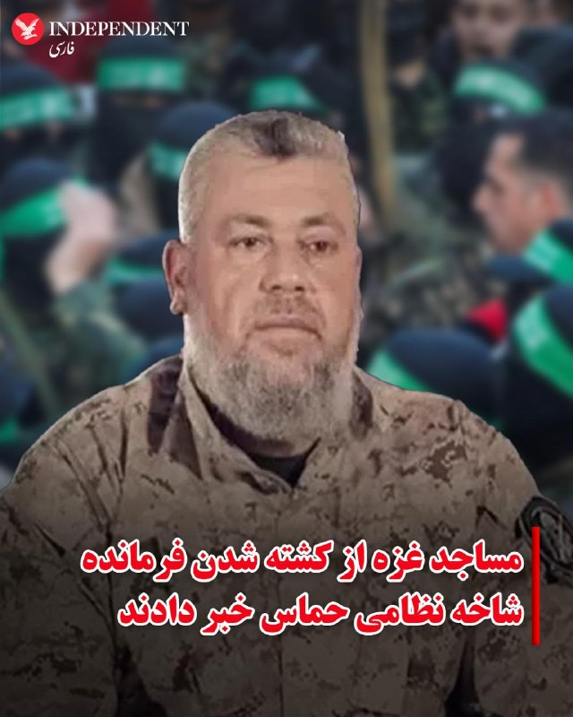
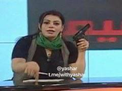
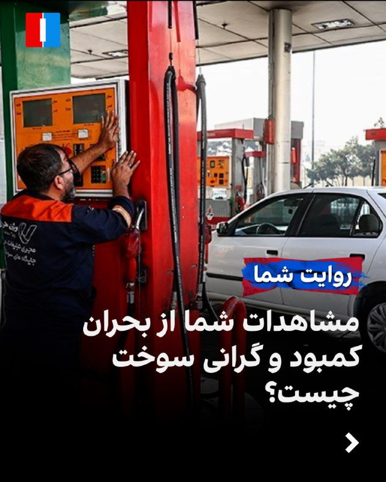
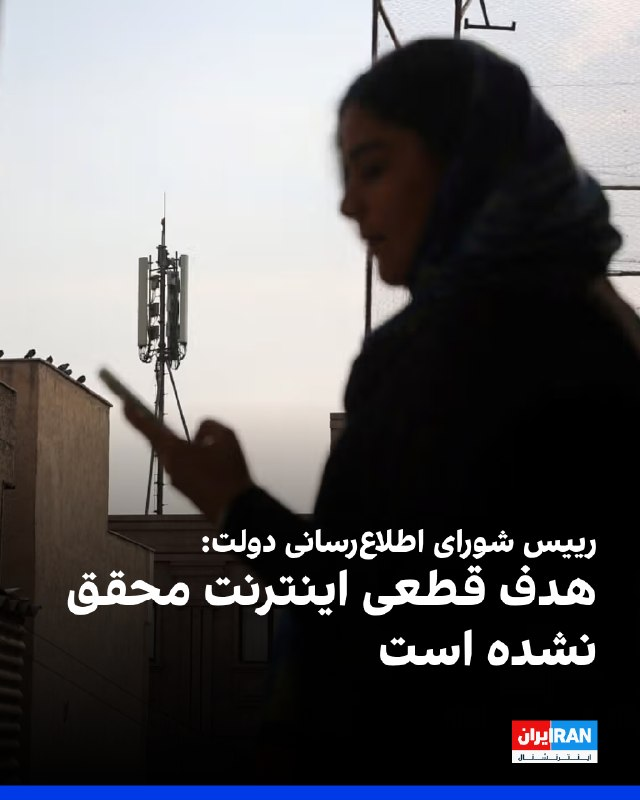
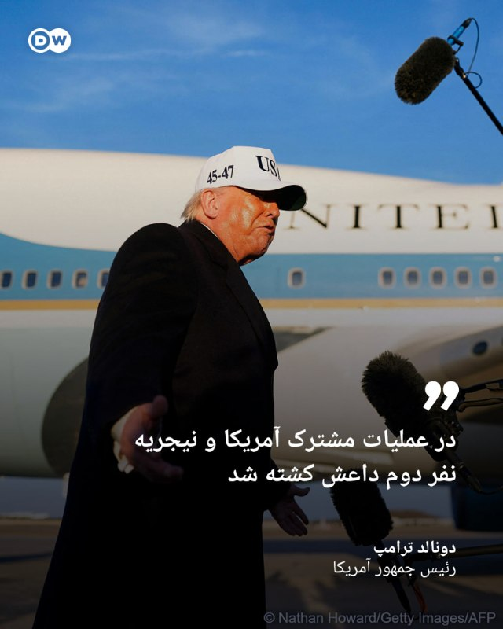
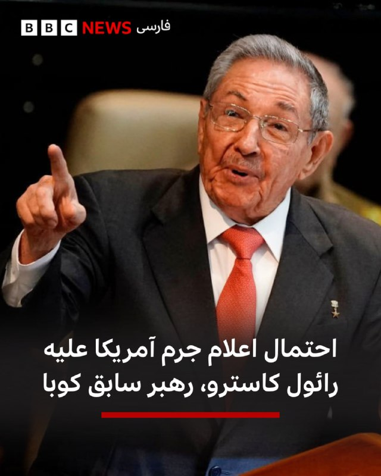

# خواننده تلگرام

<!-- TOP_NAV START -->

<a href="https://github.com/hosseinbaghi/aio-downloader/blob/main/telegram/content/archive_1.md" style="display:inline-block; padding:6px 12px; margin:0 4px; background-color:#2ea44f; color:white; text-decoration:none; border-radius:4px; font-weight:bold;">صفحه بعد</a>

<!-- TOP_NAV END -->

<!-- MSG START -->

---
📅 بروزرسانی: 1405/02/26 13:53
---

## VahidOOnLine — post 240447

  

فرماندهی کل نیروی دفاعی بحرین اعلام کرد که تمامی سلاح‌ها و یگان‌های این نیرو در بالاترین سطح آمادگی و آماده‌باش دفاعی برای مواجه با حمله احتمالی جمهوری اسلامی قرار دارند. بحرین همچنین از شهروندانش خواست با توجه به پیامدهای این حمله، از نزدیک شدن یا دست زدن به هرگونه شیء ناشناس یا مشکوک که ممکن است از بقایای این حمله باشد، خودداری کنند.

در بیانیه این فرماندهی آمده است که نیروهای آن از آمادگی رزمی پیشرفته و هوشیاری بالا در انجام وظیفه ملی خود برای دفاع از کشور و حفاظت از دستاوردهای آن برخوردارند.
‌🏁 🇬🇧 IranintlTV

🤖 @VahidOOnLine

## VahidOOnLine — post 240446

  <a href="telegram/content/VahidOOnLine_240446_1778926987.mp4" target="_blank">🎬 Download video</a>

⭕️ یخاب آران و بیدگل؛
زیستگاه امن حیات‌وحش کویری ایران

♦️گله‌ای از قوچ‌ و میش‌های وحشی در پناهگاه حیات وحش یخاب ابوزیدآباد در شهرستان آران و بیدگل، در قاب دوربین ثبت شد، منطقه‌ای بکر و کم‌نظیر در حاشیه کویر که یکی از زیستگاه‌های مهم حیات‌وحش ایران به شمار می‌رود.
پناهگاه حیات وحش یخاب با برخورداری از تنوع زیستی ارزشمند، زیستگاه گونه‌هایی همچون قوچ و میش وحشی، جبیر، کاراکال و انواع پرندگان بومی کویر است و به‌دلیل شرایط خاص طبیعی و حفاظت محیط‌زیستی، از مناطق مهم حیات‌وحش در استان اصفهان محسوب می‌شود.
ویدیویی از حضور و حرکت گله قوچ و میش‌های وحشی در این منطقه، جلوه‌ای از حیات طبیعی و زیبایی کم‌نظیر زیستگاه‌های کویری ایران را به نمایش گذاشته است.
‌🇸🇦 Indypersian

🤖 @VahidOOnLine

## VahidOOnLine — post 240445

  <a href="telegram/content/VahidOOnLine_240445_1778926989.mp4" target="_blank">🎬 Download video</a>

یک شهروند ویدیویی به ایران اینترنشنال فرستاده که بحران در دسترسی به بنزین و تشکیل صف‌های طولانی در بندرعباس در روز شنبه ۲۶ اردیبهشت‌ماه را نشان می‌دهد.
‌🏁 🇬🇧 IranintlTV

🤖 @VahidOOnLine

## VahidOOnLine — post 240444

  

مشاهدات شما از بحران کمبود و گرانی سوخت در استان‌های مختلف ایران چیست؟

روی لینک زیر کلیک کنید و پیام‌های خود از طریق مدیا‌بات برای ما بفرستید.

t.me

پیام‌های شما به صورت زیر‌نویس در تلویزیون و همچنین در بخش‌های مختلف‌ خبری منتشر خواهد شد
‌🏁 🇬🇧 IranintlTV

🤖 @VahidOOnLine

## VahidOOnLine — post 240443

روایت شما از زندگی در آتش‌بس- شنبه ۲۶ اردیبهشت ۱۴۰۵

🔹 من یک معلول ضایعه نخاعی هستم، ۳۳ سال سن دارم. یک ساله بیکار شدم. هر جا می‌رم به خاطر معلولیتم به من کار نمی‌دن. الان هم که به خاطر شرایط جنگ، اکثر شرکت‌ها تعدیل نیرو دارن.
🔹 از ماهشهر، از وضع مردم خون به جگرم، اما حال و روز نیروی انتظامی دیدن داره، کنار خیابون بساط کردن. راستی از پرداختاتون چه خبر؟ ظاهراً ولتون کردن.
🔹 در حالی که سه ماهه وضع معیشتی سخت شده و بیکار شده‌ایم، قبض برق، گاز و آب گرون شده. سه ماهه مجلس هم تقریباً به‌هم ریخته. چرا نمایندگان مجلس باید حقوق آنچنانی بگیرند؟ مفت‌خورا.
🔹 من با هزار بدبختی به اینترنت وصل شدم. خواستم بگم دمِ خارج از کشور گرم که هوای ما رو دارن.
🔹 از بوشهر؛ جایگاه‌های سوخت بنزین ندارند. روزهای سختی با جمهوری اسلامی در راه است ولی ما تا سقوط این وضعیت تحمل می‌کنیم.
🔹 تسمه دینام پژو ۴۰۵ قبل از دی‌ماه ۴۰۰ تومن بود، الان شده یک میلیون و ششصد.
🔹 اولین بار که بعد از قطع نت وصل می‌شم. افزایش قیمت‌ها عجیب و غریب شده. دانش‌آموز و دانشجو بلاتکلیفن. بعضی‌ها هم از فرصت استفاده می‌کنن و دوباره زبان‌شون دراز شده. امیدوارم زودتر حمله بشه تا اینا برگردن سر جاشون. پاینده ایران.
‌🏁 🇬🇧 IranintlTV

🤖 @VahidOOnLine

## VahidOOnLine — post 240442

  

♦️مساجد شمال غزه روز شنبه اعلام کردند فرمانده شاخه نظامی حماس در حملات روز جمعه اسرائیل به این باریکه کشته شده است. ارتش اسرائیل پیش‌تر اعلام کرده بود رهبر شاخه مسلح حماس را در حملات هوایی هدف قرار داده است.
رویترز به نقل از شاهدان عینی گزارش داد مساجد شهر غزه خبر «شهادت» عزالدین الحداد را اعلام کرده‌اند.
با این حال، حماس تاکنون درباره سرنوشت فرمانده شاخه نظامی خود اظهار نظر رسمی نکرده است.
‌🇸🇦 Indypersian

🤖 @VahidOOnLine

## VahidOOnLine — post 240441

اصغر فرهادی،‌ کارگردان و تهیه‌کننده، ۲۵ اردیبهشت در نشست خبری فیلم «داستان‌های موازی» در جشنواره کن در پاسخ به پرسش خبرنگار ایران‌اینترنشنال درباره انقلاب ملی و سرکوب شهروندان گفت: «قتل انسان‌ها برای من قابل پذیرش نیست؛ چه با جنگ، چه اعدام و چه با کشتن معترضان.»

واکنش شماری از مخاطبان ایران‌اینترنشنال نشان می‌دهد که گروهی موضع‌گیری او را ناکافی دانسته‌اند و باور دارند که این فیلم‌ساز ایرانی، «حق مطلب» درباره جاویدنامان انقلاب ملی ایرانیان را ادا نکرده است.

بازخوانی پیام‌ها با هوش مصنوعی انجام گرفته است.
‌🏁 🇬🇧 IranintlTV

🤖 @VahidOOnLine

## VahidOOnLine — post 240440

  

الیاس حضرتی، رییس شورای اطلاع‌رسانی دولت، گفت اگر هدف از قطع یا محدودسازی اینترنت، جلوگیری از دسترسی مردم به برخی سایت‌ها بوده، این هدف نه‌تنها محقق نشده بلکه نتیجه معکوس داشته است. او افزود: «در برخی کشورها نیز محدودیت‌های مقطعی اینترنت اعمال می‌شود، اما این محدودیت‌ها بلافاصله به حالت عادی بازمی‌گردد.»
‌🏁 🇬🇧 IranintlTV

🤖 @VahidOOnLine

## VahidOOnLine — post 240439

  <a href="telegram/content/VahidOOnLine_240439_1778926993.mp4" target="_blank">🎬 Download video</a>

♦️هواداران خشمگین یک باشگاه فوتبال در طرابلس در اعتراض به تصمیم داور، نمای ساختمان و محوطه دفتر دولت وحدت ملی لیبی (GNU) را به آتش کشیدند.
رویترز به نقل از دو شاهد عینی و یک شبکه تلویزیونی محلی گزارش داد، این ناآرامی‌ها شامگاه پنج‌شنبه در پایتخت لیبی آغاز شد. زمانی که هواداران باشگاه الاتحاد طرابلس در اعتراض به تصمیم داور مبنی بر اعلام نشدن یک ضربه پنالتی در دیدار برابر تیم السویحلی مصراته به خیابان‌ها آمدند.
این مسابقه در ورزشگاه شهر ترهونه، حدود ۶۵ کیلومتری جنوب‌شرقی طرابلس برگزار شد. خبرنگار رویترز که در محل حضور داشت گزارش داد بازی در دقیقه ۸۷ و پس از اعتراض بازیکنان و هواداران الاتحاد متوقف شد.
بر اساس این گزارش، شماری از هواداران الاتحاد وارد زمین مسابقه شدند و درگیری‌هایی رخ داد که به آسیب‌دیدگی اموال و زخمی شدن نیروهای حفاظت ورزشگاه انجامید.
‌🇸🇦 Indypersian

🤖 @VahidOOnLine

## VahidOOnLine — post 240438

روایت شما از زندگی در آتش‌بس- شنبه ۲۶ اردیبهشت ۱۴۰۵

🔹 هر پرس استیک توی لاله‌پارک تبریز شده ۱ میلیون و ۶۰۰ هزار تومان، حقوق یک ماه کارگر معادل ۱۵ پرس استیک!
🔹 من به زور و هزار بدبختی وصل شدم. بدبختمون کردن، چیزی برامون نذاشتن. یک روغن شده ۲ میلیون و ۵۰۰، یک مرغ کوچیک شده ۵۰۰ هزار تومن. کل خانواده کار می‌کنن، بازم خرج زندگی درنمیاد. اینا نباید بمونن، تا از کشورمون نرن حال ایران خوب نمی‌شه. من از طرف پدربزرگ و مادربزرگم عذرخواهی می‌کنم که انقلاب کردن و زندگی تو بهشت را تبدیل به جهنم کردن. تنها امیدمون برگشت شاهزاده‌مونه، از طرف یک نسل زد.
🔹 از ایران؛ آقای ترامپ، برای مذاکره با این جانی‌ها فقط یک شرط بگذارید؛ برگزاری رفراندوم برای تعیین نوع حکومت تحت نظر نهادهای بین‌المللی. همه دنیا هم از شما حمایت خواهد کرد.
🔹 من مهندس ساختمان هستم. در صنعت ساختمان به‌قدری افزایش قیمت وجود داشته که بسیاری از کارگاه‌ها تعطیل شده‌اند. فقط کارگاه‌هایی فعال هستند که پیش‌فروش کردند و مجبور به تحویل هستند. با این روند، بیشتر مهندسین به‌زودی بیکار خواهند شد.
🔹 از مشهد؛ برای سوخت‌گیری به ۳ پمپ‌بنزین رفتم. میدان تلویزیون اصلاً سوخت نمی‌داد، در وکیل‌آباد ورودی دانشجو صف طولانی بود و در بلوار پیروزی بعد از یک ساعت انتظار در صف توانستم ۱۵ لیتر با کارت ۳۰۰۰ تومانی بزنم.
🔹 از مشهد. بعد از ۹ اسفند تازه امروز، ۲۶ اردیبهشت، به‌سختی وصل شدم. شرایط ایران خلاصه می‌شود در گرانی، فقر، نبود اینترنت و ناامیدی و افسردگی. لعنت به سیاست که مردم این وسط تاوان می‌دهند. امیدوارم روزی برسد که مردم ایران از ته دل شاد بشن، چون لیاقتشان بیشتر از این‌هاست.
‌🏁 🇬🇧 IranintlTV

🤖 @VahidOOnLine

## VahidOOnLine — post 240437

⭕️ آموزش استفاده از سلاح در صداوسیما؛
مجری به سمت پرچم امارات متحده عربی شلیک کرد

♦️شامگاه جمعه ۲۵ اردیبهشت‌ماه، برخی مجریان زن و مرد صداوسیمای جمهوری اسلامی در برنامه‌های تلویزیونی با در دست داشتن اسلحه ظاهر شدند. در یکی از ویدیوهای منتشرشده، فردی نظامی با پوشاندن صورت خود، نحوه استفاده از سلاح را آموزش می‌دهد و سپس اسلحه را در اختیار مجری برنامه قرار می‌دهد.
مجری برنامه که به‌نظر می‌رسد آشنایی چندانی با کار با اسلحه ندارد، به توضیحات و آموزش‌های فرد نظامی گوش می‌دهد. او سپس برای شلیک، سلاح را به سمت تصویر پرچم امارات متحده عربی که روی نمایشگر استودیو دیده می‌شود نشانه می‌گیرد و اقدام به شلیک می‌کند.
پخش این تصاویر در حالی صورت می‌گیرد که تنش‌ها میان جمهوری اسلامی ایران و ایالات متحده بار دیگر افزایش یافته و گمانه‌زنی‌ها درباره احتمال ورود دو طرف به دور تازه‌ای از تقابل‌های نظامی و امنیتی شدت گرفته است.
‌🇸🇦 Indypersian

🤖 @VahidOOnLine

## VahidOOnLine — post 240436

  

وحید شریعت، رییس انجمن روان‌پزشکان ایران، در مصاحبه با ایلنا گفت: «کمبود دارو در حوزه روان‌پزشکی جدی است و نسبت به شرایط پیش از جنگ، به‌طور قابل توجهی تشدید شده است.»

او افزود: «در ماه‌های اخیر، کمبود قابل توجهی در برخی اقلام دارویی مشاهده شده است که برخی از آن‌ها از پیش از آغاز جنگ تشدید یافته و برخی دیگر کاملا جدید هستند.»

شریعت اختلال در روند تولید، نبود مواد اولیه، محدود شدن توزیع به‌منظور آماده‌سازی بازار برای افزایش قیمت و تلاش برخی افراد برای ذخیره‌سازی دارو به‌دلیل ترس از جنگ را از عوامل اصلی بحران داروهای روان‌پزشکی عنوان کرد.
‌🏁 🇬🇧 IranintlTV

🤖 @VahidOOnLine

## WithYashar — post 11385

  

صدا و سیما هم میدونه چی میشه داره آموزش کار با سلاح رو میده 😂 اینا رفتنین شک نکنید 👋🏾👋🏾 @withyashar

## WithYashar — post 11384

آقا یاشار عزیز،

واقعاً دلم می‌خواست یه چیزی بهت بگم از ته دل.

مرسی که با کارای دلی و عشقیت، بهم نشون دادی وقتی کاریو با دل شروع می‌کنی، چقدر می‌تونه برکت و موفقیت بیاره.

از اون موقع که تو نوجونی اون سایت برای پروموت کردن رپرها ساختی تا همین الان که با تمام وجود وقتت رو پای این کانال خبری (تلگرام و اینستا) می‌ذاری تا مردم خبر درست بگیرن، یه چیز بزرگ یاد گرفتم ازت — اینکه عشق و نیت خالص از هر چیز دیگه‌ای قوی‌تره.

بهم یادآوری و یاد دادی که پیشرفت فقط با کار زیاد نیست، بلکه دلی و با عشق کار کردن توی کاره.

دمت گرم ، واسه همه این زحماتت، واسه الهامی که بهم دادی، و واسه اینکه خودِ واقعی‌ت رو بی‌منت به دنیا نشون میدی💚

## WithYashar — post 11383

جسی واترز، مجری فاکس نیوز:

ترامپ درحال آماده‌شدن برای دور جدیدی از حملات نظامی به ایرانه.
@withyashar

## WithYashar — post 11382

ترامپ: 5 بار با ایران نزدیک توافق شدم، ولی روز بعدش زدن زیرش
@withyashar

## WithYashar — post 11381

نشست آینده تکنولوژی در ایران، با حضور و سخنرانی شاهزاده رضا پهلوی امشب ۸:۳۰ به وقت تهران ۱۰ صبح به وقت غرب آمریکا سانفرانسیسکو
@withyashar

## WithYashar — post 11380

سنتکام به نیویورک تایمز : کشتی‌های ایرانی رو با ماهواره و چند روش دیگه ردیابی می‌کنیم
@withyashar

## pm_afshaa — post 90838

🔴کانال N12 اسرائیل: جنگ سوم با ایران نزدیک است

💧 Rainbet.com the #1 Non-KYC Crypto Casino & Sportsbook @rainbetcom

😁 @Pm_Afshaa

## pm_afshaa — post 90837

🔴جسی واترز، مجری فاکس نیوز: ترامپ درحال آماده‌شدن برای دور جدیدی از حملات نظامی به ایرانه

💧 Rainbet.com the #1 Non-KYC Crypto Casino & Sportsbook @rainbetcom

😁 @Pm_Afshaa

## pm_afshaa — post 90836

🔴ترامپ: 5 بار با ایران نزدیک توافق شدم، ولی روز بعدش زدن زیرش

💧 Rainbet.com the #1 Non-KYC Crypto Casino & Sportsbook @rainbetcom

😁 @Pm_Afshaa

## pm_afshaa — post 90835

🔴سنتکام:تمام کشتی ها قایق های ایران رو زیر نظر داریم

💧 Rainbet.com the #1 Non-KYC Crypto Casino & Sportsbook @rainbetcom

😁 @Pm_Afshaa

## DEJradio — post 4664

  <a href="telegram/content/DEJradio_4664_1778926996.mp4" target="_blank">🎬 Download video</a>

🤡
🔺 آموزش استفاده از سلاح در تلویزیون جمهوری اسلامی.

صدا و سیمای جمهوری اسلامی سازمان یافته با نشان دادن و آموزش کاربرد اسلحه به مردم چنگ و دندان نشان می‌دهد.

شهرام سبزواری کارشنای نظامی در مورد آموزش کلاشنیکف میگوید فردی که مربی سلاح است و ماسک زده تا شناسایی نشود، لز ساعت هوشمند استفاده می‌کند آنهم در شرایطی که نظامی‌ها بویژه در هنگام ماموریت خاص نباید از تجهیزات هوشمند استفاده کنند.

#کلاشنیکف #صداوسیما
@DEJradio

## DEJradio — post 4663

  <a href="telegram/content/DEJradio_4663_1778926998.mp4" target="_blank">🎬 Download video</a>

🤡
🔺 در صدا و سیمای حکومتی به طور سازمان یافته استفاده از کلاشنیکف را آموزش می‌دهند.

به بهانه تبلیغ پروژه امنیتی "جانفدا" در صدا و سیمای حکومتی، طرفداران نظام را ترغیب به استفاده از سلاح می‌کنند.

برای تلطیف این اقدام جنگ‌طلبانه، زنان وسیله تبلیغ می‌شوند.

#کلاشنیکف #صداوسیما
@DEJradio

## DEJradio — post 4662

  <a href="telegram/content/DEJradio_4662_1778927000.mp4" target="_blank">🎬 Download video</a>

🚨📢 جسد عبدالرحیم موسوی ۳۰ روز زیر آوار ماند

علی موسوی، پسر عبدالرحیم موسوی رئیس پیشن ستاد کل نیروهای مسلح جمهوری اسلامی، گفت که جنازه پدرش که در نخستین روز حملات اسرائیل و آمریکا به بین علی خامنه‌ای کشته شد نزدیک به ۳۰ روز در زیر آوار ماند و یک ماه در جستجوی جنازه‌اش بودند. موسوی پس از کشته شدن محمد باقری در جنگ ۱۲ روزه، به‌عنوان رییس ستاد کل نیروهای مسلح منصوب شده بود.

#جنگ۱۲روزه #IRGCterrorists
@DEJradio

## DEJradio — post 4661

  <a href="telegram/content/DEJradio_4661_1778927001.webm" target="_blank">🎬 Download video</a>

🤡
🔺 بر اساس گزارش‌های منتشر شده، ارتش آمریکا در جریان جنگ اخیر از جزیره بوبیان کویت استفاده عملیاتی کرده است و رسانه‌های وابسته به نظام مدعی شلیک موشک‌های HIMARS آمریکایی در فروردین از این جزیره کویتی هستند، اما منابع کویتی این ادعا را رد می‌کنند.

در این میان، در تاریخ ۱۱ اردیبهشت، کماندوهای نیروی دریایی سـ.ـپاه که پیش از این تبلیغات زیادی درباره توانایی‌هایشان شده بود، در قالب یک تیم شش‌نفره به سمت جزیره بوبیان کویت حرکت کردند. هدف عملیاتی آن‌ها هنوز مشخص نیست، اما این به ‌اصطلاح کماندوها پیش از ورود به جزیره در یک درگیری کوتاه، شکست خوردند و چهار نفر از آنان، شامل سه افسر ارشد و یک افسر جزء، اسیر شدند و دو کماندوی دیگر سپاه نیز موفق به فرار شدند و شاید بتوان گفت فرار این دو موفق ترین، بخش عملیات آنها بوده است.

#نیروی_دریایی #IRGCterrorists
@DEJradio

## DEJradio — post 4658

  <a href="telegram/content/DEJradio_4658_1778927002.webm" target="_blank">🎬 Download video</a>

🔺📢 محمدباقر الساعدی (داوود الساعدی) یکی از فرماندهان ارشد حـ.ـزب‌الله عراق توسط نیروهای امنیتی در یکی از کشورهای منطقه [احتمالا ترکیه، امارات یا اردن] بازداشت شده است. ماموران اف‌بی‌آی او را به آمریکا منتقل کرده‌اند تا محاکمه شود.

وزارت دادگستری آمریکا اعلام کرد، الساعدی رهبر کتائب حزب‌الله عراق با ۶ اتهام مرتبط با تروریسم روبرو است.

این اتهام‌ها به دلیل فعالیت‌های الساعدی با گردان‌های حـ.ـزب‌الله عراق و سـ.ـپاه پاسداران است. او روابط نزدیکی با قـ.ـاسم سـ.ـلیمانی فرمانده پیشین سـ.ـپاه قدس داشت.

براساس یک شکایت سعدی قصد داشته آمریکایی‌ها و یهودیان را در لس‌آنجلس و نیویورک به قتل برساند و برنامه‌ریزی برای حمله به یک کنیسه در نیویورک را آغاز کرده بود.
بازداشت او نشان داد تا چه اندازه نفوذ سرویس‌های امنیتی آمریکا در خاورمیانه زیاد است.

#حزب_الله #عراق
@DEJradio

## DEJradio — post 4657

  <a href="telegram/content/DEJradio_4657_1778927002.webm" target="_blank">🎬 Download video</a>

🚨
⭕️ روزنامه «نیویورک‌تایمز» با اشاره به بن‌بست در مذاکرات جمهوری اسلامی و آمریکا، گزارش داد ایالات متحده و اسرائیل آماده‌سازی‌های گسترده‌ای را برای ازسرگیری احتمالی کارزار نظامی علیه جمهوری اسلامی آغاز کرده‌اند.

بر اساس این گزارش، مقام‌های دولت دونالد ترامپ طرح‌هایی برای عملیات نظامی علیه حکومت ایران تهیه کرده‌اند، اما رییس‌جمهوری آمریکا هنوز تصمیم نهایی را در این رابطه اتخاذ نکرده است.

در این گزارش تأکید شده گزینه‌های زیاد از بمباران گسترده تا عملیات زمینی علیه تاسیسات هسته‌ای جمهوری اسلامی روی میز قرار دارد.

#جنگ #مذاکرات #ترامپ
@DEJradio

## mamlekate — post 103540

  <a href="telegram/content/mamlekate_103540_1778927003.mp4" target="_blank">🎬 Download video</a>

سخنرانی حسین یکتا از تیرخلاص زن‌های دی‌ماه خونین… در کنار مزدوران تیم فوتبال جمهوری اسلامی!

CrimesArchives
@mamlekate

## mamlekate — post 103537

صداوسیما

@mamlekate

## kianmeli1 — post 87434

‏🔴نماینده خامنه‌ای در سپاه در کردستان: امروز نظام «استکبار» در موضع ضعف قرار گرفته و در این مرحله پایانی وارد آوردن ضربه نهایی برای «اضمحلال دشمن» ضرورتی حیاتی دارد
https://t.me/kianmeli1

## kianmeli1 — post 87430

  <a href="telegram/content/kianmeli1_87430_1778927004.mp4" target="_blank">🎬 Download video</a>

🔴شب گذشته در بسیاری از برنامه های صداوسیما، مجریان با تفنگ حاضر شدند

یکی از مجریان در برنامه زنده پرچم امارات را نشانه گرفت و شلیک کرد
https://t.me/kianmeli1

## kianmeli1 — post 87429

‏🔴محمد مخبر، مشاور مجتبی خامنه‌ای، مطلبی را با هشتگ امارات و کویت در ایکس منتشر کرد و نوشت «آن‌ها با پیش‌فروش استقلال خود، حتی خاک و خانه‌هایشان را در اختیار دشمنان فلسطین و جمهوری اسلامی قرار دادند و پاسخ ما به سنگرهای استیجاری سنتکام در جنگ اخیر تمام‌عیار نبود؛ اما این خویشتنداری همیشگی نیست.»
https://t.me/kianmeli1

## kianmeli1 — post 87428

‏🔴وزارت دفاع بریتانیا افزود چهار جنگنده تایفون را در هفته‌های پس از آغاز جنگ به قطر اعزام کرد تا حضور هوایی این کشور در منطقه را تقویت کند
https://t.me/kianmeli1

## kianmeli1 — post 87427

‏🔴فرماندهی کل نیروی دفاع بحرین اعلام کرد همه یگان‌ها در بالاترین سطح آمادگی دفاعی هستند و از مردم خواست به اجسام مشکوک ناشی از حمله از سوی ایران نزدیک نشوند
https://t.me/kianmeli1

## kianmeli1 — post 87426

‏🔴نورنیوز، رسانه نزدیک به شورای عالی امنیت ملی به نقل از یک مقام مطلع نظامی نوشت در صورت وقوع جنگ، «طرح جامع مقابله آنی» به همه یگان‌های عملیاتی ابلاغ شده و هرگونه اقدام آمریکا با پاسخ «فوری، گسترده و چندلایه» مواجه خواهد شد. به گفته این منبع، اهدافی که در جنگ ۴۰ روزه مورد اصابت قرار نگرفتند، این‌بار در اولویت قرار دارند و سناریوی جدید بر مبنای «حداکثر فشار متقابل» بازتعریف شده است
https://t.me/kianmeli1

## IranIntlTV — post 337442

  

فرماندهی کل نیروی دفاعی بحرین اعلام کرد که تمامی سلاح‌ها و یگان‌های این نیرو در بالاترین سطح آمادگی و آماده‌باش دفاعی برای مواجه با حمله احتمالی جمهوری اسلامی قرار دارند. بحرین همچنین از شهروندانش خواست با توجه به پیامدهای این حمله، از نزدیک شدن یا دست زدن به هرگونه شیء ناشناس یا مشکوک که ممکن است از بقایای این حمله باشد، خودداری کنند.

در بیانیه این فرماندهی آمده است که نیروهای آن از آمادگی رزمی پیشرفته و هوشیاری بالا در انجام وظیفه ملی خود برای دفاع از کشور و حفاظت از دستاوردهای آن برخوردارند.
https://iranintl.com/202605161969

## IranIntlTV — post 337441

  <a href="telegram/content/IranIntlTV_337441_1778927006.mp4" target="_blank">🎬 Download video</a>

یک شهروند ویدیویی به ایران اینترنشنال فرستاده که بحران در دسترسی به بنزین و تشکیل صف‌های طولانی در بندرعباس در روز شنبه ۲۶ اردیبهشت‌ماه را نشان می‌دهد.

## IranIntlTV — post 337440

  

مشاهدات شما از بحران کمبود و گرانی سوخت در استان‌های مختلف ایران چیست؟

روی لینک زیر کلیک کنید و پیام‌های خود از طریق مدیا‌بات برای ما بفرستید.

https://t.me/intlmedia_bot

پیام‌های شما به صورت زیر‌نویس در تلویزیون و همچنین در بخش‌های مختلف‌ خبری منتشر خواهد شد

## IranIntlTV — post 337439

  <a href="telegram/content/IranIntlTV_337439_1778927009.mp4" target="_blank">🎬 Download video</a>

دونالد ترامپ، رییس‌جمهوری آمریکا، گفت با تعلیق ۲۰ ساله غنی‌سازی اورانیوم در ایران موافق است، مشروط بر اینکه در این مدت، برنامه هسته‌ای جمهوری اسلامی به‌طور کامل پاکسازی شود.

گفت‌وگو با علی شیرازی، عضو تحریریه ایران‌اینترنشنال
@iranintltv

## IranIntlTV — post 337438

  <a href="https://t.me/IranintlTV/337438" target="_blank">📎 Download file</a>

🎧نسخه صوتی اخبار بامدادی | شنبه ۲۶ اردیبهشت
@iranintlTV

## IranIntlTV — post 337437

روایت شما از زندگی در آتش‌بس- شنبه ۲۶ اردیبهشت ۱۴۰۵

🔹 من یک معلول ضایعه نخاعی هستم، ۳۳ سال سن دارم. یک ساله بیکار شدم. هر جا می‌رم به خاطر معلولیتم به من کار نمی‌دن. الان هم که به خاطر شرایط جنگ، اکثر شرکت‌ها تعدیل نیرو دارن.
🔹 از ماهشهر، از وضع مردم خون به جگرم، اما حال و روز نیروی انتظامی دیدن داره، کنار خیابون بساط کردن. راستی از پرداختاتون چه خبر؟ ظاهراً ولتون کردن.
🔹 در حالی که سه ماهه وضع معیشتی سخت شده و بیکار شده‌ایم، قبض برق، گاز و آب گرون شده. سه ماهه مجلس هم تقریباً به‌هم ریخته. چرا نمایندگان مجلس باید حقوق آنچنانی بگیرند؟ مفت‌خورا.
🔹 من با هزار بدبختی به اینترنت وصل شدم. خواستم بگم دمِ خارج از کشور گرم که هوای ما رو دارن.
🔹 از بوشهر؛ جایگاه‌های سوخت بنزین ندارند. روزهای سختی با جمهوری اسلامی در راه است ولی ما تا سقوط این وضعیت تحمل می‌کنیم.
🔹 تسمه دینام پژو ۴۰۵ قبل از دی‌ماه ۴۰۰ تومن بود، الان شده یک میلیون و ششصد.
🔹 اولین بار که بعد از قطع نت وصل می‌شم. افزایش قیمت‌ها عجیب و غریب شده. دانش‌آموز و دانشجو بلاتکلیفن. بعضی‌ها هم از فرصت استفاده می‌کنن و دوباره زبان‌شون دراز شده. امیدوارم زودتر حمله بشه تا اینا برگردن سر جاشون. پاینده ایران.

## IranIntlTV — post 337436

اصغر فرهادی،‌ کارگردان و تهیه‌کننده، ۲۵ اردیبهشت در نشست خبری فیلم «داستان‌های موازی» در جشنواره کن در پاسخ به پرسش خبرنگار ایران‌اینترنشنال درباره انقلاب ملی و سرکوب شهروندان گفت: «قتل انسان‌ها برای من قابل پذیرش نیست؛ چه با جنگ، چه اعدام و چه با کشتن معترضان.»

واکنش شماری از مخاطبان ایران‌اینترنشنال نشان می‌دهد که گروهی موضع‌گیری او را ناکافی دانسته‌اند و باور دارند که این فیلم‌ساز ایرانی، «حق مطلب» درباره جاویدنامان انقلاب ملی ایرانیان را ادا نکرده است.

بازخوانی پیام‌ها با هوش مصنوعی انجام گرفته است.

## IranIntlTV — post 337435

  

الیاس حضرتی، رییس شورای اطلاع‌رسانی دولت، گفت اگر هدف از قطع یا محدودسازی اینترنت، جلوگیری از دسترسی مردم به برخی سایت‌ها بوده، این هدف نه‌تنها محقق نشده بلکه نتیجه معکوس داشته است. او افزود: «در برخی کشورها نیز محدودیت‌های مقطعی اینترنت اعمال می‌شود، اما این محدودیت‌ها بلافاصله به حالت عادی بازمی‌گردد.»
https://iranintl.com/202605165637

## IranIntlTV — post 337434

روایت شما از زندگی در آتش‌بس- شنبه ۲۶ اردیبهشت ۱۴۰۵

🔹 هر پرس استیک توی لاله‌پارک تبریز شده ۱ میلیون و ۶۰۰ هزار تومان، حقوق یک ماه کارگر معادل ۱۵ پرس استیک!
🔹 من به زور و هزار بدبختی وصل شدم. بدبختمون کردن، چیزی برامون نذاشتن. یک روغن شده ۲ میلیون و ۵۰۰، یک مرغ کوچیک شده ۵۰۰ هزار تومن. کل خانواده کار می‌کنن، بازم خرج زندگی درنمیاد. اینا نباید بمونن، تا از کشورمون نرن حال ایران خوب نمی‌شه. من از طرف پدربزرگ و مادربزرگم عذرخواهی می‌کنم که انقلاب کردن و زندگی تو بهشت را تبدیل به جهنم کردن. تنها امیدمون برگشت شاهزاده‌مونه، از طرف یک نسل زد.
🔹 از ایران؛ آقای ترامپ، برای مذاکره با این جانی‌ها فقط یک شرط بگذارید؛ برگزاری رفراندوم برای تعیین نوع حکومت تحت نظر نهادهای بین‌المللی. همه دنیا هم از شما حمایت خواهد کرد.
🔹 من مهندس ساختمان هستم. در صنعت ساختمان به‌قدری افزایش قیمت وجود داشته که بسیاری از کارگاه‌ها تعطیل شده‌اند. فقط کارگاه‌هایی فعال هستند که پیش‌فروش کردند و مجبور به تحویل هستند. با این روند، بیشتر مهندسین به‌زودی بیکار خواهند شد.
🔹 از مشهد؛ برای سوخت‌گیری به ۳ پمپ‌بنزین رفتم. میدان تلویزیون اصلاً سوخت نمی‌داد، در وکیل‌آباد ورودی دانشجو صف طولانی بود و در بلوار پیروزی بعد از یک ساعت انتظار در صف توانستم ۱۵ لیتر با کارت ۳۰۰۰ تومانی بزنم.
🔹 از مشهد. بعد از ۹ اسفند تازه امروز، ۲۶ اردیبهشت، به‌سختی وصل شدم. شرایط ایران خلاصه می‌شود در گرانی، فقر، نبود اینترنت و ناامیدی و افسردگی. لعنت به سیاست که مردم این وسط تاوان می‌دهند. امیدوارم روزی برسد که مردم ایران از ته دل شاد بشن، چون لیاقتشان بیشتر از این‌هاست.

## IranIntlTV — post 337433

  

وحید شریعت، رییس انجمن روان‌پزشکان ایران، در مصاحبه با ایلنا گفت: «کمبود دارو در حوزه روان‌پزشکی جدی است و نسبت به شرایط پیش از جنگ، به‌طور قابل توجهی تشدید شده است.»

او افزود: «در ماه‌های اخیر، کمبود قابل توجهی در برخی اقلام دارویی مشاهده شده است که برخی از آن‌ها از پیش از آغاز جنگ تشدید یافته و برخی دیگر کاملا جدید هستند.»

شریعت اختلال در روند تولید، نبود مواد اولیه، محدود شدن توزیع به‌منظور آماده‌سازی بازار برای افزایش قیمت و تلاش برخی افراد برای ذخیره‌سازی دارو به‌دلیل ترس از جنگ را از عوامل اصلی بحران داروهای روان‌پزشکی عنوان کرد.
https://iranintl.com/202605168467

## IranIntlTV — post 337432

  <a href="telegram/content/IranIntlTV_337432_1778927011.mp4" target="_blank">🎬 Download video</a>

یک شهروند با ارسال پیامی به ایران اینترنشنال می‌گوید: «من یه نقاشم و تنها دلخوشی‌ام همین نقاشی بود. الان توانِ خرید بوم را هم ندارم. حتی مقوایی که هفته پیش ۲۵۰ هزار تومان خریدم، این هفته شده ۳۲۰ هزار تومان.»

## Shin_Persian — post 6027

Emanuel (Mannie) Fabian ✓ @manniefabian
Sat, 16 May 2026 09:32:14 UTC

The funeral for Hamas leader in the Gaza Strip, Izz al-Din al-Haddad, has begun, according to Palestinian media.

فارسی

به گفته رسانه‌های فلسطینی، مراسم تشییع پیکر عزالدین الحداد، از رهبران حماس در نوار غزه، آغاز شده است.

𝕏 · @shin_persian

## FarsiVOA — post 217881

  <a href="telegram/content/FarsiVOA_217881_1778927013.mp4" target="_blank">🎬 Download video</a>

تصاویر منتشر شده از سواحل جنوبی ایران، از یک فاجعه زیست‌محیطی گسترده حکایت دارد؛ لجن‌های نفتی و مواد سمی بخش وسیعی از اکوسیستم دریایی این منطقه را آلوده کرده است.

در حالی که کارشناسان به فرسودگی شدید زیرساخت‌ها اشاره می‌کنند، برخی گزارش‌ها نیز حاکی از احتمال تخلیه عمدی پسماندهای نفتی در آب‌های ساحلی است که ابعاد این فاجعه را پیچیده‌تر می‌کند.

در همین زمینه مایک والتز، نماینده آمریکا در سازمان ملل متحد، روز جمعه با بازنشر این ویدیو در شبکه ایکس نوشت جمهوری اسلامی «ایران اکنون علاوه بر اهداف غیرنظامی، کمک‌های بشردوستانه و کشتیرانی غیرنظامی، به محیط زیست نیز حمله می‌کند.»

نشت مواد سمی باعث مرگ دسته‌جمعی هزاران خرچنگ و گونه‌های جانوری دیگر در نوار ساحلی شده است.

آتش‌سوزی در بخش‌هایی از لکه‌های نفتی، توده‌های عظیم دود سیاه ایجاد کرده که سلامت ساکنان منطقه را تهدید می‌کند.
@FarsiVOA

## FarsiVOA — post 217880

🔺آمریکا در تدارک اعلام جرم علیه رائول کاسترو رهبر پیشین کوبا

◾️رویترز به نقل از یک مقام وزارت دادگستری آمریکا گزارش داد دولت ترامپ قصد دارد روز چهارشنبه ۲۰ مه، اتهامات کیفری علیه رائول کاسترو، رهبر پیشین کوبا، را در میامی اعلام کند.

◾️به گفته این مقام، پرونده به حادثه سال ۱۹۹۶ بازمی‌گردد؛ زمانی که جنگنده‌های کوبا دو هواپیمای کوچک متعلق به گروه تبعیدیان کوبایی «برادران نجات» را سرنگون کردند و چهار نفر شهروند آمریکایی کشته شدند. رائول کاسترو در آن زمان وزیر دفاع کوبا بود.

◾️واشنگتن پس از این حادثه، در دوره بیل کلینتون، تحریم‌هایی علیه کوبا اعمال کرد؛ از جمله تعلیق پروازهای چارتر، محدود کردن رفت‌وآمد دیپلمات‌های کوبایی، و تلاش برای تشدید تحریم‌ها در کنگره.

⬇️ بیشتر بخوانید:
https://ir.voanews.com/a/8150655.html

## FarsiVOA — post 217879

  

بلومبرگ گزارش داد شرکت ملی نفت ابوظبی، ادنوک، با وجود اختلال‌های حمل‌ونقل در خلیج فارس، همچنان گاز طبیعی مایع را روی نفتکش‌هایی بارگیری می‌کند که سامانه‌های ردیابی خود را خاموش کرده‌اند.

بر اساس این گزارش، این کشتی‌ها برای عبور از تنگه هرمز موقعیت خود را پنهان می‌کنند؛ مسیری که از آغاز جنگ و افزایش تهدیدها علیه کشتیرانی، با خطر جدی روبه‌رو شده است.

ادنوک پیش‌تر اعلام کرده بود به دلیل اختلال در عبور کشتی‌ها از تنگه هرمز، تولید و صادرات ال‌ان‌جی و برخی محصولات صادراتی خود را به‌طور موقت تنظیم کرده است.

تأسیسات داس آیلند این شرکت در داخل خلیج فارس قرار دارد و صادرات آن برای رسیدن به بازارهای جهانی ناچار به عبور از تنگه هرمز است.

رویترز نیز اوایل ماه مه گزارش داد دومین نفتکش ال‌ان‌جی تحت مدیریت ادنوک، پس از خاموش کردن سامانه ردیابی خود، از تنگه هرمز عبور کرده است.

داده‌های رهگیری کشتی‌ها نشان می‌دهد شماری از نفتکش‌ها در هفته‌های اخیر برای کاهش خطر هدف‌گیری یا توقیف، موقعیت خود را پنهان کرده یا الگوهای شناسایی غیرعادی داشته‌اند.
@FarsiVOA

## FarsiVOA — post 217878

🔺خاموشی اینترنت در ایران وارد هفته دوازدهم شد

◾️نت‌بلاکس، نهاد ناظر بر اختلالات اینترنت، اعلام کرد خاموشی دیجیتال در ایران وارد هفته دوازدهم و روز هفتادوهشتم شده است

◾️این محدودیت بی‌سابقه، کشوری ۹۰ میلیونی را تا حد زیادی از اینترنت جهانی جدا کرده و حقوق بشر، اقتصاد و آزادی‌های بنیادین شهروندان را در مقیاسی گسترده فرسایش می‌دهد.

◾️مقام‌های دولتی مدعی هستند که اینترنت حق عمومی و برابر شهروندان است، اما ساختار دسترسی در عمل به سمت اینترنت گزینشی، لیست سفید و «اینترنت پرو» حرکت کرده است.

◾️همچنین دسترسی به زیرساخت حیاتی اینترنت، به‌جای آنکه برای همه شهروندان و فعالان اقتصادی تضمین شود، به فرآیندی اداری، صنفی و گزینشی تبدیل شده است.

⬇️ بیشتر بخوانید:
https://ir.voanews.com/a/8150654.html

## DW_Farsi — post 124757

  

🔶 دیدار دبیر کل فیفا با مقام‌های فدراسیون فوتبال ایران در استانبول

خبرگزاری رویترز گزارش داد ماتیاس گرافستروم، دبیرکل فیفا (فدراسیون بین‌المللی فوتبال) روز شنبه ۲۶ اردیبهشت (۱۶ مه) در استانبول با مقام‌های فدراسیون فوتبال ایران دیدار خواهد کرد تا درباره حضور ایران در جام جهانی "اطمینان خاطر" بدهد.

جمهوری اسلامی شامگاه چهارشنبه ۲۳ اردیبهشت با حضور هزاران هوادار در میدان انقلاب تهران، مراسم بدرقه تیم ملی فوتبال برای جام جهانی را برگزار کرد.

انتشار تصاویر شعارهایی مانند "مرگ بر آمریکا" در این مراسم بازتاب گسترده‌ای در رسانه‌ها و شبکه‌های اجتماعی داشت.

بازیکنان قرار است هفته آینده تمرینات خود را در اردوی آماده‌سازی در ترکیه آغاز کنند.

مهدی تاج، رئیس فدراسیون فوتبال ایران پیش از این به دلیل ارتباط با سپاه پاسداران انقلاب اسلامی، اجازه ورود به کانادا برای شرکت در کنگره فیفا را دریافت نکرد.

آمریکا نیز همانند کانادا، سپاه پاسداران را در فهرست سازمان‌های تروریستی قرار داده است.

گزارش‌ها درباره محدودیت‌های احتمالی ورود برخی افراد مرتبط با سپاه پاسداران نیز این نگرانی‌ها را افزایش داده است. جمهوری اسلامی مسئولیت حل موضوع ویزا برای بازیکنان و اعضای تیم را بر عهده فیفا گذاشته است.

ایران قرار است هر سه بازی مرحله گروهی جام جهانی را در آمریکا برگزار کند.

پس از حملات آمریکا و اسرائیل به ایران در اواخر فوریه، مشارکت تیم ملی ایران در این رقابت‌ها که از ۱۱ ژوئن تا ۱۹ ژوئیه برگزار می‌شود، با ابهام روبه‌رو شده است.

@dw_farsi

## DW_Farsi — post 124756

  

🔶 قربانیان تروریسم خواستار مصادره ۳۴۴ میلیون دلار ارز دیجیتالی ایران شدند

گروهی از خانواده‌های قربانیان تروریسم در آمریکا از یک قاضی فدرال در منهتن نیویورک خواسته‌اند شرکت ارز دیجیتالی "تتر"، صادرکننده "استیبل‌کوین" را ملزم کند بیش از ۳۴۴ میلیون دلار دارایی دیجیتال مسدودشده مرتبط با ایران را به وکلای آن‌ها منتقل کند.

این درخواست روز پنجشنبه ۲۴ اردیبهشت (۱۴ مه) در دادگاه منطقه منهتن نیویورک ثبت شده و مربوط به خانواده‌هایی است که با بمب‌گذاری سال ۱۹۹۷ حماس در اورشلیم ارتباط دارند و در پرونده‌های مختلف مرتبط با تروریسم، احکام پرداختی سنگینی علیه ایران دریافت کرده‌اند.

مجموع این احکام شامل حدود ۵۵۲ میلیون دلار غرامت و ۱.۸۶ میلیارد دلار خسارت تنبیهی است.

دارایی ارز دیجیتالی جمهوری اسلامی در چارچوب عملیات "خشم اقتصادی" دولت آمریکا و با هدف محدود کردن توان مالی ایران مسدود شده بود.

وزارت خزانه‌داری آمریکا اعلام کرده بود که شبکه‌های مالی مرتبط با سپاه پاسداران و حزب‌الله در این روند هدف قرار گرفته‌اند.

طبق اسناد پرونده، دو کیف پول رمزارزی که مجموعا حدود ۳۴۴ میلیون دلار در آن‌ها نگهداری می‌شد، توسط شرکت تتر مسدود شده‌اند. اکنون شاکیان درخواست کرده‌اند این دارایی‌ها برای اجرای احکام دادگاه‌های آمریکا علیه ایران به آن‌ها منتقل شود.

@dw_farsi

## DW_Farsi — post 124755

🔶 ایران متهم به هک سامانه‌های پایش سوخت پمپ‌بنزین‌های آمریکا

شبکه تلویزیونی سی‌ان‌ان در گزارشی اختصاصی نوشت مقام‌های آمریکایی گمان می‌کنند هکرهای ایرانی پشت مجموعه‌ای از نفوذهای سایبری به سامانه‌های پایش مخازن سوخت در پمپ‌بنزین‌های چندین ایالت آمریکا قرار دارند؛ سامانه‌هایی که میزان سوخت موجود در مخازن ذخیره را اندازه‌گیری و گزارش می‌کنند.

به گفته منابع آگاه از این فعالیت‌ها، هکرها از ضعف امنیتی سامانه‌های "سنجش خودکار مخازن (ATG)" سوءاستفاده کرده‌اند؛ سامانه‌هایی که به اینترنت متصل هستند و در برخی موارد حتی با رمز عبور محافظت نمی‌شده‌اند.

بر اساس گزارش سی‌ان‌ان، هکرها در برخی موارد توانسته‌اند داده‌های نمایش‌داده‌شده درباره سطح سوخت را دستکاری کنند، اما میزان واقعی سوخت موجود در مخازن تغییر نکرده است. تاکنون گزارشی از خسارت فیزیکی، انفجار، نشت یا آسیب مستقیم منتشر نشده، اما مقام‌های آمریکایی و کارشناسان بخش خصوصی هشدار داده‌اند که دسترسی به چنین سامانه‌هایی می‌تواند از نظر امنیتی خطرناک باشد؛ زیرا اصولاً ممکن است به مهاجم امکان دهد نشتی سوخت را از دید سامانه‌های هشدار پنهان کند.

@dw_farsi

## DW_Farsi — post 124754

  

📸 عکس روز: میزبان مهربان دریای کارائیب

یک لاک‌پشت دریایی روز جمعه، ۱۵ مه ۲۰۲۶ (۲۵ اردیبهشت ۱۴۰۵)، در ساحل پیسکادو واقع در منطقه وست‌پونت در جزیره کوراسائو، در میان گردشگرانی که مشغول غواصی سطحی هستند، شنا می‌کند. جزیره کوراسائو در دریای کارائیب به خاطر آب‌های زلال و حیات وحش دریایی غنی خود، یکی از مقاصد محبوب غواصان و دوستداران طبیعت است.

@dw_farsi

## DW_Farsi — post 124753

  

🔶 ترامپ: در عملیات مشترک آمریکا و نیجریه نفر دوم داعش کشته شد

دونالد ترامپ، رئیس‌جمهور آمریکا شامگاه جمعه ۲۵ اردیبهشت (۱۵ مه) اعلام کرد که "ابو بلال المینوکی"، نفر دوم گروه داعش در یک عملیات مشترک میان نیروهای آمریکا و ارتش نیجریه کشته شده است.

ترامپ در شبکه اجتماعی "تروث سوشال" نوشت این عملیات به دستور او و با اجرای نیروهای آمریکایی و نیروهای مسلح نیجریه "به‌صورت دقیق و پیچیده" انجام شده و هدف آن حذف "فعال‌ترین تروریست جهان" از میدان نبرد بوده است.

او افزود که المینوکی تصور می‌کرد می‌تواند در آفریقا مخفی شود، اما نیروهای اطلاعاتی آمریکا از فعالیت‌های او مطلع بوده‌اند.

رئیس جمهور آمریکا که پیش‌تر نیجریه را به ناتوانی در حفاظت از مسیحیان در برابر شبه‌نظامیان اسلام‌گرا در شمال‌غرب این کشور متهم کرده بود، از دولت نیجریه بابت همکاری در این عملیات قدردانی کرد.

دولت نیجریه هرگونه تبعیض مذهبی را رد و اعلام کرده است که نیروهای امنیتی این کشور با گروه‌های مسلحی مقابله می‌کنند که به مسیحیان و  مسلمانان حمله می‌کنند.

به گزارش رویترز، آمریکا پیش‌تر نیز در ماه دسامبر سال گذشته حملاتی علیه نیروهای وابسته به گروه داعش در نیجریه انجام داده بود.

واشنگتن بعد از این حملات پهپادهایی به همراه حدود ۲۰۰ نیروی نظامی برای آموزش و پشتیبانی اطلاعاتی در اختیار ارتش نیجریه قرار داد تا با شورش‌های وابسته به داعش و القاعده که در غرب آفریقا در حال گسترش هستند، مقابله کند.

@dw_farsi

## RadioFarda — post 157254

🔸در یک برنامه زنده تلویزیونی که از شبکه افق صداوسیما پخش شده است، مجری برنامه با اسلحه واقعی به پرچم امارات متحده عربی شلیک می‌کند.

🔸در این برنامه که موضوع آن درباره آموزش شلیک با اسلحه کلاشنیکف است، فردی که لباس نظامی به تن دارد و صورت خود را با ماسک پوشانده است مراحل آماده‌سازی اسلحه و شلیک گلوله را به مجری آموزش می‌دهد.

🔸مجری برنامه هم در مرحله شلیک تصمیم می‌گیرد به پرچم امارات که در بنر مربوط به دکور استودیو، شلیک کند.

🔸این اقدام هم‌زمان با اوج‌گیری تنش‌های لفظی میان ایران و امارات در روزهای اخیر انجام شده است.

🔸امارات متحده عربی روز جمعه ۲۵ اردیبهشت «تلاش‌ها برای توجیه حملات تروریستی ایران» را رد کرد و گفت که حق پاسخگویی به هرگونه تهدید، ادعا یا اقدام خصمانه ایران را برای خود محفوظ می‌دارد.

🔸این بیانیه در پی نشست روز ۲۴ اردیبهشت بریکس در دهلی نو منتشر شد که در آن‌جا عباس عراقچی، وزیر خارجه ایران، با اشاره به حملات آمریکا و اسرائیل، گفت: «امارات شریک فعال این تجاوز است.»

🔸ایران در جریان حملات آمریکا و اسرائیل بارها امارات متحده عربی را هدف قرار داد.

@RadioFarda

## RadioFarda — post 157253

  

🔸عباس عراقچی، وزیر امور خارجه جمهوری اسلامی، روز جمعه ۲۵ اردیبهشت در گفت‌وگو با خبرنگاران در هند ادعا کرد که ایران با عمان در حال رایزنی برای ایجاد سازوکار مناسب برای اداره تنگه هرمز است.

🔸بر اساس ادعای عراقچی، از آنجا که ایران و عمان در دو سوی تنگه هرمز قرار دارند، آنها باید برای مدیریت این آبراهه تصمیم بگیرند.

🔸عمان تاکنون هیچ واکنشی به این اظهار نظر نداشته و در برابر آن سکوت کرده است.

🔸عباس عراقچی این طور توضیح داده است:‌ «ایران و عمان دو کشور ساحلی در دو سوی تنگه هرمز هستند و این تنگه در آب‌های سرزمینی دو کشور قرار دارد و میان آن آب‌های بین‌المللی وجود ندارد. بنابراین مدیریت این مسیر باید توسط ایران و عمان انجام شود.»

🔸این در حالی است که ایالات متحده با این که این تنگه باید در دست ایران باشد و تهران می‌تواند در ازای اجازه عبور از کشتی‌ها عوارض دریافت کند از ابتدا مخالفت کرده و می‌گوید که عمان هم با این موضع‌گیری موافق است.

@RadioFarda

## RadioFarda — post 157252

  

🔸قوه قضاییه جمهوری اسلامی روز شنبه ۲۶ اردیبهشت از توقیف اموال ۵۱ نفر در استان یزد به اتهام «جاسوسی و همکاری با کشور‌های متخاصم و گروه‌های معاند» خبر داد.

🔸بنا بر اعلام مرکز رسانه قوه قضائیه اموال این افراد «به نفع مردم و هزینه‌کرد برای بازسازی اماکن آسیب‌دیده از جنگ توقیف شده است.»

🔸بنابر این اطلاعیه قوه قضاییه ۲۰ نفر از این افراد در داخل کشور و ۳۱ نفر در خارج از ایران به‌سر می‌برند و اموال آن‌ها «شامل وجوه نقد بانکی، اموال منقول و غیرمنقول، سهام شرکت‌ها و حتی اموال وکالتی» است.

🔸این نهاد اسامی این افراد را اعلام نکرده و برای اتهامات علیه این افراد شواهد و مدارکی ارائه نداده است.

🔸پیش از این نیز گزارش‌های متعددی از توقیف اموال شماری از روزنامه‌نگاران، فعالان سیاسی و مدنی، هنرمندان، ورزشکاران و چهره‌های شناخته‌شده با اتهاماتی چون «خیانت» به وطن و «وابستگی» به اسرائیل و «همکاری با کشورهای متخاصم» منتشر شده بود.

@RadioFarda

## IranianMinds — post 20231

🔴کانال ۱۲ اسرائیل:

جنگ سوم با ایران نزدیک است.

@IranianMinds

## BBCPersian — post 281207

🔻مهدی چمران، رئیس شورای شهر تهران، درباره تمدید رایگان شدن اتوبوس و مترو در پایتخت گفت کار احساسی نمی‌توان انجام داد و قرار نیست تمدید شود.

او در گفت‌وگو با باشگاه خبرنگاران جوان گفت اجرای چنین تصمیمی نیازمند ارائه طرح یا لایحه است، اما تاکنون هیچ‌یک از این دو به شورای شهر ارائه نشده است.

اتوبوس‌های درون‌شهری در تهران اولین‌بار نهم اسفند ۱۴۰۴ و به دنبال شروع جنگ و مترو از ۲۴ اسفند رایگان شد. پس از آن شورای شهر بصورت هفتگی این طرح را تمدید کرد.

پرویز سروری، نایب رئیس شورای شهر تهران پنجم اردیبهشت در تلویزیون ایران اعلام کرد: براساس برنامه‌ریزی صورت گرفته قرار است اتوبوس و مترو با تصویب شورای اسلامی شهر تهران برای همیشه رایگان شود.
او گفت در حال برنامه‌ریزی با نمایندگان و مدیریت شهرداری هستیم تا امکان دائمی‌شدن خدمات رایگان مترو و اتوبوس در تهران انجام شود.

@BBCPersian

## BBCPersian — post 281206

🔻بنابر گزارش‌ها وزارت دادگستری آمریکا در نظر دارد در روزهای آینده علیه رائول کاسترو، رهبر سابق کوبا، اعلام جرم کند. این پرونده به سرنگونی دو هواپیما با پدافند هوایی کوبا در سال ۱۹۹۶ مربوط می‌شود که در جریان آن چهار نفر کشته شدند. این هواپیماها متعلق به گروه…

## BBCPersian — post 281205

  

🔻بنابر گزارش‌ها وزارت دادگستری آمریکا در نظر دارد در روزهای آینده علیه رائول کاسترو، رهبر سابق کوبا، اعلام جرم کند.

این پرونده به سرنگونی دو هواپیما با پدافند هوایی کوبا در سال ۱۹۹۶ مربوط می‌شود که در جریان آن چهار نفر کشته شدند.

این هواپیماها متعلق به گروه تبعیدی آمریکایی «برادران برای نجات» بود؛ گروهی که خود را نهادی حقوق بشری توصیف می‌کند که هدفش کمک به قایق‌های مهاجرانی است که از کوبا فرار می‌کنند. این گروه قبلا در نزدیکی سواحل کوبا اقدام به پخش اعلامیه‌های ضد دولت کاسترو کرده بود.

دولت کوبا در زمان سرنگونی این هواپیماها مدعی شده بود که هواپیماها حریم هوایی این کشور را نقض کرده‌اند، اما سازمان بین‌المللی هوانوردی غیرنظامی اعلام کرد که حمله در آب‌های بین‌المللی رخ داده است.

به گفته مقام‌های آمریکایی، کیفرخواست احتمالی ممکن است از هفته آینده و پس از تأیید هیئت منصفه صادر شود. این اقدام بخشی از فشارهای فزاینده واشنگتن علیه کوبا ارزیابی می‌شود. فشاری که تحریم‌ها و محدودیت‌های نفتی را شامل می‌شود.

📸Getty Images
@BBCPersian

## BBCPersian — post 281204

🔻اسرائیل از موج تازه حملات علیه مواضع حزب‌الله خبر داد

ارتش اسرائیل می‌گوید که موج تازه‌ای از حملات هوایی را علیه مواضع حزب‌الله در جنوب لبنان آغاز کرده است.

ارتش اسرائیل پیش‌تر به ساکنان چندین منطقه در جنوب لبنان دستور تخلیه داده بود.

این حملات جدید یک روز پس از آن انجام شد که نمایندگان اسرائیل و لبنان در نشستی در واشنگتن، آتش‌بس شکننده جاری را برای ۴۵ روز دیگر تمدید کردند.

پیش‌تر، مقام‌های لبنانی اسرائیل را متهم کردند که عمداً مراکز درمانی را هدف قرار داده است.

وزارت بهداشت لبنان اعلام کرد که اسرائیل یک مرکز امدادرسانی را هدف حمله قرار داده که در نتیجه آن شش نفر، از جمله سه امدادگر، کشته شدند.

اما اسرائیل هدف قرار دادن نیروهای امدادی و پزشکی را رد کرد.

https://bbc.in/4uQiCnV
@BBCPersian

## BBCPersian — post 281203

  

🔻ساعاتی پس از آنکه دونالد ترامپ گفت که هنوز در مورد فروش سلاح به تایوان تصمیم نگرفته است، رئیس‌جمهور تایوان بر اهمیت و لزوم این موضوع تاکید کرده است.

سخنگوی رئیس‌جمهور تایوان گفت که فروش تسلیحات آمریکا به تایوان نه تنها تعهدی حقوقی است، بلکه همواره یک عامل بازدارنده مشترک علیه تهدیدهای منطقه‌ای بوده است.

این موضعگیری تایوان پس از دیداردونالد ترامپ و همتای چینی‌اش شی‌ جین‌پینگ است که در آن رهبر چین هشدار داد که «مدیریت نامناسب» مساله تایوان می‌تواند به درگیری یا جنگ مستقیم بینجامد.

چین تایوان را یک استان متمرد خود می‌داند و امکان استفاده از زور برای تحت کنترل درآوردن آن را رد نکرده است.

واشنگتن بر اساس «قانون روابط با تایوان» موظف است برای این جزیره سلاح فراهم کند.

📷Getty Images
@BBCPersian

## idfinfarsi — post 11589

ارتش اسرائیل و شین‌بت عزالدین حداد را به هلاکت رساندند - رئیس شاخه نظامی سازمان تروریستی حماس و از آخرین مقامات ارشد این سازمان که کشتار خونین ۷ اکتبر را پیش بردند

سخنگوی ارتش اسرائیل و سخنگوی شین‌بت اعلام می‌کنند که در یک حمله دقیق دیروز (جمعه) در محدوده شهر غزه، تروریست عزالدین حداد - رئیس شاخه نظامی سازمان تروریستی حماس و از معماران کشتار ۷ اکتبر به هلاکت رسید.

حداد پس از به هلاکت رسیدن محمد سنوار به این سمت منصوب شد و در طول دوره اخیر برای بازسازی توانمندی‌های شاخه نظامی سازمان تروریستی فعالیت کرد و همچنین به برنامه‌ریزی طرح‌های تروریستی متعدد علیه شهروندان اسرائیل و نیروهای ارتش اسرائیل پرداخت.

در طول جنگ، حداد در نگهداری بسیاری از ربوده شدگان اسرائیلی در اسارت حماس دخیل بود. همچنین حداد سازوکار نگهداری ربوده شدگان را اداره کرد و خود را با اسیران اسرائیلی احاطه کرد به‌منظور جلوگیری از به هلاکت رسیدنش.

حداد یکی از باسابقه‌ترین فرماندهان در این سازمان است که در دوره تأسیس آن به صفوف آن پیوست و از نزدیک‌ترین افراد به رهبری حماس بود. در طول دوره حضور خود در سازمان، حداد نقش مرکزی در حاکمیت تروریستی داشت و مجموعه‌ای از مناصب کلیدی از جمله فرمانده تیپ شهر غزه و فرمانده واحدهای دیگر را بر عهده داشت.

حداد از آخرین فرماندهان ارشد در شاخه نظامی حماس است که بر برنامه‌ریزی و اجرای کشتار ۷ اکتبر و بر مدیریت جنگ علیه نیروهای ارتش اسرائیل فرماندهی کردند. به هلاکت رسیدن او به به هلاکت رسیدن بسیاری از مقامات ارشد حماس در طول جنگ اضافه می‌شود.

## Dirty_Kids — post 389547

‏لیست مشاغل باقی مانده در ایران :
کانفیگ فروش
عرق فروش
آدم فروش
اسنپ
تریاک فروش

بقیه هم نشستن همو نگاه میکنن …

@Dirty_Kids 👻

## Dirty_Kids — post 389546

  <a href="telegram/content/Dirty_Kids_389546_1778927020.mp4" target="_blank">🎬 Download video</a>

🔴 توی انگلیس وقتی یه پیرمرد بالاخره به رویاش رسید و یه خانم زیبا رو بوس کرد، از شدت هیجان و شادی بیهوش شد و کارش به بیمارستان کشید.

@Dirty_Kids 👻

## Dirty_Kids — post 389545

  

بادبان با همراهی شما 50 هزار نفری شد
🎉

🛡فروش سرویس جدید با کاهش قیمت تا گیگی 200 هزار تومان باز شد
🛒

🎊کد تخفیف 100 هزار تومانی بادبان فعال بوده و میتونید برای خرید اولتون ازش استفاده کنید

BadBan4k : کد تخفیف

🚀همچنین میتونید با معرفی بادبان از طریق لینک معرفی به دوستان 10 درصد از مبلغ تمام خرید هاشون رو در کیف پولتون داشته باشید
R26
وقتی بادبان داری، هیچ بادی مانع نیست… با ما راه بازه حتی وقتی اینترنت ملیه!

⛵️@BadBan_VPN | کانال 

🤖@BadBan_VPNBot | ربات 

📞@BadBan_VPNSupport | پشتیبانی

## Dirty_Kids — post 389543

پاسداران سپاه اسلام هستند که خیلی شیک با دیدن اولین اسلحه دست طرف مقابل تسلیم شدند:)

تجهیزات این نیروهای ویژه سپاه در یک عملیات واقعی هم جالب است
حتی تجهیزات غواصی هم مخصوص عملیات نیروی ویژه نیست
گفته شده بود اینها روی لنج بودند ولی با توجه به عکس به نظر روی یک قایق تندرو بودند و حتی پیش از آغاز عملیات خفت شدند
با این حساب پاشون بوبیان هم نرسیده

@Dirty_Kids 👻

## Hranews — post 112967

دادگاه تجدیدنظر؛ امیر رحیمی، معلم به حبس محکوم شد

❗️
❗️
❗️
❗️
❗️– امیر رحیمی، معلم محبوس در زندان شهرستان درود و از بازداشت شدگان اعتراضات دی ماه ۱۴۰۴، توسط دادگاه تجدیدنظر استان لرستان به چهار سال حبس محکوم شد.

#امیر_رحیمی

ادامه مطلب
↘️
@hranews_bot تماس ✉️ - @Hranews کانال هرانا 🆑

## Hranews — post 112966

گزارشی از بازداشت صباح بیواره در پیرانشهر

❗️
❗️
❗️
❗️
❗️– صباح بیواره، شهروند اهل پیرانشهر روز پنجشنبه ۲۴ اردیبهشت ماه، توسط نیروهای امنیتی در این شهرستان بازداشت شده و کماکان از محل نگهداری وی اطلاعی حاصل نشده است.

#صباح_بیواره

ادامه مطلب

↘️
@hranews_bot تماس ✉️ - @Hranews کانال هرانا 🆑

## Hranews — post 112965

اموال ۵۱ شهروند در استان یزد توقیف شد

❗️
❗️
❗️
❗️
❗️– دارایی‌ها و اموال ۵۱ شهروند در استان یزد مصادره شد. دستگاه قضایی این افراد را متهم به «همکاری با دشمن» دانسته است. ۲۰ تن از این شهروندان در داخل کشور و ۳۱ نفر دیگر در خارج از ایران سکونت دارند.

ادامه مطلب

↘️
@hranews_bot تماس ✉️ - @Hranews کانال هرانا 🆑

## alonews — post 120359

  <a href="telegram/content/alonews_120359_1778927022.webm" target="_blank">🎬 Download video</a>

👈سی‌ان‌ان: مشاوران ترامپ خواهان پایان فوری جنگ هستند؛ فشار اقتصادی رای‌دهندگان را نگران کرده

✅ @AloNews خبر جنگ

## alonews — post 120358

  <a href="telegram/content/alonews_120358_1778927022.webm" target="_blank">🎬 Download video</a>

👈مهاجرانی: نگاه دولت به اینترنت دسترسی برابر برای همه شهروندان است!

✅ @AloNews خبر جنگ

## alonews — post 120357

  <a href="telegram/content/alonews_120357_1778927022.webm" target="_blank">🎬 Download video</a>

👈وزارت دفاع اسرائیل می‌خواد برد جنگنده‌های F-35I رو بیشتر کنه - DefNews

✅ @AloNews خبر جنگ

## alonews — post 120356

  <a href="telegram/content/alonews_120356_1778927022.mp4" target="_blank">🎬 Download video</a>

👈جنگنده‌های جدید "MiG-29" سوریه رسماً رفتن تو عملیات و دارن برای دفاع از حریم هوایی سوریه پرواز می‌کنن

✅ @AloNews خبر جنگ

## alonews — post 120355

  <a href="telegram/content/alonews_120355_1778927023.webm" target="_blank">🎬 Download video</a>

👈یک مقام ارشد اسرائیلی در گفتگو با کانال ۱۲ اسرائیل: تل‌آویو در حال آماده شدن برای یک جنگ چند روزه یا چند هفته‌ای با ایران است

✅ @AloNews خبر جنگ

## alonews — post 120354

  <a href="telegram/content/alonews_120354_1778927023.webm" target="_blank">🎬 Download video</a>

👈ترامپ: ۵ بار با ایران نزدیک توافق شدم، ولی روز بعدش زدن زیرش

✅ @AloNews خبر جنگ

## alonews — post 120353

  <a href="telegram/content/alonews_120353_1778927023.webm" target="_blank">🎬 Download video</a>

👈حدادی، عضو کمیسیون صنایع: گران شدن خودرو توجیه فنی ندارد/قیمت‌ها باید به قبل از جنگ بازگردد

✅ @AloNews خبر جنگ

## alonews — post 120351

## alonews — post 120350

## alonews — post 120349

  <a href="telegram/content/alonews_120349_1778927023.webm" target="_blank">🎬 Download video</a>

🔴فوری / ارتش اسرائیل : عزالدین الحداد فرمانده گردان‌های القسام، همراه با محافظ‌هاش ترور شد 
✅ @AloNews خبر جنگ

## alonews — post 120348

  <a href="telegram/content/alonews_120348_1778927023.webm" target="_blank">🎬 Download video</a>

👈وزیر جدید نفت عراق، باسم محمد، اعلام کرد که عراق در ماه آوریل/نیمان ۱۰ میلیون بشکه نفت خود را از طریق تنگه هرمز صادر کرده است.

🔴وی توضیح داد که عراق قصد دارد با سازمان اوپک همکاری کند تا تولید و ظرفیت صادرات کشور را افزایش دهد و افزود که بغداد هدف دارد به ظرفیت تولید روزانه ۵ میلیون بشکه دست یابد.

✅ @AloNews خبر جنگ

<!-- MSG END -->

<!-- NAV START -->

<a href="https://github.com/hosseinbaghi/aio-downloader/blob/main/telegram/content/archive_1.md" style="display:inline-block; padding:6px 12px; margin:0 4px; background-color:#2ea44f; color:white; text-decoration:none; border-radius:4px; font-weight:bold;">صفحه بعد</a>

<!-- NAV END -->
