# خواننده تلگرام

<!-- TOP_NAV START -->

<a href="https://github.com/hosseinbaghi/aio-downloader/blob/main/telegram/content/archive_1.md" style="display:inline-block; padding:6px 12px; margin:0 4px; background-color:#2ea44f; color:white; text-decoration:none; border-radius:4px; font-weight:bold;">صفحه بعد</a>

<!-- TOP_NAV END -->

<!-- MSG START -->

---
📅 بروزرسانی: 1405/03/05 13:14
---

## VahidOOnLine — post 242254

  

فاطمه مهاجرانی، سخنگوی دولت در نشست خبری خود گفت: «بدیهی است که در شرایطی که در بسیاری از کشورها شاهد افزایش قیمت‌ها هستیم، حجم افزایش قیمت‌ها وجود دارد. اما تاکید می‌کنم تلاش دولت بر این است که قدرت خرید مردم تا حد امکان بالا برود و افزایش یابد.»

او ادامه داد: «هیچ موضوعی راجع به عدد و رقم مطرح نشده ولی این موضوع مطرح شده که باید میزان تولید را مدیریت کنیم.»

او افزود: «در طول جنگ گذشته و جدید آسیب‌هایی دیدیم که کتمان نمی‌کنیم. حدود ۱۰۰ میلیون لیتر در روز ظرفیت تولید بنزین داریم.»
iranintl
‌🏁 🇬🇧 IranintlTV

🤖 @VahidOOnLine

## VahidOOnLine — post 242253

  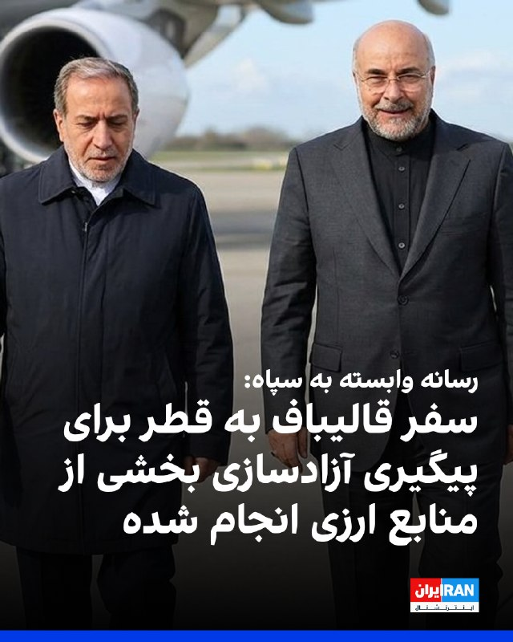

خبرگزاری تسنیم، وابسته به سپاه پاسداران نوشت: «سفر محمدباقر قالیباف به قطر با هدف پیگیری آزادسازی بخشی از منابع ارزی انجام شده است.»

تسنیم به نقل از یک منبع نزدیک به تیم مذاکره‌کننده نوشت: «در پیش‌نویس یادداشت تفاهم ۱۴ بندی، آزادسازی ۲۴ میلیارد دلار از منابع بلوکه‌شده پیش‌بینی شده و تهران خواستار دسترسی به ۱۲ میلیارد دلار آن همزمان با اعلام تفاهم است.»

بر اساس گزارش تسنیم قرار است باقی این مبلغ ظرف ۶۰ روز منتقل شود و سفر قالیباف نیز برای هماهنگی درباره نحوه اجرای این مرحله و رفع موانع انجام شده است.

تسنیم به نقل از یک منبع دیگر درباره سخنان سخنگوی وزارت خارجه قطر درباره ندادن پول برای ضمانت تفاهم تهران و واشینگتن نوشت: «منابع مورد بحث در دوحه متعلق به جمهوری اسلامی است و ارتباطی با ضمانت توافق ندارد و تهران با توجه به تجربه‌های گذشته، با سخت‌گیری این روند را دنبال می‌کند.

گزارش تسنیم در حالی است که پیش از این، خبرگزاری صداوسیما وجود تفاهم‌نامه‌ای ۱۴ بندی را تکذیب کرده بود.
‌🏁 🇬🇧 IranintlTV

🤖 @VahidOOnLine

## VahidOOnLine — post 242252

  <a href="telegram/content/VahidOOnLine_242252_1779788693.mp4" target="_blank">🎬 Download video</a>

♦️مارکو روبیو، وزیر امور خارجه ایالات متحده روز سه‌شنبه پنجم خرداد با تاکید بر بازگشایی تنگه هرمز «به هر طریقی» گفت هیچ کشوری در جهان، ازجمله چین و روسیه با نظام پرداخت عوارض برای عبور از این شاهراه حیاتی موافق نیستند.

این سخنان ساعاتی پس از حمله دوباره نظامیان آمریکا به اهداف نظامی جمهوری اسلامی در منطقه خلیج فارس و تنگه هرمز بیان شد.

بازگشایی تنگه هرمز یکی از موضوعات کلیدی در مذاکرات پایان جنگ میان تهران و واشنگتن است. جمهوری اسلامی در هفته نخست آغاز جنگ در اسفندماه سال گذشته، تنگه هرمز را بست. با وجود اعلام آتش‌بس و محاصره دریایی بنادر ایران، عبور و مرور کشتی‌ها و نفتکش‌ها از این تنگه همچنان به ندرت انجام می‌شود.
‌🇸🇦 Indypersian

🤖 @VahidOOnLine

## VahidOOnLine — post 242251

  

عرفان صدیق، سفیر بریتانیا در عراق، در مصاحبه با کانال یک عراق، سازمان حشدالشعبی و گروه‌های مسلح وابسته به جمهوری اسلامی را «مافیا» خواند.

او تاکید کرد این گروه‌ها با سوءاستفاده از ضعف دولت عراق، قراردادهای شرکت‌های بریتانیایی با بغداد را تصاحب کرده‌اند.
iranintl
‌🏁 🇬🇧 IranintlTV

🤖 @VahidOOnLine

## VahidOOnLine — post 242250

  

علی نیکزاد، نایب‌رییس مجلس، گفت: «از آغاز جنگ نمایندگان تمایل داشتند جلسات صحن علنی برگزار شود اما نهادهای اطلاعاتی و امنیتی با این موضوع موافقت نکردند.»

او افزود: «جلسات مجلس در حال حاضر به‌صورت وبیناری برگزار می‌شود و در صورت فراهم شدن شرایط، نشست‌ها دوباره به شکل حضوری در صحن علنی برگزار خواهد شد.»

این در حالی است که از زمان آغاز جنگ در ۹ اسفند ۱۴۰۴، جلسات صحن علنی مجلس تعطیل شده و حتی انتخابات هیات رییسه در روز دوشنبه نیز در مکانی نامعلوم برگزار شده بود.
‌🏁 🇬🇧 IranintlTV

🤖 @VahidOOnLine

## VahidOOnLine — post 242249

  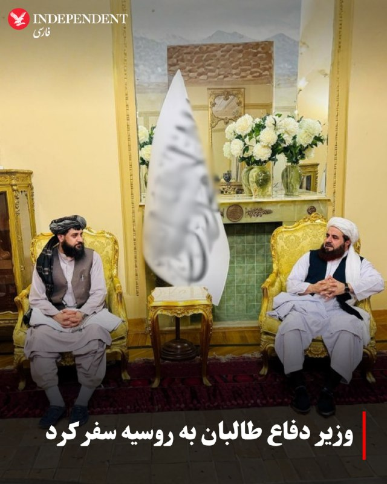

⭕️وزیر دفاع طالبان به روسیه سفر کرد

♦️وزارت دفاع رژیم طالبان سه‌شنبه ۵ جوزا/ خرداد اعلام کرد ملا یعقوب مجاهد، وزیر دفاع این رژیم،  به منظور شرکت در کنفرانس امنیتی به شهر مسکو، پایتخت روسیه سفر کرده است.

بر اساس این اطلاعیه، کنفرانس یادشده «با حضور مقام‌های امنیتی و دفاعی شماری از کشورهای منطقه و جهان» برگزار می‌شود و ملا یعقوب قرار است در این نشست درباره امنیت منطقه‌ و چالش‌های امنیتی مشترک صحبت کند.

روسیه تنها کشور جهان است که رژیم طالبان را به رسمیت شناخته است.
‌🇸🇦 Indypersian

🤖 @VahidOOnLine

## VahidOOnLine — post 242248

  

خبرگزاری صداوسیما نوشت که گزارش شبکه العربیه درباره وجود یک یادداشت تفاهم ۱۴ بندی میان جمهوری اسلامی و آمریکا صحت ندارد.

در گزارش شبکه العربیه پیش‌نویس توافق شامل موضوعاتی مانند بازگشایی تنگه هرمز، آغاز مذاکرات هسته‌ای و نحوه آزادسازی پول‌های بلوکه‌شده است.

خبرگزاری صداوسیما افزود: «تمامی این موارد از سوی منابع رسمی جمهوری اسلامی رد شده و چنین یادداشت تفاهمی وجود ندارد.»
‌🏁 🇬🇧 IranintlTV

🤖 @VahidOOnLine

## VahidOOnLine — post 242247

  

نت‌بلاکس، نهاد ناظر بر اختلال‌های اینترنتی در جهان، سه‌شنبه گزارش داد قطعی اینترنت در ایران اکنون وارد هشتادوهشتمین روز خود شده و مردم پس از بیش از دو هزار و ۸۸ ساعت همچنان در تاریکی دیجیتال به سر می‌برند.
این در حالی است که دولت در ایران وعده اتصال اینترنت بین‌المللی را داد است.
‌🏁 🇬🇧 IranintlTV

🤖 @VahidOOnLine

## VahidOOnLine — post 242246

  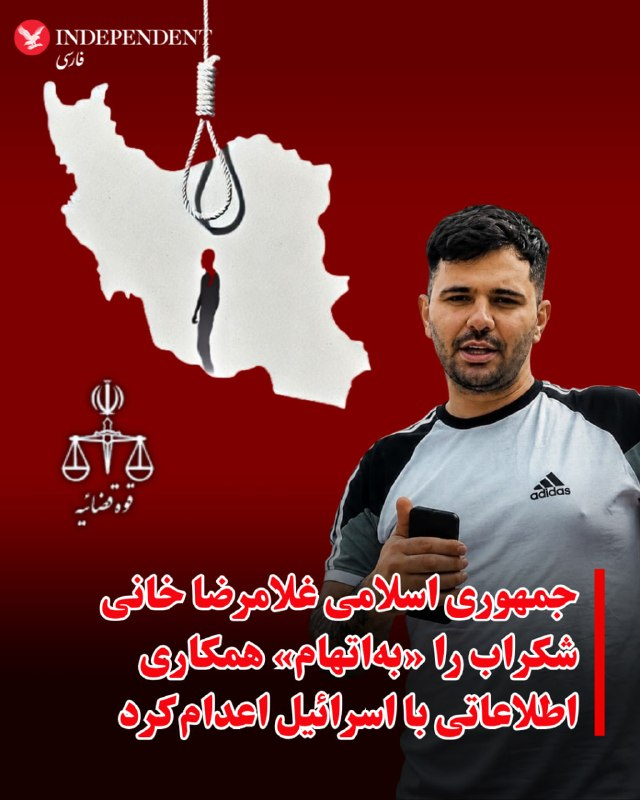

♦️میزان، خبرگزاری قوه قضائیه جمهوری اسلامی، روز سه‌شنبه پنجم خردادماه از اعدام غلامرضا خانی شکراب به اتهام «همکاری اطلاعاتی و جاسوسی به نفع اسرائیل» خبر داد.

یک روز پیش از این، خبرگزاری فارس، وابسته به سپاه پاسداران از صدور حکم اعدام برای این متهم خبر داده و نوشته بود که او «در یک عملیات پیچیده اطلاعاتی به داخل کشور هدایت شده بود.»

سازمان‌های مدافع حقوق بشر در هفته‌های گذشته درباره احتمال اعدام این ورزشکار پیشین و مربی رشته رزمی ام‌ام‌آی ۳۴ ساله و اهل اردبیل هشدار داده بودند. براساس گزارش این نهادها او پیش از بازداشت، در ترکیه زندگی می‌کرد.

قوه قضائیه ادعا می‌کند که غلامرضا خانی شکراب «سرپل شبکه جاسوسی اسرائیل» بوده است. دادگاه رسیدگی کننده به پرونده این شهروند ایرانی او را «تعرض و اسیدپاشی به خودروهای افراد مورد نظر موساد، ایجاد خسارت و آتش‌زدن اموال عمومی، انجام اقدامات و عملیات‌های خرابکارانه، تهیه بمب و ارسال آن به تهران جهت ایجاد انفجار وناامنی در چندین نقطه مختلف و ارسال تصاویر نقاط مدنظر افسر موساد» متهم کرده است.

خبرگزاری میزان و دیگر رسانه‌های حکومتی، این جوان ۳۴ ساله را متهم به تلاش برای فراهم کردن مقدمات «ترور یک خاخام یهودی در یکی از کشورهای منطقه به دستور موساد» هم متهم کرده اند.

گزاشگر ویژه حقوق بشر سازمان ملل متحد و نهادهای بین‌المللی دفاع از حقوق بشر تاکید می‌کنند که متهمان پرونده‌های امنیتی در ایران از حق دسترسی به وکیل انتخابی و داشتن روند دادرسی عادلانه محرومند.
‌🇸🇦 Indypersian

🤖 @VahidOOnLine

## VahidOOnLine — post 242245

  

فاطمه مهاجرانی، سخنگوی دولت در نشست خبری خود گفت: «یکی از مشکلات مذاکرات، تناقض‌گویی‌های طرف مقابل است و جمهوری اسلامی از نظر دیپلماتیک و نظامی در سطح بالایی قرار دارد.»
او افزود: «در خصوص محاصره دریایی دولت راه‌های جایگزین را از قبل طراحی کرده و مشکلی از این نظر وجود ندارد.»
‌🏁 🇬🇧 IranintlTV

🤖 @VahidOOnLine

## VahidOOnLine — post 242244

  

قوه قضاییه جمهوری اسلامی اعلام کرد غلامرضا خانی شکراب، زندانی سیاسی با اتهام «همکاری اطلاعاتی و جاسوسی برای اسرائیل» اعدام شده است. بر اساس این گزارش، حکم او پس از تایید در دیوان عالی کشور اجرا شده است.

این گزارش پس از آن منتشر شد که نهادهای حقوق بشری درباره وضعیت خانی شکرآب، ورزشکار و زندانی سیاسی محکوم به اعدام، هشدار داده بودند.

سازمان حقوق بشر ایران ۳۱ اردیبهشت اعلام کرد خانی شکراب پس از انتقال از زندان اوین به سلول انفرادی در زندان قزل‌حصار، در معرض خطر اجرای قریب‌الوقوع حکم اعدام قرار دارد.

بر اساس گزارش این نهاد، خانی شکرآب دوم مهر ۱۴۰۴ بازداشت و به اتهام «همکاری با اسرائیل و مشخصا سازمان اطلاعاتی موساد» محاکمه و به اعدام محکوم شده بود.
‌🏁 🇬🇧 IranintlTV

🤖 @VahidOOnLine

## VahidOOnLine — post 242243

  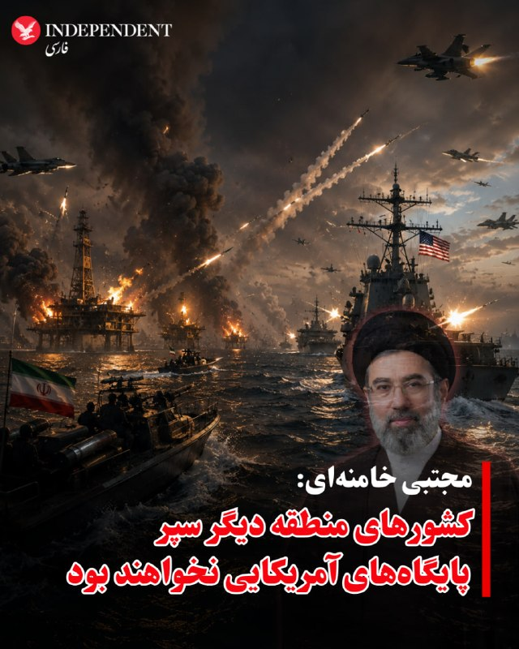

♦️مجتبی خامنه‌ای، سومین رهبر جمهوری اسلامی در پیامی که روز سه‌شنبه پنجم خرداد و به مناسبت حج منتشر کرد، مدعی شد که کشورهای منطقه، پس از جنگ اخیر با اسرائیل و ایالات متحده، «دیگر سپر پایگاه‌های آمریکایی نخواهند بود.»
 از زمان انتصاب مجتبی خامنه‌ای به رهبری جمهوری اسلامی در اسفندماه سال گذشته، هیچ صدا و تصویری از او منتشر نشده است.

در آخرین پیام منتسب به مجتبی خامنه‌ای، او با تمجید از عملکرد نیروهای مسلح جمهوری اسلامی در جریان جنگ ۱۲ روزه و جنگ اخیر با اسرائیل و آمریکا آورده است: «عقربه زمان به عقب برنمی‌گردد و ملت ها و سرزمین های منطقه، دیگر سپر پایگاه های آمریکایی نخواهند بود. آمریکا علاوه بر آنکه دیگر، نقطه امنی برای شرارت و استقرار پایگاه نظامی در منطقه نخواهد داشت، روز به روز از وضع سابق خود فاصله می گیرد.»

مجتبی خامنه‌ای در همین پیام ملت‌ها و دولت‌های منطقه را به اتحاد برای تامین امنیت دعوت کرده است.
‌🇸🇦 Indypersian

🤖 @VahidOOnLine

## VahidOOnLine — post 242242

  

انور قرقاش، مشاور دیپلماتیک رییس امارات متحده عربی، گفت جنگ‌ها ممکن است چالش‌های مقطعی ایجاد کنند، اما امارات متحده عربی بر پایه‌هایی استوار بنا شده که آن را برای انسجام و عبور از بحران‌ها توانمندتر می‌کند.

او افزود: «موفقیت امارات متحده عربی نتیجه دیدگاهی ریشه‌دار و کار مخلصانه و مستمر در طول سال‌ها است و این کشور با اعتماد و ثبات از چالش‌ها عبور خواهد کرد.»
‌🏁 🇬🇧 IranintlTV

🤖 @VahidOOnLine

## VahidOOnLine — post 242241

  

ناصر آراسته، جانشین رییس مشاوران نظامی خامنه‌ای، گفت: «آمریکا در آینده جایگاهی در خلیج فارس نخواهد داشت و این موضوع چه با جنگ و چه بدون جنگ محقق می‌شود.»

آراسته افزود دیپلمات‌ها باید در کنار نیروهای مسلح برای «پاکسازی منطقه از پایگاه‌های آمریکایی» بایستند.

او درباره آمادگی نیروهای مسلح جمهوری اسلامی گفت: «کنترل تردد در تنگه هرمز در اختیار نیروی دریایی سپاه است و کشتی‌های خارجی بدون مجوز تهارن امکان عبور ندارند.»
‌🏁 🇬🇧 IranintlTV

🤖 @VahidOOnLine

## VahidOOnLine — post 242240

  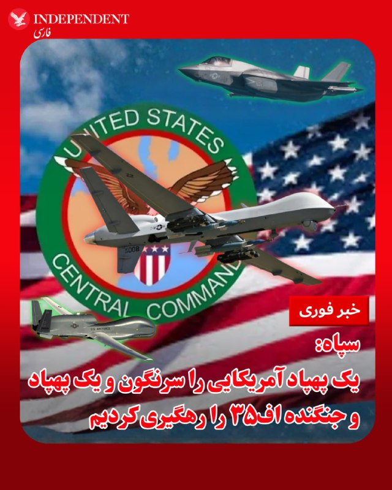

♦️سپاه پاسداران در این بیانیه بدون اشاره به زمان این رویارویی، آمریکا را به «ماجراجویی مداخله گرانه در منطقه و رفتارهای متجاوزانه» متهم کرده و  آورده است آمریکا «وارد حریم هوایی ایران شد و یگان های پدافندی سپاه پاسداران در راستای دفاع از حریم سرزمینی کشورمان پس از پایش های اطلاعاتی دقیق، یک فروند پهپاد ام‌کیو۹را شناسایی و ساقط کرد. همچنین با شلیک به یک فروند پهپاد آرکیو۴و جنگنده متجاوز اف۳۵ آنان را وادار به فرار و خروج از حریم سرزمینی کرد.»

 سپاه پاسداران در پایان همین بیانیه درباره «هرگونه نقض آتش‌بس» از طرف آمریکا هشدار داد و اعلام کرد: «حق پاسخ متقابل را برای خود مشروع و قطعی می‌داند.»

ستاد فرماندهی مرکزی ایالات متحده (سنتکام) در نخستین ساعات بامداد سه‌شنبه اعلام کرد چند قایق تندروی سپاه و یک پایگاه پرتاب موشک را در خلیج فارس و در جریان یک ماموریت دفاعی هدف قرار داده است. با این حال، سنتکام تاکید کرد که «آتش‌بس» میان آمریکا و جمهوری اسلامی ایران همچنان پابرجاست.
‌🇸🇦 Indypersian

🤖 @VahidOOnLine

## VahidOOnLine — post 242239

  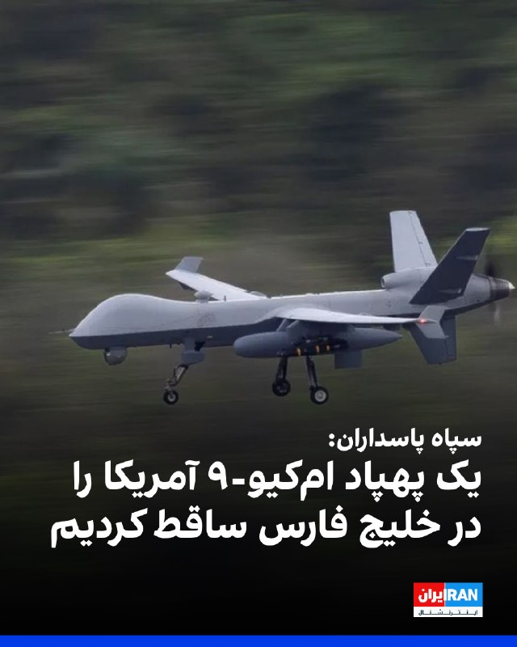

روابط عمومی سپاه پاسداران در اطلاعیه‌ای اعلام کرد یگان‌های پدافندی سپاه پس از «پایش‌های اطلاعاتی دقیق»، یک پهپاد ام‌کیو-۹ آمریکا را در منطقه خلیج فارس شناسایی، رهگیری و ساقط کرده‌اند.

در این اطلاعیه آمده است یک پهپاد آرکیو-۴ و یک جنگنده اف-۳۵ نیز پس از شلیک پدافند سپاه، مجبور به فرار و خروج از حریم سرزمینی ایران شدند.

سپاه همچنین نسبت به هرگونه نقض آتش‌بس از سوی ارتش آمریکا هشدار داد و اعلام کرد حق پاسخ متقابل را برای خود «مشروع و قطعی» می‌داند.
‌🏁 🇬🇧 IranintlTV

🤖 @VahidOOnLine

## VahidOOnLine — post 242238

  

مسعود پزشکیان در نشست با فرماندهان و مدیران وزارت دفاع گفت که توان تهاجمی نیروهای مسلح باعث غافلگیری دشمن شده است.
او گفت که توان دفاعی کشور نتیجه آمادگی و فعالیت نیروهای مسلح است و افزود: «دولت رسیدگی به معیشت و مسکن این نیروها را در اولویت قرار داده است.

پزشکیان افزود: «صنعت دفاعی باید سریع‌تر به سمت فناوری‌های نوین حرکت کند.»
‌🏁 🇬🇧 IranintlTV

🤖 @VahidOOnLine

## VahidOOnLine — post 242237

  <a href="telegram/content/VahidOOnLine_242237_1779788706.mp4" target="_blank">🎬 Download video</a>

ویدیوهای منتشرشده، تصاویری از جاویدنام فاطمه عباسی و مزار گلباران‌شده او را نشان می‌دهند. عباسی، ۳۱ ساله و دانشجوی دانشگاه هنر اصفهان، ۱۹ دی‌ در بلوار کشاورز اصفهان هنگامی‌ که در حال کمک و پناه دادن به مجروحین بود با اصابت گلوله به گردنش مجروح و دچار قطع نخاع شد. او ۲۱ اسفند در بیمارستان جان باخت.
‌🏁 🇬🇧 IranintlTV

🤖 @VahidOOnLine

## VahidOOnLine — post 242236

🗣روایت شما از بحران اقتصادی و زندگی در آتش‌بس- سه‌شنبه ۵ خرداد:

🔹مملکت ببی در و پیکر شده؛ پلیس به خاطر ندادن پول، مرا به کلانتری ۱۱۶ مولوی (پارک هرندی) برد، کتک زد و به خانواده‌ام فحش داد. قصدش گرفتن ۵ میلیون رشوه بود، اما نهایتاً ۲ میلیون گرفتند و آزاد کردند.

🔹حداقل بیمه تامین اجتماعی اجباری ۷ میلیون و ۴۰ هزار تومان و اختیاری ۵ میلیون و ۵۰۰ هزار تومان شده. در عادی‌ترین بیماری مثل آنفولانزا، قیمت ویزیت ۳۰۰ هزار تومان، دارو ۷۰۰ هزار تومان تا یک میلیون تومان و قیمت تزریقات از ۴۰۰ هزار تومان به بالاست.

🔹گرانی بیداد می‌کنه و دزدی‌ها شدت گرفته. در روستای کوچک ما، یک نیسان قرمز یک بشکه گازوئیل از ما دزدید.

🔹در هفته جاری خیلی از سیم‌کارت‌های شهروندان را با عنوان «مدیریت خاص» دو طرفه مسدود کردند. معلوم نیست از طرف کدام ارگان قطع شده‌ایم.

🔹یک ورق داروی استانبنوفن ساده شده ۲۷ هزار تومان. قبلا ۲ هزار تومان هم نبود.

🔹مرغ شده کیلویی ۴۶۵ هزار تومان، سینه مرغ کیلویی حدود ۸۰۰ هزار تومان. خیلی‌ها دیگر توانایی خرید ندارند.

🔹ما آنلاین‌شاپ‌ها که بیشتر از امارات خرید می‌کردیم، بیش از ۳ ماه است که بیکاریم. وضعیت اینترنت هم ما را به خاک سیاه نشانده است.

🔹شرکت کروز تهران از فروردین تا اردیبهشت ماه حقوق و پاداش کار کارگران را نداده است. نه تنها افزایش حقوق نداشتیم، بلکه از سال پیش حقوقمان کمتر هم شده است.
‌🏁 🇬🇧 IranintlTV

🤖 @VahidOOnLine

## VahidOOnLine — post 242235

  

در پیامی منتسب به مجتبی خامنه‌ای که رسانه‌های ایران منتشر کردند، نوشته شده که اسرائیل «به مراحل پایانی عمر منحوس خود نزدیک شده است.»

در این پیام به وعده علی خامنه‌ای در سال ۱۳۹۴ اشاره و تاکید شده که اسرائیل «۲۵ سال بعد از آن تاریخ را نخواهد دید.»

علی خامنه ای، رهبر کشته‌شده جمهوری اسلامی، ۱۸ شهریور ۱۳۹۴ گفته بود که اسرائیل، «۲۵ سال آینده را نخواهد دید.»

در بخشی از این پیام آمده است: «امسال مسئله برائت از مشرکان اهمیتی مضاعف دارد و عمق و گستره‌ی برائت از آمریکا و اسرائیل، فراتر از آیین برائت در موسم و میقات حج است و در نقاط مختلف ایران و جهان پس از این ایام مبارک، مرگ بر آمریکا و مرگ بر اسرائیل، شعار رایج امت اسلامی و مظلومان عالم خصوصا جوانان خواهد بود.»
‌🏁 🇬🇧 IranintlTV

🤖 @VahidOOnLine

## WithYashar — post 12536

سپاه: حق پاسخ به حمله دیشب امریکایی رو برای خود محفوظ نگه میداریم
@withyashar

## WithYashar — post 12535

@withyashar جنبش صهیونیسم

## WithYashar — post 12534

منبعی آگاه به «اتاق جنگ با یاشار» گفت که در شروط توافق این مورد تأکیید شده که ترامپ باید ختنه کند.🤣
@withyashar

## WithYashar — post 12533

@withyashar ماجرای ری اکشن

## WithYashar — post 12532

## WithYashar — post 12531

فارس : امشب ساعت ۲۱؛ ملت ایران فریاد «الله‌اکبر» سر می‌دهند
@withyashar
ای کپی کارای کثیف پس ما هم با جواید شاه میشوریم میبریمش ! من قبلش‌اعلام مانور دادم 😐😂

## WithYashar — post 12530

اتاق جنگ با یاشار : از امشب ، برای فراخوان اینترنتی ( ارتباط باشاهزاده و شنیده شدن صدای ما ) در دوشنبه دیگه هر‌شب مانور میریم و تقسیم وظایف میکنیم !💥

## WithYashar — post 12527

کابینه امنیتی اسرائیل امروز تشکیل می‌شود

کانال ۱۳ رژیم اسرائیل گزارش داد که کابینه امنیتی رژیم اسرائیل عصر امروز در ساعت ۱۹:۰۰ به وقت محلی تشکیل می‌شود.
@withyashar

## WithYashar — post 12526

یک منبع آگاه اسرائیلی روز سه‌شنبه اعلام کرد که ارتش اسرائیل در روزهای آینده خود را برای گسترش عملیات‌ها و حملات هوایی در لبنان آماده می‌کند. سی‌ان‌ان : این منبع تأکید کرد تحرکات نظامی اسرائیلی قریب‌الوقوع «با هماهنگی ایالات متحده» انجام می‌شود. @withyashar

## WithYashar — post 12525

@withyashar این پست به درخواست شما منتشر میشود

## WithYashar — post 12524

  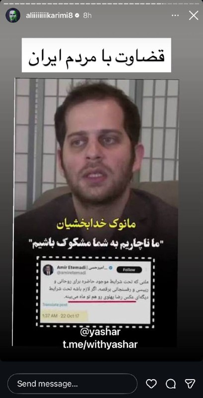

استوری جدید علی کریمی
@withyashar
یاشار : کاری با انتقاد ندارم ولی ایشون باید راهشو از پشمک نادان جدا کنه…

## WithYashar — post 12523

سخنگوی وزارت خارجه قطر: اینکه گفتن قطر 12 میلیارد دلار از پول‌های بلوکه شده ایران رو قراره پرداخت کنه کاملا کذبه و از این خبرا نیست! @withyashar

## WithYashar — post 12522

رئیس‌جمهور روسیه، ولادیمیر پوتین، قانونی را امضا کرد که اجازه می‌دهد از نیروهای نظامی برای حفاظت از شهروندان روسیه در خارج از کشور که توسط دادگاه‌های خارجی یا دادگاه‌های بین‌المللی دستگیر، بازداشت، زندانی یا تحت پیگرد قرار می‌گیرند، استفاده شود.

این قانون در مواردی اعمال می‌شود که دادگاه‌ها بدون مشارکت روسیه عمل می‌کنند و صلاحیت آن‌ها بر اساس معاهده بین‌المللی شامل روسیه یا قطعنامه شورای امنیت سازمان ملل نیست.
@withyashar

## WithYashar — post 12521

دایرکت رو دیگه باز‌نمیکنم

## WithYashar — post 12520

## WithYashar — post 12519

  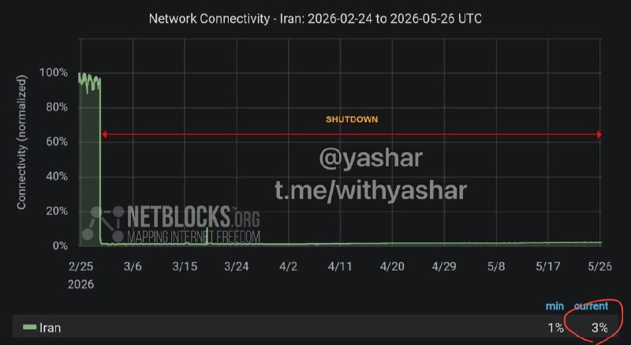

نت‌بلاکس آپدیت جدیدی از وضعیت اینترنت بین‌الملل ایران منتشر کرد
اینترنت ایران اکنون از ۱٪ وصل به ۳٪ افزایش پیدا کرده … داره یه چیزایی میشه…
@withyashar

## WithYashar — post 12517

  <a href="telegram/content/WithYashar_12517_1779788711.mp4" target="_blank">🎬 Download video</a>

«تجمعات بابل» اخطار ! دیدن این ویدیو ممکن است باعث بی اختیاری‌ادرار شود ⚠️😂
@withyashar

## WithYashar — post 12516

فاکس نیوز گزارش می‌دهد بعید است حادثه دیشب تاثیر بالای بر روی روند مذاکرات داشته باشد و در صورت نزدیک بودن توافقی هر دو طرف بر سر یک برخورد معامله را بر هم نمی‌زنند
@withyashar

## WithYashar — post 12515

شبکه «سی‌ان‌ان»: برای نخستین باز از زمان آغاز جنگ ایران و آمریکا، یک نفت‌کش ژاپنی از تنگه هرمز عبور کرد.
@withyashar

## WithYashar — post 12514

کانال 12 اسراییل: مجتبی خامنه‌ای هنوز توافقات شکل‌گرفته را تایید نکرده
@withyashar

## mwarmonitor — post 9733

🔴ارتش اسرائیل (IDF) به ساکنان شهر نباتیه در جنوب لبنان هشدار تخلیه صادر کرد و از آن‌ها خواست فوراً منطقه را ترک کرده و به شمال رودخانه زهرانی منتقل شوند.

🔸در این هشدار، ارتش اسرائیل اعلام کرده است که این اقدام به دلیل نقض آتش‌بس از سوی حزب‌الله انجام شده و به ساکنان هشدار داده شده که افراد نزدیک به مواضع این گروه در معرض خطر قرار دارند.

@mwarmonitor

## mwarmonitor — post 9732

🔸دادستان‌های اسرائیل در حال بررسی طرح اتهامات کیفری علیه رئیس دفتر بنیامین نتانیاهو، یعنی تساحی برافرمان هستند.

🔹این اتهامات احتمالی شامل تقلب، نقض اعتماد و مانع‌تراشی در روند عدالت است و به نشت ادعایی یک سند اطلاعاتی فوق‌محرمانه به روزنامه آلمانی بیلد مرتبط می‌شود.

@mwarmonitor

## mwarmonitor — post 9731

🔴خبرگزاری آسوشیتدپرس: میانجی‌گری قطر توانسته است به یک تفاهم میان آمریکا و ایران درباره «دارایی‌های مسدود شده» دست یابد.

🔸انتظار می‌رود ایالات متحده و ایران امروز توافقی را درباره «پول‌های مسدود شده» اعلام کنند.

@mwarmonitor

## mwarmonitor — post 9730

📝 واقعاً آدم دلش برای این پیرمرد مو نارنجی کباب می‌شود؛ طفلکی هر چه بیشتر تلاش می‌کند تا ادای یک غول بی‌شاخ‌ودمِ تحریم‌کننده را درآورد، بیشتر شبیه پدربزرگ مهربان و باگذشتی می‌شود که مأموریتش در زندگی فقط «نه نگفتن» به خواسته‌های تهران است. اصلاً این حجم از…

## mwarmonitor — post 9729

🔴رسانه‌های اسرائیلی: اسرائیل بسیج اضطراری نیروهای ذخیره را آغاز کرده است؛ از جمله یگان‌های توپخانه‌ای که به‌تازگی از خدمت ترخیص شده بودند. این اقدام در چارچوب افزایش آمادگی‌ها برای عملیات دفاعی گسترده در لبنان و در پی ادامه حملات حزب‌الله و نقض آتش‌بس انجام می‌شود.

@mwarmonitor

## pm_afshaa — post 91521

سپاه: حق پاسخ به حمله دیشب امریکایی رو برای خود محفوظ نگه میداریم

💧 Rainbet.com the #1 Non-KYC Crypto Casino & Sportsbook @rainbetcom

😁 @Pm_Afshaa

## pm_afshaa — post 91520

🔴کانال 14 اسراییل:
مجتبی خامنه‌ای، پسر رهبر ایران، روز سه‌شنبه تهدیدی مستقیم و شدید علیه اسرائیل و ایالات متحده مطرح کرد. رهبر ایران گفت: «اسرائیل به «پایان» موجودیت خود نزدیک می‌شود.» او همچنین تهدیدی علیه واشنگتن اضافه کرد: {کشورها و سرزمین‌های منطقه دیگر به عنوان سپری برای پایگاه‌های آمریکا عمل نخواهند کرد. ایالات متحده روز به روز از جایگاهی که در گذشته داشت، فاصله می‌گیرد}

💧 Rainbet.com the #1 Non-KYC Crypto Casino & Sportsbook @rainbetcom

😁 @Pm_Afshaa

## pm_afshaa — post 91519

  

غلامرضا خانی شکراب از معترضین دی ماه ، امروز با اذان صبح اعدام شد

💧 Rainbet.com the #1 Non-KYC Crypto Casino & Sportsbook @rainbetcom

😁 @Pm_Afshaa

## pm_afshaa — post 91518

🔴منابع عبری:اسرائیل فراخوان اضطراری ذخیره‌ها را آغاز کرده از جمله نیروهای توپخانه‌ای که اخیراً از خدمت مرخص شده‌اند

💧 Rainbet.com the #1 Non-KYC Crypto Casino & Sportsbook @rainbetcom

😁 @Pm_Afshaa

## pm_afshaa — post 91517

کانال 13 اسرائیل: جلسه کابینه داخلی امروز در پی تشدید تنش‌ها در لبنان و توافق احتمالی با ایران برگزار می‌شود

💧 Rainbet.com the #1 Non-KYC Crypto Casino & Sportsbook @rainbetcom

😁 @Pm_Afshaa

## pm_afshaa — post 91516

سیتنا: آزاد سازی اینترنت به تعویق افتاد

💧 Rainbet.com the #1 Non-KYC Crypto Casino & Sportsbook @rainbetcom

😁 @Pm_Afshaa

## pm_afshaa — post 91515

کانال 12 اسراییل: مجتبی خامنه‌ای هنوز توافقات شکل‌گرفته را تایید نکرده

💧 Rainbet.com the #1 Non-KYC Crypto Casino & Sportsbook @rainbetcom

😁 @Pm_Afshaa

## pm_afshaa — post 91514

از سپاه فقط یه پا مونده که اونم رو هواست هر کی میاد میکنه توش میره😂

## iaghapour — post 2631

اینترنت بین‌الملل وصل بشه یجوری از اینترنت استفاده میکنم اختلال بخوره دوباره قطع بشه.🫠

گوشی باید آپدیت بشه.
ویندوز باید آپدیت بشه.
لینوکس باید آپدیت بشه.
برنامه ها باید آپدیت بشه.
و...

حس میکنم شما هم با من هم نظر هستید 🫣😁

## DEJradio — post 4973

⭕️ قطر پیشنهاد ۱۲ میلیارد دلاری به جمهوری اسلامی را نادرست خواند

سخنگوی وزارت امور خارجهٔ قطر گزارش‌ها دربارهٔ پیشنهاد دوازده میلیارد دلاری دوحه به جمهوری اسلامی را برای نهایی شدن توافق با آمریکا «کاملا بی‌اساس» خواند.
ماجد الانصاری مدعی شد این روایت‌ها با هدف «برهم زدن توافق و تضعیف تلاش‌های دیپلماتیک» منتشر می‌شود.
خبرگزاری حکومتی تسنیم، گزارش داد جمهوری اسلامی در مذاکرات، بر آزادسازی بخشی از پول‌های بلوکه‌شدهٔ خود اصرار کرده است.
اخباری در مورد موافقت قطر با اهدای ۱۲ میلیارد دلار پول با پوشش وام، به جمهوری اسلامی منتشر شده است.
روز دوشنبه محمدباقر قالیباف، عباس عراقچی و رئیس کل بانک مرکزی جمهوری اسلامی سفری از پیش اعلام نشده به دوحه انجام دادند.
رویترز گزارش داد این سفر با موضوع احتمال آزادسازی دارایی‌های مسدودشدهٔ جمهوری اسلامی در چارچوب توافق احتمالی انجام شد.

#خبر #دژ #قطر #مذاکرات
@DEJradio

## DEJradio — post 4972

⭕️ روبیو: پیش از بررسی راه‌های دیگر علیه جمهوری اسلامی هنوز به دیپلماسی فرصت داده‌ایم

مارکو روبیو، وزیر امور خارجهٔ آمریکا، روز سه‌شنبه گفت واشینگتن پیش از بررسی «راه‌های دیگر» علیه رژیم حاکم بر ایران، به دیپلماسی کاملا فرصت می‌دهد.
به گفتهٔ روبیو دستیابی به توافق اولیه با تهران ممکن است چند روز طول بکشد.
او گفت دربارهٔ پیش‌نویس توافق «اتفاق‌نظر» وجود دارد، اما اختلاف بر سر برخی واژه‌ها و جملات هنوز ادامه دارد.
مارکو روبیو به‌سان دونالد ترامپ تأکید کرد یا یک توافق خوب رخ می‌دهد یا توافقی در کار نیست.

#مارکو_روبیو #خبر #دژ
@DEJradio

## DEJradio — post 4971

⭕️ ذخایر اورانیوم جمهوری اسلامی ممکن است زیر نظارت آژانس اتمی نابود شود

دونالد ترامپ، رئیس‌ جمهوری آمریکا گفت اورانیوم غنی‌شده در ایران احتمالا به آمریکا منتقل و نابود می‌شود.
او گفت در غیر این صورت ممکن است با هماهنگی جمهوری اسلامی، این ذخایر در محل یا در یک مکان مورد توافق دیگر، از بین برود.
ترامپ در تروث سوشال نوشت این روند زیر نظر آژانس بین‌المللی انرژی اتمی یا نهادی مشابه انجام می‌گیرد.
باراک راوید، خبرنگار ارشد اکسیوس، موضع تازهٔ ترامپ را عقب‌نشینی واشینگتن از خواستهٔ پیشین برای خروج کامل ذخایر اورانیوم از ایران عنوان کرد.
در همین راستا بنیامین نتانیاهو، نخست‌وزیر اسرائیل گفته است بدون خروج ذخایر اورانیوم غنی‌شده از ایران، جنگ پایان نمی‌یابد.

#خبر #ترامپ #اورانیوم
@DEJradio

## DEJradio — post 4970

  <a href="telegram/content/DEJradio_4970_1779788714.mp4" target="_blank">🎬 Download video</a>

🔺📢 یک جانباز جنگ ایران و عراق می‌گوید برای تامین معاش و زندگی روزمره با انبوهی مشکلات جسمی و حرکتی مجبور به مسافرکشی است.

#جانباز #جنگ_ایران_و_عراق
@DEJradio

## DEJradio — post 4969

  <a href="telegram/content/DEJradio_4969_1779788718.webm" target="_blank">🎬 Download video</a>

🔺
✍#یادداشت: فریبرز کرمی‌زند

اخباری منتشر می‌شود مبنی بر اینکه کشورهای حاشیه خلیج فارس تلاش می‌کنند به عنوان میانجی برای مذاکره عمل کنند اما سوال اینجاست؛ چرا کشورهایی که تا همین چند هفته قبل هدف حملات نظام بودند، امروزنگران بقای آن شده‌اند؟

واقعیت این است که نگران خود هستند زیرا از هر زوایه‌ای که بررسی شوند، به مانند اتاق‌هایی شیشه‌ای‌اند؛ هرگونه، بی‌ثباتی منطقه‌ای و ناامنی سرزمینی می‌تواند میلیاردها دلار به اقتصاد و آینده آنان ضربه بزند.
برآورد آنها این است که نظام در لحظات پایانی خود، رفتارهایی تهاجمی‌تری خواهد داشت و دامنه حملات را گسترش می‌دهد. موشک‌ها و پهپادهایی که نمی توانند به اهدافی در اسرائیل یا منافع آمریکا در منطقه اصابت کنند، با ضریب بسیار بالاتری می‌توانند این کشورها را مورد اصابت قرار دهند.

آنها تا چند دهه پیش در فقر به سر می‌بردند و شهروندانشان زندگی بدوی داشتند، امروز به ثروت و زندگی تجملاتی رسیده‌اند و تلاش می‌کنند این جایگاه را تثبیت کنند و می‌دانند که دوران نفت همیشگی نیست و برای حفظ جایگاه اقتصادی و جذب سرمایه‌گذاری، بیش از هرچیز به امنیت و ثبات نیاز دارند؛ به همین دلیل نیز نمی‌خواهند دوباره وارد چرخه ناامنی و درگیری‌های نظامی شوند.

همچنین آنان تصور می‌کنند نظام به دلیل ضرباتی که دریافت کرده و محاصره دریایی، در کنار تحریم‌ها با وضعیت اقتصادی بسیار وخیمی روبروست و حتی در صورت رسیدن به توافق تا مدت‌ها درگیر بحران‌ خواهد بود؛ در نتیجه ترجیح می‌دهند خطر نزدیکتر را با خطری دورتر جایگزین کنند.

در کنار همه این‌ها، در سال‌های گذشته به نظام برای دور زدن تحریم‌ها کمک می‌کردند و عملاً به دالانی برای انتقال پول تبدیل شده بودند، پس از این، دیگر این کار را نخواهند کرد و تلاش می‌کنند با افزایش فشار اقتصادی بر نظام، و تضعیف آن بخشی از انتقام و نگرانی‌های امنیتی خود را از این طریق جبران کنند.

اما واقعیت امر این است این کشورها وزنه سیاسی در عرصه بین‌المللی محسوب نمی‌شوند حتی بزرگترین آنان که عربستان است و تصمیمات سایرین بر اساس خواست آنها گرفته نمی‌شود.

#مذاکرات #خلیج_فارس
@DEJradio

## DEJradio — post 4968

  <a href="telegram/content/DEJradio_4968_1779788719.webm" target="_blank">🎬 Download video</a>

🔺📢 پزشکیان به کارکنان نیروهای مسلح وعده «رفاه» و «مسکن» داد

در شرایطی که بعد از جنگ ۴۰ روزه حتی ارائه خدمات بیمه به پرسنل نیروهای مسلح به دلیل کمبود بودجه محدودتر شد و بسیاری از داروها را باید به صورت آزاد خریداری کنند، مسعود پزشکان روز سه‌شنبه در نشستی با جمعی از فرماندهان و مدیران وزارت دفاع ادعا کرد از نیروهای مسلح «حمایت همه‌جانبه» می‌شود.
او تأکید کرد اولویت دولت، معیشت، رفاه و تأمین مسکن کارکنان نظامی است.

پزشکیان گفت: «پیش از تجهیزات، موشک‌ها و سامانه‌های نظامی، این انسان‌ها هستند که محور اصلی قدرت دفاعی کشور را تشکیل می‌دهند و اگر نیروی انسانی از آرامش، امنیت معیشتی و پشتیبانی لازم برخوردار نباشد، ابزارهای دفاعی نیز کارآمدی لازم را نخواهند داشت.»

با این همه پزشکیان اذعان کرد «با وجود تأکیدات مکرر و پیگیری‌های صورت‌گرفته، روند تأمین مسکن کارکنان نیروهای مسلح همچنان نیازمند اهتمام جدی‌تر، تسریع در اجرا و دستیابی به نتایج ملموس‌تر است.»

#جنگ #نیروهای_مسلح
@DEJradio

## DEJradio — post 4967

  <a href="telegram/content/DEJradio_4967_1779788719.webm" target="_blank">🎬 Download video</a>

🚨📢 مارکو روبیو وزیر خارجه امریکا در گفتگو با خبرنگارانی که در جریان سفرش به شهر جیپور هند او را در هواپیما همراهی می‌کردند، با اشاره به حملات سنتکام به قایق‌های سـ.ـپاه در خلیج فارس گفت: «تنگه هرمز به عنوان یک آبراه بین‌المللی باید به هر شکل ممکن باز نگه داشته شود.»

او در بخش دیگری از اظهارات خود به روند دیپلماتیک جاری اشاره کرد و تصریح کرد: گفت‌وگوها درباره نگارش و فرمول متن توافق با ایران همچنان ادامه دارد.
روبیرو توضیح داد: «این فرآیند ممکن است چند روزی زمان ببرد.»

#جنگ #تنگه_هرمز
@DEJradio

## DEJradio — post 4966

  <a href="telegram/content/DEJradio_4966_1779788720.webm" target="_blank">🎬 Download video</a>

🕐
🔺 فرماندهی مرکزی ایالات متحده آمریکا (سنتکام) در بیانیه‌ای اعلام کرد ارتش آمریکا در جنوب ایران چند سایت پرتاب موشک و قایق‌هایی را که «در حال تلاش برای کارگذاری مین بودند» هدف قرار داد.

این قایق‌ها متعلق به سـ.ـپاه پاسداران بودند و چهار نفر از پاسداران کشته شدند. در چند شهر ایران نیز عملیات پهپادی انجام شده و شهروندان صدای انفجار شنیدند اما رسانه‌های حکومتی جزئیات آن را اعلام نمی‌کنند.

چند منبع تلگرامی نزدیک به سـ.ـپاه قدس، نوشته‌اند که کشته‌های سـ.ـپاه علنی نشد تا در مذاکرات تأثیر نداشته باشد.
این وضعیت بسیاری از طرفداران نظام را خشمگین کرده است، آنها می‌گویند نزدیک به سه ماه است هر شب در خیابان هستیم تا مقاومت کنیم «پشت پرده» مقامات کشور در حال زد و بند با آمریکا هستند.

اکنون با ادامه مذاکرات آنها احساس می‌کنند بازیچه قرار گرفته‌اند. این حملات در شرایی انجام شد که محمدباقر قالیباف رئیس مجلس شورای اسلامی، عباس عراقجی وزیرخارجه و عبدالناصر همتی رئیس کل بانک مرکزی برای مذاکره با آمریکا به قطر رفته‌اند. بعضی از هواداران حکومت از این سه نفر به عنوان توسری‌خورها یاد کرده‌اند. یکی از این کانال‌ها در واکنش به مذاکره آنها با آمریکا نوشت «خاک بر سر ماله کشان.»

#جنگ #IRGCterrorists
@DEJradio

## DEJradio — post 4965

  <a href="telegram/content/DEJradio_4965_1779788720.webm" target="_blank">🎬 Download video</a>

🔺📢 در پی تهدید اسرائیل مبنی بر هدفگیری مقرها و خانه‌های امن نیروهای حـ.ـزب‌الله طرفداران و عناصر این گروه تروریستی دوشنبه شب ۵ خرداد برای در امان ماندن از بمباران از منطقه ضاحیه فرار کردند.

رافی میلوا، فرمانده نیروهای شمال اسرائیل اعلام کرد ارتش اسرائیل دیگر «نمی‌تواند وضعیت فعلی در لبنان را تحمل کند» و هشدار داد جنگ از همین امشب وارد مرحله شدیدتری خواهد شد./او تاکید کرد گروه تروریستی حزب‌الله، جنوب لبنان، بیروت و «هر نقطه‌ای که تروریست‌های این گروه حضور داشته باشند» بهای حملات اخیر را پرداخت خواهند کرد.

#جنگ #لبنان
@DEJradio

## DEJradio — post 4964

  

🛩️
🔥 بامداد سه‌شنبه ۵ خرداد ۱۴۰۵؛ پدافند تهران و قم فعال شدند. کانال تلگرامی نزدیک به سـ.ـپاه قدس نوشت، «شاید باند فرودگاه خمینی را هدف قرار بدهند.»

*تصویر آرشیوی

#جنگ #فرودگاه_خمینی
@DEJradio

## DEJradio — post 4963

  <a href="telegram/content/DEJradio_4963_1779788722.webm" target="_blank">🎬 Download video</a>

🚨📢 جنگنده‌‌های آمریکایی بامداد سه‌شنبه پنجم خرداد ۱۴۰۵ چند قایق تندرو سـ.ـپاه پاسداران را تنگه هرمز در جنوب جزیره لارک مورد هدف قرار دادند. در این حملات دستکم ۴ پاسدار کشته شدند.

برخی منابع غیررسمی گزارش دادند این قایق‌ها شب قبل هدف قرار گرفتند اما برای اینکه روند مذاکرات با آمریکا مختل نشود، سانسور شده بود.

*تصویر آرشیوی

#جنگ #تنگه_هرمز
@DEJradio

## DEJradio — post 4962

  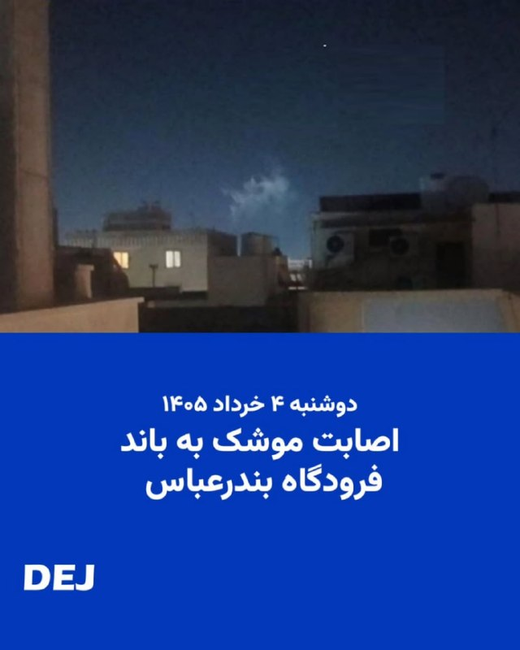

🛩️
🔥 به گزارش منابع خبری داخلی نیمه شب دوشنبه چهارم خرداد ۱۴۰۵ باند فرودگاه بندرعباس مورد اصابت موشک قرار گرفت.
چند هواپیما و پهپاد در آسمان جنوب ایران به پرواز درآمدند.

کانال‌های تلگرامی نزدیک به ســ.ـپاه پاسداران با تایید مانور جنگنده‌ها پیش‌بینی کردند احتمالا هواپیماها متعلق به آمریکا هستند.

#جنگ #فرودگاه_بندرعباس
@DEJradio

## IranIntlTV — post 339069

  

فاطمه مهاجرانی، سخنگوی دولت در نشست خبری خود گفت: «بدیهی است که در شرایطی که در بسیاری از کشورها شاهد افزایش قیمت‌ها هستیم، حجم افزایش قیمت‌ها وجود دارد. اما تاکید می‌کنم تلاش دولت بر این است که قدرت خرید مردم تا حد امکان بالا برود و افزایش یابد.»

او ادامه داد: «هیچ موضوعی راجع به عدد و رقم مطرح نشده ولی این موضوع مطرح شده که باید میزان تولید را مدیریت کنیم.»

او افزود: «در طول جنگ گذشته و جدید آسیب‌هایی دیدیم که کتمان نمی‌کنیم. حدود ۱۰۰ میلیون لیتر در روز ظرفیت تولید بنزین داریم.»
iranintl.com/202605263927

## IranIntlTV — post 339067

  

خبرگزاری تسنیم، وابسته به سپاه پاسداران نوشت: «سفر محمدباقر قالیباف به قطر با هدف پیگیری آزادسازی بخشی از منابع ارزی انجام شده است.»

تسنیم به نقل از یک منبع نزدیک به تیم مذاکره‌کننده نوشت: «در پیش‌نویس یادداشت تفاهم ۱۴ بندی، آزادسازی ۲۴ میلیارد دلار از منابع بلوکه‌شده پیش‌بینی شده و تهران خواستار دسترسی به ۱۲ میلیارد دلار آن همزمان با اعلام تفاهم است.»

بر اساس گزارش تسنیم قرار است باقی این مبلغ ظرف ۶۰ روز منتقل شود و سفر قالیباف نیز برای هماهنگی درباره نحوه اجرای این مرحله و رفع موانع انجام شده است.

تسنیم به نقل از یک منبع دیگر درباره سخنان سخنگوی وزارت خارجه قطر درباره ندادن پول برای ضمانت تفاهم تهران و واشینگتن نوشت: «منابع مورد بحث در دوحه متعلق به جمهوری اسلامی است و ارتباطی با ضمانت توافق ندارد و تهران با توجه به تجربه‌های گذشته، با سخت‌گیری این روند را دنبال می‌کند.

گزارش تسنیم در حالی است که پیش از این، خبرگزاری صداوسیما وجود تفاهم‌نامه‌ای ۱۴ بندی را تکذیب کرده بود.
https://iranintl.com/202605261877

## IranIntlTV — post 339066

  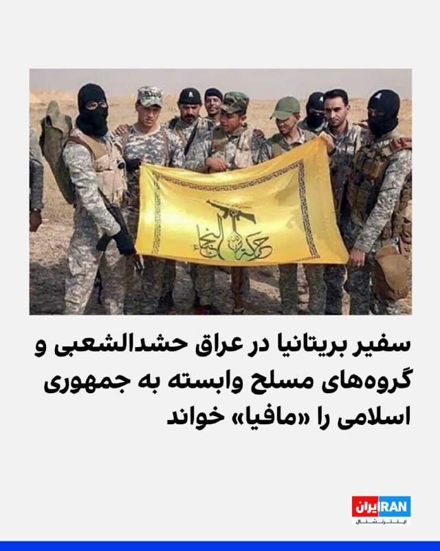

عرفان صدیق، سفیر بریتانیا در عراق، در مصاحبه با کانال یک عراق، سازمان حشدالشعبی و گروه‌های مسلح وابسته به جمهوری اسلامی را «مافیا» خواند.

او تاکید کرد این گروه‌ها با سوءاستفاده از ضعف دولت عراق، قراردادهای شرکت‌های بریتانیایی با بغداد را تصاحب کرده‌اند.
iranintl.com/202605261680

## IranIntlTV — post 339065

  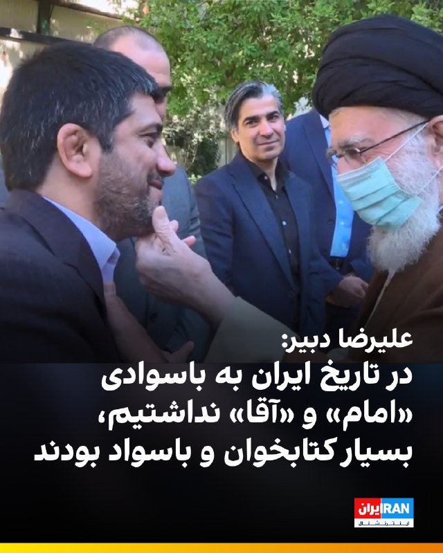

🔻علیرضا دبیر، رییس فدراسیون کشتی در حاشیه رونمایی از سه کتاب گفت: «بروید تاریخ بخوانید، در تاریخ ایران به باسوادی امام و آقا نداشتیم، بسیار کتابخوان و باسواد بودند.» او همچنین درباره جنگ با آمریکا گفت: «ما با اینها جنگ داریم الان هم نشود بعد از جام جهانی می‌آیند.»

🔹دبیر در وصف کتابخوانی خود گفت: «ذهنم را با اطلاعات الکی پر نمی‌کنم، فضای مجازی را دنبال نمی‌کنم که وقتم گرفته نشود و همه به خاطر این کتاب هاست که خواندم.»

🔹او گفت: «من در ایام قهرمانی با دو دست زیر می‌گرفتنم و با دو دست زیر گرفتن را از تیمور لنگ یاد گرفتم. او با دو دست شمشیر می‌زد. این کتاب را می‌خواندم که با دو دست روی اسب شمشیر می‌زد.»

🔹رییس فدراسیون فوتبال با اعتراف به سرسپردگی خود به علی خامنه‌ای، رهبر جمهوری اسلامی، گفت: «شب به شب اخبار را می‌دیدم و آقا تکلیف را مشخص می‌کرد. نتیجه هم گرفتیم هر جا حرف گوش کردیم عاقبت به خیری بود هم در سیاست و هم در ورزش. من محو در آقا بودم، اما الان ولی فقیه و امام ما آقا مجتبی است.»

@iranintltvsport

## IranIntlTV — post 339063

  <a href="telegram/content/IranIntlTV_339063_1779788726.mp4" target="_blank">🎬 Download video</a>

گزارش‌های رسیده به ایران‌اینترنشنال از افزایش فشارهای امنیتی بر دانشجویان دانشگاه شریف در یک ماه اخیر حکایت دارد. بر اساس این گزارش‌ها، نزدیک به ۳۰ دانشجو به کمیته انضباطی احضار شدند. برای شش نفر حکم اخراج و برای شماری دیگر محرومیت چندساله از تحصیل در همه دانشگاه‌ها صادر شده است.
جزییات بیشتر با لیلا سعادتی، عضو تحریریه ایران‌اینترنشنال
@iranintltv

## IranIntlTV — post 339062

  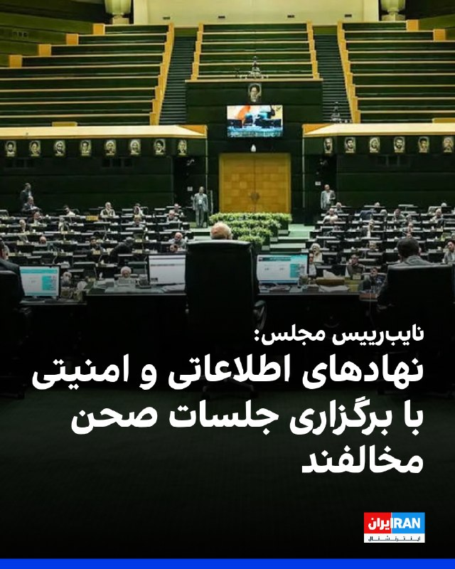

علی نیکزاد، نایب‌رییس مجلس، گفت: «از آغاز جنگ نمایندگان تمایل داشتند جلسات صحن علنی برگزار شود اما نهادهای اطلاعاتی و امنیتی با این موضوع موافقت نکردند.»

او افزود: «جلسات مجلس در حال حاضر به‌صورت وبیناری برگزار می‌شود و در صورت فراهم شدن شرایط، نشست‌ها دوباره به شکل حضوری در صحن علنی برگزار خواهد شد.»

این در حالی است که از زمان آغاز جنگ در ۹ اسفند ۱۴۰۴، جلسات صحن علنی مجلس تعطیل شده و حتی انتخابات هیات رییسه در روز دوشنبه نیز در مکانی نامعلوم برگزار شده بود.
https://iranintl.com/202605264769

## IranIntlTV — post 339061

  <a href="telegram/content/IranIntlTV_339061_1779788729.mp4" target="_blank">🎬 Download video</a>

بررسی‌های ایران‌اینترنشنال نشان می‌دهد جمهوری اسلامی در کمتر از ۷۰ روز، دست‌کم ۳۹ زندانی سیاسی را اعدام کرده است؛ از جمله ۱۵ نفر از بازداشت‌شدگان اعتراضات دی‌ماه ۱۴۰۴.
بیشترین احکام اعدام در استان‌های تهران و البرز اجرا شده است.
@iranintltv

## IranIntlTV — post 339060

  <a href="telegram/content/IranIntlTV_339060_1779788731.mp4" target="_blank">🎬 Download video</a>

یک شهروند با ارسال پیام به ایران‌اینترنشنال می‌گوید: «پلیس هر کاری دلش بخواهد انجام می‌دهد. به خاطر ندادن پول، من را به کلانتری ۱۱۶ مولوی در پارک هرندی تهران بردند، کتک زدند و به خانواده‌ام فحش دادند. قصدشان گرفتن ۵ میلیون رشوه بود که نهایتا دو میلیون گرفتند و آزاد کردند.»

## IranIntlTV — post 339059

  

خبرگزاری صداوسیما نوشت که گزارش شبکه العربیه درباره وجود یک یادداشت تفاهم ۱۴ بندی میان جمهوری اسلامی و آمریکا صحت ندارد.

در گزارش شبکه العربیه پیش‌نویس توافق شامل موضوعاتی مانند بازگشایی تنگه هرمز، آغاز مذاکرات هسته‌ای و نحوه آزادسازی پول‌های بلوکه‌شده است.

خبرگزاری صداوسیما افزود: «تمامی این موارد از سوی منابع رسمی جمهوری اسلامی رد شده و چنین یادداشت تفاهمی وجود ندارد.»
https://iranintl.com/202605260721

## IranIntlTV — post 339058

  <a href="telegram/content/IranIntlTV_339058_1779788734.mp4" target="_blank">🎬 Download video</a>

کلودیا شینباوم، رییس‌جمهوری مکزیک، دوشنبه اعلام کرد دولت او موافقت کرده به تیم ملی فوتبال ایران اجازه دهد در طول رقابت‌های جام جهانی ۲۰۲۶ در مکزیک اقامت داشته باشد.

گفت‌وگو با علیرضا مدیری، عضو تحریریه ایران‌اینترنشنال

@iranintltv

## IranIntlTV — post 339057

  

نت‌بلاکس، نهاد ناظر بر اختلال‌های اینترنتی در جهان، سه‌شنبه گزارش داد قطعی اینترنت در ایران اکنون وارد هشتادوهشتمین روز خود شده و مردم پس از بیش از دو هزار و ۸۸ ساعت همچنان در تاریکی دیجیتال به سر می‌برند.
این در حالی است که دولت در ایران وعده اتصال اینترنت بین‌المللی را داده است.
https://iranintl.com/202605264922

## IranIntlTV — post 339056

  <a href="telegram/content/IranIntlTV_339056_1779788737.mp4" target="_blank">🎬 Download video</a>

سنتکام اعلام کرد ارتش ایالات متحده به اهدافی در ایران در نزدیکی تنگه هرمز حمله کرده است. در همین حال، مارکو روبیو، وزیر امور خارجه آمریکا، در واکنش به این حمله گفت: «تنگه هرمز باید باز بماند و به هر شکلی باز خواهد ماند.»

گفت‌وگو با مرتضی کاظمیان، عضو تحریریه ایران‌اینترنشنال

@iranintltv

## IranIntlTV — post 339055

  <a href="telegram/content/IranIntlTV_339055_1779788739.mp4" target="_blank">🎬 Download video</a>

کلودیا شینباوم، رییس‌جمهوری مکزیک، دوشنبه اعلام کرد دولت او موافقت کرده به تیم ملی فوتبال ایران اجازه دهد در طول رقابت‌های جام جهانی ۲۰۲۶ در مکزیک اقامت داشته باشد.

گفت‌وگو با علیرضا مدیری، عضو تحریریه ایران‌اینترنشنال
@iranintltv

## IranIntlTV — post 339054

  

فاطمه مهاجرانی، سخنگوی دولت در نشست خبری خود گفت: «یکی از مشکلات مذاکرات، تناقض‌گویی‌های طرف مقابل است و جمهوری اسلامی از نظر دیپلماتیک و نظامی در سطح بالایی قرار دارد.»
او افزود: «در خصوص محاصره دریایی دولت راه‌های جایگزین را از قبل طراحی کرده و مشکلی از این نظر وجود ندارد.»
https://iranintl.com/202605265101

## IranIntlTV — post 339053

محمود نبویان، عضو تیم مذاکره‌کننده جمهوری اسلامی، در نامه‌ای به محمدباقر قالیباف، رییس هیات مذاکره‌کننده، خواستار بازگشایی تنگه هرمز در ازای لغو همه تحریم‌های آمریکا شد.

گفت‌وگو با علی شیرازی، عضو تحریریه ایران‌اینترنشنال
@iranintltv

## IranIntlTV — post 339052

  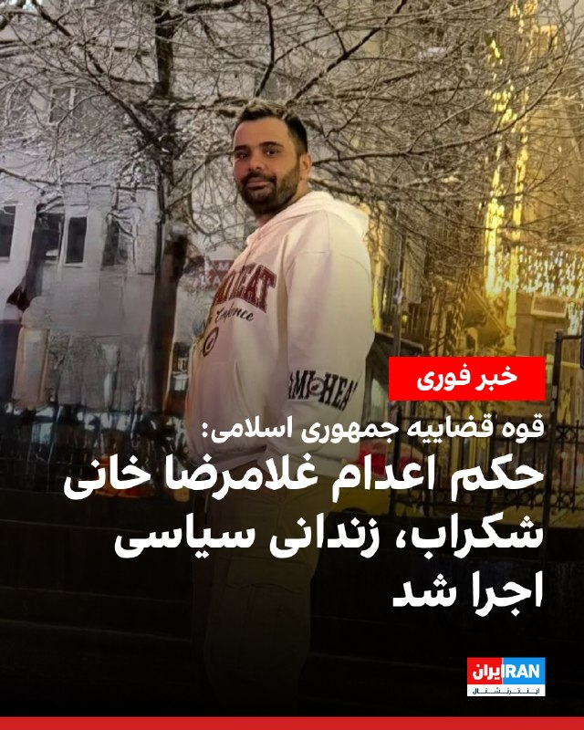

قوه قضاییه جمهوری اسلامی اعلام کرد غلامرضا خانی شکراب، زندانی سیاسی با اتهام «همکاری اطلاعاتی و جاسوسی برای اسرائیل» اعدام شده است. بر اساس این گزارش، حکم او پس از تایید در دیوان عالی کشور اجرا شده است.

این گزارش پس از آن منتشر شد که نهادهای حقوق بشری درباره وضعیت خانی شکرآب، ورزشکار و زندانی سیاسی محکوم به اعدام، هشدار داده بودند.

سازمان حقوق بشر ایران ۳۱ اردیبهشت اعلام کرد خانی شکراب پس از انتقال از زندان اوین به سلول انفرادی در زندان قزل‌حصار، در معرض خطر اجرای قریب‌الوقوع حکم اعدام قرار دارد.

بر اساس گزارش این نهاد، خانی شکرآب دوم مهر ۱۴۰۴ بازداشت و به اتهام «همکاری با اسرائیل و مشخصا سازمان اطلاعاتی موساد» محاکمه و به اعدام محکوم شده بود.
https://iranintl.com/202605264875

## IranIntlTV — post 339051

  

انور قرقاش، مشاور دیپلماتیک رییس امارات متحده عربی، گفت جنگ‌ها ممکن است چالش‌های مقطعی ایجاد کنند، اما امارات متحده عربی بر پایه‌هایی استوار بنا شده که آن را برای انسجام و عبور از بحران‌ها توانمندتر می‌کند.

او افزود: «موفقیت امارات متحده عربی نتیجه دیدگاهی ریشه‌دار و کار مخلصانه و مستمر در طول سال‌ها است و این کشور با اعتماد و ثبات از چالش‌ها عبور خواهد کرد.»
https://iranintl.com/202605262625

## IranIntlTV — post 339050

  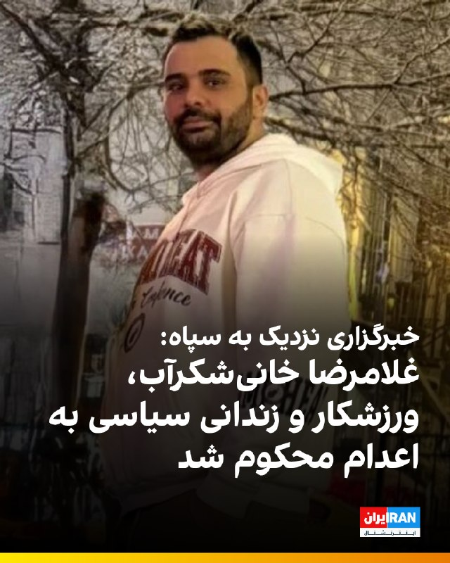

🔻خبرگزاری فارس، وابسته به سپاه پاسداران، از صدور حکم اعدام برای غلامرضا خانی شکرآب خبر داد؛ ورزشکار پیشین ام‌ام‌ای، مربی و داور بین‌المللی این رشته که به «همکاری با اسرائیل» و «هدایت شبکه خرابکاری» متهم شده است.

🔹فارس با روایتی کلی از روند بازداشت او مدعی شده خانی شکرآب «سرپل عملیاتی موساد» بوده و پس از انتقال به ایران، در دادگاه به اعدام محکوم شده است.

🔹با این حال، تاکنون جزئیات مستقلی درباره روند دادرسی، زمان و محل محاکمه، دسترسی او به وکیل انتخابی و مستندات پرونده منتشر نشده است.

🔹منابع مطلع پیش‌تر گفته بودند خانی شکرآب، متولد ۱۳۷۱، پیش از بازداشت در ترکیه زندگی می‌کرد و حدود یک سال پیش در جریان سفری به عراق، توسط عوامل جمهوری اسلامی ربوده و به ایران منتقل شد.

🔹گفته می‌شود حکم اعدام او در شعبه ۱۵ دادگاه انقلاب تهران به ریاست ابوالقاسم صلواتی صادر و در دیوان عالی کشور تایید شده است.

🔹انتشار خبر حکم اعدام او، به‌ویژه پس از انتقال اخیرش از اوین به زندان قزلحصار، نگرانی‌ها درباره احتمال اجرای قریب‌الوقوع این حکم را افزایش داده است.

@iranintltvsport

## IranIntlTV — post 339049

  

ناصر آراسته، جانشین رییس مشاوران نظامی خامنه‌ای، گفت: «آمریکا در آینده جایگاهی در خلیج فارس نخواهد داشت و این موضوع چه با جنگ و چه بدون جنگ محقق می‌شود.»

آراسته افزود دیپلمات‌ها باید در کنار نیروهای مسلح برای «پاکسازی منطقه از پایگاه‌های آمریکایی» بایستند.

او درباره آمادگی نیروهای مسلح جمهوری اسلامی گفت: «کنترل تردد در تنگه هرمز در اختیار نیروی دریایی سپاه است و کشتی‌های خارجی بدون مجوز تهارن امکان عبور ندارند.»
https://iranintl.com/202605264354

## IranIntlTV — post 339048

  <a href="telegram/content/IranIntlTV_339048_1779788746.mp4" target="_blank">🎬 Download video</a>

سنتکام اعلام کرد ارتش ایالات متحده به اهدافی در ایران در نزدیکی تنگه هرمز حمله کرده است. در همین حال، مارکو روبیو، وزیر امور خارجه آمریکا، در واکنش به این حمله گفت: «تنگه هرمز باید باز بماند و به هر شکلی باز خواهد ماند.»

گفت‌وگو با مرتضی کاظمیان، عضو تحریریه ایران‌اینترنشنال
@iranintltv

## Shin_Persian — post 6237

  

↩️ Quoted tweet: DefenceGeek 🇬🇧 ✓ @DefenceGeek Tue, 26 May 2026 09:11:22 UTC Summary of overnight events in CENTCOM --- Operation EPIC FURY / Project FREEDOM --- Ok so not 100% sure if this is all in the right order, but from what I've gathered: - IRGC…

## Shin_Persian — post 6236

↩️ Quoted tweet:
DefenceGeek 🇬🇧 ✓ @DefenceGeek
Tue, 26 May 2026 09:11:22 UTC

Summary of overnight events in CENTCOM
--- Operation EPIC FURY / Project FREEDOM ---

Ok so not 100% sure if this is all in the right order, but from what I've gathered:

- IRGC boats in the gulf were identified approaching commercial shipping and/or trying to lay mines in the

↩️ توییت نقل‌قول شده — برای پاسخ، پست زیر را ببینید.

فارسی

خلاصه‌ای از حوادث شبانه در سنتکام (ستاد فرماندهی مرکزی ایالات متحده - CENTCOM)
--- عملیات خشم حماسی / پروژه آزادی ---

بسیار خب، ۱۰۰٪ مطمئن نیستم که همه این‌ها به ترتیب درست باشند، اما طبق آنچه گردآوری کرده‌ام:

- قایق‌های سپاه پاسداران انقلاب اسلامی (IRGC) در خلیج [فارس] شناسایی شدند که در حال نزدیک شدن به کشتی‌های تجاری و/یا تلاش برای مین‌گذاری در

𝕏 · @shin_persian

## FarsiVOA — post 218685

  

سارا سپهری، شهروند بهایی ساکن شیراز، با گذشت بیش از یک ماه از زمان بازداشت همچنان در زندان عادل‌آباد این شهر به ‌صورت بلاتکلیف نگهداری می‌شود.

براساس گزارش هرانا، این شهروند بهایی در دوران بازداشت با مشکلات جسمانی از جمله خونریزی معده و تشدید بیماری چشمی مواجه شده است.

هرانا به نقل از یک منبع نزدیک به خانواده سپهری نوشته است که به دلیل فشار بازجویی‌های طولانی ‌مدت و عدم دسترسی به دارو و درمان مناسب، وضعیت جسمی و روحی او رو به وخامت رفته است.

این منبع تأکید کرده است که سارا سپهری نیازمند رسیدگی فوری پزشکی و اعزام به مراکز درمانی خارج از زندان است.

سارا سپهری در فروردین‌ماه امسال در منزل خود در شیراز توسط نیروهای امنیتی بازداشت و سپس به زندان عادل‌آباد منتقل شد. در جریان این بازداشت، محل سکونت او و مادرش نیز مورد بازرسی قرار گرفته و برخی وسایل شخصی و دیجیتال ضبط شده است.

تا این لحظه، دلیل بازداشت و اتهامات مطرح‌شده علیه این شهروند بهائی به‌طور رسمی اعلام نشده است.
@FarsiVOA

## FarsiVOA — post 218684

  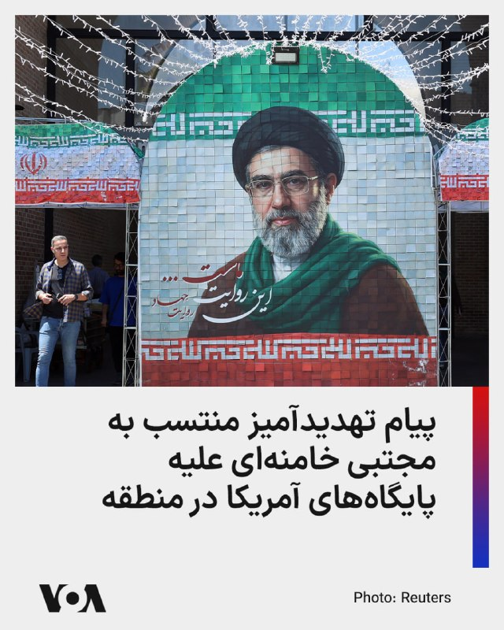

رسانه‌های ایران پیامی منتسب به مجتبی خامنه‌ای که به عنوان رهبر جمهوری اسلامی معرفی شده منتشر کردند که در آن، تهدید شده که آمریکا دیگر «نقطه امنی برای استقرار پایگاه نظامی در منطقه نخواهد داشت».

در این پیام که روز سه‌شنبه پنجم خرداد منتشر شد، ادعا شده است: «عقربه زمان به عقب برنمی‌گردد و ملت‌ها و سرزمین‌های منطقه، دیگر سپر پایگاه‌های آمریکایی نخواهند بود.»

بیانیه منتسب به مجتبی خامنه‌ای چند ساعت پس از آن منتشر شد که نیروهای آمریکا به سایت‌های موشکی در جنوب ایران و قایق‌هایی که در حال کارگذاری مین بودند حمله کردند. همچنین این پیام در شرایطی است که تهران و واشنگتن درباره چارچوبی برای پایان دادن به جنگ گفت‌وگو می‌کنند.

در طول جنگ، چندین پایگاه آمریکا در خاورمیانه از سوی نیروهای جمهوری اسلامی و گروه‌های نیابتی‌اش هدف حمله قرار گرفت.

مجتبی خامنه‌ای از زمان معرفی به عنوان رهبر جمهوری اسلامی، به صورت عمومی ظاهر نشده و تنها بیانیه‌های کتبی منتشر کرده است. همچنین پس از گزارش‌ها درباره مجروح شدن او در حملات، گمانه‌زنی‌ها درباره وضعیت سلامتی‌اش افزایش یافته است.
@FarsiVOA

## FarsiVOA — post 218683

🔺دولت در مرز بحران سوخت؛ مهاجرانی: تولید روزانه ۱۰۰ میلیون لیتر باید مدیریت شود

▪️سخنگوی دولت جمهوری اسلامی می‌گوید ایران در جریان جنگ اخیر آسیب‌هایی دیده و این موضوع «قابل انکار نیست».

▪️او با اشاره به ظرفیت حدود ۱۰۰ میلیون لیتر تولید داخلی بنزین در روز تأکید کرد همین حجم در اختیار مردم قرار می‌گیرد و باید با «اصلاح الگوی مصرف» مدیریت شود. او افزود که «هیچ موضوعی درباره عدد و رقم قیمت بنزین در دولت مطرح نشده است.»

▪️گزارش‌های داخلی ظرفیت تولید بنزین را حدود ۱۰۵ تا ۱۱۰ میلیون لیتر و مصرف روزانه را حدود ۱۳۰ تا ۱۳۵ میلیون لیتر برآورد کرده‌اند؛ یعنی شکافی حدود ۲۰ تا ۲۵ میلیون لیتر در روز که معمولاً با واردات یا فشار بر مصرف جبران می‌شود.

⬇️ بیشتر بخوانید:
https://ir.voanews.com/a/8154029.html

## FarsiVOA — post 218682

  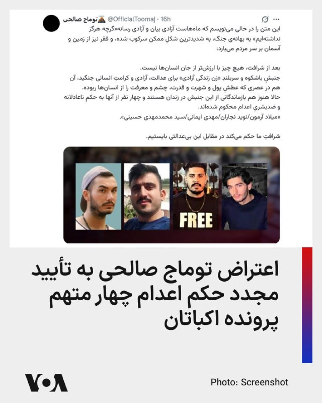

توماج صالحی، هنرمند و فعال سیاسی، نسبت به صدور مجدد حکم اعدام متهمان پرونده مشهور به «شهرک‌ اکبانان» اعتراض کرد.

روز سوم خرداد، قاضی صلواتی، حکم صادره توسط دادگاه کیفری، مبنی بر «نقض اعدام» چهار متهم این پرونده را رد و برای آنها دوباره حکم اعدام صادر کرد.

توماج صالحی در پیامی در شبکه اجتماعی ایکس، ضمن بیان اینکه «جنبش زن، زندگی، آزادی، برای عدالت، آزادی و کرامتِ انسانی جنگید»، نوشت: هنوز هم بازماندگانی از این جنبش در زندان هستند و چهار نفر از آنها به حکم ناعادلانه و ضدبشریِ اعدام محکوم شده‌اند.

او تأکید کرد که شرافت حکم می‌کند در مقابل این «بی‌عدالتی» بایستیم.

میلاد آرمون، نوید نجاران، مهدی ایمانی و محمدمهدی حسینی، به همراه ۱۰ شهروند دیگر به دخالت در کشته شدن یکی از نیروهای سرکوبگر بسیج به نام «آرمان علی‌وردی» در جریان اعتراضات آبان ۱۴۰۱ هستند.

برای چهار متهم، علیرغم «نقض حکم اعدام»، مجدداً حکم اعدام صادر شده است.
@FarsiVOA

## FarsiVOA — post 218681

🔺دستگاه قضایی غلامرضا خانی‌شکرآب را که خارج از ایران ربوده شده بود، اعدام کرد

▪️قوه قضائیه اعلام کرد غلامرضا خانی‌شکرآب به اتهام «همکاری اطلاعاتی و جاسوسی به نفع اسرائیل» اعدام شده است.

▪️ادعا شده که اتهام‌های منتسب به آقای خانی، از «اقرارهای متهم» مطرح شده؛ اما جزئیات مستقل درباره روند بازجویی، دسترسی به وکیل و امکان دفاع مؤثر منتشر نشده است.

▪️ابهام اصلی پرونده، نحوه انتقال خانی‌شکرآب به ایران است. میزان نوشته او در خارج از کشور شناسایی و با «فریب اطلاعاتی» به داخل کشور هدایت و بازداشت شد.

▪️سازمان حقوق بشر ایران پیش‌تر گزارش داده بود او در دوم مهر ۱۴۰۴ بازداشت و در شعبه یک دادسرای امنیت، موسوم به ۳۳ مقدس، به اتهام همکاری با اسرائیل و موساد محاکمه و به اعدام محکوم شده بود.

⬇️ بیشتر بخوانید:
https://ir.voanews.com/a/8154028.html

## FarsiVOA — post 218680

🔺حصر دیجیتال ۸۸ روزه شد؛ بازگشت اینترنت در کشاکش ابلاغ مبهم و تعویق

▪️اتصال اینترنت در ایران همچنان قطع است و خاموشی دیجیتال وارد هشتادوهشتمین روز شده و از دو هزار و ۸۸ ساعت گذشته است.

▪️نت‌بلاکس در این باره می‌گوید داده‌های فنی نشان می‌دهد قطعی همچنان برقرار است؛ با وجود آنکه روز گذشته خبرهایی درباره دستور مسعود پزشکیان برای بازگرداندن دسترسی به اینترنت منتشر شد.

▪️همین تناقض، محور اصلی بحران تازه است: دولت از بازگشت اینترنت حرف می‌زند، اما وضعیت اتصال هنوز تغییر نکرده و حتی درباره ابلاغ رسمی مصوبه نیز روایت‌های متناقض منتشر شده است.

▪️رسانه‌های داخلی نیز پیش‌تر نوشته بودند دستور بازگشایی اینترنت بین‌الملل صادر شده، اما سازوکار و زمان اتصال دوباره هنوز روشن نیست.

⬇️ بیشتر بخوانید:
https://ir.voanews.com/a/8154027.html

## FarsiVOA — post 218679

  

خبرگزاری فارس، وابسته به سپاه پاسداران، اذعان کرد که غلامرضا خانی شکراب که به اتهام «جاسوسی» در خطر اعدام قرار دارد، در خارج از کشور ربوده و به ایران منتقل شد.

فارس نوشت که این زندانی سیاسی که به «جاسوسی» متهم است، «در خارج از کشور حضور داشت و طی یک عملیات پیچیده و با استفاده از ترفند فریب اطلاعاتی، غافلگیر و به داخل کشور منتقل شد».

این خبرگزاری زمان و مکان دقیق ربایش این شهروند را اعلام نکرد اما افزود که همزمان چند نفر دیگر «در یک اقدام هماهنگ در چند استان ایران دستگیر شدند». برخی منابع پیشتر گزارش کرده‌اند که او ساکن ترکیه بوده و در سفری به عراق بازداشت و به ایران منتقل شده است.

پیشتر سازمان حقوق بشر ایران اعلام کرده بود که خانی‌شکرآب روز ۱۷ اردیبهشت ۱۴۰۵ از زندان اوین به سلول‌انفرادی زندان قزل‌حصار منتقل شد و این انتقال نگرانی‌های جدی درباره قریب‌الوقوع بودن اعدام او را افزایش داد.

بر اساس گزارش این سازمان، خانی شکرآب در دوم مهرماه ۱۴۰۴ بازداشت و در شعبه یک دادسرای امنیت (۳۳ مقدس) محاکمه و به اعدام محکوم شد.
@FarsiVOA

## FarsiVOA — post 218678

  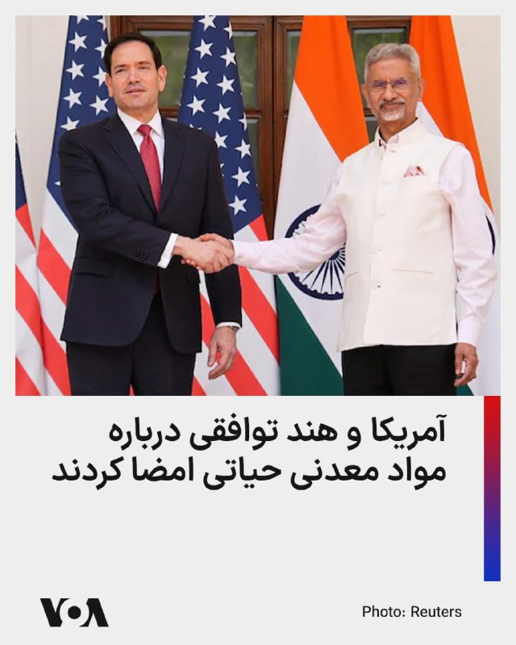

وزرای خارجه ایالات متحده و هند یک توافق همکاری برای تقویت همکاری در زمینه زنجیره‌های تأمین مواد معدنی حیاتی و عناصر نادر خاکی امضا کردند.

مارکو روبیو، وزیر خارجه آمریکا، سه‌شنبه در جریان امضای این توافق در دهلی‌نو گفت هر دو کشور در کاهش وابستگی به تأمین‌کنندگان تک‌منبعی و حفاظت از دسترسی به مواد کلیدی منافع مشترک دارند.

سوبرامانیام جایشانکار، وزیر خارجه هند، نیز گفت این توافق همکاری در تمام مراحل از استخراج تا فرآوری و بازیافت را گسترش می‌دهد و به ایجاد زنجیره‌های تأمین مقاوم‌تر و متنوع‌تر کمک می‌کند.

این مراسم امضا پس از نشست و بیانیه مشترک مجمع چهارجانبه امنیتی شامل آمریکا، هند، استرالیا و ژاپن انجام شد.

مارکو روبیو پس از نشست وزرای خارجه این مجمع در روز سه‌شنبه اعلام کرد که این کشورها توافق کردند ابتکاری درباره امنیت انرژی در منطقه هند-آرام و همچنین یک چارچوب تأمین مواد معدنی حیاتی را آغاز کنند.
@FarsiVOA

## FarsiVOA — post 218677

  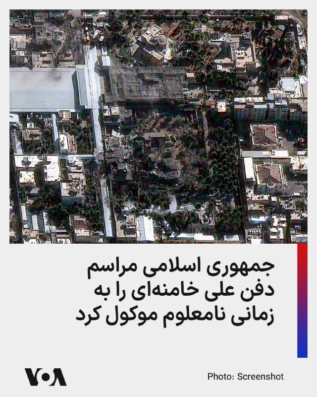

با گذشت نزدیک به سه ماه از کشته شدن علی خامنه‌ای، رهبر وقت جمهوری اسلامی، در عملیات مشترک آمریکا و اسرائیل، مقامات حکومت ایران زمان و مکان دفن او را بار دیگر به تعویق انداختند.

محسن محمودی، رئیس شورای هماهنگی تبلیغات اسلامی استان تهران، گفت: «تا این لحظه هیچ زمان مشخصی برای این موضوع تعیین نشده است». او ادعا کرد که اکنون «ثبت‌نام و اعلام آمادگی از کشورهای دیگر مانند عراق» برای حضور در این مراسم صورت گرفته است.

مقامات جمهوری اسلامی از زمان کشته شدن خامنه‌ای تاکنون هیچ اطلاعاتی درباره چگونگی نگهداری از بقایای احتمالی جسد او منتشر نکرده‌اند.

دونالد ترامپ، رئیس‌جمهوری آمریکا پیشتر درباره کشته شدن علی خامنه‌ای، او را «فرد دیوانه» توصیف کرد. ترامپ همچنین او را «مرد شرور و پلیدی» خواند که «خون صدها و حتی هزاران آمریکایی را بر دست داشت و مسئول کشتار هزاران انسان بی‌گناه در کشورهای مختلف بود.»
@FarsiVOA

## FarsiVOA — post 218676

🔺افزایش نرخ بهره اروپا حتی با توافق صلح؛ جنگ از بازار انرژی به تورم و وام‌های اضطراری رسید

▪️عضو هیئت اجرایی بانک مرکزی اروپا، می‌گوید این بانک باید در نشست ژوئن نرخ بهره را افزایش دهد؛ حتی اگر مذاکرات صلح با تهران به توافق برسد.

▪️بانک مرکزی اروپا در یک سال گذشته نرخ‌ها را ثابت نگه داشته بود، اما ماه گذشته، پس از بالا رفتن شدید هزینه انرژی و عبور تورم از هدف دو درصدی، درباره افزایش نرخ بهره بحث کرده بود.

▪️پیش از آغاز جنگ در ۲۸ فوریه، چشم‌انداز اروپا آرام‌تر بود؛ رشد متوسط، تورم رو به کاهش و انتظار بازگشت تدریجی ثبات. اما کمیسیون اروپا حالا پیش‌بینی رشد منطقه یورو در سال ۲۰۲۶ را به ۰.۹ درصد کاهش داده، در حالی که تورم بالاتر از هدف بانک مرکزی مانده است.

⬇️ بیشتر بخوانید:
https://ir.voanews.com/a/8153987.html

## DW_Farsi — post 125154

  

📸 عکس روز: پناه بردن از خورشید به "دختر خدای خورشید"

رود تاوی منبع اصلی تأمین آب آشامیدنی، مصارف خانگی و کشاورزی برای کل شهر جاموی هند است. تاوی در میان اهالی، رودخانه‌ای است مقدس و بر آن "دختر خدای خورشید" (سوریا پوتری) نام نهاده‌اند. تابش خورشید حالا اما در جامو به حدی است که زنی را واداشته برای خنک شدن به آب تاوی پناه ببرد.

@dw_farsi

## DW_Farsi — post 125152

  

🔶 افزایش قیمت نفت همزمان با حملات جدید آمریکا و تردیدها نسبت به توافق

در پی حملات هوایی جدید آمریکا به جنوب ایران و کاهش خوش‌بینی‌ها نسبت به دستیابی به یک توافق میان ایران و آمریکا، قیمت نفت صبح سه‌شنبه بار دیگر افزایش یافت و بازار سهام نیز دستخوش نوسان شد.

به گزارش رویترز قیمت قراردادهای آتی نفت برنت در معاملات اولیه آسیا بیش از ۱ درصد افزایش پیدا کرد و به ۹۷.۳۲ دلار در هر بشکه رسید. نفت خام وست تگزاس اینترمدیت آمریکا (WTI) نیز نسبت به آخرین قیمت معامله‌شده در روز دوشنبه اندکی افزایش داشت، اما همچنان ۵.۵ درصد پایین‌تر از قیمت پایانی روز جمعه بود.

بانک مرکزی سریلانکا برای مهار تورم و کاهش فشار شدید بر ارز، نرخ بهره پایه را به ۱۰۰ واحد افزایش داد.

معاون رئیس بانک مرکزی ژاپن نیز اعلام کرد که تحولات خاورمیانه در برنامه‌ریزی این بانک برای افزایش نرخ بهره تأثیرگذار خواهد بود.

این احتمال مطرح می‌شود که بانک مرکزی آمریکا تا ماه دسامبر نرخ بهره پایه را ۲۵ واحد افزایش دهد و بانک مرکزی اروپا و بانک انگلستان نیز سیاست‌های پولی خود را انقباضی‌تر کنند.

@dw_farsi

## DW_Farsi — post 125150

  

🔶 انتقال نتانیاهو به بیمارستان به دلیل "درمان دندان‌"

بنا بر گزارش‌ها نخست‌وزیر اسرائیل دوشنبه چهارم خرداد (۲۵ مه) به بیمارستان منتقل شده است. طبق گزارش رسانه‌های اسرائیلی به نقل از دفتر بنیامین نتانیاهو، او اواخر شب به یک بیمارستان در اورشلیم (بیت‌المقدس) منتقل شده تا تحت یک "درمان دندان‌پزشکی" قرار گیرد. جزئیات دقیق این درمان اعلام نشده است.

نتانیاهو که ۷۶ سال دارد، حدود یک ماه پیش با انتشار متنی در شبکه‌های اجتماعی برای نخستین بار از پرتودرمانی موفقیت‌آمیز خود برای یک تومور بدخیم پروستات خبر داده و اعلام کرده بود که در حال حاضر سالم است. او گفته بود انتشار گزارش مربوط به وضعیت سلامتی‌اش را به تأخیر انداخته تا از بهره‌برداری تبلیغاتی جمهوری اسلامی از این موضوع در جریان جنگ جلوگیری کند.

اعلام این موضوع از سوی نتانیاهو همراه با انتشار گزارش سالانه سلامت او و همچنین سندی جداگانه درباره تشخیص و درمان سرطانش صورت گرفت. با این حال به نوشته "تایمز اسرائیل"، این گزارش تنها نیم‌ صفحه و شامل پنج نکته کلی و مبهم بود که حتی مشخص نمی‌کرد این اطلاعات مربوط به چه سالی است. روی هیچ‌یک از این اسناد نشان بیمارستان درج نشده بود و هیچ نشانه‌ای مبنی بر رسمی بودن آنها به عنوان گزارش پزشکی مشاهده نمی‌شد.

@dw_farsi

## DW_Farsi — post 125149

  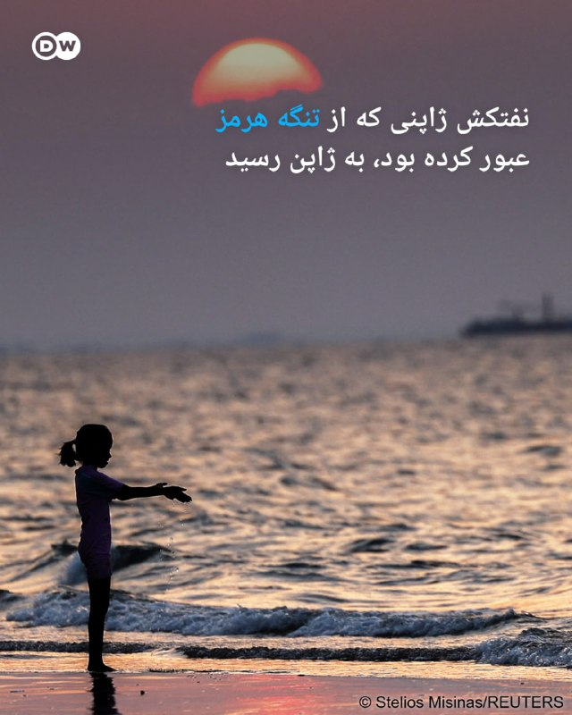

🔶 نفتکش ژاپنی که از تنگه هرمز عبور کرده بود، به ژاپن رسید

بیش از ۱۲ هفته پس از آغاز جنگ ایران، اولین نفتکش ژاپنی که پس از بسته شدن تنگه هرمز از آن عبور کرده بود، به ژاپن رسید. این نفتکش با نام "ایدمیتسو مارو" با پرچم پاناما روز دوشنبه در اسکله‌ای در نزدیکی شهر چیتا، در جزیره هونشو، پهلو گرفت.

مینورو کیهارا، دبیر ارشد کابینه ژاپن در یک نشست خبری گفت که ورود این کشتی به کشور‌، "از نظر تضمین تأمین پایدار انرژی، خبر خوشایندی است".

ژاپن وابستگی زیادی به نفت خلیج فارس دارد و در ماه‌های اخیر برای کاهش فشار ناشی از افزایش قیمت نفت، میزان بی‌سابقه‌ای از ذخایر راهبردی اضطراری نفت خود را آزاد کرده است.

کیهارا افزود که همچنان ۳۹ کشتی مرتبط با ژاپن در خلیج فارس گرفتار هستند که یکی از آن‌ها خدمه ژاپنی دارد. او تأکید کرد توکیو فعالانه تمام تلاش‌های دیپلماتیک لازم را انجام می‌دهد تا این کشتی‌ها بتوانند از تنگه هرمز عبور کنند.

به گزارش شبکه دولتی ژاپنی "ان‌اچ‌کی" سه خدمه ژاپنی کشتی ایدمیتسو مارو در وضعیت جسمانی خوبی بسر می‌برند.

این نفتکش که توسط یکی از زیرمجموعه‌های شرکت بزرگ پالایش نفت "ایدمیتسو کوسان" اداره می‌شود، حامل حدود دو میلیون بشکه نفت خام عربستان سعودی است که به استان آیچی، قطب صنعتی ژاپن، منتقل می‌شوند تا به فراورده‌های نفتی تبدیل شوند.

اوایل ماه مه یک نفتکش ژاپنی دیگر نیز از تنگه هرمز عبور کرد که احتمالا اوایل ژوئن به ژاپن می‌رسد.

@dw_farsi

## DW_Farsi — post 125148

  

🔶 قطر گزارش‌ها در مورد "پیشنهاد ۱۲ میلیارد دلاری" به ایران برای توافق را تکذیب کرد

ماجد محمد الانصاری، سخنگوی وزارت خارجه قطر، با انتشاری پستی در شبکه ایکس گزارش‌ها در مورد "پیشنهاد ۱۲ میلیارد دلاری" قطر به ایران برای تضمین یک توافق را رد کرد.

او نوشت: «گزارش‌هایی که ادعا می‌کنند قطر برای تضمین یک توافق، ۱۲ میلیارد دلار به ایران "پیشنهاد" داده است، کاملاً نادرست هستند و توسط طرف‌هایی منتشر می‌شوند که تلاش دارند این توافق را تخریب کرده و تلاش‌های دیپلماتیک جاری برای کاهش تنش و ثبات منطقه‌ای را تضعیف کنند.»

سخنگوی وزارت خارجه قطر با اشاره به "نقش دیپلماتیک" این کشور افزود این موضوع "در هماهنگی با شرکای منطقه‌ای کاملا شناخته‌شده و به طور عمومی مستند شده است و چنین روایت‌هایی چیزی جز تلاش‌های ناامیدانه برای خدشه‌دار کردن اعتبار قطر به عنوان یک میانجی قابل اعتماد بین‌المللی برای صلح نیست".

یک هیئت نمایندگی از ایران روز دوشنبه چهارم خرداد به سرپرستی محمدباقر قالیباف، رئیس مجلس شورای اسلامی، در سفری غیرمنتظره به قطر رفت. پیش‌تر یک هیئت قطری در روز جمعه در هماهنگی با آمریکا به تهران سفر کرده بود. یک منبع مطلع به رویترز گفته بود که هدف از سفر این هیئت، تلاش برای دستیابی به توافقی برای پایان دادن جنگ و حل مسائل باقی‌مانده است.

دوحه که پیش‌تر در جریان جنگ غزه و دیگر بحران‌های بین‌المللی نقش میانجی را ایفا کرده بود، پس از حملات موشکی و پهپادی ایران به این کشور در جریان جنگ ۴۰ روزه، تا کنون از ورود مستقیم به میانجی‌گری در جنگ ایران خودداری کرده است.

در حالی که پاکستان از آغاز جنگ رسما نقش میانجی را بر عهده داشته و میزبان تنها دور مذاکره مستقیم ایران و آمریکا بوده است، بازگشت قطر به روند تعاملات نشان‌دهنده نقش دیرینه این کشور به‌عنوان متحد آمریکا در منطقه و کانال ارتباطی قابل اعتماد میان واشنگتن و تهران است.

قطر یکی از متحدان اصلی ایالات متحده در منطقه و میزبان پایگاه هوایی العدید، بزرگترین تأسیسات نظامی ایالات متحده در خاورمیانه، است.

@dw_farsi

## DW_Farsi — post 125147

  

🔶 روبیو: توافق با ایران هنوز امکان‌پذیر است

مارکو روبیو، وزیر خارجه آمریکا، روز سه‌شنبه پنجم خرداد (۲۶ مه) گفت که مذاکرات برای دستیابی به توافق با ایران به دلیل اختلاف‌ها بر سر متن و نحوه نگارش توافق‌نامه با تأخیر مواجه شده است. روبیو در جریان سفرش به هند در گفت‌وگو با خبرنگاران اظهار داشت: «چند روزی طول می‌کشد تا این اختلاف‌ها حل‌وفصل شود… فقط بر سر یک کلمه یا یک جمله.»

او در تأیید اظهارات پیشین مقام‌های آمریکایی افزود: «باید این مسائل را مرحله‌به‌مرحله برطرف کنیم.»

او گفت به رغم حملات جدید آمریکا به جنوب ایران که تردیدهایی را درباره شکننده بودن آتش‌بس ایجاد کرده، همچنان امکان دستیابی به توافق با ایران وجود دارد. روبیو با اشاره به ادامه مذاکرات در قطر در روز دوشنبه گفت: «امروز گفت‌وگوهایی در قطر در جریان بود، بنابراین خواهیم دید که آیا می‌توانیم پیشرفتی حاصل کنیم یا نه. فکر می‌‌کنم چانه‌زنی‌های زیادی درباره عبارات مشخص در متن اولیه سند وجود دارد، بنابراین چند روز زمان خواهد برد.»

او افزود که دونالد ترامپ تمایل خود را برای امضای یک توافق ابراز کرده و رئیس‌ جمهور آمریکا "یا یک توافق خوب بدست می‌آورد یا اصلا توافقی در کار نخواهد بود".

@dw_farsi

## Persian_Trend_Official — post 15058

ورود معاون دبیر شعام به مسکو

باقری برای شرکت در چهاردهمین کنفرانس بین‌المللی مقامات عالی امنیتی به مسکو عزیمت کرده و علاوه بر سخنرانی‌ در این کنفرانس، با تعدادی از مقامات سیاسی و امنیتی روسیه نیز دیدار خواهد بود.

👩‍💻@PhantomDirective

🆔@persian_trend_official
پرشین ترند | متفاوت‌ترین کانال نظامی

## Persian_Trend_Official — post 15057

  <a href="telegram/content/Persian_Trend_Official_15057_1779788758.mp4" target="_blank">🎬 Download video</a>

صحبت های گویر وزیر امنیت ملی اسرائیل درباره حملات حزب‌الله:

از نخست‌وزیر نتانیاهو می‌خواهم: با ترامپ تماس بگیر، پیش او برو، روی میز جلویش بکوب و به وضوح اعلام کن که دولت اسرائیل حاضر نیست — حاضر نیست این را بپذیرد، حاضر نیست این را تحمل کند.

👩‍💻@PhantomDirective

🆔@persian_trend_official
پرشین ترند | متفاوت‌ترین کانال نظامی

## Persian_Trend_Official — post 15056

  

🔹ارتش دفاعی اسرائیل از تمام شهروندان شهر نبطیه(دومین شهر بزرگ جنوب لبنان) خواست به طور کامل شهر را تخلیه کنند.

👩‍💻@PhantomDirective

🆔@persian_trend_official
پرشین ترند | متفاوت‌ترین کانال نظامی

## Persian_Trend_Official — post 15055

⭕️ علی‌حسین قاضی‌زاده:

ایران در ۴۰ روز جنگ، هیچ پناهنده‌ای به جهان تحمیل نکرد و از این حیث رکوردی برجا گذاشت.
اگر توافقی امضا شود، سیل مهاجرت و پناهندگی به راه می‌افتد و رکوردی تازه‌ای در مهاجرت پس از جنگ برجا می‌گذارد.
اگر غربی‌ها تعلل کنند، چند ماه دیگر می‌فهمند، بهای زایل کردن امید یک ملت، فراتر از آنی است که از آن مصون بمانند.

📝 Nick

📌 @persian_trend_official
پرشین ترند | متفاوت‌ترین کانال نظامی

## Persian_Trend_Official — post 15054

  

ارتش اسرائیل(IDF): گزارش اولیه - آژیرهای خطر در مورد نفوذ یک پهپاد حزب‌الله در منطقه نتوآ به صدا درآمدند. جزئیات تکمیلی به زودی.......

## Persian_Trend_Official — post 15053

  <a href="telegram/content/Persian_Trend_Official_15053_1779788762.webm" target="_blank">🎬 Download video</a>

دقایقی قبل نت‌بلاکس آپدیت جدیدی از وضعیت اینترنت بین‌الملل ایران منتشر کرد. 
👩‍💻@PhantomDirective 
🆔@persian_trend_official پرشین ترند | متفاوت‌ترین کانال نظامی

## Persian_Trend_Official — post 15052

  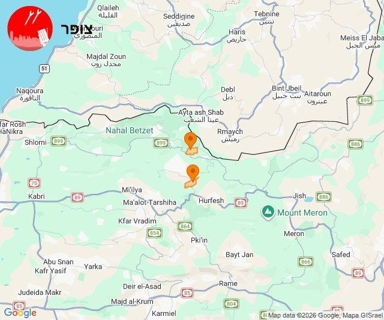

ارتش اسرائیل(IDF): گزارش اولیه - آژیرهای خطر در مورد نفوذ یک پهپاد حزب‌الله در منطقه نتوآ به صدا درآمدند. جزئیات تکمیلی به زودی.......

## Persian_Trend_Official — post 15050

  <a href="telegram/content/Persian_Trend_Official_15050_1779788763.webm" target="_blank">🎬 Download video</a>

🇺🇸
🇬🇧
🇮🇱
🇮🇷 یک KC-135 آسیب‌دیده هفته گذشته در میلدنهال مشاهده شد.

سوراخ‌های ناشی از ترکش که روی بال‌های دم پوشانده شده‌اند، قابل مشاهده است.نامشخص است که این KC-135 کجا این آسیب را دیده است زیرا هفته گذشته از فرودگاه بن گوریون برخاست.

👩‍💻@PhantomDirective

🆔@persian_trend_official
پرشین ترند | متفاوت‌ترین کانال نظامی

## Persian_Trend_Official — post 15049

  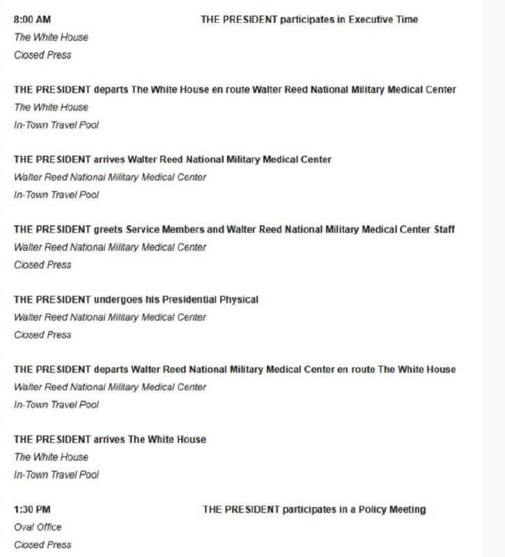

🇺🇸
🇺🇸 رئیس‌جمهور آمریکا، ترامپ، فردا سه‌شنبه ۲۶ مه، در مرکز ملی معاینات پزشکی نظامی والتر رید تحت معاینه جسمانی قرار خواهد گرفت.

👩‍💻@PhantomDirective

🆔@persian_trend_official
پرشین ترند | متفاوت‌ترین کانال نظامی

## Persian_Trend_Official — post 15047

  <a href="telegram/content/Persian_Trend_Official_15047_1779788764.webm" target="_blank">🎬 Download video</a>

🇺🇸
🇬🇧
🇮🇷 یک KC-135 آسیب‌دیده هفته گذشته در میلدنهال مشاهده شد.

سوراخ‌های ناشی از ترکش که روی بال‌های دم پوشانده شده‌اند، قابل مشاهده است.نامشخص است که این KC-135 کجا این آسیب را دیده است زیرا هفته گذشته از فرودگاه بن گوریون برخاسته است.

👩‍💻@PhantomDirective

🆔@persian_trend_official
پرشین ترند | متفاوت‌ترین کانال نظامی

## Persian_Trend_Official — post 15046

💛خنثی‌سازی مهمات عمل‌نکرده در محدوده نیروگاه اتمی بوشهر فرماندار بوشهر: 🔹عملیات خنثی‌سازی و انهدام تعدادی از مهمات عمل‌نکرده متعلق به حملات آمریکایی اسرائیلی در محدوده نیروگاه اتمی بوشهر در دستور کار قرار گرفته است. 🔹این عملیات روز سه‌شنبه پنجم خرداد از…

## Persian_Trend_Official — post 15045

  <a href="telegram/content/Persian_Trend_Official_15045_1779788765.webm" target="_blank">🎬 Download video</a>

💛خنثی‌سازی مهمات عمل‌نکرده در محدوده نیروگاه اتمی بوشهر

فرماندار بوشهر:

🔹عملیات خنثی‌سازی و انهدام تعدادی از مهمات عمل‌نکرده متعلق به حملات آمریکایی اسرائیلی در محدوده نیروگاه اتمی بوشهر در دستور کار قرار گرفته است.

🔹این عملیات روز سه‌شنبه پنجم خرداد از ساعت ۹ تا ۱۵ انجام می‌شود.

🔹انفجارهای صورت‌گرفته به‌طور کامل کنترل‌شده بوده و جای هیچ نگرانی برای شهروندان وجود ندارد.
| ایسنا

## Persian_Trend_Official — post 15044

  

غلامرضا خانی شکراب به اتهام «جاسوسی» اعدام شد.

مرکز رسانه قوه قضاییه از اجرای حکم اعدام غلامرضا خانی شکراب، زندانی متهم به جاسوسی و فعالیت اطلاعاتی به نفع اسرائیل خبر داد. این حکم پس از تایید در دیوان عالی کشور به اجرا درآمد.

بر اساس داده‌های گردآوری‌شده توسط هرانا:

همزمان با آغاز درگیری‌های نظامی، روند صدور و اجرای احکام اعدام در پرونده‌های سیاسی و امنیتی افزایش یافته و تاکنون ۳۷ زندانی با این اتهامات در این بازه زمانی اعدام شده‌اند.

👩‍💻@PhantomDirective

🆔@persian_trend_official
پرشین ترند | متفاوت‌ترین کانال نظامی

## Persian_Trend_Official — post 15043

  <a href="telegram/content/Persian_Trend_Official_15043_1779788766.webm" target="_blank">🎬 Download video</a>

وزیر ارتباطات: با دستور رئیس‌جمهوری و پس از برگزاری ۳ جلسه فشرده کارشناسی، فرایند بازگرداندن اینترنت کشور به وضعیت قبل از دی‌ماه ۱۴۰۴ آغاز شده است. 👩‍💻@PhantomDirective 🆔@persian_trend_official پرشین ترند | متفاوت‌ترین کانال نظامی

## Persian_Trend_Official — post 15042

  

صفحه اینترنت پرو از سایت همراه اول حذف شد.

👩‍💻@PhantomDirective

🆔@persian_trend_official
پرشین ترند | متفاوت‌ترین کانال نظامی

## Persian_Trend_Official — post 15041

  <a href="telegram/content/Persian_Trend_Official_15041_1779788767.webm" target="_blank">🎬 Download video</a>

دقایقی قبل نت‌بلاکس آپدیت جدیدی از وضعیت اینترنت بین‌الملل ایران منتشر کرد.

👩‍💻@PhantomDirective

🆔@persian_trend_official
پرشین ترند | متفاوت‌ترین کانال نظامی

## Persian_Trend_Official — post 15040

  <a href="telegram/content/Persian_Trend_Official_15040_1779788768.webm" target="_blank">🎬 Download video</a>

🇮🇷بیانیه منتشر شده از سوی روابط‌عمومی سپاه

هشدار سپاه در برابر هرگونه نقض آتش بس از سوی ارتش متجاوز آمریکا:
حق پاسخ متقابل را برای خود مشروع و قطعی می‌دانیم

در اطلاعیه روابط عمومی سپاه پاسداران انقلاب اسلامی آمده است:
🔹ارتش تروریستی آمریکا در ادامه ماجراجویی‌های مداخله گرایانه در منطقه و رفتارهای متجاوزانه، در منطقه خلیج فارس وارد حریم هوایی ایران شد و یگان های پدافندی سپاه پاسداران در راستای دفاع از حریم سرزمینی کشورمان پس از پایش های اطلاعاتی دقیق، یک فروند پهپاد MQ9 را شناسایی و ساقط کرد.
🔹همچنین با شلیک به یک فروند پهپاد RQ4 و جنگنده متجاوز F35 آنان را وادار به فرار و خروج از حریم سرزمینی کرد.
🔹سپاه پاسداران نسبت به هرگونه نقض آتش بس از سوی ارتش متجاوز آمریکا هشدار داده و حق پاسخ متقابل را برای خود مشروع و قطعی می داند.

👩‍💻@PhantomDirective

🆔@persian_trend_official
پرشین ترند | متفاوت‌ترین کانال نظامی

## RadioFarda — post 157565

  

🔸سپاه پاسداران انقلاب اسلامی روز سه‌شنبه پنجم خرداد مدعی شد که یک پهپاد آمریکایی را «ساقط» کرده و به سوی چند پهپاد آمریکایی دیگر که وارد حریم هوایی کشور شده بودند، «شلیک» کرده است.

🔸در بیانیه سپاه آمده بعد از اینکه هواپیماهای نظامی آمریکا وارد حریم هوایی ایران در منطقه خلیج فارس شدند، یگان‌های پدافند هوایی سپاه «یک پهپاد ام‌.کیو ۹ را شناسایی و سرنگون کردند».

🔸در این بیانیه آمده است که نیروهای سپاه «همچنین به سوی یک پهپاد آر.کیو۴ و یک جنگنده نفوذی اف۳۵ شلیک کردند».

🔸در این بیانیه به زمان وقوع این حوادث اشاره‌ای نشده است.

🔸این بیانیه پس از آن منتشر می‌شود که ستاد فرماندهی مرکزی آمریکا، سنتکام، اعلام کرد که ارتش ایالات متحده روز دوشنبه در جنوب ایران حملاتی را علیه اهدافی «از جمله قایق‌هایی که در تلاش برای کارگذاری مین بودند و همچنین سایت‌های پرتاب موشک» انجام داده است.

🔸رسانه‌های ایران بامداد سه‌شنبه گزارش دادند که «جنگنده‌های آمریکایی چند شناور ایرانی را در جنوب جزیره لارک هدف قرار دادند» و از کشته شدن دست‌کم سه تن نیز در این حمله خبر دادند.

@RadioFarda

## RadioFarda — post 157564

  

🔸دستگاه قضایی جمهوری اسلامی روز سه‌شنبه پنجم خرداد از اعدام یک شهروند دیگر به اتهام جاسوسی برای اسرائیل خبر داد.

🔸خبرگزاری قوه قضاییه هویت فرد اعدام‌شده را غلامرضا خانی شکراب معرفی و ادعا کرده است که او «سرشبکهٔ سرویس جاسوسی اسرائیل» بوده است.

🔸گزارش دستگاه قضایی اشاره‌ای به تاریخ بازداشت، محاکمه و روز اعدام متهم نکرده و این در حالی است که خبرگزاری فارس روز گذشته، دوشنبه چهارم خرداد، از صدور حکم اعدام برای او خبر داده بود.

🔸دستگاه قضایی، در گزارش خود، غلامرضا خانی شکراب را «از اراذل و اوباش یکی از استان‌های کشور و دارای سوابق نزاع و شرارت» خوانده و ادعا کرده است که او «به دنبال جذب افراد و به‌کارگیری آن‌ها در داخل کشور برای اجرای اقدامات ضد امنیتی بوده است».

🔸دستگاه قضایی جمهوری اسلامی در ماه‌های اخیر به شکل تقریباً روزانه اقدام به اجرای احکام اعدام معترضان و یا افرادی می‌کند که آن‌ها را به همکاری با آمریکا و اسرائیل متهم می‌کند. برخی نهادهای حقوق‌بشری می‌گویند جمهوری اسلامی از اعدام برای ایجاد فضای ترس و به‌عنوان عامل سرکوب استفاده می‌کند.

@RadioFarda

## RadioFarda — post 157563

  

🔸مارکو روبیو، وزیر خارجه آمریکا، روز سه‌شنبه پنجم خرداد گفت دستیابی به توافق با ایران ممکن است «چند روز» زمان ببرد و تأکید کرد واشینگتن پیش از بررسی «راه‌های دیگر»، به دیپلماسی فرصت کامل خواهد داد.

🔸روبیو در توضیح حملاتی که سنتکام اعلام کرد روز گذشته علیه اهدافی در جنوب ایران از جمله قایق‌های در حال مین‌گذاری و پایگاه‌های پرتاب موشک انجام داده است، گفت تنگه هرمز باید «به هر شکل ممکن» باز بماند.

🔸وزیر خارجه ایالات متحده درباره گفت‌وگوهای جاری بین ایران و آمریکا برای دستیابی توافق گفت: «یک اتفاق‌نظر بسیار قوی و پیش‌نویس اولیهٔ یک توافق وجود دارد. همان‌گونه که در این‌گونه موارد پیش می‌آید، حل‌وفصل برخی اختلاف‌ها دربارهٔ یک کلمه یا یک جمله ممکن است چند روز طول بکشد تا به یک توافق برسیم. بنابراین باید برای حل این اختلاف‌ها تلاش کنیم. از این رو، یا یک توافق خوب خواهیم داشت یا توافق نخواهیم کرد.»

@RadioFarda

## RadioFarda — post 157562

  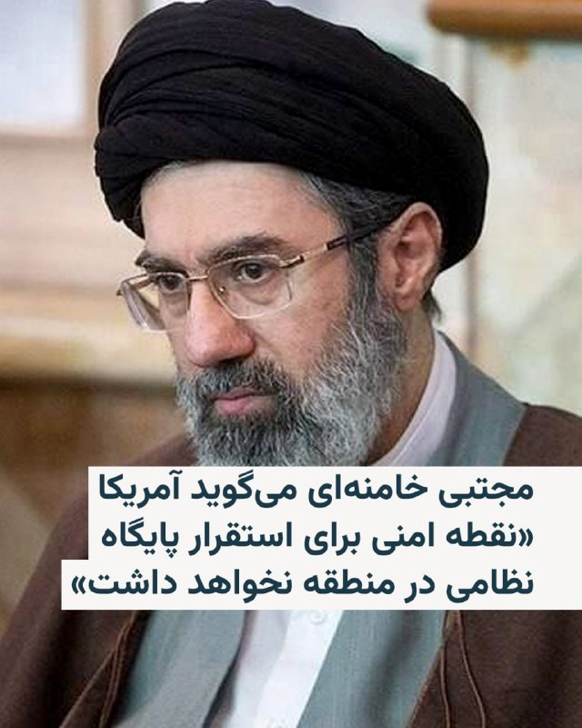

🔸رسانه‌های ایران روز سه‌شنبه پنجم خرداد پیامی منسوب به مجتبی خامنه‌ای، رهبر جمهوری اسلامی، را به‌مناسبت برگزاری مراسم حج منتشر کردند که در آن می‌گوید آمریکا از این پس «نقطه امنی برای استقرار پایگاه نظامی در منطقه نخواهد داشت».

🔸او در این پیام توضیحی دربارهٔ پایگاه‌های آمریکایی مستقر در کشورهای خلیج فارس نکرد اما هشدار داد که «سرزمین‌های منطقه دیگر سپر پایگاه‌های آمریکایی نخواهد بود».

🔸مجتبی خامنه‌ای همچنین با یادآوری ادعای ۱۰ سال پیش پدرش علی خامنه‌ای درباره اسرائیل، مدعی شد این کشور نیز «به مراحل پایانی عمر» خود نزدیک شده و «۲۵ سال بعد از آن تاریخ را نخواهد دید».

🔸رهبر پیشین جمهوری اسلامی در سال ۱۳۹۴ و پس از امضای توافق هسته‌ای موسوم به برجام وعدهٔ نابودی اسرائیل را داده و گفته بود «اسرائیل ۲۵ سال آینده را نخواهد دید».

🔸از زمان اعلام نام مجتبی خامنه‌ای، به عنوان سومین رهبر جمهوری اسلامی، تصویر یا صدایی از او منتشر نشده و رسانه‌های ایران فقط پیام‌های کتبی را از او منتشر می‌کنند.

@RadioFarda

## RadioFarda — post 157561

  

🔸سخنگوی وزارت خارجه قطر می‌گوید گزارش‌هایی که ادعا می‌کنند دولت این کشور برای تضمین نهایی‌شدن توافق با ایران، ۱۲ میلیارد دلار به جمهوری اسلامی «پیشنهاد» داده، «کاملاً بی‌اساس» است.

🔸ماجد الانصاری سه‌شنبه پنجم خرداد در شبکه ایکس نوشته که این گزارش‌ها «توسط طرف‌هایی منتشر می‌شوند که به دنبال برهم زدن توافق و تضعیف تلاش‌های دیپلماتیک با هدف کاهش تنش‌ها و تقویت ثبات در منطقه‌اند.»

🔸او افزوده که تلاش‌های دیپلماتیک قطر که با «هماهنگی» شرکای منطقه‌ای انجام می‌شود، «شناخته‌شده و شفاف است».

🔸ماجد الانصاری انتشار این دست روایت‌ها را «تلاش‌های مذبوحانه برای خدشه‌دار کردن اعتبار» دولت قطر نامیده که به گفته او به‌عنوان «یک بازیگر بین‌المللی قابل اعتماد در مسیر دستیابی به صلح» است.

🔸این موضع‌گیری اندکی پس از آن اعلام می‌شود که روز دوشنبه، چهارم خرداد، هیئت نمایندگی ایران به ریاست محمدباقر قالیباف، رئیس مجلس، و با همراهی عباس عراقچی، وزیر خارجه، در سفری غیرمنتظره وارد قطر شد.

🔸قطر در جریان جنگ ایران، بارها توسط جمهوری اسلامی مورد حملات موشکی و پهپادی قرار گرفته بود.

@RadioFarda

## RadioFarda — post 157559

🔸توماج صالحی، خواننده معترض، در واکنش به صدور حکم اعدام برای چهار معترض پرونده «اکباتان»، این حکم را «ناعادلانه» و «ضدبشری» نامید.

🔸آقای صالحی که خود چندبار بازداشت شده و به زندان افتاده، این پست را بعد از ماه‌ها سکوت، در شبکه اجتماعی ایکس منتشر کرده است.

🔸او تأکید کرده که این متن را در حالی می‌نویسد که «ماه‌هاست آزادی ‌بیان و آزادی رسانه «گرچه هرگز نداشته‌ایم» به بهانه‌ جنگ، به شدید‌ترین شکلِ ممکن سرکوب شده، و فقر نیز از زمین و آسمان بر سر مردم می‌بارد.»

🔸این خواننده معترض با بیان اینکه «بعد از شرافت، هیچ چیز با ارزش‌تر از جان انسان‌ها نیست»، اضافه کرده که هنوز بازماندگانی از «جنبش باشکوه و سربلند زن زندگی آزادی» در زندان‌ها به سر می‌برند.

🔸صالحی به صدور احکام اعدام برای میلاد آرمون، نوید نجاران، مهدی ایمانی و محمدمهدی حسینی، از بازداشت‌شدگان این پرونده اشاره کرده و نوشته: «شرافتِ ما حکم می‌کند در مقابل این بی‌عدالتی بایستیم.»

🔸ابوالقاسم صلواتی، رئیس شعبهٔ ۱۵ دادگاه انقلاب به این چهار متهم پرونده موسوم به «شهرک اکباتان» مربوط به اعتراضات «زن، زندگی، آزادی» در تهران حکم اعدام داده است.

@RadioFarda

## RadioFarda — post 157558

  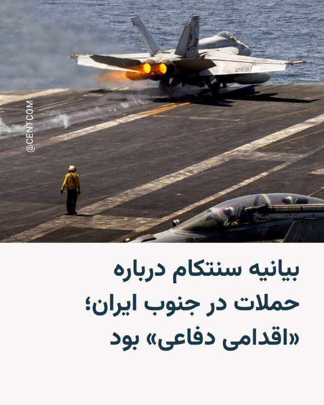

🔸ستاد فرماندهی مرکزی آمریکا، سنتکام، اعلام کرد که ارتش ایالات متحده روز دوشنبه در جنوب ایران حملاتی را علیه اهدافی «از جمله قایق‌هایی که در تلاش برای کارگذاری مین بودند و همچنین سایت‌های پرتاب موشک» انجام داده است.

🔸در بیانیه این ستاد، این حملات، « اقدامی دفاعی» توصیف شده است.

🔸سنتکام اعلام کرده که این حملات با هدف حفاظت از نیروهای آمریکا «در برابر تهدیدهای ناشی از نیروهای ایرانی» انجام شده است.

🔸به‌نوشته رویترز، کاپیتان تیم هاوکینز، سخنگوی سنتکام، گفت: «فرماندهی مرکزی ایالات متحده همزمان با حفظ خویشتنداری در جریان آتش‌بس، همچنان از نیروهای خود دفاع می‌کند.»

🔸بامداد دوشنبه چهارم خرداد برخی شهروندان سواحل خلیج فارس، به‌ویژه در شهرهای بندرعباس، سیریک و جاسک، از شنیده‌شدن چند انفجار و فعالیت پدافند ضدهوایی خبر داده بودند.

🔸رسانه‌های ایران بامداد سه‌شنبه گزارش دادند که «جنگنده‌های آمریکایی چند شناور ایرانی را در جنوب جزیره لارک هدف قرار دادند.

🔸پایگاه خبری تابناک در تهران نیز خبر داد «دو قایق تندرو سپاه هدف حمله هوایی قرار گرفته و بر اثر آن چهار نفر کشته شدند».

@RadioFarda

## IranianMinds — post 20784

  

🔴 سیتنا :

معاون سیاست گذاری و برنامه‌ریزی توسعه فاوا و اقتصاد دیجیتال وزارت ارتباطات، در پی دستور رییس جمهور از بازگشایی تدریجی اینترنت تا دقایقی دیگر خبر داد و گفت دسترسی کامل مردم به اینترنت تا 24 ساعت آینده میسر می شود.

@IranianMinds

## IranianMinds — post 20783

  

🔴 نت بلاکس :

قطعی اینترنت در ایران وارد ۸۸ امین روز خودش شد و با وجود دستور رئیس جمهور هنوز هم تغییری در سطح دسترسی دیده نمیشه.

@IranianMinds

## IranianMinds — post 20782

❌خودم عضو شدم ۵۰۰ تومان گرفتم
نیازی هم به واریز نیست 
😍

🌐 Winro.io

## IranianMinds — post 20781

  <a href="telegram/content/IranianMinds_20781_1779788774.webm" target="_blank">🎬 Download video</a>

🚨 اگر همین الان توی سایت #وینرو عضو بشی 
🤩
🤩
🤩 هزار تومان شارژ رایگان میگیری
❕

✅ من خودم عضو شدم بدون واریز ۵۰۰ تومان گرفتم باهاش فوتبال پیش بینی کردم پولم شد ۲ میلیون 
❕

💚خیلی راحت هم برداشت کردم کل پولم رو 
💵

💳 پرداخت مستقیم و سریع بدون واسطه، بدون دردسر، واریز و برداشت در سریع‌ترین زمان ممکن

🔴این فرصت محدود رو از دست ندید:

🌐 Winro.io

🌐 Winro.io
کانال بونوس های رایگان r5

📱 @winro_io

## IranianMinds — post 20780

  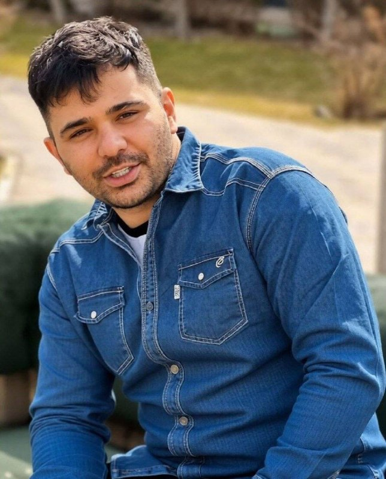

⚫️ جمهوری اسلامی یکی‌ دیگه از هموطن هامونو امروز کشت ، عباس اکبری فیض آبادی از معترضین دی ماه در اصفهان امروز با اذان صبح توسط جمهوری اسلامی اعدام شد. @IranianMinds

## IranianMinds — post 20779

  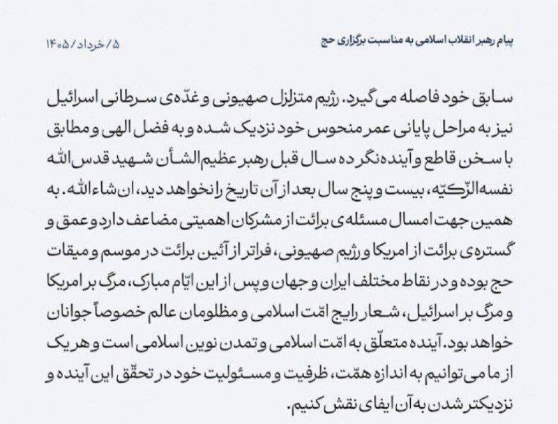

🔴 مجتبی خامنه ای :

همونطور که بابایی سال ۱۳۹۴ گفت اسرائیل ۲۵ سال آینده را نخواهد دید!

@IranianMinds

## IranianMinds — post 20777

  <a href="telegram/content/IranianMinds_20777_1779788776.mp4" target="_blank">🎬 Download video</a>

🔴 جنوب لبنان بعد از حمله های اسرائیل

@IranianMinds

## IranianMinds — post 20776

🔴 سپاه :

دیشب به سمت یک پهپاد RQ-4 و یک جنگنده F-35 را که در حال حمله به منطقه ما بودند، شلیک کردیم.

@IranianMinds

## IranianMinds — post 20775

🔴 هاشمی، وزیر ارتباطات: بازگشایی اینترنت به وضعیت قبل دی ماه در حال اجرا هست @IranianMinds

## IranianMinds — post 20774

🔴 هاشمی، وزیر ارتباطات:

بازگشایی اینترنت به وضعیت قبل دی ماه در حال اجرا هست

@IranianMinds

## BBCPersian — post 282091

🔻مقام بانک مرکزی اروپا می‌گوید که حتی در صورت توافق صلح با ایران، این نهاد باید نرخ بهره را افزایش دهد

ایزابل اشنابل، عضو هیئت‌مدیره بانک مرکزی اروپا، گفته است که این نهاد باید ماه آینده نرخ‌ بهره را افزایش دهد، حتی اگر مذاکرات جاری صلح با ایران به توافق منجر شود.

بانک مرکزی اروپا طی یک سال گذشته نرخ‌ بهره را بدون تغییر حفظ کرده است، اما ماه گذشته به‌دلیل جهش شدید هزینه‌های انرژی و افزایش تورم به سطحی بسیار بالاتر از هدف دو درصدی، گزینه افزایش نرخ بهره را بررسی کرد.

در همین حال، چندین مقام سیاست‌گذار نیز بر ضرورت اقدام تأکید کرده‌اند.

خانم اشنابل که از او به‌عنوان یکی از گزینه‌های احتمالی جانشینی کریستین لاگارد در ریاست بانک مرکزی اروپا در سال آینده میلادی یاد می‌شود، گفت این نهاد ممکن است از «نقطه بی‌بازگشت» عبور کرده باشد چرا که زیرساخت‌های انرژی نیز در جریان جنگ علیه ایران آسیب دیده‌اند.

او در گفت‌وگو با خبرگزاری رویترز اظهار داشت: «با توجه به ابعاد گسترده و ماندگاری شوک انرژی، فکر می‌کنم افزایش نرخ بهره در ماه ژوئن ضروری خواهد بود.»

https://bbc.in/4u071Sq
@BBCPersian

## BBCPersian — post 282090

  

🔻مجتبی خامنه‌ای، رهبر جمهوری اسلامی ایران، در پیامی کتبی که از تلویزیون دولتی نیز پخش شد، گفته است که کشورهای منطقه دیگر سپری برای پایگاه‌های آمریکا نخواهند بود.

مجتبی خامنه‌ای که از زمان آغاز به کارش در اسفند تاکنون در انظار عمومی ظاهر نشده، در پیامی کتبی به مناسبت برگزاری مراسم حج گفت: «آنچه مسلم است، عقربهٔ زمان به عقب برنمی‌گردد و ملت‌ها و سرزمین‌های منطقه دیگر سپر پایگاه‌های آمریکایی نخواهند بود.»

او همچنین در این پیام آورده است: «آمریکا علاوه بر آنکه دیگر نقطه امنی برای شرارت و استقرار پایگاه نظامی در منطقه نخواهد داشت، روزبه‌روز از وضع سابق خود فاصله می‌گیرد.»

آقای خامنه‌ای در بخش دیگری از پیامش به اسرائیل هم اشاره کرده است: «رژیم متزلزل صهیونی و غدهٔ سرطانی اسرائیل به مراحل پایانی عمر منحوس خود نزدیک شده است»

او در این پیام کتبی با یادآوری اظهارات پدرش در ۱۰ سال پیش افزود که اسرائیل «۲۵ سال بعد از آن تاریخ را نخواهد دید.»

📸 Reuters

https://bbc.in/4u071Sq
@BBCPersian

## BBCPersian — post 282089

  

🔻رسانه‌های داخلی ایران از وقوع تیراندازی در محدوده بیمارستانی در اقدسیه تهران خبر داده‌اند.

خبرگزاری ایسنا نوشته است: «در پی وقوع یک درگیری و تیراندازی مقابل بیمارستانی در محدوده اقدسیه تهران، فضای این مرکز درمانی برای دقایقی دچار رعب و وحشت شد.»

پلیس فرماندهی انتظامی تهران بزرگ (فاتب) گفت که فردی به دلیل «خصومت شخصی و اختلاف مالی» به بیمارستان مراجعه کرد و با یک بیمار وارد مشاجر شد.

پلیس افزود: « با دخالت اطرافیان، تنش از داخل بیمارستان به بیرون از درِ ورودی کشیده شد. در ادامه، متهم با استفاده از سلاح گرم اقدام به تیراندازی در مقابل بیمارستان کرد؛ اقدامی که موجب اخلال در نظم عمومی و وحشت در میان مراجعان و کادر درمان گردید.»

پلیس اضافه کرده است که بعد از شناسایی«مخفی‌گاه متهم» در شمال تهران، او را بازداشت کرده است.

به گفته پلیس «یک قبضه سلاح کلت کمری، یک رشته دستبند و تعدادی تیر جنگی» هم همراه این فرد کشف و ضبط شده است.

عکس آرشیوی از گتی

https://bbc.in/4u071Sq
@BBCPersian

## BBCPersian — post 282083

🔻جولیا تینتی و کاساندرا مدیسون شباهت‌های زیادی داشتند و خیلی زود، پس از آشنایی در محل کار مشترک‌شان در یک بار، به دوستان صمیمی تبدیل شدند، بی‌آن‌که بدانند در واقع چقدر به هم نزدیک‌اند.

تینتی و مدیسون هر دو در دهه ۱۹۹۰ و در کنتیکت آمریکا بزرگ شده‌اند. هرچند آنها در دوران کودکی همدیگر را نمی‌شناختند اما در فاصله ۱۵ دقیقه‌ای از همدیگر زندگی می‌کردند و هر دو آنها به فرزندی دو خانواده پذیرفته شده بودند.

📸 Julia Tinetti/ Cassandra Madison and Julia Tinetti/

https://bbc.in/3PBOfCT
@BBCPersian

## BBCPersian — post 282082

🔻آغاز خنثی‌سازی مهمات منفجرنشده در محدوده نیروگاه اتمی بوشهر

محمد مظفری، فرماندار بوشهر گفته است که پنجمین دور عملیات خنثی‌سازی مهمات عمل‌نکرده در این استان آغاز شده است و امروز (سه‌شنبه) انفجارهای کنترل‌شده‌ای انجام خواهد شد.

آقای مظفری در گفت‌وگو با ایرنا درباره خنثی‌سازی مهمات عمل‌نکرده مربوط حملات آمریکا و اسرائیل در محدوده نیروگاه اتمی بوشهر گفت که این عملیات از ساعت ۹ صبح تا ساعت ۳ بعد از ظهر به وقت محلی انجام می‌شود و انفجارها در این بازه زمانی کنترل‌شده بوده و جای نگرانی ندارد.

او اضافه کرد: «با توجه به ضرورت پاک‌سازی و تأمین ایمنی اطراف نیروگاه اتمی، عملیات تخصصی خنثی‌سازی و انهدام تعدادی از مهمات عمل‌نکرده در دستور کار تیم‌های خنثی‌سازی قرار گرفته است.»

https://bbc.in/4u071Sq
@BBCPersian

## BBCPersian — post 282080

🔻شرکت خودروسازی ایتالیایی «فراری» از نخستین خودرو تمام‌برقی خود با نام «لوچه» رونمایی کرد.
قیمت این خودرو لوکس ۶۴۰ هزار دلار است.

این مدل جدید، برخلاف طراحی همیشگی فراری، نخستین خودروی پنج‌نفره تاریخ این شرکت ایتالیایی است و با همکاری شرکت طراحی «لاوفرام» متعلق به جانی آیو، طراح پیشین شرکت اپل، ساخته شده است.

واکنش‌ها در شبکه‌های اجتماعی به این خودرو متفاوت بوده است. برخی گفته که «باید مستقیم راهی اوراقی شود» و برخی دیگر از آن به‌عنوان «شاهکار مطلق طراحی» یاد کرده‌اند.

رقبای فراری مانند «لامبورگینی» و «پورشه» به‌دلیل کاهش تقاضا و رقابت شدید با برندهای چینی، برنامه‌های توسعه خودروهای برقی خود را محدود کرده‌اند.

بندتو وینیا، مدیرعامل فراری، در رم گفت توسعه «لوچه» که در زبان ایتالیایی به‌معنای «نور» است، پنج سال زمان برده است.

فراری پیش‌تر تولید خودروی تمام‌برقی را رد کرده بود و گفت ترجیح می‌دهد خودروهای «دوگانه‌سوز برقی ـ بنزینی» تولید کند.

«لوچه» به یک موتور برقی ساخت فراری روی هر چرخ مجهز شده و می‌تواند ظرف حدود ۲/۵ ثانیه از حالت سکون به سرعت ۹۶ کیلومتر در ساعت برسد.

📸 Ferrari

@BBCPersian

## BBCPersian — post 282079

🔻زلنسکی: به دلیل جنگ ایران، سامانه دفاع هوایی در سطح جهانی کمیاب شده است

ولودیمیر زلنسکی، رئیس‌جمهور اوکراین با انتشار ویدیویی گفت: « به‌دلیل جنگ ایران، سامانه‌های رهگیری موشک‌های بالستیک اکنون در جهان با کمبود روبه‌رو است، اما باید راه‌حلی پیدا کنیم.»

او افزود: «ما با همه شرکای خود برای تقویت پدافند هوایی اوکراین همکاری می‌کنیم و این اولویت اصلی ماست.»

رئیس‌جمهور اوکراین با تاکید بر این که گفت‌وگو با آمریکا درباره امکان حمایت بیشتر از اوکراین ادامه خواهد داشت، اضافه کرد که اوکراین تلاش می‌کند روند تولید سامانه‌های رهگیری موشک‌های بالستیک را سرعت دهد تا اروپا بتواند به اندازه کافی از توان دفاعی خود برخوردار شود..

آقای زلنسکی در ادامه تصریح کرد: «اروپا از نظر مالی به ما کمک می‌کند، اما رهبری قوی آمریکا برای افزایش تولید سامانه‌های رهگیری موشک‌های بالستیک نیز فوری و ضروری است.»

https://bbc.in/4u071Sq
@BBCPersian

## Dirty_Kids — post 390215

  <a href="telegram/content/Dirty_Kids_390215_1779788781.mp4" target="_blank">🎬 Download video</a>

یارو دکمه پیرهنشو نمی‌تونه درست ببنده، می‌خواد برا آینده مملکت تصمیم بگیره 😂

یه ساعت به دکمه یقه‌ش خندیدم ، همچین که خنده‌م بند اومد تازه چشمم خورد به

دوتا جیبش 😂

@Dirty_Kids 👻

## Dirty_Kids — post 390214

  

استراتژی کالیسی تو گیم‌اف‌ترون نشون داد تا زمانی که روی زمین نیرو نداشته باشی نیروی هوایی به تنهایی کفایت نمی‌کنه!

@Dirty_Kids 👻

## Dirty_Kids — post 390213

  <a href="telegram/content/Dirty_Kids_390213_1779788784.mp4" target="_blank">🎬 Download video</a>

میگه پرچم رو به دخترهاى بى حجاب نميدم پرچم نجس ميشه، به بچم ياد دادم شعار بده مرگ بر ترامپ و آمريكا بچه با خجالت شعار ميده
بدون تعارف و بی ریا بگو بچت رو هم دارى خای ه مال بار ميارى و از اونورم جانى.

@Dirty_Kids 👻

## Dirty_Kids — post 390212

  

‏کاش این فصل تموم نشه واقعا تو این وضعیت اقتصادی و شرایط کشور فقط طبیعت می‌تونه یکم حالمونو خوب کنه
طبیعت هورامان

@Dirty_Kids 👻

## Hranews — post 113171

  

بر اساس آخرین داده‌های نت‌بلاکس، اکنون هشتادوهشتمین روز متوالی قطع #اینترنت در ایران است؛ محدودیتی که بیش از ۲۰۸۸ ساعت ادامه داشته است.

↘️
@hranews_bot تماس ✉️ -  @Hranews  کانال هرانا 🆑

## Hranews — post 113170

  

علی احمدزاده، کارگردان، فیلمنامه‌نویس و تهیه‌کننده ایرانی، با انتشار مطلبی اعلام کرد که با وجود گذشت حدود ۱۰ ماه از تفتیش منزل و ضبط وسایل شخصی و مدارک هویتی‌اش توسط نهادهای امنیتی، تاکنون موفق به بازپس‌گیری آنها نشده است. این در حالی است که به گفته احمدزاده، برای بازگرداندن این اقلام حکم قضایی صادر شده است.

به گفته وی، ماموران وسایلی به ارزش “چندین میلیارد” تومان، از جمله مدارک شناسایی، کارت‌های بانکی و گذرنامه‌اش را ضبط کرده‌اند. احمدزاده همچنین عنوان کرد که وزارت اطلاعات به او اعلام کرده است تمامی این اقلام ضبط شده و او باید “بدون مدارک هویتی” به زندگی ادامه دهد. او در ادامه، با اشاره به پیگیری‌های قضایی خود نوشت که قاضی پرونده نیز به وی گفته است: “از دست ما دیگر کاری برنمی‌آید، مملکت را ماموران امنیتی می‌گردانند.”
#علی_احمدزاده

↘️
@hranews_bot تماس ✉️ -  @Hranews  کانال هرانا 🆑

## Hranews — post 113169

  

غلامرضا خانی شکراب به اتهام «جاسوسی» اعدام شد

❗️
❗️
❗️
❗️
❗️– مرکز رسانه قوه قضاییه از اجرای حکم اعدام غلامرضا خانی شکراب، زندانی متهم به جاسوسی و فعالیت اطلاعاتی به نفع اسرائیل خبر داد. این حکم پس از تایید در دیوان عالی کشور به اجرا درآمد. بر اساس داده‌های گردآوری‌شده توسط هرانا، همزمان با آغاز درگیری‌های نظامی، روند صدور و اجرای احکام اعدام در پرونده‌های سیاسی و امنیتی افزایش یافته و تاکنون ۳۷ زندانی با این اتهامات در این بازه زمانی اعدام شده‌اند.
#غلامرضا_خانی_شکراب #اعدام

ادامه مطلب

↘️
@hranews_bot تماس ✉️ -  @Hranews  کانال هرانا 🆑

## Hranews — post 113168

  

عدم رسیدگی پزشکی؛ تداوم بازداشت سارا سپهری، شهروند بهائی در زندان عادل آباد

❗️
❗️
❗️
❗️
❗️– سارا سپهری، شهروند بهائی ساکن شیراز علیرغم گذشت بیش از یک ماه از زمان دستگیری، کماکان به صورت بلاتکلیف در زندان عادل آباد این شهر به‌سر می برد. همچنین وی دچار مشکلات جسمانی بوده و از دریافت رسیدگی مناسب پزشکی محروم مانده است.

به گزارش خبرگزاری هرانا، ارگان خبری مجموعه فعالان حقوق بشر در ایران، سارا سپهری، شهروند #بهائی در زندان عادل آباد شیراز در بازداشت و بلاتکلیفی بهسر می برد.

یک منبع مطلع نزدیک به خانواده این شهروند بهائی، ضمن تایید این خبر به هرانا گفت: “سارا سپهری ۴۷ روز است که در زندان عادل‌آباد شیراز به‌صورت بلاتکلیف نگهداری می‌شود. او در طول بازداشت دچار خونریزی معده شده و فشار ناشی از بازجویی‌های طولانی‌مدت، بیماری چشمی‌اش را تشدید کرده است. همچنین، عدم دسترسی به دارو و درمان مناسب در هفته‌های اخیر، به وخامت وضعیت جسمی و روحی وی انجامیده و او نیازمند رسیدگی تخصصی پزشکی و اعزام به مراکز درمانی خارج از زندان است.”

ادامه مطلب

#سارا_سپهری

↘️
@hranews_bot تماس ✉️ -  @Hranews  کانال هرانا 🆑

## Hranews — post 113167

  

احسان چیت‌ساز، معاون سیاست‌گذاری و برنامه‌ریزی توسعه فاوا و اقتصاد دیجیتال وزارت ارتباطات، اعلام کرد که مصوبه بازگشت #اینترنت کشور به وضعیت پیش از دی‌ماه ۱۴۰۴، توسط رییس‌جمهور تایید و برای اجرا به وزارت ارتباطات ابلاغ شده است.

روز گذشته، ستاد راهبری و ساماندهی فضای مجازی، بازگشت اینترنت به وضعیت پیش از دی‌ماه ۱۴۰۴ را تصویب و برای تایید به رییس‌جمهور ارسال کرده بود.

↘️
@hranews_bot تماس ✉️ -  @Hranews  کانال هرانا 🆑

## Hranews — post 113166

  

پرونده سازی در زندان؛ حشمت‌الله طبرزدی به ۳ سال حبس محکوم شد

❗️
❗️
❗️
❗️
❗️– حشمت‌الله طبرزدی، زندانی سیاسی محبوس در زندان دستگرد اصفهان، در خصوص پرونده ای که در طول دوران حبس علیه وی گشوده شده است، توسط شعبه پنج دادگاه انقلاب اصفهان به سه سال حبس محکوم شد.

به گزارش خبرگزاری هرانا، ارگان خبری مجموعه فعالان حقوق بشر در ایران، حشمت‌الله طبرزدی به حبس محکوم شد.

بر اساس حکمی که توسط شعبه پنج دادگاه انقلاب اصفهان به ریاست قاضی شاهینی صادر و روز شنبه ۲ خردادماه به آقای طبرزدی ابلاغ شده، وی از بابت اتهامات تبلیغ علیه نظام و توهین به رهبری مجموعا به سه سال حبس محکوم شده است. این شعبه او را از اتهام تشویش و تحریک به خشونت و کشتار تبرئه کرده است.

ادامه مطلب

#حشمت‌الله_طبرزدی

↘️
@hranews_bot تماس ✉️ -  @Hranews  کانال هرانا 🆑

## alonews — post 122763

  <a href="telegram/content/alonews_122763_1779788791.mp4" target="_blank">🎬 Download video</a>

👈ارتش اسرائیل : دیشب بیشتر از ۱۰۰ موضع و نیروهای حزب‌الله رو تو دره بقاع و جنوب لبنان هدف حمله قرار دادیم

✅ @AloNews خبر جنگ

## alonews — post 122762

  <a href="telegram/content/alonews_122762_1779788793.webm" target="_blank">🎬 Download video</a>

👈 دادستان تهران: ۱۳ مدیر شرکت‌های پتروشیمی به دلیل عدم رفع تعهدات ارزی احضار شدند

✅ @AloNews خبر جنگ

## alonews — post 122761

  <a href="telegram/content/alonews_122761_1779788794.webm" target="_blank">🎬 Download video</a>

👈ارتش اسرائیل (IDF) هشدار تخلیه فوری در شهر النبطیه صادر کرده است

✅ @AloNews خبر جنگ

## alonews — post 122760

  <a href="telegram/content/alonews_122760_1779788794.webm" target="_blank">🎬 Download video</a>

👈تسنیم به نقل از یک منبع آگاه نزدیک به تیم مذاکره کننده: طبق متن ۱۴ ماده ای یادداشت تفاهم، منابع بلوکه شده ایران باید در طول ‌مذاکرات آزاد شود که این مبلغ ۲۴ میلیارد دلار برآورد شده است.

🔴 ایران تاکید دارد که نصف این مبلغ باید با شروع اعلام یادداشت تفاهم در دسترس قرار گیرد و بقیه در طول ۶۰ روز منتقل شود.

🔴سفر قالیباف به قطر هم برای تفاهم درباره اجرایی‌سازی این مطالبه ایران و نحوه دسترسی به ۱۲ میلیارد دلار در گام اول و رفع موانع بوده است.

🔴 با توجه به تجربه تفاهم بر سر آزادسازی پول‌های ایران در کره جنوبی و قطر، تاکید بر این بود که مراحل اجرایی با دقت پیگیری شود تا این تجربه مجدد تکرار نشود. به همین دلیل با استفاده از تجربه نوبت قبل این سفر انجام شد تا اختلالی در دسترسی به این مبالغ پیش نیاید و از این جنبه سفر نتایج خوبی داشت.

🔴مذاکرات قطر در مجموع خوب بود و موجب پیشرفت در مذاکرات کلی شد. در این حال نباید فراموش کرد که آمریکا به عنوان یک طرف بدعهد شناخته می شود و از این جهت ایران با احتیاط فراوان به مسائل می نگرد.

🔴 همچنین یک منبع مطلع دیگر در واکنش به اظهارات سخنگوی وزارت خارجه قطر مبنی بر اینکه این کشور پولی برای ضمانت تفاهم‌نامه ایران و آمریکا نمی‌دهد گفت که این اظهارات قطری‌ها در کل اشتباه نیست چرا که منابع مورد گفت و گو در دوحه متعلق به ایران است و ربطی به ضمانت تفاهم ندارد و ایران به دلیل تجربه‌های قبلی با دقت‌نظر و سخت‌گیری کامل به دنبال بازگشت این منابع است

✅ @AloNews خبر جنگ

## alonews — post 122759

👈وزیر امنیت ملی اسرائیل بن گویر: اگر دولت لبنان کنترل حزب‌الله را ندارد، آنگاه سرزمین‌های جنوب لیتانی — و حتی جنوب زهرانی — باید به یک «منطقه امنیتی» برای دولت اسرائیل تبدیل شوند.

🔴ما باید برق را قطع کنیم، زیرساخت‌ها را نابود کنیم و به آن‌ها روشن کنیم: اگر تروریسم وجود دارد، شما رنج خواهید برد.

✅ @AloNews خبر جنگ

## alonews — post 122758

  <a href="telegram/content/alonews_122758_1779788794.webm" target="_blank">🎬 Download video</a>

👈وزیر دفاع طالبان به روسیه سفر کرد

✅ @AloNews خبر جنگ

## alonews — post 122757

  <a href="telegram/content/alonews_122757_1779788795.webm" target="_blank">🎬 Download video</a>

👈وزیر علوم: در خصوص نحوه برگزاری امتحانات دانشگاه‌ها، ظرف چند روز آینده تصمیم نهایی را به اطلاع دانشجویان خواهیم رساند

✅ @AloNews خبر جنگ

## alonews — post 122756

  <a href="telegram/content/alonews_122756_1779788795.webm" target="_blank">🎬 Download video</a>

👈ادعای آسوشیتدپرس: میانجی‌گری قطر توانسته است به یک تفاهم میان آمریکا و ایران درباره «دارایی‌های مسدود شده» دست یابد.

🔴انتظار می‌رود ایالات متحده و ایران امروز توافقی را درباره «پول‌های مسدود شده» اعلام کنند.

✅ @AloNews خبر جنگ

## alonews — post 122755

  <a href="telegram/content/alonews_122755_1779788795.webm" target="_blank">🎬 Download video</a>

👈 هشدارهای پهپاد در منطقه خط رویارویی، شمال اسرائیل فعال هستند.

✅ @AloNews خبر جنگ

## alonews — post 122754

  <a href="telegram/content/alonews_122754_1779788795.webm" target="_blank">🎬 Download video</a>

👈 سخنگوی دولت درباره گمانه‌زنی‌ها پیرامون افزایش قیمت بنزین: ما در طول جنگ گذشته آسیب‌هایی دیده‌ایم که قابل انکار نیست

🔴 تولید داخلی با اصلاح ساختار‌هایی که صورت می‌گیرد، باید مدیریت شود

🔴 درباره عدد و رقم قیمت سوخت چیزی در دولت مطرح نشده

🔴 افزایش مبلغ کالابرگ در حال بررسی است

✅ @AloNews خبر جنگ

## alonews — post 122753

  <a href="telegram/content/alonews_122753_1779788796.webm" target="_blank">🎬 Download video</a>

👈اتحادیه مرغداران: قیمت واقعی مرغ ۳۸۰ هزار است

✅ @AloNews خبر جنگ

## alonews — post 122752

  <a href="telegram/content/alonews_122752_1779788796.mp4" target="_blank">🎬 Download video</a>

👈ایران یک ماه پیش به نفتکش «ایده‌میتسو مارو» اجازه داد تا از تنگهٔ هرمز عبور کند و نخستین نفتکش ژاپنی باشد که از زمان حمله علیه ایران از این آب‌راه عبور می‌کند.

🔴 ژاپن که به‌شدت به نفت خلیج‌فارس وابسته است، هنوز 39 نفتکش دیگر در خلیج‌فارس دارد

✅ @AloNews خبر جنگ

## alonews — post 122751

  <a href="telegram/content/alonews_122751_1779788797.webm" target="_blank">🎬 Download video</a>

👈خبرنگار آکسیوس: به نظر می‌رسد اظهار نظر ترامپ نشان‌دهنده‌ی نرم‌تر شدن موضع ایالات متحده در مورد ذخایر اورانیوم غنی‌شده و نزدیک‌تر شدن به موضع ایران در این مورد است

✅ @AloNews خبر جنگ

## alonews — post 122748

  <a href="telegram/content/alonews_122748_1779788798.webm" target="_blank">🎬 Download video</a>

👈 امروز صبح حداقل شش حمله هوایی اسرائیلی به یومور الشقیف در جنوب لبنان هدف قرار گرفتند.

🔴جنگنده‌های اسرائیلی و آتش توپخانه به طور مداوم در طول صبح به شهرها و روستاهای جنوب لبنان هدف قرار داده‌اند.

✅ @AloNews خبر جنگ

## alonews — post 122746

  <a href="telegram/content/alonews_122746_1779788798.mp4" target="_blank">🎬 Download video</a>

👈 صحنه‌هایی از جنوب لبنان پس از حملات اسرائیلی در طول شب.

✅ @AloNews خبر جنگ

## alonews — post 122745

  <a href="telegram/content/alonews_122745_1779788801.webm" target="_blank">🎬 Download video</a>

👈اتحادیه کانفیگ فروشان ایرانی بیانیه داد:
کار جمهوری اسلامی ایران بسیار زشت بود. تاکید میکنم بسیار زشت! آن‌ها اینترنت را باز کردند و حمله‌ای شدید به دارایی ما زدند! تا 24 ساعت آینده مهلت میدهیم که اینترنت را قطع کنند. اگر نکنند آن‌ها را به عصر حجر. برمیگردونیم. خواهیم دید چه میشود

✅ @AloNews خبر جنگ

## alonews — post 122744

  <a href="telegram/content/alonews_122744_1779788801.webm" target="_blank">🎬 Download video</a>

👈 امروز صبح حملات هوایی اسرائیل به مناطق متعددی در جنوب لبنان هدف قرار گرفت:

🔴ارزون

🔴صریفه x2

🔴برج قلاوی

🔴کفرسیر

🔴 کوثاریه الروز

🔴 کفرا

🔴 مجدل سلم

🔴 یحمر الشافیق x6

🔴برشیت x2

🔴 حارس

🔴 دیر

✅ @AloNews خبر جنگ

---
📅 بروزرسانی: 1405/03/05 09:26
---

## VahidOOnLine — post 242224

  

♦️دونالد ترامپ، رئیس جمهوری آمریکا بامداد سه‌شنبه پنجم خرداد و ساعاتی پس از انتشار خبر حمله سنتکام به قایق‌های تندروی  سپاه و پایگاه‌های نظامی در نزدیکی تنگه هرمز، با انتشار کاریکاتوری در تروث سوشال، از پرداخت میلیون‌ها دلار پول در جریان برجام، انتقاد کرد.

ترامپ در این پیام تصویری یک پالت دلار و دیگری از مقابله ناوشکن آمریکایی با پرتابه‌های جمهوری اسلامی را منتشر و بر تفاوت سیاست خودش و اوباما تاکید کرد.
‌🇸🇦 Indypersian

🤖 @VahidOOnLine

## VahidOOnLine — post 242223

  

ابراهیم عزیزی، رییس کمیسیون امنیت ملی مجلس، با اشاره به مذاکرات با آمریکا، گفت: «تا زمانی که منافع کامل جمهوری اسلامی تامین نشود، هیچ اقدامی انجام نخواهد شد و مجلس مسائل را با حساسیت دنبال می‌کند.»

او افزود: «مردم نگران نباشند، مسئولان با دقت در حال رصد و بررسی همه موضوعات هستند.»

این نماینده مجلس ادامه داد: «روند فعلی ادامه دارد و اگر اقدامات اعتمادساز آمریکا نتایج ملموس داشته باشد، ممکن است زمینه برای گام‌های بعدی فراهم شود.»
‌🏁 🇬🇧 IranintlTV

🤖 @VahidOOnLine

## VahidOOnLine — post 242222

  

روزنامه کیهان در مطلبی با اشاره به‌عدم صدور ویزا برای عباس عراقچی جهت سفر به نیویورک، نوشت: «برای پایان‌دادن به نمایش مضحک ترامپ، تنبیه و تادیب آمریکا و در پاسخ به‌عدم صدور ویزا، باید توقف مذاکرات اعلام شود تا ضمن حفظ عزت و احترام، شاهد اقدام مشابه در آینده نباشیم.»

این روزنامه اضافه کرد: «تناقض رفتاری و گفتاری میان ترامپ و مقامات دولت او یک امر رایج است و این موضوع از عدم صدور ویزا برای عراقچی و ادعای اشتیاق برای توافق با جمهوری اسلامی قابل استناد است.»
‌🏁 🇬🇧 IranintlTV

🤖 @VahidOOnLine

## VahidOOnLine — post 242221

  

به گزارش رسانه‌های ایران، «تلما» که از یوزپلنگ‌های شناخته‌شده و موفق در زادآوری در زیستگاه‌های کشور به شمار می‌رود، دوباره در زیستگاه‌های طبیعی استان خراسان شمالی مشاهده شد. این یوزپلنگ هفت‌ساله در سال ۱۴۰۱ با ثبت چهار توله، نقش مهمی در پویایی جمعیت یوزپلنگ آسیایی ایفا کرده بود.
‌🏁 🇬🇧 IranintlTV

🤖 @VahidOOnLine

## VahidOOnLine — post 242220

  

♦️به گزارش گلف‌نیوز، عربستان سعودی به‌طور فزاینده‌ای از هوش مصنوعی و فناوری پهپاد در مراسم حج استفاده می‌کند.
براساس این گزارش، سازمان هواپیمایی کشوری عربستان سعودی نخستین مجوز عملیاتی این کشور را برای تحویل دارو و تجهیزات پزشکی با استفاده از پهپاد در نقاط مختلف مکه در موسم حج ۲۰۲۶ صادر کرد.
این سازمان اعلام کرد این اقدام بخشی از تلاش‌های گسترده‌تر برای گسترش استفاده از فناوری‌های پیشرفته و راهکارهای نوآورانه هوانوردی است؛ راهکارهایی که با هدف افزایش کارایی عملیاتی و تسریع خدمات پزشکی و لجستیکی در جریان حج به کار گرفته می‌شوند.
بر اساس این مجوز، پهپادها اجازه خواهند داشت در چارچوب ضوابط نظارتی و عملیاتی مشخص‌شده و مطابق با استانداردهای ایمنی، کیفیت و بهره‌وری، در محدوده اماکن مقدس فعالیت کنند.
مقام‌های سعودی گفتند این طرح بر پایه عملیات آزمایشی سال گذشته بنا شده است؛ زمانی که پهپادها برای انتقال تجهیزات پزشکی و خدمات لجستیکی در مناطق حج آزمایش شدند.
‌🇸🇦 Indypersian

🤖 @VahidOOnLine

## VahidOOnLine — post 242219

  

در پی یک هفته اعتراضات کارگری در بندر امام و ماهشهر، فرمانداری و مسئولان اداره کار دستور بازگشت به کار بیش از ۶۰ نفر از کارگران اخراجی دو واحد صنعتی در این شهرها را صادر کردند.
ایلنا به نقل از «منابع کارگری» نوشت پس از یک هفته تجمع کارگران در مقابل دفتر شرکت و فرمانداری بندرامام، در جلسه یکشنبه فرماندار و سایر مسئولان شهرستان با حضور مدیرعامل شرکت پتروناد و مدیرکل کار بندر امام «دستوری تنظیم و ابلاغ شد» مبنی بر اینکه کارگران اخراجی «باید ظرف ۲۴ ساعت به کار برگردند.»
همچنین در پی جلسه بررسی مشکلات کارگران قراردادی شرکت پایانه‌ها و مخازن ماهشهر از سوی شورای تامین شهرستان ماهشهر، دستور بازگشت به کار هشت کارگر اخراجی در سریع‌ترین زمان ممکن صادر شد.
این جلسه پس از سه روز اعتراضات صنفی کارگران قراردادی این شرکت برگزار شد.

‌🏁 🇬🇧 IranintlTV

🤖 @VahidOOnLine

## VahidOOnLine — post 242218

  

گروه جهانی بی‌تی‌اس در مراسم امسال جوایز موسیقی آمریکا در لاس‌وگاس، برنده جایزه هنرمند سال شد. این گروه برای کسب عنوان هنرمند سال با هنرمندان مطرحی چون بد بانی، برونو مارس، تیلور سوییفت، هری استایلز، لیدی گاگا، جاستین بیبر، کندریک لامار، مورگان والن و سابرینا کارپنتر رقابت کرد.
این دومین بار است که بی‌تی‌اس این جایزه را دریافت می‌کند. آن‌ها نخستین بار در سال ۲۰۲۱ برنده این جایزه شدند و این اولین باری بود که هنرمندان آسیایی در این مراسم که بر اساس رای هواداران برگزار می‌شود، برنده می‌شد.
اعضای گروه شامل آر‌ام، جین، شوگا، جی‌هوپ، جیمین، وی و جونگ کوک همگی برای دریافت جایزه در مراسم حضور داشتند. آن‌ها به‌تازگی دومین اجرای خود از چهار شب کنسرت پیاپی و کاملا فروخته‌شده در ورزشگاه الیجنت در لاس‌وگاس را به پایان رسانده بودند.
این گروه از هواداران خود که با نام «آرمی» شناخته می‌شوند، قدردانی کرد. آر‌ام در سخنرانی خود به جمعیت تشویق‌کننده گفت: «افتخار بزرگی است که پس از پایان خدمت نظامی همه اعضا، بار دیگر این جایزه ارزشمند را دریافت می‌کنیم.»

‌🏁 🇬🇧 IranintlTV

🤖 @VahidOOnLine

## VahidOOnLine — post 242217

  

♦️به گزارش خبرگزاری فرانسه، مارکو روبیو، وزیر امور خارجه ایالات متحده، روز سه‌شنبه با تاکید بر بازگشایی تنگه هرمز که در حال حاضر تحت محاصره است، اعلام کرد که این آبراه حیاتی «به هر طریقی» باز خواهد شد. این اظهارات در حالی مطرح می‌شود که درگیری دوشنبه‌شب واشنگتن و تهران، توافق احتمالی برای پایان دادن به جنگ خاورمیانه را در هاله‌ای از ابهام قرار داده است.
روبیو در جریان سفر رسمی خود به شهر جایپور هند، در گفتگو با خبرنگاران گفت: «تنگه باید باز شود؛ این اتفاق به هر طریقی رخ خواهد داد، بنابراین آن باید بازگشایی شود.» او در ادامه افزود: «آنچه در آنجا رخ می‌دهد غیرقانونی، نامشروع و برای جهان غیرقابل تحمل و غیرقابل قبول است.»
‌🇸🇦 Indypersian

🤖 @VahidOOnLine

## VahidOOnLine — post 242216

  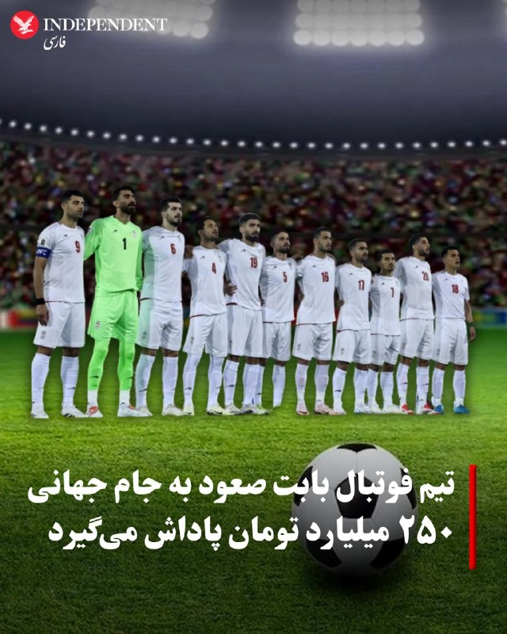

♦️خبرگزاری تسنیم گزارش داد هیات‌رییسه فدراسیون فوتبال روز دوشنبه چهار خرداد، پرداخت ۲۵۰ میلیارد تومان پاداش برای بازیکنان، مربیان و سایر اعضای تیم ملی فوتبال ایران بابت صعود به جام جهانی ۲۰۲۶ را تصویب کرده است.

بر اساس این گزارش، این مبلغ میان تمامی اعضای تیم ملی تقسیم خواهد شد و قرار است از محل مطالبات فدراسیون فوتبال از فیفا تامین شود.

تسنیم نوشت در جلسه هیات‌رییسه، ابتدا رقم بالاتری برای پاداش صعود به جام جهانی مطرح شده بود، اما در نهایت اعضا با پرداخت ۲۵۰ میلیارد تومان موافقت کردند.
‌🇸🇦 Indypersian

🤖 @VahidOOnLine

## VahidOOnLine — post 242215

  

♦️به دنبال افزایش دوباره قیمت لبنیات، قیمت مصوب شیر بطری به ۹۸ هزار تومان و قیمت ماست دبه‌ای (۲ کیلویی) به دست‌کم ۲۲۸ هزار و ۷۰۰ تومان رسیده است. این در حالی است که در فروشگاه‌‌های آنلاین و سوپر‌ها، قیمت لبنیات بسیار بیشتر است. برای مثال شیر پرچرب یک لیتری میهن در فروشگاه‌های آنلاین دست‌کم ۱۳۰ هزار تومان فروخته می‌شود و پنیر نیم کیلویی روزانه ۲۸۳ هزار تومان قیمت دارد.کره ۱۰۰ گرمی دامداران ۹۲ هزار و ۶۰۰ تومان و بستنی وانیلی دومینو (۲ لیتری) ۴۷۵ هزار تومان به فروش می‌رسد. قیمت ماست ۹۰۰ گرمی کاله نیز در فروشگاه‌های آنلاین ۲۴۸ هزار تومان است. افزایش شدید قیمت‌ها به حذف با محدودیت مصرف لبنیات در بین خانوارهای ایرانی منجر شده است که تاثیرات آن بر سلامتی مردم به ویژه کودکان و نوجوانان در سال‌های پیش‌رو نمایان خواهد شد. این در حالی است که گوشت نیز برای بسیار از خانواده‌ها دست نیافتنی شده است.
‌🇸🇦 Indypersian

🤖 @VahidOOnLine

## VahidOOnLine — post 242214

  

مارکو روبیو، وزیر خارجه آمریکا، در واکنش به حمله روز دوشنبه ایالات‌متحده به اهداف ایرانی گفت: «تنگه‌ها باید باز بمانند و به هر شکلی باز خواهند ماند.» او درباره مذاکرات حکومت ایران در قطر گفت چانه‌زنی بر سر متن اولیه توافق ادامه دارد و نهایی‌کردن زبان توافق ممکن است چند روز طول بکشد.
‌🏁 🇬🇧 IranintlTV

🤖 @VahidOOnLine

## VahidOOnLine — post 242213

  <a href="telegram/content/VahidOOnLine_242213_1779774981.mp4" target="_blank">🎬 Download video</a>

♦️امیره حشوی، ملکه زیبایی لبنانی‌تبار اهل دیربورن‌ هایتس ایالت میشیگان که در تاریخ ۱۰ اوت ۲۰۲۵ با کسب عنوان «ملکه زیبایی شهرستان وین» (Miss Wayne County) در ایالت میشیگان، به عنوان نخستین زن محجبه در تاریخ مسابقات سازمان «دوشیزه آمریکا» تاج بر سر گذاشت در رژه صد‌مین سالگرد روز یادبود در شهر دیربورن شرکت کرد. او در این ویدیو تاج ملکه زیبایی را روی روسری گذاشته است. دیربورن یکی از بالاترین تمرکزهای جمعیت عرب‌ و مسلمان در آمریکا را دارد و در برخی برآوردها جمعیت عرب‌تبار این منطقه حدود ۴۰ درصد کل جمعیت برآورد می‌شود. به‌طور کلی ایالت میشیگان نیز یکی از بزرگترین و قدیمی‌ترین جمعیت‌های مسلمان و عرب را در آمریکا دارد.
‌🇸🇦 Indypersian

🤖 @VahidOOnLine

## FoxNewsTwitter — post 342256

  <a href="telegram/content/FoxNewsTwitter_342256_1779774983.mp4" target="_blank">🎬 Download video</a>

Fox News (Twitter/X)

At one of America’s most sacred places, Gretchen Wilson delivered a Memorial Day performance that brought the crowd to a standstill.

Wilson sang “God Bless America” during Freedom 250’s ceremony at Arlington National Cemetery, with veterans and military families gathered in tribute.

The emotional performance served as a reminder of the sacrifice behind the holiday.

## pm_afshaa — post 91513

شاهزاده رضا پهلوی : یکی از اعضای پارلمان حتی به من گفت فکر نمی‌کنه ایرانی‌ها آماده دموکراسی باشن

- ایرانی‌ها فقط آماده دموکراسی نیستن 40 هزار نفر جونشونو برای اون دادن و نمی‌ذارم این فداکاری بی‌نتیجه بمونه
- چه اروپا کنار ما باشه چه رسانه‌هاتون کارشون رو درست انجام بدن چه سیاستمداراتون شجاعت نشون بدن من برای مردم و کشورم می‌جنگم
- حتی اگه مجبور باشیم تنها باشیم تا وقتی ایران آزاد بشه می‌جنگیم

💧Rainbet.com the #1 Non-KYC Crypto Casino & Sportsbook @rainbetcom

😁 @Pm_Afshaa

## mamlekate — post 103585

📝 مارکو روبیو درباره مذاکرات با جمهوری اسلامی: امروز گفت‌وگوهایی در قطر جریان داشت

مارکو روبیو، وزیر امورخارجه آمریکا، روز سه‌شنبه در جریان سفر رسمی خود به هند به خبرنگاران گفت: «امروز گفت‌وگوهایی در قطر در جریان بود، بنابراین خواهیم دید که آیا می‌توانیم پیشرفتی داشته باشیم یا خیر.»

📝 واشنگتن در پی فرمولی برای حذف ذخایر اورانیوم ایران بدون انتقال به آمریکا

به گزارش نیویورک پست، مقام‌های آمریکایی در حال بررسی روش‌هایی هستند که ایران بتواند ذخایر اورانیوم با غنای بالا را بدون تحویل مستقیم به واشنگتن از بین ببرد.

📝 چارچوب سه‌مرحله‌ای توافق: بازگشایی هرمز، نابودی اورانیوم، کاهش محاصره و سپس مذاکره بر سر شرایط مذاکره صلح

@mamlekate

## mamlekate — post 103584

📝 سنتکام: به چند سایت پرتاب موشک و قایق در جنوب ایران حمله کردیم

ارتش آمريکا اعلام کرد حملات تازه‌ای را به جنوب ايران انجام داده و سايت‌های موشکی ايران و قايق‌هايی را که «در تلاش برای مين‌گذاری» بودند، هدف قرار داده است.

@mamlekate

## VahidOnline — post 75721

با وجود حملات اخیر آمریکا به سامانه‌های موشکی و قایق‌های ایران در خلیج فارس که وضعیت آتش‌بس شکننده را متزلزل‌تر کرده است،‌ مارکو روبیو، وزیر خارجه آمریکا روز سه‌شنبه گفت که توافق با ایران «همچنان امکان‌پذیر است.»

او در هند به خبرنگاران گفت: «امروز مذاکراتی در قطر در جریان بود،‌ و باید دید آیا می‌توانیم شاهد پیشرفتی باشیم یا خیر. فکر می‌کنم بخش زیادی از زمان صرف دقت در کلمات و واژه‌های به کار گرفته در متن اسناد می‌شود، بنابراین چند روز طول خواهد کشید.»

آقای روبیو افزود: «رئیس‌جمهور تمایل خود را برای انجام این کار ابراز کرده است. او یا به یک توافق خوب دست خواهد یافت یا هیچ توافقی نخواهد کرد.»

آقای روبیو به خبرنگاران گفت که تنگه هرمز باید باز باشد.

او گفت که آنها به هر حال این مسیر را باز خواهند کرد و افزود: «آنچه در آنجا اتفاق میافتد،‌ غیرقانونی است و باعث بی‌ثباتی برای جهان و غیرقابل قبول است.»
@VahidHeadline

📡 @VahidOnline

## VahidOnline — post 75720

  

وزارت خارجه آمریکا اواخر دوشنبه به وقت واشنگتن گفت مارکو روبیو وزیر امور خارجه، به در خواست همتای روس خود سرگئی لاوروف، با او صحبت کرد. در این تماس تلفنی، دو وزیر درباره جنگ روسیه و اوکراین، روابط دوجانبه و اوضاع ایران صحبت کردند.
@VahidHeadline

📡 @VahidOnline

## IranIntlTV — post 339035

  

ابوالفضل شکارچی، سخنگوی ارشد نیروهای مسلح جمهوری اسلامی در گفت‌وگو با شبکه الجزیره گفت: «در صورت هرگونه حمله، واکنش تهران شدیدتر از گذشته خواهد بود و دامنه درگیری می‌تواند از منطقه فراتر برود.»

او افزود: «جمهوری اسلامی برای جنگ آماده است و در صورت حمله دوباره آمریکا یا اسرائیل، اهداف مورد نظر را از پیش شناسایی کرده است.»

شکارچی ادامه داد: «حملات احتمالی تهران با حملات قبلی تفاوت خواهد داشت و شامل غافلگیری و تاکتیک‌های جدید می‌شود و اگر در جریان جنگ مانع صادرات نفت شوند، جمهوری اسلامی از خروج نفت از منطقه جلوگیری خواهد کرد.»
https://iranintl.com/202605261837

## IranIntlTV — post 339034

  <a href="telegram/content/IranIntlTV_339034_1779774985.mp4" target="_blank">🎬 Download video</a>

در پی حملات گسترده ارتش روسیه به کی‌یف، پایتخت اوکراین، و مناطق اطراف آن، دست‌کم چهار نفر کشته و ده‌ها نفر زخمی شدند.

علی حسن‌پور، خبرنگار ایران‌اینترنشنال، گزارش می‌دهد
@iranintltv

## IranIntlTV — post 339033

  

ابراهیم عزیزی، رییس کمیسیون امنیت ملی مجلس، با اشاره به مذاکرات با آمریکا، گفت: «تا زمانی که منافع کامل جمهوری اسلامی تامین نشود، هیچ اقدامی انجام نخواهد شد و مجلس مسائل را با حساسیت دنبال می‌کند.»

او افزود: «مردم نگران نباشند، مسئولان با دقت در حال رصد و بررسی همه موضوعات هستند.»

این نماینده مجلس ادامه داد: «روند فعلی ادامه دارد و اگر اقدامات اعتمادساز آمریکا نتایج ملموس داشته باشد، ممکن است زمینه برای گام‌های بعدی فراهم شود.»
https://iranintl.com/202605264082

## IranIntlTV — post 339032

  <a href="https://t.me/IranintlTV/339032" target="_blank">📎 Download file</a>

🎧نسخه صوتی اخبار بامدادی | سه‌شنبه ۵ خرداد
@iranintlTV

## IranIntlTV — post 339031

  <a href="telegram/content/IranIntlTV_339031_1779774987.mp4" target="_blank">🎬 Download video</a>

تغییر الگوی دسترسی کاربران ایرانی تلفن همراه به اینترنت جهانی
@iranintltv

## IranIntlTV — post 339030

  <a href="telegram/content/IranIntlTV_339030_1779774989.mp4" target="_blank">🎬 Download video</a>

تغییر الگوی دسترسی کاربران ایرانی تلفن همراه به اینترنت جهانی
@iranintltv

## IranIntlTV — post 339028

  <a href="https://t.me/IranintlTV/339028" target="_blank">📎 Download file</a>

🎧نسخه صوتی سیاست با مرد ویسی: امان‌نامه موقت ترامپ به فرماندهان سپاه
@iranintlTV

## IranIntlTV — post 339027

  <a href="telegram/content/IranIntlTV_339027_1779774990.mp4" target="_blank">🎬 Download video</a>

جمعی از دانشجویان ایرانی ساکن میلان در تجمعی اعتراضی خواستار توجه و حمایت دولت ایتالیا از شهروندان و دانشجویان ایرانی شدند. شرکت‌کنندگان در این تجمع نسبت به نقض حقوق بشر و سرکوب معترضان در ایران ابراز نگرانی کردند.

گزارش صدف باغبانی، روزنامه‌نگار
@iranintltv

## IranIntlTV — post 339026

  

روزنامه کیهان در مطلبی با اشاره به‌عدم صدور ویزا برای عباس عراقچی جهت سفر به نیویورک، نوشت: «برای پایان‌دادن به نمایش مضحک ترامپ، تنبیه و تادیب آمریکا و در پاسخ به‌عدم صدور ویزا، باید توقف مذاکرات اعلام شود تا ضمن حفظ عزت و احترام، شاهد اقدام مشابه در آینده نباشیم.»

این روزنامه اضافه کرد: «تناقض رفتاری و گفتاری میان ترامپ و مقامات دولت او یک امر رایج است و این موضوع از عدم صدور ویزا برای عراقچی و ادعای اشتیاق برای توافق با جمهوری اسلامی قابل استناد است.»
https://iranintl.com/202605265646

## IranIntlTV — post 339025

  <a href="telegram/content/IranIntlTV_339025_1779774992.mp4" target="_blank">🎬 Download video</a>

سازمان حقوق بشر ایران اعلام کرد قوه قضاییه جمهوری اسلامی از ۲۷ اسفند تاکنون دست‌کم ۳۸ معترض و زندانی سیاسی را اعدام کرده است.

گفت‌وگو با نیلوفر رستمی، خبرنگار ایران‌اینترنشنال
@iranintltv

## IranIntlTV — post 339024

  <a href="telegram/content/IranIntlTV_339024_1779774993.mp4" target="_blank">🎬 Download video</a>

توافق احتمالی میان جمهوری اسلامی و آمریکا در روزهای اخیر با واکنش‌های گسترده‌ای در کنگره آمریکا همراه شده است.

مرضیه حسینی، خبرنگار ایران‌اینترنشنال، گزارش می‌دهد

.
@iranintltv

## IranIntlTV — post 339023

  

به گزارش رسانه‌های ایران، «تلما» که از یوزپلنگ‌های شناخته‌شده و موفق در زادآوری در زیستگاه‌های کشور به شمار می‌رود، دوباره در زیستگاه‌های طبیعی استان خراسان شمالی مشاهده شد. این یوزپلنگ هفت‌ساله در سال ۱۴۰۱ با ثبت چهار توله، نقش مهمی در پویایی جمعیت یوزپلنگ آسیایی ایفا کرده بود.
https://iranintl.com/202605264991

## IranIntlTV — post 339022

  <a href="telegram/content/IranIntlTV_339022_1779774995.mp4" target="_blank">🎬 Download video</a>

کنفدراسیون کار ایران، خارج از کشور، در نامه‌ای به اتحادیه‌های کارگری، فدراسیون‌های جهانی و نهادهای مرتبط، خواستار آغاز روند رسمی شکایت علیه جمهوری اسلامی شد.

گفت‌وگو با ​روزبه بوالهری، عضو تحریریه ایران‌اینترنشنال
@iranintltv

## IranIntlTV — post 339021

  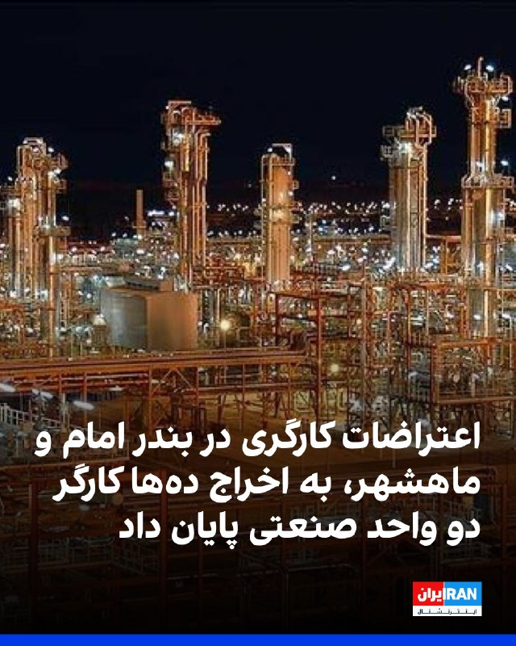

در پی یک هفته اعتراضات کارگری در بندر امام و ماهشهر، فرمانداری و مسئولان اداره کار دستور بازگشت به کار بیش از ۶۰ نفر از کارگران اخراجی دو واحد صنعتی در این شهرها را صادر کردند.
ایلنا به نقل از «منابع کارگری» نوشت پس از یک هفته تجمع کارگران در مقابل دفتر شرکت و فرمانداری بندرامام، در جلسه یکشنبه فرماندار و سایر مسئولان شهرستان با حضور مدیرعامل شرکت پتروناد و مدیرکل کار بندر امام «دستوری تنظیم و ابلاغ شد» مبنی بر اینکه کارگران اخراجی «باید ظرف ۲۴ ساعت به کار برگردند.»
همچنین در پی جلسه بررسی مشکلات کارگران قراردادی شرکت پایانه‌ها و مخازن ماهشهر از سوی شورای تامین شهرستان ماهشهر، دستور بازگشت به کار هشت کارگر اخراجی در سریع‌ترین زمان ممکن صادر شد.
این جلسه پس از سه روز اعتراضات صنفی کارگران قراردادی این شرکت برگزار شد.

https://iranintl.com/202605266338

## IranIntlTV — post 339020

  <a href="telegram/content/IranIntlTV_339020_1779774997.mp4" target="_blank">🎬 Download video</a>

سرخط خبرهای سه‌شنبه ۵ خرداد
@iranintltv

## IranIntlTV — post 339019

  

گروه جهانی بی‌تی‌اس در مراسم امسال جوایز موسیقی آمریکا در لاس‌وگاس، برنده جایزه هنرمند سال شد. این گروه برای کسب عنوان هنرمند سال با هنرمندان مطرحی چون بد بانی، برونو مارس، تیلور سوییفت، هری استایلز، لیدی گاگا، جاستین بیبر، کندریک لامار، مورگان والن و سابرینا کارپنتر رقابت کرد.
این دومین بار است که بی‌تی‌اس این جایزه را دریافت می‌کند. آن‌ها نخستین بار در سال ۲۰۲۱ برنده این جایزه شدند و این اولین باری بود که هنرمندان آسیایی در این مراسم که بر اساس رای هواداران برگزار می‌شود، برنده می‌شد.
اعضای گروه شامل آر‌ام، جین، شوگا، جی‌هوپ، جیمین، وی و جونگ کوک همگی برای دریافت جایزه در مراسم حضور داشتند. آن‌ها به‌تازگی دومین اجرای خود از چهار شب کنسرت پیاپی و کاملا فروخته‌شده در ورزشگاه الیجنت در لاس‌وگاس را به پایان رسانده بودند.
این گروه از هواداران خود که با نام «آرمی» شناخته می‌شوند، قدردانی کرد. آر‌ام در سخنرانی خود به جمعیت تشویق‌کننده گفت: «افتخار بزرگی است که پس از پایان خدمت نظامی همه اعضا، بار دیگر این جایزه ارزشمند را دریافت می‌کنیم.»

https://iranintl.com/202605266357

## IranIntlTV — post 339018

  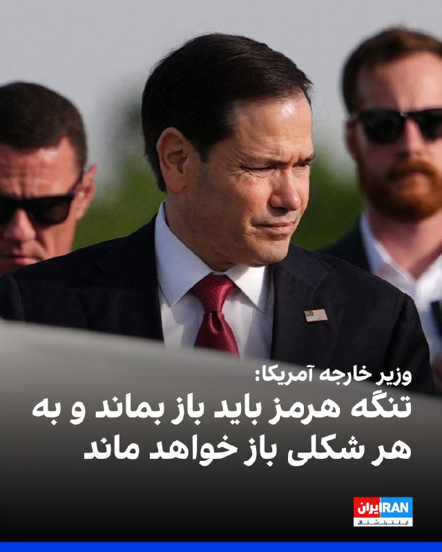

مارکو روبیو، وزیر خارجه آمریکا، در واکنش به حمله روز دوشنبه ایالات‌متحده به اهداف ایرانی گفت: «تنگه‌ها باید باز بمانند و به هر شکلی باز خواهند ماند.» او درباره مذاکرات حکومت ایران در قطر گفت چانه‌زنی بر سر متن اولیه توافق ادامه دارد و نهایی‌کردن زبان توافق ممکن است چند روز طول بکشد.
https://iranintl.com/202605261875

## FarsiVOA — post 218675

  

رسانه‌های اسرائیلی گزارش دادند داوید زینی، رئیس شاباک سازمان امنیت داخلی اسرائیل، در سفری اخیر به امارات متحده عربی با محمد دحلان، رئیس پیشین امنیتی تشکیلات خودگردان فلسطینی در غزه، دیدار کرده است.

تایمز اسرائیل به نقل از شبکه کان نوشت این دیدار بر اساس گفته منابع اسرائیلی و منطقه‌ای انجام شده، اما شین‌بت در پاسخ به پرسش این شبکه گفته درباره برنامه سفر زینی اظهار نظر نمی‌کند.

دحلان از سال ۲۰۱۱، پس از اختلاف شدید با محمود عباس، از کرانه باختری رانده شد و به ابوظبی رفت؛ جایی که به یکی از چهره‌های نزدیک به محمد بن زاید، رئیس امارات، تبدیل شد.

رویترز پیش‌تر گزارش داده بود امارات با آمریکا و اسرائیل درباره نقش احتمالی در اداره موقت، امنیت و بازسازی غزه پس از جنگ گفت‌وگو کرده است؛ طرحی که از نگاه ابوظبی باید با اصلاح تشکیلات خودگردان و مسیر معتبر به سوی دولت فلسطینی همراه باشد.

این دیدار نشانه‌ای مهم از تلاش اسرائیل و امارات برای بررسی گزینه‌های «روز بعد از جنگ» در غزه است؛ گزینه‌ای که در آن دحلان می‌تواند به‌عنوان چهره‌ای ضدحماس، اما جدا از ساختار فعلی محمود عباس، دوباره به معادلات فلسطینی بازگردد.
@FarsiVOA

## FarsiVOA — post 218674

🔺تأکید روبیو بر مقابله جمعی با مشکلات جهانی در «مجمع چهارجانبه امنیتی»

▪️وزیر خارجه آمریکا، در ابتدای مجمع چهارجانبه امنیتی در دهلی‌نو با حضور ایالات متحده، هند، استرالیا و ژاپن گفت: «این مجمع به‌طور فزاینده‌ای در حال تبدیل به بستری است که در آن باید اقدام کنیم.»

▪️مارکو روبیو افزود: این اقدامات می‌تواند «پاسخ بشردوستانه، امنیت انرژی، آزادی ناوبری، نیاز به متنوع‌سازی منابع تأمین‌مان، نه فقط در حوزه انرژی، بلکه در مواد معدنی حیاتی و زنجیره‌های تأمین باشد.»

▪️نشست اخیر وزرای خارجه کشورهای عضو مجمع چهارجانبه امنیتی، سومین نشست مشابه از سپتامبر ۲۰۲۴ تاکنون است.

⬇️ بیشتر بخوانید:
https://ir.voanews.com/a/8153986.html

## FarsiVOA — post 218673

  

شامگاه دوشنبه مواضع حزب آزادی کردستان (پاک)، در نزدیکی اربیل هدف حملات موشکی و پهپادی جمهوری اسلامی قرار گرفت.

این حمله حوالی ساعت ۲۱:۵۵ به وقت اقلیم کردستان عراق در اربیل انجام شده و تصاویر منتشرشده، بقایای موشک‌های استفاده‌شده در این حملات را نشان می‌دهد.

بر اساس گزارش‌ها، در این حمله ۹ پیشمرگه پارت آزادی کردستان زخمی شده‌اند و حال چهار نفر از آنان وخیم اعلام شده است.
@FarsiVOA

## FarsiVOA — post 218672

🔺قطر پرداخت ۱۲ میلیارد دلار به تهران برای تضمین توافق را تکذیب کرد

▪️سخنگوی وزارت خارجه قطر اعلام کرد که گزارش‌ها مبنی بر این که این کشور «برای تضمین دستیابی به یک توافق، ۱۲ میلیارد دلار به ایران پیشنهاد کرده»، حقیقت ندارد.

▪️همزمان خبرگزاری تسنیم، وابسته به سپاه پاسداران، نوشت که سفر محمدباقر قالیباف به همراه وزیر خارجه و رئیس بانک مرکزی جمهوری اسلامی به قطر «در جهت آزادسازی بخشی از پول‌های بلوکه شده در مرحله اول اجرایی شدن یادداشت تفاهم احتمالی است.»

▪️دونالد ترامپ اعلام کرده که اگر با رژیم ایران توافقی انجام دهد، توافقی خوب و مناسب خواهد بود، «نه مانند توافقی که اوباما انجام داد و به [رژیم] ایران مقادیر زیادی پول نقد و مسیری روشن و باز به سوی سلاح هسته‌ای داد.»

⬇️ بیشتر بخوانید:
https://ir.voanews.com/a/8153985.html

## FarsiVOA — post 218671

  

رویترز گزارش داد هم‌زمان با ادامه گفت‌وگوهای ایران و آمریکا در دوحه، حملات تازه نیروهای آمریکا در جنوب ایران امید بازارها به توافق سریع را کاهش داد و باعث نوسان در بازارهای جهانی شد.

بر اساس این گزارش، بهای نفت برنت در معاملات آسیایی بیش از یک درصد افزایش یافت و به ۹۷ دلار و ۳۲ سنت برای هر بشکه رسید. نفت وست‌تگزاس اینترمدیت آمریکا نسبت به آخرین معامله دوشنبه اندکی بالا بود، اما همچنان نسبت به پایان معاملات جمعه ۵.۵ درصد پایین‌تر قرار داشت.

در بازار سهام، شاخص گسترده سهام آسیا-اقیانوسیه خارج از ژاپن ۰.۸ درصد رشد کرد، اما نیکی ژاپن ۰.۲ درصد افت داشت. معاملات آتی نزدک ۰.۹ درصد و اس‌اندپی ۵۰۰ ۰.۶۸ درصد بالا رفتند. در اروپا، یورواستاکس ۰.۳۶ درصد و دکس آلمان ۰.۴۳ درصد افت کردند، اما فوتسی بریتانیا ۰.۴ درصد رشد داشت.

طلای نقدی نیز ۰.۵ درصد کاهش یافت و به ۴۵۴۵ دلار و ۹۰ سنت در هر اونس رسید.
@FarsiVOA

## FarsiVOA — post 218670

🔺مارکو روبیو درباره مذاکرات با جمهوری اسلامی: امروز گفت‌وگوهایی در قطر جریان داشت

▪️مارکو روبیو، وزیر امورخارجه آمریکا، روز سه‌شنبه ۵ خرداد در جریان سفر رسمی خود به هند به خبرنگاران گفت: «امروز گفت‌وگوهایی در قطر در جریان بود، بنابراین خواهیم دید که آیا می‌توانیم پیشرفتی داشته باشیم یا خیر.»

⬇️ بیشتر بخوانید:
https://ir.voanews.com/a/8153982.html
@FarsiVOA

## FarsiVOA — post 218669

  

⚡️وزارت خارجه آمریکا اواخر دوشنبه به وقت واشنگتن گفت مارکو روبیو وزیر امور خارجه، به در خواست همتای روس خود سرگئی لاوروف، با او صحبت کرد. در این تماس تلفنی، دو وزیر درباره جنگ روسیه و اوکراین، روابط دوجانبه و اوضاع ایران صحبت کردند.

@FarsiVOA

## FarsiVOA — post 218668

🔺اسرائيل به بیش از ۷۰ زیرساخت حزب‌الله در لبنان حمله کرد و شماری از اعضای آن را کشت

▪️ارتش اسرائيل روز دوشنبه ۴ خرداد اعلام کرد که در چندین رشته عملیات در سراسر لبنان، بیش از ۷۰ موضع زیرساختی گروه تروریستی حزب‌الله را هدف قرار گرفت.

⬇️ بیشتر بخوانید:
https://ir.voanews.com/a/8153978.html
@FarsiVOA

## FarsiVOA — post 218667

⚡️صدای موافقان و منتقدان کنگره آمریکا در سایه احتمال توافق با جمهوری اسلامی
@FarsiVOA

## FarsiVOA — post 218666

⚡️تنگه هرمز و بحران کمک‌های غذایی و تجارت افغانستان زیر فشار جنگ و گرانی
@FarsiVOA

## DW_Farsi — post 125146

  

🔶 سنتکام از حمله به سایت‌های موشکی و شناورهای مین‌گذار در جنوب ایران خبر داد

فرماندهی مرکزی ایالات متحده آمریکا، سنتکام، در بیانیه‌ای اعلام کرد ارتش آمریکا در جنوب ایران عملیاتی را "برای دفاع از خود" انجام داده و مواضع پرتاب موشک و شناورهای ایرانی را که "در حال تلاش برای کارگذاری مین بودند" هدف قرار داده است.

تیم هاوکینز، سخنگوی سنتکام در این بیانیه گفته است: «نیروهای آمریکایی امروز [سه‌شنبه ۲۶ مه] در جنوب ایران حملات دفاع از خود انجام دادند تا از نیروهای ما در برابر تهدیدهای ناشی از نیروهای ایرانی محافظت شود.»

به گفته سخنگوی سنتکام اهداف این حملات "شامل سایت‌های پرتاب موشک و قایق‌های ایرانی بودند که در تلاش برای مین‌گذاری بودند".

هاوکینز افزوده است که ارتش آمریکا در طول آتش‌بس جاری ضمن اعمال خویشتنداری، همچنان به دفاع از نیروهای خود ادامه خواهد داد.

در همین حال یک مقام ارشد آمریکایی به شبکه خبری "فاکس نیوز" گفته است که دو قایق ایرانی در تنگه هرمز در حال مین‌گذاری مشاهده شدند و همچنین نیروهای آمریکایی پس از آنکه یک پایگاه موشکی [ایران]، هواپیماهای جنگی آمریکا را هدف قرار داد، واکنش نشان دادند. به گفته این مقام آمریکایی ارتش ایالات متحده هر دو شناور سپاه پاسداران را منهدم کرد و همچنین به سایت‌های پرتاب موشک‌های زمین به هوا در بندرعباس حمله کرد. او به فاکس نیوز گفت این حملات "دفاعی" بوده‌اند.

@dw_farsi

## Persian_Trend_Official — post 15029

  

⭕️ترامپ: «اورانیوم غنی‌شده (غبار هسته‌ای!) فوراً به ایالات متحده تحویل داده خواهد شد تا به کشور بازگردانده شده و نابود شود، یا بهتر از آن، با همکاری و هماهنگی با جمهوری اسلامی ایران، در همان محل یا در مکانی قابل قبول دیگر نابود گردد؛ آن هم با حضور و نظارت…

## RadioFarda — post 157557

  

🔸دونالد ترامپ، رئیس‌جمهور آمریکا، می‌گوید اورانيوم غنی‌شده ایران «يا فوری به ايالات متحده تحويل داده خواهد شد تا به آمريکا منتقل و نابود شود، يا ترجيحاً با همکاری و هماهنگی جمهوری اسلامی ايران، در همان محل يا در مکانی ديگر که مورد توافق باشد، نابود خواهد شد».

🔸ترامپ در شبکه اجتماعی خود، تروث‌سوشال، نوشت که این اقدام «با نظارت آژانس انرژی اتمی يا نهاد معادل آن به‌عنوان ناظر بر اين روند و اين رويداد انجام می‌شود.»

🔸باراک راوید، گزارشگر نشریه اکسیوس، این پست رئیس‌جمهور آمریکا را «عقب‌نشینی» آمریکا از تقاضای قبلی خود و نزدیک ‌شدن به آن چیزی عنوان کرده که جمهوری اسلامی دنبال آن بوده است.

🔸بنیامین نتانیاهو، نخست‌وزیر اسرائیل، در روزهای اخیر گفته بود بدون خروج ذخایر اورانیوم غنی‌شده از ایران، جنگ پایان نمی‌یابد.

@RadioFarda

## RadioFarda — post 157556

  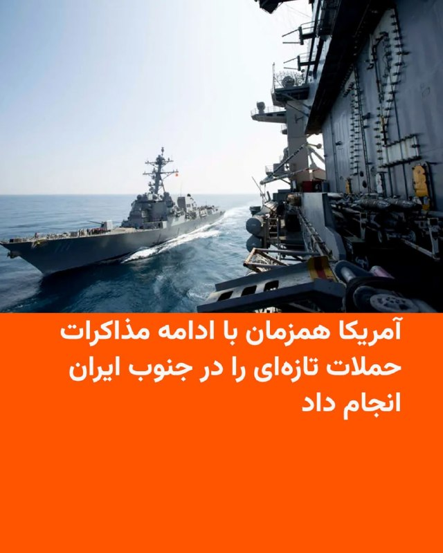

🔸ستاد فرماندهی مرکزی آمریکا، سنتکام روز سه‌شنبه پنجم خرداد اعلام کرد که نیروهای آمریکایی در جنوب ایران در پاسخ به آنچه تهدید نیروهای جمهوری اسلامی خوانده شده، عملیات دفاعی انجام داد.

🔸بنا بر اعلام سنتکام اهداف این عملیات شامل سایتهای پرتاب موشک و قایق‌هایی بوده که در تلاش برای مین گذاری دریایی بودند.

🔸 یک مقام ارشد آمریکایی به فاکس نیوز گفت دو شناور سپاه پاسداران که در حال مین گذاری در تنگه هرمز شناسایی شده بودند توسط ارتش آمریکا منهدم شدند.

🔸به گفته مقام‌های آمریکایی همچنین یک سامانه موشکی زمین به هوادر بندرعباس که جنگنده ههای آمریکایی را هدف قرار داده بود مورد حمله قرار گرفت.

🔸واشینگتن تاکید کرده است که این حملات ماهیت دفاعی داشته و به معنای پایان آتش بس جاری نیست.

🔸پیشتر رسانه‌ها در ایران از شنیده شدن صدای انفجار در بندرعباس و چند شهر دیگر خبر داده بودند.

@RadioFarda

## RadioFarda — post 157555

  

🔸ساعتی پس از خبر خبرگزاری سپاه پاسداران درباره حمله پهپادی به نقطه‌ای در نزدیکی اربیل، خبرگزاری رویترز تأیید کرد که «مقر یک گروه اپوزیسیون» جمهوری اسلامی در شمال اربیل در کردستان عراق هدف قرار گرفته است.

🔸به نوشته رویترز به نقل از «منابع امنیتی»، این حمله راکتی بوده و دو عضو این گروه را زخمی کرده است.

🔸خبرگزاری تسنیم وابسته به سپاه پاسداران نوشته است که این حمله به «مراکز تسلیحاتی گروهک تجزیه‌طلب» در اربیل انجام شده است.

🔸در ادبیات مقامات جمهوری اسلامی، «گروهک تجزیه‌طلب» اشاره به گروه‌های کرد مخالف حکومت ایران دارد.

@RadioFarda

## RadioFarda — post 157554

  <a href="https://t.me/radiofarda/157554" target="_blank">📎 Download file</a>

📻بشنوید: سرخط خبرها با رادیوفردا، پنجم خرداد ۱۴۰۵‌

@RadioFarda

## BBCPersian — post 282078

  

🔻ماجد محمد انصاری، سخنگوی وزارت خارجه قطر در شبکه ایکس نوشته است: «گزارش‌هايی که ادعا می‌کنند قطر برای تضمين دستيابی به توافق، ۱۲ ميليارد دلار به ايران پيشنهاد کرده، به هيچ وجه صحت ندارد.»او اضافه کرده است که این گزارش‌ها «از سوی طرف‌هايی منتشر می شود که تلاش دارند اين توافق را تخريب کرده و روند جاری ديپلماتيک برای کاهش تنش و ثبات منطقه‌ای را تضعيف کنند.»

آقای انصاری در شبکه ایکس نوشت: «نقش ديپلماتيک قطر، در هماهنگی با شرکای منطقه‌ای، کاملا شناخته شده و به صورت عمومی مستند شده است و چنين روايت هايی چيزی جز تلاش های نااميدانه برای خدشه‌دار کردن اعتبار قطر به عنوان يک ميانجی قابل اعتماد صلح در عرصه بين المللی نيست.»

روز گذشته (دوشنبه) هیئت نمایندگی ایران به ریاست محمدباقر قالیباف، رئیس مجلس، در سفری غیرمنتظره وارد قطر شد. عباس عراقچی، وزیر خارجه، هم او را همراهی می‌کند.

📸 Getty

https://bbc.in/4u071Sq
@BBCPersian

## BBCPersian — post 282076

🔻شهرداری تهران: ۹۷ درصد از خانه‌هایی که از جنگ آسیب جزئی دیده بودند، بازسازی شدند

عبدالمطهر محمدخانی، سخنگوی شهرداری تهران گفته است ۹۷ درصد از ۳۹ هزار و ۶۵۰ واحد مسکونی که در جریان حملات آمریکا و اسرائیل به تهران آسیب‌های جزئی دیده بودند تعمیر شده‌اند.

این مقام شهرداری تهران آسیب جزیی را شامل «شیشه‌های شکسته و در و پنجره‌های آسیب دیده» تعریف کرده و همچنین از آمار ۷۵ درصدی بازسازی خانه‌هایی که سطح آسیب آنها «متوسط» ارزیابی شده خبر داده است.

https://bbc.in/4u071Sq
@BBCPersian

## BBCPersian — post 282075

🔻زمان و مکان مراسم تشییع علی خامنه‌ای «هنوز مشخص نشده است»

محسن محمودی، رئیس شورای هماهنگی تبلیغات اسلامی استان تهران، به خبرنگاران گفته است این نهاد به دنبال ترتیب دادن تشریفات مراسم تشییع علی خامنه‌ای، رهبر پیشین جمهوری اسلامی است و از نظر او این «یک مراسم جهانی خواهد بود که در تاریخ جهان اسلام و ایران ثبت می‌شود.»او اضافه کرده است: «هم‌اکنون شاهد ثبت‌نام و اعلام آمادگی از کشورهای دیگر مانند عراق برای حضور در این مراسم هستیم. قطعاً سران کشورهای اسلامی و غیراسلامی و رهبران جبهه مقاومت برای حضور در این تشییع تاریخی ابراز تمایل خواهند کرد.»

آقای محمودی گفته است که سازمان‌ها و نهادهای مختلف در حال هماهنگی و برنامه‌ریزی برای برگزاری این رویدادند با این حال: «تا این لحظه هیچ زمان مشخصی برای این موضوع تعیین نشده است.»

علی خامنه‌ای در نخستین ساعات آغاز حملات آمریکا و اسرائیل، حدود سه ماه پیش و در جریان بمباران سنگین مجموعه کاری و اقامتی‌اش (بیت رهبری) کشته شد.

https://bbc.in/4u071Sq
@BBCPersian

## BBCPersian — post 282065

🖌سباستین آشر, خبرنگار امور بین‌الملل، بی‌بی‌سی:

🔻پادشاهان مستبد، روزگاری بازتاب شکوه و جلال خود را در ویرانه‌های پروژه‌های عظیمی به یادگار می‌گذاشتند که در اوج قدرت بلامنازع خود دستور ساختشان را داده بودند. ردپای آن بناهای عظیم هنوز در دشت‌های حاصلخیز، دامنه کوه‌ها و بیابان‌های خاورمیانه دیده می‌شود. اما یکی از برجسته‌ترین نمونه‌های امروزی این فرمانروایان، شاید در نهایت تنها ردپایی دیجیتال از جاه‌طلبانه‌ترین طرح‌هایش به جا بگذارد.

حدود یک دهه پیش، محمد بن سلمان، ولیعهد عربستان سعودی، طرحی برای بازآفرینی کشورش ارائه کرد که بیشتر به داستان‌های علمی‌تخیلی شباهت داشت. این طرح، «چشم‌انداز ۲۰۳۰» نام گرفت. قرار بود سازه‌های عظیم و خارق‌العاده، زمینه‌ساز فناوری‌هایی نوین شوند؛ آن هم نه فقط برای عربستان، بلکه برای جهان.

📸GettyImages/ Reuters/ Bloomberg via Getty Images/ AFP via Getty Images

https://bbc.in/4nLRVhP
@BBCPersian

## BBCPersian — post 282064

  

‌
با وجود حملات اخیر آمریکا به سامانه‌های موشکی و قایق‌های ایران در خلیج فارس که وضعیت آتش‌بس شکننده را متزلزل‌تر کرده است،‌ مارکو روبیو، وزیر خارجه آمریکا روز سه‌شنبه گفت که توافق با ایران «همچنان امکان‌پذیر است.»

او در هند به
خبرنگاران گفت: «امروز مذاکراتی در قطر در جریان بود،‌ و باید دید آیا می‌توانیم شاهد پیشرفتی باشیم یا خیر. فکر می‌کنم بخش زیادی از زمان صرف دقت در کلمات و واژه‌های به کار گرفته در متن اسناد می‌شود، بنابراین چند روز طول خواهد کشید.»

آقای روبیو افزود: «رئیس‌جمهور تمایل خود را برای انجام این کار ابراز کرده است. او یا به یک توافق خوب دست خواهد یافت یا هیچ توافقی نخواهد کرد.»

آقای روبیو به خبرنگاران گفت که تنگه هرمز باید باز باشد.

او گفت که آنها به هر حال این مسیر را باز خواهند کرد و افزود: «آنچه در آنجا اتفاق میافتد،‌ غیرقانونی است و باعث بی‌ثباتی برای جهان و غیرقابل قبول است.»

از سوی دیگر، دونالد ترامپ هم در شبکه اجتماعی خود، با انتشار دو تصویر گرافیکی کنار هم، بار دیگر تلاش کرد از توافق دولت اوباما با ایران انتقاد کند.

📷 AFP via Getty Images
https://bbc.in/4wQu3Oj
@BBCPersian

## BBCPersian — post 282063

با وجود تاکید دونالد ترامپ بر پیوستن عربستان و قطر به پیمان ابراهیم و برقراری روابط علنی و رسمی با اسرائیل در صورت توافق میان ایران و آمریکا، يک منبع سعودی به سی‌ان‌ان و چند رسانه دیگر گفته است «عربستان سعودی تنها زمانی روابط خود با اسرائيل را عادی سازی خواهد کرد که «مسيری غيرقابل بازگشت» برای تشکيل کشور فلسطينی ايجاد شود.»

این درخواست ریاض در چند سال گذشته مانع اصلی برقراری روابط علنی میان عربستان و اسرائیل بوده است.

روز دوشنبه همچنین گزارش شد که پاکستان هم از تلاش ترغیب‌کننده دونالد ترامپ برای عادی سازی روابط با اسرائیل «استقبال نکرده است».

https://bbc.in/4wQu3Oj
@BBCPersian

## BBCPersian — post 282056

‌
لانا پانتینگ ناخواسته به یکی از افراد شرکت‌کننده در آزمایش‌های محرمانه سیا موسوم به «ام‌کی-اولترا» تبدیل شد. این پروژه در جریان جنگ سرد، تاثیر مواد روان‌گردانی مانند ال‌اس‌دی، شوک الکتریکی و روش‌های شست‌وشوی مغزی را بر انسان‌ها، بدون رضایت آن‌ها، آزمایش می‌کرد.

بیش از ۱۰۰ موسسه، از جمله چندین بیمارستان، زندان و مدرسه در آمریکا و کانادا، در این برنامه دخیل بودند.

واقعیت تلخ مربوط به آزمایش‌های ام‌کی-اولترا در دهه ۱۹۷۰ برملا شد. از آن زمان، شماری از قربانیان تلاش کرده‌اند علیه دولت‌های آمریکا و کانادا طرح دعوی کنند. در آمریکا این پرونده‌ها بیشتر بی‌نتیجه مانده است، اما در سال ۱۹۸۸ دادگاهی در کانادا حکم داد دولت آمریکا به هر یک از ۹ قربانی ۶۷ هزار دلار بپردازد.

خانم پانتینگ می‌گوید نامش در میان دریافت‌کنندگان غرامت نبود چون آن موقع هنوز از قربانی بودن خود خبر نداشت.

📷Getty images/ SUBMITTED PHOTO

از لینک ⬇️ این مطلب را در سایت بی‌بی‌سی فارسی بخوانید.

https://bbc.in/3PCXt1K
@BBCPersian

## Dirty_Kids — post 390211

  <a href="telegram/content/Dirty_Kids_390211_1779775005.mp4" target="_blank">🎬 Download video</a>

رسما کاباره‌ باز کردن

@Dirty_Kids 👻

## Dirty_Kids — post 390210

  <a href="telegram/content/Dirty_Kids_390210_1779775006.mp4" target="_blank">🎬 Download video</a>

این ویدیو واسه سال ۲۰۱۰عه
خیلی دوست دارم بدونم این دخترا الان کجان چیکار میکنن...

@Dirty_Kids 👻

## alonews — post 122717

  <a href="telegram/content/alonews_122717_1779775007.webm" target="_blank">🎬 Download video</a>

👈گویا بامداد امروز، یک هواپیما دولت حامل مقامات عالی‌رتبه به مسکو رفت

✅ @AloNews خبر جنگ

## alonews — post 122716

  <a href="telegram/content/alonews_122716_1779775007.webm" target="_blank">🎬 Download video</a>

👈صفحه اینترنت پرو از سایت همراه اول حذف شد‌

✅ @AloNews خبر جنگ

## alonews — post 122715

  <a href="telegram/content/alonews_122715_1779775007.webm" target="_blank">🎬 Download video</a>

👈سردار شکارچی:اگر مورد حمله قرار بگیریم، حملات ما شدیدتر، سنگین‌تر و قوی‌تر خواهد بود 
✅ @AloNews خبر جنگ

## alonews — post 122714

  <a href="telegram/content/alonews_122714_1779775008.webm" target="_blank">🎬 Download video</a>

👈ادعای گاردین: در دورهای قبلی مذاکره با آمریکا، ایران گفته بود که حاضر است ذخایر اورانیوم غنی‌شده را رقیق کند، اما اجازه انتقال این ذخایر به آمریکا یا روسیه را نخواهد داد.

🔴کارشناسان می‌گویند توییت امشب ترامپ می‌تواند امتیاز بزرگی از سوی رئیس‌جمهور آمریکا محسوب شود، زیرا او به دنبال نهایی کردن توافق با ایران است.

✅ @AloNews خبر جنگ

## alonews — post 122713

  <a href="telegram/content/alonews_122713_1779775008.webm" target="_blank">🎬 Download video</a>

👈 گفت‌وگوی تلفنی روبیو و لاوروف درباره ایران

✅ @AloNews خبر جنگ

## alonews — post 122712

  <a href="telegram/content/alonews_122712_1779775008.webm" target="_blank">🎬 Download video</a>

👈سردار شکارچی:اگر مورد حمله قرار بگیریم، حملات ما شدیدتر، سنگین‌تر و قوی‌تر خواهد بود 
✅ @AloNews خبر جنگ

## alonews — post 122711

  <a href="telegram/content/alonews_122711_1779775008.webm" target="_blank">🎬 Download video</a>

👈سردار شکارچی:اگر مورد حمله قرار بگیریم، حملات ما شدیدتر، سنگین‌تر و قوی‌تر خواهد بود

✅ @AloNews خبر جنگ

## alonews — post 122710

  <a href="telegram/content/alonews_122710_1779775008.webm" target="_blank">🎬 Download video</a>

👈العربیه نوشت: منابع می‌گویند: ایران پیش از اقدام برای انجام توافق با آمریکا برای پایان دادن به جنگ، به دنبال تضمین‌هایی از چین است.

✅ @AloNews خبر جنگ

## alonews — post 122709

  <a href="telegram/content/alonews_122709_1779775008.webm" target="_blank">🎬 Download video</a>

👈رویترز: قیمت طلا امروز سه‌شنبه کاهش یافت، پس از آنکه حملات جدید آمریکا در ایران قیمت نفت را افزایش داد و این امر نگرانی‌ها را درباره تورم و احتمال تداوم نرخ‌های بهره بالا برای مدت طولانی‌تری تشدید کرد.

🔴طلا در معاملات نقدی تا ساعت ۲:۱۸ به وقت گرینویچ با ۰.۷ درصد کاهش به ۴۵۳۷.۵۴ دلار در هر اونس رسید، در حالی که قیمت قراردادهای آتی طلای آمریکا (تحویل ژوئن/حزیران) ۰.۳ درصد افزایش یافت و به ۴۵۳۸.۵۰ دلار رسید.

✅ @AloNews خبر جنگ

## alonews — post 122708

  <a href="telegram/content/alonews_122708_1779775008.mp4" target="_blank">🎬 Download video</a>

👈 فیلمی نشان می‌دهد که نیروهای ایالات متحده در حال شلیک موشک‌های ATACMS و/یا موشک‌های دقیق از پرتابگرهای HIMARS در یک کشور خلیجی به سمت ایران در جریان جنگ هستند، در حالی که یک عروسک پلاستیکی فومو ژاپنی به نمایش گذاشته شده است.

✅ @AloNews خبر جنگ

## alonews — post 122707

  <a href="telegram/content/alonews_122707_1779775010.webm" target="_blank">🎬 Download video</a>

👈یک مقام آمریکایی در گفت و گو با الجزیره ادعا کرد که ایران طی ۲۴ ساعت گذشته تلاش کرده است به نیروهای آمریکایی حمله کند.

🔴 این مقام آمریکایی مدعی شد که حملات ایران منجر به آسیب جانی به نیروهای آمریکایی نشده است.

✅ @AloNews خبر جنگ

## alonews — post 122706

  <a href="telegram/content/alonews_122706_1779775010.webm" target="_blank">🎬 Download video</a>

👈آخرین قیمت نفت ۹۸.۴۵ دلار

✅ @AloNews خبر جنگ

## alonews — post 122705

  <a href="telegram/content/alonews_122705_1779775010.webm" target="_blank">🎬 Download video</a>

👈 نتانیاهو: دیشب با رئیس‌جمهور ترامپ درباره یادداشت تفاهم برای گشودن تنگه هرمز و مذاکرات آتی برای توافق نهایی درباره برنامه هسته‌ای ایران گفتگو کردم.

🔴از رئیس‌جمهور ترامپ به‌خاطر تعهد قاطعش به امنیت اسرائیل، از جمله در جریان عملیات‌های «غرش شیر» و «خشم حماسی» که در آن نیروهای آمریکایی و اسرائیلی شانه به شانه در برابر تهدید ایرانی جنگیدند، عمیقاً ابراز قدردانی کردم.

🔴رئیس‌جمهور ترامپ و من توافق کردیم که هر توافق نهایی با ایران باید خطر هسته‌ای را برطرف کند. این به معنای برچیدن تأسیسات غنی‌سازی هسته‌ای ایران و خروج مواد هسته‌ای غنی‌شده از خاک آن کشور است.

🔴رئیس‌جمهور ترامپ بار دیگر بر حق اسرائیل برای دفاع از خود در برابر تهدیدها در همه جبهه‌ها، از جمله در لبنان، تأکید کرد.

🔴مشارکت میان من و رئیس‌جمهور ترامپ و میان دو کشورمان در میدان نبرد اثبات شده و هرگز قوی‌تر از این نبوده است.

🔴سیاست من، همانند سیاست رئیس‌جمهور ترامپ، بدون تغییر باقی می‌ماند: ایران هرگز سلاح هسته‌ای نخواهد داشت.

✅ @AloNews خبر جنگ

## alonews — post 122704

  <a href="telegram/content/alonews_122704_1779775010.webm" target="_blank">🎬 Download video</a>

👈 ترامپ از طریق تروث سوشال

✅@AloNews خبر جنگ

## alonews — post 122703

  <a href="telegram/content/alonews_122703_1779775010.webm" target="_blank">🎬 Download video</a>

👈روبیو در مسیر سفر به هند در جمع خبرنگاران دربارهٔ وضعیت تنگهٔ هرمز گفت: تنگه‌ها باید باز باشند و به هر روشی شده باز می‌شوند.

🔴وزیر خارجهٔ آمریکا همچنین دربارهٔ تدوین تفاهم‌نامهٔ اولیه با ایران گفت: بحث‌های زیادی دربارهٔ متن اولیه در جریان است و تدوین بندهای توافق با ایران ممکن است چندین روز طول بکشد

✅ @AloNews خبر جنگ

## alonews — post 122702

  <a href="telegram/content/alonews_122702_1779775011.webm" target="_blank">🎬 Download video</a>

👈وزیر امور خارجه آمریکا: ایالات متحده تلاش می‌کند از طریق مذاکره به جنگ پایان دهد

✅ @AloNews خبر جنگ

## alonews — post 122701

  <a href="telegram/content/alonews_122701_1779775011.webm" target="_blank">🎬 Download video</a>

👈رویترز به نقل از وزیر امور خارجه آمریکا: تدوین مفاد توافق با ایران ممکن است چند روز طول بکشد/ فکر می‌کنم در مورد عبارات خاص در سند اولیه، بحث‌های زیادی وجود دارد

روبیو، در مورد حملات اخیر آمریکا اظهار داشت:

🔴تنگه‌ها باید باز بمانند و به هر حال باز خواهند ماند.

🔴دیروز برخی مذاکرات در قطر انجام شد.

✅ @AloNews خبر جنگ

## alonews — post 122700

  <a href="telegram/content/alonews_122700_1779775011.webm" target="_blank">🎬 Download video</a>

👈آمریکا حملات جدیدش در جنوب ایران را تایید کرد فاکس نیوز به نقل از سخنگوی فرماندهی مرکزی ایالات متحده مدعی شد: 
🔴ما روز دوشنبه حملاتی را در جنوب ایران برای دفاع از خود انجام دادیم. 
🔴این حملات، سکوهای پرتاب موشک و قایق‌هایی را که سعی در مین‌گذاری داشتند، هدف…

## alonews — post 122699

  <a href="telegram/content/alonews_122699_1779775011.webm" target="_blank">🎬 Download video</a>

👈آمریکا حملات جدیدش در جنوب ایران را تایید کرد

فاکس نیوز به نقل از سخنگوی فرماندهی مرکزی ایالات متحده مدعی شد:

🔴ما روز دوشنبه حملاتی را در جنوب ایران برای دفاع از خود انجام دادیم.

🔴این حملات، سکوهای پرتاب موشک و قایق‌هایی را که سعی در مین‌گذاری داشتند، هدف قرار داد.

🔴ما در طول آتش‌بس با خویشتن‌داری به دفاع از نیروهای خود ادامه می‌دهیم.

✅ @AloNews خبر جنگ

<!-- MSG END -->

<!-- NAV START -->

<a href="https://github.com/hosseinbaghi/aio-downloader/blob/main/telegram/content/archive_1.md" style="display:inline-block; padding:6px 12px; margin:0 4px; background-color:#2ea44f; color:white; text-decoration:none; border-radius:4px; font-weight:bold;">صفحه بعد</a>

<!-- NAV END -->
