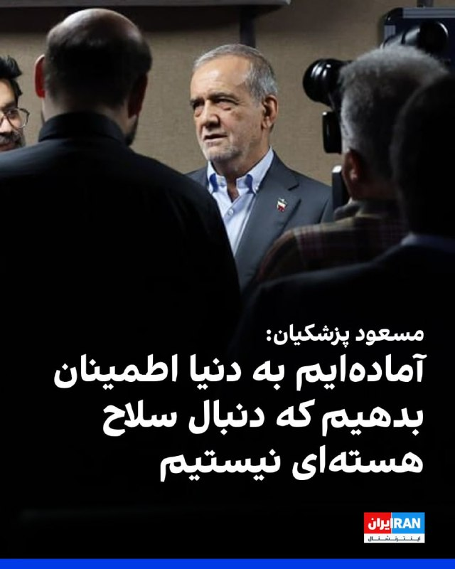
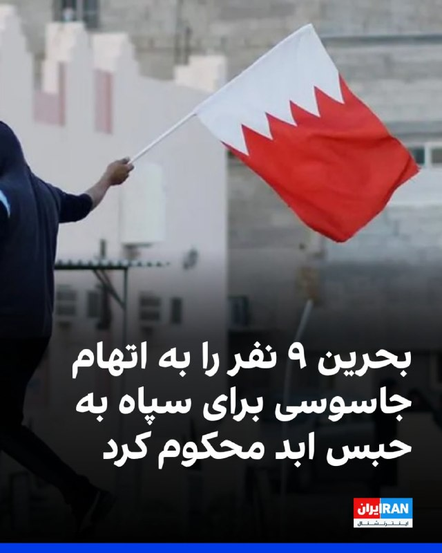
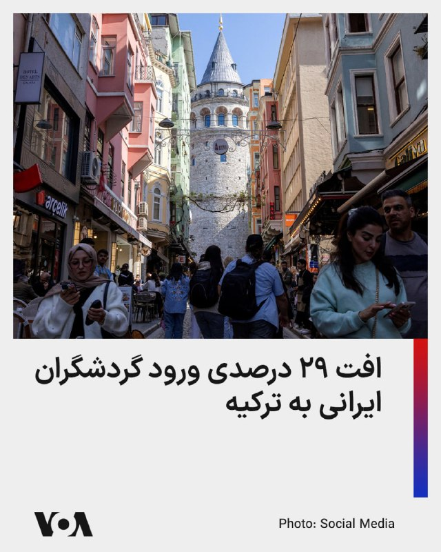
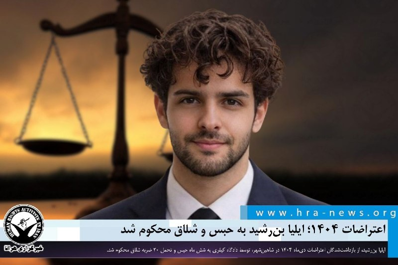

# خواننده تلگرام

<!-- TOP_NAV START -->

<a href="https://github.com/hosseinbaghi/aio-downloader/blob/main/telegram/content/archive_1.md" style="display:inline-block; padding:6px 12px; margin:0 4px; background-color:#2ea44f; color:white; text-decoration:none; border-radius:4px; font-weight:bold;">صفحه بعد</a>

<!-- TOP_NAV END -->

<!-- MSG START -->

---
📅 بروزرسانی: 1405/03/03 15:24
---

## VahidOOnLine — post 241925

  

فایننشال تایمز گزارش داد سپاه پاسداران برای تامین تجهیزات پیشرفته ارتباطات ماهواره‌ای ساخت چین مورد استفاده در برنامه پهپادی خود، از شرکت «تل‌سان» مستقر در راس‌الخیمه امارات متحده عربی استفاده کرده است.

بر اساس این گزارش، تجهیزات یادشده برای «گروه صنعتی سامان» که تحت تحریم قرار دارد، تهیه شده‌اند.

فایننشال تایمز افزود شرکت تل‌سان در اواخر سال ۲۰۲۵ انتقال حدود دو تن تجهیزات آنتن ماهواره‌ای، از جمله یک آنتن موتوردار ۴.۵ متری ساخت شرکت چینی «استاروین»، را از شانگهای به ایران از طریق بندر جبل‌علی دبی هماهنگ کرده است.
iranintl
‌🏁 🇬🇧 IranintlTV

🤖 @VahidOOnLine

## VahidOOnLine — post 241924

🗣روایت شما از احتمال توافق میان آمریکا و جمهوری اسلامی- یکشنبه ۳ خرداد

🔹اگه بعد از توافق، ارزونی هم بشه یه آرامش گذراست. هرگز آرامش لحظه‌ای رو به نجات همیشگی ترجیح ندین.

🔹این چه وضعیه، همش منتظر ترامپ نشستین؟ مردم حتی حاضر نیستن اعتصاب کنن یا قبض پرداخت نکنن. خودمون باید یه کاری کنیم؛ مبارزه مدنی، اقتصادی و اعتصاب کنید.

🔹ترامپ با این جنگ و توافق، جمهوری اسلامی را «پررو» کرد و بدتر از آن ابهت آمریکا در دنیا رو از بین خواهد برد. ای کاش بدون توافق از جنگ خارج می‌شد.

🔹همه ناراحت و نگرانیم، ولی امیدتون رو از دست ندین. در آخر، این ما مردم هستیم که ایرانمون رو پس می‌گیریم.

🔹ترامپ، نتانیاهو به همه ما نوید آزادی دادن. گفتن کمکتون می‌کنیم. مردم و ۴۰ هزار کشته ابزاری شدن برای اینکه ترامپ و نتانیاهو به خواسته‌هاشون برسن. الان شرایط اقتصادی و اجتماعی مردم از آنچه که پیش از جنگ بود هم بدتر شده.

🔹نمی‌دانم چرا مردم ایران فکر می‌کنن کسی باید بیاد نجات‌شون بده. هرکسی دنبال منفعت خودشه. هیچ‌کس برای ما کاری نمی‌کند. خودمون باید خودمون رو نجات بدیم.

🔹واقعا ما مردم ساده هستیم که فکر می‌کنیم کشورهای دیگر دل‌شان برای ما می‌سوزه. این توافق ظلم به مردمه.

🔹انگار به حرف‌های ترامپ باید برعکس نگاه کرد. وقتی گفت توافق قطعی هست، جنگ شد. وقتی گفت زیرساخت می‌زنیم و ضرب‌الاجل داد، آتش‌بس شد. یا باید صبر کرد تا ببینیم چی میشه، یا باید دوباره متحد بشیم و بریم کف خیابون.

🔹چه توافقی؟ مگر ترامپ فراموش کرده که در همین آتش‌بس شرط این بود که جمهوری اسلامی ابتدا تنگه را باز کند، اما نکرد و در نهایت منجر به محاصره دریایی شد. حتی بار اول به قول‌شان عمل نکردند. پس چرا ترامپ دارد برای بار دوم گول‌شان را می‌خورد؟

🔹ما هنوز فراموش نکردیم. نمی‌توانیم در خیابون پا بگذاریم که پای‌مان بره رو خون عزیزان‌مان. ما انتقام همه این خون‌ها رو می‌گیریم. جمهوری اسلامی باید از این خشم ما مردم ایران بترسه.

🔹ما با جمهوری اسلامی اختلاف نداریم، پدرکشتگی داریم. چه توافق بشه و چه نشه ما ادامه داریم و تا سرنگونی ادامه می‌دهیم.
‌🏁 🇬🇧 IranintlTV

🤖 @VahidOOnLine

## VahidOOnLine — post 241923

  

♦️خبرگزاری مهر، وابسته به سازمان تبلیغات اسلامی روز یکشنبه اعلام کرد که «یک پهپاد اسرائیلی که کاربری جاسوسی و شناسایی داشت، با شلیک پدافند ارتش جمهوری اسلامی بر فراز استان هرمزگان سرنگون شد.»

به گزارش مهر، پهپاد هدف گرفته شده از نوع «اربیتر رادار گریز» بوده و «لاشه پهپاد متلاشی شده با همکاری ناوگروه دریابانی فراجای هرمزگان کشف شد.»

خبرگزاری مهر به تاریخ این اتفاق هیچ اشاره‌ای نکرده است.
‌🇸🇦 Indypersian

🤖 @VahidOOnLine

## VahidOOnLine — post 241922

  

مسعود پزشکیان در مصاحبه با خبرنگار صداوسیما گفت: «قطعا ما و تیم مذاکره‌کننده به هیچ‌وجه از عزت و سربلندی کشور کوتاه نخواهیم آمد اما آماده‌ایم به دنیا این اطمینان را بدهیم که ما به دنبال سلاح هسته‌ای نیستیم.»

او افزود: «ما به دنبال ناآرامی در منطقه نیستیم، ناآرام‌کننده منطقه اسرائیل است که به دنبال نقشه اسرائیل بزرگ است.»
iranintl
‌🏁 🇬🇧 IranintlTV

🤖 @VahidOOnLine

## VahidOOnLine — post 241921

  

دادستانی بحرین اعلام کرد دادگاه عالی کیفری این کشور در دو پرونده جداگانه، ۱۱ متهم را به اتهام «جاسوسی و همکاری اطلاعاتی» با سپاه پاسداران انقلاب اسلامی با هدف انجام «اقدامات تروریستی و خصمانه» علیه بحرین محاکمه کرده که ۹ متهم به حبس ابد محکوم شده‌اند.

همچنین دو متهم دیگر به سه سال زندان محکوم شدند و دادگاه دستور مصادره اقلام ضبط‌شده را صادر کرد. دادستانی بحرین اعلام کرد برخی متهمان مامور رصد، تصویربرداری و جمع‌آوری اطلاعات از تاسیسات حیاتی بحرین بوده‌اند و اطلاعات را در اختیار سپاه پاسداران قرار می‌دادند.

در این بیانیه همچنین به استفاده از شبکه‌های مالی، صرافی و ارزهای دیجیتال برای تامین مالی این فعالیت‌ها اشاره شده است.
iranintl
‌🏁 🇬🇧 IranintlTV

🤖 @VahidOOnLine

## VahidOOnLine — post 241920

  

♦️تسنیم، خبرگزاری وابسته به سپاه پاسداران، روز یکشنبه سوم خرداد در واکنش به «توافق احتمالی» ایران و آمریکا به نقل از یک منبع مطلع مدعی شد: «بدون آزادسازی اموال بلوکه شده ایران تفاهمی در کار نخواهد بود.»

تسنیم به نقل از یک منبع که نامی از او برده نشده است، نوشت: «اگرچه آمریکایی‌ها همواره در مسیر مذاکرات کارشکنی‌ کرده و تغییر موضع می‌دهند، اما ایران تاکید کرده است که بدون آزادسازی بخش مشخصی از اموال بلوکه شده ایران در همین گام اول و مشخص بودن سازوکار روشن برای ادامه‌ی تضمین‌شده آزادسازی همه اموال بلوکه شده، تفاهمی در کار نخواهد بود.»

به نوشته تسنیم اختلاف بر سر این مورد یکی از مسائلی است که موجب شده است فعلاً تفاهمی نهایی نشود.

این خبر درحالی منتشر شده است که مارکو روبیو، وزیر خارجه آمریکا روز یکشنبه اعلام کرد که طی ۴۸ ساعت گذشته «پیشرفت قابل‌توجهی» در مذاکرات و رایزنی‌های مرتبط با بحران تنگه هرمز و پرونده ایران حاصل شده و احتمال دارد تا ساعاتی دیگر اخبار مهم‌تری در این زمینه منتشر شود.
‌🇸🇦 Indypersian

🤖 @VahidOOnLine

## VahidOOnLine — post 241919

  <a href="telegram/content/VahidOOnLine_241919_1779623663.mp4" target="_blank">🎬 Download video</a>

اورزولا فون‌درلاین، رئیس کمیسیون اروپا، از پیشرفت در مسیر دستیابی به توافق میان آمریکا و جمهوری اسلامی استقبال کرد و گفت هر توافقی باید به کاهش واقعی تنش‌ها، بازگشایی تنگه هرمز و تضمین آزادی کامل کشتیرانی بدون پرداخت عوارض منجر شود.

او تاکید کرد جمهوری اسلامی نباید اجازه پیدا کند به سلاح هسته‌ای دست یابد.

فون‌درلاین همچنین گفت تهران باید به اقدامات بی‌ثبات‌کننده خود در منطقه، چه مستقیم و چه از طریق گروه‌های نیابتی، پایان دهد و حملات «بی‌دلیل و مکرر» به همسایگانش را متوقف کند.

رئیس کمیسیون اروپا افزود اروپا به همکاری با شرکای بین‌المللی برای استفاده از این فرصت در مسیر یک راه‌حل دیپلماتیک پایدار ادامه خواهد داد.

او همچنین گفت اروپا تلاش می‌کند پیامدهای این درگیری، به‌ویژه بر زنجیره‌های تامین و قیمت انرژی، مهار شود.
‌🏁 🇬🇧 ManotoTV

🤖 @VahidOOnLine

## VahidOOnLine — post 241918

  <a href="telegram/content/VahidOOnLine_241918_1779623664.mp4" target="_blank">🎬 Download video</a>

ایرانیان در لندن برای هجدهمین هفته پیاپی، از مقابل شماره ۱۰ خیابان داونینگ تا سفارت جمهوری اسلامی راهپیمایی کردند و حمایت خود را از آزادی مردم ایران اعلام کردند.
‌🏁 🇬🇧 ManotoTV

🤖 @VahidOOnLine

## VahidOOnLine — post 241917

  

علی عبداللهی، فرمانده قرارگاه مرکزی خاتم‌الانبیا در بیانیه‌ای اعلام کرد: «به دشمنان هشدار می‌دهیم برنامه‌ها و راهبردهای رهبری برای مدیریت خلیج فارس و تنگه هرمز اجرا خواهد شد و بیگانگان جایگاهی در نظم جدید منطقه ندارند و ما آماده پاسخگویی سخت و جهنمی به هرگونه حمله هستیم.»

او ادامه داد: «به مشت گره‌خورده رهبر شهیدمان قسم، نیروهای مسلح مقتدر کشورمان اجازه نخواهند داد تجربه‌های دردناک تاریخی تکرار شود.»
iranintl
‌🏁 🇬🇧 IranintlTV

🤖 @VahidOOnLine

## VahidOOnLine — post 241916

  

خبرگزاری مهر، وابسته به سازمان تبلیغات اسلامی، اعلام کرد یک پهپاد اسرائیلی که کاربری جاسوسی و شناسایی داشت، با شلیک پدافند ارتش جمهوری اسلامی سرنگون شد.
این گزارش افزود: «لاشه پهپاد متلاشی شده اربیتر با همکاری ناوگروه دریابانی فراجای هرمزگان کشف شد.»

خبرگزاری مهر به تاریخ این اتفاق اشاره‌ای نکرده است.
‌🏁 🇬🇧 IranintlTV

🤖 @VahidOOnLine

## VahidOOnLine — post 241915

  

♦️کی‌یر استارمر، نخست‌وزیر بریتانیا روز یکشنبه از پیشرفت‌ گفتگوهای آمریکا و ایران استقبال کرد و گفت که توافق باید به جنگ پایان دهد و تنگه هرمز را بی‌قید و شرط باز کند.

کی‌یر استارمر در پیامی در شبکه اجتماعی ایکس نوشت: «ما باید شاهد توافقی باشیم که به درگیری پایان دهد و تنگه هرمز را با آزادی بی‌قید و شرط و نامحدود برای دریانوردی بازگشایی کند.»

نخست‌وزیر بریتانیا در عین حال بر این نکته که هرگز نباید به ایران اجازه توسعه سلاح هسته‌ای داده شود، تاکید کرده است.

استارمر همچنین نوشت که بریتانیا آماده همکاری با شرکای بین‌المللی خود است تا از این فرصت برای دست‌یابی به یک «توافق دیپلماتیک بلندمدت» استفاده شود.
‌🇸🇦 Indypersian

🤖 @VahidOOnLine

## VahidOOnLine — post 241914

♦️در پی درگذشت پرویز قلیچ‌خانی، کاپیتان پیشین تیم ملی فوتبال ایران، نجمه موسوی-پیمبری، یار و همراه او، با انتشار یک پیام صوتی جزئیات مربوط به وصیت شخصی این چهره ماندگار فوتبال ایران را تشریح کرد.
در این پیام، او با قدردانی از ابراز همدردی و همراهی دوستان، هواداران و علاقه‌مندان قلیچ‌خانی، اعلام کرد که این اسطوره فوتبال ایران بر اساس باورهای شخصی خود تصمیم گرفته بود پیکرش به مراکز علمی و آموزشی اهدا شود، از همین رو مراسم خاک‌سپاری به شکل سنتی برگزار نخواهد شد.
به گفته موسوی-پیمبری، قلیچ‌خانی در سال‌های پایانی عمر، به دلیل فروتنی شخصی و نیز پرهیز از ایجاد زحمت برای دیگران، تمایلی به برگزاری آیین‌های رسمی و گسترده یادبود نداشت. با این حال او تاکید کرده است که دوستداران این چهره آزاداندیش، مبارز و اثرگذار در تاریخ ورزش و سیاست ایران، می‌توانند در هر نقطه از جهان، به‌صورت داوطلبانه برنامه‌هایی برای بزرگداشت جایگاه و یاد او برگزار کنند.
پرویز قلیچ‌خانی از بزرگ‌ترین چهره‌های تاریخ ورزش ایران، روز شنبه ۲ خرداد ۱۴۰۵ در ۸۱ سالگی در بیمارستانی در حومه پاریس درگذشت.
‌🇸🇦 Indypersian

🤖 @VahidOOnLine

## WithYashar — post 12327

تسنیم : بر اساس شنیده‌ها از متن تفاهم احتمالی، برخلاف گزارش یک رسانه آمریکایی که می‌گوید طبق تفاهم نامه «آتش بس میان ایران و آمریکا به مدت 60 روز تمدید می‌شود»، این عبارت در متن وجود ندارد و تعبیری که به کار گرفته شده است، اعلام پایان جنگ در همه جبهه‌ها از جمله لبنان است.
بر اساس متنی که هنوز نهایی نشده، در بازه 30 روزه موضوع تنگه هرمز و محاصره دریایی پیش برده می‌شود و زمان 60 روزه‌ای برای مذاکرات در مسئله هسته‌ای در نظر گرفته شده است.
@withyashar

## WithYashar — post 12326

روبیو: اهداف تعیین شده عملیات نظامی بدست آمده
@withyashar 😈

## WithYashar — post 12325

  <a href="telegram/content/WithYashar_12325_1779623670.mp4" target="_blank">🎬 Download video</a>

امیرحسین ثابتی نماینده تهران در تجمعات شبانه :

ممکنه جنگ یک ساعت دیگه باشه، ممکنه یک روز یا یک سال دیگه، اما قطعاً قطعی جنگ.
حتی اگه آمریکا تمام شرایط ما رو بپذیره و امضا کنه و تسلیم بشه، باز هم جنگ خواهیم داشت.
حتی اگر تیتر همه رسانه‌های غربی درباره نزدیک بودن مذاکره و توافق درست باشه ، من بازگشت جنگ رو تضمین می‌کنم.
@withyashar

## WithYashar — post 12324

بیانیه منتشر از دفتر نخست‌وزیر اسرائیل به نقل از یک منبع سیاسی (وای‌نت):

در مکالمه دیروز با ترامپ، نخست‌وزیر تأکید کرد که اسرائیل آزادی عملش رو در برابر تهدیدها در همه جبهه‌ها، از جمله لبنان، حفظ میکنه و ترامپ هم حمایتش از این اصل رو دوباره تأکید کرد.

ترامپ روشن کرد که خواسته‌اش برای خراب کردن برنامه هسته‌ای ایران و حذف تمام اورانیوم غنی‌شده از خاک این کشور ثابت میمونه و بدون این شرایط، توافق نهایی رو امضا نمیکنه.

نخست‌وزیر یه بار دیگه از تعهد طولانی‌مدت و خاص ترامپ به امنیت اسرائیل تشکر کرد.
@withyashar

## WithYashar — post 12323

تروریست سردار قربانی: اسرائیلی‌ها بدانند قاآنی تا زیر سنگرهایشان می‌رود
سردار «مرتضی قربانی» مشاور فرمانده سپاه تروریست پاسداران: هیچ‌وقت از قاآنی ترس و واهمه ندیدم، اسرائیلی‌ها بدانند قاآنی تا زیر سنگرهایشان می‌رود!
@withyashar 🥴

## WithYashar — post 12322

  <a href="telegram/content/WithYashar_12322_1779623673.mp4" target="_blank">🎬 Download video</a>

🚨🚨🚨🚨بالاخره توافق رسمی‌شد
@withyashar

## WithYashar — post 12321

مهر: یک پهپاد اسرائیلی بر فراز هرمزگان سرنگون شد
این پهپاد که کاربری جاسوسی و شناسایی داشت، با شلیک پدافند ارتش سرنگون شد.
لاشه پهپاد متلاشی شده اربیتر با همکاری ناوگروه دریابانی فراجای هرمزگان کشف شد.
@withyashar

## WithYashar — post 12320

## WithYashar — post 12319

## WithYashar — post 12318

احمد وحیدی فرمانده کل سپاه:

فتح خرمشهر یک الگوی خوب برای نابودی کامل اسرائیل است.
@withyashar
یاشار : همین فرمون برین 🤣

## WithYashar — post 12317

گزارش کانال 14 : ممکن است ظرف چند روز توافقی بین آمریکا و ایران حاصل شود که انتظار می‌رود لبنان را نیز شامل شود و احتمالاً به پایان درگیری‌های اسرائیل با حزب‌الله منجر شود.

بر اساس جزئیات منتشر شده، ایران تنگه هرمز را بدون دریافت هزینه باز خواهد کرد در حالی که آمریکا پولی به تهران منتقل نخواهد کرد و به هر دو طرف مهلت ۶۰ روزه داده می‌شود تا مذاکرات هسته‌ای را ادامه دهند.

تحریم‌ها علیه ایران باقی خواهد ماند به جز تسهیلات محدودی در محدودیت‌های مرتبط با نفت
@withyashar

## WithYashar — post 12316

## mwarmonitor — post 9631

🔴یک توافق احتمالی میان آمریکا و ایران شامل این خواهد بود که ایران تعهد دهد به دنبال ساخت سلاح هسته‌ای نرود، هرگونه غنی‌سازی جدید را متوقف کند و وارد مذاکراتی درباره کنار گذاشتن ذخایر اورانیوم بسیار غنی‌شده خود شود، به گزارش CNN به نقل از یک فرد مطلع از موضوع.

🔸جزئیات مربوط به نحوه خارج کردن این ذخایر و مدت زمان توقف موقت غنی‌سازی در مذاکرات آینده تعیین خواهد شد.

@mwarmonitor

## mwarmonitor — post 9630

🔸«بحرین ۹ نفر را به حبس ابد محکوم کرد به اتهام جاسوسی برای سپاه پاسداران انقلاب اسلامی ایران و طراحی اقدامات تروریستی»

@mwarmonitor

## mwarmonitor — post 9629

🔴 فاکس‌نیوز: توافق مورد انتظار شامل این است که نیروهای آمریکایی تا ۳۰ روز در نزدیکی ایران باقی بمانند.

@mwarmonitor

## mwarmonitor — post 9628

📌دو مقام منطقه‌ای به آسوشیتدپرس گفته‌اند که توافق احتمالی شامل تعهد ایران به عدم پیگیری سلاح هسته‌ای و کنار گذاشتن ذخایر اورانیوم بسیار غنی‌شده‌اش است، و در مقابل، رفع تحریم‌ها و آزادسازی دارایی‌های مسدودشده طی ۶۰ روز مورد مذاکره قرار خواهد گرفت.

@mwarmonitor

## mwarmonitor — post 9627

🔴ترامپ به نتانیاهو به‌طور روشن اعلام کرد که بدون برچیده شدن کامل برنامه هسته‌ای ایران و خارج شدن تمام اورانیوم غنی‌شده از خاک این کشور، هیچ توافق نهایی درباره ایران را امضا نخواهد کرد؛ این را یک منبع سیاسی اسرائیلی به فاکس‌نیوز گفته است.

@mwarmonitor

## FoxNewsTwitter — post 342182

  <a href="telegram/content/FoxNewsTwitter_342182_1779623674.mp4" target="_blank">🎬 Download video</a>

Fox News (Twitter/X)

FIRST ON FOX: Democratic Maine Senate candidate Graham Platner dodges an apology when confronted over a deleted Reddit post where he said a Purple Heart recipient "didn’t deserve to live."

Fox News Digital asked him what he would say to offended voters — and whether he owed Pfc. Ted Daniels an apology.

Platner instead pointed to his own service: "I did four tours in the infantry, any attempt to say that I disrespect veterans is slanderous and offensive."

## pm_afshaa — post 91379

  <a href="telegram/content/pm_afshaa_91379_1779623678.webm" target="_blank">🎬 Download video</a>

🔴خبرگزاری مهر: پدافند هوایی ارتش یک پهپاد اسرائیلی رو بر فراز هرمزگان سرنگون کرد.

💧 Rainbet.com the #1 Non-KYC Crypto Casino & Sportsbook @rainbetcom

😁 @Pm_Afshaa

## pm_afshaa — post 91378

🔴فاکس نیوز: توافق با ایران مقرر می‌کند که نیروهای آمریکایی به مدت 30 روز پس از اجرای توافق در نزدیکی ایران باقی بمانن

💧 Rainbet.com the #1 Non-KYC Crypto Casino & Sportsbook @rainbetcom

😁 @Pm_Afshaa

## pm_afshaa — post 91377

🔴بحرین: 9 نفر به جرم جاسوسی برای سپاه پاسداران ایران به حبس ابد محکوم شدن

💧 Rainbet.com the #1 Non-KYC Crypto Casino & Sportsbook @rainbetcom

😁 @Pm_Afshaa

## pm_afshaa — post 91376

  <a href="telegram/content/pm_afshaa_91376_1779623679.webm" target="_blank">🎬 Download video</a>

🔴بیانیه منتشر از دفتر نخست‌وزیر اسرائیل به نقل از یک منبع سیاسی (وای‌نت):

در مکالمه دیروز با ترامپ، نخست‌وزیر تأکید کرد که اسرائیل آزادی عملش رو در برابر تهدیدها در همه جبهه‌ها، از جمله لبنان، حفظ میکنه و ترامپ هم حمایتش از این اصل رو دوباره تأکید کرد.

ترامپ روشن کرد که خواسته‌اش برای خراب کردن برنامه هسته‌ای ایران و حذف تمام اورانیوم غنی‌شده از خاک این کشور ثابت میمونه و بدون این شرایط، توافق نهایی رو امضا نمیکنه.

نخست‌وزیر یه بار دیگه از تعهد طولانی‌مدت و خاص ترامپ به امنیت اسرائیل تشکر کرد.

💧 Rainbet.com the #1 Non-KYC Crypto Casino & Sportsbook @rainbetcom

😁 @Pm_Afshaa

## DEJradio — post 4912

⭕️ رئیس کمیسیون اروپا گفت جمهوری اسلامی باید اقدامات بی‌ثبات‌کننده را در منطقه متوقف کند

اورسولا فون‌ در لاین، رئیس کمیسیون اروپا تأکید کرد جمهوری اسلامی باید اقدامات بی‌ثبات‌کننده را در منطقه، چه مستقیما و چه از طریق نیروهای نیابتی متوقف کند.
اورسولا فون‌ در لاین همچنین از پیشرفت مذاکرات میان آمریکا و جمهوری اسلامی استقبال کرد. او گفت بازگشایی تنگۀ هرمز اهمیت دارد.
فون در لاین ادعا کرد اروپا با شرکای بین‌المللی برای دستیابی به راه‌حلی دیپلماتیک و پایدار در مورد جمهوری اسلامی همکاری می‌کند.
رئیس کمیسیون اروپا، گفت به توافقی نیاز است که واقعا به کاهش تنش‌ها منجر شود، تنگۀ هرمز را بازگشایی کند و آزادی کامل کشتیرانی را بدون دریافت عوارض و محدودیت تضمین کند.
او افزود حملات مکرر تهران به همسایگان باید پایان یابد.

#اتحادیه_اروپا #مذاکرات
@DEJradio

## DEJradio — post 4911

⭕️ قطعی سراسری اینترنت در ایران وارد هشتاد و ششمین روز شد

نت‌بلاکس اعلام کرد قطعی سراسری اینترنت در ایران وارد هشتاد و ششمین روز شده است.
بنا بر این گزارش، شهروندان پس از بیش از ۲۰۴۰ ساعت همچنان از دسترسی آزاد به اینترنت جهانی محروم‌اند.
این نهاد جهانی پایش اینترنت گفت در حالی که دسترسی عمومی به شبکۀ جهانی امکان ندارد، گروهی از کاربران وابسته به حکومت تصویری «مصنوعی» را از «وضعیت عادی» در ایران به بیرون منتقل می‌کنند.

#اینترنت
@DEJradio

## DEJradio — post 4910

⭕️ اردوی تیم ملی فوتبال در جام جهانی به‌جای آریزونا در مکزیک برگزار می‌شود

مهدی تاج، رئیس فدراسیون فوتبال جمهوری اسلامی اعلام کرد تیم ملی در جریان جام جهانی ۲۰۲۶ در شهر تیخوانا در مکزیک مستقر می‌شود.
او گفت فیفا با درخواست جمهوری اسلامی برای انتقال محل اردو از ایالت آریزونا آمریکا موافقت کرد.
بنا بر ادعای تاج، این جابه‌جایی می‌تواند مشکلات مربوط به دریافت ویزا را کاهش دهد. همچنین اعضای تیم می‌توانند با پرواز مستقیم ایران‌ایر به مکزیک سفر کنند.
تیم فوتبال جمهوری اسلامی ایران در حالی برای حضور در جام جهانی آماده می‌شود که هنوز ویزای آمریکا برای بخشی از بازیکنان و اعضای کادر فنی صادر نشده است.
از سویی بنا بر برخی گزارش‌ها، فیفا قصد دارد مانع ورود پرچم‌ شیر و خورشید به ورزشگاه‌ها در هنگام برگزاری جام جهانی بشود.

#فوتبال #جام_جهانی
@DEJradio

## DEJradio — post 4909

⭕️ قوۀ قضائیه از اعدام یک شهروند به اتهام همکاری با آمریکا و اسرائیل خبر داد

قوۀ قضائیۀ جمهوری اسلامی اعلام کرد شهروندی به نام مجتبا کیان را با اتهام «ارسال اطلاعات مراکز صنایع دفاعی» به آمریکا و اسرائیل اعدام کرده است.
به گزارش خبرگزاری میزان، وابسته به دستگاه قضائی مدعی شد مجتبا کیان در دوران جنگ اخیر اطلاعات مربوط به واحدهای صنایع دفاعی را به خارج ارسال کرده بود.
میزان مدعی شد که از دیگر موارد اتهامی مجتبا کیان، ارسال پیام‌ برای «شبکه‌های معاند» بوده است.
قوۀ قضائیه هیچ توضیحی درمورد شغل یا شیوۀ دسترسی او به اطلاعات صنایع دفاعی ارائه نکرد.
در ماه‌های اخیر جمهوری اسلامی بارها شهروندانی را به اتهام ارسال تصاویر و اطلاعات برای رسانه‌های خارج از کشور، بازداشت کرد.
رویۀ اتهام‌زنی، بازداشت، شکنجه و اعدام شهروندان، در همۀ سال‌های اخیر توسط حکومت ادامه داشته است.
حکومت از شکنجه و اعدام مخالفان به عنوان ابزاری برای ترساندن و عقب‌راندن مخالفان استفاده می‌کند.

#اعدام #زندانیان_سیاسی
@DEJradio

## kianmeli1 — post 87628

🔴خبرگزاری تسنیم سپاه: «بدون آزادسازی دارایی‌های مسدود شده ایران، توافقی حاصل نخواهد شد»، این موضوع به میانجیگران پاکستانی و منطقه‌ای ابلاغ شده است.
https://t.me/kianmeli1

## kianmeli1 — post 87627

‏🔴خبرگزاری مهر وابسته به سازمان تبلیغات اسلامی نوشت پدافند ارتش جمهوری اسلامی یک پهپاد اسرائیل را در هرمزگان سرنگون کرده است
https://t.me/kianmeli1

## IranIntlTV — post 338753

  

فایننشال تایمز گزارش داد سپاه پاسداران برای تامین تجهیزات پیشرفته ارتباطات ماهواره‌ای ساخت چین مورد استفاده در برنامه پهپادی خود، از شرکت «تل‌سان» مستقر در راس‌الخیمه امارات متحده عربی استفاده کرده است.

بر اساس این گزارش، تجهیزات یادشده برای «گروه صنعتی سامان» که تحت تحریم قرار دارد، تهیه شده‌اند.

فایننشال تایمز افزود شرکت تل‌سان در اواخر سال ۲۰۲۵ انتقال حدود دو تن تجهیزات آنتن ماهواره‌ای، از جمله یک آنتن موتوردار ۴.۵ متری ساخت شرکت چینی «استاروین»، را از شانگهای به ایران از طریق بندر جبل‌علی دبی هماهنگ کرده است.
iranintl.com/202605248444

## IranIntlTV — post 338752

  <a href="telegram/content/IranIntlTV_338752_1779623681.mp4" target="_blank">🎬 Download video</a>

🔻مهدی تاج، رییس فدراسیون فوتبال، خبر داد کمپ تیم ملی فوتبال از آریزونای آمریکا به کمپی در شهر تیخوانا مکزیک منتقل شده است.

🔹مهدی رستم‌پور، خبرنگار ورزشی معتقد است که این ترفندی از جمهوری اسلامی برای فرار از ایرانیان آمریکا بوده است.

@iranintltvsport

## IranIntlTV — post 338751

  <a href="telegram/content/IranIntlTV_338751_1779623683.mp4" target="_blank">🎬 Download video</a>

یک شهروند با ارسال پیامی به ایران‌اینترنشنال می‌گوید: «اگر ترامپ توافق کد بزرگ‌ترین خیانت را در حق مردم ایران کرده است. امیدواریم پایان این شب سیه، سپید باشد.»

## IranIntlTV — post 338750

  <a href="telegram/content/IranIntlTV_338750_1779623685.mp4" target="_blank">🎬 Download video</a>

مروری بر روزنامه‌های ایران، یکشنبه ۳ خرداد، با مجتبی هاشمی، روزنامه‌نگار
@iranintltv

## IranIntlTV — post 338749

🗣روایت شما از احتمال توافق میان آمریکا و جمهوری اسلامی- یکشنبه ۳ خرداد

🔹اگه بعد از توافق، ارزونی هم بشه یه آرامش گذراست. هرگز آرامش لحظه‌ای رو به نجات همیشگی ترجیح ندین.

🔹این چه وضعیه، همش منتظر ترامپ نشستین؟ مردم حتی حاضر نیستن اعتصاب کنن یا قبض پرداخت نکنن. خودمون باید یه کاری کنیم؛ مبارزه مدنی، اقتصادی و اعتصاب کنید.

🔹ترامپ با این جنگ و توافق، جمهوری اسلامی را «پررو» کرد و بدتر از آن ابهت آمریکا در دنیا رو از بین خواهد برد. ای کاش بدون توافق از جنگ خارج می‌شد.

🔹همه ناراحت و نگرانیم، ولی امیدتون رو از دست ندین. در آخر، این ما مردم هستیم که ایرانمون رو پس می‌گیریم.

🔹ترامپ، نتانیاهو به همه ما نوید آزادی دادن. گفتن کمکتون می‌کنیم. مردم و ۴۰ هزار کشته ابزاری شدن برای اینکه ترامپ و نتانیاهو به خواسته‌هاشون برسن. الان شرایط اقتصادی و اجتماعی مردم از آنچه که پیش از جنگ بود هم بدتر شده.

🔹نمی‌دانم چرا مردم ایران فکر می‌کنن کسی باید بیاد نجات‌شون بده. هرکسی دنبال منفعت خودشه. هیچ‌کس برای ما کاری نمی‌کند. خودمون باید خودمون رو نجات بدیم.

🔹واقعا ما مردم ساده هستیم که فکر می‌کنیم کشورهای دیگر دل‌شان برای ما می‌سوزه. این توافق ظلم به مردمه.

🔹انگار به حرف‌های ترامپ باید برعکس نگاه کرد. وقتی گفت توافق قطعی هست، جنگ شد. وقتی گفت زیرساخت می‌زنیم و ضرب‌الاجل داد، آتش‌بس شد. یا باید صبر کرد تا ببینیم چی میشه، یا باید دوباره متحد بشیم و بریم کف خیابون.

🔹چه توافقی؟ مگر ترامپ فراموش کرده که در همین آتش‌بس شرط این بود که جمهوری اسلامی ابتدا تنگه را باز کند، اما نکرد و در نهایت منجر به محاصره دریایی شد. حتی بار اول به قول‌شان عمل نکردند. پس چرا ترامپ دارد برای بار دوم گول‌شان را می‌خورد؟

🔹ما هنوز فراموش نکردیم. نمی‌توانیم در خیابون پا بگذاریم که پای‌مان بره رو خون عزیزان‌مان. ما انتقام همه این خون‌ها رو می‌گیریم. جمهوری اسلامی باید از این خشم ما مردم ایران بترسه.

🔹ما با جمهوری اسلامی اختلاف نداریم، پدرکشتگی داریم. چه توافق بشه و چه نشه ما ادامه داریم و تا سرنگونی ادامه می‌دهیم.

## IranIntlTV — post 338748

  

مسعود پزشکیان در مصاحبه با خبرنگار صداوسیما گفت: «قطعا ما و تیم مذاکره‌کننده به هیچ‌وجه از عزت و سربلندی کشور کوتاه نخواهیم آمد اما آماده‌ایم به دنیا این اطمینان را بدهیم که ما به دنبال سلاح هسته‌ای نیستیم.»

او افزود: «ما به دنبال ناآرامی در منطقه نیستیم، ناآرام‌کننده منطقه اسرائیل است که به دنبال نقشه اسرائیل بزرگ است.»
iranintl.com/202605248136

## IranIntlTV — post 338747

  <a href="telegram/content/IranIntlTV_338747_1779623688.mp4" target="_blank">🎬 Download video</a>

بر اساس گزارش رسانه‌ها، تفاهم احتمالی جمهوری اسلامی و آمریکا شامل بازگشایی تنگه هرمز در ازای لغو محاصره دریایی، امکان فروش نفت و آزادسازی بخشی از منابع ارزی مسدودشده ایران است.

ارزیابی آرش آزرمی، دبیر بخش اقتصادی ایران‌اینترنشنال

@iranintltv

## IranIntlTV — post 338746

  

دادستانی بحرین اعلام کرد دادگاه عالی کیفری این کشور در دو پرونده جداگانه، ۱۱ متهم را به اتهام «جاسوسی و همکاری اطلاعاتی» با سپاه پاسداران انقلاب اسلامی با هدف انجام «اقدامات تروریستی و خصمانه» علیه بحرین محاکمه کرده که ۹ متهم به حبس ابد محکوم شده‌اند.

همچنین دو متهم دیگر به سه سال زندان محکوم شدند و دادگاه دستور مصادره اقلام ضبط‌شده را صادر کرد. دادستانی بحرین اعلام کرد برخی متهمان مامور رصد، تصویربرداری و جمع‌آوری اطلاعات از تاسیسات حیاتی بحرین بوده‌اند و اطلاعات را در اختیار سپاه پاسداران قرار می‌دادند.

در این بیانیه همچنین به استفاده از شبکه‌های مالی، صرافی و ارزهای دیجیتال برای تامین مالی این فعالیت‌ها اشاره شده است.
iranintl.com/202605242725

## IranIntlTV — post 338745

  <a href="telegram/content/IranIntlTV_338745_1779623691.mp4" target="_blank">🎬 Download video</a>

بسته شدن مسیرهای اصلی تجاری در تنگه هرمز، پای قایق‌های تندرو و شناورهای باری ایرانی را به بندر خصب عمان باز کرده است. این بندر کوچک، در فاصله حدود ۳۵ کیلومتری ایران، حالا به یکی از راه‌های تهران برای دور زدن محاصره دریایی آمریکا تبدیل شده است.

انتقال کالا از امارات به بندر خصب و سپس به ایران، هزینه واردات را تا شش برابر افزایش داده است.
@iranintltv

## IranIntlTV — post 338744

  

علی عبداللهی، فرمانده قرارگاه مرکزی خاتم‌الانبیا در بیانیه‌ای اعلام کرد: «به دشمنان هشدار می‌دهیم برنامه‌ها و راهبردهای رهبری برای مدیریت خلیج فارس و تنگه هرمز اجرا خواهد شد و بیگانگان جایگاهی در نظم جدید منطقه ندارند و ما آماده پاسخگویی سخت و جهنمی به هرگونه حمله هستیم.»

او ادامه داد: «به مشت گره‌خورده رهبر شهیدمان قسم، نیروهای مسلح مقتدر کشورمان اجازه نخواهند داد تجربه‌های دردناک تاریخی تکرار شود.»
iranintl.com/202605240729

## IranIntlTV — post 338743

جاویدنامان انقلاب ملی ایرانیان
«علی و شیوا بردبار جاوید» از جان‌باختگان اعتراضات ۱۸ دی در مشهد هستند. نامشان در حافظه‌ی این سرزمین می‌ماند و یادشان چراغ راه آزادی‌خواهان است.

@iranintltv

## IranIntlTV — post 338742

  

خبرگزاری مهر، وابسته به سازمان تبلیغات اسلامی، اعلام کرد یک پهپاد اسرائیلی که کاربری جاسوسی و شناسایی داشت، با شلیک پدافند ارتش جمهوری اسلامی سرنگون شد.
این گزارش افزود: «لاشه پهپاد متلاشی شده اربیتر با همکاری ناوگروه دریابانی فراجای هرمزگان کشف شد.»

خبرگزاری مهر به تاریخ این اتفاق اشاره‌ای نکرده است.
https://iranintl.com/202605240342

## IranIntlTV — post 338741

استقبال اروپا از پیشرفت مذاکرات با تاکید بر بازگشایی تنگه هرمز و مهار برنامه هسته‌ای تهران

هم‌زمان با گزارش‌ها درباره نزدیک شدن آمریکا و جمهوری اسلامی به یک تفاهم اولیه، رهبران اتحادیه اروپا و بریتانیا از پیشرفت مذاکرات استقبال کرده و خواستار توافقی شدند که به کاهش تنش‌ها، بازگشایی تنگه هرمز و جلوگیری از دستیابی حکومت ایران به سلاح هسته‌ای منجر شود.

اورزولا فون‌در‌لاین، رییس کمیسیون اروپا، از نشانه‌های پیشرفت در مذاکرات میان آمریکا و جمهوری اسلامی استقبال کرده و گفته است اروپا از دستیابی به توافقی حمایت می‌کند که به کاهش واقعی تنش‌ها، بازگشایی تنگه هرمز و تضمین آزادی کامل کشتیرانی بدون دریافت عوارض منجر شود.

فون‌در‌لاین در پیامی در شبکه ایکس نوشت: «از پیشرفت در مسیر توافق میان آمریکا و ایران استقبال می‌کنم. ما به توافقی نیاز داریم که واقعا تنش‌ها را کاهش دهد، تنگه هرمز را بازگشایی کند و آزادی کامل ناوبری را تضمین کند. نباید به ایران اجازه داده شود به سلاح هسته‌ای دست پیدا کند.» او همچنین تاکید کرد تهران باید اقدامات بی‌ثبات‌کننده منطقه‌ای، از جمله حمایت از نیروهای نیابتی و حملات به کشورهای همسایه را متوقف کند.

رییس کمیسیون اروپا افزود اتحادیه اروپا برای بهره‌برداری از فرصت کنونی جهت دستیابی به یک راه‌حل دیپلماتیک پایدار، همکاری با شرکای بین‌المللی را ادامه خواهد داد و هم‌زمان برای کاهش اثرات بحران بر زنجیره‌های تامین جهانی و قیمت انرژی تلاش می‌کند.

اظهارات فون‌در‌لاین پس از آن مطرح شد که دونالد ترامپ اعلام کرد واشینگتن و تهران «تا حد زیادی» درباره یک یادداشت تفاهم برای توافق صلح مذاکره کرده‌اند؛ توافقی که می‌تواند به بازگشایی تنگه هرمز منجر شود.

در بریتانیا نیز کی‌یر استارمر، نخست‌وزیر این کشور، از «پیشرفت در مسیر توافق» برای پایان دادن به جنگ ایران استقبال کرد. استارمر در پیامی نوشت: «ما با شرکای بین‌المللی خود همکاری خواهیم کرد تا از این فرصت برای دستیابی به یک راه‌حل دیپلماتیک بلندمدت استفاده کنیم.»

این مواضع در حالی مطرح می‌شود که مقام‌های آمریکایی گفته‌اند احتمال دارد جزئیات توافق احتمالی میان [حکومت] ایران و آمریکا طی ساعات یا روزهای آینده اعلام شود؛ هرچند هنوز اختلاف‌هایی بر سر برنامه هسته‌ای ایران، وضعیت تنگه هرمز و دامنه کاهش تحریم‌ها باقی مانده است.

در همین حال، منابع سیاسی اسرائیل نیز نگرانی خود را نسبت به پیامدهای توافق احتمالی ابراز کرده‌اند. یک مقام ارشد سیاسی اسرائیل به یینون ماگال، خبرنگار کانال۱۴ این کشور گفته است تل‌آویو به واشینگتن اطلاع داده که «صرف‌نظر از دستیابی یا عدم دستیابی به توافق، آزادی عمل عملیاتی خود را در همه جبهه‌ها، از جمله لبنان، حفظ خواهد کرد.»

این اظهارات نشان می‌دهد با وجود افزایش امیدها به پیشرفت دیپلماتیک، اختلاف‌ها بر سر نحوه مهار برنامه هسته‌ای ایران، نقش منطقه‌ای تهران و آینده درگیری‌های نیابتی همچنان از چالش‌های اصلی مسیر توافق باقی مانده است.
 
🔗وب‌سایت ایران‌اینترنشنال
@iranintltv

## IranIntlTV — post 338740

  <a href="telegram/content/IranIntlTV_338740_1779623695.mp4" target="_blank">🎬 Download video</a>

یک شهروند با ارسال پیامی به ایران‌اینترنشنال می‌گوید: «امیدی به ترامپ نداریم. ما ۴۰ هزار کشته ندادیم که با این حکومت مماشات کنیم. خودمان کار را تمام می‌کنیم. مردم عزیز این آخرین نبرد است.»

## IranIntlTV — post 338739

  

🔻سایت اتلتیک در گزارشی درباره تغییر کمپ تیم ملی از آریزونای آمریکا به تیخوانا در مکزیک، که به گفته مهدی تاج، رییس فدراسیون فوتبال، برای حل مشکل ویزای اعضای تیم انجام شده است، نوشت با وجود این اقدام، تیم ملی برای هر بازی باید ویزا بگیرد: «تمامی بازیکنان و اعضای کادر همچنان برای ورود به ایالات متحده جهت برگزاری مسابقات نیاز به ویزا خواهند داشت.»

🔹اتلتیک اشاره می‌کند که با این تغییر، «اگر برخی اعضای غیرضروری در روز مسابقه برای دریافت ویزای آمریکا با مشکل مواجه باشند، انتقال کمپ به مکزیک می‌تواند به آن‌ها اجازه دهد در کنار تیم بمانند، اما برای مسابقات سفر نکنند.»

🔹یک ماه پیش، مارکو روبیو، وزیر خارجه آمریکا، درباره ورود همراهان تیم ملی به ایالات متحده گفت: «آن‌ها نمی‌توانند یک مشت تروریست عضو سپاه را به عنوان روزنامه‌نگار یا مربی ورزشی وارد کشور ما کنند.»

🔹اتلتیک نوشته است این تغییر کمپ تیم فوتبال ایران در حالی رخ داده که مقام‌های آریزونا برای استقبال از این تیم آماده می‌شدند.

جزییات بیشتر را در سایت بخوانید.

@iranintltvsport

## IranIntlTV — post 338738

  <a href="telegram/content/IranIntlTV_338738_1779623699.mp4" target="_blank">🎬 Download video</a>

وزیر دفاع پیشین اسرائیل از مطرح شدن لبنان به‌عنوان بخشی از توافق میان واشینگتن و تهران انتقاد کرد. اردوغان نیز در تماس با ترامپ، بر حل اختلافات از راه دیپلماسی تاکید کرد و از مذاکرات با جمهوری اسلامی حمایت کرد.

گزارش اشکان صفایی و نرگس هورخش، خبرنگاران ایران‌اینترنشنال

@iranintltv

## IranIntlTV — post 338737

  <a href="telegram/content/IranIntlTV_338737_1779623702.mp4" target="_blank">🎬 Download video</a>

رسانه‌های پاکستان گزارش دادند در حمله انتحاری به قطار مسافربری در شهر کویته، دست‌کم ۲۴ نفر کشته و حدود ۵۰ نفر زخمی شدند. به گفته این رسانه‌ها، بخشی از واگن‌ها حامل نظامیان پاکستانی بود. ارتش آزادی‌بخش بلوچستان مسئولیت این حمله را بر عهده گرفت.
گفت‌وگو با وحید پیمان، روزنامه‌نگار
@iranintltv

## Shin_Persian — post 6198

  

Shin ✓ @hey_itsmyturn Sun, 24 May 2026 11:33:47 UTC IRGC-owned Tasnim News: """ The term "ceasefire extension" is not included in the agreement. According to reports obtained by Tasnim regarding the potential agreement, and contrary to a claim by an American…

## Shin_Persian — post 6197

Shin ✓ @hey_itsmyturn
Sun, 24 May 2026 11:33:47 UTC

IRGC-owned Tasnim News:
"""
The term "ceasefire extension" is not included in the agreement.

According to reports obtained by Tasnim regarding the potential agreement, and contrary to a claim by an American media outlet suggesting a 60-day extension of the "ceasefire between Iran and the U.S." within the document, this phrase is absent. The language used instead signifies a declaration of the cessation of hostilities on all fronts, including Lebanon.

The draft text, which is not yet finalized, allocates a 30-day period for discussions concerning the Strait of Hormuz and naval blockade, and a 60-day period has been designated for nuclear negotiations.
"""

#Iran

فارسی

خبرگزاری تسنیم متعلق به سپاه پاسداران انقلاب اسلامی (IRGC):
"""
عبارت «تمدید آتش‌بس» در متن توافق گنجانده نشده است.

طبق گزارش‌های دریافتی تسنیم در خصوص توافق احتمالی، و برخلاف ادعای یک رسانه آمریکایی مبنی بر پیشنهاد تمدید ۶۰ روزه «آتش‌بس میان ایران و آمریکا» در این سند، چنین عبارتی وجود ندارد. در مقابل، ادبیات به‌کار رفته به معنای اعلام توقف تخاصمات در تمامی جبهه‌ها، از جمله لبنان، است.

در پیش‌نویس این متن که هنوز نهایی نشده است، یک بازه زمانی ۳۰ روزه برای گفتگوها پیرامون تنگه هرمز و محاصره دریایی در نظر گرفته شده و همچنین یک بازه ۶۰ روزه برای مذاکرات هسته‌ای تعیین شده است.
"""

#Iran

𝕏 · @shin_persian

## Shin_Persian — post 6196

Shin ✓ @hey_itsmyturn
Sun, 24 May 2026 10:52:04 UTC

Islamic Regime claims downing Israeli Orbiter drone over Hormozgan Province with air defense system. Drone reportedly conducting reconnaissance mission.

#Iran

فارسی

رژیم اسلامی ادعا می‌کند یک پهپاد اوربیتر (Orbiter) اسرائیلی را با سامانه پدافند هوایی بر فراز استان هرمزگان سرنگون کرده است. گزارش شده است که این پهپاد در حال انجام مأموریت شناسایی بوده است.

#Iran

𝕏 · @shin_persian

## ManotoTV — post 105801

  <a href="telegram/content/ManotoTV_105801_1779623705.mp4" target="_blank">🎬 Download video</a>

اورزولا فون‌درلاین، رئیس کمیسیون اروپا، از پیشرفت در مسیر دستیابی به توافق میان آمریکا و جمهوری اسلامی استقبال کرد و گفت هر توافقی باید به کاهش واقعی تنش‌ها، بازگشایی تنگه هرمز و تضمین آزادی کامل کشتیرانی بدون پرداخت عوارض منجر شود.

او تاکید کرد جمهوری اسلامی نباید اجازه پیدا کند به سلاح هسته‌ای دست یابد.

فون‌درلاین همچنین گفت تهران باید به اقدامات بی‌ثبات‌کننده خود در منطقه، چه مستقیم و چه از طریق گروه‌های نیابتی، پایان دهد و حملات «بی‌دلیل و مکرر» به همسایگانش را متوقف کند.

رئیس کمیسیون اروپا افزود اروپا به همکاری با شرکای بین‌المللی برای استفاده از این فرصت در مسیر یک راه‌حل دیپلماتیک پایدار ادامه خواهد داد.

او همچنین گفت اروپا تلاش می‌کند پیامدهای این درگیری، به‌ویژه بر زنجیره‌های تامین و قیمت انرژی، مهار شود.

## ManotoTV — post 105800

  <a href="telegram/content/ManotoTV_105800_1779623705.mp4" target="_blank">🎬 Download video</a>

ایرانیان در لندن برای هجدهمین هفته پیاپی، از مقابل شماره ۱۰ خیابان داونینگ تا سفارت جمهوری اسلامی راهپیمایی کردند و حمایت خود را از آزادی مردم ایران اعلام کردند.

## FarsiVOA — post 218513

  

خبرگزاری رویترز به نقل از یک مقام ارشد جمهوری اسلامی گزارش داد که اگر شورای عالی امنیت ملی این کشور یادداشت تفاهم با آمریکا را تأیید کند، این متن سپس برای تأیید نهایی به مجتبی خامنه‌ای، رهبر جمهوری اسلامی، ارسال خواهد شد.

مجتبی خامنه‌ای از زمان اعلام نامش به عنوان رهبر جدید جمهوری اسلامی در انظار عمومی ظاهر نشده و فیلم یا فایل صوتی از او نیز نیز پخش نشده است.

پیشتر رسانه‌های داخل ایران ادعا کرده بودند که مجتبی خامنه‌ای، رهبر جمهوری اسلامی، دستور داده که اورانیوم نزدیک به درجه تسلیحاتی نباید به خارج از کشور ارسال شود.

اما دو مقام آمریکایی به نیویورک تایمز گفته‌اند که جمهوری اسلامی به عنوان بخشی از توافقی با ایالات متحده برای پایان دادن به جنگ، پذیرفته است ذخیره اورانیوم با غنای بالای خود را واگذار کند.

پرزیدنت ترامپ که بارها بر اراده آمریکا برای جلوگیری از دستیابی جمهوری اسلامی به سلاح اتمی تأکید کرده، اعلام کرد که توافق احتمالی، چنین هدفی را در نظر گرفته، در غیر این صورت «حتی در مورد آن صحبت نمی‌کرد.»
@FarsiVOA

## FarsiVOA — post 218512

🔺سرافراز: تجهیزات قطع دائمی اینترنت از چین خریداری شده است

▪️رئیس پیشین سازمان صداوسیما و عضو شورای عالی فضای مجازی، گفته است که تجهیزات لازم برای قطع دائمی اینترنت جهانی و ارائه دسترسی محدود به گروهی خاص، از چین خریداری و وارد ایران شده است.

▪️به گفته او، همان تجهیزاتی که برای قطع اینترنت و ارائه دسترسی محدود خریداری شده، اکنون به فرصتی برای فروش اینترنت گران‌قیمت به گروه‌های خاص تبدیل شده است.

▪️سرافراز پیشتر در گفت‌وگویی مسئول نهایی قطع اینترنت، سیم‌کارت سفید و اینترنت طبقاتی را «کسانی در بالاترین رده‌های حکمرانی» دانسته بود که به گفته او تصمیم‌سازی و تصمیم‌گیری می‌کنند، اما پاسخگو نیستند.

⬇️ بیشتر بخوانید:
https://ir.voanews.com/a/8153274.html

## FarsiVOA — post 218511

🔺کاهش ۵۰ درصدی تقاضای گوشت قرمز؛ سفره ایرانی از پروتئین تا لبنیات و برنج کوچک‌تر شد

▪️یک مسئول صنعت گوشت ایران گفته است که امسال «نیاز به واردات گوشت قرمز نداریم» چون تولید داخل می‌تواند نیاز بازار را پوشش دهد؛ اما دلیل اصلی این وضعیت، نه افزایش تولید، بلکه کاهش شدید تقاضاست.

▪️او گفته است که بازار تقاضای گوشت قرمز نسبت به سال گذشته حدود ۵۰ درصد کاهش یافته و به همین دلیل جمعیت دام داخل برای تأمین نیاز فعلی بازار کافی است.

▪️این کاهش فقط در گوشت قرمز دیده نمی‌شود. به گفته این مقام مسئول آمار جوجه‌ریزی فروردین ۱۴۰۴ حدود ۱۶۰ میلیون قطعه بوده، اما در فروردین ۱۴۰۵ به حدود ۱۰۰ میلیون قطعه رسیده؛ یعنی تولید گوشت مرغ هم بین ۳۰ تا ۴۰ درصد کاهش یافته است.

⬇️ بیشتر بخوانید:
https://ir.voanews.com/a/8153272.html

## FarsiVOA — post 218510

🔺وزیر نیرو: ۳۰۰ دشت کشور درگیر فرونشست است

▪️وزیر نیرو در دولت جمهوری اسلامی می‌گوید ۳۰۰ دشت کشور با پدیده فرونشست زمین مواجه‌ است و بیش از ۴۰۰ دشت نیز در وضعیت ممنوعه یا ممنوعه بحرانی قرار دارد.

▪️کارشناسان محیط زیست برداشت بی‌رویه از ذخایر زیزمینی آب را عامل فرونشست دشت‌ها و شهرهای ایران اعلام کرده‌اند.

▪️آمارهای سازمان ملل متحد نشان می‌دهد ایران در خاورمیانه بیشترین میزان برداشت از منابع آب زیرزمینی را دارد و حتی در رتبه بندی جهانی، مقام پنجم را دارد.

▪️داده‌های شرکت مدیریت منابع آب ایران نشان می‌دهد استان‌های اصفهان، کرمان، فارس، خراسان رضوی و تهران که بیشترین آسیب را از فرونشست تجربه کرده‌اند، در صدر برداشت آب از منابع زیرزمینی قرار دارند.

⬇️ بیشتر بخوانید:
https://ir.voanews.com/a/8153271.html

## FarsiVOA — post 218509

  <a href="telegram/content/FarsiVOA_218509_1779623709.mp4" target="_blank">🎬 Download video</a>

لحظه اصابت موشک‌های کروز به مرکز شهر کی‌یف و انهدام چندین موشک در آسمان در پی حملات شبانه روسیه؛

تصاویر منتشر شده، لحظه اصابت موشک‌های کروز به مرکز شهر کی‌یف را در جریان حملات گسترده پهپادی و موشکی شبانه توسط ارتش روسیه نشان می‌دهند.

این تصاویر جدید، اصابت بارانی از موشک‌های کروز پیشرفته ارتش روسیه به اهداف غیرنظامی در کی‌یف و انهدام چندین موشک دیگر توسط پدافند هوایی اوکراین در آسمان پایتخت را ثبت کرده‌اند.
@FarsiVOA

## FarsiVOA — post 218508

  

مرکز آمار ترکیه از افت ۲۹ درصدی ورود گردشگران ایرانی به این کشور در چهار ماه ابتدایی شال ۲۰۲۶ خبر داد.

جزئیات آمارهای ماهانه این نهاد دولتی نشان از سقوط چشمگیر ورود گردشگران ایرانی به این کشور در دوران جنگ بوده است؛ به‌طوری که در ماه‌های مارس و آوریل در مجموع ۲۴۱ هزار گردشگر ایرانی وارد ترکیه شده که دقیقاً نصف دور مشابه پارسال است.

در دوران جنگ ۳۹ روزه، تردد شهروندان ایرانی به ترکیه تنها از مسیر زمینی بوده است.

در مجموع، طی چهار ماه ابتدایی ۲۰۲۶ حدود ۶۷۲ هزار شهروند ایران به ترکیه سفر کرده‌اند. در این دوره همچنین شهروندان ایرانی ۴۷۹ واحد مسکونی در ترکیه خریداری کرده‌اند که ۲۵ درصد کمتر از دور مشابه پارسال است.
@FarsiVOA

## FarsiVOA — post 218507

🔺واکنش‌ها به توافق احتمالی تهران و واشنگتن؛ نگرانی نتانیاهو از تعویق پرونده هسته‌ای و آتش‌بس لبنان

▪️در پی اعلام دونالد ترامپ مبنی بر اینکه چارچوب یک «یادداشت تفاهم صلح» با جمهوری اسلامی «تا حد زیادی مذاکره شده»، موجی از واکنش‌ها در آمریکا، اسرائیل، اروپا و کشورهای منطقه شکل گرفته است.

▪️توافق احتمالی هنوز نهایی نشده اما واکنش‌ها نشان‌دهنده مواجهه‌ای چندگانه با چنین توافقی است.
ایالات متحده و میانجی‌های منطقه‌ای چنین توافقی را راهی برای پایان جنگ و بازگشایی هرمز می‌دانند.

▪️اسرائیل و بخشی از جمهوری‌خواهان آمریکا نگران عقب افتادن پرونده هسته‌ای و تقویت موقعیت جمهوری اسلامی هستند.

▪️جمهوری اسلامی می‌کوشد هم پایان جنگ و رفع محاصره را پیگیری کند، هم کنترل خود بر تنگه هرمز و اهرم‌های منطقه‌ای‌اش را حفظ کند.

⬇️ بیشتر بخوانید:
https://ir.voanews.com/a/regional-and-international-reactions-to-possible-iran-deal/8153270.html

## FarsiVOA — post 218506

  <a href="telegram/content/FarsiVOA_218506_1779623713.mp4" target="_blank">🎬 Download video</a>

اسرائیل از انهدام چند انبار تسلیحات حماس خبر داد؛

ارتش اسرائیل اعلام کرد در روزهای اخیر چند انبار تسلیحات سازمان تروریستی حماس را هدف قرار داده و نابود کرده است.

نیروهای ارتش اسرائیل در طول ۲۴ ساعت گذشته، سه انبار تسلیحات حماس را در مرکز نوار غزه هدف قرار داده و نابود کردند. از جمله تسلیحات موجود در این انبارها که در نتیجه حملات نابود شدند، راکت‌های ضد تانک، سلاح‌های بلند، آرپی‌جی، جلیقه‌های ضدگلوله و تجهیزات جنگی دیگر بودند.

در رویدادی دیگر در روز چهارشنبه، نیروهای ارتش اسرائیل یک انبار تسلیحات دیگر شامل مواد منفجره، پرتاب‌کننده‌های آرپی‌جی، نارنجک‌های دستی و خشاب‌های سازمان تروریستی حماس را در مرکز نوار غزه هدف قرار داده و نابود کردند.

ارتش اسرائیل می‌گوید که این تسلیحات برای آسیب رساندن به نیروهایش که در منطقه خط زرد فعالیت می‌کنند و همچنین شهروندان اسرائیلی طراحی شده بودند و به منظور رفع تهدید نابود شدند.

پس از حملات، انفجارهای ثانویه‌ای مشاهده شد که نشان‌دهنده وجود تسلیحات در انبارها بود.
@FarsiVOA

## DW_Farsi — post 125090

  

🔶 روبیو: احتمال دارد در چند ساعت آینده خبرهای خوبی درباره توافق با ایران اعلام شود

مارکو روبیو، وزیر خارجه آمریکا، که برای دیدار با مقامات هند به این کشور سفر کرده، به خبرنگاران گفت که ممکن است اواخر روز یکشنبه ۲۴ مه (سوم خرداد) درباره توافقی با ایران که می‌تواند به طور رسمی به جنگ در خاورمیانه پایان دهد، اعلامیه‌ای منتشر شود. او گفت: «فکر می‌کنم این احتمال وجود دارد که در چند ساعت آینده، جهان خبرهای خوبی دریافت کند.»

به گفته وزیر خارجه آمریکا توافق در حال شکل‌گیری میان تهران و واشنگتن، نگرانی‌های واشنگتن در مورد تنگه هرمز را برطرف خواهد کرد. روبیو افزود این توافق "همچنین آغازگر فرآیندی خواهد بود که در نهایت ما را به جایی می‌رساند که رئیس جمهور می‌خواهد و این یعنی جهانی که دیگر مجبور نباشد از سلاح هسته‌ای ایران بترسد یا نگران آن باشد".

اظهارات روبیو پس از آن مطرح شد که دونالد ترامپ با انتشار پستی در شبکه تروث سوشال نوشت پیشنهادی که شامل بازگشایی تنگه هرمز است، "تا حد زیادی مذاکره شده است".

@dw_farsi

## DW_Farsi — post 125080

🔶 تغذیه ضد اضطراب؛ چطور با غذا به آرامش ذهنی برسیم؟

اضطراب یک وضعیت شایع است که میلیون‌ها نفر را در سراسر جهان تحت تأثیر قرار می‌دهد. علائم آن متفاوت است و برخی افراد تنها هر از گاهی آن را تجربه می‌کنند. با این حال، اگر فردی علائم را به مدت ۶ ماه یا بیشتر تجربه کند، ممکن است دچار اختلال اضطراب فراگیر (GAD) باشد.

پزشکان اغلب GAD را با ترکیبی از روش‌های درمانی، از جمله روان‌درمانی و تجویز دارو مدیریت می‌کنند. گاهی اوقات این درمان‌های متداول در درازمدت پاسخگو نیستند. 

با این حال تحقیقات نشان می‌دهد که تغییر به یک الگوی غذایی سالم‌تر و غنی از مواد مغذی می‌تواند ابزاری مفید در کنار درمان و دارو باشد:

@dw_farsi

## DW_Farsi — post 125079

  

🔶 استقبال اتحادیه اروپا و بریتانیا از پیشرفت گفت‌وگوها میان ایران و آمریکا

اورزولا فن در لاین، رئیس کمیسیون اروپا، از نشانه‌های پیشرفت در مذکرات میان تهران و واشنگتن بر سر یک توافق احتمالی برای آتش‌بس و پایان جنگ استقبال کرد. او روز یکشنبه با انتشار پستی در ایکس نوشت: «ما به توافقی نیاز داریم که واقعا تنش‌ را کاهش دهد، تنگه هرمز را بازگشایی کند و آزادی کامل و بدون عوارض تردد دریایی را تضمین کند. ایران نباید اجازه داشته باشد که سلاح هسته‌ای توسعه دهد.»

کی‌یر استارمر، نخست‌وزیر بریتانیا، نیز با استقبال از توافق در حال شکل‌گیری بین ایران و آمریکا، با انتشار پیامی در ایکس گفت که بریتانیا با شرکای بین‌المللی خود همکاری خواهد کرد تا "از این فرصت استفاده کرده و به یک راه‌حل دیپلماتیک بلندمدت دست یابیم".

او در این پیام تأکید: «ما باید شاهد توافقی باشیم که به درگیری پایان دهد و تنگه هرمز را با آزادی کامل و بدون قید و شرط تردد دریایی بازگشایی کند. بسیار مهم است که به ایران هرگز اجازه توسعه سلاح هسته‌ای داده نشود.»

@dw_farsi

## DW_Farsi — post 125078

🔶 خزر؛ دریایی که به‌آرامی محو می‌شود

🔺 گزارشی از فاطمه روشن

مریم، روزنامه‌نگار محیط زیست ایرانی، در کودکی بیشتر وقت خود را در کنار دریای خزر می‌گذراند. او از خانه ساحلی‌اش در شهر رودسر در شمال ایران، شاهد نوسان‌های سطح آب بود؛ نوسان‌هایی گاه چنان شدید که در دهه ۱۹۹۰ سیلاب در بخش‌هایی از سواحل شمالی ایران برخی از بستگانش را بی‌خانمان کرد.

تمام آن تغییر شکل‌های مداوم، طبیعی به نظر می‌رسید، اما در سفر اخیرش به آن منطقه پس از سال‌ها دوری از آنجا، این پهنه آبی ناگهان برایش کاملاً ناآشنا بود. مریم، که دویچه وله به دلایل امنیتی نام واقعی‌اش را فاش نمی‌کند، می‌گوید: «مدام از ساحل دورتر می‌رفتم، اما آب فقط تا زانویم می‌رسید. برای کسی که کنار این دریا بزرگ شده، واقعاً ترسناک بود.»

آنچه او در آن سفر تجربه کرد رخدادی استثنایی نبود. دریای خزر، بزرگ‌ترین پهنه آبی محصور در خشکی جهان که میان ایران، روسیه، جمهوری آذربایجان، ترکمنستان و قزاقستان قرار دارد، به‌سرعت در حال کوچک شدن است.

گرچه خزرِ نیمه‌شور در گذشته نیز دچار نوسان‌هایی بوده، اما دانشمندان می‌گویند کاهش کنونی سطح آب، که از دهه ۱۹۹۰ آغاز شده، احتمالاً بازگشت‌ناپذیر است. پیش‌بینی‌ها حاکی از پس‌روی حتی بیشتر خزر در این قرن است، به‌گونه‌ای که برخی مدل‌ها از افت احتمالی تا ۲۱ متر نیز خبر می‌دهند.

@dw_farsi

## DW_Farsi — post 125077

  

🔶 انتقاد و ابراز نگرانی شماری از جمهوری‌خواهان در مورد توافق احتمالی با ایران

تد کروز، سناتور جمهوری‌خواه، با انتشار پستی در شبکه ایکس نسبت به اظهارات دونالد ترامپ در مورد توافق در حال شکل‌گیری میان آمریکا و ایران "عمیقا" ابراز نگرانی کرده و گفت، چنین توافقی می‌تواند فشار واشنگتن بر تهران را تضعیف کرده و دستاوردهای نظامی اخیر را برعکس کند.

او تصمیم ترامپ برای حمله به ایران را "مهم‌ترین تصمیم" دومین دوره ریاست‌ جمهوری‌اش خوانده و نوشت ایالات متحده در این جنگ "از جمله با نابود کردن تمام موشک‌ها و پهپادهای جمهوری اسلامی و همچنین غرق کردن کل نیروی دریایی ایران، به دستاوردهای فوق‌العاده‌ای" رسید. کروز افزود: «اگر نتیجه همه این‌ها این باشد که یک رژیم ایرانی که همچنان توسط اسلام‌گرایانی اداره می‌شود که شعار ’مرگ بر آمریکا‘ سر می‌دهند، اکنون میلیاردها دلار دریافت کند، بتواند اورانیوم غنی‌سازی کند و سلاح هسته‌ای توسعه دهد و کنترل مؤثری بر تنگه هرمز داشته باشد، در این صورت چنین نتیجه‌ای یک اشتباه فاجعه‌بار خواهد بود.»

این سناتور سرشناس با اشاره به اظهارات ترامپ در مورد اینکه جزئیات این توافق هنوز در دست بررسی است، گفت: «دعا می‌کنم که گزارش‌های اولیه نادرست باشند، اما اینکه راب مالی [نماینده ویژه دولت آمریکا در امور ایران در دولت جو بایدن] از این توافق تعریف می‌کند، نشانه امیدبخشی نیست.»

کروز تأکید کرد ترامپ "باید خطوط قرمزی را که بارها ترسیم کرده است"، به اجرا بگذارد.

@dw_farsi

## Persian_Trend_Official — post 14854

⭕️ تسنیم: ایران تاکید کرده است که بدون آزادسازی بخش مشخصی از اموال بلوکه شده ایران در همین گام اول و مشخص بودن سازوکار روشن برای ادامه‌ی تضمین‌شده آزادسازی همه اموال بلوکه شده، تفاهمی در کار نخواهد بود. 📝 Nick 📌 @persian_trend_official پرشین ترند | متفاوت‌ترین…

## Persian_Trend_Official — post 14853

💢مارکو روبیو کافی است بگوییم که پیشرفت‌هایی حاصل شده است، پیشرفت‌های قابل توجه، اگرچه پیشرفت نهایی هنوز به دست نیامده است. اگر اجازه دهیم این موضوع به یک امر عادی تبدیل شود، ما یک سابقه خطرناک ایجاد خواهیم کرد که می‌تواند در نقاط مختلف جهان تکرار شود. آنها…

## Persian_Trend_Official — post 14852

💢مارکو روبیو

کافی است بگوییم که پیشرفت‌هایی حاصل شده است، پیشرفت‌های قابل توجه، اگرچه پیشرفت نهایی هنوز به دست نیامده است.
اگر اجازه دهیم این موضوع به یک امر عادی تبدیل شود، ما یک سابقه خطرناک ایجاد خواهیم کرد که می‌تواند در نقاط مختلف جهان تکرار شود.
آنها مالک تنگه هرمز نیستند. این یک مسیر آبی بین‌المللی است. کاری که آنها اکنون انجام می‌دهند تهدید به نابودی کشتی‌های تجاری است که از این مسیر آبی بین‌المللی استفاده می‌کنند.
ایده اینکه این رئیس‌جمهور به توافقی تن دهد که در نهایت ایران را در موقعیت قوی‌تری در زمینه جاه‌طلبی‌های هسته‌ای قرار دهد، مضحک است. این اتفاق نخواهد افتاد.

🫆:Tony

📌 @persian_trend_official
پرشین ترند | متفاوت‌ترین کانال نظامی

## Persian_Trend_Official — post 14851

  

♦️هدف قرار دادن پهپاد ‌اربیتر بر فراز هرمزگان

🔹 این پهپاد ، که کاربری جاسوسی و شناسایی داشت، با شلیک پدافند ارتش سرنگون شد.

🔹لاشه پهپاد متلاشی شده اربیتر هم با همکاری ناوگروه دریابانی فراجای هرمزگان کشف شد./مهر

پ ن : با توجه به برد کم این پهپاد احتمالا از درون خاک به پرواز در امده است

🫆:Tony

📌 @persian_trend_official
پرشین ترند | متفاوت‌ترین کانال نظامی

## Persian_Trend_Official — post 14848

  <a href="telegram/content/Persian_Trend_Official_14848_1779623719.webm" target="_blank">🎬 Download video</a>

⭕️ طبق گزارش تایمز آو اسرائیل، یک مقام ارشد اسرائیلی گفته ترامپ در تماس دیشب با نتانیاهو تأکید کرده که توافق نهایی با ایران باید به برچیده شدن کامل برنامه هسته‌ای تهران و خارج شدن تمام اورانیوم غنی‌شده از خاک ایران منجر شود و بدون این شروط، آن را امضا نخواهد کرد.

در همان گزارش آمده نتانیاهو هم گفته اسرائیل آزادی عملش را در برابر تهدیدها در همه جبهه‌ها، از جمله لبنان، حفظ می‌کند و ترامپ هم از این اصل حمایت کرده است.

📝 Nick

📌 @persian_trend_official
پرشین ترند | متفاوت‌ترین کانال نظامی

## Persian_Trend_Official — post 14847

  <a href="telegram/content/Persian_Trend_Official_14847_1779623720.mp4" target="_blank">🎬 Download video</a>

🔴سردار قربانی: اسرائیلی‌ها بدانند قاآنی تا زیر سنگرهایشان می‌رود‼️

💢سردار «مرتضی قربانی» مشاور فرمانده سپاه پاسداران: هیچ‌وقت از قاآنی ترس و واهمه ندیدم، اسرائیلی‌ها بدانند قاآنی تا زیر سنگرهایشان می‌رود!

🫆:Tony

📌 @persian_trend_official
پرشین ترند | متفاوت‌ترین کانال نظامی

## Persian_Trend_Official — post 14846

⭕️ رویترز به نقل از یک مقام ایرانی گفت تهران با انتقال ذخایر اورانیوم غنی‌شده با غنای بالا به خارج از کشور موافقت نکرده است و موضوع هسته‌ای بخشی از توافق اولیه فعلی با ایالات متحده نیست.

پ.ن: 20 امتیاز برای کسی که پرتقال فروش رو پیدا کنه 😑

📝 Nick

📌 @persian_trend_official
پرشین ترند | متفاوت‌ترین کانال نظامی

## Persian_Trend_Official — post 14845

  <a href="telegram/content/Persian_Trend_Official_14845_1779623723.webm" target="_blank">🎬 Download video</a>

⭕️ کیر استارمر نخست وزیر بریتانیا:

من پیشرفت‌ها را به سوی یک توافق بین ایالات متحده و ایران خوش‌آمد می‌گویم.
ما باید توافقی را ببینیم که درگیری را به پایان برساند و تنگه هرمز را با آزادی ناوبری بدون قید و شرط و بدون محدودیت دوباره باز کند. حیاتی است که هرگز به ایران اجازه داده نشود تا سلاح هسته‌ای توسعه دهد.
دولت من به انجام هر کاری که می‌توانیم برای محافظت از مردم بریتانیا از تأثیرات این درگیری ادامه خواهد داد.
ما با شرکای بین‌المللی خود برای بهره‌برداری از این لحظه و دستیابی به یک حل و فصل دیپلماتیک بلندمدت همکاری خواهیم کرد.

پ.ن: خدایی اظهار نظر به تو یکی دیگه نمیرسه.

📝 Nick

📌 @persian_trend_official
پرشین ترند | متفاوت‌ترین کانال نظامی

## Persian_Trend_Official — post 14844

  <a href="telegram/content/Persian_Trend_Official_14844_1779623723.webm" target="_blank">🎬 Download video</a>

💢 پزشکیان: گاهی برخی کارشناسان در رسانه ملی سخنانی مطرح می‌کنند که با واقعیت‌های جاری کشور و روندهای موجود فاصله جدی دارد، اما دولت به‌منظور جلوگیری از اختلاف و حفظ آرامش جامعه، از واکنش و موضع‌گیری پرهیز می‌کند.

🚫 در مواردی، کلیپ‌هایی از بیانات رهبر شهید انقلاب درباره مذاکره به‌گونه‌ای بازنشر می‌شود که گویا نظام به‌صورت مطلق مخالف هرگونه مذاکره بوده است، در حالی که رهبر شهید هیچ‌گاه با مذاکره عزتمندانه، مبتنی بر اقتدار و در چارچوب منافع ملی مخالفت نداشتند و در دیدارهایی که با معظم‌له داشتیم، نگاه ایشان همواره مبتنی بر حفظ عزت، حکمت و مصلحت نظام بود.

📝 Nick

📌 @persian_trend_official
پرشین ترند | متفاوت‌ترین کانال نظامی

## RadioFarda — post 157516

  <a href="https://t.me/radiofarda/157516" target="_blank">📎 Download file</a>

📻بشنوید: ساعت ۱۴ با رادیوفردا، سوم خرداد ۱۴۰۵‌

@Radiofarda

## RadioFarda — post 157515

  

🔸محمد سرافراز، رئیس پیشین سازمان صداوسیما و عضو کنونی شورای عالی فضای مجازی، می‌گوید بخشی از حاکمیت ایران با الهام از الگوی چین به‌دنبال محدود کردن اینترنت جهانی برای عموم مردم و ارائهٔ آن فقط به گروهی خاص و کنترل‌شده است.

🔸او روز یک‌شنبه سوم خرداد در گفت‌وگو با روزنامه اینترنتی فراز گفت جمهوری اسلامی تجهیزات لازم برای «قطع دائمی اینترنت» را از چین خریداری و وارد کرده است.

🔸محمد سرافراز توضیح داد که در چین اینترنت جهانی برای عموم مردم قطع است و فقط به‌صورت محدود در اختیار گروه‌هایی خاص قرار می‌گیرد. سرافراز با اشاره به الگویی که آن را «سامانه نیکان» در چین خواند، گفت هدف چنین سازوکاری این است که «روایت حکومت» بر کشور حاکم باشد.

🔸او همچنین اپراتورهای عضو شورای عالی فضای مجازی را از عوامل پشت پردهٔ تصویب طرح موسوم به «اینترنت پرو» دانست و گفت ذی‌نفعان قطع اینترنت «یک روز فیلترشکن می‌فروشند و یک روز اینترنت پرو».

🔸نت‌بلاکس، نهاد رصد دسترسی به اینترنت در جهان، روز یک‌شنبه نوشت که قطعی اینترنت در ایران وارد هشتادوششمین روز خود شده است.

@RadioFarda

## RadioFarda — post 157514

🔸در یکی از بزرگ‌ترین حمله‌های سال‌های اخیر به پایتخت اوکراین، روسیه جدیدترین موشک هایپرسونیک خود را به همراه صدها پهپاد و موشک دیگر به سمت شهری در منطقۀ کی‌یف پرتاب کرد.

🔸بر پایۀ گزارش‌ها، دست‌کم چهار نفر جان باخته‌اند و پیش‌بینی می‌شود آمار جان‌باختگان افزایش یابد.

🔸ولودیمیر زلنسکی، رئیس‌جمهور اوکراین، اظهار داشت که روسیه با استفاده از جدیدترین موشک فراصوت خود به نام اورِشنیک، شهر بیلا تسرکوا در ۸۰ کیلومتری جنوب کی‌یف را هدف قرار داده که در جریان آن «تأسیسات آب‌رسانی، بازار شهر، ده‌ها ساختمان مسکونی و چندین مدرسه» آسیب دیده‌اند. در مجموع، نزدیک به ۶۰۰ پهپاد و ۹۰ موشک در این تهاجم به کار گرفته شد.

🔸این سومین بار است که روسیه موشک اورشنیک را بر ضد اهداف اوکراینی به کار می‌گیرد و نخستین باری است که آن را به سوی منطقۀ کی‌یف پرتاب می‌کند.

🔸این حمله تنها دو روز پس از سخنرانی به شدت ستیزه‌جویانۀ ولادیمیر پوتین، رئیس‌جمهور روسیه، انجام گرفت؛ سخنرانیِ که یادآور لحن و ادبیات او در آستانۀ تهاجم فوریه ۲۰۲۲ بود.

@RadioFarda

## BBCPersian — post 281951

🔻 فرمانده قرارگاه خاتم‌الانبیا: آماده پاسخگویی سخت و جهنمی هستیم

علی عبداللهی، فرمانده قرارگاه مرکزی خاتم‌الانبیا، گفته است نیروهای مسلح ایران «اجازه نخواهند داد تجربه دردناک تاریخی تکرار شود» و «آماده پاسخگویی سخت و جهنمی به هرگونه تجاوز هستیم.»

آقای عبداللهی در پیامی به مناسبت مراسمی برای کشته‌شدگان جنگ اخیر آمریکا و اسرائیل با ایران که خبرگزاری ایرنا منتشر کرد این جنگ «یکی از شگفت‌انگیزترین رخدادهای تاریخی» توصیف کرد.

او همچنین گفته جمهوری اسلامی پس از جنگ براساس «راهبردهای رهبر» برای «مدیریت خلیج فارس و تنگه هرمز» برنامه خواهد داشت.

https://bbc.in/3RiH6rE
@BBCPersian

## BBCPersian — post 281950

  <a href="telegram/content/BBCPersian_281950_1779623725.mp4" target="_blank">🎬 Download video</a>

🔻انفجار شدید در نزدیکی یک قطار در پاکستان چندین کشته و ده‌ها زخمی برجای گذاشت
انفجاری بزرگ در نزدیکی یک قطار که از گذرگاه چمن در شهر کویته در ایالت بلوچستان پاکستان عبور می‌کرد، تعداد زیادی کشته و ده‌ها نفر زخمی برجا گذاشت.

یک مقام ارشد پلیس بلوچستان و یکی از مسئولان این ایالت به محمد کاظم، خبرنگار بی‌بی‌سی اردو، گفت تاکنون کشته شدن ۲۰ نفر در این انفجار تأیید شده و دست‌کم ۷۰ نفر زخمی شده‌اند.

در پی این حادثه، در بیمارستان‌های شهر کویته وضعیت اضطراری اعلام شده است.

تصاویر منتشرشده پس از حادثه نشان می‌دهد که چندین خودرو در نزدیکی خط آهن آتش‌ گرفته‌اند و واگن‌های قطار نیز روی ریل واژگون شده‌اند.

گروه جدایی‌طلب «ارتش آزادیبخش بلوچ» مسئولیت این حمله را به عهده گرفته‌ است.
https://bbc.in/3RHt56N
🎥 Reuters
@BBCPersian

## BBCPersian — post 281949

🔻فدراسیون فوتبال ایران اعلام کرد که با موافقت فیفا، کمپ و محل استقرار تیم ملی فوتبال در جریان جام جهانی ۲۰۲۶ به شهر مرزی تیخوانا در مکزیک منتقل شده است.

مهدی تاج، رئیس فدراسیون فوتبال ایران، گفته با انتقال کمپ تیم ملی از آریزونا در آمریکا به تیخوانا در مکزیک، «مشکل ویزا نداریم و تیم ملی با پرواز ایران‌ایر می تواند عازم مکزیک شود.»

تمرینات تیم فوتبال ایران در این شهر قرار است در مجموعه ورزشی «کلوب تیخوانا» برگزار شود.

آقای تاج گفته فاصله پروازی تیخوانا تا لس‌آنجلس که محل انجام دو بازی اول تیم ملی فوتبال ایران است، ۵۵ دقیقه است و از کمپ قبلی در آریزونا نزدیک‌تر است.

در پی وقوع جنگ آمریکا و اسرائیل با ایران، شرکت تیم ملی فوتبال ایران در جام جهانی که با میزبانی سه کشور آمریکا، کانادا و مکزیک برگزار می‌شود با دست‌اندازهایی مواجه شد.

رسانه‌های ایران می‌گویند تیم فوتبال این کشور با انتقال کمپ خود به مکزیک، کشور آمریکا و مشکلات ناشی از تاخیر در صدور ویزا و بلاتکلیفی تا لحظات آخر را «دور زده است.»

https://bbc.in/49lrycN
@BBCPersian

## BBCPersian — post 281948

🔻تسنیم: هنوز اختلاف بر سر یکی دو بند تفاهم‌نامه وجود دارد

خبرگزاری تسنیم در خبری به نقل از «منبع مطلع» بدون اشاره به نامی نوشت که «اختلاف میان ایران و آمریکا بر سر یکی دو بند از تفاهم‌نامه احتمالی همچنان ادامه دارد.»

به نوشته تسنیم، یکی از موارد اختلاف «آزادسازی اموال ایران» است.

این خبرگزاری که به نهادهای نظامی و امنیتی نزدیک است، نوشت به همین دلیل توافق «هنوز نهایی» نشده است و «در صورت ادامه مانع‌تراشی‌های آمریکا، امکان نهایی شدن تفاهم‌نامه وجود ندارد.»

بنابر این گزارش، در متن تفاهم‌نامه «هیچ اشاره‌ای به تعیین پروتکل آمریکایی برای کشتی‌های ایرانی» پس از رفع محاصره دریایی ایالات متحده نشده است.

https://bbc.in/4nOuCnR
@BBCPersian

## Dirty_Kids — post 390072

  <a href="telegram/content/Dirty_Kids_390072_1779623728.mp4" target="_blank">🎬 Download video</a>

عروس و داماد قبل از مراسم عروسیشون،
در تجمع امروز ونکوور 🥹

@Dirty_Kids 👻

## Dirty_Kids — post 390071

  <a href="telegram/content/Dirty_Kids_390071_1779623730.mp4" target="_blank">🎬 Download video</a>

او می‌خواست مانند #موسی دریا را بشکافد، اما موفق نشد زیرا دوربین اختراع شده بود.😅

@Dirty_Kids 👻

## Dirty_Kids — post 390070

  <a href="https://t.me/Dirty_Kids/390070" target="_blank">📎 Download file</a>

📱 اپلیکیشن اندروید بدون فیلتر ریتزوبت

➖➖➖➖➖

🔹 ثبت نام آسان 
✅
🔹 رابط کاربری بسیار راحت و سریع 
✅
🔹 درگاه پرداخت کارت به کارت 
✅
🔹 درگاه پرداخت دلاری سریع 
✅
🔹 بونوس ۱۰۰ درصدی اولین واریز 
✅
🔹 بونوس ۱۰۰ درصدی واریز یکشنبه ها 
✅

➖➖➖➖➖
🌐 https://RitzoBet.com

⚡️ @RitzoBet_ir

## Dirty_Kids — post 390069

  <a href="telegram/content/Dirty_Kids_390069_1779623733.webm" target="_blank">🎬 Download video</a>

⚠️ برای #شرطبندی های فوتبال از سایت معتبر و بین المللی استفاده کنید ✅

🏴󠁧󠁢󠁥󠁮󠁧󠁿 برایتون
🔢
🔢 
🏴󠁧󠁢󠁥󠁮󠁧󠁿 منچستریونایتد

سایت #ریتزوبت ، چهار سال هستش داخل ایران فعالیت میکنه 
✅

لایسنس بین المللی داره ، روش های شارژ و برداشت متنوع داره و بونوس 100% ورزشی و کش بک های جذاب
💎

⏪ اپلیکیشن بدون فیلتر ریتزوبت 
📱
⏩
R3

✅ لینک بدون‌ فیلتر ریتزوبت
🤣

🆔 @RitzoBet_ir 
🇮🇷

## Dirty_Kids — post 390068

  <a href="telegram/content/Dirty_Kids_390068_1779623734.mp4" target="_blank">🎬 Download video</a>

وقتی میگیم حتا اگه یه نفر از ما ایرانیا مونده باشه، روی گور نحس و کثیف شما حرومیا میرقصه منظورمون اینه

تورنتو

@Dirty_Kids 👻

## Dirty_Kids — post 390066

علی کریمی توی یه استوری عکس اصلی که یه نفر تصویر شاهزاده رضا پهلوی رو برده بالا استوری کرده، اما شاهزاده رضا پهلوی رو سانسور کرده و جای عکس شاهزاده رضا پهلوی نوشته «ایران»!

@Dirty_Kids 👻

## Dirty_Kids — post 390065

  <a href="telegram/content/Dirty_Kids_390065_1779623736.mp4" target="_blank">🎬 Download video</a>

دو تماس متفاوت از ایران😂😂
حتما تا اخر ببینید

@Dirty_Kids 👻

## Dirty_Kids — post 390064

  

🌪وقتی اینترنت طوفانیه فقط کافیه بادبان ها رو بکشی

⚫️100 هزار تومان تخفیف خرید اول 
🎁

⚫️پایین ترین قیمت گیگی 180 هزار تومان
🌐 

⚫️پورسانت %10 دائمی برای هر معرفی
💼

با بادبان، میتونی یه اتصال سریع، پایدار و امن
همراه با پشتیبانی ۲۴ ساعته داشته باشی
🚀

🛒کد تخفیف: badban4k

بادبان راهتو باز می‌کنه
⛵️
R3

🛡@BadBan_VPN | کانال 

🤖@BadBan_VPNBot | ربات 

📞@BadBan_VPNSupport | پشتیبانی

## Hranews — post 113134

شماری از هنرمندان از جمله هومن سیدی و سعید روستایی به دادسرای فرهنگ و رسانه احضار شدند

❗️
❗️
❗️
❗️
❗️ – مدیر حقوقی خانه سینما از #احضار شماری از هنرمندان از جمله هومن سیدی، بازیگر و فیلم‌ساز و سعید روستایی، کارگردان به دادسرای فرهنگ و رسانه خبر داد. به گفته وی برخی از احضار شدگان با اتهام «همکاری با دولت متخاصم» مواجه هستند.

ادامه مطلب

#هومن_سیدی
#سعید_روستایی

↘️
@hranews_bot تماس ✉️ -  @Hranews  کانال هرانا 🆑

## Hranews — post 113133

  

عباس علی‌آبادی، وزیر نیرو، با اشاره به شرایط منابع آبی کشور در ششمین سال متوالی خشکسالی گفت: از مجموع ۶۰۹ دشت ایران، بیش از ۴۰۰ دشت در وضعیت ممنوعه یا بحرانی قرار دارند و حدود ۳۰۰ دشت نیز با پدیده #فرونشست زمین مواجه هستند؛ موضوعی که به‌ویژه در استان‌هایی مانند اصفهان، کرمان، فارس، خراسان رضوی و تهران شدت بیشتری دارد.

وی در ادامه افزود: مهم‌ترین چالش بخش آب کشور اضافه‌برداشت از منابع زیرزمینی است و فشار بیش از حد بر آبخوان‌ها موجب بروز مشکلات متعددی از جمله تشدید بحران آب شده است.

↘️
@hranews_bot تماس ✉️ -  @Hranews  کانال هرانا 🆑

## Hranews — post 113132

  

اعتراضات ۱۴۰۴؛ ایلیا بن‌رشید به حبس و شلاق محکوم شد

❗️
❗️
❗️
❗️
❗️ – ایلیا بن‌رشید، از بازداشت‌شدگان اعتراضات دی‌ماه ۱۴۰۴ در شاهین‌شهر، توسط دادگاه کیفری به شش ماه #حبس و تحمل ۲۰ ضربه #شلاق محکوم شد. بخش دیگر پرونده وی با اتهام «#محاربه» در دادگاه انقلاب در حال رسیدگی است و تاکنون حکمی برای این بخش از پرونده صادر نشده است.

به گزارش خبرگزاری هرانا، ارگان خبری مجموعه فعالان حقوق بشر در ایران، ایلیا بن‌رشید یکی از بازداشت‌شدگان اعتراضات دی‌ماه ۱۴۰۴ که در زندان دستگرد اصفهان محبوس است، به حبس و شلاق محکوم شد.

براساس حکم صادره توسط شعبه ۱۰۲ دادگاه کیفری دو شاهین‌شهر و میمه، آقای بن‌رشید بابت اتهام «مباشرت در سرقت یک عدد کیس کامپیوتر متعلق به شبکه بهداشت و درمان شاهین‌شهر» به شش ماه حبس تعزیری و ۲۰ ضربه شلاق تعزیری محکوم شده است. این شعبه او را از اتهام اخلال در نظم و آسایش عمومی از طریق شرکت در اعتراضات تبرئه کرده است.
براساس اطلاعات دریافتی هرانا، بخش دیگر پرونده وی در دادگاه انقلاب اصفهان در حال رسیدگی است و تاکنون حکمی برای این بخش از پرونده صادر نشده است.

ادامه مطلب

#ایلیا_بن‌رشید

↘️
@hranews_bot تماس ✉️ -  @Hranews  کانال هرانا 🆑

## Hranews — post 113131

با اتمام مراحل بازجویی؛ فروزان نوجوان به زندان ارومیه منتقل شد

❗️
❗️
❗️
❗️
❗️– فروزان نوجوان (اسلامی)، مدرس زبان انگلیسی و اهل ارومیه، با اتمام مراحل بازجویی از یکی از بازداشتگاه‌های امنیتی ارومیه به بند زنان زندان این شهر منتقل شد.

ادامه مطلب

#فروزان_نوجوان
#فروزان_اسلامی

↘️
@hranews_bot تماس ✉️ -  @Hranews  کانال هرانا 🆑

## manototv — post 105801

  <a href="telegram/content/manototv_105801_1779623741.mp4" target="_blank">🎬 Download video</a>

اورزولا فون‌درلاین، رئیس کمیسیون اروپا، از پیشرفت در مسیر دستیابی به توافق میان آمریکا و جمهوری اسلامی استقبال کرد و گفت هر توافقی باید به کاهش واقعی تنش‌ها، بازگشایی تنگه هرمز و تضمین آزادی کامل کشتیرانی بدون پرداخت عوارض منجر شود.

او تاکید کرد جمهوری اسلامی نباید اجازه پیدا کند به سلاح هسته‌ای دست یابد.

فون‌درلاین همچنین گفت تهران باید به اقدامات بی‌ثبات‌کننده خود در منطقه، چه مستقیم و چه از طریق گروه‌های نیابتی، پایان دهد و حملات «بی‌دلیل و مکرر» به همسایگانش را متوقف کند.

رئیس کمیسیون اروپا افزود اروپا به همکاری با شرکای بین‌المللی برای استفاده از این فرصت در مسیر یک راه‌حل دیپلماتیک پایدار ادامه خواهد داد.

او همچنین گفت اروپا تلاش می‌کند پیامدهای این درگیری، به‌ویژه بر زنجیره‌های تامین و قیمت انرژی، مهار شود.

## manototv — post 105800

  <a href="telegram/content/manototv_105800_1779623742.mp4" target="_blank">🎬 Download video</a>

ایرانیان در لندن برای هجدهمین هفته پیاپی، از مقابل شماره ۱۰ خیابان داونینگ تا سفارت جمهوری اسلامی راهپیمایی کردند و حمایت خود را از آزادی مردم ایران اعلام کردند.

## alonews — post 122311

  <a href="telegram/content/alonews_122311_1779623745.webm" target="_blank">🎬 Download video</a>

👈تصویری جدید از حمله سنگین ارتش اسرائیل به جنوب لبنان

✅ @AloNews خبر جنگ

## alonews — post 122310

  <a href="telegram/content/alonews_122310_1779623745.mp4" target="_blank">🎬 Download video</a>

👈 فیلم خارج از پارلمان لبنان در بیروت چکمه‌های نظامی سربازان ارتش لبنان را نشان می‌دهد که در نبردهای سال 2015 علیه شبه‌نظامیان اسلام‌گرا کشته شده‌اند که در اعتراض به طرح پیشنهادی قانون عفو ​​عمومی به نمایش درآمده است.

✅ @AloNews خبر جنگ

## alonews — post 122309

  <a href="telegram/content/alonews_122309_1779623747.webm" target="_blank">🎬 Download video</a>

👈وزارت امور خارجه قطر: نخست وزیر بر اهمیت حمایت از تلاش‌های میانجیگری مداوم برای دستیابی به توافق صلح پایدار تأکید کرد.

✅ @AloNews خبر جنگ

## alonews — post 122308

  <a href="telegram/content/alonews_122308_1779623748.webm" target="_blank">🎬 Download video</a>

👈روزنامه بریتانیایی فایننشال تایمز ادعا کرد که سپاه ایران از یک شرکت ثبت شده در امارات برای خرید تجهیزات ماهواره‌ای نظامی از چین استفاده کرده است

✅ @AloNews خبر جنگ

## alonews — post 122307

  <a href="telegram/content/alonews_122307_1779623748.webm" target="_blank">🎬 Download video</a>

👈توافق احتمالی بین ایالات متحده و ایران شامل تعهدات ایران برای دنبال نکردن سلاح هسته‌ای و ورود به مذاکرات درباره تحویل ذخیره اورانیوم غنی‌شده بسیار خود و تعلیق هرگونه فعالیت جدید غنی‌سازی اورانیوم است، گزارش می‌دهد CNN.

🔴جزئیات مربوط به حذف ذخیره اورانیوم و مدت زمان تعلیق غنی‌سازی در مذاکرات بعدی مورد بحث قرار خواهد گرفت

✅ @AloNews خبر جنگ

## alonews — post 122306

  <a href="telegram/content/alonews_122306_1779623748.webm" target="_blank">🎬 Download video</a>

👈طبق گزارش صدا و سیمای ایران، تقریباً ۲۴۰ کشتی در انتظار دریافت مجوز از ایران برای عبور از تنگه هرمز هستند

✅ @AloNews خبر جنگ

## alonews — post 122305

👈پزشکیان: قطعاً ما و تیم مذاکره‌کننده هرگز کرامت و غرور کشور را به خطر نخواهیم انداخت.

🔴ما آماده‌ایم به جهان اطمینان دهیم که به دنبال سلاح هسته‌ای نیستیم

🔴ما به دنبال بی‌ثباتی در منطقه نیستیم؛ آشفته‌کننده در منطقه اسرائیل است که طرح اسرائیل بزرگ را دنبال می‌کند و به طرق مختلف توطئه می‌کند تا جنگ، بی‌ثباتی و اختلاف را در منطقه زنده نگه دارد

✅ @AloNews خبر جنگ

## alonews — post 122304

  <a href="telegram/content/alonews_122304_1779623749.webm" target="_blank">🎬 Download video</a>

👈نشریه اکونومیست گزارش داده که شرکت موشک‌سازی اسپیس‌ایکس بعد از فتح فضا، حالا پروژه بزرگ‌تری رو شروع کرده. طبق این آمار، اسپیس‌ایکس بزرگ‌ترین عرضه اولیه (IPO) تاریخ رو کلید زده تا ایلان ماسک، ثروتمندترین مرد جهان، بتونه روی یک بازار حتی بزرگ‌تر از فضا مسلط بشه.

✅ @AloNews خبر جنگ

## alonews — post 122303

  <a href="telegram/content/alonews_122303_1779623749.webm" target="_blank">🎬 Download video</a>

👈فاکس نیوز: توافق مورد انتظار تصریح می‌کند که نیروهای آمریکایی به مدت ۳۰ روز در نزدیکی ایران باقی خواهند ماند

✅ @AloNews خبر جنگ

## alonews — post 122302

  <a href="telegram/content/alonews_122302_1779623750.webm" target="_blank">🎬 Download video</a>

👈بحرین: نه نفر به جرم جاسوسی برای سپاه پاسداران ایران به حبس ابد محکوم شدند

✅ @AloNews خبر جنگ

## alonews — post 122301

  <a href="telegram/content/alonews_122301_1779623750.webm" target="_blank">🎬 Download video</a>

👈رویترز: توافق اولیه بین آمریکا و ایران، برنامه هسته‌ای را شامل نمی‌شود

✅ @AloNews خبر جنگ

## alonews — post 122300

  <a href="telegram/content/alonews_122300_1779623750.webm" target="_blank">🎬 Download video</a>

👈نشریه اکونومیست گزارش داده که جنگ، بازار بیمه رو شدیداً تکون داده؛ طوری که هزینه بیمه کردن دارایی‌ها در برابر خشونت‌های سیاسی، الان ۴۰ برابرِ زمان قبل از جنگ شده و این موضوع خریداران بیمه رو با چالش بزرگی روبرو کرده.

✅ @AloNews خبر جنگ

## alonews — post 122299

  <a href="telegram/content/alonews_122299_1779623751.webm" target="_blank">🎬 Download video</a>

👈فرماندهی جبهه داخلی اسرائیل یک سیستم هشدار زودهنگام جدید برای پرتاب راکت و موشک از لبنان توسعه داده است که طبق گزارش کانال ۱۲ اسرائیل، به ساکنان نزدیک مرز چند ثانیه هشدار قبلی و در سایر نقاط کشور تا دو دقیقه زمان می‌دهد.

✅ @AloNews خبر جنگ

## alonews — post 122298

  <a href="telegram/content/alonews_122298_1779623751.webm" target="_blank">🎬 Download video</a>

👈 مهر: سرنگون شدن پهپاد اسرائیلی بر فراز هرمزگان

✅ @AloNews خبر جنگ

## alonews — post 122297

  <a href="telegram/content/alonews_122297_1779623751.webm" target="_blank">🎬 Download video</a>

😱
🔺پلن JeT🏎 گيگى 126هزار تومان فروش محدود باز شد 
⏰

فقط 700 تا شارژ شد  
😱

🔥

🤖: @v2boxinoBot 
❤️

قیمت فقط گیگی 126 هزارتومان 
🏃‍♂️
🤔

این آخرین ظرفیت ويتوباكسينو برای امروز 
⚡️

🔤
📣: @v2boxino

## alonews — post 122296

  <a href="telegram/content/alonews_122296_1779623752.webm" target="_blank">🎬 Download video</a>

👈تسنیم: در هیچ‌یک از بندهای تفاهمنامه، عبارتی مبنی بر بازرسی یا کنترل کشتی‌های ایرانی توسط آمریکا پس از رفع محاصره دریایی وجود ندارد/ اساساً ایران هیچ اجازه‌ای به آمریکایی‌ها برای چنین اقدامی نداده و نخواهد داد

✅ @AloNews خبر جنگ

## alonews — post 122295

  <a href="telegram/content/alonews_122295_1779623752.webm" target="_blank">🎬 Download video</a>

👈 نخست‌وزیر اسرائیل، بنیامین نتانیاهو، به ترامپ هشدار داد که اسرائیل «آزادی عمل در برابر تهدیدها در همه عرصه‌ها، از جمله لبنان، را حفظ می‌کند»، به گزارش AP

✅ @AloNews خبر جنگ

## alonews — post 122294

  <a href="telegram/content/alonews_122294_1779623753.webm" target="_blank">🎬 Download video</a>

👈کاهش قیمت دلار: ۱۶۸ هزار تومان

✅ @AloNews خبر جنگ

## alonews — post 122293

  <a href="telegram/content/alonews_122293_1779623753.webm" target="_blank">🎬 Download video</a>

👈کانال ۱۴ اسرائیل:
بر اساس جزئیات منتشر شده، ایران تنگه هرمز را بدون دریافت هزینه باز خواهد کرد در حالی که آمریکا پولی به تهران منتقل نخواهد کرد و به هر دو طرف مهلت ۶۰ روزه داده می‌شود تا مذاکرات هسته‌ای را ادامه دهند.

🔴تحریم‌ها علیه ایران باقی خواهد ماند به جز تسهیلات محدودی در محدودیت‌های مرتبط با نفت.

✅ @AloNews خبر جنگ

<!-- MSG END -->

<!-- NAV START -->

<a href="https://github.com/hosseinbaghi/aio-downloader/blob/main/telegram/content/archive_1.md" style="display:inline-block; padding:6px 12px; margin:0 4px; background-color:#2ea44f; color:white; text-decoration:none; border-radius:4px; font-weight:bold;">صفحه بعد</a>

<!-- NAV END -->
